# \( {\mathrm{M}}^{2} \) RC-EVAL: MASSIVELY MULTILINGUAL REPOSITORY-LEVEL CODE COMPLETION EVALUA- TION

Jiaheng Liu \( {}^{1*, \dagger  } \) , Ken Deng \( {}^{1 * } \) , Congnan Liu \( {}^{1} \) , Jian Yang \( {}^{1} \) , Shukai Liu \( {}^{1} \) , He Zhu \( {}^{1} \) , Peng Zhao \( {}^{1} \) , Linzheng Chai \( {}^{1} \) , Yanan Wu \( {}^{1} \) , Ke Jin \( {}^{1} \) , Ge Zhang \( {}^{2} \) , Zekun Wang \( {}^{2} \) , Guoan Zhang \( {}^{1} \) , Bangyu Xiang \( {}^{1} \) , Wenbo Su \( {}^{1} \) , Bo Zheng \( {}^{1} \)

\( {}^{1} \) Alibaba Group, \( {}^{2} \) University of Waterloo

\{ljh411989, dengken.deng\}@alibaba-inc.com

## Abstract

Repository-level code completion has drawn great attention in software engineering, and several benchmark datasets have been introduced. However, existing repository-level code completion benchmarks usually focus on a limited number of languages \( \left( { < 5}\right) \) , which cannot evaluate the general code intelligence abilities across different languages for existing code Large Language Models (LLMs). Besides, the existing benchmarks usually report overall average scores of different languages, where the fine-grained abilities in different completion scenarios are ignored. Therefore, to facilitate the research of code LLMs in multilingual scenarios, we propose a massively multilingual repository-level code completion benchmark covering 18 programming languages (called \( {\mathbf{M}}^{2}\mathbf{{RC}} \) -EVAL), and two types of fine-grained annotations (i.e., bucket-level and semantic-level) on different completion scenarios are provided, where we obtain these annotations based on the parsed abstract syntax tree. Moreover, we also curate a massively multilingual instruction corpora \( {\mathbf{M}}^{2}\mathbf{{RC}} \) -INSTRUCT dataset to improve the repository-level code completion abilities of existing code LLMs. Comprehensive experimental results demonstrate the effectiveness of our \( {\mathrm{M}}^{2}\mathrm{{RC}} \) -EVAL and \( {\mathrm{M}}^{2} \) RC-INSTRUCT. Code and data will be released at https://github.com/ M2RC-Eval-Team/M2RC-Eval

## 1 INTRODUCTION

The emergence of Large Language Models (LLMs) specifically designed for code-related tasks has marked a significant advancement in code generation. The code LLMs (Roziere et al. 2023; Zheng et al., 2023; Guo et al., 2024a, Hui et al., 2024) pre-trained on extensive datasets comprising billions of code-related tokens further revolutionize the automation of software development tasks, providing contextually relevant code suggestions and facilitating the translation from natural language to code. The generation capability of code LLMs opens up diverse applications in software development, promising to enhance productivity and streamline coding processes. As the field continues to evolve, it presents exciting opportunities for future developments and innovations in automated programming and code assistance.

The code completion task is crucial in modern software development, enhancing coding efficiency and accuracy by predicting and suggesting code segments based on context. Recent advancements in code LLMs (Bavarian et al. 2022b) have introduced sophisticated completion techniques, such as prefix-suffix-middle (PSM) and suffix-prefix-middle (SPM) paradigms, which can complete middle code segments given the surrounding context. However, the current benchmark (Ding et al. 2024; Liu et al. 2023a) mainly focuses on several programming languages. For example, the Cross-CodeEval (Ding et al. 2024) includes four languages (i.e., Python, Java, TypeScript, C#). Besides, existing benchmarks can only provide the average score among all samples, which can not provide a language-specific evaluation for different programming languages based on their intrinsic structure.

---

* First two authors contributed equally. \( {}^{ \dagger  } \) Corresponding Author: Jiaheng Liu.

---

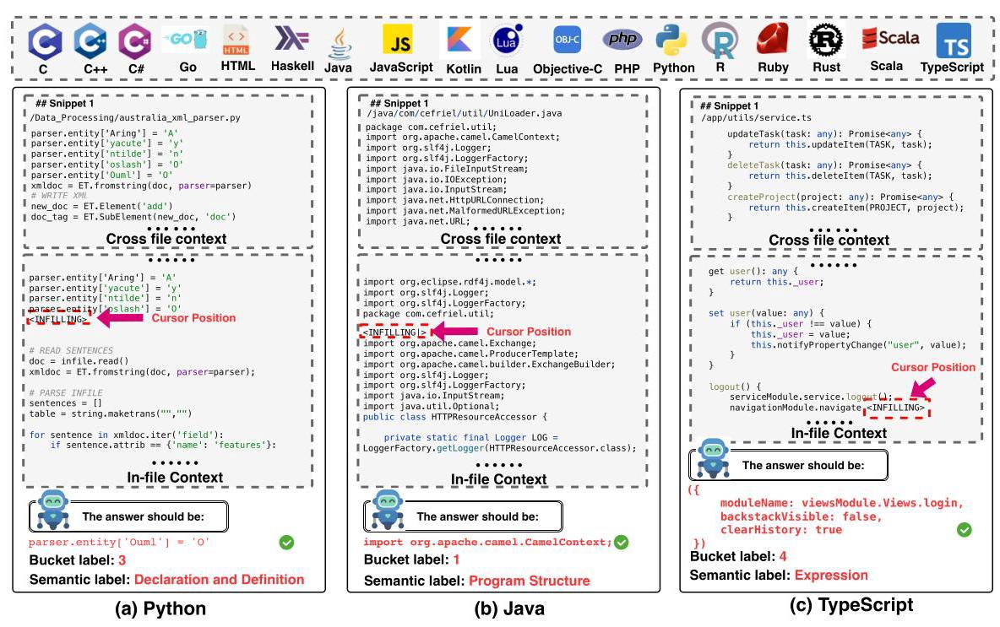

Figure 1: Overview of our proposed \( {\mathrm{M}}^{2}\mathrm{{RC}} \) -EVAL with 18 languages. Specifically, first, we provide three samples from different languages (i.e., Python, Java, TypeScript) for illustration, where the bucket label and semantic label for the corresponding cursor position are provided. Second, the code LLMs need to predict the completion results given the in-file context from the current code file and the cross file context retrieved from other code files in the current repository. Note that "< INFILLING >" denotes that the current position will be triggered for code completion.

Inspired by the multilingual in-file code generation benchmark MultiPL-E Cassano et al. (2022) and McEval (Chai et al. 2024), we create a massively multilingual repository-level code completion Evaluation benchmark called \( {\mathbf{M}}^{2}\mathbf{{RC} - {EVAL}} \) to facilitate the research of the community.

In this paper, as shown in Fig. 1, our \( {\mathrm{M}}^{2}\mathrm{{RC}} \) -EVAL includes 18 programming languages with two types of fine-grained annotations (i.e., bucket-level and semantic-level), where each language contains 100 validation and 500 test samples, respectively. Specifically, for the bucket-level annotations, we first generate abstract syntax tree with \( N \) layers using code parser (i.e., Treesitter \( {}^{1} \) ), and divide these \( N \) into fixed \( M \) buckets, Then, for each completion cursor position, we annotate the corresponding bucket-level label based on the layer to which the location belongs. In this way, we can obtain different code completion scenarios with different difficulties.

For the semantic-level annotations, inspired by (Takerngsaksiri et al., 2024), we first pre-define 11 major semantic labels (e.g., Program Structure, Statement) for each completion cursor position, which aims to analyze the fine-grained performance across different code semantics. Note that as different languages usually have specific syntax, we carefully design the subcategories under each major semantic label for different languages. Then, as the code parser usually provides syntax labels (e.g., functions, variables, classes, empty lines) \( {}^{2} \) for each completion cursor position, we carefully define the mappings between the syntax labels to our designed semantic labels and build the semantic-level annotations for our \( {\mathrm{M}}^{2}\mathrm{{RC}} \) -EVAL. Finally, to enhance the performance of repository-level code completion for existing code LLMs, we also create a massively multilingual instruction corpora \( {\mathbf{M}}^{2}\mathbf{{RC}} \) -INSTRUCT of 18 languages. The contributions are summarized as follows:

- We propose the first massively multilingual repository-level code completion benchmark \( {\mathrm{M}}^{2}\mathrm{{RC}} \) -EVAL covering 18 languages, where two types of annotations (bucket-level and semantic-level labels) are provided based on the parsed abstract syntax tree.

---

https://tree-sitter.github.io/tree-sitter/

\( {}^{2} \) Note that the syntax label provided by code parser (e.g., tree-sitter) are highly detailed.

---

- We introduce \( {\mathrm{M}}^{2}\mathrm{{RC}} \) -INSTRUCT, the massively multilingual repository-level code instruction corpora covering the multilingual code snippet from 18 languages, which can greatly enhance the performance of repository-level code completion results.

- Comprehensive evaluation results and analysis demonstrate the effectiveness of our proposed \( {\mathrm{M}}^{2}\mathrm{{RC}} \) -EVAL and \( {\mathrm{M}}^{2}\mathrm{{RC}} \) -INSTRUCT.

## 2 RELATED WORKS

Code Large Language Models. Code large language models (LLMs) (Chen et al., 2021; Zhao et al., 2024; Black et al., 2021; 2022; Le et al., 2022; Chowdhery et al., 2023; Nijkamp et al., 2023; Fried et al., 2023; Xu et al., 2022) are increasingly involved in modern programming, due to excellent capabilities of code generation (Li et al., 2022; Allal et al., 2023), code repair (Wang et al., 2021; 2023), code translation (Zheng et al., 2023; Li et al., 2023), and other coding tasks. UniCoder (Sun et al. 2024) and SPT-Code (Niu et al. 2022) introduce the pseudo-code generation and the alignment between Abstract Syntax Tree (AST) and code. Recent code LLMs such as Code Llama (Roziere et al., 2023), DeepSeek-Coder (Guo et al., 2024a), and Qwen2.5-Coder (Hui et al., 2024) incorporate the fill-in-the-middle (FIM) task into their training stage for code completion. Moreover, there is a wide variety of in-file benchmarks to evaluate different capabilities of code LLMs (Zheng et al., 2023; Austin et al., 2021; Jain et al., 2024), which focus on a limited range of programming languages (e.g. Python and Java). The recent work (Chai et al., 2024) extends the number of programming languages to 40 for multilingual evaluation scenarios, which has not considered the repository-level code completion.

Repository-level Code Completion. The latest repository-level code completion methods (Bairi et al., 2023; Phan et al., 2024; Liao et al., 2023; Shrivastava et al., 2023a; Agrawal et al., 2023; Shrivastava et al., 2023b, Pei et al., 2023; Zhang et al., 2023) are similar to RAG, aim to precisely retrieve all related code snippets across files within a repository. Further, repository-level benchmarks are proposed to estimate the capability of code LLMs in a more realistic software engineering scenario. But these datasets (Ding et al., 2023; 2022; Allal et al., 2023) are primarily concentrated on several programming languages. Regarding difficulty categorization, most methods only consider the number of files involved in the completion content, overlooking the code's structural and semantic context within the entire project. Repofusion (Shrivastava et al. 2023a) and Repocoder (Zhang et al. 2023) predict one line based on the prefix and suffix code, while CoderEval (Yu et al. 2024) measures how many third-party libraries are called. To comprehensively evaluate the multilingual repository-based code completion of different code LLMs, we push the boundaries of programming languages into 18 languages in \( {\mathrm{M}}^{2}\mathrm{{RC}} \) -EVAL with fine-grained annotations.

## 3 M \( {}^{2} \) RC-EVAL

### 3.1 DATA COLLECTION

The Overall Data Pool. We begin by collecting The Stack v2 (Lozhkov et al. 2024), which consists of permissively licensed repositories from GitHub. Next, we adopt the The-stack-v2-dedup, which includes 784 million source code files spanning 619 programming languages with manual and heuristic pre-processing. Further, we keep only repositories receiving more than 5 stars and containing \( \left\lbrack  {{10},{50}}\right\rbrack \) files. Lastly, preserving files written in 18 common languages, we have 431,353,244 files remaining, constituting the overall data pool.

Completion Cursor Position Selection. Completion cursor position selection significantly impacts the quality of a code completion benchmark. Previous studies (Ding et al. 2024; Liu et al. 2023a) randomly select a segment of consecutive characters as the completion span, which does not guarantee the integrity of identifiers and statements. On the contrary, in \( {\mathrm{M}}^{2}\mathrm{{RC}} \) -EVAL, we first parse the abstract syntax tree (AST) of each source code file, and then we randomly choose a node (e.g., the node of "Function Definition" in Fig. 2) on the AST as the completion cursor position. After that, we obtain the corresponding code to obtain the ground-truth for the current completion cursor position. Finally, at inference, the code LLMs need to predict the current code span given the in-fle and cross file contexts. Similarly, in training, we just use the ground-truth to supervise the tuning process of the code LLMs.

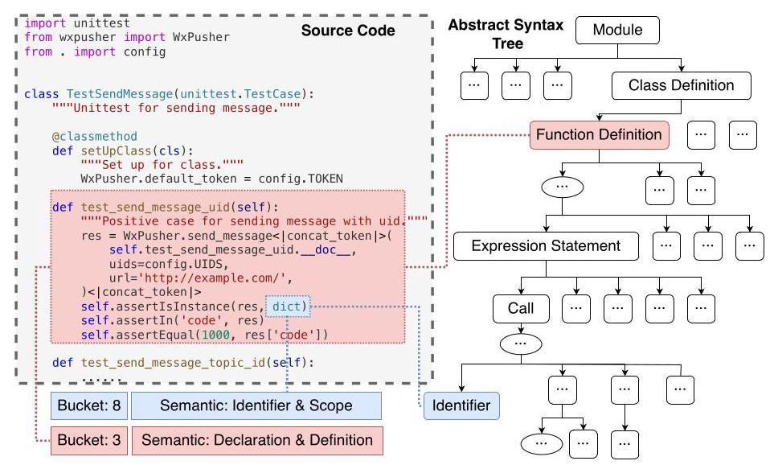

Figure 2: Illustration on generating completion cursor position and fine-grained annotations. Specifically, we first parse the source code into an abstract syntax tree (AST). Then, we choose one node as the completion cursor position and generate the bucket label based on the belonged layer number in AST, and obtain the semantic label based on the node type parsed by the Tree-sitter.

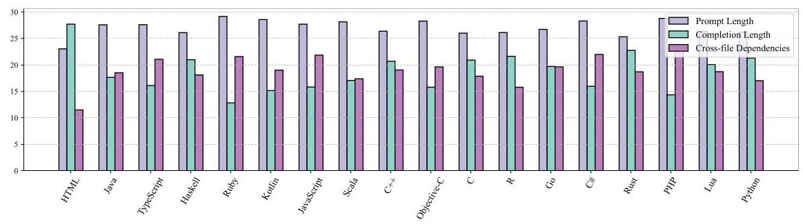

Figure 3: The average prompt length (100x tokens), completion span length (50x tokens), and cross-file dependencies (1x) in the testing set of \( {\mathrm{M}}^{2}\mathrm{{RC}} \) -EVAL. We define the number of other files, which are explicitly imported and implicitly referenced by the current file, as cross-file dependencies.

Table 1: A comparison with existing notable repository-level code completion datasets.

<table><tr><td>Benchmark</td><td>#Languages</td><td>Fine-grained</td><td>Training Set</td><td>#Test Repos</td></tr><tr><td>RepoBench (Liu et al. 2023a)</td><td>2</td><td>✘</td><td>✓</td><td>1669</td></tr><tr><td>CrossCodeEval (Ding et al., 2024)</td><td>4</td><td>✘</td><td>✘</td><td>1002</td></tr><tr><td>\( {\mathrm{R}}^{2}{\mathrm{C}}^{2} \) -Bench (Deng et al.,2024)</td><td>4</td><td>✘</td><td>✓</td><td>1353</td></tr><tr><td>\( {\mathrm{M}}^{2}\mathrm{{RC}} \) -EVAL& \( {\mathrm{M}}^{2}\mathrm{{RC}} \) -INSTRUCT</td><td>18</td><td>✓</td><td>✓</td><td>5993</td></tr></table>

### 3.2 QUALITY CONTROL

We build a suite of post-processing filters to enhance the quality of \( {\mathrm{M}}^{2}\mathrm{{RC}} \) -INSTRUCT. We eliminate examples based on two heuristic rules: (1) The completion cursor position should be no longer than 5 lines. (2) If the completion ground truth is fewer than 20 characters, at least \( {20}\% \) of them should be alphabetic. To improve data independence and inference difficulty, we apply extra filters to the test cases in \( {\mathrm{M}}^{2}\mathrm{{RC}} \) -EVAL. (a) Repositories in \( {\mathrm{M}}^{2}\mathrm{{RC}} \) -EVAL should be absent from \( {\mathrm{M}}^{2}\mathrm{{RC}} \) - INSTRUCT. (b) We ensure that \( {30}\% \) of the completion ground truth is not shorter than 2 lines. (c) The completion cursor position should not be fully white-spaced. (d) We discard test cases that could be exactly predicted by DeepSeekCoder-1.3B (Guo et al. 2024b) without cross file contexts.

### 3.3 DATASET STATISTICS

Following the quality filters in \( \$ \left( {3.2}\right) \) from the overall data pool \( \$ \left( {3.1}\right) \) . We sample 50,000 files per language to construct our \( {\mathrm{M}}^{2}\overline{\mathrm{{RC}}} \) -INSTRUCT, and sample 100, and 500 files per language to build the validation and test sets of our \( {\mathrm{M}}^{2}\mathrm{{RC}} \) -EVAL, respectively. The statistics of the test set are shown in Fig. 3, and we also provide a detailed comparison between our \( {\mathrm{M}}^{2}\mathrm{{RC}} \) -EVAL with existing repository-level code completion datasets in Table 1.

### 3.4 FINE-GRAINED ANNOTATIONS

As shown in Fig. 2, to analyze the performance in a fine-grained manner, we further provide two types of fine-grained annotations (i.e., bucket-level and semantic-level) for each completion cursor. Specifically, we first generate the abstract syntax tree. For the bucket-level annotations, we first simply divide each tree into \( M \) buckets based on the depth degree of the abstract syntax tree. Note that we set \( M \) as 10 in our \( {\mathrm{M}}^{2}\mathrm{{RC}} \) -EVAL. For example, if the number of layers for the current abstract syntax tree is \( N \) , the \( i \) -th layer of the tree belongs to the \( \left\lceil  \frac{i}{N/M}\right\rceil \) bucket. Then, for each completion cursor node, we annotate the bucket label based on the layer number of each node. Similarly, for the semantic-level annotations, we directly annotate the semantic-level label for each completion cursor node. Specifically, we pre-define 11 major classes (i.e., "Program Structure", "Declaration and Definition", "Control Flow Structure", "Expression", "Data Type", "Statement", "Modifier and Attribute", "Comments and Documentation", "Preprocessing Directive", "Identifier and Scope", "Special Language Structure"). Then, as different languages have many specific designs, the subcategories under each major class are carefully annotated for different languages. As shown in Fig. 4, we provide the semantic-level annotations on three main-stream programming languages (Java, Go, Scala), where the annotations on the remained 15 languages are provided in Fig. 14 of the Appendix.

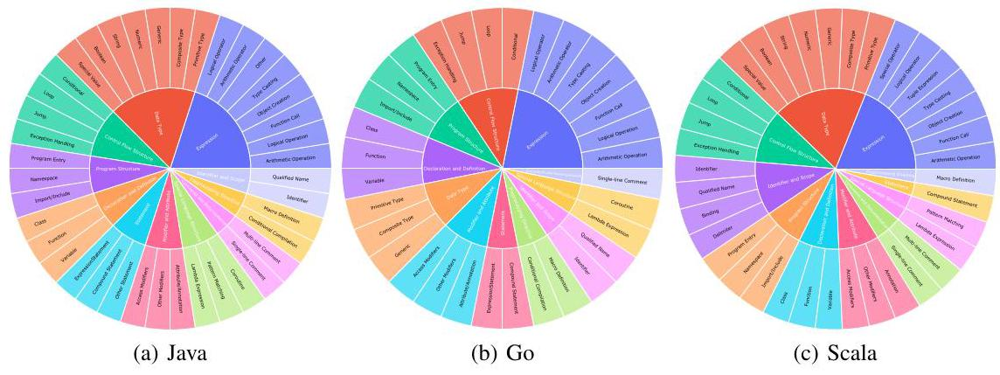

Figure 4: Semantic-level annotations on different types of programming languages.

## 4 EXPERIMENTS

We perform detailed experiments on \( {\mathrm{M}}^{2}\mathrm{{RC}} \) -EVAL with three popular Code LLMs (i.e., StarCoder- 7B (Li et al. 2023), DeepSeekCoder-6.7B (Guo et al. 2024b) and Code Llama-7B (Roziere et al. 2023)) (See Appendix A.3 for more details).

### 4.1 EVALUATION METRICS

Following (Ding et al. 2023), we compare the generated code with the reference and compute the exact match (EM) and edit similarity (ES) metrics, which assesses the textural similarities and ignores semantic structure similarities among predictions and ground-truth.

Table 2: Exact match (%) and edit similarity (%) performance on \( {\mathrm{M}}^{2}\mathrm{{RC}} \) -EVAL.

<table><tr><td rowspan="2">Model</td><td colspan="2">C</td><td colspan="2">C#</td><td colspan="2">C++</td><td colspan="2">\( \mathbf{{Go}} \)</td><td colspan="2">HTML</td><td colspan="2">Haskell</td><td colspan="2">-</td></tr><tr><td>EM</td><td>ES</td><td>EM</td><td>ES</td><td>EM</td><td>ES</td><td>EM</td><td>ES</td><td>EM</td><td>ES</td><td>EM</td><td>ES</td><td>EM</td><td>ES</td></tr><tr><td>Code Llama-7B</td><td>18.6</td><td>47.2</td><td>19.6</td><td>52.6</td><td>21.8</td><td>51.1</td><td>26.0</td><td>53.6</td><td>20.6</td><td>40.4</td><td>22.6</td><td>48.9</td><td>-</td><td>-</td></tr><tr><td>+ Retrieval</td><td>21.8</td><td>47.2</td><td>22.9</td><td>48.9</td><td>23.2</td><td>46.6</td><td>23.8</td><td>52.4</td><td>12.6</td><td>35.6</td><td>22.6</td><td>48.9</td><td>-</td><td>-</td></tr><tr><td>+ Retrieval & Tuning</td><td>45.4</td><td>72.0</td><td>43.5</td><td>72.3</td><td>50.8</td><td>74.9</td><td>43.4</td><td>72.9</td><td>41.8</td><td>63.6</td><td>39.8</td><td>66.3</td><td>-</td><td>-</td></tr><tr><td>StarCoder-7B</td><td>20.0</td><td>50.4</td><td>20.0</td><td>53.3</td><td>22.4</td><td>51.8</td><td>25.4</td><td>58.2</td><td>17.4</td><td>40.7</td><td>25.0</td><td>51.1</td><td>-</td><td>-</td></tr><tr><td>+ Retrieval</td><td>23.8</td><td>47.8</td><td>27.1</td><td>53.2</td><td>24.6</td><td>48.0</td><td>26.0</td><td>53.6</td><td>20.6</td><td>40.4</td><td>25.0</td><td>47.7</td><td>-</td><td>-</td></tr><tr><td>+ Retrieval & Tuning</td><td>47.0</td><td>72.7</td><td>45.1</td><td>74.8</td><td>52.4</td><td>76.3</td><td>43.2</td><td>73.7</td><td>45.8</td><td>67.1</td><td>44.8</td><td>70.2</td><td>-</td><td>-</td></tr><tr><td>DeepSeekCoder-6.7B</td><td>22.4</td><td>53.7</td><td>21.4</td><td>56.2</td><td>23.2</td><td>54.2</td><td>29.4</td><td>61.4</td><td>17.6</td><td>43.4</td><td>25.2</td><td>51.3</td><td>-</td><td>-</td></tr><tr><td>+ Retrieval</td><td>28.2</td><td>52.6</td><td>25.3</td><td>52.6</td><td>27.6</td><td>52.2</td><td>29.4</td><td>61.4</td><td>17.6</td><td>43.4</td><td>25.8</td><td>51.0</td><td>-</td><td>-</td></tr><tr><td>+ Retrieval & Tuning</td><td>48.6</td><td>75.2</td><td>47.9</td><td>76.9</td><td>54.4</td><td>78.2</td><td>48.8</td><td>78.4</td><td>45.0</td><td>66.3</td><td>45.8</td><td>72.0</td><td>-</td><td>-</td></tr><tr><td>Model</td><td colspan="2">Java</td><td colspan="2">JavaScript</td><td colspan="2">Kotlin</td><td colspan="2">\( \mathbf{{Lua}} \)</td><td colspan="2">Objective-C</td><td colspan="2">PHP</td><td colspan="2">-</td></tr><tr><td>Code Llama-7B</td><td>23.4</td><td>58.5</td><td>17.2</td><td>52.0</td><td>23.6</td><td>57.0</td><td>20.0</td><td>45.7</td><td>17.8</td><td>49.5</td><td>19.2</td><td>54.9</td><td>-</td><td>-</td></tr><tr><td>+ Retrieval</td><td>23.4</td><td>57.5</td><td>19.6</td><td>48.0</td><td>20.8</td><td>50.0</td><td>19.6</td><td>42.2</td><td>21.4</td><td>46.6</td><td>21.2</td><td>49.0</td><td>-</td><td>-</td></tr><tr><td>+ Retrieval & Tuning</td><td>41.8</td><td>74.1</td><td>38.8</td><td>70.1</td><td>45.0</td><td>75.6</td><td>43.8</td><td>70.5</td><td>49.8</td><td>75.9</td><td>45.6</td><td>76.7</td><td>-</td><td>-</td></tr><tr><td>StarCoder-7B</td><td>24.0</td><td>59.2</td><td>16.6</td><td>52.0</td><td>24.4</td><td>59.3</td><td>21.4</td><td>48.6</td><td>17.6</td><td>49.6</td><td>18.6</td><td>54.4</td><td>-</td><td>-</td></tr><tr><td>+ Retrieval</td><td>25.0</td><td>53.1</td><td>22.0</td><td>50.8</td><td>22.8</td><td>52.6</td><td>26.4</td><td>48.5</td><td>23.6</td><td>48.0</td><td>18.6</td><td>54.4</td><td>-</td><td>-</td></tr><tr><td>+ Retrieval & Tuning</td><td>47.4</td><td>76.9</td><td>38.8</td><td>70.1</td><td>45.0</td><td>75.6</td><td>43.8</td><td>70.5</td><td>50.8</td><td>75.9</td><td>45.6</td><td>76.7</td><td>-</td><td>-</td></tr><tr><td>DeepSeekCoder-6.7B</td><td>22.2</td><td>61.0</td><td>20.4</td><td>56.5</td><td>26.0</td><td>61.0</td><td>22.0</td><td>48.8</td><td>21.0</td><td>55.6</td><td>24.2</td><td>58.6</td><td>-</td><td>-</td></tr><tr><td>+ Retrieval</td><td>21.6</td><td>51.4</td><td>24.4</td><td>53.6</td><td>26.0</td><td>61.0</td><td>22.0</td><td>49.9</td><td>27.6</td><td>53.5</td><td>28.6</td><td>56.9</td><td>-</td><td>-</td></tr><tr><td>+ Retrieval & Tuning</td><td>48.2</td><td>79.1</td><td>43.6</td><td>73.5</td><td>46.0</td><td>75.7</td><td>44.6</td><td>70.6</td><td>52.2</td><td>77.6</td><td>49.8</td><td>78.8</td><td>-</td><td>-</td></tr><tr><td>Model</td><td colspan="2">Python</td><td colspan="2">\( \mathbf{R} \)</td><td colspan="2">Ruby</td><td colspan="2">Rust</td><td colspan="2">Scala</td><td colspan="2">TypeScript</td><td colspan="2">\( \mathbf{{Avg}.} \)</td></tr><tr><td>Code Llama-7B</td><td>24.6</td><td>54.2</td><td>15.2</td><td>41.2</td><td>17.2</td><td>45.8</td><td>26.2</td><td>56.0</td><td>22.8</td><td>48.5</td><td>23.4</td><td>52.3</td><td>19.4</td><td>50.3</td></tr><tr><td>+ Retrieval</td><td>17.4</td><td>46.4</td><td>15.2</td><td>39.8</td><td>17.2</td><td>42.3</td><td>26.0</td><td>51.3</td><td>22.8</td><td>48.5</td><td>19.4</td><td>48.6</td><td>20.2</td><td>46.1</td></tr><tr><td>+ Retrieval & Tuning</td><td>39.2</td><td>69.9</td><td>38.6</td><td>65.5</td><td>43.0</td><td>68.5</td><td>42.0</td><td>69.2</td><td>41.0</td><td>70.1</td><td>37.0</td><td>68.2</td><td>41.9</td><td>70.0</td></tr><tr><td>StarCoder-7B</td><td>19.4</td><td>52.9</td><td>16.4</td><td>43.7</td><td>19.4</td><td>47.4</td><td>26.2</td><td>56.0</td><td>23.6</td><td>53.4</td><td>19.8</td><td>53.3</td><td>21.0</td><td>52.0</td></tr><tr><td>+ Retrieval</td><td>24.6</td><td>54.2</td><td>22.6</td><td>47.2</td><td>23.6</td><td>47.4</td><td>26.4</td><td>53.5</td><td>22.8</td><td>48.5</td><td>23.4</td><td>52.3</td><td>24.1</td><td>50.0</td></tr><tr><td>+ Retrieval & Tuning</td><td>39.2</td><td>69.9</td><td>41.0</td><td>66.6</td><td>43.0</td><td>68.5</td><td>45.8</td><td>72.6</td><td>43.6</td><td>71.5</td><td>39.2</td><td>69.7</td><td>44.5</td><td>72.2</td></tr><tr><td>DeepSeekCoder-6.7B</td><td>21.8</td><td>55.1</td><td>19.4</td><td>48.5</td><td>23.6</td><td>52.2</td><td>23.8</td><td>54.3</td><td>24.6</td><td>56.7</td><td>19.4</td><td>55.4</td><td>22.6</td><td>54.7</td></tr><tr><td>+ Retrieval</td><td>21.8</td><td>55.1</td><td>19.4</td><td>48.5</td><td>23.6</td><td>52.2</td><td>23.8</td><td>54.3</td><td>22.4</td><td>50.4</td><td>26.0</td><td>54.5</td><td>25.1</td><td>51.7</td></tr><tr><td>+ Retrieval & Tuning</td><td>41.6</td><td>71.3</td><td>45.4</td><td>69.4</td><td>45.6</td><td>70.3</td><td>47.6</td><td>73.4</td><td>44.8</td><td>73.7</td><td>43.2</td><td>73.4</td><td>46.8</td><td>74.1</td></tr></table>

### 4.2 EXPERIMENTAL SETUP

Baseline. Only the original code file, where the cursor position is located, is provided for the code LLMs. As no explicit inter-file context is supplied, the model must utilize its inherent knowledge-based reasoning abilities to generate appropriate code.

+ Retrieval. In line with the approach outlined in CrossCodeEval (Ding et al. 2023), the retrieval process begins by examining files within the same repository. Continuous code segments of \( L \) lines are extracted, where \( L \) matches the length of the retrieval query and is set as 10 by default. Subsequently, these extracted candidates are prioritized based on their Jaccard similarity scores. The most relevant fragments are then appended to the beginning of the in-file context in descending order of similarity. This concatenation continues until the total length, including both the added candidates and the original in-file context, reaches the predetermined maximum token limit of 4096 .

+ Retrieval & Tuning. To further improve the performance of repository-level code completion, we fine-tune code LLMs on the \( {\mathrm{M}}^{2}\mathrm{{RC}} \) -INSTRUCT dataset mentioned in \( § \) (3). At inference, we use the same inference strategy as discussed in "+ Retrieval".

### 4.3 MAIN RESULTS

We present the results on \( {\mathrm{M}}^{2}\mathrm{{RC}} \) -EVAL in Table 2. We observe that different code LLMs have different repository-level code completion abilities for different programming languages. For instance, DeepSeekCoder-6.7B demonstrates strong completion ability for Go, while its performance is weaker with HTML, a markup language, which demonstrates the necessity of evaluating code LLMs for multilingual capabilities. Besides, the results indicate that cross file context is highly effective, resulting in a significant improvement compared to using only in-file context. In particular, the multilingual SFT on our created instruction corpora \( {\mathrm{M}}^{2}\mathrm{{RC}} \) -INSTRUCT also significantly enhances performance on \( {\mathrm{M}}^{2}\mathrm{{RC}} \) -EVAL. Notably, after SFT on \( {\mathrm{M}}^{2}\mathrm{{RC}} \) -INSTRUCT, Code Llama-7B, which originally ranked lowest with in-file context, outperformed the non-finetuned StarCoder-7B, demonstrating the effectiveness of \( {\mathrm{M}}^{2}\mathrm{{RC}} \) -INSTRUCT.

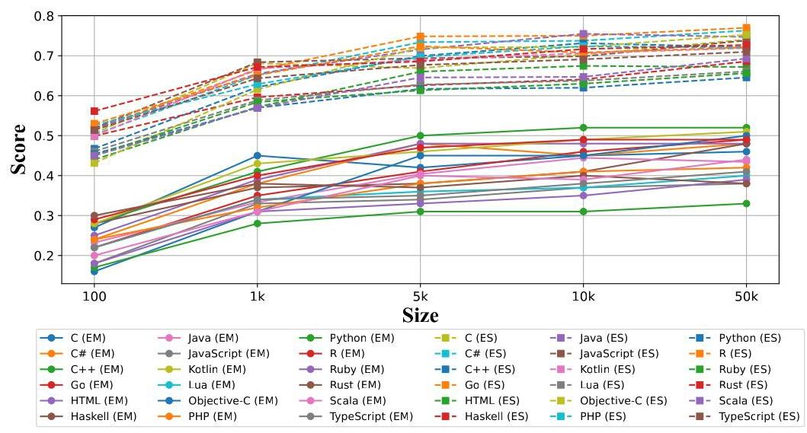

Figure 5: Effectiveness of using different training data sizes.

### 4.4 ANALYSIS

Analysis on different model sizes. In Table 3, we provide the performance of StarCoder with respect to different model sizes in the validation set of \( {\mathrm{M}}^{2}\mathrm{{RC}} \) -EVAL. Notably, StarCoder- 7B consistently outperforms StarCoder-3B under comparable conditions. However, following the application of SFT on \( {\mathrm{M}}^{2}\mathrm{{RC}} \) -INSTRUCT, the results of StarCoder-3B exceed those of the inference-only StarCoder-7B. This finding underscores the effectiveness of our \( {\mathrm{M}}^{2}\mathrm{{RC}} \) - INSTRUCT in augmenting the capabilities of smaller models in repository-level code completion.

Analysis on different training data sizes. In Fig. 5, we conduct a evaluation of the fine-tuned StarCoder-7B by employing varying sizes of \( {\mathrm{M}}^{2}\mathrm{{RC}} \) -INSTRUCT and report the results on validation set \( {\mathrm{M}}^{2}\mathrm{{RC}} \) -EVAL. Our observations indicate that increasing the dataset from \( {0.1}\mathrm{k} \) to \( {50}\mathrm{k} \) samples per language yields improved results. This suggests that more training data can help boost the model's performance. Therefore, we select \( {50}\mathrm{k} \) samples per language as the default training set size for our \( {\mathrm{M}}^{2}\mathrm{{RC}} \) -EVAL.

Table 3: Performance on \( {\mathrm{M}}^{2}\mathrm{{RC}} \) -EVAL.

<table><tr><td rowspan="2">Model</td><td colspan="2">Average</td></tr><tr><td>EM</td><td>ES</td></tr><tr><td>StarCoder-3B</td><td>14.9</td><td>43.5</td></tr><tr><td>+ Retrieval</td><td>14.6</td><td>38.4</td></tr><tr><td>+ Retrieval & Tuning</td><td>41.7</td><td>69.1</td></tr><tr><td>StarCoder-7B</td><td>20.6</td><td>49.9</td></tr><tr><td>+ Retrieval</td><td>23.6</td><td>49.3</td></tr><tr><td>+ Retrieval & Tuning</td><td>44.4</td><td>71.4</td></tr></table>

Analysis on the granularity of different bucket levels. As mentioned in \( §\left( {3.4}\right) \) , we categorize \( {\mathrm{M}}^{2}\mathrm{{RC}} \) -EVAL into ten bucket levels based on the positions of the code requiring completion within the abstract syntax tree. As shown in Fig. 6, we presents the performance of StarCoder- \( 7\mathrm{\;B} \) on the test set of \( {\mathrm{M}}^{2}\mathrm{{RC}} \) -EVAL across these different bucket levels, and we observe that as the bucket level decreases, the performance of StarCoder-7B correspondingly declines, which means that the code completion on the shadow layer is usually more challenging than on the deep layer. For more experimental data on single-language completion performance and its relation to bucket levels, please refer to Fig 11 and Fig 12 in the Appendix. These findings suggest that the code LLMs encounter challenges when addressing shallow nodes within the syntax tree during the code completion process.

Analysis on the granularity of different semantic levels. Similarly, in \( §\left( {3.4}\right) \) , we also categorize the nodes within the abstract syntax tree into eleven primary semantic levels based on their semantic characteristics, and we provide the performance of StarCoder-7B on repository-level code completion for these various semantic levels across multilingual languages on the test set of the \( {\mathrm{M}}^{2} \) RC-EVAL. Notably, we observe significant performance disparities across different semantic levels. Specifically, StarCoder-7B shows superior performance on "Identifier and Scope", while it exhibits lower efficacy on "Special Language Structure", This suggests that current code LLMs are proficient at completing tasks related to variable definitions and references, yet their capacity to handle characteristics of different languages requires further enhancement. For single-language completion performance across various node types, please refer to Fig. 13 in the Appendix.

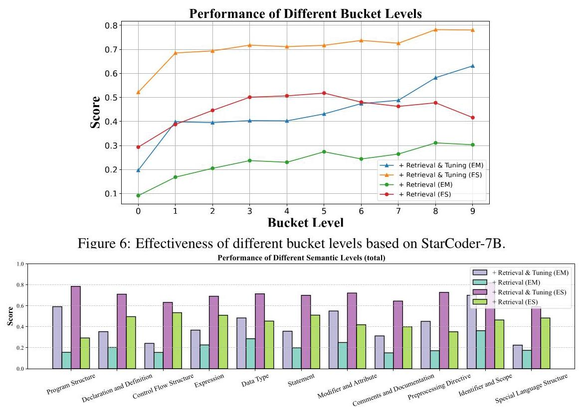

Figure 7: Effectiveness of different semantic levels based on StarCoder-7B.

Analysis on completion on different lines. To explore the differences in the code completion capabilities of code LLMs for varying line counts, we conduct a statistical analysis of the performance of StarCoder-7B ("Retrieval & Tuning") across various completion lengths on the test set of \( {\mathrm{M}}^{2}\mathrm{{RC}} \) -EVAL. As shown in Fig 8. StarCoder-7B can effectively complete tasks involving a small number of lines. However, as the number of lines to be completed increases, the scores of the generated code gradually declines. This indicates that completing multi-line code remains a challenge for code LLMs. For better illustration, we also provide the results of different difficulties for different languages in Fig. 9, where we define completion on 1 line, completion on 2-3 lines and completion on 4-5 lines as easy, middle, and hard settings, respectively.

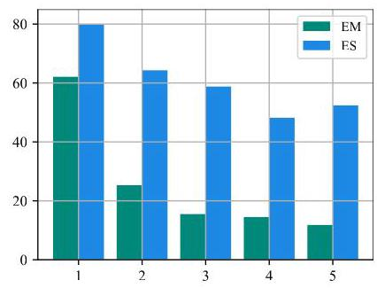

Figure 8: Effectiveness of code completion on different lines based on StarCoder-7B.

Analysis on cross-lingual transfer. We fine-tune the StarCoder-7B model using Python-only data (50k) in \( {\mathrm{M}}^{2}\mathrm{{RC}} \) - INSTRUCT and compare it with the results of using our whole training data. In Table 5, we report the results on the validation set of \( {\mathrm{M}}^{2}\mathrm{{RC}} \) -EVAL, and observe that fine-tuning the model exclusively with Python data resulted in a significant improvement in its \( {\mathrm{M}}^{2}\mathrm{{RC}} \) -EVAL score, coming close to the ES performance achieved through fine-tuning with data from 18 languages. This outcome suggests that the StarCoder-7B base model already demonstrates strong coding proficiency, but lacks robust instruction-following capabilities. Thus, even when fine-tuned solely on Python data, the model is able to effectively transfer instruction-following skills to other languages, thereby achieving exceptional multilingual performance.

Table 4: CodeBLEU results on ten representative programming languages.

<table><tr><td>Model</td><td>C</td><td>C#</td><td>C++</td><td>\( \mathbf{{Go}} \)</td><td>Java</td><td>JavaScript</td><td>PHP</td><td>Python</td><td>Ruby</td><td>Rust</td><td>\( \mathbf{{Avg}.} \)</td></tr><tr><td>StarCoder-7B</td><td>48.3</td><td>48.9</td><td>50.4</td><td>51.5</td><td>50.6</td><td>46.4</td><td>48.2</td><td>46.4</td><td>46.1</td><td>50.4</td><td>48.7</td></tr><tr><td>+ Retrieval</td><td>50.1</td><td>52.3</td><td>51.1</td><td>52.5</td><td>51.4</td><td>49.3</td><td>52.2</td><td>49.3</td><td>49.1</td><td>51.4</td><td>50.9</td></tr><tr><td>+ Retrieval & Tuning</td><td>56.0</td><td>57.4</td><td>57.6</td><td>57.0</td><td>57.6</td><td>54.8</td><td>57.8</td><td>52.0</td><td>52.9</td><td>55.5</td><td>55.9</td></tr></table>

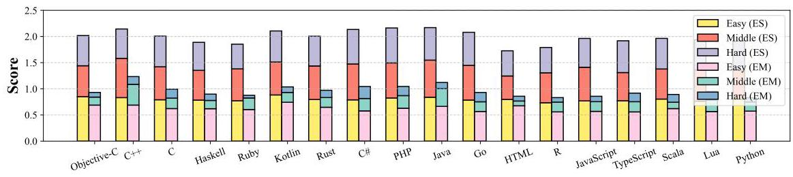

Figure 9: Performance on \( {\mathrm{M}}^{2}\mathrm{{RC}} \) -EVAL for problems of different difficulty levels.

Analysis on CodeBLEU metric. In Table 2, we mainly report the EM and ES metrics based on the textural similarity, which neglects important syntactic and semantic features of codes and underestimates different outputs with the same semantic logic. Thus, the CodeBLEU (Ren et al., 2020) \( {}^{3} \) is proposed, which considers information from not only the shallow match, but also the syntactic match and the semantic match. In Table 4, we report the results of 10 popular programming languages using the test split of \( {\mathrm{M}}^{2}\mathrm{{RC}} \) -EVAL based on the StarCoder-7B model and observe that we can still achieve better performance by fine-tuning on our constructed \( {\mathrm{M}}^{2}\mathrm{{RC}} \) -INSTRUCT, which further demonstrates the effectiveness of our \( {\mathrm{M}}^{2}\mathrm{{RC}} \) -INSTRUCT on repository-level code completion.

Table 5: Performance on \( {\mathrm{M}}^{2}\mathrm{{RC}} \) -EVAL.

<table><tr><td rowspan="2">Model</td><td colspan="2">Average</td></tr><tr><td>EM</td><td>ES</td></tr><tr><td>+ Retrieval</td><td>23.6</td><td>49.3</td></tr><tr><td>+ Retrieval & Tuning</td><td>44.4</td><td>71.4</td></tr><tr><td>+ Retrieval & Tuning (Python Only)</td><td>39.2</td><td>67.9</td></tr></table>

Analysis on various input lengths. As shown in Fig. 10, we report the results produced by StarCoder- 7B ("Retrieval &Tuning") on our \( {\mathrm{M}}^{2}\mathrm{{RC}} \) -EVAL when the input lengths of range in \( \{ {512},{1024},{2048} \) , 4096 tokens. In Fig. 10, we observe that a scaling law exists, where better performance is achieved when the input length is larger. Thus, we set the default input length as 4096 tokens.

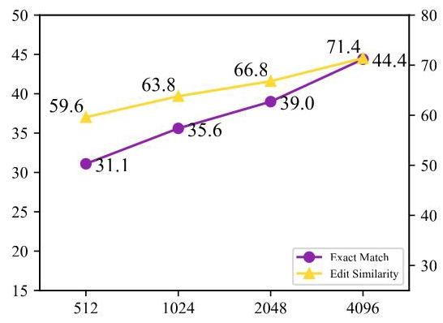

Figure 10: Performance on \( {\mathrm{M}}^{2}\mathrm{{RC}} \) -EVAL with various input lengths based on StarCoder-7B.

## 5 CONCLUSION

In this paper, we propose the first massively multilingual repository-level code completion benchmark ( \( {\mathrm{M}}^{2}\mathrm{{RC}} \) -EVAL) with 18 popular programming languages, where two types of fine-grained annotations (bucket-level and semantic-level) are provided to comprehensively analyze the effectiveness of different code LLMs. Besides, we also curate a high-quality instruction corpus \( {\mathrm{M}}^{2}\mathrm{{RC}} \) -INSTRUCT to enhance the performance of existing models on repository-level code completion. Extensive experimental results and detailed discussions demonstrate the effectiveness of our proposed \( {\mathrm{M}}^{2}\mathrm{{RC}} \) -EVAL and \( {\mathrm{M}}^{2}\mathrm{{RC}} \) -INSTRUCT. Finally, we hope \( {\mathrm{M}}^{2}\mathrm{{RC}} \) -EVAL could guide the developers and researchers to understand the repository-level code completion capabilities of LLMs and facilitate the growth of code intelligence and software engineering.

---

\( {}^{3} \) We test the CodeBLEU metric based on https://github.com/k4black/codebleu

---

## REFERENCES

Lakshya A Agrawal, Aditya Kanade, Navin Goyal, Shuvendu K Lahiri, and Sriram K Rajamani. Guiding language models of code with global context using monitors. 2023.

Loubna Ben Allal, Raymond Li, Denis Kocetkov, Chenghao Mou, Christopher Akiki, Carlos Munoz Ferrandis, Niklas Muennighoff, Mayank Mishra, Alex Gu, Manan Dey, et al. Santacoder: don't reach for the stars! arXiv preprint arXiv:2301.03988, 2023. URL https://arxiv.org/ abs/2301.03988

Jacob Austin, Augustus Odena, Maxwell Nye, Maarten Bosma, Henryk Michalewski, David Dohan, Ellen Jiang, Carrie Cai, Michael Terry, Quoc Le, et al. Program synthesis with large language models. arXiv preprint arXiv:2108.07732, 2021. URL https://arxiv.org/abs/2108.07732

Ramakrishna Bairi, Atharv Sonwane, Aditya Kanade, Arun Iyer, Suresh Parthasarathy, Sriram Raja-mani, B Ashok, Shashank Shet, et al. Codeplan: Repository-level coding using llms and planning. arXiv preprint arXiv:2309.12499, 2023.

Mohammad Bavarian, Heewoo Jun, Nikolas Tezak, John Schulman, Christine McLeavey, Jerry Tworek, and Mark Chen. Efficient training of language models to fill in the middle. arXiv preprint arXiv:2207.14255, 2022a. URL https://arxiv.org/abs/2207.14255.

Mohammad Bavarian, Heewoo Jun, Nikolas Tezak, John Schulman, Christine McLeavey, Jerry Tworek, and Mark Chen. Efficient training of language models to fill in the middle. arXiv preprint arXiv:2207.14255, 2022b.

Sid Black, Leo Gao, Phil Wang, Connor Leahy, and Stella Biderman. GPT-Neo: Large Scale Autoregressive Language Modeling with Mesh-Tensorflow, 2021. URL https://doi.org/10.5281/zenodo.5297715

Sidney Black, Stella Biderman, Eric Hallahan, Quentin Anthony, Leo Gao, Laurence Golding, Horace He, Connor Leahy, Kyle McDonell, Jason Phang, Michael Pieler, Usvsn Sai Prashanth, Shiv-anshu Purohit, Laria Reynolds, Jonathan Tow, Ben Wang, and Samuel Weinbach. GPT-NeoX- 20B: An open-source autoregressive language model. In Proceedings of BigScience Episode #5 - Workshop on Challenges & Perspectives in Creating Large Language Models, pp. 95- 136, virtual+Dublin, 2022. Association for Computational Linguistics. doi: 10.18653/v1/2022. bigscience-1.9. URL https://aclanthology.org/2022.bigscience-1.9

Federico Cassano, John Gouwar, Daniel Nguyen, Sydney Nguyen, Luna Phipps-Costin, Donald Pinckney, Ming-Ho Yee, Yangtian Zi, Carolyn Jane Anderson, Molly Q Feldman, et al. Multipl-e: A scalable and extensible approach to benchmarking neural code generation. arXiv preprint arXiv:2208.08227, 2022.

Linzheng Chai, Shukai Liu, Jian Yang, Yuwei Yin, Ke Jin, Jiaheng Liu, Tao Sun, Ge Zhang, Changyu Ren, Hongcheng Guo, et al. Mceval: Massively multilingual code evaluation. arXiv preprint arXiv:2406.07436, 2024.

Mark Chen, Jerry Tworek, Heewoo Jun, Qiming Yuan, Henrique Ponde de Oliveira Pinto, Jared Kaplan, Harri Edwards, Yuri Burda, Nicholas Joseph, Greg Brockman, et al. Evaluating large language models trained on code. ArXiv preprint, abs/2107.03374, 2021. URL https:// arxiv.org/abs/2107.03374

Aakanksha Chowdhery, Sharan Narang, Jacob Devlin, Maarten Bosma, Gaurav Mishra, Adam Roberts, Paul Barham, Hyung Won Chung, Charles Sutton, Sebastian Gehrmann, et al. Palm: Scaling language modeling with pathways. 24(240):1-113, 2023. CodeGeeX, 2022. https://github.com/THUDM/CodeGeeX

Ken Deng, Jiaheng Liu, He Zhu, Congnan Liu, Jingxin Li, Jiakai Wang, Peng Zhao, Chenchen Zhang, Yanan Wu, Xueqiao Yin, Yuanxing Zhang, Wenbo Su, Bangyu Xiang, Tiezheng Ge, and Bo Zheng. R2c2-coder: Enhancing and benchmarking real-world repository-level code completion abilities of code large language models. ArXiv, abs/2406.01359, 2024.

Yangruibo Ding, Zijian Wang, Wasi Uddin Ahmad, Murali Krishna Ramanathan, Ramesh Nallapati, Parminder Bhatia, Dan Roth, and Bing Xiang. Cocomic: Code completion by jointly modeling in-file and cross-file context. arXiv preprint arXiv:2212.10007, 2022. URL https://arxiv.org/abs/2212.10007

Yangruibo Ding, Zijian Wang, Wasi Uddin Ahmad, Hantian Ding, Ming Tan, Nihal Jain, Mu-rali Krishna Ramanathan, Ramesh Nallapati, Parminder Bhatia, Dan Roth, and Bing Xiang. Crosscodeeval: A diverse and multilingual benchmark for cross-file code completion. In Alice Oh, Tristan Naumann, Amir Globerson, Kate Saenko, Moritz Hardt, and Sergey Levine (eds.), Advances in Neural Information Processing Systems 36: Annual Conference on Neural Information Processing Systems 2023, NeurIPS 2023, New Orleans, LA, USA, December 10 - 16, 2023, 2023. URL http://papers.nips.cc/paper_files/paper/2023/ hash/920f2dced7d32ab2ba2f1970bc306af6-Abstract-Datasets_and_ Benchmarks.html

Yangruibo Ding, Zijian Wang, Wasi Ahmad, Hantian Ding, Ming Tan, Nihal Jain, Murali Krishna Ramanathan, Ramesh Nallapati, Parminder Bhatia, Dan Roth, et al. Crosscodeeval: A diverse and multilingual benchmark for cross-file code completion. Advances in Neural Information Processing Systems, 36, 2024.

Daniel Fried, Armen Aghajanyan, Jessy Lin, Sida Wang, Eric Wallace, Freda Shi, Ruiqi Zhong, Scott Yih, Luke Zettlemoyer, and Mike Lewis. Incoder: A generative model for code infilling and synthesis. In The Eleventh International Conference on Learning Representations, 2023. URL https://openreview.net/forum?id=hQwb-lbM6EL

Daya Guo, Qihao Zhu, Dejian Yang, Zhenda Xie, Kai Dong, Wentao Zhang, Guanting Chen, Xiao Bi, Y Wu, YK Li, et al. Deepseek-coder: When the large language model meets programming-the rise of code intelligence. arXiv preprint arXiv:2401.14196, 2024a. URL https://arxiv.org/abs/2401.14196

Daya Guo, Qihao Zhu, Dejian Yang, Zhenda Xie, Kai Dong, Wentao Zhang, Guanting Chen, Xiao Bi, Y Wu, YK Li, et al. Deepseek-coder: When the large language model meets programming-the rise of code intelligence. arXiv preprint arXiv:2401.14196, 2024b.

Binyuan Hui, Jian Yang, Zeyu Cui, Jiaxi Yang, Dayiheng Liu, Lei Zhang, Tianyu Liu, Jiajun Zhang, Bowen Yu, Kai Dang, et al. Qwen2. 5-coder technical report. arXiv preprint arXiv:2409.12186, 2024.

Naman Jain, King Han, Alex Gu, Wen-Ding Li, Fanjia Yan, Tianjun Zhang, Sida Wang, Armando Solar-Lezama, Koushik Sen, and Ion Stoica. Livecodebench: Holistic and contamination free evaluation of large language models for code. arXiv preprint arXiv:2403.07974, 2024.

Denis Kocetkov, Raymond Li, Loubna Ben Allal, Jia Li, Chenghao Mou, Carlos Muñoz Ferran-dis, Yacine Jernite, Margaret Mitchell, Sean Hughes, Thomas Wolf, et al. The stack: 3 tb of permissively licensed source code. arXiv preprint arXiv:2211.15533, 2022. URL https: //arxiv.org/abs/2211.15533

Hung Le, Yue Wang, Akhilesh Deepak Gotmare, Silvio Savarese, and Steven C. H. Hoi. Coderl: Mastering code generation through pretrained models and deep reinforcement learning. ArXiv, abs/2207.01780, 2022. URL https://api.semanticscholar.org/ CorpusID:250280117

Raymond Li, Loubna Ben Allal, Yangtian Zi, Niklas Muennighoff, Denis Kocetkov, Chenghao Mou, Marc Marone, Christopher Akiki, Jia Li, Jenny Chim, et al. Starcoder: may the source be with you! arXiv preprint arXiv:2305.06161, 2023. URL https://arxiv.org/abs/2305.06161

Yujia Li, David Choi, Junyoung Chung, Nate Kushman, Julian Schrittwieser, Rémi Leblond, Tom Eccles, James Keeling, Felix Gimeno, Agustin Dal Lago, et al. Competition-level code generation with alphacode. ArXiv preprint, abs/2203.07814, 2022. URL https://arxiv.org/abs/ 2203.07814

Dianshu Liao, Shidong Pan, Qing Huang, Xiaoxue Ren, Zhenchang Xing, Huan Jin, and Qinying Li. Context-aware code generation framework for code repositories: Local, global, and third-party library awareness. 2023.

Tianyang Liu, Canwen Xu, and Julian McAuley. Repobench: Benchmarking repository-level code auto-completion systems. arXiv preprint arXiv:2306.03091, 2023a.

Tianyang Liu, Canwen Xu, and Julian J. McAuley. Repobench: Benchmarking repository-level code auto-completion systems. abs/2306.03091, 2023b. doi: 10.48550/ARXIV.2306.03091. URL https://doi.org/10.48550/arXiv.2306.03091

Anton Lozhkov, Raymond Li, Loubna Ben Allal, Federico Cassano, Joel Lamy-Poirier, Nouamane Tazi, Ao Tang, Dmytro Pykhtar, Jiawei Liu, Yuxiang Wei, et al. Starcoder 2 and the stack v2: The next generation. 2024.

Erik Nijkamp, Bo Pang, Hiroaki Hayashi, Lifu Tu, Huan Wang, Yingbo Zhou, Silvio Savarese, and Caiming Xiong. Codegen: An open large language model for code with multi-turn program synthesis. In International Conference on Learning Representations, 2023. URL https:// openreview.net/forum?id=iaYcJKpY2B_

Changan Niu, Chuanyi Li, Vincent Ng, Jidong Ge, LiGuo Huang, and Bin Luo. Spt-code: Sequence-to-sequence pre-training for learning source code representations. 2022 IEEE/ACM 44th International Conference on Software Engineering (ICSE), pp. 01-13, 2022. URL https: //api.semanticscholar.org/CorpusID:246077487

Hengzhi Pei, Jinman Zhao, Leonard Lausen, Sheng Zha, and George Karypis. Better context makes better code language models: A case study on function call argument completion. In Proceedings of the Thirty-Seventh AAAI Conference on Artificial Intelligence and Thirty-Fifth Conference on Innovative Applications of Artificial Intelligence and Thirteenth Symposium on Educational Advances in Artificial Intelligence, AAAI'23/IAAI'23/EAAI'23. AAAI Press, 2023. ISBN 978-1- 57735-880-0. doi: 10.1609/aaai.v37i4.25653. URL https://doi.org/10.1609/aaai.v37i4.25653

Huy Nhat Phan, Hoang N. Phan, Tien N. Nguyen, and Nghi D. Q. Bui. Repohyper: Search-expand-refine on semantic graphs for repository-level code completion. 2024. URL https://api.semanticscholar.org/CorpusID:271860296

Shuo Ren, Daya Guo, Shuai Lu, Long Zhou, Shujie Liu, Duyu Tang, Neel Sundaresan, Ming Zhou, Ambrosio Blanco, and Shuai Ma. Codebleu: a method for automatic evaluation of code synthesis. arXiv preprint arXiv:2009.10297, 2020.

Baptiste Roziere, Jonas Gehring, Fabian Gloeckle, Sten Sootla, Itai Gat, Xiaoqing Ellen Tan, Yossi Adi, Jingyu Liu, Tal Remez, Jérémy Rapin, et al. Code llama: Open foundation models for code. 2023.

Disha Shrivastava, Denis Kocetkov, Harm de Vries, Dzmitry Bahdanau, and Torsten Scholak. Re-pofusion: Training code models to understand your repository. arXiv preprint arXiv:2306.10998, 2023a.

Disha Shrivastava, Hugo Larochelle, and Daniel Tarlow. Repository-level prompt generation for large language models of code. In Andreas Krause, Emma Brunskill, Kyunghyun Cho, Barbara Engelhardt, Sivan Sabato, and Jonathan Scarlett (eds.), Proceedings of the 40th International Conference on Machine Learning, volume 202 of Proceedings of Machine Learning Research, pp. 31693-31715. PMLR, 23-29 Jul 2023b. URL https://proceedings.mlr.press/ v202/shrivastava23a.html

Jianlin Su, Murtadha Ahmed, Yu Lu, Shengfeng Pan, Wen Bo, and Yunfeng Liu. Roformer: Enhanced transformer with rotary position embedding. 568:127063, 2024.

Tao Sun, Linzheng Chai, Yuwei Yin Jian Yang, Hongcheng Guo, Jiaheng Liu, Bing Wang, Liqun Yang, and Zhoujun Li. Unicoder: Scaling code large language model via universal code. ACL, 2024.

Wannita Takerngsaksiri, Chakkrit Tantithamthavorn, and Yuan-Fang Li. Syntax-aware on-the-fly code completion. Inf. Softw. Technol., 165(C), January 2024. ISSN 0950-5849.

Hugo Touvron, Thibaut Lavril, Gautier Izacard, Xavier Martinet, Marie-Anne Lachaux, Timothée Lacroix, Baptiste Rozière, Naman Goyal, Eric Hambro, Faisal Azhar, et al. Llama: Open and efficient foundation language models. 2023.

Yue Wang, Weishi Wang, Shafiq Joty, and Steven C.H. Hoi. CodeT5: Identifier-aware unified pre-trained encoder-decoder models for code understanding and generation. In Proceedings of the 2021 Conference on Empirical Methods in Natural Language Processing, pp. 8696-8708, Online and Punta Cana, Dominican Republic, November 2021. Association for Computational Linguistics. doi: 10.18653/v1/2021.emnlp-main.685. URL https://aclanthology.org/ 2021.emnlp-main.685

Yue Wang, Hung Le, Akhilesh Deepak Gotmare, Nghi DQ Bui, Junnan Li, and Steven CH Hoi. Codet5+: Open code large language models for code understanding and generation. 2023.

Frank F Xu, Uri Alon, Graham Neubig, and Vincent Josua Hellendoorn. A systematic evaluation of large language models of code. In Proceedings of the 6th ACM SIGPLAN International Symposium on Machine Programming, pp. 1-10, 2022.

Hao Yu, Bo Shen, Dezhi Ran, Jiaxin Zhang, Qi Zhang, Yuchi Ma, Guangtai Liang, Ying Li, Qianx-iang Wang, and Tao Xie. Codereval: A benchmark of pragmatic code generation with generative pre-trained models. In Proceedings of the 46th IEEE/ACM International Conference on Software Engineering, pp. 1-12, 2024.

Fengji Zhang, Bei Chen, Yue Zhang, Jin Liu, Daoguang Zan, Yi Mao, Jian-Guang Lou, and Weizhu Chen. Repocoder: Repository-level code completion through iterative retrieval and generation. arXiv preprint arXiv:2303.12570, 2023. URL https://arxiv.org/abs/2303.12570.

CodeGemma Team Heri Zhao, Jeffrey Hui, Joshua Howland, Nam Nguyen, Siqi Zuo, Andrea Hu, Christopher A. Choquette-Choo, Jingyue Shen, Joe Kelley, Kshi tij Bansal, Luke Vilnis, Mateo Wirth, Paul Michel, Peter Choy, Pratik Joshi, Ravin Kumar, Sarmad Hashmi, Shub-ham Agrawal, Zhitao Gong, Jane Fine, Tris Brian Warkentin, Ale Jakse Hartman, Bin Ni, Kathy Korevec, Kelly Schaefer, and Scott Huffman. Codegemma: Open code models based on gemma. ArXiv, abs/2406.11409, 2024. URL https://api.semanticscholar.org/ CorpusID:270560319

Qinkai Zheng, Xiao Xia, Xu Zou, Yuxiao Dong, Shan Wang, Yufei Xue, Zihan Wang, Lei Shen, Andi Wang, Yang Li, Teng Su, Zhilin Yang, and Jie Tang. Codegeex: A pre-trained model for code generation with multilingual evaluations on humaneval-x. arXiv preprint arXiv:2303.17568, abs/2303.17568, 2023. doi: 10.48550/ARXIV.2303.17568. URL https://doi.org/10.48550/arXiv.2303.17568

## A APPENDIX

### A.1 Broader Impacts

In this paper, we propose a repository-level code completion benchmark with 18 programming languages. Therefore, we hope our work can enhance the improvements on the multilingual repository-level code completion task.

### A.2 LIMITATIONS

First, there are several hyperparameters (e.g., training sizes, input length) to tune, which is laborious and expensive. Second, the current work only focuses on the repository-level code completion task, where other repository-level code intelligence tasks are not considered. Third, only textual similarity scores (EM and ES) are used and execution-based evaluation based on test cases is not applied, which may not reflect the performance of different code LLMs well.

### A.3 DETAILS OF THE BASELINE MODELS

StarCoder (Li et al., 2023) is a series of generative language models (e.g., 7B, 15.5B). These decoder-only models are trained on the Stack dataset (Kocetkov et al. 2022) and can support \( 8\mathrm{\;K} \) tokens in context.

DeepSeekCoder (Guo et al., 2024b) is a collection of code-oriented models with capacities from 1.3B to 33B parameters. Trained on a manually curated 2-trillion-token corpus, these models leverage Fill-in-the-Middle (FIM) (Bavarian et al. 2022a) and Rotary Position Embedding (RoPE) (Su et al. 2024) techniques, which enables efficient code generation and infilling within a \( {16}\mathrm{\;K} \) token window.

Code Llama (Roziere et al., 2023) is a family of code large language models based on Llama 2 (Touvron et al., 2023) with 7B, 13B, 34B, and 70B parameters. While trained on 16K token sequences, these models can handle inputs up to \( {100}\mathrm{\;K} \) tokens during inference.

### A.4 DISCUSSION ON NO EXECUTION-BASED EVALUATION

Current datasets for repository-level code completion evaluation, such as CrossCodeEval (Ding et al. 2023) and RepoBench (Liu et al. 2023b), only assess textual similarity between predictions and ground-truth. We hypothesize this limitation stems from several challenges: Firstly, generating comprehensive unit tests for each completion position in a repository is problematic. Single-line completions often fail to construct executable functions, and ensuring adequate test coverage is difficult. Secondly, execution-based evaluation necessitates creating diverse environments for each repository, accommodating various software packages and hardware requirements. This process is intricate and challenging to implement. Thirdly, existing benchmarks with unit tests typically focus on simpler scenarios, like single-file completions or function body generation. Examples include commonly used datasets such as Humaneval CodeGeeX (2022) and MBPP Austin et al. (2021). Despite these obstacles, we recognize the importance of execution-based evaluation for accurately assessing code completion effectiveness, and we will continue to investigate how to evaluate repository-level code completion well.

### A.5 MORE EXPERIMENTS

- We provide the analysis on the bucket levels in Fig. 11 and Fig. 12, respectively.

- We analyze the effect of different semantic levels on Rust, Objective-C and Haskell in Fig. 13, respectively.

- We provide the semantic-level annotations on another 15 languages in Fig. 14.

- We provide the visualization on the completion cases in Fig. 15 and Fig. 16

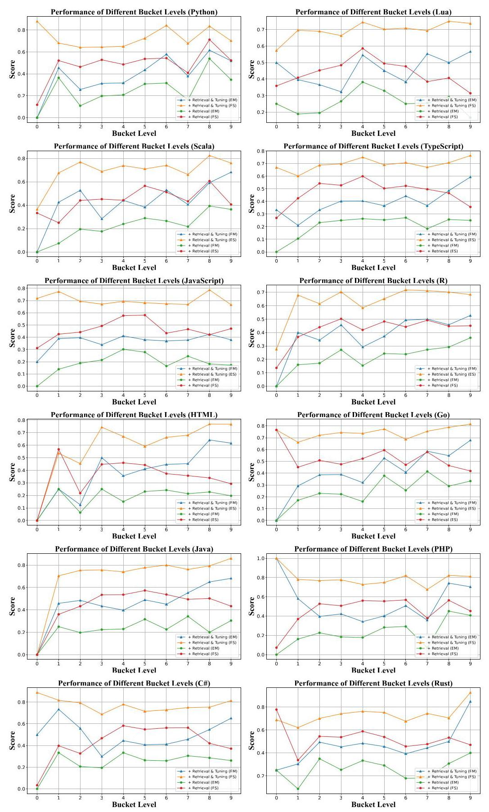

Figure 11: Effectiveness of different bucket levels based on StarCoder-7B for different languages.

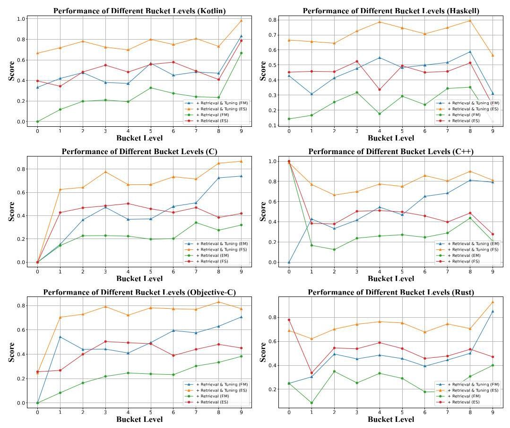

Figure 12: Effectiveness of different bucket levels based on StarCoder-7B for different languages.

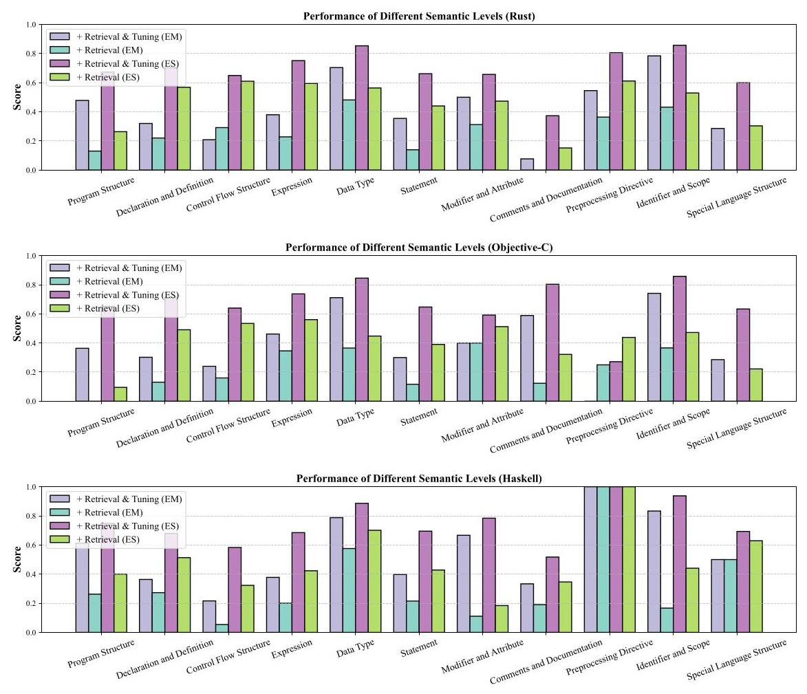

Figure 13: Effectiveness of different semantic levels based on StarCoder-7B.

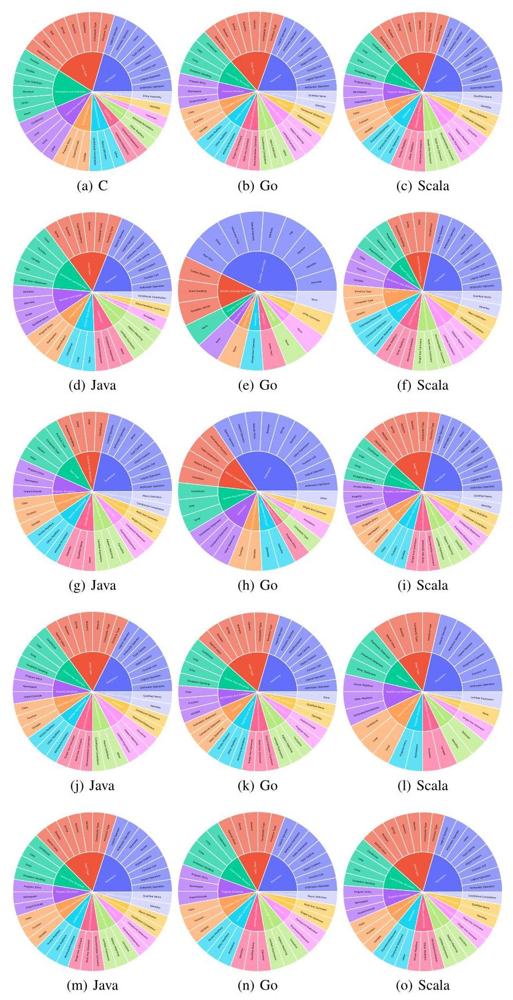

Figure 14: Semantic-level annotations on different types of programming languages. "none" is used if this language does not have corresponding subcategories.

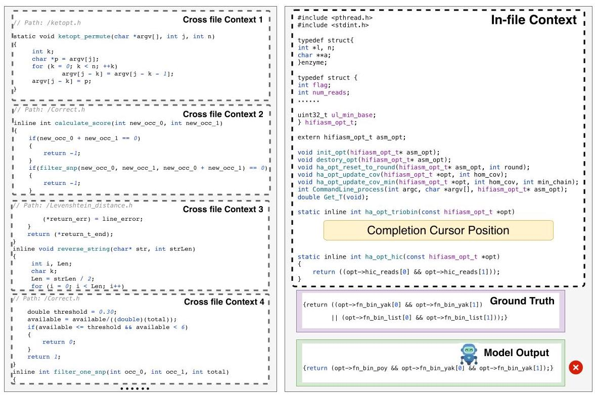

Figure 15: Visualization on failure case for the \( \mathrm{C} \) language.

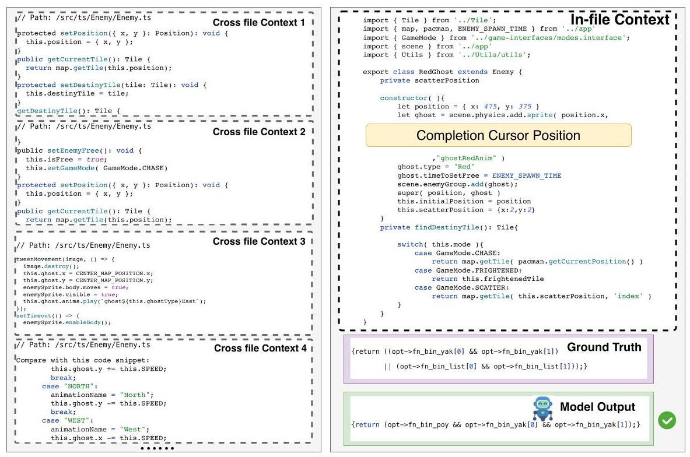

Figure 16: Visualization on success case for the TypeScript language.

