# SuperGPQA: Scaling LLM Evaluation across 285 Graduate Disciplines

M-A-P

ByteDance Seed, 2077.AI

https://supergpqa.github.io/

## Abstract

Large language models (LLMs) have demonstrated remarkable proficiency in mainstream academic disciplines such as mathematics, physics, and computer science. However, human knowledge encompasses over 200 specialized disciplines, far exceeding the scope of existing benchmarks. The capabilities of LLMs in many of these specialized fields-particularly in light industry, agriculture, and service-oriented disciplines-remain inadequately evaluated. To address this gap, we present SuperGPQA, a comprehensive benchmark that evaluates graduate-level knowledge and reasoning capabilities across 285 disciplines. Our benchmark employs a novel Human-LLM collaborative filtering mechanism to eliminate trivial or ambiguous questions through iterative refinement based on both LLM responses and expert feedback. Our experimental results reveal significant room for improvement in the performance of current state-of-the-art LLMs across diverse knowledge domains ( e.g., the reasoning-focused model DeepSeek-R1 achieved the highest accuracy of 61.82% on SuperGPQA), highlighting the considerable gap between current model capabilities and artificial general intelligence. Additionally, we present comprehensive insights from our management of a large-scale annotation process, involving over 80 expert annotators and an interactive Human-LLM collaborative system, offering valuable methodological guidance for future research initiatives of comparable scope.

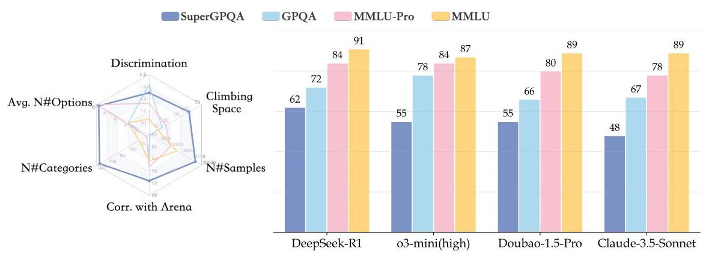

Figure 1. Benchmark Comparison. Left: Radar Chart. Discrimination: The degree of distinction between different models (detailed in Sec. 4.4). Climbing Space: The remaining improvement space for the SOTA models. Corr. with Arena: Correlation with Chatbot Arena Elo scores. Right: Performance comparison of SOTA models across different benchmarks.

## Contents

1 Introduction 4

2 Data Collection 5

2.1 Source Screening 6

2.2 Transcription 8

2.3 Quality Inspection 9

3 Statistics 10

4 Experiments 16

4.1 Baseline Models 16

4.2 Main Results 16

4.3 Further Analysis 20

4.4 Analysis of Disciplinary Discrimination Power 23

5 Related Work 25

5.1 Large Language Models 25

5.2 LLM Benchmarks 25

6 Contributions and Acknowledgements 26

A Difficulty-Stratified Samples 39

B Annotation Tutorial 41

B. 1 Material Requirements 41

B. 2 Annotation Methods 42

B.2.1 Original Transcription Method 42

B.2.2 Non-Choice Conversion Method 43

B.2.3 Statement Combination Method 44

B.2.4 Confusion-options Generation 45

C Data Filtering and Manual Review Process Details 47

C. 1 Rule-Based Pre-Check 47

C. 2 LLM-Based Quality Inspection 48

C.2.1 Validity Check 49

C.2.2 Negative and Extreme Inquiry Detection 50

C.2.3 Multimodal Exclusion 54

C.2.4 Field Relevance Evaluation 54

C.2.5 Completeness Assessment 56

C. 3 Manual Quality Review 58

C. 4 Reasons for Failing Quality Inspection 59

D Quantitative Overview of Disciplines at Three Levels 64

E Detailed Dataset Statistics 66

F Evaluation Prompt 69

F. 1 Zero-shot Prompt 69

F. 2 Five-shot Prompt 69

G Further Experiment Analysis 72

G. 1 Impact of Subfield Information 72

G. 2 Robustness of the Evaluation 73

H Benchmarks for Data Expansion 77

I More Comprehensive Analysis of Baseline Performances 78

J Ranking of the Top Five Models in Each of the 285 Subfields 81

K Detailed Scores of Each Discipline for All Evaluated Models 96

## 1. Introduction

Large language models (LLMs) have greatly changed human life. LLMs are seen as the next technological singularity and proved to surpass human performance in many areas [Phan et al., 2025], significantly improving work efficiency. However, the measurement of LLMs' accessibility on various real-world professionalism remains an unresolved issue, especially in the long-tailed fields with less attention, such as light industry, agriculture, and various service-related disciplines. Many popular benchmarks, such as MMLU [Hendrycks et al., 2020], GPQA [Rein et al., 2023], and MMLU-pro [Wang et al., 2024b], evaluate LLMs' abilities across different fields, while mainly focus on common fields like mathematics, physics, chemistry, biology, and law, limiting these benchmarks' practical significance on many real-world professionalisms. These benchmarks fail to cover the diverse and long-tail knowledge accumulated by humans. Moreover, large language models have achieved very high scores on these benchmarks, making them lose their value as challenging frontiers.

To address the gap, we introduce SuperGPQA, a comprehensive evaluation at the boundaries of human knowledge covering the evaluation of 285 graduate-level disciplines' knowledge and reasoning capacities. SuperGPQA provides at least 50 questions for each graduate-level disciplines to guarantee its accessibility on various real-world professionalism. SuperGPQA is developed by a large-scale human-LLM collaboration system, with crowd-sourcing annotators, experts, and state-of-the-art (SOTA) LLMs participating in, and then verified by a rigorous 3-stage quality inspection process, to guarantee its reliability. Moreover, SuperGPQA is qualified as a challenging frontier for SOTA reasoning LLMs, instruct LLMs, and base LLMs, where the best LLMs (e.g., o1 and Deepseek-R1) only achieve a score of around 60 .

For building SuperGPQA, we propose a large-scale human-LLM collaboration system and share the valuable lessons learned in the paper. We divide the annotation system of SuperGPQA into three major stages: Source Screening, Transcription, and Quality Inspection. During the source screening stage, expert annotators collect credible resources of different disciplines' questions to guarantee the reliability and difficulty of the raw questions. During the transcription stage, crowd-sourcing annotators are asked to revise or translate the raw questions to multiple-choice questions, generate complementary confusion options, and estimate the difficulty and reliability of these questions. Crowd-sourcing annotators estimate the difficulty and reliability of candidate questions based on both expert judgments and the accuracy of LLMs’ responses during the annotation process. Crowd-sourcing annotators, rigorous real-time plagiarism checks with existing candidate questions, and a robust filtering system based on SOTA LLMs are adopted in the transcription stage to reduce the waste of funding and expert manpower. During the quality inspection stage, we adopt a rigorous three-stage quality inspection process:

- We select suspicious candidate questions based on a checklist of LLMs' responses.

- Expert annotators review the suspicious candidate questions with unrestricted access to the web and revise these questions.

- The easy questions are further tailored based on the accuracy of LLMs' responses to guarantee the discrimination of SuperGPQA.

We share several major insights based on the evaluation results of SuperGPQA:

- Reasoning capacities matter. The reasoning models (e.g., DeepSeek-R1, o1-2024- 12-17) achieve the best performance in SuperGPQA.

- Instruction tuning is very helpful. For example, the results(47.40,40.75)of DeepSeek-V3 and Qwen2.5-72B-Instruct are better than the results (32.14, 34.33) of DeepSeek-V3-Base and Qwen2.5-72B a lot, respectively.

- More powerful LLMs lead to more balanced results. On different difficulties. the results of simple, middle, and hard splits of DeepSeek-R1 are 63.59, 63.63, and 56.87. In contrast, the results of easy, middle, and hard splits of Qwen2.5-14B-Instruct are 44.82, 37.90, and 19.97.

- Models are better in newer versions. For example, the results of GPT-4o-2024-11- 20, GPT-4o-2024-08-06, and GPT-4o-2024-05-13 are 44.40, 41.64, and 39.76, respectively.

## 2. Data Collection

We solicit difficult questions from well-educated experts and crowd-sourcing annotators, where we consider experts as individuals having or pursuing a PhD, as in GPQA [Rein et al., 2023], and crowd-sourcing annotators as undergraduates and master students from top-tier Chinese universities, i.e.mainly from Tsinghua University, Peking University, Zhejiang University, Beihang University, and Chinese Academy of Sciences. Figure 2 shows the three major stages of SuperGPQA’s data collection pipeline: Source Screening, Transcription, and Quality Inspection, which are separately detailed in subsection 2.1, subsection 2.2, and subsection 2.3. First, experts select credible resources of different disciplines' questions. Second, crowd, crowd-sourcing annotators revise the raw questions from credible resources to candidate questions. Finally, a rigorous human-LLM collaboration quality inspection process is adopted to select difficult and reliable questions from candidate questions.

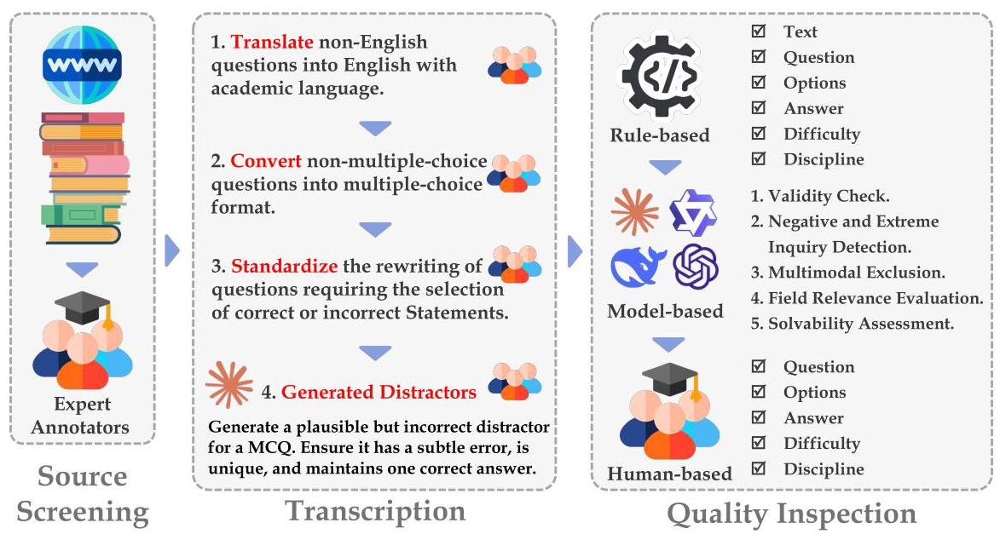

Figure 2. Data Collection Process of SuperGPQA.

### 2.1. Source Screening

## Lessons:

- Crowd-Sourcing Annotators are not capable of collecting credible resources for multiple-choice question annotation with high expertise requirements.

- The questions and answers (QAs) on exercise websites are not always reliable, even sometimes these QAs are claimed verified.

- Multiple-choice questions modified from calculation and reasoning problems usually are more discriminatory than the original multi-choice questions available online.

During the source screening stage, only expert annotators are allowed to collect credible resources of different disciplines' questions to guarantee the reliability and difficulty of the raw questions. In the early stage of collecting candidate questions of SuperGPQA, we trust crowd-sourcing annotators to collect credible resources themselves. However, the candidate questions based on the resources found by the crowd-sourcing annotators are always judged too easy or unreliable by expert annotators. As a result, a significant portion of early funding is wasted on ineffective questions annotated by crowd-sourcing annotators. Additionally, we point out that QAs on exercise websites are not always reliable.

In the early stage of SuperGPQA collection process, some annotators, even expert annotators, trust exercise websites that serve as corroboration of their reasoning process and answers. In the subsequent quality inspection stage, this proved to be a costly mistake, leading us to spend a significant amount of time and cost correcting erroneous answers derived from online exercise websites. Furthermore, we find that many SOTA LLMs, such as GPT-4o, o1-mini, and Gemini-flash, exhibit a high frequency of consistency in both process and answers with the erroneous processes and answers from several online exercise websites. The observations reveal that the reliability of the solutions provided by online exercise websites is limited and there is a significant risk of data leakage.

Expert annotators are asked to provide raw questions from credible resources with screenshots for further annotation in the source screening stage. The screenshot greatly eases the workload of quality inspection. We observe that the efficiency of quality inspection is greatly improved with the provided source screenshot. The priority order for selecting original questions is:

- Example problems with solutions from textbooks.

- Calculation and reasoning-needed questions with solutions from websites.

- Reasoning-needed multiple-choice questions with solutions from websites.

- General multiple-choice questions with solutions from websites.

- Questions only with answers but deemed correct by expert annotators.

A sampled list of credible resources certified by expert annotators is provided in Appendix \( \mathrm{H} \) for reference.

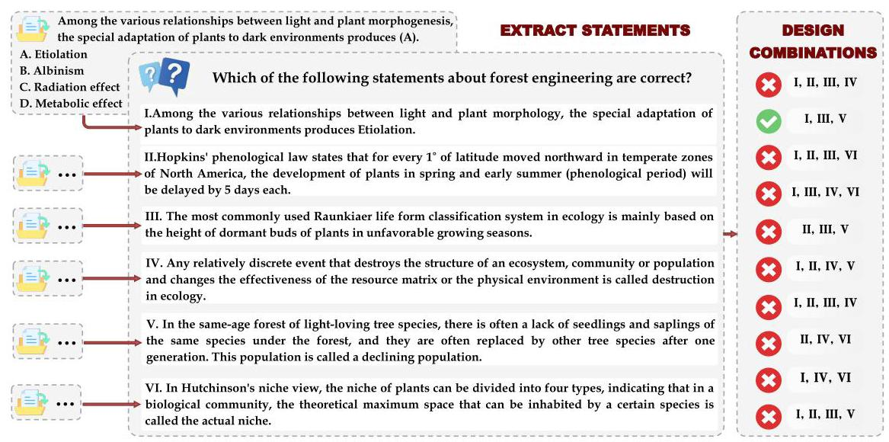

Figure 3. Rewriting Samples of Questions Requiring the Selection of Correct or Incorrect Options.

### 2.2. Transcription

## Lessons:

- Crowd-sourcing annotators have low accuracy in judging generated distrac-tors. For question types like selecting correct or incorrect options, it is easy to generate flawed distractors, requiring unified rewriting at this stage.

During the transcription stage, crowd-sourcing annotators are asked to revise the original questions into candidate questions. Specifically, the following operations are performed:

- Translate non-English questions into English with academic language.

- Convert non-multiple-choice questions into multiple-choice format.

- Standardize the rewriting of questions requiring the selection of correct or incorrect statements, as shown in Figure 3.

- Include region-specific information where necessary, such as specifying the country for laws mentioned in the questions, except for universally accepted rules.

The questions requiring the selection of correct or incorrect statements must be standardized as shown in Figure 3. Because we notice that even SOTA LLMs, e.g. Claude-3.5- Sonnet, GPT-4o-0806, suffer from generating correct suitable confounders for questions requiring the selection of correct or incorrect statements. The full transcription tutorial is provided in Appendix B.

### 2.3. Quality Inspection

Lessons:

- Questions where LLMs choose the same incorrect option are highly suspicious.

- Cases where multiple or all SOTA LLMs make the same error often indicate that the LLMs have memorized explanations from incorrect exercise websites, based on SOTA LLMs' responses.

We refer to the data quality inspection and filtering methods used in LIME and MMLU-Redux Zhu et al. [2024], Gema et al. [2024], Wu et al. [2024], etc. The quality inspection process consists of three substages: Rule-based Quality Inspection, LLM-based Quality Inspection, and Expert-based Quality Inspection.

Candidate questions with clear formatting issues are identified and filtered out by rule-based quality inspection. The full checklist of rule-based quality inspection refers to subsection C.1. We then adopt several SOTA LLMs to generate responses and additional tags to these reserved candidate questions. LLM-based quality inspection includes validity checks, negative and extreme inquiry detection, multimodal exclusion, field relevance evaluation, completeness assessment, and discrimination tagging based on SOTA LLMs' responses. It provides an estimation of not only the correctness but also the discrimination of the candidate questions. Finally, we ask the expert annotators to re-annotate the suspicious candidate questions. The checklist for selecting suspicious candidate questions refer to subsection C.2. We adopt GPT-4o-2024-08-06, Gemini-2.0-flash, Doubao-1.5-pro-32k-250115, Claude-3.5-Sonnet, DeepSeek-R1, QwQ, Qwen-2.5-72B-Instruct as SOTA LLMs for selecting suspicious candidate questions. During the re-annotation process, following the rules stated in GPQA [Rein et al., 2023], expert annotators are asked to review and solve the given candidate questions with unrestricted access to the web. They spend over 30 minutes on each candidate question according to the post-annotation interview. The tutorial for manual quality review refers to subsection C.3.

## 3. Statistics

<table><tr><td rowspan="2">Discipline</td><td rowspan="2">#Num.</td><td colspan="3">Question #Tokens</td><td colspan="3">Answer #Tokens</td><td colspan="2">Options</td><td rowspan="2">Cal. Rate</td></tr><tr><td>Max</td><td>Min</td><td>Avg</td><td>Max</td><td>Min</td><td>Avg</td><td>#Num.</td><td>#Tokens</td></tr><tr><td>Engineering</td><td>7892</td><td>715</td><td>4</td><td>67.26</td><td>352</td><td>1</td><td>13.86</td><td>9.76</td><td>13.67</td><td>55.40%</td></tr><tr><td>Medicine</td><td>2755</td><td>447</td><td>4</td><td>39.06</td><td>89</td><td>1</td><td>7.57</td><td>9.67</td><td>7.38</td><td>3.34%</td></tr><tr><td>Science</td><td>9838</td><td>623</td><td>5</td><td>69.77</td><td>372</td><td>1</td><td>16.89</td><td>9.71</td><td>16.75</td><td>66.34%</td></tr><tr><td>Philosophy</td><td>347</td><td>573</td><td>5</td><td>44.63</td><td>71</td><td>1</td><td>8.93</td><td>9.63</td><td>8.42</td><td>0.29%</td></tr><tr><td>Military Science</td><td>205</td><td>336</td><td>7</td><td>30.03</td><td>50</td><td>1</td><td>6.76</td><td>9.29</td><td>6.40</td><td>3.41%</td></tr><tr><td>Economics</td><td>314</td><td>314</td><td>5</td><td>36.15</td><td>98</td><td>1</td><td>7.85</td><td>9.86</td><td>7.12</td><td>20.50%</td></tr><tr><td>Management</td><td>501</td><td>308</td><td>7</td><td>41.87</td><td>217</td><td>1</td><td>7.77</td><td>9.72</td><td>6.62</td><td>3.79%</td></tr><tr><td>Sociology</td><td>143</td><td>107</td><td>6</td><td>25.31</td><td>75</td><td>1</td><td>7.34</td><td>9.87</td><td>6.91</td><td>2.10%</td></tr><tr><td>Literature</td><td>1676</td><td>869</td><td>5</td><td>35.80</td><td>88</td><td>1</td><td>6.82</td><td>8.78</td><td>6.75</td><td>0.60%</td></tr><tr><td>History</td><td>674</td><td>539</td><td>6</td><td>28.38</td><td>125</td><td>1</td><td>5.32</td><td>9.64</td><td>5.49</td><td>1.04%</td></tr><tr><td>Agriculture</td><td>485</td><td>331</td><td>7</td><td>27.25</td><td>33</td><td>1</td><td>5.32</td><td>9.91</td><td>5.24</td><td>1.44%</td></tr><tr><td>Law</td><td>656</td><td>560</td><td>6</td><td>66.38</td><td>89</td><td>1</td><td>12.17</td><td>9.73</td><td>11.45</td><td>0.46%</td></tr><tr><td>Education</td><td>484</td><td>173</td><td>7</td><td>23.35</td><td>37</td><td>1</td><td>5.74</td><td>9.78</td><td>5.39</td><td>0.41%</td></tr><tr><td>Overall</td><td>26529</td><td>869</td><td>4</td><td>58.42</td><td>372</td><td>1</td><td>12.86</td><td>9.67</td><td>12.64</td><td>42.33%</td></tr></table>

Table 1. Statistics of SuperGPQA. Tokens are calculated with Tiktoken using cl100k_base encoding.

We propose SuperGPQA, designed as a comprehensive benchmark to probe the upper bounds of state-of-the-art Large Language Models' capabilities. With 26,529 questions spanning 13 disciplines, 72 fields, and 285 subfields, it substantially surpasses existing benchmarks in both scale and taxonomic depth. Compared to similar "hard" benchmarks such as GPQA (448 questions) and MMLU-Pro (12,032 questions), SuperGPQA not only contains a larger question pool but also features a more challenging format with an average of 9.67 options per question, significantly higher than the conventional 4-option format (e.g., MMLU).

Comprehensiveness and Discrimination. As revealed in Table 1, the distribution of questions across disciplines reveals a notable concentration in STEM fields, with Science (9,838 questions), Engineering (7,892 questions), and Medicine (2,755 questions) collectively accounting for \( {77.2}\% \) of the benchmark. While this distribution might appear uneven at first glance, it emerges from our rigorous question collection and validation process. During the data annotation phase, we source a comparable number of reference books for 285 subfields (the subfields are detailed in Table 2 and Table 3). Note that we also use some open-source datasets for supplementation of SuperGPQA in Appendix H. However, the STEM disciplines yielded more questions meeting our stringent quality and difficulty criteria aforementioned in section 2 , where the questions and options are filtered through rigorous rule-based, model-based and human-based pipeline. This natural emergence of STEM-heavy distribution aligns with the benchmark's goal of probing LLMs' upper-bound capabilities in complex reasoning tasks. Despite the relatively smaller representation of non-STEM disciplines (e.g., Philosophy: 347, Literature: 1,676 , History: 674 questions), our experiments demonstrate that these subsets effectively discriminate various SOTA LLMs' performance levels (detailed in subsection 4.2). This once again validates the discriminative power of our benchmark across all domains, regardless of sample size.

<table><tr><td>Discipline Instrument Science and Technology(50) : Instr. Sci. & Tech. Materials Science and Engineering(289) : Mater. Phys. & Chem.; Mater. Proc. Eng Mechanical Engineering(176) : Manuf. Autom.; Mechatron. Eng. Mechanics(908) : Fund. of Dyn. & Control; Rigid Body Mech.; Solid Mech.; Theor. Fluid Mech.; Theor. Mech Metallurgical Engineering(255) : Iron & Steel Metall.; Non-fer. Metall.; Phys. Chem. of Metall. Proc.; Princip. of Metall. Mining Engineering(100) : Mineral Proc. Eng.; Mining & Safety Eng. Naval Architecture and Ocean Engineering(138) : Marine Eng.; Ship Mech. & Design Prin. Nuclear Science and Technology(107) : Nuc. Energy & React. Tech.; Radiation Prot. & Nuclear Tech. Appl. Optical Engineering(376) : Applied Opt.; Laser Tech.; Optoelect. Tech.; Theor. Opt. Petroleum and Natural Gas Engineering(112) : Oil & Gas Field Dev. & Stor. & Trans. Eng.; Poromech. & Res. Phys. Power Engineering and Engineering Thermophysics(684) : Eng. Fluid Mech.; Eng. Thermophys.; Fluid Mach. & Eng.; Heat Trans.; Internal Comb. Eng.; Power Mach. & Eng.; Refrig. & Cryogen. Eng.; Thermal Energy Eng. Surveying and Mapping Science and Technology(168) : Carto. & Geo. Info. Eng.; Dig. Survey. & Remote Sens. Appl.; Geodesy & Survey. Eng. Textile Science and Engineering(100) : Text. Chem. & Dyeing Eng.; Text. Mater. Sci. Transportation Engineering(251) : Road & Rail. Eng.; Traffic Info. Eng. & Control; Transp. Plan. & Manag.; Vehicle Oper. Eng. Weapon Science and Technology(100) : Mil. Chem. & Pyro.; Weapon Syst. Sci. & Eng.</td><td>Field : Subfield</td></tr><tr><td>Agronomy(485)</td><td>Animal Husbandry(103) : Animal Nut. & Feed Sci.; Animal Rear. & Breed. Aquaculture(56) : Aquacult. Crop Science(145) : Crop Sci. Forestry(131) : Forest Cult. & Gen. Breed.; Landsc. Plants & Orn. Hort. Veterinary Medicine(50) : Vet. Med.</td></tr><tr><td>\( \mathrm{{Economics}}\left( {873}\right) \)</td><td>Applied Economics(723) : Econ. Stats.; Fin.; Indus. Econ.; Int. Trade; Labor Econ.; Nat. & Def. Econ.; Pub. Fin.; Quant. Econ. Theoretical Economics(150) : Econ. Hist.; Pol. Econ.; West. Econ.</td></tr><tr><td>Education(484) Engineering(7892)</td><td>Education(247) : Edu. Tech. & Prin.; Presch. Edu.; Spec. Edu.; Theory of Curric. & Instr. Physical Education(150) : Phys. Edu. & Train.; Sports Hum. & Socio.; Sports Sci. & Med. Psychology(87) : Psychol Aeronautical and Astronautical Science and Technology(119) : Aeronaut. & Astronaut. Sci. & Tech. Agricultural Engineering(104) : Agric. Environ. & Soil-Water Eng.; Agric. Mech. Eng. Architecture(162) : Arch. Design & Theory; Arch. Hist.; Urban Plan. & Design Chemical Engineering and Technology(410) : Chem. Transport Eng.; Elem. of Chem. Rea Fluid Flow & Heat Transfer in Chem. Eng.; Mass Trans. & Sep. Process in Chem. Eng. Civil Engineering(358) : Bridge & Tunnel Eng.; Geotech. Eng.; Struct. Eng.; Urban Infra. Eng Computer Science and Technology(763) : Adv. Prog. Lang.; Comp. Arch.; Comp. Net.; Comp. Soft. & Theory; Data Struc.; Databases; Formal Lang.; Oper. Sys.; Pattern Recog.; Princip. of Comp. Org. Control Science and Engineering(190) : Control Theory & Eng.; Guid. Nav. & Control; Oper. Res. & Cyber. Electrical Engineering(556) : Elect. Theory & New Tech.; High Volt. & Insul. Tech.; Power Elec. & Elec. Drives; Power Sys. & Autom. Electronic Science and Technology(246) : Circuits & Sys.; Electromag. Field & Microwave Tech.; Microelect. & Solid-State Elec. Environmental Science and Engineering(189) : Environ. Eng.; Environ. Sci.; Environ. & Res. Protect. Food Science and Engineering(109) : Food Biochem.; Food Proc. & Stor. Eng. Forestry Engineering(100) : Forest Eng.; Wood Sci. & Tech. Geological Resources and Geological Engineering(50) : Geol. Res. & Geol. Eng. Hydraulic Engineering(218) : Hydraul. & Hydrol.; Water Cons. & Hydropower Eng Information and Communication Engineering(504) : Antenna & Radio Comm.; Comm. Prin.; Comm. & Info. Sys.; Optical Fiber Comm.; Signal & Info. Proc.</td></tr><tr><td>History(674)</td><td>History(674) : Archaeol. & Museol.; Hist. Geo.; World Hist.</td></tr></table>

Table 2. The Disciplinary Categories of SuperGPQA (1/2).

<table><tr><td>Discipline</td><td>Field : Subfield</td></tr><tr><td>Law(656)</td><td>Law(591) : Civil & Comm. Law; Const. & Admin. Law; Contract Law; Crim. Law; Int. Law; Law & Soc. Gov.; Legal Theory & Hist.; Mil. Law; Proced. Law Political Science(65) : Pol. Sci.</td></tr><tr><td>Literature and Arts(1676)</td><td>Art Studies(603) : Broad. & TV Art; Dance Stud.; Design Arts; Drama & Opera Stud.; Film Stud.; Fine Arts Journalism and Communication(207) : Comm. & Broad.; Hist. & Theory of Jour. & Media Mngmt.; Jour. & News Prac. Language and Literature(440) : Class. Chinese Lit.; Fr. Lang. & Lit.; Ling. & Appl. Ling.; Lit. Hist.; Lit. Theory; Mod. & Cont. Chinese Lit.; Phil. & Bib.; Russ. Lang. & Lit. Musicology(426) : Comp.; Harm.; Instr. & Perf.; Music Hist., Ed. & Tech.; Music Forms & Anal.; Pitch & Scales</td></tr><tr><td>\( \mathrm{\mathbf{{Management}}}\left( {501}\right) \)</td><td>Business Administration(142) : Bus. & Acct. Mngmt.; Tour. Mngmt. & Tech. Econ. Mngmt. Library, Information and Archival Management(150) : Info. Mngmt. Sci.; Info. Mngmt. & Comm.; Lib. & Arch. Sci. Management Science and Engineering(58) : Mngmt. Sci. & Eng. Public Administration(151) : Ed. Econ., Mngmt. & Soc. Sec.; Land Res. Mngmt. & Admin. Mngmt.; Soc. Med. & Health Mngmt.</td></tr><tr><td>Medicine(2755)</td><td>Basic Medicine(567) : For. Med.; Hum. Anat. & Hist.-Emb.; Immun.; Path. Biol.; Pathol. & Pathophys.; Rad. Med. Clinical Medicine(1218) : Anesth.; Clin. Lab. Diagn.; Derm. & Ven.; Emerg. Med.; Geriat. Med.; Imag. & Nucl. Med.; Intern. Med.; Neurol.; Nurs. & Rehabil. Med.; Obst. & Gyneco.; Oncol.; Ophth.; Oto. & Rhinol.; Pediatr.; Psych. & Ment. Health; Surg. Pharmacy(278) : Medic. Chem.; Microbiol. & Biochem. Pharm.; Pharm. Anal.; Pharmaceut.; Pharmacol. Public Health and Preventive Medicine(292) : Epidemiol. & Health Stats.; Health Tox. & Envir. Health; Matern., Child & Adol. Health; Nutr. & Food Hyg. Stomatology(132) \( : \) Basic Stom.; Clin. Stom. Traditional Chinese Medicine(268) : Trad. Chin. Health Pres.; Trad. Chin. Med. Theory; Trad. Chin. Pharm.</td></tr><tr><td>Military Science(205)</td><td>Military Science(205) : Mil. Command & Info. Systems; Mil. Logistics & Equip.; Mil. Mngmt.; Mil. Thought & Hist.</td></tr><tr><td>Philosophy(347)</td><td>Philosophy(347) : Ethics; Logic; Phil. Aesth.; Phil. of Sci. & Tech.; Relig. Stud.</td></tr><tr><td>Science(9838)</td><td>Astronomy(405) : Astron. Obs. & Tech.; Astrophys.; Cosmology; Solar Sys. Sci.; Stell. & Interst. Evol. Atmospheric Science(203) : Atm. Phys. & Envir.; Dyn. Meteorol.; Meteorol. Biology(1120) : Biochem. & Mol. Biol.; Biophys.; Botany; Cell Biol.; Ecol.; Genet.; Microbiol.; Physiol.; Zool. Chemistry(1769) : Analyt. Chem.; Electrochem.; Inorg. Chem.; Org. Chem.; Phys. Chem.; Polym. Chem. & Phys.; Radiochem. Geography(133) : Hum. Geogr.; Phys. Geogr. Geology(341) : Geochem.; Miner., Petrol. & Econ. Geol.; Paleontol. & Stratig.; Prin. of Seism. Expl.; Struct. Geol. Geophysics(100) : Solid Earth Geophys.; Space Phys. Mathematics(2622) : Adv. Algebra; Combinat. Math.; Comput. Math.; Crypt.; Discr. Math.; Func. of Complex Vars.; Func. of Real Vars.; Fund. Math.; Fuzzy Math.; Geo. & Topol.; Graph Theory; Group Theory; Math. Anal.; Num. Theory; Num. Anal.; Ord. Diff. Eq.; Poly. & Ser. Exp.; Prob. & Stats.; Spec. Num. Theory; Stoch. Proc. Oceanography(200) : Hydrogeol.; Marine Biol.; Marine Chem.; Underwater Acou. Physical Oceanography(50) : Phys. Oceanogr. Physics(2845) : Acou.; Atom. & Mol. Phys.; Electrodyn.; Fluid Phys.; Part. & Nucl. Phys.; Polym. Phys.; Quant. Mech.; Relativity; Semicond. Phys.; Solid State Phys.; Stat. Mech.; Subatom. & Atom. Phys.; Thermodyn.; Thermo. & Stat. Phys. Systems Science(50) \( : \) Sys. Sci.</td></tr><tr><td>Sociology(143)</td><td>Sociology(143) : Demo. & Anthrop.; Soc. & Folklore Studies</td></tr></table>

Table 3. The Disciplinary Categories of SuperGPQA (2/2).

Difficulty. The difficulty distribution across disciplines (Table 4) reveals varying levels of complexity. In STEM fields, we observe a more balanced distribution of difficulty levels. For instance, Engineering questions are distributed as 31.1% hard, 43.9% middle, and 25.0% easy, while Science shows 42.8% hard, 42.0% middle, and 15.2% easy. Non-STEM disciplines generally show a different pattern, with a higher proportion of easy and middle-difficulty questions. Notably, 42.33% of all questions require mathematical calculations or formal reasoning, with Science (66.34%) and Engineering (55.40%) showing the highest calculation rates.

<table><tr><td>Difficulty</td><td>Agro.</td><td>Econ.</td><td>Edu.</td><td>Eng.</td><td>Hist.</td><td>Law</td><td>Lit. & Arts</td><td>Mgmt.</td><td>Med.</td><td>Military Sci.</td><td>Phil.</td><td>Sci.</td><td>Socio.</td></tr><tr><td>Hard (#N)</td><td>7</td><td>47</td><td>1</td><td>2458</td><td>3</td><td>57</td><td>12</td><td>6</td><td>217</td><td>4</td><td>27</td><td>4210</td><td>1</td></tr><tr><td>Hard (%)</td><td>1.4</td><td>5.4</td><td>0.2</td><td>31.1</td><td>0.4</td><td>8.7</td><td>0.7</td><td>1.2</td><td>7.9</td><td>2.0</td><td>7.8</td><td>42.8</td><td>0.7</td></tr><tr><td>Middle (#N)</td><td>219</td><td>565</td><td>179</td><td>3462</td><td>180</td><td>343</td><td>496</td><td>236</td><td>1629</td><td>78</td><td>183</td><td>4133</td><td>45</td></tr><tr><td>Middle (%)</td><td>45.2</td><td>64.7</td><td>37.0</td><td>43.9</td><td>26.7</td><td>52.3</td><td>29.6</td><td>47.1</td><td>59.1</td><td>38.0</td><td>52.7</td><td>42.0</td><td>31.5</td></tr><tr><td>Easy (#N)</td><td>259</td><td>261</td><td>304</td><td>1972</td><td>491</td><td>256</td><td>1168</td><td>259</td><td>909</td><td>123</td><td>137</td><td>1495</td><td>97</td></tr><tr><td>Easy (%)</td><td>53.4</td><td>29.9</td><td>62.8</td><td>25.0</td><td>72.8</td><td>39.0</td><td>69.7</td><td>51.7</td><td>33.0</td><td>60.0</td><td>39.5</td><td>15.2</td><td>67.8</td></tr><tr><td>Total</td><td>485</td><td>873</td><td>484</td><td>7892</td><td>674</td><td>656</td><td>1676</td><td>501</td><td>2755</td><td>205</td><td>347</td><td>9838</td><td>143</td></tr></table>

Table 4. Distribution of Difficulty Levels Across Disciplines. "#N" denotes the number of samples.

Sentence Length. Question and answer length analysis reveals substantial variation across disciplines. The average question length is 58.42 tokens, with Literature questions showing the highest maximum length (869 tokens) and Engineering questions averaging 67.26 tokens. The "answer" options maintain a length pattern similar to the general options across different disciplines, averaging 12.86 tokens per option. Such a consistent

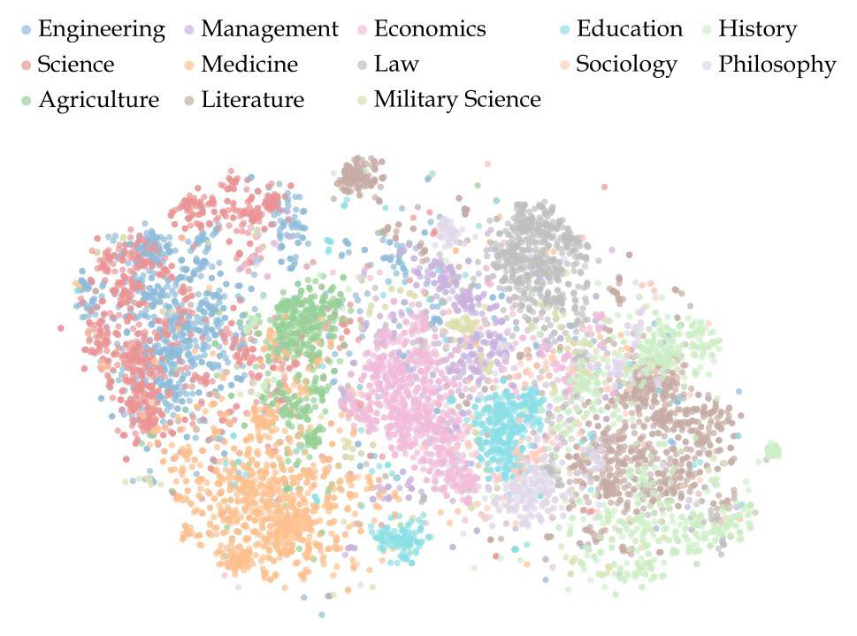

Figure 4. The Visualization of the Text Embeddings of Question-Answer Pairs Across Disciplines.

length distribution across options aligns with one of the requirements of error option curation, which tries to confuse the models by providing confusing options in similar lengths.

Semantic Visualization. As shown in Figure 4, we employ t-SNE visualization of question-answer pair embeddings to visualize the distribution SuperGPQA \( {}^{1} \) and to further show the comprehensiveness of it. The resulting visualization demonstrates clear clustering patterns across disciplines while maintaining substantial overlap in conceptual spaces. The Engineering and Science demonstrate the highest degree of embedding overlap, suggesting strong semantic similarities in their Q&A patterns. The humanities cluster (Literature, Philosophy, History) shows diffuse boundaries but maintains distinct centroids. The Military Science exhibits relatively isolated embedding patterns, indicating unique domain-specific language. This analysis shows aligning

---

\( {}^{1} \) We use the gte-large-en-v1.5 [Li et al.,2023, Zhang et al.,2024b] encoding model and set the t-SNE parameters as: perplexity 100, learning rate 500, and 1000 iteration. For clearer visualization, we randomly select maximum 1000 samples from each disciplines.

---

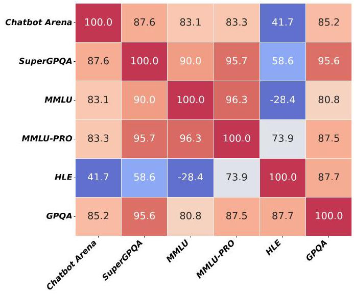

Figure 5. The Correlation Coefficients between Different Benchmarks. For MMLU, we record the results under the 5-shot setting.

conclusions from Figure 6 and reveals that the semantic structure of the SuperGPQA pairs reflects both the traditional organization of academic disciplines and their natural intellectual relationships, effectively capturing both domain-specific knowledge and cross-disciplinary connections.

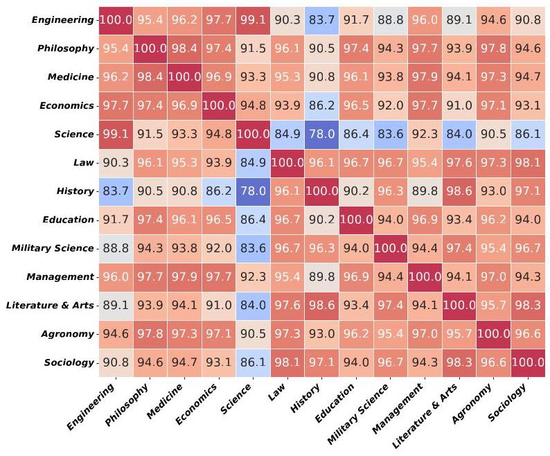

Figure 6. The Correlation Between Disciplines in SuperGPQA.

## 4. Experiments

### 4.1. Baseline Models

We evaluate 6 reasoning models (o3-mini has three modes), 28 chat models and 17 base models on SuperGPQA, which includes closed-source models, open-source models, and fully open-source models. The reasoning models include Deepseek-R1 and Deepseek-R1-Zero [Guo et al., 2025], o1 and o1-mini [OpenAI, 2024b], QwQ [Team, 2024b], and o3-mini [OpenAI, 2025] series models. The chat models include closed-source models such as Doubao-1.5-pro, Qwen-max, Claude-3.5 [Anthropic, 2024], Gemini [Team, 2024a], GPT-4o [OpenAI, 2024a], Yi-Lightning [Wake et al., 2024], and open-source models like MiniMax-Text-01 [Li et al., 2025], Qwen2.5 [Yang et al., 2024a] series, Llama-3.1 [Dubey et al., 2024] series, Mistral [Jiang et al., 2023] and Mixtral [Jiang et al., 2024] series, Gemma-2 [Team et al., 2024]series, Yi-1.5 [Young et al., 2024] series, Phi4 [Abdin et al., 2024], and Granite-3.1 [Granite Team, 2024]. Additionally, there are fully open-source models like MAP-Neo [Zhang et al., 2024a] and OLMo-2 [OLMo et al., 2024]. According to our test results, these models still show a significant gap when compared to industry standards level. The base models include Qwen2.5 [Yang et al., 2024a] series, Deepseek-V3 [Liu et al., 2024], Yi-1.5 [Young et al., 2024] series, Llama-3.1 [Dubey et al., 2024] series, Gemma-2 [Team et al., 2024] series, and Mistral [Jiang et al., 2023] and Mixtral [Jiang et al., 2024] series. Reasoning models and chat models are evaluated using a zero-shot approach, while base models are assessed using a five-shot evaluation. Specifically, the five-shot evaluation for base models follow a similar methodology to MMLU-Pro. The specific prompts employed for both the zero-shot and five-shot evaluations are detailed in Appendix F. For all main results, the temperature is set to 0 . The maximum number of new tokens is set to \( {32}\mathrm{\;K} \) for reasoning models, while for all other models, it is set to \( 4\mathrm{\;K} \) . More model results can be found in Appendix I, and all detailed results are provided in Appendix K.

### 4.2. Main Results

We present the performances of the baselines on different levels, difficulties (Table 5) and disciplines (Table 6).

Overall Results. In general, the top-performed reasoning models (e.g., DeepSeek-R1, o1-2024-12-17) achieve the best overall performance in SuperGPQA. The effectiveness of instruction tuning to improve the performances is once again verified in the benchmark. second-best and the third-best scores are shown in box , bold and underlined, respectively.

<table><tr><td>Model</td><td>Overall (sample)</td><td>Overall (subfield)</td><td>Overall (field)</td><td>Overall (discipline)</td><td>Easy (sample)</td><td>Middle (sample)</td><td>Hard (sample)</td></tr><tr><td colspan="8">Reasoning Models</td></tr><tr><td>DeepSeek-R1</td><td>61.82</td><td>62.61</td><td>61.23</td><td>59.95</td><td>63.59</td><td>63.63</td><td>56.87</td></tr><tr><td>o1-2024-12-17</td><td>60.24</td><td>61.25</td><td>59.94</td><td>59.44</td><td>64.40</td><td>61.44</td><td>53.67</td></tr><tr><td>DeepSeek-R1-Zero</td><td>60.24</td><td>61.62</td><td>60.95</td><td>60.99</td><td>65.06</td><td>62.61</td><td>50.99</td></tr><tr><td>o3-mini-2025-01-31-high</td><td>55.22</td><td>54.94</td><td>52.11</td><td>48.32</td><td>53.05</td><td>56.09</td><td>56.16</td></tr><tr><td>o3-mini-2025-01-31-medium</td><td>52.69</td><td>52.66</td><td>49.95</td><td>46.07</td><td>51.30</td><td>53.79</td><td>52.37</td></tr><tr><td>o3-mini-2025-01-31-low</td><td>48.03</td><td>48.51</td><td>45.89</td><td>42.63</td><td>48.80</td><td>50.21</td><td>43.53</td></tr><tr><td>o1-mini-2024-09-12</td><td>45.22</td><td>45.46</td><td>42.53</td><td>39.33</td><td>46.77</td><td>47.34</td><td>40.00</td></tr><tr><td>QwQ</td><td>43.59</td><td>44.40</td><td>43.19</td><td>41.63</td><td>46.46</td><td>47.40</td><td>34.07</td></tr><tr><td colspan="8">Chat Models</td></tr><tr><td>Doubao-1.5-pro-32k-250115</td><td>55.09</td><td>56.55</td><td>55.62</td><td>54.39</td><td>57.70</td><td>60.15</td><td>43.80</td></tr><tr><td>Doubao-1.5-pro-32k-241225</td><td>50.93</td><td>52.41</td><td>51.76</td><td>51.24</td><td>53.54</td><td>56.56</td><td>38.70</td></tr><tr><td>Qwen-max-2025-01-25</td><td>50.08</td><td>52.75</td><td>52.47</td><td>51.65</td><td>58.16</td><td>54.95</td><td>33.09</td></tr><tr><td>Claude-3-5-sonnet-20241022</td><td>48.16</td><td>51.38</td><td>51.23</td><td>53.15</td><td>59.04</td><td>51.91</td><td>29.99</td></tr><tr><td>Gemini-2.0-flash</td><td>47.73</td><td>48.70</td><td>47.80</td><td>46.10</td><td>53.06</td><td>49.56</td><td>38.84</td></tr><tr><td>DeepSeek-V3</td><td>47.40</td><td>49.10</td><td>48.31</td><td>47.35</td><td>55.63</td><td>50.11</td><td>33.86</td></tr><tr><td>MiniMax-Text-01</td><td>45.11</td><td>47.46</td><td>46.97</td><td>47.06</td><td>54.51</td><td>48.60</td><td>28.98</td></tr><tr><td>GPT-4o-2024-11-20</td><td>44.40</td><td>47.62</td><td>47.50</td><td>48.84</td><td>56.84</td><td>48.75</td><td>23.50</td></tr><tr><td>Llama-3.1-405B-Instruct</td><td>43.14</td><td>46.43</td><td>45.83</td><td>47.35</td><td>56.06</td><td>46.31</td><td>23.70</td></tr><tr><td>GPT-4o-2024-08-06</td><td>41.64</td><td>44.79</td><td>44.91</td><td>46.29</td><td>55.22</td><td>45.11</td><td>20.98</td></tr><tr><td>Qwen2.5-72B-Instruct</td><td>40.75</td><td>43.66</td><td>43.32</td><td>42.10</td><td>48.84</td><td>45.42</td><td>24.10</td></tr><tr><td>Mistral-Large-Instruct-2411</td><td>40.65</td><td>43.38</td><td>43.13</td><td>43.37</td><td>52.92</td><td>43.28</td><td>22.81</td></tr><tr><td>Qwen-max-2024-09-19</td><td>39.96</td><td>42.93</td><td>42.16</td><td>41.62</td><td>50.23</td><td>43.63</td><td>22.60</td></tr><tr><td>Qwen2.5-32B-Instruct</td><td>38.76</td><td>41.18</td><td>40.40</td><td>39.43</td><td>47.42</td><td>43.05</td><td>22.13</td></tr><tr><td>Llama-3.3-70B-Instruct</td><td>37.69</td><td>40.56</td><td>40.15</td><td>41.12</td><td>49.68</td><td>40.68</td><td>19.55</td></tr><tr><td>Phi-4</td><td>37.65</td><td>39.59</td><td>38.61</td><td>37.66</td><td>45.43</td><td>40.91</td><td>23.69</td></tr><tr><td>Qwen2.5-14B-Instruct</td><td>35.15</td><td>37.72</td><td>37.41</td><td>36.07</td><td>44.82</td><td>37.90</td><td>19.97</td></tr><tr><td>Llama-3.1-70B-Instruct</td><td>34.86</td><td>38.94</td><td>39.18</td><td>40.57</td><td>48.22</td><td>37.85</td><td>15.22</td></tr><tr><td>Yi-Lightning</td><td>33.42</td><td>36.57</td><td>36.45</td><td>36.92</td><td>43.38</td><td>35.32</td><td>19.35</td></tr><tr><td>Mixtral-8x22B-Instruct-v0.1</td><td>29.23</td><td>32.14</td><td>32.28</td><td>32.82</td><td>42.52</td><td>29.73</td><td>13.82</td></tr><tr><td>Qwen2.5-7B-Instruct</td><td>28.78</td><td>30.78</td><td>30.37</td><td>30.63</td><td>37.77</td><td>30.98</td><td>15.23</td></tr><tr><td>Gemma-2-27B-it</td><td>27.43</td><td>30.50</td><td>30.42</td><td>31.30</td><td>40.90</td><td>27.45</td><td>12.64</td></tr><tr><td>Qwen2.5-3B-Instruct</td><td>23.31</td><td>25.45</td><td>25.86</td><td>25.57</td><td>33.10</td><td>23.50</td><td>12.24</td></tr><tr><td>Granite-3.1-8B-instruct</td><td>20.83</td><td>22.85</td><td>22.92</td><td>22.26</td><td>29.48</td><td>19.79</td><td>13.09</td></tr><tr><td>Qwen2.5-1.5B-Instruct</td><td>18.82</td><td>20.91</td><td>20.75</td><td>22.11</td><td>27.41</td><td>18.19</td><td>10.45</td></tr><tr><td>OLMo-2-1124-13B-Instruct</td><td>18.66</td><td>20.46</td><td>20.60</td><td>21.80</td><td>27.10</td><td>17.85</td><td>10.74</td></tr><tr><td>MAP-Neo-7B-Instruct-v0.1</td><td>17.05</td><td>18.52</td><td>18.42</td><td>18.70</td><td>23.26</td><td>16.62</td><td>10.95</td></tr><tr><td>OLMo-2-1124-7B-Instruct</td><td>16.81</td><td>18.08</td><td>18.57</td><td>18.85</td><td>22.80</td><td>15.82</td><td>11.90</td></tr></table>

<table><tr><td/><td/><td/><td>Base Models</td><td/><td/><td/><td/></tr><tr><td>Qwen2.5-72B</td><td>34.33</td><td>38.08</td><td>38.70</td><td>39.54</td><td>46.20</td><td>38.12</td><td>15.01</td></tr><tr><td>Qwen2.5-32B</td><td>33.16</td><td>36.52</td><td>37.33</td><td>38.29</td><td>45.12</td><td>36.58</td><td>14.34</td></tr><tr><td>DeepSeek-V3-Base</td><td>32.14</td><td>34.79</td><td>34.58</td><td>34.71</td><td>41.28</td><td>34.50</td><td>18.20</td></tr><tr><td>Qwen2.5-14B</td><td>30.19</td><td>33.33</td><td>34.14</td><td>34.54</td><td>42.27</td><td>31.44</td><td>14.85</td></tr><tr><td>Yi-1.5-34B</td><td>27.62</td><td>30.78</td><td>31.03</td><td>32.55</td><td>39.68</td><td>27.95</td><td>13.86</td></tr><tr><td>Llama-3.1-70B</td><td>27.22</td><td>30.52</td><td>31.28</td><td>32.55</td><td>40.78</td><td>26.95</td><td>12.78</td></tr><tr><td>Qwen2.5-7B</td><td>25.36</td><td>28.19</td><td>28.73</td><td>29.60</td><td>36.58</td><td>25.94</td><td>12.10</td></tr><tr><td>Llama-3.1-405B</td><td>25.23</td><td>28.09</td><td>28.33</td><td>30.15</td><td>37.58</td><td>25.12</td><td>11.86</td></tr><tr><td>Gemma-2-27B</td><td>24.49</td><td>27.35</td><td>27.96</td><td>28.58</td><td>36.26</td><td>24.07</td><td>12.27</td></tr><tr><td>Mixtral-8x22B-v0.1</td><td>22.41</td><td>24.71</td><td>25.04</td><td>25.02</td><td>32.78</td><td>21.67</td><td>12.26</td></tr><tr><td>Qwen2.5-3B</td><td>20.14</td><td>22.81</td><td>23.30</td><td>24.42</td><td>30.42</td><td>19.81</td><td>9.40</td></tr><tr><td>Mistral-7B-v0.3</td><td>19.48</td><td>21.50</td><td>21.81</td><td>22.27</td><td>27.62</td><td>18.65</td><td>11.96</td></tr><tr><td>Qwen2.5-1.5B</td><td>17.17</td><td>19.31</td><td>19.80</td><td>21.35</td><td>24.52</td><td>16.79</td><td>9.74</td></tr><tr><td>OLMo-2-1124-13B</td><td>16.07</td><td>18.75</td><td>19.82</td><td>21.37</td><td>27.24</td><td>14.41</td><td>6.57</td></tr><tr><td>MAP-Neo-7B</td><td>15.76</td><td>17.48</td><td>18.26</td><td>19.54</td><td>22.86</td><td>14.64</td><td>9.83</td></tr><tr><td>Granite-3.1-8B-Base</td><td>15.69</td><td>16.98</td><td>16.79</td><td>16.65</td><td>20.40</td><td>15.65</td><td>10.60</td></tr><tr><td>OLMo-2-1124-7B</td><td>15.15</td><td>17.62</td><td>18.30</td><td>19.60</td><td>24.43</td><td>13.83</td><td>7.15</td></tr></table>

Table 5. Performance on SuperGPQA. LLMs are scored sample-wise, subfield-wise, field-wise, and discipline-wise levels to ensure fair assessment despite imbalanced question distributions. The highest, the

<table><tr><td>Model</td><td>\( \mathbf{{Agr}.} \)</td><td>Econ.</td><td>\( \mathbf{{Edu}.} \)</td><td>Eng.</td><td>Hist.</td><td>Law</td><td>Lit & Arts</td><td>\( \mathbf{{Mgt}.} \)</td><td>Med.</td><td>Mil Sci.</td><td>\( \mathbf{{Phil}.} \)</td><td>Sci.</td><td>\( \mathbf{{Soc}.} \)</td></tr><tr><td colspan="14">Reasoning Models</td></tr><tr><td>DeepSeek-R1</td><td>54.43</td><td>66.09</td><td>54.75</td><td>63.10</td><td>55.19</td><td>65.24</td><td>52.45</td><td>57.09</td><td>59.93</td><td>57.07</td><td>63.11</td><td>63.69</td><td>67.13</td></tr><tr><td>DeepSeek-R1-Zero</td><td>53.81</td><td>66.44</td><td>60.54</td><td>60.28</td><td>58.61</td><td>66.77</td><td>56.86</td><td>59.68</td><td>60.65</td><td>58.54</td><td>63.69</td><td>59.93</td><td>67.13</td></tr><tr><td>o1-2024-12-17</td><td>50.93</td><td>61.17</td><td>53.31</td><td>59.17</td><td>60.98</td><td>63.87</td><td>55.79</td><td>57.29</td><td>62.25</td><td>60.49</td><td>61.38</td><td>61.76</td><td>64.34</td></tr><tr><td>o3-mini-2025-01-31-high</td><td>41.03</td><td>54.07</td><td>46.28</td><td>56.41</td><td>36.80</td><td>45.73</td><td>39.44</td><td>51.50</td><td>51.72</td><td>46.34</td><td>51.01</td><td>61.72</td><td>46.15</td></tr><tr><td>o3-mini-2025-01-31-medium</td><td>40.62</td><td>51.32</td><td>41.74</td><td>53.83</td><td>35.01</td><td>43.60</td><td>37.11</td><td>48.50</td><td>50.34</td><td>45.85</td><td>48.13</td><td>58.79</td><td>44.06</td></tr><tr><td>o3-mini-2025-01-31-low</td><td>37.32</td><td>45.25</td><td>38.43</td><td>48.20</td><td>32.94</td><td>39.79</td><td>36.22</td><td>43.71</td><td>48.09</td><td>41.46</td><td>44.09</td><td>53.24</td><td>45.45</td></tr><tr><td>o1-mini-2024-09-12</td><td>34.02</td><td>45.02</td><td>36.16</td><td>45.41</td><td>26.26</td><td>35.98</td><td>32.22</td><td>40.52</td><td>44.32</td><td>39.51</td><td>39.48</td><td>51.09</td><td>41.26</td></tr><tr><td>QwQ</td><td>38.14</td><td>47.77</td><td>45.25</td><td>43.37</td><td>29.53</td><td>45.88</td><td>32.82</td><td>41.32</td><td>43.88</td><td>40.00</td><td>43.52</td><td>46.33</td><td>43.36</td></tr><tr><td colspan="14">Chat Models</td></tr><tr><td>Doubao-1.5-pro-32k-250115</td><td>50.93</td><td>65.06</td><td>55.58</td><td>55.60</td><td>42.88</td><td>58.84</td><td>42.30</td><td>53.29</td><td>59.13</td><td>54.15</td><td>61.96</td><td>55.54</td><td>51.75</td></tr><tr><td>Doubao-1.5-pro-32k-241225</td><td>47.42</td><td>60.14</td><td>54.75</td><td>50.76</td><td>37.54</td><td>54.12</td><td>38.31</td><td>52.69</td><td>54.99</td><td>53.66</td><td>57.06</td><td>51.57</td><td>53.15</td></tr><tr><td>claude-3-5-sonnet-20241022</td><td>47.01</td><td>56.59</td><td>53.72</td><td>47.57</td><td>53.56</td><td>60.21</td><td>50.42</td><td>51.30</td><td>49.26</td><td>59.51</td><td>52.45</td><td>45.02</td><td>64.34</td></tr><tr><td>qwen-max-2025-01-25</td><td>44.33</td><td>57.50</td><td>56.40</td><td>50.81</td><td>44.81</td><td>54.12</td><td>44.93</td><td>54.69</td><td>56.37</td><td>49.27</td><td>56.20</td><td>47.51</td><td>54.55</td></tr><tr><td>Llama-3.1-405B-Instruct</td><td>43.09</td><td>49.71</td><td>45.45</td><td>41.89</td><td>50.00</td><td>55.34</td><td>43.20</td><td>47.70</td><td>49.04</td><td>52.20</td><td>48.41</td><td>39.80</td><td>49.65</td></tr><tr><td>gpt-4o-2024-11-20</td><td>42.27</td><td>46.74</td><td>50.00</td><td>42.83</td><td>52.52</td><td>53.81</td><td>46.72</td><td>47.31</td><td>52.52</td><td>52.20</td><td>52.74</td><td>40.67</td><td>54.55</td></tr><tr><td>gpt-4o-2024-05-13</td><td>41.44</td><td>40.78</td><td>44.21</td><td>37.47</td><td>50.74</td><td>52.90</td><td>45.11</td><td>41.32</td><td>48.82</td><td>50.73</td><td>45.24</td><td>35.41</td><td>53.85</td></tr><tr><td>DeepSeek-V3</td><td>41.24</td><td>49.48</td><td>43.80</td><td>47.21</td><td>47.18</td><td>51.07</td><td>45.23</td><td>48.50</td><td>46.10</td><td>48.29</td><td>43.23</td><td>48.30</td><td>55.94</td></tr><tr><td>Qwen2.5-72B-Instruct</td><td>41.24</td><td>46.62</td><td>44.42</td><td>41.12</td><td>30.71</td><td>45.88</td><td>34.90</td><td>42.32</td><td>45.74</td><td>45.37</td><td>43.52</td><td>39.33</td><td>46.15</td></tr><tr><td>MiniMax-Text-01</td><td>39.79</td><td>49.60</td><td>47.52</td><td>44.88</td><td>45.25</td><td>54.27</td><td>43.02</td><td>48.90</td><td>47.08</td><td>48.29</td><td>45.53</td><td>43.81</td><td>53.85</td></tr><tr><td>gpt-4o-2024-08-06</td><td>39.59</td><td>40.78</td><td>44.42</td><td>38.84</td><td>50.89</td><td>54.12</td><td>46.30</td><td>45.51</td><td>50.49</td><td>50.73</td><td>47.84</td><td>38.41</td><td>53.85</td></tr><tr><td>Mistral-Large-Instruct-2411</td><td>38.76</td><td>42.27</td><td>42.15</td><td>39.66</td><td>44.96</td><td>47.87</td><td>41.11</td><td>43.31</td><td>43.23</td><td>48.78</td><td>42.07</td><td>39.24</td><td>50.35</td></tr><tr><td>gemini-2.0-flash</td><td>38.56</td><td>45.93</td><td>42.36</td><td>48.37</td><td>45.25</td><td>49.24</td><td>43.68</td><td>41.32</td><td>43.77</td><td>51.22</td><td>45.53</td><td>50.20</td><td>53.85</td></tr><tr><td>Llama-3.1-70B-Instruct</td><td>37.11</td><td>41.12</td><td>41.94</td><td>33.88</td><td>33.09</td><td>45.88</td><td>35.08</td><td>46.11</td><td>44.21</td><td>47.80</td><td>42.94</td><td>30.04</td><td>48.25</td></tr><tr><td>Llama-3.3-70B-Instruct</td><td>36.70</td><td>40.55</td><td>40.29</td><td>36.44</td><td>41.25</td><td>44.66</td><td>38.54</td><td>45.51</td><td>43.77</td><td>46.34</td><td>42.94</td><td>34.96</td><td>42.66</td></tr><tr><td>qwen-max-2024-09-19</td><td>36.49</td><td>45.02</td><td>45.66</td><td>39.84</td><td>35.16</td><td>44.05</td><td>39.08</td><td>45.11</td><td>43.41</td><td>47.32</td><td>43.23</td><td>38.24</td><td>38.46</td></tr><tr><td>Owen2.5-32B-Instruct</td><td>36.49</td><td>43.07</td><td>45.45</td><td>38.93</td><td>30.71</td><td>41.92</td><td>32.76</td><td>39.52</td><td>42.21</td><td>44.88</td><td>39.19</td><td>38.24</td><td>39.16</td></tr><tr><td>Qwen2.5-14B-Instruct</td><td>36.08</td><td>37.69</td><td>39.26</td><td>35.87</td><td>26.41</td><td>37.04</td><td>31.44</td><td>41.52</td><td>36.91</td><td>38.05</td><td>38.04</td><td>34.20</td><td>36.36</td></tr><tr><td>Yi-Lighting</td><td>33.81</td><td>39.18</td><td>35.95</td><td>32.53</td><td>36.05</td><td>37.35</td><td>36.34</td><td>38.12</td><td>36.95</td><td>42.44</td><td>37.75</td><td>30.85</td><td>42.66</td></tr><tr><td>Phi-4</td><td>32.78</td><td>40.21</td><td>39.26</td><td>37.27</td><td>30.27</td><td>41.46</td><td>31.62</td><td>39.12</td><td>37.79</td><td>39.02</td><td>40.63</td><td>38.87</td><td>41.26</td></tr><tr><td>Gemma-2-27B-it</td><td>31.13</td><td>29.32</td><td>30.99</td><td>26.72</td><td>24.78</td><td>35.06</td><td>29.42</td><td>34.93</td><td>31.00</td><td>39.02</td><td>35.45</td><td>24.81</td><td>34.27</td></tr><tr><td>Qwen2.5-7B-Instruct</td><td>29.28</td><td>34.59</td><td>35.33</td><td>28.38</td><td>22.85</td><td>32.62</td><td>24.28</td><td>33.33</td><td>32.60</td><td>32.68</td><td>34.58</td><td>27.54</td><td>30.07</td></tr><tr><td>Mixtral-8x22B-Instruct-v0.1</td><td>28.25</td><td>33.45</td><td>33.68</td><td>29.02</td><td>30.86</td><td>34.60</td><td>30.55</td><td>35.13</td><td>30.53</td><td>44.39</td><td>32.85</td><td>26.95</td><td>36.36</td></tr><tr><td>Qwen2.5-3B-Instruct</td><td>25.36</td><td>26.35</td><td>30.99</td><td>22.83</td><td>18.55</td><td>25.61</td><td>22.32</td><td>30.94</td><td>26.82</td><td>27.32</td><td>27.09</td><td>21.64</td><td>26.57</td></tr><tr><td>Granite-3.1-8B-instruct</td><td>24.74</td><td>20.16</td><td>23.76</td><td>21.60</td><td>16.32</td><td>24.70</td><td>20.53</td><td>25.15</td><td>20.58</td><td>27.80</td><td>21.33</td><td>19.70</td><td>23.08</td></tr><tr><td>Qwen2.5-1.5B-Instruct</td><td>22.27</td><td>22.57</td><td>27.27</td><td>17.64</td><td>16.47</td><td>26.37</td><td>17.84</td><td>24.95</td><td>22.58</td><td>25.37</td><td>27.67</td><td>16.85</td><td>19.58</td></tr><tr><td>OLMo-2-1124-13B-Instruct</td><td>20.82</td><td>22.68</td><td>25.21</td><td>18.18</td><td>16.91</td><td>22.10</td><td>19.57</td><td>21.96</td><td>21.81</td><td>25.85</td><td>27.38</td><td>16.39</td><td>24.48</td></tr><tr><td>Yi-1.5-6B-Chat</td><td>20.41</td><td>23.83</td><td>25.62</td><td>18.50</td><td>13.95</td><td>25.61</td><td>18.79</td><td>24.15</td><td>21.89</td><td>29.27</td><td>25.36</td><td>17.60</td><td>23.78</td></tr><tr><td>MAP-Neo-7B-Instruct-v0.1</td><td>17.94</td><td>17.64</td><td>21.69</td><td>16.79</td><td>13.50</td><td>21.19</td><td>16.35</td><td>20.96</td><td>18.91</td><td>25.85</td><td>21.61</td><td>15.99</td><td>14.69</td></tr><tr><td>Qwen2.5-0.5B-Instruct</td><td>16.91</td><td>16.49</td><td>17.98</td><td>9.77</td><td>10.09</td><td>13.87</td><td>12.89</td><td>15.97</td><td>14.12</td><td>13.17</td><td>12.68</td><td>8.55</td><td>12.59</td></tr></table>

Base Models

<table><tr><td>Qwen2.5-32B</td><td>38.76</td><td>40.89</td><td>45.87</td><td>32.70</td><td>28.49</td><td>39.94</td><td>30.91</td><td>40.72</td><td>38.84</td><td>47.80</td><td>43.52</td><td>29.45</td><td>39.86</td></tr><tr><td>Qwen2.5-72B</td><td>36.29</td><td>44.33</td><td>45.25</td><td>33.39</td><td>31.31</td><td>44.21</td><td>35.50</td><td>43.51</td><td>43.12</td><td>46.34</td><td>42.94</td><td>29.38</td><td>38.46</td></tr><tr><td>Qwen2.5-14B</td><td>34.02</td><td>34.82</td><td>40.08</td><td>30.26</td><td>28.49</td><td>36.89</td><td>28.94</td><td>40.32</td><td>34.37</td><td>40.00</td><td>37.75</td><td>26.68</td><td>36.36</td></tr><tr><td>Llama-3.1-405B</td><td>29.28</td><td>27.95</td><td>31.20</td><td>23.61</td><td>34.12</td><td>34.30</td><td>30.79</td><td>34.13</td><td>29.47</td><td>39.51</td><td>31.70</td><td>21.47</td><td>24.48</td></tr><tr><td>Llama-3.1-70B</td><td>28.87</td><td>29.67</td><td>36.36</td><td>26.19</td><td>32.94</td><td>33.38</td><td>32.64</td><td>36.73</td><td>30.96</td><td>40.98</td><td>36.89</td><td>23.30</td><td>34.27</td></tr><tr><td>Gemma-2-27B</td><td>28.87</td><td>27.26</td><td>30.79</td><td>24.09</td><td>22.85</td><td>28.96</td><td>27.51</td><td>32.73</td><td>27.80</td><td>37.56</td><td>31.70</td><td>21.38</td><td>30.07</td></tr><tr><td>DeepSeek-V3-Base</td><td>28.66</td><td>35.17</td><td>39.05</td><td>31.87</td><td>30.12</td><td>37.20</td><td>33.65</td><td>37.33</td><td>34.70</td><td>37.07</td><td>38.62</td><td>30.08</td><td>37.76</td></tr><tr><td>Qwen2.5-7B</td><td>28.25</td><td>31.96</td><td>38.02</td><td>24.89</td><td>22.55</td><td>30.34</td><td>25.06</td><td>28.54</td><td>30.56</td><td>31.71</td><td>36.60</td><td>22.04</td><td>34.27</td></tr><tr><td>Yi-1.5-34B</td><td>28.25</td><td>35.85</td><td>37.60</td><td>27.32</td><td>24.63</td><td>34.45</td><td>30.25</td><td>36.13</td><td>31.18</td><td>40.49</td><td>35.45</td><td>23.80</td><td>37.76</td></tr><tr><td>Mixtral-8x7B-v0.1</td><td>28.04</td><td>24.97</td><td>29.34</td><td>20.67</td><td>23.89</td><td>30.79</td><td>27.27</td><td>30.74</td><td>25.05</td><td>37.56</td><td>30.84</td><td>17.87</td><td>28.67</td></tr><tr><td>Gemma-2-9B</td><td>27.22</td><td>26.23</td><td>30.99</td><td>21.79</td><td>21.81</td><td>26.83</td><td>23.81</td><td>28.94</td><td>26.06</td><td>32.68</td><td>27.09</td><td>20.01</td><td>27.97</td></tr><tr><td>Mistral-7B-v0.3</td><td>25.98</td><td>20.96</td><td>25.62</td><td>19.02</td><td>14.84</td><td>24.24</td><td>20.11</td><td>23.55</td><td>22.61</td><td>30.24</td><td>25.94</td><td>17.47</td><td>18.88</td></tr><tr><td>Mixtral-8x22B-v0.1</td><td>23.92</td><td>23.94</td><td>27.27</td><td>22.02</td><td>20.33</td><td>27.59</td><td>24.64</td><td>30.14</td><td>22.50</td><td>28.78</td><td>24.50</td><td>20.96</td><td>28.67</td></tr><tr><td>Qwen2.5-3B</td><td>22.47</td><td>23.83</td><td>28.31</td><td>19.74</td><td>18.40</td><td>26.37</td><td>21.60</td><td>28.14</td><td>25.41</td><td>30.73</td><td>29.39</td><td>16.54</td><td>26.57</td></tr><tr><td>MAP-Neo-7B</td><td>20.21</td><td>18.10</td><td>23.35</td><td>15.43</td><td>15.28</td><td>21.34</td><td>18.79</td><td>21.76</td><td>17.10</td><td>24.88</td><td>22.19</td><td>13.16</td><td>22.38</td></tr><tr><td>OLMo-2-1124-13B</td><td>19.59</td><td>20.27</td><td>26.24</td><td>15.21</td><td>19.73</td><td>22.41</td><td>20.88</td><td>26.15</td><td>19.96</td><td>25.85</td><td>26.51</td><td>11.93</td><td>23.08</td></tr><tr><td>Owen2.5-1.5B</td><td>19.18</td><td>20.73</td><td>28.10</td><td>16.50</td><td>15.43</td><td>21.95</td><td>17.72</td><td>23.35</td><td>20.87</td><td>24.88</td><td>25.65</td><td>14.48</td><td>28.67</td></tr><tr><td>Granite-3.1-8B-Base</td><td>15.46</td><td>17.87</td><td>15.08</td><td>16.26</td><td>11.72</td><td>18.29</td><td>13.84</td><td>14.57</td><td>14.81</td><td>20.49</td><td>20.17</td><td>15.44</td><td>22.38</td></tr><tr><td>Qwen2.5-0.5B</td><td>15.05</td><td>12.37</td><td>16.32</td><td>10.30</td><td>11.42</td><td>12.96</td><td>14.92</td><td>11.78</td><td>12.23</td><td>16.59</td><td>15.56</td><td>8.74</td><td>13.99</td></tr></table>

Table 6. Performance on SuperGPQA. We present LLMs' performance on different disciplines. The highest, the second-best and the third-best scores are shown in \( {box} \) , bold and underlined, respectively.

For instance, the results (47.40, 40.75) of DeepSeek-V3 and Qwen2.5-72B-Instruct are significantly better than the results(32.14,34.33)of DeepSeek-V3-Base and Qwen2.5- 72B, respectively. More powerful LLMs achieve more balanced results on different difficulties. For example, the results of simple, middle and hard splits of DeepSeek-R1 are 63.59, 63.63 and 56.87. In contrast, the results of simple, middle and hard splits of Qwen2.5-14B-Instruct are 44.82, 37.90 and 19.97.

Observations for Reasoning Models. Surprisingly, the performance gap between DeepSeek-R1 and DeepSeek-R1-Zero is relatively small. In Table 6, the DeepSeek-R1 only beats DeepSeek-R1-Zero in two disciplines (i.e., Science and Engineering). In the other disciplines, the DeepSeek-R1-Zero is slightly better than DeepSeek-R1, which leaves the optimal training paradigm of the reason models an open question. From the performances across different dimensions, compared to the o1-2024-12-17 model, the newer o1-mini and o3-mini models show decreasing scores except in science and engineering, suggesting a potential data leakage. Moreover, for different versions of o3- mini (o3-mini-2025-01-31-high, o3-mini-2025-01-31-medium, o3-mini-2025-01-31-low), we observe obvious performance gaps for different difficulties.

Advantages from Pre-training Corpus. The newer versions of proprietary LLMs achieve significant improvements on SuperGPQA, considering the incremental growing of qwen-max series (2024-09-19→2025-01-25: 39.96→50.08) and GPT-4o series (2024-05- \( {13} \rightarrow  {2024} - {08} - {06} \rightarrow  {2024} - {11} - {20} : {39.76} \rightarrow  {41.64} \rightarrow  {44.40}) \) . Such incremental performances following the chronological order suggest that the developers of proprietary models highly value the incorporation of long-tailed knowledge. Moreover, we conjecture that the LLMs from Chinese firms (e.g., Qwen and Doubao) generally show superior performances is partially because their data collection pipelines are more aligned to SuperGPQA, i.e., a considerable ratio of the references are translated from Chinese textbooks.

Progress of Open-source. The SuperGPQA also reveals a pessimistic open-source progress from the research community. In the dimension of pre-training corpus curation, the fully open-sourced LLMs (e.g., MAP-Neo-7B and OLMo-2-1124-13B) perform similarly and lag behind to other non fully open ones in similar sizes (e.g., Qwen2.5-7B). It can also be observed that, compared to the proprietary models, most of the open-weight LLMs except for the DeepSeek-R1 series are not satisfactory in our benchmark, especially the hard questions.

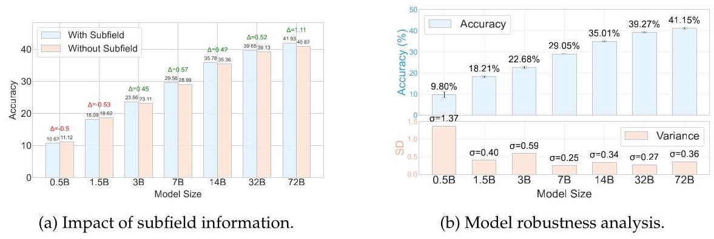

Figure 7. (a) Accuracy comparison of Qwen2.5 models (0.5B-72B) with and without subfield information in prompts. Larger models benefit more from additional context. (b) Robustness evaluation across 24 semantically equivalent prompts, indicating larger models exhibit higher stability with lower variance.

Difficulty-Specific Capabilities. The difficulty stratification in SuperGPQA reveals distinct capability patterns between reasoning-focused and knowledge-oriented LLMs. As shown in Table 5, the hard split specifically challenges models' reasoning capacities, while easy and middle splits better reflect factual knowledge mastery. For instance, the o3-mini series exhibits lower scores than Doubao-1.5-pro-32k-250115 on easy and middle splits, yet surpasses it significantly on hard questions. This dichotomy suggests that:

- Chat-oriented LLMs (e.g., Doubao series) excel at knowledge recall for common professional questions but struggle with complex reasoning in long-tail domains.

- Reasoning-specialized models demonstrate superior performance on hard questions through enhanced logical processing, despite potential compromises in broad knowledge coverage.

This differentiation validates SuperGPQA’s design rationale - using difficulty levels as diagnostic tools to dissect complementary capabilities in modern LLMs.

### 4.3. Further Analysis

Effect of Subfield Information in Prompts. To investigate the impact of subfield information on model performance, we conduct zero-shot evaluations under two conditions: (1) zero-shot-with-subfield, where the prompt includes a description of the problem's subfield, and (2) zero-shot-without-subfield, where no such information is provided. The prompts of zero-shot-with-subfield are shown in subsection G.1. We evaluate Qwen2.5- Instruct models ranging from 0.5B to 72B parameters across these two settings. Figure 7a show that incorporating subfield information generally leads to improved performance, particularly for larger models. For example, Qwen2.5-72B-Instruct achieves an accuracy of 41.93% in the zero-shot-with-subfield setting, compared to 40.82% without subfield annotations. Similarly, Qwen2.5-32B-Instruct improves from 39.13% to 39.65%, and Qwen2.5-14B-Instruct sees a minor increase from 35.36% to 35.78%, suggesting that additional contextual information helps larger models refine their reasoning by narrowing down the relevant domain. However, for smaller models like Qwen2.5-0.5B-Instruct and Qwen2.5-1.5B-Instruct, the introduction of subfield information does not lead to a noticeable gain in accuracy. Qwen2.5-0.5B-Instruct performs slightly worse with subfield annotations (10.62% vs. 11.12%), while Qwen2.5-1.5B-Instruct shows near-identical performance (18.09% vs. 18.62%), indicating that smaller models may lack the capacity to leverage fine-grained domain-specific cues effectively, relying more on general knowledge retrieval rather than contextual domain disambiguation.

Robustness Analysis. Benchmark evaluations can be significantly influenced by slight variations in prompts, leading to inconsistencies in model ranking and overall assessment reliability. To investigate this phenomenon, we conduct robustness experimen-tacross Qwen2.5-Instruct models (0.5B~72B), employing 24 distinct yet semantically equivalent prompts in a zero-shot setting, using the same evaluation parameters as in the main results. Specifically, we employ 4 types of initial prompts and 6 types of question formats, resulting in a combination of 24 different prompt styles to verify the robustness of our bench. The combination of initial prompt 1 and question format 1 is the default prompt for our evaluation. The detailed prompts are shown in the subsection G.2. Figure 7b shows that larger models exhibit increased robustness, as a steady improvement in accuracy from 9.80% of Qwen2.5-0.5B-Instruct to 41.15% of Qwen2.5-72B-Instruct while variance decreases \( (\sigma  = {1.37} \) for the smallest model, dropping to \( \sigma  \approx  {0.27} \sim  {0.36} \) in the largest models). This demonstrates the our evaluation framework is more stable with a maximum standard deviation SD of 1.37%, that mitigates prompt-induced instability and provides a more reliable basis for model assessment.

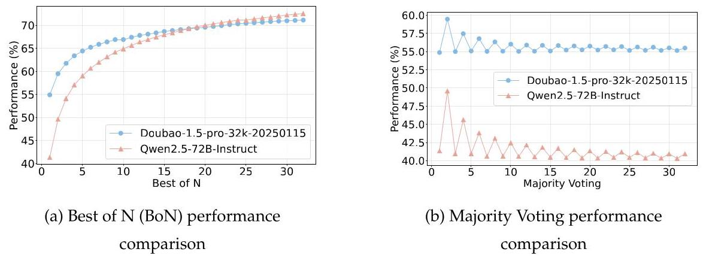

Figure 8. Performance comparison of Qwen2.5-72B-Instruct and

Doubao-1.5-pro-32k-20250115 under two ensembling strategies: (a) Best of N (BoN) and (b) Majority Voting. BoN shows that Qwen2.5-72B-Instruct benefits more from increased sampling, whereas Majority Voting favors Doubao-1.5-pro-32k-20250115 due to its more consistent output distribution.

Best of \( \mathrm{N} \) (BoN) Analysis. BoN (Best of \( \mathrm{N} \) ) is a strategy that selects the highest-quality response from \( \mathrm{N} \) independent generations which utilize stochastic sampling to improve overall performance. In our experiments, we evaluate Qwen2.5-72B-Instruct and Doubao-1.5-pro-32k-20250115 under BoN settings ranging from \( N = 1 \) to \( N = {32} \) , with results presented in Figure 8a. Qwen2.5-72B-Instruct exhibits a steeper BoN curve compared to Doubao-1.5-pro-32k-20250115, suggesting that Qwen benefits more significantly from multiple sampling attempts, likely due to a higher variance in response quality. Conversely, Doubao-1.5-pro-32k-20250115 shows stronger initial performance but a more gradual BoN gain, implying that its response distribution is more consistent but less opportunistic in leveraging multiple trials. Notably, while Doubao maintains a lead in early BoN values \( \left( {N \leq  {15}}\right) \) , Qwen2.5-72B-Instruct surpasses it around Bo24 and continues to outperform at Bo32, indicating that for scenarios where extensive sampling is feasible, Qwen2.5-72B-Instruct demonstrates a greater ability to exploit high-quality outputs.

Majority Voting Analysis. \( {}^{2} \) Majority Voting is a strategy that selects the most frequently generated response from multiple independent runs. We evaluate Majority Voting using Qwen2.5-72B-Instruct and Doubao-1.5-pro-32k-20250115 shown in Figure \( 8\mathrm{\;b} \) . When multiple options receive the same highest number of votes, the answer is considered correct if the correct option is among them. We show that Doubao-1.5-pro- 32k-20250115 consistently outperforms Qwen2.5-72B-Instruct across all voting sizes, exhibiting a stable performance around 55-57%. In contrast, Qwen2.5-72B-Instruct demonstrates fluctuations, particularly for lower \( \mathrm{N} \) , with performance largely remaining in the 40-45% range, indicating that Doubao generates more consistent responses across independent runs.

---

\( {}^{2} \) Both the BoN and Majority Voting analyses are conducted using the same set of inference results, generated with temperature \( = {0.7} \) and repeated for 32 independent runs.

---

### 4.4. Analysis of Disciplinary Discrimination Power

To systematically evaluate the discrimination power across disciplines, we employ two complementary analytical approaches: descriptive statistics and discrimination indices analysis. The descriptive statistics approach examines the distribution characteristics of model performance within each discipline through three key metrics:

- Mean Accuracy: Reflects the overall difficulty level of the discipline.

- Standard Deviation (SD): Measures the dispersion of model performance.

- Coefficient of Variation (CV): Normalizes the standard deviation by mean accuracy, enabling cross-discipline comparison.

The discrimination indices analysis complements this by comparing performance extremes through:

- High-Low Group Difference ( \( \Delta \) ): Calculates the mean accuracy gap between the top 3 and bottom 3 models in each discipline.

Table 7 presents complete results with group comparisons across all 13 disciplines, highlighting key patterns through color coding.

Our systematic analysis reveals two distinct patterns in disciplinary discrimination power:

- High-discrimination disciplines: History (SD=8.45, CV=0.175, \( \Delta  = {19.19} \) ) and Law (SD=7.17, CV=0.126, \( \Delta  = {16.62} \) ) demonstrate the strongest differentiation capacity, indicating models exhibit substantially varied performance in these domains.

- Low-discrimination disciplines: Military Science (SD=4.99, CV=0.093, \( \Delta  = {11.55} \) ), Engineering (SD=5.75, CV=0.107, \( \Delta  = {13.13} \) ), and Management (SD=5.21, CV=0.099, \( \Delta  = {10.98} \) ) exhibit performance convergence among top models.

<table><tr><td rowspan="2">Discipline</td><td colspan="3">Descriptive Statistics</td><td colspan="3">Discrimination Indices Analysis</td></tr><tr><td>Mean Acc.</td><td>SD</td><td>CV</td><td>\( \mathbf{{High}} \)</td><td>Low</td><td>\( \Delta \)</td></tr><tr><td>Engineering</td><td>53.93</td><td>5.75</td><td>0.107</td><td>60.85</td><td>47.72</td><td>13.13</td></tr><tr><td>Philosophy</td><td>55.56</td><td>7.33</td><td>0.132</td><td>62.92</td><td>46.59</td><td>16.33</td></tr><tr><td>Medicine</td><td>54.42</td><td>6.44</td><td>0.118</td><td>60.94</td><td>46.38</td><td>14.57</td></tr><tr><td>Economics</td><td>58.25</td><td>6.96</td><td>0.120</td><td>65.86</td><td>49.83</td><td>16.04</td></tr><tr><td>Science</td><td>54.52</td><td>6.86</td><td>0.126</td><td>62.39</td><td>46.94</td><td>15.45</td></tr><tr><td>Law</td><td>56.92</td><td>7.17</td><td>0.126</td><td>65.29</td><td>48.68</td><td>16.62</td></tr><tr><td>History</td><td>48.28</td><td>8.45</td><td>0.175</td><td>58.26</td><td>39.07</td><td>19.19</td></tr><tr><td>Education</td><td>52.15</td><td>5.94</td><td>0.114</td><td>57.51</td><td>44.15</td><td>13.36</td></tr><tr><td>Military Science</td><td>53.85</td><td>4.99</td><td>0.093</td><td>59.51</td><td>47.97</td><td>11.55</td></tr><tr><td>Management</td><td>52.73</td><td>5.21</td><td>0.099</td><td>58.02</td><td>47.04</td><td>10.98</td></tr><tr><td>Literature & Arts</td><td>46.94</td><td>6.58</td><td>0.140</td><td>55.03</td><td>40.02</td><td>15.02</td></tr><tr><td>Agronomy</td><td>46.97</td><td>5.58</td><td>0.119</td><td>53.06</td><td>40.27</td><td>12.78</td></tr><tr><td>Sociology</td><td>57.83</td><td>7.33</td><td>0.127</td><td>66.20</td><td>50.35</td><td>15.85</td></tr></table>

Table 7. Comprehensive Discrimination Analysis with Several Key Evaluation Metrics (Mean Acc.: Mean Accuracy, SD: Standard Deviation, CV: Coefficient of Variation, Δ: High-Low Group Difference).

The observed dichotomy between humanities and STEM disciplines emerges from fundamental differences in knowledge representation. The heightened discrimination in humanities (History CV=0.175) likely originates from:

- Context-dependent reasoning requiring real-world knowledge synthesis.

- Cultural nuance interpretation demands.

- Ethical judgment variance in open-ended scenarios.

Conversely, the performance convergence in STEM fields (Engineering CV=0.107) reflects:

- Standardized problem-solving patterns in technical domains.

- Mathematical consistency in training corpora.

- Concentrated optimization efforts by model developers.

This finding validates our experimental design hypothesis: when evaluating top-performing models (per-discipline top 10 selection), humanities disciplines better reveal capability differences due to their complexity beyond pattern recognition, while STEM metrics approach performance ceilings. Our results emphasize the critical need for comprehensive cross-domain evaluation frameworks to fully capture models' heterogeneous capabilities beyond technical domains.

## 5. Related Work

### 5.1. Large Language Models

The landscape of natural language processing has been transformed by recent breakthroughs in Large Language Models (LLMs) [Zhang et al., 2024a, Young et al., 2024]. The introduction of GPT-3 marked a significant milestone, showcasing its ability to interpret tasks and examples from textual inputs with minimal prior training. Recently, the latest generation of LLMs (e.g., GPT-4 [OpenAI,2023], Claude-3.5 \( {}^{3} \) , Gemini [Team, 2023], and Llama-3 [AI@Meta, 2024]), have exhibited remarkable progress in sophisticated reasoning across diverse fields. To comprehensively evaluate and challenge the expanding capabilities of these advanced AI systems, we present SuperGPQA. This novel benchmark is specifically crafted to probe the knowledge boundaries of existing LLMs.

#### 5.2.LLM Benchmarks

Recently, the development of the Large Language Model (LLM) has been transformed by the introduction of various benchmarks [Cobbe et al., 2021, Wang et al., 2024a, Bai et al., 2024]. Notable examples include GLUE [Wang et al., 2019b] and its successor SuperGLUE [Wang et al., 2019a], which have been instrumental in propelling advancements in language comprehension tasks. These foundational benchmarks paved the way for more specialized assessments, such as MMLU [Hendrycks et al., 2020], HotpotQA [Yang et al., 2018], BigBench [Srivastava et al., 2022], HellaSwag [Zellers et al., 2019], CommonsenseQA [Talmor et al., 2019], KOR-Bench [Ma et al., 2024], SimpleQA [Wei et al., 2024a] and Chinese SimpleQA [He et al., 2024a]. These newer benchmarks have expanded the evaluation scope to encompass content generation, knowledge understanding, and complex reasoning abilities. While numerous benchmarks have been developed to evaluate LLMs' capabilities and alignment with human values, these have often focused narrowly on performance within singular tasks or domains. To enable a more comprehensive LLM assessment, we propose SuperGPQA to scale the LLM evaluation to 285 graduate-level disciplines and provide a comprehensive and fine-grained analysis of foundation models.

---

\( {}^{3} \) https://www.anthropic.com/news/claude-3-5-sonnet

---

## 6. Contributions and Acknowledgements

Multimodal Art Projection (M-A-P) is a non-profit open-source AI research community, ran by donation. The community members are working on research topics in a wide range of spectrum, including but not limited to the pre-training paradigm of foundation models, large-scale data collection and processing, and the derived applications on coding, reasoning and music generation.

Our team members contribute to the development of SuperGPQA from the following perspectives:

- Data Annotation Management - Model Evaluation

- Data Annotation - Result Analysis

- Data Quality Inspection - Paper Writing

## Leading Authors

- Xinrun Du, M-A-P - Tianyu Zheng, M-A-P, Tiktok

- Yifan Yao, M-A-P - King Zhu, M-A-P, OPPO

- Kaijing Ma, M-A-P - Minghao Liu, 2077.AI

- Bingli Wang, SAU

## Outstanding Contributors

- Yiming Liang, M-A-P, CASIA - Zhenlin Wei, HEU

- Xiaolong Jin, Purdue University - Chujie Zheng, Tsinghua University

## Core Contributors (Alphabet Order)

- Kaixin Deng, CDUT - Yunwen Li, CUHK-Shenzhen

- Shawn Gavin, M-A-P - Yiyan Liao, Peking University

- Shian Jia, Zhejiang University - David Ma, M-A-P

- Sichao Jiang, Zhejiang University - Yuansheng Ni, M-A-P

- Qinrui Li, UCSB - Haoran Que, Zhipu

- Rui Li, Peking University - Qiyao Wang, DUT

- Sirun Li, Peking University - Zekun Moore Wang, M-A-P, Beihang

- Yizhi Li, The University of Manch- University

ester - Zhoufutu Wen, ByteDance.Inc

- Siwei Wu, The University of Manch- - Ming Xu, NJUPT

ester - Zhenzhu Yang, M-A-P, CUGB

- Tyshawn Hsing, M-A-P - Junting Zhou, Peking University

## Contributors (Alphabet Order)

- Yuelin Bai, M-A-P - Qige Qi, ByteDance.Inc

- Xingyuan Bu, Alibaba.Inc - Shi Qiu, Peking University

- Chenglin Cai, 01.AI - Xingwei Qu, The University of

- Liang Chen, Peking University Manchester

- Yifan Chen, ByteDance.Inc - Shanghaoran Quan, Beihang Univer-

- Chengtuo Cheng, Abaka.AI sity

- Tianhao Cheng, Fudan University - Yizhou Tan, Harvard University

- Keyi Ding, Hangzhou Dianzi Univer- - Chenqing Wang, 2077.AI sity - Hao Wang, Beihang University

- Siming Huang, The University of - Yiya Wang, Peking University Melbourne - Yubo Wang, University of Waterloo

- Yun Huang, NUS - Zili Wang

- Yaoru Li, Zhejiang University - Jiajun Xu, Meta

- Yizhe Li, Zhejiang University - Kexin Yang

- Zhaoqun Li, Zhejiang University - Ruibin Yuan, HKUST

- Tianhao Liang, Zhejiang University - Yuanhao Yue, Fudan University

- Chengdong Lin, Hangzhou Dianzi - Tianyang Zhan, ByteDance.Inc University - Chun Zhang, ByteDance.Inc

- Hongquan Lin, University of Science - Jinyang Zhang, Zhejiang University

and Technology of China - Xingjian Zhang, Princeton University

- Yinghao Ma, Queen Mary University - Xiyue Zhang, Peking University of London - Yue Zhang, ByteDance.Inc

- Tianyang Pang, ByteDance.Inc - Yongchi Zhao, Alibaba.Inc

- Zhongyuan Peng, Alibaba.Inc - Xiangyu Zheng, Fudan University

- Zifan Peng, HKUST-Guangzhou - Chenghua Zhong, USTB

## Organization and Sponsor Committee (Alphabet Order)

- Meng Cao, MBZUAI - Zhoujun Li, Beihang University

- Yang Gao, Nanjing University - Dayiheng Liu

- Qian Liu, Tiktok - Shi Wang, ICT-CAS

- Tianyu Liu - Jian Yang, Beihang University

- Shiwen Ni, SIAT-CAS - Min Yang, SIAT-CAS

- Junran Peng, USTB - Xiang Yue, M-A-P

- Yujia Qin, ByteDance.Inc - Zhaoxiang Zhang, CASIA

- Wenbo Su - Wangchunshu Zhou, OPPO

- Guoyin Wang, ByteDance.Inc

## Corresponding Authors

- Jiaheng Liu, M-A-P, Nanjing Univer- - Wenhao Huang, M-A-P, ByteDance.Inc sity - Ge Zhang, M-A-P, ByteDance.Inc

- Qunshu Lin, Abaka.AI References

M. Abdin, J. Aneja, H. S. Behl, S. Bubeck, R. Eldan, S. Gunasekar, M. Harrison, R. J. Hewett, M. Javaheripi, P. Kauffmann, J. R. Lee, Y. T. Lee, Y. Li, W. Liu, C. C. T. Mendes, A. Nguyen, E. Price, G. de Rosa, O. Saarikivi, A. Salim, S. Shah, X. Wang, R. Ward, Y. Wu, D. Yu, C. Zhang, and Y. Zhang. Phi-4 technical report. ArXiv, abs/2412.08905, 2024. URL https://api.semanticscholar.org/CorpusID:274656307.

AI-MO. Aimo validation aime, 2024. URL https://huggingface.co/datasets/AI -MO/aimo-validation-aime. Validation set containing 90 AIME problems from 2022-2024 contests.

AI@Meta.Llama 3 model card. 2024. URL https://github.com/meta-llama/lla ma3/blob/main/MODEL_CARD.md.

Anthropic. Claude 3.5 sonnet model card addendum, 2024. URL https://www.pa perswithcode.com/paper/claude-3-5-sonnet-model-card-addendum. Accessed: 2024-09-21.

G. Bai, J. Liu, X. Bu, Y. He, J. Liu, Z. Zhou, Z. Lin, W. Su, T. Ge, B. Zheng, et al. Mt-bench- 101: A fine-grained benchmark for evaluating large language models in multi-turn dialogues. arXiv preprint arXiv:2402.14762, 2024.

K. Chernyshev, V. Polshkov, E. Artemova, A. Myasnikov, V. Stepanov, A. Miasnikov, and S. Tilga. U-math: A university-level benchmark for evaluating mathematical skills in llms. arXiv preprint arXiv:2412.03205, 2024. doi: 10.48550/arXiv.2412.03205. URL https://arxiv.org/abs/2412.03205.Version v3: 14 Jan 2025.

K. Cobbe, V. Kosaraju, M. Bavarian, M. Chen, H. Jun, L. Kaiser, M. Plappert, J. Tworek, J. Hilton, R. Nakano, C. Hesse, and J. Schulman. Training verifiers to solve math word problems, 2021.

A. Dubey, A. Jauhri, A. Pandey, A. Kadian, A. Al-Dahle, A. Letman, A. Mathur, A. Schel-ten, A. Yang, A. Fan, et al. The llama 3 herd of models. arXiv preprint arXiv:2407.21783, 2024.

Z. Fei, X. Shen, D. Zhu, F. Zhou, Z. Han, S. Zhang, K. Chen, Z. Shen, and J. Ge. Law-bench: Benchmarking legal knowledge of large language models. arXiv preprint arXiv:2309.16289, 2023.

K. Fronsdal, A. Gulati, B. Miranda, E. Chen, E. Xia, B. de Moraes Dumont, and S. Koyejo. Putnam-axiom: A functional and static benchmark for measuring higher level mathematical reasoning. NeurIPS 2024 Workshop on MATH-AI, October 2024. URL https://openreview.net/pdf?id=YXnwlZeOyf.Published: 09 Oct 2024, Last Modified: 09 Oct 2024.

B. Gao, F. Song, Z. Yang, Z. Cai, Y. Miao, Q. Dong, L. Li, C. Ma, L. Chen, R. Xu, Z. Tang, B. Wang, D. Zan, S. Quan, G. Zhang, L. Sha, Y. Zhang, X. Ren, T. Liu, and B. Chang. Omni-math: A universal olympiad level mathematic benchmark for large language models, 2024. URL https://arxiv.org/abs/2410.07985.

A. P. Gema, J. O. J. Leang, G. Hong, A. Devoto, A. C. M. Mancino, R. Saxena, X. He, Y. Zhao, X. Du, M. R. G. Madani, et al. Are we done with mmlu? arXiv preprint arXiv:2406.04127, 2024.

I. Granite Team. Granite 3.0 language models, 2024.

D. Guo, D. Yang, H. Zhang, J. Song, R. Zhang, R. Xu, Q. Zhu, S. Ma, P. Wang, X. Bi, et al. Deepseek-r1: Incentivizing reasoning capability in llms via reinforcement learning. arXiv preprint arXiv:2501.12948, 2025.

Y. He, S. Li, J. Liu, Y. Tan, W. Wang, H. Huang, X. Bu, H. Guo, C. Hu, B. Zheng, Z. Lin, X. Liu, D. Sun, S. Lin, Z. Zheng, X. Zhu, W. Su, and B. Zheng. Chinese simpleqa: A chinese factuality evaluation for large language models, 2024a. URL https://arxiv.org/abs/2411.07140.

Y. He, S. Li, J. Liu, Y. Tan, W. Wang, H. Huang, X. Bu, H. Guo, C. Hu, B. Zheng, Z. Lin, X. Liu, D. Sun, S. Lin, Z. Zheng, X. Zhu, W. Su, and B. Zheng. Chinese simpleqa: A chinese factuality evaluation for large language models, 2024b. URL https://arxiv.org/abs/2411.07140.

D. Hendrycks, C. Burns, S. Basart, A. Zou, M. Mazeika, D. Song, and J. Steinhardt. Measuring massive multitask language understanding. arXiv preprint arXiv:2009.03300, 2020.

A. Q. Jiang, A. Sablayrolles, A. Mensch, C. Bamford, D. S. Chaplot, D. d. I. Casas, F. Bressand, G. Lengyel, G. Lample, L. Saulnier, et al. Mistral 7b. arXiv preprint arXiv:2310.06825, 2023.

A. Q. Jiang, A. Sablayrolles, A. Roux, A. Mensch, B. Savary, C. Bamford, D. S. Chaplot, D. d. l. Casas, E. B. Hanna, F. Bressand, et al. Mixtral of experts. arXiv preprint arXiv:2401.04088, 2024.

D. Jin, E. Pan, N. Oufattole, W.-H. Weng, H. Fang, and P. Szolovits. What disease does this patient have? a large-scale open domain question answering dataset from medical exams. arXiv preprint arXiv:2009.13081, 2020.

Y. Jin, Z. Li, C. Zhang, T. Cao, Y. Gao, P. Jayarao, M. Li, X. Liu, R. Sarkhel, X. Tang, et al. Shopping mmlu: A massive multi-task online shopping benchmark for large language models. arXiv preprint arXiv:2410.20745, 2024.

A. Li, B. Gong, B. Yang, B. Shan, C. Liu, C. Zhu, C. Zhang, C. Guo, D. Chen, D. Li, et al. Minimax-01: Scaling foundation models with lightning attention. arXiv preprint arXiv:2501.08313, 2025.

Z. Li, X. Zhang, Y. Zhang, D. Long, P. Xie, and M. Zhang. Towards general text embed-dings with multi-stage contrastive learning. arXiv preprint arXiv:2308.03281, 2023.

A. Liu, B. Feng, B. Xue, B. Wang, B. Wu, C. Lu, C. Zhao, C. Deng, C. Zhang, C. Ruan, et al. Deepseek-v3 technical report. arXiv preprint arXiv:2412.19437, 2024.

Z. Liu, B. Tan, H. Wang, W. Neiswanger, T. Tao, H. Li, F. Koto, Y. Wang, S. Sun, O. Pangarkar, R. Fan, Y. Gu, V. Miller, L. Ma, L. Tang, N. Ranjan, Y. Zhuang, G. He, R. Wang, M. Deng, R. Algayres, Y. Li, Z. Shen, P. Nakov, and E. Xing. Llm360 k2: Building a 65b 360-open-source large language model from scratch, 2025. URL https://arxiv.org/abs/2501.07124.

K. Ma, X. Du, Y. Wang, H. Zhang, Z. Wen, X. Qu, J. Yang, J. Liu, M. Liu, X. Yue, W. Huang, and G. Zhang. Kor-bench: Benchmarking language models on knowledge-orthogonal reasoning tasks, 2024. URL https://arxiv.org/abs/2410.06526.

A. of Problem Solving. Aime problems and solutions, 2024. URL https://artofpro blemsolving.com/wiki/index.php/AIME_Problems_and_Solutions. Online resource for AIME competition problems.

T. OLMo, P. Walsh, L. Soldaini, D. Groeneveld, K. Lo, S. Arora, A. Bhagia, Y. Gu, S. Huang, M. Jordan, et al. 2 olmo 2 furious. arXiv preprint arXiv:2501.00656, 2024.

OpenAI. Gpt-4 technical report. PREPRINT, 2023.

OpenAI. Gpt-4o system card. Technical report, OpenAI, 2024a. https://www.openai .com/research/gpt-40.

OpenAI. o1 system card. Technical report, OpenAI, 2024b. https://openai.com/o1/.

OpenAI. o3-mini system card. Technical report, OpenAI, 2025. https://openai.com /index/openai-o3-mini/.

A. Pal, L. K. Umapathi, and M. Sankarasubbu. Medmcqa: A large-scale multi-subject multi-choice dataset for medical domain question answering. In G. Flores, G. H. Chen, T. Pollard, J. C. Ho, and T. Naumann, editors, Proceedings of the Conference on Health, Inference, and Learning, volume 174 of Proceedings of Machine Learning Research, pages 248-260. PMLR, 07-08 Apr 2022. URL https://proceedings.mlr.press/v174 /pal22a.html.

L. Phan, A. Gatti, Z. Han, N. Li, J. Hu, H. Zhang, S. Shi, M. Choi, A. Agrawal, A. Chopra, A. Khoja, R. Kim, J. Hausenloy, O. Zhang, M. Mazeika, D. Anderson, T. Nguyen, M. Mahmood, F. Feng, S. Y. Feng, H. Zhao, M. Yu, V. Gangal, C. Zou, Z. Wang, J. P. Wang, P. Kumar, O. Pokutnyi, R. Gerbicz, S. Popov, J.-C. Levin, M. Kazakov, J. Schmitt, G. Galgon, A. Sanchez, Y. Lee, W. Yeadon, S. Sauers, M. Roth, C. Agu, S. Riis, F. Giska, S. Utpala, Z. Giboney, G. M. Goshu, J. o. A. Xavier, S.-J. Crowson, M. M. Naiya, N. Burns, L. Finke, Z. Cheng, H. Park, F. Fournier-Facio, J. Wydal-lis, M. Nandor, A. Singh, T. Gehrunger, J. Cai, B. McCarty, D. Duclosel, J. Nam, J. Zampese, R. G. Hoerr, A. Bacho, G. A. Loume, A. Galal, H. Cao, A. C. Garretson, D. Sileo, Q. Ren, D. Cojoc, P. Arkhipov, U. Qazi, L. Li, S. Motwani, C. S. d. Witt, E. Taylor, J. Veith, E. Singer, T. D. Hartman, P. Rissone, J. Jin, J. W. L. Shi, C. G. Will-cocks, J. Robinson, A. Mikov, A. Prabhu, L. Tang, X. Alapont, J. L. Uro, K. Zhou, E. d. O. Santos, A. P. Maksimov, E. Vendrow, K. Zenitani, J. Guillod, Y. Li, J. Vendrow, V. Kuchkin, N. Ze-An, P. Marion, D. Efremov, J. Lynch, K. Liang, A. Gritsevskiy, D. Martinez, B. Pageler, N. Crispino, D. Zvonkine, N. W. Fraga, S. Soori, O. Press, H. Tang, J. Salazar, S. R. Green, L. Brüssel, M. Twayana, A. Dieuleveut, T. R. Rogers, W. Zhang, B. Li, J. Yang, A. Rao, G. Loiseau, M. Kalinin, M. Lukas, C. Manolescu, S. Mishra, A. G. K. Kamdoum, T. Kreiman, T. Hogg, A. Jin, C. Bosio, G. Sun, B. P. Coppola, T. Tarver, H. Heidinger, R. Sayous, S. Ivanov, J. M. Cavanagh, J. Shen, J. M. Imperial, P. Schwaller, S. Senthilkuma, A. M. Bran, A. Dehghan, A. Algaba, B. Verbeken, D. Noever, R. P. V, L. Schut, I. Sucholutsky, E. Zheltonozhskii, D. Lim, R. Stanley, S. Sivarajan, T. Yang, J. Maar, J. Wykowski, M. Oller, J. Sandlin, A. Sahu, Y. Hu, S. Fish, N. Heydari, A. Apronti, K. Rawal, T. G. Vilchis, Y. Zu, M. Lackner, J. Koppel,

J. Nguyen, D. S. Antonenko, S. Chern, B. Zhao, P. Arsene, A. Goldfarb, S. Ivanov, R. Pošwiata, C. Wang, D. Li, D. Crisostomi, A. Achilleos, B. Myklebust, A. Sen, D. Per-rella, N. Kaparov, M. H. Inlow, A. Zang, E. Thornley, D. Orel, V. Poritski, S. Ben-David, Z. Berger, P. Whitfill, M. Foster, D. Munro, L. Ho, D. B. Hava, A. Kuchkin, R. Lauff, D. Holmes, F. Sommerhage, K. Schneider, Z. Kazibwe, N. Stambaugh, M. Singh, I. Magoulas, D. Clarke, D. H. Kim, F. M. Dias, V. Elser, K. P. Agarwal, V. E. G. Vilchis, I. Klose, C. Demian, U. Anantheswaran, A. Zweiger, G. Albani, J. Li, N. Daans, M. Ra-dionov, V. Rozhoñ, Z. Ma, C. Stump, M. Berkani, J. Platnick, V. Nevirkovets, L. Basler, M. Piccardo, F. Jeanplong, N. Cohen, J. Tkadlec, P. Rosu, P. Padlewski, S. Barzowski, K. Montgomery, A. Menezes, A. Patel, Z. Wang, J. Tucker-Foltz, J. Stade, T. Goertzen, F. Kazemi, J. Milbauer, J. A. Ambay, A. Shukla, Y. C. L. Labrador, A. Givré, H. Wolff, V. Rossbach, M. F. Aziz, Y. Kaddar, Y. Chen, R. Zhang, J. Pan, A. Terpin, N. Muen-nighoff, H. Schoelkopf, E. Zheng, A. Carmi, A. Jones, J. Shah, E. D. L. Brown, K. Zhu, M. Bartolo, R. Wheeler, A. Ho, S. Barkan, J. Wang, M. Stehberger, E. Kretov, K. Sridhar, Z. EL-Wasif, A. Zhang, D. Pyda, J. Tam, D. M. Cunningham, V. Goryachev, D. Patrama-nis, M. Krause, A. Redenti, D. Bugas, D. Aldous, J. Lai, S. Coleman, M. Bahaloo, J. Xu, S. Lee, S. Zhao, N. Tang, M. K. Cohen, M. Carroll, O. Paradise, J. H. Kirchner, S. Steiner-berger, M. Ovchynnikov, J. O. Matos, A. Shenoy, B. A. d. O. Junior, M. Wang, Y. Nie, P. Giordano, P. Petersen, A. Sztyber-Betley, P. Shukla, J. Crozier, A. Pinto, S. Verma, P. Joshi, Z.-X. Yong, A. Tee, J. Andréoletti, O. Weller, R. Singhal, G. Zhang, A. Ivanov, S. Khoury, H. Mostaghimi, K. Thaman, Q. Chen, T. Q. Khánh, J. Loader, S. Cavalleri, H. Szlyk, Z. Brown, J. Roberts, W. Alley, K. Sun, R. Stendall, M. Lamparth, A. Reuel, T. Wang, H. Xu, S. G. Raparthi, P. Hernández-Cámara, F. Martin, D. Malishev, T. Preu, T. Korbak, M. Abramovitch, D. Williamson, Z. Chen, B. Bálint, M. S. Bari, P. Kassani, Z. Wang, B. Ansarinejad, L. P. Goswami, Y. Sun, H. Elgnainy, D. Tordera, G. Balaba-nian, E. Anderson, L. Kvistad, A. J. Moyano, R. Maheshwari, A. Sakor, M. Eron, I. C. McAlister, J. Gimenez, I. Enyekwe, A. F. D.O., S. Shah, X. Zhou, F. Kamalov, R. Clark, S. Abdoli, T. Santens, K. Meer, H. K. Wang, K. Ramakrishnan, E. Chen, A. Tomasiello, G. B. D. Luca, S.-Z. Looi, V.-K. Le, N. Kolt, N. Mündler, A. Semler, E. Rodman, J. Drori, C. J. Fossum, M. Jagota, R. Pradeep, H. Fan, T. Shah, J. Eicher, M. Chen, K. Thaman, W. Merrill, C. Harris, J. Gross, I. Gusev, A. Sharma, S. Agnihotri, P. Zhelnov, S. Us-awasutsakorn, M. Mofayezi, S. Bogdanov, A. Piperski, M. Carauleanu, D. K. Zhang, D. Ler, R. Leventov, I. Soroko, T. Jansen, P. Lauer, J. Duersch, V. Taamazyan, W. Morak, W. Ma, W. Held, T. D. Huy, R. Xian, A. R. Zebaze, M. Mohamed, J. N. Leser, M. X. Yuan, L. Yacar, J. Lengler, H. Shahrtash, E. Oliveira, J. W. Jackson, D. E. Gonzalez, A. Zou,

M. Chidambaram, T. Manik, H. Haffenden, D. Stander, A. Dasouqi, A. Shen, E. Duc, B. Golshani, D. Stap, M. Uzhou, A. B. Zhidkovskaya, L. Lewark, M. Vincze, D. Wehr, C. Tang, Z. Hossain, S. Phillips, J. Muzhen, F. Ekström, A. Hammon, O. Patel, N. Remy, F. Farhidi, G. Medley, F. Mohammadzadeh, M. Peñaflor, H. Kassahun, A. Friedrich, C. Sparrow, T. Sakal, O. Dhamane, A. K. Mirabadi, E. Hallman, M. Battaglia, M. Magh-soudimehrabani, H. Hoang, A. Amit, D. Hulbert, R. Pereira, S. Weber, S. Mensah, N. Andre, A. Peristyy, C. Harjadi, H. Gupta, S. Malina, S. Albanie, W. Cai, M. Mehkary, F. Reidegeld, A.-K. Dick, C. Friday, J. Sidhu, W. Kim, M. Costa, H. Gurdogan, B. Weber, H. Kumar, T. Jiang, A. Agarwal, C. Ceconello, W. S. Vaz, C. Zhuang, H. Park, A. R. Tawfeek, D. Aggarwal, M. Kirchhof, L. Dai, E. Kim, J. Ferret, Y. Wang, M. Yan, K. Bur-dzy, L. Zhang, A. Franca, D. T. Pham, K. Y. Loh, J. Robinson, S. Gul, G. Chhablani, Z. Du, A. Cosma, C. White, R. Riblet, P. Saxena, J. Votava, V. Vinnikov, E. Delaney, S. Halasyamani, S. M. Shahid, J.-C. Mourrat, L. Vetoshkin, R. Bacho, V. Ginis, A. Mak-sapetyan, F. d. I. Rosa, X. Li, G. Malod, L. Lang, J. Laurendeau, F. Adesanya, J. Portier, L. Hollom, V. Souza, Y. A. Zhou, Y. Yalin, G. D. Obikoya, L. Arnaboldi, R. M. Pokorny), F. Bigi, K. Bacho, P. Clavier, G. Recchia, M. Popescu, N. Shulga, N. M. Tanwie, T. C. Lux, B. Rank, C. Ni, A. Yakimchyk, H. Q. Liu, O. Häggström, E. Verkama, H. Narayan, H. Gundlach, L. Brito-Santana, B. Amaro, V. Vajipey, R. Grover, Y. Fan, G. P. R. e. Silva, L. Xin, Y. Kratish, J. Łucki, W.-D. Li, J. Xu, K. J. Scaria, F. Vargus, F. Habibi, L. T. Lian, E. Rodolà, J. Robins, V. Cheng, D. Grabb, I. Bosio, T. Fruhauff, I. Akov, E. J. Y. Lo, H. Qi, X. Jiang, B. Segev, J. Fan, S. Martinson, E. Y. Wang, K. Hausknecht, M. P. Brenner, M. Mao, Y. Jiang, X. Zhang, D. Avagian, E. J. Scipio, M. R. Siddiqi, A. Ragoler, J. Tan, D. Patil, R. Plecnik, A. Kirtland, R. G. Montecillo, S. Durand, O. F. Bodur, Z. Adoul, M. Zekry, G. Douville, A. Karakoc, T. C. B. Santos, S. Shamseldeen, L. Karim, A. Li-akhovitskaia, N. Resman, N. Farina, J. C. Gonzalez, G. Maayan, S. Hoback, R. D. O. Pena, G. Sherman, H. Mariji, R. Pouriamanesh, W. Wu, G. Demir, S. Mendoza, I. Alarab, J. Cole, D. Ferreira, B. Johnson, H. Milliron, M. Safdari, L. Dai, S. Arthornthurasuk, A. Pronin, J. Fan, A. Ramirez-Trinidad, A. Cartwright, D. Pottmaier, O. Taheri, D. Out-evsky, S. Stepanic, S. Perry, L. Askew, R. A. H. Rodríguez, A. Dendane, S. Ali, R. Lorena, K. Iyer, S. M. Salauddin, M. Islam, J. Gonzalez, J. Ducey, R. Campbell, M. Somrak, V. Mavroudis, E. Vergo, J. Qin, B. Borbás, E. Chu, J. Lindsey, A. Radhakrishnan, A. Jal-lon, I. McInnis, A. Hoover, S. Möller, S. Bian, J. Lai, T. Patwardhan, S. Yue, A. Wang, and D. Hendrycks. Humanity's last exam. arXiv, 2025.

D. Rein, B. L. Hou, A. C. Stickland, J. Petty, R. Y. Pang, J. Dirani, J. Michael, and S. R. Bowman. Gpqa: A graduate-level google-proof q&a benchmark. arXiv preprint

A. Srivastava, A. Rastogi, A. Rao, A. A. M. Shoeb, A. Abid, A. Fisch, A. R. Brown, A. Santoro, A. Gupta, A. Garriga-Alonso, A. Kluska, A. Lewkowycz, A. Agarwal, A. Power, A. Ray, A. Warstadt, A. W. Kocurek, A. Safaya, A. Tazarv, A. Xiang, A. Parrish, A. Nie, A. Hussain, A. Askell, A. Dsouza, A. Rahane, A. S. Iyer, A. An-dreassen, A. Santilli, A. Stuhlmüller, A. M. Dai, A. La, A. K. Lampinen, A. Zou, A. Jiang, A. Chen, A. Vuong, A. Gupta, A. Gottardi, A. Norelli, A. Venkatesh, A. Gholamidavoodi, A. Tabassum, A. Menezes, A. Kirubarajan, A. Mullokandov, A. Sabharwal, A. Herrick, A. Efrat, A. Erdem, A. Karakas, and et al. Beyond the imitation game: Quantifying and extrapolating the capabilities of language models. CoRR, abs/2206.04615, 2022. doi: 10.48550/arXiv.2206.04615. URL https://doi.org/10.48550/arXiv.2206.04615.

A. Talmor, J. Herzig, N. Lourie, and J. Berant. Commonsenseqa: A question answering challenge targeting commonsense knowledge. In J. Burstein, C. Doran, and T. Solorio, editors, Proceedings of the 2019 Conference of the North American Chapter of the Association for Computational Linguistics: Human Language Technologies, NAACL-HLT 2019, Minneapolis, MN, USA, June 2-7, 2019, Volume 1 (Long and Short Papers), pages 4149-4158. Association for Computational Linguistics, 2019. doi: 10.18653/v1/n19-1421. URL https://doi.org/10.18653/v1/n19-1421.

G. Team. Gemini: A family of highly capable multimodal models. arXiv preprint arXiv: 2312.11805, 2023.

G. Team. Gemini 1.5: Unlocking multimodal understanding across millions of tokens of context, 2024a. URL https://arxiv.org/abs/2403.05530.

G. Team, M. Riviere, S. Pathak, P. G. Sessa, C. Hardin, S. Bhupatiraju, L. Hussenot, T. Mesnard, B. Shahriari, A. Ramé, et al. Gemma 2: Improving open language models at a practical size. arXiv preprint arXiv:2408.00118, 2024.

Q. Team. Qwq: Reflect deeply on the boundaries of the unknown, November 2024b. URL https://qwenlm.github.io/blog/qwq-32b-preview/.

A. Wake, B. Chen, C. Lv, C. Li, C. Huang, C. Cai, C. Zheng, D. Cooper, F. Zhou, F. Hu, et al. Yi-lightning technical report. arXiv preprint arXiv:2412.01253, 2024.

A. Wang, Y. Pruksachatkun, N. Nangia, A. Singh, J. Michael, F. Hill, O. Levy, and S. R. Bowman. Superglue: A stickier benchmark for general-purpose language understanding systems. In H. M. Wallach, H. Larochelle, A. Beygelzimer, F. d'Alché- Buc, E. B. Fox, and R. Garnett, editors, Advances in Neural Information Processing Systems 32: Annual Conference on Neural Information Processing Systems 2019, NeurIPS 2019, December 8-14, 2019, Vancouver, BC, Canada, pages 3261-3275, 2019a. URL https://proceedings.neurips.cc/paper/2019/hash/4496bf24afe7fab6f 046bf4923da8de6-Abstract.html.

A. Wang, A. Singh, J. Michael, F. Hill, O. Levy, and S. R. Bowman. GLUE: A multitask benchmark and analysis platform for natural language understanding. In 7th International Conference on Learning Representations, ICLR 2019, New Orleans, LA, USA, May 6-9, 2019. OpenReview.net, 2019b. URL https://openreview.net/forum?i d=rJ4km2R5t7.

P. Wang, Y. Wu, Z. M. Wang, J. Liu, X. Song, Z. Peng, K. Deng, C. Zhang, J. Wang, J. Peng, G. Zhang, H. Guo, Z. Zhang, W. Su, and B. Zheng. Mtu-bench: A multi-granularity tool-use benchmark for large language models. ArXiv, abs/2410.11710, 2024a.

Y. Wang, X. Ma, G. Zhang, Y. Ni, A. Chandra, S. Guo, W. Ren, A. Arulraj, X. He, Z. Jiang, T. Li, M. Ku, K. Wang, A. Zhuang, R. Fan, X. Yue, and W. Chen. Mmlu-pro: A more robust and challenging multi-task language understanding benchmark. In Advances in Neural Information Processing Systems (NeurIPS) 2024, Track on Datasets and Benchmarks, 2024b. doi: 10.48550/arXiv.2406.01574. Spotlight Paper, Version v6: 6 Nov 2024.

J. Wei, N. Karina, H. W. Chung, Y. J. Jiao, S. Papay, A. Glaese, J. Schulman, and W. Fedus. Measuring short-form factuality in large language models. ArXiv, abs/2411.04368, 2024a. URL https://api.semanticscholar.org/CorpusID:273877483.

J. Wei, N. Karina, H. W. Chung, Y. J. Jiao, S. Papay, A. Glaese, J. Schulman, and W. Fedus. Measuring short-form factuality in large language models, 2024b. URL https: //arxiv.org/abs/2411.04368.

S. Wu, Z. Peng, X. Du, T. Zheng, M. Liu, J. Wu, J. Ma, Y. Li, J. Yang, W. Zhou, Q. Lin, J. Zhao, Z. Zhang, W. Huang, G. Zhang, C. Lin, and J. H. Liu. A comparative study on reasoning patterns of openai's o1 model, 2024. URL https://arxiv.org/abs/24 10.13639.

A. Yang, B. Yang, B. Zhang, B. Hui, B. Zheng, B. Yu, C. Li, D. Liu, F. Huang, H. Wei, et al. Qwen2. 5 technical report. arXiv preprint arXiv:2412.15115, 2024a.

B. Yang, Q. Yang, and R. Liu. Utmath: Math evaluation with unit test via reasoning-to-coding thoughts. arXiv preprint arXiv:2411.07240, 2024b.

Z. Yang, P. Qi, S. Zhang, Y. Bengio, W. W. Cohen, R. Salakhutdinov, and C. D. Manning. Hotpotqa: A dataset for diverse, explainable multi-hop question answering. In E. Riloff, D. Chiang, J. Hockenmaier, and J. Tsujii, editors, Proceedings of the 2018 Conference on Empirical Methods in Natural Language Processing, Brussels, Belgium, October 31 - November 4, 2018, pages 2369-2380. Association for Computational Linguistics, 2018. doi: 10.18653/v1/d18-1259. URL https://doi.org/10.18653/v1/d18-1 259.

A. A. Young, B. Chen, C. Li, C. Huang, G. Zhang, G. Zhang, H. Li, J. Zhu, J. Chen, J. Chang, K. Yu, P. Liu, Q. Liu, S. Yue, S. Yang, S. Yang, T. Yu, W. Xie, W. Huang, X. Hu, X. Ren, X. Niu, P. Nie, Y. Xu, Y. Liu, Y. Wang, Y. Cai, Z. Gu, Z. Liu, and Z. Dai. Yi: Open foundation models by 01.ai. ArXiv, abs/2403.04652, 2024.

R. Yuan, H. Lin, Y. Wang, Z. Tian, S. Wu, T. Shen, G. Zhang, Y. Wu, C. Liu, Z. Zhou, Z. Ma, L. Xue, Z. Wang, Q. Liu, T. Zheng, Y. Li, Y. Ma, Y. Liang, X. Chi, R. Liu, Z. Wang, P. Li, J. Wu, C. Lin, Q. Liu, T. Jiang, W. Huang, W. Chen, E. Benetos, J. Fu, G. Xia, R. Dannenberg, W. Xue, S. Kang, and Y. Guo. Chatmusician: Understanding and generating music intrinsically with llm, 2024.

R. Zellers, A. Holtzman, Y. Bisk, A. Farhadi, and Y. Choi. Hellaswag: Can a machine really finish your sentence? In A. Korhonen, D. R. Traum, and L. Màrquez, editors, Proceedings of the 57th Conference of the Association for Computational Linguistics, ACL 2019, Florence, Italy, July 28- August 2, 2019, Volume 1: Long Papers, pages 4791-4800. Association for Computational Linguistics, 2019. doi: 10.18653/v1/p19-1472. URL https://doi.org/10.18653/v1/p19-1472.

G. Zhang, S. Qu, J. Liu, C. Zhang, C. Lin, C. L. Yu, D. Pan, E. Cheng, J. Liu, Q. Lin, et al. Map-neo: Highly capable and transparent bilingual large language model series. arXiv preprint arXiv:2405.19327, 2024a.

X. Zhang, Y. Zhang, D. Long, W. Xie, Z. Dai, J. Tang, H. Lin, B. Yang, P. Xie, F. Huang, et al. mgte: Generalized long-context text representation and reranking models for multilingual text retrieval. arXiv preprint arXiv:2407.19669, 2024b.

Q. Zhao, Y. Huang, T. Lv, L. Cui, Q. Sun, S. Mao, X. Zhang, Y. Xin, Q. Yin, S. Li, and F. Wei. Mmlu-cf: A contamination-free multi-task language understanding benchmark, 2024. URL https://arxiv.org/abs/2412.15194.

K. Zhu, Q. Zang, S. Jia, S. Wu, F. Fang, Y. Li, S. Gavin, T. Zheng, J. Guo, B. Li, et al. Lime: Less is more for mllm evaluation. arXiv preprint arXiv:2409.06851, 2024.

## A. Difficulty-Stratified Samples

## Easy Sample

## Question:

Which of the following statements about dance studies are correct?

1. According to Danto's definition, context is an art world with modern aspects.

2. "La Bayadère" is a ballet created during the French July Revolution.

3. The ballet "Sylvia" is a dance drama created during the Paris Commune period in 1871.

4. Korean court dance, when calculated according to temporal principles, does not belong to secondary civilization. Options:

A)1,3

B)1,4

C)1,2,4

D)2,3

E)1,2,3

F) 3

G) 4

H)3,4

I)1,2,3,4

J) 2,4

Answer:3,4

Answer letter: \( \mathrm{H} \)

Discipline: Literature and Arts

Field: Art Studies

Subfield: Dance Studies

Difficulty: easy

## Q Middle Sample

## Question:

A deck of playing cards has 52 cards, and each shuffle changes the order of the cards, which is a permutation. If each shuffle strictly follows the operation below: first divide the cards into two equal parts, then interlace the cards from each part alternately, so that the first and last cards remain in their original positions while all other cards are rearranged. Express this permutation as a product of disjoint cycles, write out the cyclic structure of this permutation, and determine the minimum number of shuffles needed to restore the deck to its original order.

Options:

A) \( \left( {{1}^{2},2,{8}^{6}}\right) ,8 \)

B) \( \left( {{1}^{2},5,{5}^{6}}\right) ,6 \)

C) \( \left( {{1}^{3},1,{8}^{5}}\right) ,{15} \)

D) \( \left( {{1}^{1},4,{7}^{6}}\right) ,{11} \)

E) \( \left( {{1}^{2},4,{6}^{4}}\right) ,{12} \)

F) \( \left( {{2}^{2},1,{9}^{5}}\right) ,9 \)

G) \( \left( {{1}^{2},3,{7}^{5}}\right) ,{10} \)

H) \( \left( {{2}^{1},2,{7}^{6}}\right) ,7 \)

I) \( \left( {{2}^{2},3,{6}^{5}}\right) ,5 \)

J) \( \left( {{1}^{2},6,{4}^{6}}\right) ,4 \)

Answer: \( \left( {{1}^{2},2,{8}^{6}}\right) ,8 \)

Answer letter: A

Discipline: Science

Field: Mathematics

Subfield: Group Theory

Difficulty: middle

## Hard Sample

## Question:

A certain transmitter has a transmission power of \( {10}\mathrm{\;W} \) , a carrier frequency of \( {900}\mathrm{{MHz}} \) , a transmission antenna gain \( {G}_{\mathrm{T}} = 2 \) , and a receiving antenna gain \( {G}_{\mathrm{R}} = 3 \) . Calculate the output power of the receiver and the path loss at a distance of \( {10}\mathrm{\;{km}} \) from the transmitter in free space.

## Options:

A) \( {P}_{\mathrm{R}} = {R}_{\mathrm{T}}{G}_{\mathrm{T}}{G}_{\mathrm{R}}{\left( \frac{\lambda }{3\pi d}\right) }^{2} = {2.55} \times  {10}^{-{12}}\mathrm{\;W} \) \( L = \frac{{P}_{\mathrm{T}}}{{P}_{\mathrm{R}}} = {5.19} \times  {10}^{11}\left( {\text{ BII }{142.43}\mathrm{\;{dB}}}\right) \) B) \( {P}_{\mathrm{R}} = {R}_{\mathrm{T}}{G}_{\mathrm{T}}{G}_{\mathrm{R}}{\left( \frac{\lambda }{4\pi d}\right) }^{2} = {5.07} \times  {10}^{-{11}}\mathrm{\;W} \) \( L = \frac{{P}_{\mathrm{T}}}{{P}_{\mathrm{R}}} = {1.97} \times  {10}^{10}\left( {\text{ BII }{101.95}\mathrm{\;{dB}}}\right) \)

C) \( {P}_{\mathrm{R}} = {R}_{\mathrm{T}}{G}_{\mathrm{T}}{G}_{\mathrm{R}}{\left( \frac{\lambda }{4\pi d}\right) }^{2} = {1.74} \times  {10}^{-{10}}\mathrm{\;W} \) \( L = \frac{{P}_{\mathrm{T}}}{{P}_{\mathrm{R}}} = {4.81} \times  {10}^{9}\left( {\text{ BII }{98.48}\mathrm{\;{dB}}}\right) \)

D) \( {P}_{\mathrm{R}} = {R}_{\mathrm{T}}{G}_{\mathrm{T}}{G}_{\mathrm{R}}{\left( \frac{\lambda }{5\pi d}\right) }^{2} = {8.40} \times  {10}^{-{10}}\mathrm{\;W} \) \( L = \frac{{P}_{\mathrm{T}}}{{P}_{\mathrm{R}}} = {3.98} \times  {10}^{9}\left( {\text{ BII }{96.07}\mathrm{\;{dB}}}\right) \)

E) \( {P}_{\mathrm{R}} = {R}_{\mathrm{T}}{G}_{\mathrm{T}}{G}_{\mathrm{R}}{\left( \frac{\lambda }{4\pi d}\right) }^{2} = {2.93} \times  {10}^{-{10}}\mathrm{\;W} \)

\( L = \frac{{P}_{\mathrm{T}}}{{P}_{\mathrm{R}}} = {6.29} \times  {10}^{9}\left( {\text{ BII }{99.90}\mathrm{\;{dB}}}\right) \)

F) \( {P}_{\mathrm{R}} = {R}_{\mathrm{T}}{G}_{\mathrm{T}}{G}_{\mathrm{R}}{\left( \frac{\lambda }{3\pi d}\right) }^{2} = {6.83} \times  {10}^{-{10}}\mathrm{\;W} \)

\( L = \frac{{P}_{\mathrm{T}}}{{P}_{\mathrm{R}}} = {1.46} \times  {10}^{10}\left( {\text{ BII }{89.35}\mathrm{\;{dB}}}\right) \)

G) \( {P}_{\mathrm{R}} = {R}_{\mathrm{T}}{G}_{\mathrm{T}}{G}_{\mathrm{R}}{\left( \frac{\lambda }{4\pi d}\right) }^{3} = {9.11} \times  {10}^{-{11}}\mathrm{\;W} \)

\( L = \frac{{P}_{\mathrm{T}}}{{P}_{\mathrm{R}}} = {3.64} \times  {10}^{10}\left( {\text{ BII }{104.78}\mathrm{\;{dB}}}\right) \)

H) \( {P}_{\mathrm{R}} = {R}_{\mathrm{T}}{G}_{\mathrm{T}}{G}_{\mathrm{R}}{\left( \frac{\lambda }{4\pi d}\right) }^{1} = {3.12} \times  {10}^{-{09}}\mathrm{\;W} \)

\( L = \frac{{P}_{\mathrm{T}}}{{P}_{\mathrm{R}}} = {9.24} \times  {10}^{9}\left( {\text{ BII }{99.63}\mathrm{\;{dB}}}\right) \)

I) \( {P}_{\mathrm{R}} = {R}_{\mathrm{T}}{G}_{\mathrm{T}}{G}_{\mathrm{R}}{\left( \frac{\lambda }{4\pi d}\right) }^{2} = {4.22} \times  {10}^{-{10}}\mathrm{\;W} \)

\( L = \frac{{P}_{\mathrm{T}}}{{P}_{\mathrm{R}}} = {2.37} \times  {10}^{10}\left( {\text{ BII }{103.75}\mathrm{\;{dB}}}\right) \)

J) \( {P}_{\mathrm{R}} = {R}_{\mathrm{T}}{G}_{\mathrm{T}}{G}_{\mathrm{R}}{\left( \frac{\lambda }{6\pi d}\right) }^{2} = {7.95} \times  {10}^{-{11}}\mathrm{\;W} \)

\( L = \frac{{P}_{\mathrm{T}}}{{P}_{\mathrm{R}}} = {2.50} \times  {10}^{10}\left( {\text{ BII }{102.20}\mathrm{\;{dB}}}\right) \)

Answer:

\[
{P}_{\mathrm{R}} = {R}_{\mathrm{T}}{G}_{\mathrm{T}}{G}_{\mathrm{R}}{\left( \frac{\lambda }{4\pi d}\right) }^{2} = {4.22} \times  {10}^{-{10}}\mathrm{\;W}
\]

\[
L = \frac{{P}_{\mathrm{T}}}{{P}_{\mathrm{R}}} = {2.37} \times  {10}^{10}\left( {\text{ BII }{103.75}\mathrm{\;{dB}}}\right)
\]

Answer letter: I

Discipline: Engineering

Field: Information and Communication Engineering

Subfield: Communication Principles

Difficulty: hard

## B. Annotation Tutorial

### B.1. Material Requirements

The specific requirements for material selection are as follows:

- Ensure the selected materials are accurate, with correct answers.

- Ensure the materials cover a variety of knowledge points and are free from regional bias.

- The selected materials should be correctly stated and involve a certain level of academic reasoning, with a difficulty appropriate for graduate-level study.

- Avoid using materials that rely on images as conditions.

- Verify that the materials comply with copyright requirements.

### B.2. Annotation Methods

During the annotation process, the following four methods are primarily used: 1) Original Transcription Method, 2) Non-Choice Conversion Method, and 3) Statement Combination Method.

#### B.2.1. Original Transcription Method

## Original Transcription

## Description:

- Directly transcribe the original multiple-choice questions, ensuring the question maintains its original meaning and correctness. Additional distractors are included to increase the difficulty of the question or enhance its discriminative power.

## Operations:

## 1. Material Review:

- Ensure that the materials meet the aforementioned requirements, including accuracy, diversity, neutrality (free from regional bias), non-image-based content, and compliance with copyright regulations.

## 2. Question Transcription:

- Use OCR tools to recognize the text in the materials or directly paste the original content. Transcribe the question content word-for-word, ensuring no key information is omitted, with particular attention to the accurate transcription of formulas.

## 3. Option Transcription:

- Use OCR tools to recognize the text in the materials or directly paste the original content. Transcribe the options word-for-word, ensuring no key information is omitted, with particular attention to the accurate transcription of formulas.

## 4. Answer Identification:

- Clearly mark the correct answer within the list of options, ensuring its accuracy and uniqueness.

## 5. Distractor Addition:

- Add distractors while maintaining the quality of the options (avoiding meaningless or excess correct answers) until the annotator deems the level of confusion sufficient. The number of options should be between 4 and 10 , with more options being preferred to increase the difficulty and discriminatory power of the question.

## 6. Field Completion:

- Complete the category fields ("discipline","field","subfield") and select the appropriate difficulty level to ensure the integrity and accuracy of the question information.

#### B.2.2. Non-Choice Conversion Method

## Non-Choice Conversion

## Description:

- Convert non-multiple-choice questions (such as calculation questions, fill-in-the-blank questions, etc.) into multiple-choice format, ensuring that the conditions of the question are complete and the final result is accurate while generating reasonable distractors based on the analysis steps or calculation process.

## Operations:

## 1. Material Review:

- Ensure that the materials meet the aforementioned requirements, including accuracy, diversity, neutrality (free from regional bias), non-image-based content, and compliance with copyright regulations.

- Ensure that the conditions of the question are complete and do not cause ambiguity. Add supplementary explanations if necessary.

- Ensure that the answer does not contain any essential explanatory process that is unsuitable for adaptation or transcription.

## 2. Question Transcription:

- Use OCR tools to recognize the text in the material or directly paste the original text. Transcribe the content of the original question word by word, ensuring that all numbers, formulas, or condition information in the question are accurate and complete to avoid ambiguity or incorrect answers.

- Add supplementary information if the question requires prior conditions from other questions.

## 3. Answer Transcription:

- Identify and select the correct result for the appropriate question based on the answer analysis process. item Use OCR tools to recognize results in the material and confirm that all numerical and formula information in the answer is accurate.

## 4. Distractor Addition:

- On the basis of the correct answer, consider setting common calculation errors (such as rounding errors, sign mistakes, digit errors, etc.) as distractors.

- For numerical results, the setting of distractors should consider reasonable ranges of calculation errors to ensure differentiation between options.

## 5. Answer Identification:

- Clearly mark the correct answer within the list of options, ensuring its accuracy and uniqueness.

## 6. Field Completion:

- Complete the category fields ("discipline","field","subfield") and select the appropriate difficulty level to ensure the integrity and accuracy of the question information.

#### B.2.3. Statement Combination Method

## C Statement Combination

## Description:

- By integrating stated expressions related to multiple concepts or knowledge points, a multi-level, multi-perspective multiple-choice question is constructed to increase the comprehensiveness and depth of examination of the topic.

## Operations:

## 1. Statement Extraction:

- Extract core concepts, definitions, relationships between concepts, application cases, and common misconceptions from textbooks and related learning resources, ensuring that the statements are representative and comprehensive.

- Extract important statements from multiple-choice questions, covering multiple knowledge points to avoid being limited to a single definition or formula, thus enhancing the overall comprehensiveness of the questions.

- Ensure that the extracted statements are accurate and concise, avoiding redundancy or vague expressions. The content should cover both correct and incorrect situations to provide a foundation for subsequent adaptation.

## 2. Statement Adaptation:

- Adapt the extracted statements to include both correct and incorrect versions.

- Incorrect statements should be somewhat misleading, avoiding obvious or easily dismissible errors.

- Number the adapted statements (e.g., I, II, III, etc.). Arrange the statements in a reasonable order, avoiding bias towards any direction (e.g., always placing correct statements first).

## 3. Question Design:

- Depending on the need, questions may limit the scope or conditions being tested.

- "Which of the following statements about [knowledge point] is correct?"

- "Which of the following statements about [knowledge point] is incorrect?"

## 4. Combination Design:

- Combine the numbered statements to create options, such as I and II; II and III; III, VI, and VII.

- Ensure that there is exactly one correct answer among the options.

## 5. Answer Identification:

- Clearly mark the correct answer within the list of options, ensuring its accuracy and uniqueness.

## 6. Field Completion:

- Complete the category fields ("discipline","field","subfield") and select the appropriate difficulty level to ensure the integrity and accuracy of the question information.

#### B.2.4. Confusion-options Generation

During the annotation process, we use large models to assist in generating distractors. We select Claude-3.5, GPT-4, Doubao, and Qwen2.5-72B-Instruct, and follow the prompt below to generate confusion options. In the annotation process, a model is randomly selected to generate a confusion option, which is then double-checked by the annotator. Finally, the confirmed confusion option is used as the final option.

## Prompt

You are an expert in creating multiple-choice questions. Your task is to generate plausible but incorrect distractors for a given question that only has one correct answer. You are skilled at introducing subtle yet distinct mathematical errors to the existing answer options, making the distractor look reasonable but still wrong.

Input Description:

- You will be given:

- A question stem.

- A set of answer options (no numbering).

- The correct answer (no numbering).

## Guidelines:

## 1. Generate Distractor:

- The distractor must be incorrect (not the correct answer).

- The distractor should introduce a subtle mathematical error while maintaining the formula structure.

- It must be distinct from all existing options, including the correct answer.

- Avoid any repetition or overlap with the existing answer options in terms of value or meaning.

- Plausibility: The distractor should look reasonable and appear to be a potential answer, but still be wrong.

- Ensure the question still has exactly one correct answer after adding the distractor.

## 2. Uniqueness Check:

- Thoroughly check all existing options (including the correct one) to ensure the distractor is unique.

- If the distractor matches any existing option, regenerate it.

- The distractor must not create ambiguity; the correct answer must remain the sole valid choice.

## 3. Formatting:

- Ensure the distractor matches the format of the existing options (e.g., fractions, exponents, etc.).

- Avoid formatting inconsistencies such as misplaced symbols or spaces.

## Output Format:

---

<distractor> your generated distractor here </distractor>

---

Do not include explanations or extra information. Do not include numbering.

Input:

Question: "\{\}",

Options: \{\},

Correct Answer: "\{\}"

Output:

## C. Data Filtering and Manual Review Process Details

In the data processing workflow, we employ a three-stage filtering and review mechanism to ensure data quality:

1. Rule-Based Pre-Check subsection C.1: Data undergoes initial screening based on predefined code rules, quickly identifying and eliminating clearly invalid data points, thereby enhancing efficiency and reducing subsequent workload.

2. LLM-Based Quality Inspection subsection C.2: Large language models are utilized to perform in-depth quality assessments of the data, identifying potential errors and inconsistencies, thereby improving the accuracy and completeness of the data.

3. Manual Quality Review subsection C.3: Experienced data analysts conduct a final review to ensure the high quality and usability of the data, correcting potential misjudgments and incorporating domain knowledge for a comprehensive evaluation.

### C.1. Rule-Based Pre-Check

Table 8 presents the rules for data filtering and pre-checking, including text normalization, validation of the consistency of questions and options, integrity checks of answers, and requirements for the completeness of metadata such as difficulty, discipline, and others.

<table><tr><td>Category</td><td>Rules</td></tr><tr><td rowspan="4">Text</td><td>Replace full-width punctuation with half-width punctuation.</td></tr><tr><td>Remove unnecessary whitespace characters (e.g., spaces, newline characters, tab spaces).</td></tr><tr><td>Replace common escape characters.</td></tr><tr><td>Add missing escape characters.</td></tr><tr><td rowspan="6">Question</td><td>Not Empty or Placeholder.</td></tr><tr><td>Ensure the question field is in string format to avoid errors.</td></tr><tr><td>Text length > 5 .</td></tr><tr><td>Text Standardization.</td></tr><tr><td>Perplexity \( \leq  {100} \) , calculated using the Qwen2.5-0.5B-Instruct model.</td></tr><tr><td>No Semantic Duplicates: For a given question \( {q}_{i} \) , the cosine similarity with each existing question \( {q}_{j} : \) CosineSimilarity \( \left( {{q}_{i},{q}_{j}}\right)  = \frac{{\mathbf{e}}_{\mathbf{i}} \cdot  {\mathbf{e}}_{\mathbf{j}}}{\begin{Vmatrix}{\mathbf{e}}_{\mathbf{i}}\end{Vmatrix}\begin{Vmatrix}{\mathbf{e}}_{\mathbf{j}}\end{Vmatrix}} < {0.90} \) where \( {\mathbf{e}}_{\mathbf{i}} \) and \( {\mathbf{e}}_{\mathbf{j}} \) are embeddings generated by the model SentenceTransformer("all-MiniLM-L6- v2"), and Faiss is used for efficient similarity search.</td></tr><tr><td rowspan="5">Options</td><td>\( 4 \leq \) Option count \( \leq  {10} \) .</td></tr><tr><td>No empty or meaningless options (e.g., no empty strings, no only whitespace characters, no common placeholders like 'none', 'null').</td></tr><tr><td>No duplicate options.</td></tr><tr><td>Remove built-in option prefixes, using regular expressions(r'^([A-Ja-j]) [\\.\\\\s] ', r'^\\ (([A-Ja-j]\\ )', r'^([A-Ja-j])\\ )').</td></tr><tr><td>Text Standardization for each option.</td></tr><tr><td rowspan="3">Answer</td><td>Not Empty or Placeholder.</td></tr><tr><td>Within options list.</td></tr><tr><td>Text Standardization.</td></tr><tr><td>Difficulty</td><td>Ensure difficulty exists.</td></tr><tr><td>Discipline</td><td>Ensure discipline, field, and subfield exist.</td></tr></table>

Table 8. Detailed Criteria for Rule-Based Pre-Check.

### C.2. LLM-Based Quality Inspection

This section outlines the quality inspection process of LLMs in data processing, including: 1) Validity Check, 2) Negative and Extreme Inquiry Detection, 3) Multimodal Exclusion, 4) Field Relevance Evaluation, 5) Solvability Assessment.

#### C.2.1. Validity Check

## @ Purpose

- Validate the question's correctness, ensuring it follows the standards, can be answered with the given text, and the options are complete and reasonable.

## [1] Prompt

You are a master of format checking, skilled at verifying whether multiple-choice questions in JSON format conform to the specifications.

You will receive an input in JSON format containing a question, options, and the answer, for example:

---

\{

question: "Question content",

options: ['Option content', 'Option content',

	'Option content', 'Option content'],

answer: "Answer content"

\}

---

Please determine whether the text in the JSON represents a complete and solvable multiple-choice question. It must meet the following requirements:

1. The question must explicitly pose a specific problem or ask a clear question that can be answered or calculated. If the question does not clearly ask something (e.g., if it is vague, incomplete, or does not directly ask for a specific answer), it should be considered invalid.

A valid question should directly require an answer, such as asking for a numerical value or selection (e.g., "What is the value of X?", "Which of the following is correct?", etc.). Questions that lack a clear problem or don't ask for a specific answer must be marked invalid.

2. The question, options, and answer must be fully defined. If any part is missing or unclear (e.g., if the answer does not match any of the listed options), the question should be deemed invalid. Note that the number of options is not a factor in determining completeness-having only one option is acceptable as long as the content is complete and coherent.

3. The question, options, and answer must be directly relevant to each other. The options should not reference each other, and there should be no circular dependencies or inter-referencing between options (e.g., "Option A is true because Option B is false"). Each option must stand independently, with no cross-references to other options.

4. Negative phrasing such as "The following options are incorrect" or "None of the above" is not allowed in the question. The question should use positive phrasing (e.g., "Which of the following is correct?") to avoid confusion. If negative phrasing is detected in the question, it should be deemed invalid.

5. The question must be in a valid multiple-choice format. If the question is not suitable for a multiple-choice format (e.g., it is a free-form answer question like a problem or essay), it should be deemed invalid. Ensure that the question is designed specifically for multiple-choice answering, rather than being a question that requires an open-ended response.

Please return the result in the following JSON format:

\{

---

"is_valid": true/false

---

\}

Ensure that the output is valid JSON format and do not return any unrelated information. Input:

---

					\{

					question: "\{\}",

					options: \{\},

					answer: "\{\}"

\}

---

Output:

#### C.2.2. Negative and Extreme Inquiry Detection

## @ Purpose

- Identify negative questions that may appear in the options, such as 'Which of the following options is incorrect?' or 'Which of the following is not correct?'.

- Also, identify questions that use "most" to indicate a higher degree of likelihood or preference, such as 'Which of the following is most likely to occur?' or 'Which option is most appropriate?'.

- These types of questions are prone to having distractors that meet the conditions.

## 6 Prompt 1

Please evaluate whether the following text is a valid and well-formed multiple-choice question, adhering to the following criteria:

1. The question must not be a negation (e.g., "Which of the following is NOT...?" or "What is not...?").

2. The question should avoid vague or ambiguous phrasing, such as "Which of the following is the best/worst...?" or other uncertain expressions.

3. The answer choices should not be all affirmations or all negations, such as "All of the above" or "None of the above," as these are considered inappropriate. Please return the result in the following JSON format: \{ "is_valid": true/false \} Ensure that the output is valid JSON and do not return any unrelated information. Example input 1:

---

	\{

	question: Which of the following procedure is not done in CHC?,

	options: ["Aboion", "Blood transfusion", "Caesaran section",

			"Urine microscopy and culture sensitivity"],

	answer: Urine microscopy and culture sensitivity

	\}

Example output 1:

	\{

	"is_valid": false

	\}

Example input 2:

	\{

	question: Most common viral cause of acquired aqueductal stenosis

	is?,

	options: ["Rubella", "Mumps", "Toxoplasma", "Enterovirus"],

	answer: Mumps

	\}

Example output 2:

	\{

	"is_valid": false

	\}

Example input 3:

	\{

	question: Acute cerebral edema occurs at high altitude due to,

	options: ["apillary blood pressure",

				"Cerebral arteriolar dilation",

				"Hypoxic damage to capillary

				walls leading to capillary

				leak",

				"All of the above"],

	answer: All of the above

	\}

Example output 3:

	\{

	"is_valid": false

	\}

Example input 4:

	\{

	question: Rideal Walker test is used to determine the efficiency

	of the,

	options: ["Disinfectant",

				"Moist heat sterilisation",

				"Antibiotics",

				"Dry heat sterilization"],

	answer: Disinfectant

	\}

Example output 4:

	\{

	"is_valid": true

	\}

Input:

	\{

	"question": \{\},

	"options": \{\},

	"answer": \{\}

	\}

Output:

---

## 6 Prompt 2

## Input Description:

You will be given:

- A question statement (Question).

## Guidelines:

1. Analyze the final part of the question (the actual question being asked) to check for specific phrases:

- "incorrect" in a context like "which of the following is incorrect"

- "most" in a context like "which is most likely"

2. If either of these phrases appears in the question's final asking part, output true, followed by a brief explanation of why the phrase is present.

3. If neither phrase is found in the question's final part, output false, followed by a brief explanation.

## Output Format:

Provide a response with:

- true or false as the first part of the output

- A brief explanation that justifies your answer

## Example Input:

## Question:

"A new technology is introduced in a manufacturing plant. Which of the following is most likely to occur?"

## Example Output:

\{

"is_valid": true/false,

\}

Explanation: Brief explanation of why the phrase is present.

Question:

\{\}

Output:

\{

"is_valid": true/false,

\}

#### C.2.3. Multimodal Exclusion

## @ Purpose

- Check if the question relies on multimodal image information, and remove questions involving image information.

## 6 Prompt

You will be given a question or problem statement. Please determine if it strictly requires visual/image input to be solved.

Only output 'true' if the question absolutely cannot be solved without an image (e.g. "What color is the car in this image?", "Describe the graph shown").

For all other cases where the question could potentially be answered with just text, output 'false' (e.g. math problems, logic puzzles, verbal descriptions).

## Output format:

- If visual input is strictly required: ’true’ + brief reason

- Otherwise: 'false' + brief reason Question: \{\}

#### C.2.4. Field Relevance Evaluation

## Purpose

- Assess whether the classification labels are appropriate.

- Evaluate the classification level by level:

- First, check if the "discipline" is relevant to the question.

- If the "discipline" is appropriate, assess whether the "field" is relevant.

- If the "field" is suitable, evaluate whether the "subfield" is relevant.

- If the "subfield" is highly relevant to the question, the entire classification ("discipline," "field," and "subfield") is considered appropriate, even if there are minor mismatches in the "discipline" or "field."

- If no levels meet the above criteria, or if any level other than "subfield" is deemed inappropriate and the "subfield" is not highly relevant, the classification is considered not relevant.

## Prompt

You are an expert in hierarchical classification. Based on the given question and the provided three-level classification structure (discipline, field, subfield), evaluate whether the classification assigned to the question is appropriate.

## Classification Structure:

\{

"discipline": "\{\}",

"field": "\{\}",

"subfield": "\{\}"

\}

Question:

\{\}

Instructions:

1. Evaluate the classification level by level:

- First, check if the discipline is relevant to the question.

- If discipline is appropriate, evaluate if the field is relevant.

- If field is appropriate, evaluate if the subfield is relevant.

2. Special rule:

- If the subfield is found to be highly relevant to the question, the entire classification (discipline, field, and subfield) is considered appropriate, regardless of minor mismatches in discipline or field.

3. If no levels meet the above criteria, or if any level other than subfield is deemed inappropriate without subfield being highly relevant, the classification is considered not relevant.

4. Output strictly and exclusively in the following JSON format and don’t output any explanation, just output JSON:

---

\{

	"is_relevant": true/false

---

\}

#### C.2.5. Completeness Assessment

## @ Purpose

- Determine if the question is solvable, considering the following two dimensions:

- Confidence: The level of confidence in the answer, categorized as "High," "Medium," or "Low."

- Missing Information: If an accurate answer cannot be provided, assess whether it is due to missing information (e.g., diagrams, formulas, known conditions) that makes the problem unsolvable, or if it is due to other reasons (e.g., high difficulty or uncertainty).

## 6 Prompt

Please review and solve the following problems:

1. Attempt to solve the problem and assess your confidence level in the answer.

2. If you cannot provide an accurate answer, evaluate whether it is due to missing information (e.g., diagrams, formulas, known conditions) that makes the problem unsolvable, or if it's due to other reasons (e.g., high difficulty or uncertainty in solving).

3. Output format:

\{

"final_answer_letter": "A",

"confidence": "High",

"missing_info": false

\}

## Rules:

- If the problem is missing a "diagram" (such as a geometry question requiring visual input), mark it as missing_info: true and explain that the absence of the diagram or visual representation makes the question unsolvable.

- If the problem contains sufficient information but is difficult (e.g., requiring complex reasoning or having multiple possible solutions), mark missing_info: false and assign a confidence level based on the model's reasoning process:

- "High": If the problem is simple and straightforward, with a clear solution.

---

							- "Medium": If the problem involves multiple steps or requires further reason-

									ing.

							- "Low": If the problem is complex, involves extensive information, or the

									model is uncertain about the solution.

			- If the problem is missing key necessary information (such as numbers, formulas, or

					critical conditions), mark it as missing_info: true.

## Output Format:

				#The final answer option letter (e.g., A, B, C...)

				final_answer_letter: "A"

				#Confidence level (High, Medium, Low)

				confidence: "High"

				#Whether key information is missing, boolean (true or false)

				missing_info: false

## Examples:

			- Question: "Calculate the difference between A and B."

							- missing_info: true

							- explanation: "Missing the values of \( \mathrm{A} \) and \( \mathrm{B} \) , so it cannot be calculated."

							- answer: "A"

							- confidence: "Low"

			- Question: "Given a geometric shape, calculate its area."

							- missing_info: true

							- explanation: "The diagram is missing, so it cannot be solved."

							- answer: "B"

							- confidence: "Low"

			- Question: "Given the radius of a circle as 5 , calculate the area of the circle."

							- missing_info: false

							- explanation: "The problem is complete and solvable, high confidence."

							- answer: "A"

							- confidence: "High"

Question:

\{\}

Output:

				final_answer_letter: "A"

				confidence: "High"

				missing_info: false

---

### C.3. Manual Quality Review

Table 9 outlines the manual review process, focusing on ensuring consistency, clarity, accuracy, global perspective, and appropriate difficulty, while validating the correctness and uniqueness of answers and proper categorization.

<table><tr><td>Category</td><td>Focus</td><td>Description</td></tr><tr><td rowspan="13">?Question</td><td>Source Consistency</td><td>Align question source with annotations.</td></tr><tr><td rowspan="2">Condition Completeness</td><td>Base answers solely on provided text.</td></tr><tr><td>Avoid needing additional conditions like charts or legal clauses.</td></tr><tr><td rowspan="3">Question Clarity</td><td>Be clear and specific.</td></tr><tr><td>Have only one correct answer.</td></tr><tr><td>Avoid vague or open-ended questions.</td></tr><tr><td rowspan="3">Expression Accuracy</td><td>Write in English.</td></tr><tr><td>Use precise terminology.</td></tr><tr><td>Accurately translate specialized terms.</td></tr><tr><td rowspan="2">Formula and Numerical Accuracy</td><td>Write formulas in LaTeX.</td></tr><tr><td>Align key formulas and numerical details.</td></tr><tr><td rowspan="2">Global Perspective</td><td>Frame from a global perspective.</td></tr><tr><td>Avoid regional bias.</td></tr><tr><td rowspan="6">  Options</td><td>Expression Accuracy</td><td>Accurately translate proper nouns and terminology.</td></tr><tr><td rowspan="2">Formula and Numerical Accuracy</td><td>Ensure formula and numerical accuracy.</td></tr><tr><td>Correctly format in LaTeX.</td></tr><tr><td rowspan="3">Distractor Relevance</td><td>Make incorrect options meaningful but not correct.</td></tr><tr><td>Distinguish from correct answers.</td></tr><tr><td>Match correct options in length and format.</td></tr><tr><td rowspan="4">  Answer</td><td rowspan="2">Answer Correctness</td><td>Ensure the answer is in the options.</td></tr><tr><td>Accurately answers the question.</td></tr><tr><td rowspan="2">Answer Uniqueness</td><td>Ensure the answer is unique.</td></tr><tr><td>Avoid multiple valid answers due to vague wording or incorrect options.</td></tr><tr><td rowspan="2">MDifficulty</td><td>Difficulty Matching</td><td>Match difficulty to graduate-level.</td></tr><tr><td>Difficulty Reasonableness</td><td>Ensure difficulty is reasonable based on complexity and presented op- tions.</td></tr><tr><td/><td>Category Accuracy</td><td>Categorize correctly with accurate primary and secondary subjects.</td></tr><tr><td>Discipline</td><td rowspan="2">Category Validity</td><td>Correctly fill category fields.</td></tr><tr><td/><td>No missing or unnecessary fields.</td></tr></table>

Table 9. Detailed Guidelines for Manual Quality Review.

### C.4. Reasons for Failing Quality Inspection

## Question Block 1

Question: Consider a resistor made from a hollow cylinder of carbon as shown below. The inner radius of the cylinder is \( {R}_{i} = {0.2}\mathrm{\;{mm}} \) and the outer radius is \( {R}_{o} = {0.3}\mathrm{\;{mm}} \) . The length of the resistor is \( L = {0.9}\mathrm{\;{mm}} \) . The resistivity of the carbon is \( \rho  = {3.5} \times  {10}^{-5}\Omega  \cdot  \mathrm{m} \) . What is the resistance?

Options:

- 3.0

- 1.0

- 5.0

- 2.0

- 1.5

- 2.8

- 3.5

- 4.0

- 2.5

- 1.8

Answer: 2.5

## A Error Analysis Block 1

Error Type: Condition Setting Defect

Error Analysis: The solution to the correction problem requires a diagram as a condition; without the diagram, the problem cannot be solved. Therefore, this question lacks condition setting and cannot be answered.

## Question Block 2

Question: Which of the following descriptions about the function of gastrointestinal motility is incorrect?

## Options:

- Controlling the release of bile from the gallbladder

- Facilitating the absorption of nutrients into the bloodstream

- Assisting in the immune response of the gut

- Regulating the pace of digestion

- Stimulating enzyme production in the pancreas

- Breaking down large food molecules into smaller molecules

- Mixing food with digestive juices

- Propelling food through the digestive tract

- Coordinating muscle contractions in the digestive system

- Maintaining the \( \mathrm{{pH}} \) balance in the stomach

Answer: Breaking down large food molecules into smaller molecules

## Error Analysis Block 2

Error Type: Incorrect option construction

Error Analysis: Options such as stimulating enzyme production in the pancreas, maintaining the \( \mathrm{{pH}} \) balance in the stomach, and several other choices are correct answers to the question. Questions involving terms like "incorrect" or "most" require careful construction of distractors, but the reviewer fails to ensure the uniqueness of the correct answer.

## Question Block 3

Question: Ross claims that we learn of our prima facie duties:

## Options:

- from the moral judgments we make in various situations.

- by seeing the prima facie rightness of particular acts, and then apprehending general principles.

- from the explicit moral instruction we receive as children.

- through societal norms and cultural values.

- from religious teachings or scriptures.

- by observing the consequences of our actions.

- by intuitively understanding moral obligations.

- by proving them philosophically.

- by apprehending general principles, and then inferring the prima facie rightness of particular acts.

- through legal regulations and laws.

Answer: by seeing the prima facie rightness of particular acts, and then apprehending general principles

## A Error Analysis Block 3

Error Type: Missing Contextual Information

Error Analysis: The problem does not provide sufficient contextual information, such as Ross's background or theories, to allow for proper comprehension and answer selection.

## Question Block 4

Question: About the I-type system tracking the step signal, what's the steady-state error between them?

Options:

- 10

- infinity

- 2

- -0.5

-1

- 0.5

- undefined

- 0

- -1

- 100

Answer: 0

## A Error Analysis Block 4

Error Type: Distractor Quality Issue

Error Analysis: Some options, such as "infinity" and "undefined," may not be relevant or may be poorly constructed. These distractors may not effectively contribute to creating meaningful confusion.

## Question Block 5

Question: A cube of iron was heated to \( {70}^{ \circ  }\mathrm{C} \) and transferred to a beaker containing \( {100}\mathrm{\;g} \) of water at \( {20}^{ \circ  }\mathrm{C} \) . The final temperature of the water and the iron was \( {23}^{ \circ  }\mathrm{C} \) . What is the heat capacity?

## Options:

- \( {0.310}{K}^{-1}{g}^{-1} \)

- \( {0.740}{K}^{-1}{g}^{-1} \)

- \( {0.582}{K}^{-1}{g}^{-1} \)

- \( {1.200}{K}^{-1}{g}^{-1} \)

- \( {0.453}{K}^{-1}{g}^{-1} \)

- \( {0.235}{K}^{-1}{g}^{-1} \)

- \( {1.004}{K}^{-1}{g}^{-1} \)

- \( {0.505}{K}^{-1}{g}^{-1} \)

- \( {0.875}{K}^{-1}{g}^{-1} \)

- \( {0.690}{K}^{-1}{g}^{-1} \)

Answer: \( {0.453}{K}^{-1}{g}^{-1} \)

## A Error Analysis Block 5

Error Type: Condition Setting Defect

Error Analysis: The problem lacks critical information about the mass of the iron cube, which makes it unsolvable.

## Question Block 6

Question: The Central Committee of the Communist Party of China and the Central Government are striving to enhance our country's military security functions. In order to achieve this, they should further promote the governance of the military according to law and strict discipline, focusing on the crucial (   ).

## Options:

- Checks and Balances on the Exercise of Power

- Procedures and Control of Power

- Maintenance and Supervision of Power

- Regulation and Oversight of Authority

- Coordination and Monitoring of Authority

- Systems and Regulation of Governance

- Security and Management of Authority

- Power Operation Management

- Power Operation Guarantee

- Power Operation Coordination

Answer: Checks and Balances on the Exercise of Power

## A Error Analysis Block 6

Error Type: Region-Specific Context Missing

Error Analysis: The question has a clear regional context (China) that should be accounted for in item selection or modification. Additionally, the item could be better adapted or refined to enhance clarity and relevance.

## Question Block 7

Question: Use the example below to answer the question that follows. Identify the type of dissonance found above the asterisk in the given voice-leading example.

## Options:

- Neighbor tone

- Appoggiatura

- Suspension

- Passing tone

Answer: Passing tone

## A Error Analysis Block 7

Error Type: Missing Contextual Information

Error Analysis: The question lacks the necessary example (voice-leading notation) and cannot be answered.

## Question Block 8

Question: Suppose an electric field \( \mathbf{E}\left( {x, y, z}\right) \) has the form

\[
{E}_{x} = {ax},\;{E}_{y} = 0,\;{E}_{z} = 0
\]

where \( a \) is a constant. What is the charge density? How do you account for the fact that the field points in a particular direction, when the charge density is uniform?

## Options:

- \( {\epsilon }_{0}x \)

- \( {\epsilon }_{0}y \)

- xae

- \( {\epsilon }_{0}a \)

- \( x{\epsilon }_{0} \)

- \( {\epsilon }_{z}a \)

- \( {\epsilon }_{0}z \)

- \( a{\epsilon }_{y} \)

- \( \epsilon {a}_{y} \)

- \( {\epsilon }_{x}a \)

Answer: \( {\epsilon }_{0}a \)

A Error Analysis Block 8

Error Type: Incomplete Question and Answer Construction

Error Analysis: The question contains two sub-questions, but the answer and options only address one, causing ambiguity.

## D. Quantitative Overview of Disciplines at Three Levels

<table><tr><td>Discipline</td><td>Field</td><td>Subfield</td><td>Discipline</td><td>Field</td><td>Subfield</td></tr><tr><td rowspan="6">Agronomy(485)</td><td>Animal Husbandry(103)</td><td>Animal Nutrition and Feed Science(52)</td><td>Engineering(7892) Geo</td><td rowspan="2">- Geological Resources and Geological Engineering(50) Hydraulic Engineering(218)</td><td>Geological Resources and Geological Engineering(50)</td></tr><tr><td>Aquaculture(56)</td><td>Animal Rearing and Breeding(51) Aquaculture(56)</td><td/><td>Hydraulics and Hydrology(136) Water conservancy and Hydropower Engineering(82)</td></tr><tr><td/><td/><td/><td rowspan="5">Engineering(504)</td><td/></tr><tr><td>Forestry(131)</td><td>Forest Cultivation and Genetic Breeding(81)</td><td/><td>Communication Principles(116)</td></tr><tr><td/><td>Landscape Plants and Ornamental Horticulture(50)</td><td/><td>Communication and Information Systems(69)</td></tr><tr><td>Veterinary Medicine(50)</td><td>Veterinary Medicine(50)</td><td/><td>Optical Fiber Communication(50)</td></tr><tr><td rowspan="11"/><td rowspan="8"/><td/><td/><td/></tr><tr><td>Finance(176)</td><td/><td>Instrument Science and Technology(50)</td><td>Instrument Science and Technology(50)</td></tr><tr><td>Industrial Economics(84)</td><td/><td rowspan="2">Materials Science and Engineering(289)</td><td>Materials Physics and Chemistry(199)</td></tr><tr><td/><td/><td/></tr><tr><td>Labor Economics(74)</td><td/><td rowspan="2">Mechanical Engineering(176)</td><td>Manufacturing Automation(126)</td></tr><tr><td>National and Defense Economics(50)</td><td/><td>Mechatronic Engineering(50)</td></tr><tr><td>Public Finance(120)</td><td/><td rowspan="5">Mechanics(908)</td><td>Fundamentals of Dynamics and Control(347)</td></tr><tr><td>Quantitative Economics(100)</td><td/><td>Rigid Body Mechanics(173)</td></tr><tr><td rowspan="3"/><td/><td/><td/></tr><tr><td>Political Economy(50)</td><td/><td>Theoretical Fluid Mechanics(140)</td></tr><tr><td>Western Economics(50)</td><td/><td>Theoretical Mechanics(155)</td></tr><tr><td rowspan="7">Education(484)</td><td rowspan="3">Education(247)</td><td>Educational Technology and Principles(96) Preschool Education(50)</td><td/><td rowspan="3">Metallurgical Engineering(255)</td><td>Iron and Steel Metallurgy(105) Non-ferrous Metallurgy(50)</td></tr><tr><td/><td/><td/></tr><tr><td>Theory of Curriculum and Instruction(51)</td><td/><td>Principles of Metallurgy(50)</td></tr><tr><td rowspan="3">Physical Education(150)</td><td>Physical Education and Training(50)</td><td/><td rowspan="2">Mining Engineering(100)</td><td>Mineral Processing Engineering(50)</td></tr><tr><td>Sports Humanities and Sociology(50)</td><td/><td>Mining and Safety Engineering(50)</td></tr><tr><td>Sports Science and Medicine(50)</td><td/><td rowspan="2">Naval Architecture and Ocean</td><td>Marine Engineering(50)</td></tr><tr><td>Psychology(87)</td><td>Psychology(87)</td><td/><td>Ship Mechanics and Design Principles(88)</td></tr><tr><td rowspan="35">Engineering(7892)</td><td>Aeronautical and Astronautical Science and Technology(119)</td><td>Aeronautical and Astronautical Science and Technology(119)</td><td/><td>Nuclear Science and Technology(107)</td><td>Nuclear Energy and Reactor Technology(57)</td></tr><tr><td rowspan="2">Agricultural Engineering(104)</td><td>Agricultural Environment and Soil-Water Engineering(54)</td><td/><td/><td>Radiation Protection and Nuclear Technology</td></tr><tr><td>Agricultural Mechanization Engineering(50)</td><td/><td rowspan="4">Optical Engineering(376)</td><td>Applied Optics(124)</td></tr><tr><td rowspan="3">Architecture(162)</td><td>Architectural Design and Theory(50)</td><td/><td>Laser Technology(50)</td></tr><tr><td>Architectural History(62)</td><td/><td>Optoelectronic Technology(67)</td></tr><tr><td>Urban Planning and Design(50)</td><td/><td>Theoretical Optics(135)</td></tr><tr><td rowspan="4">Technology(410)</td><td/><td/><td rowspan="2">Engineering(112)</td><td>Transportation Engineering(62)</td></tr><tr><td>Elements of Chemical Reaction Engineering(107)</td><td/><td>Poromechanics and Reservoir Physics(50)</td></tr><tr><td>Fluid Flow and Heat Transfer in Chemical Engineering(107)</td><td/><td>Power Engineering and Engineering Thermophysics(684)</td><td>Engineering Fluid Mechanics(84)</td></tr><tr><td>Engineering(146)</td><td/><td/><td>Engineering Thermophysics(146)</td></tr><tr><td rowspan="2">Civil Engineering(358)</td><td>Bridge and Tunnel Engineering(51) Geotechnical Engineering(179) Structural Engineering(57)</td><td/><td/><td>Fluid Machinery and Engineering(64) Heat Transfer(129) Internal Combustion Engineering(50)</td></tr><tr><td>Urban Infrastructure Engineering(71)</td><td/><td/><td>Power Machinery and Engineering(52)</td></tr><tr><td rowspan="8">Computer Science and Technology(763)</td><td>Advanced Programming Languages(50)</td><td/><td/><td>Refrigeration and Cryogenic Engineering(50)</td></tr><tr><td>Computer Architecture(50) Computer Networks(59)</td><td/><td rowspan="2">Surveying and Mapping Science and Technology(168)</td><td>Thermal Energy Engineering(109) Cartography and Geographic Information Engineering(50)</td></tr><tr><td>Computer Software and Theory(79) Data Structures(99)</td><td/><td>Digital Surveying and Remote Sensing Applications(68) Geodesy and Surveying Engineering(50)</td></tr><tr><td>Databases(157)</td><td/><td rowspan="2">Textile Science and Engineering(100)</td><td>Textile Chemistry and Dyeing Engineering(50)</td></tr><tr><td>Formal Languages(52)</td><td/><td/></tr><tr><td>Operating Systems(85)</td><td/><td rowspan="4">Transportation Engineering(251)</td><td>Road and Railway Engineering(50)</td></tr><tr><td>Pattern Recognition(50)</td><td/><td>Traffic Information Engineering and Control(65)</td></tr><tr><td>Principles of Computer Organization(82)</td><td/><td>Transportation Planning and Management(86)</td></tr><tr><td rowspan="3">Control Science and Engineering(190)</td><td>Control Theory and Control Engineering(89)</td><td/><td>Vehicle Operation Engineering(50)</td></tr><tr><td>Guidance, Navigation and Control(51)</td><td rowspan="2"/><td rowspan="2">Weapon Science and Technology(100)</td><td>Military Chemistry and Pyrotechnics(50)</td></tr><tr><td>Operations Research and Cybernetics(50)</td><td>Weapon Systems Science and Engineering(50)</td></tr><tr><td rowspan="3">Electrical Engineering(556)</td><td>Electrical Theory and New Technologies(190)</td><td rowspan="3">History(674)</td><td rowspan="3">History(674)</td><td>Archaeology and Museology(104)</td></tr><tr><td>High Voltage and Insulation Technology(88)</td><td>Historical Geography(142)</td></tr><tr><td>Power Electronics and Electrical Drives(182)</td><td>World History(428)</td></tr><tr><td/><td>Power Systems and Automation(96)</td><td rowspan="9">Law(656) -</td><td rowspan="8">Law(591) Political Science(65)</td><td>Civil and Commercial Law(118)</td></tr><tr><td rowspan="2">Electronic Science and Technology(246)</td><td>Circuits and Systems(108)</td><td>Constitutional and Administrative Law(50)</td></tr><tr><td>Electromagnetic Field and Microwave Technology(88) Microelectronics and Solid-State Electronics(50)</td><td>Contract Law(50) Criminal Law(116)</td></tr><tr><td rowspan="3">Environmental Science and Engineering(189)</td><td>Environmental Engineering(89)</td><td>International Law(57</td></tr><tr><td/><td>Law and Social Governance(50)</td></tr><tr><td>Environmental and Resource Protection(50)</td><td>Legal Theory and Legal History(50)</td></tr><tr><td rowspan="2">Food Science and Engineering(109) Forestry Engineering(100)</td><td>Food Biochemistry(50)</td><td>Military Law(50)</td></tr><tr><td>Food Processing and Storage Engineering(59) Forest Engineering(50)</td><td>Procedural Law(50) Political Science(65)</td></tr><tr><td/><td/><td/><td/></tr></table>

Table 10. Comprehensive Overview of Three Levels of Disciplines and Their Sample Sizes.

<table><tr><td>Discipline</td><td>Field</td><td>Subfield</td><td>Discipline</td><td>Field</td><td>Subfield</td></tr><tr><td rowspan="23">Literature and Arts(1676)</td><td rowspan="6">Art Studies(603)</td><td>Broadcasting and Television Art(50)</td><td rowspan="25">Philosophy(347)</td><td>Philosophy(347)</td><td>Religious Studies(50)</td></tr><tr><td/><td rowspan="5"/><td/></tr><tr><td>Design Arts(62)</td><td>Astrophysics(69)</td></tr><tr><td>Drama and Opera Studies(82)</td><td>Cosmology(78)</td></tr><tr><td>Film Studies(158)</td><td>Solar System Science(88)</td></tr><tr><td>Fine Arts(201)</td><td>Stellar and Interstellar Evolution(70)</td></tr><tr><td rowspan="3">Communication(207)</td><td/><td rowspan="3"/><td/></tr><tr><td>History and Theory of Journalism and Media Management(59)</td><td>Dynamic Meteorology(50)</td></tr><tr><td>Journalism and News Practice(90)</td><td>Meteorology(84)</td></tr><tr><td rowspan="8"/><td/><td rowspan="9"/><td/></tr><tr><td>French Language and Literature(50)</td><td>Biophysics(50)</td></tr><tr><td>Linguistics and Applied Linguistics(50)</td><td>Botany(166)</td></tr><tr><td>Literary History(69)</td><td>Cell Biology(87)</td></tr><tr><td>Literary Theory(64)</td><td>Ecology(144)</td></tr><tr><td>Modern and Contemporary Chinese Literature(50)</td><td>Genetics(184)</td></tr><tr><td>Philology and Bibliography(50</td><td>Microbiology(161)</td></tr><tr><td>Russian Language and Literature(57)</td><td>Physiology(120)</td></tr><tr><td rowspan="6">Musicology(426)</td><td>Composition(50)</td><td>Zoology(109)</td></tr><tr><td>Harmony(60)</td><td rowspan="7">Chemistry(1769)</td><td>Analytical Chemistry(396)</td></tr><tr><td>Instrumentation and Performance(65)</td><td>Electrochemistry(222)</td></tr><tr><td/><td>Inorganic Chemistry(138)</td></tr><tr><td>Musical Forms and Analysis(50)</td><td>Organic Chemistry(171)</td></tr><tr><td>Pitch and Scales(56)</td><td>Physical Chemistry(706)</td></tr><tr><td rowspan="7">Management(501)</td><td rowspan="2">Business Administration(142)</td><td>Business and Accounting Management(92)</td><td>Polymer Chemistry and Physics(76)</td></tr><tr><td>Tourism Management and Technological Economics</td><td>Radiochemistry(60)</td></tr><tr><td rowspan="2">Library, Information and Archival Management(150)</td><td>Information Management Science(50)</td><td/><td rowspan="5">Geography(133) Geology(341)</td><td>Human Geography(50)</td></tr><tr><td>Information Management and Communication(50) Library and Archival Science(50)</td><td/><td>Physical Geography(83) Geochemistry(50)</td></tr><tr><td rowspan="3">Engineering(58) Public Administration(151)</td><td/><td/><td/></tr><tr><td>Education Economics, Management and Social Security(50) Land Resource Management and Administrative Management(51)</td><td/><td>Paleontology and Stratigraphy(50) Principles of Seismic Exploration(50)</td></tr><tr><td/><td/><td/></tr><tr><td rowspan="34">Medicine(2755)</td><td rowspan="6">Basic Medicine(567)</td><td>Forensic Medicine(50)</td><td/><td rowspan="2">Geophysics(100)</td><td>Solid Earth Geophysics(50)</td></tr><tr><td>Human Anatomy and Histology-Embryology(189)</td><td/><td>Space physics(50)</td></tr><tr><td>Immunology(69)</td><td/><td rowspan="20">Mathematics(2622)</td><td>Advanced Algebra(202)</td></tr><tr><td>Pathogen Biology(94)</td><td/><td>Combinatorial Mathematics(191)</td></tr><tr><td/><td/><td/></tr><tr><td>Radiation Medicine(50)</td><td/><td>Cryptography(50)</td></tr><tr><td rowspan="16">Clinical Medicine(1218)</td><td>Anesthesiology(50)</td><td/><td>Discrete Mathematics(89)</td></tr><tr><td>Clinical Laboratory Diagnostics(50)</td><td/><td>Functions of Complex Variables(122)</td></tr><tr><td>Dermatology and Venereology(66)</td><td/><td>Functions of Real Variables(67)</td></tr><tr><td/><td/><td/></tr><tr><td>Geriatric Medicine(50)</td><td/><td>Fuzzy Mathematics(50)</td></tr><tr><td>Imaging and Nuclear Medicine(67)</td><td/><td>Geometry and Topology(265)</td></tr><tr><td>Internal Medicine(202)</td><td/><td>Graph Theory(51)</td></tr><tr><td>Neurology(189)</td><td/><td>Group Theory(50)</td></tr><tr><td>Nursing and Rehabilitation Medicine(50)</td><td/><td>Mathematical Analysis(288)</td></tr><tr><td>Obstetrics and Gynecology(102)</td><td/><td/></tr><tr><td>Oncology(58)</td><td/><td>Numerical Analysis(67)</td></tr><tr><td>Ophthalmology(50)</td><td/><td>Ordinary Differential Equations(160)</td></tr><tr><td>Otorhinolaryngology(50)</td><td/><td>Polynomials and Series Expansions(179)</td></tr><tr><td>Pediatrics(50)</td><td/><td>Probability and Statistics(224)</td></tr><tr><td/><td/><td/></tr><tr><td>Surgery(68)</td><td/><td>Stochastic Processes(50)</td></tr><tr><td rowspan="5">Pharmacy(278)</td><td>Medicinal Chemistry(50)</td><td/><td rowspan="4">Oceanography(200)</td><td>Hydrogeology(50)</td></tr><tr><td>Microbiology and Biochemical Pharmacy(50)</td><td/><td>Marine Biology(50)</td></tr><tr><td>Pharmaceutical Analysis(50)</td><td/><td>Marine Chemistry(50)</td></tr><tr><td/><td/><td/></tr><tr><td>Pharmacology(55)</td><td/><td>Physical Oceanography(50)</td><td>Physical Oceanography(50)</td></tr><tr><td rowspan="3">Public Health and Preventive Medicine(292)</td><td>Epidemiology and Health Statistics(83)</td><td/><td rowspan="7">Physics(2845)</td><td>Acoustics(245)</td></tr><tr><td>Health Toxicology and Environmental Health(80)</td><td/><td>Atomic and Molecular Physics(210)</td></tr><tr><td>Nutrition and Food Hygiene(50)</td><td/><td>Fluid Physics(134)</td></tr><tr><td rowspan="2">Stomatology(132)</td><td>Basic Stomatologv(53)</td><td/><td>Particle and Nuclear Physics(225)</td></tr><tr><td>Clinical Stomatology(79)</td><td/><td>Polymer Physics(109)</td></tr><tr><td rowspan="2">Traditional Chinese Medicine(268)</td><td>Traditional Chinese Health Preservation(59)</td><td/><td>Quantum Mechanics(206)</td></tr><tr><td>Traditional Chinese Pharmacy(119)</td><td/><td>Semiconductor Physics(61)</td></tr><tr><td rowspan="4">Military Science(205)</td><td rowspan="4">Military Science(205)</td><td>Military Command and Information Systems(50)</td><td rowspan="6">Sociology(143)</td><td rowspan="5"/><td>Solid State Physics(147)</td></tr><tr><td>Military Logistics and Equipment(54)</td><td>Statistical Mechanics(50)</td></tr><tr><td/><td/></tr><tr><td>Military Thought and History(51)</td><td>Thermodynamics(215)</td></tr><tr><td rowspan="3">Philosophy(347)</td><td rowspan="3">Philosophy(347)</td><td>Ethics(68)</td><td>Thermodynamics and Statistical Physics(530)</td></tr><tr><td>Logic(70) Philosophical Aesthetics(109)</td><td>Systems Science(50) Sociology(143)</td><td>Systems Science(50) Demography and Anthropology(50)</td></tr><tr><td/><td/><td/><td/></tr></table>

Table 10. Continued: Comprehensive Overview of Three Levels of Disciplines and Their

Sample Sizes.

## E. Detailed Dataset Statistics

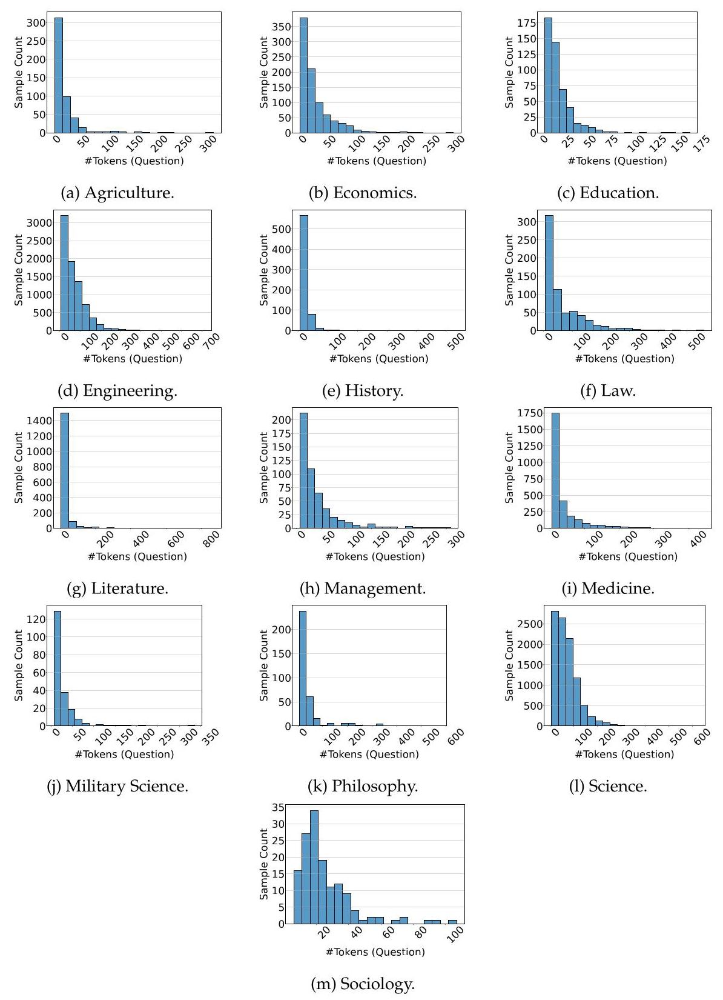

Figure 9. Question Length Distribution Across Disciplines.

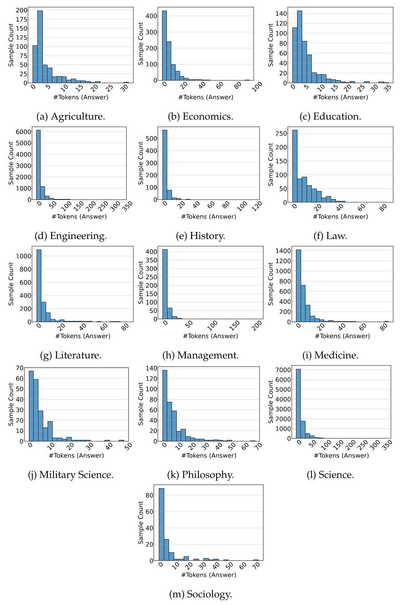

Figure 10. Answer Length Distribution Across Disciplines.

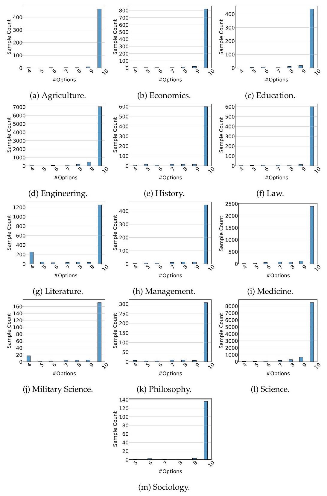

Figure 11. Option Count Distribution Across Disciplines.

## F. Evaluation Prompt

### F.1. Zero-shot Prompt

6 Zero-shot

Answer the following multiple-choice question. There is only one correct answer. The last line of your response should be in the format 'Answer: \$LETTER (without quotes), where LETTER is one of A, B, C, D, E, F, G, H, I, or J.

\{Question\}

6 Question format example:

Question: A microwave oven is connected to an outlet, \( {120}\mathrm{\;V} \) , and draws a current of 2 amps. At what rate is energy being used by the microwave oven? A) \( {240}\mathrm{\;W} \) B) \( {120}\mathrm{\;W} \) C) \( {10}\mathrm{\;W} \) D) \( {480}\mathrm{\;W} \) E) \( {360}\mathrm{\;W} \) F) \( {200}\mathrm{\;W} \) G) \( {30}\mathrm{\;W} \) H) \( {150}\mathrm{\;W} \) I) \( {60}\mathrm{\;W} \) J) \( {300}\mathrm{\;W} \)

### F.2. Five-shot Prompt

## (C) Five-shot

Answer the following multiple-choice question. There is only one correct answer. The last line of your response should be in the format 'Answer: \$LETTER (without quotes), where LETTER is one of A, B, C, D, E, F, G, H, I, or J.

Question: A refracting telescope consists of two converging lenses separated by \( {100}\mathrm{\;{cm}} \) . The eye-piece lens has a focal length of \( {20}\mathrm{\;{cm}} \) . The angular magnification of the telescope is (   ).

A) 10

B) 40

C) 6

D) 25

E) 15

F) 50

G) 30

H) 4

I) 5

J) 20

Answer: Let's think step by step. In a refracting telescope, if both lenses are converging, the focus of both lenses must be between the two lenses, and thus the focal lengths of the two lenses must add up to their separation. Since the focal length of one lens is \( {20}\mathrm{\;{cm}} \) , the focal length of the other must be \( {80}\mathrm{\;{cm}} \) . The magnification is the ratio of these two focal lengths, or 4 .

Answer: H.

Question: Say the pupil of your eye has a diameter of \( 5\mathrm{\;{mm}} \) and you have a telescope with an aperture of \( {50}\mathrm{\;{cm}} \) . How much more light can the telescope gather than your eye? A) 1000 times more

B) 50 times more

C) 5000 times more

D) 500 times more

E) 10000 times more

F) 20000 times more

G) 2000 times more

H) 100 times more

I) 10 times more

J) N/A

Answer: Let's think step by step. The amount of light a telescope can gather compared to the human eye is proportional to the area of its apertures. The area of a circle is given by the formula \( A = \pi {\left( \frac{D}{2}\right) }^{2} \) , where \( D \) is the diameter. Therefore, the relative light-gathering power is calculated as:

\[
\frac{{\left( \frac{{50}\mathrm{\;{cm}}}{2}\right) }^{2}}{{\left( \frac{5\mathrm{\;{mm}}}{2}\right) }^{2}} = \frac{{\left( \frac{{50}\mathrm{\;{cm}}}{{0.1}\mathrm{\;{cm}}}\right) }^{2}}{{\left( \frac{5\mathrm{\;{mm}}}{{0.1}\mathrm{\;{cm}}}\right) }^{2}} = \frac{{500}^{2}}{{5}^{2}} = {10000}.
\]

Answer: E.

Question: Where do most short-period comets come from and how do we know?

A) The Kuiper belt; short period comets tend to be in the plane of the solar system like the Kuiper belt.

B) The asteroid belt; short period comets tend to come from random directions indicating

a spherical distribution of comets called the asteroid belt.

C) The asteroid belt; short period comets tend to be in the plane of the solar system just like the asteroid belt.

D) The Oort cloud; short period comets have orbital periods similar to asteroids like Vesta and are found in the plane of the solar system just like the Oort cloud.

E) The Oort Cloud; short period comets tend to come from random directions indicating a spherical distribution of comets called the Oort Cloud.

F) The Oort cloud; short period comets tend to be in the plane of the solar system just like the Oort cloud.

G) The asteroid belt; short period comets have orbital periods similar to asteroids like Vesta and are found in the plane of the solar system just like the asteroid belt.

Answer: Let's think step by step. Most short-period comets originate from the Kuiper belt. This is deduced from the observation that these comets tend to follow orbits that lie in the plane of the solar system, similar to the distribution of objects in the Kuiper belt itself. Thus, the alignment of these cometary orbits with the ecliptic plane points to their Kuiper belt origin.

Answer: A.

Question: Colors in a soap bubble result from light (   ).

A) dispersion

B) deflection

C) refraction

D) reflection

E) interference

F) converted to a different frequency

G) polarization

H) absorption

I) diffraction

J) transmission

Answer: Let's think step by step.The colorful patterns observed in a soap bubble are caused by the phenomenon of light interference. This occurs when light waves bounce between the two surfaces of the soap film, combining constructively or destructively based on their phase differences and the varying thickness of the film. These interactions result in vibrant color patterns due to variations in the intensity of different wavelengths of light.

Answer: E.

Question: A microwave oven is connected to an outlet, \( {120}\mathrm{\;V} \) , and draws a current of 2 amps. At what rate is energy being used by the microwave oven?

A) \( {240}\mathrm{\;W} \)

B) \( {120}\mathrm{W} \)

C) \( {10}\mathrm{\;W} \)

D) \( {480}\mathrm{\;W} \)

E) \( {360}\mathrm{\;W} \)

F) \( {200}\mathrm{\;W} \)

G) \( {30}\mathrm{\;W} \)

H) \( {150}\mathrm{\;W} \)

I) \( {60}\mathrm{\;W} \)

J) \( {300}\mathrm{\;W} \)

Answer: Let's think step by step. The rate of energy usage, known as power, in an electrical circuit is calculated by the product of voltage and current. For a microwave oven connected to a \( {120}\mathrm{\;V} \) outlet and drawing a current of 2 amps, the power consumption can be calculated as follows:

Power \( = \) Voltage \( \times \) Current \( = {120}\mathrm{\;V} \times  2\mathrm{\;A} = {240}\mathrm{\;W} \) .

Therefore, the microwave oven uses energy at a rate of 240 watts.

Answer: A.

\{Question\}

---

Answer: Let's think step by step.

---

## G. Further Experiment Analysis

### G.1. Impact of Subfield Information

We conduct zero-shot evaluations under two conditions to investigate the impact of subfield information. 1) zero-shot-with-subfield, where the prompt includes a description of the problem's subfield, and (2)zero-shot-without-subfield, where no subfield information is provided.The prompts employed for the zero-shot-with-subfield evaluation are presented below. 6 Zero-shot-with-subfield

Answer the following multiple choice question about \{subfield\}

There is only one correct answer. The last line of your response should be in the format ’Answer: \$LETTER’ (without quotes), where LETTER is one of A, B, C, D, E, F, G, H, I, or J.

## 6 Question format example:

The common-mode rejection ratio of the first stage amplification circuit in a three-op-amp differential circuit is determined by (   ).

A) the absolute value of the difference in the common-mode rejection ratio of A1 and A2 themselves

B) all of the above

C) the average of A1 and A2's common-mode rejection ratios

D) the sum of A1 and A2's common-mode rejection ratios

E) the product of A1 and A2's common-mode rejection ratios

F) the square root of the product of A1 and A2's common-mode rejection ratios

G) the size of A2's common-mode rejection ratio

H) the size of A1's common-mode rejection ratio

I) The difference in the common-mode rejection ratio of A1 and A2 themselves

J) input resistance

### G.2. Robustness of the Evaluation

We employ 4 types of initial prompts and 6 types of question formats, resulting in a combination of 24 different prompt styles to verify the robustness of our bench. The 4 initial prompts and 6 types of question formats are listed below.

## 6 Initial Prompt 1

Answer the following multiple choice question. There is only one correct answer. The last line of your response should be in the format ’Answer: \$LETTER’ (without quotes), where LETTER is one of A, B, C, D, E, F, G, H, I, or J.

## 4 Initial Prompt 2

You are a helpful assistant. Answer the given multiple-choice question. Only one option is correct. The last line of your response should be in the format 'The correct answer is: \$LETTER’, where LETTER is one of A, B, C, D, E, F, G, H, I, or J.

## 6 Initial Prompt 3

Select the correct answer for the following multiple-choice question. There is only one valid choice. The last line of your response should be in the format ’Answer: \$LETTER’ (without quotes), where LETTER is one of A, B, C, D, E, F, G, H, I, or J.

## 6 Initial Prompt 4

Review the following multiple-choice question and choose the one correct answer. Ensure that your response concludes with a line exactly formatted as 'The correct answer is: \$LETTER’, where LETTER represents one of A, B, C, D, E, F, G, H, I, or J.

## 6 Question Format Example 1

The common-mode rejection ratio of the first stage amplification circuit in a three-op-amp differential circuit is determined by (   ).

A) the absolute value of the difference in the common-mode rejection ratio of A1 and A2 themselves

B) all of the above

C) the average of A1 and A2's common-mode rejection ratios

D) the sum of A1 and A2's common-mode rejection ratios

E) the product of A1 and A2's common-mode rejection ratios

F) the square root of the product of A1 and A2's common-mode rejection ratios

G) the size of A2's common-mode rejection ratio

H) the size of A1's common-mode rejection ratio

I) The difference in the common-mode rejection ratio of A1 and A2 themselves

J) input resistance

## 4 Question Format Example 2

The common-mode rejection ratio of the first stage amplification circuit in a three-op-amp differential circuit is determined by (   ). A. the absolute value of the difference in the common-mode rejection ratio of A1 and A2 themselves

B. all of the above

C. the average of A1 and A2's common-mode rejection ratios

D. the sum of A1 and A2's common-mode rejection ratios

E. the product of A1 and A2's common-mode rejection ratios

F. the square root of the product of A1 and A2's common-mode rejection ratios

G. the size of A2's common-mode rejection ratio

H. the size of A1's common-mode rejection ratio

I. The difference in the common-mode rejection ratio of A1 and A2 themselves

J. input resistance Your response:

## 6 Question Format Example 3

Question: The common-mode rejection ratio of the first stage amplification circuit in a three-op-amp differential circuit is determined by (   ).

## Options:

A) the absolute value of the difference in the common-mode rejection ratio of A1 and A2 themselves B) all of the above C) the average of A1 and A2's common-mode rejection ratios D) the sum of A1 and A2's common-mode rejection ratios E) the product of A1 and A2's common-mode rejection ratios F) the square root of the product of A1 and A2's common-mode rejection ratios G) the size of A2's common-mode rejection ratio H) the size of A1's common-mode rejection ratio I) The difference in the common-mode rejection ratio of A1 and A2 themselves J) input resistance Please begin answering.

## 4 Question Format Example 4

Q: The common-mode rejection ratio of the first stage amplification circuit in a three-op-amp differential circuit is determined by (   ). (A) the absolute value of the difference in the common-mode rejection ratio of A1 and A2 themselves (B) all of the above (C) the average of A1 and A2's common-mode rejection ratios (D) the sum of A1 and A2's common-mode rejection ratios (E) the product of A1 and A2's common-mode rejection ratios (F) the square root of the product of A1 and A2's common-mode rejection ratios (G) the size of A2's common-mode rejection ratio (H) the size of A1's common-mode rejection ratio (I) The difference in the common-mode rejection ratio of A1 and A2 themselves (J) input resistance

## 4 Question Format Example 5

**Question**: The common-mode rejection ratio of the first stage amplification circuit in a three-op-amp differential circuit is determined by (   ).

**Options**:

(A) the absolute value of the difference in the common-mode rejection ratio of A1 and A2 themselves

(B) all of the above

(C) the average of A1 and A2's common-mode rejection ratios

(D) the sum of A1 and A2's common-mode rejection ratios

(E) the product of A1 and A2's common-mode rejection ratios

(F) the square root of the product of A1 and A2's common-mode rejection ratios

(G) the size of A2's common-mode rejection ratio

(H) the size of A1's common-mode rejection ratio

(I) The difference in the common-mode rejection ratio of A1 and A2 themselves

(J) input resistance

## 4 Question Format Example 6

Question: The common-mode rejection ratio of the first stage amplification circuit in a

three-op-amp differential circuit is determined by (   ).

Options:

A: the absolute value of the difference in the common-mode rejection ratio of A1 and A2

## themselves

B: all of the above

C: the average of A1 and A2's common-mode rejection ratios

D: the sum of A1 and A2's common-mode rejection ratios

E: the product of A1 and A2's common-mode rejection ratios

F: the square root of the product of A1 and A2's common-mode rejection ratios

G: the size of A2's common-mode rejection ratio

\( \mathrm{H} \) : the size of \( \mathrm{A}{1}^{\prime }\mathrm{s} \) common-mode rejection ratio

I: The difference in the common-mode rejection ratio of A1 and A2 themselves

J: input resistance

## H. Benchmarks for Data Expansion

Table 11. Benchmark List for Data Supplementation in SuperGPQA Annotation.

<table><tr><td>Benchmark Name</td><td>Title</td><td>\( \mathbf{{Year}} \)</td></tr><tr><td>LawBench</td><td>LawBench: Benchmarking Legal Knowledge of Large Language Models Fei et al. [2023]</td><td>2023</td></tr><tr><td>MedMCQA</td><td>MedMCQA: A Large-scale Multi-Subject Multi-Choice 202: Dataset for Medical domain Question Answering Pal et al. [2022]</td><td/></tr><tr><td>MedQA</td><td>What Disease does this Patient Have? A Large-scale 2020 Open Domain Question Answering Dataset from Med- ical Exams Jin et al. [2020]</td><td/></tr><tr><td>MMLU-Pro</td><td>MMLU-Pro: A More Robust and Challenging Multi- 2024 Task Language Understanding Benchmark Wang et al. [2024b]</td><td/></tr><tr><td>MMLU-CF</td><td>MMLU-CF: A Contamination-free Multi-task Lan- 2024 guage Understanding Benchmark Zhao et al. [2024]</td><td/></tr><tr><td>ShoppingMMLU</td><td>Shopping MMLU: A Massive Multi-Task Online Shop- 2024 ping Benchmark for Large Language Models Jin et al. [2024]</td><td/></tr><tr><td>UTMath</td><td>UTMath: Math Evaluation with Unit Test via 2024 Reasoning-to-Coding Thoughts Yang et al. [2024b]</td><td/></tr><tr><td>MusicTheoryBench</td><td>ChatMusician: Understanding and Generating Music 2024 Intrinsically with LLM Yuan et al. [2024]</td><td/></tr><tr><td>Omni-Math</td><td>Omni-MATH: A Universal Olympiad Level Mathe- 2024 matic Benchmark For Large Language Models Gao et al. [2024]</td><td/></tr><tr><td>U-MATH</td><td>U-MATH: A University-Level Benchmark for Evalu- 2024 ating Mathematical Skills in LLMs Chernyshev et al. [2024]</td><td/></tr></table>

<table><tr><td>Putnam-AXIOM</td><td>Putnam-AXIOM: A Functional and Static Benchmark 2024 for Measuring Higher Level Mathematical Reason- ing Fronsdal et al. [2024]</td><td/></tr><tr><td>Short-form Factuality</td><td>Measuring short-form factuality in large language 2( models Wei et al. [2024b]</td><td>2024</td></tr><tr><td>Chinese SimpleQA</td><td>Chinese SimpleQA: A Chinese Factuality Evaluation 2024 for Large Language Models He et al. [2024b]</td><td/></tr><tr><td>AIME-AOPS</td><td>AIME Problems and Solutions of Problem Solving [2024]</td><td>2024</td></tr><tr><td>AIMO Validation AIME</td><td>AIMO Validation AIME: Internal Validation Set for 2024 AIMO Progress Prize AI-MO [2024]</td><td/></tr></table>

Back to Section Start | Back to Table of Contents

## I. More Comprehensive Analysis of Baseline Performances

In addition to the models discussed in the subsection 4.2, Table 12 and Table 13 provide a more comprehensive analysis of baseline performances, including evaluations of models from the Yi-1.5 (6B, 9B), OLMo-2 (7B), Mistral (Small), granite-3.1 (2B), Gemma-2 (2B, 9B), Llama-3.1 (8B), Mixtral (8x7B), and K2 [Liu et al., 2025].

<table><tr><td>Model</td><td>Overall (sample)</td><td>Overall (subfield)</td><td>Overall (field)</td><td>Overall (discipline)</td><td>Easy (sample)</td><td>Middle (sample)</td><td>Hard (sample)</td></tr><tr><td colspan="8">Reasoning Models</td></tr><tr><td>DeepSeek-R1</td><td>61.82</td><td>62.61</td><td>61.23</td><td>59.95</td><td>63.59</td><td>63.63</td><td>56.87</td></tr><tr><td>o1-2024-12-17</td><td>60.24</td><td>61.25</td><td>59.94</td><td>59.44</td><td>64.40</td><td>61.44</td><td>53.67</td></tr><tr><td>DeepSeek-R1-Zero</td><td>60.24</td><td>61.62</td><td>60.95</td><td>60.99</td><td>65.06</td><td>62.61</td><td>50.99</td></tr><tr><td>o3-mini-2025-01-31-high</td><td>55.22</td><td>54.94</td><td>52.11</td><td>48.32</td><td>53.05</td><td>56.09</td><td>56.16</td></tr><tr><td>o3-mini-2025-01-31-medium</td><td>52.69</td><td>52.66</td><td>49.95</td><td>46.07</td><td>51.30</td><td>53.79</td><td>52.37</td></tr><tr><td>o3-mini-2025-01-31-low</td><td>48.03</td><td>48.51</td><td>45.89</td><td>42.63</td><td>48.80</td><td>50.21</td><td>43.53</td></tr><tr><td>o1-mini-2024-09-12</td><td>45.22</td><td>45.46</td><td>42.53</td><td>39.33</td><td>46.77</td><td>47.34</td><td>40.00</td></tr><tr><td>QwQ</td><td>43.59</td><td>44.40</td><td>43.19</td><td>41.63</td><td>46.46</td><td>47.40</td><td>34.07</td></tr><tr><td colspan="8">Chat Models</td></tr><tr><td>Doubao-1.5-pro-32k-250115</td><td>55.09</td><td>56.55</td><td>55.62</td><td>54.39</td><td>57.70</td><td>60.15</td><td>43.80</td></tr><tr><td>Doubao-1.5-pro-32k-241225</td><td>50.93</td><td>52.41</td><td>51.76</td><td>51.24</td><td>53.54</td><td>56.56</td><td>38.70</td></tr><tr><td>qwen-max-2025-01-25</td><td>50.08</td><td>52.75</td><td>52.47</td><td>51.65</td><td>58.16</td><td>54.95</td><td>33.09</td></tr><tr><td>claude-3-5-sonnet-20241022</td><td>48.16</td><td>51.38</td><td>51.23</td><td>53.15</td><td>59.04</td><td>51.91</td><td>29.99</td></tr><tr><td>gemini-2.0-flash</td><td>47.73</td><td>48.70</td><td>47.80</td><td>46.10</td><td>53.06</td><td>49.56</td><td>38.84</td></tr><tr><td>DeepSeek-V3</td><td>47.40</td><td>49.10</td><td>48.31</td><td>47.35</td><td>55.63</td><td>50.11</td><td>33.86</td></tr><tr><td>MiniMax-Text-01</td><td>45.11</td><td>47.46</td><td>46.97</td><td>47.06</td><td>54.51</td><td>48.60</td><td>28.98</td></tr><tr><td>gpt-4o-2024-11-20</td><td>44.40</td><td>47.62</td><td>47.50</td><td>48.84</td><td>56.84</td><td>48.75</td><td>23.50</td></tr><tr><td>Llama-3.1-405B-Instruct</td><td>43.14</td><td>46.43</td><td>45.83</td><td>47.35</td><td>56.06</td><td>46.31</td><td>23.70</td></tr><tr><td>gpt-4o-2024-08-06</td><td>41.64</td><td>44.79</td><td>44.91</td><td>46.29</td><td>55.22</td><td>45.11</td><td>20.98</td></tr><tr><td>Owen2.5-72B-Instruct</td><td>40.75</td><td>43.66</td><td>43.32</td><td>42.10</td><td>48.84</td><td>45.42</td><td>24.10</td></tr><tr><td>Mistral-Large-Instruct-2411</td><td>40.65</td><td>43.38</td><td>43.13</td><td>43.37</td><td>52.92</td><td>43.28</td><td>22.81</td></tr><tr><td>qwen-max-2024-09-19</td><td>39.96</td><td>42.93</td><td>42.16</td><td>41.62</td><td>50.23</td><td>43.63</td><td>22.60</td></tr><tr><td>gpt-4o-2024-05-13</td><td>39.76</td><td>43.19</td><td>43.13</td><td>45.23</td><td>53.37</td><td>42.38</td><td>20.45</td></tr><tr><td>Owen2.5-32B-Instruct</td><td>38.76</td><td>41.18</td><td>40.40</td><td>39.43</td><td>47.42</td><td>43.05</td><td>22.13</td></tr><tr><td>Llama-3.3-70B-Instruct</td><td>37.69</td><td>40.56</td><td>40.15</td><td>41.12</td><td>49.68</td><td>40.68</td><td>19.55</td></tr><tr><td>phi-4</td><td>37.65</td><td>39.59</td><td>38.61</td><td>37.66</td><td>45.43</td><td>40.91</td><td>23.69</td></tr><tr><td>Owen2.5-14B-Instruct</td><td>35.15</td><td>37.72</td><td>37.41</td><td>36.07</td><td>44.82</td><td>37.90</td><td>19.97</td></tr><tr><td>Llama-3.1-70B-Instruct</td><td>34.86</td><td>38.94</td><td>39.18</td><td>40.57</td><td>48.22</td><td>37.85</td><td>15.22</td></tr><tr><td>Yi-Lightning</td><td>33.42</td><td>36.57</td><td>36.45</td><td>36.92</td><td>43.38</td><td>35.32</td><td>19.35</td></tr><tr><td>Mixtral-8x22B-Instruct-v0.1</td><td>29.23</td><td>32.14</td><td>32.28</td><td>32.82</td><td>42.52</td><td>29.73</td><td>13.82</td></tr><tr><td>Owen2.5-7B-Instruct</td><td>28.78</td><td>30.78</td><td>30.37</td><td>30.63</td><td>37.77</td><td>30.98</td><td>15.23</td></tr><tr><td>gemma-2-27b-it</td><td>27.43</td><td>30.50</td><td>30.42</td><td>31.30</td><td>40.90</td><td>27.45</td><td>12.64</td></tr><tr><td>Yi-1.5-34B-Chat</td><td>26.03</td><td>28.81</td><td>28.84</td><td>29.08</td><td>36.99</td><td>26.74</td><td>12.81</td></tr><tr><td>Mistral-Small-Instruct-2409</td><td>25.89</td><td>28.46</td><td>28.69</td><td>28.59</td><td>37.93</td><td>25.89</td><td>12.70</td></tr><tr><td>gemma-2-9b-it</td><td>24.04</td><td>26.89</td><td>27.06</td><td>27.74</td><td>37.81</td><td>23.05</td><td>10.60</td></tr><tr><td>Owen2.5-3B-Instruct</td><td>23.31</td><td>25.45</td><td>25.86</td><td>25.57</td><td>33.10</td><td>23.50</td><td>12.24</td></tr><tr><td>Yi-1.5-9B-Chat</td><td>23.17</td><td>25.32</td><td>25.65</td><td>26.07</td><td>32.75</td><td>24.05</td><td>11.19</td></tr><tr><td>K2-Chat</td><td>22.47</td><td>24.59</td><td>24.61</td><td>24.61</td><td>30.58</td><td>21.95</td><td>14.44</td></tr><tr><td>Mixtral-8x7B-Instruct-v0.1</td><td>22.10</td><td>24.76</td><td>24.73</td><td>26.36</td><td>34.19</td><td>20.52</td><td>11.49</td></tr><tr><td>granite-3.1-8b-instruct</td><td>20.83</td><td>22.85</td><td>22.92</td><td>22.26</td><td>29.48</td><td>19.79</td><td>13.09</td></tr><tr><td>Llama-3.1-8B-Instruct</td><td>20.50</td><td>24.07</td><td>24.52</td><td>26.12</td><td>32.82</td><td>20.37</td><td>7.22</td></tr><tr><td>Yi-1.5-6B-Chat</td><td>19.24</td><td>21.32</td><td>21.39</td><td>22.21</td><td>27.90</td><td>18.83</td><td>10.44</td></tr><tr><td>Owen2.5-1.5B-Instruct</td><td>18.82</td><td>20.91</td><td>20.75</td><td>22.11</td><td>27.41</td><td>18.19</td><td>10.45</td></tr><tr><td>OLMo-2-1124-13B-Instruct</td><td>18.66</td><td>20.46</td><td>20.60</td><td>21.80</td><td>27.10</td><td>17.85</td><td>10.74</td></tr><tr><td>gemma-2-2b-it</td><td>18.61</td><td>19.91</td><td>19.97</td><td>20.50</td><td>26.40</td><td>16.95</td><td>12.85</td></tr><tr><td>granite-3.1-2b-instruct</td><td>17.92</td><td>19.02</td><td>19.11</td><td>19.58</td><td>23.94</td><td>17.58</td><td>11.87</td></tr><tr><td>Mistral-7B-Instruct-v0.3</td><td>17.82</td><td>19.64</td><td>19.65</td><td>20.09</td><td>26.37</td><td>16.64</td><td>10.41</td></tr><tr><td>MAP-Neo-7B-Instruct-v0.1</td><td>17.05</td><td>18.52</td><td>18.42</td><td>18.70</td><td>23.26</td><td>16.62</td><td>10.95</td></tr><tr><td>OLMo-2-1124-7B-Instruct</td><td>16.81</td><td>18.08</td><td>18.57</td><td>18.85</td><td>22.80</td><td>15.82</td><td>11.90</td></tr><tr><td>Owen2.5-0.5B-Instruct</td><td>10.77</td><td>11.92</td><td>12.47</td><td>13.47</td><td>14.90</td><td>10.88</td><td>6.07</td></tr><tr><td colspan="8">Base Models</td></tr><tr><td>Owen2.5-72B</td><td>34.33</td><td>38.08</td><td>38.70</td><td>39.54</td><td>46.20</td><td>38.12</td><td>15.01</td></tr><tr><td>Qwen2.5-32B</td><td>33.16</td><td>36.52</td><td>37.33</td><td>38.29</td><td>45.12</td><td>36.58</td><td>14.34</td></tr><tr><td>DeepSeek-V3-Base</td><td>32.14</td><td>34.79</td><td>34.58</td><td>34.71</td><td>41.28</td><td>34.50</td><td>18,20</td></tr><tr><td>Owen2.5-14B</td><td>30.19</td><td>33.33</td><td>34.14</td><td>34.54</td><td>42.27</td><td>31.44</td><td>14.85</td></tr><tr><td>Yi-1.5-34B</td><td>27.62</td><td>30.78</td><td>31.03</td><td>32.55</td><td>39.68</td><td>27.95</td><td>13.86</td></tr><tr><td>Llama-3.1-70B</td><td>27.22</td><td>30.52</td><td>31.28</td><td>32.55</td><td>40.78</td><td>26.95</td><td>12.78</td></tr><tr><td>Owen2.5-7B</td><td>25.36</td><td>28.19</td><td>28.73</td><td>29.60</td><td>36.58</td><td>25.94</td><td>12.10</td></tr><tr><td>Llama-3.1-405B</td><td>25.23</td><td>28.09</td><td>28.33</td><td>30.15</td><td>37.58</td><td>25.12</td><td>11.86</td></tr><tr><td>gemma-2-27b</td><td>24.49</td><td>27.35</td><td>27.96</td><td>28.58</td><td>36.26</td><td>24.07</td><td>12.27</td></tr><tr><td>Yi-1.5-9B</td><td>23.10</td><td>25.40</td><td>25.69</td><td>26.17</td><td>32.52</td><td>22.98</td><td>12.96</td></tr><tr><td>gemma-2-9b</td><td>22.56</td><td>25.19</td><td>25.47</td><td>26.26</td><td>33.88</td><td>21.34</td><td>12.20</td></tr><tr><td>Mixtral-8x22B-v0.1</td><td>22.41</td><td>24.71</td><td>25.04</td><td>25.02</td><td>32.78</td><td>21.67</td><td>12.26</td></tr><tr><td>Mixtral-8x7B-v0.1</td><td>21.76</td><td>24.92</td><td>25.45</td><td>27.36</td><td>33.66</td><td>20.32</td><td>11.13</td></tr><tr><td>K2</td><td>20.92</td><td>23.62</td><td>23.88</td><td>24.65</td><td>30.97</td><td>20.01</td><td>1140</td></tr><tr><td>Yi-1.5-6B</td><td>20.20</td><td>22.10</td><td>22.56</td><td>23.44</td><td>28.37</td><td>19.64</td><td>12.20</td></tr><tr><td>Owen2.5-3B</td><td>20.14</td><td>22.81</td><td>23.30</td><td>24.42</td><td>30.42</td><td>19.81</td><td>9.40</td></tr><tr><td>Llama-3 1-8B</td><td>19.93</td><td>22.42</td><td>22.77</td><td>23.87</td><td>30.33</td><td>18.94</td><td>10.16</td></tr><tr><td>Mistral-7B-v0.3</td><td>19.48</td><td>21.50</td><td>21.81</td><td>22.27</td><td>27.62</td><td>18.65</td><td>11.96</td></tr><tr><td>Owen2.5-1.5B</td><td>17.17</td><td>19.31</td><td>19.80</td><td>21.35</td><td>24.52</td><td>16.79</td><td>9.74</td></tr><tr><td>granite-3.1-2b-base</td><td>16.18</td><td>17.90</td><td>17.91</td><td>18.09</td><td>23.13</td><td>14.91</td><td>10.67</td></tr><tr><td>OLMo-2-1124-13B</td><td>16.07</td><td>18.75</td><td>19.82</td><td>21.37</td><td>27.24</td><td>14.41</td><td>6.57</td></tr><tr><td>MAP-Neo-7B</td><td>15.76</td><td>17.48</td><td>18.26</td><td>19.54</td><td>22.86</td><td>14.64</td><td>9.83</td></tr><tr><td>granite-3.1-8b-base OLMo-2-1124-7B</td><td>15.69 15.15</td><td>16.98 17.62</td><td>16.79 18.30</td><td>16.65 19.60</td><td>20.40 24.43</td><td>15.65 13.83</td><td>10.60 7.15</td></tr><tr><td>gemma-2-2b</td><td>13.57</td><td>14.98</td><td>15.43</td><td>16.21</td><td>19.12</td><td>13.47</td><td>7.63</td></tr><tr><td>Owen2.5-0.5B</td><td>10.74</td><td>11.88</td><td>12.09</td><td>13.25</td><td>14.41</td><td>10.78</td><td>6.65</td></tr></table>

Table 12. Detailed Performance Overview on SuperGPQA- Pivot Table 1. LLMs are scored sample-wise, subfield-wise, field-wise, and discipline-wise levels to ensure fair assessment despite imbalanced question counts. The columns Easy(sample), Middle(sample), and Hard(sample) represent average scores according to difficulty. The highest score in each column is indicated with a \( \overline{\text{ box }} \) ; the second-best score is in bold, and the third-best score is underlined.

<table><tr><td>Model</td><td>\( \mathbf{{Agr}.} \)</td><td>Econ.</td><td>Edu.</td><td>Eng.</td><td>Hist.</td><td>Law</td><td>Lit & Arts</td><td>Mgt.</td><td>Med.</td><td>Mil Sci.</td><td>Phil.</td><td>Sci.</td><td>Soc.</td></tr><tr><td colspan="14">Reasoning Models</td></tr><tr><td>DeepSeek-R1</td><td>54.43</td><td>66.09</td><td>54.75</td><td>63.10</td><td>55.19</td><td>65.24</td><td>52.45</td><td>57.09</td><td>59.93</td><td>57.07</td><td>63.11</td><td>63.69</td><td>67.13</td></tr><tr><td>DeepSeek-R1-Zero</td><td>53.81</td><td>66.44</td><td>60.54</td><td>60.28</td><td>58.61</td><td>66.77</td><td>56.86</td><td>59.68</td><td>60.65</td><td>58.54</td><td>63.69</td><td>59.93</td><td>67.13</td></tr><tr><td>o1-2024-12-17</td><td>50.93</td><td>61.17</td><td>53.31</td><td>59.17</td><td>60.98</td><td>63.87</td><td>55.79</td><td>57.29</td><td>62.25</td><td>60.49</td><td>61.38</td><td>61.76</td><td>64.34</td></tr><tr><td>o3-mini-2025-01-31-high</td><td>41.03</td><td>54.07</td><td>46.28</td><td>56.41</td><td>36.80</td><td>45.73</td><td>39.44</td><td>51.50</td><td>51.72</td><td>46.34</td><td>51.01</td><td>61.72</td><td>46.15</td></tr><tr><td>o3-mini-2025-01-31-medium</td><td>40.62</td><td>51.32</td><td>41.74</td><td>53.83</td><td>35.01</td><td>43.60</td><td>37.11</td><td>48.50</td><td>50.34</td><td>45.85</td><td>48.13</td><td>58.79</td><td>44.06</td></tr><tr><td>o3-mini-2025-01-31-low</td><td>37.32</td><td>45.25</td><td>38.43</td><td>48.20</td><td>32.94</td><td>39.79</td><td>36.22</td><td>43.71</td><td>48.09</td><td>41.46</td><td>44.09</td><td>53.24</td><td>45.45</td></tr><tr><td>o1-mini-2024-09-12</td><td>34.02</td><td>45.02</td><td>36.16</td><td>45.41</td><td>26.26</td><td>35.98</td><td>32.22</td><td>40.52</td><td>44.32</td><td>39.51</td><td>39.48</td><td>51.09</td><td>41.26</td></tr><tr><td>QwQ</td><td>38.14</td><td>47.77</td><td>45.25</td><td>43.37</td><td>29.53</td><td>45.88</td><td>32.82</td><td>41.32</td><td>43.88</td><td>40.00</td><td>43.52</td><td>46.33</td><td>43.36</td></tr><tr><td colspan="14">Chat Models</td></tr><tr><td>Doubao-1.5-pro-32k-250115</td><td>50.93</td><td>65.06</td><td>55.58</td><td>55.60</td><td>42.88</td><td>58.84</td><td>42.30</td><td>53.29</td><td>59.13</td><td>54.15</td><td>61.96</td><td>55.54</td><td>51.75</td></tr><tr><td>Doubao-1.5-pro-32k-241225</td><td>47.42</td><td>60.14</td><td>54.75</td><td>50.76</td><td>37.54</td><td>54.12</td><td>38.31</td><td>52.69</td><td>54.99</td><td>53.66</td><td>57.06</td><td>51.57</td><td>53.15</td></tr><tr><td>claude-3-5-sonnet-20241022</td><td>47.01</td><td>56.59</td><td>53.72</td><td>47.57</td><td>53.56</td><td>60.21</td><td>50.42</td><td>51.30</td><td>49.26</td><td>59.51</td><td>52.45</td><td>45.02</td><td>64.34</td></tr><tr><td>qwen-max-2025-01-25</td><td>44.33</td><td>57.50</td><td>56.40</td><td>50.81</td><td>44.81</td><td>54.12</td><td>44.93</td><td>54.69</td><td>56.37</td><td>49.27</td><td>56.20</td><td>47.51</td><td>54.55</td></tr><tr><td>Llama-3.1-405B-Instruct</td><td>43.09</td><td>49.71</td><td>45.45</td><td>41.89</td><td>50.00</td><td>55.34</td><td>43.20</td><td>47.70</td><td>49.04</td><td>52.20</td><td>48.41</td><td>39.80</td><td>49.65</td></tr><tr><td>gpt-4o-2024-11-20</td><td>42.27</td><td>46.74</td><td>50.00</td><td>42.83</td><td>52.52</td><td>53.81</td><td>46.72</td><td>47.31</td><td>52.52</td><td>52.20</td><td>52.74</td><td>40.67</td><td>54.55</td></tr><tr><td>gpt-4o-2024-05-13</td><td>41.44</td><td>40.78</td><td>44.21</td><td>37.47</td><td>50.74</td><td>52.90</td><td>45.11</td><td>41.32</td><td>48.82</td><td>50.73</td><td>45.24</td><td>35.41</td><td>53.85</td></tr><tr><td>DeepSeek-V3</td><td>41.24</td><td>49.48</td><td>43.80</td><td>47.21</td><td>47.18</td><td>51.07</td><td>45.23</td><td>48.50</td><td>46.10</td><td>48.29</td><td>43.23</td><td>48.30</td><td>55.94</td></tr><tr><td>Owen2.5-72B-Instruct</td><td>41.24</td><td>46.62</td><td>44.42</td><td>41.12</td><td>30.71</td><td>45.88</td><td>34.90</td><td>42.32</td><td>45.74</td><td>45.37</td><td>43.52</td><td>39.33</td><td>46.15</td></tr><tr><td>MiniMax-Text-01</td><td>39.79</td><td>49.60</td><td>47.52</td><td>44.88</td><td>45.25</td><td>54.27</td><td>43.02</td><td>48.90</td><td>47.08</td><td>48.29</td><td>45.53</td><td>43.81</td><td>53.85</td></tr><tr><td>gpt-4o-2024-08-06</td><td>39.59</td><td>40.78</td><td>44.42</td><td>38.84</td><td>50.89</td><td>54.12</td><td>46.30</td><td>45.51</td><td>50.49</td><td>50.73</td><td>47.84</td><td>38.41</td><td>53.85</td></tr><tr><td>Mistral-Large-Instruct-2411</td><td>38.76</td><td>42.27</td><td>42.15</td><td>39.66</td><td>44.96</td><td>47.87</td><td>41.11</td><td>43.31</td><td>43.23</td><td>48.78</td><td>42.07</td><td>39.24</td><td>50.35</td></tr><tr><td>gemini-2.0-flash</td><td>38.56</td><td>45.93</td><td>42.36</td><td>48.37</td><td>45.25</td><td>49.24</td><td>43.68</td><td>41.32</td><td>43.77</td><td>51.22</td><td>45.53</td><td>50.20</td><td>53.85</td></tr><tr><td>Llama-3.1-70B-Instruct</td><td>37.11</td><td>41.12</td><td>41.94</td><td>33.88</td><td>33.09</td><td>45.88</td><td>35.08</td><td>46.11</td><td>44.21</td><td>47.80</td><td>42.94</td><td>30.04</td><td>48.25</td></tr><tr><td>Llama-3.3-70B-Instruct</td><td>36.70</td><td>40.55</td><td>40.29</td><td>36.44</td><td>41.25</td><td>44.66</td><td>38.54</td><td>45.51</td><td>43.77</td><td>46.34</td><td>42.94</td><td>34.96</td><td>42.66</td></tr><tr><td>qwen-max-2024-09-19</td><td>36.49</td><td>45.02</td><td>45.66</td><td>39.84</td><td>35.16</td><td>44.05</td><td>39.08</td><td>45.11</td><td>43.41</td><td>47.32</td><td>43.23</td><td>38.24</td><td>38.46</td></tr><tr><td>Qwen2.5-32B-Instruct</td><td>36.49</td><td>43.07</td><td>45.45</td><td>38.93</td><td>30.71</td><td>41.92</td><td>32.76</td><td>39.52</td><td>42.21</td><td>44.88</td><td>39.19</td><td>38.24</td><td>39.16</td></tr><tr><td>Owen2.5-14B-Instruct</td><td>36.08</td><td>37.69</td><td>39.26</td><td>35.87</td><td>26.41</td><td>37.04</td><td>31.44</td><td>41.52</td><td>36.91</td><td>38.05</td><td>38.04</td><td>34.20</td><td>36.36</td></tr><tr><td>Yi-Lighting</td><td>33.81</td><td>39.18</td><td>35.95</td><td>32.53</td><td>36.05</td><td>37.35</td><td>36.34</td><td>38.12</td><td>36.95</td><td>42.44</td><td>37.75</td><td>30.85</td><td>42.66</td></tr><tr><td>phi-4</td><td>32.78</td><td>40.21</td><td>39.26</td><td>37.27</td><td>30.27</td><td>41.46</td><td>31.62</td><td>39.12</td><td>37.79</td><td>39.02</td><td>40.63</td><td>38.87</td><td>41.26</td></tr><tr><td>gemma-2-27b-it</td><td>31.13</td><td>29.32</td><td>30.99</td><td>26.72</td><td>24.78</td><td>35.06</td><td>29.42</td><td>34.93</td><td>31.00</td><td>39.02</td><td>35.45</td><td>24.81</td><td>34.27</td></tr><tr><td>Owen2.5-7B-Instruct</td><td>29.28</td><td>34.59</td><td>35.33</td><td>28.38</td><td>22.85</td><td>32.62</td><td>24.28</td><td>33.33</td><td>32.60</td><td>32.68</td><td>34.58</td><td>27.54</td><td>30.07</td></tr><tr><td>Mistral-Small-Instruct-2409</td><td>28.87</td><td>26.23</td><td>26.86</td><td>25.25</td><td>25.96</td><td>30.95</td><td>27.57</td><td>30.54</td><td>28.53</td><td>34.15</td><td>29.68</td><td>24.17</td><td>32.87</td></tr><tr><td>Yi-1.5-34B-Chat</td><td>28.87</td><td>31.27</td><td>30.99</td><td>25.67</td><td>23.00</td><td>34.45</td><td>27.15</td><td>31.54</td><td>29.73</td><td>33.17</td><td>30.26</td><td>23.27</td><td>28.67</td></tr><tr><td>Mixtral-8x22B-Instruct-v0.1</td><td>28.25</td><td>33.45</td><td>33.68</td><td>29.02</td><td>30.86</td><td>34.60</td><td>30.55</td><td>35.13</td><td>30.53</td><td>44.39</td><td>32.85</td><td>26.95</td><td>36.36</td></tr><tr><td>Mixtral-8x7B-Instruct-v0.1</td><td>27.22</td><td>24.51</td><td>28.31</td><td>21.16</td><td>25.37</td><td>30.79</td><td>26.85</td><td>26.15</td><td>26.13</td><td>30.73</td><td>25.94</td><td>18.70</td><td>30.77</td></tr><tr><td>gemma-2-9b-it</td><td>27.01</td><td>27.15</td><td>32.64</td><td>23.24</td><td>22.26</td><td>28.51</td><td>27.45</td><td>32.14</td><td>27.44</td><td>34.15</td><td>29.39</td><td>21.26</td><td>27.97</td></tr><tr><td>Owen2.5-3B-Instruct</td><td>25.36</td><td>26.35</td><td>30.99</td><td>22.83</td><td>18.55</td><td>25.61</td><td>22.32</td><td>30.94</td><td>26.82</td><td>27.32</td><td>27.09</td><td>21.64</td><td>26.57</td></tr><tr><td>granite-3.1-8b-instruct</td><td>24.74</td><td>20.16</td><td>23.76</td><td>21.60</td><td>16.32</td><td>24.70</td><td>20.53</td><td>25.15</td><td>20.58</td><td>27.80</td><td>21.33</td><td>19.70</td><td>23.08</td></tr><tr><td>Llama-3.1-8B-Instruct</td><td>24.74</td><td>24.40</td><td>29.55</td><td>19.07</td><td>20.03</td><td>26.68</td><td>20.94</td><td>34.13</td><td>30.20</td><td>34.63</td><td>27.67</td><td>16.08</td><td>31.47</td></tr><tr><td>gemma-2-2b-it</td><td>24.33</td><td>21.31</td><td>19.42</td><td>18.30</td><td>17.06</td><td>21.80</td><td>19.21</td><td>21.56</td><td>19.27</td><td>26.83</td><td>19.60</td><td>17.53</td><td>20.28</td></tr><tr><td>Yi-1.5-9B-Chat</td><td>24.12</td><td>29.90</td><td>30.99</td><td>23.04</td><td>16.91</td><td>28.20</td><td>20.70</td><td>31.94</td><td>25.74</td><td>28.29</td><td>27.09</td><td>21.23</td><td>30.77</td></tr><tr><td>K2-Chat</td><td>22.68</td><td>23.37</td><td>27.27</td><td>23.10</td><td>16.02</td><td>30.49</td><td>23.39</td><td>28.74</td><td>23.99</td><td>28.29</td><td>27.09</td><td>20.32</td><td>25.17</td></tr><tr><td>Owen2.5-1.5B-Instruct</td><td>22.27</td><td>22.57</td><td>27.27</td><td>17.64</td><td>16.47</td><td>26.37</td><td>17.84</td><td>24.95</td><td>22.58</td><td>25.37</td><td>27.67</td><td>16.85</td><td>19.58</td></tr><tr><td>OLMo-2-1124-13B-Instruct</td><td>20.82</td><td>22.68</td><td>25.21</td><td>18.18</td><td>16.91</td><td>22.10</td><td>19.57</td><td>21.96</td><td>21.81</td><td>25.85</td><td>27.38</td><td>16.39</td><td>24.48</td></tr><tr><td>OLMo-2-1124-7B-Instruct</td><td>20.82</td><td>14.66</td><td>20.25</td><td>16.52</td><td>16.32</td><td>18.45</td><td>18.08</td><td>22.95</td><td>17.82</td><td>23.41</td><td>21.90</td><td>15.64</td><td>18.18</td></tr><tr><td>Yi-1.5-6B-Chat</td><td>20.41</td><td>23.83</td><td>25.62</td><td>18.50</td><td>13.95</td><td>25.61</td><td>18.79</td><td>24.15</td><td>21.89</td><td>29.27</td><td>25.36</td><td>17.60</td><td>23.78</td></tr><tr><td>Mistral-7B-Instruct-v0.3</td><td>20.00</td><td>17.75</td><td>18.18</td><td>17.28</td><td>15.88</td><td>21.19</td><td>21.12</td><td>23.55</td><td>20.04</td><td>26.83</td><td>22.19</td><td>16.18</td><td>20.98</td></tr><tr><td>granite-3.1-2b-instruct</td><td>18.14</td><td>19.93</td><td>19.83</td><td>17.64</td><td>16.77</td><td>23.02</td><td>19.03</td><td>23.15</td><td>17.46</td><td>22.44</td><td>19.02</td><td>17.09</td><td>20.98</td></tr><tr><td>MAP-Neo-7B-Instruct-v0.1</td><td>17.94</td><td>17.64</td><td>21.69</td><td>16.79</td><td>13.50</td><td>21.19</td><td>16.35</td><td>20.96</td><td>18.91</td><td>25.85</td><td>21.61</td><td>15.99</td><td>14.69</td></tr><tr><td>Qwen2.5-0.5B-Instruct</td><td>16.91</td><td>16.49</td><td>17.98</td><td>9.77</td><td>10.09</td><td>13.87</td><td>12.89</td><td>15.97</td><td>14.12</td><td>13.17</td><td>12.68</td><td>8.55</td><td>12.59</td></tr></table>

Base Models

<table><tr><td>Qwen2.5-32B</td><td>38.76</td><td>40.89</td><td>45.87</td><td>32.70</td><td>28.49</td><td>39.94</td><td>30.91</td><td>40.72</td><td>38.84</td><td>47.80</td><td>43.52</td><td>29.45</td><td>39.86</td></tr><tr><td>Qwen2.5-72B</td><td>36.29</td><td>44.33</td><td>45.25</td><td>33.39</td><td>31.31</td><td>44.21</td><td>35.50</td><td>43.51</td><td>43.12</td><td>46.34</td><td>42.94</td><td>29.38</td><td>38.46</td></tr><tr><td>Qwen2.5-14B</td><td>34.02</td><td>34.82</td><td>40.08</td><td>30.26</td><td>28.49</td><td>36.89</td><td>28.94</td><td>40.32</td><td>34.37</td><td>40.00</td><td>37.75</td><td>26.68</td><td>36.36</td></tr><tr><td>Llama-3.1-405B</td><td>29.28</td><td>27.95</td><td>31.20</td><td>23.61</td><td>34.12</td><td>34.30</td><td>30.79</td><td>34.13</td><td>29.47</td><td>39.51</td><td>31.70</td><td>21.47</td><td>24.48</td></tr><tr><td>Llama-3.1-70B</td><td>28.87</td><td>29.67</td><td>36.36</td><td>26.19</td><td>32.94</td><td>33.38</td><td>32.64</td><td>36.73</td><td>30.96</td><td>40.98</td><td>36.89</td><td>23.30</td><td>34.27</td></tr><tr><td>gemma-2-27b</td><td>28.87</td><td>27.26</td><td>30.79</td><td>24.09</td><td>22.85</td><td>28.96</td><td>27.51</td><td>32.73</td><td>27.80</td><td>37.56</td><td>31.70</td><td>21.38</td><td>30.07</td></tr><tr><td>DeepSeek-V3-Base</td><td>28.66</td><td>35.17</td><td>39.05</td><td>31.87</td><td>30.12</td><td>37.20</td><td>33.65</td><td>37.33</td><td>34.70</td><td>37.07</td><td>38.62</td><td>30.08</td><td>37.76</td></tr><tr><td>Owen2.5-7B</td><td>28.25</td><td>31.96</td><td>38.02</td><td>24.89</td><td>22.55</td><td>30.34</td><td>25.06</td><td>28.54</td><td>30.56</td><td>31.71</td><td>36.60</td><td>22.04</td><td>34.27</td></tr><tr><td>Yi-1.5-34B</td><td>28.25</td><td>35.85</td><td>37.60</td><td>27.32</td><td>24.63</td><td>34.45</td><td>30.25</td><td>36.13</td><td>31.18</td><td>40.49</td><td>35.45</td><td>23.80</td><td>37.76</td></tr><tr><td>Mixtral-8x7B-v0.1</td><td>28.04</td><td>24.97</td><td>29.34</td><td>20.67</td><td>23.89</td><td>30.79</td><td>27.27</td><td>30.74</td><td>25.05</td><td>37.56</td><td>30.84</td><td>17.87</td><td>28.67</td></tr><tr><td>gemma-2-9b</td><td>27.22</td><td>26.23</td><td>30.99</td><td>21.79</td><td>21.81</td><td>26.83</td><td>23.81</td><td>28.94</td><td>26.06</td><td>32.68</td><td>27.09</td><td>20.01</td><td>27.97</td></tr><tr><td>Mistral-7B-v0.3</td><td>25.98</td><td>20.96</td><td>25.62</td><td>19.02</td><td>14.84</td><td>24.24</td><td>20.11</td><td>23.55</td><td>22.61</td><td>30.24</td><td>25.94</td><td>17.47</td><td>18.88</td></tr><tr><td>Yi-1.5-9B</td><td>25.77</td><td>26.12</td><td>34.71</td><td>23.59</td><td>18.69</td><td>25.15</td><td>23.21</td><td>30.54</td><td>23.85</td><td>31.22</td><td>28.53</td><td>20.86</td><td>27.97</td></tr><tr><td>Mixtral-8x22B-v0.1</td><td>23.92</td><td>23.94</td><td>27.27</td><td>22.02</td><td>20.33</td><td>27.59</td><td>24.64</td><td>30.14</td><td>22.50</td><td>28.78</td><td>24.50</td><td>20.96</td><td>28.67</td></tr><tr><td>Llama-3.1-8B</td><td>23.30</td><td>22.22</td><td>25.00</td><td>19.56</td><td>20.92</td><td>26.98</td><td>21.48</td><td>25.95</td><td>24.54</td><td>33.17</td><td>26.80</td><td>16.62</td><td>23.78</td></tr><tr><td>K2</td><td>22.68</td><td>20.62</td><td>28.93</td><td>20.50</td><td>17.80</td><td>28.35</td><td>24.40</td><td>27.74</td><td>22.94</td><td>33.17</td><td>29.11</td><td>18.39</td><td>25.87</td></tr><tr><td>Owen2.5-3B</td><td>22.47</td><td>23.83</td><td>28.31</td><td>19.74</td><td>18.40</td><td>26.37</td><td>21.60</td><td>28.14</td><td>25.41</td><td>30.73</td><td>29.39</td><td>16.54</td><td>26.57</td></tr><tr><td>Yi-1.5-6B</td><td>22.06</td><td>25.89</td><td>27.07</td><td>19.93</td><td>14.99</td><td>25.46</td><td>21.36</td><td>26.75</td><td>21.92</td><td>30.73</td><td>26.80</td><td>17.98</td><td>23.78</td></tr><tr><td>MAP-Neo-7B</td><td>20.21</td><td>18.10</td><td>23.35</td><td>15.43</td><td>15.28</td><td>21.34</td><td>18.79</td><td>21.76</td><td>17.10</td><td>24.88</td><td>22.19</td><td>13.16</td><td>22.38</td></tr><tr><td>OLMo-2-1124-13B</td><td>19.59</td><td>20.27</td><td>26.24</td><td>15.21</td><td>19.73</td><td>22.41</td><td>20.88</td><td>26.15</td><td>19.96</td><td>25.85</td><td>26.51</td><td>11.93</td><td>23.08</td></tr><tr><td>Owen2.5-1.5B</td><td>19.18</td><td>20.73</td><td>28.10</td><td>16.50</td><td>15.43</td><td>21.95</td><td>17.72</td><td>23.35</td><td>20.87</td><td>24.88</td><td>25.65</td><td>14.48</td><td>28.67</td></tr><tr><td>granite-3.1-2b-base</td><td>18.76</td><td>18.33</td><td>23.55</td><td>16.37</td><td>13.80</td><td>19.21</td><td>16.41</td><td>18.96</td><td>17.39</td><td>21.46</td><td>22.48</td><td>14.48</td><td>13.99</td></tr><tr><td>OLMo-2-1124-7B</td><td>18.35</td><td>17.30</td><td>25.00</td><td>14.88</td><td>19.14</td><td>19.36</td><td>17.36</td><td>20.76</td><td>18.73</td><td>22.44</td><td>22.48</td><td>11.72</td><td>27.27</td></tr><tr><td>gemma-2-2b</td><td>18.35</td><td>16.15</td><td>19.21</td><td>12.82</td><td>11.72</td><td>19.21</td><td>15.75</td><td>18.36</td><td>16.52</td><td>19.02</td><td>19.60</td><td>11.41</td><td>12.59</td></tr><tr><td>granite-3.1-8b-base</td><td>15.46</td><td>17.87</td><td>15.08</td><td>16.26</td><td>11.72</td><td>18.29</td><td>13.84</td><td>14.57</td><td>14.81</td><td>20.49</td><td>20.17</td><td>15.44</td><td>22.38</td></tr><tr><td>Qwen2.5-0.5B</td><td>15.05</td><td>12.37</td><td>16.32</td><td>10.30</td><td>11.42</td><td>12.96</td><td>14.92</td><td>11.78</td><td>12.23</td><td>16.59</td><td>15.56</td><td>8.74</td><td>13.99</td></tr></table>

Table 13. Detailed Performance Overview on SuperGPQA- Pivot Table 2. The table presents LLMs' performance on different disciplines. The highest score in each column is indicated with a \( {bcx} \) ; the second-best score is in bold, and the third-best score is underlined.

## J. Ranking of the Top Five Models in Each of the 285 Subfields

Table 14. Detailed Listing of the Top Five Models in Each of the 285 Subfields.

<table><tr><td>Model</td><td>Score</td><td>Model</td><td>Score</td><td>Model</td><td>Score</td></tr><tr><td colspan="2">Animal Nutrition and Feed Science</td><td colspan="2">Applied Optics</td><td colspan="2">Pharmaceutics</td></tr><tr><td>DeepSeek-R1</td><td>50.00</td><td>DeepSeek-R1</td><td>58.06</td><td>DeepSeek-R1-Zero</td><td>75.34</td></tr><tr><td>DeepSeek-R1-Zero</td><td>50.00</td><td>o3-mini-2025-01-31-high</td><td>57.26</td><td>qwen-max-2025-01-25</td><td>69.86</td></tr><tr><td>claude-3-5-sonnet-20241022</td><td>48.08</td><td>o1-2024-12-17</td><td>56.45</td><td>Doubao-1.5-pro-32k-250115</td><td>68.49</td></tr><tr><td>o3-mini-2025-01-31-medium</td><td>48.08</td><td>o3-mini-2025-01-31-medium</td><td>53.23</td><td>Doubao-1.5-pro-32k-241225</td><td>67.12</td></tr><tr><td>Qwen2.5-72B-Instruct</td><td>48.08</td><td>o3-mini-2025-01-31-low</td><td>51.61</td><td>DeepSeek-R1</td><td>64.38</td></tr><tr><td colspan="2">Animal Rearing and Breeding</td><td colspan="2">Laser Technology</td><td colspan="2">Pharmacology</td></tr><tr><td>Doubao-1.5-pro-32k-250115</td><td>49.02</td><td>DeepSeek-R1</td><td>82.00</td><td>DeepSeek-R1-Zero</td><td>56.36</td></tr><tr><td>Doubao-1.5-pro-32k-241225</td><td>47.06</td><td>o3-mini-2025-01-31-high</td><td>76.00</td><td>DeepSeek-R1</td><td>54.55</td></tr><tr><td>DeepSeek-R1</td><td>47.06</td><td>o1-2024-12-17</td><td>70.00</td><td>o1-2024-12-17</td><td>52.73</td></tr><tr><td>MiniMax-Text-01</td><td>45.10</td><td>DeepSeek-R1-Zero</td><td>70.00</td><td>claude-3-5-sonnet-20241022</td><td>52.73</td></tr><tr><td>DeepSeek-R1-Zero</td><td>45.10</td><td>o3-mini-2025-01-31-medium</td><td>68.00</td><td>qwen-max-2025-01-25</td><td>52.73</td></tr><tr><td colspan="2">Aquaculture</td><td colspan="2">Optoelectronic Technology</td><td colspan="2">Epidemiology and Health Statistics</td></tr><tr><td>DeepSeek-R1</td><td>53.57</td><td>o3-mini-2025-01-31-medium</td><td>53.73</td><td>DeepSeek-R1</td><td>56.63</td></tr><tr><td>DeepSeek-R1-Zero</td><td>53.57</td><td>DeepSeek-V3</td><td>50.75</td><td>Doubao-1.5-pro-32k-241225</td><td>55.42</td></tr><tr><td>o1-2024-12-17</td><td>46.43</td><td>qwen-max-2025-01-25</td><td>49.25</td><td>DeepSeek-R1-Zero</td><td>54.22</td></tr><tr><td>claude-3-5-sonnet-20241022</td><td>42.86</td><td>o3-mini-2025-01-31-low</td><td>47.76</td><td>o1-2024-12-17</td><td>51.81</td></tr><tr><td>Doubao-1.5-pro-32k-250115</td><td>42.86</td><td>o3-mini-2025-01-31-high</td><td>46.27</td><td>qwen-max-2025-01-25</td><td>51.81</td></tr><tr><td colspan="2">Crop Science</td><td colspan="2">Theoretical Optics</td><td colspan="2">Health Toxicology and Environmental Health</td></tr><tr><td>Doubao-1.5-pro-32k-250115</td><td>53.10</td><td>DeepSeek-R1</td><td>63.70</td><td>o1-2024-12-17</td><td>73.75</td></tr><tr><td>DeepSeek-R1-Zero</td><td>53.10</td><td>o3-mini-2025-01-31-high</td><td>60.00</td><td>Llama-3.1-405B-Instruct</td><td>68.75</td></tr><tr><td>DeepSeek-R1</td><td>50.34</td><td>DeepSeek-R1-Zero</td><td>57.78</td><td>o3-mini-2025-01-31-high</td><td>67.50</td></tr><tr><td>o1-2024-12-17</td><td>49.66</td><td>o3-mini-2025-01-31-medium</td><td>57.04</td><td>gpt-4o-2024-11-20</td><td>67.50</td></tr><tr><td>qwen-max-2025-01-25</td><td>46.90</td><td>o1-2024-12-17</td><td>54.81</td><td>claude-3-5-sonnet-20241022</td><td>65.00</td></tr><tr><td colspan="2">Forest Cultivation and Genetic</td><td colspan="2" rowspan="3">Oil and Gas Field Development and Storage & Transportation Engineering</td><td colspan="2">Maternal, Child and Adolescent</td></tr><tr><td colspan="2" rowspan="2">Breeding</td><td colspan="2">Health</td></tr><tr><td colspan="2"/></tr><tr><td>DeepSeek-R1</td><td>56.79</td><td>DeepSeek-R1</td><td>59.68</td><td>o1-2024-12-17</td><td>73.42</td></tr><tr><td>o1-2024-12-17</td><td>54.32</td><td>o1-2024-12-17</td><td>56.45</td><td>claude-3-5-sonnet-20241022</td><td>72.15</td></tr><tr><td>Doubao-1.5-pro-32k-250115</td><td>51.85</td><td>DeepSeek-R1-Zero</td><td>56.45</td><td>DeepSeek-R1-Zero</td><td>69.62</td></tr><tr><td>DeepSeek-R1-Zero</td><td>51.85</td><td>qwen-max-2025-01-25</td><td>51.61</td><td>Doubao-1.5-pro-32k-250115</td><td>68.35</td></tr><tr><td>Doubao-1.5-pro-32k-241225</td><td>50.62</td><td>o3-mini-2025-01-31-medium</td><td>50.00</td><td>gpt-4o-2024-11-20</td><td>68.35</td></tr><tr><td colspan="2">Landscape Plants and Ornamental</td><td>Poromechanics and Reservoir</td><td/><td colspan="2" rowspan="2">Nutrition and Food Hygiene</td></tr><tr><td colspan="2">Horticulture</td><td colspan="2">Physics</td></tr><tr><td>DeepSeek-R1-Zero</td><td>68.00</td><td>o1-2024-12-17</td><td>68.00</td><td>DeepSeek-R1-Zero</td><td>82.00</td></tr><tr><td>DeepSeek-R1</td><td>66.00</td><td>DeepSeek-R1</td><td>68.00</td><td>claude-3-5-sonnet-20241022</td><td>72.00</td></tr><tr><td>claude-3-5-sonnet-20241022</td><td>64.00</td><td>DeepSeek-R1-Zero</td><td>68.00</td><td>o1-2024-12-17</td><td>70.00</td></tr></table>

<table><tr><td colspan="6">Continued</td></tr><tr><td>gpt-4o-2024-05-13</td><td>64.00</td><td>Doubao-1.5-pro-32k-250115</td><td>66.00</td><td>o3-mini-2025-01-31-medium</td><td>70.00</td></tr><tr><td>Mistral-Large-Instruct-2411</td><td>62.00</td><td>Doubao-1.5-pro-32k-241225</td><td>64.00</td><td>Doubao-1.5-pro-32k-241225</td><td>70.00</td></tr><tr><td colspan="2">Veterinary Medicine</td><td colspan="2">Engineering Fluid Mechanics</td><td colspan="2">Basic Stomatology</td></tr><tr><td>o1-2024-12-17</td><td>64.00</td><td>o3-mini-2025-01-31-medium</td><td>71.43</td><td>qwen-max-2025-01-25</td><td>54.72</td></tr><tr><td>DeepSeek-R1</td><td>64.00</td><td>DeepSeek-R1</td><td>67.86</td><td>o1-2024-12-17</td><td>52.83</td></tr><tr><td>Doubao-1.5-pro-32k-241225</td><td>58.00</td><td>o3-mini-2025-01-31-low</td><td>66.67</td><td>Doubao-1.5-pro-32k-250115</td><td>52.83</td></tr><tr><td>Doubao-1.5-pro-32k-250115</td><td>58.00</td><td>o3-mini-2025-01-31-high</td><td>64.29</td><td>claude-3-5-sonnet-20241022</td><td>49.06</td></tr><tr><td>DeepSeek-R1-Zero</td><td>58.00</td><td>o1-2024-12-17</td><td>63.10</td><td>gpt-4o-2024-08-06</td><td>47.17</td></tr><tr><td colspan="2">Economic Statistics</td><td colspan="2">Engineering Thermophysics</td><td colspan="2">Clinical Stomatology</td></tr><tr><td>o1-2024-12-17</td><td>80.00</td><td>DeepSeek-R1</td><td>69.86</td><td>o1-2024-12-17</td><td>55.70</td></tr><tr><td>DeepSeek-R1</td><td>74.00</td><td>DeepSeek-R1-Zero</td><td>65.07</td><td>DeepSeek-R1</td><td>55.70</td></tr><tr><td>o3-mini-2025-01-31-high</td><td>72.00</td><td>o3-mini-2025-01-31-high</td><td>60.96</td><td>Doubao-1.5-pro-32k-250115</td><td>53.16</td></tr><tr><td>o3-mini-2025-01-31-medium</td><td>72.00</td><td>o1-2024-12-17</td><td>60.27</td><td>qwen-max-2025-01-25</td><td>51.90</td></tr><tr><td>DeepSeek-R1-Zero</td><td>70.00</td><td>o3-mini-2025-01-31-medium</td><td>55.48</td><td>DeepSeek-R1-Zero</td><td>48.10</td></tr><tr><td colspan="2">Finance</td><td colspan="2">Fluid Machinery and Engineering</td><td colspan="2">Traditional Chinese Health Preservation</td></tr><tr><td>DeepSeek-R1</td><td>68.18</td><td>DeepSeek-R1</td><td>68.75</td><td>o1-2024-12-17</td><td>81.36</td></tr><tr><td>DeepSeek-R1-Zero</td><td>68.18</td><td>o1-2024-12-17</td><td>64.06</td><td>DeepSeek-R1-Zero</td><td>81.36</td></tr><tr><td>Doubao-1.5-pro-32k-250115</td><td>67.61</td><td>o3-mini-2025-01-31-high</td><td>56.25</td><td>DeepSeek-R1</td><td>79.66</td></tr><tr><td>o1-2024-12-17</td><td>66.48</td><td>o3-mini-2025-01-31-medium</td><td>56.25</td><td>Doubao-1.5-pro-32k-250115</td><td>79.66</td></tr><tr><td>o3-mini-2025-01-31-high</td><td>62.50</td><td>gemini-2.0-flash</td><td>51.56</td><td>qwen-max-2025-01-25</td><td>69.49</td></tr><tr><td colspan="2">Industrial Economics</td><td colspan="2">Heat Transfer</td><td colspan="2">Traditional Chinese Medicine Theory</td></tr><tr><td>DeepSeek-R1-Zero</td><td>66.67</td><td>DeepSeek-R1</td><td>73.64</td><td>DeepSeek-R1-Zero</td><td>70.00</td></tr><tr><td>DeepSeek-R1</td><td>65.48</td><td>o1-2024-12-17</td><td>70.54</td><td>qwen-max-2025-01-25</td><td>67.78</td></tr><tr><td>Doubao-1.5-pro-32k-250115</td><td>65.48</td><td>o3-mini-2025-01-31-high</td><td>63.57</td><td>DeepSeek-R1</td><td>66.67</td></tr><tr><td>Doubao-1.5-pro-32k-241225</td><td>64.29</td><td>DeepSeek-R1-Zero</td><td>63.57</td><td>o1-2024-12-17</td><td>63.33</td></tr><tr><td>qwen-max-2025-01-25</td><td>63.10</td><td>o3-mini-2025-01-31-medium</td><td>61.24</td><td>Doubao-1.5-pro-32k-241225</td><td>60.00</td></tr><tr><td colspan="2">International Trade</td><td colspan="2">Internal Combustion Engineering</td><td colspan="2">Traditional Chinese Pharmacy</td></tr><tr><td>DeepSeek-R1</td><td>71.01</td><td>Doubao-1.5-pro-32k-250115</td><td>68.00</td><td>Doubao-1.5-pro-32k-250115</td><td>63.87</td></tr><tr><td>DeepSeek-R1-Zero</td><td>71.01</td><td>gemini-2.0-flash</td><td>66.00</td><td>DeepSeek-R1-Zero</td><td>62.18</td></tr><tr><td>Doubao-1.5-pro-32k-250115</td><td>69.57</td><td>o1-2024-12-17</td><td>64.00</td><td>DeepSeek-R1</td><td>60.50</td></tr><tr><td>Doubao-1.5-pro-32k-241225</td><td>66.67</td><td>claude-3-5-sonnet-20241022</td><td>64.00</td><td>o1-2024-12-17</td><td>57.98</td></tr><tr><td>qwen-max-2025-01-25</td><td>62.32</td><td>DeepSeek-R1</td><td>64.00</td><td>qwen-max-2025-01-25</td><td>55.46</td></tr><tr><td colspan="2">Labor Economics</td><td colspan="2">Power Machinery and Engineering</td><td colspan="2">Military Command and Information Systems</td></tr><tr><td>DeepSeek-R1</td><td>63.51</td><td>DeepSeek-R1</td><td>46.15</td><td>DeepSeek-R1-Zero</td><td>58.00</td></tr><tr><td>Doubao-1.5-pro-32k-250115</td><td>59.46</td><td>DeepSeek-R1-Zero</td><td>46.15</td><td>Doubao-1.5-pro-32k-241225</td><td>56.00</td></tr><tr><td>DeepSeek-R1-Zero</td><td>59.46</td><td>o3-mini-2025-01-31-medium</td><td>42.31</td><td>claude-3-5-sonnet-20241022</td><td>54.00</td></tr><tr><td>o1-2024-12-17</td><td>55.41</td><td>Doubao-1.5-pro-32k-250115</td><td>42.31</td><td>gemini-2.0-flash</td><td>54.00</td></tr><tr><td>claude-3-5-sonnet-20241022</td><td>54.05</td><td>o3-mini-2025-01-31-high</td><td>38.46</td><td>Qwen2.5-72B-Instruct</td><td>54.00</td></tr></table>

Continued

<table><tr><td colspan="2">National and Defense Economics</td><td colspan="2">Refrigeration and Cryogenic Engineering</td><td colspan="2">Military Logistics and Equipment</td></tr><tr><td>DeepSeek-R1</td><td>68.00</td><td>o3-mini-2025-01-31-medium</td><td>48.00</td><td>o1-2024-12-17</td><td>55.56</td></tr><tr><td>o1-2024-12-17</td><td>66.00</td><td>DeepSeek-R1</td><td>48.00</td><td>claude-3-5-sonnet-20241022</td><td>53.70</td></tr><tr><td>DeepSeek-R1-Zero</td><td>66.00</td><td>Doubao-1.5-pro-32k-250115</td><td>46.00</td><td>gpt-4o-2024-08-06</td><td>50.00</td></tr><tr><td>Doubao-1.5-pro-32k-241225</td><td>62.00</td><td>DeepSeek-R1-Zero</td><td>44.00</td><td>gpt-4o-2024-05-13</td><td>50.00</td></tr><tr><td>Doubao-1.5-pro-32k-250115</td><td>60.00</td><td>DeepSeek-V3</td><td>42.00</td><td>Llama-3.1-405B-Instruct</td><td>50.00</td></tr><tr><td colspan="2">Public Finance</td><td colspan="2">Thermal Energy Engineering</td><td colspan="2">Military Management</td></tr><tr><td>Doubao-1.5-pro-32k-250115</td><td>65.00</td><td>DeepSeek-R1</td><td>63.30</td><td>claude-3-5-sonnet-20241022</td><td>70.00</td></tr><tr><td>DeepSeek-R1-Zero</td><td>64.17</td><td>o3-mini-2025-01-31-high</td><td>58.72</td><td>qwen-max-2024-09-19</td><td>70.00</td></tr><tr><td>Doubao-1.5-pro-32k-241225</td><td>60.83</td><td>DeepSeek-R1-Zero</td><td>55.96</td><td>DeepSeek-V3</td><td>68.00</td></tr><tr><td>DeepSeek-R1</td><td>59.17</td><td>Doubao-1.5-pro-32k-250115</td><td>55.05</td><td>Doubao-1.5-pro-32k-241225</td><td>68.00</td></tr><tr><td>o1-2024-12-17</td><td>55.00</td><td>o1-2024-12-17</td><td>54.13</td><td>gemini-2.0-flash</td><td>66.00</td></tr><tr><td colspan="2">Quantitative Economics</td><td colspan="2">Cartography and Geographic Information Engineering</td><td colspan="2">Military Thought and History</td></tr><tr><td>DeepSeek-R1-Zero</td><td>67.00</td><td>o3-mini-2025-01-31-low</td><td>66.00</td><td>o1-2024-12-17</td><td>76.47</td></tr><tr><td>DeepSeek-R1</td><td>66.00</td><td>Doubao-1.5-pro-32k-241225</td><td>66.00</td><td>DeepSeek-R1</td><td>70.59</td></tr><tr><td>o3-mini-2025-01-31-high</td><td>65.00</td><td>o1-2024-12-17</td><td>64.00</td><td>DeepSeek-R1-Zero</td><td>70.59</td></tr><tr><td>Doubao-1.5-pro-32k-250115</td><td>65.00</td><td>o3-mini-2025-01-31-high</td><td>62.00</td><td>Doubao-1.5-pro-32k-250115</td><td>62.75</td></tr><tr><td>o1-2024-12-17</td><td>64.00</td><td>o3-mini-2025-01-31-medium</td><td>62.00</td><td>claude-3-5-sonnet-20241022</td><td>60.78</td></tr><tr><td colspan="2">Economic History</td><td colspan="2">Digital Surveying and Remote Sensing Applications</td><td colspan="2">Ethics</td></tr><tr><td>DeepSeek-R1</td><td>78.00</td><td>DeepSeek-R1</td><td>61.76</td><td>o1-2024-12-17</td><td>63.24</td></tr><tr><td>DeepSeek-R1-Zero</td><td>78.00</td><td>o1-2024-12-17</td><td>60.29</td><td>gpt-4o-2024-11-20</td><td>58.82</td></tr><tr><td>claude-3-5-sonnet-20241022</td><td>72.00</td><td>DeepSeek-R1-Zero</td><td>60.29</td><td>qwen-max-2025-01-25</td><td>55.88</td></tr><tr><td>Doubao-1.5-pro-32k-250115</td><td>72.00</td><td>claude-3-5-sonnet-20241022</td><td>55.88</td><td>DeepSeek-R1</td><td>55.88</td></tr><tr><td>Doubao-1.5-pro-32k-241225</td><td>68.00</td><td>qwen-max-2025-01-25</td><td>54.41</td><td>Doubao-1.5-pro-32k-241225</td><td>54.41</td></tr><tr><td colspan="2">Political Economy</td><td colspan="2">Geodesy and Surveying Engineering</td><td colspan="2">Logic</td></tr><tr><td>DeepSeek-R1</td><td>60.00</td><td>o1-2024-12-17</td><td>74.00</td><td>o1-2024-12-17</td><td>64.29</td></tr><tr><td>Doubao-1.5-pro-32k-250115</td><td>60.00</td><td>DeepSeek-R1</td><td>74.00</td><td>DeepSeek-R1</td><td>62.86</td></tr><tr><td>Doubao-1.5-pro-32k-241225</td><td>58.00</td><td>DeepSeek-R1-Zero</td><td>72.00</td><td>Doubao-1.5-pro-32k-250115</td><td>61.43</td></tr><tr><td>DeepSeek-R1-Zero</td><td>56.00</td><td>o3-mini-2025-01-31-high</td><td>70.00</td><td>o3-mini-2025-01-31-high</td><td>58.57</td></tr><tr><td>DeepSeek-V3</td><td>54.00</td><td>Doubao-1.5-pro-32k-250115</td><td>70.00</td><td>DeepSeek-R1-Zero</td><td>55.71</td></tr><tr><td colspan="2">Western Economics</td><td colspan="2">Textile Chemistry and Dyeing Engineering</td><td colspan="2">Philosophical Aesthetics</td></tr><tr><td>Mistral-Large-Instruct-2411</td><td>64.00</td><td>DeepSeek-R1</td><td>62.00</td><td>DeepSeek-R1-Zero</td><td>61.47</td></tr><tr><td>DeepSeek-R1-Zero</td><td>64.00</td><td>claude-3-5-sonnet-20241022</td><td>56.00</td><td>DeepSeek-R1</td><td>59.63</td></tr><tr><td>qwen-max-2025-01-25</td><td>58.00</td><td>DeepSeek-R1-Zero</td><td>56.00</td><td>Doubao-1.5-pro-32k-250115</td><td>52.29</td></tr><tr><td>DeepSeek-R1</td><td>58.00</td><td>o1-2024-12-17</td><td>52.00</td><td>o1-2024-12-17</td><td>50.46</td></tr><tr><td>Doubao-1.5-pro-32k-250115</td><td>58.00</td><td>Doubao-1.5-pro-32k-250115</td><td>52.00</td><td>Doubao-1.5-pro-32k-241225</td><td>49.54</td></tr><tr><td colspan="2">Educational Technology and Principles</td><td colspan="2">Textile Materials Science</td><td colspan="2">Philosophy of Science and Technology</td></tr></table>

Continued

<table><tr><td colspan="6">Coilitified</td></tr><tr><td>DeepSeek-R1</td><td>61.46</td><td>DeepSeek-R1-Zero</td><td>80.00</td><td>DeepSeek-R1-Zero</td><td>80.00</td></tr><tr><td>Doubao-1.5-pro-32k-241225</td><td>60.42</td><td>o1-2024-12-17</td><td>78.00</td><td>Doubao-1.5-pro-32k-241225</td><td>78.00</td></tr><tr><td>DeepSeek-R1-Zero</td><td>60.42</td><td>Doubao-1.5-pro-32k-250115</td><td>78.00</td><td>Doubao-1.5-pro-32k-250115</td><td>76.00</td></tr><tr><td>qwen-max-2025-01-25</td><td>55.21</td><td>qwen-max-2025-01-25</td><td>74.00</td><td>o1-2024-12-17</td><td>74.00</td></tr><tr><td>Doubao-1.5-pro-32k-250115</td><td>54.17</td><td>DeepSeek-R1</td><td>74.00</td><td>gpt-4o-2024-11-20</td><td>70.00</td></tr><tr><td colspan="2">Preschool Education</td><td colspan="2">Road and Railway Engineering</td><td colspan="2">Religious Studies</td></tr><tr><td>qwen-max-2025-01-25</td><td>68.00</td><td>DeepSeek-R1-Zero</td><td>56.00</td><td>Doubao-1.5-pro-32k-250115</td><td>80.00</td></tr><tr><td>gpt-4o-2024-11-20</td><td>66.00</td><td>DeepSeek-R1</td><td>54.00</td><td>DeepSeek-R1</td><td>76.00</td></tr><tr><td>DeepSeek-R1-Zero</td><td>60.00</td><td>qwen-max-2025-01-25</td><td>52.00</td><td>DeepSeek-R1-Zero</td><td>76.00</td></tr><tr><td>MiniMax-Text-01</td><td>58.00</td><td>Doubao-1.5-pro-32k-241225</td><td>50.00</td><td>qwen-max-2025-01-25</td><td>72.00</td></tr><tr><td>DeepSeek-R1</td><td>58.00</td><td>o1-2024-12-17</td><td>46.00</td><td>phi-4</td><td>72.00</td></tr><tr><td colspan="2">Special Education</td><td colspan="2">Traffic Information Engineering and Control</td><td colspan="2">Astronomical Observation and Technology</td></tr><tr><td>DeepSeek-R1-Zero</td><td>64.00</td><td>DeepSeek-R1</td><td>56.92</td><td>DeepSeek-R1-Zero</td><td>72.00</td></tr><tr><td>qwen-max-2024-09-19</td><td>62.00</td><td>o1-2024-12-17</td><td>55.38</td><td>MiniMax-Text-01</td><td>66.00</td></tr><tr><td>qwen-max-2025-01-25</td><td>62.00</td><td>DeepSeek-R1-Zero</td><td>52.31</td><td>o1-2024-12-17</td><td>65.00</td></tr><tr><td>Qwen2.5-72B</td><td>62.00</td><td>o3-mini-2025-01-31-high</td><td>47.69</td><td>o3-mini-2025-01-31-high</td><td>65.00</td></tr><tr><td>claude-3-5-sonnet-20241022</td><td>60.00</td><td>Doubao-1.5-pro-32k-241225</td><td>46.15</td><td>DeepSeek-V3</td><td>64.00</td></tr><tr><td colspan="2">Theory of Curriculum and</td><td colspan="2">Transportation Planning and</td><td colspan="2" rowspan="2">Astrophysics</td></tr><tr><td colspan="2">Instruction</td><td colspan="2">Management</td></tr><tr><td>DeepSeek-R1-Zero</td><td>66.67</td><td>o1-2024-12-17</td><td>66.28</td><td>o3-mini-2025-01-31-medium</td><td>60.87</td></tr><tr><td>DeepSeek-R1</td><td>62.75</td><td>DeepSeek-R1-Zero</td><td>66.28</td><td>o1-2024-12-17</td><td>59.42</td></tr><tr><td>Doubao-1.5-pro-32k-250115</td><td>62.75</td><td>qwen-max-2025-01-25</td><td>65.12</td><td>DeepSeek-R1</td><td>57.97</td></tr><tr><td>qwen-max-2025-01-25</td><td>58.82</td><td>Doubao-1.5-pro-32k-241225</td><td>60.47</td><td>o3-mini-2025-01-31-high</td><td>56.52</td></tr><tr><td>o1-2024-12-17</td><td>56.86</td><td>DeepSeek-R1</td><td>59.30</td><td>MiniMax-Text-01</td><td>55.07</td></tr><tr><td colspan="2">Physical Education and Training</td><td colspan="2">Vehicle Operation Engineering</td><td colspan="2">Cosmology</td></tr><tr><td>qwen-max-2025-01-25</td><td>50.00</td><td>o1-2024-12-17</td><td>66.00</td><td>o3-mini-2025-01-31-high</td><td>71.79</td></tr><tr><td>DeepSeek-R1-Zero</td><td>50.00</td><td>o3-mini-2025-01-31-high</td><td>64.00</td><td>DeepSeek-R1</td><td>70.51</td></tr><tr><td>o1-2024-12-17</td><td>48.00</td><td>DeepSeek-R1</td><td>62.00</td><td>Doubao-1.5-pro-32k-250115</td><td>69.23</td></tr><tr><td>o3-mini-2025-01-31-low</td><td>46.00</td><td>DeepSeek-R1-Zero</td><td>62.00</td><td>o1-2024-12-17</td><td>66.67</td></tr><tr><td>DeepSeek-R1</td><td>44.00</td><td>gemini-2.0-flash</td><td>60.00</td><td>qwen-max-2025-01-25</td><td>64.10</td></tr><tr><td colspan="2">Sports Humanities and Sociology</td><td colspan="2">Military Chemistry and Pyrotechnics</td><td colspan="2">Solar System Science</td></tr><tr><td>DeepSeek-R1-Zero</td><td>66.00</td><td>claude-3-5-sonnet-20241022</td><td>68.00</td><td>o3-mini-2025-01-31-high</td><td>69.32</td></tr><tr><td>gpt-4o-2024-11-20</td><td>60.00</td><td>gpt-4o-2024-05-13</td><td>68.00</td><td>DeepSeek-R1</td><td>67.05</td></tr><tr><td>o1-2024-12-17</td><td>56.00</td><td>o1-2024-12-17</td><td>62.00</td><td>o1-2024-12-17</td><td>62.50</td></tr><tr><td>claude-3-5-sonnet-20241022</td><td>56.00</td><td>gpt-4o-2024-11-20</td><td>62.00</td><td>o3-mini-2025-01-31-medium</td><td>60.23</td></tr><tr><td>gpt-4o-2024-08-06</td><td>56.00</td><td>DeepSeek-R1-Zero</td><td>62.00</td><td>DeepSeek-R1-Zero</td><td>56.82</td></tr><tr><td colspan="2">Sports Science and Medicine</td><td colspan="2">Weapon Systems Science and</td><td colspan="2">Stellar and Interstellar Evolution</td></tr><tr><td colspan="2"/><td colspan="2">Engineering</td><td/><td/></tr><tr><td>Doubao-1.5-pro-32k-250115</td><td>72.00</td><td>phi-4</td><td>58.00</td><td>o3-mini-2025-01-31-medium</td><td>67.14</td></tr><tr><td>DeepSeek-R1-Zero</td><td>70.00</td><td>o1-2024-12-17</td><td>56.00</td><td>o1-2024-12-17</td><td>65.71</td></tr><tr><td>Doubao-1.5-pro-32k-241225</td><td>68.00</td><td>gemini-2.0-flash</td><td>54.00</td><td>DeepSeek-R1</td><td>64.29</td></tr></table>

<table><tr><td colspan="6">Continued</td></tr><tr><td>claude-3-5-sonnet-20241022</td><td>66.00</td><td>o1-mini-2024-09-12</td><td>52.00</td><td>DeepSeek-R1-Zero</td><td>64.29</td></tr><tr><td>qwen-max-2024-09-19</td><td>66.00</td><td>gpt-4o-2024-08-06</td><td>52.00</td><td>o3-mini-2025-01-31-high</td><td>60.00</td></tr><tr><td colspan="2">Psychology</td><td colspan="2">Archaeology and Museology</td><td colspan="2">Atmospheric Physics and Atmospheric Environment</td></tr><tr><td>Doubao-1.5-pro-32k-250115</td><td>56.32</td><td>DeepSeek-R1-Zero</td><td>73.08</td><td>claude-3-5-sonnet-20241022</td><td>55.07</td></tr><tr><td>Doubao-1.5-pro-32k-241225</td><td>54.02</td><td>DeepSeek-R1</td><td>72.12</td><td>Doubao-1.5-pro-32k-250115</td><td>52.17</td></tr><tr><td>DeepSeek-R1-Zero</td><td>52.87</td><td>o1-2024-12-17</td><td>70.19</td><td>Doubao-1.5-pro-32k-241225</td><td>50.72</td></tr><tr><td>claude-3-5-sonnet-20241022</td><td>50.57</td><td>qwen-max-2025-01-25</td><td>60.58</td><td>DeepSeek-R1-Zero</td><td>50.72</td></tr><tr><td>o1-2024-12-17</td><td>48.28</td><td>claude-3-5-sonnet-20241022</td><td>59.62</td><td>DeepSeek-R1</td><td>49.28</td></tr><tr><td colspan="2">Aeronautical and Astronautical Science and Technology</td><td colspan="2">Historical Geography</td><td colspan="2">Dynamic Meteorology</td></tr><tr><td>DeepSeek-R1</td><td>65.55</td><td>o1-2024-12-17</td><td>54.93</td><td>DeepSeek-R1</td><td>72.00</td></tr><tr><td>DeepSeek-R1-Zero</td><td>57.14</td><td>claude-3-5-sonnet-20241022</td><td>54.23</td><td>o1-2024-12-17</td><td>66.00</td></tr><tr><td>o1-2024-12-17</td><td>56.30</td><td>Llama-3.1-405B-Instruct</td><td>53.52</td><td>DeepSeek-R1-Zero</td><td>66.00</td></tr><tr><td>o3-mini-2025-01-31-high</td><td>54.62</td><td>DeepSeek-R1-Zero</td><td>49.30</td><td>claude-3-5-sonnet-20241022</td><td>64.00</td></tr><tr><td>o3-mini-2025-01-31-medium</td><td>52.94</td><td>gpt-4o-2024-11-20</td><td>47.18</td><td>Doubao-1.5-pro-32k-241225</td><td>64.00</td></tr><tr><td colspan="2">Agricultural Environment and Soil-Water Engineering</td><td colspan="2">World History</td><td colspan="2">Meteorology</td></tr><tr><td>DeepSeek-R1-Zero</td><td>64.81</td><td>o1-2024-12-17</td><td>60.75</td><td>DeepSeek-R1</td><td>67.86</td></tr><tr><td>o1-2024-12-17</td><td>57.41</td><td>DeepSeek-R1-Zero</td><td>58.18</td><td>DeepSeek-R1-Zero</td><td>65.48</td></tr><tr><td>DeepSeek-R1</td><td>55.56</td><td>DeepSeek-R1</td><td>54.44</td><td>claude-3-5-sonnet-20241022</td><td>54.76</td></tr><tr><td>MiniMax-Text-01</td><td>53.70</td><td>gpt-4o-2024-11-20</td><td>53.27</td><td>Doubao-1.5-pro-32k-250115</td><td>54.76</td></tr><tr><td>o3-mini-2025-01-31-high</td><td>53.70</td><td>claude-3-5-sonnet-20241022</td><td>51.87</td><td>Doubao-1.5-pro-32k-241225</td><td>52.38</td></tr><tr><td colspan="2">Agricultural Mechanization</td><td colspan="2">Civil and Commercial Law</td><td colspan="2">Biochemistry and Molecular Biology</td></tr><tr><td colspan="2">Engineering</td><td/><td/><td/><td/></tr><tr><td>o3-mini-2025-01-31-high</td><td>70.00</td><td>DeepSeek-R1-Zero</td><td>62.71</td><td>DeepSeek-R1</td><td>68.69</td></tr><tr><td>DeepSeek-R1</td><td>70.00</td><td>MiniMax-Text-01</td><td>59.32</td><td>Doubao-1.5-pro-32k-250115</td><td>64.65</td></tr><tr><td>o1-2024-12-17</td><td>66.00</td><td>o1-2024-12-17</td><td>58.47</td><td>o1-2024-12-17</td><td>63.64</td></tr><tr><td>o3-mini-2025-01-31-medium</td><td>66.00</td><td>DeepSeek-R1</td><td>58.47</td><td>DeepSeek-R1-Zero</td><td>63.64</td></tr><tr><td>DeepSeek-V3</td><td>64.00</td><td>claude-3-5-sonnet-20241022</td><td>57.63</td><td>Doubao-1.5-pro-32k-241225</td><td>62.63</td></tr><tr><td colspan="2">Architectural Design and Theory</td><td colspan="2">Constitutional and Administrative Law</td><td colspan="2">Biophysics</td></tr><tr><td>qwen-max-2024-09-19</td><td>60.00</td><td>DeepSeek-R1-Zero</td><td>72.00</td><td>o1-2024-12-17</td><td>72.00</td></tr><tr><td>Doubao-1.5-pro-32k-250115</td><td>60.00</td><td>DeepSeek-R1</td><td>70.00</td><td>DeepSeek-R1</td><td>72.00</td></tr><tr><td>Llama-3.1-405B-Instruct</td><td>58.00</td><td>claude-3-5-sonnet-20241022</td><td>66.00</td><td>DeepSeek-R1-Zero</td><td>70.00</td></tr><tr><td>DeepSeek-R1-Zero</td><td>58.00</td><td>qwen-max-2025-01-25</td><td>62.00</td><td>o1-mini-2024-09-12</td><td>68.00</td></tr><tr><td>o1-2024-12-17</td><td>56.00</td><td>Doubao-1.5-pro-32k-250115</td><td>62.00</td><td>DeepSeek-V3</td><td>68.00</td></tr><tr><td colspan="2">Architectural History</td><td colspan="2">Contract Law</td><td colspan="2">Botany</td></tr><tr><td>DeepSeek-R1-Zero</td><td>67.74</td><td>DeepSeek-R1-Zero</td><td>78.00</td><td>o1-2024-12-17</td><td>54.82</td></tr><tr><td>DeepSeek-R1</td><td>66.13</td><td>o1-2024-12-17</td><td>74.00</td><td>DeepSeek-R1</td><td>54.22</td></tr><tr><td>o1-2024-12-17</td><td>61.29</td><td>claude-3-5-sonnet-20241022</td><td>70.00</td><td>DeepSeek-R1-Zero</td><td>53.61</td></tr><tr><td>Doubao-1.5-pro-32k-250115</td><td>61.29</td><td>DeepSeek-R1</td><td>70.00</td><td>Doubao-1.5-pro-32k-241225</td><td>49.40</td></tr></table>

Continued

<table><tr><td>qwen-max-2025-01-25</td><td>56.45</td><td>Llama-3.3-70B-Instruct</td><td>70.00</td><td>Doubao-1.5-pro-32k-250115</td><td>46.99</td></tr><tr><td colspan="2">Urban Planning and Design</td><td colspan="2">Criminal Law</td><td colspan="2">Cell Biology</td></tr><tr><td>DeepSeek-R1</td><td>68.00</td><td>DeepSeek-R1</td><td>68.10</td><td>DeepSeek-R1</td><td>59.77</td></tr><tr><td>qwen-max-2025-01-25</td><td>64.00</td><td>Doubao-1.5-pro-32k-250115</td><td>67.24</td><td>o1-2024-12-17</td><td>56.32</td></tr><tr><td>DeepSeek-R1-Zero</td><td>64.00</td><td>DeepSeek-R1-Zero</td><td>62.93</td><td>o3-mini-2025-01-31-low</td><td>54.02</td></tr><tr><td>Doubao-1.5-pro-32k-250115</td><td>60.00</td><td>o1-2024-12-17</td><td>62.07</td><td>Doubao-1.5-pro-32k-250115</td><td>52.87</td></tr><tr><td>MiniMax-Text-01</td><td>58.00</td><td>qwen-max-2025-01-25</td><td>58.62</td><td>DeepSeek-R1-Zero</td><td>52.87</td></tr><tr><td colspan="2">Chemical Transport Engineering</td><td colspan="2">International Law</td><td colspan="2">Ecology</td></tr><tr><td>DeepSeek-R1</td><td>76.00</td><td>DeepSeek-R1-Zero</td><td>56.14</td><td>o1-2024-12-17</td><td>56.94</td></tr><tr><td>o3-mini-2025-01-31-high</td><td>70.00</td><td>o1-2024-12-17</td><td>50.88</td><td>DeepSeek-R1-Zero</td><td>55.56</td></tr><tr><td>o1-2024-12-17</td><td>66.00</td><td>DeepSeek-R1</td><td>50.88</td><td>DeepSeek-R1</td><td>50.00</td></tr><tr><td>o3-mini-2025-01-31-medium</td><td>66.00</td><td>claude-3-5-sonnet-20241022</td><td>47.37</td><td>Doubao-1.5-pro-32k-250115</td><td>50.00</td></tr><tr><td>gemini-2.0-flash</td><td>64.00</td><td>Doubao-1.5-pro-32k-241225</td><td>47.37</td><td>o3-mini-2025-01-31-high</td><td>47.22</td></tr><tr><td colspan="2">Elements of Chemical Reaction Engineering</td><td colspan="2">Law and Social Governance</td><td colspan="2">Genetics</td></tr><tr><td>o1-2024-12-17</td><td>70.09</td><td>o1-2024-12-17</td><td>74.00</td><td>DeepSeek-R1</td><td>66.85</td></tr><tr><td>o3-mini-2025-01-31-high</td><td>70.09</td><td>qwen-max-2025-01-25</td><td>68.00</td><td>o1-2024-12-17</td><td>65.22</td></tr><tr><td>DeepSeek-R1</td><td>67.29</td><td>DeepSeek-R1-Zero</td><td>68.00</td><td>DeepSeek-R1-Zero</td><td>64.13</td></tr><tr><td>DeepSeek-R1-Zero</td><td>66.36</td><td>gemini-2.0-flash</td><td>66.00</td><td>Doubao-1.5-pro-32k-250115</td><td>63.04</td></tr><tr><td>o3-mini-2025-01-31-medium</td><td>64.49</td><td>DeepSeek-R1</td><td>66.00</td><td>o3-mini-2025-01-31-high</td><td>61.96</td></tr><tr><td colspan="2">Fluid Flow and Heat Transfer in Chemical Engineering</td><td colspan="2">Legal Theory and Legal History</td><td colspan="2">Microbiology</td></tr><tr><td>DeepSeek-R1</td><td>62.62</td><td>DeepSeek-R1</td><td>78.00</td><td>o1-2024-12-17</td><td>49.69</td></tr><tr><td>DeepSeek-R1-Zero</td><td>58.88</td><td>DeepSeek-R1-Zero</td><td>72.00</td><td>Doubao-1.5-pro-32k-250115</td><td>49.69</td></tr><tr><td>Doubao-1.5-pro-32k-250115</td><td>54.21</td><td>o1-2024-12-17</td><td>70.00</td><td>DeepSeek-R1</td><td>49.07</td></tr><tr><td>o1-2024-12-17</td><td>51.40</td><td>claude-3-5-sonnet-20241022</td><td>70.00</td><td>o3-mini-2025-01-31-medium</td><td>48.45</td></tr><tr><td>Doubao-1.5-pro-32k-241225</td><td>51.40</td><td>Llama-3.1-405B-Instruct</td><td>68.00</td><td>Doubao-1.5-pro-32k-241225</td><td>47.20</td></tr><tr><td colspan="2">Mass Transport and Separation Process in Chemical Engineering</td><td colspan="2">Military Law</td><td colspan="2">Physiology</td></tr><tr><td>DeepSeek-R1</td><td>72.60</td><td>DeepSeek-R1-Zero</td><td>82.00</td><td>o1-2024-12-17</td><td>61.67</td></tr><tr><td>DeepSeek-R1-Zero</td><td>71.23</td><td>claude-3-5-sonnet-20241022</td><td>76.00</td><td>DeepSeek-R1</td><td>61.67</td></tr><tr><td>o1-2024-12-17</td><td>65.75</td><td>Doubao-1.5-pro-32k-250115</td><td>76.00</td><td>Doubao-1.5-pro-32k-250115</td><td>57.50</td></tr><tr><td>o3-mini-2025-01-31-high</td><td>60.96</td><td>gpt-4o-2024-11-20</td><td>76.00</td><td>o3-mini-2025-01-31-high</td><td>53.33</td></tr><tr><td>Doubao-1.5-pro-32k-250115</td><td>58.90</td><td>Llama-3.1-405B-Instruct</td><td>76.00</td><td>DeepSeek-R1-Zero</td><td>53.33</td></tr><tr><td colspan="2">Bridge and Tunnel Engineering</td><td colspan="2">Procedural Law</td><td colspan="2">Zoology</td></tr><tr><td>Doubao-1.5-pro-32k-250115</td><td>58.82</td><td>o1-2024-12-17</td><td>78.00</td><td>o1-2024-12-17</td><td>57.80</td></tr><tr><td>Doubao-1.5-pro-32k-241225</td><td>54.90</td><td>claude-3-5-sonnet-20241022</td><td>74.00</td><td>DeepSeek-R1</td><td>53.21</td></tr><tr><td>o1-2024-12-17</td><td>52.94</td><td>DeepSeek-R1</td><td>68.00</td><td>DeepSeek-R1-Zerc</td><td>53.21</td></tr><tr><td>DeepSeek-R1-Zero</td><td>52.94</td><td>DeepSeek-R1-Zero</td><td>68.00</td><td>Doubao-1.5-pro-32k-241225</td><td>47.71</td></tr><tr><td>DeepSeek-R1</td><td>50.98</td><td>gpt-4o-2024-11-20</td><td>62.00</td><td>Doubao-1.5-pro-32k-250115</td><td>47.71</td></tr><tr><td>Geotechnical Engineering DeepSeek-R1</td><td>60.34</td><td>Political Science DeepSeek-R1-Zero</td><td>60.00</td><td>Analytical Chemistry DeepSeek-R1</td><td>58.33</td></tr></table>

Continued

<table><tr><td>DeepSeek-R1-Zero</td><td>51.96</td><td>COMMIMOLU DeepSeek-R1</td><td>58.46</td><td>DeepSeek-R1-Zero</td><td>55.56</td></tr><tr><td>Doubao-1.5-pro-32k-250115</td><td>49.72</td><td>gpt-4o-2024-11-20</td><td>55.38</td><td>Doubao-1.5-pro-32k-250115</td><td>54.80</td></tr><tr><td>o1-2024-12-17</td><td>49.16</td><td>o1-2024-12-17</td><td>53.85</td><td>o1-2024-12-17</td><td>54.04</td></tr><tr><td>claude-3-5-sonnet-20241022</td><td>46.93</td><td>DeepSeek-V3</td><td>53.85</td><td>o3-mini-2025-01-31-high</td><td>52.27</td></tr><tr><td colspan="2">Structural Engineering</td><td colspan="2">Broadcasting and Television Art</td><td colspan="2">Electrochemistry</td></tr><tr><td>DeepSeek-R1</td><td>56.14</td><td>o1-2024-12-17</td><td>66.00</td><td>o3-mini-2025-01-31-high</td><td>50.90</td></tr><tr><td>Doubao-1.5-pro-32k-250115</td><td>54.39</td><td>DeepSeek-R1-Zero</td><td>64.00</td><td>o1-2024-12-17</td><td>48.65</td></tr><tr><td>Doubao-1.5-pro-32k-241225</td><td>52.63</td><td>gpt-4o-2024-08-06</td><td>62.00</td><td>DeepSeek-R1</td><td>47.75</td></tr><tr><td>DeepSeek-R1-Zero</td><td>52.63</td><td>gpt-4o-2024-05-13</td><td>62.00</td><td>DeepSeek-R1-Zero</td><td>47.30</td></tr><tr><td>o1-2024-12-17</td><td>43.86</td><td>Mistral-Large-Instruct-2411</td><td>60.00</td><td>Doubao-1.5-pro-32k-250115</td><td>46.85</td></tr><tr><td colspan="2">Urban Infrastructure Engineering</td><td colspan="2">Dance Studies</td><td colspan="2">Inorganic Chemistry</td></tr><tr><td>DeepSeek-R1-Zero</td><td>61.97</td><td>o1-2024-12-17</td><td>46.00</td><td>o1-2024-12-17</td><td>56.52</td></tr><tr><td>claude-3-5-sonnet-20241022</td><td>52.11</td><td>gpt-4o-2024-08-06</td><td>46.00</td><td>DeepSeek-R1</td><td>55.80</td></tr><tr><td>qwen-max-2025-01-25</td><td>52.11</td><td>claude-3-5-sonnet-20241022</td><td>42.00</td><td>o3-mini-2025-01-31-high</td><td>51.45</td></tr><tr><td>Qwen2.5-72B-Instruct</td><td>50.70</td><td>gpt-4o-2024-05-13</td><td>42.00</td><td>o3-mini-2025-01-31-low</td><td>49.28</td></tr><tr><td>DeepSeek-R1</td><td>49.30</td><td>DeepSeek-R1-Zero</td><td>40.00</td><td>Doubao-1.5-pro-32k-250115</td><td>47.83</td></tr><tr><td colspan="2">Advanced Programming Languages</td><td colspan="2">Design Arts</td><td colspan="2">Organic Chemistry</td></tr><tr><td>o1-2024-12-17</td><td>82.00</td><td>DeepSeek-R1</td><td>46.77</td><td>DeepSeek-R1</td><td>57.31</td></tr><tr><td>o3-mini-2025-01-31-high</td><td>78.00</td><td>o1-2024-12-17</td><td>45.16</td><td>DeepSeek-R1-Zero</td><td>56.73</td></tr><tr><td>o3-mini-2025-01-31-medium</td><td>76.00</td><td>claude-3-5-sonnet-20241022</td><td>45.16</td><td>o3-mini-2025-01-31-high</td><td>54.39</td></tr><tr><td>DeepSeek-R1-Zero</td><td>76.00</td><td>DeepSeek-R1-Zero</td><td>45.16</td><td>o1-2024-12-17</td><td>52.05</td></tr><tr><td>o3-mini-2025-01-31-low</td><td>74.00</td><td>Mistral-Large-Instruct-2411</td><td>40.32</td><td>o3-mini-2025-01-31-medium</td><td>49.71</td></tr><tr><td colspan="2">Computer Architecture</td><td colspan="2">Drama and Opera Studies</td><td colspan="2">Physical Chemistry</td></tr><tr><td>o1-2024-12-17</td><td>72.00</td><td>DeepSeek-R1</td><td>58.54</td><td>DeepSeek-R1-Zero</td><td>47.31</td></tr><tr><td>DeepSeek-R1-Zero</td><td>72.00</td><td>DeepSeek-R1-Zero</td><td>58.54</td><td>o3-mini-2025-01-31-high</td><td>46.46</td></tr><tr><td>DeepSeek-R1</td><td>64.00</td><td>o1-2024-12-17</td><td>57.32</td><td>o1-2024-12-17</td><td>46.18</td></tr><tr><td>QwQ</td><td>62.00</td><td>claude-3-5-sonnet-20241022</td><td>54.88</td><td>DeepSeek-R1</td><td>45.04</td></tr><tr><td>qwen-max-2025-01-25</td><td>60.00</td><td>Doubao-1.5-pro-32k-250115</td><td>53.66</td><td>Doubao-1.5-pro-32k-250115</td><td>44.48</td></tr><tr><td colspan="2">Computer Networks</td><td colspan="2">Film Studies</td><td colspan="2">Polymer Chemistry and Physics</td></tr><tr><td>DeepSeek-R1</td><td>64.41</td><td>DeepSeek-R1-Zero</td><td>65.82</td><td>DeepSeek-R1</td><td>67.11</td></tr><tr><td>o1-2024-12-17</td><td>62.71</td><td>o1-2024-12-17</td><td>60.13</td><td>o3-mini-2025-01-31-medium</td><td>55.26</td></tr><tr><td>MiniMax-Text-01</td><td>59.32</td><td>DeepSeek-R1</td><td>56.33</td><td>DeepSeek-R1-Zero</td><td>55.26</td></tr><tr><td>o3-mini-2025-01-31-low</td><td>59.32</td><td>claude-3-5-sonnet-20241022</td><td>55.06</td><td>o1-2024-12-17</td><td>53.95</td></tr><tr><td>o3-mini-2025-01-31-medium</td><td>57.63</td><td>DeepSeek-V3</td><td>54.43</td><td>o3-mini-2025-01-31-high</td><td>53.95</td></tr><tr><td colspan="2">Computer Software and Theory</td><td colspan="2">Fine Arts</td><td colspan="2">Radiochemistry</td></tr><tr><td>DeepSeek-R1</td><td>56.96</td><td>claude-3-5-sonnet-20241022</td><td>61.69</td><td>o3-mini-2025-01-31-high</td><td>60.00</td></tr><tr><td>o1-2024-12-17</td><td>55.70</td><td>o1-2024-12-17</td><td>58.21</td><td>o1-2024-12-17</td><td>58.33</td></tr><tr><td>claude-3-5-sonnet-20241022</td><td>53.16</td><td>DeepSeek-R1-Zero</td><td>56.22</td><td>DeepSeek-R1</td><td>58.33</td></tr><tr><td>o3-mini-2025-01-31-high</td><td>51.90</td><td>gpt-4o-2024-08-06</td><td>53.23</td><td>o3-mini-2025-01-31-medium</td><td>55.00</td></tr><tr><td>DeepSeek-R1-Zero</td><td>51.90</td><td>gpt-4o-2024-11-20</td><td>53.23</td><td>DeepSeek-R1-Zero</td><td>55.00</td></tr><tr><td colspan="2">Data Structures</td><td colspan="2">Communication and Broadcasting</td><td colspan="2">Human Geography</td></tr><tr><td>DeepSeek-R1</td><td>65.66</td><td>o1-2024-12-17</td><td>62.07</td><td>gpt-4o-2024-11-20</td><td>80.00</td></tr></table>

Continued

<table><tr><td colspan="6">Continued</td></tr><tr><td>o3-mini-2025-01-31-high</td><td>62.63</td><td>DeepSeek-R1-Zero</td><td>51.72</td><td>DeepSeek-R1-Zero</td><td>80.00</td></tr><tr><td>o1-2024-12-17</td><td>59.60</td><td>gemini-2.0-flash</td><td>46.55</td><td>o1-2024-12-17</td><td>72.00</td></tr><tr><td>o3-mini-2025-01-31-medium</td><td>57.58</td><td>gpt-4o-2024-11-20</td><td>46.55</td><td>gpt-4o-2024-08-06</td><td>72.00</td></tr><tr><td>DeepSeek-R1-Zero</td><td>56.57</td><td>DeepSeek-V3</td><td>43.10</td><td>Doubao-1.5-pro-32k-241225</td><td>72.00</td></tr><tr><td colspan="2">Databases</td><td colspan="2">History and Theory of Journalism and Media Management</td><td colspan="2">Physical Geography</td></tr><tr><td>DeepSeek-R1</td><td>66.88</td><td>DeepSeek-R1-Zero</td><td>54.24</td><td>DeepSeek-R1-Zero</td><td>56.63</td></tr><tr><td>qwen-max-2025-01-25</td><td>64.97</td><td>DeepSeek-R1</td><td>52.54</td><td>o1-2024-12-17</td><td>55.42</td></tr><tr><td>DeepSeek-R1-Zero</td><td>64.97</td><td>o1-2024-12-17</td><td>50.85</td><td>DeepSeek-R1</td><td>55.42</td></tr><tr><td>o3-mini-2025-01-31-high</td><td>63.69</td><td>qwen-max-2025-01-25</td><td>50.85</td><td>claude-3-5-sonnet-20241022</td><td>53.01</td></tr><tr><td>Doubao-1.5-pro-32k-250115</td><td>62.42</td><td>MiniMax-Text-01</td><td>45.76</td><td>DeepSeek-V3</td><td>46.99</td></tr><tr><td colspan="2">Formal Languages</td><td colspan="2">Journalism and News Practice</td><td colspan="2">Geochemistry</td></tr><tr><td>o3-mini-2025-01-31-high</td><td>69.23</td><td>o1-2024-12-17</td><td>58.89</td><td>gpt-4o-2024-05-13</td><td>64.00</td></tr><tr><td>o3-mini-2025-01-31-medium</td><td>65.38</td><td>DeepSeek-R1-Zero</td><td>55.56</td><td>o1-2024-12-17</td><td>62.00</td></tr><tr><td>o1-2024-12-17</td><td>61.54</td><td>gpt-4o-2024-05-13</td><td>52.22</td><td>gpt-4o-2024-08-06</td><td>62.00</td></tr><tr><td>DeepSeek-R1</td><td>61.54</td><td>claude-3-5-sonnet-20241022</td><td>51.11</td><td>DeepSeek-R1</td><td>62.00</td></tr><tr><td>DeepSeek-R1-Zero</td><td>59.62</td><td>gpt-4o-2024-11-20</td><td>51.11</td><td>Llama-3.3-70B-Instruct</td><td>62.00</td></tr><tr><td colspan="2">Operating Systems</td><td colspan="2">Classical Chinese Literature</td><td colspan="2">Mineralogy, Petrology, and Economic Geology</td></tr><tr><td>DeepSeek-R1-Zero</td><td>63.53</td><td>DeepSeek-R1-Zero</td><td>68.00</td><td>o1-2024-12-17</td><td>57.85</td></tr><tr><td>qwen-max-2025-01-25</td><td>60.00</td><td>Doubao-1.5-pro-32k-241225</td><td>58.00</td><td>DeepSeek-R1-Zero</td><td>56.20</td></tr><tr><td>o1-2024-12-17</td><td>58.82</td><td>Doubao-1.5-pro-32k-250115</td><td>58.00</td><td>DeepSeek-R1</td><td>54.55</td></tr><tr><td>o3-mini-2025-01-31-high</td><td>58.82</td><td>DeepSeek-R1</td><td>56.00</td><td>Doubao-1.5-pro-32k-241225</td><td>52.07</td></tr><tr><td>o3-mini-2025-01-31-medium</td><td>58.82</td><td>DeepSeek-V3</td><td>48.00</td><td>qwen-max-2025-01-25</td><td>50.41</td></tr><tr><td colspan="2">Pattern Recognition</td><td colspan="2">French Language and Literature</td><td colspan="2">Paleontology and Stratigraphy</td></tr><tr><td>o1-2024-12-17</td><td>82.00</td><td>gemini-2.0-flash</td><td>64.00</td><td>o3-mini-2025-01-31-high</td><td>46.00</td></tr><tr><td>claude-3-5-sonnet-20241022</td><td>80.00</td><td>o1-2024-12-17</td><td>60.00</td><td>o3-mini-2025-01-31-medium</td><td>46.00</td></tr><tr><td>Mistral-Large-Instruct-2411</td><td>80.00</td><td>Llama-3.1-405B-Instruct</td><td>60.00</td><td>qwen-max-2025-01-25</td><td>46.00</td></tr><tr><td>Doubao-1.5-pro-32k-250115</td><td>80.00</td><td>gpt-4o-2024-08-06</td><td>58.00</td><td>Doubao-1.5-pro-32k-250115</td><td>46.00</td></tr><tr><td>Llama-3.1-405B-Instruct</td><td>80.00</td><td>Mistral-Large-Instruct-2411</td><td>58.00</td><td>QwQ</td><td>46.00</td></tr><tr><td colspan="2">Principles of Computer Organization</td><td colspan="2">Linguistics and Applied Linguistics</td><td colspan="2">Principles of Seismic Exploration</td></tr><tr><td>DeepSeek-R1</td><td>67.07</td><td>claude-3-5-sonnet-20241022</td><td>70.00</td><td>DeepSeek-R1-Zero</td><td>68.00</td></tr><tr><td>DeepSeek-R1-Zero</td><td>65.85</td><td>gpt-4o-2024-11-20</td><td>64.00</td><td>o1-2024-12-17</td><td>62.00</td></tr><tr><td>Doubao-1.5-pro-32k-250115</td><td>63.41</td><td>Llama-3.1-405B-Instruct</td><td>64.00</td><td>Doubao-1.5-pro-32k-250115</td><td>62.00</td></tr><tr><td>claude-3-5-sonnet-20241022</td><td>60.98</td><td>o1-2024-12-17</td><td>62.00</td><td>claude-3-5-sonnet-20241022</td><td>60.00</td></tr><tr><td>o3-mini-2025-01-31-medium</td><td>60.98</td><td>gpt-4o-2024-08-06</td><td>62.00</td><td>qwen-max-2025-01-25</td><td>58.00</td></tr><tr><td colspan="2">Control Theory and Control Engineering</td><td colspan="2">Literary History</td><td colspan="2">Structural Geology</td></tr><tr><td>DeepSeek-R1</td><td>83.15</td><td>DeepSeek-R1-Zero</td><td>71.01</td><td>DeepSeek-R1</td><td>60.00</td></tr><tr><td>o3-mini-2025-01-31-high</td><td>82.02</td><td>Doubao-1.5-pro-32k-250115</td><td>62.32</td><td>o1-2024-12-17</td><td>54.29</td></tr><tr><td>o3-mini-2025-01-31-medium</td><td>77.53</td><td>o1-2024-12-17</td><td>60.87</td><td>DeepSeek-R1-Zero</td><td>54.29</td></tr><tr><td>DeepSeek-R1-Zero</td><td>77.53</td><td>DeepSeek-R1</td><td>60.87</td><td>Doubao-1.5-pro-32k-241225</td><td>51.43</td></tr></table>

Continued

<table><tr><td>o1-2024-12-17</td><td>76.40</td><td>Doubao-1.5-pro-32k-241225</td><td>50.72</td><td>Doubao-1.5-pro-32k-250115</td><td>50.00</td></tr><tr><td colspan="2">Guidance, Navigation and Control</td><td colspan="2">Literary Theory</td><td colspan="2">Solid Earth Geophysics</td></tr><tr><td>DeepSeek-R1</td><td>74.51</td><td>DeepSeek-R1</td><td>68.75</td><td>o3-mini-2025-01-31-high</td><td>82.00</td></tr><tr><td>DeepSeek-R1-Zero</td><td>72.55</td><td>DeepSeek-R1-Zero</td><td>65.62</td><td>o1-2024-12-17</td><td>76.00</td></tr><tr><td>o1-2024-12-17</td><td>66.67</td><td>o1-2024-12-17</td><td>60.94</td><td>qwen-max-2025-01-25</td><td>74.00</td></tr><tr><td>o3-mini-2025-01-31-high</td><td>66.67</td><td>Doubao-1.5-pro-32k-241225</td><td>60.94</td><td>o3-mini-2025-01-31-medium</td><td>72.00</td></tr><tr><td>o1-mini-2024-09-12</td><td>62.75</td><td>claude-3-5-sonnet-20241022</td><td>59.38</td><td>o3-mini-2025-01-31-low</td><td>72.00</td></tr><tr><td colspan="2">Operations Research and</td><td colspan="2">Modern and Contemporary Chinese</td><td colspan="2">Space physics</td></tr><tr><td colspan="2">Cybernetics</td><td colspan="2">Literature</td><td colspan="2"/></tr><tr><td>o3-mini-2025-01-31-medium</td><td>86.00</td><td>DeepSeek-R1-Zero</td><td>58.00</td><td>o1-2024-12-17</td><td>56.00</td></tr><tr><td>o3-mini-2025-01-31-high</td><td>84.00</td><td>Doubao-1.5-pro-32k-241225</td><td>54.00</td><td>o3-mini-2025-01-31-high</td><td>54.00</td></tr><tr><td>DeepSeek-R1</td><td>82.00</td><td>Doubao-1.5-pro-32k-250115</td><td>54.00</td><td>Qwen2.5-72B-Instruct</td><td>54.00</td></tr><tr><td>o1-2024-12-17</td><td>78.00</td><td>DeepSeek-R1</td><td>52.00</td><td>gemini-2.0-flash</td><td>50.00</td></tr><tr><td>DeepSeek-R1-Zero</td><td>74.00</td><td>o1-2024-12-17</td><td>48.00</td><td>DeepSeek-R1</td><td>50.00</td></tr><tr><td colspan="2">Electrical Theory and New</td><td>Philology and Bibliography</td><td/><td colspan="2" rowspan="2">Advanced Algebra</td></tr><tr><td colspan="2">Technologies</td><td/><td/></tr><tr><td>DeepSeek-R1</td><td>50.00</td><td>DeepSeek-R1-Zero</td><td>72.00</td><td>DeepSeek-R1-Zerc</td><td>84.16</td></tr><tr><td>o3-mini-2025-01-31-high</td><td>45.26</td><td>Doubao-1.5-pro-32k-250115</td><td>64.00</td><td>DeepSeek-R1</td><td>82.67</td></tr><tr><td>DeepSeek-R1-Zero</td><td>45.26</td><td>qwen-max-2025-01-25</td><td>60.00</td><td>o3-mini-2025-01-31-high</td><td>81.19</td></tr><tr><td>o1-2024-12-17</td><td>44.74</td><td>claude-3-5-sonnet-20241022</td><td>58.00</td><td>o1-mini-2024-09-12</td><td>77.72</td></tr><tr><td>Doubao-1.5-pro-32k-241225</td><td>43.68</td><td>MiniMax-Text-01</td><td>58.00</td><td>o3-mini-2025-01-31-medium</td><td>77.72</td></tr><tr><td>High Voltage and Insulation Technology</td><td/><td colspan="2">Russian Language and Literature</td><td colspan="2">Combinatorial Mathematics</td></tr><tr><td>DeepSeek-R1</td><td>47.73</td><td>claude-3-5-sonnet-20241022</td><td>50.88</td><td>o3-mini-2025-01-31-high</td><td>78.01</td></tr><tr><td>qwen-max-2025-01-25</td><td>46.59</td><td>DeepSeek-R1</td><td>50.88</td><td>o3-mini-2025-01-31-medium</td><td>73.30</td></tr><tr><td>DeepSeek-R1-Zero</td><td>46.59</td><td>o1-2024-12-17</td><td>49.12</td><td>DeepSeek-R1</td><td>72.77</td></tr><tr><td>o1-2024-12-17</td><td>45.45</td><td>DeepSeek-R1-Zero</td><td>49.12</td><td>o1-2024-12-17</td><td>71.20</td></tr><tr><td>DeepSeek-V3</td><td>45.45</td><td>Llama-3.1-405B-Instruct</td><td>47.37</td><td>o1-mini-2024-09-12</td><td>64.40</td></tr><tr><td colspan="2">Power Electronics and Electrical Drives</td><td colspan="2">Composition</td><td colspan="2">Computational Mathematics</td></tr><tr><td>DeepSeek-R1</td><td>58.79</td><td>o3-mini-2025-01-31-high</td><td>56.00</td><td>o3-mini-2025-01-31-high</td><td>72.00</td></tr><tr><td>DeepSeek-R1-Zero</td><td>56.04</td><td>o1-2024-12-17</td><td>54.00</td><td>DeepSeek-R1</td><td>72.00</td></tr><tr><td>o3-mini-2025-01-31-high</td><td>50.00</td><td>DeepSeek-R1-Zero</td><td>50.00</td><td>o3-mini-2025-01-31-medium</td><td>70.00</td></tr><tr><td>o3-mini-2025-01-31-medium</td><td>48.90</td><td>DeepSeek-V3</td><td>48.00</td><td>o3-mini-2025-01-31-low</td><td>70.00</td></tr><tr><td>o1-2024-12-17</td><td>47.80</td><td>o3-mini-2025-01-31-medium</td><td>48.00</td><td>o1-2024-12-17</td><td>68.00</td></tr><tr><td colspan="2">Power Systems and Automation</td><td colspan="2">Harmony</td><td colspan="2">Cryptography</td></tr><tr><td>DeepSeek-R1-Zero</td><td>55.21</td><td>DeepSeek-R1</td><td>51.67</td><td>o1-2024-12-17</td><td>78.00</td></tr><tr><td>DeepSeek-R1</td><td>54.17</td><td>o1-2024-12-17</td><td>48.33</td><td>o3-mini-2025-01-31-high</td><td>76.00</td></tr><tr><td>o1-2024-12-17</td><td>41.67</td><td>DeepSeek-R1-Zero</td><td>48.33</td><td>DeepSeek-V3</td><td>76.00</td></tr><tr><td>qwen-max-2025-01-25</td><td>40.62</td><td>MiniMax-Text-01</td><td>43.33</td><td>o3-mini-2025-01-31-medium</td><td>76.00</td></tr><tr><td>o3-mini-2025-01-31-high</td><td>38.54</td><td>o3-mini-2025-01-31-medium</td><td>43.33</td><td>DeepSeek-R1</td><td>76.00</td></tr><tr><td colspan="2">Circuits and Systems</td><td colspan="2">Instrumentation and Performance</td><td colspan="2">Discrete Mathematics</td></tr></table>

Continued

<table><tr><td colspan="6">Continued</td></tr><tr><td>DeepSeek-R1</td><td>67.59</td><td>o1-2024-12-17</td><td>61.54</td><td>o3-mini-2025-01-31-high</td><td>80.90</td></tr><tr><td>o3-mini-2025-01-31-high</td><td>61.11</td><td>DeepSeek-R1</td><td>55.38</td><td>o3-mini-2025-01-31-medium</td><td>76.40</td></tr><tr><td>DeepSeek-R1-Zero</td><td>61.11</td><td>gemini-2.0-flash</td><td>52.31</td><td>o1-2024-12-17</td><td>74.16</td></tr><tr><td>o1-2024-12-17</td><td>59.26</td><td>DeepSeek-R1-Zero</td><td>50.77</td><td>DeepSeek-R1</td><td>73.03</td></tr><tr><td>o3-mini-2025-01-31-medium</td><td>57.41</td><td>gpt-4o-2024-11-20</td><td>49.23</td><td>o3-mini-2025-01-31-low</td><td>67.42</td></tr><tr><td colspan="2">Electromagnetic Field and</td><td colspan="2">Music History, Education, and</td><td colspan="2">Functions of Complex Variables</td></tr><tr><td colspan="2">Microwave Technology</td><td>Technology</td><td/><td colspan="2"/></tr><tr><td>DeepSeek-R1</td><td>81.82</td><td>o1-2024-12-17</td><td>62.07</td><td>DeepSeek-R1</td><td>86.07</td></tr><tr><td>o3-mini-2025-01-31-high</td><td>78.41</td><td>DeepSeek-R1-Zero</td><td>55.86</td><td>o3-mini-2025-01-31-high</td><td>81.97</td></tr><tr><td>DeepSeek-R1-Zero</td><td>77.27</td><td>gpt-4o-2024-11-20</td><td>53.10</td><td>o3-mini-2025-01-31-medium</td><td>81.97</td></tr><tr><td>o1-2024-12-17</td><td>76.14</td><td>gpt-4o-2024-08-06</td><td>51.03</td><td>DeepSeek-R1-Zero</td><td>80.33</td></tr><tr><td>o3-mini-2025-01-31-medium</td><td>71.59</td><td>DeepSeek-R1</td><td>51.03</td><td>o1-mini-2024-09-12</td><td>77.87</td></tr><tr><td colspan="2">Microelectronics and Solid-State Electronics</td><td colspan="2">Musical Forms and Analysis</td><td colspan="2">Functions of Real Variables</td></tr><tr><td>DeepSeek-R1</td><td>76.00</td><td>claude-3-5-sonnet-20241022</td><td>56.00</td><td>o1-2024-12-17</td><td>79.10</td></tr><tr><td>o1-2024-12-17</td><td>68.00</td><td>o1-2024-12-17</td><td>52.00</td><td>o3-mini-2025-01-31-high</td><td>77.61</td></tr><tr><td>gemini-2.0-flash</td><td>68.00</td><td>o3-mini-2025-01-31-high</td><td>52.00</td><td>DeepSeek-R1</td><td>77.61</td></tr><tr><td>o3-mini-2025-01-31-high</td><td>66.00</td><td>DeepSeek-R1</td><td>52.00</td><td>o3-mini-2025-01-31-medium</td><td>76.12</td></tr><tr><td>Doubao-1.5-pro-32k-250115</td><td>66.00</td><td>Qwen2.5-72B-Instruct</td><td>52.00</td><td>o1-mini-2024-09-12</td><td>74.63</td></tr><tr><td colspan="2">Environmental Engineering</td><td colspan="2">Pitch and Scales</td><td colspan="2">Fundamental Mathematics</td></tr><tr><td>DeepSeek-R1</td><td>67.42</td><td>DeepSeek-R1-Zero</td><td>48.21</td><td>DeepSeek-R1</td><td>83.76</td></tr><tr><td>DeepSeek-R1-Zero</td><td>65.17</td><td>o3-mini-2025-01-31-high</td><td>42.86</td><td>o3-mini-2025-01-31-high</td><td>80.71</td></tr><tr><td>o1-2024-12-17</td><td>60.67</td><td>Llama-3.1-405B-Instruct</td><td>42.86</td><td>o3-mini-2025-01-31-medium</td><td>80.71</td></tr><tr><td>o3-mini-2025-01-31-high</td><td>56.18</td><td>DeepSeek-R1</td><td>41.07</td><td>o1-2024-12-17</td><td>78.68</td></tr><tr><td>Doubao-1.5-pro-32k-241225</td><td>55.06</td><td>o1-2024-12-17</td><td>39.29</td><td>DeepSeek-R1-Zero</td><td>77.16</td></tr><tr><td colspan="2">Environmental Science</td><td colspan="2">Business and Accounting Management</td><td colspan="2">Fuzzy Mathematics</td></tr><tr><td>DeepSeek-R1-Zero</td><td>78.00</td><td>DeepSeek-R1-Zero</td><td>58.70</td><td>o3-mini-2025-01-31-high</td><td>82.00</td></tr><tr><td>o1-2024-12-17</td><td>76.00</td><td>o1-2024-12-17</td><td>53.26</td><td>DeepSeek-R1</td><td>78.00</td></tr><tr><td>DeepSeek-R1</td><td>74.00</td><td>Doubao-1.5-pro-32k-241225</td><td>53.26</td><td>DeepSeek-R1-Zero</td><td>78.00</td></tr><tr><td>Doubao-1.5-pro-32k-250115</td><td>74.00</td><td>Doubao-1.5-pro-32k-250115</td><td>52.17</td><td>o3-mini-2025-01-31-medium</td><td>74.00</td></tr><tr><td>qwen-max-2025-01-25</td><td>72.00</td><td>DeepSeek-R1</td><td>50.00</td><td>o3-mini-2025-01-31-low</td><td>74.00</td></tr><tr><td>Environmental and Resource Protection</td><td/><td colspan="2">Tourism Management and Technological Economics Management</td><td colspan="2">Geometry and Topology</td></tr><tr><td>claude-3-5-sonnet-20241022</td><td>64.00</td><td>o1-2024-12-17</td><td>56.00</td><td>o3-mini-2025-01-31-high</td><td>75.47</td></tr><tr><td>o1-2024-12-17</td><td>62.00</td><td>Doubao-1.5-pro-32k-250115</td><td>56.00</td><td>DeepSeek-R1</td><td>71.32</td></tr><tr><td>gpt-4o-2024-05-13</td><td>62.00</td><td>o3-mini-2025-01-31-medium</td><td>54.00</td><td>o1-2024-12-17</td><td>69.43</td></tr><tr><td>Doubao-1.5-pro-32k-250115</td><td>62.00</td><td>qwen-max-2025-01-25</td><td>54.00</td><td>o3-mini-2025-01-31-medium</td><td>68.30</td></tr><tr><td>DeepSeek-V3</td><td>60.00</td><td>o3-mini-2025-01-31-high</td><td>52.00</td><td>o1-mini-2024-09-12</td><td>63.77</td></tr><tr><td colspan="2">Food Biochemistry</td><td colspan="2">Information Management Science</td><td colspan="2">Graph Theory</td></tr><tr><td>o1-2024-12-17</td><td>88.00</td><td>qwen-max-2025-01-25</td><td>34.00</td><td>o3-mini-2025-01-31-high</td><td>68.63</td></tr></table>

Continued

<table><tr><td>Doubao-1.5-pro-32k-241225</td><td>86.00</td><td>COMMIMOU DeepSeek-R1-Zero</td><td>34.00</td><td>o3-mini-2025-01-31-medium</td><td>66.67</td></tr><tr><td>DeepSeek-R1</td><td>86.00</td><td>Qwen2.5-32B-Instruct</td><td>32.00</td><td>DeepSeek-R1</td><td>62.75</td></tr><tr><td>Doubao-1.5-pro-32k-250115</td><td>86.00</td><td>Qwen2.5-72B-Instruct</td><td>32.00</td><td>o1-2024-12-17</td><td>58.82</td></tr><tr><td>DeepSeek-R1-Zero</td><td>86.00</td><td>MiniMax-Text-01</td><td>30.00</td><td>DeepSeek-V3</td><td>54.90</td></tr><tr><td colspan="2">Food Processing and Storage</td><td colspan="2" rowspan="2">Information Management and Communication</td><td colspan="2" rowspan="2">Group Theory</td></tr><tr><td colspan="2">Engineering</td></tr><tr><td>Doubao-1.5-pro-32k-250115</td><td>54.24</td><td>o1-2024-12-17</td><td>92.00</td><td>DeepSeek-R1</td><td>68.00</td></tr><tr><td>DeepSeek-R1</td><td>52.54</td><td>claude-3-5-sonnet-20241022</td><td>84.00</td><td>o3-mini-2025-01-31-high</td><td>60.00</td></tr><tr><td>Doubao-1.5-pro-32k-241225</td><td>50.85</td><td>DeepSeek-V3</td><td>84.00</td><td>o3-mini-2025-01-31-medium</td><td>58.00</td></tr><tr><td>DeepSeek-R1-Zero</td><td>50.85</td><td>qwen-max-2025-01-25</td><td>84.00</td><td>DeepSeek-R1-Zero</td><td>58.00</td></tr><tr><td>o1-2024-12-17</td><td>47.46</td><td>DeepSeek-R1</td><td>84.00</td><td>o1-2024-12-17</td><td>56.00</td></tr><tr><td colspan="2">Forest Engineering</td><td colspan="2">Library and Archival Science</td><td colspan="2">Mathematical Analysis</td></tr><tr><td>o1-2024-12-17</td><td>66.00</td><td>o3-mini-2025-01-31-high</td><td>58.00</td><td>o3-mini-2025-01-31-high</td><td>87.50</td></tr><tr><td>gpt-4o-2024-08-06</td><td>62.00</td><td>qwen-max-2025-01-25</td><td>52.00</td><td>DeepSeek-R1</td><td>86.11</td></tr><tr><td>o3-mini-2025-01-31-medium</td><td>62.00</td><td>DeepSeek-R1-Zero</td><td>52.00</td><td>o1-2024-12-17</td><td>82.64</td></tr><tr><td>qwen-max-2025-01-25</td><td>62.00</td><td>o1-2024-12-17</td><td>48.00</td><td>o3-mini-2025-01-31-medium</td><td>82.29</td></tr><tr><td>o3-mini-2025-01-31-high</td><td>58.00</td><td>o3-mini-2025-01-31-medium</td><td>48.00</td><td>DeepSeek-R1-Zero</td><td>80.21</td></tr><tr><td colspan="2" rowspan="2">Wood Science and Technology</td><td colspan="2" rowspan="2">Management Science and Engineering</td><td colspan="2" rowspan="2">Number Theory</td></tr><tr/><tr><td>o1-2024-12-17</td><td>72.00</td><td>DeepSeek-R1-Zero</td><td>70.69</td><td>o3-mini-2025-01-31-high</td><td>90.00</td></tr><tr><td>claude-3-5-sonnet-20241022</td><td>66.00</td><td>DeepSeek-R1</td><td>68.97</td><td>o3-mini-2025-01-31-medium</td><td>88.18</td></tr><tr><td>o3-mini-2025-01-31-high</td><td>66.00</td><td>o1-2024-12-17</td><td>62.07</td><td>o1-2024-12-17</td><td>86.82</td></tr><tr><td>o3-mini-2025-01-31-medium</td><td>66.00</td><td>o3-mini-2025-01-31-high</td><td>62.07</td><td>DeepSeek-R1</td><td>83.18</td></tr><tr><td>DeepSeek-R1-Zero</td><td>66.00</td><td>Doubao-1.5-pro-32k-250115</td><td>62.07</td><td>o3-mini-2025-01-31-low</td><td>74.09</td></tr><tr><td colspan="2">Geological Resources and Geological</td><td colspan="2" rowspan="2">Education Economics, Management and Social Security</td><td colspan="2">Numerical Analysis</td></tr><tr><td colspan="2">Engineering</td><td/><td/></tr><tr><td>gemini-2.0-flash</td><td>66.00</td><td>DeepSeek-R1</td><td>66.00</td><td>DeepSeek-R1</td><td>85.07</td></tr><tr><td>DeepSeek-R1-Zero</td><td>66.00</td><td>DeepSeek-R1-Zero</td><td>60.00</td><td>o1-2024-12-17</td><td>74.63</td></tr><tr><td>o1-2024-12-17</td><td>64.00</td><td>o1-2024-12-17</td><td>56.00</td><td>o3-mini-2025-01-31-high</td><td>74.63</td></tr><tr><td>claude-3-5-sonnet-20241022</td><td>64.00</td><td>Doubao-1.5-pro-32k-241225</td><td>56.00</td><td>o3-mini-2025-01-31-medium</td><td>74.63</td></tr><tr><td>DeepSeek-R1</td><td>62.00</td><td>MiniMax-Text-01</td><td>54.00</td><td>DeepSeek-R1-Zero</td><td>73.13</td></tr><tr><td colspan="2">Hydraulics and Hydrology</td><td colspan="2">Land Resource Management and Administrative Management</td><td colspan="2">Ordinary Differential Equations</td></tr><tr><td>DeepSeek-R1</td><td>66.91</td><td>DeepSeek-R1-Zero</td><td>66.67</td><td>o3-mini-2025-01-31-high</td><td>82.50</td></tr><tr><td>Doubao-1.5-pro-32k-250115</td><td>62.50</td><td>qwen-max-2025-01-25</td><td>58.82</td><td>DeepSeek-R1</td><td>81.25</td></tr><tr><td>DeepSeek-R1-Zero</td><td>61.03</td><td>DeepSeek-R1</td><td>58.82</td><td>o3-mini-2025-01-31-medium</td><td>80.62</td></tr><tr><td>o1-2024-12-17</td><td>59.56</td><td>o1-2024-12-17</td><td>56.86</td><td>o1-2024-12-17</td><td>78.75</td></tr><tr><td>o3-mini-2025-01-31-high</td><td>58.82</td><td>DeepSeek-V3</td><td>52.94</td><td>DeepSeek-R1-Zero</td><td>78.12</td></tr><tr><td colspan="2">Water conservancy and Hydropower</td><td colspan="2">Social Medicine and Health</td><td rowspan="2" colspan="2">Polynomials and Series Expansions</td></tr><tr><td colspan="2">Engineering</td><td colspan="2">Management</td></tr><tr><td>DeepSeek-R1</td><td>53.66</td><td>qwen-max-2025-01-25</td><td>70.00</td><td>o3-mini-2025-01-31-high</td><td>82.12</td></tr><tr><td>DeepSeek-R1-Zero</td><td>50.00</td><td>o1-2024-12-17</td><td>68.00</td><td>DeepSeek-R1</td><td>82.12</td></tr></table>

Continued

<table><tr><td>o1-mini-2024-09-12</td><td>47.56</td><td>DeepSeek-R1</td><td>68.00</td><td>o3-mini-2025-01-31-medium</td><td>79.89</td></tr><tr><td>o3-mini-2025-01-31-high</td><td>46.34</td><td>MiniMax-Text-01</td><td>64.00</td><td>DeepSeek-R1-Zero</td><td>79.33</td></tr><tr><td>o1-2024-12-17</td><td>45.12</td><td>qwen-max-2024-09-19</td><td>64.00</td><td>o1-2024-12-17</td><td>76.54</td></tr><tr><td colspan="2">Antenna and Radio Communication</td><td colspan="2">Forensic Medicine</td><td colspan="2">Probability and Statistics</td></tr><tr><td>DeepSeek-R1</td><td>73.68</td><td>o1-2024-12-17</td><td>68.00</td><td>DeepSeek-R1</td><td>82.14</td></tr><tr><td>o1-2024-12-17</td><td>69.30</td><td>qwen-max-2025-01-25</td><td>62.00</td><td>o3-mini-2025-01-31-high</td><td>80.36</td></tr><tr><td>o3-mini-2025-01-31-high</td><td>69.30</td><td>gemini-2.0-flash</td><td>60.00</td><td>DeepSeek-R1-Zero</td><td>76.79</td></tr><tr><td>o3-mini-2025-01-31-medium</td><td>69.30</td><td>DeepSeek-R1</td><td>60.00</td><td>o1-2024-12-17</td><td>76.34</td></tr><tr><td>DeepSeek-R1-Zero</td><td>68.42</td><td>gpt-4o-2024-11-20</td><td>60.00</td><td>o1-mini-2024-09-12</td><td>72.77</td></tr><tr><td colspan="2">Communication Principles</td><td colspan="2">Human Anatomy and Histology-Embryology</td><td colspan="2">Special Number Theory</td></tr><tr><td>DeepSeek-R1</td><td>75.86</td><td>o1-2024-12-17</td><td>61.90</td><td>DeepSeek-R1</td><td>86.00</td></tr><tr><td>DeepSeek-R1-Zero</td><td>68.10</td><td>DeepSeek-R1</td><td>60.32</td><td>o1-2024-12-17</td><td>80.00</td></tr><tr><td>o3-mini-2025-01-31-high</td><td>66.38</td><td>DeepSeek-R1-Zero</td><td>59.79</td><td>o3-mini-2025-01-31-high</td><td>78.00</td></tr><tr><td>o3-mini-2025-01-31-medium</td><td>63.79</td><td>Doubao-1.5-pro-32k-250115</td><td>59.26</td><td>o1-mini-2024-09-12</td><td>68.00</td></tr><tr><td>o1-2024-12-17</td><td>61.21</td><td>qwen-max-2025-01-25</td><td>53.97</td><td>o3-mini-2025-01-31-medium</td><td>68.00</td></tr><tr><td colspan="2">Communication and Information Systems</td><td colspan="2">Immunology</td><td colspan="2">Stochastic Processes</td></tr><tr><td>DeepSeek-R1</td><td>71.01</td><td>Doubao-1.5-pro-32k-250115</td><td>56.52</td><td>o1-2024-12-17</td><td>88.00</td></tr><tr><td>o1-2024-12-17</td><td>66.67</td><td>o1-2024-12-17</td><td>53.62</td><td>o3-mini-2025-01-31-high</td><td>88.00</td></tr><tr><td>DeepSeek-R1-Zero</td><td>66.67</td><td>DeepSeek-R1</td><td>53.62</td><td>o3-mini-2025-01-31-medium</td><td>88.00</td></tr><tr><td>Doubao-1.5-pro-32k-250115</td><td>59.42</td><td>Llama-3.1-405B-Instruct</td><td>52.17</td><td>o3-mini-2025-01-31-low</td><td>88.00</td></tr><tr><td>o3-mini-2025-01-31-high</td><td>56.52</td><td>DeepSeek-R1-Zero</td><td>52.17</td><td>DeepSeek-R1</td><td>88.00</td></tr><tr><td colspan="2">Optical Fiber Communication</td><td colspan="2">Pathogen Biology</td><td colspan="2">Hydrogeology</td></tr><tr><td>o3-mini-2025-01-31-medium</td><td>84.00</td><td>o1-2024-12-17</td><td>59.57</td><td>o1-2024-12-17</td><td>78.00</td></tr><tr><td>DeepSeek-R1</td><td>82.00</td><td>DeepSeek-R1</td><td>59.57</td><td>DeepSeek-R1</td><td>76.00</td></tr><tr><td>Doubao-1.5-pro-32k-250115</td><td>82.00</td><td>DeepSeek-R1-Zero</td><td>58.51</td><td>Doubao-1.5-pro-32k-250115</td><td>76.00</td></tr><tr><td>o3-mini-2025-01-31-high</td><td>80.00</td><td>Doubao-1.5-pro-32k-241225</td><td>54.26</td><td>o3-mini-2025-01-31-high</td><td>74.00</td></tr><tr><td>o1-2024-12-17</td><td>76.00</td><td>qwen-max-2025-01-25</td><td>53.19</td><td>Doubao-1.5-pro-32k-241225</td><td>72.00</td></tr><tr><td colspan="2">Signal and Information Processing</td><td colspan="2">Pathology and Pathophysiology</td><td colspan="2">Marine Biology</td></tr><tr><td>DeepSeek-R1</td><td>81.29</td><td>o1-2024-12-17</td><td>66.09</td><td>qwen-max-2025-01-25</td><td>90.00</td></tr><tr><td>o3-mini-2025-01-31-high</td><td>78.06</td><td>Doubao-1.5-pro-32k-250115</td><td>64.35</td><td>Yi-Lighting</td><td>88.00</td></tr><tr><td>DeepSeek-R1-Zero</td><td>78.06</td><td>Doubao-1.5-pro-32k-241225</td><td>60.87</td><td>gpt-4o-2024-11-20</td><td>88.00</td></tr><tr><td>o1-2024-12-17</td><td>74.19</td><td>DeepSeek-R1</td><td>55.65</td><td>Doubao-1.5-pro-32k-250115</td><td>86.00</td></tr><tr><td>o3-mini-2025-01-31-medium</td><td>72.26</td><td>qwen-max-2025-01-25</td><td>54.78</td><td>Llama-3.1-70B-Instruct</td><td>86.00</td></tr><tr><td colspan="2">Instrument Science and Technology</td><td colspan="2">Radiation Medicine</td><td colspan="2">Marine Chemistry</td></tr><tr><td>o1-2024-12-17</td><td>66.00</td><td>o1-2024-12-17</td><td>86.00</td><td>Doubao-1.5-pro-32k-250115</td><td>72.00</td></tr><tr><td>DeepSeek-R1</td><td>66.00</td><td>Doubao-1.5-pro-32k-241225</td><td>84.00</td><td>claude-3-5-sonnet-20241022</td><td>70.00</td></tr><tr><td>DeepSeek-R1-Zero</td><td>60.00</td><td>qwen-max-2025-01-25</td><td>84.00</td><td>Llama-3.1-70B-Instruct</td><td>70.00</td></tr><tr><td>o3-mini-2025-01-31-low</td><td>52.00</td><td>DeepSeek-R1-Zero</td><td>84.00</td><td>MiniMax-Text-01</td><td>68.00</td></tr><tr><td>qwen-max-2025-01-25</td><td>52.00</td><td>Doubao-1.5-pro-32k-250115</td><td>82.00</td><td>Mistral-Large-Instruct-2411</td><td>68.00</td></tr><tr><td colspan="2">Materials Physics and Chemistry</td><td>Anesthesiology</td><td/><td colspan="2">Underwater Acoustics</td></tr></table>

Continued

<table><tr><td>DeepSeek-R1</td><td>65.33</td><td>DeepSeek-R1</td><td>74.00</td><td>o1-2024-12-17</td><td>78.00</td></tr><tr><td>o3-mini-2025-01-31-high</td><td>57.79</td><td>DeepSeek-R1-Zero</td><td>74.00</td><td>DeepSeek-R1</td><td>76.00</td></tr><tr><td>DeepSeek-R1-Zero</td><td>57.29</td><td>o1-2024-12-17</td><td>72.00</td><td>o3-mini-2025-01-31-high</td><td>70.00</td></tr><tr><td>o1-2024-12-17</td><td>56.78</td><td>o3-mini-2025-01-31-medium</td><td>68.00</td><td>DeepSeek-R1-Zero</td><td>68.00</td></tr><tr><td>o3-mini-2025-01-31-medium</td><td>53.27</td><td>o3-mini-2025-01-31-low</td><td>68.00</td><td>o3-mini-2025-01-31-medium</td><td>64.00</td></tr><tr><td colspan="2">Materials Processing Engineering</td><td colspan="2">Clinical Laboratory Diagnostics</td><td colspan="2">Physical Oceanography</td></tr><tr><td>DeepSeek-R1-Zero</td><td>63.33</td><td>o1-2024-12-17</td><td>70.00</td><td>o1-2024-12-17</td><td>70.00</td></tr><tr><td>DeepSeek-R1</td><td>62.22</td><td>o3-mini-2025-01-31-high</td><td>66.00</td><td>o3-mini-2025-01-31-medium</td><td>70.00</td></tr><tr><td>Doubao-1.5-pro-32k-250115</td><td>61.11</td><td>DeepSeek-R1</td><td>66.00</td><td>DeepSeek-R1</td><td>68.00</td></tr><tr><td>o1-2024-12-17</td><td>58.89</td><td>o3-mini-2025-01-31-medium</td><td>64.00</td><td>DeepSeek-R1-Zero</td><td>66.00</td></tr><tr><td>Doubao-1.5-pro-32k-241225</td><td>55.56</td><td>o3-mini-2025-01-31-low</td><td>62.00</td><td>claude-3-5-sonnet-20241022</td><td>64.00</td></tr><tr><td colspan="2">Manufacturing Automation</td><td colspan="2">Dermatology and Venereology</td><td colspan="2">Acoustics</td></tr><tr><td>DeepSeek-R1</td><td>72.22</td><td>o3-mini-2025-01-31-low</td><td>74.24</td><td>o3-mini-2025-01-31-high</td><td>55.92</td></tr><tr><td>Doubao-1.5-pro-32k-250115</td><td>70.63</td><td>o1-2024-12-17</td><td>71.21</td><td>DeepSeek-R1-Zero</td><td>55.10</td></tr><tr><td>DeepSeek-R1-Zero</td><td>70.63</td><td>o3-mini-2025-01-31-medium</td><td>68.18</td><td>DeepSeek-R1</td><td>51.84</td></tr><tr><td>Doubao-1.5-pro-32k-241225</td><td>69.05</td><td>DeepSeek-R1</td><td>68.18</td><td>o1-2024-12-17</td><td>51.43</td></tr><tr><td>o1-2024-12-17</td><td>68.25</td><td>o1-mini-2024-09-12</td><td>66.67</td><td>o3-mini-2025-01-31-medium</td><td>47.76</td></tr><tr><td colspan="2">Mechatronic Engineering</td><td colspan="2">Emergency Medicine</td><td colspan="2">Atomic and Molecular Physics</td></tr><tr><td>o1-2024-12-17</td><td>64.00</td><td>o3-mini-2025-01-31-medium</td><td>60.61</td><td>DeepSeek-R1</td><td>56.19</td></tr><tr><td>DeepSeek-R1</td><td>62.00</td><td>DeepSeek-R1</td><td>60.61</td><td>o1-2024-12-17</td><td>53.33</td></tr><tr><td>Doubao-1.5-pro-32k-250115</td><td>62.00</td><td>Doubao-1.5-pro-32k-250115</td><td>60.61</td><td>o3-mini-2025-01-31-high</td><td>52.86</td></tr><tr><td>gemini-2.0-flash</td><td>60.00</td><td>o1-2024-12-17</td><td>59.09</td><td>DeepSeek-R1-Zero</td><td>51.90</td></tr><tr><td>DeepSeek-R1-Zero</td><td>60.00</td><td>o3-mini-2025-01-31-high</td><td>59.09</td><td>o3-mini-2025-01-31-medium</td><td>51.43</td></tr><tr><td colspan="2">Fundamentals of Dynamics and Control</td><td>Geriatric Medicine</td><td/><td colspan="2">Electrodynamics</td></tr><tr><td>o3-mini-2025-01-31-medium</td><td>47.55</td><td>o1-2024-12-17</td><td>78.00</td><td>DeepSeek-R1</td><td>58.83</td></tr><tr><td>o3-mini-2025-01-31-high</td><td>46.69</td><td>o3-mini-2025-01-31-high</td><td>74.00</td><td>o3-mini-2025-01-31-high</td><td>57.46</td></tr><tr><td>DeepSeek-R1</td><td>45.82</td><td>DeepSeek-R1</td><td>72.00</td><td>o3-mini-2025-01-31-medium</td><td>55.40</td></tr><tr><td>Doubao-1.5-pro-32k-250115</td><td>45.82</td><td>DeepSeek-R1-Zero</td><td>72.00</td><td>o1-2024-12-17</td><td>54.72</td></tr><tr><td>o1-2024-12-17</td><td>45.53</td><td>DeepSeek-V3</td><td>68.00</td><td>DeepSeek-R1-Zerc</td><td>53.17</td></tr><tr><td colspan="2">Rigid Body Mechanics</td><td colspan="2">Imaging and Nuclear Medicine</td><td colspan="2">Fluid Physics</td></tr><tr><td>o1-2024-12-17</td><td>52.60</td><td>DeepSeek-R1</td><td>50.75</td><td>o3-mini-2025-01-31-high</td><td>59.70</td></tr><tr><td>o3-mini-2025-01-31-high</td><td>50.29</td><td>o1-2024-12-17</td><td>47.76</td><td>o1-2024-12-17</td><td>54.48</td></tr><tr><td>DeepSeek-R1-Zero</td><td>46.82</td><td>o3-mini-2025-01-31-high</td><td>47.76</td><td>DeepSeek-R1</td><td>54.48</td></tr><tr><td>DeepSeek-R1</td><td>46.24</td><td>o3-mini-2025-01-31-medium</td><td>47.76</td><td>Doubao-1.5-pro-32k-250115</td><td>53.73</td></tr><tr><td>o3-mini-2025-01-31-medium</td><td>42.77</td><td>Doubao-1.5-pro-32k-250115</td><td>46.27</td><td>DeepSeek-R1-Zero</td><td>53.73</td></tr><tr><td colspan="2">Solid Mechanics</td><td colspan="2">Internal Medicine</td><td colspan="2">Particle and Nuclear Physics</td></tr><tr><td>DeepSeek-R1</td><td>61.29</td><td>Doubao-1.5-pro-32k-250115</td><td>57.92</td><td>o3-mini-2025-01-31-medium</td><td>62.67</td></tr><tr><td>o1-2024-12-17</td><td>59.14</td><td>o1-2024-12-17</td><td>55.45</td><td>DeepSeek-R1</td><td>62.22</td></tr><tr><td>o3-mini-2025-01-31-medium</td><td>59.14</td><td>Doubao-1.5-pro-32k-241225</td><td>53.47</td><td>o1-2024-12-17</td><td>61.33</td></tr><tr><td>o3-mini-2025-01-31-high</td><td>56.99</td><td>qwen-max-2025-01-25</td><td>53.47</td><td>o3-mini-2025-01-31-high</td><td>60.00</td></tr><tr><td>DeepSeek-R1-Zero</td><td>55.91</td><td>DeepSeek-R1-Zero</td><td>52.97</td><td>DeepSeek-R1-Zero</td><td>59.11</td></tr></table>

Continued

<table><tr><td colspan="2">Theoretical Fluid Mechanics</td><td colspan="2">Neurology</td><td colspan="2">Polymer Physics</td></tr><tr><td>DeepSeek-R1</td><td>77.86</td><td>o1-2024-12-17</td><td>59.79</td><td>DeepSeek-R1</td><td>69.72</td></tr><tr><td>o1-2024-12-17</td><td>72.86</td><td>DeepSeek-R1</td><td>59.79</td><td>DeepSeek-R1-Zero</td><td>61.47</td></tr><tr><td>o3-mini-2025-01-31-high</td><td>72.14</td><td>DeepSeek-R1-Zero</td><td>57.67</td><td>o1-2024-12-17</td><td>60.55</td></tr><tr><td>Doubao-1.5-pro-32k-250115</td><td>72.14</td><td>gpt-4o-2024-05-13</td><td>57.14</td><td>o3-mini-2025-01-31-high</td><td>60.55</td></tr><tr><td>DeepSeek-R1-Zero</td><td>72.14</td><td>Llama-3.3-70B-Instruct</td><td>55.56</td><td>o3-mini-2025-01-31-medium</td><td>59.63</td></tr><tr><td colspan="2">Theoretical Mechanics</td><td colspan="2">Nursing and Rehabilitation Medicine</td><td colspan="2">Quantum Mechanics</td></tr><tr><td>o3-mini-2025-01-31-high</td><td>58.71</td><td>qwen-max-2025-01-25</td><td>64.00</td><td>o3-mini-2025-01-31-high</td><td>55.83</td></tr><tr><td>DeepSeek-R1</td><td>56.13</td><td>DeepSeek-R1</td><td>64.00</td><td>DeepSeek-R1</td><td>55.83</td></tr><tr><td>DeepSeek-R1-Zero</td><td>56.13</td><td>Doubao-1.5-pro-32k-250115</td><td>64.00</td><td>o1-2024-12-17</td><td>54.85</td></tr><tr><td>o1-2024-12-17</td><td>53.55</td><td>o1-2024-12-17</td><td>62.00</td><td>o3-mini-2025-01-31-medium</td><td>54.85</td></tr><tr><td>o3-mini-2025-01-31-medium</td><td>53.55</td><td>claude-3-5-sonnet-20241022</td><td>58.00</td><td>Doubao-1.5-pro-32k-250115</td><td>54.85</td></tr><tr><td colspan="2">Iron and Steel Metallurgy</td><td colspan="2">Obstetrics and Gynecology</td><td colspan="2">Relativity</td></tr><tr><td>DeepSeek-R1</td><td>50.48</td><td>DeepSeek-R1-Zero</td><td>58.82</td><td>o3-mini-2025-01-31-high</td><td>72.15</td></tr><tr><td>DeepSeek-R1-Zero</td><td>49.52</td><td>Doubao-1.5-pro-32k-241225</td><td>56.86</td><td>DeepSeek-R1</td><td>70.89</td></tr><tr><td>o3-mini-2025-01-31-high</td><td>43.81</td><td>Doubao-1.5-pro-32k-250115</td><td>56.86</td><td>o1-2024-12-17</td><td>69.62</td></tr><tr><td>Doubao-1.5-pro-32k-250115</td><td>42.86</td><td>o1-2024-12-17</td><td>54.90</td><td>Doubao-1.5-pro-32k-250115</td><td>69.62</td></tr><tr><td>o1-2024-12-17</td><td>40.95</td><td>qwen-max-2025-01-25</td><td>54.90</td><td>o3-mini-2025-01-31-medium</td><td>68.35</td></tr><tr><td colspan="2">Non-ferrous Metallurgy</td><td colspan="2">Oncology</td><td colspan="2">Semiconductor Physics</td></tr><tr><td>o1-2024-12-17</td><td>60.00</td><td>o1-2024-12-17</td><td>63.79</td><td>DeepSeek-R1</td><td>60.66</td></tr><tr><td>DeepSeek-R1-Zero</td><td>60.00</td><td>Doubao-1.5-pro-32k-250115</td><td>62.07</td><td>o3-mini-2025-01-31-high</td><td>55.74</td></tr><tr><td>DeepSeek-R1</td><td>58.00</td><td>Doubao-1.5-pro-32k-241225</td><td>58.62</td><td>o1-2024-12-17</td><td>54.10</td></tr><tr><td>Doubao-1.5-pro-32k-250115</td><td>56.00</td><td>DeepSeek-R1-Zero</td><td>58.62</td><td>DeepSeek-R1-Zero</td><td>54.10</td></tr><tr><td>qwen-max-2025-01-25</td><td>52.00</td><td>o3-mini-2025-01-31-high</td><td>56.90</td><td>o3-mini-2025-01-31-medium</td><td>47.54</td></tr><tr><td colspan="2">Physical Chemistry of Metallurgical Process</td><td colspan="2">Ophthalmology</td><td colspan="2">Solid State Physics</td></tr><tr><td>DeepSeek-R1-Zero</td><td>68.00</td><td>o3-mini-2025-01-31-medium</td><td>68.00</td><td>DeepSeek-R1</td><td>61.90</td></tr><tr><td>o1-2024-12-17</td><td>64.00</td><td>DeepSeek-R1-Zero</td><td>62.00</td><td>o1-2024-12-17</td><td>58.50</td></tr><tr><td>DeepSeek-R1</td><td>64.00</td><td>o3-mini-2025-01-31-high</td><td>60.00</td><td>o3-mini-2025-01-31-high</td><td>57.82</td></tr><tr><td>Doubao-1.5-pro-32k-250115</td><td>64.00</td><td>gpt-4o-2024-11-20</td><td>60.00</td><td>DeepSeek-R1-Zero</td><td>56.46</td></tr><tr><td>o3-mini-2025-01-31-high</td><td>62.00</td><td>gpt-4o-2024-05-13</td><td>58.00</td><td>o3-mini-2025-01-31-medium</td><td>53.74</td></tr><tr><td colspan="2">Principles of Metallurgy</td><td colspan="2">Otorhinolaryngology</td><td colspan="2">Statistical Mechanics</td></tr><tr><td>Doubao-1.5-pro-32k-250115</td><td>76.00</td><td>o1-2024-12-17</td><td>70.00</td><td>DeepSeek-R1</td><td>84.00</td></tr><tr><td>DeepSeek-R1</td><td>72.00</td><td>o3-mini-2025-01-31-low</td><td>68.00</td><td>o3-mini-2025-01-31-high</td><td>80.00</td></tr><tr><td>o1-2024-12-17</td><td>70.00</td><td>o3-mini-2025-01-31-high</td><td>66.00</td><td>o3-mini-2025-01-31-medium</td><td>78.00</td></tr><tr><td>gpt-4o-2024-11-20</td><td>70.00</td><td>o3-mini-2025-01-31-medium</td><td>66.00</td><td>DeepSeek-R1-Zero</td><td>76.00</td></tr><tr><td>o1-mini-2024-09-12</td><td>68.00</td><td>DeepSeek-R1-Zero</td><td>66.00</td><td>o1-2024-12-17</td><td>74.00</td></tr><tr><td colspan="2">Mineral Processing Engineering</td><td>Pediatrics</td><td/><td colspan="2">Subatomic and Atomic Physics</td></tr><tr><td>qwen-max-2025-01-25</td><td>74.00</td><td>o1-2024-12-17</td><td>72.00</td><td>o3-mini-2025-01-31-high</td><td>72.55</td></tr><tr><td>Doubao-1.5-pro-32k-250115</td><td>74.00</td><td>qwen-max-2025-01-25</td><td>72.00</td><td>o3-mini-2025-01-31-medium</td><td>72.55</td></tr><tr><td>o1-2024-12-17</td><td>66.00</td><td>Doubao-1.5-pro-32k-250115</td><td>72.00</td><td>DeepSeek-R1</td><td>72.55</td></tr></table>

Continued

<table><tr><td>DeepSeek-R1-Zero</td><td>66.00</td><td>Doubao-1.5-pro-32k-241225</td><td>70.00</td><td>Doubao-1.5-pro-32k-250115</td><td>72.55</td></tr><tr><td>Doubao-1.5-pro-32k-241225</td><td>62.00</td><td>DeepSeek-R1</td><td>68.00</td><td>DeepSeek-R1-Zero</td><td>72.55</td></tr><tr><td colspan="2">Mining and Safety Engineering</td><td colspan="2">Psychiatry and Mental Health</td><td colspan="2">Thermodynamics</td></tr><tr><td>DeepSeek-R1-Zero</td><td>70.00</td><td>qwen-max-2025-01-25</td><td>76.00</td><td>o1-2024-12-17</td><td>56.74</td></tr><tr><td>DeepSeek-R1</td><td>68.00</td><td>gpt-4o-2024-08-06</td><td>72.00</td><td>DeepSeek-R1</td><td>55.35</td></tr><tr><td>Doubao-1.5-pro-32k-241225</td><td>66.00</td><td>gpt-4o-2024-05-13</td><td>72.00</td><td>o3-mini-2025-01-31-high</td><td>53.95</td></tr><tr><td>qwen-max-2025-01-25</td><td>66.00</td><td>DeepSeek-R1-Zero</td><td>72.00</td><td>DeepSeek-R1-Zero</td><td>52.56</td></tr><tr><td>Doubao-1.5-pro-32k-250115</td><td>64.00</td><td>claude-3-5-sonnet-20241022</td><td>70.00</td><td>o3-mini-2025-01-31-medium</td><td>50.70</td></tr><tr><td colspan="2">Marine Engineering</td><td colspan="2">Surgery</td><td colspan="2">Thermodynamics and Statistical Physics</td></tr><tr><td>qwen-max-2025-01-25</td><td>52.00</td><td>qwen-max-2025-01-25</td><td>54.41</td><td>DeepSeek-R1</td><td>54.53</td></tr><tr><td>DeepSeek-R1-Zero</td><td>52.00</td><td>o1-2024-12-17</td><td>52.94</td><td>o3-mini-2025-01-31-high</td><td>53.40</td></tr><tr><td>o1-2024-12-17</td><td>50.00</td><td>DeepSeek-R1-Zero</td><td>52.94</td><td>o1-2024-12-17</td><td>52.64</td></tr><tr><td>DeepSeek-R1</td><td>50.00</td><td>Doubao-1.5-pro-32k-250115</td><td>51.47</td><td>DeepSeek-R1-Zero</td><td>52.08</td></tr><tr><td>MiniMax-Text-01</td><td>48.00</td><td>DeepSeek-R1</td><td>50.00</td><td>o3-mini-2025-01-31-medium</td><td>51.89</td></tr><tr><td>Ship Mechanics and Design Principles</td><td/><td colspan="2">Medicinal Chemistry</td><td colspan="2">Systems Science</td></tr><tr><td>qwen-max-2025-01-25</td><td>56.82</td><td>o1-2024-12-17</td><td>64.00</td><td>o1-2024-12-17</td><td>76.00</td></tr><tr><td>o1-2024-12-17</td><td>53.41</td><td>DeepSeek-R1</td><td>64.00</td><td>DeepSeek-R1</td><td>72.00</td></tr><tr><td>DeepSeek-R1-Zero</td><td>52.27</td><td>DeepSeek-R1-Zero</td><td>64.00</td><td>DeepSeek-R1-Zero</td><td>72.00</td></tr><tr><td>Doubao-1.5-pro-32k-250115</td><td>51.14</td><td>qwen-max-2025-01-25</td><td>60.00</td><td>o3-mini-2025-01-31-high</td><td>70.00</td></tr><tr><td>DeepSeek-R1</td><td>48.86</td><td>o3-mini-2025-01-31-medium</td><td>56.00</td><td>o3-mini-2025-01-31-medium</td><td>70.00</td></tr><tr><td colspan="2">Nuclear Energy and Reactor Technology</td><td colspan="2">Microbiology and Biochemical Pharmacy</td><td colspan="2">Demography and Anthropology</td></tr><tr><td>DeepSeek-R1</td><td>70.18</td><td>o1-2024-12-17</td><td>60.00</td><td>DeepSeek-R1-Zero</td><td>72.00</td></tr><tr><td>o3-mini-2025-01-31-high</td><td>63.16</td><td>Doubao-1.5-pro-32k-250115</td><td>60.00</td><td>o1-2024-12-17</td><td>70.00</td></tr><tr><td>DeepSeek-R1-Zero</td><td>63.16</td><td>o3-mini-2025-01-31-high</td><td>56.00</td><td>claude-3-5-sonnet-20241022</td><td>70.00</td></tr><tr><td>o1-2024-12-17</td><td>61.40</td><td>o3-mini-2025-01-31-medium</td><td>54.00</td><td>DeepSeek-R1</td><td>70.00</td></tr><tr><td>o3-mini-2025-01-31-medium</td><td>59.65</td><td>DeepSeek-R1</td><td>52.00</td><td>qwen-max-2025-01-25</td><td>64.00</td></tr><tr><td colspan="2">Radiation Protection and Nuclear Technology Applications</td><td colspan="2">Pharmaceutical Analysis</td><td colspan="2">Social and Folklore Studies</td></tr><tr><td>o1-2024-12-17</td><td>66.00</td><td>DeepSeek-R1</td><td>68.00</td><td>DeepSeek-R1</td><td>65.59</td></tr><tr><td>o3-mini-2025-01-31-high</td><td>64.00</td><td>DeepSeek-R1-Zero</td><td>68.00</td><td>DeepSeek-R1-Zero</td><td>64.52</td></tr><tr><td>DeepSeek-R1</td><td>64.00</td><td>claude-3-5-sonnet-20241022</td><td>66.00</td><td>o1-2024-12-17</td><td>61.29</td></tr><tr><td>DeepSeek-R1-Zero</td><td>62.00</td><td>Doubao-1.5-pro-32k-250115</td><td>66.00</td><td>claude-3-5-sonnet-20241022</td><td>61.29</td></tr><tr><td>claude-3-5-sonnet-20241022</td><td>60.00</td><td>o1-2024-12-17</td><td>64.00</td><td>DeepSeek-V3</td><td>53.76</td></tr></table>

## K. Detailed Scores of Each Discipline for All Evaluated Models

List of Model Score Tables

1. DeepSeek-R1 100

2. DeepSeek-R1-Zero 102

3. o1-2024-12-17 104

4. o3-mini-2025-01-31-high 106

5. Doubao-1.5-pro-32k-250115 108

6. o3-mini-2025-01-31-medium 110

7. Doubao-1.5-pro-32k-241225 112

8. qwen-max-2025-01-25 . 114

9. claude-3-5-sonnet-20241022 116

10. o3-mini-2025-01-31-low 118

11. gemini-2.0-flash 120

12. DeepSeek-V3 122

13. o1-mini-2024-09-12 124

14. MiniMax-Text-01 126

15. gpt-4o-2024-11-20 128

16. QwQ 130

17. Llama-3.1-405B-Instruct 132

18. gpt-4o-2024-08-06 134

19. Qwen2.5-72B-Instruct 136

20. Mistral-Large-Instruct-2411 138

21. qwen-max-2024-09-19 140

22. gpt-4o-2024-05-13 142

23. Qwen2.5-32B-Instruct 144

24. Llama-3.3-70B-Instruct 146

25. phi-4 148

26. Qwen2.5-14B-Instruct 150

27. Llama-3.1-70B-Instruct 152

28. Qwen2.5-72B 154

29. Yi-Lighting 156

30. Qwen2.5-32B 158

31. DeepSeek-V3-Base 160

32. Qwen2.5-14B 162

33. Mixtral-8x22B-Instruct-v0.1 164

34. Qwen2.5-7B-Instruct 166

35. Yi-1.5-34B 168

36. gemma-2-27b-it 170

37. Llama-3.1-70B 172

38. Yi-1.5-34B-Chat 174

39. Mistral-Small-Instruct-2409 176

40. Qwen2.5-7B 178

41. Llama-3.1-405B 180

42. gemma-2-27b 182

43. gemma-2-9b-it 184

44. Qwen2.5-3B-Instruct 186

45. Yi-1.5-9B-Chat 188

46. Yi-1.5-9B 190

47. gemma-2-9b 192

48. K2-Chat 194

49. Mixtral-8x22B-v0.1 196

50. Mixtral-8x7B-Instruct-v0.1 198

51. Mixtral-8x7B-v0.1 200

52. \( \mathrm{K}2 \) 202

53. granite-3.1-8b-instruct 204

54. Llama-3.1-8B-Instruct 206

55. Yi-1.5-6B 208

56. Qwen2.5-3B 210

57. Llama-3.1-8B 212

58. Mistral-7B-v0.3 214

59. Yi-1.5-6B-Chat 216

60. Qwen2.5-1.5B-Instruct 218

61. OLMo-2-1124-13B-Instruct 220

62. gemma-2-2b-it 222

63. granite-3.1-2b-instruct 224

64. Mistral-7B-Instruct-v0.3 226

65. Qwen2.5-1.5B 228

66. MAP-Neo-7B-Instruct-v0.1 230

67. OLMo-2-1124-7B-Instruct 232

68. granite-3.1-2b-base 234

69. OLMo-2-1124-13B 236

70. MAP-Neo-7B 238

71. granite-3.1-8b-base 240

72. OLMo-2-1124-7B 242

73. gemma-2-2b 244

74. Qwen2.5-0.5B-Instruct 246

75. Qwen2.5-0.5B 248

Back to Table of Contents

<table><tr><td>Discipline Theory of Curriculum and Instruction(62.75)Principles of Metallurgy(72.00)</td><td>Field</td><td>Subfield</td><td>Discipline</td><td>Field</td><td>Subfield</td></tr><tr><td rowspan="7">Agronomy(54.43)</td><td rowspan="2">Animal Husbandry(48.54)</td><td/><td/><td>Geological Engineering(62.00)</td><td/></tr><tr><td>Animal Rearing and Breeding(47.06)</td><td/><td>Hydraulic Engineering(61.93)</td><td>Hydraulics and Hydrology(66.91)</td></tr><tr><td>Aquaculture(53.57)</td><td>Aquaculture(53.57)</td><td/><td/><td>Water conservancy and Hydropower Engineering(53.66)</td></tr><tr><td>Crop Science(50.34)</td><td>Crop Science(50.34)</td><td/><td>Information and Communication Engineering(76.98)</td><td>Antenna and Radio Communication(73.68)</td></tr><tr><td rowspan="2">Forestry(60.31)</td><td>Forest Cultivation and Genetic Breeding(56.79)</td><td/><td/><td>Communication Principles(75.86)</td></tr><tr><td>Landscape Plants and Ornamental Horticulture(66.00)</td><td/><td/><td>Communication and Information Systems(71.01)</td></tr><tr><td>Veterinary Medicine(64.00)</td><td>Veterinary Medicine(64.00)</td><td/><td/><td>Optical Fiber Communication(82.00)</td></tr><tr><td rowspan="10">Economics(66.09)</td><td rowspan="7">Applied Economics(66.25)</td><td>Economic Statistics(74.00)</td><td/><td/><td>Signal and Information Processing(81.29)</td></tr><tr><td>Finance(68.18)</td><td/><td>Instrument Science and</td><td>Instrument Science and Technology(66.00)</td></tr><tr><td>Industrial Economics(65.48)</td><td/><td>Materials Science and Engineering(64.36)</td><td>Materials Physics and Chemistry(65.33)</td></tr><tr><td>International Trade(71.01)</td><td/><td/><td>Materials Processing Engineering(62.22)</td></tr><tr><td>Labor Economics(63.51)</td><td/><td>Mechanical Engineering(69.32)</td><td>Manufacturing Automation(72.22)</td></tr><tr><td>Public Finance(59.17)</td><td/><td rowspan="5">Mechanics(54.19)</td><td>Fundamentals of Dynamics and Control(45.82)</td></tr><tr><td>Quantitative Economics(66.00)</td><td/><td>Rigid Body Mechanics(46.24)</td></tr><tr><td rowspan="3">Theoretical Economics(65.33)</td><td>Economic History(78.00)</td><td/><td>Solid Mechanics(61.29)</td></tr><tr><td>Political Economy(60.00)</td><td/><td>Theoretical Fluid Mechanics(77.86)</td></tr><tr><td/><td/><td/></tr><tr><td rowspan="5">Education(54.75)</td><td>Education(60.32)</td><td>Educational Technology and Principles(61.46) Preschool Education(58.00) Special Education(58.00)</td><td/><td>Metallurgical Engineering(58.82)</td><td>Iron and Steel Metallurgy(50.48) Non-ferrous Metallurgy(58.00) Physical Chemistry of Metallurgical Process(64.00)</td></tr><tr><td rowspan="3">Physical Education(54.00)</td><td/><td/><td>Mining Engineering(62.00)</td><td>Mineral Processing Engineering(56.00)</td></tr><tr><td/><td/><td/><td>Mining and Safety Engineering(68.00)</td></tr><tr><td>Sports Science and Medicine(64.00)</td><td/><td>Naval Architecture and Ocean Engineering(49.28)</td><td>Marine Engineering(50.00)</td></tr><tr><td>Psychology(40.23)</td><td>Psychology(40.23)</td><td/><td/><td>Ship Mechanics and Design Principles(48.86)</td></tr><tr><td rowspan="35">Engineering(63.10)</td><td rowspan="3">Aeronautical and Astronautical Science and Technology(65.55) Agricultural Engineering(62.50)</td><td>Aeronautical and Astronautical Science and</td><td/><td>Nuclear Science and Technology(67.29)</td><td>Nuclear Energy and Reactor Technology(70.18)</td></tr><tr><td>Agricultural Environment and Soil-Water Engineering(55.56)</td><td/><td/><td>Radiation Protection and Nuclear Technology Applications(64.00)</td></tr><tr><td>Agricultural Mechanization Engineering(70.00)</td><td/><td rowspan="4">Optical Engineering(60.64)</td><td>Applied Optics(58.06)</td></tr><tr><td rowspan="3">Architecture(63.58)</td><td>Architectural Design and Theory(56.00)</td><td/><td>Laser Technology(82.00)</td></tr><tr><td/><td/><td/></tr><tr><td>Urban Planning and Design(68.00)</td><td/><td>Theoretical Optics(63.70)</td></tr><tr><td rowspan="4">Chemical Engineering and Technology(69.02)</td><td>Chemical Transport Engineering(76.00)</td><td/><td rowspan="2">Petroleum and Natural Gas Engineering(63.39)</td><td>Oil and Gas Field Development and Storage & Transportation Engineering(59.68)</td></tr><tr><td>Elements of Chemical Reaction Engineering(67.29)</td><td/><td>Poromechanics and Reservoir Physics(68.00)</td></tr><tr><td>Engineering(62.62)</td><td/><td>Engineering Thermophysics(65.35)</td><td/></tr><tr><td>Mass Transport and Separation Process in Chemical Engineering(72.60)</td><td/><td/><td>Engineering Thermophysics(69.86)</td></tr><tr><td rowspan="2">Civil Engineering(56.15)</td><td>Bridge and Tunnel Engineering(50.98) Geotechnical Engineering(60,34)</td><td/><td/><td>Fluid Machinery and Engineering(68.75) Heat Transfer(73.64)</td></tr><tr><td>Structural Engineering(56.14) Urban Infrastructure Engineering(49.30)</td><td/><td/><td>Internal Combustion Engineering(64.00) Power Machinery and Engineering(46.15)</td></tr><tr><td rowspan="9">Computer Science and Technology(65.01)</td><td>Advanced Programming Languages(74.00)</td><td/><td/><td>Refrigeration and Cryogenic Engineering(48.00)</td></tr><tr><td>Computer Architecture(64.00)</td><td/><td rowspan="3">Surveying and Mapping Science and Technology(65.48)</td><td>Thermal Energy Engineering(63.30)</td></tr><tr><td/><td/><td>Cartography and Geographic Information Engineering(62.00)</td></tr><tr><td>Computer Software and Theory(56.96) Data Structures(65.66)</td><td/><td>Digital Surveying and Remote Sensing Applications(61.76) Geodesy and Surveying Engineering(74.00)</td></tr><tr><td>Databases(66.88)</td><td/><td rowspan="2">Textile Science and</td><td>Textile Chemistry and Dyeing Engineering(62.00)</td></tr><tr><td>Formal Languages(61.54)</td><td/><td>Textile Materials Science(74.00)</td></tr><tr><td>Operating Systems(58.82)</td><td/><td rowspan="4">Transportation Engineering(58.17)</td><td>Road and Railway Engineering(54.00)</td></tr><tr><td>Pattern Recognition(74.00)</td><td/><td>Traffic Information Engineering and Control(56.92</td></tr><tr><td>Principles of Computer Organization(67.07)</td><td/><td>Transportation Planning and Management(59.30)</td></tr><tr><td rowspan="3">Control Science and Engineering(80.53)</td><td/><td/><td/></tr><tr><td>Guidance, Navigation and Control(74.51)</td><td rowspan="2"/><td>Weapon Science and Technology(51,00)</td><td>Military Chemistry and Pyrotechnics(52.00)</td></tr><tr><td>Operations Research and Cybernetics(82.00)</td><td/><td>Weapon Systems Science and Engineering(50.00)</td></tr><tr><td rowspan="3">Electrical Engineering(53.24)</td><td>Electrical Theory and New Technologies(50.00)</td><td rowspan="3">History(55.19)</td><td rowspan="3">History(55.19)</td><td>Archaeology and Museology(72.12)</td></tr><tr><td/><td>Historical Geography(45.07)</td></tr><tr><td>Power Electronics and Electrical Drives(58.79)</td><td>World History(54.44)</td></tr><tr><td rowspan="3">Electronic Science and Technology(74.39)</td><td>Power Systems and Automation(54.17) Circuits and Systems(67.59)</td><td rowspan="9">Law(65.24)</td><td rowspan="8">Law(65.99) Political Science(58.46)</td><td>Civil and Commercial Law(58.47) Constitutional and Administrative Law(70.00)</td></tr><tr><td/><td/></tr><tr><td>Microelectronics and Solid-State Electronics(76.00)</td><td>Criminal Law(68.10)</td></tr><tr><td rowspan="3">Environmental Science and Engineering(67.20)</td><td>Environmental Engineering(67.42)</td><td>International Law(50.88)</td></tr><tr><td>Environmental Science(74.00)</td><td>Law and Social Governance(66.00)</td></tr><tr><td/><td/></tr><tr><td rowspan="2">Food Science and Engineering(67.89) Forestry Engineering(61.00)</td><td>Food Biochemistry(86.00)</td><td>Military Law(74.00)</td></tr><tr><td>Food Processing and Storage Engineering(52.54) Forest Engineering(58.00)</td><td>Procedural Law(68.00) Political Science(58.46)</td></tr><tr><td/><td/><td/><td/><td/></tr></table>

Table 15. Model Scores Across Three Levels of Disciplines: DeepSeek-R1.

Back to List of Models Back to Table of Contents

<table><tr><td>Discipline</td><td>Field</td><td>Subfield</td><td>Discipline</td><td>Field</td><td>Subfield</td></tr><tr><td rowspan="21">Literature and Arts(52.45)</td><td rowspan="6">Art Studies(51.74)</td><td>Broadcasting and Television Art(58.00)</td><td>Philosophy(63.11)</td><td>Philosophy(63.11)</td><td>Religious Studies(76.00)</td></tr><tr><td/><td>Science(63.69)</td><td rowspan="5">Astronomy(64.94)</td><td>Astronomical Observation and Technology(64.00)</td></tr><tr><td>Design Arts(46.77)</td><td/><td>Astrophysics(57.97)</td></tr><tr><td>Drama and Opera Studies(58.54)</td><td/><td>Cosmology(70.51)</td></tr><tr><td>Film Studies(56.33)</td><td/><td>Solar System Science(67.05)</td></tr><tr><td>Fine Arts(49.25)</td><td/><td>Stellar and Interstellar Evolution(64.29)</td></tr><tr><td rowspan="3">Communication(47.83)</td><td/><td/><td rowspan="3"/><td/></tr><tr><td>History and Theory of Journalism and Media Management(52.54)</td><td/><td>Dynamic Meteorology(72.00)</td></tr><tr><td>Journalism and News Practice(47.78)</td><td/><td>Meteorology(67.86)</td></tr><tr><td rowspan="6">Language and Literature(57.73)</td><td>Classical Chinese Literature(56.00)</td><td/><td rowspan="7">Biology(58.21)</td><td>Biochemistry and Molecular Biology(68.69)</td></tr><tr><td>Linguistics and Applied Linguistics(58.00)</td><td/><td>Botany(54.22)</td></tr><tr><td>Literary History(60.87)</td><td/><td>Cell Biology(59.77)</td></tr><tr><td>Literary Theory(68.75)</td><td/><td>Ecology(50.00)</td></tr><tr><td>Modern and Contemporary Chinese Literature(52.00)</td><td/><td>Genetics(66.85)</td></tr><tr><td>Russian Language and Literature(50.88)</td><td/><td>Physiology(61.67)</td></tr><tr><td rowspan="6">Musicology(50.23)</td><td>Composition(48.00)</td><td/><td>Zoology(53.21)</td></tr><tr><td>Harmony(51.67)</td><td/><td rowspan="6">Chemistry(51.78)</td><td>Analytical Chemistry(58.33</td></tr><tr><td>Instrumentation and Performance(55.38)</td><td/><td>Electrochemistry(47.75)</td></tr><tr><td>Music History, Education, and Technology(51.03)</td><td/><td>Inorganic Chemistry(55.80)</td></tr><tr><td/><td/><td/></tr><tr><td>Pitch and Scales(41.07)</td><td/><td>Physical Chemistry(45.04)</td></tr><tr><td rowspan="8">Management(57.09</td><td>ent(57.09 Business Administration(50.70)</td><td>Business and Accounting Management(50.00) Tourism Management and Technological Economics Management(52.00)</td><td/><td>Polymer Chemistry and Physics(67.11) Radiochemistry(58.33)</td></tr><tr><td rowspan="3">Library, Information and Archival Management(51.33)</td><td/><td/><td rowspan="2">Geography(58.65)</td><td>Human Geography(64.00)</td></tr><tr><td>Information Management and Communication(84.00)</td><td/><td>Physical Geography(55.42)</td></tr><tr><td>Library and Archival Science(48.00)</td><td/><td rowspan="5">Geology(55.72)</td><td>Geochemistry(62.00</td></tr><tr><td>Management Science and Engineering(68.97)</td><td>Management Science and Engineering(68.97)</td><td/><td>Mineralogy, Petrology, and Economic Geology(54.55)</td></tr><tr><td rowspan="3"/><td>Security(66.00)</td><td/><td/></tr><tr><td>Land Resource Management and Administrative Management(58.82)</td><td/><td>Principles of Seismic Exploration(58.00)</td></tr><tr><td>Social Medicine and Health Management(68.00)</td><td/><td>Structural Geology(60.00)</td></tr><tr><td rowspan="31">Medicine(59.93)</td><td rowspan="6">Basic Medicine(60.14)</td><td/><td/><td rowspan="2">Geophysics(60.00)</td><td/></tr><tr><td>Human Anatomy and Histology-Embryology(60.32)</td><td/><td>Space physics(50.00</td></tr><tr><td>Immunology(53.62)</td><td/><td rowspan="16">Mathematics(79.98)</td><td>Advanced Algebra(82.67)</td></tr><tr><td>Pathogen Biology(59.57)</td><td/><td>Combinatorial Mathematics(72.77</td></tr><tr><td>Pathology and Pathophysiology(55.65)</td><td/><td>Computational Mathematics(72.00)</td></tr><tr><td>Radiation Medicine(80.00)</td><td/><td>Cryptography(76.00)</td></tr><tr><td rowspan="12"/><td/><td/><td/></tr><tr><td>Clinical Laboratory Diagnostics(66.00)</td><td/><td>Functions of Complex Variables(86.07)</td></tr><tr><td>Dermatology and Venereology(68.18)</td><td/><td>Functions of Real Variables(77.61</td></tr><tr><td>Emergency Medicine(60.61)</td><td/><td>Fundamental Mathematics(83.76)</td></tr><tr><td>Geriatric Medicine(72.00)</td><td/><td>Fuzzy Mathematics(78.00)</td></tr><tr><td>Imaging and Nuclear Medicine(50.75)</td><td/><td>Geometry and Topology(71.32)</td></tr><tr><td>Neurology(59.79) Nursing and Rehabilitation Medicine(64.00) Obstetrics and Gynecology(51.96)</td><td/><td>Group Theory(68.00) Mathematical Analysis(86.11) Number Theory(83.18)</td></tr><tr><td>Oncology(53.45)</td><td/><td>Numerical Analysis(85.07)</td></tr><tr><td>Otorhinolaryngology(60.00)</td><td/><td>Polynomials and Series Expansions(82.12)</td></tr><tr><td>Pediatrics(68.00)</td><td/><td>Probability and Statistics(82.14</td></tr><tr><td>Psychiatry and Mental Health(62.00)</td><td/><td>Special Number Theory(86.00)</td></tr><tr><td>Surgery(50.00)</td><td/><td>Stochastic Processes(88.00)</td></tr><tr><td rowspan="5">Pharmacy(60.79)</td><td>Medicinal Chemistry(64.00)</td><td/><td rowspan="4">Oceanography(75.00)</td><td>Hydrogeology(76.00</td></tr><tr><td/><td/><td/></tr><tr><td>Pharmaceutical Analysis(68.00)</td><td/><td>Marine Chemistry(64.00)</td></tr><tr><td>Pharmaceutics(64.38)</td><td/><td>Underwater Acoustics(76.00)</td></tr><tr><td>Pharmacology(54.55)</td><td/><td>Physical Oceanography(68.00)</td><td>Physical Oceanography(68.00)</td></tr><tr><td rowspan="4">Public Health and Preventive Medicine(62.33)</td><td>Epidemiology and Health Statistics(56.63)</td><td/><td rowspan="8">Physics(58.45)</td><td>Acoustics(51.84)</td></tr><tr><td>Health Toxicology and Environmental Health(60.00</td><td/><td>Atomic and Molecular Physics(56.19)</td></tr><tr><td>Maternal, Child and Adolescent Health(67.09)</td><td/><td>Electrodvnamics(58.83)</td></tr><tr><td>Nutrition and Food Hygiene(68.00)</td><td/><td>Fluid Physics(54.48)</td></tr><tr><td rowspan="2">Stomatology(52.27)</td><td>Basic Stomatologv(47.17)</td><td/><td>Particle and Nuclear Physics(62.22)</td></tr><tr><td>Clinical Stomatology(55.70)</td><td/><td>Polymer Physics(69.72)</td></tr><tr><td rowspan="2"/><td>Traditional Chinese Medicine Theory(66.67)</td><td/><td>Relativity(70.89)</td></tr><tr><td>Traditional Chinese Pharmacy(60.50)</td><td/><td>Semiconductor Physics(60.66)</td></tr><tr><td rowspan="4">Military Science(57.07)</td><td rowspan="4">Military Science(57.07)</td><td>Military Command and Information Systems(48.00)</td><td/><td rowspan="5"/><td>Solid State Physics(61.90)</td></tr><tr><td/><td/><td/></tr><tr><td>Military Management(62.00)</td><td/><td>Subatomic and Atomic Physics(72.55)</td></tr><tr><td>Military Thought and History(70.59)</td><td/><td>Thermodynamics(55.35</td></tr><tr><td rowspan="3">Philosophy(63.11)</td><td rowspan="3">Philosophy(63.11)</td><td>Ethics(55.88)</td><td/><td>Thermodynamics and Statistical Physics(54.53)</td></tr><tr><td>Logic(62.86) Philosophical Aesthetics(59.63)</td><td>Sociology(67.13)</td><td rowspan="2">Systems Science(72.00) Sociology(67.13)</td><td>Systems Science(72.00) Demography and Anthropology(70.00)</td></tr><tr><td/><td/><td/></tr></table>

Table 15. Continued: Model Scores Across Three Levels of Disciplines: DeepSeek-R1. Back to List of Models Back to Table of Contents

<table><tr><td>Discipline</td><td>Field</td><td>Subfield</td><td>Discipline</td><td>Field</td><td>Subfield</td></tr><tr><td rowspan="6">Agronomy(53.81)</td><td rowspan="2">Animal Husbandry(47.57)</td><td/><td/><td>Geological Engineering(66.00)</td><td/></tr><tr><td>Animal Rearing and Breeding(45.10)</td><td/><td>Hydraulic Engineering(56.88)</td><td>Hydraulics and Hydrology(61.03)</td></tr><tr><td>Aquaculture(53.57)</td><td>Aquaculture(53.57)</td><td/><td/><td>Water conservancy and Hydropower Engineering(50.00)</td></tr><tr><td>Crop Science(53.10)</td><td>Crop Science(53.10)</td><td/><td>Information and Communication Engineering(71.23)</td><td>Antenna and Radio Communication(68.42)</td></tr><tr><td>Forestry(58.02)</td><td>Forest Cultivation and Genetic Breeding(51.85) Landscape Plants and Ornamental Horticulture(68.00)</td><td/><td/><td>Communication Principles(68.10) Communication and Information Systems(66.67)</td></tr><tr><td>Veterinary Medicine(58.00)</td><td>Veterinary Medicine(58.00)</td><td/><td/><td>Optical Fiber Communication(70.00)</td></tr><tr><td rowspan="10">Economics(66.44)</td><td rowspan="7">Applied Economics(66.53)</td><td>Economic Statistics(70.00)</td><td/><td/><td>Signal and Information Processing(78.06)</td></tr><tr><td>Finance(68.18)</td><td/><td>Instrument Science and</td><td>Instrument Science and Technology(60.00)</td></tr><tr><td>Industrial Economics(66.67)</td><td/><td rowspan="2">Materials Science and Engineering(59.17)</td><td>Materials Physics and Chemistry(57.29)</td></tr><tr><td>International Trade(71.01)</td><td/><td>Materials Processing Engineering(63.33)</td></tr><tr><td>Labor Economics(59.46)</td><td/><td>Mechanical Engineering(67.61)</td><td>Manufacturing Automation(70.63)</td></tr><tr><td>Public Finance(64.17)</td><td/><td rowspan="5">Mechanics(51.98)</td><td>Fundamentals of Dynamics and Control(43.52)</td></tr><tr><td>Quantitative Economics(67.00)</td><td/><td>Rigid Body Mechanics(46.82)</td></tr><tr><td rowspan="3">Theoretical Economics(66.00)</td><td>Economic History(78.00)</td><td/><td>Solid Mechanics(55.91)</td></tr><tr><td>Political Economy(56.00)</td><td/><td>Theoretical Fluid Mechanics(72.14)</td></tr><tr><td/><td/><td/></tr><tr><td rowspan="6">Education(60.54)</td><td rowspan="2">Education(62.35)</td><td>Educational Technology and Principles(60.42) Preschool Education(60.00)</td><td/><td>Metallurgical Engineering(58.82)</td><td>Iron and Steel Metallurgy(49.52) Non-ferrous Metallurgy(60.00)</td></tr><tr><td>Special Education(64.00) Theory of Curriculum and Instruction(66.67)</td><td/><td/><td>Physical Chemistry of Metallurgical Process(68.00) Principles of Metallurgy(68.00)</td></tr><tr><td rowspan="3">Physical Education(62.00)</td><td>Physical Education and Training(50.00)</td><td/><td>Mining Engineering(68.00)</td><td>Mineral Processing Engineering(66.00)</td></tr><tr><td/><td/><td/><td>Mining and Safety Engineering(70.00)</td></tr><tr><td>Sports Science and Medicine(70.00)</td><td/><td>Naval Architecture and Ocean Engineering(52.17)</td><td>Marine Engineering(52.00)</td></tr><tr><td>Psychology(52.87)</td><td>Psychology(52.87)</td><td/><td/><td>Ship Mechanics and Design Principles(52.27)</td></tr><tr><td rowspan="37">Engineering(60.28)</td><td rowspan="3">Aeronautical and Astronautical Science and Technology(57.14) Agricultural Engineering(63.46)</td><td>Aeronautical and Astronautical Science and Technology(57.14)</td><td/><td rowspan="2">Nuclear Science and Technology(62.62)</td><td>Nuclear Energy and Reactor Technology(63.16)</td></tr><tr><td>Agricultural Environment and Soil-Water Engineering(64.81)</td><td/><td>Radiation Protection and Nuclear Technology Applications(62.00)</td></tr><tr><td>Agricultural Mechanization Engineering(62.00)</td><td/><td rowspan="4">Optical Engineering(54.26)</td><td>Applied Optics(50.81)</td></tr><tr><td rowspan="3">Architecture(63.58)</td><td>Architectural Design and Theory(58.00)</td><td/><td>Laser Technology(70.00)</td></tr><tr><td/><td/><td/></tr><tr><td>Urban Planning and Design(64.00)</td><td/><td>Theoretical Optics(57.78)</td></tr><tr><td rowspan="4">Chemical Engineering and Technology(65.37)</td><td>Chemical Transport Engineering(60.00)</td><td/><td rowspan="2">Petroleum and Natural Gas Engineering(61.61)</td><td>Oil and Gas Field Development and Storage & Transportation Engineering(56.45)</td></tr><tr><td>Elements of Chemical Reaction Engineering(66.36)</td><td/><td>Poromechanics and Reservoir Physics(68.00</td></tr><tr><td>Engineering(58.88)</td><td/><td>Engineering Thermophysics(58.48)</td><td/></tr><tr><td>Mass Transport and Separation Process in Chemical Engineering(71.23)</td><td/><td/><td>Engineering Thermophysics(65.07)</td></tr><tr><td rowspan="3">Civil Engineering(54.19)</td><td>Bridge and Tunnel Engineering(52.94) Geotechnical Engineering(51,96)</td><td/><td/><td>Fluid Machinery and Engineering(51.56) Heat Transfer(63.57)</td></tr><tr><td>Structural Engineering(52.63)</td><td/><td/><td>Internal Combustion Engineering(60.00)</td></tr><tr><td>Urban Infrastructure Engineering(61.97)</td><td/><td/><td>Power Machinery and Engineering(46.15)</td></tr><tr><td rowspan="9">Computer Science and Technology(63.70)</td><td>Advanced Programming Languages(76.00)</td><td/><td/><td>Refrigeration and Cryogenic Engineering(44.00)</td></tr><tr><td>Computer Architecture(72.00)</td><td/><td rowspan="3">Surveying and Mapping Science and Technology(63.69)</td><td>Thermal Energy Engineering(55.96)</td></tr><tr><td/><td/><td>Engineering(60.00)</td></tr><tr><td>Computer Software and Theory(51.90) Data Structures(56.57)</td><td/><td>Digital Surveying and Remote Sensing Applications(60.29) Geodesy and Surveying Engineering(72.00)</td></tr><tr><td>Databases(64.97)</td><td/><td rowspan="2">Textile Science and</td><td>Textile Chemistry and Dyeing Engineering(56.00)</td></tr><tr><td>Formal Languages(59.62)</td><td/><td>Textile Materials Science(80.00)</td></tr><tr><td>Operating Systems(63.53)</td><td/><td rowspan="4">Transportation Engineering(59.76)</td><td>Road and Railway Engineering(56.00)</td></tr><tr><td>Pattern Recognition(80,00)</td><td/><td>Traffic Information Engineering and Control(52.3)</td></tr><tr><td>Principles of Computer Organization(65.85)</td><td/><td>Transportation Planning and Management(66.28)</td></tr><tr><td rowspan="3">Control Science and Engineering(75.26)</td><td/><td/><td/></tr><tr><td>Guidance, Navigation and Control(72.55)</td><td rowspan="2"/><td>Weapon Science and Technology(57.00)</td><td>Military Chemistry and Pyrotechnics(62.00)</td></tr><tr><td>Operations Research and Cybernetics(74.00)</td><td/><td>Weapon Systems Science and Engineering(52.00)</td></tr><tr><td rowspan="3">Electrical Engineering(50.72)</td><td>Electrical Theory and New Technologies(45.26)</td><td rowspan="3">History(58.61)</td><td rowspan="3">History(58.61)</td><td>Archaeology and Museology(73.08)</td></tr><tr><td/><td>Historical Geography(49.30)</td></tr><tr><td>Power Electronics and Electrical Drives(56.04)</td><td>World History(58.18)</td></tr><tr><td rowspan="3">Electronic Science and Technology(67.48)</td><td>Power Systems and Automation(55.21) Circuits and Systems(61.11)</td><td rowspan="9">Law(66.77)</td><td rowspan="8">Law(67.51) Political Science(60.00)</td><td>Civil and Commercial Law(62.71) Constitutional and Administrative Law(72.00)</td></tr><tr><td/><td/></tr><tr><td>Microelectronics and Solid-State Electronics(64.00)</td><td>Criminal Law(62.93)</td></tr><tr><td rowspan="3">Environmental Science and Engineering(67.20)</td><td>Environmental Engineering(65.17)</td><td>International Law(56.14)</td></tr><tr><td>Environmental Science(78.00)</td><td>Law and Social Governance(68,00)</td></tr><tr><td/><td/></tr><tr><td rowspan="2">Food Science and Engineering(66.97) Forestry Engineering(61.00)</td><td>Food Biochemistry(86.00)</td><td>Military Law(82.00)</td></tr><tr><td>Food Processing and Storage Engineering(50.85) Forest Engineering(56.00)</td><td>Procedural Law(68.00) Political Science(60.00)</td></tr><tr><td/><td/><td/><td/></tr></table>

Table 16. Model Scores Across Three Levels of Disciplines: DeepSeek-R1-Zero.

Back to List of Models Back to Table of Contents

<table><tr><td>Discipline Neurology(57.67)Group Theory(58.00)</td><td>Field</td><td>Subfield</td><td>Discipline</td><td>Field</td><td>Subfield</td></tr><tr><td rowspan="22">Literature and Arts(56.86)</td><td rowspan="6">Art Studies(57.21)</td><td>Broadcasting and Television Art(64.00)</td><td>Philosophy(63.69)</td><td>Philosophy(63.69)</td><td>Religious Studies(76.00)</td></tr><tr><td/><td>Science(59.93)</td><td rowspan="5">Astronomy(62.47)</td><td>Astronomical Observation and Technology(72.00)</td></tr><tr><td>Design Arts(45.16)</td><td/><td>Astrophysics(55.07)</td></tr><tr><td>Drama and Opera Studies(58.54)</td><td/><td>Cosmology(61.54)</td></tr><tr><td>Film Studies(65.82)</td><td/><td>Solar System Science(56.82)</td></tr><tr><td>Fine Arts(56.22)</td><td/><td>Stellar and Interstellar Evolution(64.29)</td></tr><tr><td rowspan="3">Communication(54.11)</td><td/><td/><td rowspan="3"/><td/></tr><tr><td>History and Theory of Journalism and Media Management(54.24)</td><td/><td>Dynamic Meteorology(66.00)</td></tr><tr><td>Journalism and News Practice(55.56)</td><td/><td>Meteorology(65.48)</td></tr><tr><td rowspan="7">Language and Literature(62.50)</td><td>Classical Chinese Literature(68.00)</td><td/><td rowspan="8">Biology(56.07)</td><td>Biochemistry and Molecular Biology(63.64)</td></tr><tr><td>Linguistics and Applied Linguistics(56.00)</td><td/><td>Botany(53.61)</td></tr><tr><td>Literary History(71.01)</td><td/><td>Cell Biology(52.87)</td></tr><tr><td>Literary Theory(65.62)</td><td/><td>Ecology(55.56)</td></tr><tr><td>Modern and Contemporary Chinese Literature(58.00)</td><td/><td>Genetics(64.13)</td></tr><tr><td/><td/><td/></tr><tr><td>Russian Language and Literature(49.12)</td><td/><td>Physiology(53.33)</td></tr><tr><td rowspan="6">Musicology(51.88)</td><td>Composition(50.00)</td><td/><td>Zoology(53.21)</td></tr><tr><td>Harmony(48.33)</td><td/><td rowspan="6">Chemistry(50.71)</td><td>Analytical Chemistry(55.56</td></tr><tr><td>Instrumentation and Performance(50.77)</td><td/><td>Electrochemistry(47.30)</td></tr><tr><td>Music History, Education, and Technology(55.86)</td><td/><td>Inorganic Chemistry(47.83)</td></tr><tr><td/><td/><td/></tr><tr><td>Pitch and Scales(48.21)</td><td/><td>Physical Chemistry(47.31)</td></tr><tr><td rowspan="8"/><td>4anagement(59.68 Business Administration(55.63)</td><td>Business and Accounting Management(58.70) Tourism Management and Technological Economics Management(50.00)</td><td/><td>Polymer Chemistry and Physics(55.26) Radiochemistry(55.00)</td></tr><tr><td rowspan="3">Library, Information and Archival Management(56.00)</td><td/><td/><td rowspan="2">Geography(65.41)</td><td>Human Geography(80.00)</td></tr><tr><td>Information Management and Communication(82.00)</td><td/><td>Physical Geography(56.63)</td></tr><tr><td>Library and Archival Science(52.00)</td><td/><td rowspan="5">Geology(56.01)</td><td>Geochemistry(60.00)</td></tr><tr><td>Management Science and Engineering(70.69)</td><td>Management Science and Engineering(70.69)</td><td/><td>Mineralogy, Petrology, and Economic Geology(56.20)</td></tr><tr><td rowspan="3"/><td>Security(60.00)</td><td/><td/></tr><tr><td>Land Resource Management and Administrative Management(66.67)</td><td/><td>Principles of Seismic Exploration(68.00)</td></tr><tr><td>Social Medicine and Health Management(62.00)</td><td/><td>Structural Geology(54.29)</td></tr><tr><td rowspan="32"/><td rowspan="6">Basic Medicine(59.44)</td><td/><td/><td rowspan="2">Geophysics(57.00)</td><td/></tr><tr><td>Human Anatomy and Histology-Embryology(59.79)</td><td/><td>Space physics(42.00</td></tr><tr><td>Immunology(52.17)</td><td/><td rowspan="17">Mathematics(71.66)</td><td>Advanced Algebra(84.16)</td></tr><tr><td>Pathogen Biology(58.51)</td><td/><td>Combinatorial Mathematics(53.40</td></tr><tr><td>Pathology and Pathophysiology(53.04)</td><td/><td>Computational Mathematics(66.00)</td></tr><tr><td>Radiation Medicine(84.00)</td><td/><td>Cryptography(76.00)</td></tr><tr><td rowspan="13"/><td/><td/><td/></tr><tr><td>Clinical Laboratory Diagnostics(62.00)</td><td/><td>Functions of Complex Variables(80.33)</td></tr><tr><td>Dermatology and Venereology(59.09)</td><td/><td>Functions of Real Variables(70.15</td></tr><tr><td>Emergency Medicine(57.58)</td><td/><td>Fundamental Mathematics(77.16)</td></tr><tr><td>Geriatric Medicine(72.00)</td><td/><td>Fuzzy Mathematics(78.00)</td></tr><tr><td>Imaging and Nuclear Medicine(43.28)</td><td/><td>Geometry and Topology(63.77)</td></tr><tr><td>Nursing and Rehabilitation Medicine(58.00)</td><td/><td>Mathematical Analysis(80.21)</td></tr><tr><td>Obstetrics and Gynecology(58.82) Oncology(58.62)</td><td/><td>Number Theory(61.82) Numerical Analysis(73.13)</td></tr><tr><td/><td/><td/></tr><tr><td>Otorhinolaryngology(66.00)</td><td/><td>Polynomials and Series Expansions(79.33)</td></tr><tr><td>Pediatrics(68.00)</td><td/><td>Probability and Statistics(76.79</td></tr><tr><td>Psychiatry and Mental Health(72.00)</td><td/><td>Special Number Theory(62.00)</td></tr><tr><td>Surgery(52.94)</td><td/><td>Stochastic Processes(84.00)</td></tr><tr><td rowspan="5">Pharmacy(63.31)</td><td>Medicinal Chemistry(64.00)</td><td/><td rowspan="4">Oceanography(72.00)</td><td>Hydrogeology(70.00</td></tr><tr><td/><td/><td/></tr><tr><td>Pharmaceutical Analysis(68.00)</td><td/><td>Marine Chemistry(66.00)</td></tr><tr><td>Pharmaceutics(75.34)</td><td/><td>Underwater Acoustics(68.00)</td></tr><tr><td>Pharmacology(56.36)</td><td/><td rowspan="9">Physical Oceanography(66.00) Physics(55.11)</td><td>Physical Oceanography(66.00)</td></tr><tr><td rowspan="4">Public Health and Preventive Medicine(65.75)</td><td>Epidemiology and Health Statistics(54.22)</td><td/><td>Acoustics(55.10)</td></tr><tr><td>Health Toxicology and Environmental Health(63.75</td><td/><td>Atomic and Molecular Physics(51.90)</td></tr><tr><td>Maternal, Child and Adolescent Health(69.62)</td><td/><td>Electrodvnamics(53.17)</td></tr><tr><td>Nutrition and Food Hygiene(82.00)</td><td/><td>Fluid Physics(53.73)</td></tr><tr><td rowspan="2">Stomatologv(46.97)</td><td>Basic Stomatologv(45.28)</td><td/><td>Particle and Nuclear Physics(59.11)</td></tr><tr><td>Clinical Stomatology(48.10)</td><td/><td>Polymer Physics(61.47)</td></tr><tr><td rowspan="2"/><td/><td/><td/></tr><tr><td>Traditional Chinese Medicine Theory(70.00) Traditional Chinese Pharmacy(62.18)</td><td/><td>Relativity(65.82) Semiconductor Physics(54.10)</td></tr><tr><td rowspan="4">Military Science(58.54)</td><td rowspan="4">Military Science(58.54)</td><td>Military Command and Information Systems(58.00)</td><td/><td rowspan="5"/><td>Solid State Phvsics(56.46)</td></tr><tr><td/><td/><td/></tr><tr><td>Military Management(58.00)</td><td/><td>Subatomic and Atomic Physics(72.55)</td></tr><tr><td>Military Thought and History(70.59)</td><td/><td>Thermodynamics(52.56</td></tr><tr><td rowspan="4">Philosophy(63.69)</td><td rowspan="4">Philosophy(63.69)</td><td>Ethics(54.41)</td><td/><td>Thermodynamics and Statistical Physics(52.08)</td></tr><tr><td>Logic(55.71)</td><td/><td rowspan="3">Systems Science(72.00) Sociology(67.13)</td><td>Systems Science(72.00)</td></tr><tr><td>Philosophical Aesthetics(61.47)</td><td rowspan="2">Sociology(67.13)</td><td>Demography and Anthropology(72.00)</td></tr><tr><td/><td/></tr></table>

Table 16. Continued: Model Scores Across Three Levels of Disciplines: DeepSeek-R1-Zero. Back to List of Models Back to Table of Contents

<table><tr><td>Discipline Theory of Curriculum and Instruction(56.86) Principles of Metallurgy(70.00) Engineering(57.41)Applications(66.00)</td><td>Field</td><td>Subfield</td><td>Discipline</td><td>Field</td><td>Subfield</td></tr><tr><td rowspan="7">Agronomy (50.93)</td><td rowspan="2">Animal Husbandry(41.75)</td><td/><td/><td>Geological Engineering(64.00)</td><td/></tr><tr><td>Animal Rearing and Breeding(39.22)</td><td/><td>Hydraulic Engineering(54.13)</td><td>Hydraulics and Hydrology(59.56)</td></tr><tr><td>Aquaculture(46.43)</td><td>Aquaculture(46.43)</td><td/><td/><td>Water conservancy and Hydropower Engineering(45.12)</td></tr><tr><td>Crop Science(49.66)</td><td>Crop Science(49.66)</td><td/><td>Information and Communication Engineering(69.25)</td><td>Antenna and Radio Communication(69.30)</td></tr><tr><td rowspan="2">Forestry(56.49)</td><td>Forest Cultivation and Genetic Breeding(54.32)</td><td/><td/><td>Communication Principles(61.21)</td></tr><tr><td>Landscape Plants and Ornamental Horticulture(60.00)</td><td/><td/><td>Communication and Information Systems(66.67)</td></tr><tr><td>Veterinary Medicine(64.00)</td><td>Veterinary Medicine(64.00)</td><td/><td/><td>Optical Fiber Communication(76.00)</td></tr><tr><td rowspan="10">Economics(61.17)</td><td rowspan="7">Applied Economics(62.38)</td><td>Economic Statistics(80.00)</td><td/><td/><td>Signal and Information Processing(74.19)</td></tr><tr><td>Finance(66.48)</td><td/><td>Instrument Science and</td><td>Instrument Science and Technology(66.00)</td></tr><tr><td>Industrial Economics(58.33)</td><td/><td rowspan="2">Materials Science and Engineering(57.44)</td><td>Materials Physics and Chemistry(56.78)</td></tr><tr><td>International Trade(59.42)</td><td/><td>Materials Processing Engineering(58.89)</td></tr><tr><td>Labor Economics(55.41)</td><td/><td>Mechanical Engineering(67.05)</td><td>Manufacturing Automation(68.25)</td></tr><tr><td>Public Finance(55.00)</td><td/><td rowspan="5">Mechanics(53.85)</td><td>Fundamentals of Dynamics and Control(45.53)</td></tr><tr><td>Quantitative Economics(64.00)</td><td/><td>Rigid Body Mechanics(52.60)</td></tr><tr><td rowspan="3">Theoretical Economics(55.33)</td><td>Economic History(66.00)</td><td/><td>Solid Mechanics(59.14)</td></tr><tr><td>Political Economy(48.00)</td><td/><td>Theoretical Fluid Mechanics(72.86)</td></tr><tr><td/><td/><td/></tr><tr><td rowspan="6">Education(53.31)</td><td rowspan="2">Education(54.66)</td><td>Educational Technology and Principles(52.08)</td><td/><td>Metallurgical Engineering(54.90)</td><td>Iron and Steel Metallurgy(40.95)</td></tr><tr><td>Preschool Education(56.00) Special Education(56.00)</td><td/><td/><td>Non-ferrous Metallurgy(60.00) Physical Chemistry of Metallurgical Process(64.00)</td></tr><tr><td rowspan="3">Physical Education(54.00)</td><td>Physical Education and Training(48.00)</td><td/><td>Mining Engineering(63.00)</td><td>Mineral Processing Engineering(66.00)</td></tr><tr><td/><td/><td/><td>Mining and Safety Engineering(60.00)</td></tr><tr><td>Sports Science and Medicine(58.00)</td><td/><td>Naval Architecture and Ocean Engineering(52.17)</td><td>Marine Engineering(50.00)</td></tr><tr><td>Psychology(48.28)</td><td>Psychology(48.28)</td><td/><td/><td>Ship Mechanics and Design Principles(53.41)</td></tr><tr><td rowspan="34">Engineering(59.17)</td><td rowspan="2">Aeronautical and Astronautical Science and Technology(56.30) Agricultural Engineering(61.54)</td><td>Aeronautical and Astronautical Science and Technology(56.30) Agricultural Environment and Soil-Water</td><td/><td>Nuclear Science and Technology(63.55)</td><td>Nuclear Energy and Reactor Technology(61.40) Radiation Protection and Nuclear Technology</td></tr><tr><td>Agricultural Mechanization Engineering(66.00)</td><td/><td rowspan="4">Optical Engineering(55.59)</td><td>Applied Optics(56.45)</td></tr><tr><td rowspan="3">Architecture(58.02)</td><td>Architectural Design and Theory(56.00)</td><td/><td>Laser Technology(70.00)</td></tr><tr><td/><td/><td/></tr><tr><td>Urban Planning and Design(56.00)</td><td/><td>Theoretical Optics(54.81</td></tr><tr><td rowspan="4">Chemical Engineering and Technology(63.17)</td><td>Chemical Transport Engineering(66.00)</td><td/><td rowspan="2">Petroleum and Natural Gas Engineering(61.61)</td><td>Oil and Gas Field Development and Storage & Transportation Engineering(56.45)</td></tr><tr><td>Elements of Chemical Reaction Engineering(70.09)</td><td/><td>Poromechanics and Reservoir Physics(68.00</td></tr><tr><td>Engineering(51.40)</td><td/><td>Engineering Thermophysics(58.77)</td><td/></tr><tr><td>Mass Transport and Separation Process in Chemical Engineering(65.75)</td><td/><td/><td>Engineering Thermophysics(60.27)</td></tr><tr><td rowspan="2">Civil Engineering(48.04)</td><td>Bridge and Tunnel Engineering(52.94) Geotechnical Engineering(49.16) Structural Engineering(43.86)</td><td/><td/><td>Fluid Machinery and Engineering(64.06) Heat Transfer(70.54) Internal Combustion Engineering(64.00)</td></tr><tr><td>Urban Infrastructure Engineering(45.07)</td><td/><td/><td>Power Machinery and Engineering(36.54)</td></tr><tr><td rowspan="9">Computer Science and Technology(63.04)</td><td>Advanced Programming Languages(82.00)</td><td/><td/><td>Refrigeration and Cryogenic Engineering(38.00)</td></tr><tr><td>Computer Architecture(72.00)</td><td/><td rowspan="3">Surveying and Mapping Science and Technology(65.48)</td><td>Thermal Energy Engineering(54.13)</td></tr><tr><td/><td/><td>Cartography and Geographic Information Engineering(64.00)</td></tr><tr><td>Computer Software and Theory(55.70) Data Structures(59.60)</td><td/><td>Digital Surveying and Remote Sensing Applications(60.29) Geodesy and Surveying Engineering(74.00)</td></tr><tr><td>Databases(61.78)</td><td/><td rowspan="2">Textile Science and</td><td>Textile Chemistry and Dyeing Engineering(52.00)</td></tr><tr><td>Formal Languages(61.54)</td><td/><td>Textile Materials Science(78.00)</td></tr><tr><td>Operating Systems(58.82)</td><td/><td rowspan="4">Transportation Engineering(59.36)</td><td>Road and Railway Engineering(46.00)</td></tr><tr><td>Pattern Recognition(82.00)</td><td/><td>Traffic Information Engineering and Control(55.38</td></tr><tr><td>Principles of Computer Organization(53.66)</td><td/><td>Transportation Planning and Management(66.28)</td></tr><tr><td rowspan="3">Control Science and Engineering(74.21)</td><td/><td/><td/></tr><tr><td>Guidance, Navigation and Control(66.67)</td><td/><td>Weapon Science and Technology(59.00)</td><td>Military Chemistry and Pyrotechnics(62.00)</td></tr><tr><td>Operations Research and Cybernetics(78.00)</td><td/><td/><td>Weapon Systems Science and Engineering(56.00)</td></tr><tr><td rowspan="3">Electrical Engineering(45.32)</td><td>Electrical Theory and New Technologies(44.74)</td><td rowspan="3">History(60.98)</td><td rowspan="3">History(60.98)</td><td>Archaeology and Museology(70.19)</td></tr><tr><td/><td>Historical Geography(54.93)</td></tr><tr><td>Power Electronics and Electrical Drives(47.80)</td><td>World History(60.75)</td></tr><tr><td rowspan="3">Electronic Science and Technology(67.07)</td><td>Power Systems and Automation(41.67) Circuits and Systems(59.26)</td><td rowspan="8">Law(63.87)</td><td rowspan="7">Law(64.97)</td><td>Civil and Commercial Law(58.47) Constitutional and Administrative Law(58.00)</td></tr><tr><td/><td/></tr><tr><td>Microelectronics and Solid-State Electronics(68.00)</td><td>Criminal Law(62.07)</td></tr><tr><td rowspan="3">Environmental Science and Engineering(65.08)</td><td>Environmental Engineering(60.67)</td><td>International Law(50.88)</td></tr><tr><td>Environmental Science(76.00)</td><td>Law and Social Governance(74.00)</td></tr><tr><td/><td/></tr><tr><td>Food Science and Engineering(66.06)</td><td>Food Biochemistry(88.00)</td><td>Military Law(74.00)</td></tr><tr><td>Forestry Engineering(69.00)</td><td>Food Processing and Storage Engineering(47.46) Forest Engineering(66.00)</td><td>Political Science(53.85)</td><td>Procedural Law(78.00) Political Science(53.85)</td></tr></table>

Table 17. Model Scores Across Three Levels of Disciplines: o1-2024-12-17.

Back to List of Models Back to Table of Contents

<table><tr><td>Discipline Neurology(59.79) Group Theory(56.00) Oncology(63.79)Numerical Analysis(74.63)</td><td>Field</td><td>Subfield</td><td>Discipline</td><td>Field</td><td>Subfield</td></tr><tr><td rowspan="22">Literature and Arts(55.79)</td><td rowspan="6">Art Studies(56.88)</td><td>Broadcasting and Television Art(66.00)</td><td>Philosophy(61.38)</td><td>38) Philosophy(61.38)</td><td>Religious Studies(66.00)</td></tr><tr><td/><td/><td rowspan="5"/><td/></tr><tr><td>Design Arts(45.16)</td><td/><td>Astrophysics(59.42)</td></tr><tr><td>Drama and Opera Studies(57.32)</td><td/><td>Cosmology(66.67)</td></tr><tr><td>Film Studies(60.13)</td><td/><td>Solar System Science(62.50)</td></tr><tr><td>Fine Arts(58.21)</td><td/><td>Stellar and Interstellar Evolution(65.71)</td></tr><tr><td rowspan="3">Journalism and Communication(57.49)</td><td>Communication and Broadcasting(62.07)</td><td/><td rowspan="3">Atmospheric Science(51.72)</td><td>Atmospheric Physics and Atmospheric Environment(42.03)</td></tr><tr><td>History and Theory of Journalism and Media Management(50.85)</td><td/><td>Dynamic Meteorology(66.00)</td></tr><tr><td>Journalism and News Practice(58.89)</td><td/><td>Meteorology(51.19)</td></tr><tr><td rowspan="7">Language and Literature(54.32)</td><td>Classical Chinese Literature(36.00)</td><td/><td rowspan="8">Biology(58.75)</td><td>Biochemistry and Molecular Biology(63.64)</td></tr><tr><td/><td/><td/></tr><tr><td>Linguistics and Applied Linguistics(62.00)</td><td/><td>Botany(54.82)</td></tr><tr><td>Literary History(60.87)</td><td/><td>Cell Biology(56.32)</td></tr><tr><td>Literary Theory(60.94)</td><td/><td>Ecology(56.94)</td></tr><tr><td>Modern and Contemporary Chinese Literature(48.00) Philology and Bibliography(54.00)</td><td/><td>Genetics(65.22) Microbiology(49.69)</td></tr><tr><td/><td/><td>Physiology(61.67)</td></tr><tr><td rowspan="6">Musicology(54.93)</td><td>Composition(54.00)</td><td/><td>Zoology(57.80)</td></tr><tr><td>Harmony(48.33)</td><td/><td rowspan="6">Chemistry(50.37)</td><td>Analytical Chemistry(54.04)</td></tr><tr><td>Instrumentation and Performance(61.54)</td><td/><td>Electrochemistry(48.65)</td></tr><tr><td>Music History, Education, and Technology(62.07)</td><td/><td>Inorganic Chemistry(56.52)</td></tr><tr><td/><td/><td/></tr><tr><td>Pitch and Scales(39.29)</td><td/><td>Physical Chemistry(46.18)</td></tr><tr><td rowspan="8"/><td>gement(57.29 Business Administration(54.23)</td><td>Business and Accounting Management(53.26) Tourism Management and Technological Economics Management(56.00)</td><td/><td>Polymer Chemistry and Physics(53.95) Radiochemistry(58.33)</td></tr><tr><td rowspan="3">Library, Information and Archival Management(55.33)</td><td>Information Management Science(26.00)</td><td/><td rowspan="2">Geography(61.65)</td><td>Human Geography(72.00)</td></tr><tr><td>Information Management and Communication(92.00)</td><td/><td>Physical Geography(55.42)</td></tr><tr><td>Library and Archival Science(48.00)</td><td/><td rowspan="5">Geology(56.30)</td><td>Geochemistry(62.00)</td></tr><tr><td>Management Science and Engineering(62.07)</td><td>Management Science and Engineering(62.07)</td><td/><td>Mineralogy, Petrology, and Economic Geology(57.85</td></tr><tr><td rowspan="3"/><td>Security(56.00)</td><td/><td/></tr><tr><td>Land Resource Management and Administrative Management(56.86)</td><td/><td>Principles of Seismic Exploration(62.00)</td></tr><tr><td>Social Medicine and Health Management(68.00)</td><td/><td>Structural Geology(54.29)</td></tr><tr><td rowspan="31">Medicine(62.25)</td><td rowspan="6">Basic Medicine(64.02)</td><td>Forensic Medicine(68.00)</td><td/><td rowspan="2">Geophysics(66.00)</td><td>Solid Earth Geophysics(76.00)</td></tr><tr><td>Human Anatomy and Histology-Embryology(61.90)</td><td/><td>Space physics(56.00)</td></tr><tr><td>Immunology(53.62)</td><td/><td rowspan="16">Mathematics(76.51)</td><td>Advanced Algebra(76.24)</td></tr><tr><td>Pathogen Biology(59.57)</td><td/><td>Combinatorial Mathematics(71.20)</td></tr><tr><td>Pathology and Pathophysiology(66.09)</td><td/><td>Computational Mathematics(68.00)</td></tr><tr><td>Radiation Medicine(86.00)</td><td/><td>Cryptography(78.00)</td></tr><tr><td rowspan="12"/><td/><td/><td/></tr><tr><td>Clinical Laboratory Diagnostics(70.00)</td><td/><td>Functions of Complex Variables(77.05)</td></tr><tr><td>Dermatology and Venereology(71.21)</td><td/><td>Functions of Real Variables(79.10)</td></tr><tr><td>Emergency Medicine(59.09)</td><td/><td>Fundamental Mathematics(78.68)</td></tr><tr><td>Geriatric Medicine(78.00)</td><td/><td>Fuzzy Mathematics(72.00)</td></tr><tr><td>Imaging and Nuclear Medicine(47.76)</td><td/><td>Geometry and Topology(69.43)</td></tr><tr><td>Nursing and Rehabilitation Medicine(62.00) Obstetrics and Gynecology(54.90)</td><td/><td>Mathematical Analysis(82.64) Number Theory(86.82)</td></tr><tr><td/><td/><td/></tr><tr><td>Otorhinolaryngology(70.00)</td><td/><td>Polynomials and Series Expansions(76.54)</td></tr><tr><td>Pediatrics(72.00)</td><td/><td>Probability and Statistics(76.34)</td></tr><tr><td>Psychiatry and Mental Health(68.00)</td><td/><td>Special Number Theory(80.00)</td></tr><tr><td>Surgery(52.94)</td><td/><td>Stochastic Processes(88.00)</td></tr><tr><td rowspan="5">Pharmacy(59.71)</td><td>Medicinal Chemistry(64.00)</td><td/><td rowspan="4">Oceanography(75.50)</td><td>Hydrogeology(78.00)</td></tr><tr><td/><td/><td/></tr><tr><td>Pharmaceutical Analysis(64.00)</td><td/><td>Marine Chemistry(62.00)</td></tr><tr><td>Pharmaceutics(58.90)</td><td/><td>Underwater Acoustics(78.00)</td></tr><tr><td>Pharmacology(52.73)</td><td/><td rowspan="9">Physical Oceanography(70.00) Physics(55.99)</td><td>Physical Oceanography(70.00)</td></tr><tr><td rowspan="4">Public Health and Preventive</td><td>Epidemiology and Health Statistics(51.81)</td><td/><td>Acoustics(51.43)</td></tr><tr><td>Health Toxicology and Environmental Health(73.75</td><td/><td>Atomic and Molecular Physics(53.33)</td></tr><tr><td>Maternal, Child and Adolescent Health(73.42)</td><td/><td>Electrodynamics(54.72)</td></tr><tr><td>Nutrition and Food Hygiene(70.00)</td><td/><td>Fluid Physics(54.48)</td></tr><tr><td rowspan="2">Stomatology(54.55)</td><td>Basic Stomatology(52.83)</td><td/><td>Particle and Nuclear Physics(61.33)</td></tr><tr><td>Clinical Stomatology(55.70)</td><td/><td>Polymer Physics(60.55)</td></tr><tr><td rowspan="2"/><td/><td/><td/></tr><tr><td>Traditional Chinese Medicine Theory(63.33) Traditional Chinese Pharmacv(57.98)</td><td/><td>Relativity(69.62) Semiconductor Physics(54.10)</td></tr><tr><td rowspan="4">Military Science(60.49)</td><td rowspan="4">Military Science(60.49)</td><td>Military Command and Information Systems(48.00)</td><td/><td rowspan="5"/><td>Solid State Physics(58.50)</td></tr><tr><td/><td/><td/></tr><tr><td>Military Management(62.00)</td><td/><td>Subatomic and Atomic Physics(66.67)</td></tr><tr><td>Military Thought and History(76.47)</td><td/><td>Thermodynamics(56.74)</td></tr><tr><td rowspan="4">Philosophy(61.38)</td><td rowspan="4">Philosophy(61.38)</td><td>Ethics(63.24)</td><td/><td>Thermodynamics and Statistical Physics(52.64)</td></tr><tr><td>Logic(64.29)</td><td/><td rowspan="3">Systems Science(76.00) Sociology(64.34)</td><td>Systems Science(76.00)</td></tr><tr><td/><td rowspan="2"/><td>Demography and Anthropology(70.00)</td></tr><tr><td/><td/></tr></table>

Table 17. Continued: Model Scores Across Three Levels of Disciplines: 01-2024-12-17. Back to List of Models Back to Table of Contents

<table><tr><td>Discipline Physical Education(48.00)Physical Education and Training(42.00)Mining Engineering(51.00)Mineral Processing Engineering(52.00</td><td>Field</td><td>Subfield</td><td>Discipline</td><td>Field</td><td>Subfield</td></tr><tr><td rowspan="7">Agronomy(41.03)</td><td rowspan="2">Animal Husbandry(40.78)</td><td>Animal Nutrition and Feed Science(42.31)</td><td/><td>Engineering(56.41) Geological Resources and Geological Engineering(56.00)</td><td>Geological Resources and Geological Engineering(56.00)</td></tr><tr><td>Animal Rearing and Breeding(39.22)</td><td/><td>Hydraulic Engineering(54.13)</td><td>Hydraulics and Hydrology(58.82</td></tr><tr><td>Aquaculture(17.86)</td><td>Aquaculture(17.86)</td><td/><td/><td>Water conservancy and Hydropower Engineering(46.34</td></tr><tr><td>Crop Science(40.00)</td><td>Crop Science(40.00)</td><td/><td>Information and Communication Engineering(70.63)</td><td>Antenna and Radio Communication(69.30)</td></tr><tr><td/><td/><td/><td/><td/></tr><tr><td/><td>Landscape Plants and Ornamental Horticulture(52.00)</td><td/><td/><td>Communication and Information Systems(56.52)</td></tr><tr><td>Veterinary Medicine(56.00)</td><td>Veterinary Medicine(56.00</td><td/><td/><td>Optical Fiber Communication(80.00</td></tr><tr><td rowspan="10">Economics(54.07)</td><td rowspan="7">Applied Economics(56.85)</td><td>Economic Statistics(72.00)</td><td/><td/><td>Signal and Information Processing(78.06</td></tr><tr><td>Finance(62.50)</td><td/><td>Instrument Science and</td><td>Instrument Science and Technology(46.00)</td></tr><tr><td>Industrial Economics(57.14)</td><td/><td>Materials Science and Engineering(56.75</td><td>Materials Physics and Chemistry(57.79</td></tr><tr><td>International Trade(44.93)</td><td/><td/><td>Materials Processing Engineering(54.44)</td></tr><tr><td>Labor Economics(51.35)</td><td/><td>Mechanical Engineering(52.84</td><td>Manufacturing Automation(50.79)</td></tr><tr><td>Public Finance(45.83)</td><td/><td>Mechanics(54.41)</td><td>Fundamentals of Dynamics and Control(46.69</td></tr><tr><td>Quantitative Economics(65.00)</td><td/><td/><td>Rigid Body Mechanics(50.29)</td></tr><tr><td rowspan="3">Theoretical Economics(40.67)</td><td>Economic History(40.00)</td><td/><td/><td>Solid Mechanics(56.99)</td></tr><tr><td>Political Economy(36.00)</td><td/><td/><td>Theoretical Fluid Mechanics(72.14)</td></tr><tr><td/><td/><td/><td>Theoretical Mechanics(58.71)</td></tr><tr><td rowspan="6">Education(46.28)</td><td rowspan="3">Education(45.34)</td><td>Educational Technology and Principles(45.83)</td><td/><td>Metallurgical Engineering(51.37</td><td>Iron and Steel Metallurgy(43.81)</td></tr><tr><td>Preschool Education(42.00)</td><td/><td/><td>Non-ferrous Metallurgy(46.00)</td></tr><tr><td>Special Education(50.00) Theory of Curriculum and Instruction(43.14)</td><td/><td/><td>Physical Chemistry of Metallurgical Process(62.00 Principles of Metallurgy(62.00)</td></tr><tr><td rowspan="2"/><td/><td/><td/><td>Mining and Safety Engineering(50.00</td></tr><tr><td>Sports Science and Medicine(66.00)</td><td/><td>Naval Architecture and Ocean Engineering(42.03)</td><td>Marine Engineering(44.00)</td></tr><tr><td>Psvchology(45.98)</td><td>Psychology(45.98)</td><td/><td/><td>Ship Mechanics and Design Principles(40.91</td></tr><tr><td rowspan="36">Engineering(56.41)</td><td rowspan="3">Aeronautical and Astronautical Agricultural Engineering(61.54)</td><td>Aeronautical and Astronautical Science and</td><td/><td>Nuclear Science and</td><td>Nuclear Energy and Reactor Technology(63.16)</td></tr><tr><td>Agricultural Environment and Soil-Water Engineering(53.70)</td><td/><td/><td>Radiation Protection and Nuclear Technology Applications(64.00)</td></tr><tr><td>Agricultural Mechanization Engineering(70.00)</td><td/><td rowspan="4">Optical Engineering(58.78)</td><td>Applied Optics(57.26)</td></tr><tr><td rowspan="3">Architecture(45.06)</td><td>Architectural Design and Theory(50.00)</td><td/><td>Laser Technology(76.00)</td></tr><tr><td/><td/><td/></tr><tr><td>Urban Planning and Design(56.00)</td><td/><td>Theoretical Optics(60.00)</td></tr><tr><td rowspan="4">Chemical Engineering and Technology(60.98)</td><td>Chemical Transport Engineering(70.00)</td><td/><td rowspan="2">Petroleum and Natural Gas Engineering(49.11)</td><td>Oil and Gas Field Development and Storage & Transportation Engineering(45.16)</td></tr><tr><td>Elements of Chemical Reaction Engineering(70.09)</td><td/><td>Poromechanics and Reservoir Physics(54.00</td></tr><tr><td>Engineering(47.66)</td><td/><td>Engineering Thermophysics(57.60)</td><td/></tr><tr><td>Mass Transport and Separation Process in Chemical Engineering(60.96)</td><td/><td/><td>Engineering Thermophysics(60.96)</td></tr><tr><td rowspan="3">Civil Engineering(41.06)</td><td>Bridge and Tunnel Engineering(33.33)</td><td/><td/><td>Fluid Machinery and Engineering(56.25) Heat Transfer(63.57)</td></tr><tr><td>Structural Engineering(42.11)</td><td/><td/><td>Internal Combustion Engineering(58.00</td></tr><tr><td>Urban Infrastructure Engineering(40.85)</td><td/><td/><td>Power Machinery and Engineering(38.46)</td></tr><tr><td rowspan="9">Computer Science and Technology(61.86)</td><td>Advanced Programming Languages(78.00)</td><td/><td/><td>Refrigeration and Cryogenic Engineering(40.00)</td></tr><tr><td>Computer Architecture(56.00)</td><td/><td rowspan="3">Surveying and Mapping Science and Technology(55.36)</td><td>Thermal Energy Engineering(58.72)</td></tr><tr><td/><td/><td>Cartography and Geographic Information Engineering(62.00)</td></tr><tr><td>Computer Software and Theory(51.90) Data Structures(62.63)</td><td/><td>Digital Surveying and Remote Sensing Applications(39.71) Geodesy and Surveying Engineering(70.00</td></tr><tr><td>Databases(63.69)</td><td/><td rowspan="2">Textile Science and</td><td>Textile Chemistry and Dyeing Engineering(50.00</td></tr><tr><td>Formal Languages(69.23)</td><td/><td>Textile Materials Science(68.00)</td></tr><tr><td>Operating Systems(58.82)</td><td/><td rowspan="4">Transportation Engineering(48.21)</td><td>Road and Railway Engineering(24.00)</td></tr><tr><td>Pattern Recognition(76.00)</td><td/><td>Traffic Information Engineering and Control(47.69</td></tr><tr><td>Principles of Computer Organization(58.54)</td><td/><td>Transportation Planning and Management(53.49)</td></tr><tr><td rowspan="3">Engineering(78.42)</td><td/><td/><td/></tr><tr><td>Guidance, Navigation and Control(66.67)</td><td/><td>Weapon Science and Technology(51.00)</td><td>Military Chemistry and Pyrotechnics(52.00)</td></tr><tr><td>Operations Research and Cybernetics(84.00)</td><td/><td/><td>Weapon Systems Science and Engineering(50.00)</td></tr><tr><td rowspan="3">Electrical Engineering(45.32)</td><td/><td rowspan="3"/><td rowspan="3"/><td/></tr><tr><td>High Voltage and Insulation Technology(43.18)</td><td>Historical Geography(31.69)</td></tr><tr><td>Power Electronics and Electrical Drives(50.00)</td><td>World History(37,62)</td></tr><tr><td rowspan="3">Electronic Science and Technology(68.29)</td><td>Power Systems and Automation(38.54) Circuits and Systems(61.11)</td><td rowspan="9">Law(45.73)</td><td rowspan="8">Law(46.87)</td><td>Civil and Commercial Law(46.61) Constitutional and Administrative Law(42.00)</td></tr><tr><td>Electromagnetic Field and Microwave Technology(78.41)</td><td>Contract Law(48.00)</td></tr><tr><td>Microelectronics and Solid-State Electronics(66.00)</td><td>Criminal Law(42.24</td></tr><tr><td rowspan="3">Environmental Science and Engineering(57.14)</td><td>Environmental Engineering(56.18)</td><td>International Law(33.33)</td></tr><tr><td>Environmental Science(62.00)</td><td>Law and Social Governance(60.00)</td></tr><tr><td/><td/></tr><tr><td rowspan="2">Food Science and Engineering(58.72)</td><td>Food Biochemistry(82.00)</td><td>Military Law(72.00</td></tr><tr><td>Food Processing and Storage Engineering(38.98)</td><td>Procedural Law(34.00)</td></tr><tr><td/><td>Forestry Engineering(62.00)</td><td>Forest Engineering(58.00)</td><td>Political Science(35.38)</td><td>Political Science(35.38)</td></tr></table>

Table 18. Model Scores Across Three Levels of Disciplines: 03-mini-2025-01-31-high.

Back to List of Models Back to Table of Contents

<table><tr><td>Discipline</td><td>Field</td><td>Subfield</td><td>Discipline</td><td>Field</td><td>Subfield</td></tr><tr><td rowspan="22">Literature and Arts(39.44)</td><td rowspan="6">Art Studies(40.13)</td><td>Broadcasting and Television Art(52.00)</td><td>Philosophy(51.01) P</td><td/><td>Religious Studies(60.00)</td></tr><tr><td/><td/><td rowspan="5"/><td/></tr><tr><td>Design Arts(38.71)</td><td/><td>Astrophysics(56.52)</td></tr><tr><td>Drama and Opera Studies(47.56)</td><td/><td>Cosmology(71.79)</td></tr><tr><td>Film Studies(47.47)</td><td/><td>Solar System Science(69.32)</td></tr><tr><td>Fine Arts(29.85)</td><td/><td>Stellar and Interstellar Evolution(60.00)</td></tr><tr><td rowspan="3">Journalism and Communication(32.37)</td><td>Communication and Broadcasting(31.03)</td><td/><td rowspan="3">Atmospheric Science(49.75)</td><td>Atmospheric Physics and Atmospheric Environment(43.48)</td></tr><tr><td>History and Theory of Journalism and Media Management(32.20)</td><td/><td>Dynamic Meteorology(56.00)</td></tr><tr><td>Journalism and News Practice(33.33)</td><td/><td>Meteorology(51.19)</td></tr><tr><td rowspan="7">Language and Literature(40.45)</td><td>Classical Chinese Literature(38.00)</td><td/><td rowspan="8">Biology(50.18)</td><td>Biochemistry and Molecular Biology(61.62)</td></tr><tr><td/><td/><td/></tr><tr><td>Linguistics and Applied Linguistics(56.00)</td><td/><td>Botany(39.16)</td></tr><tr><td>Literary History(34.78)</td><td/><td>Cell Biology(47.13)</td></tr><tr><td>Literary Theory(42.19)</td><td/><td>Ecology(47.22)</td></tr><tr><td>Modern and Contemporary Chinese Literature(28.00)</td><td/><td>Genetics(61.96) Microbiology(45.34)</td></tr><tr><td/><td/><td/></tr><tr><td rowspan="6">Musicology(40.85)</td><td>Composition(56.00)</td><td/><td>Zoology(39.45)</td></tr><tr><td>Harmony(40.00)</td><td/><td rowspan="6">Chemistry(50.25)</td><td>Analytical Chemistry(52.27)</td></tr><tr><td>Instrumentation and Performance(32.31)</td><td/><td>Electrochemistry(50.90)</td></tr><tr><td>Music History, Education, and Technology(35.17)</td><td/><td>Inorganic Chemistry(51.45)</td></tr><tr><td/><td/><td/></tr><tr><td>Pitch and Scales(42.86</td><td/><td>Physical Chemistry(46.46)</td></tr><tr><td rowspan="8">Management(51.50</td><td>nt(51.50 Business Administration(48.59)</td><td>Business and Accounting Management(46.74) Tourism Management and Technological Economics Management(52.00)</td><td/><td>Polymer Chemistry and Physics(53.95) Radiochemistry(60.00)</td></tr><tr><td rowspan="3">Library, Information and Archival Management(52.00)</td><td>Information Management Science(24.00)</td><td/><td rowspan="2">Geography(48.12)</td><td>Human Geography(68.00)</td></tr><tr><td>Information Management and Communication(74.00)</td><td/><td>Physical Geography(36.14)</td></tr><tr><td>Library and Archival Science(58.00)</td><td/><td rowspan="5">Geology(49.56)</td><td>Geochemistry(60.00)</td></tr><tr><td>Management Science and Engineering(62.07)</td><td>Management Science and Engineering(62.07)</td><td/><td>Mineralogy, Petrology, and Economic Geology(44.63</td></tr><tr><td rowspan="3"/><td>Security(48.00)</td><td/><td/></tr><tr><td>Land Resource Management and Administrative Management(43.14)</td><td/><td>Principles of Seismic Exploration(56.00)</td></tr><tr><td>Social Medicine and Health Management(58.00)</td><td/><td>Structural Geology(48.57)</td></tr><tr><td rowspan="33">Medicine(51.72)</td><td rowspan="6">Basic Medicine(52.20)</td><td>Forensic Medicine(56.00)</td><td/><td rowspan="2">Geophysics(68.00)</td><td>Solid Earth Geophysics(82.00)</td></tr><tr><td>Human Anatomy and Histology-Embryology(52.91)</td><td/><td>Space physics(54.00)</td></tr><tr><td>Immunology(42.03)</td><td/><td rowspan="18">Mathematics(80.78)</td><td>Advanced Algebra(81.19)</td></tr><tr><td>Pathogen Biology(52.13)</td><td/><td>Combinatorial Mathematics(78.01)</td></tr><tr><td>Pathology and Pathophysiology(46.09)</td><td/><td>Computational Mathematics(72.00)</td></tr><tr><td>Radiation Medicine(74.00)</td><td/><td>Cryptography(76.00)</td></tr><tr><td rowspan="14"/><td/><td/><td/></tr><tr><td>Clinical Laboratory Diagnostics(66.00)</td><td/><td>Functions of Complex Variables(81.97)</td></tr><tr><td>Dermatology and Venereology(66.67)</td><td/><td>Functions of Real Variables(77.61)</td></tr><tr><td>Emergency Medicine(59.09)</td><td/><td>Fundamental Mathematics(80.71)</td></tr><tr><td>Geriatric Medicine(74.00)</td><td/><td>Fuzzy Mathematics(82.00)</td></tr><tr><td>Imaging and Nuclear Medicine(47.76)</td><td/><td>Geometry and Topology(75.47)</td></tr><tr><td>Neurology(53.97)</td><td/><td>Group Theory(60.00)</td></tr><tr><td>Nursing and Rehabilitation Medicine(50.00)</td><td/><td>Mathematical Analysis(87.50)</td></tr><tr><td>Obstetrics and Gynecology(46.08)</td><td/><td>Number Theory(90.00)</td></tr><tr><td>Oncology(56,90)</td><td/><td>Numerical Analysis(74.63)</td></tr><tr><td>Otorhinolaryngology(66.00)</td><td/><td>Polynomials and Series Expansions(82.12)</td></tr><tr><td>Pediatrics(62.00)</td><td/><td>Probability and Statistics(80.36)</td></tr><tr><td>Psychiatry and Mental Health(60.00)</td><td/><td>Special Number Theory(78.00)</td></tr><tr><td>Surgery(44.12)</td><td/><td>Stochastic Processes(88.00)</td></tr><tr><td rowspan="5">Pharmacy(49.28)</td><td>Medicinal Chemistry(50.00)</td><td/><td rowspan="4">Oceanography(71.00)</td><td>Hydrogeology(74.00)</td></tr><tr><td/><td/><td/></tr><tr><td>Pharmaceutical Analysis(58.00)</td><td/><td>Marine Chemistry(60.00)</td></tr><tr><td>Pharmaceutics(39.73)</td><td/><td>Underwater Acoustics(70.00)</td></tr><tr><td>Pharmacology(47.27)</td><td/><td rowspan="9">Physical Oceanography(60.00) Physics(57.33)</td><td>Physical Oceanography(60.00)</td></tr><tr><td rowspan="4">Public Health and Preventive</td><td>Epidemiology and Health Statistics(40.96)</td><td/><td>Acoustics(55.92)</td></tr><tr><td>Health Toxicology and Environmental Health(67.50</td><td/><td>Atomic and Molecular Physics(52.86)</td></tr><tr><td>Maternal, Child and Adolescent Health(64.56)</td><td/><td>Electrodynamics(57.46)</td></tr><tr><td>Nutrition and Food Hygiene(60.00)</td><td/><td>Fluid Physics(59.70)</td></tr><tr><td rowspan="2">Stomatology(43.18)</td><td>Basic Stomatology(45.28)</td><td/><td>Particle and Nuclear Physics(60.00)</td></tr><tr><td>Clinical Stomatology(41.77)</td><td/><td>Polymer Physics(60.55)</td></tr><tr><td rowspan="2"/><td>Traditional Chinese Medicine Theory(32.22)</td><td/><td>Relativity(72.15)</td></tr><tr><td>Traditional Chinese Pharmacv(33.61)</td><td/><td>Semiconductor Physics(55.74)</td></tr><tr><td rowspan="4">Military Science(46.34)</td><td rowspan="4">Military Science(46.34)</td><td>Military Command and Information Systems(52.00)</td><td/><td rowspan="5"/><td>Solid State Physics(57.82)</td></tr><tr><td/><td/><td/></tr><tr><td>Military Management(52.00)</td><td/><td>Subatomic and Atomic Physics(72.55)</td></tr><tr><td>Military Thought and History(50.98)</td><td/><td>Thermodynamics(53.95)</td></tr><tr><td rowspan="4">Philosophy(51.01)</td><td rowspan="4">Philosophy(51.01)</td><td>Ethics(44.12)</td><td/><td>Thermodynamics and Statistical Physics(53.40)</td></tr><tr><td>Logic(58.57)</td><td/><td rowspan="3">Systems Science(70.00) Sociology(46.15)</td><td>Systems Science(70.00)</td></tr><tr><td/><td rowspan="2"/><td>Demography and Anthropology(52.00)</td></tr><tr><td/><td/></tr></table>

Table 18. Continued: Model Scores Across Three Levels of Disciplines: o3-mini-2025-01-31-high. Back to List of Models Back to Table of Contents

<table><tr><td>Discipline</td><td>Field</td><td>Subfield</td><td>Discipline</td><td>Field</td><td>Subfield</td></tr><tr><td rowspan="7">Agronomy (50.93)</td><td rowspan="2">Animal Husbandry(42.72)</td><td>Animal Nutrition and Feed Science(36.54)</td><td rowspan="7"/><td>Engineering(55.60) Geological Resources and Geological Engineering(62.00)</td><td>Geological Resources and Geological Engineering(62.00)</td></tr><tr><td>Animal Rearing and Breeding(49.02)</td><td>Hydraulic Engineering(54.59)</td><td>Hydraulics and Hydrology(62.50</td></tr><tr><td>Aquaculture(42.86)</td><td>Aquaculture(42.86)</td><td/><td>Water conservancy and Hydropower Engineering(41.46</td></tr><tr><td>Crop Science(53.10)</td><td>Crop Science(53.10)</td><td>Information and Communication Engineering(65.48)</td><td>Antenna and Radio Communication(58.77)</td></tr><tr><td/><td/><td/><td/></tr><tr><td/><td>Landscape Plants and Ornamental Horticulture(62.00)</td><td/><td>Communication and Information Systems(59.42)</td></tr><tr><td>Veterinary Medicine(58.00)</td><td>Veterinary Medicine(58.00</td><td/><td>Optical Fiber Communication(82.00)</td></tr><tr><td rowspan="10">Economics(65.06)</td><td rowspan="7">Applied Economics(65.42)</td><td>Economic Statistics(68.00)</td><td/><td/><td>Signal and Information Processing(70.97</td></tr><tr><td>Finance(67.61)</td><td/><td>Instrument Science and</td><td>Instrument Science and Technology(46.00)</td></tr><tr><td>Industrial Economics(65.48)</td><td/><td>Materials Science and Engineering(53.63)</td><td>Materials Physics and Chemistry(50.25</td></tr><tr><td>International Trade(69.57)</td><td/><td/><td>Materials Processing Engineering(61.11)</td></tr><tr><td>Labor Economics(59.46)</td><td/><td>Mechanical Engineering(68.18</td><td>Manufacturing Automation(70.63)</td></tr><tr><td>Public Finance(65.00)</td><td/><td rowspan="5">Mechanics(49.23)</td><td>Fundamentals of Dynamics and Control(45.82)</td></tr><tr><td>Quantitative Economics(65.00)</td><td/><td>Rigid Body Mechanics(38.15)</td></tr><tr><td rowspan="3">Theoretical Economics(63.33)</td><td>Economic History(72.00)</td><td/><td>Solid Mechanics(52.69)</td></tr><tr><td>Political Economy(60.00)</td><td/><td>Theoretical Fluid Mechanics(72.14)</td></tr><tr><td/><td/><td/></tr><tr><td rowspan="7">Education (55.58)</td><td rowspan="3">Education(55.06)</td><td>Educational Technology and Principles(54.17)</td><td/><td>Metallurgical Engineering(56.08</td><td>Iron and Steel Metallurgy(42.86)</td></tr><tr><td>Preschool Education(54.00)</td><td/><td/><td>Non-ferrous Metallurgy(56.00)</td></tr><tr><td>Special Education(50.00) Theory of Curriculum and Instruction(62.75)</td><td/><td/><td>Physical Chemistry of Metallurgical Process(64.00 Principles of Metallurgy(76.00)</td></tr><tr><td rowspan="3">Physical Education(56.00)</td><td>Physical Education and Training(40.00)</td><td/><td>Mining Engineering(69.00)</td><td>Mineral Processing Engineering(74.00</td></tr><tr><td/><td/><td/><td>Mining and Safety Engineering(64.00</td></tr><tr><td>Sports Science and Medicine(72.00)</td><td/><td>Naval Architecture and Ocean Engineering(47.10)</td><td>Marine Engineering(40.00)</td></tr><tr><td>Psychology(56.32)</td><td>Psychology(56.32)</td><td/><td/><td>Ship Mechanics and Design Principles(51.14)</td></tr><tr><td rowspan="37">Engineering(55.60)</td><td rowspan="3">Aeronautical and Astronautical Agricultural Engineering(58.65)</td><td>Aeronautical and Astronautical Science and</td><td/><td>Nuclear Science and</td><td>Nuclear Energy and Reactor Technology(59.65)</td></tr><tr><td>Agricultural Environment and Soil-Water Engineering(53.70)</td><td/><td/><td>Radiation Protection and Nuclear Technology Applications(60.00)</td></tr><tr><td>Agricultural Mechanization Engineering(64.00)</td><td/><td rowspan="4">Optical Engineering(52.93)</td><td>Applied Optics(51.61)</td></tr><tr><td rowspan="3">Architecture(60.49)</td><td>Architectural Design and Theory(60.00)</td><td/><td>Laser Technology(62.00)</td></tr><tr><td/><td/><td/></tr><tr><td>Urban Planning and Design(60.00)</td><td/><td>Theoretical Optics(54.81)</td></tr><tr><td rowspan="4">Chemical Engineering and Technology(56.10)</td><td>Chemical Transport Engineering(54.00)</td><td/><td rowspan="2">Petroleum and Natural Gas Engineering(53.57)</td><td>Oil and Gas Field Development and Storage & Transportation Engineering(43.55)</td></tr><tr><td>Elements of Chemical Reaction Engineering(55.14)</td><td/><td>Poromechanics and Reservoir Physics(66.00</td></tr><tr><td>Engineering(54.21)</td><td/><td>Engineering Thermophysics(54.68)</td><td/></tr><tr><td>Mass Transport and Separation Process in Chemical Engineering(58.90)</td><td/><td/><td>Engineering Thermophysics(53.42)</td></tr><tr><td rowspan="3">Civil Engineering(51.40)</td><td>Bridge and Tunnel Engineering(58.82)</td><td/><td/><td>Fluid Machinery and Engineering(50.00) Heat Transfer(60,47)</td></tr><tr><td>Structural Engineering(54.39)</td><td/><td/><td>Internal Combustion Engineering(68.00</td></tr><tr><td>Urban Infrastructure Engineering(47.89)</td><td/><td/><td>Power Machinery and Engineering(42.31)</td></tr><tr><td rowspan="9">Computer Science and Technology(56.88)</td><td>Advanced Programming Languages(70.00)</td><td/><td/><td>Refrigeration and Cryogenic Engineering(46.00)</td></tr><tr><td>Computer Architecture(58.00)</td><td/><td rowspan="3">Surveying and Mapping Science and Technology(61.31</td><td>Thermal Energy Engineering(55.05)</td></tr><tr><td/><td/><td>Cartography and Geographic Information Engineering(62.00)</td></tr><tr><td>Computer Software and Theory(46.84) Data Structures(49.49)</td><td/><td>Digital Surveying and Remote Sensing Applications(54.41) Geodesy and Surveying Engineering(70.00</td></tr><tr><td>Databases(62.42)</td><td/><td rowspan="2">Textile Science and</td><td>Textile Chemistry and Dyeing Engineering(52.00</td></tr><tr><td>Formal Languages(38.46)</td><td/><td>Textile Materials Science(78.00)</td></tr><tr><td>Operating Systems(50.59)</td><td/><td rowspan="4">Transportation Engineering(51.39)</td><td>Road and Railway Engineering(44.00)</td></tr><tr><td>Pattern Recognition(80.00)</td><td/><td>Traffic Information Engineering and Control(41.54</td></tr><tr><td>Principles of Computer Organization(63.41)</td><td/><td>Transportation Planning and Management(59.30)</td></tr><tr><td rowspan="3">Engineering(68.42)</td><td/><td/><td/></tr><tr><td>Guidance, Navigation and Control(60.78)</td><td/><td>Weapon Science and Technology(55.00)</td><td>Military Chemistry and Pyrotechnics(58.00)</td></tr><tr><td>Operations Research and Cybernetics(66.00)</td><td/><td/><td>Weapon Systems Science and Engineering(52.00)</td></tr><tr><td rowspan="3">Electrical Engineering(43.35)</td><td/><td rowspan="3"/><td rowspan="3">History(42.88)</td><td/></tr><tr><td>High Voltage and Insulation Technology(38.64)</td><td>Historical Geography(40.85)</td></tr><tr><td>Power Electronics and Electrical Drives(47.80)</td><td>World History(41.59)</td></tr><tr><td rowspan="3">Electronic Science and Technology(63.01)</td><td>Power Systems and Automation(38.54) Circuits and Systems(56.48)</td><td rowspan="9">Law(58.84)</td><td rowspan="8">Law(60.91)</td><td>Civil and Commercial Law(54.24) Constitutional and Administrative Law(62.00)</td></tr><tr><td>Electromagnetic Field and Microwave Technology(69.32)</td><td/></tr><tr><td>Microelectronics and Solid-State Electronics(66.00)</td><td>Criminal Law(67.24</td></tr><tr><td rowspan="3">Environmental Science and Engineering(60.85)</td><td>Environmental Engineering(52.81)</td><td>International Law(47.37</td></tr><tr><td>Environmental Science(74.00)</td><td>Law and Social Governance(64.00)</td></tr><tr><td/><td/></tr><tr><td rowspan="2">Food Science and Engineering(68.81)</td><td>Food Biochemistry(86.00)</td><td>Military Law(76.00</td></tr><tr><td>Food Processing and Storage Engineering(54.24)</td><td>Procedural Law(54.00)</td></tr><tr><td>Forestry Engineering(56.00)</td><td>Forest Engineering(52.00)</td><td>Political Science(40.00)</td><td>Political Science(40.00)</td></tr></table>

Table 19. Model Scores Across Three Levels of Disciplines: Doubao-1.5-pro-32k-250115.

Back to List of Models Back to Table of Contents

<table><tr><td>Discipline</td><td>Field</td><td>Subfield</td><td>Discipline</td><td>Field</td><td>Subfield</td></tr><tr><td rowspan="23">Literature and Arts(42.30)</td><td rowspan="6">Art Studies(38.14)</td><td>Broadcasting and Television Art(44.00)</td><td>Philosophy(61.96) P</td><td>51.96) Philosophy(61.96)</td><td>Religious Studies(80.00)</td></tr><tr><td/><td rowspan="23"/><td rowspan="5">Astronomy(53.33)</td><td/></tr><tr><td>Design Arts(30.65)</td><td>Astrophysics(50.72)</td></tr><tr><td>Drama and Opera Studies(53.66)</td><td>Cosmology(69.23)</td></tr><tr><td>Film Studies(41.77)</td><td>Solar System Science(45.45)</td></tr><tr><td>Fine Arts(31.84)</td><td>Stellar and Interstellar Evolution(51.43)</td></tr><tr><td rowspan="3">Communication(31.88)</td><td/><td/><td/></tr><tr><td>History and Theory of Journalism and Media Management(44.07)</td><td/><td>Dynamic Meteorology(64.00)</td></tr><tr><td>Journalism and News Practice(30.00)</td><td rowspan="10">Biology(54.55)</td><td>Meteorology(54.76)</td></tr><tr><td rowspan="8">Language and Literature(56.59)</td><td>Classical Chinese Literature(58.00)</td><td>Biochemistry and Molecular Biology(64.65)</td></tr><tr><td/><td/></tr><tr><td>Linguistics and Applied Linguistics(56.00)</td><td>Botany(46.99)</td></tr><tr><td>Literary History(62.32)</td><td>Cell Biology(52.87)</td></tr><tr><td>Literary Theory(59.38)</td><td>Ecology(50.00)</td></tr><tr><td>Modern and Contemporary Chinese Literature(54.00)</td><td>Genetics(63.04)</td></tr><tr><td/><td>Microbiology(49.69)</td></tr><tr><td/><td>Physiology(57.50)</td></tr><tr><td rowspan="6">Musicology(38.50)</td><td>Composition(36.00)</td><td>Zoology(47.71)</td></tr><tr><td>Harmony(31.67)</td><td rowspan="7">Chemistry(48.22)</td><td>Analytical Chemistry(54.80)</td></tr><tr><td>Instrumentation and Performance(46.15)</td><td>Electrochemistry(46.85)</td></tr><tr><td>Music History, Education, and Technology(40.00)</td><td>Inorganic Chemistry(47.83)</td></tr><tr><td/><td/></tr><tr><td>Pitch and Scales(37.50</td><td>Physical Chemistry(44.48)</td></tr><tr><td rowspan="9">Management(53.2)</td><td rowspan="2">zement(53.29 Business Administration(53.52)</td><td>Business and Accounting Management(52.17)</td><td>Polymer Chemistry and Physics(53.95)</td></tr><tr><td>Tourism Management and Technological Economics Management(56.00)</td><td/><td>Radiochemistry(43.33)</td></tr><tr><td rowspan="3">Library, Information and Archival Management(51.33)</td><td>Information Management Science(26.00)</td><td/><td>Geography(54.89)</td><td>Human Geography(68.00)</td></tr><tr><td>Information Management and Communication(82.00)</td><td/><td/><td>Physical Geography(46.99)</td></tr><tr><td>Library and Archival Science(46.00)</td><td/><td rowspan="5">Geology(49.85)</td><td>Geochemistry(50.00)</td></tr><tr><td>Management Science and Engineering(62.07)</td><td>Management Science and Engineering(62.07)</td><td/><td>Mineralogy, Petrology, and Economic Geology(46.28)</td></tr><tr><td rowspan="3"/><td>Security(46.00)</td><td/><td/></tr><tr><td>Land Resource Management and Administrative Management(50.98)</td><td/><td>Principles of Seismic Exploration(62.00)</td></tr><tr><td>Social Medicine and Health Management(58.00)</td><td/><td>Structural Geology(50.00)</td></tr><tr><td rowspan="33">Medicine(59.13)</td><td rowspan="6">Basic Medicine(59.26)</td><td>Forensic Medicine(50.00)</td><td/><td rowspan="2">Geophysics(52.00)</td><td>Solid Earth Geophysics(68.00)</td></tr><tr><td/><td/><td/></tr><tr><td>Immunology(56.52)</td><td/><td rowspan="18">Mathematics(64.34)</td><td>Advanced Algebra(77.72)</td></tr><tr><td>Pathogen Biology(47.87)</td><td/><td>Combinatorial Mathematics(43.46)</td></tr><tr><td>Pathology and Pathophysiology(64.35)</td><td/><td>Computational Mathematics(58.00)</td></tr><tr><td>Radiation Medicine(82.00)</td><td/><td>Cryptography(70.00)</td></tr><tr><td rowspan="14">Clinical Medicine(57.96)</td><td/><td/><td/></tr><tr><td>Clinical Laboratory Diagnostics(60.00) Dermatology and Venereology(59.09)</td><td/><td>Functions of Complex Variables(73.77) Functions of Real Variables(71.64)</td></tr><tr><td>Emergency Medicine(60.61)</td><td/><td>Fundamental Mathematics(73.10)</td></tr><tr><td>Geriatric Medicine(66.00)</td><td/><td>Fuzzy Mathematics(66.00)</td></tr><tr><td>Imaging and Nuclear Medicine(46.27)</td><td/><td>Geometry and Topology(53.58)</td></tr><tr><td>Neurology(52.91)</td><td/><td>Group Theory(44.00)</td></tr><tr><td>Nursing and Rehabilitation Medicine(64.00)</td><td/><td>Mathematical Analysis(73.61)</td></tr><tr><td>Obstetrics and Gynecology(56.86)</td><td/><td>Number Theory(55.45)</td></tr><tr><td>Oncology(62.07)</td><td/><td>Numerical Analysis(64.18)</td></tr><tr><td>Ophthalmology(52.00)</td><td/><td>Ordinary Differential Equations(73.75)</td></tr><tr><td/><td/><td/></tr><tr><td>Pediatrics(72.00)</td><td/><td>Probability and Statistics(69.64)</td></tr><tr><td>Psychiatry and Mental Health(64.00)</td><td/><td>Special Number Theory(66.00)</td></tr><tr><td>Surgery(51.47)</td><td/><td>Stochastic Processes(76.00)</td></tr><tr><td rowspan="5">Pharmacy(60.07)</td><td>Medicinal Chemistry(54.00)</td><td/><td rowspan="4">Oceanography(74.50)</td><td>Hydrogeology(76.00)</td></tr><tr><td/><td/><td/></tr><tr><td>Pharmaceutical Analysis(66.00)</td><td/><td>Marine Chemistrv(72.00)</td></tr><tr><td>Pharmaceutics(68.49)</td><td/><td>Underwater Acoustics(64.00)</td></tr><tr><td>Pharmacologv(49.09)</td><td/><td>Physical Oceanography(64.00)</td><td>Physical Oceanography(64.00)</td></tr><tr><td rowspan="3">Public Health and Preventive Medicine(60.27)</td><td>Epidemiology and Health Statistics(51.81)</td><td/><td rowspan="8">Physics(51.85)</td><td>Acoustics(47.35)</td></tr><tr><td>Maternal, Child and Adolescent Health(68.35)</td><td/><td>Electrodynamics(51.63)</td></tr><tr><td>Nutrition and Food Hvgiene(70.00)</td><td/><td>Fluid Physics(53.73)</td></tr><tr><td rowspan="2">Stomatology(53.03)</td><td>Basic Stomatology(52.83)</td><td/><td>Particle and Nuclear Physics(53.33)</td></tr><tr><td>Clinical Stomatology(53.16)</td><td/><td>Polymer Physics(59.63)</td></tr><tr><td rowspan="3">Traditional Chinese Medicine(64.93)</td><td/><td/><td/></tr><tr><td>Traditional Chinese Medicine Theory(56.67)</td><td/><td/></tr><tr><td>Traditional Chinese Pharmacy(63.87)</td><td/><td>Semiconductor Physics(42.62)</td></tr><tr><td rowspan="3">Military Science(54.15)</td><td rowspan="3">Military Science(54.15)</td><td>Military Command and Information Systems(52.00</td><td/><td rowspan="4"/><td>Solid State Physics(53.06)</td></tr><tr><td>Military Logistics and Equipment(37.04)</td><td/><td>Statistical Mechanics(70.00)</td></tr><tr><td>Military Thought and History(62.75)</td><td/><td>Thermodynamics(47.91)</td></tr><tr><td rowspan="3">Philosophy(61.96)</td><td rowspan="3">Philosophy(61.96)</td><td>Ethics(54.41)</td><td/><td>Thermodynamics and Statistical Physics(47.92)</td></tr><tr><td>Logic(61.43) Philosophical Aesthetics(52,29)</td><td>Sociology(51.75)</td><td>Systems Science(64.00) Sociology(51.75)</td><td>Systems Science(64.00) Demography and Anthropology(62.00)</td></tr><tr><td/><td/><td/><td/></tr></table>

Table 19. Continued: Model Scores Across Three Levels of Disciplines:

Doubao-1.5-pro-32k-250115.

Back to List of Models Back to Table of Contents

<table><tr><td>Discipline</td><td>Field</td><td>Subfield</td><td>Discipline</td><td>Field</td><td>Subfield</td></tr><tr><td rowspan="7">Agronomy (40.62)</td><td rowspan="2">Animal Husbandry(40.78)</td><td>Animal Nutrition and Feed Science(48.08)</td><td rowspan="7"/><td>Engineering(53.83) Geological Resources and Geological Engineering(56.00)</td><td>Geological Resources and Geological Engineering(56.00)</td></tr><tr><td>Animal Rearing and Breeding(33.33)</td><td>Hydraulic Engineering(52.75)</td><td>Hydraulics and Hydrology(58.09</td></tr><tr><td>Aquaculture(21.43)</td><td>Aquaculture(21.43)</td><td/><td>Water conservancy and Hydropower Engineering(43.90</td></tr><tr><td>Crop Science(37.24)</td><td>Crop Science(37.24)</td><td>Information and Communication Engineering(68.65)</td><td>Antenna and Radio Communication(69.30)</td></tr><tr><td rowspan="2"/><td/><td/><td/></tr><tr><td>Landscape Plants and Ornamental Horticulture(48.00)</td><td/><td>Communication and Information Systems(56.52)</td></tr><tr><td>Veterinary Medicine(50.00)</td><td>Veterinary Medicine(50.00</td><td/><td>Optical Fiber Communication(84.00</td></tr><tr><td rowspan="10">Economics(51.32)</td><td rowspan="7">Applied Economics(54.22)</td><td>Economic Statistics(72.00)</td><td/><td/><td>Signal and Information Processing(72.26</td></tr><tr><td>Finance(60.23)</td><td/><td>Instrument Science and</td><td>Instrument Science and Technology(46.00)</td></tr><tr><td>Industrial Economics(55.95</td><td/><td>Materials Science and Engineering(52.60)</td><td>Materials Physics and Chemistry(53.27</td></tr><tr><td>International Trade(44.93)</td><td/><td/><td>Materials Processing Engineering(51.11)</td></tr><tr><td>Labor Economics(47.30)</td><td/><td>Mechanical Engineering(47.73</td><td>Manufacturing Automation(43.65)</td></tr><tr><td>Public Finance(45.00)</td><td/><td>Mechanics(52.20)</td><td>Fundamentals of Dynamics and Control(47.55)</td></tr><tr><td>Quantitative Economics(56.00)</td><td/><td/><td>Rigid Body Mechanics(42.77)</td></tr><tr><td rowspan="3">Theoretical Economics(37.33)</td><td>Economic History(28.00)</td><td/><td/><td>Solid Mechanics(59.14)</td></tr><tr><td>Political Economy(32.00)</td><td/><td/><td>Theoretical Fluid Mechanics(69.29)</td></tr><tr><td/><td/><td/><td>Theoretical Mechanics(53.55)</td></tr><tr><td rowspan="7">Education(41.74)</td><td rowspan="4">Education(42.11) Physical Education(45.33)</td><td>Educational Technology and Principles(39.58)</td><td/><td>Metallurgical Engineering(48.63</td><td>Iron and Steel Metallurgy(40.00)</td></tr><tr><td>Preschool Education(44.00)</td><td/><td/><td>Non-ferrous Metallurgy(44.00)</td></tr><tr><td>Special Education(46.00)</td><td/><td/><td>Physical Chemistry of Metallurgical Process(54.00</td></tr><tr><td>Theory of Curriculum and Instruction(41.18) Physical Education and Training(38.00)</td><td/><td>Mining Engineering(51.00)</td><td>Principles of Metallurgy(66.00) Mineral Processing Engineering(52.00</td></tr><tr><td rowspan="2"/><td/><td/><td/><td>Mining and Safety Engineering(50.00</td></tr><tr><td>Sports Science and Medicine(66.00)</td><td/><td>Naval Architecture and Ocean Engineering(41.30)</td><td>Marine Engineering(42.00)</td></tr><tr><td>Psvchology(34.48)</td><td>Psychology(34.48)</td><td/><td/><td>Ship Mechanics and Design Principles(40.91</td></tr><tr><td rowspan="35">Engineering(53.83)</td><td rowspan="3">Aeronautical and Astronautical Agricultural Engineering(59.62)</td><td>Aeronautical and Astronautical Science and</td><td/><td rowspan="2">Nuclear Science and</td><td>Nuclear Energy and Reactor Technology(59.65)</td></tr><tr><td>Agricultural Environment and Soil-Water Engineering(53.70)</td><td/><td>Radiation Protection and Nuclear Technology Applications(60.00)</td></tr><tr><td>Agricultural Mechanization Engineering(66.00)</td><td/><td rowspan="4">Optical Engineering(56.65)</td><td>Applied Optics(53.23)</td></tr><tr><td rowspan="3">Architecture(41.36)</td><td>Architectural Design and Theory(50.00)</td><td/><td>Laser Technology(68.00)</td></tr><tr><td/><td/><td/></tr><tr><td>Urban Planning and Design(42.00)</td><td/><td>Theoretical Optics(57.04)</td></tr><tr><td rowspan="4">Chemical Engineering and Technology(57.56)</td><td>Chemical Transport Engineering(66.00)</td><td/><td rowspan="2">Petroleum and Natural Gas Engineering(52.68)</td><td>Oil and Gas Field Development and Storage & Transportation Engineering(50.00)</td></tr><tr><td>Elements of Chemical Reaction Engineering(64.49)</td><td/><td>Poromechanics and Reservoir Physics(56.00</td></tr><tr><td>Engineering(46.73)</td><td/><td>Engineering Thermophysics(55.12)</td><td/></tr><tr><td>Mass Transport and Separation Process in Chemical Engineering(57.53)</td><td/><td/><td>Engineering Thermophysics(55.48)</td></tr><tr><td rowspan="2">Civil Engineering(37.71)</td><td>Bridge and Tunnel Engineering(31.37)</td><td/><td/><td>Fluid Machinery and Engineering(56.25) Heat Transfer(61.24)</td></tr><tr><td>Structural Engineering(40.35 Urban Infrastructure Engineering(38.03)</td><td/><td/><td>Internal Combustion Engineering(52.00 Power Machinery and Engineering(42.31)</td></tr><tr><td rowspan="9">Computer Science and Technology(59.11)</td><td>Advanced Programming Languages(76.00)</td><td/><td/><td>Refrigeration and Cryogenic Engineering(48.00)</td></tr><tr><td>Computer Architecture(50.00)</td><td/><td rowspan="3">Surveying and Mapping Science and Technology(53.57)</td><td>Thermal Energy Engineering(44.95)</td></tr><tr><td/><td/><td>Cartography and Geographic Information Engineering(62.00)</td></tr><tr><td>Computer Software and Theory(45.57) Data Structures(57.58)</td><td/><td>Digital Surveying and Remote Sensing Applications(38.24) Geodesy and Surveying Engineering(66.00)</td></tr><tr><td>Databases(56.69)</td><td/><td rowspan="2">Textile Science and</td><td>Textile Chemistry and Dyeing Engineering(40.00</td></tr><tr><td>Formal Languages(65.38)</td><td/><td>Textile Materials Science(64.00)</td></tr><tr><td>Operating Systems(58.82)</td><td/><td rowspan="4">Transportation Engineering(43.82</td><td>Road and Railway Engineering(30.00)</td></tr><tr><td>Pattern Recognition(76.00)</td><td/><td>Traffic Information Engineering and Control(38.46</td></tr><tr><td>Principles of Computer Organization(60.98)</td><td/><td>Transportation Planning and Management(48.84)</td></tr><tr><td rowspan="3">Engineering(75.79)</td><td/><td/><td/></tr><tr><td>Guidance, Navigation and Control(62.75)</td><td/><td>Weapon Science and Technology(48.00)</td><td>Military Chemistry and Pyrotechnics(46.00)</td></tr><tr><td>Operations Research and Cybernetics(86.00)</td><td/><td/><td>Weapon Systems Science and Engineering(50.00)</td></tr><tr><td rowspan="3">Electrical Engineering(43.71)</td><td/><td rowspan="3">History(35.01)</td><td rowspan="3">History(35.01)</td><td/></tr><tr><td>High Voltage and Insulation Technology(42.05)</td><td>Historical Geography(28.17)</td></tr><tr><td>Power Electronics and Electrical Drives(48.90)</td><td>World History(37.38)</td></tr><tr><td rowspan="3">Electronic Science and Technology(63.01)</td><td>Power Systems and Automation(37.50) Circuits and Systems(57.41)</td><td rowspan="9">Law(43.60)</td><td rowspan="8">Law(44.50) Political Science(35.38)</td><td>Civil and Commercial Law(38.98) Constitutional and Administrative Law(44.00)</td></tr><tr><td>Electromagnetic Field and Microwave Technology(71.59)</td><td/></tr><tr><td>Microelectronics and Solid-State Electronics(60.00)</td><td>Criminal Law(39.66</td></tr><tr><td rowspan="3">Environmental Science and Engineering(53.97)</td><td>Environmental Engineering(49.44)</td><td>International Law(38.60</td></tr><tr><td>Environmental Science(62.00)</td><td>Law and Social Governance(60.00)</td></tr><tr><td/><td/></tr><tr><td rowspan="2">Food Science and Engineering(54.13) Forestry Engineering(64.00)</td><td>Food Biochemistry(80.00)</td><td>Military Law(66.00</td></tr><tr><td>Food Processing and Storage Engineering(32.20) Forest Engineering(62.00)</td><td>Procedural Law(40.00) Political Science(35.38)</td></tr><tr><td/><td/><td/><td/><td/></tr></table>

Table 20. Model Scores Across Three Levels of Disciplines: o3-mini-2025-01-31-medium.

Back to List of Models Back to Table of Contents

<table><tr><td>Discipline</td><td>Field</td><td>Subfield</td><td>Discipline</td><td>Field</td><td>Subfield</td></tr><tr><td rowspan="23">Literature and Arts(37.11)</td><td rowspan="6">Art Studies(36.98)</td><td>Broadcasting and Television Art(48.00)</td><td>Philosophy(48.13)</td><td>13) Philosophy(48.13)</td><td>Religious Studies(64.00)</td></tr><tr><td/><td>Science(58.79)</td><td rowspan="5">Astronomy(60.74)</td><td/></tr><tr><td>Design Arts(30.65)</td><td/><td>Astrophysics(60.87)</td></tr><tr><td>Drama and Opera Studies(46.34)</td><td/><td>Cosmology(58.97)</td></tr><tr><td>Film Studies(42.41)</td><td/><td>Solar System Science(60,23)</td></tr><tr><td>Fine Arts(28.86)</td><td/><td>Stellar and Interstellar Evolution(67.14)</td></tr><tr><td rowspan="3">Communication(35.27)</td><td/><td/><td/><td/></tr><tr><td>History and Theory of Journalism and Media Management(42.37)</td><td/><td/><td>Dynamic Meteorology(56.00)</td></tr><tr><td>Journalism and News Practice(32.22)</td><td/><td rowspan="10">Biology(49.11)</td><td>Meteorology(47.62)</td></tr><tr><td rowspan="8">Language and Literature(37.27)</td><td>Classical Chinese Literature(32.00)</td><td/><td>Biochemistry and Molecular Biology(57.58)</td></tr><tr><td/><td/><td/></tr><tr><td>Linguistics and Applied Linguistics(54.00)</td><td/><td>Botany(42.17)</td></tr><tr><td>Literary History(31.88)</td><td/><td>Cell Biology(50.57)</td></tr><tr><td>Literary Theory(35.94)</td><td/><td>Ecology(43.75)</td></tr><tr><td>Modern and Contemporary Chinese Literature(26.00)</td><td/><td>Genetics(60.87)</td></tr><tr><td/><td/><td>Microbiology(48.45)</td></tr><tr><td/><td/><td>Physiology(48.33)</td></tr><tr><td rowspan="6">Musicology(38.03)</td><td>Composition(48.00)</td><td/><td>Zoology(33.94)</td></tr><tr><td>Harmony(43.33)</td><td/><td rowspan="7">Chemistry(46.41)</td><td>Analytical Chemistry(49.49)</td></tr><tr><td>Instrumentation and Performance(38.46)</td><td/><td>Electrochemistry(44.14)</td></tr><tr><td>Music History, Education, and Technology(33.10)</td><td/><td>Inorganic Chemistry(45.65)</td></tr><tr><td/><td/><td/></tr><tr><td>Pitch and Scales(35.71</td><td/><td>Physical Chemistry(43.06)</td></tr><tr><td rowspan="9"/><td rowspan="2">Management(48.50 Business Administration(44.37)</td><td>Business and Accounting Management(39.13)</td><td/><td>Polymer Chemistry and Physics(55.26)</td></tr><tr><td>Tourism Management and Technological Economics Management(54.00)</td><td/><td>Radiochemistry(55.00)</td></tr><tr><td rowspan="3">Library, Information and Archival Management(47.33)</td><td>Information Management Science(20.00)</td><td/><td>Geography(50.38)</td><td>Human Geography(62.00)</td></tr><tr><td>Information Management and Communication(74.00)</td><td/><td/><td>Physical Geography(43.37)</td></tr><tr><td>Library and Archival Science(48.00)</td><td/><td rowspan="5">Geology(45.75)</td><td>Geochemistry(58.00)</td></tr><tr><td>Management Science and Engineering(56.90)</td><td>Management Science and Engineering(56.90)</td><td/><td>Mineralogy, Petrology, and Economic Geology(40.50)</td></tr><tr><td rowspan="3"/><td>Security(48.00)</td><td/><td/></tr><tr><td>Land Resource Management and Administrative Management(47.06)</td><td/><td>Principles of Seismic Exploration(54.00)</td></tr><tr><td>Social Medicine and Health Management(56.00)</td><td/><td>Structural Geology(40.00)</td></tr><tr><td rowspan="32">Medicine(50.34)</td><td rowspan="6">Basic Medicine(48.85)</td><td>Forensic Medicine(50.00)</td><td/><td rowspan="2">Geophysics(60.00)</td><td>Solid Earth Geophysics(72.00)</td></tr><tr><td/><td/><td/></tr><tr><td>Immunology(34.78)</td><td/><td rowspan="17">Mathematics(77.12)</td><td>Advanced Algebra(77.72)</td></tr><tr><td>Pathogen Biology(48.94)</td><td/><td>Combinatorial Mathematics(73.30)</td></tr><tr><td>Pathology and Pathophysiology(46.09)</td><td/><td>Computational Mathematics(70.00)</td></tr><tr><td>Radiation Medicine(66.00)</td><td/><td>Cryptography(76.00)</td></tr><tr><td rowspan="13"/><td/><td/><td/></tr><tr><td>Clinical Laboratory Diagnostics(64.00) Dermatology and Venereology(68.18)</td><td/><td>Functions of Complex Variables(81.97) Functions of Real Variables(76.12)</td></tr><tr><td>Emergency Medicine(60.61) Geriatric Medicine(66.00)</td><td/><td>Fundamental Mathematics(80.71) Fuzzy Mathematics(74.00)</td></tr><tr><td>Imaging and Nuclear Medicine(47.76)</td><td/><td>Geometry and Topology(68.30)</td></tr><tr><td>Neurology(53.44)</td><td/><td>Group Theory(58.00)</td></tr><tr><td>Nursing and Rehabilitation Medicine(52.00)</td><td/><td>Mathematical Analysis(82.29)</td></tr><tr><td>Obstetrics and Gvnecology(47.06)</td><td/><td>Number Theory(88.18)</td></tr><tr><td>Oncology(53.45)</td><td/><td>Numerical Analysis(74.63)</td></tr><tr><td>Ophthalmology(68.00)</td><td/><td>Ordinary Differential Equations(80.62)</td></tr><tr><td/><td/><td/></tr><tr><td>Pediatrics(62.00)</td><td/><td>Probability and Statistics(72.32)</td></tr><tr><td>Psychiatry and Mental Health(58.00)</td><td/><td>Special Number Theory(68.00)</td></tr><tr><td>Surgery(33.82)</td><td/><td>Stochastic Processes(88.00)</td></tr><tr><td rowspan="5">Pharmacy(46.40)</td><td>Medicinal Chemistry(56.00)</td><td/><td rowspan="4">Oceanography(66.00)</td><td>Hydrogeologv(64.00)</td></tr><tr><td/><td/><td/></tr><tr><td>Pharmaceutical Analysis(50.00)</td><td/><td>Marine Chemistrv(62.00)</td></tr><tr><td>Pharmaceutics(30.14)</td><td/><td>Underwater Acoustics(64.00)</td></tr><tr><td>Pharmacologv(49.09)</td><td/><td>Physical Oceanography(70.00)</td><td>Physical Oceanography(70.00)</td></tr><tr><td rowspan="3">Public Health and Preventive Medicine(59.93)</td><td>Epidemiology and Health Statistics(44.58)</td><td/><td rowspan="8">Physics(54.83)</td><td>Acoustics(47.76)</td></tr><tr><td/><td/><td/></tr><tr><td>Maternal, Child and Adolescent Health(64.56) Nutrition and Food Hvgiene(70.00)</td><td/><td>Electrodynamics(55.40) Fluid Physics(52.99)</td></tr><tr><td rowspan="2">Stomatology(43.94)</td><td>Basic Stomatology(45.28)</td><td/><td>Particle and Nuclear Physics(62.67)</td></tr><tr><td>Clinical Stomatology(43.04)</td><td/><td>Polymer Physics(59.63)</td></tr><tr><td rowspan="3">Traditional Chinese Medicine(30.22)</td><td/><td/><td/></tr><tr><td>Traditional Chinese Medicine Theory(26.67)</td><td/><td/></tr><tr><td>Traditional Chinese Pharmacy(31.09)</td><td/><td>Semiconductor Physics(47.54)</td></tr><tr><td rowspan="3">Military Science(45.85)</td><td rowspan="3">Military Science(45.85)</td><td>Military Command and Information Systems(44.00)</td><td/><td rowspan="4"/><td>Solid State Physics(53.74)</td></tr><tr><td>Military Logistics and Equipment(40.74)</td><td/><td>Statistical Mechanics(78.00)</td></tr><tr><td>Military Thought and History(43.14)</td><td/><td>Thermodynamics(50.70)</td></tr><tr><td rowspan="3">Philosophy(48.13)</td><td rowspan="3">Philosophy(48.13)</td><td>Ethics(45.59)</td><td/><td>Thermodynamics and Statistical Physics(51.89)</td></tr><tr><td>Logic(50.00) Philosophical Aesthetics(36.70)</td><td>Sociology(44,06)</td><td>Systems Science(70.00) Sociology(44.06)</td><td>Systems Science(70.00) Demography and Anthropology(50,00)</td></tr><tr><td/><td/><td/><td/></tr></table>

Table 20. Continued: Model Scores Across Three Levels of Disciplines:

o3-mini-2025-01-31-medium.

Back to List of Models Back to Table of Contents

<table><tr><td>Discipline Theory of Curriculum and Instruction(52.94)Principles of Metallurgy(64.00)</td><td>Field</td><td>Subfield</td><td>Discipline</td><td>Field</td><td>Subfield</td></tr><tr><td rowspan="7">Agronomy(47.42)</td><td rowspan="2">Animal Husbandry(41.75)</td><td>Animal Nutrition and Feed Science(36.54)</td><td rowspan="7"/><td>Engineering(50.76) Geological Resources and Geological Engineering(58.00)</td><td>Geological Resources and Geological Engineering(58.00)</td></tr><tr><td>Animal Rearing and Breeding(47.06)</td><td>Hydraulic Engineering(47.25)</td><td>Hydraulics and Hydrology(49.26)</td></tr><tr><td>Aquaculture(39.29)</td><td>Aquaculture(39.29)</td><td/><td>Water conservancy and Hydropower Engineering(43.90</td></tr><tr><td>Crop Science(45.52)</td><td>Crop Science(45.52)</td><td>Information and Communication Engineering(58.93)</td><td>Antenna and Radio Communication(56.14)</td></tr><tr><td/><td/><td/><td/></tr><tr><td/><td>Landscape Plants and Ornamental Horticulture(58.00)</td><td/><td>Communication and Information Systems(55.07)</td></tr><tr><td>Veterinary Medicine(58.00)</td><td>Veterinary Medicine(58.00</td><td/><td>Optical Fiber Communication(76.00</td></tr><tr><td rowspan="10">Economics(60.14)</td><td rowspan="7">Applied Economics(60.17)</td><td>Economic Statistics(66.00)</td><td/><td/><td>Signal and Information Processing(58.06</td></tr><tr><td>Finance(61.36)</td><td/><td>Instrument Science and</td><td>Instrument Science and Technology(44.00)</td></tr><tr><td>Industrial Economics(64.29)</td><td/><td>Materials Science and Engineering(48.44)</td><td>Materials Physics and Chemistry(45.23</td></tr><tr><td>International Trade(66.67)</td><td/><td/><td>Materials Processing Engineering(55.56)</td></tr><tr><td>Labor Economics(43.24)</td><td/><td>Mechanical Engineering(64.20</td><td>Manufacturing Automation(69.05)</td></tr><tr><td>Public Finance(60.83)</td><td/><td rowspan="5">Mechanics(46.04)</td><td>Fundamentals of Dynamics and Control(40.06</td></tr><tr><td>Quantitative Economics(58.00)</td><td/><td>Rigid Body Mechanics(37.57)</td></tr><tr><td rowspan="3">Theoretical Economics(60.00)</td><td>Economic History(68.00)</td><td/><td>Solid Mechanics(44.09)</td></tr><tr><td>Political Economy(58.00)</td><td/><td>Theoretical Fluid Mechanics(67.14)</td></tr><tr><td/><td/><td>Theoretical Mechanics(50.97)</td></tr><tr><td rowspan="6">Education(54.75)</td><td rowspan="2">Education(55.47)</td><td>Educational Technology and Principles(60.42)</td><td/><td>Metallurgical Engineering(48.63</td><td>Iron and Steel Metallurgy(37.14)</td></tr><tr><td>Preschool Education(46.00) Special Education(58.00)</td><td/><td/><td>Non-ferrous Metallurgy(50.00) Physical Chemistry of Metallurgical Process(56.00)</td></tr><tr><td rowspan="3">Physical Education(54.00)</td><td>Physical Education and Training(42.00)</td><td/><td>Mining Engineering(64.00)</td><td>Mineral Processing Engineering(62.00</td></tr><tr><td/><td/><td/><td>Mining and Safety Engineering(66.00)</td></tr><tr><td>Sports Science and Medicine(68.00)</td><td/><td>Naval Architecture and Ocean Engineering(42.75)</td><td>Marine Engineering(40.00)</td></tr><tr><td>Psvchology(54.02)</td><td>Psychology(54.02)</td><td/><td/><td>Ship Mechanics and Design Principles(44.32</td></tr><tr><td rowspan="36">Engineering(50.76)</td><td rowspan="3">Aeronautical and Astronautical Science and Technology(41.18) Agricultural Engineering(51.92)</td><td>Aeronautical and Astronautical Science and</td><td/><td>Nuclear Science and</td><td>Nuclear Energy and Reactor Technology(42.11</td></tr><tr><td>Agricultural Environment and Soil-Water Engineering(48.15)</td><td/><td/><td>Radiation Protection and Nuclear Technology Applications(56.00)</td></tr><tr><td>Agricultural Mechanization Engineering(56.00)</td><td/><td rowspan="4">Optical Engineering(47.87)</td><td>Applied Optics(48.39)</td></tr><tr><td rowspan="3">Architecture(48.77)</td><td>Architectural Design and Theory(50.00)</td><td/><td>Laser Technology(56.00)</td></tr><tr><td/><td/><td/></tr><tr><td>Urban Planning and Design(48.00)</td><td/><td>Theoretical Optics(48.15)</td></tr><tr><td rowspan="4">Chemical Engineering and Technology(50.73)</td><td>Chemical Transport Engineering(52.00)</td><td/><td rowspan="2">Petroleum and Natural Gas Engineering(53.57)</td><td>Oil and Gas Field Development and Storage & Transportation Engineering(45.16)</td></tr><tr><td>Elements of Chemical Reaction Engineering(44.86)</td><td/><td>Poromechanics and Reservoir Physics(64.00</td></tr><tr><td>Engineering(51.40)</td><td/><td>Engineering Thermophysics(45.91)</td><td/></tr><tr><td>Mass Transport and Separation Process in Chemical Engineering(54.11)</td><td/><td/><td>Engineering Thermophysics(45.21)</td></tr><tr><td rowspan="3">Civil Engineering(48.32)</td><td>Bridge and Tunnel Engineering(54.90)</td><td/><td/><td>Fluid Machinery and Engineering(40.62) Heat Transfer(44.96)</td></tr><tr><td>Structural Engineering(52.63</td><td/><td/><td>Internal Combustion Engineering(58.00</td></tr><tr><td>Urban Infrastructure Engineering(43.66)</td><td/><td/><td>Power Machinery and Engineering(26.92)</td></tr><tr><td rowspan="9">Computer Science and Technology(50.59)</td><td>Advanced Programming Languages(64.00)</td><td/><td/><td>Refrigeration and Cryogenic Engineering(42.00)</td></tr><tr><td>Computer Architecture(56.00)</td><td/><td rowspan="3">Surveying and Mapping Science and Technology(60.71</td><td>Thermal Energy Engineering(51.38)</td></tr><tr><td/><td/><td>Cartography and Geographic Information Engineering(66.00)</td></tr><tr><td>Computer Software and Theory(34.18) Data Structures(41.41)</td><td/><td>Digital Surveying and Remote Sensing Applications(52.94) Geodesy and Surveying Engineering(66.00</td></tr><tr><td>Databases(55.41)</td><td/><td rowspan="2">Textile Science and</td><td>Textile Chemistry and Dyeing Engineering(50.00)</td></tr><tr><td>Formal Languages(42.31)</td><td/><td>Textile Materials Science(70.00)</td></tr><tr><td>Operating Systems(42.35)</td><td/><td rowspan="4">Transportation Engineering(54.18)</td><td>Road and Railway Engineering(50.00)</td></tr><tr><td>Pattern Recognition(68.00)</td><td/><td>Traffic Information Engineering and Control(46.15</td></tr><tr><td>Principles of Computer Organization(56.10)</td><td/><td>Transportation Planning and Management(60.47)</td></tr><tr><td rowspan="3">Engineering(66.32)</td><td/><td/><td/></tr><tr><td>Guidance, Navigation and Control(56.86)</td><td/><td>Weapon Science and Technology(48.00)</td><td>Military Chemistry and Pyrotechnics(44.00)</td></tr><tr><td>Operations Research and Cybernetics(68.00)</td><td/><td/><td>Weapon Systems Science and Engineering(52.00)</td></tr><tr><td rowspan="3"/><td/><td rowspan="3">History(37.54)</td><td rowspan="3">History(37.54)</td><td/></tr><tr><td>High Voltage and Insulation Technology(35.23)</td><td>Historical Geography(35.21)</td></tr><tr><td>Power Electronics and Electrical Drives(46.15)</td><td>World History(37,62)</td></tr><tr><td rowspan="3">Electronic Science and Technology(57.32)</td><td>Power Systems and Automation(36.46) Circuits and Systems(52.78)</td><td rowspan="9">Law(54.12)</td><td rowspan="8">Law(54.99)</td><td>Civil and Commercial Law(49.15) Constitutional and Administrative Law(52.00</td></tr><tr><td>Electromagnetic Field and Microwave Technology(60.23)</td><td>Contract Law(62.00)</td></tr><tr><td>Microelectronics and Solid-State Electronics(62.00)</td><td>Criminal Law(55.17</td></tr><tr><td rowspan="3">Environmental Science and Engineering(57.67)</td><td>Environmental Engineering(55.06)</td><td>International Law(47.37</td></tr><tr><td>Environmental Science(66.00)</td><td>Law and Social Governance(60.00)</td></tr><tr><td/><td/></tr><tr><td rowspan="2">Food Science and Engineering(66.97)</td><td>Food Biochemistry(86.00)</td><td>Military Law(74.00</td></tr><tr><td>Food Processing and Storage Engineering(50.85)</td><td>Procedural Law(44.00)</td></tr><tr><td/><td>Forestry Engineering(54.00)</td><td>Forest Engineering(44.00)</td><td>Political Science(46.15)</td><td>Political Science(46.15)</td></tr></table>

Table 21. Model Scores Across Three Levels of Disciplines: Doubao-1.5-pro-32k-241225.

Back to List of Models Back to Table of Contents

<table><tr><td>Discipline</td><td>Field</td><td>Subfield</td><td>Discipline</td><td>Field</td><td>Subfield</td></tr><tr><td rowspan="23">Literature and Arts(38.31)</td><td rowspan="6">Art Studies(33.50)</td><td>Broadcasting and Television Art(42.00)</td><td>Philosophy(57.06)</td><td>7.06) Philosophy(57.06)</td><td>Religious Studies(60.00)</td></tr><tr><td/><td>Science(51.57)</td><td rowspan="5">Astronomy(48.15)</td><td/></tr><tr><td>Design Arts(29.03)</td><td/><td>Astrophysics(47.83)</td></tr><tr><td>Drama and Opera Studies(45.12)</td><td/><td>Cosmology(62.82)</td></tr><tr><td>Film Studies(34.81)</td><td/><td>Solar System Science(38.64)</td></tr><tr><td>Fine Arts(28.86)</td><td/><td>Stellar and Interstellar Evolution(45.71)</td></tr><tr><td rowspan="3">Communication(29.47)</td><td/><td/><td/><td/></tr><tr><td>History and Theory of Journalism and Media Management(45.76)</td><td/><td/><td>Dynamic Meteorology(64.00)</td></tr><tr><td>Journalism and News Practice(27.78)</td><td/><td rowspan="10">Biology(51.70)</td><td>Meteorology(52.38)</td></tr><tr><td rowspan="8">Language and Literature(52.50)</td><td>Classical Chinese Literature(58.00)</td><td/><td>Biochemistry and Molecular Biology(62.63)</td></tr><tr><td/><td/><td/></tr><tr><td>Linguistics and Applied Linguistics(48.00)</td><td/><td>Botany(49.40)</td></tr><tr><td>Literary History(50.72)</td><td/><td>Cell Biology(51.72)</td></tr><tr><td>Literary Theory(60.94)</td><td/><td>Ecology(42.36)</td></tr><tr><td>Modern and Contemporary Chinese Literature(54.00)</td><td/><td>Genetics(58.15)</td></tr><tr><td/><td/><td>Microbiology(47.20)</td></tr><tr><td/><td/><td>Physiology(52.50)</td></tr><tr><td rowspan="6">Musicology(34.74)</td><td>Composition(40.00)</td><td/><td>Zoology(47.71)</td></tr><tr><td>Harmony(33.33)</td><td/><td rowspan="7">Chemistry(45.45)</td><td>Analytical Chemistry(52.02)</td></tr><tr><td>Instrumentation and Performance(35.38)</td><td/><td>Electrochemistry(44.14)</td></tr><tr><td>Music History, Education, and Technology(35.17)</td><td/><td>Inorganic Chemistry(46.38)</td></tr><tr><td/><td/><td/></tr><tr><td>Pitch and Scales(26.79)</td><td/><td>Physical Chemistry(41.78)</td></tr><tr><td rowspan="9">Management(52.6)</td><td rowspan="2">ement(52.69 Business Administration(50.70)</td><td>Business and Accounting Management(53.26)</td><td/><td>Polymer Chemistry and Physics(50.00)</td></tr><tr><td>Tourism Management and Technological Economics Management(46.00)</td><td/><td>Radiochemistry(41.67)</td></tr><tr><td rowspan="3">Library, Information and Archival</td><td>Information Management Science(30.00)</td><td/><td>Geography(48.87)</td><td>Human Geography(72.00)</td></tr><tr><td>Information Management and Communication(70.00)</td><td/><td/><td>Physical Geography(34.94)</td></tr><tr><td>Library and Archival Science(48.00)</td><td/><td rowspan="5">Geology(49.56)</td><td>Geochemistry(52.00)</td></tr><tr><td>Management Science and Engineering(58.62)</td><td>Management Science and Engineering(58.62)</td><td/><td>Mineralogy, Petrology, and Economic Geology(52.07</td></tr><tr><td rowspan="3"/><td>Security(56.00)</td><td/><td/></tr><tr><td>Land Resource Management and Administrative Management(50.98)</td><td/><td>Principles of Seismic Exploration(48.00)</td></tr><tr><td>Social Medicine and Health Management(60.00)</td><td/><td>Structural Geology(51.43)</td></tr><tr><td rowspan="34">Medicine(54.99)</td><td rowspan="6">Basic Medicine(56.26)</td><td>Forensic Medicine(50.00)</td><td/><td rowspan="2">Geophysics(52.00)</td><td>Solid Earth Geophysics(68.00)</td></tr><tr><td/><td/><td/></tr><tr><td>Immunology(46.38)</td><td/><td rowspan="19">Mathematics(60.49)</td><td>Advanced Algebra(74.26)</td></tr><tr><td>Pathogen Biology(54.26)</td><td/><td>Combinatorial Mathematics(46.07)</td></tr><tr><td>Pathology and Pathophysiology(60.87)</td><td/><td>Computational Mathematics(60.00)</td></tr><tr><td>Radiation Medicine(84.00)</td><td/><td>Cryptography(70.00)</td></tr><tr><td rowspan="15"/><td/><td/><td/></tr><tr><td>Clinical Laboratory Diagnostics(60.00)</td><td/><td>Functions of Complex Variables(67.21)</td></tr><tr><td>Dermatology and Venereology(56.06)</td><td/><td>Functions of Real Variables(62.69)</td></tr><tr><td>Emergency Medicine(53.03)</td><td/><td>Fundamental Mathematics(68.53)</td></tr><tr><td>Geriatric Medicine(54.00)</td><td/><td>Fuzzy Mathematics(68.00)</td></tr><tr><td>Imaging and Nuclear Medicine(40.30)</td><td/><td>Geometry and Topology(46.79)</td></tr><tr><td>Neurology(50.79)</td><td/><td>Group Theory(42.00)</td></tr><tr><td>Nursing and Rehabilitation Medicine(58.00)</td><td/><td>Mathematical Analysis(65.97)</td></tr><tr><td>Obstetrics and Gvnecology(56.86)</td><td/><td>Number Theory(52.73)</td></tr><tr><td>Oncology(58.62)</td><td/><td>Numerical Analysis(55.22)</td></tr><tr><td>Ophthalmology(56.00)</td><td/><td>Ordinary Differential Equations(68.12)</td></tr><tr><td/><td/><td/></tr><tr><td>Pediatrics(70.00)</td><td/><td>Probability and Statistics(67.86)</td></tr><tr><td>Psychiatry and Mental Health(62.00)</td><td/><td>Special Number Theory(64.00)</td></tr><tr><td>Surgery(48.53)</td><td/><td>Stochastic Processes(74.00)</td></tr><tr><td rowspan="5">Pharmacy(53.24)</td><td>Medicinal Chemistry(42.00)</td><td/><td rowspan="4">Oceanography(64.50)</td><td>Hydrogeology(72.00)</td></tr><tr><td/><td/><td/></tr><tr><td>Pharmaceutical Analysis(58.00)</td><td/><td>Marine Chemistrv(54.00)</td></tr><tr><td>Pharmaceutics(67.12)</td><td/><td>Underwater Acoustics(50.00)</td></tr><tr><td>Pharmacologv(50.91)</td><td/><td>Physical Oceanography(54.00)</td><td>Physical Oceanography(54,00)</td></tr><tr><td rowspan="3">Public Health and Preventive Medicine(56.85)</td><td>Epidemiology and Health Statistics(55.42)</td><td/><td rowspan="8">Physics(46.57)</td><td>Acoustics(44.49)</td></tr><tr><td>Maternal, Child and Adolescent Health(53.16)</td><td/><td>Electrodynamics(47.86)</td></tr><tr><td>Nutrition and Food Hvgiene(70.00)</td><td/><td>Fluid Physics(41.79)</td></tr><tr><td rowspan="2">Stomatology(43.94)</td><td>Basic Stomatology(41.51)</td><td/><td>Particle and Nuclear Physics(53.78)</td></tr><tr><td>Clinical Stomatology(45.57)</td><td/><td>Polymer Physics(53.21</td></tr><tr><td rowspan="3">Traditional Chinese Medicine(58.58)</td><td/><td/><td/></tr><tr><td>Traditional Chinese Medicine Theory(60.00)</td><td/><td/></tr><tr><td>Traditional Chinese Pharmacy(53.78)</td><td/><td>Semiconductor Physics(32.79)</td></tr><tr><td rowspan="4">Military Science(53.66)</td><td rowspan="4">Military Science(53.66)</td><td>Military Command and Information Systems(56.00)</td><td/><td rowspan="5"/><td>Solid State Physics(45.58)</td></tr><tr><td>Military Logistics and Equipment(35.19)</td><td/><td>Statistical Mechanics(56.00)</td></tr><tr><td/><td/><td/></tr><tr><td>Military Thought and History(56.86)</td><td/><td>Thermodynamics(41.40)</td></tr><tr><td rowspan="3">Philosophy(57.06)</td><td rowspan="3">Philosophy(57.06)</td><td>Ethics(54.41)</td><td/><td>Thermodynamics and Statistical Physics(44.34)</td></tr><tr><td>Logic(54.29) Philosophical Aesthetics(49.54)</td><td>Sociology(53.15)</td><td>Systems Science(62.00) Sociologv(53.15)</td><td>Systems Science(62.00) Demography and Anthropology(62.00)</td></tr><tr><td/><td/><td/><td/></tr></table>

Table 21. Continued: Model Scores Across Three Levels of Disciplines:

Doubao-1.5-pro-32k-241225.

Back to List of Models Back to Table of Contents

<table><tr><td>Discipline</td><td>Field</td><td>Subfield</td><td>Discipline</td><td>Field</td><td>Subfield</td></tr><tr><td rowspan="7">Agronomy(44.33)</td><td rowspan="2">Animal Husbandry(43.69)</td><td>Animal Nutrition and Feed Science(46.15)</td><td rowspan="7"/><td>Engineering(50.81) Geological Resources and Geological Engineering(52.00)</td><td>Geological Resources and Geological Engineering(52.00)</td></tr><tr><td>Animal Rearing and Breeding(41.18)</td><td>Hydraulic Engineering(47.25)</td><td>Hydraulics and Hydrology(50.00</td></tr><tr><td>Aquaculture(37.50)</td><td>Aquaculture(37.50)</td><td/><td>Water conservancy and Hydropower Engineering(42.68</td></tr><tr><td>Crop Science(46.90)</td><td>Crop Science(46.90)</td><td>Information and Communication Engineering(58.93)</td><td>Antenna and Radio Communication(46.49)</td></tr><tr><td/><td/><td/><td/></tr><tr><td/><td>Landscape Plants and Ornamental Horticulture(52.00)</td><td/><td>Communication and Information Systems(53.62)</td></tr><tr><td>Veterinary Medicine(44.00)</td><td>Veterinary Medicine(44.00</td><td/><td>Optical Fiber Communication(76.00</td></tr><tr><td rowspan="10">Economics(57.50)</td><td rowspan="7">Applied Economics(57.54)</td><td>Economic Statistics(58.00)</td><td/><td/><td>Signal and Information Processing(63.87</td></tr><tr><td>Finance(59.09)</td><td/><td>Instrument Science and</td><td>Instrument Science and Technology(52.00)</td></tr><tr><td>Industrial Economics(63.10)</td><td/><td>Materials Science and Engineering(47.75)</td><td>Materials Physics and Chemistry(46.23</td></tr><tr><td>International Trade(62.32)</td><td/><td/><td>Materials Processing Engineering(51.11)</td></tr><tr><td>Labor Economics(54.05)</td><td/><td>Mechanical Engineering(58.52</td><td>Manufacturing Automation(60.32)</td></tr><tr><td>Public Finance(52.50)</td><td/><td rowspan="5">Mechanics(41.74)</td><td>Fundamentals of Dynamics and Control(37.18</td></tr><tr><td>Quantitative Economics(60.00)</td><td/><td>Rigid Body Mechanics(35.26)</td></tr><tr><td rowspan="3">Theoretical Economics(57.33)</td><td>Economic History(66.00)</td><td/><td>Solid Mechanics(47.31)</td></tr><tr><td>Political Economy(48.00)</td><td/><td>Theoretical Fluid Mechanics(60.71)</td></tr><tr><td/><td/><td>Theoretical Mechanics(38.71)</td></tr><tr><td rowspan="8">Education(56.40)</td><td rowspan="4">Education(59.92)</td><td>Educational Technology and Principles(55.21)</td><td/><td>Metallurgical Engineering(49.02</td><td>Iron and Steel Metallurgy(37.14)</td></tr><tr><td>Preschool Education(68.00)</td><td/><td/><td>Non-ferrous Metallurgy(52.00)</td></tr><tr><td>Special Education(62.00)</td><td/><td/><td>Physical Chemistry of Metallurgical Process(56.00</td></tr><tr><td>Theory of Curriculum and Instruction(58.82)</td><td/><td/><td>Principles of Metallurgy(64.00)</td></tr><tr><td rowspan="3">Physical Education(56.00)</td><td>Physical Education and Training(50.00)</td><td/><td>Mining Engineering(70.00)</td><td>Mineral Processing Engineering(74.00</td></tr><tr><td/><td/><td/><td>Mining and Safety Engineering(66.00</td></tr><tr><td>Sports Science and Medicine(62.00)</td><td/><td>Naval Architecture and Ocean Engineering(55.07)</td><td>Marine Engineering(52.00)</td></tr><tr><td>Psvchology(47.13)</td><td>Psychology(47.13)</td><td/><td/><td>Ship Mechanics and Design Principles(56.82</td></tr><tr><td rowspan="36">Engineering(50.81)</td><td rowspan="3">Aeronautical and Astronautical Agricultural Engineering(57.69)</td><td>Aeronautical and Astronautical Science and</td><td/><td>Nuclear Science and</td><td>Nuclear Energy and Reactor Technology(40.35)</td></tr><tr><td>Agricultural Environment and Soil-Water Engineering(51.85)</td><td/><td/><td>Radiation Protection and Nuclear Technology Applications(56.00)</td></tr><tr><td>Agricultural Mechanization Engineering(64.00)</td><td/><td rowspan="4">Optical Engineering(45.21)</td><td>Applied Optics(44.35)</td></tr><tr><td rowspan="3">Architecture(58.02)</td><td>Architectural Design and Theory(54.00)</td><td/><td>Laser Technology(50.00)</td></tr><tr><td/><td/><td/></tr><tr><td>Urban Planning and Design(64.00)</td><td/><td>Theoretical Optics(42.22)</td></tr><tr><td rowspan="4">Chemical Engineering and Technology(50.98)</td><td>Chemical Transport Engineering(64.00)</td><td/><td rowspan="2">Petroleum and Natural Gas Engineering(57.14)</td><td>Oil and Gas Field Development and Storage & Transportation Engineering(51.61)</td></tr><tr><td>Elements of Chemical Reaction Engineering(50.47)</td><td/><td>Poromechanics and Reservoir Physics(64.00</td></tr><tr><td>Engineering(42.99)</td><td/><td>Engineering Thermophysics(46.20)</td><td/></tr><tr><td>Mass Transport and Separation Process in Chemical Engineering(52.74)</td><td/><td/><td>Engineering Thermophysics(50.00)</td></tr><tr><td rowspan="3">Civil Engineering(46.09)</td><td>Bridge and Tunnel Engineering(45.10)</td><td/><td/><td>Fluid Machinery and Engineering(39.06) Heat Transfer(55.81)</td></tr><tr><td>Structural Engineering(43.86)</td><td/><td/><td>Internal Combustion Engineering(54.00</td></tr><tr><td>Urban Infrastructure Engineering(52.11)</td><td/><td/><td>Power Machinery and Engineering(26.92)</td></tr><tr><td rowspan="9">Computer Science and Technology(56.09)</td><td>Advanced Programming Languages(62.00)</td><td/><td/><td>Refrigeration and Cryogenic Engineering(36.00)</td></tr><tr><td>Computer Architecture(60.00)</td><td/><td rowspan="3">Surveying and Mapping Science and Technology(58.33)</td><td>Thermal Energy Engineering(42.20)</td></tr><tr><td/><td/><td>Cartography and Geographic Information Engineering(60.00)</td></tr><tr><td>Computer Software and Theory(50.63) Data Structures(40.40)</td><td/><td>Digital Surveying and Remote Sensing Applications(54.41) Geodesy and Surveying Engineering(62.00)</td></tr><tr><td>Databases(64.97)</td><td/><td rowspan="2">Textile Science and</td><td>Textile Chemistry and Dyeing Engineering(50.00)</td></tr><tr><td>Formal Languages(40.38)</td><td/><td>Textile Materials Science(74.00)</td></tr><tr><td>Operating Systems(60.00)</td><td/><td rowspan="4">Transportation Engineering(55.38)</td><td>Road and Railway Engineering(52.00)</td></tr><tr><td>Pattern Recognition(78.00)</td><td/><td>Traffic Information Engineering and Control(41.54</td></tr><tr><td>Principles of Computer Organization(53.66)</td><td/><td>Transportation Planning and Management(65.12)</td></tr><tr><td rowspan="3">Engineering(57.37)</td><td/><td/><td/></tr><tr><td>Guidance, Navigation and Control(50.98)</td><td/><td>Weapon Science and Technology(52.00)</td><td>Military Chemistry and Pyrotechnics(54.00)</td></tr><tr><td>Operations Research and Cybernetics(54.00)</td><td/><td/><td>Weapon Systems Science and Engineering(50.00)</td></tr><tr><td rowspan="3"/><td/><td rowspan="3">History(44.81)</td><td rowspan="3">History(44.81)</td><td/></tr><tr><td>High Voltage and Insulation Technology(46.59</td><td>Historical Geography(35.21)</td></tr><tr><td>Power Electronics and Electrical Drives(40.66)</td><td>World History(44.16)</td></tr><tr><td rowspan="3">Electronic Science and Technology(55.28)</td><td>Power Systems and Automation(40.62) Circuits and Systems(52.78)</td><td rowspan="9">Law(54.12)</td><td rowspan="8">Law(54.99)</td><td>Civil and Commercial Law(47.46) Constitutional and Administrative Law(62.00)</td></tr><tr><td>Electromagnetic Field and Microwave Technology(60.23)</td><td/></tr><tr><td>Microelectronics and Solid-State Electronics(52.00)</td><td>Criminal Law(58.62</td></tr><tr><td rowspan="3">Environmental Science and Engineering(58.20)</td><td>Environmental Engineering(55.06)</td><td>International Law(40.35)</td></tr><tr><td>Environmental Science(72.00)</td><td>Law and Social Governance(68.00)</td></tr><tr><td/><td/></tr><tr><td rowspan="2">Food Science and Engineering(62.39)</td><td>Food Biochemistry(80.00)</td><td>Military Law(70.00</td></tr><tr><td>Food Processing and Storage Engineering(47.46)</td><td>Procedural Law(48.00)</td></tr><tr><td/><td>Forestry Engineering(57.00)</td><td>Forest Engineering(62.00)</td><td>Political Science(46.15)</td><td>Political Science(46.15)</td></tr></table>

Table 22. Model Scores Across Three Levels of Disciplines: qwen-max-2025-01-25.

Back to List of Models Back to Table of Contents

<table><tr><td>Discipline</td><td>Field</td><td>Subfield</td><td>Discipline</td><td>Field</td><td>Subfield</td></tr><tr><td rowspan="20">Literature and Arts(44.93)</td><td rowspan="6">Art Studies(46.60)</td><td>Broadcasting and Television Art(50.00)</td><td>Philosophy(56.20)</td><td>Philosophy(56.20)</td><td>Religious Studies(72.00)</td></tr><tr><td/><td/><td rowspan="5"/><td/></tr><tr><td>Design Arts(33.87)</td><td/><td>Astrophysics(47.83)</td></tr><tr><td>Drama and Opera Studies(51.22)</td><td/><td>Cosmology(64.10)</td></tr><tr><td>Film Studies(51.27)</td><td/><td>Solar System Science(50.00)</td></tr><tr><td>Fine Arts(46.27)</td><td/><td>Stellar and Interstellar Evolution(45.71)</td></tr><tr><td rowspan="3">Journalism and Communication(43.96)</td><td>Communication and Broadcasting(37.93)</td><td/><td rowspan="3">Atmospheric Science(48.77)</td><td>Atmospheric Physics and Atmospheric Environment(44.93)</td></tr><tr><td>History and Theory of Journalism and Media Management(50.85)</td><td/><td>Dynamic Meteorology(54.00)</td></tr><tr><td>Journalism and News Practice(43.33)</td><td/><td>Meteorology(48.81)</td></tr><tr><td rowspan="5">Language and Literature(50.45)</td><td>Classical Chinese Literature(44.00)</td><td/><td rowspan="6">Biology(47.14)</td><td>Biochemistry and Molecular Biology(52.53)</td></tr><tr><td/><td/><td/></tr><tr><td>Linguistics and Applied Linguistics(58.00)</td><td/><td>Botany(43.37)</td></tr><tr><td>Literary History(50.72)</td><td/><td>Cell Biology(43.68)</td></tr><tr><td>Literary Theory(57.81) Modern and Contemporary Chinese Literature(46.00) Philology and Bibliography(60.00)</td><td/><td>Ecology(43.75) Genetics(50.00) Microbiology(44.10)</td></tr><tr><td rowspan="6">Musicology(37.32)</td><td>Composition(42.00)</td><td/><td>Zoology(42.20)</td></tr><tr><td>Harmony(25.00)</td><td/><td rowspan="6">Chemistry(38.67)</td><td>Analytical Chemistry(39.65)</td></tr><tr><td>Instrumentation and Performance(46.15)</td><td/><td>Electrochemistry(36.49)</td></tr><tr><td>Music History, Education, and Technology(35.86)</td><td/><td>Inorganic Chemistry(40.58)</td></tr><tr><td/><td/><td/></tr><tr><td>Pitch and Scales(30.36)</td><td/><td>Physical Chemistry(37.11)</td></tr><tr><td rowspan="8">Management(54.6)</td><td>4.69 Business Administration(50.00)</td><td>Business and Accounting Management(47.83) Tourism Management and Technological Economics Management(54.00)</td><td/><td>Polymer Chemistry and Physics(40.79) Radiochemistry(45.00)</td></tr><tr><td rowspan="3">Library, Information and Archival Management(56.67)</td><td>Information Management Science(34.00)</td><td/><td rowspan="2">Geography(54.14)</td><td>Human Geography(68.00)</td></tr><tr><td>Information Management and Communication(84.00)</td><td/><td>Physical Geography(45.78)</td></tr><tr><td>Library and Archival Science(52.00)</td><td/><td rowspan="5">Geology(49.85)</td><td>Geochemistry(50.00)</td></tr><tr><td>Management Science and Engineering(55.17)</td><td>Management Science and Engineering(55.17)</td><td/><td>Mineralogy, Petrology, and Economic Geology(50.41</td></tr><tr><td rowspan="3"/><td>Security(42.00)</td><td/><td/></tr><tr><td>Land Resource Management and Administrative Management(58.82)</td><td/><td>Principles of Seismic Exploration(58.00)</td></tr><tr><td>Social Medicine and Health Management(70.00)</td><td/><td>Structural Geology(45.71)</td></tr><tr><td rowspan="30">Medicine(56.37)</td><td rowspan="6">Basic Medicine(56.79)</td><td>Forensic Medicine(62.00)</td><td/><td rowspan="2">Geophysics(59.00)</td><td>Solid Earth Geophysics(74.00)</td></tr><tr><td>Human Anatomy and Histology-Embryology(53.97)</td><td/><td>Space physics(44.00)</td></tr><tr><td>Immunology(49.28)</td><td/><td rowspan="15">Mathematics(54.54)</td><td>Advanced Algebra(66.34)</td></tr><tr><td>Pathogen Biology(53.19)</td><td/><td>Combinatorial Mathematics(40.31)</td></tr><tr><td>Pathology and Pathophysiology(54.78)</td><td/><td>Computational Mathematics(54.00)</td></tr><tr><td>Radiation Medicine(84.00)</td><td/><td>Cryptography(66.00)</td></tr><tr><td rowspan="11"/><td/><td/><td/></tr><tr><td>Clinical Laboratory Diagnostics(52.00)</td><td/><td>Functions of Complex Variables(63,93)</td></tr><tr><td>Dermatology and Venereology(51.52)</td><td/><td>Functions of Real Variables(68.66)</td></tr><tr><td>Emergency Medicine(51.52)</td><td/><td>Fundamental Mathematics(54.31)</td></tr><tr><td>Geriatric Medicine(64.00)</td><td/><td>Fuzzy Mathematics(62.00)</td></tr><tr><td>Imaging and Nuclear Medicine(40.30)</td><td/><td>Geometry and Topology(42.26)</td></tr><tr><td>Neurology(46.03) Nursing and Rehabilitation Medicine(64.00) Obstetrics and Gynecology(54.90) Oncology(50.00)</td><td/><td>Group Theory(44.00) Mathematical Analysis(54.86) Number Theory(45.00) Numerical Analysis(50.75)</td></tr><tr><td>Otorhinolaryngology(42.00)</td><td/><td>Polynomials and Series Expansions(52.51)</td></tr><tr><td>Pediatrics(72.00)</td><td/><td>Probability and Statistics(62.50)</td></tr><tr><td>Psychiatry and Mental Health(76.00)</td><td/><td>Special Number Theory(64.00)</td></tr><tr><td>Surgery(54.41)</td><td/><td>Stochastic Processes(78.00)</td></tr><tr><td rowspan="5">Pharmacy(58.63)</td><td>Medicinal Chemistry(60.00)</td><td/><td rowspan="4">Oceanography(69.50)</td><td>Hydrogeology(68.00)</td></tr><tr><td/><td/><td/></tr><tr><td>Pharmaceutical Analysis(60.00)</td><td/><td>Marine Chemistry(64.00)</td></tr><tr><td>Pharmaceutics(69.86)</td><td/><td>Underwater Acoustics(56.00)</td></tr><tr><td>Pharmacology(52.73)</td><td/><td rowspan="9">Physical Oceanography(54.00) Physics(42.71)</td><td>Physical Oceanography(54.00)</td></tr><tr><td rowspan="4">Public Health and Preventive</td><td>Epidemiology and Health Statistics(51.81)</td><td/><td>Acoustics(39.59)</td></tr><tr><td>Health Toxicology and Environmental Health(60.00</td><td/><td>Atomic and Molecular Physics(40.95)</td></tr><tr><td>Maternal, Child and Adolescent Health(62.03)</td><td/><td>Electrodynamics(40.48)</td></tr><tr><td>Nutrition and Food Hygiene(70.00)</td><td/><td>Fluid Physics(47.01)</td></tr><tr><td rowspan="2">Stomatology(53.03)</td><td>Basic Stomatology(54.72)</td><td/><td>Particle and Nuclear Physics(45.33)</td></tr><tr><td>Clinical Stomatology(51.90)</td><td/><td>Polymer Physics(44.04)</td></tr><tr><td rowspan="2"/><td>Traditional Chinese Medicine Theory(67.78)</td><td/><td>Relativity(58.23)</td></tr><tr><td>Traditional Chinese Pharmacv(55.46)</td><td/><td>Semiconductor Physics(31.15)</td></tr><tr><td rowspan="4">Military Science(49.27)</td><td rowspan="4">Military Science(49.27)</td><td>Military Command and Information Systems(48.00)</td><td/><td rowspan="5"/><td>Solid State Physics(46.26)</td></tr><tr><td/><td/><td/></tr><tr><td>Military Management(58.00)</td><td/><td>Subatomic and Atomic Physics(54.90)</td></tr><tr><td>Military Thought and History(50.98)</td><td/><td>Thermodynamics(39.07)</td></tr><tr><td rowspan="4">Philosophy(56.20)</td><td rowspan="4">Philosophy(56.20)</td><td>Ethics(55.88)</td><td/><td>Thermodynamics and Statistical Physics(40.94)</td></tr><tr><td>Logic(48.57)</td><td/><td rowspan="3">Systems Science(64.00) Sociology(54.55)</td><td>Systems Science(64.00)</td></tr><tr><td/><td rowspan="2"/><td/></tr><tr><td/><td/></tr></table>

Table 22. Continued: Model Scores Across Three Levels of Disciplines: qwen-max-2025-01-25. Back to List of Models Back to Table of Contents

<table><tr><td>Discipline</td><td>Field</td><td>Subfield</td><td>Discipline</td><td>Field</td><td>Subfield</td></tr><tr><td rowspan="7">Agronomy(47.01)</td><td rowspan="2">Animal Husbandry(42.72)</td><td>Animal Nutrition and Feed Science(48.08)</td><td rowspan="7"/><td>Engineering(47.57) Geological Resources and Geological Engineering(64.00)</td><td>Geological Resources and Geological Engineering(64.00)</td></tr><tr><td>Animal Rearing and Breeding(37.25)</td><td>Hydraulic Engineering(42.66)</td><td>Hydraulics and Hydrology(43.38</td></tr><tr><td>Aquaculture(42.86)</td><td>Aquaculture(42.86)</td><td/><td>Water conservancy and Hydropower Engineering(41.46</td></tr><tr><td>Crop Science(45.52)</td><td>Crop Science(45.52)</td><td>Information and Communication Engineering(53.97)</td><td>Antenna and Radio Communication(48.25)</td></tr><tr><td/><td/><td/><td/></tr><tr><td/><td>Landscape Plants and Ornamental Horticulture(64.00)</td><td/><td>Communication and Information Systems(49.28)</td></tr><tr><td>Veterinary Medicine(52.00)</td><td>Veterinary Medicine(52.00</td><td/><td>Optical Fiber Communication(74.00</td></tr><tr><td rowspan="10">Economics(56.59)</td><td rowspan="7">Applied Economics(56.98)</td><td>Economic Statistics(66.00)</td><td/><td/><td>Signal and Information Processing(52.90</td></tr><tr><td>Finance(61.93)</td><td/><td>Instrument Science and</td><td>Instrument Science and Technology(42.00)</td></tr><tr><td>Industrial Economics(54.76)</td><td/><td>Materials Science and Engineering(44.29)</td><td>Materials Physics and Chemistry(43.72</td></tr><tr><td>International Trade(60.87)</td><td/><td/><td>Materials Processing Engineering(45.56)</td></tr><tr><td>Labor Economics(54.05)</td><td/><td>Mechanical Engineering(53.41</td><td>Manufacturing Automation(53.97)</td></tr><tr><td>Public Finance(50.00)</td><td/><td>Mechanics(38.44)</td><td>Fundamentals of Dynamics and Control(32.56</td></tr><tr><td>Quantitative Economics(58.00)</td><td/><td/><td>Rigid Body Mechanics(30.06)</td></tr><tr><td rowspan="3">Theoretical Economics(54.67)</td><td>Economic History(72.00)</td><td/><td/><td>Solid Mechanics(46.24)</td></tr><tr><td>Political Economy(36.00)</td><td/><td/><td>Theoretical Fluid Mechanics(59.29)</td></tr><tr><td/><td/><td/><td>Theoretical Mechanics(37.42)</td></tr><tr><td rowspan="7">Education(53.72)</td><td rowspan="3">Education(54.66)</td><td>Educational Technology and Principles(53.12)</td><td/><td>Metallurgical Engineering(49.41</td><td>Iron and Steel Metallurgy(39.05</td></tr><tr><td>Preschool Education(56.00)</td><td/><td/><td>Non-ferrous Metallurgy(46.00)</td></tr><tr><td>Special Education(60.00) Theory of Curriculum and Instruction(50.98)</td><td/><td/><td>Physical Chemistry of Metallurgical Process(60.00 Principles of Metallurgy(64.00)</td></tr><tr><td rowspan="3">Physical Education(54.00)</td><td>Physical Education and Training(40.00)</td><td/><td>Mining Engineering(56.00)</td><td>Mineral Processing Engineering(56.00</td></tr><tr><td/><td/><td/><td>Mining and Safety Engineering(56.00</td></tr><tr><td>Sports Science and Medicine(66.00)</td><td/><td>Naval Architecture and Ocean Engineering(39.86)</td><td>Marine Engineering(38.00)</td></tr><tr><td>Psvchology(50.57)</td><td>Psychology(50.57)</td><td/><td/><td>Ship Mechanics and Design Principles(40.91</td></tr><tr><td rowspan="36">Engineering(47.57)</td><td rowspan="3">Aeronautical and Astronautical Agricultural Engineering(51.92)</td><td>Aeronautical and Astronautical Science and</td><td/><td>Nuclear Science and</td><td>Nuclear Energy and Reactor Technology(57.89)</td></tr><tr><td>Agricultural Environment and Soil-Water Engineering(46.30)</td><td/><td/><td>Radiation Protection and Nuclear Technology Applications(60.00)</td></tr><tr><td>Agricultural Mechanization Engineering(58.00)</td><td/><td rowspan="4">Optical Engineering(44.15)</td><td>Applied Optics(41.94)</td></tr><tr><td rowspan="3">Architecture(51.23)</td><td>Architectural Design and Theory(50.00)</td><td/><td>Laser Technology(58.00)</td></tr><tr><td/><td/><td/></tr><tr><td>Urban Planning and Design(54.00)</td><td/><td>Theoretical Optics(45.19)</td></tr><tr><td rowspan="4">Chemical Engineering and Technology(44.63)</td><td>Chemical Transport Engineering(56.00)</td><td/><td rowspan="2">Petroleum and Natural Gas Engineering(50.00)</td><td>Oil and Gas Field Development and Storage & Transportation Engineering(43.55)</td></tr><tr><td>Elements of Chemical Reaction Engineering(47.66)</td><td/><td>Poromechanics and Reservoir Physics(58.00</td></tr><tr><td>Engineering(37.38)</td><td/><td>Engineering Thermophysics(44.15)</td><td/></tr><tr><td>Mass Transport and Separation Process in Chemical Engineering(43.84)</td><td/><td/><td>Engineering Thermophysics(41.10)</td></tr><tr><td rowspan="3">Civil Engineering(46.65)</td><td>Bridge and Tunnel Engineering(47.06)</td><td/><td/><td>Fluid Machinery and Engineering(35.94) Heat Transfer(47.29)</td></tr><tr><td>Structural Engineering(38.60</td><td/><td/><td>Internal Combustion Engineering(64.00</td></tr><tr><td>Urban Infrastructure Engineering(52.11)</td><td/><td/><td>Power Machinery and Engineering(30.77)</td></tr><tr><td rowspan="9">Computer Science and Technology(54.78)</td><td>Advanced Programming Languages(72.00)</td><td/><td/><td>Refrigeration and Cryogenic Engineering(34.00)</td></tr><tr><td>Computer Architecture(58.00)</td><td/><td rowspan="3">Surveying and Mapping Science and Technology(60.71</td><td>Thermal Energy Engineering(45.87)</td></tr><tr><td/><td/><td>Cartography and Geographic Information Engineering(60.00)</td></tr><tr><td>Computer Software and Theory(53.16) Data Structures(43.43)</td><td/><td>Digital Surveying and Remote Sensing Applications(55.88) Geodesy and Surveying Engineering(68.00)</td></tr><tr><td>Databases(51.59)</td><td/><td rowspan="2">Textile Science and</td><td>Textile Chemistry and Dyeing Engineering(56.00</td></tr><tr><td>Formal Languages(44.23)</td><td/><td>Textile Materials Science(72.00)</td></tr><tr><td>Operating Systems(50.59)</td><td/><td rowspan="4">Transportation Engineering(46.22)</td><td>Road and Railway Engineering(44.00)</td></tr><tr><td>Pattern Recognition(80.00)</td><td/><td>Traffic Information Engineering and Control(38.46</td></tr><tr><td>Principles of Computer Organization(60.98)</td><td/><td>Transportation Planning and Management(51.16)</td></tr><tr><td rowspan="3">Engineering(51.05)</td><td/><td/><td/></tr><tr><td>Guidance, Navigation and Control(39.22)</td><td/><td>Weapon Science and Technology(59,00)</td><td>Military Chemistry and Pyrotechnics(68.00)</td></tr><tr><td>Operations Research and Cybernetics(44.00)</td><td/><td/><td>Weapon Systems Science and Engineering(50.00)</td></tr><tr><td rowspan="3"/><td/><td rowspan="3">History(53.56)</td><td rowspan="3">History(53.56)</td><td/></tr><tr><td>High Voltage and Insulation Technology(32.95)</td><td>Historical Geography(54.23)</td></tr><tr><td>Power Electronics and Electrical Drives(37.91)</td><td>World History(51.87)</td></tr><tr><td rowspan="3">Electronic Science and Technology(52.03)</td><td>Power Systems and Automation(32.29) Circuits and Systems(47.22)</td><td rowspan="9">Law(60.21)</td><td rowspan="8">Law(61.42)</td><td>Civil and Commercial Law(57.63) Constitutional and Administrative Law(66.00</td></tr><tr><td>Electromagnetic Field and Microwave Technology(55.68)</td><td/></tr><tr><td>Microelectronics and Solid-State Electronics(56.00)</td><td>Criminal Law(52.59</td></tr><tr><td rowspan="3">Environmental Science and Engineering(52.91)</td><td>Environmental Engineering(38.20)</td><td>International Law(47.37</td></tr><tr><td>Environmental Science(68.00)</td><td>Law and Social Governance(58.00)</td></tr><tr><td/><td/></tr><tr><td rowspan="2">Food Science and Engineering(56.88)</td><td>Food Biochemistry(80.00)</td><td>Military Law(76.00</td></tr><tr><td>Food Processing and Storage Engineering(37.29)</td><td>Procedural Law(74.00)</td></tr><tr><td/><td>Forestry Engineering(60.00)</td><td>Forest Engineering(54.00)</td><td>Political Science(49.23)</td><td>Political Science(49.23)</td></tr></table>

Table 23. Model Scores Across Three Levels of Disciplines: claude-3-5-sonnet-20241022.

Back to List of Models Back to Table of Contents

<table><tr><td>Discipline</td><td>Field</td><td>Subfield</td><td>Discipline</td><td>Field</td><td>Subfield</td></tr><tr><td rowspan="23">Literature and Arts(50.42)</td><td rowspan="6">Art Studies(55.39)</td><td>Broadcasting and Television Art(58.00)</td><td>Philosophy(52.45)</td><td>.45) Philosophy(52.45)</td><td>Religious Studies(68.00)</td></tr><tr><td/><td rowspan="23"/><td rowspan="5">Astronomy(51.36)</td><td/></tr><tr><td>Design Arts(45.16)</td><td>Astrophysics(40.58)</td></tr><tr><td>Drama and Opera Studies(54.88)</td><td>Cosmology(51.28)</td></tr><tr><td>Film Studies(55.06)</td><td>Solar System Science(52.27)</td></tr><tr><td>Fine \( \operatorname{Arts}\left( {61.69}\right) \)</td><td>Stellar and Interstellar Evolution(50.00)</td></tr><tr><td rowspan="3">Communication(45.89)</td><td/><td/><td/></tr><tr><td>History and Theory of Journalism and Media Management(44.07)</td><td/><td>Dynamic Meteorology(64.00)</td></tr><tr><td>Journalism and News Practice(51.11)</td><td rowspan="10">Biology(47.50)</td><td>Meteorology(54.76)</td></tr><tr><td rowspan="8">Language and Literature(51.14)</td><td>Classical Chinese Literature(42.00)</td><td>Biochemistry and Molecular Biology(54.55)</td></tr><tr><td/><td/></tr><tr><td>Linguistics and Applied Linguistics(70.00)</td><td>Botany(44.58)</td></tr><tr><td>Literary History(37.68)</td><td>Cell Biology(50.57)</td></tr><tr><td>Literary Theory(59.38)</td><td>Ecology(40.28)</td></tr><tr><td>Modern and Contemporary Chinese Literature(42.00)</td><td>Genetics(48.91)</td></tr><tr><td/><td>Microbiology(44.72)</td></tr><tr><td/><td>Physiology(48.33)</td></tr><tr><td rowspan="6">Musicology(44.84)</td><td>Composition(40.00)</td><td>Zoology(45.87)</td></tr><tr><td>Harmony(35.00)</td><td rowspan="7">Chemistry(38.33)</td><td>Analytical Chemistry(41.92)</td></tr><tr><td>Instrumentation and Performance(46.15)</td><td>Electrochemistry(40.99)</td></tr><tr><td>Music History, Education, and Technology(50.34)</td><td>Inorganic Chemistry(34.78)</td></tr><tr><td/><td/></tr><tr><td>Pitch and Scales(33.93</td><td>Physical Chemistry(35.69)</td></tr><tr><td rowspan="9"/><td rowspan="2">Management(51.30 Business Administration(48.59)</td><td>Business and Accounting Management(47.83)</td><td>Polymer Chemistry and Physics(38.16)</td></tr><tr><td>Tourism Management and Technological Economics Management(50.00)</td><td/><td>Radiochemistry(45.00)</td></tr><tr><td rowspan="3">Library, Information and Archival Management(50.67)</td><td>Information Management Science(24.00)</td><td/><td>Geography(57.14)</td><td>Human Geography(64.00)</td></tr><tr><td>Information Management and Communication(84.00)</td><td/><td/><td>Physical Geography(53.01)</td></tr><tr><td>Library and Archival Science(44.00)</td><td/><td rowspan="5">Geology(48.09)</td><td>Geochemistry(60.00)</td></tr><tr><td>Management Science and Engineering(55.17)</td><td>Management Science and Engineering(55.17)</td><td/><td>Mineralogy, Petrology, and Economic Geology(41.32)</td></tr><tr><td rowspan="3"/><td>Security(50.00)</td><td/><td/></tr><tr><td>Land Resource Management and Administrative Management(47.06)</td><td/><td>Principles of Seismic Exploration(60.00)</td></tr><tr><td>Social Medicine and Health Management(62.00)</td><td/><td>Structural Geology(47.14)</td></tr><tr><td rowspan="34">Medicine(49.26)</td><td rowspan="6">Basic Medicine(47.97)</td><td>Forensic Medicine(56.00)</td><td/><td rowspan="2">Geophysics(57.00)</td><td>Solid Earth Geophysics(70.00)</td></tr><tr><td/><td/><td/></tr><tr><td>Immunology(43.48)</td><td/><td rowspan="19">Mathematics(48.02)</td><td>Advanced Algebra(55.94)</td></tr><tr><td>Pathogen Biology(45.74)</td><td/><td>Combinatorial Mathematics(38.74)</td></tr><tr><td>Pathology and Pathophysiology(45.22)</td><td/><td>Computational Mathematics(52.00)</td></tr><tr><td>Radiation Medicine(74.00)</td><td/><td>Cryptography(70.00)</td></tr><tr><td rowspan="15"/><td/><td/><td/></tr><tr><td>Clinical Laboratory Diagnostics(50.00)</td><td/><td>Functions of Complex Variables(52.46)</td></tr><tr><td>Dermatology and Venereology(59.09)</td><td/><td>Functions of Real Variables(65.67)</td></tr><tr><td>Emergency Medicine(51.52)</td><td/><td>Fundamental Mathematics(46.70)</td></tr><tr><td>Geriatric Medicine(66.00)</td><td/><td>Fuzzy Mathematics(66.00)</td></tr><tr><td>Imaging and Nuclear Medicine(32.84)</td><td/><td>Geometry and Topology(38.87)</td></tr><tr><td>Neurology(50.26)</td><td/><td>Group Theory(44.00)</td></tr><tr><td>Nursing and Rehabilitation Medicine(58.00)</td><td/><td>Mathematical Analysis(44.10)</td></tr><tr><td>Obstetrics and Gynecology(42.16)</td><td/><td>Number Theory(29.09)</td></tr><tr><td>Oncology(44.83)</td><td/><td>Numerical Analysis(44.78)</td></tr><tr><td>Ophthalmology(50.00)</td><td/><td>Ordinary Differential Equations(55.00)</td></tr><tr><td/><td/><td/></tr><tr><td>Pediatrics(60.00)</td><td/><td>Probability and Statistics(60.27</td></tr><tr><td>Psychiatry and Mental Health(70.00)</td><td/><td>Special Number Theory(62.00)</td></tr><tr><td>Surgery(33.82)</td><td/><td>Stochastic Processes(80.00)</td></tr><tr><td rowspan="5">Pharmacy(53.60)</td><td>Medicinal Chemistry(48.00)</td><td/><td rowspan="4">Oceanography(70.00)</td><td>Hydrogeologv(70.00)</td></tr><tr><td/><td/><td/></tr><tr><td>Pharmaceutical Analysis(66.00)</td><td/><td>Marine Chemistry(70.00)</td></tr><tr><td>Pharmaceutics(54.79)</td><td/><td>Underwater Acoustics(60.00)</td></tr><tr><td>Pharmacologv(52.73)</td><td/><td>Physical Oceanography(64.00)</td><td>Physical Oceanography(64.00)</td></tr><tr><td rowspan="3">Public Health and Preventive Medicine(61.64)</td><td>Epidemiology and Health Statistics(42.17)</td><td/><td rowspan="8">Physics(40.11)</td><td>Acoustics(40.00)</td></tr><tr><td/><td/><td/></tr><tr><td>Maternal, Child and Adolescent Health(72.15) Nutrition and Food Hvgiene(72.00)</td><td/><td>Electrodynamics(37.22) Fluid Physics(43.28)</td></tr><tr><td rowspan="2">Stomatology(44.70)</td><td>Basic Stomatology(49.06)</td><td/><td>Particle and Nuclear Physics(48.89)</td></tr><tr><td>Clinical Stomatology(41.77)</td><td/><td>Polymer Physics(42.20)</td></tr><tr><td rowspan="3">Traditional Chinese Medicine(35.82)</td><td/><td/><td>Quantum Mechanics(39.81)</td></tr><tr><td>Traditional Chinese Medicine Theory(31.11)</td><td/><td/></tr><tr><td>Traditional Chinese Pharmacy(33.61)</td><td/><td>Semiconductor Physics(29.51</td></tr><tr><td rowspan="4">Military Science(59.51)</td><td rowspan="4">Military Science(59.51)</td><td>Military Command and Information Systems(54.00)</td><td/><td rowspan="5"/><td>Solid State Physics(42.86)</td></tr><tr><td>Military Logistics and Equipment(53.70)</td><td/><td>Statistical Mechanics(66.00)</td></tr><tr><td/><td/><td/></tr><tr><td>Military Thought and History(60.78)</td><td/><td>Thermodynamics(35.81)</td></tr><tr><td rowspan="3">Philosophy(52.45)</td><td rowspan="3">Philosophy(52.45)</td><td>Ethics(51.47)</td><td/><td>Thermodynamics and Statistical Physics(36.42)</td></tr><tr><td>Logic(41.43) Philosophical Aesthetics(48,62)</td><td>Sociology(64,34)</td><td>Systems Science(52.00) Sociologv(64.34)</td><td>Systems Science(52.00) Demography and Anthropology(70,00)</td></tr><tr><td/><td/><td/><td/></tr></table>

Table 23. Continued: Model Scores Across Three Levels of Disciplines:

claude-3-5-sonnet-20241022.

Back to List of Models Back to Table of Contents

<table><tr><td>Discipline</td><td>Field</td><td>Subfield</td><td>Discipline</td><td>Field</td><td>Subfield</td></tr><tr><td rowspan="7">Agronomy(37.32)</td><td rowspan="2">Animal Husbandry(37.86)</td><td>Animal Nutrition and Feed Science(42.31)</td><td rowspan="7"/><td>ingineering(48.20) Geological Resources and Geological Engineering(56.00)</td><td>Geological Resources and Geological Engineering(56.00)</td></tr><tr><td>Animal Rearing and Breeding(33.33)</td><td>Hydraulic Engineering(43.12)</td><td>Hydraulics and Hydrology(46.32</td></tr><tr><td>Aquaculture(21.43)</td><td>Aquaculture(21.43)</td><td/><td>Water conservancy and Hydropower Engineering(37.80</td></tr><tr><td>Crop Science(36.55)</td><td>Crop Science(36.55)</td><td>Information and Communication Engineering(61.11)</td><td>Antenna and Radio Communication(57.02)</td></tr><tr><td rowspan="2">Forestry(41.22)</td><td/><td/><td/></tr><tr><td>Landscape Plants and Ornamental Horticulture(42.00)</td><td/><td>Communication and Information Systems(43.48)</td></tr><tr><td>Veterinary Medicine(46.00)</td><td>Veterinary Medicine(46.00</td><td/><td>Optical Fiber Communication(74.00</td></tr><tr><td rowspan="10">Economics(45.25)</td><td rowspan="7">Applied Economics(46.20)</td><td>Economic Statistics(56.00)</td><td/><td/><td>Signal and Information Processing(67.74</td></tr><tr><td>Finance(47.16)</td><td/><td>Instrument Science and</td><td>Instrument Science and Technology(52.00)</td></tr><tr><td>Industrial Economics(51.19)</td><td/><td>Materials Science and Engineering(47.06)</td><td>Materials Physics and Chemistry(47.24</td></tr><tr><td>International Trade(39.13)</td><td/><td/><td>Materials Processing Engineering(46.67)</td></tr><tr><td>Labor Economics(37.84)</td><td/><td>Mechanical Engineering(44.32</td><td>Manufacturing Automation(41.27)</td></tr><tr><td>Public Finance(40.83)</td><td/><td rowspan="5">Mechanics(44.82)</td><td>Fundamentals of Dynamics and Control(41.79</td></tr><tr><td>Quantitative Economics(52.00)</td><td/><td>Rigid Body Mechanics(38.15)</td></tr><tr><td rowspan="3">Theoretical Economics(40.67)</td><td>Economic History(34.00)</td><td/><td>Solid Mechanics(53.76)</td></tr><tr><td>Political Economy(40.00)</td><td/><td>Theoretical Fluid Mechanics(60.00)</td></tr><tr><td/><td/><td>Theoretical Mechanics(40.00)</td></tr><tr><td rowspan="8">Education(38.43)</td><td rowspan="4">Education(38.87)</td><td>Educational Technology and Principles(33.33)</td><td/><td>Metallurgical Engineering(42.75</td><td>Iron and Steel Metallurgy(32.38)</td></tr><tr><td>Preschool Education(44.00)</td><td/><td/><td>Non-ferrous Metallurgy(42.00)</td></tr><tr><td>Special Education(50.00)</td><td/><td/><td>Physical Chemistry of Metallurgical Process(50.00</td></tr><tr><td>Theory of Curriculum and Instruction(33.33)</td><td/><td/><td>Principles of Metallurgy(58.00)</td></tr><tr><td rowspan="3">Physical Education(44.00)</td><td>Physical Education and Training(46.00)</td><td/><td>Mining Engineering(45.00)</td><td>Mineral Processing Engineering(48.00</td></tr><tr><td/><td/><td/><td>Mining and Safety Engineering(42.00)</td></tr><tr><td>Sports Science and Medicine(60.00)</td><td/><td>Naval Architecture and Ocean Engineering(35.51</td><td>Marine Engineering(40.00)</td></tr><tr><td>Psvchology(27.59)</td><td>Psychology(27.59)</td><td/><td/><td>Ship Mechanics and Design Principles(32.95</td></tr><tr><td rowspan="35">Engineering(48.20)</td><td rowspan="3">Aeronautical and Astronautical Agricultural Engineering(53.85)</td><td>Aeronautical and Astronautical Science and</td><td/><td>Nuclear Science and</td><td>Nuclear Energy and Reactor Technology(47.37</td></tr><tr><td>Agricultural Environment and Soil-Water Engineering(46.30)</td><td/><td/><td>Radiation Protection and Nuclear Technology Applications(60.00)</td></tr><tr><td>Agricultural Mechanization Engineering(62.00)</td><td/><td rowspan="4">Optical Engineering(50.27)</td><td>Applied Optics(51.61)</td></tr><tr><td rowspan="3">Architecture(40.12)</td><td>Architectural Design and Theory(48.00)</td><td/><td>Laser Technology(48.00)</td></tr><tr><td/><td/><td/></tr><tr><td>Urban Planning and Design(42.00)</td><td/><td>Theoretical Optics(51.11)</td></tr><tr><td rowspan="4">Chemical Engineering and Technology(47.56)</td><td>Chemical Transport Engineering(60.00)</td><td/><td rowspan="2">Petroleum and Natural Gas Engineering(44.64)</td><td>Oil and Gas Field Development and Storage & Transportation Engineering(38.71)</td></tr><tr><td>Elements of Chemical Reaction Engineering(54.21)</td><td/><td>Poromechanics and Reservoir Physics(52.00</td></tr><tr><td>Engineering(39.25)</td><td/><td>Engineering Thermophysics(48.10)</td><td/></tr><tr><td>Mass Transport and Separation Process in Chemical Engineering(44.52)</td><td/><td/><td>Engineering Thermophysics(48.63)</td></tr><tr><td rowspan="2">Civil Engineering(34.64)</td><td>Bridge and Tunnel Engineering(21.57)</td><td/><td/><td>Fluid Machinery and Engineering(39.06) Heat Transfer(53,49)</td></tr><tr><td>Structural Engineering(36.84) Urban Infrastructure Engineering(35.21)</td><td/><td/><td>Internal Combustion Engineering(52.00 Power Machinery and Engineering(30.77)</td></tr><tr><td rowspan="9">Computer Science and Technology(55.83)</td><td>Advanced Programming Languages(74.00)</td><td/><td/><td>Refrigeration and Cryogenic Engineering(40.00)</td></tr><tr><td>Computer Architecture(50.00)</td><td/><td rowspan="3">Surveying and Mapping Science and Technology(48.81</td><td>Thermal Energy Engineering(42.20)</td></tr><tr><td/><td/><td>Cartography and Geographic Information Engineering(66.00)</td></tr><tr><td>Computer Software and Theory(43.04) Data Structures(50.51)</td><td/><td>Digital Surveying and Remote Sensing Applications(32.35) Geodesy and Surveying Engineering(54.00</td></tr><tr><td>Databases(57.32)</td><td/><td rowspan="2">Textile Science and</td><td>Textile Chemistry and Dyeing Engineering(38.00</td></tr><tr><td>Formal Languages(53.85)</td><td/><td>Textile Materials Science(66.00)</td></tr><tr><td>Operating Systems(57.65)</td><td/><td rowspan="4">Transportation Engineering(35.86)</td><td>Road and Railway Engineering(28.00)</td></tr><tr><td>Pattern Recognition(74.00)</td><td/><td>Traffic Information Engineering and Control(24.62</td></tr><tr><td>Principles of Computer Organization(50.00)</td><td/><td>Transportation Planning and Management(39.53)</td></tr><tr><td rowspan="3">Engineering(68.42)</td><td/><td/><td/></tr><tr><td>Guidance, Navigation and Control(62.75)</td><td/><td>Weapon Science and Technology(45.00)</td><td>Military Chemistry and Pyrotechnics(50.00)</td></tr><tr><td>Operations Research and Cybernetics(72.00)</td><td/><td/><td>Weapon Systems Science and Engineering(40.00)</td></tr><tr><td rowspan="3"/><td/><td rowspan="3">History(32.94)</td><td rowspan="3">History(32.94)</td><td/></tr><tr><td>High Voltage and Insulation Technology(43.18)</td><td>Historical Geography(28.17)</td></tr><tr><td>Power Electronics and Electrical Drives(45.05)</td><td>World History(33.41)</td></tr><tr><td rowspan="3">Electronic Science and Technology(58.94)</td><td>Power Systems and Automation(35.42) Circuits and Systems(54.63)</td><td rowspan="9">Law(39.79)</td><td rowspan="8">Law(40.44)</td><td>Civil and Commercial Law(39.83) Constitutional and Administrative Law(32.00)</td></tr><tr><td>Electromagnetic Field and Microwave Technology(65.91)</td><td>Contract Law(46.00)</td></tr><tr><td>Microelectronics and Solid-State Electronics(56.00)</td><td>Criminal Law(29.31</td></tr><tr><td rowspan="3">Environmental Science and Engineering(48.68)</td><td>Environmental Engineering(41.57)</td><td>International Law(35.09)</td></tr><tr><td>Environmental Science(58.00)</td><td>Law and Social Governance(62.00)</td></tr><tr><td/><td/></tr><tr><td rowspan="2">Food Science and Engineering(54.13)</td><td>Food Biochemistry(80.00)</td><td>Military Law(62.00</td></tr><tr><td>Food Processing and Storage Engineering(32.20)</td><td>Procedural Law(30.00)</td></tr><tr><td/><td>Forestry Engineering(56.00)</td><td>Forest Engineering(52.00)</td><td>Political Science(33.85)</td><td>Political Science(33.85)</td></tr></table>

Table 24. Model Scores Across Three Levels of Disciplines: o3-mini-2025-01-31-low.

Back to List of Models Back to Table of Contents

<table><tr><td>Discipline Neurology(52.38)Group Theory(50.00)</td><td>Field</td><td>Subfield</td><td>Discipline</td><td>Field</td><td>Subfield</td></tr><tr><td rowspan="22">Literature and Arts (36.22)</td><td rowspan="6">Art Studies(36.48)</td><td>Broadcasting and Television Art(44.00)</td><td>Philosophy(44.09)</td><td>hy(44.09) Philosophy(44.09)</td><td>Religious Studies(60.00)</td></tr><tr><td/><td/><td rowspan="5"/><td/></tr><tr><td>Design Arts(30.65)</td><td/><td>Astrophysics(55.07)</td></tr><tr><td>Drama and Opera Studies(45.12)</td><td/><td>Cosmology(55.13)</td></tr><tr><td>Film Studies(44.30)</td><td/><td>Solar System Science(54.55)</td></tr><tr><td>Fine Arts(27.86)</td><td/><td>Stellar and Interstellar Evolution(57.14)</td></tr><tr><td rowspan="3">Journalism and Communication(32.85)</td><td>Communication and Broadcasting(32.76)</td><td/><td rowspan="3">Atmospheric Science(45.32)</td><td>Atmospheric Physics and Atmospheric Environment(46.38)</td></tr><tr><td>History and Theory of Journalism and Media Management(35.59)</td><td/><td>Dynamic Meteorology(52.00)</td></tr><tr><td>Journalism and News Practice(31.11)</td><td/><td>Meteorology(40.48)</td></tr><tr><td rowspan="7">Language and Literature(37.27)</td><td>Classical Chinese Literature(36.00)</td><td/><td rowspan="8">Biology(45.18)</td><td>Biochemistry and Molecular Biology(56.57)</td></tr><tr><td>Linguistics and Applied Linguistics(54.00)</td><td/><td>Botany(30.12)</td></tr><tr><td>Literary History(30.43)</td><td/><td>Cell Biology(54.02)</td></tr><tr><td>Literary Theory(39.06)</td><td/><td>Ecology(38.89)</td></tr><tr><td>Modern and Contemporary Chinese Literature(34.00)</td><td/><td>Genetics(53.80)</td></tr><tr><td>Philology and Bibliography(34.00)</td><td/><td>Microbiology(44.72)</td></tr><tr><td/><td/><td>Physiology(45.83)</td></tr><tr><td rowspan="6">Musicology(36.38)</td><td>Composition(44.00)</td><td/><td>Zoology(39.45)</td></tr><tr><td>Harmony(38.33)</td><td/><td rowspan="6">Chemistry(41.61)</td><td>Analytical Chemistry(40.91)</td></tr><tr><td>Instrumentation and Performance(33.85)</td><td/><td>Electrochemistry(38.29)</td></tr><tr><td>Music History, Education, and Technology(31.03)</td><td/><td>Inorganic Chemistry(49.28)</td></tr><tr><td/><td/><td/></tr><tr><td>Pitch and Scales(37.50</td><td/><td>Physical Chemistry(39.66)</td></tr><tr><td rowspan="8">Management(43.7)</td><td>71 Business Administration(40.14)</td><td>Business and Accounting Management(34.78) Tourism Management and Technological Economics Management(50.00)</td><td/><td>Polymer Chemistry and Physics(51.32) Radiochemistry(51.67)</td></tr><tr><td rowspan="3">Library, Information and Archival Management(45.33)</td><td>Information Management Science(22.00)</td><td/><td rowspan="2">Geography(45.11)</td><td>Human Geography(62.00)</td></tr><tr><td>Information Management and Communication(74.00)</td><td/><td>Physical Geography(34.94)</td></tr><tr><td>Library and Archival Science(40.00)</td><td/><td rowspan="5">Geology(41.94)</td><td>Geochemistry(60.00)</td></tr><tr><td>Management Science and Engineering(48.28)</td><td>Management Science and Engineering(48.28)</td><td/><td>Mineralogy, Petrology, and Economic Geology(35.54</td></tr><tr><td rowspan="3"/><td>Security(38.00)</td><td/><td/></tr><tr><td>Land Resource Management and Administrative Management(39.22)</td><td/><td>Principles of Seismic Exploration(52.00)</td></tr><tr><td>Social Medicine and Health Management(54.00)</td><td/><td>Structural Geology(35.71)</td></tr><tr><td rowspan="31">Medicine(48.09)</td><td rowspan="6">Basic Medicine(47.97)</td><td>Forensic Medicine(56.00)</td><td/><td rowspan="2">Geophysics(57.00)</td><td>Solid Earth Geophysics(72.00)</td></tr><tr><td>Human Anatomy and Histology-Embryology(48.15)</td><td/><td>Space physics(42.00)</td></tr><tr><td>Immunology(37.68)</td><td/><td rowspan="16">Mathematics(69.98)</td><td>Advanced Algebra(76.73)</td></tr><tr><td>Pathogen Biology(46.81)</td><td/><td>Combinatorial Mathematics(57.59)</td></tr><tr><td>Pathology and Pathophysiology(42.61)</td><td/><td>Computational Mathematics(70.00)</td></tr><tr><td>Radiation Medicine(68.00)</td><td/><td>Cryptography(74.00)</td></tr><tr><td rowspan="12"/><td/><td/><td/></tr><tr><td>Clinical Laboratory Diagnostics(62.00)</td><td/><td>Functions of Complex Variables(72.95)</td></tr><tr><td>Dermatology and Venereology(74.24)</td><td/><td>Functions of Real Variables(64.18)</td></tr><tr><td>Emergency Medicine(56.06)</td><td/><td>Fundamental Mathematics(72.59)</td></tr><tr><td>Geriatric Medicine(68.00)</td><td/><td>Fuzzy Mathematics(74.00)</td></tr><tr><td>Imaging and Nuclear Medicine(44.78)</td><td/><td>Geometry and Topology(58.87)</td></tr><tr><td>Nursing and Rehabilitation Medicine(52.00) Obstetrics and Gynecology(42.16)</td><td/><td>Mathematical Analysis(76.74) Number Theory(74.09)</td></tr><tr><td>Oncology(51.72)</td><td/><td>Numerical Analysis(68.66)</td></tr><tr><td>Otorhinolaryngology(68.00)</td><td/><td>Polynomials and Series Expansions(73.74)</td></tr><tr><td>Pediatrics(56.00)</td><td/><td>Probability and Statistics(69.64)</td></tr><tr><td>Psychiatry and Mental Health(62.00)</td><td/><td>Special Number Theory(66.00)</td></tr><tr><td>Surgery(30.88)</td><td/><td>Stochastic Processes(88.00)</td></tr><tr><td rowspan="5">Pharmacy(47.12)</td><td>Medicinal Chemistry(54.00)</td><td/><td rowspan="4">Oceanography(66.00)</td><td>Hydrogeology(66.00)</td></tr><tr><td/><td/><td/></tr><tr><td>Pharmaceutical Analysis(54.00)</td><td/><td>Marine Chemistry(64.00)</td></tr><tr><td>Pharmaceutics(36.99)</td><td/><td>Underwater Acoustics(58.00)</td></tr><tr><td>Pharmacology(47.27)</td><td/><td rowspan="9">Physical Oceanography(60.00) Physics(48.79)</td><td>Physical Oceanography(60.00)</td></tr><tr><td rowspan="4">Public Health and Preventive</td><td>Epidemiology and Health Statistics(40.96)</td><td/><td>Acoustics(44.49)</td></tr><tr><td>Health Toxicology and Environmental Health(60.00</td><td/><td>Atomic and Molecular Physics(48.10)</td></tr><tr><td>Maternal, Child and Adolescent Health(58.23)</td><td/><td>Electrodynamics(47.86)</td></tr><tr><td>Nutrition and Food Hygiene(64.00)</td><td/><td>Fluid Physics(47.01)</td></tr><tr><td rowspan="2">Stomatology(35.61)</td><td>Basic Stomatology(32.08)</td><td/><td>Particle and Nuclear Physics(56.89)</td></tr><tr><td>Clinical Stomatology(37.97)</td><td/><td>Polymer Physics(51.38)</td></tr><tr><td rowspan="2"/><td>Traditional Chinese Medicine Theory(23.33)</td><td/><td>Relativity(60.76)</td></tr><tr><td>Traditional Chinese Pharmacy(32.77)</td><td/><td>Semiconductor Physics(44.26)</td></tr><tr><td rowspan="4">Military Science(41.46)</td><td rowspan="4">Military Science(41.46)</td><td>Military Command and Information Systems(42.00)</td><td/><td rowspan="5"/><td>Solid State Physics(46.94)</td></tr><tr><td/><td/><td/></tr><tr><td>Military Management(46.00)</td><td/><td>Subatomic and Atomic Physics(54.90)</td></tr><tr><td>Military Thought and History(37.25)</td><td/><td>Thermodynamics(45.58)</td></tr><tr><td rowspan="4">Philosophy(44.09)</td><td rowspan="4">Philosophy(44.09)</td><td>Ethics(39.71)</td><td/><td>Thermodynamics and Statistical Physics(47.36)</td></tr><tr><td>Logic(47.14)</td><td/><td>Systems Science(66.00)</td><td>Systems Science(66.00)</td></tr><tr><td/><td rowspan="2"/><td rowspan="2">Sociology(45.45)</td><td>Demography and Anthropology(50.00)</td></tr><tr><td/><td/></tr></table>

Table 24. Continued: Model Scores Across Three Levels of Disciplines: o3-mini-2025-01-31-low. Back to List of Models Back to Table of Contents

<table><tr><td>Discipline National and Defense Economics(42.00)Mechatronic Engineering(60.00)</td><td>Field</td><td>Subfield</td><td>Discipline</td><td>Field</td><td>Subfield</td></tr><tr><td rowspan="7">Agronomy(38.56)</td><td rowspan="2">Animal Husbandry(33.98)</td><td>Animal Nutrition and Feed Science(32.69)</td><td/><td>Engineering(48.37) Geological Resources and Geological Engineering(66.00)</td><td>Geological Resources and Geological Engineering(66.00)</td></tr><tr><td/><td/><td/><td/></tr><tr><td>Aquaculture(37.50)</td><td>Aquaculture(37.50)</td><td/><td/><td>Water conservancy and Hydropower Engineering(35.37</td></tr><tr><td>Crop Science(37.24)</td><td>Crop Science(37.24</td><td/><td>Information and Communication Engineering(60.52)</td><td>Antenna and Radio Communication(56.14)</td></tr><tr><td rowspan="2">Forestry(41.22)</td><td>Forest Cultivation and Genetic Breeding(32.10)</td><td/><td/><td>Communication Principles(55.17)</td></tr><tr><td/><td/><td/><td/></tr><tr><td>Veterinary Medicine(46.00)</td><td>Veterinary Medicine(46.00</td><td/><td/><td>Optical Fiber Communication(72.00)</td></tr><tr><td rowspan="8">Economics(45.93)</td><td rowspan="5">Applied Economics(45.50)</td><td>Economic Statistics(60.00)</td><td/><td/><td>Signal and Information Processing(67.10</td></tr><tr><td>Finance(45.45)</td><td/><td>Instrument Science and Technology(48.00)</td><td>Instrument Science and Technology(48.00</td></tr><tr><td/><td/><td>Engineering(44.98)</td><td/></tr><tr><td>International Trade(40.58) Labor Economics(29.73)</td><td/><td>Mechanical Engineering(52.27)</td><td>Materials Processing Engineering(43.33) Manufacturing Automation(49.21)</td></tr><tr><td>Quantitative Economics(51.00)</td><td/><td/><td>Rigid Body Mechanics(35.26)</td></tr><tr><td rowspan="3">Theoretical Economics(48.00)</td><td>Economic History(46.00)</td><td/><td/><td>Solid Mechanics(46.24)</td></tr><tr><td>Political Economy(42.00)</td><td/><td/><td>Theoretical Fluid Mechanics(66.43)</td></tr><tr><td>Western Economics(56.00)</td><td/><td/><td>Theoretical Mechanics(44.52)</td></tr><tr><td rowspan="7">Education(42.36)</td><td rowspan="4">Education(41.70)</td><td/><td/><td/><td/></tr><tr><td>Preschool Education(38.00)</td><td/><td/><td>Non-ferrous Metallurgy(44.00)</td></tr><tr><td>Special Education(52.00)</td><td/><td/><td>Physical Chemistry of Metallurgical Process(58.00</td></tr><tr><td>Theory of Curriculum and Instruction(41.18)</td><td/><td/><td>Principles of Metallurgy(64.00)</td></tr><tr><td rowspan="2">Physical Education(50.00)</td><td>Physical Education and Training(40.00) Sports Humanities and Sociology(50.00)</td><td/><td>Mining Engineering(54.00)</td><td>Mineral Processing Engineering(60.00 Mining and Safety Engineering(48.00)</td></tr><tr><td>Sports Science and Medicine(60.00)</td><td/><td>Naval Architecture and Ocean Engineering(35.51)</td><td>Marine Engineering(34.00)</td></tr><tr><td>Psvchology(31.03)</td><td>Psychology(31.03)</td><td/><td/><td>Ship Mechanics and Design Principles(36.36)</td></tr><tr><td rowspan="36">Engineering(48.37)</td><td rowspan="3">Aeronautical and Astronautical Science and Technology(46.22) Agricultural Engineering(52.88)</td><td>Aeronautical and Astronautical Science and Technology(46.22)</td><td/><td>Nuclear Science and Technology(55.14)</td><td>Nuclear Energy and Reactor Technology(56.14)</td></tr><tr><td>Agricultural Environment and Soil-Water Engineering(44.44)</td><td/><td/><td>Radiation Protection and Nuclear Technology Applications(54.00)</td></tr><tr><td>Agricultural Mechanization Engineering(62.00)</td><td/><td>Optical Engineering(49.20)</td><td>Applied Optics(46.77)</td></tr><tr><td rowspan="3">Architecture(46.91)</td><td>Architectural Design and Theory(46.00)</td><td/><td/><td>Laser Technology(54.00)</td></tr><tr><td>Architectural History(48.39)</td><td/><td/><td>Optoelectronic Technology(44.78)</td></tr><tr><td/><td/><td/><td/></tr><tr><td rowspan="4">Chemical Engineering and Technology(48.05)</td><td>Chemical Transport Engineering(64.00)</td><td/><td>Petroleum and Natural Gas Engineering(47.32</td><td>Oil and Gas Field Development and Storage & Transportation Engineering(38.71)</td></tr><tr><td>Elements of Chemical Reaction Engineering(53.27)</td><td/><td/><td>Poromechanics and Reservoir Physics(58.00</td></tr><tr><td>Fluid Flow and Heat Transfer in Chemical</td><td/><td>Power Engineering and</td><td>Engineering Fluid Mechanics(54.76)</td></tr><tr><td>Mass Transport and Separation Process in Chemical Engineering(46.58)</td><td/><td/><td>Engineering Thermophysics(50.00)</td></tr><tr><td rowspan="4">Civil Engineering(36.03)</td><td>Bridge and Tunnel Engineering(35.29)</td><td/><td/><td>Fluid Machinery and Engineering(51.56)</td></tr><tr><td>Geotechnical Engineering(37.99)</td><td/><td/><td>Heat Transfer(49.61)</td></tr><tr><td/><td/><td/><td/></tr><tr><td>Urban Infrastructure Engineering(32.39)</td><td/><td/><td>Power Machinery and Engineering(25.00)</td></tr><tr><td rowspan="8">Computer Science and Technology(51.11)</td><td>Advanced Programming Languages(72.00)</td><td/><td/><td>Refrigeration and Cryogenic Engineering(34.00)</td></tr><tr><td>Computer Architecture(54.00)</td><td/><td rowspan="2">and Technology(54.17)</td><td>Thermal Energy Engineering(43.12) Engineering(56.00)</td></tr><tr><td>Computer Software and Theory(40.51) Data Structures(42.42)</td><td/><td>Digital Surveying and Remote Sensing Applications(47.06) Geodesy and Surveying Engineering(62.00)</td></tr><tr><td>Databases(49.68)</td><td/><td rowspan="2">Textile Science and Engineering(53.00)</td><td>Textile Chemistry and Dyeing Engineering(48.00)</td></tr><tr><td/><td/><td/></tr><tr><td>Operating Systems(48.24)</td><td/><td>Transportation Engineering(40.64)</td><td>Road and Railway Engineering(32.00)</td></tr><tr><td>Pattern Recognition(76.00)</td><td/><td/><td>Traffic Information Engineering and Control(36.92</td></tr><tr><td>Principles of Computer Organization(52.44)</td><td/><td/><td>Transportation Planning and Management(37.21)</td></tr><tr><td rowspan="3">Control Science and Engineering(64.74)</td><td>Control Theory and Control Engineering(68.54)</td><td/><td/><td>Vehicle Operation Engineering(60.00)</td></tr><tr><td>Guidance, Navigation and Control(62.75)</td><td/><td>Weapon Science and Technology(53.00)</td><td>Military Chemistry and Pyrotechnics(52.00</td></tr><tr><td>Operations Research and Cybernetics(60.00)</td><td/><td/><td>Weapon Systems Science and Engineering(54.00)</td></tr><tr><td rowspan="3">Electrical Engineering(39.21)</td><td>Electrical Theory and New Technologies(37.37)</td><td rowspan="3">History(45.25)</td><td rowspan="3">History(45.25)</td><td>Archaeology and Museology(55.77</td></tr><tr><td/><td/></tr><tr><td>Power Electronics and Electrical Drives(41.76)</td><td>World History(43.22)</td></tr><tr><td rowspan="3">Electronic Science and Technology(57.32)</td><td>Power Systems and Automation(35.42) Circuits and Systems(47.22)</td><td rowspan="8">Law(49.24)</td><td rowspan="7">Law(49.75) Political Science(44.62</td><td>Civil and Commercial Law(50.85) Constitutional and Administrative Law(42.00)</td></tr><tr><td/><td/></tr><tr><td>Microelectronics and Solid-State Electronics(68.00)</td><td>Criminal Law(43.10)</td></tr><tr><td rowspan="2">Environmental Science and Engineering(53.44)</td><td>Environmental Engineering(47.19)</td><td>International Law(33.33)</td></tr><tr><td>Environmental Science(64.00)</td><td>Law and Social Governance(66.00)</td></tr><tr><td rowspan="2">Food Science and Engineering(55.05) Forestry Engineering(56.00)</td><td>Food Biochemistry(82.00)</td><td>Military Law(70.00</td></tr><tr><td>Food Processing and Storage Engineering(32.20) Forest Engineering(52.00)</td><td>Procedural Law(36.00 Political Science(44.62</td></tr><tr><td/><td/><td/><td/></tr></table>

Table 25. Model Scores Across Three Levels of Disciplines: gemini-2.0-flash.

Back to List of Models Back to Table of Contents

<table><tr><td>Discipline Philology and Bibliography(56.00)Microbiology(38.51)</td><td>Field</td><td>Subfield</td><td>Discipline</td><td>Field</td><td>Subfield</td></tr><tr><td rowspan="21">Literature and Arts(43.68)</td><td rowspan="6">Art Studies(43.78)</td><td>Broadcasting and Television Art(56.00)</td><td>Philosophy(45.53)</td><td>Philosophy(45.53)</td><td>Religious Studies(62.00)</td></tr><tr><td/><td/><td rowspan="5"/><td/></tr><tr><td>Design Arts(33.87)</td><td/><td>Astrophysics(44.93)</td></tr><tr><td>Drama and Opera Studies(46.34)</td><td/><td>Cosmology(60.26)</td></tr><tr><td>Film Studies(45.57)</td><td/><td>Solar System Science(53.41)</td></tr><tr><td>Fine Arts(44.78)</td><td/><td>Stellar and Interstellar Evolution(52.86)</td></tr><tr><td rowspan="3">Journalism and Communication(41.55)</td><td>Communication and Broadcasting(46.55)</td><td/><td rowspan="3">Atmospheric Science(45.32)</td><td>Atmospheric Physics and Atmospheric Environment(44.93)</td></tr><tr><td>History and Theory of Journalism and Media Management(30.51)</td><td/><td>Dynamic Meteorology(54.00)</td></tr><tr><td>Journalism and News Practice(45.56)</td><td/><td>Meteorology(40.48)</td></tr><tr><td rowspan="6">Language and Literature(44.77)</td><td>Classical Chinese Literature(42.00)</td><td/><td rowspan="7">Biology(43.30)</td><td>Biochemistry and Molecular Biology(47.47)</td></tr><tr><td/><td/><td/></tr><tr><td>Linguistics and Applied Linguistics(48.00)</td><td/><td>Botany(38.55)</td></tr><tr><td>Literary History(37.68)</td><td/><td>Cell Biology(48.28)</td></tr><tr><td>Literary Theory(45.31) Modern and Contemporary Chinese Literature(28.00)</td><td/><td>Ecology(34.72) Genetics(51.63)</td></tr><tr><td/><td/><td>Physiology(39.17)</td></tr><tr><td rowspan="6">Musicology(43.43)</td><td>Composition(36.00)</td><td/><td>Zoology(42.20)</td></tr><tr><td>Harmony(40.00)</td><td/><td rowspan="6">Chemistry(41.61)</td><td>Analytical Chemistry(43.69)</td></tr><tr><td>Instrumentation and Performance(52.31)</td><td/><td>Electrochemistry(39.64)</td></tr><tr><td>Music History, Education, and Technology(48.28)</td><td/><td>Inorganic Chemistry(44.93)</td></tr><tr><td/><td/><td/></tr><tr><td>Pitch and Scales(30.36)</td><td/><td>Physical Chemistry(40.79)</td></tr><tr><td rowspan="8">Management(41.3)</td><td>ment(41.32 Business Administration(30.99)</td><td>Business and Accounting Management(28.26) Tourism Management and Technological Economics Management(36.00)</td><td/><td>Polymer Chemistry and Physics(44.74) Radiochemistry(45.00)</td></tr><tr><td rowspan="3">Library, Information and Archival Management(44.67)</td><td>Information Management Science(18.00)</td><td/><td rowspan="2">Geography(49.62)</td><td>Human Geography(62.00)</td></tr><tr><td>Information Management and Communication(80.00)</td><td/><td>Physical Geography(42.17)</td></tr><tr><td>Library and Archival Science(36.00)</td><td/><td rowspan="5">Geology(45.16)</td><td>Geochemistrv(60.00)</td></tr><tr><td>Management Science and Engineering(50.00)</td><td>Management Science and Engineering(50.00)</td><td/><td>Mineralogy, Petrology, and Economic Geology(42.98</td></tr><tr><td rowspan="3"/><td>Security(44.00)</td><td/><td/></tr><tr><td>Land Resource Management and Administrative Management(37.25)</td><td/><td>Principles of Seismic Exploration(56.00)</td></tr><tr><td>Social Medicine and Health Management(52.00)</td><td/><td>Structural Geology(37.14)</td></tr><tr><td rowspan="32">Medicine(43.77)</td><td rowspan="6">Basic Medicine(45.33)</td><td>Forensic Medicine(60.00)</td><td/><td rowspan="2">Geophysics(57.00)</td><td>Solid Earth Geophysics(64.00)</td></tr><tr><td>Human Anatomy and Histology-Embryology(46.03)</td><td/><td>Space physics(50.00)</td></tr><tr><td>Immunology(34.78)</td><td/><td rowspan="17">Mathematics(61.17)</td><td>Advanced Algebra(69.80)</td></tr><tr><td>Pathogen Biology(42.55)</td><td/><td>Combinatorial Mathematics(46.60)</td></tr><tr><td>Pathology and Pathophysiology(38.26)</td><td/><td>Computational Mathematics(62.00)</td></tr><tr><td>Radiation Medicine(64.00)</td><td/><td>Cryptography(72.00)</td></tr><tr><td rowspan="13"/><td/><td/><td/></tr><tr><td>Clinical Laboratory Diagnostics(46.00)</td><td/><td>Functions of Complex Variables(65.57)</td></tr><tr><td>Dermatology and Venereology(45.45)</td><td/><td>Functions of Real Variables(64.18)</td></tr><tr><td>Emergency Medicine(45.45)</td><td/><td>Fundamental Mathematics(68.53)</td></tr><tr><td>Geriatric Medicine(62.00)</td><td/><td>Fuzzy Mathematics(60.00)</td></tr><tr><td>Imaging and Nuclear Medicine(31.34)</td><td/><td>Geometry and Topology(53.21)</td></tr><tr><td>Neurology(42.86)</td><td/><td>Group Theory(34.00)</td></tr><tr><td>Nursing and Rehabilitation Medicine(32.00) Obstetrics and Gynecology(23.53)</td><td/><td>Mathematical Analysis(67.71) Number Theory(55.00)</td></tr><tr><td>Oncology(32.76)</td><td/><td>Numerical Analysis(68.66)</td></tr><tr><td>Otorhinolaryngology(44.00)</td><td/><td>Polynomials and Series Expansions(65.36)</td></tr><tr><td>Pediatrics(44.00)</td><td/><td>Probability and Statistics(63.84)</td></tr><tr><td>Psychiatry and Mental Health(54.00)</td><td/><td>Special Number Theory(52.00)</td></tr><tr><td>Surgery(42.65)</td><td/><td>Stochastic Processes(70.00)</td></tr><tr><td rowspan="5">Pharmacy(47.48)</td><td>Medicinal Chemistry(44.00)</td><td/><td rowspan="4">Oceanography(66.00)</td><td>Hydrogeology(60.00)</td></tr><tr><td/><td/><td/></tr><tr><td>Pharmaceutical Analysis(54.00)</td><td/><td>Marine Chemistry(66.00)</td></tr><tr><td>Pharmaceutics(50.68)</td><td/><td>Underwater Acoustics(60,00)</td></tr><tr><td>Pharmacology(41.82)</td><td/><td rowspan="9">Physical Oceanography(56.00) Physics(46.89)</td><td>Physical Oceanography(56.00)</td></tr><tr><td rowspan="4">Public Health and Preventive</td><td>Epidemiology and Health Statistics(31.33)</td><td/><td>Acoustics(41.22)</td></tr><tr><td>Health Toxicology and Environmental Health(57.50</td><td/><td>Atomic and Molecular Physics(45.71)</td></tr><tr><td>Maternal, Child and Adolescent Health(56.96)</td><td/><td>Electrodynamics(45.28)</td></tr><tr><td>Nutrition and Food Hygiene(62.00)</td><td/><td>Fluid Physics(47.01)</td></tr><tr><td rowspan="2">Stomatology(41.67)</td><td>Basic Stomatology(41.51)</td><td/><td>Particle and Nuclear Physics(50.22)</td></tr><tr><td>Clinical Stomatology(41.77)</td><td/><td>Polymer Physics(48.62)</td></tr><tr><td rowspan="2"/><td>Traditional Chinese Medicine Theory(43.33)</td><td/><td>Relativity(65.82)</td></tr><tr><td>Traditional Chinese Pharmacv(38.66)</td><td/><td>Semiconductor Physics(45.90)</td></tr><tr><td rowspan="4">Military Science(51.22)</td><td rowspan="4">Military Science(51.22)</td><td>Military Command and Information Systems(54.00)</td><td/><td rowspan="5"/><td>Solid State Physics(46.94)</td></tr><tr><td/><td/><td/></tr><tr><td>Military Management(66.00)</td><td/><td>Subatomic and Atomic Physics(60.78)</td></tr><tr><td>Military Thought and History(43.14)</td><td/><td>Thermodynamics(48.37)</td></tr><tr><td rowspan="4">Philosophy(45.53)</td><td rowspan="4">Philosophy(45.53)</td><td>Ethics(42.65)</td><td/><td>Thermodynamics and Statistical Physics(42.83)</td></tr><tr><td>Logic(40.00)</td><td/><td rowspan="3">Systems Science(62.00) Sociology(53.85)</td><td>Systems Science(62.00)</td></tr><tr><td/><td rowspan="2"/><td>Demography and Anthropology(62.00)</td></tr><tr><td/><td/></tr></table>

Table 25. Continued: Model Scores Across Three Levels of Disciplines: gemini-2.0-flash. Back to List of Models Back to Table of Contents

<table><tr><td>Discipline</td><td>Field</td><td>Subfield</td><td>Discipline</td><td>Field</td><td>Subfield</td></tr><tr><td rowspan="7">Agronomy(41.24)</td><td rowspan="2">Animal Husbandry(39.81)</td><td>Animal Nutrition and Feed Science(38.46)</td><td rowspan="7"/><td>Engineering(47.21) Geological Resources and Geological Engineering(54.00)</td><td>Geological Resources and Geological Engineering(54.00)</td></tr><tr><td>Animal Rearing and Breeding(41.18)</td><td>Hydraulic Engineering(44.04)</td><td>Hydraulics and Hydrology(47.79</td></tr><tr><td>Aquaculture(33.93)</td><td>Aquaculture(33.93)</td><td/><td>Water conservancy and Hydropower Engineering(37.80</td></tr><tr><td>Crop Science(39.31)</td><td>Crop Science(39.31)</td><td>Information and Communicatior Engineering(56.75)</td><td>Antenna and Radio Communication(50.88)</td></tr><tr><td rowspan="2">Forestry(44.27)</td><td/><td/><td/></tr><tr><td>Landscape Plants and Ornamental Horticulture(56.00)</td><td/><td>Communication and Information Systems(49.28)</td></tr><tr><td>Veterinary Medicine(50.00)</td><td>Veterinary Medicine(50.00</td><td/><td>Optical Fiber Communication(74.00</td></tr><tr><td rowspan="10">Economics(49.48)</td><td rowspan="7">Applied Economics(48.55)</td><td>Economic Statistics(60.00)</td><td/><td/><td>Signal and Information Processing(60.00</td></tr><tr><td>Finance(49.43)</td><td/><td>Instrument Science and</td><td>Instrument Science and Technology(42.00)</td></tr><tr><td>Industrial Economics(50.00)</td><td/><td>Materials Science and Engineering(46.71)</td><td>Materials Physics and Chemistry(45.73</td></tr><tr><td>International Trade(49.28)</td><td/><td/><td>Materials Processing Engineering(48.89)</td></tr><tr><td>Labor Economics(43.24)</td><td/><td>Mechanical Engineering(55.11</td><td>Manufacturing Automation(53.97)</td></tr><tr><td>Public Finance(45.83)</td><td/><td>Mechanics(40.09)</td><td>Fundamentals of Dynamics and Control(35.16</td></tr><tr><td>Quantitative Economics(43.00)</td><td/><td/><td>Rigid Body Mechanics(34.68)</td></tr><tr><td rowspan="3">Theoretical Economics(54.00)</td><td>Economic History(64.00)</td><td/><td/><td>Solid Mechanics(41.94)</td></tr><tr><td>Political Economy(54.00)</td><td/><td/><td>Theoretical Fluid Mechanics(55.71)</td></tr><tr><td/><td/><td/><td/></tr><tr><td rowspan="7">Education(43.80)</td><td rowspan="3">Education(46.96)</td><td>Educational Technology and Principles(41.67)</td><td/><td>Metallurgical Engineering(48.24</td><td>Iron and Steel Metallurgy(39.05</td></tr><tr><td>Preschool Education(42.00)</td><td/><td/><td>Non-ferrous Metallurgy(48.00)</td></tr><tr><td>Special Education(60.00) Theory of Curriculum and Instruction(49.02)</td><td/><td/><td>Physical Chemistry of Metallurgical Process(54.00 Principles of Metallurgy(62.00)</td></tr><tr><td rowspan="3">Physical Education(45.33)</td><td>Physical Education and Training(34.00)</td><td/><td>Mining Engineering(51.00)</td><td>Mineral Processing Engineering(58.00</td></tr><tr><td/><td/><td/><td>Mining and Safety Engineering(44.00</td></tr><tr><td>Sports Science and Medicine(50.00)</td><td/><td>Naval Architecture and Ocean Engineering(35.51</td><td>Marine Engineering(38.00)</td></tr><tr><td>Psvchology(32.18)</td><td>Psychology(32.18)</td><td/><td/><td>Ship Mechanics and Design Principles(34.09)</td></tr><tr><td rowspan="36">Engineering(47.21)</td><td rowspan="3">Aeronautical and Astronautical Agricultural Engineering(54.81)</td><td>Aeronautical and Astronautical Science and</td><td/><td>Nuclear Science and</td><td>Nuclear Energy and Reactor Technology(45.61)</td></tr><tr><td>Agricultural Environment and Soil-Water Engineering(46.30)</td><td/><td/><td>Radiation Protection and Nuclear Technology Applications(56.00)</td></tr><tr><td>Agricultural Mechanization Engineering(64.00)</td><td/><td rowspan="4">Optical Engineering(46.28)</td><td>Applied Optics(43.55)</td></tr><tr><td rowspan="3">Architecture(50.62)</td><td>Architectural Design and Theory(48.00)</td><td/><td>Laser Technology(44.00)</td></tr><tr><td/><td/><td/></tr><tr><td>Urban Planning and Design(56.00)</td><td/><td>Theoretical Optics(47.41)</td></tr><tr><td rowspan="4">Chemical Engineering and Technology(44.63)</td><td>Chemical Transport Engineering(56.00)</td><td/><td rowspan="2">Petroleum and Natural Gas Engineering(52.68)</td><td>Oil and Gas Field Development and Storage & Transportation Engineering(46.77)</td></tr><tr><td>Elements of Chemical Reaction Engineering(43.93)</td><td/><td>Poromechanics and Reservoir Physics(60.00</td></tr><tr><td>Engineering(41.12)</td><td/><td>Engineering Thermophysics(42.69</td><td/></tr><tr><td>Mass Transport and Separation Process in Chemical Engineering(43.84)</td><td/><td/><td>Engineering Thermophysics(39.04)</td></tr><tr><td rowspan="3">Civil Engineering(38.83)</td><td>Bridge and Tunnel Engineering(47.06)</td><td/><td/><td>Fluid Machinery and Engineering(40.62) Heat Transfer(41.86)</td></tr><tr><td>Structural Engineering(35.09</td><td/><td/><td>Internal Combustion Engineering(54.00</td></tr><tr><td>Urban Infrastructure Engineering(46.48)</td><td/><td/><td>Power Machinery and Engineering(34.62)</td></tr><tr><td rowspan="9">Computer Science and Technology(51.11)</td><td>Advanced Programming Languages(70.00)</td><td/><td/><td>Refrigeration and Cryogenic Engineering(42.00)</td></tr><tr><td>Computer Architecture(54.00)</td><td/><td rowspan="3">Surveying and Mapping Science and Technology(54.76)</td><td>Thermal Energy Engineering(41.28)</td></tr><tr><td/><td/><td>Cartography and Geographic Information Engineering(56.00)</td></tr><tr><td>Computer Software and Theory(39.24) Data Structures(46.46)</td><td/><td>Digital Surveying and Remote Sensing Applications(44.12) Geodesy and Surveying Engineering(68.00</td></tr><tr><td>Databases(54.14)</td><td/><td rowspan="2">Textile Science and</td><td>Textile Chemistry and Dyeing Engineering(44.00)</td></tr><tr><td>Formal Languages(36.54)</td><td/><td>Textile Materials Science(66.00)</td></tr><tr><td>Operating Systems(42.35)</td><td/><td rowspan="4">Transportation Engineering(44.62)</td><td>Road and Railway Engineering(40.00)</td></tr><tr><td>Pattern Recognition(72.00)</td><td/><td>Traffic Information Engineering and Control(43.08</td></tr><tr><td>Principles of Computer Organization(53.66)</td><td/><td>Transportation Planning and Management(46.51)</td></tr><tr><td rowspan="3">Engineering(60.53)</td><td/><td/><td/></tr><tr><td>Guidance, Navigation and Control(54.90)</td><td/><td>Weapon Science and Technology(50.00)</td><td>Military Chemistry and Pyrotechnics(54.00)</td></tr><tr><td>Operations Research and Cybernetics(56.00)</td><td/><td/><td>Weapon Systems Science and Engineering(46.00)</td></tr><tr><td rowspan="3"/><td/><td rowspan="3">History(47.18)</td><td rowspan="3">History(47.18)</td><td/></tr><tr><td>High Voltage and Insulation Technology(45.45)</td><td>Historical Geography(40.85)</td></tr><tr><td>Power Electronics and Electrical Drives(35.16)</td><td>World History(46.26)</td></tr><tr><td rowspan="3">Electronic Science and Technology(56.91)</td><td>Power Systems and Automation(34.38) Circuits and Systems(55.56)</td><td rowspan="9">Law(51.07)</td><td rowspan="8">\( \operatorname{Law}\left( {50.76}\right) \)</td><td>Civil and Commercial Law(42.37) Constitutional and Administrative Law(58.00)</td></tr><tr><td>Electromagnetic Field and Microwave Technology(59.09)</td><td>Contract Law(52.00)</td></tr><tr><td>Microelectronics and Solid-State Electronics(56.00)</td><td>Criminal Law(47.41)</td></tr><tr><td rowspan="3">Environmental Science and Engineering(50.26)</td><td>Environmental Engineering(33.71)</td><td>International Law(42.11)</td></tr><tr><td>Environmental Science(70.00)</td><td>Law and Social Governance(50.00)</td></tr><tr><td/><td/></tr><tr><td rowspan="2">Food Science and Engineering(58.72)</td><td>Food Biochemistry(80.00)</td><td>Military Law(72.00</td></tr><tr><td>Food Processing and Storage Engineering(40.68)</td><td>Procedural Law(52.00)</td></tr><tr><td/><td>Forestry Engineering(56.00)</td><td>Forest Engineering(50.00)</td><td>Political Science(53.85)</td><td>Political Science(53.85)</td></tr></table>

Table 26. Model Scores Across Three Levels of Disciplines: DeepSeek-V3.

Back to List of Models Back to Table of Contents

<table><tr><td>Discipline</td><td>Field</td><td>Subfield</td><td>Discipline</td><td>Field</td><td>Subfield</td></tr><tr><td rowspan="22">Literature and Arts(45.23)</td><td rowspan="6">Art Studies(46.60)</td><td>Broadcasting and Television Art(50.00)</td><td rowspan="31">Philosophy(43.23)</td><td>Philosophy(43.23)</td><td>Religious Studies(58.00)</td></tr><tr><td/><td rowspan="5"/><td/></tr><tr><td>Design Arts(27.42)</td><td>Astrophysics(49.28)</td></tr><tr><td>Drama and Opera Studies(47.56)</td><td>Cosmology(51.28)</td></tr><tr><td>Film Studies(54.43)</td><td>Solar System Science(52.27)</td></tr><tr><td>Fine Arts(48.26)</td><td>Stellar and Interstellar Evolution(47.14)</td></tr><tr><td rowspan="3">Journalism and Communication(43.48)</td><td>Communication and Broadcasting(43.10)</td><td rowspan="3">Atmospheric Science(48.77)</td><td>Atmospheric Physics and Atmospheric Environment(40.58)</td></tr><tr><td>History and Theory of Journalism and Media Management(44.07)</td><td>Dynamic Meteorology(56.00)</td></tr><tr><td>Journalism and News Practice(43.33)</td><td>Meteorology(51.19)</td></tr><tr><td rowspan="7">Language and Literature(47.27)</td><td>Classical Chinese Literature(48.00)</td><td rowspan="8">Biology(44.46)</td><td>Biochemistry and Molecular Biology(56.57)</td></tr><tr><td/><td/></tr><tr><td>Linguistics and Applied Linguistics(56.00)</td><td>Botany(34.94)</td></tr><tr><td>Literary History(39.13)</td><td>Cell Biology(50.57)</td></tr><tr><td>Literary Theory(46.88)</td><td>Ecology(33.33)</td></tr><tr><td>Modern and Contemporary Chinese Literature(38.00) Philology and Bibliography(58.00)</td><td>Genetics(51.63) Microbiology(40.99)</td></tr><tr><td/><td>Physiology(45.83)</td></tr><tr><td rowspan="6">Musicology(42.02)</td><td>Composition(48.00)</td><td>Zoology(38.53)</td></tr><tr><td>Harmony(35.00)</td><td rowspan="6">Chemistry(39.23)</td><td>Analytical Chemistry(42.17)</td></tr><tr><td>Instrumentation and Performance(46.15)</td><td>Electrochemistry(40.99)</td></tr><tr><td>Music History, Education, and Technology(46.90)</td><td>Inorganic Chemistry(35.51)</td></tr><tr><td/><td/></tr><tr><td>Pitch and Scales(30.36)</td><td>Physical Chemistry(37.11)</td></tr><tr><td rowspan="8"/><td>Management(48.50 Business Administration(38.03)</td><td>Business and Accounting Management(33.70) Tourism Management and Technological Economics Management(46.00)</td><td>Polymer Chemistry and Physics(42.11) Radiochemistry(41.67)</td></tr><tr><td rowspan="3">Library, Information and Archival Management(49.33)</td><td>Information Management Science(26.00)</td><td rowspan="2">Geography(54.89)</td><td>Human Geography(68.00)</td></tr><tr><td>Information Management and Communication(84.00)</td><td>Physical Geography(46.99)</td></tr><tr><td>Library and Archival Science(38.00)</td><td rowspan="5">Geology(43.99)</td><td>Geochemistry(52.00)</td></tr><tr><td>Management Science and Engineering(55.17)</td><td>Management Science and Engineering(55.17)</td><td>Mineralogy, Petrology, and Economic Geology(41.32</td></tr><tr><td rowspan="3"/><td>Security(50.00)</td><td/></tr><tr><td>Land Resource Management and Administrative Management(52.94)</td><td>Principles of Seismic Exploration(48.00)</td></tr><tr><td>Social Medicine and Health Management(62.00)</td><td>Structural Geology(47.14)</td></tr><tr><td rowspan="31">Medicine(46.10)</td><td rowspan="6">Basic Medicine(47.62)</td><td>Forensic Medicine(56.00)</td><td rowspan="2">Geophysics(54.00)</td><td>Solid Earth Geophysics(64.00)</td></tr><tr><td>Human Anatomy and Histology-Embryology(44.44)</td><td/><td>Space physics(44.00)</td></tr><tr><td>Immunology(37.68)</td><td/><td rowspan="16">Mathematics(59.38)</td><td>Advanced Algebra(65.84)</td></tr><tr><td>Pathogen Biology(47.87)</td><td/><td>Combinatorial Mathematics(51.83)</td></tr><tr><td>Pathology and Pathophysiology(47.83)</td><td/><td>Computational Mathematics(48.00)</td></tr><tr><td>Radiation Medicine(64.00)</td><td/><td>Cryptography(76.00)</td></tr><tr><td rowspan="12"/><td>Clinical Laboratory Diagnostics(50.00)</td><td/><td>Functions of Complex Variables(71.31)</td></tr><tr><td>Dermatology and Venereology(53.03)</td><td/><td>Functions of Real Variables(53.73)</td></tr><tr><td>Emergency Medicine(43.94)</td><td/><td>Fundamental Mathematics(61.93)</td></tr><tr><td>Geriatric Medicine(68.00)</td><td/><td>Fuzzy Mathematics(54.00)</td></tr><tr><td>Imaging and Nuclear Medicine(38.81)</td><td/><td>Geometry and Topology(49.81)</td></tr><tr><td>Neurology(43.92)</td><td/><td>Group Theory(56.00)</td></tr><tr><td>Nursing and Rehabilitation Medicine(48.00) Obstetrics and Gynecology(34.31)</td><td/><td>Mathematical Analysis(61.81) Number Theory(51.36)</td></tr><tr><td>Oncology(34.48)</td><td/><td>Numerical Analysis(56.72)</td></tr><tr><td>Otorhinolaryngology(42.00)</td><td/><td>Polynomials and Series Expansions(62.01)</td></tr><tr><td>Pediatrics(52.00)</td><td/><td>Probability and Statistics(64.73)</td></tr><tr><td>Psychiatry and Mental Health(54.00)</td><td/><td>Special Number Theory(52.00)</td></tr><tr><td>Surgery(42.65)</td><td/><td>Stochastic Processes(76.00)</td></tr><tr><td rowspan="5">Pharmacy(44.60)</td><td>Medicinal Chemistry(54.00)</td><td/><td rowspan="4">Oceanography(65.50)</td><td>Hydrogeology(60.00)</td></tr><tr><td/><td/><td/></tr><tr><td>Pharmaceutical Analysis(52.00)</td><td/><td>Marine Chemistry(66.00)</td></tr><tr><td>Pharmaceutics(42.47)</td><td/><td>Underwater Acoustics(58.00)</td></tr><tr><td>Pharmacology(40.00)</td><td/><td rowspan="9">Physical Oceanography(56.00) Physics(42.99)</td><td>Physical Oceanography(56.00)</td></tr><tr><td rowspan="4">Public Health and Preventive</td><td>Epidemiology and Health Statistics(34.94)</td><td/><td>Acoustics(37.55)</td></tr><tr><td>Health Toxicology and Environmental Health(58,75</td><td/><td>Atomic and Molecular Physics(41.90</td></tr><tr><td>Maternal, Child and Adolescent Health(62.03)</td><td/><td>Electrodynamics(40.82)</td></tr><tr><td>Nutrition and Food Hygiene(66.00)</td><td/><td>Fluid Physics(47.76)</td></tr><tr><td rowspan="2">Stomatology(40.91)</td><td>Basic Stomatology(39.62)</td><td/><td>Particle and Nuclear Physics(45.33)</td></tr><tr><td>Clinical Stomatology(41.77)</td><td/><td>Polymer Physics(48.62)</td></tr><tr><td rowspan="2"/><td/><td/><td/></tr><tr><td>Traditional Chinese Medicine Theory(34.44) Traditional Chinese Pharmacv(36.13)</td><td/><td>Relativity(59.49) Semiconductor Physics(34.43)</td></tr><tr><td rowspan="4">Military Science(48.29)</td><td rowspan="4">Military Science(48.29)</td><td>Military Command and Information Systems(42.00)</td><td/><td rowspan="5"/><td>Solid State Physics(46.94)</td></tr><tr><td/><td/><td/></tr><tr><td>Military Management(68.00)</td><td/><td>Subatomic and Atomic Physics(54.90)</td></tr><tr><td>Military Thought and History(47.06)</td><td/><td>Thermodynamics(44.19)</td></tr><tr><td rowspan="4">Philosophy(43.23)</td><td rowspan="4">Philosophy(43.23)</td><td>Ethics(42.65)</td><td/><td>Thermodynamics and Statistical Physics(39.43)</td></tr><tr><td>Logic(32.86)</td><td/><td rowspan="3">Systems Science(56.00) Sociology(55.94)</td><td>Systems Science(56.00)</td></tr><tr><td/><td rowspan="2"/><td>Demography and Anthropology(60.00)</td></tr><tr><td/><td/></tr></table>

Table 26. Continued: Model Scores Across Three Levels of Disciplines: DeepSeek-V3. Back to List of Models Back to Table of Contents

<table><tr><td>Discipline</td><td>Field</td><td>Subfield</td><td>Discipline</td><td>Field</td><td>Subfield</td></tr><tr><td rowspan="7">Agronomy(34.02)</td><td rowspan="2">Animal Husbandry(33.01)</td><td>Animal Nutrition and Feed Science(30.77)</td><td rowspan="7"/><td>Engineering(45.41) Geological Resources and Geological Engineering(42.00)</td><td>Geological Resources and Geological Engineering(42.00)</td></tr><tr><td>Animal Rearing and Breeding(35.29)</td><td>Hydraulic Engineering(48.62)</td><td>Hydraulics and Hydrology(49.26)</td></tr><tr><td>Aquaculture(17.86)</td><td>Aquaculture(17.86)</td><td/><td>Water conservancy and Hydropower Engineering(47.56</td></tr><tr><td>Crop Science(33.10)</td><td>Crop Science(33.10)</td><td>Information and Communicatior Engineering(57.74)</td><td>Antenna and Radio Communication(49.12)</td></tr><tr><td rowspan="2"/><td/><td/><td/></tr><tr><td>Landscape Plants and Ornamental Horticulture(44.00)</td><td/><td>Communication and Information Systems(47.83)</td></tr><tr><td>Veterinary Medicine(46.00)</td><td>Veterinary Medicine(46.00</td><td/><td>Optical Fiber Communication(72.00</td></tr><tr><td rowspan="10">Economics(45.02)</td><td rowspan="7">Applied Economics(47.30)</td><td>Economic Statistics(54.00)</td><td/><td/><td>Signal and Information Processing(61.94</td></tr><tr><td>Finance(50.57)</td><td/><td>Instrument Science and</td><td>Instrument Science and Technology(42.00)</td></tr><tr><td>Industrial Economics(46.43)</td><td/><td>Materials Science and Engineering(39.79)</td><td>Materials Physics and Chemistry(41.71</td></tr><tr><td>International Trade(46.38)</td><td/><td/><td>Materials Processing Engineering(35.56)</td></tr><tr><td>Labor Economics(40.54)</td><td/><td>Mechanical Engineering(40.91</td><td>Manufacturing Automation(36.51)</td></tr><tr><td>Public Finance(34.17)</td><td/><td rowspan="5">Mechanics(42.29)</td><td>Fundamentals of Dynamics and Control(39.48)</td></tr><tr><td>Quantitative Economics(56.00)</td><td/><td>Rigid Body Mechanics(34.68)</td></tr><tr><td rowspan="3">Theoretical Economics(34.00)</td><td>Economic History(38.00)</td><td/><td>Solid Mechanics(52.69)</td></tr><tr><td>Political Economy(24.00)</td><td/><td>Theoretical Fluid Mechanics(52.86)</td></tr><tr><td/><td/><td/></tr><tr><td rowspan="7">Education(36.16)</td><td rowspan="3">Education(36.03)</td><td>Educational Technology and Principles(34.38)</td><td/><td>Metallurgical Engineering(41.57</td><td>Iron and Steel Metallurgy(29.52)</td></tr><tr><td>Preschool Education(24.00)</td><td/><td/><td>Non-ferrous Metallurgy(38.00)</td></tr><tr><td>Special Education(58.00) Theory of Curriculum and Instruction(29.41)</td><td/><td/><td>Physical Chemistry of Metallurgical Process(44.00 Principles of Metallurgy(68.00)</td></tr><tr><td rowspan="3">Physical Education(44.67)</td><td>Physical Education and Training(38.00)</td><td/><td>Mining Engineering(44.00)</td><td>Mineral Processing Engineering(44.00</td></tr><tr><td/><td/><td/><td>Mining and Safety Engineering(44.00</td></tr><tr><td>Sports Science and Medicine(54.00)</td><td/><td>Naval Architecture and Ocean Engineering(40.58</td><td>Marine Engineering(46.00)</td></tr><tr><td>Psychology(21.84)</td><td>Psychology(21.84)</td><td/><td/><td>Ship Mechanics and Design Principles(37.50</td></tr><tr><td rowspan="36">Engineering(45.41)</td><td rowspan="3">Aeronautical and Astronautical Agricultural Engineering(48.08)</td><td>Aeronautical and Astronautical Science and</td><td/><td>Nuclear Science and</td><td>Nuclear Energy and Reactor Technology(50.88)</td></tr><tr><td>Agricultural Environment and Soil-Water Engineering(42.59)</td><td/><td/><td>Radiation Protection and Nuclear Technology Applications(40.00)</td></tr><tr><td>Agricultural Mechanization Engineering(54.00)</td><td/><td rowspan="4">Optical Engineering(44.68)</td><td>Applied Optics(47.58)</td></tr><tr><td rowspan="3">Architecture(39.51)</td><td>Architectural Design and Theory(42.00)</td><td/><td>Laser Technology(50.00)</td></tr><tr><td/><td/><td/></tr><tr><td>Urban Planning and Design(44.00)</td><td/><td>Theoretical Optics(44.44)</td></tr><tr><td rowspan="4">Chemical Engineering and Technology(46.59)</td><td>Chemical Transport Engineering(56.00)</td><td/><td rowspan="2">Petroleum and Natural Gas Engineering(47.32)</td><td>Oil and Gas Field Development and Storage & Transportation Engineering(40.32)</td></tr><tr><td>Elements of Chemical Reaction Engineering(48.60)</td><td/><td>Poromechanics and Reservoir Physics(56.00</td></tr><tr><td>Engineering(38.32)</td><td/><td>Engineering Thermophysics(44.30)</td><td/></tr><tr><td>Mass Transport and Separation Process in Chemical Engineering(47.95)</td><td/><td/><td>Engineering Thermophysics(43.84)</td></tr><tr><td rowspan="3">Civil Engineering(28.77)</td><td>Bridge and Tunnel Engineering(27.45)</td><td/><td/><td>Fluid Machinery and Engineering(37.50) Heat Transfer(44.19)</td></tr><tr><td>Structural Engineering(35.09</td><td/><td/><td>Internal Combustion Engineering(46.00)</td></tr><tr><td>Urban Infrastructure Engineering(26.76)</td><td/><td/><td>Power Machinery and Engineering(30.77)</td></tr><tr><td rowspan="9">Computer Science and Technology(52.82)</td><td>Advanced Programming Languages(66.00)</td><td/><td/><td>Refrigeration and Cryogenic Engineering(38.00)</td></tr><tr><td>Computer Architecture(44.00)</td><td/><td rowspan="3">Surveying and Mapping Science and Technology(45.24)</td><td>Thermal Energy Engineering(46.79)</td></tr><tr><td/><td/><td>Cartography and Geographic Information Engineering(58.00)</td></tr><tr><td>Computer Software and Theory(49.37) Data Structures(45.45)</td><td/><td>Digital Surveying and Remote Sensing Applications(26.47) Geodesy and Surveying Engineering(58.00</td></tr><tr><td>Databases(52.87)</td><td/><td rowspan="2">Textile Science and</td><td>Textile Chemistry and Dyeing Engineering(40.00</td></tr><tr><td>Formal Languages(46.15)</td><td/><td>Textile Materials Science(66.00)</td></tr><tr><td>Operating Systems(49.41)</td><td/><td rowspan="4">Transportation Engineering(37.45</td><td>Road and Railway Engineering(30.00)</td></tr><tr><td>Pattern Recognition(76.00)</td><td/><td>Traffic Information Engineering and Control(30.77</td></tr><tr><td>Principles of Computer Organization(56.10)</td><td/><td>Transportation Planning and Management(36.05)</td></tr><tr><td rowspan="3">Engineering(66.32)</td><td/><td/><td/></tr><tr><td>Guidance, Navigation and Control(62.75)</td><td/><td>Weapon Science and Technology(51.00)</td><td>Military Chemistry and Pyrotechnics(50.00)</td></tr><tr><td>Operations Research and Cybernetics(70.00)</td><td/><td/><td>Weapon Systems Science and Engineering(52.00)</td></tr><tr><td rowspan="3">Electrical Engineering(37.23)</td><td/><td rowspan="3"/><td rowspan="3">History(26.26)</td><td/></tr><tr><td>High Voltage and Insulation Technology(37.50)</td><td>Historical Geography(20.42)</td></tr><tr><td>Power Electronics and Electrical Drives(39.56)</td><td>World History(26.87)</td></tr><tr><td rowspan="3">Electronic Science and Technology(54.47)</td><td>Power Systems and Automation(34.38) Circuits and Systems(46.30)</td><td rowspan="9">Law(35.98)</td><td rowspan="8">Law(37.39)</td><td>Civil and Commercial Law(24.58) Constitutional and Administrative Law(34.00)</td></tr><tr><td>Electromagnetic Field and Microwave Technology(62.50)</td><td>Contract Law(52.00)</td></tr><tr><td>Microelectronics and Solid-State Electronics(58.00)</td><td>Criminal Law(37.93</td></tr><tr><td rowspan="3">Environmental Science and Engineering(48.68)</td><td>Environmental Engineering(46.07)</td><td>International Law(31.58)</td></tr><tr><td>Environmental Science(56.00)</td><td>Law and Social Governance(48.00)</td></tr><tr><td/><td/></tr><tr><td rowspan="2">Food Science and Engineering(53.21)</td><td>Food Biochemistry(84.00)</td><td>Military Law(62.00</td></tr><tr><td>Food Processing and Storage Engineering(27.12)</td><td>Procedural Law(18.00)</td></tr><tr><td/><td>Forestry Engineering(47.00)</td><td>Forest Engineering(46.00)</td><td>Political Science(23.08)</td><td>Political Science(23.08)</td></tr></table>

Table 27. Model Scores Across Three Levels of Disciplines: 01-mini-2024-09-12.

Back to List of Models Back to Table of Contents

<table><tr><td>Discipline</td><td>Field</td><td>Subfield</td><td>Discipline</td><td>Field</td><td>Subfield</td></tr><tr><td rowspan="22">Literature and Arts(32.22)</td><td rowspan="6">Art Studies(32.17)</td><td>Broadcasting and Television Art(46.00)</td><td>Philosophy(39.48)</td><td>Philosophy(39.48)</td><td>Religious Studies(52.00)</td></tr><tr><td/><td>Science(51.09)</td><td rowspan="5">Astronomy(52.84)</td><td>Astronomical Observation and Technology(48.00)</td></tr><tr><td>Design Arts(27.42)</td><td/><td>Astrophysics(49.28)</td></tr><tr><td>Drama and Opera Studies(25.61)</td><td/><td>Cosmology(62.82)</td></tr><tr><td>Film Studies(38.61)</td><td/><td>Solar System Science(50.00)</td></tr><tr><td>Fine \( \operatorname{Arts}\left( {27.36}\right) \)</td><td/><td>Stellar and Interstellar Evolution(55.71)</td></tr><tr><td rowspan="3">Communication(25.60)</td><td/><td/><td rowspan="3"/><td/></tr><tr><td>History and Theory of Journalism and Media Management(32.20)</td><td/><td>Dynamic Meteorology(38.00)</td></tr><tr><td>Journalism and News Practice(23.33)</td><td/><td>Meteorology(42.86)</td></tr><tr><td rowspan="7">Language and Literature(30.68)</td><td>Classical Chinese Literature(30.00)</td><td/><td rowspan="8">Biology(42.50)</td><td>Biochemistry and Molecular Biology(54.55)</td></tr><tr><td>Linguistics and Applied Linguistics(44.00</td><td/><td>Botany(31.33)</td></tr><tr><td>Literary History(20.29)</td><td/><td>Cell Biology(41.38)</td></tr><tr><td>Literary Theory(21.88)</td><td/><td>Ecology(35.42)</td></tr><tr><td>Modern and Contemporary Chinese Literature(26.00)</td><td/><td>Genetics(48.91)</td></tr><tr><td/><td/><td/></tr><tr><td>Russian Language and Literature(28.07)</td><td/><td>Physiology(40.00)</td></tr><tr><td rowspan="6">Musicology(37.09)</td><td>Composition(36.00)</td><td/><td>Zoology(36.70)</td></tr><tr><td>Harmony(35.00)</td><td/><td rowspan="6">Chemistry(38.21)</td><td>Analytical Chemistry(40.66</td></tr><tr><td>Instrumentation and Performance(36.92)</td><td/><td>Electrochemistry(34.23)</td></tr><tr><td>Music History, Education, and Technology(35.86)</td><td/><td>Inorganic Chemistry(44.93</td></tr><tr><td/><td/><td/></tr><tr><td>Pitch and Scales(35.71)</td><td/><td>Physical Chemistry(37.54)</td></tr><tr><td rowspan="8"/><td>nagement(40.52 Business Administration(40.14)</td><td>Business and Accounting Management(39.13) Tourism Management and Technological Economics Management(42.00)</td><td/><td>Polymer Chemistry and Physics(32.89) Radiochemistry(46.67)</td></tr><tr><td rowspan="3">Library, Information and Archival Management(42.00)</td><td/><td/><td rowspan="2">Geography(45.86)</td><td>Human Geography(58.00)</td></tr><tr><td>Information Management and Communication(68.00)</td><td/><td>Physical Geography(38.55)</td></tr><tr><td>Library and Archival Science(36.00)</td><td/><td rowspan="5">Geology(34.90)</td><td>Geochemistry(52.00</td></tr><tr><td>Management Science and Engineering(50.00)</td><td>Management Science and Engineering(50.00)</td><td/><td>Mineralogy, Petrology, and Economic Geology(30.58)</td></tr><tr><td rowspan="3"/><td>Security(36.00)</td><td/><td/></tr><tr><td>Land Resource Management and Administrative Management(25.49)</td><td/><td>Principles of Seismic Exploration(40.00)</td></tr><tr><td>Social Medicine and Health Management(46.00)</td><td/><td>Structural Geology(31.43)</td></tr><tr><td rowspan="33">Medicine(44.32)</td><td rowspan="6">Basic Medicine(44.44)</td><td>Forensic Medicine(52.00)</td><td/><td rowspan="2">Geophysics(55.00)</td><td/></tr><tr><td>Human Anatomy and Histology-Embryology(40.21)</td><td/><td>Space physics(42.00)</td></tr><tr><td>Immunology(39.13)</td><td/><td rowspan="18">Mathematics(70.82)</td><td>Advanced Algebra(77.72)</td></tr><tr><td>Pathogen Biology(51.06)</td><td/><td>Combinatorial Mathematics(64.40</td></tr><tr><td>Pathology and Pathophysiology(38.26)</td><td/><td>Computational Mathematics(60.00)</td></tr><tr><td>Radiation Medicine(62.00)</td><td/><td>Cryptography(72.00)</td></tr><tr><td rowspan="14"/><td/><td/><td/></tr><tr><td>Clinical Laboratory Diagnostics(56.00)</td><td/><td>Functions of Complex Variables(77.87)</td></tr><tr><td>Dermatology and Venereology(66.67)</td><td/><td>Functions of Real Variables(74.63</td></tr><tr><td>Emergency Medicine(54.55)</td><td/><td>Fundamental Mathematics(76.65)</td></tr><tr><td>Geriatric Medicine(64.00)</td><td/><td>Fuzzy Mathematics(70.00)</td></tr><tr><td>Imaging and Nuclear Medicine(40.30)</td><td/><td>Geometry and Topology(63.77)</td></tr><tr><td>Neurology(50.79)</td><td/><td>Group Theory(50.00)</td></tr><tr><td>Nursing and Rehabilitation Medicine(38.00)</td><td/><td>Mathematical Analysis(75.00)</td></tr><tr><td>Obstetrics and Gynecology(38.24)</td><td/><td>Number Theory(70.91)</td></tr><tr><td>Oncology(50.00)</td><td/><td>Numerical Analysis(68.66)</td></tr><tr><td>Otorhinolaryngology(52.00)</td><td/><td>Polynomials and Series Expansions(72.63)</td></tr><tr><td>Pediatrics(48.00)</td><td/><td>Probability and Statistics(72.77</td></tr><tr><td>Psychiatry and Mental Health(52.00)</td><td/><td>Special Number Theory(68.00)</td></tr><tr><td>Surgery(36.76)</td><td/><td>Stochastic Processes(84.00)</td></tr><tr><td rowspan="5">Pharmacy(42.09)</td><td>Medicinal Chemistry(42.00)</td><td/><td rowspan="4">Oceanography(61.00)</td><td>Hydrogeology(54.00</td></tr><tr><td/><td/><td/></tr><tr><td>Pharmaceutical Analysis(48.00)</td><td/><td>Marine Chemistry(56.00)</td></tr><tr><td>Pharmaceutics(31.51)</td><td/><td>Underwater Acoustics(52.00)</td></tr><tr><td>Pharmacology(47.27)</td><td/><td rowspan="9">Physical Oceanography(46.00) Physics(45.87)</td><td>Physical Oceanography(46.00)</td></tr><tr><td rowspan="4">Public Health and Preventive Medicine(49.32)</td><td>Epidemiology and Health Statistics(32.53)</td><td/><td>Acoustics(40.00)</td></tr><tr><td>Health Toxicology and Environmental Health(58.75</td><td/><td>Atomic and Molecular Physics(42.38)</td></tr><tr><td>Maternal, Child and Adolescent Health(59.49)</td><td/><td>Electrodvnamics(47.51)</td></tr><tr><td>Nutrition and Food Hygiene(46.00)</td><td/><td>Fluid Physics(44.78)</td></tr><tr><td rowspan="2">Stomatology(31.82)</td><td>Basic Stomatologv(32.08)</td><td/><td>Particle and Nuclear Physics(50.22</td></tr><tr><td>Clinical Stomatology(31.65)</td><td/><td>Polymer Physics(33.94)</td></tr><tr><td rowspan="2"/><td>Traditional Chinese Medicine Theory(20.00)</td><td/><td>Relativity(60.76)</td></tr><tr><td>Traditional Chinese Pharmacy(30.25)</td><td/><td>Semiconductor Physics(40.98)</td></tr><tr><td rowspan="4">Military Science(39.51)</td><td rowspan="4">Military Science(39.51)</td><td>Military Command and Information Systems(48.00)</td><td/><td rowspan="5"/><td>Solid State Phvsics(42.18)</td></tr><tr><td/><td/><td/></tr><tr><td>Military Management(54.00)</td><td/><td>Subatomic and Atomic Physics(58.82)</td></tr><tr><td>Military Thought and History(23.53)</td><td/><td>Thermodynamics(46.05</td></tr><tr><td rowspan="4">Philosophy(39.48)</td><td rowspan="4">Philosophy(39.48)</td><td>Ethics(30.88)</td><td/><td>Thermodynamics and Statistical Physics(44.15)</td></tr><tr><td>Logic(42.86)</td><td/><td rowspan="3">Systems Science(60.00) Sociology(41.26)</td><td>Systems Science(60.00)</td></tr><tr><td>Philosophical Aesthetics(34.86)</td><td rowspan="2">Sociology(41.26)</td><td>Demography and Anthropology(50.00)</td></tr><tr><td/><td/></tr></table>

Table 27. Continued: Model Scores Across Three Levels of Disciplines: 01-mini-2024-09-12. Back to List of Models Back to Table of Contents

<table><tr><td>Discipline</td><td>Field</td><td>Subfield</td><td>Discipline</td><td>Field</td><td>Subfield</td></tr><tr><td rowspan="7">Agronomy(39.79)</td><td rowspan="2">Animal Husbandry(42.72)</td><td>Animal Nutrition and Feed Science(40.38)</td><td rowspan="7"/><td>ngineering(44.88) Geological Resources and Geological Engineering(52.00)</td><td>Geological Resources and Geological Engineering(52.00)</td></tr><tr><td>Animal Rearing and Breeding(45.10)</td><td>Hydraulic Engineering(43.12)</td><td>Hydraulics and Hydrology(49.26)</td></tr><tr><td>Aquaculture(26.79)</td><td>Aquaculture(26.79)</td><td/><td>Water conservancy and Hydropower Engineering(32.93</td></tr><tr><td>Crop Science(39.31)</td><td>Crop Science(39.31)</td><td>Information and Communicatior Engineering(51.19)</td><td>Antenna and Radio Communication(53.51)</td></tr><tr><td rowspan="2"/><td/><td/><td/></tr><tr><td>Landscape Plants and Ornamental Horticulture(56.00)</td><td/><td>Communication and Information Systems(52.17)</td></tr><tr><td>Veterinary Medicine(42.00)</td><td>Veterinary Medicine(42.00</td><td/><td>Optical Fiber Communication(66.00</td></tr><tr><td rowspan="10">Economics(49.60)</td><td rowspan="7">Applied Economics(48.82)</td><td>Economic Statistics(58.00)</td><td/><td/><td>Signal and Information Processing(49.68</td></tr><tr><td>Finance(49.43)</td><td/><td>Instrument Science and</td><td>Instrument Science and Technology(48.00)</td></tr><tr><td>Industrial Economics(46.43)</td><td/><td>Materials Science and Engineering(41.87)</td><td>Materials Physics and Chemistry(42.21</td></tr><tr><td>International Trade(53.62)</td><td/><td/><td>Materials Processing Engineering(41.11)</td></tr><tr><td>Labor Economics(41.89)</td><td/><td>Mechanical Engineering(53.98</td><td>Manufacturing Automation(53.17)</td></tr><tr><td>Public Finance(44.17)</td><td/><td>Mechanics(38.22)</td><td>Fundamentals of Dynamics and Control(35.16</td></tr><tr><td>Quantitative Economics(55.00)</td><td/><td/><td>Rigid Body Mechanics(28.90)</td></tr><tr><td rowspan="3">Theoretical Economics(53.33)</td><td>Economic History(60.00)</td><td/><td/><td>Solid Mechanics(43.01)</td></tr><tr><td>Political Economy(44.00)</td><td/><td/><td>Theoretical Fluid Mechanics(55.71)</td></tr><tr><td/><td/><td/><td>Theoretical Mechanics(36.77)</td></tr><tr><td rowspan="7">Education(47.52)</td><td rowspan="3">Education(48.58)</td><td>Educational Technology and Principles(44.79)</td><td/><td>Metallurgical Engineering(45.88</td><td>Iron and Steel Metallurgy(37.14)</td></tr><tr><td>Preschool Education(58.00)</td><td/><td/><td>Non-ferrous Metallurgy(38.00)</td></tr><tr><td>Special Education(52.00) Theory of Curriculum and Instruction(43.14)</td><td/><td/><td>Physical Chemistry of Metallurgical Process(54.00 Principles of Metallurgy(64.00)</td></tr><tr><td rowspan="3">Physical Education(49.33)</td><td>Physical Education and Training(42.00)</td><td/><td>Mining Engineering(57.00)</td><td>Mineral Processing Engineering(60.00</td></tr><tr><td/><td/><td/><td>Mining and Safety Engineering(54.00</td></tr><tr><td>Sports Science and Medicine(58.00)</td><td/><td>Naval Architecture and Ocean Engineering(39.86)</td><td>Marine Engineering(48.00)</td></tr><tr><td>Psvchology(41.38)</td><td>Psychology(41.38)</td><td/><td/><td>Ship Mechanics and Design Principles(35.23</td></tr><tr><td rowspan="37">Engineering(44.88)</td><td rowspan="3">Aeronautical and Astronautical Agricultural Engineering(54.81)</td><td>Aeronautical and Astronautical Science and</td><td/><td>Nuclear Science and</td><td>Nuclear Energy and Reactor Technology(38.60)</td></tr><tr><td>Agricultural Environment and Soil-Water Engineering(53.70)</td><td/><td/><td>Radiation Protection and Nuclear Technology Applications(56.00)</td></tr><tr><td>Agricultural Mechanization Engineering(56.00)</td><td/><td rowspan="4">Optical Engineering(44.95)</td><td>Applied Optics(41.13)</td></tr><tr><td rowspan="3">Architecture(46.91)</td><td>Architectural Design and Theory(52.00)</td><td/><td>Laser Technology(58.00)</td></tr><tr><td/><td/><td/></tr><tr><td>Urban Planning and Design(58.00)</td><td/><td>Theoretical Optics(43.70)</td></tr><tr><td rowspan="4">Chemical Engineering and Technology(40.24)</td><td>Chemical Transport Engineering(52.00)</td><td/><td rowspan="2">Petroleum and Natural Gas Engineering(44.64)</td><td>Oil and Gas Field Development and Storage & Transportation Engineering(41.94)</td></tr><tr><td>Elements of Chemical Reaction Engineering(37.38)</td><td/><td>Poromechanics and Reservoir Physics(48.0)</td></tr><tr><td>Engineering(36.45)</td><td/><td>Engineering Thermophysics(41.52</td><td/></tr><tr><td>Mass Transport and Separation Process in Chemical Engineering(41.10)</td><td/><td/><td>Engineering Thermophysics(43.84)</td></tr><tr><td rowspan="3">Civil Engineering(37.71)</td><td>Bridge and Tunnel Engineering(39.22)</td><td/><td/><td>Fluid Machinery and Engineering(39.06) Heat Transfer(44.19)</td></tr><tr><td>Structural Engineering(28.07)</td><td/><td/><td>Internal Combustion Engineering(54.00</td></tr><tr><td>Urban Infrastructure Engineering(43.66)</td><td/><td/><td>Power Machinery and Engineering(21.15)</td></tr><tr><td rowspan="9">Computer Science and Technology(49.54)</td><td>Advanced Programming Languages(68,00)</td><td/><td/><td>Refrigeration and Cryogenic Engineering(38.00)</td></tr><tr><td>Computer Architecture(58.00)</td><td/><td rowspan="3">Surveying and Mapping Science and Technology(48.21)</td><td>Thermal Energy Engineering(37.61)</td></tr><tr><td/><td/><td>Cartography and Geographic Information Engineering(60.00)</td></tr><tr><td>Computer Software and Theory(39.24) Data Structures(41.41)</td><td/><td>Digital Surveying and Remote Sensing Applications(39.71) Geodesy and Surveying Engineering(48.00</td></tr><tr><td>Databases(51.59)</td><td/><td rowspan="2">Textile Science and</td><td>Textile Chemistry and Dyeing Engineering(40.00</td></tr><tr><td>Formal Languages(34.62)</td><td/><td>Textile Materials Science(68.00)</td></tr><tr><td>Operating Systems(34.12)</td><td/><td rowspan="4">Transportation Engineering(45.02)</td><td>Road and Railway Engineering(34.00)</td></tr><tr><td>Pattern Recognition(78.00)</td><td/><td>Traffic Information Engineering and Control(40.00</td></tr><tr><td>Principles of Computer Organization(50.00)</td><td/><td>Transportation Planning and Management(47.67)</td></tr><tr><td rowspan="3">Engineering(56.84)</td><td/><td/><td/></tr><tr><td>Guidance, Navigation and Control(52.94)</td><td/><td>Weapon Science and Technology(53,00)</td><td>Military Chemistry and Pyrotechnics(58.00)</td></tr><tr><td>Operations Research and Cybernetics(52.00)</td><td/><td/><td>Weapon Systems Science and Engineering(48.00)</td></tr><tr><td rowspan="3">Electrical Engineering(35.07)</td><td/><td rowspan="3">History(45.25)</td><td rowspan="3">History(45.25)</td><td/></tr><tr><td>High Voltage and Insulation Technology(39.77)</td><td>Historical Geographv(43.66)</td></tr><tr><td>Power Electronics and Electrical Drives(37.36)</td><td>World History(45.33)</td></tr><tr><td rowspan="3">Electronic Science and Technology(50.00)</td><td>Power Systems and Automation(30.21) Circuits and Systems(46.30)</td><td rowspan="9">Law(54.27)</td><td rowspan="8">Law(55.84)</td><td>Civil and Commercial Law(59.32) Constitutional and Administrative Law(58.00)</td></tr><tr><td>Electromagnetic Field and Microwave Technology(52.27)</td><td/></tr><tr><td>Microelectronics and Solid-State Electronics(54.00)</td><td>Criminal Law(56.90</td></tr><tr><td rowspan="3">Environmental Science and Engineering(46.03)</td><td>Environmental Engineering(39.33)</td><td>International Law(36.84)</td></tr><tr><td>Environmental Science(58.00)</td><td>Law and Social Governance(52.00)</td></tr><tr><td/><td/></tr><tr><td rowspan="2">Food Science and Engineering(60.55)</td><td>Food Biochemistry(78.00)</td><td>Military Law(74.00</td></tr><tr><td>Food Processing and Storage Engineering(45.76)</td><td>Procedural Law(48.00)</td></tr><tr><td>Forestry Engineering(49.00)</td><td>Forest Engineering(46.00)</td><td>Political Science(40.00)</td><td>Political Science(40.00)</td></tr></table>

Table 28. Model Scores Across Three Levels of Disciplines: MiniMax-Text-01.

Back to List of Models Back to Table of Contents

<table><tr><td>Discipline</td><td>Field</td><td>Subfield</td><td>Discipline</td><td>Field</td><td>Subfield</td></tr><tr><td rowspan="23">Literature and Arts(43.02)</td><td rowspan="6">Art Studies(43.62)</td><td>Broadcasting and Television Art(56.00)</td><td>Philosophy(45.53)</td><td>Philosophy(45.53)</td><td>Religious Studies(58.00)</td></tr><tr><td/><td/><td rowspan="5"/><td/></tr><tr><td>Design Arts(35.48)</td><td/><td>Astrophysics(55.07)</td></tr><tr><td>Drama and Opera Studies(41.46)</td><td/><td>Cosmology(46.15)</td></tr><tr><td>Film Studies(48.73)</td><td/><td>Solar System Science(46.59)</td></tr><tr><td>Fine Arts(42.29)</td><td/><td>Stellar and Interstellar Evolution(44.29)</td></tr><tr><td rowspan="3">Journalism and Communication(39.61)</td><td>Communication and Broadcasting(37.93)</td><td/><td rowspan="3">Atmospheric Science(46.80)</td><td>Atmospheric Physics and Atmospheric Environment(42.03)</td></tr><tr><td>History and Theory of Journalism and Media Management(45.76)</td><td/><td>Dynamic Meteorology(62.00)</td></tr><tr><td>Journalism and News Practice(36.67)</td><td/><td>Meteorology(41.67)</td></tr><tr><td rowspan="8">Language and Literature(45.45)</td><td>Classical Chinese Literature(42.00)</td><td/><td rowspan="9">Biology(43.04)</td><td>Biochemistry and Molecular Biology(43.43)</td></tr><tr><td/><td/><td/></tr><tr><td>Linguistics and Applied Linguistics(54.00)</td><td/><td>Botany(38.55)</td></tr><tr><td>Literary History(36.23)</td><td/><td>Cell Biology(47.13)</td></tr><tr><td>Literary Theory(48.44)</td><td/><td>Ecology(40.97)</td></tr><tr><td>Modern and Contemporary Chinese Literature(36.00)</td><td/><td>Genetics(41.85)</td></tr><tr><td>Philology and Bibliography(58.00)</td><td/><td>Microbiology(43.48)</td></tr><tr><td/><td/><td/></tr><tr><td rowspan="6">Musicology(41.31)</td><td>Composition(44.00)</td><td/><td>Zoology(43.12)</td></tr><tr><td>Harmony(43.33)</td><td/><td rowspan="6">Chemistry(37.25)</td><td>Analytical Chemistry(38.64)</td></tr><tr><td>Instrumentation and Performance(43.08)</td><td/><td>Electrochemistry(39.19)</td></tr><tr><td>Music History, Education, and Technology(46.21)</td><td/><td>Inorganic Chemistry(37.68)</td></tr><tr><td/><td/><td/></tr><tr><td>Pitch and Scales(26.79)</td><td/><td>Physical Chemistry(33.71)</td></tr><tr><td rowspan="8"/><td>Management(48.90 Business Administration(40.14)</td><td>Business and Accounting Management(36.96) Tourism Management and Technological Economics Management(46.00)</td><td/><td>Polymer Chemistry and Physics(42.11) Radiochemistry(45.00)</td></tr><tr><td rowspan="3">Library, Information and Archival Management(51.33)</td><td>Information Management Science(30.00)</td><td/><td rowspan="2">Geography(49.62)</td><td>Human Geography(68.00)</td></tr><tr><td>Information Management and Communication(82.00)</td><td/><td>Physical Geography(38.55)</td></tr><tr><td>Library and Archival Science(42.00)</td><td/><td rowspan="5">Geology(41.94)</td><td>Geochemistry(56.00)</td></tr><tr><td>Management Science and Engineering(56.90)</td><td>Management Science and Engineering(56.90)</td><td/><td>Mineralogy, Petrology, and Economic Geology(42.15</td></tr><tr><td rowspan="3"/><td>Security(54.00)</td><td/><td/></tr><tr><td>Land Resource Management and Administrative Management(37.25)</td><td/><td>Principles of Seismic Exploration(54.00)</td></tr><tr><td>Social Medicine and Health Management(64.00)</td><td/><td>Structural Geology(31.43)</td></tr><tr><td rowspan="32">Medicine(47.08)</td><td rowspan="6">Basic Medicine(47.97)</td><td>Forensic Medicine(50.00)</td><td/><td rowspan="2">Geophysics(45.00)</td><td>Solid Earth Geophysics(62.00)</td></tr><tr><td>Human Anatomy and Histology-Embryology(44.44)</td><td/><td>Space physics(28.00)</td></tr><tr><td>Immunology(42.03)</td><td/><td rowspan="17">Mathematics(49.05)</td><td>Advanced Algebra(55.94)</td></tr><tr><td>Pathogen Biology(43.62)</td><td/><td>Combinatorial Mathematics(38.22)</td></tr><tr><td>Pathology and Pathophysiology(46.96)</td><td/><td>Computational Mathematics(50.00)</td></tr><tr><td>Radiation Medicine(78.00)</td><td/><td>Cryptography(68.00)</td></tr><tr><td rowspan="13"/><td/><td/><td/></tr><tr><td>Clinical Laboratory Diagnostics(54.00)</td><td/><td>Functions of Complex Variables(53.28)</td></tr><tr><td>Dermatology and Venereology(59.09)</td><td/><td>Functions of Real Variables(56.72)</td></tr><tr><td>Emergency Medicine(56.06)</td><td/><td>Fundamental Mathematics(50.25)</td></tr><tr><td>Geriatric Medicine(56.00)</td><td/><td>Fuzzy Mathematics(42.00)</td></tr><tr><td>Imaging and Nuclear Medicine(32.84)</td><td/><td>Geometry and Topology(35.85)</td></tr><tr><td>Neurology(41.27)</td><td/><td>Group Theory(40.00)</td></tr><tr><td>Nursing and Rehabilitation Medicine(50.00) Obstetrics and Gynecology(34.31)</td><td/><td>Mathematical Analysis(52.08) Number Theory(40.00)</td></tr><tr><td>Oncology(43.10)</td><td/><td>Numerical Analysis(49.25)</td></tr><tr><td>Otorhinolaryngology(50.00)</td><td/><td>Polynomials and Series Expansions(53.07)</td></tr><tr><td>Pediatrics(64.00)</td><td/><td>Probability and Statistics(56.25)</td></tr><tr><td>Psychiatry and Mental Health(56.00)</td><td/><td>Special Number Theory(58.00)</td></tr><tr><td>Surgery(39.71)</td><td/><td>Stochastic Processes(74.00)</td></tr><tr><td rowspan="5">Pharmacy(48.92)</td><td>Medicinal Chemistry(46.00)</td><td/><td rowspan="4">Oceanography(67.50)</td><td>Hydrogeology(68.00)</td></tr><tr><td/><td/><td/></tr><tr><td>Pharmaceutical Analysis(54.00)</td><td/><td>Marine Chemistry(68.00)</td></tr><tr><td>Pharmaceutics(54.79)</td><td/><td>Underwater Acoustics(54.00)</td></tr><tr><td>Pharmacology(47.27)</td><td/><td rowspan="9">Physical Oceanography(54.00) Physics(39.72)</td><td>Physical Oceanography(54.00)</td></tr><tr><td rowspan="4">Public Health and Preventive</td><td>Epidemiology and Health Statistics(42.17)</td><td/><td>Acoustics(37.96)</td></tr><tr><td>Health Toxicology and Environmental Health(50.00</td><td/><td>Atomic and Molecular Physics(40.00</td></tr><tr><td>Maternal, Child and Adolescent Health(56.96)</td><td/><td>Electrodynamics(35.33)</td></tr><tr><td>Nutrition and Food Hygiene(58.00)</td><td/><td>Fluid Physics(41.04)</td></tr><tr><td rowspan="2">Stomatology(40.15)</td><td>Basic Stomatology(45.28)</td><td/><td>Particle and Nuclear Physics(44.89)</td></tr><tr><td>Clinical Stomatology(36.71)</td><td/><td>Polymer Physics(43.12)</td></tr><tr><td rowspan="2"/><td>Traditional Chinese Medicine Theory(48.89)</td><td/><td>Relativity(56.96)</td></tr><tr><td>Traditional Chinese Pharmacy(37.82)</td><td/><td>Semiconductor Physics(42.62)</td></tr><tr><td rowspan="4">Military Science(48.29)</td><td rowspan="4">Military Science(48.29)</td><td>Military Command and Information Systems(48.00)</td><td/><td rowspan="5"/><td>Solid State Physics(41.50)</td></tr><tr><td/><td/><td/></tr><tr><td>Military Management(54.00)</td><td/><td>Subatomic and Atomic Physics(41.18)</td></tr><tr><td>Military Thought and History(45.10)</td><td/><td>Thermodynamics(38.60)</td></tr><tr><td rowspan="4">Philosophy(45.53)</td><td rowspan="4">Philosophy(45.53)</td><td>Ethics(47.06)</td><td/><td>Thermodynamics and Statistical Physics(38.30)</td></tr><tr><td>Logic(32.86)</td><td/><td rowspan="3">Systems Science(60.00) Sociology(53.85)</td><td>Systems Science(60.00)</td></tr><tr><td/><td rowspan="2"/><td>Demography and Anthropology(62.00)</td></tr><tr><td/><td/></tr></table>

Table 28. Continued: Model Scores Across Three Levels of Disciplines: MiniMax-Text-01. Back to List of Models Back to Table of Contents

<table><tr><td>Discipline Theory of Curriculum and Instruction(47.06)Principles of Metallurgy(70.00)</td><td>Field</td><td>Subfield</td><td>Discipline</td><td>Field</td><td>Subfield</td></tr><tr><td rowspan="7">Agronomy(42.27)</td><td rowspan="2">Animal Husbandry(42.72)</td><td>Animal Nutrition and Feed Science(48.08)</td><td rowspan="7"/><td>Engineering(42.83) Geological Resources and Geological Engineering(58.00)</td><td>Geological Resources and Geological Engineering(58.00)</td></tr><tr><td>Animal Rearing and Breeding(37.25)</td><td>Hydraulic Engineering(38.53)</td><td>Hydraulics and Hydrology(39.71</td></tr><tr><td>Aquaculture(35.71)</td><td>Aquaculture(35.71)</td><td/><td>Water conservancy and Hydropower Engineering(36.59</td></tr><tr><td>Crop Science(35.86)</td><td>Crop Science(35.86)</td><td>Information and Communication Engineering(50.40)</td><td>Antenna and Radio Communication(50.00)</td></tr><tr><td/><td/><td/><td/></tr><tr><td/><td>Landscape Plants and Ornamental Horticulture(58.00)</td><td/><td>Communication and Information Systems(53.62)</td></tr><tr><td>Veterinary Medicine(52.00)</td><td>Veterinary Medicine(52.00</td><td/><td>Optical Fiber Communication(72.00</td></tr><tr><td rowspan="10">Economics(46.74)</td><td rowspan="7">Applied Economics(46.61)</td><td>Economic Statistics(62.00)</td><td/><td/><td>Signal and Information Processing(46.45</td></tr><tr><td>Finance(50.00)</td><td/><td>Instrument Science and</td><td>Instrument Science and Technology(46.00)</td></tr><tr><td>Industrial Economics(50.00)</td><td/><td>Materials Science and Engineering(39.10)</td><td>Materials Physics and Chemistry(35.68</td></tr><tr><td>International Trade(40.58)</td><td/><td/><td>Materials Processing Engineering(46.67)</td></tr><tr><td>Labor Economics(45.95)</td><td/><td>Mechanical Engineering(46.59</td><td>Manufacturing Automation(45.24)</td></tr><tr><td>Public Finance(40.83)</td><td/><td rowspan="5">Mechanics(34.80)</td><td>Fundamentals of Dynamics and Control(30.55)</td></tr><tr><td>Quantitative Economics(39.00)</td><td/><td>Rigid Body Mechanics(29.48)</td></tr><tr><td rowspan="3">Theoretical Economics(47.33)</td><td>Economic History(50.00)</td><td/><td>Solid Mechanics(36.56)</td></tr><tr><td>Political Economy(38.00)</td><td/><td>Theoretical Fluid Mechanics(52.86)</td></tr><tr><td/><td/><td/></tr><tr><td rowspan="6">Education(50.00)</td><td rowspan="2">Education(51.82)</td><td>Educational Technology and Principles(44.79)</td><td/><td>Metallurgical Engineering(45.88</td><td>Iron and Steel Metallurgy(36.19)</td></tr><tr><td>Preschool Education(66.00) Special Education(56.00)</td><td/><td/><td>Non-ferrous Metallurgy(40.00) Physical Chemistry of Metallurgical Process(48.00</td></tr><tr><td rowspan="3">Physical Education(52.00)</td><td>Physical Education and Training(38.00)</td><td/><td>Mining Engineering(54.00)</td><td>Mineral Processing Engineering(54.00</td></tr><tr><td/><td/><td/><td>Mining and Safety Engineering(54.00</td></tr><tr><td>Sports Science and Medicine(58.00)</td><td/><td>Naval Architecture and Ocean Engineering(37.68)</td><td>Marine Engineering(38.00)</td></tr><tr><td>Psvchology(41.38)</td><td>Psychology(41.38)</td><td/><td/><td>Ship Mechanics and Design Principles(37.50</td></tr><tr><td rowspan="36">Engineering(42.83</td><td rowspan="3">Aeronautical and Astronautical Agricultural Engineering(46.15)</td><td>Aeronautical and Astronautical Science and</td><td/><td>Nuclear Science and</td><td>Nuclear Energy and Reactor Technology(29.82)</td></tr><tr><td>Agricultural Environment and Soil-Water Engineering(35.19)</td><td/><td/><td>Radiation Protection and Nuclear Technology Applications(56.00)</td></tr><tr><td>Agricultural Mechanization Engineering(58.00)</td><td/><td rowspan="4">Optical Engineering(38.30)</td><td>Applied Optics(41.94)</td></tr><tr><td rowspan="3">Architecture(51.23)</td><td>Architectural Design and Theory(52.00)</td><td/><td>Laser Technology(44.00)</td></tr><tr><td/><td/><td/></tr><tr><td>Urban Planning and Design(54.00)</td><td/><td>Theoretical Optics(32.59)</td></tr><tr><td rowspan="4">Chemical Engineering and Technology(38.78)</td><td>Chemical Transport Engineering(52.00)</td><td/><td rowspan="2">Petroleum and Natural Gas Engineering(48.21)</td><td>Oil and Gas Field Development and Storage & Transportation Engineering(40.32)</td></tr><tr><td>Elements of Chemical Reaction Engineering(37.38)</td><td/><td>Poromechanics and Reservoir Physics(58.00</td></tr><tr><td>Engineering(34.58)</td><td/><td>Engineering Thermophysics(38.45</td><td/></tr><tr><td>Mass Transport and Separation Process in Chemical Engineering(38.36)</td><td/><td/><td>Engineering Thermophysics(40.41)</td></tr><tr><td rowspan="3">Civil Engineering(39.11)</td><td>Bridge and Tunnel Engineering(45.10)</td><td/><td/><td>Fluid Machinery and Engineering(26.56) Heat Transfer(44.96)</td></tr><tr><td>Structural Engineering(36.84)</td><td/><td/><td>Internal Combustion Engineering(54.00</td></tr><tr><td>Urban Infrastructure Engineering(42.25)</td><td/><td/><td>Power Machinery and Engineering(17.31)</td></tr><tr><td rowspan="9">Computer Science and Technology(48.10)</td><td>Advanced Programming Languages(64.00)</td><td/><td/><td>Refrigeration and Cryogenic Engineering(32.00)</td></tr><tr><td>Computer Architecture(56.00)</td><td/><td rowspan="3">Surveying and Mapping Science and Technology(44.64)</td><td>Thermal Energy Engineering(38.53)</td></tr><tr><td/><td/><td>Cartography and Geographic Information Engineering(48.00)</td></tr><tr><td>Computer Software and Theory(48.10) Data Structures(38.38)</td><td/><td>Digital Surveying and Remote Sensing Applications(36.76) Geodesy and Surveying Engineering(52.00)</td></tr><tr><td>Databases(49.04)</td><td/><td rowspan="2">Textile Science and</td><td>Textile Chemistry and Dyeing Engineering(42.00</td></tr><tr><td>Formal Languages(40.38)</td><td/><td>Textile Materials Science(68.00)</td></tr><tr><td>Operating Systems(47.06)</td><td/><td rowspan="4">Transportation Engineering(43.43)</td><td>Road and Railway Engineering(34.00)</td></tr><tr><td>Pattern Recognition(76.00)</td><td/><td>Traffic Information Engineering and Control(35.38</td></tr><tr><td>Principles of Computer Organization(39.02)</td><td/><td>Transportation Planning and Management(47.67)</td></tr><tr><td rowspan="3">Engineering(46.84)</td><td/><td/><td/></tr><tr><td>Guidance, Navigation and Control(41.18)</td><td/><td>Weapon Science and Technology(56.00)</td><td>Military Chemistry and Pyrotechnics(62.00)</td></tr><tr><td>Operations Research and Cybernetics(48.00)</td><td/><td/><td>Weapon Systems Science and Engineering(50.00)</td></tr><tr><td rowspan="3"/><td/><td rowspan="3">History(52.52)</td><td rowspan="3">History(52.52)</td><td/></tr><tr><td>High Voltage and Insulation Technology(32.95)</td><td>Historical Geography(47.18)</td></tr><tr><td>Power Electronics and Electrical Drives(31.32)</td><td>World History(53.27)</td></tr><tr><td rowspan="3">Electronic Science and Technology(46.75)</td><td>Power Systems and Automation(27.08) Circuits and Systems(40.74)</td><td rowspan="9">Law(53.81)</td><td rowspan="8">Law(53.64) Political Science(55.38)</td><td>Civil and Commercial Law(46.61) Constitutional and Administrative Law(54.00)</td></tr><tr><td>Electromagnetic Field and Microwave Technology(50.00)</td><td/></tr><tr><td>Microelectronics and Solid-State Electronics(54.00)</td><td>Criminal Law(51.72</td></tr><tr><td rowspan="3">Environmental Science and Engineering(52.91)</td><td>Environmental Engineering(41.57)</td><td>International Law(36.84)</td></tr><tr><td>Environmental Science(68.00)</td><td>Law and Social Governance(54.00)</td></tr><tr><td/><td/></tr><tr><td rowspan="2">Food Science and Engineering(60.55) Forestry Engineering(59.00)</td><td>Food Biochemistry(80.00)</td><td>Military Law(76.00</td></tr><tr><td>Food Processing and Storage Engineering(44.07 Forest Engineering(56.00)</td><td>Procedural Law(62.00) Political Science(55.38)</td></tr><tr><td/><td/><td/><td/><td/></tr></table>

Table 29. Model Scores Across Three Levels of Disciplines: gpt-4o-2024-11-20.

Back to List of Models Back to Table of Contents

<table><tr><td>Discipline Neurology(54.50)Group Theory(32.00)</td><td>Field</td><td>Subfield</td><td>Discipline</td><td>Field</td><td>Subfield</td></tr><tr><td rowspan="22">Literature and Arts(46.72)</td><td rowspan="6">Art Studies(48.26)</td><td>Broadcasting and Television Art(54.00)</td><td>Philosophy(52.74)</td><td>9 Philosophy(52.74)</td><td>Religious Studies(64.00)</td></tr><tr><td/><td/><td rowspan="5"/><td/></tr><tr><td>Design Arts(37.10)</td><td/><td>Astrophysics(39.13)</td></tr><tr><td>Drama and Opera Studies(50.00)</td><td/><td>Cosmology(50.00)</td></tr><tr><td>Film Studies(46.84)</td><td/><td>Solar System Science(46.59)</td></tr><tr><td>Fine Arts(53.23)</td><td/><td>Stellar and Interstellar Evolution(35.71)</td></tr><tr><td rowspan="3">Journalism and Communication(47.34)</td><td>Communication and Broadcasting(46.55)</td><td/><td rowspan="3">Atmospheric Science(45.81)</td><td>Atmospheric Physics and Atmospheric Environment(40.58)</td></tr><tr><td>History and Theory of Journalism and Media Management(42.37)</td><td/><td>Dynamic Meteorology(58.00)</td></tr><tr><td>Journalism and News Practice(51.11)</td><td/><td>Meteorology(42.86)</td></tr><tr><td rowspan="7">Language and Literature(45.91)</td><td>Classical Chinese Literature(32.00)</td><td/><td rowspan="8">Biology(44.29)</td><td>Biochemistry and Molecular Biology(51.52)</td></tr><tr><td/><td/><td/></tr><tr><td>Linguistics and Applied Linguistics(64.00)</td><td/><td>Botany(37.35)</td></tr><tr><td>Literary History(42.03)</td><td/><td>Cell Biology(47.13)</td></tr><tr><td>Literary Theory(57.81)</td><td/><td>Ecology(43.75)</td></tr><tr><td>Modern and Contemporary Chinese Literature(32.00)</td><td/><td>Genetics(42.39) Microbiology(41.61)</td></tr><tr><td/><td/><td>Physiology(47.50)</td></tr><tr><td rowspan="6">Musicology(45.07)</td><td>Composition(42.00)</td><td/><td>Zoology(41.28)</td></tr><tr><td>Harmony(35.00)</td><td/><td rowspan="6">Chemistry(33.75)</td><td>Analytical Chemistry(36.36)</td></tr><tr><td>Instrumentation and Performance(49.23)</td><td/><td>Electrochemistry(31.53)</td></tr><tr><td>Music History, Education, and Technology(53.10)</td><td/><td>Inorganic Chemistry(32.61)</td></tr><tr><td/><td/><td/></tr><tr><td>Pitch and Scales(28.57)</td><td/><td>Physical Chemistry(31.87)</td></tr><tr><td rowspan="8">Management(47.3)</td><td>nent(47.31 Business Administration(44.37)</td><td>Business and Accounting Management(42.39) Tourism Management and Technological Economics Management(48.00)</td><td/><td>Polymer Chemistry and Physics(27.63) Radiochemistry(50.00)</td></tr><tr><td rowspan="3">Library, Information and Archival Management(49.33)</td><td>Information Management Science(24.00)</td><td/><td rowspan="2">Geography(55.64)</td><td>Human Geography(80.00)</td></tr><tr><td>Information Management and Communication(84.00)</td><td/><td>Physical Geography(40.96)</td></tr><tr><td>Library and Archival Science(40.00)</td><td/><td rowspan="5">Geology(47.51)</td><td>Geochemistry(62.00)</td></tr><tr><td>Management Science and Engineering(46.55)</td><td>Management Science and Engineering(46.55)</td><td/><td>Mineralogy, Petrology, and Economic Geology(46.28</td></tr><tr><td rowspan="3"/><td>Security(44.00)</td><td/><td/></tr><tr><td>Land Resource Management and Administrative Management(43.14)</td><td/><td>Principles of Seismic Exploration(56.00)</td></tr><tr><td>Social Medicine and Health Management(58.00)</td><td/><td>Structural Geology(38.57)</td></tr><tr><td rowspan="32">Medicine(52.52)</td><td rowspan="6">Basic Medicine(52.73)</td><td>Forensic Medicine(60.00)</td><td/><td rowspan="2">Geophysics(54.00)</td><td>Solid Earth Geophysics(64.00)</td></tr><tr><td>Human Anatomy and Histology-Embryology(51.85)</td><td/><td>Space physics(44.00)</td></tr><tr><td>Immunology(37.68)</td><td/><td rowspan="17">Mathematics(41.00)</td><td>Advanced Algebra(49.01)</td></tr><tr><td>Pathogen Biology(52.13)</td><td/><td>Combinatorial Mathematics(26.70)</td></tr><tr><td>Pathology and Pathophysiology(48.70)</td><td/><td>Computational Mathematics(54.00)</td></tr><tr><td>Radiation Medicine(80.00)</td><td/><td>Cryptography(68.00)</td></tr><tr><td rowspan="13"/><td/><td/><td/></tr><tr><td>Clinical Laboratory Diagnostics(60.00)</td><td/><td>Functions of Complex Variables(41.80)</td></tr><tr><td>Dermatology and Venereology(63.64)</td><td/><td>Functions of Real Variables(52.24)</td></tr><tr><td>Emergency Medicine(53.03)</td><td/><td>Fundamental Mathematics(44.16)</td></tr><tr><td>Geriatric Medicine(58.00)</td><td/><td>Fuzzy Mathematics(50.00)</td></tr><tr><td>Imaging and Nuclear Medicine(41.79)</td><td/><td>Geometry and Topology(27.55)</td></tr><tr><td>Nursing and Rehabilitation Medicine(52.00)</td><td/><td>Mathematical Analysis(39.93)</td></tr><tr><td>Obstetrics and Gynecology(42.16)</td><td/><td>Number Theory(33.18)</td></tr><tr><td>Oncology(48.28)</td><td/><td>Numerical Analysis(34.33)</td></tr><tr><td>Otorhinolaryngology(64.00)</td><td/><td>Polynomials and Series Expansions(39.66)</td></tr><tr><td>Pediatrics(64.00)</td><td/><td>Probability and Statistics(49.55)</td></tr><tr><td>Psychiatry and Mental Health(68.00)</td><td/><td>Special Number Theory(48.00)</td></tr><tr><td>Surgery(39.71)</td><td/><td>Stochastic Processes(66.00)</td></tr><tr><td rowspan="5">Pharmacy(47.84)</td><td>Medicinal Chemistry(46.00)</td><td/><td rowspan="4">Oceanography(69.50)</td><td>Hydrogeology(70.00)</td></tr><tr><td/><td/><td/></tr><tr><td>Pharmaceutical Analysis(54.00)</td><td/><td>Marine Chemistry(58.00)</td></tr><tr><td>Pharmaceutics(50.68)</td><td/><td>Underwater Acoustics(62.00)</td></tr><tr><td>Pharmacology(45.45)</td><td/><td rowspan="9">Physical Oceanography(54.00) Physics(37.54)</td><td>Physical Oceanography(54.00)</td></tr><tr><td rowspan="4">Public Health and Preventive</td><td>Epidemiology and Health Statistics(38.55)</td><td/><td>Acoustics(33.06)</td></tr><tr><td>Health Toxicology and Environmental Health(67.50</td><td/><td>Atomic and Molecular Physics(38.10)</td></tr><tr><td>Maternal, Child and Adolescent Health(68.35)</td><td/><td>Electrodynamics(34.48)</td></tr><tr><td>Nutrition and Food Hygiene(60.00)</td><td/><td>Fluid Physics(38.81)</td></tr><tr><td rowspan="2">Stomatology(44.70)</td><td>Basic Stomatology(45.28)</td><td/><td>Particle and Nuclear Physics(48.44)</td></tr><tr><td>Clinical Stomatology(44.30)</td><td/><td>Polymer Physics(33.03)</td></tr><tr><td rowspan="2"/><td>Traditional Chinese Medicine Theory(50.00)</td><td/><td>Relativity(53.16)</td></tr><tr><td>Traditional Chinese Pharmacy(43.70)</td><td/><td>Semiconductor Physics(26.23)</td></tr><tr><td rowspan="4">Military Science(52.20)</td><td rowspan="4">Military Science(52.20)</td><td>Military Command and Information Systems(46.00)</td><td/><td rowspan="5"/><td>Solid State Physics(36.73)</td></tr><tr><td/><td/><td/></tr><tr><td>Military Management(60.00)</td><td/><td>Subatomic and Atomic Physics(50.98)</td></tr><tr><td>Military Thought and History(54.90)</td><td/><td>Thermodynamics(35.81)</td></tr><tr><td rowspan="4">Philosophy(52.74)</td><td rowspan="4">Philosophy(52.74)</td><td>Ethics(58.82)</td><td/><td>Thermodynamics and Statistical Physics(34.91)</td></tr><tr><td>Logic(44.29)</td><td/><td rowspan="3">Systems Science(52.00) Sociology(54.55)</td><td>Systems Science(52.00)</td></tr><tr><td/><td rowspan="2"/><td>Demography and Anthropology(64.00)</td></tr><tr><td/><td/></tr></table>

Table 29. Continued: Model Scores Across Three Levels of Disciplines: gpt-4o-2024-11-20. Back to List of Models Back to Table of Contents

<table><tr><td>Discipline</td><td>Field</td><td>Subfield</td><td>Discipline</td><td>Field</td><td>Subfield</td></tr><tr><td rowspan="7">Agronomy(38.14)</td><td rowspan="2">Animal Husbandry(35.92)</td><td>Animal Nutrition and Feed Science(30.77)</td><td rowspan="7"/><td>Engineering(43.37) Geological Resources and Geological Engineering(42.00)</td><td>Geological Resources and Geological Engineering(42.00)</td></tr><tr><td>Animal Rearing and Breeding(41.18)</td><td>Hydraulic Engineering(43.58)</td><td>Hydraulics and Hydrology(45.59</td></tr><tr><td>Aquaculture(28.57)</td><td>Aquaculture(28.57)</td><td/><td>Water conservancy and Hydropower Engineering(40.24)</td></tr><tr><td>Crop Science(37.93)</td><td>Crop Science(37.93)</td><td>Information and Communication Engineering(53.37)</td><td>Antenna and Radio Communication(44.74)</td></tr><tr><td rowspan="2"/><td/><td/><td/></tr><tr><td>Landscape Plants and Ornamental Horticulture(48.00)</td><td/><td>Communication and Information Systems(49.28)</td></tr><tr><td>Veterinary Medicine(52.00)</td><td>Veterinary Medicine(52.00</td><td/><td>Optical Fiber Communication(72.00</td></tr><tr><td rowspan="10">Economics(47.77)</td><td rowspan="7">Applied Economics(48.82)</td><td>Economic Statistics(66.00)</td><td/><td/><td>Signal and Information Processing(55.48</td></tr><tr><td>Finance(54.55)</td><td/><td>Instrument Science and</td><td>Instrument Science and Technology(38.00)</td></tr><tr><td>Industrial Economics(58.33)</td><td/><td>Materials Science and Engineering(40.83</td><td>Materials Physics and Chemistry(39.70</td></tr><tr><td>International Trade(46.38)</td><td/><td/><td>Materials Processing Engineering(43.33)</td></tr><tr><td>Labor Economics(28.38)</td><td/><td>Mechanical Engineering(43.75</td><td>Manufacturing Automation(42.86)</td></tr><tr><td>Public Finance(45.00)</td><td/><td rowspan="5">Mechanics(40.31)</td><td>Fundamentals of Dynamics and Control(36.60</td></tr><tr><td>Quantitative Economics(51.00)</td><td/><td>Rigid Body Mechanics(32.95)</td></tr><tr><td rowspan="3">Theoretical Economics(42.67)</td><td>Economic History(42.00)</td><td/><td>Solid Mechanics(43.01)</td></tr><tr><td>Political Economy(42.00)</td><td/><td>Theoretical Fluid Mechanics(57.14)</td></tr><tr><td/><td/><td/></tr><tr><td rowspan="8">Education(45.25) Engineering(43.37)</td><td rowspan="4">Education(47.37)</td><td>Educational Technology and Principles(42.71)</td><td/><td>Metallurgical Engineering(42.35</td><td>Iron and Steel Metallurgy(40.00)</td></tr><tr><td>Preschool Education(52.00)</td><td/><td/><td>Non-ferrous Metallurgy(48.00)</td></tr><tr><td>Special Education(54.00)</td><td/><td/><td>Physical Chemistry of Metallurgical Process(36.00</td></tr><tr><td>Theory of Curriculum and Instruction(45.10)</td><td/><td/><td>Principles of Metallurgy(48.00)</td></tr><tr><td rowspan="3">Physical Education(44.00)</td><td>Physical Education and Training(40.00)</td><td/><td>Mining Engineering(51.00)</td><td>Mineral Processing Engineering(52.00</td></tr><tr><td/><td/><td/><td>Mining and Safety Engineering(50.00</td></tr><tr><td>Sports Science and Medicine(46.00)</td><td/><td>Naval Architecture and Ocean Engineering(28.99)</td><td>Marine Engineering(24.00)</td></tr><tr><td>Psychology(41.38) Aeronautical and Astronautical</td><td>Psychology(41.38) Aeronautical and Astronautical Science and</td><td/><td>Nuclear Science and</td><td>Ship Mechanics and Design Principles(31.82 Nuclear Energy and Reactor Technology(35.09)</td></tr><tr><td rowspan="36"/><td rowspan="3">Agricultural Engineering(45.19)</td><td/><td/><td/><td/></tr><tr><td>Agricultural Environment and Soil-Water Engineering(40.74)</td><td/><td/><td>Radiation Protection and Nuclear Technology Applications(50.00)</td></tr><tr><td>Agricultural Mechanization Engineering(50.00)</td><td/><td rowspan="4">Optical Engineering(39.89)</td><td>Applied Optics(40.32)</td></tr><tr><td rowspan="3">Architecture(46.30)</td><td>Architectural Design and Theory(40.00)</td><td/><td>Laser Technology(40.00)</td></tr><tr><td/><td/><td/></tr><tr><td>Urban Planning and Design(50.00)</td><td/><td>Theoretical Optics(42.22)</td></tr><tr><td rowspan="4">Chemical Engineering and Technology(38.54)</td><td>Chemical Transport Engineering(38.00)</td><td/><td rowspan="2">Petroleum and Natural Gas Engineering(46.43)</td><td>Oil and Gas Field Development and Storage & Transportation Engineering(45.16)</td></tr><tr><td>Elements of Chemical Reaction Engineering(40.19)</td><td/><td>Poromechanics and Reservoir Physics(48.00</td></tr><tr><td>Engineering(35.51)</td><td/><td>Engineering Thermophysics(39.04)</td><td/></tr><tr><td>Mass Transport and Separation Process in Chemical Engineering(39.73)</td><td/><td/><td>Engineering Thermophysics(36.30)</td></tr><tr><td rowspan="3">Civil Engineering(37.99)</td><td>Bridge and Tunnel Engineering(39.22)</td><td/><td/><td>Fluid Machinery and Engineering(34.38) Heat Transfer(45.74)</td></tr><tr><td>Structural Engineering(40.35)</td><td/><td/><td>Internal Combustion Engineering(42.00</td></tr><tr><td>Urban Infrastructure Engineering(46.48)</td><td/><td/><td>Power Machinery and Engineering(26.92)</td></tr><tr><td rowspan="9">Computer Science and Technology(51.38)</td><td>Advanced Programming Languages(62.00)</td><td/><td/><td>Refrigeration and Cryogenic Engineering(26.00)</td></tr><tr><td>Computer Architecture(62.00)</td><td/><td rowspan="3">Surveying and Mapping Science and Technology(51.79</td><td>Thermal Energy Engineering(46.79)</td></tr><tr><td/><td/><td>Cartography and Geographic Information Engineering(52.00)</td></tr><tr><td>Computer Software and Theory(30.38) Data Structures(45.45)</td><td/><td>Digital Surveying and Remote Sensing Applications(47.06) Geodesv and Surveving Engineering(58.00)</td></tr><tr><td>Databases(59.87)</td><td/><td rowspan="2">Textile Science and</td><td>Textile Chemistry and Dyeing Engineering(28.00</td></tr><tr><td>Formal Languages(40.38)</td><td/><td>Textile Materials Science(62.00)</td></tr><tr><td>Operating Systems(43.53)</td><td/><td rowspan="4">Transportation Engineering(44.62)</td><td>Road and Railway Engineering(36.00)</td></tr><tr><td>Pattern Recognition(74.00)</td><td/><td>Traffic Information Engineering and Control(43.08</td></tr><tr><td>Principles of Computer Organization(57.32)</td><td/><td>Transportation Planning and Management(47.67)</td></tr><tr><td rowspan="3">Engineering(58.95)</td><td/><td/><td/></tr><tr><td>Guidance, Navigation and Control(49.02)</td><td/><td>Weapon Science and Technology(43.00)</td><td>Military Chemistry and Pyrotechnics(42.00)</td></tr><tr><td>Operations Research and Cybernetics(58.00)</td><td/><td/><td>Weapon Systems Science and Engineering(44.00)</td></tr><tr><td rowspan="3"/><td/><td rowspan="3">History(29.53)</td><td rowspan="3">History(29.53</td><td/></tr><tr><td>High Voltage and Insulation Technology(28.41)</td><td>Historical Geography(26.06)</td></tr><tr><td>Power Electronics and Electrical Drives(34.07)</td><td>World History(30.61)</td></tr><tr><td rowspan="3">Electronic Science and Technology(47.56)</td><td>Power Systems and Automation(32.29) Circuits and Systems(39.81)</td><td rowspan="9">Law(45.88)</td><td rowspan="8">Law(46.36)</td><td>Civil and Commercial Law(46.61) Constitutional and Administrative Law(48.00)</td></tr><tr><td>Electromagnetic Field and Microwave Technology(52.27)</td><td/></tr><tr><td>Microelectronics and Solid-State Electronics(56.00)</td><td>Criminal Law(49.14</td></tr><tr><td rowspan="3">Environmental Science and Engineering(49.21)</td><td>Environmental Engineering(39.33)</td><td>International Law(29.82)</td></tr><tr><td>Environmental Science(64.00)</td><td>Law and Social Governance(48.00)</td></tr><tr><td/><td/></tr><tr><td rowspan="2">Food Science and Engineering(55.05)</td><td>Food Biochemistry(72.00)</td><td>Military Law(58.00</td></tr><tr><td>Food Processing and Storage Engineering(40.68)</td><td>Procedural Law(26.00)</td></tr><tr><td/><td>Forestry Engineering(42.00)</td><td>Forest Engineering(42.00)</td><td>Political Science(41.54)</td><td>Political Science(41.54)</td></tr></table>

Table 30. Model Scores Across Three Levels of Disciplines: QwQ.

Back to List of Models Back to Table of Contents

<table><tr><td>Discipline</td><td>Field</td><td>Subfield</td><td>Discipline</td><td>Field</td><td>Subfield</td></tr><tr><td rowspan="21">Literature and Arts(32.82)</td><td rowspan="6">Art Studies(29.68)</td><td>Broadcasting and Television Art(32.00)</td><td>Philosophy(43.52)</td><td>Philosophy(43.52)</td><td>Religious Studies(52.00)</td></tr><tr><td/><td/><td rowspan="5"/><td/></tr><tr><td>Design Arts(25.81)</td><td/><td>Astrophysics(46.38)</td></tr><tr><td>Drama and Opera Studies(42.68)</td><td/><td>Cosmology(56.41)</td></tr><tr><td>Film Studies(33.54)</td><td/><td>Solar System Science(42.05)</td></tr><tr><td>Fine Arts(23.38)</td><td/><td>Stellar and Interstellar Evolution(30.00)</td></tr><tr><td rowspan="3">Journalism and Communication(28.99)</td><td>Communication and Broadcasting(31.03)</td><td/><td rowspan="3">Atmospheric Science(40.39)</td><td>Atmospheric Physics and Atmospheric Environment(44.93)</td></tr><tr><td>History and Theory of Journalism and Media Management(28.81)</td><td/><td>Dynamic Meteorology(42.00)</td></tr><tr><td>Journalism and News Practice(27.78)</td><td/><td>Meteorology(35.71)</td></tr><tr><td rowspan="6">Language and Literature(41.59)</td><td>Classical Chinese Literature(42.00)</td><td/><td rowspan="7">Biology(41.79)</td><td>Biochemistry and Molecular Biology(51.52)</td></tr><tr><td/><td/><td/></tr><tr><td>Linguistics and Applied Linguistics(48.00) Literary History(42.03)</td><td/><td>Botany(31.33) Cell Biology(43.68)</td></tr><tr><td>Literary Theory(35.94)</td><td/><td>Ecology(41.67)</td></tr><tr><td>Modern and Contemporary Chinese Literature(36.00) Philology and Bibliography(42.00)</td><td/><td>Genetics(46.20) Microbiology(36.65)</td></tr><tr><td/><td/><td/></tr><tr><td rowspan="6">Musicology(30.05)</td><td>Composition(32.00)</td><td/><td>Zoology(35.78)</td></tr><tr><td>Harmony(30.00)</td><td/><td rowspan="6">Chemistry(37.31)</td><td>Analytical Chemistry(41.67)</td></tr><tr><td>Instrumentation and Performance(41.54)</td><td/><td>Electrochemistry(40.09)</td></tr><tr><td>Music History, Education, and Technology(22.76)</td><td/><td>Inorganic Chemistry(39.86)</td></tr><tr><td/><td/><td/></tr><tr><td>Pitch and Scales(30.36)</td><td/><td>Physical Chemistry(34.70)</td></tr><tr><td rowspan="8">Management(41.3)</td><td>ent(41.32 Business Administration(33.80)</td><td>Business and Accounting Management(33.70) Tourism Management and Technological Economics Management(34.00)</td><td/><td>Polymer Chemistry and Physics(36.84) Radiochemistry(31.67)</td></tr><tr><td rowspan="3">Library, Information and Archival Management(37.33)</td><td>Information Management Science(22.00)</td><td/><td rowspan="2">Geography(42.11)</td><td>Human Geography(60.00)</td></tr><tr><td>Information Management and Communication(60.00)</td><td/><td>Physical Geography(31.33)</td></tr><tr><td>Library and Archival Science(30.00)</td><td/><td rowspan="5">Geology(43.70)</td><td>Geochemistry(54.00)</td></tr><tr><td>Management Science and Engineering(55.17)</td><td>Management Science and Engineering(55.17)</td><td/><td>Mineralogy, Petrology, and Economic Geology(41.32</td></tr><tr><td rowspan="3"/><td>Security(42.00)</td><td/><td/></tr><tr><td>Land Resource Management and Administrative Management(39.22)</td><td/><td>Principles of Seismic Exploration(44.00)</td></tr><tr><td>Social Medicine and Health Management(60.00)</td><td/><td>Structural Geology(38.57)</td></tr><tr><td rowspan="31">Medicine(43.88)</td><td rowspan="6">Basic Medicine(47.80)</td><td>Forensic Medicine(48.00)</td><td/><td rowspan="2">Geophysics(48.00)</td><td>Solid Earth Geophysics(58.00)</td></tr><tr><td/><td/><td/></tr><tr><td>Immunology(44.93)</td><td/><td rowspan="16">Mathematics(60.45)</td><td>Advanced Algebra(70.30)</td></tr><tr><td>Pathogen Biology(41.49)</td><td/><td>Combinatorial Mathematics(47.64)</td></tr><tr><td>Pathology and Pathophysiology(53.91)</td><td/><td>Computational Mathematics(52.00)</td></tr><tr><td>Radiation Medicine(64.00)</td><td/><td>Cryptography(62.00)</td></tr><tr><td rowspan="12"/><td/><td/><td/></tr><tr><td>Clinical Laboratory Diagnostics(48.00)</td><td/><td>Functions of Complex Variables(68.03)</td></tr><tr><td>Dermatology and Venereology(42.42)</td><td/><td>Functions of Real Variables(61.19)</td></tr><tr><td>Emergency Medicine(39.39)</td><td/><td>Fundamental Mathematics(68.02)</td></tr><tr><td>Geriatric Medicine(62.00)</td><td/><td>Fuzzy Mathematics(60.00)</td></tr><tr><td>Imaging and Nuclear Medicine(31.34)</td><td/><td>Geometry and Topology(48.30)</td></tr><tr><td>Neurology(40.74) Nursing and Rehabilitation Medicine(44.00) Obstetrics and Gynecology(36.27)</td><td/><td>Group Theory(38.00) Mathematical Analysis(62.85) Number Theory(62.27)</td></tr><tr><td>Oncology(32.76)</td><td/><td>Numerical Analysis(52.24)</td></tr><tr><td>Otorhinolaryngology(44.00)</td><td/><td>Polynomials and Series Expansions(63.69)</td></tr><tr><td>Pediatrics(58.00)</td><td/><td>Probability and Statistics(67.86)</td></tr><tr><td>Psychiatry and Mental Health(50.00)</td><td/><td>Special Number Theory(56.00)</td></tr><tr><td>Surgery(33.82)</td><td/><td>Stochastic Processes(76.00)</td></tr><tr><td rowspan="5">Pharmacy(43.17)</td><td>Medicinal Chemistry(40.00)</td><td/><td rowspan="4">Oceanography(62.00)</td><td>Hydrogeology(58.00)</td></tr><tr><td/><td/><td/></tr><tr><td>Pharmaceutical Analysis(50.00)</td><td/><td>Marine Chemistry(62.00)</td></tr><tr><td>Pharmaceutics(47.95)</td><td/><td>Underwater Acoustics(46.00)</td></tr><tr><td>Pharmacology(38.18)</td><td/><td>Physical Oceanography(52.00)</td><td>Physical Oceanography(52,00)</td></tr><tr><td rowspan="4">Public Health and Preventive Medicine(48.29)</td><td>Epidemiology and Health Statistics(37.35)</td><td/><td rowspan="8">Physics(40.56)</td><td>Acoustics(36.73)</td></tr><tr><td>Health Toxicology and Environmental Health(53.75</td><td/><td>Atomic and Molecular Physics(40.48)</td></tr><tr><td>Maternal, Child and Adolescent Health(46.84)</td><td/><td>Electrodynamics(40.65)</td></tr><tr><td>Nutrition and Food Hygiene(60.00)</td><td/><td>Fluid Physics(41.04)</td></tr><tr><td rowspan="2">Stomatology(29.55)</td><td>Basic Stomatologv(26.42)</td><td/><td>Particle and Nuclear Physics(44.89)</td></tr><tr><td>Clinical Stomatology(31,65)</td><td/><td>Polymer Physics(35.78)</td></tr><tr><td/><td>Traditional Chinese Medicine Theory(37.78)</td><td/><td>Relativity(54.43)</td></tr><tr><td/><td>Traditional Chinese Pharmacy(42.86)</td><td/><td>Semiconductor Physics(22.95)</td></tr><tr><td rowspan="4">Military Science(40.00)</td><td rowspan="4">Military Science(40.00)</td><td>Military Command and Information Systems(42.00)</td><td/><td rowspan="5"/><td>Solid State Physics(37.41)</td></tr><tr><td/><td/><td>Statistical Mechanics(52.00)</td></tr><tr><td>Military Management(46.00)</td><td/><td>Subatomic and Atomic Physics(47.06)</td></tr><tr><td>Military Thought and History(37.25)</td><td/><td>Thermodynamics(40.93)</td></tr><tr><td rowspan="3">Philosophy(43.52)</td><td rowspan="3">Philosophy(43.52)</td><td>Ethics(30.88)</td><td/><td>Thermodynamics and Statistical Physics(40.00)</td></tr><tr><td>Logic(51.43) Philosophical Aesthetics(35.78)</td><td>Sociology(43.36)</td><td rowspan="2">Systems Science(60.00) Sociology(43.36)</td><td>Systems Science(60,00) Demography and Anthropology(50.00)</td></tr><tr><td/><td/><td/></tr></table>

Table 30. Continued: Model Scores Across Three Levels of Disciplines: QwQ. Back to List of Models Back to Table of Contents

<table><tr><td>Discipline</td><td>Field</td><td>Subfield</td><td>Discipline</td><td>Field</td><td>Subfield</td></tr><tr><td rowspan="7">Agronomy(43.09)</td><td rowspan="2">Animal Husbandry(39.81)</td><td>Animal Nutrition and Feed Science(36.54)</td><td rowspan="7"/><td>Engineering(41.89) Geological Resources and Geological Engineering(44.00)</td><td>Geological Resources and Geological Engineering(44.00)</td></tr><tr><td>Animal Rearing and Breeding(43.14)</td><td>Hydraulic Engineering(39.91)</td><td>Hydraulics and Hydrology(41.18</td></tr><tr><td>Aquaculture(37.50)</td><td>Aquaculture(37.50)</td><td/><td>Water conservancy and Hydropower Engineering(37.80</td></tr><tr><td>Crop Science(42.07)</td><td>Crop Science(42.07)</td><td>Information and Communicatior Engineering(51.19)</td><td>Antenna and Radio Communication(46.49)</td></tr><tr><td rowspan="2"/><td/><td/><td/></tr><tr><td>Landscape Plants and Ornamental Horticulture(54.00)</td><td/><td>Communication and Information Systems(46.38)</td></tr><tr><td>Veterinary Medicine(44.00)</td><td>Veterinary Medicine(44.00</td><td/><td>Optical Fiber Communication(72.00</td></tr><tr><td rowspan="10">Economics(49.71)</td><td rowspan="7">Applied Economics(48.55)</td><td>Economic Statistics(58.00)</td><td/><td/><td>Signal and Information Processing(54.19</td></tr><tr><td>Finance(44.32)</td><td/><td>Instrument Science and</td><td>Instrument Science and Technology(36.00)</td></tr><tr><td>Industrial Economics(50.00)</td><td/><td>Materials Science and Engineering(34.60)</td><td>Materials Physics and Chemistry(32.66</td></tr><tr><td>International Trade(57.97)</td><td/><td/><td>Materials Processing Engineering(38.89)</td></tr><tr><td>Labor Economics(43.24)</td><td/><td>Mechanical Engineering(46.59</td><td>Manufacturing Automation(42.86)</td></tr><tr><td>Public Finance(48.33)</td><td/><td rowspan="5">Mechanics(31.94)</td><td>Fundamentals of Dynamics and Control(30.26</td></tr><tr><td>Quantitative Economics(47.00)</td><td/><td>Rigid Body Mechanics(28.32)</td></tr><tr><td rowspan="3">Theoretical Economics(55.33)</td><td>Economic History(62.00)</td><td/><td>Solid Mechanics(38.71)</td></tr><tr><td>Political Economy(48.00)</td><td/><td>Theoretical Fluid Mechanics(41.43)</td></tr><tr><td/><td/><td>Theoretical Mechanics(27.10)</td></tr><tr><td rowspan="8">Education(45.45)</td><td rowspan="4">Education(47.37)</td><td>Educational Technology and Principles(42.71)</td><td/><td>Metallurgical Engineering(44.31</td><td>Iron and Steel Metallurgy(34.29)</td></tr><tr><td>Preschool Education(56.00)</td><td/><td/><td>Non-ferrous Metallurgy(38.00)</td></tr><tr><td>Special Education(50.00)</td><td/><td/><td>Physical Chemistry of Metallurgical Process(54.00</td></tr><tr><td>Theory of Curriculum and Instruction(45.10)</td><td/><td/><td>Principles of Metallurgy(62.00)</td></tr><tr><td rowspan="3">Physical Education(50.00)</td><td>Physical Education and Training(36.00)</td><td/><td>Mining Engineering(55.00)</td><td>Mineral Processing Engineering(58.00</td></tr><tr><td/><td/><td/><td>Mining and Safety Engineering(52.00</td></tr><tr><td>Sports Science and Medicine(66.00)</td><td/><td>Naval Architecture and Ocean Engineering(35.51</td><td>Marine Engineering(32.00)</td></tr><tr><td>Psvchology(32.18)</td><td>Psychology(32.18)</td><td/><td/><td>Ship Mechanics and Design Principles(37.50</td></tr><tr><td rowspan="35">Engineering(41.89)</td><td rowspan="3">Aeronautical and Astronautical Agricultural Engineering(49.04)</td><td>Aeronautical and Astronautical Science and</td><td/><td>Nuclear Science and</td><td>Nuclear Energy and Reactor Technology(43.86)</td></tr><tr><td>Agricultural Environment and Soil-Water Engineering(42.59)</td><td/><td/><td>Radiation Protection and Nuclear Technology Applications(56.00)</td></tr><tr><td>Agricultural Mechanization Engineering(56.00)</td><td/><td rowspan="4">Optical Engineering(38.83)</td><td>Applied Optics(30.65)</td></tr><tr><td rowspan="3">Architecture(51.23)</td><td>Architectural Design and Theory(58.00)</td><td/><td>Laser Technology(48.00)</td></tr><tr><td/><td/><td/></tr><tr><td>Urban Planning and Design(50.00)</td><td/><td>Theoretical Optics(40.00)</td></tr><tr><td rowspan="4">Chemical Engineering and Technology(38.29)</td><td>Chemical Transport Engineering(42.00)</td><td/><td rowspan="2">Petroleum and Natural Gas Engineering(50.00)</td><td>Oil and Gas Field Development and Storage & Transportation Engineering(43.55)</td></tr><tr><td>Elements of Chemical Reaction Engineering(40.19)</td><td/><td>Poromechanics and Reservoir Physics(58.00</td></tr><tr><td>Engineering(26.17)</td><td/><td>Engineering Thermophysics(36.70)</td><td/></tr><tr><td>Mass Transport and Separation Process in Chemical Engineering(44.52)</td><td/><td/><td>Engineering Thermophysics(29.45)</td></tr><tr><td rowspan="2">Civil Engineering(38.27)</td><td>Bridge and Tunnel Engineering(43.14)</td><td/><td/><td>Fluid Machinery and Engineering(34.38) Heat Transfer(41.86)</td></tr><tr><td>Structural Engineering(36.84) Urban Infrastructure Engineering(40.85)</td><td/><td/><td>Internal Combustion Engineering(48.00 Power Machinery and Engineering(30.77)</td></tr><tr><td rowspan="9">Computer Science and Technology(47.58)</td><td>Advanced Programming Languages(70.00)</td><td/><td/><td>Refrigeration and Cryogenic Engineering(32.00)</td></tr><tr><td>Computer Architecture(58.00)</td><td/><td rowspan="3">Surveying and Mapping Science and Technology(43.45)</td><td>Thermal Energy Engineering(28.44)</td></tr><tr><td/><td/><td>Cartography and Geographic Information Engineering(50.00)</td></tr><tr><td>Computer Software and Theory(39.24) Data Structures(29.29)</td><td/><td>Digital Surveying and Remote Sensing Applications(32.35) Geodesy and Surveying Engineering(52.00</td></tr><tr><td>Databases(49.68)</td><td/><td rowspan="2">Textile Science and</td><td>Textile Chemistry and Dyeing Engineering(44.00)</td></tr><tr><td>Formal Languages(26.92)</td><td/><td>Textile Materials Science(72.00)</td></tr><tr><td>Operating Systems(43.53)</td><td/><td rowspan="4">Transportation Engineering(44.62)</td><td>Road and Railway Engineering(34.00)</td></tr><tr><td>Pattern Recognition(80.00)</td><td/><td>Traffic Information Engineering and Control(40.00</td></tr><tr><td>Principles of Computer Organization(53.66)</td><td/><td>Transportation Planning and Management(45.35)</td></tr><tr><td rowspan="3">Engineering(50.53)</td><td/><td/><td/></tr><tr><td>Guidance, Navigation and Control(49.02)</td><td/><td>Weapon Science and Technology(49.00)</td><td>Military Chemistry and Pyrotechnics(50.00)</td></tr><tr><td>Operations Research and Cybernetics(42.00)</td><td/><td/><td>Weapon Systems Science and Engineering(48.00)</td></tr><tr><td rowspan="3">Electrical Engineering(32.37)</td><td/><td rowspan="3"/><td rowspan="3">History(50.00)</td><td/></tr><tr><td>High Voltage and Insulation Technology(29.55)</td><td>Historical Geography(53.52)</td></tr><tr><td>Power Electronics and Electrical Drives(33.52)</td><td>World History(49.07)</td></tr><tr><td rowspan="3">Electronic Science and Technology(44.72)</td><td>Power Systems and Automation(27.08) Circuits and Systems(38.89)</td><td rowspan="9">Law(55.34)</td><td rowspan="8">Law(55.84)</td><td>Civil and Commercial Law(49.15) Constitutional and Administrative Law(50.00)</td></tr><tr><td>Electromagnetic Field and Microwave Technology(47.73)</td><td/></tr><tr><td>Microelectronics and Solid-State Electronics(52.00)</td><td>Criminal Law(50.86</td></tr><tr><td rowspan="3">Environmental Science and Engineering(47.09)</td><td>Environmental Engineering(31.46)</td><td>International Law(38.60</td></tr><tr><td>Environmental Science(62.00)</td><td>Law and Social Governance(66.00)</td></tr><tr><td/><td/></tr><tr><td rowspan="2">Food Science and Engineering(60.55)</td><td>Food Biochemistry(80.00)</td><td>Military Law(76.00</td></tr><tr><td>Food Processing and Storage Engineering(44.07</td><td>Procedural Law(56.00)</td></tr><tr><td/><td>Forestry Engineering(50.00)</td><td>Forest Engineering(48.00)</td><td>Political Science(50.77)</td><td>Political Science(50.77)</td></tr></table>

Table 31. Model Scores Across Three Levels of Disciplines: Llama-3.1-405B-Instruct.

Back to List of Models Back to Table of Contents

<table><tr><td>Discipline Oncology(50.00)Numerical Analysis(40.30)</td><td>Field</td><td>Subfield</td><td>Discipline</td><td>Field</td><td>Subfield</td></tr><tr><td rowspan="23">Literature and Arts(43.20)</td><td rowspan="6">Art Studies(44.11)</td><td>Broadcasting and Television Art(60.00)</td><td>Philosophy(48.41) 1</td><td>by(48.41) Philosophy(48.41)</td><td>Religious Studies(68.00)</td></tr><tr><td/><td/><td rowspan="5"/><td/></tr><tr><td>Design Arts(35.48)</td><td/><td>Astrophysics(47.83)</td></tr><tr><td>Drama and Opera Studies(46.34)</td><td/><td>Cosmology(44.87)</td></tr><tr><td>Film Studies(44.30)</td><td/><td>Solar System Science(48.86)</td></tr><tr><td>Fine Arts(44.28)</td><td/><td>Stellar and Interstellar Evolution(41.43)</td></tr><tr><td rowspan="3">Journalism and Communication(41.55)</td><td>Communication and Broadcasting(36.21)</td><td/><td rowspan="3">Atmospheric Science(44.83)</td><td>Atmospheric Physics and Atmospheric Environment(47.83)</td></tr><tr><td>History and Theory of Journalism and Media Management(38.98)</td><td/><td>Dynamic Meteorology(42.00)</td></tr><tr><td>Journalism and News Practice(46.67)</td><td/><td>Meteorology(44.05)</td></tr><tr><td rowspan="8">Language and Literature(43.41)</td><td>Classical Chinese Literature(38.00)</td><td/><td rowspan="9">Biology(40.80)</td><td>Biochemistry and Molecular Biology(48.48)</td></tr><tr><td/><td/><td/></tr><tr><td>Linguistics and Applied Linguistics(64.00)</td><td/><td>Botany(36.75)</td></tr><tr><td>Literary History(33.33)</td><td/><td>Cell Biology(44.83)</td></tr><tr><td>Literary Theory(39.06)</td><td/><td>Ecology(34.03)</td></tr><tr><td>Modern and Contemporary Chinese Literature(26.00)</td><td/><td>Genetics(38.59)</td></tr><tr><td/><td/><td>Microbiology(39.75)</td></tr><tr><td/><td/><td/></tr><tr><td rowspan="6">Musicology(42.49)</td><td>Composition(44.00)</td><td/><td>Zoology(44.04)</td></tr><tr><td>Harmony(31.67)</td><td/><td rowspan="6">Chemistry(32.79)</td><td>Analytical Chemistry(38.13)</td></tr><tr><td>Instrumentation and Performance(36.92)</td><td/><td>Electrochemistry(28.83)</td></tr><tr><td>Music History, Education, and Technology(48.97)</td><td/><td>Inorganic Chemistry(29.71)</td></tr><tr><td/><td/><td/></tr><tr><td>Pitch and Scales(42.86)</td><td/><td>Physical Chemistry(29.89)</td></tr><tr><td rowspan="8"/><td>agement(47.70 Business Administration(43.66)</td><td>Business and Accounting Management(46.74) Tourism Management and Technological Economics Management(38.00)</td><td/><td>Polymer Chemistry and Physics(36.84) Radiochemistry(40.00)</td></tr><tr><td rowspan="3">Library, Information and Archival Management(46.67)</td><td>Information Management Science(30.00)</td><td/><td rowspan="2">Geography(54.14)</td><td>Human Geography(68.00)</td></tr><tr><td>Information Management and Communication(78.00)</td><td/><td>Physical Geography(45.78)</td></tr><tr><td>Library and Archival Science(32.00)</td><td/><td rowspan="5">Geology(46.33)</td><td>Geochemistry(58.00)</td></tr><tr><td>Management Science and Engineering(48.28)</td><td>Management Science and Engineering(48.28)</td><td/><td>Mineralogy, Petrology, and Economic Geology(42.15</td></tr><tr><td rowspan="3"/><td>Security(54.00)</td><td/><td/></tr><tr><td>Land Resource Management and Administrative Management(45.10)</td><td/><td>Principles of Seismic Exploration(50.00)</td></tr><tr><td>Social Medicine and Health Management(58.00)</td><td/><td>Structural Geology(44.29)</td></tr><tr><td rowspan="32">Medicine(49.04)</td><td rowspan="6">Basic Medicine(50.09)</td><td>Forensic Medicine(58.00)</td><td/><td rowspan="2">Geophysics(44.00)</td><td>Solid Earth Geophysics(54.00)</td></tr><tr><td>Human Anatomy and Histology-Embryology(46.56)</td><td/><td>Space physics(34.00)</td></tr><tr><td>Immunology(52.17)</td><td/><td rowspan="17">Mathematics(42.30)</td><td>Advanced Algebra(54.95)</td></tr><tr><td>Pathogen Biology(42.55)</td><td/><td>Combinatorial Mathematics(27.75)</td></tr><tr><td>Pathology and Pathophysiology(45.22)</td><td/><td>Computational Mathematics(48.00)</td></tr><tr><td>Radiation Medicine(78.00)</td><td/><td>Cryptography(68.00)</td></tr><tr><td rowspan="13"/><td/><td/><td/></tr><tr><td>Clinical Laboratory Diagnostics(50.00)</td><td/><td>Functions of Complex Variables(54.10)</td></tr><tr><td>Dermatology and Venereology(48.48)</td><td/><td>Functions of Real Variables(49.25)</td></tr><tr><td>Emergency Medicine(50.00)</td><td/><td>Fundamental Mathematics(42.13)</td></tr><tr><td>Geriatric Medicine(66.00)</td><td/><td>Fuzzy Mathematics(60.00)</td></tr><tr><td>Imaging and Nuclear Medicine(43.28)</td><td/><td>Geometry and Topology(28.30)</td></tr><tr><td>Neurology(50.26)</td><td/><td>Group Theory(36.00)</td></tr><tr><td>Nursing and Rehabilitation Medicine(58.00) Obstetrics and Gynecology(41.18)</td><td/><td>Mathematical Analysis(45.14) Number Theory(26.82)</td></tr><tr><td/><td/><td/></tr><tr><td>Otorhinolaryngology(58.00)</td><td/><td>Polynomials and Series Expansions(35.75)</td></tr><tr><td>Pediatrics(50.00)</td><td/><td>Probability and Statistics(50.00)</td></tr><tr><td>Psychiatry and Mental Health(68.00)</td><td/><td>Special Number Theory(46.00)</td></tr><tr><td>Surgery(36.76)</td><td/><td>Stochastic Processes(78.00)</td></tr><tr><td rowspan="5">Pharmacy(48.20)</td><td>Medicinal Chemistry(50.00)</td><td/><td rowspan="4">Oceanography(69.50)</td><td>Hydrogeology(72.00)</td></tr><tr><td/><td/><td/></tr><tr><td>Pharmaceutical Analysis(58.00)</td><td/><td>Marine Chemistry(64.00)</td></tr><tr><td>Pharmaceutics(46.58)</td><td/><td>Underwater Acoustics(58.00)</td></tr><tr><td>Pharmacology(45.45)</td><td/><td rowspan="9">Physical Oceanography(46.00) Physics(35.75)</td><td>Physical Oceanography(46.00)</td></tr><tr><td rowspan="4">Public Health and Preventive</td><td>Epidemiology and Health Statistics(49.40)</td><td/><td>Acoustics(35.51)</td></tr><tr><td>Health Toxicology and Environmental Health(68,75</td><td/><td>Atomic and Molecular Physics(32.86)</td></tr><tr><td>Maternal, Child and Adolescent Health(64.56)</td><td/><td>Electrodynamics(35.85)</td></tr><tr><td>Nutrition and Food Hygiene(62.00)</td><td/><td>Fluid Physics(38.81)</td></tr><tr><td rowspan="2">Stomatology(42.42)</td><td>Basic Stomatology(45.28)</td><td/><td>Particle and Nuclear Physics(36.44)</td></tr><tr><td>Clinical Stomatology(40.51)</td><td/><td>Polymer Physics(35.78)</td></tr><tr><td rowspan="2"/><td>Traditional Chinese Medicine Theory(34.44)</td><td/><td>Relativity(41.77)</td></tr><tr><td>Traditional Chinese Pharmacv(31.09)</td><td/><td>Semiconductor Physics(29.51)</td></tr><tr><td rowspan="4">Military Science(52.20)</td><td rowspan="4">Military Science(52.20)</td><td>Military Command and Information Systems(52.00)</td><td/><td rowspan="5"/><td>Solid State Physics(36.05)</td></tr><tr><td/><td/><td/></tr><tr><td>Military Management(58.00)</td><td/><td>Subatomic and Atomic Physics(41.18)</td></tr><tr><td>Military Thought and History(49.02)</td><td/><td>Thermodynamics(33.49)</td></tr><tr><td rowspan="4">Philosophy(48.41)</td><td rowspan="4">Philosophy(48.41)</td><td>Ethics(45.59)</td><td/><td>Thermodynamics and Statistical Physics(32.08)</td></tr><tr><td>Logic(31.43)</td><td/><td rowspan="3">Systems Science(50.00) Sociology(49.65)</td><td>Systems Science(50.00)</td></tr><tr><td/><td rowspan="2"/><td>Demography and Anthropology(52.00)</td></tr><tr><td/><td/></tr></table>

Table 31. Continued: Model Scores Across Three Levels of Disciplines: Llama-3.1-405B-Instruct. Back to List of Models Back to Table of Contents

<table><tr><td>Discipline</td><td>Field</td><td>Subfield</td><td>Discipline</td><td>Field</td><td>Subfield</td></tr><tr><td rowspan="7">Agronomy(39.59)</td><td rowspan="2">Animal Husbandry(39.81)</td><td>Animal Nutrition and Feed Science(44.23)</td><td rowspan="7"/><td>ingineering(38.84) Geological Resources and Geological Engineering(52.00)</td><td>Geological Resources and Geological Engineering(52.00)</td></tr><tr><td>Animal Rearing and Breeding(35.29)</td><td>Hydraulic Engineering(34.86)</td><td>Hydraulics and Hydrology(38.97</td></tr><tr><td>Aquaculture(37.50)</td><td>Aquaculture(37.50)</td><td/><td>Water conservancy and Hydropower Engineering(28.05</td></tr><tr><td>Crop Science(36.55)</td><td>Crop Science(36.55)</td><td>Information and Communication Engineering(40.28)</td><td>Antenna and Radio Communication(36.84)</td></tr><tr><td rowspan="2"/><td/><td/><td/></tr><tr><td>Landscape Plants and Ornamental Horticulture(54.00)</td><td/><td>Communication and Information Systems(39.13)</td></tr><tr><td>Veterinary Medicine(48.00)</td><td>Veterinary Medicine(48.00</td><td/><td>Optical Fiber Communication(62.00</td></tr><tr><td rowspan="10">Economics(40.78)</td><td rowspan="7">Applied Economics(40.53)</td><td>Economic Statistics(58.00)</td><td/><td/><td>Signal and Information Processing(40.00</td></tr><tr><td>Finance(44.89)</td><td/><td>Instrument Science and</td><td>Instrument Science and Technology(50.00)</td></tr><tr><td>Industrial Economics(38.10)</td><td/><td>Materials Science and Engineering(35.99)</td><td>Materials Physics and Chemistry(31.66</td></tr><tr><td>International Trade(30.43)</td><td/><td/><td>Materials Processing Engineering(45.56)</td></tr><tr><td>Labor Economics(44.59)</td><td/><td>Mechanical Engineering(44.89</td><td>Manufacturing Automation(43.65)</td></tr><tr><td>Public Finance(31.67)</td><td/><td rowspan="5">Mechanics(31.39)</td><td>Fundamentals of Dynamics and Control(26.80</td></tr><tr><td>Quantitative Economics(40.00)</td><td/><td>Rigid Body Mechanics(28.90)</td></tr><tr><td rowspan="3">Theoretical Economics(42.00)</td><td>Economic History(44.00)</td><td/><td>Solid Mechanics(39.78)</td></tr><tr><td>Political Economy(34.00)</td><td/><td>Theoretical Fluid Mechanics(42.14)</td></tr><tr><td/><td/><td/></tr><tr><td rowspan="7">Education(44.42)</td><td rowspan="3">Education(41.70)</td><td>Educational Technology and Principles(38.54)</td><td/><td>Metallurgical Engineering(43.92</td><td>Iron and Steel Metallurgy(29.52)</td></tr><tr><td>Preschool Education(44.00)</td><td/><td/><td>Non-ferrous Metallurgy(40.00)</td></tr><tr><td>Special Education(48.00) Theory of Curriculum and Instruction(39.22)</td><td/><td/><td>Physical Chemistry of Metallurgical Process(56.00 Principles of Metallurgy(66.00)</td></tr><tr><td rowspan="3">Physical Education(50.00)</td><td>Physical Education and Training(40.00)</td><td/><td>Mining Engineering(50.00)</td><td>Mineral Processing Engineering(46.00</td></tr><tr><td/><td/><td/><td>Mining and Safety Engineering(54.00</td></tr><tr><td>Sports Science and Medicine(54.00)</td><td/><td>Naval Architecture and Ocean Engineering(35.51</td><td>Marine Engineering(32.00)</td></tr><tr><td>Psvchology(42.53)</td><td>Psychology(42.53)</td><td/><td/><td>Ship Mechanics and Design Principles(37.50</td></tr><tr><td rowspan="36">Engineering(38.84)</td><td rowspan="3">Aeronautical and Astronautical Agricultural Engineering(46.15)</td><td>Aeronautical and Astronautical Science and</td><td/><td>Nuclear Science and</td><td>Nuclear Energy and Reactor Technology(40.35)</td></tr><tr><td>Agricultural Environment and Soil-Water Engineering(35.19)</td><td/><td/><td>Radiation Protection and Nuclear Technology Applications(52.00)</td></tr><tr><td>Agricultural Mechanization Engineering(58.00)</td><td/><td rowspan="4">Optical Engineering(34.57)</td><td>Applied Optics(32.26)</td></tr><tr><td rowspan="3">Architecture(46.91)</td><td>Architectural Design and Theory(44.00)</td><td/><td>Laser Technology(44.00)</td></tr><tr><td/><td/><td/></tr><tr><td>Urban Planning and Design(50.00)</td><td/><td>Theoretical Optics(32.59)</td></tr><tr><td rowspan="4">Chemical Engineering and Technology(33.17)</td><td>Chemical Transport Engineering(40.00)</td><td/><td rowspan="2">Petroleum and Natural Gas Engineering(46.43)</td><td>Oil and Gas Field Development and Storage & Transportation Engineering(33.87)</td></tr><tr><td>Elements of Chemical Reaction Engineering(26.17)</td><td/><td>Poromechanics and Reservoir Physics(62.00</td></tr><tr><td>Engineering(28.04)</td><td/><td>Engineering Thermophysics(32.60)</td><td/></tr><tr><td>Mass Transport and Separation Process in Chemical Engineering(39.73)</td><td/><td/><td>Engineering Thermophysics(34.93)</td></tr><tr><td rowspan="3">Civil Engineering(34.64)</td><td>Bridge and Tunnel Engineering(27.45)</td><td/><td/><td>Fluid Machinery and Engineering(23.44) Heat Transfer(34.11)</td></tr><tr><td>Structural Engineering(31.58</td><td/><td/><td>Internal Combustion Engineering(46.00</td></tr><tr><td>Urban Infrastructure Engineering(45.07)</td><td/><td/><td>Power Machinery and Engineering(19.23)</td></tr><tr><td rowspan="9">Computer Science and Technology(44.04)</td><td>Advanced Programming Languages(68,00)</td><td/><td/><td>Refrigeration and Cryogenic Engineering(42.00)</td></tr><tr><td>Computer Architecture(46.00)</td><td/><td rowspan="3">Surveying and Mapping Science and Technology(41.67)</td><td>Thermal Energy Engineering(27.52)</td></tr><tr><td/><td/><td>Cartography and Geographic Information Engineering(48.00)</td></tr><tr><td>Computer Software and Theory(44.30) Data Structures(35.35)</td><td/><td>Digital Surveying and Remote Sensing Applications(36.76) Geodesy and Surveying Engineering(42.00</td></tr><tr><td>Databases(43.95)</td><td/><td rowspan="2">Textile Science and</td><td>Textile Chemistry and Dyeing Engineering(42.00</td></tr><tr><td>Formal Languages(34.62)</td><td/><td>Textile Materials Science(64.00)</td></tr><tr><td>Operating Systems(41.18)</td><td/><td rowspan="4">Transportation Engineering(39.44)</td><td>Road and Railway Engineering(30.00)</td></tr><tr><td>Pattern Recognition(72.00)</td><td/><td>Traffic Information Engineering and Control(27.69</td></tr><tr><td>Principles of Computer Organization(34.15)</td><td/><td>Transportation Planning and Management(43.02)</td></tr><tr><td rowspan="3">Engineering(42.11)</td><td/><td/><td/></tr><tr><td>Guidance, Navigation and Control(33.33)</td><td/><td>Weapon Science and Technology(56.00)</td><td>Military Chemistry and Pyrotechnics(60.00)</td></tr><tr><td>Operations Research and Cybernetics(50.00)</td><td/><td/><td>Weapon Systems Science and Engineering(52.00)</td></tr><tr><td rowspan="3"/><td/><td rowspan="3">History(50.89)</td><td rowspan="3">History(50.89)</td><td/></tr><tr><td>High Voltage and Insulation Technology(35.23)</td><td>Historical Geography(45.77)</td></tr><tr><td>Power Electronics and Electrical Drives(27.47)</td><td>World History(51,64)</td></tr><tr><td rowspan="3">Electronic Science and Technology(43.09)</td><td>Power Systems and Automation(26.04) Circuits and Systems(37.96)</td><td rowspan="9">Law(54.12)</td><td rowspan="8">\( \operatorname{Law}\left( {54.65}\right) \)</td><td>Civil and Commercial Law(47.46) Constitutional and Administrative Law(50.00)</td></tr><tr><td>Electromagnetic Field and Microwave Technology(44.32)</td><td/></tr><tr><td>Microelectronics and Solid-State Electronics(52.00)</td><td>Criminal Law(51.72</td></tr><tr><td rowspan="3">Environmental Science and Engineering(46.03)</td><td>Environmental Engineering(29.21)</td><td>International Law(42.11)</td></tr><tr><td>Environmental Science(70.00)</td><td>Law and Social Governance(62.00)</td></tr><tr><td/><td/></tr><tr><td rowspan="2">Food Science and Engineering(60.55)</td><td>Food Biochemistry(78.00)</td><td>Military Law(68.00</td></tr><tr><td>Food Processing and Storage Engineering(45.76)</td><td>Procedural Law(58.00)</td></tr><tr><td/><td>Forestry Engineering(61.00)</td><td>Forest Engineering(62.00)</td><td>Political Science(49.23)</td><td>Political Science(49.23)</td></tr></table>

Table 32. Model Scores Across Three Levels of Disciplines: gpt-4o-2024-08-06.

Back to List of Models Back to Table of Contents

<table><tr><td>Discipline Neurology(51.32)Group Theory(16.00)</td><td>Field</td><td>Subfield</td><td>Discipline</td><td>Field</td><td>Subfield</td></tr><tr><td rowspan="22">Literature and Arts(46.30)</td><td rowspan="6">Art Studies(51.24)</td><td>Broadcasting and Television Art(62.00)</td><td>Philosophy(47.84)</td><td>Philosophy(47.84)</td><td>Religious Studies(64.00)</td></tr><tr><td/><td/><td rowspan="5"/><td/></tr><tr><td>Design Arts(37.10)</td><td/><td>Astrophysics(34.78)</td></tr><tr><td>Drama and Opera Studies(50.00)</td><td/><td>Cosmology(47.44)</td></tr><tr><td>Film Studies(53.16)</td><td/><td>Solar System Science(54.55)</td></tr><tr><td>Fine Arts(53.23)</td><td/><td>Stellar and Interstellar Evolution(32.86)</td></tr><tr><td rowspan="3">Journalism and Communication(45.89)</td><td>Communication and Broadcasting(43.10)</td><td/><td rowspan="3">Atmospheric Science(42.36)</td><td>Atmospheric Physics and Atmospheric Environment(34.78)</td></tr><tr><td>History and Theory of Journalism and Media Management(44.07)</td><td/><td>Dynamic Meteorology(48.00)</td></tr><tr><td>Journalism and News Practice(48.89)</td><td/><td>Meteorology(45.24)</td></tr><tr><td rowspan="7">Language and Literature(42.95)</td><td>Classical Chinese Literature(30.00)</td><td/><td rowspan="8">Biology(42.14)</td><td>Biochemistry and Molecular Biology(52.53)</td></tr><tr><td/><td/><td/></tr><tr><td>Linguistics and Applied Linguistics(62.00)</td><td/><td>Botany(36.75)</td></tr><tr><td>Literary History(37.68)</td><td/><td>Cell Biology(48.28)</td></tr><tr><td>Literary Theory(43.75)</td><td/><td>Ecology(38.19)</td></tr><tr><td>Modern and Contemporary Chinese Literature(32.00)</td><td/><td>Genetics(37.50)</td></tr><tr><td/><td/><td>Microbiology(45.34)</td></tr><tr><td rowspan="6">Musicology(42.96)</td><td>Composition(40.00)</td><td/><td>Zoology(39.45)</td></tr><tr><td>Harmony(33.33)</td><td/><td rowspan="6">Chemistry(31.37)</td><td>Analytical Chemistry(34.85)</td></tr><tr><td>Instrumentation and Performance(46.15)</td><td/><td>Electrochemistry(29.73)</td></tr><tr><td>Music History, Education, and Technology(51.03)</td><td/><td>Inorganic Chemistry(35.51)</td></tr><tr><td/><td/><td/></tr><tr><td>Pitch and Scales(32.14)</td><td/><td>Physical Chemistry(28.33)</td></tr><tr><td rowspan="8">Management(45.5)</td><td>nt(45.51 Business Administration(45.07)</td><td>Business and Accounting Management(42.39) Tourism Management and Technological Economics Management(50.00)</td><td/><td>Polymer Chemistry and Physics(25.00) Radiochemistry(35.00)</td></tr><tr><td rowspan="3">Library, Information and Archival Management(47.33)</td><td>Information Management Science(24.00)</td><td/><td rowspan="2">Geography(54.14)</td><td>Human Geography(72.00)</td></tr><tr><td>Information Management and Communication(82.00)</td><td/><td>Physical Geography(43.37)</td></tr><tr><td>Library and Archival Science(36.00)</td><td/><td rowspan="5">Geology(44.57)</td><td>Geochemistry(62.00)</td></tr><tr><td>Management Science and Engineering(39.66)</td><td>Management Science and Engineering(39.66)</td><td/><td>Mineralogy, Petrology, and Economic Geology(37.19</td></tr><tr><td rowspan="3"/><td>Security(42.00)</td><td/><td/></tr><tr><td>Land Resource Management and Administrative Management(43.14)</td><td/><td>Principles of Seismic Exploration(54.00)</td></tr><tr><td>Social Medicine and Health Management(54.00)</td><td/><td>Structural Geology(45.71)</td></tr><tr><td rowspan="32">Medicine(50.49)</td><td rowspan="6">Basic Medicine(49.21)</td><td>Forensic Medicine(56.00)</td><td/><td rowspan="2">Geophysics(52.00)</td><td>Solid Earth Geophysics(62.00)</td></tr><tr><td>Human Anatomy and Histology-Embryology(48.15)</td><td/><td>Space physics(42.00)</td></tr><tr><td>Immunology(42.03)</td><td/><td rowspan="17">Mathematics(40.20)</td><td>Advanced Algebra(46.04)</td></tr><tr><td>Pathogen Biology(50.00)</td><td/><td>Combinatorial Mathematics(27.23)</td></tr><tr><td>Pathology and Pathophysiology(42.61)</td><td/><td>Computational Mathematics(54.00)</td></tr><tr><td>Radiation Medicine(70.00)</td><td/><td>Cryptography(60.00)</td></tr><tr><td rowspan="13"/><td/><td/><td/></tr><tr><td>Clinical Laboratory Diagnostics(54.00)</td><td/><td>Functions of Complex Variables(47.54)</td></tr><tr><td>Dermatology and Venereology(60.61)</td><td/><td>Functions of Real Variables(53.73)</td></tr><tr><td>Emergency Medicine(57.58)</td><td/><td>Fundamental Mathematics(42.64)</td></tr><tr><td>Geriatric Medicine(66.00)</td><td/><td>Fuzzy Mathematics(44.00)</td></tr><tr><td>Imaging and Nuclear Medicine(40.30)</td><td/><td>Geometry and Topology(28.30) Graph Theory(41.18)</td></tr><tr><td>Nursing and Rehabilitation Medicine(58.00)</td><td/><td>Mathematical Analysis(39.58)</td></tr><tr><td>Obstetrics and Gynecology(43.14)</td><td/><td>Number Theory(35.45)</td></tr><tr><td>Oncology(39.66)</td><td/><td>Numerical Analysis(35.82)</td></tr><tr><td>Otorhinolaryngology(58.00)</td><td/><td>Polynomials and Series Expansions(34.08)</td></tr><tr><td>Pediatrics(62.00)</td><td/><td>Probability and Statistics(49.55)</td></tr><tr><td>Psychiatry and Mental Health(72.00)</td><td/><td>Special Number Theory(52.00)</td></tr><tr><td>Surgery(33.82)</td><td/><td>Stochastic Processes(60.00)</td></tr><tr><td rowspan="5">Pharmacy(46.40)</td><td>Medicinal Chemistry(50.00)</td><td/><td rowspan="4">Oceanography(65.50)</td><td>Hydrogeology(66.00)</td></tr><tr><td/><td/><td/></tr><tr><td>Pharmaceutical Analysis(50.00)</td><td/><td>Marine Chemistry(62.00)</td></tr><tr><td>Pharmaceutics(39.73)</td><td/><td>Underwater Acoustics(52.00)</td></tr><tr><td>Pharmacology(49.09)</td><td/><td rowspan="9">Physical Oceanography(52.00) Physics(33.74)</td><td>Physical Oceanography(52.00)</td></tr><tr><td rowspan="4">Public Health and Preventive</td><td>Epidemiology and Health Statistics(42.17)</td><td/><td>Acoustics(34.29)</td></tr><tr><td>Health Toxicology and Environmental Health(61.25</td><td/><td>Atomic and Molecular Physics(30.00)</td></tr><tr><td>Maternal, Child and Adolescent Health(64.56)</td><td/><td>Electrodynamics(32.59)</td></tr><tr><td>Nutrition and Food Hygiene(60.00)</td><td/><td>Fluid Physics(32.84)</td></tr><tr><td rowspan="2">Stomatology(46.21)</td><td>Basic Stomatology(47.17)</td><td/><td>Particle and Nuclear Physics(45.33)</td></tr><tr><td>Clinical Stomatology(45.57)</td><td/><td>Polymer Physics(33.94)</td></tr><tr><td rowspan="2"/><td/><td/><td/></tr><tr><td>Traditional Chinese Medicine Theory(48.89) Traditional Chinese Pharmacv(39.50)</td><td/><td>Relativity(43.04) Semiconductor Physics(24.59)</td></tr><tr><td rowspan="4">Military Science(50.73)</td><td rowspan="4">Military Science(50.73)</td><td>Military Command and Information Systems(46.00)</td><td/><td rowspan="5"/><td>Solid State Physics(33.33)</td></tr><tr><td/><td/><td/></tr><tr><td>Military Management(56.00)</td><td/><td>Subatomic and Atomic Physics(29.41)</td></tr><tr><td>Military Thought and History(50.98)</td><td/><td>Thermodynamics(27.91)</td></tr><tr><td rowspan="4">Philosophy(47.84)</td><td rowspan="4">Philosophy(47.84)</td><td>Ethics(41.18)</td><td/><td>Thermodynamics and Statistical Physics(32.45)</td></tr><tr><td>Logic(40.00)</td><td/><td rowspan="3">Systems Science(52.00) Sociology(53.85)</td><td>Systems Science(52.00)</td></tr><tr><td/><td rowspan="2"/><td>Demography and Anthropology(62.00)</td></tr><tr><td/><td/></tr></table>

Table 32. Continued: Model Scores Across Three Levels of Disciplines: gpt-4o-2024-08-06. Back to List of Models Back to Table of Contents

<table><tr><td>Discipline</td><td>Field</td><td>Subfield</td><td>Discipline</td><td>Field</td><td>Subfield</td></tr><tr><td rowspan="7">Agronomy(41.24)</td><td rowspan="2">Animal Husbandry(41.75)</td><td>Animal Nutrition and Feed Science(48.08)</td><td rowspan="7"/><td>Engineering(41.12) Geological Resources and Geological Engineering(44.00)</td><td>Geological Resources and Geological Engineering(44.00)</td></tr><tr><td>Animal Rearing and Breeding(35.29)</td><td>Hydraulic Engineering(42.66)</td><td>Hydraulics and Hydrology(44.85</td></tr><tr><td>Aquaculture(33.93)</td><td>Aquaculture(33.93)</td><td/><td>Water conservancy and Hydropower Engineering(39.02</td></tr><tr><td>Crop Science(38.62)</td><td>Crop Science(38.62)</td><td>Information and Communicatior Engineering(49.40)</td><td>Antenna and Radio Communication(36.84)</td></tr><tr><td/><td/><td/><td/></tr><tr><td/><td>Landscape Plants and Ornamental Horticulture(50.00)</td><td/><td>Communication and Information Systems(40.58)</td></tr><tr><td>Veterinary Medicine(44.00)</td><td>Veterinary Medicine(44.00</td><td/><td>Optical Fiber Communication(68.00</td></tr><tr><td rowspan="10">Economics(46.62)</td><td rowspan="7">Applied Economics(45.78)</td><td>Economic Statistics(56.00)</td><td/><td/><td>Signal and Information Processing(56.13</td></tr><tr><td>Finance(46.59)</td><td/><td>Instrument Science and</td><td>Instrument Science and Technology(42.00)</td></tr><tr><td>Industrial Economics(47.62</td><td/><td>Materials Science and Engineering(36.68)</td><td>Materials Physics and Chemistry(33.67</td></tr><tr><td>International Trade(55.07)</td><td/><td/><td>Materials Processing Engineering(43.33)</td></tr><tr><td>Labor Economics(40.54)</td><td/><td>Mechanical Engineering(45.45</td><td>Manufacturing Automation(44.44)</td></tr><tr><td>Public Finance(40.00)</td><td/><td rowspan="5">Mechanics(32.82)</td><td>Fundamentals of Dynamics and Control(29.68</td></tr><tr><td>Quantitative Economics(43.00)</td><td/><td>Rigid Body Mechanics(21.39)</td></tr><tr><td rowspan="3">Theoretical Economics(50.67)</td><td>Economic History(58.00)</td><td/><td>Solid Mechanics(45.16)</td></tr><tr><td>Political Economy(38.00)</td><td/><td>Theoretical Fluid Mechanics(47.14)</td></tr><tr><td>Western Economics(56.00)</td><td/><td/></tr><tr><td rowspan="8">Education(44.42)</td><td rowspan="4">Education(46.56)</td><td>Educational Technology and Principles(42.71)</td><td/><td>Metallurgical Engineering(41.96</td><td>Iron and Steel Metallurgy(33.33)</td></tr><tr><td>Preschool Education(54.00)</td><td/><td/><td>Non-ferrous Metallurgy(42.00)</td></tr><tr><td>Special Education(56.00)</td><td/><td/><td>Physical Chemistry of Metallurgical Process(46.00</td></tr><tr><td>Theory of Curriculum and Instruction(37.25)</td><td/><td/><td>Principles of Metallurgy(56.00)</td></tr><tr><td rowspan="3">Physical Education(48.00)</td><td>Physical Education and Training(42.00)</td><td/><td>Mining Engineering(51.00)</td><td>Mineral Processing Engineering(50.00</td></tr><tr><td/><td/><td/><td>Mining and Safety Engineering(52.00</td></tr><tr><td>Sports Science and Medicine(60.00)</td><td/><td>Naval Architecture and Ocean Engineering(37.68)</td><td>Marine Engineering(34.00)</td></tr><tr><td>Psvchology(32.18)</td><td>Psychology(32.18)</td><td/><td/><td>Ship Mechanics and Design Principles(39.77</td></tr><tr><td rowspan="35">Engineering(41.12)</td><td rowspan="3">Aeronautical and Astronautical Agricultural Engineering(51.92)</td><td>Aeronautical and Astronautical Science and</td><td/><td>Nuclear Science and</td><td>Nuclear Energy and Reactor Technology(36.84)</td></tr><tr><td>Agricultural Environment and Soil-Water Engineering(42.59)</td><td/><td/><td>Radiation Protection and Nuclear Technology Applications(56.00)</td></tr><tr><td>Agricultural Mechanization Engineering(62.00)</td><td/><td rowspan="4">Optical Engineering(37.50)</td><td>Applied Optics(37.10)</td></tr><tr><td rowspan="3">Architecture(48.15)</td><td>Architectural Design and Theory(48.00)</td><td/><td>Laser Technology(38.00)</td></tr><tr><td/><td/><td/></tr><tr><td>Urban Planning and Design(46.00)</td><td/><td>Theoretical Optics(34.07</td></tr><tr><td rowspan="4">Chemical Engineering and Technology(38.05)</td><td>Chemical Transport Engineering(52.00)</td><td/><td rowspan="2">Petroleum and Natural Gas Engineering(43.75)</td><td>Oil and Gas Field Development and Storage & Transportation Engineering(38.71)</td></tr><tr><td>Elements of Chemical Reaction Engineering(36.45)</td><td/><td>Poromechanics and Reservoir Physics(50.00</td></tr><tr><td>Engineering(34.58)</td><td/><td>Engineering Thermophysics(36.84)</td><td/></tr><tr><td>Mass Transport and Separation Process in Chemical Engineering(36.99)</td><td/><td/><td>Engineering Thermophysics(39.73)</td></tr><tr><td rowspan="2">Civil Engineering(37.71)</td><td>Bridge and Tunnel Engineering(23.53)</td><td/><td/><td>Fluid Machinery and Engineering(26.56) Heat Transfer(34.88)</td></tr><tr><td>Structural Engineering(42.11) Urban Infrastructure Engineering(50.70)</td><td/><td/><td>Internal Combustion Engineering(42.00 Power Machinery and Engineering(25.00)</td></tr><tr><td rowspan="9">Computer Science and Technology(46.26)</td><td>Advanced Programming Languages(72.00)</td><td/><td/><td>Refrigeration and Cryogenic Engineering(32.00)</td></tr><tr><td>Computer Architecture(36.00)</td><td/><td rowspan="3">Surveying and Mapping Science and Technology(51.79</td><td>Thermal Energy Engineering(41.28)</td></tr><tr><td/><td/><td>Cartography and Geographic Information Engineering(56.00)</td></tr><tr><td>Computer Software and Theory(43.04) Data Structures(35.35)</td><td/><td>Digital Surveying and Remote Sensing Applications(36.76) Geodesy and Surveying Engineering(68.00</td></tr><tr><td>Databases(56.05)</td><td/><td rowspan="2">Textile Science and</td><td>Textile Chemistry and Dyeing Engineering(44.00</td></tr><tr><td>Formal Languages(38.46)</td><td/><td>Textile Materials Science(70.00)</td></tr><tr><td>Operating Systems(35.29)</td><td/><td rowspan="4">Transportation Engineering(39.84)</td><td>Road and Railway Engineering(34.00)</td></tr><tr><td>Pattern Recognition(76.00)</td><td/><td>Traffic Information Engineering and Control(30.77</td></tr><tr><td>Principles of Computer Organization(36.59)</td><td/><td>Transportation Planning and Management(40.70)</td></tr><tr><td rowspan="3">Engineering(50.00)</td><td/><td/><td/></tr><tr><td>Guidance, Navigation and Control(45.10)</td><td/><td>Weapon Science and Technology(46.00)</td><td>Military Chemistry and Pyrotechnics(52.00)</td></tr><tr><td>Operations Research and Cybernetics(42.00)</td><td/><td/><td>Weapon Systems Science and Engineering(40.00)</td></tr><tr><td rowspan="3">Electrical Engineering(32.73)</td><td/><td rowspan="3">History(30.71)</td><td rowspan="3">History(30.71)</td><td/></tr><tr><td>High Voltage and Insulation Technology(36.36)</td><td>Historical Geography(27.46)</td></tr><tr><td>Power Electronics and Electrical Drives(31.32)</td><td>World History(31,31)</td></tr><tr><td rowspan="3">Electronic Science and Technology(40.65)</td><td>Power Systems and Automation(32.29) Circuits and Systems(39.81)</td><td rowspan="9">Law(45.88)</td><td rowspan="8">Law(47.21)</td><td>Civil and Commercial Law(40.68) Constitutional and Administrative Law(50.00)</td></tr><tr><td>Electromagnetic Field and Microwave Technology(36.36)</td><td>Contract Law(48.00)</td></tr><tr><td>Microelectronics and Solid-State Electronics(50.00)</td><td>Criminal Law(51.72</td></tr><tr><td rowspan="3">Environmental Science and Engineering(50.79)</td><td>Environmental Engineering(39.33)</td><td>International Law(43.86)</td></tr><tr><td>Environmental Science(68.00)</td><td>Law and Social Governance(48.00)</td></tr><tr><td/><td/></tr><tr><td rowspan="2">Food Science and Engineering(53.21)</td><td>Food Biochemistry(80.00)</td><td>Military Law(64.00</td></tr><tr><td>Food Processing and Storage Engineering(30.51)</td><td>Procedural Law(32.00)</td></tr><tr><td/><td>Forestry Engineering(48.00)</td><td>Forest Engineering(48.00)</td><td>Political Science(33.85)</td><td>Political Science(33.85)</td></tr></table>

Table 33. Model Scores Across Three Levels of Disciplines: Qwen2.5-72B-Instruct.

Back to List of Models Back to Table of Contents

<table><tr><td>Discipline</td><td>Field</td><td>Subfield</td><td>Discipline</td><td>Field</td><td>Subfield</td></tr><tr><td rowspan="23">Literature and Arts (34.90)</td><td rowspan="6">Art Studies(34.00)</td><td>Broadcasting and Television Art(42.00)</td><td>Philosophy(43.52)</td><td>9) Philosophy(43.52)</td><td>Religious Studies(60.00)</td></tr><tr><td/><td/><td rowspan="5"/><td/></tr><tr><td>Design Arts(25.81)</td><td/><td>Astrophysics(33.33)</td></tr><tr><td>Drama and Opera Studies(36.59)</td><td/><td>Cosmology(44.87)</td></tr><tr><td>Film Studies(40.51)</td><td/><td>Solar System Science(35.23)</td></tr><tr><td>Fine Arts(29.85)</td><td/><td>Stellar and Interstellar Evolution(41.43)</td></tr><tr><td rowspan="3">Journalism and Communication(25.12)</td><td>Communication and Broadcasting(17.24)</td><td/><td rowspan="3">Atmospheric Science(40.89)</td><td>Atmospheric Physics and Atmospheric Environment(42.03)</td></tr><tr><td>History and Theory of Journalism and Media Management(33.90)</td><td/><td>Dynamic Meteorology(52.00)</td></tr><tr><td>Journalism and News Practice(24.44)</td><td/><td>Meteorology(33.33)</td></tr><tr><td rowspan="8">Language and Literature(40.45)</td><td>Classical Chinese Literature(40.00)</td><td/><td rowspan="9">Biology(38.48)</td><td>Biochemistry and Molecular Biology(43.43)</td></tr><tr><td/><td/><td/></tr><tr><td>Linguistics and Applied Linguistics(50.00)</td><td/><td>Botany(32.53)</td></tr><tr><td>Literary History(49.28)</td><td/><td>Cell Biology(40.23)</td></tr><tr><td>Literary Theory(35.94)</td><td/><td>Ecology(33.33)</td></tr><tr><td>Modern and Contemporary Chinese Literature(32.00)</td><td/><td>Genetics(37.50)</td></tr><tr><td/><td/><td>Microbiology(40.37)</td></tr><tr><td/><td/><td/></tr><tr><td rowspan="6">Musicology(35.21)</td><td>Composition(40.00)</td><td/><td>Zoology(35.78)</td></tr><tr><td>Harmony(33.33)</td><td/><td rowspan="6">Chemistry(29.68)</td><td>Analytical Chemistry(34.09)</td></tr><tr><td>Instrumentation and Performance(36.92)</td><td/><td>Electrochemistry(27.48)</td></tr><tr><td>Music History, Education, and Technology(30.34)</td><td/><td>Inorganic Chemistry(31.16)</td></tr><tr><td/><td/><td/></tr><tr><td>Pitch and Scales(28.57)</td><td/><td>Physical Chemistry(27.34)</td></tr><tr><td rowspan="8">Management(42.3)</td><td>tent(42.32 Business Administration(33.10)</td><td>Business and Accounting Management(28.26) Tourism Management and Technological Economics Management(42.00)</td><td/><td>Polymer Chemistry and Physics(18.42) Radiochemistry(43.33)</td></tr><tr><td rowspan="3">Library, Information and Archival Management(46.00)</td><td>Information Management Science(32.00)</td><td/><td rowspan="2">Geography(47.37)</td><td>Human Geography(68.00)</td></tr><tr><td>Information Management and Communication(76.00)</td><td/><td>Physical Geography(34.94)</td></tr><tr><td>Library and Archival Science(30.00)</td><td/><td rowspan="5">Geology(41.94)</td><td>Geochemistry(56.00)</td></tr><tr><td>Management Science and Engineering(43.10)</td><td>Management Science and Engineering(43.10)</td><td/><td>Mineralogy, Petrology, and Economic Geology(36.36</td></tr><tr><td rowspan="3"/><td>Security(48.00)</td><td/><td/></tr><tr><td>Land Resource Management and Administrative Management(37.25)</td><td/><td>Principles of Seismic Exploration(50.00)</td></tr><tr><td>Social Medicine and Health Management(56.00)</td><td/><td>Structural Geology(42.86)</td></tr><tr><td rowspan="33">Medicine(45.74)</td><td rowspan="6">Basic Medicine(44.97)</td><td>Forensic Medicine(46.00)</td><td/><td rowspan="2">Geophysics(57.00)</td><td>Solid Earth Geophysics(60.00)</td></tr><tr><td>Human Anatomy and Histology-Embryology(40.74)</td><td/><td>Space physics(54.00)</td></tr><tr><td>Immunology(36.23)</td><td/><td rowspan="18">Mathematics(47.86)</td><td>Advanced Algebra(51.98)</td></tr><tr><td>Pathogen Biology(37.23)</td><td/><td>Combinatorial Mathematics(34.55)</td></tr><tr><td>Pathology and Pathophysiology(49.57)</td><td/><td>Computational Mathematics(36.00)</td></tr><tr><td>Radiation Medicine(76.00)</td><td/><td>Cryptography(66.00)</td></tr><tr><td rowspan="14"/><td/><td/><td/></tr><tr><td>Clinical Laboratory Diagnostics(46.00)</td><td/><td>Functions of Complex Variables(64.75)</td></tr><tr><td>Dermatology and Venereology(37.88)</td><td/><td>Functions of Real Variables(52.24)</td></tr><tr><td>Emergency Medicine(42.42)</td><td/><td>Fundamental Mathematics(49.75)</td></tr><tr><td>Geriatric Medicine(52.00)</td><td/><td>Fuzzy Mathematics(50.00)</td></tr><tr><td>Imaging and Nuclear Medicine(29.85)</td><td/><td>Geometry and Topology(35.85)</td></tr><tr><td>Neurology(42.33)</td><td/><td>Group Theory(38.00)</td></tr><tr><td>Nursing and Rehabilitation Medicine(46.00</td><td/><td>Mathematical Analysis(48.61)</td></tr><tr><td>Obstetrics and Gynecology(45.10)</td><td/><td>Number Theory(44.55)</td></tr><tr><td>Oncology(32.76)</td><td/><td>Numerical Analysis(46.27)</td></tr><tr><td>Otorhinolaryngology(40.00)</td><td/><td>Polynomials and Series Expansions(43.02)</td></tr><tr><td>Pediatrics(52.00)</td><td/><td>Probability and Statistics(54.02)</td></tr><tr><td>Psychiatry and Mental Health(52.00)</td><td/><td>Special Number Theory(58.00)</td></tr><tr><td>Surgery(33.82)</td><td/><td>Stochastic Processes(80.00)</td></tr><tr><td rowspan="5">Pharmacy(47.12)</td><td>Medicinal Chemistry(40.00)</td><td/><td rowspan="4">Oceanography(68.00)</td><td>Hydrogeology(72.00)</td></tr><tr><td/><td/><td/></tr><tr><td>Pharmaceutical Analysis(48.00)</td><td/><td>Marine Chemistry(66.00)</td></tr><tr><td>Pharmaceutics(54.79)</td><td/><td>Underwater Acoustics(56.00)</td></tr><tr><td>Pharmacology(49.09)</td><td/><td rowspan="9">Physical Oceanography(48.00) Physics(33.64)</td><td>Physical Oceanography(48.00)</td></tr><tr><td rowspan="4">Public Health and Preventive</td><td>Epidemiology and Health Statistics(39.76)</td><td/><td>Acoustics(27.35)</td></tr><tr><td>Health Toxicology and Environmental Health(42.50</td><td/><td>Atomic and Molecular Physics(31.90)</td></tr><tr><td>Maternal, Child and Adolescent Health(49.37)</td><td/><td>Electrodynamics(33.28)</td></tr><tr><td>Nutrition and Food Hygiene(68.00)</td><td/><td>Fluid Physics(37.31)</td></tr><tr><td rowspan="2">Stomatology(40.15)</td><td>Basic Stomatology(32.08)</td><td/><td>Particle and Nuclear Physics(38.22)</td></tr><tr><td>Clinical Stomatology(45.57)</td><td/><td>Polymer Physics(38.53)</td></tr><tr><td rowspan="2"/><td>Traditional Chinese Medicine Theory(60.00)</td><td/><td>Relativity(44.30)</td></tr><tr><td>Traditional Chinese Pharmacv(52.94)</td><td/><td>Semiconductor Physics(29.51)</td></tr><tr><td rowspan="4">Military Science(45.37)</td><td rowspan="4">Military Science(45.37)</td><td>Military Command and Information Systems(54.00)</td><td/><td rowspan="5"/><td>Solid State Physics(35.37)</td></tr><tr><td/><td/><td/></tr><tr><td>Military Management(62.00)</td><td/><td>Subatomic and Atomic Physics(33.33)</td></tr><tr><td>Military Thought and History(37.25)</td><td/><td>Thermodynamics(32.56)</td></tr><tr><td rowspan="4">Philosophy(43.52)</td><td rowspan="4">Philosophy(43.52)</td><td>Ethics(32.35)</td><td/><td>Thermodynamics and Statistical Physics(29.62)</td></tr><tr><td>Logic(40.00)</td><td/><td>Systems Science(62.00)</td><td>Systems Science(62.00)</td></tr><tr><td/><td rowspan="2"/><td rowspan="2">Sociology(46.15)</td><td>Demography and Anthropology(54,00)</td></tr><tr><td/><td/></tr></table>

Table 33. Continued: Model Scores Across Three Levels of Disciplines: Qwen2.5-72B-Instruct. Back to List of Models Back to Table of Contents

<table><tr><td>Discipline</td><td>Field</td><td>Subfield</td><td>Discipline</td><td>Field</td><td>Subfield</td></tr><tr><td rowspan="7">Agronomy(38.76)</td><td rowspan="2">Animal Husbandry(42.72)</td><td>Animal Nutrition and Feed Science(44.23)</td><td rowspan="7"/><td>Engineering(39.66) Geological Resources and Geological Engineering(48.00)</td><td>Geological Resources and Geological Engineering(48.00)</td></tr><tr><td>Animal Rearing and Breeding(41.18)</td><td>Hydraulic Engineering(38.53)</td><td>Hydraulics and Hydrology(41.91</td></tr><tr><td>Aquaculture(26.79)</td><td>Aquaculture(26.79)</td><td/><td>Water conservancy and Hydropower Engineering(32.93</td></tr><tr><td>Crop Science(37.93)</td><td>Crop Science(37.93)</td><td>Information and Communication Engineering(49.21)</td><td>Antenna and Radio Communication(45.61)</td></tr><tr><td rowspan="2"/><td/><td/><td/></tr><tr><td>Landscape Plants and Ornamental Horticulture(62.00)</td><td/><td>Communication and Information Systems(33.33)</td></tr><tr><td>Veterinary Medicine(42.00)</td><td>Veterinary Medicine(42.00</td><td/><td>Optical Fiber Communication(66.00</td></tr><tr><td rowspan="10">Economics(42.27)</td><td rowspan="7">Applied Economics(40.39)</td><td>Economic Statistics(58.00)</td><td/><td/><td>Signal and Information Processing(55.48</td></tr><tr><td>Finance(35.80)</td><td/><td>Instrument Science and</td><td>Instrument Science and Technology(48.00)</td></tr><tr><td>Industrial Economics(39.29)</td><td/><td>Materials Science and Engineering(33.56)</td><td>Materials Physics and Chemistry(31.66</td></tr><tr><td>International Trade(43.48)</td><td/><td/><td>Materials Processing Engineering(37.78)</td></tr><tr><td>Labor Economics(37.84)</td><td/><td>Mechanical Engineering(46.02</td><td>Manufacturing Automation(45.24)</td></tr><tr><td>Public Finance(39.17)</td><td/><td rowspan="5">Mechanics(30.51)</td><td>Fundamentals of Dynamics and Control(27.09</td></tr><tr><td>Quantitative Economics(44.00)</td><td/><td>Rigid Body Mechanics(23.70)</td></tr><tr><td rowspan="3">Theoretical Economics(51.33)</td><td>Economic History(54.00)</td><td/><td>Solid Mechanics(35.48)</td></tr><tr><td>Political Economy(36.00)</td><td/><td>Theoretical Fluid Mechanics(47.86)</td></tr><tr><td/><td/><td>Theoretical Mechanics(27.10)</td></tr><tr><td rowspan="7">Education(42.15)</td><td rowspan="3">Education(42.11)</td><td>Educational Technology and Principles(42.71)</td><td/><td>Metallurgical Engineering(40.78</td><td>Iron and Steel Metallurgy(30.48)</td></tr><tr><td>Preschool Education(42.00)</td><td/><td/><td>Non-ferrous Metallurgy(36.00)</td></tr><tr><td>Special Education(50.00) Theory of Curriculum and Instruction(33.33)</td><td/><td/><td>Physical Chemistry of Metallurgical Process(54.00 Principles of Metallurgy(54.00)</td></tr><tr><td rowspan="3">Physical Education(49.33)</td><td>Physical Education and Training(42.00)</td><td/><td>Mining Engineering(47.00)</td><td>Mineral Processing Engineering(48.00</td></tr><tr><td/><td/><td/><td>Mining and Safety Engineering(46.00</td></tr><tr><td>Sports Science and Medicine(54.00)</td><td/><td>Naval Architecture and Ocean Engineering(34.06)</td><td>Marine Engineering(30.00)</td></tr><tr><td>Psvchology(29.89)</td><td>Psychology(29.89)</td><td/><td/><td>Ship Mechanics and Design Principles(36.36</td></tr><tr><td rowspan="37">Engineering(39.66)</td><td rowspan="3">Aeronautical and Astronautical Agricultural Engineering(52.88)</td><td>Aeronautical and Astronautical Science and</td><td/><td>Nuclear Science and</td><td>Nuclear Energy and Reactor Technology(38.60)</td></tr><tr><td>Agricultural Environment and Soil-Water Engineering(48.15)</td><td/><td/><td>Radiation Protection and Nuclear Technology Applications(54.00)</td></tr><tr><td>Agricultural Mechanization Engineering(58.00)</td><td/><td rowspan="4">Optical Engineering(34.57)</td><td>Applied Optics(35.48)</td></tr><tr><td rowspan="3">Architecture(46.91)</td><td>Architectural Design and Theory(52.00)</td><td/><td>Laser Technology(34.00)</td></tr><tr><td/><td/><td/></tr><tr><td>Urban Planning and Design(42.00)</td><td/><td>Theoretical Optics(34.81)</td></tr><tr><td rowspan="4">Chemical Engineering and Technology(36.59)</td><td>Chemical Transport Engineering(56.00)</td><td/><td rowspan="2">Petroleum and Natural Gas Engineering(46.43)</td><td>Oil and Gas Field Development and Storage & Transportation Engineering(35.48)</td></tr><tr><td>Elements of Chemical Reaction Engineering(36.45)</td><td/><td>Poromechanics and Reservoir Physics(60.00</td></tr><tr><td>Engineering(29.91)</td><td/><td>Engineering Thermophysics(35.38)</td><td/></tr><tr><td>Mass Transport and Separation Process in Chemical Engineering(34.93)</td><td/><td/><td>Engineering Thermophysics(35.62)</td></tr><tr><td rowspan="3">Civil Engineering(34.08)</td><td>Bridge and Tunnel Engineering(31.37)</td><td/><td/><td>Fluid Machinery and Engineering(31.25) Heat Transfer(41.09)</td></tr><tr><td>Structural Engineering(35.09</td><td/><td/><td>Internal Combustion Engineering(44.00</td></tr><tr><td>Urban Infrastructure Engineering(36.62)</td><td/><td/><td>Power Machinery and Engineering(19.23)</td></tr><tr><td rowspan="9">Computer Science and Technology(45.61)</td><td>Advanced Programming Languages(64.00)</td><td/><td/><td>Refrigeration and Cryogenic Engineering(30.00)</td></tr><tr><td>Computer Architecture(42.00)</td><td/><td rowspan="3">Surveying and Mapping Science and Technology(36.90</td><td>Thermal Energy Engineering(35.78)</td></tr><tr><td/><td/><td>Cartography and Geographic Information Engineering(40.00)</td></tr><tr><td>Computer Software and Theory(39.24) Data Structures(33.33)</td><td/><td>Digital Surveying and Remote Sensing Applications(27.94) Geodesy and Surveying Engineering(46.00</td></tr><tr><td>Databases(50.32)</td><td/><td rowspan="2">Textile Science and</td><td>Textile Chemistry and Dyeing Engineering(48.00</td></tr><tr><td>Formal Languages(42.31)</td><td/><td>Textile Materials Science(68.00)</td></tr><tr><td>Operating Systems(36.47)</td><td/><td rowspan="4">Transportation Engineering(41.43)</td><td>Road and Railway Engineering(26.00)</td></tr><tr><td>Pattern Recognition(80.00)</td><td/><td>Traffic Information Engineering and Control(38.46</td></tr><tr><td>Principles of Computer Organization(41.46)</td><td/><td>Transportation Planning and Management(50.00)</td></tr><tr><td rowspan="3">Engineering(52.11)</td><td/><td/><td/></tr><tr><td>Guidance, Navigation and Control(49.02)</td><td/><td>Weapon Science and Technology(44.00)</td><td>Military Chemistry and Pyrotechnics(48.00)</td></tr><tr><td>Operations Research and Cybernetics(52.00)</td><td/><td/><td>Weapon Systems Science and Engineering(40.00)</td></tr><tr><td rowspan="3">Electrical Engineering(27.88)</td><td/><td rowspan="3">History(44.96)</td><td rowspan="3">History(44.96)</td><td/></tr><tr><td>High Voltage and Insulation Technology(36.36)</td><td>Historical Geography(42.25)</td></tr><tr><td>Power Electronics and Electrical Drives(24.73)</td><td>World History(44.63)</td></tr><tr><td rowspan="3">Electronic Science and Technology(42.28)</td><td>Power Systems and Automation(28.12) Circuits and Systems(43.52)</td><td rowspan="9">Law(47.87)</td><td rowspan="8">Law(48.90)</td><td>Civil and Commercial Law(36.44) Constitutional and Administrative Law(58.00</td></tr><tr><td>Electromagnetic Field and Microwave Technology(37.50)</td><td/></tr><tr><td>Microelectronics and Solid-State Electronics(48.00'</td><td>Criminal Law(50.86</td></tr><tr><td rowspan="3">Environmental Science and Engineering(47.62)</td><td>Environmental Engineering(33.71)</td><td>International Law(35.09)</td></tr><tr><td>Environmental Science(68.00)</td><td>Law and Social Governance(52.00)</td></tr><tr><td/><td/></tr><tr><td rowspan="2">Food Science and Engineering(55.96)</td><td>Food Biochemistry(80.00)</td><td>Military Law(70.00</td></tr><tr><td>Food Processing and Storage Engineering(35.59)</td><td>Procedural Law(42.00)</td></tr><tr><td>Forestry Engineering(53.00)</td><td>Forest Engineering(48.00)</td><td>Political Science(38.46)</td><td>Political Science(38.46)</td></tr></table>

Table 34. Model Scores Across Three Levels of Disciplines: Mistral-Large-Instruct-2411.

Back to List of Models Back to Table of Contents

<table><tr><td>Discipline</td><td>Field</td><td>Subfield</td><td>Discipline</td><td>Field</td><td>Subfield</td></tr><tr><td rowspan="23">Literature and Arts(41.11)</td><td rowspan="6">Art Studies(46.43)</td><td>Broadcasting and Television Art(60.00)</td><td>Philosophy(42.07)</td><td>2.07) Philosophy(42.07)</td><td>Religious Studies(58.00)</td></tr><tr><td/><td rowspan="23">Science(39.24)</td><td rowspan="5">Astronomy(49.14)</td><td/></tr><tr><td>Design Arts(40.32)</td><td>Astrophysics(46.38)</td></tr><tr><td>Drama and Opera Studies(35.37)</td><td>Cosmology(47.44)</td></tr><tr><td>Film Studies(50.00)</td><td>Solar System Science(46.59)</td></tr><tr><td>Fine Arts(51.74)</td><td>Stellar and Interstellar Evolution(38.57)</td></tr><tr><td rowspan="3">Communication(40.58)</td><td/><td/><td/></tr><tr><td>History and Theory of Journalism and Media Management(35.59)</td><td/><td>Dynamic Meteorology(46.00)</td></tr><tr><td>Journalism and News Practice(42.22)</td><td rowspan="10">Biology(40.45)</td><td>Meteorology(45.24)</td></tr><tr><td rowspan="8">Language and Literature(40.23)</td><td>Classical Chinese Literature(36.00)</td><td>Biochemistry and Molecular Biology(37.37)</td></tr><tr><td/><td/></tr><tr><td>Linguistics and Applied Linguistics(58.00)</td><td>Botany(36.75)</td></tr><tr><td>Literary History(33.33)</td><td>Cell Biology(47.13)</td></tr><tr><td>Literary Theory(34.38)</td><td>Ecology(36.81)</td></tr><tr><td>Modern and Contemporary Chinese Literature(32.00)</td><td>Genetics(41.30)</td></tr><tr><td/><td>Microbiology(37.27)</td></tr><tr><td/><td/></tr><tr><td rowspan="6">Musicology(34.74)</td><td>Composition(36.00)</td><td>Zoology(38.53)</td></tr><tr><td>Harmony(30.00)</td><td rowspan="7">Chemistry(29.51)</td><td>Analytical Chemistry(30.05)</td></tr><tr><td>Instrumentation and Performance(40.00)</td><td>Electrochemistry(24.77)</td></tr><tr><td>Music History, Education, and Technology(36.55)</td><td>Inorganic Chemistry(31.16)</td></tr><tr><td/><td/></tr><tr><td>Pitch and Scales(26.79)</td><td>Physical Chemistry(28.90)</td></tr><tr><td rowspan="9"/><td rowspan="2">nagement(43.31 Business Administration(33.10)</td><td>Business and Accounting Management(30.43)</td><td>Polymer Chemistry and Physics(39.47)</td></tr><tr><td>Tourism Management and Technological Economics Management(38.00)</td><td/><td>Radiochemistry(43.33)</td></tr><tr><td rowspan="3">Library, Information and Archival Management(49.33)</td><td>Information Management Science(30.00)</td><td/><td>Geography(51.88)</td><td>Human Geography(68.00)</td></tr><tr><td>Information Management and Communication(74.00)</td><td/><td/><td>Physical Geography(42.17)</td></tr><tr><td>Library and Archival Science(44.00)</td><td/><td rowspan="5">Geology(43.40)</td><td>Geochemistry(60.00)</td></tr><tr><td>Management Science and Engineering(41.38)</td><td>Management Science and Engineering(41.38)</td><td/><td>Mineralogy, Petrology, and Economic Geology(38.84)</td></tr><tr><td rowspan="3"/><td>Security(46.00)</td><td/><td/></tr><tr><td>Land Resource Management and Administrative Management(39.22)</td><td/><td>Principles of Seismic Exploration(52.00)</td></tr><tr><td>Social Medicine and Health Management(58.00)</td><td/><td>Structural Geology(44.29)</td></tr><tr><td rowspan="33">Medicine(43.23)</td><td rowspan="6">Basic Medicine(41.80)</td><td>Forensic Medicine(42.00)</td><td/><td rowspan="2">Geophysics(45.00)</td><td>Solid Earth Geophysics(58.00)</td></tr><tr><td/><td/><td/></tr><tr><td>Immunology(36.23)</td><td/><td rowspan="18">Mathematics(42.83)</td><td>Advanced Algebra(52.48)</td></tr><tr><td>Pathogen Biology(43.62)</td><td/><td>Combinatorial Mathematics(30.37)</td></tr><tr><td>Pathology and Pathophysiology(35.65)</td><td/><td>Computational Mathematics(52.00)</td></tr><tr><td>Radiation Medicine(70.00)</td><td/><td>Cryptography(56.00)</td></tr><tr><td rowspan="14"/><td/><td/><td/></tr><tr><td>Clinical Laboratory Diagnostics(48.00) Dermatology and Venereology(50.00)</td><td/><td>Functions of Complex Variables(57.38) Functions of Real Variables(49.25)</td></tr><tr><td>Emergency Medicine(42.42)</td><td/><td>Fundamental Mathematics(43.15)</td></tr><tr><td>Geriatric Medicine(60.00)</td><td/><td>Fuzzy Mathematics(44.00)</td></tr><tr><td>Imaging and Nuclear Medicine(38.81)</td><td/><td>Geometry and Topology(29.81)</td></tr><tr><td>Neurology(49.74)</td><td/><td>Group Theory(34.00)</td></tr><tr><td>Nursing and Rehabilitation Medicine(44.00)</td><td/><td>Mathematical Analysis(46.53)</td></tr><tr><td>Obstetrics and Gynecology(32.35)</td><td/><td>Number Theory(27.73)</td></tr><tr><td>Oncology(44.83)</td><td/><td>Numerical Analysis(35.82)</td></tr><tr><td>Ophthalmology(40.00)</td><td/><td>Ordinary Differential Equations(55.00)</td></tr><tr><td/><td/><td/></tr><tr><td>Pediatrics(48.00)</td><td/><td>Probability and Statistics(50.89)</td></tr><tr><td>Psychiatry and Mental Health(62.00)</td><td/><td>Special Number Theory(46.00)</td></tr><tr><td>Surgery(32.35)</td><td/><td>Stochastic Processes(70.00)</td></tr><tr><td rowspan="5">Pharmacy(38.85)</td><td>Medicinal Chemistry(44.00)</td><td/><td rowspan="4">Oceanography(68.00)</td><td>Hydrogeology(68.00)</td></tr><tr><td/><td/><td/></tr><tr><td>Pharmaceutical Analysis(46.00)</td><td/><td>Marine Chemistry(68.00)</td></tr><tr><td>Pharmaceutics(30.14)</td><td/><td>Underwater Acoustics(52.00)</td></tr><tr><td>Pharmacologv(40.00)</td><td/><td>Physical Oceanography(50.00)</td><td>Physical Oceanography(50.00)</td></tr><tr><td rowspan="3">Public Health and Preventive Medicine(53.08)</td><td>Epidemiology and Health Statistics(36.14)</td><td/><td rowspan="8">Physics(36.03)</td><td>Acoustics(31.43)</td></tr><tr><td/><td/><td/></tr><tr><td>Maternal, Child and Adolescent Health(62.03) Nutrition and Food Hvgiene(62.00)</td><td/><td>Electrodynamics(34.99) Fluid Physics(34.33)</td></tr><tr><td rowspan="2">Stomatology(38.64)</td><td>Basic Stomatology(35.85)</td><td/><td>Particle and Nuclear Physics(40.44)</td></tr><tr><td>Clinical Stomatology(40.51)</td><td/><td>Polymer Physics(44.04)</td></tr><tr><td rowspan="3">Traditional Chinese Medicine(33.58)</td><td/><td/><td>Quantum Mechanics(35.92)</td></tr><tr><td>Traditional Chinese Medicine Theory(34.44)</td><td/><td/></tr><tr><td>Traditional Chinese Pharmacy(30.25)</td><td/><td>Semiconductor Physics(29.51</td></tr><tr><td rowspan="4">Military Science(48.78)</td><td rowspan="4">Military Science(48.78)</td><td>Military Command and Information Systems(44.00)</td><td/><td rowspan="5"/><td>Solid State Physics(39.46)</td></tr><tr><td>Military Logistics and Equipment(40.74)</td><td/><td>Statistical Mechanics(56.00)</td></tr><tr><td/><td/><td/></tr><tr><td>Military Thought and History(52.94)</td><td/><td>Thermodynamics(32.56)</td></tr><tr><td rowspan="3">Philosophy(42.07)</td><td rowspan="3">Philosophy(42.07)</td><td>Ethics(39.71)</td><td/><td>Thermodynamics and Statistical Physics(32.08)</td></tr><tr><td>Logic(28.57) Philosophical Aesthetics(37,61)</td><td>Sociology(50.35)</td><td>Systems Science(56.00) Sociologv(50.35)</td><td>Systems Science(56.00) Demography and Anthropology(64.00)</td></tr><tr><td/><td/><td/><td/></tr></table>

Table 34. Continued: Model Scores Across Three Levels of Disciplines:

Mistral-Large-Instruct-2411.

Back to List of Models Back to Table of Contents

<table><tr><td>Discipline Physical Education(49.33)Physical Education and Training(32.00)Mining Engineering(58.00)Mineral Processing Engineering(60.00</td><td>Field</td><td>Subfield</td><td>Discipline</td><td>Field</td><td>Subfield</td></tr><tr><td rowspan="7">Agronomy(36.49)</td><td rowspan="2">Animal Husbandry(33.01)</td><td>Animal Nutrition and Feed Science(36.54)</td><td rowspan="7"/><td>Engineering(39.84) Geological Resources and Geological Engineering(52.00)</td><td>Geological Resources and Geological Engineering(52.00)</td></tr><tr><td>Animal Rearing and Breeding(29.41)</td><td>Hydraulic Engineering(35.32)</td><td>Hydraulics and Hydrology(38.24</td></tr><tr><td>Aquaculture(26.79)</td><td>Aquaculture(26.79)</td><td/><td>Water conservancy and Hydropower Engineering(30.49</td></tr><tr><td>Crop Science(33.79)</td><td>Crop Science(33.79)</td><td>Information and Communication Engineering(43.65)</td><td>Antenna and Radio Communication(33.33)</td></tr><tr><td rowspan="2">Forestry(44.27)</td><td/><td/><td/></tr><tr><td>Landscape Plants and Ornamental Horticulture(54.00)</td><td/><td>Communication and Information Systems(39.13)</td></tr><tr><td>Veterinary Medicine(42.00)</td><td>Veterinary Medicine(42.00</td><td/><td>Optical Fiber Communication(64.00</td></tr><tr><td rowspan="10">Economics(45.02)</td><td rowspan="7">Applied Economics(44.95)</td><td>Economic Statistics(52.00)</td><td/><td/><td>Signal and Information Processing(45.81</td></tr><tr><td>Finance(45.45)</td><td/><td>Instrument Science and</td><td>Instrument Science and Technology(50.00)</td></tr><tr><td>Industrial Economics(40.48)</td><td/><td>Materials Science and Engineering(30.45)</td><td>Materials Physics and Chemistry(28.64</td></tr><tr><td>International Trade(56.52)</td><td/><td/><td>Materials Processing Engineering(34.44)</td></tr><tr><td>Labor Economics(35.14)</td><td/><td>Mechanical Engineering(48.30</td><td>Manufacturing Automation(46.03)</td></tr><tr><td>Public Finance(45.83)</td><td/><td>Mechanics(31.17)</td><td>Fundamentals of Dynamics and Control(29.97</td></tr><tr><td>Quantitative Economics(44.00)</td><td/><td/><td>Rigid Body Mechanics(22.54)</td></tr><tr><td rowspan="3">Theoretical Economics(45.33)</td><td>Economic History(48.00)</td><td/><td/><td>Solid Mechanics(37.63)</td></tr><tr><td>Political Economy(40.00)</td><td/><td/><td>Theoretical Fluid Mechanics(42.14)</td></tr><tr><td/><td/><td/><td/></tr><tr><td rowspan="6">Education(45.66)</td><td rowspan="3">Education(48.58)</td><td>Educational Technology and Principles(44.79)</td><td/><td>Metallurgical Engineering(43.53</td><td>Iron and Steel Metallurgy(31.43)</td></tr><tr><td>Preschool Education(50.00)</td><td/><td/><td>Non-ferrous Metallurgy(42.00)</td></tr><tr><td>Special Education(62.00) Theory of Curriculum and Instruction(41.18)</td><td/><td/><td>Physical Chemistry of Metallurgical Process(54.00 Principles of Metallurgy(60.00)</td></tr><tr><td rowspan="2"/><td/><td/><td/><td>Mining and Safety Engineering(56.00</td></tr><tr><td>Sports Science and Medicine(66.00)</td><td/><td>Naval Architecture and Ocean Engineering(38.41)</td><td>Marine Engineering(42.00)</td></tr><tr><td>Psvchology(31.03)</td><td>Psychology(31.03)</td><td/><td/><td>Ship Mechanics and Design Principles(36.36)</td></tr><tr><td rowspan="37">Engineering(39.84)</td><td rowspan="3">Aeronautical and Astronautical Agricultural Engineering(49.04)</td><td>Aeronautical and Astronautical Science and</td><td/><td>Nuclear Science and</td><td>Nuclear Energy and Reactor Technology(21.05</td></tr><tr><td>Agricultural Environment and Soil-Water Engineering(38.89)</td><td/><td/><td>Radiation Protection and Nuclear Technology Applications(54.00)</td></tr><tr><td>Agricultural Mechanization Engineering(60.00)</td><td/><td rowspan="4">Optical Engineering(34.04)</td><td>Applied Optics(38.71)</td></tr><tr><td rowspan="3">Architecture(52.47)</td><td>Architectural Design and Theory(60.00)</td><td/><td>Laser Technology(38.00)</td></tr><tr><td/><td/><td/></tr><tr><td>Urban Planning and Design(52.00)</td><td/><td>Theoretical Optics(28.89)</td></tr><tr><td rowspan="4">Chemical Engineering and Technology(35.12)</td><td>Chemical Transport Engineering(52.00)</td><td/><td rowspan="2">Petroleum and Natural Gas Engineering(42.86)</td><td>Oil and Gas Field Development and Storage & Transportation Engineering(30.65)</td></tr><tr><td>Elements of Chemical Reaction Engineering(29.91)</td><td/><td>Poromechanics and Reservoir Physics(58.00</td></tr><tr><td>Engineering(28.97)</td><td/><td>Engineering Thermophysics(34.80)</td><td/></tr><tr><td>Mass Transport and Separation Process in Chemical Engineering(37.67)</td><td/><td/><td>Engineering Thermophysics(34.93)</td></tr><tr><td rowspan="3">Civil Engineering(34.64)</td><td>Bridge and Tunnel Engineering(27.45)</td><td/><td/><td>Fluid Machinery and Engineering(29.69) Heat Transfer(34.11)</td></tr><tr><td>Structural Engineering(38.60</td><td/><td/><td>Internal Combustion Engineering(46.00</td></tr><tr><td>Urban Infrastructure Engineering(40.85)</td><td/><td/><td>Power Machinery and Engineering(21.15)</td></tr><tr><td rowspan="9">Computer Science and Technology(44.95)</td><td>Advanced Programming Languages(64.00)</td><td/><td/><td>Refrigeration and Cryogenic Engineering(34.00)</td></tr><tr><td>Computer Architecture(46.00)</td><td/><td rowspan="3">Surveying and Mapping Science and Technology(51.79</td><td>Thermal Energy Engineering(38.53)</td></tr><tr><td/><td/><td>Cartography and Geographic Information Engineering(48.00)</td></tr><tr><td>Computer Software and Theory(40.51) Data Structures(28.28)</td><td/><td>Digital Surveying and Remote Sensing Applications(44.12) Geodesy and Surveying Engineering(66.00)</td></tr><tr><td>Databases(50.96)</td><td/><td rowspan="2">Textile Science and</td><td>Textile Chemistry and Dyeing Engineering(34.00)</td></tr><tr><td>Formal Languages(36.54)</td><td/><td>Textile Materials Science(66.00)</td></tr><tr><td>Operating Systems(37.65)</td><td/><td rowspan="4">Transportation Engineering(41.83)</td><td>Road and Railway Engineering(30.00)</td></tr><tr><td>Pattern Recognition(74.00)</td><td/><td>Traffic Information Engineering and Control(40.00</td></tr><tr><td>Principles of Computer Organization(39.02)</td><td/><td>Transportation Planning and Management(40.70)</td></tr><tr><td rowspan="3">Engineering(48.95)</td><td/><td/><td/></tr><tr><td>Guidance, Navigation and Control(47.06)</td><td/><td>Weapon Science and Technology(46.00)</td><td>Military Chemistry and Pyrotechnics(48.00)</td></tr><tr><td>Operations Research and Cybernetics(46.00)</td><td/><td/><td>Weapon Systems Science and Engineering(44.00)</td></tr><tr><td rowspan="3"/><td/><td rowspan="3">History(35.16)</td><td rowspan="3">History(35.16)</td><td/></tr><tr><td>High Voltage and Insulation Technology(43.18)</td><td>Historical Geography(26.76)</td></tr><tr><td>Power Electronics and Electrical Drives(32.42)</td><td>World History(35.51)</td></tr><tr><td rowspan="3">Electronic Science and Technology(48.78)</td><td>Power Systems and Automation(26.04) Circuits and Systems(50.93)</td><td rowspan="9">Law(44.05)</td><td rowspan="8">Law(45.69)</td><td>Civil and Commercial Law(34.75) Constitutional and Administrative Law(48.00)</td></tr><tr><td>Electromagnetic Field and Microwave Technology(44.32)</td><td>Contract Law(46.00)</td></tr><tr><td>Microelectronics and Solid-State Electronics(52.00)</td><td>Criminal Law(50.00</td></tr><tr><td rowspan="3">Environmental Science and Engineering(46.03)</td><td>Environmental Engineering(31.46)</td><td>International Law(33.33)</td></tr><tr><td>Environmental Science(70.00)</td><td>Law and Social Governance(54.00)</td></tr><tr><td/><td/></tr><tr><td rowspan="2">Food Science and Engineering(55.05)</td><td>Food Biochemistry(74.00)</td><td>Military Law(68.00</td></tr><tr><td>Food Processing and Storage Engineering(38.98)</td><td>Procedural Law(36.00)</td></tr><tr><td>Forestry Engineering(50.00)</td><td>Forest Engineering(48.00)</td><td>Political Science(29.23)</td><td>Political Science(29.23)</td></tr></table>

Table 35. Model Scores Across Three Levels of Disciplines: qwen-max-2024-09-19.

Back to List of Models Back to Table of Contents

<table><tr><td>Discipline</td><td>Field</td><td>Subfield</td><td>Discipline</td><td>Field</td><td>Subfield</td></tr><tr><td rowspan="21">Literature and Arts (39.08)</td><td rowspan="6">Art Studies(40.30)</td><td>Broadcasting and Television Art(54.00)</td><td>Philosophy(43.23)</td><td>Philosophy(43.23)</td><td>Religious Studies(52.00)</td></tr><tr><td/><td/><td rowspan="5"/><td/></tr><tr><td>Design Arts(20.97)</td><td/><td>Astrophysics(42.03)</td></tr><tr><td>Drama and Opera Studies(50.00)</td><td/><td>Cosmology(46.15)</td></tr><tr><td>Film Studies(46.20)</td><td/><td>Solar System Science(32.95)</td></tr><tr><td>Fine Arts(35.32)</td><td/><td>Stellar and Interstellar Evolution(32.86)</td></tr><tr><td rowspan="3">Journalism and Communication(33.82)</td><td>Communication and Broadcasting(34.48)</td><td/><td rowspan="3">Atmospheric Science(35.96)</td><td>Atmospheric Physics and Atmospheric Environment(40.58)</td></tr><tr><td>History and Theory of Journalism and Media Management(40.68)</td><td/><td>Dynamic Meteorology(38.00)</td></tr><tr><td>Journalism and News Practice(28.89)</td><td/><td>Meteorology(30.95)</td></tr><tr><td rowspan="6">Language and Literature(44.09)</td><td>Classical Chinese Literature(44.00)</td><td/><td rowspan="7">Biology(36.34)</td><td>Biochemistry and Molecular Biology(39.39)</td></tr><tr><td/><td/><td/></tr><tr><td>Linguistics and Applied Linguistics(48.00) Literary History(40.58)</td><td/><td>Botany(33.13) Cell Biology(40.23)</td></tr><tr><td>Literary Theory(43.75)</td><td/><td>Ecology(32.64)</td></tr><tr><td>Modern and Contemporary Chinese Literature(42.00) Philology and Bibliography(56.00)</td><td/><td>Genetics(36.41) Microbiology(35.40)</td></tr><tr><td/><td/><td/></tr><tr><td rowspan="6">Musicology(34.74)</td><td>Composition(32.00)</td><td/><td>Zoology(26.61)</td></tr><tr><td>Harmony(31.67)</td><td/><td rowspan="6">Chemistry(29.40)</td><td>Analytical Chemistry(33.33)</td></tr><tr><td>Instrumentation and Performance(43.08)</td><td/><td>Electrochemistry(23.87)</td></tr><tr><td>Music History, Education, and Technology(35.17)</td><td/><td>Inorganic Chemistry(30.43)</td></tr><tr><td/><td/><td/></tr><tr><td>Pitch and Scales(26.79)</td><td/><td>Physical Chemistry(27.62)</td></tr><tr><td rowspan="8"/><td>Management(45.11 Business Administration(41.55)</td><td>Business and Accounting Management(38.04) Tourism Management and Technological Economics Management(48.00)</td><td/><td>Polymer Chemistry and Physics(32.89) Radiochemistry(25.00)</td></tr><tr><td rowspan="3">Library, Information and Archival Management(47.33)</td><td>Information Management Science(22.00)</td><td/><td rowspan="2">Geography(48.87)</td><td>Human Geography(68.00)</td></tr><tr><td>Information Management and Communication(76.00)</td><td/><td>Physical Geography(37.35)</td></tr><tr><td>Library and Archival Science(44.00)</td><td/><td rowspan="5">Geology(39.88)</td><td>Geochemistry(50.00)</td></tr><tr><td>Management Science and Engineering(36.21)</td><td>Management Science and Engineering(36.21)</td><td/><td>Mineralogy, Petrology, and Economic Geology(38.84</td></tr><tr><td rowspan="3"/><td>Security(40.00)</td><td/><td/></tr><tr><td>Land Resource Management and Administrative Management(45.10)</td><td/><td>Principles of Seismic Exploration(42.00)</td></tr><tr><td>Social Medicine and Health Management(64.00)</td><td/><td>Structural Geology(40.00)</td></tr><tr><td rowspan="32">Medicine(43.41)</td><td rowspan="6">Basic Medicine(39.51)</td><td>Forensic Medicine(46.00)</td><td/><td rowspan="2">Geophysics(49.00)</td><td>Solid Earth Geophysics(58.00)</td></tr><tr><td>Human Anatomy and Histology-Embryology(35.98)</td><td/><td>Space physics(40.00)</td></tr><tr><td>Immunology(36.23)</td><td/><td rowspan="17">Mathematics(48.02)</td><td>Advanced Algebra(56.44)</td></tr><tr><td>Pathogen Biology(35.11)</td><td/><td>Combinatorial Mathematics(36.13)</td></tr><tr><td>Pathology and Pathophysiology(34.78)</td><td/><td>Computational Mathematics(48.00)</td></tr><tr><td>Radiation Medicine(70.00)</td><td/><td>Cryptography(64.00)</td></tr><tr><td rowspan="13"/><td/><td/><td/></tr><tr><td>Clinical Laboratory Diagnostics(48.00)</td><td/><td>Functions of Complex Variables(59.02)</td></tr><tr><td>Dermatology and Venereology(43.94)</td><td/><td>Functions of Real Variables(55.22)</td></tr><tr><td>Emergency Medicine(50.00)</td><td/><td>Fundamental Mathematics(50.76)</td></tr><tr><td>Geriatric Medicine(58.00)</td><td/><td>Fuzzy Mathematics(60.00)</td></tr><tr><td>Imaging and Nuclear Medicine(19.40)</td><td/><td>Geometry and Topology(36.23)</td></tr><tr><td>Neurology(41.80) Nursing and Rehabilitation Medicine(48.00)</td><td/><td>Group Theory(32.00) Mathematical Analysis(51.74)</td></tr><tr><td>Obstetrics and Gynecology(46.08)</td><td/><td>Number Theory(31.82)</td></tr><tr><td>Oncology(37.93)</td><td/><td>Numerical Analysis(49.25)</td></tr><tr><td>Otorhinolaryngology(36.00)</td><td/><td>Polynomials and Series Expansions(44.69)</td></tr><tr><td>Pediatrics(50.00)</td><td/><td>Probability and Statistics(57.59)</td></tr><tr><td>Psychiatry and Mental Health(66.00)</td><td/><td>Special Number Theory(54.00)</td></tr><tr><td>Surgery(47.06)</td><td/><td>Stochastic Processes(76.00)</td></tr><tr><td rowspan="5">Pharmacy(40.65)</td><td>Medicinal Chemistry(32.00)</td><td/><td rowspan="4">Oceanography(62.50)</td><td>Hydrogeology(68.00)</td></tr><tr><td/><td/><td/></tr><tr><td>Pharmaceutical Analysis(40.00)</td><td/><td>Marine Chemistry(62.00)</td></tr><tr><td>Pharmaceutics(47.95)</td><td/><td>Underwater Acoustics(38.00)</td></tr><tr><td>Pharmacology(38.18)</td><td/><td rowspan="9">Physical Oceanography(42.00) Physics(32.41)</td><td>Physical Oceanography(42.00)</td></tr><tr><td rowspan="4">Public Health and Preventive</td><td>Epidemiology and Health Statistics(33.73)</td><td/><td>Acoustics(27.76)</td></tr><tr><td>Health Toxicology and Environmental Health(48.75)</td><td/><td>Atomic and Molecular Physics(30.48)</td></tr><tr><td>Maternal, Child and Adolescent Health(45.57)</td><td/><td>Electrodynamics(34.13)</td></tr><tr><td>Nutrition and Food Hygiene(52.00)</td><td/><td>Fluid Physics(37.31)</td></tr><tr><td rowspan="2">Stomatology(37.88)</td><td>Basic Stomatology(41.51)</td><td/><td>Particle and Nuclear Physics(32.89)</td></tr><tr><td>Clinical Stomatology(35.44)</td><td/><td>Polymer Physics(34.86)</td></tr><tr><td rowspan="2"/><td>Traditional Chinese Medicine Theory(46.67)</td><td/><td>Relativity(49.37)</td></tr><tr><td>Traditional Chinese Pharmacy(47.06)</td><td/><td>Semiconductor Physics(18.03)</td></tr><tr><td rowspan="4">Military Science(47.32)</td><td rowspan="4">Military Science(47.32)</td><td>Military Command and Information Systems(52.00)</td><td/><td rowspan="5"/><td>Solid State Physics(32.65)</td></tr><tr><td/><td/><td/></tr><tr><td>Military Management(70.00)</td><td/><td>Subatomic and Atomic Physics(41,18)</td></tr><tr><td>Military Thought and History(33.33)</td><td/><td>Thermodynamics(29.77)</td></tr><tr><td rowspan="4">Philosophy(43.23)</td><td rowspan="4">Philosophy(43.23)</td><td>Ethics(33.82)</td><td/><td>Thermodynamics and Statistical Physics(28.68)</td></tr><tr><td>Logic(37.14)</td><td/><td rowspan="3">Systems Science(46.00)</td><td>Systems Science(46.00)</td></tr><tr><td/><td rowspan="2"/><td>Demography and Anthropology(56.00)</td></tr><tr><td/><td/></tr></table>

Table 35. Continued: Model Scores Across Three Levels of Disciplines: qwen-max-2024-09-19. Back to List of Models Back to Table of Contents

<table><tr><td>Discipline Special Education(52.00)Physical Chemistry of Metallurgical Process(56.00</td><td>Field</td><td>Subfield</td><td>Discipline</td><td>Field</td><td>Subfield</td></tr><tr><td rowspan="7">Agronomy(41.44)</td><td rowspan="2">Animal Husbandry(35.92)</td><td>Animal Nutrition and Feed Science(44.23)</td><td/><td>Engineering(37.47) Geological Resources and Geological Engineering(58.00)</td><td>Geological Resources and Geological Engineering(58.00)</td></tr><tr><td/><td/><td/><td/></tr><tr><td>Aquaculture(39.29)</td><td>Aquaculture(39.29)</td><td/><td/><td>Water conservancy and Hydropower Engineering(32.93)</td></tr><tr><td>Crop Science(39.31)</td><td>Crop Science(39.31)</td><td/><td>Information and Communication Engineering(42.86)</td><td>Antenna and Radio Communication(38.60)</td></tr><tr><td>Forestry(48.85)</td><td>Forest Cultivation and Genetic Breeding(39.51)</td><td/><td/><td>Communication Principles(42.24)</td></tr><tr><td/><td/><td/><td/><td/></tr><tr><td>Veterinary Medicine(42.00)</td><td>Veterinary Medicine(42.00)</td><td/><td/><td>Optical Fiber Communication(68.00)</td></tr><tr><td rowspan="9">Economics(40.78)</td><td rowspan="6">Applied Economics(39.56)</td><td>Economic Statistics(46.00)</td><td/><td/><td>Signal and Information Processing(38.06)</td></tr><tr><td>Finance(40.91)</td><td/><td>Instrument Science and Technology(42.00)</td><td>Instrument Science and Technology(42.00)</td></tr><tr><td/><td/><td>Engineering(33.91)</td><td/></tr><tr><td>International Trade(39.13) Labor Economics(41.89)</td><td/><td>Mechanical Engineering(44.32)</td><td>Materials Processing Engineering(35.56) Manufacturing Automation(41.27)</td></tr><tr><td>National and Defense Economics(44.00)</td><td/><td/><td>Mechatronic Engineering(52.00)</td></tr><tr><td>Quantitative Economics(41.00)</td><td/><td/><td>Rigid Body Mechanics(23.70)</td></tr><tr><td rowspan="3">Theoretical Economics(46.67)</td><td>Economic History(56.00)</td><td/><td/><td>Solid Mechanics(30.11)</td></tr><tr><td>Political Economy(36.00)</td><td/><td/><td>Theoretical Fluid Mechanics(36.43)</td></tr><tr><td>Western Economics(48.00)</td><td/><td/><td>Theoretical Mechanics(26.45)</td></tr><tr><td rowspan="6">Education(44.21)</td><td rowspan="2">Education(44.13)</td><td>Educational Technology and Principles(37.50) Preschool Education(54.00)</td><td/><td/><td>Non-ferrous Metallurgy(34.00)</td></tr><tr><td>Theory of Curriculum and Instruction(39.22)</td><td/><td/><td>Principles of Metallurgy(68.00)</td></tr><tr><td rowspan="3">Physical Education(48.67)</td><td>Physical Education and Training(36.00)</td><td/><td>Mining Engineering(46.00)</td><td>Mineral Processing Engineering(46.00)</td></tr><tr><td>Sports Humanities and Sociology(52.00)</td><td/><td/><td>Mining and Safety Engineering(46.00)</td></tr><tr><td>Sports Science and Medicine(58.00)</td><td/><td>Naval Architecture and Ocean Engineering(30.43)</td><td>Marine Engineering(26.00)</td></tr><tr><td>Psvchology(36.78)</td><td>Psychology(36.78)</td><td/><td/><td>Ship Mechanics and Design Principles(32.95)</td></tr><tr><td rowspan="36">Engineering(37.47)</td><td rowspan="3">Aeronautical and Astronautical Science and Technology(34.45) Agricultural Engineering(41.35)</td><td>Aeronautical and Astronautical Science and Technology(34.45)</td><td/><td>Nuclear Science and Technology(47.66)</td><td>Nuclear Energy and Reactor Technology(40.35)</td></tr><tr><td>Agricultural Environment and Soil-Water Engineering(29.63)</td><td/><td/><td>Radiation Protection and Nuclear Technology Applications(56.00)</td></tr><tr><td>Agricultural Mechanization Engineering(54.00)</td><td/><td>Optical Engineering(34.57)</td><td>Applied Optics(33.87)</td></tr><tr><td rowspan="3">Architecture(49.38)</td><td>Architectural Design and Theory(50.00)</td><td/><td/><td>Laser Technology(52.00)</td></tr><tr><td>Architectural History(48.39)</td><td/><td/><td>Optoelectronic Technology(23.88)</td></tr><tr><td/><td/><td/><td/></tr><tr><td rowspan="4">Chemical Engineering and Technology(27.80)</td><td>Chemical Transport Engineering(40.00)</td><td/><td>Petroleum and Natural Gas Engineering(45.54)</td><td>Oil and Gas Field Development and Storage & Transportation Engineering(35.48)</td></tr><tr><td>Elements of Chemical Reaction Engineering(21.50)</td><td/><td/><td>Poromechanics and Reservoir Physics(58.00</td></tr><tr><td>Fluid Flow and Heat Transfer in Chemical</td><td/><td>Power Engineering and</td><td>Engineering Fluid Mechanics(36.90)</td></tr><tr><td>Mass Transport and Separation Process in Chemical Engineering(30.14)</td><td/><td/><td>Engineering Thermophysics(31.51)</td></tr><tr><td rowspan="4">Civil Engineering(29.89)</td><td>Bridge and Tunnel Engineering(35.29)</td><td/><td/><td>Fluid Machinery and Engineering(21.88)</td></tr><tr><td>Geotechnical Engineering(25.70)</td><td/><td/><td>Heat Transfer(34.88)</td></tr><tr><td/><td/><td/><td/></tr><tr><td>Urban Infrastructure Engineering(42.25)</td><td/><td/><td>Power Machinery and Engineering(19.23</td></tr><tr><td rowspan="8">Computer Science and Technology(44.30)</td><td>Advanced Programming Languages(64.00)</td><td/><td/><td>Refrigeration and Cryogenic Engineering(22.00)</td></tr><tr><td>Computer Architecture(44.00)</td><td/><td rowspan="2">and Technology(44.05)</td><td>Thermal Energy Engineering(26.61) Engineering(50.00)</td></tr><tr><td>Computer Software and Theory(39.24) Data Structures(31.31)</td><td/><td>Digital Surveying and Remote Sensing Applications(39.71) Geodesy and Surveying Engineering(44.00)</td></tr><tr><td>Databases(45.86)</td><td/><td rowspan="2">Textile Science and Engineering(46.00)</td><td>Textile Chemistry and Dyeing Engineering(34.00)</td></tr><tr><td/><td/><td/></tr><tr><td>Operating Systems(43.53)</td><td/><td>Transportation Engineering(35.46)</td><td>Road and Railway Engineering(22.00)</td></tr><tr><td>Pattern Recognition(78.00)</td><td/><td/><td>Traffic Information Engineering and Control(35.38</td></tr><tr><td>Principles of Computer Organization(37,80)</td><td/><td/><td>Transportation Planning and Management(40.70)</td></tr><tr><td rowspan="3">Control Science and Engineering(40.00)</td><td>Control Theory and Control Engineering(44.94)</td><td/><td/><td>Vehicle Operation Engineering(40.00</td></tr><tr><td>Guidance, Navigation and Control(29.41)</td><td/><td>Weapon Science and Technology(60.00)</td><td>Military Chemistry and Pyrotechnics(68.00)</td></tr><tr><td>Operations Research and Cybernetics(42.00)</td><td/><td/><td>Weapon Systems Science and Engineering(52.00)</td></tr><tr><td rowspan="3">Electrical Engineering(31.47)</td><td>Electrical Theory and New Technologies(31.05)</td><td rowspan="3">History(50.74)</td><td rowspan="3">History(50.74)</td><td>Archaeology and Museology(59.62)</td></tr><tr><td/><td/></tr><tr><td>Power Electronics and Electrical Drives(31.87)</td><td>World History(51.40)</td></tr><tr><td rowspan="3">Electronic Science and Technology(40.24)</td><td>Power Systems and Automation(21.88) Circuits and Systems(45.37)</td><td rowspan="9">Law(52.90)</td><td rowspan="8">Law(54.15) Political Science(41.54)</td><td>Civil and Commercial Law(48.31) Constitutional and Administrative Law(56.00)</td></tr><tr><td/><td/></tr><tr><td>Microelectronics and Solid-State Electronics(46.00)</td><td>Criminal Law(51.72)</td></tr><tr><td rowspan="3">Environmental Science and Engineering(51.85)</td><td>Environmental Engineering(37.08)</td><td>International Law(33.33)</td></tr><tr><td>Environmental Science(68.00)</td><td>Law and Social Governance(62.00)</td></tr><tr><td/><td/></tr><tr><td rowspan="2">Food Science and Engineering(52.29) Forestry Engineering(55.00)</td><td>Food Biochemistry(78.00)</td><td>Military Law(74.00)</td></tr><tr><td>Food Processing and Storage Engineering(30.51) Forest Engineering(56.00)</td><td>Procedural Law(58.00) Political Science(41.54)</td></tr><tr><td/><td/><td/><td/><td/></tr></table>

Table 36. Model Scores Across Three Levels of Disciplines: gpt-4o-2024-05-13.

Back to List of Models Back to Table of Contents

<table><tr><td>Discipline Philology and Bibliography(44.00) Microbiology(45.34) Oncology(43.10)Numerical Analysis(26.87)</td><td>Field</td><td>Subfield</td><td>Discipline</td><td>Field</td><td>Subfield</td></tr><tr><td rowspan="21">Literature and Arts(45.11)</td><td rowspan="6">Art Studies(49.42)</td><td>Broadcasting and Television Art(62.00)</td><td>Philosophy(45.24)</td><td>Philosophy(45.24)</td><td>Religious Studies(62.00)</td></tr><tr><td/><td/><td rowspan="5"/><td/></tr><tr><td>Design Arts(38.71)</td><td/><td>Astrophysics(33.33)</td></tr><tr><td>Drama and Opera Studies(46.34)</td><td/><td>Cosmology(39.74)</td></tr><tr><td>Film Studies(51.27)</td><td/><td>Solar System Science(30.68)</td></tr><tr><td>Fine Arts(51.24)</td><td/><td>Stellar and Interstellar Evolution(50.00)</td></tr><tr><td rowspan="3">Journalism and Communication(45.41)</td><td>Communication and Broadcasting(41.38)</td><td/><td rowspan="3">Atmospheric Science(42.36)</td><td>Atmospheric Physics and Atmospheric Environment(31.88)</td></tr><tr><td>History and Theory of Journalism and Media Management(38.98)</td><td/><td>Dynamic Meteorology(56.00)</td></tr><tr><td>Journalism and News Practice(52.22)</td><td/><td>Meteorology(42.86)</td></tr><tr><td rowspan="6">Language and Literature(40.91)</td><td>Classical Chinese Literature(26.00)</td><td/><td rowspan="7">Biology(40.62)</td><td>Biochemistry and Molecular Biology(46.46)</td></tr><tr><td/><td/><td/></tr><tr><td>Linguistics and Applied Linguistics(62.00)</td><td/><td>Botany(36.75)</td></tr><tr><td>Literary History(40.58)</td><td/><td>Cell Biology(43.68)</td></tr><tr><td>Literary Theory(45.31) Modern and Contemporary Chinese Literature(32.00)</td><td/><td>Ecology(38.19) Genetics(39.13)</td></tr><tr><td/><td/><td/></tr><tr><td rowspan="6">Musicology(43.19)</td><td>Composition(38.00)</td><td/><td>Zoology(38.53)</td></tr><tr><td>Harmony(36.67)</td><td/><td rowspan="6">Chemistry(28.89)</td><td>Analytical Chemistry(30.56)</td></tr><tr><td>Instrumentation and Performance(43.08)</td><td/><td>Electrochemistry(22.52)</td></tr><tr><td>Music History, Education, and Technology(49.66)</td><td/><td>Inorganic Chemistry(34.06)</td></tr><tr><td/><td/><td/></tr><tr><td>Pitch and Scales(35.71)</td><td/><td>Physical Chemistry(27.20)</td></tr><tr><td rowspan="8">Management(41.3)</td><td>tent(41.32 Business Administration(39.44)</td><td>Business and Accounting Management(35.87) Tourism Management and Technological Economics Management(46.00)</td><td/><td>Polymer Chemistry and Physics(28.95) Radiochemistry(28.33)</td></tr><tr><td rowspan="3">Library, Information and Archival Management(45.33)</td><td>Information Management Science(26.00)</td><td/><td rowspan="2">Geography(47.37)</td><td>Human Geography(66.00)</td></tr><tr><td>Information Management and Communication(80.00)</td><td/><td>Physical Geography(36.14)</td></tr><tr><td>Library and Archival Science(30.00)</td><td/><td rowspan="5">Geology(38.42)</td><td>Geochemistry(64.00)</td></tr><tr><td>Management Science and Engineering(37.93)</td><td>Management Science and Engineering(37.93)</td><td/><td>Mineralogy, Petrology, and Economic Geology(29.75</td></tr><tr><td rowspan="3"/><td>Security(38.00)</td><td/><td/></tr><tr><td>Land Resource Management and Administrative Management(33.33)</td><td/><td>Principles of Seismic Exploration(36.00)</td></tr><tr><td>Social Medicine and Health Management(50.00)</td><td/><td>Structural Geology(40.00)</td></tr><tr><td rowspan="32">Medicine(48.82)</td><td rowspan="6">Basic Medicine(48.32)</td><td>Forensic Medicine(58.00)</td><td/><td rowspan="2">Geophysics(52.00)</td><td>Solid Earth Geophysics(56.00)</td></tr><tr><td/><td/><td/></tr><tr><td>Immunology(44.93)</td><td/><td rowspan="17">Mathematics(34.74)</td><td>Advanced Algebra(40.59)</td></tr><tr><td>Pathogen Biology(52.13)</td><td/><td>Combinatorial Mathematics(25.13)</td></tr><tr><td>Pathology and Pathophysiology(39.13)</td><td/><td>Computational Mathematics(42.00)</td></tr><tr><td>Radiation Medicine(72.00)</td><td/><td>Cryptography(70.00)</td></tr><tr><td rowspan="13"/><td/><td/><td/></tr><tr><td>Clinical Laboratory Diagnostics(54.00)</td><td/><td>Functions of Complex Variables(40.98)</td></tr><tr><td>Dermatology and Venereology(56.06)</td><td/><td>Functions of Real Variables(34.33)</td></tr><tr><td>Emergency Medicine(43.94)</td><td/><td>Fundamental Mathematics(31.47)</td></tr><tr><td>Geriatric Medicine(56.00)</td><td/><td>Fuzzy Mathematics(46.00)</td></tr><tr><td>Imaging and Nuclear Medicine(44.78)</td><td/><td>Geometry and Topology(27.17)</td></tr><tr><td>Neurology(57.14)</td><td/><td>Group Theory(28.00)</td></tr><tr><td>Nursing and Rehabilitation Medicine(46.00) Obstetrics and Gynecology(38.24)</td><td/><td>Mathematical Analysis(31.94) Number Theory(28.18)</td></tr><tr><td/><td/><td/></tr><tr><td>Otorhinolaryngology(56.00)</td><td/><td>Polynomials and Series Expansions(27.37)</td></tr><tr><td>Pediatrics(66.00)</td><td/><td>Probability and Statistics(39.73)</td></tr><tr><td>Psychiatry and Mental Health(72.00)</td><td/><td>Special Number Theory(50.00)</td></tr><tr><td>Surgery(39.71)</td><td/><td>Stochastic Processes(64.00)</td></tr><tr><td rowspan="5">Pharmacy(42.81)</td><td>Medicinal Chemistry(46.00)</td><td/><td rowspan="4">Oceanography(64.50)</td><td>Hydrogeology(62.00)</td></tr><tr><td/><td/><td/></tr><tr><td>Pharmaceutical Analysis(58.00)</td><td/><td>Marine Chemistry(56.00)</td></tr><tr><td>Pharmaceutics(35.62)</td><td/><td>Underwater Acoustics(58.00)</td></tr><tr><td>Pharmacology(40.00)</td><td/><td>Physical Oceanography(50.00)</td><td>Physical Oceanography(50.00)</td></tr><tr><td rowspan="4">Public Health and Preventive Medicine(57.19)</td><td>Epidemiology and Health Statistics(44.58)</td><td/><td rowspan="8">Physics(32.48)</td><td>Acoustics(31.84)</td></tr><tr><td>Health Toxicology and Environmental Health(58.75)</td><td/><td>Atomic and Molecular Physics(31.43)</td></tr><tr><td>Maternal, Child and Adolescent Health(67.09)</td><td/><td>Electrodynamics(31.22)</td></tr><tr><td>Nutrition and Food Hygiene(60.00)</td><td/><td>Fluid Physics(30.60)</td></tr><tr><td rowspan="2">Stomatology(40.91)</td><td>Basic Stomatologv(39.62)</td><td/><td>Particle and Nuclear Physics(40.44)</td></tr><tr><td>Clinical Stomatology(41.77)</td><td/><td>Polymer Physics(29.36)</td></tr><tr><td rowspan="2"/><td/><td/><td/></tr><tr><td>Traditional Chinese Medicine Theory(44.44) Traditional Chinese Pharmacy(36.13)</td><td/><td>Relativity(46.84) Semiconductor Physics(21.31)</td></tr><tr><td rowspan="4">Military Science(50.73)</td><td rowspan="4">Military Science(50.73)</td><td>Military Command and Information Systems(48.00)</td><td/><td rowspan="5"/><td>Solid State Physics(31.29)</td></tr><tr><td/><td/><td>Statistical Mechanics(58.00)</td></tr><tr><td>Military Management(54.00)</td><td/><td>Subatomic and Atomic Physics(31.37)</td></tr><tr><td>Military Thought and History(50.98)</td><td/><td>Thermodynamics(32.56)</td></tr><tr><td rowspan="4">Philosophy(45.24)</td><td rowspan="4">Philosophy(45.24)</td><td>Ethics(48.53)</td><td/><td>Thermodynamics and Statistical Physics(29.81)</td></tr><tr><td>Logic(31.43)</td><td/><td rowspan="3">Systems Science(48.00) Sociology(53.85)</td><td>Systems Science(48.00)</td></tr><tr><td>Philosophical Aesthetics(38.53)</td><td rowspan="2">Sociology(53.85)</td><td>Demography and Anthropology(60.00)</td></tr><tr><td/><td/></tr></table>

Table 36. Continued: Model Scores Across Three Levels of Disciplines: gpt-4o-2024-05-13. Back to List of Models Back to Table of Contents

<table><tr><td>Discipline Engineering(42.59)Applications(58.00)</td><td>Field</td><td>Subfield</td><td>Discipline</td><td>Field</td><td>Subfield</td></tr><tr><td rowspan="7"/><td rowspan="2">Animal Husbandry(39.81)</td><td/><td/><td>Geological Engineering(50.00)</td><td/></tr><tr><td>Animal Rearing and Breeding(41.18)</td><td/><td>Hydraulic Engineering(35.32)</td><td>Hydraulics and Hydrology(34.56)</td></tr><tr><td>Aquaculture(23.21)</td><td>Aquaculture(23.21)</td><td/><td/><td>Water conservancy and Hydropower Engineering(36.59)</td></tr><tr><td>Crop Science(28.28)</td><td>Crop Science(28.28)</td><td/><td>Information and Communication Engineering(48.21)</td><td>Antenna and Radio Communication(33.33)</td></tr><tr><td rowspan="2">Forestry(44.27)</td><td>Forest Cultivation and Genetic Breeding(40.74)</td><td/><td/><td>Communication Principles(49.14)</td></tr><tr><td>Landscape Plants and Ornamental Horticulture(50.00)</td><td/><td/><td>Communication and Information Systems(47.83)</td></tr><tr><td>Veterinary Medicine(48.00)</td><td>Veterinary Medicine(48.00)</td><td/><td/><td>Optical Fiber Communication(60.00)</td></tr><tr><td rowspan="10">Economics(43.07)</td><td rowspan="7">Applied Economics(43.57)</td><td>Economic Statistics(48.00)</td><td/><td/><td>Signal and Information Processing(54.84)</td></tr><tr><td>Finance(44.89)</td><td/><td>Instrument Science and</td><td>Instrument Science and Technology(38.00)</td></tr><tr><td>Industrial Economics(47.62)</td><td/><td>Materials Science and Engineering(36.33)</td><td>Materials Physics and Chemistry(32.16)</td></tr><tr><td>International Trade(52.17)</td><td/><td/><td>Materials Processing Engineering(45.56)</td></tr><tr><td>Labor Economics(33.78)</td><td/><td>Mechanical Engineering(40.91)</td><td>Manufacturing Automation(40.48)</td></tr><tr><td>Public Finance(45.83)</td><td/><td rowspan="5">Mechanics(31.83)</td><td>Fundamentals of Dynamics and Control(29.97)</td></tr><tr><td>Quantitative Economics(39.00)</td><td/><td>Rigid Body Mechanics(21.97)</td></tr><tr><td rowspan="3">Theoretical Economics(40.67)</td><td>Economic History(44.00)</td><td/><td>Solid Mechanics(38.71)</td></tr><tr><td>Political Economy(36.00)</td><td/><td>Theoretical Fluid Mechanics(47.14)</td></tr><tr><td/><td/><td/></tr><tr><td rowspan="7">Education(45.45)</td><td rowspan="3">Education(46.56)</td><td>Educational Technology and Principles(41.67)</td><td/><td>Metallurgical Engineering(41.96)</td><td>Iron and Steel Metallurgy(31.43)</td></tr><tr><td>Preschool Education(50.00)</td><td/><td/><td>Non-ferrous Metallurgy(40.00)</td></tr><tr><td>Special Education(60.00) Theory of Curriculum and Instruction(39.22)</td><td/><td/><td>Physical Chemistry of Metallurgical Process(48.00) Principles of Metallurgy(60.00)</td></tr><tr><td rowspan="3">Physical Education(50.67)</td><td>Physical Education and Training(40.00)</td><td/><td>Mining Engineering(52.00)</td><td>Mineral Processing Engineering(52.00)</td></tr><tr><td/><td/><td/><td>Mining and Safety Engineering(52.00)</td></tr><tr><td>Sports Science and Medicine(60.00)</td><td/><td>Naval Architecture and Ocean Engineering(30.43)</td><td>Marine Engineering(26.00)</td></tr><tr><td>Psychology(33.33)</td><td>Psychology(33.33)</td><td/><td/><td>Ship Mechanics and Design Principles(32.95)</td></tr><tr><td rowspan="36">Engineering(38,93)</td><td rowspan="2">Aeronautical and Astronautical Science and Technology(29.41) Agricultural Engineering(50.96)</td><td>Aeronautical and Astronautical Science and Technology(29.41) Agricultural Environment and Soil-Water</td><td/><td>Nuclear Science and Technology(43.93)</td><td>Nuclear Energy and Reactor Technology(31.58) Radiation Protection and Nuclear Technology</td></tr><tr><td>Agricultural Mechanization Engineering(60.00)</td><td/><td rowspan="4">Optical Engineering(34.31)</td><td>Applied Optics(30.65)</td></tr><tr><td rowspan="3">Architecture(43.21)</td><td>Architectural Design and Theory(42.00)</td><td/><td>Laser Technology(40.00)</td></tr><tr><td/><td/><td/></tr><tr><td>Urban Planning and Design(46.00)</td><td/><td>Theoretical Optics(37.78</td></tr><tr><td rowspan="4">Chemical Engineering and Technology(35.37)</td><td>Chemical Transport Engineering(50.00)</td><td/><td rowspan="2">Petroleum and Natural Gas Engineering(39.29)</td><td>Oil and Gas Field Development and Storage & Transportation Engineering(33.87)</td></tr><tr><td>Elements of Chemical Reaction Engineering(33.64)</td><td/><td>Poromechanics and Reservoir Physics(46.00)</td></tr><tr><td>Engineering(29.91)</td><td/><td>Engineering Thermophysics(37.13)</td><td/></tr><tr><td>Mass Transport and Separation Process in Chemical Engineering(35.62)</td><td/><td/><td>Engineering Thermophysics(36.30)</td></tr><tr><td rowspan="3">Civil Engineering(36.59)</td><td>Bridge and Tunnel Engineering(35.29) Geotechnical Engineering(31.84)</td><td/><td/><td>Fluid Machinery and Engineering(18.75) Heat Transfer(46.51)</td></tr><tr><td>Structural Engineering(43.86)</td><td/><td/><td>Internal Combustion Engineering(50.00)</td></tr><tr><td>Urban Infrastructure Engineering(43.66)</td><td/><td/><td>Power Machinery and Engineering(26.92)</td></tr><tr><td rowspan="9">Computer Science and Technology(44.04)</td><td>Advanced Programming Languages(66.00)</td><td/><td/><td>Refrigeration and Cryogenic Engineering(30.00)</td></tr><tr><td>Computer Architecture(40.00)</td><td/><td rowspan="3">Surveying and Mapping Science and Technology(47.62)</td><td>Thermal Energy Engineering(38.53)</td></tr><tr><td/><td/><td>Cartography and Geographic Information Engineering(52.00)</td></tr><tr><td>Computer Software and Theory(30.38) Data Structures(36.36)</td><td/><td>Digital Surveying and Remote Sensing Applications(32.35) Geodesy and Surveying Engineering(64.00)</td></tr><tr><td>Databases(50.32)</td><td/><td rowspan="2">Textile Science and</td><td>Textile Chemistry and Dyeing Engineering(40.00)</td></tr><tr><td>Formal Languages(32.69)</td><td/><td>Textile Materials Science(60.00)</td></tr><tr><td>Operating Systems(38.82)</td><td/><td>Transportation Engineering(39.84)</td><td>Road and Railway Engineering(24.00)</td></tr><tr><td>Pattern Recognition(74.00)</td><td/><td/><td>Traffic Information Engineering and Control(41.54</td></tr><tr><td>Principles of Computer Organization(42.68)</td><td/><td/><td>Transportation Planning and Management(44.19)</td></tr><tr><td rowspan="3">Control Science and Engineering(49.47)</td><td/><td/><td/><td/></tr><tr><td>Guidance, Navigation and Control(54.90)</td><td/><td>Weapon Science and Technology(47.00)</td><td>Military Chemistry and Pyrotechnics(46.00)</td></tr><tr><td>Operations Research and Cybernetics(40.00)</td><td/><td/><td>Weapon Systems Science and Engineering(48.00)</td></tr><tr><td rowspan="3">Electrical Engineering(29.14)</td><td>Electrical Theory and New Technologies(24.21)</td><td rowspan="3">History(30.71)</td><td rowspan="3">History(30.71)</td><td>Archaeology and Museology(35.58)</td></tr><tr><td/><td>Historical Geography(25.35)</td></tr><tr><td>Power Electronics and Electrical Drives(29.12)</td><td>World History(31.31)</td></tr><tr><td rowspan="3">Electronic Science and Technology(33.74)</td><td>Power Systems and Automation(29.17) Circuits and Systems(32.41)</td><td rowspan="9">Law(41.92)</td><td rowspan="8">Law(44.16) Political Science(21.54)</td><td>Civil and Commercial Law(43.22) Constitutional and Administrative Law(44.00)</td></tr><tr><td/><td/></tr><tr><td>Microelectronics and Solid-State Electronics(42.00)</td><td>Criminal Law(44.83)</td></tr><tr><td rowspan="3">Environmental Science and Engineering(44.44)</td><td>Environmental Engineering(34.83)</td><td>International Law(36.84)</td></tr><tr><td>Environmental Science(58.00)</td><td>Law and Social Governance(48.00)</td></tr><tr><td/><td/></tr><tr><td rowspan="2">Food Science and Engineering(52.29) Forestry Engineering(40.00)</td><td>Food Biochemistry(74.00)</td><td>Military Law(68.00)</td></tr><tr><td>Food Processing and Storage Engineering(33.90) Forest Engineering(52.00)</td><td>Procedural Law(30.00) Political Science(21.54)</td></tr><tr><td/><td/><td/><td/></tr></table>

Table 37. Model Scores Across Three Levels of Disciplines: Qwen2.5-32B-Instruct.

Back to List of Models Back to Table of Contents

<table><tr><td>Discipline Neurology(31.22)Group Theory(34.00)</td><td>Field</td><td>Subfield</td><td>Discipline</td><td>Field</td><td>Subfield</td></tr><tr><td rowspan="23">Literature and Arts(32.76)</td><td rowspan="6">Art Studies(31.01)</td><td>Broadcasting and Television Art(32.00)</td><td>Philosophy(39.19)</td><td>y(39.19) Philosophy(39.19)</td><td>Religious Studies(50.00)</td></tr><tr><td/><td/><td rowspan="5"/><td/></tr><tr><td>Design Arts(20.97)</td><td/><td>Astrophysics(44.93)</td></tr><tr><td>Drama and Opera Studies(37.80)</td><td/><td>Cosmology(46.15)</td></tr><tr><td>Film Studies(37.97)</td><td/><td>Solar System Science(35.23)</td></tr><tr><td>Fine Arts(26.87)</td><td/><td>Stellar and Interstellar Evolution(37.14)</td></tr><tr><td rowspan="3">Journalism and Communication(27.05)</td><td>Communication and Broadcasting(29.31)</td><td/><td rowspan="3">Atmospheric Science(38.42)</td><td>Atmospheric Physics and Atmospheric Environment(44.93)</td></tr><tr><td>History and Theory of Journalism and Media Management(33.90)</td><td/><td>Dynamic Meteorology(40.00)</td></tr><tr><td>Journalism and News Practice(21.11)</td><td/><td>Meteorology(32.14)</td></tr><tr><td rowspan="8">Language and Literature(39.77)</td><td>Classical Chinese Literature(46.00)</td><td/><td rowspan="9">Biology(36,25)</td><td>Biochemistry and Molecular Biology(38.38)</td></tr><tr><td/><td/><td/></tr><tr><td>Linguistics and Applied Linguistics(52.00)</td><td/><td>Botany(27.71)</td></tr><tr><td>Literary History(39.13)</td><td/><td>Cell Biology(47.13)</td></tr><tr><td>Literary Theory(37.50)</td><td/><td>Ecology(33.33)</td></tr><tr><td>Modern and Contemporary Chinese Literature(34.00)</td><td/><td>Genetics(34.78)</td></tr><tr><td/><td/><td>Microbiology(44.10)</td></tr><tr><td/><td/><td>Physiology(39.17)</td></tr><tr><td rowspan="6">Musicology(30.75)</td><td>Composition(32.00)</td><td/><td>Zoology(24.77)</td></tr><tr><td>Harmony(28.33)</td><td/><td rowspan="6">Chemistry(28.89)</td><td>Analytical Chemistry(32.83)</td></tr><tr><td>Instrumentation and Performance(40.00)</td><td/><td>Electrochemistry(27.93)</td></tr><tr><td>Music History, Education, and Technology(28.28)</td><td/><td>Inorganic Chemistry(30.43)</td></tr><tr><td/><td/><td/></tr><tr><td>Pitch and Scales(33.93</td><td/><td>Physical Chemistry(27.05)</td></tr><tr><td rowspan="8"/><td>anagement(39.52 Business Administration(31.69)</td><td>Business and Accounting Management(28.26) Tourism Management and Technological Economics Management(38.00)</td><td/><td>Polymer Chemistry and Physics(22.37) Radiochemistry(35.00)</td></tr><tr><td rowspan="3">Library, Information and Archival Management(42.67)</td><td>Information Management Science(32.00)</td><td/><td rowspan="2">Geography(45.86)</td><td>Human Geography(60.00)</td></tr><tr><td>Information Management and Communication(68.00)</td><td/><td>Physical Geography(37.35)</td></tr><tr><td>Library and Archival Science(28.00)</td><td/><td rowspan="5">Geology(39.88)</td><td>Geochemistry(52.00)</td></tr><tr><td>Management Science and Engineering(37.93)</td><td>Management Science and Engineering(37.93)</td><td/><td>Mineralogy, Petrology, and Economic Geology(33.06</td></tr><tr><td rowspan="3"/><td>Security(40.00)</td><td/><td/></tr><tr><td>Land Resource Management and Administrative Management(33.33)</td><td/><td>Principles of Seismic Exploration(52.00)</td></tr><tr><td>Social Medicine and Health Management(60.00)</td><td/><td>Structural Geology(40.00)</td></tr><tr><td rowspan="32">Medicine(42.21)</td><td rowspan="6">Basic Medicine(41.80)</td><td>Forensic Medicine(44.00)</td><td/><td rowspan="2">Geophysics(50.00)</td><td>Solid Earth Geophysics(56.00)</td></tr><tr><td>Human Anatomy and Histology-Embryology(35.98)</td><td/><td>Space physics(44.00)</td></tr><tr><td>Immunology(37.68)</td><td/><td rowspan="17">Mathematics(47.44)</td><td>Advanced Algebra(54.46)</td></tr><tr><td>Pathogen Biology(39.36)</td><td/><td>Combinatorial Mathematics(38.74)</td></tr><tr><td>Pathology and Pathophysiology(45.22)</td><td/><td>Computational Mathematics(42.00)</td></tr><tr><td>Radiation Medicine(64.00)</td><td/><td>Cryptography(54.00)</td></tr><tr><td rowspan="13"/><td/><td/><td/></tr><tr><td>Clinical Laboratory Diagnostics(42.00)</td><td/><td>Functions of Complex Variables(55.74)</td></tr><tr><td>Dermatology and Venereology(46.97)</td><td/><td>Functions of Real Variables(55.22)</td></tr><tr><td>Emergency Medicine(39.39)</td><td/><td>Fundamental Mathematics(52.79)</td></tr><tr><td>Geriatric Medicine(56.00)</td><td/><td>Fuzzy Mathematics(48.00)</td></tr><tr><td>Imaging and Nuclear Medicine(32.84)</td><td/><td>Geometry and Topology(35.09)</td></tr><tr><td>Nursing and Rehabilitation Medicine(44.00)</td><td/><td>Mathematical Analysis(48.96)</td></tr><tr><td>Obstetrics and Gynecology(40.20)</td><td/><td>Number Theory(40.00)</td></tr><tr><td>Oncology(34.48)</td><td/><td>Numerical Analysis(35.82)</td></tr><tr><td>Otorhinolaryngology(40.00)</td><td/><td>Polynomials and Series Expansions(41.34)</td></tr><tr><td>Pediatrics(46.00)</td><td/><td>Probability and Statistics(58.04)</td></tr><tr><td>Psychiatry and Mental Health(68.00)</td><td/><td>Special Number Theory(50.00)</td></tr><tr><td>Surgery(35.29)</td><td/><td>Stochastic Processes(72.00)</td></tr><tr><td rowspan="5">Pharmacy(40.65)</td><td>Medicinal Chemistry(24.00)</td><td/><td rowspan="4">Oceanography(63.50)</td><td>Hydrogeology(68.00)</td></tr><tr><td/><td/><td/></tr><tr><td>Pharmaceutical Analysis(50.00)</td><td/><td>Marine Chemistry(62.00)</td></tr><tr><td>Pharmaceutics(42.47)</td><td/><td>Underwater Acoustics(48.00)</td></tr><tr><td>Pharmacology(41.82)</td><td/><td rowspan="9">Physical Oceanography(46.00) Physics(32.79)</td><td>Physical Oceanography(46.00)</td></tr><tr><td rowspan="4">Public Health and Preventive</td><td>Epidemiology and Health Statistics(43.37)</td><td/><td>Acoustics(28.16)</td></tr><tr><td>Health Toxicology and Environmental Health(47.50</td><td/><td>Atomic and Molecular Physics(31.90)</td></tr><tr><td>Maternal, Child and Adolescent Health(46.84)</td><td/><td>Electrodynamics(35.33)</td></tr><tr><td>Nutrition and Food Hygiene(60.00)</td><td/><td>Fluid Physics(38.06)</td></tr><tr><td rowspan="2">Stomatology(33.33)</td><td>Basic Stomatology(32.08)</td><td/><td>Particle and Nuclear Physics(35.56)</td></tr><tr><td>Clinical Stomatology(34.18)</td><td/><td>Polymer Physics(34.86)</td></tr><tr><td rowspan="2"/><td>Traditional Chinese Medicine Theory(51.11)</td><td/><td>Relativity(40.51)</td></tr><tr><td>Traditional Chinese Pharmacy(47.90)</td><td/><td>Semiconductor Physics(19.67)</td></tr><tr><td rowspan="4">Military Science(44.88)</td><td rowspan="4">Military Science(44.88)</td><td>Military Command and Information Systems(52.00)</td><td/><td rowspan="5"/><td>Solid State Physics(26.53)</td></tr><tr><td/><td/><td/></tr><tr><td>Military Management(60.00)</td><td/><td>Subatomic and Atomic Physics(41,18)</td></tr><tr><td>Military Thought and History(39.22)</td><td/><td>Thermodynamics(32.56)</td></tr><tr><td rowspan="4">Philosophy(39.19)</td><td rowspan="4">Philosophy(39.19)</td><td>Ethics(36.76)</td><td/><td>Thermodynamics and Statistical Physics(29.06)</td></tr><tr><td>Logic(34.29)</td><td/><td>Systems Science(48.00)</td><td>Systems Science(48.00)</td></tr><tr><td/><td rowspan="2"/><td rowspan="2"/><td/></tr><tr><td/><td/></tr></table>

Table 37. Continued: Model Scores Across Three Levels of Disciplines: Qwen2.5-32B-Instruct. Back to List of Models Back to Table of Contents

<table><tr><td>Discipline</td><td>Field</td><td>Subfield</td><td>Discipline</td><td>Field</td><td>Subfield</td></tr><tr><td rowspan="7">Agronomy(36.70)</td><td rowspan="2">Animal Husbandry(35.92)</td><td>Animal Nutrition and Feed Science(38.46)</td><td rowspan="7"/><td>Engineering(36.44) Geological Resources and Geological Engineering(50.00)</td><td>Geological Resources and Geological Engineering(50.00)</td></tr><tr><td>Animal Rearing and Breeding(33.33)</td><td>Hydraulic Engineering(37.16)</td><td>Hydraulics and Hydrology(38.24</td></tr><tr><td>Aquaculture(39.29)</td><td>Aquaculture(39.29)</td><td/><td>Water conservancy and Hydropower Engineering(35.37)</td></tr><tr><td>Crop Science(29.66)</td><td>Crop Science(29.66)</td><td>Information and Communication Engineering(43.85)</td><td>Antenna and Radio Communication(35.09)</td></tr><tr><td rowspan="2"/><td/><td/><td/></tr><tr><td>Landscape Plants and Ornamental Horticulture(54.00)</td><td/><td>Communication and Information Systems(46.38)</td></tr><tr><td>Veterinary Medicine(48.00)</td><td>Veterinary Medicine(48.00)</td><td/><td>Optical Fiber Communication(66.00)</td></tr><tr><td rowspan="10">Economics(40.55)</td><td rowspan="7">Applied Economics(39.97)</td><td>Economic Statistics(52.00)</td><td/><td/><td>Signal and Information Processing(41.29)</td></tr><tr><td>Finance(39.77)</td><td/><td>Instrument Science and</td><td>Instrument Science and Technology(40.00)</td></tr><tr><td>Industrial Economics(42.86)</td><td/><td>Materials Science and Engineering(30.10)</td><td>Materials Physics and Chemistry(30.65</td></tr><tr><td>International Trade(39.13)</td><td/><td/><td>Materials Processing Engineering(28.89)</td></tr><tr><td>Labor Economics(36.49)</td><td/><td>Mechanical Engineering(46.02)</td><td>Manufacturing Automation(44.44)</td></tr><tr><td>Public Finance(34.17)</td><td/><td>Mechanics(28.52)</td><td>Fundamentals of Dynamics and Control(27.38)</td></tr><tr><td>Quantitative Economics(41.00)</td><td/><td/><td>Rigid Body Mechanics(24.28)</td></tr><tr><td rowspan="3">Theoretical Economics(43.33)</td><td>Economic History(40.00)</td><td/><td/><td>Solid Mechanics(30.11)</td></tr><tr><td>Political Economy(36.00)</td><td/><td/><td>Theoretical Fluid Mechanics(35.71)</td></tr><tr><td>Western Economics(54.00)</td><td/><td/><td>Theoretical Mechanics(28.39)</td></tr><tr><td rowspan="7">Education(40.29)</td><td rowspan="3">Education(41.70)</td><td>Educational Technology and Principles(39.58)</td><td/><td>Metallurgical Engineering(40.78)</td><td>Iron and Steel Metallurgy(36.19)</td></tr><tr><td>Preschool Education(42.00)</td><td/><td/><td>Non-ferrous Metallurgy(38.00)</td></tr><tr><td>Special Education(54.00) Theory of Curriculum and Instruction(33.33)</td><td/><td/><td>Physical Chemistry of Metallurgical Process(34.00 Principles of Metallurgy(60.00)</td></tr><tr><td rowspan="3">Physical Education(46.00)</td><td>Physical Education and Training(40.00)</td><td/><td>Mining Engineering(47.00)</td><td>Mineral Processing Engineering(48.00)</td></tr><tr><td/><td/><td/><td/></tr><tr><td>Sports Science and Medicine(56.00)</td><td/><td>Naval Architecture and Ocean Engineering(26.81)</td><td>Marine Engineering(28.00)</td></tr><tr><td>Psychology(26.44)</td><td>Psychology(26.44)</td><td/><td/><td>Ship Mechanics and Design Principles(26.14)</td></tr><tr><td rowspan="37">Engineering(36.44)</td><td rowspan="3">Aeronautical and Astronautical Agricultural Engineering(48.08)</td><td>Aeronautical and Astronautical Science and</td><td/><td>Nuclear Science and</td><td>Nuclear Energy and Reactor Technology(29.82)</td></tr><tr><td>Agricultural Environment and Soil-Water Engineering(46.30)</td><td/><td/><td>Radiation Protection and Nuclear Technology Applications(44.00)</td></tr><tr><td>Agricultural Mechanization Engineering(50.00)</td><td/><td>Optical Engineering(34.57)</td><td>Applied Optics(31.45)</td></tr><tr><td rowspan="3">Architecture(41.98)</td><td>Architectural Design and Theory(46.00)</td><td/><td/><td>Laser Technology(30.00)</td></tr><tr><td/><td/><td/><td/></tr><tr><td>Urban Planning and Design(40.00)</td><td/><td/><td>Theoretical Optics(36.30)</td></tr><tr><td rowspan="4">Chemical Engineering and Technology(32.93)</td><td>Chemical Transport Engineering(42.00)</td><td/><td rowspan="2">Petroleum and Natural Gas Engineering(41.07)</td><td>Oil and Gas Field Development and Storage & Transportation Engineering(25.81)</td></tr><tr><td>Elements of Chemical Reaction Engineering(32.71)</td><td/><td>Poromechanics and Reservoir Physics(60.00</td></tr><tr><td>Engineering(32.71)</td><td/><td>Engineering Thermophysics(32.31)</td><td/></tr><tr><td>Mass Transport and Separation Process in Chemical Engineering(30.14)</td><td/><td/><td>Engineering Thermophysics(30.14)</td></tr><tr><td rowspan="3">Civil Engineering(28.77)</td><td>Bridge and Tunnel Engineering(21.57) Geotechnical Engineering(27.93)</td><td/><td/><td>Fluid Machinery and Engineering(25.00) Heat Transfer(36.43)</td></tr><tr><td/><td/><td/><td/></tr><tr><td>Urban Infrastructure Engineering(32.39)</td><td/><td/><td>Power Machinery and Engineering(13.46)</td></tr><tr><td rowspan="9">Computer Science and Technology(42.20)</td><td>Advanced Programming Languages(58.00)</td><td/><td/><td>Refrigeration and Cryogenic Engineering(32.00)</td></tr><tr><td>Computer Architecture(36.00)</td><td/><td rowspan="3">and Technology(42.26)</td><td>Thermal Energy Engineering(33.94)</td></tr><tr><td/><td/><td>Engineering(48.00)</td></tr><tr><td>Computer Software and Theory(43.04) Data Structures(31.31)</td><td/><td>Digital Surveving and Remote Sensing Applications(41.18) Geodesy and Surveying Engineering(38.00)</td></tr><tr><td>Databases(44.59)</td><td/><td rowspan="2">Textile Science and</td><td>Textile Chemistry and Dyeing Engineering(36.00)</td></tr><tr><td>Formal Languages(32.69)</td><td/><td>Textile Materials Science(48.00)</td></tr><tr><td>Operating Systems(45.88)</td><td/><td>Transportation Engineering(34.26)</td><td>Road and Railway Engineering(24.00)</td></tr><tr><td>Pattern Recognition(68.00)</td><td/><td/><td>Traffic Information Engineering and Control(21.54</td></tr><tr><td>Principles of Computer Organization(37.80)</td><td/><td/><td>Transportation Planning and Management(38.37)</td></tr><tr><td rowspan="3">Control Science and Engineering(42.63)</td><td>Control Theory and Control Engineering(49.44)</td><td/><td/><td>Vehicle Operation Engineering(54.00)</td></tr><tr><td>Guidance, Navigation and Control(43.14)</td><td/><td>Weapon Science and Technology(45.00)</td><td>Military Chemistry and Pyrotechnics(52.00)</td></tr><tr><td>Operations Research and Cybernetics(30.00</td><td/><td/><td>Weapon Systems Science and Engineering(38.00)</td></tr><tr><td rowspan="3">Electrical Engineering(28.42)</td><td>Electrical Theory and New Technologies(27.37)</td><td rowspan="3">History(41.25)</td><td rowspan="3">History(41.25)</td><td>Archaeology and Museology(42.31)</td></tr><tr><td/><td/></tr><tr><td>Power Electronics and Electrical Drives(29.67)</td><td>World History(41.12)</td></tr><tr><td rowspan="3">Electronic Science and Technology(38.21)</td><td>Power Systems and Automation(27.08) Circuits and Systems(35.19)</td><td rowspan="9">Law(44.66)</td><td rowspan="8">Law(45.85) Political Science(33.85)</td><td>Civil and Commercial Law(33.90) Constitutional and Administrative Law(40.00)</td></tr><tr><td/><td/></tr><tr><td>Microelectronics and Solid-State Electronics(42.00)</td><td>Criminal Law(42.24</td></tr><tr><td rowspan="3">Environmental Science and Engineering(46.56)</td><td>Environmental Engineering(32.58)</td><td>International Law(28.07</td></tr><tr><td>Environmental Science(62.00)</td><td>Law and Social Governance(58.00</td></tr><tr><td/><td/></tr><tr><td rowspan="2">Food Science and Engineering(45.87) Forestry Engineering(46.00)</td><td>Food Biochemistry(70.00)</td><td>Military Law(72.00</td></tr><tr><td>Food Processing and Storage Engineering(25.42) Forest Engineering(40.00)</td><td>Procedural Law(42.00) Political Science(33.85)</td></tr><tr><td/><td/><td/><td/></tr></table>

Table 38. Model Scores Across Three Levels of Disciplines: Llama-3.3-70B-Instruct.

Back to List of Models Back to Table of Contents

<table><tr><td>Discipline</td><td>Field</td><td>Subfield</td><td>Discipline</td><td>Field</td><td>Subfield</td></tr><tr><td rowspan="22">Literature and Arts(38.54)</td><td rowspan="6">Art Studies(40.13)</td><td>Broadcasting and Television Art(52.00)</td><td>Philosophy(42.94)</td><td>Philosophy(42.94)</td><td>Religious Studies(56.00)</td></tr><tr><td/><td/><td rowspan="5"/><td/></tr><tr><td>Design Arts(30.65)</td><td/><td>Astrophysics(39.13)</td></tr><tr><td>Drama and Opera Studies(39.02)</td><td/><td>Cosmology(41.03)</td></tr><tr><td>Film Studies(50.00)</td><td/><td>Solar System Science(35.23)</td></tr><tr><td>Fine Arts(35.32)</td><td/><td>Stellar and Interstellar Evolution(31.43)</td></tr><tr><td rowspan="3">Journalism and Communication(36.23)</td><td>Communication and Broadcasting(34.48)</td><td/><td rowspan="3">Atmospheric Science(30.54)</td><td>Atmospheric Physics and Atmospheric Environment(36.23)</td></tr><tr><td>History and Theory of Journalism and Media Management(27.12)</td><td/><td>Dynamic Meteorology(36.00)</td></tr><tr><td>Journalism and News Practice(43.33)</td><td/><td>Meteorology(22.62)</td></tr><tr><td rowspan="7">Language and Literature(38.86)</td><td>Classical Chinese Literature(24.00)</td><td/><td rowspan="8">Biology(38.21)</td><td>Biochemistry and Molecular Biology(42.42)</td></tr><tr><td/><td/><td/></tr><tr><td>Linguistics and Applied Linguistics(54.00)</td><td/><td>Botany(36.75)</td></tr><tr><td>Literary History(33.33)</td><td/><td>Cell Biology(44.83)</td></tr><tr><td>Literary Theory(39.06)</td><td/><td>Ecology(36.81)</td></tr><tr><td>Modern and Contemporary Chinese Literature(32.00)</td><td/><td>Genetics(32.61)</td></tr><tr><td/><td/><td>Microbiology(34.78)</td></tr><tr><td rowspan="6">Musicology(37.09)</td><td>Composition(34.00)</td><td/><td>Zoology(40.37)</td></tr><tr><td>Harmony(30.00)</td><td/><td rowspan="6">Chemistry(27.36)</td><td>Analytical Chemistry(30.56)</td></tr><tr><td>Instrumentation and Performance(38.46)</td><td/><td>Electrochemistry(22.97)</td></tr><tr><td>Music History, Education, and Technology(38.62)</td><td/><td>Inorganic Chemistry(28.26)</td></tr><tr><td/><td/><td/></tr><tr><td>Pitch and Scales(35.71)</td><td/><td>Physical Chemistry(25.78)</td></tr><tr><td rowspan="8">Management(45.5)</td><td>at(45.51 Business Administration(38.73)</td><td>Business and Accounting Management(38.04) Tourism Management and Technological Economics Management(40.00)</td><td/><td>Polymer Chemistry and Physics(31.58) Radiochemistry(20.00)</td></tr><tr><td rowspan="3">Library, Information and Archival Management(46.67)</td><td>Information Management Science(26.00)</td><td/><td rowspan="2">Geography(42.86)</td><td>Human Geography(62.00)</td></tr><tr><td>Information Management and Communication(74.00)</td><td/><td>Physical Geography(31.33)</td></tr><tr><td>Library and Archival Science(40.00)</td><td/><td rowspan="5">Geology(42.52)</td><td>Geochemistry(62.00)</td></tr><tr><td>Management Science and Engineering(41.38)</td><td>Management Science and Engineering(41.38)</td><td/><td>Mineralogy, Petrology, and Economic Geology(38.02</td></tr><tr><td rowspan="3"/><td>Security(44.00)</td><td/><td/></tr><tr><td>Land Resource Management and Administrative Management(49.02)</td><td/><td>Principles of Seismic Exploration(46.00)</td></tr><tr><td>Social Medicine and Health Management(64.00)</td><td/><td>Structural Geology(41.43)</td></tr><tr><td rowspan="32">Medicine(43.77)</td><td rowspan="6">Basic Medicine(43.03)</td><td>Forensic Medicine(54.00)</td><td/><td rowspan="2">Geophysics(44.00)</td><td>Solid Earth Geophysics(58.00)</td></tr><tr><td>Human Anatomy and Histology-Embryology(39.68)</td><td/><td>Space physics(30.00)</td></tr><tr><td>Immunology(50.72)</td><td/><td rowspan="17">Mathematics(38.33)</td><td>Advanced Algebra(46.04)</td></tr><tr><td>Pathogen Biology(40.43)</td><td/><td>Combinatorial Mathematics(29.84)</td></tr><tr><td>Pathology and Pathophysiology(33.91)</td><td/><td>Computational Mathematics(42.00)</td></tr><tr><td>Radiation Medicine(60.00)</td><td/><td>Cryptography(56.00)</td></tr><tr><td rowspan="13"/><td/><td/><td/></tr><tr><td>Clinical Laboratory Diagnostics(42.00)</td><td/><td>Functions of Complex Variables(45.90)</td></tr><tr><td>Dermatology and Venereology(56.06)</td><td/><td>Functions of Real Variables(46.27)</td></tr><tr><td>Emergency Medicine(39.39)</td><td/><td>Fundamental Mathematics(38.58)</td></tr><tr><td>Geriatric Medicine(52.00)</td><td/><td>Fuzzy Mathematics(52.00)</td></tr><tr><td>Imaging and Nuclear Medicine(34.33)</td><td/><td>Geometry and Topology(30.94)</td></tr><tr><td>Neurology(55.56)</td><td/><td>Group Theory(26.00)</td></tr><tr><td>Nursing and Rehabilitation Medicine(40.00) Obstetrics and Gynecology(30.39)</td><td/><td>Mathematical Analysis(33.68) Number Theory(28.18)</td></tr><tr><td>Oncology(53.45)</td><td/><td>Numerical Analysis(41.79)</td></tr><tr><td>Otorhinolaryngology(48.00)</td><td/><td>Polynomials and Series Expansions(34.64)</td></tr><tr><td>Pediatrics(44.00)</td><td/><td>Probability and Statistics(48.66)</td></tr><tr><td>Psychiatry and Mental Health(70.00)</td><td/><td>Special Number Theory(46.00)</td></tr><tr><td>Surgery(45.59)</td><td/><td>Stochastic Processes(54.00)</td></tr><tr><td rowspan="5">Pharmacy(40.29)</td><td>Medicinal Chemistry(36.00)</td><td/><td rowspan="4">Oceanography(62.50)</td><td>Hydrogeology(58.00)</td></tr><tr><td/><td/><td/></tr><tr><td>Pharmaceutical Analysis(50.00)</td><td/><td>Marine Chemistry(62.00)</td></tr><tr><td>Pharmaceutics(34.25)</td><td/><td>Underwater Acoustics(48.00)</td></tr><tr><td>Pharmacology(41.82)</td><td/><td rowspan="9">Physical Oceanography(46.00) Physics(31.00)</td><td>Physical Oceanography(46.00)</td></tr><tr><td rowspan="4">Public Health and Preventive</td><td>Epidemiology and Health Statistics(34.94)</td><td/><td>Acoustics(26.12)</td></tr><tr><td>Health Toxicology and Environmental Health(53.75</td><td/><td>Atomic and Molecular Physics(34.29)</td></tr><tr><td>Maternal, Child and Adolescent Health(65.82)</td><td/><td>Electrodynamics(30.02)</td></tr><tr><td>Nutrition and Food Hygiene(58.00)</td><td/><td>Fluid Physics(27.61)</td></tr><tr><td rowspan="2">Stomatology(34.85)</td><td>Basic Stomatology(33.96)</td><td/><td>Particle and Nuclear Physics(36.44)</td></tr><tr><td>Clinical Stomatology(35.44)</td><td/><td>Polymer Physics(31.19)</td></tr><tr><td rowspan="2"/><td>Traditional Chinese Medicine Theory(30.00)</td><td/><td>Relativity(43.04)</td></tr><tr><td>Traditional Chinese Pharmacy(29.41)</td><td/><td>Semiconductor Physics(26.23)</td></tr><tr><td rowspan="4">Military Science(46.34)</td><td rowspan="4">Military Science(46.34)</td><td>Military Command and Information Systems(44.00)</td><td/><td rowspan="5"/><td>Solid State Physics(27.21)</td></tr><tr><td/><td/><td/></tr><tr><td>Military Management(60.00)</td><td/><td>Subatomic and Atomic Physics(39.22)</td></tr><tr><td>Military Thought and History(43.14)</td><td/><td>Thermodynamics(28.84)</td></tr><tr><td rowspan="4">Philosophy(42.94)</td><td rowspan="4">Philosophy(42.94)</td><td>Ethics(35.29)</td><td/><td>Thermodynamics and Statistical Physics(30.19)</td></tr><tr><td>Logic(34.29)</td><td/><td>Systems Science(52.00)</td><td>Systems Science(52.00)</td></tr><tr><td/><td rowspan="2"/><td rowspan="2">Sociology(42.66)</td><td/></tr><tr><td/><td/></tr></table>

Table 38. Continued: Model Scores Across Three Levels of Disciplines: Llama-3.3-70B-Instruct. Back to List of Models Back to Table of Contents

<table><tr><td>Discipline</td><td>Field</td><td>Subfield</td><td>Discipline</td><td>Field</td><td>Subfield</td></tr><tr><td rowspan="7">Agronomy(32.78)</td><td rowspan="2">Animal Husbandry(31.07)</td><td>Animal Nutrition and Feed Science(30.77)</td><td rowspan="7"/><td>Engineering(37.27) Geological Resources and Geological Engineering(50.00)</td><td>Geological Resources and Geological Engineering(50,00)</td></tr><tr><td>Animal Rearing and Breeding(31.37)</td><td>Hydraulic Engineering(34.40)</td><td>Hydraulics and Hydrology(37.50</td></tr><tr><td>Aquaculture(21.43)</td><td>Aquaculture(21.43)</td><td/><td>Water conservancy and Hydropower Engineering(29.27</td></tr><tr><td>Crop Science(33.10)</td><td>Crop Science(33.10)</td><td>Information and Communication Engineering(46.23)</td><td>Antenna and Radio Communication(36.84)</td></tr><tr><td rowspan="2"/><td/><td/><td/></tr><tr><td>Landscape Plants and Ornamental Horticulture(44.00)</td><td/><td>Communication and Information Systems(40.58)</td></tr><tr><td>Veterinary Medicine(38.00)</td><td>Veterinary Medicine(38.00</td><td/><td>Optical Fiber Communication(66.00</td></tr><tr><td rowspan="10">Economics(40.21)</td><td rowspan="7">Applied Economics(39.83)</td><td>Economic Statistics(48.00)</td><td/><td/><td>Signal and Information Processing(52.90</td></tr><tr><td>Finance(42.05)</td><td/><td>Instrument Science and</td><td>Instrument Science and Technology(36.00)</td></tr><tr><td>Industrial Economics(41.67)</td><td/><td>Materials Science and Engineering(32.53)</td><td>Materials Physics and Chemistry(27.64</td></tr><tr><td>International Trade(39.13)</td><td/><td/><td>Materials Processing Engineering(43.33)</td></tr><tr><td>Labor Economics(35.14)</td><td/><td>Mechanical Engineering(40.91</td><td>Manufacturing Automation(34.92)</td></tr><tr><td>Public Finance(32.50)</td><td/><td rowspan="5">Mechanics(32.38)</td><td>Fundamentals of Dynamics and Control(29.68</td></tr><tr><td>Quantitative Economics(40.00)</td><td/><td>Rigid Body Mechanics(26.01)</td></tr><tr><td rowspan="3">Theoretical Economics(42.00)</td><td>Economic History(42.00)</td><td/><td>Solid Mechanics(38.71)</td></tr><tr><td>Political Economy(34.00)</td><td/><td>Theoretical Fluid Mechanics(43.57)</td></tr><tr><td>Western Economics(50.00)</td><td/><td/></tr><tr><td rowspan="7">Education(39.26)</td><td rowspan="3">Education(40.49)</td><td>Educational Technology and Principles(37.50)</td><td/><td>Metallurgical Engineering(37.25</td><td>Iron and Steel Metallurgy(23.81)</td></tr><tr><td>Preschool Education(44.00)</td><td/><td/><td>Non-ferrous Metallurgy(38.00)</td></tr><tr><td>Special Education(50.00) Theory of Curriculum and Instruction(33.33)</td><td/><td/><td>Physical Chemistry of Metallurgical Process(46.00 Principles of Metallurgy(56.00)</td></tr><tr><td rowspan="3">Physical Education(47.33)</td><td>Physical Education and Training(36.00)</td><td/><td>Mining Engineering(43.00)</td><td>Mineral Processing Engineering(38.00</td></tr><tr><td/><td/><td/><td>Mining and Safety Engineering(48.00</td></tr><tr><td>Sports Science and Medicine(60.00)</td><td/><td>Naval Architecture and Ocean Engineering(32.61)</td><td>Marine Engineering(30.00)</td></tr><tr><td>Psychology(21.84)</td><td>Psychology(21.84)</td><td/><td/><td>Ship Mechanics and Design Principles(34.09</td></tr><tr><td rowspan="35">Engineering(37.27)</td><td rowspan="3">Aeronautical and Astronautical Agricultural Engineering(45.19)</td><td>Aeronautical and Astronautical Science and</td><td/><td>Nuclear Science and</td><td>Nuclear Energy and Reactor Technology(47.37)</td></tr><tr><td>Agricultural Environment and Soil-Water Engineering(37.04)</td><td/><td/><td>Radiation Protection and Nuclear Technology Applications(40.00)</td></tr><tr><td>Agricultural Mechanization Engineering(54.00)</td><td/><td rowspan="4">Optical Engineering(34.84)</td><td>Applied Optics(34.68)</td></tr><tr><td rowspan="3">Architecture(33.33)</td><td>Architectural Design and Theory(38.00)</td><td/><td>Laser Technology(42.00)</td></tr><tr><td/><td/><td/></tr><tr><td>Urban Planning and Design(38.00)</td><td/><td>Theoretical Optics(31.85)</td></tr><tr><td rowspan="4">Chemical Engineering and Technology(34.15)</td><td>Chemical Transport Engineering(50.00)</td><td/><td rowspan="2">Petroleum and Natural Gas Engineering(46.43)</td><td>Oil and Gas Field Development and Storage & Transportation Engineering(38.71)</td></tr><tr><td>Elements of Chemical Reaction Engineering(34.58)</td><td/><td>Poromechanics and Reservoir Physics(56.00</td></tr><tr><td>Engineering(32.71)</td><td/><td>Engineering Thermophysics(36.26)</td><td/></tr><tr><td>Mass Transport and Separation Process in Chemical Engineering(29.45)</td><td/><td/><td>Engineering Thermophysics(36.30)</td></tr><tr><td rowspan="2">Civil Engineering(27.37)</td><td>Bridge and Tunnel Engineering(19.61)</td><td/><td/><td>Fluid Machinery and Engineering(31.25) Heat Transfer(43.41)</td></tr><tr><td>Structural Engineering(26.32) Urban Infrastructure Engineering(33.80)</td><td/><td/><td>Internal Combustion Engineering(40.00) Power Machinery and Engineering(32.69)</td></tr><tr><td rowspan="9">Computer Science and Technology(40.50)</td><td>Advanced Programming Languages(58.00)</td><td/><td/><td>Refrigeration and Cryogenic Engineering(32.00)</td></tr><tr><td>Computer Architecture(42.00)</td><td/><td rowspan="3">Surveying and Mapping Science and Technology(35.12)</td><td>Thermal Energy Engineering(30.28)</td></tr><tr><td/><td/><td>Cartography and Geographic Information Engineering(38.00)</td></tr><tr><td>Computer Software and Theory(27.85) Data Structures(35.35)</td><td/><td>Digital Surveying and Remote Sensing Applications(25.00) Geodesy and Surveying Engineering(46.00)</td></tr><tr><td>Databases(47.77)</td><td/><td rowspan="2">Textile Science and</td><td>Textile Chemistry and Dyeing Engineering(36.00</td></tr><tr><td>Formal Languages(34.62)</td><td/><td>Textile Materials Science(58.00)</td></tr><tr><td>Operating Systems(32.94)</td><td/><td rowspan="4">Transportation Engineering(35.86</td><td>Road and Railway Engineering(32.00)</td></tr><tr><td>Pattern Recognition(70.00)</td><td/><td>Traffic Information Engineering and Control(35.38</td></tr><tr><td>Principles of Computer Organization(30.49)</td><td/><td>Transportation Planning and Management(33.72)</td></tr><tr><td rowspan="3">Engineering(47.89)</td><td/><td/><td/></tr><tr><td>Guidance, Navigation and Control(49.02)</td><td/><td>Weapon Science and Technology(54.00)</td><td>Military Chemistry and Pyrotechnics(50.00)</td></tr><tr><td>Operations Research and Cybernetics(52.00)</td><td/><td/><td>Weapon Systems Science and Engineering(58.00)</td></tr><tr><td rowspan="3"/><td/><td rowspan="3">History(30.27)</td><td rowspan="3">History(30.27</td><td/></tr><tr><td>High Voltage and Insulation Technology(25.00)</td><td>Historical Geography(26.76)</td></tr><tr><td>Power Electronics and Electrical Drives(28.02)</td><td>World History(30.61)</td></tr><tr><td rowspan="3">Electronic Science and Technology(38.62)</td><td>Power Systems and Automation(26.04) Circuits and Systems(32.41)</td><td rowspan="9">Law(41.46)</td><td rowspan="8">Law(42.64)</td><td>Civil and Commercial Law(38.14) Constitutional and Administrative Law(42.00)</td></tr><tr><td>Electromagnetic Field and Microwave Technology(44.32)</td><td/></tr><tr><td>Microelectronics and Solid-State Electronics(42.00)</td><td>Criminal Law(38.79</td></tr><tr><td rowspan="3">Environmental Science and Engineering(41.80)</td><td>Environmental Engineering(30.34)</td><td>International Law(31.58)</td></tr><tr><td>Environmental Science(60.00)</td><td>Law and Social Governance(50.00)</td></tr><tr><td/><td/></tr><tr><td rowspan="2">Food Science and Engineering(55.96)</td><td>Food Biochemistry(76.00)</td><td>Military Law(70.00</td></tr><tr><td>Food Processing and Storage Engineering(38.98)</td><td>Procedural Law(30.00)</td></tr><tr><td/><td>Forestry Engineering(44.00)</td><td>Forest Engineering(50.00)</td><td>Political Science(30.77)</td><td>Political Science(30.77)</td></tr></table>

Table 39. Model Scores Across Three Levels of Disciplines: phi-4.

Back to List of Models Back to Table of Contents

<table><tr><td>Discipline</td><td>Field</td><td>Subfield</td><td>Discipline</td><td>Field</td><td>Subfield</td></tr><tr><td rowspan="22">Literature and Arts(31.62)</td><td rowspan="6">Art Studies(32.01)</td><td>Broadcasting and Television Art(34.00)</td><td>Philosophy(40.63)</td><td>Philosophy(40.63)</td><td>Religious Studies(72.00)</td></tr><tr><td/><td>Science(38.87)</td><td rowspan="5">Astronomy(36.30)</td><td>Astronomical Observation and Technology(41.00)</td></tr><tr><td>Design Arts(17.74)</td><td/><td>Astrophysics(31.88</td></tr><tr><td>Drama and Opera Studies(40.24)</td><td/><td>Cosmology(39.74)</td></tr><tr><td>Film Studies(33.54)</td><td/><td>Solar System Science(35.23)</td></tr><tr><td>Fine \( \operatorname{Arts}\left( {31.84}\right) \)</td><td/><td>Stellar and Interstellar Evolution(31.43)</td></tr><tr><td rowspan="3">Communication(27.54)</td><td/><td/><td rowspan="3"/><td/></tr><tr><td>History and Theory of Journalism and Media Management(33.90)</td><td/><td>Dynamic Meteorology(44.00)</td></tr><tr><td>Journalism and News Practice(25.56)</td><td/><td>Meteorology(27.38)</td></tr><tr><td rowspan="7">Language and Literature(33.64)</td><td>Classical Chinese Literature(30.00)</td><td/><td rowspan="8">Biology(36.79)</td><td>Biochemistry and Molecular Biology(47.47)</td></tr><tr><td>Linguistics and Applied Linguistics(44.00)</td><td/><td>Botany(28.92)</td></tr><tr><td>Literary History(26.09)</td><td/><td>Cell Biology(43.68)</td></tr><tr><td>Literary Theory(35.94)</td><td/><td>Ecology(29.86)</td></tr><tr><td>Modern and Contemporary Chinese Literature(22.00)</td><td/><td>Genetics(41.30)</td></tr><tr><td/><td/><td/></tr><tr><td>Russian Language and Literature(28.07)</td><td/><td>Physiology(40.83)</td></tr><tr><td rowspan="6">Musicology(30.99)</td><td>Composition(32.00)</td><td/><td>Zoology(30.28)</td></tr><tr><td>Harmony(30.00)</td><td/><td rowspan="6">Chemistry(31.77)</td><td>Analytical Chemistry(33.59</td></tr><tr><td>Instrumentation and Performance(30.77)</td><td/><td>Electrochemistry(33.78)</td></tr><tr><td>Music History, Education, and Technology(29.66)</td><td/><td>Inorganic Chemistry(26.81)</td></tr><tr><td/><td/><td/></tr><tr><td>Pitch and Scales(35.71)</td><td/><td>Physical Chemistry(30.31)</td></tr><tr><td rowspan="8"/><td>anagement(39.12 Business Administration(35.21)</td><td>Business and Accounting Management(30.43) Tourism Management and Technological Economics Management(44.00)</td><td/><td>Polymer Chemistry and Physics(28.95) Radiochemistry(36.67)</td></tr><tr><td rowspan="3">Library, Information and Archival Management(42.67)</td><td/><td/><td rowspan="2">Geography(45.86)</td><td>Human Geography(64.00)</td></tr><tr><td>Information Management and Communication(70.00)</td><td/><td>Physical Geography(34.94)</td></tr><tr><td>Library and Archival Science(36.00)</td><td/><td rowspan="5">Geology(38.71)</td><td>Geochemistry(58.00</td></tr><tr><td>Management Science and Engineering(37.93)</td><td>Management Science and Engineering(37.93)</td><td/><td>Mineralogy, Petrology, and Economic Geology(33.88)</td></tr><tr><td rowspan="3"/><td>Security(32.00)</td><td/><td/></tr><tr><td>Land Resource Management and Administrative Management(29.41)</td><td/><td>Principles of Seismic Exploration(42.00)</td></tr><tr><td>Social Medicine and Health Management(58.00)</td><td/><td>Structural Geology(41.43)</td></tr><tr><td rowspan="33">Medicine(37.79)</td><td rowspan="6">Basic Medicine(38.10)</td><td/><td/><td rowspan="2">Geophysics(56.00)</td><td/></tr><tr><td>Human Anatomy and Histology-Embryology(34.39)</td><td/><td>Space physics(42.00</td></tr><tr><td>Immunology(34.78)</td><td/><td rowspan="18">Mathematics(46.45)</td><td>Advanced Algebra(54.46)</td></tr><tr><td>Pathogen Biology(43.62)</td><td/><td>Combinatorial Mathematics(33.51</td></tr><tr><td>Pathology and Pathophysiology(29.57)</td><td/><td>Computational Mathematics(46.00)</td></tr><tr><td>Radiation Medicine(56.00)</td><td/><td>Cryptography(64.00)</td></tr><tr><td rowspan="14"/><td/><td/><td/></tr><tr><td>Clinical Laboratory Diagnostics(40.00</td><td/><td>Functions of Complex Variables(59.02)</td></tr><tr><td>Dermatology and Venereology(46.97)</td><td/><td>Functions of Real Variables(49.25</td></tr><tr><td>Emergency Medicine(48.48)</td><td/><td>Fundamental Mathematics(54.31)</td></tr><tr><td>Geriatric Medicine(54.00)</td><td/><td>Fuzzy Mathematics(58.00</td></tr><tr><td>Imaging and Nuclear Medicine(35.82)</td><td/><td>Geometry and Topology(33,21)</td></tr><tr><td>Neurology(34.39)</td><td/><td>Group Theory(28.00)</td></tr><tr><td>Nursing and Rehabilitation Medicine(32.00)</td><td/><td>Mathematical Analysis(48.61)</td></tr><tr><td>Obstetrics and Gynecology(26.47)</td><td/><td>Number Theory(34.55)</td></tr><tr><td>Oncology(39.66)</td><td/><td>Numerical Analysis(46.27)</td></tr><tr><td>Otorhinolaryngology(50.00)</td><td/><td>Polynomials and Series Expansions(46.37)</td></tr><tr><td>Pediatrics(44.00)</td><td/><td>Probability and Statistics(51.34</td></tr><tr><td>Psychiatry and Mental Health(66.00)</td><td/><td>Special Number Theory(58.00)</td></tr><tr><td>Surgery(33.82)</td><td/><td>Stochastic Processes(64.00)</td></tr><tr><td rowspan="5">Pharmacy(35.97)</td><td>Medicinal Chemistry(36.00)</td><td/><td rowspan="4">Oceanography(63.00)</td><td>Hydrogeology(66.00</td></tr><tr><td/><td/><td/></tr><tr><td>Pharmaceutical Analysis(38.00)</td><td/><td>Marine Chemistry(52.00)</td></tr><tr><td>Pharmaceutics(30.14)</td><td/><td>Underwater Acoustics(58.00)</td></tr><tr><td>Pharmacology(40.00)</td><td/><td rowspan="9">Physical Oceanography(48.00) Physics(34.90)</td><td>Physical Oceanography(48.00)</td></tr><tr><td rowspan="4">Public Health and Preventive Medicine(50.00)</td><td>Epidemiology and Health Statistics(34.94)</td><td/><td>Acoustics(31.43)</td></tr><tr><td>Health Toxicology and Environmental Health(55.00</td><td/><td>Atomic and Molecular Physics(34.29)</td></tr><tr><td>Maternal, Child and Adolescent Health(58.23)</td><td/><td>Electrodynamics(35.51)</td></tr><tr><td>Nutrition and Food Hygiene(54.00)</td><td/><td>Fluid Physics(39.55)</td></tr><tr><td rowspan="2">Stomatology(32.58)</td><td>Basic Stomatologv(30.19)</td><td/><td>Particle and Nuclear Physics(43.11)</td></tr><tr><td>Clinical Stomatology(34.18)</td><td/><td>Polymer Physics(25.69)</td></tr><tr><td rowspan="2"/><td>Traditional Chinese Medicine Theory(22.22)</td><td/><td>Relativity(44.30)</td></tr><tr><td>Traditional Chinese Pharmacy(21.85)</td><td/><td>Semiconductor Physics(18.03)</td></tr><tr><td rowspan="4">Military Science(39.02)</td><td rowspan="4">Military Science(39.02)</td><td>Military Command and Information Systems(42.00)</td><td/><td rowspan="5"/><td>Solid State Phvsics(29.93)</td></tr><tr><td/><td/><td>Statistical Mechanics(52,00)</td></tr><tr><td>Military Management(50.00)</td><td/><td>Subatomic and Atomic Physics(35.29)</td></tr><tr><td>Military Thought and History(29.41)</td><td/><td>Thermodynamics(32.56</td></tr><tr><td rowspan="4">Philosophy(40.63)</td><td rowspan="4">Philosophy(40.63)</td><td>Ethics(39.71)</td><td/><td>Thermodynamics and Statistical Physics(33.21)</td></tr><tr><td>Logic(34.29)</td><td/><td rowspan="3">Systems Science(44.00) Sociology(41.26)</td><td>Systems Science(44.00)</td></tr><tr><td>Philosophical Aesthetics(27.52)</td><td rowspan="2">Sociology(41.26)</td><td>Demography and Anthropology(46.00)</td></tr><tr><td/><td/></tr></table>

Table 39. Continued: Model Scores Across Three Levels of Disciplines: phi-4. Back to List of Models Back to Table of Contents

<table><tr><td>Discipline</td><td>Field</td><td>Subfield</td><td>Discipline</td><td>Field</td><td>Subfield</td></tr><tr><td rowspan="7">Agronomy(36.08)</td><td rowspan="2">Animal Husbandry(34.95)</td><td>Animal Nutrition and Feed Science(38.46)</td><td rowspan="7"/><td>Engineering(35.87) Geological Resources and Geological Engineering(40.00)</td><td>Geological Resources and Geological Engineering(40.00)</td></tr><tr><td>Animal Rearing and Breeding(31.37)</td><td>Hydraulic Engineering(29.36)</td><td>Hydraulics and Hydrology(32.35</td></tr><tr><td>Aquaculture(23.21)</td><td>Aquaculture(23.21)</td><td/><td>Water conservancy and Hydropower Engineering(24.39</td></tr><tr><td>Crop Science(31.03)</td><td>Crop Science(31.03)</td><td>Information and Communication Engineering(41.67)</td><td>Antenna and Radio Communication(27.19)</td></tr><tr><td rowspan="2"/><td/><td/><td/></tr><tr><td>Landscape Plants and Ornamental Horticulture(46.00)</td><td/><td>Communication and Information Systems(36.23)</td></tr><tr><td>Veterinary Medicine(52.00)</td><td>Veterinary Medicine(52.00</td><td/><td>Optical Fiber Communication(54.00</td></tr><tr><td rowspan="10">Economics(37.69)</td><td rowspan="7">Applied Economics(36.79)</td><td>Economic Statistics(42.00)</td><td/><td/><td>Signal and Information Processing(47.10</td></tr><tr><td>Finance(37.50)</td><td/><td>Instrument Science and</td><td>Instrument Science and Technology(34.00)</td></tr><tr><td>Industrial Economics(35.71)</td><td/><td>Materials Science and Engineering(31.14)</td><td>Materials Physics and Chemistry(26.13</td></tr><tr><td>International Trade(36.23)</td><td/><td/><td>Materials Processing Engineering(42.22)</td></tr><tr><td>Labor Economics(39.19)</td><td/><td>Mechanical Engineering(42.05</td><td>Manufacturing Automation(38.10)</td></tr><tr><td>Public Finance(30.00)</td><td/><td>Mechanics(27.53)</td><td>Fundamentals of Dynamics and Control(25.36</td></tr><tr><td>Quantitative Economics(40.00)</td><td/><td/><td>Rigid Body Mechanics(20.81)</td></tr><tr><td rowspan="3">Theoretical Economics(42.00)</td><td>Economic History(40.00)</td><td/><td/><td>Solid Mechanics(34.41)</td></tr><tr><td>Political Economy(36.00)</td><td/><td/><td>Theoretical Fluid Mechanics(38.57)</td></tr><tr><td>Western Economics(50.00)</td><td/><td/><td>Theoretical Mechanics(25.81)</td></tr><tr><td rowspan="8">Education(39.26)</td><td rowspan="4">Education(40.49)</td><td>Educational Technology and Principles(41.67)</td><td/><td>Metallurgical Engineering(39.61</td><td>Iron and Steel Metallurgy(31.43)</td></tr><tr><td>Preschool Education(44.00)</td><td/><td/><td>Non-ferrous Metallurgy(28.00)</td></tr><tr><td>Special Education(44.00)</td><td/><td/><td>Physical Chemistry of Metallurgical Process(48.00</td></tr><tr><td>Theory of Curriculum and Instruction(31.37)</td><td/><td/><td>Principles of Metallurgy(60.00)</td></tr><tr><td rowspan="3">Physical Education(48.00)</td><td>Physical Education and Training(42.00)</td><td/><td>Mining Engineering(52.00)</td><td>Mineral Processing Engineering(54.00</td></tr><tr><td/><td/><td/><td>Mining and Safety Engineering(50.00</td></tr><tr><td>Sports Science and Medicine(64.00)</td><td/><td>Naval Architecture and Ocean Engineering(30.43)</td><td>Marine Engineering(30.00)</td></tr><tr><td>Psvchology(20.69)</td><td>Psychology(20.69)</td><td/><td/><td>Ship Mechanics and Design Principles(30.68</td></tr><tr><td rowspan="36">Engineering(35.87)</td><td rowspan="3">Aeronautical and Astronautical Agricultural Engineering(47.12)</td><td>Aeronautical and Astronautical Science and</td><td/><td>Nuclear Science and</td><td>Nuclear Energy and Reactor Technology(24.56)</td></tr><tr><td>Agricultural Environment and Soil-Water Engineering(42.59)</td><td/><td/><td>Radiation Protection and Nuclear Technology Applications(50.00)</td></tr><tr><td>Agricultural Mechanization Engineering(52.00)</td><td/><td rowspan="4">Optical Engineering(32.18)</td><td>Applied Optics(29.03)</td></tr><tr><td rowspan="3">Architecture(41.36)</td><td>Architectural Design and Theory(46.00)</td><td/><td>Laser Technology(40.00)</td></tr><tr><td/><td/><td/></tr><tr><td>Urban Planning and Design(40.00)</td><td/><td>Theoretical Optics(26.67</td></tr><tr><td rowspan="4">Chemical Engineering and Technology(34.39)</td><td>Chemical Transport Engineering(54.00)</td><td/><td rowspan="2">Petroleum and Natural Gas Engineering(43.75)</td><td>Oil and Gas Field Development and Storage & Transportation Engineering(41.94)</td></tr><tr><td>Elements of Chemical Reaction Engineering(34.58)</td><td/><td>Poromechanics and Reservoir Physics(46.00</td></tr><tr><td>Engineering(28.97)</td><td/><td>Engineering Thermophysics(32.31)</td><td/></tr><tr><td>Mass Transport and Separation Process in Chemical Engineering(31.51)</td><td/><td/><td>Engineering Thermophysics(36.30)</td></tr><tr><td rowspan="3">Civil Engineering(33.52)</td><td>Bridge and Tunnel Engineering(31.37)</td><td/><td/><td>Fluid Machinery and Engineering(25.00) Heat Transfer(31.78)</td></tr><tr><td>Structural Engineering(35.09)</td><td/><td/><td>Internal Combustion Engineering(50.00</td></tr><tr><td>Urban Infrastructure Engineering(43.66)</td><td/><td/><td>Power Machinery and Engineering(19.23)</td></tr><tr><td rowspan="9">Computer Science and Technology(38.40)</td><td>Advanced Programming Languages(56.00)</td><td/><td/><td>Refrigeration and Cryogenic Engineering(38.00)</td></tr><tr><td>Computer Architecture(24.00)</td><td/><td rowspan="3">Surveying and Mapping Science and Technology(43.45)</td><td>Thermal Energy Engineering(26.61)</td></tr><tr><td/><td/><td>Cartography and Geographic Information Engineering(56.00)</td></tr><tr><td>Computer Software and Theory(27.85) Data Structures(32.32)</td><td/><td>Digital Surveying and Remote Sensing Applications(35.29) Geodesy and Surveying Engineering(42.00)</td></tr><tr><td>Databases(44.59)</td><td/><td rowspan="2">Textile Science and</td><td>Textile Chemistry and Dyeing Engineering(40.00</td></tr><tr><td>Formal Languages(36.54)</td><td/><td>Textile Materials Science(50.00)</td></tr><tr><td>Operating Systems(25.88)</td><td/><td rowspan="4">Transportation Engineering(38.65)</td><td>Road and Railway Engineering(26.00)</td></tr><tr><td>Pattern Recognition(62.00)</td><td/><td>Traffic Information Engineering and Control(41.54</td></tr><tr><td>Principles of Computer Organization(37.80)</td><td/><td>Transportation Planning and Management(39.53)</td></tr><tr><td rowspan="3">Engineering(45.79)</td><td/><td/><td/></tr><tr><td>Guidance, Navigation and Control(50.98)</td><td/><td>Weapon Science and Technology(45.00)</td><td>Military Chemistry and Pyrotechnics(44.00)</td></tr><tr><td>Operations Research and Cybernetics(40.00)</td><td/><td/><td>Weapon Systems Science and Engineering(46.00)</td></tr><tr><td rowspan="3">Electrical Engineering(30.22)</td><td/><td rowspan="3">History(26.41)</td><td rowspan="3">History(26.41)</td><td/></tr><tr><td>High Voltage and Insulation Technology(32.95)</td><td>Historical Geography(26.06)</td></tr><tr><td>Power Electronics and Electrical Drives(34.07)</td><td>World History(25.47)</td></tr><tr><td rowspan="3">Electronic Science and Technology(35.37)</td><td>Power Systems and Automation(29.17) Circuits and Systems(33.33)</td><td rowspan="9">Law(37.04)</td><td rowspan="8">Law(38.24)</td><td>Civil and Commercial Law(35.59) Constitutional and Administrative Law(34.00)</td></tr><tr><td>Electromagnetic Field and Microwave Technology(31.82)</td><td/></tr><tr><td>Microelectronics and Solid-State Electronics(46.00'</td><td>Criminal Law(43.10</td></tr><tr><td rowspan="3">Environmental Science and Engineering(42.33)</td><td>Environmental Engineering(29.21)</td><td>International Law(29.82)</td></tr><tr><td>Environmental Science(64.00)</td><td>Law and Social Governance(46.00)</td></tr><tr><td/><td/></tr><tr><td rowspan="2">Food Science and Engineering(47.71)</td><td>Food Biochemistry(70.00)</td><td>Military Law(58.00</td></tr><tr><td>Food Processing and Storage Engineering(28.81)</td><td>Procedural Law(20.00)</td></tr><tr><td/><td>Forestry Engineering(43.00)</td><td>Forest Engineering(46.00)</td><td>Political Science(26.15)</td><td>Political Science(26.15)</td></tr></table>

Table 40. Model Scores Across Three Levels of Disciplines: Qwen2.5-14B-Instruct.

Back to List of Models Back to Table of Contents

<table><tr><td>Discipline</td><td>Field</td><td>Subfield</td><td>Discipline</td><td>Field</td><td>Subfield</td></tr><tr><td rowspan="22">Literature and Arts(31.44)</td><td rowspan="6">Art Studies(31.51)</td><td>Broadcasting and Television Art(34.00)</td><td>Philosophy(38.04)</td><td>Philosophy(38.04)</td><td>Religious Studies(52.00)</td></tr><tr><td/><td/><td rowspan="5"/><td/></tr><tr><td>Design Arts(17.74)</td><td/><td>Astrophysics(36.23)</td></tr><tr><td>Drama and Opera Studies(35.37)</td><td/><td>Cosmology(38.46)</td></tr><tr><td>Film Studies(35.44)</td><td/><td>Solar System Science(29.55)</td></tr><tr><td>Fine \( \operatorname{Arts}\left( {30.35}\right) \)</td><td/><td>Stellar and Interstellar Evolution(25.71)</td></tr><tr><td rowspan="3">Journalism and Communication(25.12)</td><td>Communication and Broadcasting(20.69)</td><td/><td rowspan="3">Atmospheric Science(36.45)</td><td>Atmospheric Physics and Atmospheric Environment(42.03)</td></tr><tr><td>History and Theory of Journalism and Media Management(27.12)</td><td/><td>Dynamic Meteorology(40.00)</td></tr><tr><td>Journalism and News Practice(26.67)</td><td/><td>Meteorology(29.76)</td></tr><tr><td rowspan="7">Language and Literature(36.36)</td><td>Classical Chinese Literature(38.00)</td><td/><td rowspan="8">Biology(32.23)</td><td>Biochemistry and Molecular Biology(40.40)</td></tr><tr><td/><td/><td/></tr><tr><td>Linguistics and Applied Linguistics(36.00)</td><td/><td>Botany(28.31)</td></tr><tr><td>Literary History(36.23)</td><td/><td>Cell Biology(40.23)</td></tr><tr><td>Literary Theory(37.50)</td><td/><td>Ecology(24.31)</td></tr><tr><td>Modern and Contemporary Chinese Literature(32.00)</td><td/><td>Genetics(28.26) Microbiology(35.40)</td></tr><tr><td/><td/><td/></tr><tr><td rowspan="6">Musicology(29.34)</td><td>Composition(34.00)</td><td/><td>Zoology(23.85)</td></tr><tr><td>Harmony(25.00)</td><td/><td rowspan="6">Chemistry(27.42)</td><td>Analytical Chemistry(29.04)</td></tr><tr><td>Instrumentation and Performance(40.00)</td><td/><td>Electrochemistry(26.13)</td></tr><tr><td>Music History, Education, and Technology(22.76)</td><td/><td>Inorganic Chemistry(34.06)</td></tr><tr><td/><td/><td/></tr><tr><td>Pitch and Scales(28.57)</td><td/><td>Physical Chemistry(25.07)</td></tr><tr><td rowspan="8">Management(41.5)</td><td>ment(41.52 Business Administration(35.92)</td><td>Business and Accounting Management(34.78) Tourism Management and Technological Economics Management(38.00)</td><td/><td>Polymer Chemistry and Physics(21.05) Radiochemistry(33.33)</td></tr><tr><td rowspan="3">Library, Information and Archival Management(41.33)</td><td>Information Management Science(22.00)</td><td/><td rowspan="2">Geography(37.59)</td><td>Human Geography(58.00)</td></tr><tr><td>Information Management and Communication(68.00)</td><td/><td>Physical Geography(25.30)</td></tr><tr><td>Library and Archival Science(34.00)</td><td/><td rowspan="5">Geology(36.07)</td><td>Geochemistry(48.00)</td></tr><tr><td>Management Science and Engineering(34.48)</td><td>Management Science and Engineering(34.48)</td><td/><td>Mineralogy, Petrology, and Economic Geology(30.58</td></tr><tr><td rowspan="3"/><td>Security(46.00)</td><td/><td/></tr><tr><td>Land Resource Management and Administrative Management(43.14)</td><td/><td>Principles of Seismic Exploration(32.00)</td></tr><tr><td>Social Medicine and Health Management(60.00)</td><td/><td>Structural Geology(40.00)</td></tr><tr><td rowspan="32">Medicine(36.91)</td><td rowspan="6">Basic Medicine(36.33)</td><td>Forensic Medicine(36.00)</td><td/><td rowspan="2">Geophysics(49.00)</td><td>Solid Earth Geophysics(58.00)</td></tr><tr><td>Human Anatomy and Histology-Embryology(33.33)</td><td/><td>Space physics(40.00)</td></tr><tr><td>Immunology(33.33)</td><td/><td rowspan="17">Mathematics(41.00)</td><td>Advanced Algebra(50.50)</td></tr><tr><td>Pathogen Biology(32.98)</td><td/><td>Combinatorial Mathematics(30.37)</td></tr><tr><td>Pathology and Pathophysiology(37.39)</td><td/><td>Computational Mathematics(38.00)</td></tr><tr><td>Radiation Medicine(56.00)</td><td/><td>Cryptography(46.00)</td></tr><tr><td rowspan="13"/><td/><td/><td/></tr><tr><td>Clinical Laboratory Diagnostics(44.00)</td><td/><td>Functions of Complex Variables(60.66)</td></tr><tr><td>Dermatology and Venereology(31.82)</td><td/><td>Functions of Real Variables(43.28)</td></tr><tr><td>Emergency Medicine(28.79)</td><td/><td>Fundamental Mathematics(44.67)</td></tr><tr><td>Geriatric Medicine(54.00)</td><td/><td>Fuzzy Mathematics(56.00)</td></tr><tr><td>Imaging and Nuclear Medicine(17.91)</td><td/><td>Geometry and Topology(26.42)</td></tr><tr><td>Neurology(32.80)</td><td/><td>Group Theory(36.00)</td></tr><tr><td>Nursing and Rehabilitation Medicine(38.00) Obstetrics and Gynecology(34.31)</td><td/><td>Mathematical Analysis(44.44) Number Theory(31.36)</td></tr><tr><td>Oncology(29.31)</td><td/><td>Numerical Analysis(37.31)</td></tr><tr><td>Otorhinolaryngology(22.00)</td><td/><td>Polynomials and Series Expansions(39.66)</td></tr><tr><td>Pediatrics(44.00)</td><td/><td>Probability and Statistics(42.41)</td></tr><tr><td>Psychiatry and Mental Health(54.00)</td><td/><td>Special Number Theory(40.00)</td></tr><tr><td>Surgery(44.12)</td><td/><td>Stochastic Processes(62.00)</td></tr><tr><td rowspan="5">Pharmacy(36.69)</td><td>Medicinal Chemistry(28.00)</td><td/><td rowspan="4">Oceanography(60.50)</td><td>Hydrogeology(62.00)</td></tr><tr><td/><td/><td/></tr><tr><td>Pharmaceutical Analysis(42.00)</td><td/><td>Marine Chemistry(56.00)</td></tr><tr><td>Pharmaceutics(43.84)</td><td/><td>Underwater Acoustics(46.00)</td></tr><tr><td>Pharmacology(32.73)</td><td/><td rowspan="9">Physical Oceanography(40.00) Physics(29.84)</td><td>Physical Oceanography(40.00)</td></tr><tr><td rowspan="4">Public Health and Preventive</td><td>Epidemiology and Health Statistics(34.94)</td><td/><td>Acoustics(26.94)</td></tr><tr><td>Health Toxicology and Environmental Health(40.00</td><td/><td>Atomic and Molecular Physics(28.10)</td></tr><tr><td>Maternal, Child and Adolescent Health(40.51)</td><td/><td>Electrodynamics(30.53)</td></tr><tr><td>Nutrition and Food Hygiene(46.00)</td><td/><td>Fluid Physics(29.10)</td></tr><tr><td rowspan="2">Stomatology(25.76)</td><td>Basic Stomatology(30.19)</td><td/><td>Particle and Nuclear Physics(32.44)</td></tr><tr><td>Clinical Stomatology(22.78)</td><td/><td>Polymer Physics(33.03)</td></tr><tr><td rowspan="2"/><td>Traditional Chinese Medicine Theory(46.67)</td><td/><td>Relativity(34.18)</td></tr><tr><td>Traditional Chinese Pharmacy(37.82)</td><td/><td>Semiconductor Physics(24.59)</td></tr><tr><td rowspan="4">Military Science(38.05)</td><td rowspan="4">Military Science(38.05)</td><td>Military Command and Information Systems(50.00)</td><td/><td rowspan="5"/><td>Solid State Physics(26.53)</td></tr><tr><td/><td/><td/></tr><tr><td>Military Management(52.00)</td><td/><td>Subatomic and Atomic Physics(35.29)</td></tr><tr><td>Military Thought and History(25.49)</td><td/><td>Thermodynamics(33.02)</td></tr><tr><td rowspan="4">Philosophy(38.04)</td><td rowspan="4">Philosophy(38.04)</td><td>Ethics(32.35)</td><td/><td>Thermodynamics and Statistical Physics(25.09)</td></tr><tr><td>Logic(30.00)</td><td/><td rowspan="3">Systems Science(40.00) Sociology(36.36)</td><td>Systems Science(40.00)</td></tr><tr><td/><td rowspan="2"/><td>Demography and Anthropology(40.00)</td></tr><tr><td/><td/></tr></table>

Table 40. Continued: Model Scores Across Three Levels of Disciplines: Qwen2.5-14B-Instruct. Back to List of Models Back to Table of Contents

<table><tr><td>Discipline Physical Education(43.33)Physical Education and Training(28.00)Mining Engineering(44.00)Mineral Processing Engineering(52.00</td><td>Field</td><td>Subfield</td><td>Discipline</td><td>Field</td><td>Subfield</td></tr><tr><td rowspan="7">Agronomy(37.11)</td><td rowspan="2">Animal Husbandry(35.92)</td><td>Animal Nutrition and Feed Science(30.77)</td><td rowspan="7"/><td>ingineering(33.88) Geological Resources and Geological Engineering(48.00)</td><td>Geological Resources and Geological Engineering(48.00)</td></tr><tr><td>Animal Rearing and Breeding(41.18)</td><td>Hydraulic Engineering(31.65)</td><td>Hydraulics and Hydrology(30.15</td></tr><tr><td>Aquaculture(25.00)</td><td>Aquaculture(25.00)</td><td/><td>Water conservancy and Hydropower Engineering(34.15</td></tr><tr><td>Crop Science(40.69)</td><td>Crop Science(40.69)</td><td>Information and Communication Engineering(40.87)</td><td>Antenna and Radio Communication(34.21)</td></tr><tr><td/><td/><td/><td/></tr><tr><td/><td>Landscape Plants and Ornamental Horticulture(56.00)</td><td/><td>Communication and Information Systems(47.83)</td></tr><tr><td>Veterinary Medicine(42.00)</td><td>Veterinary Medicine(42.00</td><td/><td>Optical Fiber Communication(48.00</td></tr><tr><td rowspan="10">Economics(41.12)</td><td rowspan="7">Applied Economics(40.25)</td><td>Economic Statistics(46.00)</td><td/><td/><td>Signal and Information Processing(38.06</td></tr><tr><td>Finance(38.64)</td><td/><td>Instrument Science and</td><td>Instrument Science and Technology(30.00)</td></tr><tr><td>Industrial Economics(46.43)</td><td/><td>Materials Science and Engineering(26.30)</td><td>Materials Physics and Chemistry(22.61</td></tr><tr><td>International Trade(47.83)</td><td/><td/><td>Materials Processing Engineering(34.44)</td></tr><tr><td>Labor Economics(39.19)</td><td/><td>Mechanical Engineering(40.91</td><td>Manufacturing Automation(36.51)</td></tr><tr><td>Public Finance(32.50)</td><td/><td>Mechanics(23.02)</td><td>Fundamentals of Dynamics and Control(19.88</td></tr><tr><td>Quantitative Economics(42.00)</td><td/><td/><td>Rigid Body Mechanics(17.92)</td></tr><tr><td rowspan="3">Theoretical Economics(45.33)</td><td>Economic History(52.00)</td><td/><td/><td>Solid Mechanics(29.03)</td></tr><tr><td>Political Economy(26.00)</td><td/><td/><td>Theoretical Fluid Mechanics(37.86)</td></tr><tr><td>Western Economics(58.00)</td><td/><td/><td>Theoretical Mechanics(18.71)</td></tr><tr><td rowspan="6">Education(41.94)</td><td rowspan="3">Education(41.70)</td><td>Educational Technology and Principles(40.62)</td><td/><td>Metallurgical Engineering(38.43</td><td>Iron and Steel Metallurgy(27.62)</td></tr><tr><td>Preschool Education(48.00)</td><td/><td/><td>Non-ferrous Metallurgy(40.00)</td></tr><tr><td>Special Education(46.00) Theory of Curriculum and Instruction(33.33)</td><td/><td/><td>Physical Chemistry of Metallurgical Process(42.00 Principles of Metallurgy(56.00)</td></tr><tr><td rowspan="2"/><td/><td/><td/><td>Mining and Safety Engineering(36.00)</td></tr><tr><td>Sports Science and Medicine(64.00)</td><td/><td>Naval Architecture and Ocean Engineering(35.51</td><td>Marine Engineering(36.00)</td></tr><tr><td>Psvchology(40.23)</td><td>Psychology(40.23)</td><td/><td/><td>Ship Mechanics and Design Principles(35.23</td></tr><tr><td rowspan="36">Engineering(33.88)</td><td rowspan="3">Aeronautical and Astronautical Agricultural Engineering(48.08)</td><td>Aeronautical and Astronautical Science and</td><td/><td>Nuclear Science and</td><td>Nuclear Energy and Reactor Technology(28.07)</td></tr><tr><td>Agricultural Environment and Soil-Water Engineering(40.74)</td><td/><td/><td>Radiation Protection and Nuclear Technology Applications(46.00)</td></tr><tr><td>Agricultural Mechanization Engineering(56.00)</td><td/><td rowspan="4">Optical Engineering(25.53)</td><td>Applied Optics(26.61)</td></tr><tr><td rowspan="3">Architecture(30.86)</td><td>Architectural Design and Theory(38.00)</td><td/><td>Laser Technology(34.00)</td></tr><tr><td/><td/><td/></tr><tr><td>Urban Planning and Design(32.00)</td><td/><td>Theoretical Optics(20.74)</td></tr><tr><td rowspan="4">Chemical Engineering and Technology(26.59)</td><td>Chemical Transport Engineering(34.00)</td><td/><td rowspan="2">Petroleum and Natural Gas Engineering(44.64)</td><td>Oil and Gas Field Development and Storage & Transportation Engineering(35.48)</td></tr><tr><td>Elements of Chemical Reaction Engineering(26.17)</td><td/><td>Poromechanics and Reservoir Physics(56.00</td></tr><tr><td>Engineering(23.36)</td><td/><td>Engineering Thermophysics(31.73)</td><td/></tr><tr><td>Mass Transport and Separation Process in Chemical Engineering(26.71)</td><td/><td/><td>Engineering Thermophysics(32.19)</td></tr><tr><td rowspan="3">Civil Engineering(25.14)</td><td>Bridge and Tunnel Engineering(17.65)</td><td/><td/><td>Fluid Machinery and Engineering(23.44) Heat Transfer(34.88)</td></tr><tr><td>Structural Engineering(19.30</td><td/><td/><td>Internal Combustion Engineering(50.00</td></tr><tr><td>Urban Infrastructure Engineering(28.17)</td><td/><td/><td>Power Machinery and Engineering(19.23)</td></tr><tr><td rowspan="9">Computer Science and Technology(43.12)</td><td>Advanced Programming Languages(64.00)</td><td/><td/><td>Refrigeration and Cryogenic Engineering(26.00)</td></tr><tr><td>Computer Architecture(38.00)</td><td/><td rowspan="3">Surveying and Mapping Science and Technology(44.64)</td><td>Thermal Energy Engineering(33.94)</td></tr><tr><td/><td/><td>Cartography and Geographic Information Engineering(46.00)</td></tr><tr><td>Computer Software and Theory(46.84) Data Structures(24.24)</td><td/><td>Digital Surveying and Remote Sensing Applications(44.12) Geodesy and Surveying Engineering(44.00</td></tr><tr><td>Databases(47.13)</td><td/><td rowspan="2">Textile Science and</td><td>Textile Chemistry and Dyeing Engineering(48.00)</td></tr><tr><td>Formal Languages(36.54)</td><td/><td>Textile Materials Science(46.00)</td></tr><tr><td>Operating Systems(41.18)</td><td/><td rowspan="4">Transportation Engineering(38.25)</td><td>Road and Railway Engineering(32.00)</td></tr><tr><td>Pattern Recognition(70.00)</td><td/><td>Traffic Information Engineering and Control(16.92</td></tr><tr><td>Principles of Computer Organization(35.37)</td><td/><td>Transportation Planning and Management(51.16)</td></tr><tr><td rowspan="3">Engineering(34.74)</td><td/><td/><td/></tr><tr><td>Guidance, Navigation and Control(29.41)</td><td/><td>Weapon Science and Technology(47.00)</td><td>Military Chemistry and Pyrotechnics(54.00)</td></tr><tr><td>Operations Research and Cybernetics(26.00)</td><td/><td/><td>Weapon Systems Science and Engineering(40.00)</td></tr><tr><td rowspan="3"/><td/><td rowspan="3">History(33.09)</td><td rowspan="3">History(33.09)</td><td/></tr><tr><td>High Voltage and Insulation Technology(32.95)</td><td>Historical Geography(24.65)</td></tr><tr><td>Power Electronics and Electrical Drives(22.53)</td><td>World History(34.58)</td></tr><tr><td rowspan="3">Electronic Science and Technology(34.55)</td><td>Power Systems and Automation(20.83) Circuits and Systems(30.56)</td><td rowspan="9">Law(45.88)</td><td rowspan="8">Law(47.38)</td><td>Civil and Commercial Law(44.92) Constitutional and Administrative Law(34.00)</td></tr><tr><td>Electromagnetic Field and Microwave Technology(35.23)</td><td/></tr><tr><td>Microelectronics and Solid-State Electronics(42.00)</td><td>Criminal Law(41.38</td></tr><tr><td rowspan="3">Environmental Science and Engineering(44.97)</td><td>Environmental Engineering(29.21)</td><td>International Law(38.60</td></tr><tr><td>Environmental Science(60.00)</td><td>Law and Social Governance(58.00)</td></tr><tr><td/><td/></tr><tr><td rowspan="2">Food Science and Engineering(56.88)</td><td>Food Biochemistry(82.00)</td><td>Military Law(70.00</td></tr><tr><td>Food Processing and Storage Engineering(35.59)</td><td>Procedural Law(40.00)</td></tr><tr><td/><td>Forestry Engineering(49.00)</td><td>Forest Engineering(44.00)</td><td>Political Science(32.31)</td><td>Political Science(32.31)</td></tr></table>

Table 41. Model Scores Across Three Levels of Disciplines: Llama-3.1-70B-Instruct.

Back to List of Models Back to Table of Contents

<table><tr><td>Discipline Neurology(54.50)Group Theory(14.00)</td><td>Field</td><td>Subfield</td><td>Discipline</td><td>Field</td><td>Subfield</td></tr><tr><td rowspan="21">Literature and Arts(35.08)</td><td rowspan="6">Art Studies(34.83)</td><td>Broadcasting and Television Art(44.00)</td><td>Philosophy(42.94)</td><td>Philosophy(42.94)</td><td>Religious Studies(52.00)</td></tr><tr><td/><td/><td rowspan="5"/><td/></tr><tr><td>Design Arts(30.65)</td><td/><td>Astrophysics(37.68)</td></tr><tr><td>Drama and Opera Studies(35.37)</td><td/><td>Cosmology(29.49)</td></tr><tr><td>Film Studies(38.61)</td><td/><td>Solar System Science(35.23)</td></tr><tr><td>Fine Arts(33.33)</td><td/><td>Stellar and Interstellar Evolution(31.43)</td></tr><tr><td rowspan="3">Journalism and Communication(36.71)</td><td>Communication and Broadcasting(37.93)</td><td/><td rowspan="3">Atmospheric Science(39.41)</td><td>Atmospheric Physics and Atmospheric Environment(39.13)</td></tr><tr><td>History and Theory of Journalism and Media Management(28.81)</td><td/><td>Dynamic Meteorology(48.00)</td></tr><tr><td>Journalism and News Practice(41.11)</td><td/><td>Meteorology(34.52)</td></tr><tr><td rowspan="6">Language and Literature(35.91)</td><td>Classical Chinese Literature(32.00)</td><td/><td rowspan="7">Biology(35.54)</td><td>Biochemistry and Molecular Biology(32.32)</td></tr><tr><td>Linguistics and Applied Linguistics(46.00)</td><td/><td>Botany(36.75)</td></tr><tr><td>Literary History(23.19)</td><td/><td>Cell Biology(42.53)</td></tr><tr><td>Literary Theory(43.75)</td><td/><td>Ecology(34.72)</td></tr><tr><td>Modern and Contemporary Chinese Literature(22.00) Philology and Bibliography(42.00)</td><td/><td>Genetics(29.89) Microbiology(37.27)</td></tr><tr><td/><td/><td/></tr><tr><td rowspan="6">Musicology(33.80)</td><td>Composition(36.00)</td><td/><td>Zoology(33.03)</td></tr><tr><td>Harmony(25.00)</td><td/><td rowspan="6">Chemistry(23.46)</td><td>Analytical Chemistry(26.52)</td></tr><tr><td>Instrumentation and Performance(40.00)</td><td/><td>Electrochemistry(20.72)</td></tr><tr><td>Music History, Education, and Technology(31.72)</td><td/><td>Inorganic Chemistry(21.74)</td></tr><tr><td/><td/><td/></tr><tr><td>Pitch and Scales(28.57)</td><td/><td>Physical Chemistry(21.39)</td></tr><tr><td rowspan="8"/><td>anagement(46.11 Business Administration(41.55)</td><td>Business and Accounting Management(43.48) Tourism Management and Technological Economics Management(38.00)</td><td/><td>Polymer Chemistry and Physics(27.63) Radiochemistry(21.67)</td></tr><tr><td rowspan="3">Library, Information and Archival Management(48.00)</td><td>Information Management Science(30.00)</td><td/><td rowspan="2">Geography(47.37)</td><td>Human Geography(54.00)</td></tr><tr><td>Information Management and Communication(68.00)</td><td/><td>Physical Geography(43.37)</td></tr><tr><td>Library and Archival Science(46.00)</td><td/><td rowspan="5">Geology(38.71)</td><td>Geochemistry(54.00)</td></tr><tr><td>Management Science and Engineering(43.10)</td><td>Management Science and Engineering(43.10)</td><td/><td>Mineralogy, Petrology, and Economic Geology(35.54</td></tr><tr><td rowspan="3"/><td>Security(44.00)</td><td/><td/></tr><tr><td>Land Resource Management and Administrative Management(41.18)</td><td/><td>Principles of Seismic Exploration(42.00)</td></tr><tr><td>Social Medicine and Health Management(64.00)</td><td/><td>Structural Geology(35.71)</td></tr><tr><td rowspan="30">Medicine(44.21)</td><td rowspan="6">Basic Medicine(43.03)</td><td>Forensic Medicine(56.00)</td><td/><td rowspan="2">Geophysics(42.00)</td><td>Solid Earth Geophysics(54.00)</td></tr><tr><td/><td/><td/></tr><tr><td>Immunology(44.93)</td><td/><td rowspan="15">Mathematics(30.59)</td><td>Advanced Algebra(36.14)</td></tr><tr><td>Pathogen Biology(39.36)</td><td/><td>Combinatorial Mathematics(23.04)</td></tr><tr><td>Pathology and Pathophysiology(40.00)</td><td/><td>Computational Mathematics(42.00)</td></tr><tr><td>Radiation Medicine(64.00)</td><td/><td>Cryptography(60.00)</td></tr><tr><td rowspan="11"/><td/><td/><td/></tr><tr><td>Clinical Laboratory Diagnostics(50.00)</td><td/><td>Functions of Complex Variables(36.89)</td></tr><tr><td>Dermatology and Venereology(50.00)</td><td/><td>Functions of Real Variables(47.76)</td></tr><tr><td>Emergency Medicine(42.42)</td><td/><td>Fundamental Mathematics(29.44)</td></tr><tr><td>Geriatric Medicine(52.00)</td><td/><td>Fuzzy Mathematics(40.00)</td></tr><tr><td>Imaging and Nuclear Medicine(37.31)</td><td/><td>Geometry and Topology(19.62)</td></tr><tr><td>Nursing and Rehabilitation Medicine(48.00) Obstetrics and Gynecology(33.33) Oncology(53.45)</td><td/><td>Mathematical Analysis(25.35) Number Theory(18.18) Numerical Analysis(38.81)</td></tr><tr><td>Otorhinolaryngology(58.00)</td><td/><td>Polynomials and Series Expansions(22.35)</td></tr><tr><td>Pediatrics(48.00)</td><td/><td>Probability and Statistics(41.07)</td></tr><tr><td>Psychiatry and Mental Health(68.00)</td><td/><td>Special Number Theory(36.00)</td></tr><tr><td>Surgery(33.82)</td><td/><td>Stochastic Processes(58.00)</td></tr><tr><td rowspan="5">Pharmacy(44.96)</td><td>Medicinal Chemistry(40.00)</td><td/><td rowspan="4">Oceanography(65.50)</td><td>Hydrogeology(62.00)</td></tr><tr><td/><td/><td/></tr><tr><td>Pharmaceutical Analysis(48.00)</td><td/><td>Marine Chemistry(70.00)</td></tr><tr><td>Pharmaceutics(41.10)</td><td/><td>Underwater Acoustics(44.00)</td></tr><tr><td>Pharmacology(49.09)</td><td/><td>Physical Oceanography(50.00)</td><td>Physical Oceanography(50.00)</td></tr><tr><td rowspan="4">Public Health and Preventive Medicine(53.08)</td><td>Epidemiology and Health Statistics(40.96)</td><td/><td rowspan="8">Physics(24.39)</td><td>Acoustics(24.08)</td></tr><tr><td>Health Toxicology and Environmental Health(55.00</td><td/><td>Atomic and Molecular Physics(24.29)</td></tr><tr><td>Maternal, Child and Adolescent Health(64.56)</td><td/><td>Electrodynamics(22.30)</td></tr><tr><td>Nutrition and Food Hygiene(52.00)</td><td/><td>Fluid Physics(20.15)</td></tr><tr><td rowspan="2">Stomatology(33.33)</td><td>Basic Stomatologv(43.40)</td><td/><td>Particle and Nuclear Physics(26.22)</td></tr><tr><td>Clinical Stomatology(26.58)</td><td/><td>Polymer Physics(30.28)</td></tr><tr><td rowspan="2"/><td/><td/><td/></tr><tr><td>Traditional Chinese Medicine Theory(26.67) Traditional Chinese Pharmacy(32.77)</td><td/><td>Relativity(31.65) Semiconductor Physics(9.84)</td></tr><tr><td rowspan="4">Military Science(47.80)</td><td rowspan="4">Military Science(47.80)</td><td>Military Command and Information Systems(52.00)</td><td/><td rowspan="5"/><td>Solid State Physics(27.21)</td></tr><tr><td/><td/><td>Statistical Mechanics(40.00)</td></tr><tr><td>Military Management(56.00)</td><td/><td>Subatomic and Atomic Physics(35.29)</td></tr><tr><td>Military Thought and History(39.22)</td><td/><td>Thermodynamics(23.72</td></tr><tr><td rowspan="3">Philosophy(42.94)</td><td rowspan="3">Philosophy(42.94)</td><td>Ethics(41.18)</td><td/><td>Thermodynamics and Statistical Physics(23.02)</td></tr><tr><td>Logic(25.71) Philosophical Aesthetics(42.20)</td><td>Sociology(48.25)</td><td rowspan="2">Systems Science(46.00) Sociology(48.25)</td><td>Systems Science(46.00) Demography and Anthropology(52.00)</td></tr><tr><td/><td/><td/></tr></table>

Table 41. Continued: Model Scores Across Three Levels of Disciplines: Llama-3.1-70B-Instruct. Back to List of Models Back to Table of Contents

<table><tr><td>Discipline Engineering(37.04)Applications(54.00)</td><td>Field</td><td>Subfield</td><td>Discipline</td><td>Field</td><td>Subfield</td></tr><tr><td rowspan="7"/><td rowspan="2">Animal Husbandry(45.63)</td><td/><td/><td>Geological Engineering(60.00)</td><td/></tr><tr><td>Animal Rearing and Breeding(43.14)</td><td/><td>Hydraulic Engineering(30.28)</td><td>Hydraulics and Hydrology(29.41)</td></tr><tr><td>Aquaculture(17.86)</td><td>Aquaculture(17.86)</td><td/><td/><td>Water conservancy and Hydropower Engineering(31.71)</td></tr><tr><td>Crop Science(31.72)</td><td>Crop Science(31.72)</td><td/><td>Information and Communication Engineering(37.50)</td><td>Antenna and Radio Communication(28.95)</td></tr><tr><td rowspan="2">Forestry(38.17)</td><td>Forest Cultivation and Genetic Breeding(35.80)</td><td/><td/><td>Communication Principles(39.66)</td></tr><tr><td>Landscape Plants and Ornamental Horticulture(42.00)</td><td/><td/><td>Communication and Information Systems(42.03)</td></tr><tr><td>Veterinary Medicine(46.00)</td><td>Veterinary Medicine(46.00)</td><td/><td/><td>Optical Fiber Communication(42.00)</td></tr><tr><td rowspan="10">Economics(44.33)</td><td rowspan="7">Applied Economics(43.43)</td><td>Economic Statistics(46.00)</td><td/><td/><td>Signal and Information Processing(38.71)</td></tr><tr><td>Finance(46.02)</td><td/><td>Instrument Science and</td><td>Instrument Science and Technology(44.00)</td></tr><tr><td>Industrial Economics(42.86)</td><td/><td>Materials Science and Engineering(30.10)</td><td>Materials Physics and Chemistry(24.62)</td></tr><tr><td>International Trade(49.28)</td><td/><td/><td>Materials Processing Engineering(42.22)</td></tr><tr><td>Labor Economics(43.24)</td><td/><td>Mechanical Engineering(39.20)</td><td>Manufacturing Automation(38.89)</td></tr><tr><td>Public Finance(47.50)</td><td/><td>Mechanics(22.80)</td><td>Fundamentals of Dynamics and Control(19.60)</td></tr><tr><td>Quantitative Economics(34.00)</td><td/><td/><td>Rigid Body Mechanics(17.92)</td></tr><tr><td rowspan="3">Theoretical Economics(48.67)</td><td>Economic History(54.00)</td><td/><td/><td>Solid Mechanics(30.11)</td></tr><tr><td>Political Economy(44.00)</td><td/><td/><td>Theoretical Fluid Mechanics(35.00)</td></tr><tr><td/><td/><td/><td/></tr><tr><td rowspan="7">Education(45.25)</td><td rowspan="3">Education(50.20)</td><td>Educational Technology and Principles(44.79)</td><td/><td>Metallurgical Engineering(37.25)</td><td>Iron and Steel Metallurgy(30.48)</td></tr><tr><td>Preschool Education(50.00)</td><td/><td/><td>Non-ferrous Metallurgy(28.00)</td></tr><tr><td>Special Education(62.00) Theory of Curriculum and Instruction(49.02)</td><td/><td/><td>Physical Chemistry of Metallurgical Process(42.00) Principles of Metallurgy(56.00)</td></tr><tr><td rowspan="3">Physical Education(45.33)</td><td>Physical Education and Training(28.00)</td><td/><td>Mining Engineering(53.00)</td><td>Mineral Processing Engineering(54.00)</td></tr><tr><td/><td/><td/><td>Mining and Safety Engineering(52.00)</td></tr><tr><td>Sports Science and Medicine(62.00)</td><td/><td>Naval Architecture and Ocean Engineering(35.51)</td><td>Marine Engineering(22.00)</td></tr><tr><td>Psychology(31.03)</td><td>Psychology(31.03)</td><td/><td/><td>Ship Mechanics and Design Principles(43.18)</td></tr><tr><td rowspan="35">Engineering(33.39)</td><td rowspan="2">Aeronautical and Astronautical Science and Technology(24.37) Agricultural Engineering(44.23)</td><td>Aeronautical and Astronautical Science and Technology(24.37) Agricultural Environment and Soil-Water</td><td/><td>Nuclear Science and Technology(39.25)</td><td>Nuclear Energy and Reactor Technology(26.32) Radiation Protection and Nuclear Technology</td></tr><tr><td>Agricultural Mechanization Engineering(52.00)</td><td/><td>Optical Engineering(26.06)</td><td>Applied Optics(25.00)</td></tr><tr><td rowspan="3">Architecture(43.21)</td><td>Architectural Design and Theory(36.00)</td><td/><td/><td>Laser Technology(30.00)</td></tr><tr><td/><td/><td/><td/></tr><tr><td>Urban Planning and Design(42.00)</td><td/><td/><td>Theoretical Optics(24.44)</td></tr><tr><td rowspan="4">Chemical Engineering and Technology(23.17)</td><td>Chemical Transport Engineering(18.00)</td><td/><td rowspan="2">Petroleum and Natural Gas Engineering(33.93)</td><td>Oil and Gas Field Development and Storage & Transportation Engineering(29.03)</td></tr><tr><td>Elements of Chemical Reaction Engineering(25.23)</td><td/><td>Poromechanics and Reservoir Physics(40.00)</td></tr><tr><td>Engineering(20.56)</td><td/><td>Engineering Thermophysics(27.78)</td><td/></tr><tr><td>Mass Transport and Separation Process in Chemical Engineering(25.34)</td><td/><td/><td>Engineering Thermophysics(22.60)</td></tr><tr><td rowspan="2">Civil Engineering(30.17)</td><td>Bridge and Tunnel Engineering(23.53) Geotechnical Engineering(26.82) Structural Engineering(31.58)</td><td/><td/><td>Fluid Machinery and Engineering(20.31) Heat Transfer(33.33) Internal Combustion Engineering(48.00)</td></tr><tr><td>Urban Infrastructure Engineering(42.25)</td><td/><td/><td>Power Machinery and Engineering(17.31)</td></tr><tr><td rowspan="9">Computer Science and Technology(43.64)</td><td>Advanced Programming Languages(62.00)</td><td/><td/><td>Refrigeration and Cryogenic Engineering(26.00)</td></tr><tr><td>Computer Architecture(38.00)</td><td/><td rowspan="3">Surveying and Mapping Science and Technology(49.40)</td><td>Thermal Energy Engineering(26.61)</td></tr><tr><td/><td/><td>Cartography and Geographic Information Engineering(58.00)</td></tr><tr><td>Computer Software and Theory(51.90) Data Structures(23.23)</td><td/><td>Digital Surveying and Remote Sensing Applications(45.59) Geodesy and Surveying Engineering(46.00)</td></tr><tr><td>Databases(53.50)</td><td/><td rowspan="2">Textile Science and</td><td>Textile Chemistry and Dyeing Engineering(34.00)</td></tr><tr><td>Formal Languages(28.85)</td><td/><td>Textile Materials Science(60.00)</td></tr><tr><td>Operating Systems(31.76)</td><td/><td>Transportation Engineering(38.25)</td><td>Road and Railway Engineering(26.00)</td></tr><tr><td>Pattern Recognition(78.00)</td><td/><td/><td>Traffic Information Engineering and Control(29.23</td></tr><tr><td>Principles of Computer Organization(36.59)</td><td/><td/><td>Transportation Planning and Management(51.16)</td></tr><tr><td rowspan="3">Control Science and Engineering(35.26)</td><td/><td/><td/><td/></tr><tr><td>Guidance, Navigation and Control(25.49)</td><td/><td>Weapon Science and Technology(44.00)</td><td>Military Chemistry and Pyrotechnics(52.00)</td></tr><tr><td>Operations Research and Cybernetics(36.00)</td><td/><td/><td>Weapon Systems Science and Engineering(36.00)</td></tr><tr><td rowspan="3">Electrical Engineering(21.94)</td><td>Electrical Theory and New Technologies(18.42)</td><td rowspan="3">History(31.31)</td><td rowspan="3">History(31.31)</td><td>Archaeology and Museology(39.42)</td></tr><tr><td>High Voltage and Insulation Technology(22.73)</td><td>Historical Geography(26.76)</td></tr><tr><td>Power Electronics and Electrical Drives(25.27)</td><td>World History(30.84)</td></tr><tr><td rowspan="3">Electronic Science and Technology(34.15)</td><td>Power Systems and Automation(21.88) Circuits and Systems(43.52)</td><td rowspan="9">Law(44.21)</td><td rowspan="8">Law(45.85)</td><td>Civil and Commercial Law(40.68) Constitutional and Administrative Law(58.00)</td></tr><tr><td/><td/></tr><tr><td>Microelectronics and Solid-State Electronics(40.00)</td><td>Criminal Law(45.69)</td></tr><tr><td rowspan="3">Environmental Science and Engineering(40.74)</td><td>Environmental Engineering(23.60)</td><td>International Law(31.58)</td></tr><tr><td>Environmental Science(62.00)</td><td>Law and Social Governance(46.00)</td></tr><tr><td/><td/></tr><tr><td rowspan="2">Food Science and Engineering(53.21)</td><td>Food Biochemistry(76.00)</td><td>Military Law(68.00)</td></tr><tr><td>Food Processing and Storage Engineering(33.90)</td><td>Procedural Law(30.00)</td></tr><tr><td>Forestry Engineering(41.00)</td><td>Forest Engineering(34.00)</td><td>Political Science(29.23)</td><td>Political Science(29.23)</td></tr></table>

Table 42. Model Scores Across Three Levels of Disciplines: Qwen2.5-72B.

Back to List of Models Back to Table of Contents

<table><tr><td>Discipline</td><td>Field</td><td>Subfield</td><td>Discipline</td><td>Field</td><td>Subfield</td></tr><tr><td rowspan="21">Literature and Arts(35.50)</td><td rowspan="6">Art Studies(36.32)</td><td>Broadcasting and Television Art(38.00)</td><td>Philosophy(42.94)</td><td>Philosophy(42.94)</td><td>Religious Studies(56.00)</td></tr><tr><td/><td/><td rowspan="5"/><td/></tr><tr><td>Design Arts(24.19)</td><td/><td>Astrophysics(21.74)</td></tr><tr><td>Drama and Opera Studies(41.46)</td><td/><td>Cosmology(26.92)</td></tr><tr><td>Film Studies(39.24)</td><td/><td>Solar System Science(29.55)</td></tr><tr><td>Fine Arts(37.31)</td><td/><td>Stellar and Interstellar Evolution(21.43)</td></tr><tr><td rowspan="3">Journalism and Communication(28.50)</td><td>Communication and Broadcasting(31.03)</td><td/><td rowspan="3">Atmospheric Science(37.93)</td><td>Atmospheric Physics and Atmospheric Environment(43.48)</td></tr><tr><td>History and Theory of Journalism and Media Management(32.20)</td><td/><td>Dynamic Meteorology(40.00)</td></tr><tr><td>Journalism and News Practice(24.44)</td><td/><td>Meteorology(32.14)</td></tr><tr><td rowspan="6">Language and Literature(41.14)</td><td>Classical Chinese Literature(38.00)</td><td/><td rowspan="7">Biology(34.38)</td><td>Biochemistry and Molecular Biology(41.41)</td></tr><tr><td/><td/><td/></tr><tr><td>Linguistics and Applied Linguistics(48.00) Literary History(47.83)</td><td/><td>Botany(26.51) Cell Biology(41.38)</td></tr><tr><td>Literary Theory(40.62)</td><td/><td>Ecology(29.17)</td></tr><tr><td>Modern and Contemporary Chinese Literature(32.00)</td><td/><td>Genetics(31.52) Microbiology(35.40)</td></tr><tr><td/><td/><td>Physiology(36.67)</td></tr><tr><td rowspan="6">Musicology(31.92)</td><td>Composition(32.00)</td><td/><td>Zoology(35.78)</td></tr><tr><td>Harmony(23.33)</td><td/><td rowspan="6">Chemistry(23.91)</td><td>Analytical Chemistry(25.25)</td></tr><tr><td>Instrumentation and Performance(36.92)</td><td/><td>Electrochemistry(23.87)</td></tr><tr><td>Music History, Education, and Technology(31.03)</td><td/><td>Inorganic Chemistry(25.36)</td></tr><tr><td/><td/><td/></tr><tr><td>Pitch and Scales(25.00)</td><td/><td>Physical Chemistry(22.66)</td></tr><tr><td rowspan="8">Management(43.5)</td><td>3.51 Business Administration(33.80)</td><td>Business and Accounting Management(29.35) Tourism Management and Technological Economics Management(42.00)</td><td/><td>Polymer Chemistry and Physics(22.37) Radiochemistry(23.33)</td></tr><tr><td rowspan="3">Library, Information and Archival Management(45.33)</td><td>Information Management Science(28.00)</td><td/><td rowspan="2">Geography(43.61)</td><td>Human Geography(60.00)</td></tr><tr><td>Information Management and Communication(72.00)</td><td/><td>Physical Geography(33.73)</td></tr><tr><td>Library and Archival Science(36.00)</td><td/><td rowspan="5">Geology(36.36)</td><td>Geochemistry(44.00)</td></tr><tr><td>Management Science and Engineering(53.45)</td><td>Management Science and Engineering(53.45)</td><td/><td>Mineralogy, Petrology, and Economic Geology(41.32</td></tr><tr><td rowspan="3"/><td>Security(40.00)</td><td/><td/></tr><tr><td>Land Resource Management and Administrative Management(43.14)</td><td/><td>Principles of Seismic Exploration(36.00)</td></tr><tr><td>Social Medicine and Health Management(58.00)</td><td/><td>Structural Geology(27.14)</td></tr><tr><td rowspan="32">Medicine(43.12)</td><td rowspan="6">Basic Medicine(42.68)</td><td>Forensic Medicine(42.00)</td><td/><td rowspan="2">Geophysics(44.00)</td><td>Solid Earth Geophysics(60.00)</td></tr><tr><td>Human Anatomy and Histology-Embryology(40.21)</td><td/><td>Space physics(28.00)</td></tr><tr><td>Immunology(34.78)</td><td/><td rowspan="17">Mathematics(30.78)</td><td>Advanced Algebra(42.08)</td></tr><tr><td>Pathogen Biology(40.43)</td><td/><td>Combinatorial Mathematics(20.94)</td></tr><tr><td>Pathology and Pathophysiology(44.35)</td><td/><td>Computational Mathematics(36.00)</td></tr><tr><td>Radiation Medicine(64.00)</td><td/><td>Cryptography(68.00)</td></tr><tr><td rowspan="13"/><td/><td/><td/></tr><tr><td>Clinical Laboratory Diagnostics(38.00)</td><td/><td>Functions of Complex Variables(36.07)</td></tr><tr><td>Dermatology and Venereology(42.42)</td><td/><td>Functions of Real Variables(29.85)</td></tr><tr><td>Emergency Medicine(36.36)</td><td/><td>Fundamental Mathematics(30.46)</td></tr><tr><td>Geriatric Medicine(60.00)</td><td/><td>Fuzzy Mathematics(36.00)</td></tr><tr><td>Imaging and Nuclear Medicine(25.37)</td><td/><td>Geometry and Topology(18.87)</td></tr><tr><td>Neurology(35.98)</td><td/><td>Graph Theory(19.61) Group Theory(32.00)</td></tr><tr><td>Nursing and Rehabilitation Medicine(44.00) Obstetrics and Gynecology(41.18)</td><td/><td>Mathematical Analysis(30.90) Number Theory(19.55)</td></tr><tr><td>Oncology(41.38)</td><td/><td>Numerical Analysis(25.37)</td></tr><tr><td>Otorhinolaryngology(38.00)</td><td/><td>Polynomials and Series Expansions(28.49)</td></tr><tr><td>Pediatrics(52.00)</td><td/><td>Probability and Statistics(42.86)</td></tr><tr><td>Psychiatry and Mental Health(56.00)</td><td/><td>Special Number Theory(36.00)</td></tr><tr><td>Surgery(41.18)</td><td/><td>Stochastic Processes(58.00)</td></tr><tr><td rowspan="5">Pharmacy(44.96)</td><td>Medicinal Chemistry(40.00)</td><td/><td rowspan="4">Oceanography(60.00)</td><td>Hydrogeology(66.00)</td></tr><tr><td/><td/><td/></tr><tr><td>Pharmaceutical Analysis(42.00)</td><td/><td>Marine Chemistry(58.00)</td></tr><tr><td>Pharmaceutics(53,42)</td><td/><td>Underwater Acoustics(36.00)</td></tr><tr><td>Pharmacology(43.64)</td><td/><td rowspan="9">Physical Oceanography(38.00) Physics(24.46)</td><td>Physical Oceanography(38.00)</td></tr><tr><td rowspan="4">Public Health and Preventive</td><td>Epidemiology and Health Statistics(34.94)</td><td/><td>Acoustics(20.00)</td></tr><tr><td>Health Toxicology and Environmental Health(41.25)</td><td/><td>Atomic and Molecular Physics(23.33)</td></tr><tr><td>Maternal, Child and Adolescent Health(43.04)</td><td/><td>Electrodynamics(25.21)</td></tr><tr><td>Nutrition and Food Hygiene(64.00)</td><td/><td>Fluid Physics(31.34)</td></tr><tr><td rowspan="2">Stomatology(37.88)</td><td>Basic Stomatology(33.96)</td><td/><td>Particle and Nuclear Physics(29.78)</td></tr><tr><td>Clinical Stomatology(40.51)</td><td/><td>Polymer Physics(23.85)</td></tr><tr><td rowspan="2"/><td>Traditional Chinese Medicine Theory(50.00)</td><td/><td>Relativity(30.38)</td></tr><tr><td>Traditional Chinese Pharmacv(53.78)</td><td/><td>Semiconductor Physics(13.11)</td></tr><tr><td rowspan="4">Military Science(46.34)</td><td rowspan="4">Military Science(46.34)</td><td>Military Command and Information Systems(46.00)</td><td/><td rowspan="5"/><td>Solid State Physics(25.17)</td></tr><tr><td/><td/><td/></tr><tr><td>Military Management(58.00)</td><td/><td>Subatomic and Atomic Physics(29.41)</td></tr><tr><td>Military Thought and History(43.14)</td><td/><td>Thermodynamics(25.58)</td></tr><tr><td rowspan="4">Philosophy(42.94)</td><td rowspan="4">Philosophy(42.94)</td><td>Ethics(41.18)</td><td/><td>Thermodynamics and Statistical Physics(20.57)</td></tr><tr><td>Logic(31.43)</td><td/><td rowspan="3">Systems Science(40.00)</td><td>Systems Science(40.00)</td></tr><tr><td/><td rowspan="2"/><td>Demography and Anthropology(54.00)</td></tr><tr><td/><td/></tr></table>

Table 42. Continued: Model Scores Across Three Levels of Disciplines: Qwen2.5-72B. Back to List of Models Back to Table of Contents

<table><tr><td>Discipline</td><td>Field</td><td>Subfield</td><td>Discipline</td><td>Field</td><td>Subfield</td></tr><tr><td rowspan="7">Agronomy(33.81)</td><td rowspan="2">Animal Husbandry(37.86)</td><td>Animal Nutrition and Feed Science(36.54)</td><td rowspan="7"/><td>Engineering(32.53) Geological Resources and Geological Engineering(50.00)</td><td>Geological Resources and Geological Engineering(50.00)</td></tr><tr><td>Animal Rearing and Breeding(39.22)</td><td>Hydraulic Engineering(31.19)</td><td>Hydraulics and Hydrology(33.82</td></tr><tr><td>Aquaculture(26.79)</td><td>Aquaculture(26.79)</td><td/><td>Water conservancy and Hydropower Engineering(26.83)</td></tr><tr><td>Crop Science(26.21)</td><td>Crop Science(26.21)</td><td>Information and Communication Engineering(35.52)</td><td>Antenna and Radio Communication(28.95)</td></tr><tr><td rowspan="2"/><td/><td/><td/></tr><tr><td>Landscape Plants and Ornamental Horticulture(52.00)</td><td/><td>Communication and Information Systems(34.78)</td></tr><tr><td>Veterinary Medicine(42.00)</td><td>Veterinary Medicine(42.00)</td><td/><td>Optical Fiber Communication(54.00)</td></tr><tr><td rowspan="10">Economics(39.18)</td><td rowspan="7">Applied Economics(39.70)</td><td>Economic Statistics(50.00)</td><td/><td/><td>Signal and Information Processing(38.71)</td></tr><tr><td>Finance(30.11)</td><td/><td>Instrument Science and</td><td>Instrument Science and Technology(30.00)</td></tr><tr><td>Industrial Economics(47.62)</td><td/><td>Materials Science and Engineering(29.41)</td><td>Materials Physics and Chemistry(28.14)</td></tr><tr><td>International Trade(43.48)</td><td/><td/><td>Materials Processing Engineering(32.22)</td></tr><tr><td>Labor Economics(35.14)</td><td/><td>Mechanical Engineering(39.77)</td><td>Manufacturing Automation(38.89)</td></tr><tr><td>Public Finance(42.50)</td><td/><td>Mechanics(25.44)</td><td>Fundamentals of Dynamics and Control(24.78)</td></tr><tr><td>Quantitative Economics(37.00)</td><td/><td/><td>Rigid Body Mechanics(19.08)</td></tr><tr><td rowspan="3">Theoretical Economics(36.67)</td><td>Economic History(36.00)</td><td/><td/><td>Solid Mechanics(30.11)</td></tr><tr><td>Political Economy(26.00)</td><td/><td/><td>Theoretical Fluid Mechanics(37.86)</td></tr><tr><td>Western Economics(48.00)</td><td/><td/><td>Theoretical Mechanics(20.00)</td></tr><tr><td rowspan="7">Education(35.95)</td><td rowspan="3">Education(36.03)</td><td>Educational Technology and Principles(34.38)</td><td/><td>Metallurgical Engineering(33.33)</td><td>Iron and Steel Metallurgy(15.24</td></tr><tr><td>Preschool Education(42.00)</td><td/><td/><td>Non-ferrous Metallurgy(38.00)</td></tr><tr><td>Special Education(40.00) Theory of Curriculum and Instruction(29.41)</td><td/><td/><td>Physical Chemistry of Metallurgical Process(42.00 Principles of Metallurgy(58.00)</td></tr><tr><td rowspan="3">Physical Education(41.33)</td><td>Physical Education and Training(34.00)</td><td/><td>Mining Engineering(38.00)</td><td>Mineral Processing Engineering(36.00)</td></tr><tr><td/><td/><td/><td/></tr><tr><td>Sports Science and Medicine(50.00)</td><td/><td>Naval Architecture and Ocean Engineering(30.43)</td><td>Marine Engineering(32.00)</td></tr><tr><td>Psychology(26.44)</td><td>Psychology(26.44)</td><td/><td/><td>Ship Mechanics and Design Principles(29.55)</td></tr><tr><td rowspan="37">Engineering(32.53)</td><td rowspan="3">Aeronautical and Astronautical Agricultural Engineering(48.08)</td><td>Aeronautical and Astronautical Science and</td><td/><td rowspan="2">Nuclear Science and</td><td>Nuclear Energy and Reactor Technology(19.30)</td></tr><tr><td>Agricultural Environment and Soil-Water Engineering(42.59)</td><td/><td>Radiation Protection and Nuclear Technology Applications(46.00)</td></tr><tr><td>Agricultural Mechanization Engineering(54.00)</td><td/><td>Optical Engineering(26.86)</td><td>Applied Optics(30.65)</td></tr><tr><td rowspan="3">Architecture(39.51)</td><td>Architectural Design and Theory(44.00)</td><td/><td/><td>Laser Technology(36.00)</td></tr><tr><td/><td/><td/><td/></tr><tr><td>Urban Planning and Design(40.00)</td><td/><td/><td>Theoretical Optics(20.00)</td></tr><tr><td rowspan="4">Chemical Engineering and Technology(24.88)</td><td>Chemical Transport Engineering(38.00)</td><td/><td rowspan="2">Petroleum and Natural Gas Engineering(36.61)</td><td>Oil and Gas Field Development and Storage & Transportation Engineering(25.81)</td></tr><tr><td>Elements of Chemical Reaction Engineering(27.10)</td><td/><td>Poromechanics and Reservoir Physics(50.00</td></tr><tr><td>Engineering(19.63)</td><td/><td>Engineering Thermophysics(29.97)</td><td/></tr><tr><td>Mass Transport and Separation Process in Chemical Engineering(22.60)</td><td/><td/><td>Engineering Thermophysics(27.40)</td></tr><tr><td rowspan="3">Civil Engineering(27.93)</td><td>Bridge and Tunnel Engineering(33.33) Geotechnical Engineering(25.14)</td><td/><td/><td>Fluid Machinery and Engineering(23.44) Heat Transfer(34.11)</td></tr><tr><td/><td/><td/><td/></tr><tr><td>Urban Infrastructure Engineering(32.39)</td><td/><td/><td>Power Machinery and Engineering(19.23)</td></tr><tr><td rowspan="9">Computer Science and Technology(35.52)</td><td>Advanced Programming Languages(62.00)</td><td/><td/><td>Refrigeration and Cryogenic Engineering(28.00)</td></tr><tr><td>Computer Architecture(34.00)</td><td/><td rowspan="3">and Technology(42.86)</td><td>Thermal Energy Engineering(29.36)</td></tr><tr><td/><td/><td>Engineering(46.00)</td></tr><tr><td>Computer Software and Theory(41.77) Data Structures(27.27)</td><td/><td>Digital Surveving and Remote Sensing Applications(30.88) Geodesy and Surveying Engineering(56.00)</td></tr><tr><td>Databases(33.12)</td><td/><td rowspan="2">Textile Science and</td><td>Textile Chemistry and Dyeing Engineering(46.00)</td></tr><tr><td>Formal Languages(23.08)</td><td/><td>Textile Materials Science(54.00)</td></tr><tr><td>Operating Systems(27.06)</td><td/><td>Transportation Engineering(33.86)</td><td>Road and Railway Engineering(32.00)</td></tr><tr><td>Pattern Recognition(68.00)</td><td/><td/><td>Traffic Information Engineering and Control(33.85</td></tr><tr><td>Principles of Computer Organization(24.39)</td><td/><td/><td>Transportation Planning and Management(26.74)</td></tr><tr><td rowspan="3">Control Science and Engineering(35.79)</td><td>Control Theory and Control Engineering(30.34)</td><td/><td/><td>Vehicle Operation Engineering(48.00)</td></tr><tr><td>Guidance, Navigation and Control(45.10)</td><td/><td>Weapon Science and Technology(45.00)</td><td>Military Chemistry and Pyrotechnics(44.00)</td></tr><tr><td>Operations Research and Cybernetics(36.00</td><td/><td/><td>Weapon Systems Science and Engineering(46.00)</td></tr><tr><td rowspan="3">Electrical Engineering(25.18)</td><td>Electrical Theory and New Technologies(21.58)</td><td rowspan="3">History(36.05)</td><td rowspan="3">History(36.05)</td><td>Archaeology and Museology(40.38)</td></tr><tr><td/><td/></tr><tr><td>Power Electronics and Electrical Drives(26.37)</td><td>World History(34.81)</td></tr><tr><td rowspan="3">Electronic Science and Technology(34.55)</td><td>Power Systems and Automation(25.00) Circuits and Systems(29.63)</td><td rowspan="9">Law(37.35)</td><td rowspan="8">Law(37.56) Political Science(35.38)</td><td>Civil and Commercial Law(24.58) Constitutional and Administrative Law(36.00)</td></tr><tr><td/><td/></tr><tr><td>Microelectronics and Solid-State Electronics(50.00)</td><td>Criminal Law(34.48</td></tr><tr><td rowspan="3">Environmental Science and Engineering(39.68)</td><td>Environmental Engineering(23,60)</td><td>International Law(28.07</td></tr><tr><td>Environmental Science(64.00)</td><td>Law and Social Governance(40.00</td></tr><tr><td/><td/></tr><tr><td rowspan="2">Food Science and Engineering(50.46) Forestry Engineering(44.00)</td><td>Food Biochemistry(80.00)</td><td>Military Law(64.00)</td></tr><tr><td>Food Processing and Storage Engineering(25.42) Forest Engineering(44.00)</td><td>Procedural Law(30.00) Political Science(35.38)</td></tr><tr><td/><td/><td/><td/></tr></table>

Table 43. Model Scores Across Three Levels of Disciplines: Yi-Lighting.

Back to List of Models Back to Table of Contents

<table><tr><td>Discipline</td><td>Field</td><td>Subfield</td><td>Discipline</td><td>Field</td><td>Subfield</td></tr><tr><td rowspan="22">Literature and Arts(36.34)</td><td rowspan="6">Art Studies(35.66)</td><td>Broadcasting and Television Art(44.00)</td><td>Philosophy(37.75)</td><td>9) Philosophy(37.75)</td><td>Religious Studies(42.00)</td></tr><tr><td/><td/><td rowspan="5"/><td/></tr><tr><td>Design Arts(37.10)</td><td/><td>Astrophysics(28.99)</td></tr><tr><td>Drama and Opera Studies(29.27)</td><td/><td>Cosmology(38.46)</td></tr><tr><td>Film Studies(39.24)</td><td/><td>Solar System Science(43.18)</td></tr><tr><td>Fine Arts(34.83)</td><td/><td>Stellar and Interstellar Evolution(22.86)</td></tr><tr><td rowspan="3">Journalism and Communication(36.71)</td><td>Communication and Broadcasting(27.59)</td><td/><td rowspan="3">Atmospheric Science(34.48)</td><td>Atmospheric Physics and Atmospheric Environment(34.78)</td></tr><tr><td>History and Theory of Journalism and Media Management(38.98)</td><td/><td>Dynamic Meteorology(36.00)</td></tr><tr><td>Journalism and News Practice(41.11)</td><td/><td>Meteorology(33.33)</td></tr><tr><td rowspan="7">Language and Literature(37.73)</td><td>Classical Chinese Literature(32.00)</td><td/><td rowspan="8">Biology(31.79)</td><td>Biochemistry and Molecular Biology(35.35)</td></tr><tr><td/><td/><td/></tr><tr><td>Linguistics and Applied Linguistics(50.00)</td><td/><td>Botany(30.72)</td></tr><tr><td>Literary History(30.43)</td><td/><td>Cell Biology(33.33)</td></tr><tr><td>Literary Theory(32.81) Modern and Contemporary Chinese Literature(38.00)</td><td/><td>Ecology(28.47) Genetics(33.15)</td></tr><tr><td/><td/><td>Microbiology(29.81)</td></tr><tr><td/><td/><td/></tr><tr><td rowspan="6">Musicology(35.68)</td><td>Composition(36.00)</td><td/><td>Zoology(28.44)</td></tr><tr><td>Harmony(33.33)</td><td/><td rowspan="6">Chemistry(27.13)</td><td>Analytical Chemistry(29.55)</td></tr><tr><td>Instrumentation and Performance(30.77)</td><td/><td>Electrochemistry(26.58)</td></tr><tr><td>Music History, Education, and Technology(36.55)</td><td/><td>Inorganic Chemistry(29.71)</td></tr><tr><td/><td/><td/></tr><tr><td>Pitch and Scales(35.71)</td><td/><td>Physical Chemistry(25.21)</td></tr><tr><td rowspan="8"/><td>Ianagement(38.12 Business Administration(33.10)</td><td>Business and Accounting Management(31.52) Tourism Management and Technological Economics Management(36.00)</td><td/><td>Polymer Chemistry and Physics(22.37) Radiochemistry(23.33)</td></tr><tr><td rowspan="3">Library, Information and Archival Management(41.33)</td><td>Information Management Science(22.00)</td><td/><td rowspan="2">Geography(40.60)</td><td>Human Geography(58.00)</td></tr><tr><td>Information Management and Communication(64.00)</td><td/><td>Physical Geography(30.12)</td></tr><tr><td>Library and Archival Science(38.00)</td><td/><td rowspan="5">Geology(37.24)</td><td>Geochemistry(44.00)</td></tr><tr><td>Management Science and Engineering(39.66)</td><td>Management Science and Engineering(39.66)</td><td/><td>Mineralogy, Petrology, and Economic Geology(33.06</td></tr><tr><td rowspan="3"/><td>Security(38.00)</td><td/><td/></tr><tr><td>Land Resource Management and Administrative Management(37.25)</td><td/><td>Principles of Seismic Exploration(54.00)</td></tr><tr><td>Social Medicine and Health Management(42.00)</td><td/><td>Structural Geology(37.14)</td></tr><tr><td rowspan="32">Medicine(36.95)</td><td rowspan="6">Basic Medicine(37.74)</td><td>Forensic Medicine(58.00)</td><td/><td rowspan="2">Geophysics(41.00)</td><td>Solid Earth Geophysics(50.00)</td></tr><tr><td>Human Anatomy and Histology-Embryology(33.86)</td><td/><td>Space physics(32.00)</td></tr><tr><td>Immunology(28.99)</td><td/><td rowspan="17">Mathematics(32.04)</td><td>Advanced Algebra(35.64)</td></tr><tr><td>Pathogen Biology(31.91)</td><td/><td>Combinatorial Mathematics(29.84)</td></tr><tr><td>Pathology and Pathophysiology(33.04)</td><td/><td>Computational Mathematics(34.00)</td></tr><tr><td>Radiation Medicine(66.00)</td><td/><td>Cryptography(60.00)</td></tr><tr><td rowspan="13"/><td/><td/><td/></tr><tr><td>Clinical Laboratory Diagnostics(42.00)</td><td/><td>Functions of Complex Variables(37.70)</td></tr><tr><td>Dermatology and Venereology(39.39)</td><td/><td>Functions of Real Variables(32.84)</td></tr><tr><td>Emergency Medicine(45.45)</td><td/><td>Fundamental Mathematics(36.55)</td></tr><tr><td>Geriatric Medicine(54.00)</td><td/><td>Fuzzy Mathematics(40.00)</td></tr><tr><td>Imaging and Nuclear Medicine(29.85)</td><td/><td>Geometry and Topology(23.77)</td></tr><tr><td>Neurology(31.75)</td><td/><td>Group Theory(24.00)</td></tr><tr><td>Nursing and Rehabilitation Medicine(30.00) Obstetrics and Gynecology(39.22)</td><td/><td>Mathematical Analysis(35.42) Number Theory(22.73)</td></tr><tr><td>Oncology(36.21)</td><td/><td>Numerical Analysis(29.85)</td></tr><tr><td>Otorhinolaryngology(40.00)</td><td/><td>Polynomials and Series Expansions(26.26)</td></tr><tr><td>Pediatrics(44.00)</td><td/><td>Probability and Statistics(34.82)</td></tr><tr><td>Psychiatry and Mental Health(62.00)</td><td/><td>Special Number Theory(36.00)</td></tr><tr><td>Surgery(26.47)</td><td/><td>Stochastic Processes(52.00)</td></tr><tr><td rowspan="5">Pharmacy(35.25)</td><td>Medicinal Chemistry(44.00)</td><td/><td rowspan="4">Oceanography(63.00)</td><td>Hydrogeology(66.00)</td></tr><tr><td/><td/><td/></tr><tr><td>Pharmaceutical Analysis(42.00)</td><td/><td>Marine Chemistry(52.00)</td></tr><tr><td>Pharmaceutics(30.14)</td><td/><td>Underwater Acoustics(46.00)</td></tr><tr><td>Pharmacology(25.45)</td><td/><td rowspan="9">Physical Oceanography(38.00) Physics(26.75)</td><td>Physical Oceanography(38.00)</td></tr><tr><td rowspan="4">Public Health and Preventive</td><td>Epidemiology and Health Statistics(42.17)</td><td/><td>Acoustics(25.31)</td></tr><tr><td>Health Toxicology and Environmental Health(50.00</td><td/><td>Atomic and Molecular Physics(28.10)</td></tr><tr><td>Maternal, Child and Adolescent Health(37.97)</td><td/><td>Electrodynamics(25.73)</td></tr><tr><td>Nutrition and Food Hygiene(52.00)</td><td/><td>Fluid Physics(27.61)</td></tr><tr><td rowspan="2">Stomatology(33.33)</td><td>Basic Stomatology(32.08)</td><td/><td>Particle and Nuclear Physics(28.44)</td></tr><tr><td>Clinical Stomatology(34.18)</td><td/><td>Polymer Physics(28.44)</td></tr><tr><td rowspan="2"/><td>Traditional Chinese Medicine Theory(23.33)</td><td/><td>Relativity(31.65)</td></tr><tr><td>Traditional Chinese Pharmacv(23.53)</td><td/><td>Semiconductor Physics(22.95)</td></tr><tr><td rowspan="4">Military Science(42.44)</td><td rowspan="4">Military Science(42.44)</td><td>Military Command and Information Systems(40.00)</td><td/><td rowspan="5"/><td>Solid State Physics(28.57)</td></tr><tr><td/><td/><td/></tr><tr><td>Military Management(56.00)</td><td/><td>Subatomic and Atomic Physics(27.45)</td></tr><tr><td>Military Thought and History(41.18)</td><td/><td>Thermodynamics(28.84)</td></tr><tr><td rowspan="4">Philosophy(37.75)</td><td rowspan="4">Philosophy(37.75)</td><td>Ethics(29.41)</td><td/><td>Thermodynamics and Statistical Physics(24.72)</td></tr><tr><td>Logic(30.00)</td><td/><td>Systems Science(40.00)</td><td>Systems Science(40.00)</td></tr><tr><td/><td rowspan="2"/><td rowspan="2">Sociology(42.66)</td><td>Demography and Anthropology(40.00)</td></tr><tr><td/><td/></tr></table>

Table 43. Continued: Model Scores Across Three Levels of Disciplines: Yi-Lighting. Back to List of Models Back to Table of Contents

<table><tr><td>Discipline</td><td>Field</td><td>Subfield</td><td>Discipline</td><td>Field</td><td>Subfield</td></tr><tr><td rowspan="7">Agronomy(38.76)</td><td rowspan="2">Animal Husbandry(34.95)</td><td>Animal Nutrition and Feed Science(36.54)</td><td/><td>Engineering(32.70) Geological Resources and Geological Engineering(62.00)</td><td>Geological Resources and Geological Engineering(62.00)</td></tr><tr><td/><td/><td/><td/></tr><tr><td>Aquaculture(30.36)</td><td>Aquaculture(30.36)</td><td/><td/><td>Water conservancy and Hydropower Engineering(28.05)</td></tr><tr><td>Crop Science(34.48)</td><td>Crop Science(34.48)</td><td/><td>Information and Communication Engineering(35.52)</td><td>Antenna and Radio Communication(23.68)</td></tr><tr><td>Forestry(45.04)</td><td>Forest Cultivation and Genetic Breeding(39.51)</td><td/><td/><td>Communication Principles(41.38)</td></tr><tr><td/><td/><td/><td/><td/></tr><tr><td>Veterinary Medicine(52.00)</td><td>Veterinary Medicine(52.00)</td><td/><td/><td>Optical Fiber Communication(40.00)</td></tr><tr><td rowspan="8">Economics(40.89)</td><td rowspan="5">Applied Economics(40.66)</td><td>Economic Statistics(40.00)</td><td/><td/><td>Signal and Information Processing(35.48)</td></tr><tr><td>Finance(44.89)</td><td/><td>Instrument Science and Technology(30.00)</td><td>Instrument Science and Technology(30.00)</td></tr><tr><td/><td/><td>Engineering(26.30)</td><td/></tr><tr><td>International Trade(49.28) Labor Economics(28.38) National and Defense Economics(38.00)</td><td/><td>Mechanical Engineering(40.34)</td><td>Materials Processing Engineering(33.33) Manufacturing Automation(39.68) Mechatronic Engineering(42.00)</td></tr><tr><td>Quantitative Economics(35.00)</td><td/><td/><td>Rigid Body Mechanics(17.34)</td></tr><tr><td rowspan="3">Theoretical Economics(42.00)</td><td>Economic History(38.00)</td><td/><td/><td>Solid Mechanics(31.18)</td></tr><tr><td>Political Economy(36.00)</td><td/><td/><td>Theoretical Fluid Mechanics(39.29)</td></tr><tr><td>Western Economics(52.00)</td><td/><td/><td>Theoretical Mechanics(15.48)</td></tr><tr><td rowspan="7">Education(45.87)</td><td rowspan="3">Education(44.94)</td><td>Educational Technology and Principles(42.71)</td><td/><td>Metallurgical Engineering(38.04)</td><td/></tr><tr><td>Preschool Education(52.00) Special Education(50.00)</td><td/><td/><td>Non-ferrous Metallurgy(40.00) Physical Chemistry of Metallurgical Process(46.00</td></tr><tr><td>Theory of Curriculum and Instruction(37.25)</td><td/><td/><td>Principles of Metallurgy(52.00)</td></tr><tr><td rowspan="3">Physical Education(49.33)</td><td>Physical Education and Training(36.00)</td><td/><td>Mining Engineering(50.00)</td><td>Mineral Processing Engineering(46.00)</td></tr><tr><td>Sports Humanities and Sociology(48.00)</td><td/><td/><td>Mining and Safety Engineering(54.00)</td></tr><tr><td>Sports Science and Medicine(64.00)</td><td/><td>Naval Architecture and Ocean Engineering(29.71)</td><td>Marine Engineering(18.00)</td></tr><tr><td>Psvchology(42.53)</td><td>Psychology(42.53)</td><td/><td/><td>Ship Mechanics and Design Principles(36.36)</td></tr><tr><td rowspan="37">Engineering(32.70)</td><td rowspan="3">Aeronautical and Astronautical Science and Technology(25.21) Agricultural Engineering(40.38)</td><td>Aeronautical and Astronautical Science and Technology(25.21)</td><td/><td>Nuclear Science and Technology(40.19)</td><td>Nuclear Energy and Reactor Technology(24.56)</td></tr><tr><td>Agricultural Environment and Soil-Water Engineering(37.04)</td><td/><td/><td>Radiation Protection and Nuclear Technology Applications(58.00)</td></tr><tr><td>Agricultural Mechanization Engineering(44.00)</td><td/><td>Optical Engineering(25.27)</td><td>Applied Optics(23.39)</td></tr><tr><td rowspan="3">Architecture(38.89)</td><td>Architectural Design and Theory(30.00)</td><td/><td/><td>Laser Technology(24.00)</td></tr><tr><td>Architectural History(45.16)</td><td/><td/><td>Optoelectronic Technology(23.88)</td></tr><tr><td/><td/><td/><td/></tr><tr><td rowspan="4">Chemical Engineering and Technology(26.59)</td><td>Chemical Transport Engineering(32.00)</td><td/><td>Petroleum and Natural Gas Engineering(38.39)</td><td>Oil and Gas Field Development and Storage & Transportation Engineering(30.65)</td></tr><tr><td>Elements of Chemical Reaction Engineering(18.69)</td><td/><td/><td>Poromechanics and Reservoir Physics(48.00</td></tr><tr><td>Fluid Flow and Heat Transfer in Chemical</td><td/><td>Power Engineering and</td><td>Engineering Fluid Mechanics(36.90)</td></tr><tr><td>Mass Transport and Separation Process in Chemical Engineering(28.77)</td><td/><td/><td>Engineering Thermophysics(22.60)</td></tr><tr><td rowspan="4">Civil Engineering(26.82)</td><td>Bridge and Tunnel Engineering(19.61)</td><td/><td/><td>Fluid Machinery and Engineering(14.06)</td></tr><tr><td>Geotechnical Engineering(24.02)</td><td/><td/><td>Heat Transfer(31.01)</td></tr><tr><td/><td/><td/><td/></tr><tr><td>Urban Infrastructure Engineering(33.80)</td><td/><td/><td>Power Machinery and Engineering(13.46)</td></tr><tr><td rowspan="8">Computer Science and Technology(41.28)</td><td>Advanced Programming Languages(62.00)</td><td/><td/><td>Refrigeration and Cryogenic Engineering(28.00)</td></tr><tr><td>Computer Architecture(36.00) Computer Networks(45.76)</td><td/><td rowspan="2">and Technology(50.00)</td><td>Thermal Energy Engineering(26.61) Engineering(62.00)</td></tr><tr><td>Computer Software and Theory(40.51) Data Structures(23.23)</td><td/><td>Digital Surveying and Remote Sensing Applications(42.65) Geodesy and Surveying Engineering(48.00)</td></tr><tr><td>Databases(46.50)</td><td/><td rowspan="2">Textile Science and Engineering(47.00)</td><td>Textile Chemistry and Dyeing Engineering(34.00)</td></tr><tr><td/><td/><td/></tr><tr><td>Operating Systems(37.65)</td><td/><td>Transportation Engineering(39.44)</td><td>Road and Railway Engineering(24.00)</td></tr><tr><td>Pattern Recognition(74.00)</td><td/><td/><td>Traffic Information Engineering and Control(24.62</td></tr><tr><td>Principles of Computer Organization(35,37)</td><td/><td/><td>Transportation Planning and Management(56.98)</td></tr><tr><td rowspan="3">Control Science and Engineering(35.26)</td><td>Control Theory and Control Engineering(40.45)</td><td/><td/><td>Vehicle Operation Engineering(44.00)</td></tr><tr><td>Guidance, Navigation and Control(33.33)</td><td/><td>Weapon Science and Technology(42.00)</td><td>Military Chemistry and Pyrotechnics(50.00)</td></tr><tr><td>Operations Research and Cybernetics(28.00)</td><td/><td/><td>Weapon Systems Science and Engineering(34.00)</td></tr><tr><td rowspan="3">Electrical Engineering(25.18)</td><td>Electrical Theory and New Technologies(25.26)</td><td rowspan="3">History(28.49)</td><td rowspan="3">History(28.49)</td><td>Archaeology and Museology(39.42)</td></tr><tr><td/><td/></tr><tr><td>Power Electronics and Electrical Drives(23.63)</td><td>World History(28.50)</td></tr><tr><td rowspan="3">Electronic Science and Technology(30.08)</td><td>Power Systems and Automation(26.04) Circuits and Systems(32.41)</td><td rowspan="9">Law(39.94)</td><td rowspan="8">Law(41.12) Political Science(29.23)</td><td>Civil and Commercial Law(37,29) Constitutional and Administrative Law(34.00)</td></tr><tr><td/><td/></tr><tr><td>Microelectronics and Solid-State Electronics(42.00)</td><td>Criminal Law(39.66)</td></tr><tr><td rowspan="3">Environmental Science and Engineering(40.74)</td><td>Environmental Engineering(26.97)</td><td>International Law(35.09)</td></tr><tr><td>Environmental Science(58.00)</td><td>Law and Social Governance(44.00)</td></tr><tr><td/><td/></tr><tr><td rowspan="2">Food Science and Engineering(54.13) Forestry Engineering(40.00)</td><td>Food Biochemistry(82.00)</td><td>Military Law(62.00)</td></tr><tr><td>Food Processing and Storage Engineering(30.51) Forest Engineering(42.00)</td><td>Procedural Law(28.00) Political Science(29.23)</td></tr><tr><td/><td/><td/><td/></tr></table>

Table 44. Model Scores Across Three Levels of Disciplines: Qwen2.5-32B.

Back to List of Models Back to Table of Contents

<table><tr><td>Discipline Neurology(32.28)Group Theory(28.00)</td><td>Field</td><td>Subfield</td><td>Discipline</td><td>Field</td><td>Subfield</td></tr><tr><td rowspan="21">Literature and Arts(30.91)</td><td rowspan="6">Art Studies(29.02)</td><td>Broadcasting and Television Art(34.00)</td><td>Philosophy(43.52)</td><td>Philosophy(43.52)</td><td>Religious Studies(50.00)</td></tr><tr><td/><td>Science(29.45)</td><td rowspan="5">Astronomy(30.12)</td><td>Astronomical Observation and Technology(38.00)</td></tr><tr><td>Design Arts(19.35)</td><td/><td>Astrophysics(24.64)</td></tr><tr><td>Drama and Opera Studies(34.15)</td><td/><td>Cosmology(35.90</td></tr><tr><td>Film Studies(35.44)</td><td/><td>Solar System Science(29.55)</td></tr><tr><td>Fine Arts(26.37)</td><td/><td>Stellar and Interstellar Evolution(18.57)</td></tr><tr><td rowspan="3">Communication(24.15)</td><td/><td/><td rowspan="3"/><td/></tr><tr><td>History and Theory of Journalism and Media Management(35.59)</td><td/><td>Dynamic Meteorology(36.00)</td></tr><tr><td>Journalism and News Practice(20.00)</td><td/><td>Meteorology(34.52)</td></tr><tr><td rowspan="6">Language and Literature(38.18)</td><td>Classical Chinese Literature(48.00)</td><td/><td rowspan="7">Biology(32.50)</td><td>Biochemistry and Molecular Biology(34.34)</td></tr><tr><td>Linguistics and Applied Linguistics(44.00</td><td/><td>Botany(27.71)</td></tr><tr><td>Literary History(26.09)</td><td/><td>Cell Biology(40.23)</td></tr><tr><td>Literary Theory(40.62)</td><td/><td>Ecology(31.94)</td></tr><tr><td>Modern and Contemporary Chinese Literature(32.00)</td><td/><td>Genetics(36.41)</td></tr><tr><td>Russian Language and Literature(31.58)</td><td/><td>Physiology(30.83)</td></tr><tr><td rowspan="6">Musicology(29.34)</td><td>Composition(28.00)</td><td/><td>Zoology(26.61)</td></tr><tr><td>Harmony(25.00)</td><td/><td rowspan="6">Chemistry(22.72)</td><td>Analytical Chemistry(23.99</td></tr><tr><td>Instrumentation and Performance(35.38)</td><td/><td>Electrochemistry(18.02)</td></tr><tr><td>Music History, Education, and Technology(28.97)</td><td/><td>Inorganic Chemistry(26.81)</td></tr><tr><td/><td/><td/></tr><tr><td>Pitch and Scales(26.79)</td><td/><td>Physical Chemistry(22.10)</td></tr><tr><td rowspan="8"/><td>Management(40.72 Business Administration(35.92)</td><td>Business and Accounting Management(34.78) Tourism Management and Technological Economics Management(38.00)</td><td/><td>Polymer Chemistry and Physics(15.79) Radiochemistry(20.00)</td></tr><tr><td rowspan="3">Library, Information and Archival Management(40.67)</td><td/><td/><td>Geography(36.84)</td><td>Human Geography(56.00)</td></tr><tr><td>Information Management and Communication(58.00)</td><td/><td/><td>Physical Geography(25.30)</td></tr><tr><td>Library and Archival Science(42.00)</td><td/><td rowspan="5">Geology(35.78)</td><td>Geochemistry(46.00</td></tr><tr><td>Management Science and Engineering(39.66)</td><td>Management Science and Engineering(39.66)</td><td/><td>Mineralogy, Petrology, and Economic Geology(33.88)</td></tr><tr><td rowspan="3"/><td>Security(36.00)</td><td/><td/></tr><tr><td>Land Resource Management and Administrative Management(39.22)</td><td/><td>Principles of Seismic Exploration(32.00)</td></tr><tr><td>Social Medicine and Health Management(62.00)</td><td/><td>Structural Geology(42.86)</td></tr><tr><td rowspan="32">Medicine(38.84)</td><td rowspan="6">Basic Medicine(40.21)</td><td/><td/><td rowspan="2">Geophysics(44.00)</td><td/></tr><tr><td>Human Anatomy and Histology-Embryology(36.51)</td><td/><td>Space physics(26.00</td></tr><tr><td>Immunology(40.58)</td><td/><td rowspan="17">Mathematics(32.11)</td><td>Advanced Algebra(45.54)</td></tr><tr><td>Pathogen Biology(37.23)</td><td/><td>Combinatorial Mathematics(16.75</td></tr><tr><td>Pathology and Pathophysiology(41.74)</td><td/><td>Computational Mathematics(42.00)</td></tr><tr><td>Radiation Medicine(62.00)</td><td/><td>Cryptography(60.00)</td></tr><tr><td rowspan="13"/><td/><td/><td/></tr><tr><td>Clinical Laboratory Diagnostics(32.00</td><td/><td>Functions of Complex Variables(45.90)</td></tr><tr><td>Dermatology and Venereology(37.88)</td><td/><td>Functions of Real Variables(38.81</td></tr><tr><td>Emergency Medicine(40.91)</td><td/><td>Fundamental Mathematics(31.98)</td></tr><tr><td>Geriatric Medicine(58.00)</td><td/><td>Fuzzy Mathematics(38.00</td></tr><tr><td>Imaging and Nuclear Medicine(31.34)</td><td/><td>Geometry and Topology(18.49) Graph Theory(21.57)</td></tr><tr><td>Nursing and Rehabilitation Medicine(46.00)</td><td/><td>Mathematical Analysis(32.64)</td></tr><tr><td>Obstetrics and Gynecology(38.24)</td><td/><td>Number Theory(18.64)</td></tr><tr><td>Oncology(36.21)</td><td/><td>Numerical Analysis(26.87)</td></tr><tr><td>Otorhinolaryngology(30.00)</td><td/><td>Polynomials and Series Expansions(27.37)</td></tr><tr><td>Pediatrics(50.00)</td><td/><td>Probability and Statistics(47.77</td></tr><tr><td>Psychiatry and Mental Health(56.00)</td><td/><td>Special Number Theory(22.00)</td></tr><tr><td>Surgery(39.71)</td><td/><td>Stochastic Processes(58.00)</td></tr><tr><td rowspan="5">Pharmacy(34.89)</td><td>Medicinal Chemistry(24.00)</td><td/><td rowspan="4">Oceanography(60.00)</td><td>Hydrogeology(70.00</td></tr><tr><td/><td/><td/></tr><tr><td>Pharmaceutical Analysis(40.00)</td><td/><td>Marine Chemistry(54.00)</td></tr><tr><td>Pharmaceutics(39.73)</td><td/><td>Underwater Acoustics(42.00)</td></tr><tr><td>Pharmacology(32.73)</td><td/><td>Physical Oceanography(44.00)</td><td>Physical Oceanography(44.00)</td></tr><tr><td rowspan="4">Public Health and Preventive Medicine(38.36)</td><td>Epidemiology and Health Statistics(32.53)</td><td/><td rowspan="8">Physics(25.13)</td><td>Acoustics(24.90)</td></tr><tr><td>Health Toxicology and Environmental Health(37.50</td><td/><td>Atomic and Molecular Physics(23.81)</td></tr><tr><td>Maternal, Child and Adolescent Health(31.65)</td><td/><td>Electrodvnamics(24.70)</td></tr><tr><td>Nutrition and Food Hygiene(60.00)</td><td/><td>Fluid Physics(32.09)</td></tr><tr><td rowspan="2">Stomatology(32.58)</td><td>Basic Stomatologv(28.30)</td><td/><td>Particle and Nuclear Physics(28.00)</td></tr><tr><td>Clinical Stomatology(35.44)</td><td/><td>Polymer Physics(23.85)</td></tr><tr><td rowspan="2"/><td>Traditional Chinese Medicine Theory(37.78)</td><td/><td>Relativity(30.38)</td></tr><tr><td>Traditional Chinese Pharmacy(37.82)</td><td/><td>Semiconductor Physics(18.03)</td></tr><tr><td rowspan="4">Military Science(47.80)</td><td rowspan="4">Military Science(47.80)</td><td>Military Command and Information Systems(52.00)</td><td/><td rowspan="5"/><td>Solid State Physics(23.81)</td></tr><tr><td/><td/><td/></tr><tr><td>Military Management(64.00)</td><td/><td>Subatomic and Atomic Physics(25.49)</td></tr><tr><td>Military Thought and History(43.14)</td><td/><td>Thermodynamics(25.58</td></tr><tr><td rowspan="4">Philosophy(43.52)</td><td rowspan="4">Philosophy(43.52)</td><td>Ethics(41.18)</td><td/><td>Thermodynamics and Statistical Physics(23.77)</td></tr><tr><td>Logic(37.14)</td><td/><td rowspan="3">Systems Science(36.00) Sociology(39.86)</td><td>Systems Science(36.00)</td></tr><tr><td>Philosophical Aesthetics(41.28)</td><td rowspan="2">Sociology(39.86)</td><td>Demography and Anthropology(50.00)</td></tr><tr><td/><td/></tr></table>

Table 44. Continued: Model Scores Across Three Levels of Disciplines: Qwen2.5-32B. Back to List of Models Back to Table of Contents

<table><tr><td>Discipline National and Defense Economics(38.00) Mechatronic Engineering(38.00) Engineering(38.89)Applications(48.00)</td><td>Field</td><td>Subfield</td><td>Discipline</td><td>Field</td><td>Subfield</td></tr><tr><td rowspan="7">Agronomy(28.66)</td><td rowspan="2">Animal Husbandry(26.21)</td><td>Animal Nutrition and Feed Science(21.15)</td><td/><td>Engineering(31.87) Geological Resources and Geological Engineering(50.00)</td><td>Geological Resources and Geological Engineering(50,00)</td></tr><tr><td/><td/><td rowspan="2"/><td/></tr><tr><td>Aquaculture(26.79)</td><td>Aquaculture(26.79)</td><td/><td>Water conservancy and Hydropower Engineering(35.37</td></tr><tr><td>Crop Science(29.66)</td><td>Crop Science(29.66)</td><td/><td>Information and Communication Engineering(37.30)</td><td>Antenna and Radio Communication(25.44)</td></tr><tr><td>Forestry(30.53)</td><td>Forest Cultivation and Genetic Breeding(22.22)</td><td/><td/><td>Communication Principles(34.48)</td></tr><tr><td/><td/><td/><td/><td/></tr><tr><td>Veterinary Medicine(28.00)</td><td>Veterinary Medicine(28.00</td><td/><td/><td>Optical Fiber Communication(52.00)</td></tr><tr><td rowspan="8">Economics(35.17)</td><td rowspan="5">Applied Economics(33.20)</td><td>Economic Statistics(36.00)</td><td/><td/><td>Signal and Information Processing(41.94</td></tr><tr><td>Finance(34.09)</td><td/><td>Instrument Science and Technology(18.00)</td><td>Instrument Science and Technology(18.00</td></tr><tr><td/><td/><td>Engineering(26.64)</td><td/></tr><tr><td>International Trade(39.13) Labor Economics(29.73)</td><td/><td>Mechanical Engineering(37.50)</td><td>Materials Processing Engineering(30.00) Manufacturing Automation(37.30)</td></tr><tr><td>Quantitative Economics(31.00)</td><td/><td/><td>Rigid Body Mechanics(22.54)</td></tr><tr><td rowspan="3">Theoretical Economics(44.67)</td><td>Economic History(52.00)</td><td/><td/><td>Solid Mechanics(24.73)</td></tr><tr><td>Political Economy(36.00)</td><td/><td/><td>Theoretical Fluid Mechanics(38.57)</td></tr><tr><td>Western Economics(46.00)</td><td/><td/><td>Theoretical Mechanics(27.10)</td></tr><tr><td rowspan="7">Education(39.05)</td><td rowspan="4">Education(40.08)</td><td/><td/><td/><td/></tr><tr><td>Preschool Education(38.00)</td><td/><td/><td>Non-ferrous Metallurgy(32.00)</td></tr><tr><td>Special Education(44.00)</td><td/><td/><td>Physical Chemistry of Metallurgical Process(36.00</td></tr><tr><td>Theory of Curriculum and Instruction(39.22)</td><td/><td/><td>Principles of Metallurgy(44.00)</td></tr><tr><td rowspan="2">Physical Education(38.67)</td><td>Physical Education and Training(28.00) Sports Humanities and Sociology(42.00)</td><td/><td>Mining Engineering(40.00)</td><td>Mineral Processing Engineering(36.00) Mining and Safety Engineering(44.00)</td></tr><tr><td>Sports Science and Medicine(46.00)</td><td/><td>Naval Architecture and Ocean Engineering(27.54)</td><td>Marine Engineering(28.00)</td></tr><tr><td>Psvchology(36.78)</td><td>Psychology(36.78)</td><td/><td/><td>Ship Mechanics and Design Principles(27.27</td></tr><tr><td rowspan="35">Engineering(31.87</td><td rowspan="2">Aeronautical and Astronautical Science and Technology(24.37) Agricultural Engineering(34.62)</td><td>Aeronautical and Astronautical Science and Technology(24.37) Agricultural Environment and Soil-Water</td><td/><td>Nuclear Science and Technology(31.78</td><td>Nuclear Energy and Reactor Technology(17.54) Radiation Protection and Nuclear Technology</td></tr><tr><td>Agricultural Mechanization Engineering(30.00)</td><td/><td>Optical Engineering(28.72)</td><td>Applied Optics(31.45)</td></tr><tr><td rowspan="3">Architecture(37.04)</td><td>Architectural Design and Theory(40.00)</td><td/><td/><td>Laser Technology(28.00)</td></tr><tr><td>Architectural History(41.94)</td><td/><td/><td>Optoelectronic Technology(31.34)</td></tr><tr><td/><td/><td/><td/></tr><tr><td rowspan="4">Chemical Engineering and Technology(26.10)</td><td>Chemical Transport Engineering(30.00)</td><td/><td>Petroleum and Natural Gas Engineering(31.25</td><td>Oil and Gas Field Development and Storage & Transportation Engineering(25.81)</td></tr><tr><td>Elements of Chemical Reaction Engineering(26.17)</td><td/><td/><td>Poromechanics and Reservoir Physics(38.00</td></tr><tr><td>Fluid Flow and Heat Transfer in Chemical</td><td/><td>Power Engineering and</td><td>Engineering Fluid Mechanics(23.81)</td></tr><tr><td>Mass Transport and Separation Process in Chemical Engineering(26.03)</td><td/><td/><td>Engineering Thermophysics(21.23)</td></tr><tr><td rowspan="4">Civil Engineering(25.70)</td><td>Bridge and Tunnel Engineering(25.49)</td><td/><td/><td>Fluid Machinery and Engineering(25.00)</td></tr><tr><td>Geotechnical Engineering(21.23)</td><td/><td/><td>Heat Transfer(35.66)</td></tr><tr><td/><td/><td/><td/></tr><tr><td>Urban Infrastructure Engineering(36.62)</td><td/><td/><td>Power Machinery and Engineering(15.38)</td></tr><tr><td rowspan="8">Computer Science and Technology(38.93)</td><td>Advanced Programming Languages(52.00)</td><td/><td/><td>Refrigeration and Cryogenic Engineering(24.00)</td></tr><tr><td>Computer Architecture(52.00)</td><td/><td rowspan="2">and Technology(36.90)</td><td>Thermal Energy Engineering(19.27) Engineering(34.00)</td></tr><tr><td>Computer Software and Theory(40.51) Data Structures(32.32)</td><td/><td>Digital Surveying and Remote Sensing Applications(32.35) Geodesy and Surveying Engineering(46.00)</td></tr><tr><td>Databases(45.86)</td><td/><td rowspan="2">Textile Science and Engineering(45.00)</td><td>Textile Chemistry and Dyeing Engineering(34.00)</td></tr><tr><td>Formal Languages(26.92)</td><td/><td/></tr><tr><td>Operating Systems(29.41)</td><td/><td>Transportation Engineering(36.25)</td><td>Road and Railway Engineering(28.00)</td></tr><tr><td>Pattern Recognition(54.00)</td><td/><td/><td>Traffic Information Engineering and Control(35.38</td></tr><tr><td>Principles of Computer Organization(30.49)</td><td/><td/><td>Transportation Planning and Management(39.53)</td></tr><tr><td rowspan="3">Control Science and Engineering(36.32)</td><td>Control Theory and Control Engineering(44.94)</td><td/><td/><td>Vehicle Operation Engineering(40.00)</td></tr><tr><td>Guidance, Navigation and Control(35.29)</td><td/><td>Weapon Science and Technology(38.00)</td><td>Military Chemistry and Pyrotechnics(38.00)</td></tr><tr><td>Operations Research and Cybernetics(22.00)</td><td/><td/><td>Weapon Systems Science and Engineering(38.00)</td></tr><tr><td rowspan="3">Electrical Engineering(24.82)</td><td>Electrical Theory and New Technologies(26.84)</td><td rowspan="3">History(30.12)</td><td rowspan="3">History(30.12)</td><td>Archaeology and Museology(47.12)</td></tr><tr><td/><td/></tr><tr><td>Power Electronics and Electrical Drives(23.08)</td><td>World History(27.57)</td></tr><tr><td rowspan="3">Electronic Science and Technology(36.59)</td><td>Power Systems and Automation(25.00) Circuits and Systems(38.89)</td><td rowspan="8">Law(37.20)</td><td rowspan="7">Law(37.39) Political Science(35.38)</td><td>Civil and Commercial Law(32,20) Constitutional and Administrative Law(40.00)</td></tr><tr><td/><td/></tr><tr><td>Microelectronics and Solid-State Electronics(52.00)</td><td>Criminal Law(29.31)</td></tr><tr><td rowspan="2">Environmental Science and Engineering(38.62)</td><td>Environmental Engineering(28.09)</td><td>International Law(22.81)</td></tr><tr><td>Environmental Science(50.00)</td><td>Law and Social Governance(44.00)</td></tr><tr><td rowspan="2">Food Science and Engineering(46.79) Forestry Engineering(41.00)</td><td>Food Biochemistry(70,00)</td><td>Military Law(66.00)</td></tr><tr><td>Food Processing and Storage Engineering(27.12) Forest Engineering(42.00)</td><td>Procedural Law(26.00 Political Science(35.38</td></tr><tr><td/><td/><td/><td/></tr></table>

Table 45. Model Scores Across Three Levels of Disciplines: DeepSeek-V3-Base.

Back to List of Models Back to Table of Contents

<table><tr><td>Discipline</td><td>Field</td><td>Subfield</td><td>Discipline</td><td>Field</td><td>Subfield</td></tr><tr><td rowspan="21">Literature and Arts(33.65)</td><td rowspan="6">Art Studies(33.33)</td><td>Broadcasting and Television Art(38.00)</td><td>Philosophy(38.62)</td><td>Philosophy(38.62)</td><td>Religious Studies(50.00)</td></tr><tr><td/><td>Science(30.08)</td><td rowspan="5">Astronomy(33.33)</td><td>Astronomical Observation and Technology(37.00)</td></tr><tr><td>Design Arts(19.35)</td><td/><td>Astrophysics(33.33)</td></tr><tr><td>Drama and Opera Studies(28.05)</td><td/><td>Cosmology(30.77</td></tr><tr><td>Film Studies(40.51)</td><td/><td>Solar System Science(34.09)</td></tr><tr><td>Fine \( \operatorname{Arts}\left( {33.33}\right) \)</td><td/><td>Stellar and Interstellar Evolution(30.00)</td></tr><tr><td rowspan="3">Communication(29.47)</td><td/><td/><td rowspan="3"/><td/></tr><tr><td>History and Theory of Journalism and Media Management(28.81</td><td/><td>Dynamic Meteorology(60.00)</td></tr><tr><td>Journalism and News Practice(26.67)</td><td/><td>Meteorology(22.62)</td></tr><tr><td rowspan="6">Language and Literature(41.14)</td><td>Classical Chinese Literature(30.00)</td><td/><td rowspan="7">Biology(33.84)</td><td>Biochemistry and Molecular Biology(37.37)</td></tr><tr><td>Linguistics and Applied Linguistics(50.00</td><td/><td>Botany(30.72)</td></tr><tr><td>Literary History(26.09)</td><td/><td>Cell Biology(39.08)</td></tr><tr><td>Literary Theory(46.88)</td><td/><td>Ecology(40.28)</td></tr><tr><td>Modern and Contemporary Chinese Literature(48.00)</td><td/><td>Genetics(32.07)</td></tr><tr><td>Russian Language and Literature(45.61)</td><td/><td>Physiology(33.33)</td></tr><tr><td rowspan="6">Musicology(28.40)</td><td>Composition(28.00)</td><td/><td>Zoology(23.85)</td></tr><tr><td>Harmony(20.00)</td><td/><td rowspan="6">Chemistry(23.40)</td><td>Analytical Chemistry(27.53</td></tr><tr><td>Instrumentation and Performance(36.92)</td><td/><td>Electrochemistry(19.37)</td></tr><tr><td>Music History, Education, and Technology(25.52)</td><td/><td>Inorganic Chemistry(23.19)</td></tr><tr><td/><td/><td/></tr><tr><td>Pitch and Scales(28.57)</td><td/><td>Physical Chemistry(21.81)</td></tr><tr><td rowspan="8"/><td>nagement(37.33 Business Administration(35.92)</td><td>Business and Accounting Management(36.96) Tourism Management and Technological Economics Management(34.00)</td><td/><td>Polymer Chemistry and Physics(25.00) Radiochemistry(23.33)</td></tr><tr><td rowspan="3">Library, Information and Archival Management(41.33)</td><td/><td/><td rowspan="2">Geography(42.86)</td><td>Human Geography(54.00)</td></tr><tr><td>Information Management and Communication(64.00)</td><td/><td>Physical Geography(36.14)</td></tr><tr><td>Library and Archival Science(40.00)</td><td/><td rowspan="5">Geology(32.26)</td><td>Geochemistry(40.00</td></tr><tr><td>Management Science and Engineering(41.38)</td><td>Management Science and Engineering(41.38)</td><td/><td>Mineralogy, Petrology, and Economic Geology(32.23)</td></tr><tr><td rowspan="3"/><td>Security(26.00)</td><td/><td/></tr><tr><td>Land Resource Management and Administrative Management(37.25)</td><td/><td>Principles of Seismic Exploration(26.00)</td></tr><tr><td>Social Medicine and Health Management(36.00)</td><td/><td>Structural Geology(32.86)</td></tr><tr><td rowspan="32">Medicine(34.70)</td><td rowspan="6">Basic Medicine(37.92)</td><td/><td/><td rowspan="2">Geophysics(42.00)</td><td>Solid Earth Geophysics(48.00)</td></tr><tr><td>Human Anatomy and Histology-Embryology(38.62)</td><td/><td>Space physics(36.00</td></tr><tr><td>Immunology(33.33)</td><td/><td rowspan="17">Mathematics(33.03)</td><td>Advanced Algebra(39.11)</td></tr><tr><td>Pathogen Biology(35.11)</td><td/><td>Combinatorial Mathematics(21.99</td></tr><tr><td>Pathology and Pathophysiology(29.57)</td><td/><td>Computational Mathematics(44.00)</td></tr><tr><td>Radiation Medicine(58.00)</td><td/><td>Cryptography(46.00)</td></tr><tr><td rowspan="13"/><td/><td/><td/></tr><tr><td>Clinical Laboratory Diagnostics(40.00)</td><td/><td>Functions of Complex Variables(40.98)</td></tr><tr><td>Dermatology and Venereology(30.30)</td><td/><td>Functions of Real Variables(43.28</td></tr><tr><td>Emergency Medicine(27.27)</td><td/><td>Fundamental Mathematics(35.53)</td></tr><tr><td>Geriatric Medicine(52.00)</td><td/><td>Fuzzy Mathematics(54.00)</td></tr><tr><td>Imaging and Nuclear Medicine(28.36)</td><td/><td>Geometry and Topology(24.15)</td></tr><tr><td>Neurology(32.28)</td><td/><td>Group Theory(30.00)</td></tr><tr><td>Nursing and Rehabilitation Medicine(38.00) Obstetrics and Gynecology(29.41) Oncology(31.03)</td><td/><td>Mathematical Analysis(31.94) Number Theory(19.09) Numerical Analysis(32.84)</td></tr><tr><td/><td/><td/></tr><tr><td>Otorhinolaryngology(34.00)</td><td/><td>Polynomials and Series Expansions(29.61)</td></tr><tr><td>Pediatrics(30.00)</td><td/><td>Probability and Statistics(41.52</td></tr><tr><td>Psychiatry and Mental Health(44.00)</td><td/><td>Special Number Theory(32.00)</td></tr><tr><td>Surgery(25.00)</td><td/><td>Stochastic Processes(50.00)</td></tr><tr><td rowspan="5">Pharmacy(34.53)</td><td>Medicinal Chemistry(38.00)</td><td/><td rowspan="4">Oceanography(56.50)</td><td>Hydrogeology(60.00</td></tr><tr><td/><td/><td/></tr><tr><td>Pharmaceutical Analysis(30.00)</td><td/><td>Marine Chemistry(64.00)</td></tr><tr><td>Pharmaceutics(32.88)</td><td/><td>Underwater Acoustics(32.00)</td></tr><tr><td>Pharmacology(41.82)</td><td/><td rowspan="9">Physical Oceanography(40.00) Physics(25.87)</td><td>Physical Oceanography(40.00)</td></tr><tr><td rowspan="4">Public Health and Preventive Medicine(41.10)</td><td>Epidemiology and Health Statistics(36.14)</td><td/><td>Acoustics(26.12)</td></tr><tr><td>Health Toxicology and Environmental Health(36.25</td><td/><td>Atomic and Molecular Physics(29.05)</td></tr><tr><td>Maternal, Child and Adolescent Health(39.24)</td><td/><td>Electrodynamics(26.07)</td></tr><tr><td>Nutrition and Food Hygiene(60.00)</td><td/><td>Fluid Physics(29.10)</td></tr><tr><td rowspan="2">Stomatology(33.33)</td><td>Basic Stomatologv(37.74)</td><td/><td>Particle and Nuclear Physics(24.44)</td></tr><tr><td>Clinical Stomatology(30.38)</td><td/><td>Polymer Physics(24.77)</td></tr><tr><td rowspan="2"/><td>Traditional Chinese Medicine Theory(22.22)</td><td/><td>Relativity(32.91)</td></tr><tr><td>Traditional Chinese Pharmacy(25.21)</td><td/><td>Semiconductor Physics(14.75)</td></tr><tr><td rowspan="4">Military Science(37.07)</td><td rowspan="4">Military Science(37.07)</td><td>Military Command and Information Systems(42.00)</td><td/><td rowspan="5"/><td>Solid State Physics(27.21)</td></tr><tr><td/><td/><td/></tr><tr><td>Military Management(38.00)</td><td/><td>Subatomic and Atomic Physics(31.37)</td></tr><tr><td>Military Thought and History(43.14)</td><td/><td>Thermodynamics(23.26</td></tr><tr><td rowspan="4">Philosophy(38.62)</td><td rowspan="4">Philosophy(38.62)</td><td>Ethics(41.18)</td><td/><td>Thermodynamics and Statistical Physics(21.89)</td></tr><tr><td>Logic(27.14)</td><td/><td rowspan="3">Systems Science(32.00) Sociology(37.76)</td><td>Systems Science(32.00)</td></tr><tr><td>Philosophical Aesthetics(32.11)</td><td rowspan="2">Sociology(37.76)</td><td>Demography and Anthropology(46.00)</td></tr><tr><td/><td/></tr></table>

Table 45. Continued: Model Scores Across Three Levels of Disciplines: DeepSeek-V3-Base. Back to List of Models Back to Table of Contents

<table><tr><td>Discipline</td><td>Field</td><td>Subfield</td><td>Discipline</td><td>Field</td><td>Subfield</td></tr><tr><td rowspan="7">Agronomy(34.02)</td><td rowspan="2">Animal Husbandry(35.92)</td><td>Animal Nutrition and Feed Science(38.46)</td><td rowspan="7"/><td>Engineering(30.26) Geological Resources and Geological Engineering(44.00)</td><td>Geological Resources and Geological Engineering(44.00)</td></tr><tr><td>Animal Rearing and Breeding(33.33)</td><td>Hydraulic Engineering(29.36)</td><td>Hydraulics and Hydrology(27.21</td></tr><tr><td>Aquaculture(19.64)</td><td>Aquaculture(19.64)</td><td/><td>Water conservancy and Hydropower Engineering(32.93</td></tr><tr><td>Crop Science(32.41)</td><td>Crop Science(32.41)</td><td>Information and Communicatior Engineering(34.33)</td><td>Antenna and Radio Communication(26.32)</td></tr><tr><td rowspan="2"/><td/><td/><td/></tr><tr><td>Landscape Plants and Ornamental Horticulture(32.00)</td><td/><td>Communication and Information Systems(33.33)</td></tr><tr><td>Veterinary Medicine(44.00)</td><td>Veterinary Medicine(44.00</td><td/><td>Optical Fiber Communication(34.00)</td></tr><tr><td rowspan="10">Economics(34.82)</td><td rowspan="7">Applied Economics(34.16)</td><td>Economic Statistics(36.00)</td><td/><td/><td>Signal and Information Processing(36.13</td></tr><tr><td>Finance(33.52)</td><td/><td>Instrument Science and</td><td>Instrument Science and Technology(38.00)</td></tr><tr><td>Industrial Economics(39.29)</td><td/><td>Materials Science and Engineering(24.57)</td><td>Materials Physics and Chemistry(25.63</td></tr><tr><td>International Trade(50.72)</td><td/><td/><td>Materials Processing Engineering(22.22)</td></tr><tr><td>Labor Economics(29.73)</td><td/><td>Mechanical Engineering(39.20</td><td>Manufacturing Automation(35.71)</td></tr><tr><td>Public Finance(31.67)</td><td/><td>Mechanics(23.13)</td><td>Fundamentals of Dynamics and Control(19.60</td></tr><tr><td>Quantitative Economics(26.00)</td><td/><td/><td>Rigid Body Mechanics(21.97)</td></tr><tr><td rowspan="3">Theoretical Economics(38.00)</td><td>Economic History(38.00)</td><td/><td/><td>Solid Mechanics(26.88)</td></tr><tr><td>Political Economy(26.00)</td><td/><td/><td>Theoretical Fluid Mechanics(32.14)</td></tr><tr><td>Western Economics(50.00)</td><td/><td/><td/></tr><tr><td rowspan="7">Education(40.08)</td><td rowspan="3">Education(41.30)</td><td>Educational Technology and Principles(38.54)</td><td/><td>Metallurgical Engineering(29.80</td><td>Iron and Steel Metallurgy(16.19)</td></tr><tr><td>Preschool Education(46.00)</td><td/><td/><td>Non-ferrous Metallurgy(28.00)</td></tr><tr><td>Special Education(50.00) Theory of Curriculum and Instruction(33.33)</td><td/><td/><td>Physical Chemistry of Metallurgical Process(42.00 Principles of Metallurgy(48.00)</td></tr><tr><td rowspan="3">Physical Education(46.67)</td><td>Physical Education and Training(38.00)</td><td/><td>Mining Engineering(45.00)</td><td>Mineral Processing Engineering(44.00</td></tr><tr><td/><td/><td/><td>Mining and Safety Engineering(46.00</td></tr><tr><td>Sports Science and Medicine(56.00)</td><td/><td>Naval Architecture and Ocean Engineering(27.54)</td><td>Marine Engineering(16.00)</td></tr><tr><td>Psychology(25.29)</td><td>Psychology(25.29)</td><td/><td/><td>Ship Mechanics and Design Principles(34.09</td></tr><tr><td rowspan="35">Engineering(30.26)</td><td rowspan="3">Aeronautical and Astronautical Agricultural Engineering(37.50)</td><td>Aeronautical and Astronautical Science and</td><td/><td>Nuclear Science and</td><td>Nuclear Energy and Reactor Technology(22.81)</td></tr><tr><td>Agricultural Environment and Soil-Water Engineering(33.33)</td><td/><td/><td>Radiation Protection and Nuclear Technology Applications(56.00)</td></tr><tr><td>Agricultural Mechanization Engineering(42.00)</td><td/><td rowspan="4">Optical Engineering(24.47)</td><td>Applied Optics(24.19)</td></tr><tr><td rowspan="3">Architecture(37.65)</td><td>Architectural Design and Theory(32.00)</td><td/><td>Laser Technology(30.00)</td></tr><tr><td/><td/><td/></tr><tr><td>Urban Planning and Design(44.00)</td><td/><td>Theoretical Optics(20.00)</td></tr><tr><td rowspan="4">Chemical Engineering and Technology(22.20)</td><td>Chemical Transport Engineering(20.00)</td><td/><td rowspan="2">Petroleum and Natural Gas Engineering(36.61)</td><td>Oil and Gas Field Development and Storage & Transportation Engineering(35.48)</td></tr><tr><td>Elements of Chemical Reaction Engineering(16.82)</td><td/><td>Poromechanics and Reservoir Physics(38.00</td></tr><tr><td>Engineering(20.56)</td><td/><td>Engineering Thermophysics(25.73)</td><td/></tr><tr><td>Mass Transport and Separation Process in Chemical Engineering(28.08)</td><td/><td/><td>Engineering Thermophysics(22.60)</td></tr><tr><td rowspan="2">Civil Engineering(27.37)</td><td>Bridge and Tunnel Engineering(31.37)</td><td/><td/><td>Fluid Machinery and Engineering(20.31) Heat Transfer(31.78)</td></tr><tr><td>Structural Engineering(28.07) Urban Infrastructure Engineering(32.39)</td><td/><td/><td>Internal Combustion Engineering(34.00 Power Machinery and Engineering(21.15)</td></tr><tr><td rowspan="9">Computer Science and Technology(35.91)</td><td>Advanced Programming Languages(52.00)</td><td/><td/><td>Refrigeration and Cryogenic Engineering(18.00)</td></tr><tr><td>Computer Architecture(38.00)</td><td/><td rowspan="3">Surveying and Mapping Science and Technology(42.86)</td><td>Thermal Energy Engineering(27.52)</td></tr><tr><td/><td/><td>Cartography and Geographic Information Engineering(50.00)</td></tr><tr><td>Computer Software and Theory(32.91) Data Structures(22.22)</td><td/><td>Digital Surveying and Remote Sensing Applications(32.35) Geodesy and Surveying Engineering(50.00</td></tr><tr><td>Databases(42.68)</td><td/><td rowspan="2">Textile Science and</td><td>Textile Chemistry and Dyeing Engineering(32.00</td></tr><tr><td>Formal Languages(28.85)</td><td/><td>Textile Materials Science(50.00)</td></tr><tr><td>Operating Systems(30.59)</td><td/><td rowspan="4">Transportation Engineering(33.47</td><td>Road and Railway Engineering(22.00)</td></tr><tr><td>Pattern Recognition(72.00)</td><td/><td>Traffic Information Engineering and Control(27.69</td></tr><tr><td>Principles of Computer Organization(25.61)</td><td/><td>Transportation Planning and Management(41.86)</td></tr><tr><td rowspan="3">Engineering(32.11)</td><td/><td/><td/></tr><tr><td>Guidance, Navigation and Control(31.37)</td><td/><td>Weapon Science and Technology(48.00)</td><td>Military Chemistry and Pyrotechnics(50.00)</td></tr><tr><td>Operations Research and Cybernetics(30.00)</td><td/><td/><td>Weapon Systems Science and Engineering(46.00)</td></tr><tr><td rowspan="3"/><td/><td rowspan="3">History(28.49)</td><td rowspan="3">History(28.49)</td><td/></tr><tr><td>High Voltage and Insulation Technology(21.59)</td><td>Historical Geography(21.83)</td></tr><tr><td>Power Electronics and Electrical Drives(19.23)</td><td>World History(28.97)</td></tr><tr><td rowspan="3">Electronic Science and Technology(28.46)</td><td>Power Systems and Automation(19.79) Circuits and Systems(28.70)</td><td rowspan="9">Law(36.89)</td><td rowspan="8">Law(37.39)</td><td>Civil and Commercial Law(34.75) Constitutional and Administrative Law(22.00)</td></tr><tr><td>Electromagnetic Field and Microwave Technology(26.14)</td><td/></tr><tr><td>Microelectronics and Solid-State Electronics(32.00)</td><td>Criminal Law(39.66</td></tr><tr><td rowspan="3">Environmental Science and Engineering(40.74)</td><td>Environmental Engineering(30.34)</td><td>International Law(38.60</td></tr><tr><td>Environmental Science(54.00)</td><td>Law and Social Governance(36.00)</td></tr><tr><td/><td/></tr><tr><td rowspan="2">Food Science and Engineering(44.04)</td><td>Food Biochemistry(76.00)</td><td>Military Law(60.00</td></tr><tr><td>Food Processing and Storage Engineering(16.95)</td><td>Procedural Law(22.00)</td></tr><tr><td/><td>Forestry Engineering(38.00)</td><td>Forest Engineering(44.00)</td><td>Political Science(32.31)</td><td>Political Science(32.31)</td></tr></table>

Table 46. Model Scores Across Three Levels of Disciplines: Qwen2.5-14B.

Back to List of Models Back to Table of Contents

<table><tr><td>Discipline</td><td>Field</td><td>Subfield</td><td>Discipline</td><td>Field</td><td>Subfield</td></tr><tr><td rowspan="22">Literature and Arts(28.94)</td><td rowspan="6">Art Studies(28.19)</td><td>Broadcasting and Television Art(30.00)</td><td>Philosophy(37.75)</td><td>5) Philosophy(37.75)</td><td>Religious Studies(58.00)</td></tr><tr><td/><td/><td rowspan="5"/><td/></tr><tr><td>Design Arts(20.97)</td><td/><td>Astrophysics(23.19)</td></tr><tr><td>Drama and Opera Studies(25.61)</td><td/><td>Cosmology(37.18)</td></tr><tr><td>Film Studies(36.08)</td><td/><td>Solar System Science(22.73)</td></tr><tr><td>Fine Arts(24.38)</td><td/><td>Stellar and Interstellar Evolution(22.86)</td></tr><tr><td rowspan="3">Journalism and Communication(23.19)</td><td>Communication and Broadcasting(20.69)</td><td/><td rowspan="3">Atmospheric Science(33.99)</td><td>Atmospheric Physics and Atmospheric Environment(42.03)</td></tr><tr><td>History and Theory of Journalism and Media Management(23.73)</td><td/><td>Dynamic Meteorology(36.00)</td></tr><tr><td>Journalism and News Practice(24.44)</td><td/><td>Meteorology(26.19)</td></tr><tr><td rowspan="7">Language and Literature(34.32)</td><td>Classical Chinese Literature(30.00)</td><td/><td rowspan="8">Biology(31.16)</td><td>Biochemistry and Molecular Biology(37.37)</td></tr><tr><td/><td/><td/></tr><tr><td>Linguistics and Applied Linguistics(26.00)</td><td/><td>Botany(28.31)</td></tr><tr><td>Literary History(30.43)</td><td/><td>Cell Biology(44.83)</td></tr><tr><td>Literary Theory(37.50) Modern and Contemporary Chinese Literature(34.00)</td><td/><td>Ecology(30.56) Genetics(25.54)</td></tr><tr><td>Philology and Bibliography(38.00)</td><td/><td>Microbiology(34.16)</td></tr><tr><td/><td/><td/></tr><tr><td rowspan="6">Musicology(27.23)</td><td>Composition(36.00)</td><td/><td>Zoology(25.69)</td></tr><tr><td>Harmony(25.00)</td><td/><td rowspan="6">Chemistry(19.39)</td><td>Analytical Chemistry(22.98)</td></tr><tr><td>Instrumentation and Performance(36.92)</td><td/><td>Electrochemistry(14.41)</td></tr><tr><td>Music History, Education, and Technology(18.62)</td><td/><td>Inorganic Chemistry(23.91)</td></tr><tr><td/><td/><td/></tr><tr><td>Pitch and Scales(26.79)</td><td/><td>Physical Chemistry(17.56)</td></tr><tr><td rowspan="8">Management(40.3)</td><td>nt(40.32 Business Administration(35.92)</td><td>Business and Accounting Management(35.87) Tourism Management and Technological Economics Management(36.00)</td><td/><td>Polymer Chemistry and Physics(13.16) Radiochemistry(18.33)</td></tr><tr><td rowspan="3">Library, Information and Archival Management(38.67)</td><td>Information Management Science(22.00)</td><td/><td rowspan="2">Geography(36.09)</td><td>Human Geography(52.00)</td></tr><tr><td>Information Management and Communication(64.00)</td><td/><td>Physical Geography(26.51)</td></tr><tr><td>Library and Archival Science(30.00)</td><td/><td rowspan="5">Geology(32.26)</td><td>Geochemistry(44.00)</td></tr><tr><td>Management Science and Engineering(37.93)</td><td>Management Science and Engineering(37.93)</td><td/><td>Mineralogy, Petrology, and Economic Geology(28.10</td></tr><tr><td rowspan="3"/><td>Security(34.00)</td><td/><td/></tr><tr><td>Land Resource Management and Administrative Management(50.98)</td><td/><td>Principles of Seismic Exploration(20.00)</td></tr><tr><td>Social Medicine and Health Management(56.00)</td><td/><td>Structural Geology(41.43)</td></tr><tr><td rowspan="32">Medicine(34.37)</td><td rowspan="6">Basic Medicine(34.92)</td><td>Forensic Medicine(38.00)</td><td/><td rowspan="2">Geophysics(39.00)</td><td>Solid Earth Geophysics(48.00)</td></tr><tr><td>Human Anatomy and Histology-Embryology(33.86)</td><td/><td>Space physics(30.00)</td></tr><tr><td>Immunology(27.54)</td><td/><td rowspan="17">Mathematics(29.75)</td><td>Advanced Algebra(34.65)</td></tr><tr><td>Pathogen Biology(27.66)</td><td/><td>Combinatorial Mathematics(20.42)</td></tr><tr><td>Pathology and Pathophysiology(34.78)</td><td/><td>Computational Mathematics(38.00)</td></tr><tr><td>Radiation Medicine(60.00)</td><td/><td>Cryptography(48.00)</td></tr><tr><td rowspan="13"/><td/><td/><td/></tr><tr><td>Clinical Laboratory Diagnostics(34.00)</td><td/><td>Functions of Complex Variables(36.89)</td></tr><tr><td>Dermatology and Venereology(31.82)</td><td/><td>Functions of Real Variables(34.33)</td></tr><tr><td>Emergency Medicine(40.91)</td><td/><td>Fundamental Mathematics(30.96)</td></tr><tr><td>Geriatric Medicine(40.00)</td><td/><td>Fuzzy Mathematics(34.00)</td></tr><tr><td>Imaging and Nuclear Medicine(14.93)</td><td/><td>Geometry and Topology(22.64)</td></tr><tr><td>Neurology(33.86)</td><td/><td>Graph Theory(21.57) Group Theory(22.00)</td></tr><tr><td>Nursing and Rehabilitation Medicine(36.00) Obstetrics and Gynecology(39.22)</td><td/><td>Mathematical Analysis(28.12) Number Theory(18.64)</td></tr><tr><td>Oncology(24.14)</td><td/><td>Numerical Analysis(29.85)</td></tr><tr><td>Otorhinolaryngology(22.00)</td><td/><td>Polynomials and Series Expansions(22.91)</td></tr><tr><td>Pediatrics(40.00)</td><td/><td>Probability and Statistics(41.96)</td></tr><tr><td>Psychiatry and Mental Health(50.00)</td><td/><td>Special Number Theory(38.00)</td></tr><tr><td>Surgery(33.82)</td><td/><td>Stochastic Processes(60.00)</td></tr><tr><td rowspan="5">Pharmacy(35.61)</td><td>Medicinal Chemistry(26.00)</td><td/><td rowspan="4">Oceanography(54.50)</td><td>Hydrogeology(54.00)</td></tr><tr><td/><td/><td/></tr><tr><td>Pharmaceutical Analysis(42.00)</td><td/><td>Marine Chemistry(50.00)</td></tr><tr><td>Pharmaceutics(36.99)</td><td/><td>Underwater Acoustics(30,00)</td></tr><tr><td>Pharmacology(36.36)</td><td/><td rowspan="9">Physical Oceanography(34.00) Physics(22.11)</td><td>Physical Oceanography(34.00)</td></tr><tr><td rowspan="4">Public Health and Preventive</td><td>Epidemiology and Health Statistics(24.10)</td><td/><td>Acoustics(21.22)</td></tr><tr><td>Health Toxicology and Environmental Health(40.00</td><td/><td>Atomic and Molecular Physics(22.38)</td></tr><tr><td>Maternal, Child and Adolescent Health(32.91)</td><td/><td>Electrodynamics(21.78)</td></tr><tr><td>Nutrition and Food Hygiene(56.00)</td><td/><td>Fluid Physics(26.12)</td></tr><tr><td rowspan="2">Stomatology(27.27)</td><td>Basic Stomatology(24.53)</td><td/><td>Particle and Nuclear Physics(22.22)</td></tr><tr><td>Clinical Stomatology(29.11)</td><td/><td>Polymer Physics(15.60)</td></tr><tr><td rowspan="2"/><td/><td/><td/></tr><tr><td>Traditional Chinese Medicine Theory(40.00) Traditional Chinese Pharmacy(29.41)</td><td/><td>Relativity(27.85) Semiconductor Physics(8.20)</td></tr><tr><td rowspan="4">Military Science(40.00)</td><td rowspan="4">Military Science(40.00)</td><td>Military Command and Information Systems(48.00)</td><td/><td rowspan="5"/><td>Solid State Physics(26.53)</td></tr><tr><td/><td/><td/></tr><tr><td>Military Management(46.00)</td><td/><td>Subatomic and Atomic Physics(29.41)</td></tr><tr><td>Military Thought and History(31.37)</td><td/><td>Thermodynamics(22.79)</td></tr><tr><td rowspan="4">Philosophy(37.75)</td><td rowspan="4">Philosophy(37.75)</td><td>Ethics(39.71)</td><td/><td>Thermodynamics and Statistical Physics(20.57)</td></tr><tr><td>Logic(25.71)</td><td/><td rowspan="3">Systems Science(40.00) Sociology(36.36)</td><td>Systems Science(40.00)</td></tr><tr><td/><td rowspan="2"/><td>Demography and Anthropology(46.00)</td></tr><tr><td/><td/></tr></table>

Table 46. Continued: Model Scores Across Three Levels of Disciplines: Qwen2.5-14B. Back to List of Models Back to Table of Contents

<table><tr><td>Discipline Physical Education(36.00)Physical Education and Training(38.00)Mining Engineering(41.00)Mineral Processing Engineering(40.00</td><td>Field</td><td>Subfield</td><td>Discipline</td><td>Field</td><td>Subfield</td></tr><tr><td rowspan="7">Agronomy(28.25)</td><td rowspan="2">Animal Husbandry(29.13)</td><td>Animal Nutrition and Feed Science(34.62)</td><td rowspan="7"/><td>Engineering(29.02) Geological Resources and Geological Engineering(32.00)</td><td>Geological Resources and Geological Engineering(32.00)</td></tr><tr><td>Animal Rearing and Breeding(23.53)</td><td>Hydraulic Engineering(26.61)</td><td>Hydraulics and Hydrology(27.21</td></tr><tr><td>Aquaculture(21.43)</td><td>Aquaculture(21.43)</td><td/><td>Water conservancy and Hydropower Engineering(25.61</td></tr><tr><td>Crop Science(29.66)</td><td>Crop Science(29.66)</td><td>Information and Communicatior Engineering(32.54)</td><td>Antenna and Radio Communication(26.32)</td></tr><tr><td rowspan="2"/><td/><td/><td/></tr><tr><td>Landscape Plants and Ornamental Horticulture(30.00)</td><td/><td>Communication and Information Systems(31.88)</td></tr><tr><td>Veterinary Medicine(34.00)</td><td>Veterinary Medicine(34.00</td><td/><td>Optical Fiber Communication(40.00</td></tr><tr><td rowspan="10">Economics(33.45)</td><td rowspan="7">Applied Economics(32.09)</td><td>Economic Statistics(44.00)</td><td/><td/><td>Signal and Information Processing(35.48</td></tr><tr><td>Finance(30.68)</td><td/><td>Instrument Science and</td><td>Instrument Science and Technology(30.00)</td></tr><tr><td>Industrial Economics(25.00)</td><td/><td>Materials Science and Engineering(22.15)</td><td>Materials Physics and Chemistry(19.60</td></tr><tr><td>International Trade(27.54)</td><td/><td/><td>Materials Processing Engineering(27.78)</td></tr><tr><td>Labor Economics(31.08)</td><td/><td>Mechanical Engineering(26.70</td><td>Manufacturing Automation(19.84)</td></tr><tr><td>Public Finance(35.00)</td><td/><td>Mechanics(22.47)</td><td>Fundamentals of Dynamics and Control(20.17</td></tr><tr><td>Quantitative Economics(32.00)</td><td/><td/><td>Rigid Body Mechanics(16.18)</td></tr><tr><td rowspan="3">Theoretical Economics(40.00)</td><td>Economic History(38.00)</td><td/><td/><td>Solid Mechanics(26.88)</td></tr><tr><td>Political Economy(32.00)</td><td/><td/><td>Theoretical Fluid Mechanics(34.29)</td></tr><tr><td>Western Economics(50.00)</td><td/><td/><td/></tr><tr><td rowspan="6">Education(33.68)</td><td rowspan="3">Education(34.41)</td><td>Educational Technology and Principles(33.33)</td><td/><td>Metallurgical Engineering(34.51</td><td>Iron and Steel Metallurgy(22.86)</td></tr><tr><td>Preschool Education(36.00)</td><td/><td/><td>Non-ferrous Metallurgy(36.00)</td></tr><tr><td>Special Education(46.00) Theory of Curriculum and Instruction(23.53)</td><td/><td/><td>Physical Chemistry of Metallurgical Process(40.00 Principles of Metallurgy(52.00)</td></tr><tr><td rowspan="2"/><td/><td/><td/><td>Mining and Safety Engineering(42.00</td></tr><tr><td>Sports Science and Medicine(46.00)</td><td/><td>Naval Architecture and Ocean Engineering(26.09)</td><td>Marine Engineering(20.00)</td></tr><tr><td>Psvchology(27.59)</td><td>Psychology(27.59)</td><td/><td/><td>Ship Mechanics and Design Principles(29.55</td></tr><tr><td rowspan="37">Engineering(29.02)</td><td rowspan="3">Aeronautical and Astronautical Agricultural Engineering(43.27)</td><td>Aeronautical and Astronautical Science and</td><td/><td>Nuclear Science and</td><td>Nuclear Energy and Reactor Technology(26.32)</td></tr><tr><td>Agricultural Environment and Soil-Water Engineering(38.89)</td><td/><td/><td>Radiation Protection and Nuclear Technology Applications(36.00)</td></tr><tr><td>Agricultural Mechanization Engineering(48.00)</td><td/><td rowspan="4">Optical Engineering(29.52)</td><td>Applied Optics(26.61)</td></tr><tr><td rowspan="3">Architecture(37.65)</td><td>Architectural Design and Theory(46.00)</td><td/><td>Laser Technology(34.00)</td></tr><tr><td/><td/><td/></tr><tr><td>Urban Planning and Design(42.00)</td><td/><td>Theoretical Optics(29.63)</td></tr><tr><td rowspan="4">Chemical Engineering and Technology(25.85)</td><td>Chemical Transport Engineering(38.00)</td><td/><td rowspan="2">Petroleum and Natural Gas Engineering(33.04)</td><td>Oil and Gas Field Development and Storage & Transportation Engineering(19.35)</td></tr><tr><td>Elements of Chemical Reaction Engineering(23.36)</td><td/><td>Poromechanics and Reservoir Physics(50.00</td></tr><tr><td>Engineering(20.56)</td><td/><td>Engineering Thermophysics(23.83)</td><td/></tr><tr><td>Mass Transport and Separation Process in Chemical Engineering(27.40)</td><td/><td/><td>Engineering Thermophysics(22.60)</td></tr><tr><td rowspan="3">Civil Engineering(24.86)</td><td>Bridge and Tunnel Engineering(31.37)</td><td/><td/><td>Fluid Machinery and Engineering(20.31) Heat Transfer(21.71)</td></tr><tr><td>Structural Engineering(21.05)</td><td/><td/><td>Internal Combustion Engineering(42.00</td></tr><tr><td>Urban Infrastructure Engineering(28.17)</td><td/><td/><td>Power Machinery and Engineering(11.54)</td></tr><tr><td rowspan="9">Computer Science and Technology(33.16)</td><td>Advanced Programming Languages(48.00)</td><td/><td/><td>Refrigeration and Cryogenic Engineering(22.00)</td></tr><tr><td>Computer Architecture(38.00)</td><td/><td rowspan="3">Surveying and Mapping Science and Technology(30.95</td><td>Thermal Energy Engineering(24.77)</td></tr><tr><td/><td/><td>Cartography and Geographic Information Engineering(46.00)</td></tr><tr><td>Computer Software and Theory(32.91) Data Structures(21.21)</td><td/><td>Digital Surveying and Remote Sensing Applications(17.65) Geodesy and Surveying Engineering(34.00</td></tr><tr><td>Databases(37.58)</td><td/><td rowspan="2">Textile Science and</td><td>Textile Chemistry and Dyeing Engineering(30.00</td></tr><tr><td>Formal Languages(26.92)</td><td/><td>Textile Materials Science(50.00)</td></tr><tr><td>Operating Systems(24.71)</td><td/><td rowspan="4">Transportation Engineering(33.07)</td><td>Road and Railway Engineering(16.00)</td></tr><tr><td>Pattern Recognition(62.00)</td><td/><td>Traffic Information Engineering and Control(26.15</td></tr><tr><td>Principles of Computer Organization(28.05)</td><td/><td>Transportation Planning and Management(38.37)</td></tr><tr><td rowspan="3">Engineering(28.42)</td><td/><td/><td/></tr><tr><td>Guidance, Navigation and Control(31.37)</td><td/><td>Weapon Science and Technology(39,00)</td><td>Military Chemistry and Pyrotechnics(52.00)</td></tr><tr><td>Operations Research and Cybernetics(26.00)</td><td/><td/><td>Weapon Systems Science and Engineering(26.00)</td></tr><tr><td rowspan="3"/><td/><td rowspan="3"/><td rowspan="3"/><td/></tr><tr><td>High Voltage and Insulation Technology(23.86)</td><td>Historical Geography(25.35)</td></tr><tr><td>Power Electronics and Electrical Drives(17.58)</td><td>World History(32.01)</td></tr><tr><td rowspan="3">Electronic Science and Technology(30.89)</td><td>Power Systems and Automation(21.88) Circuits and Systems(25.00)</td><td rowspan="9">Law(34.60)</td><td rowspan="8">Law(34.69)</td><td>Civil and Commercial Law(28.81) Constitutional and Administrative Law(36.00)</td></tr><tr><td>Electromagnetic Field and Microwave Technology(32.95)</td><td/></tr><tr><td>Microelectronics and Solid-State Electronics(40.00)</td><td>Criminal Law(31.03</td></tr><tr><td rowspan="3">Environmental Science and Engineering(37.04)</td><td>Environmental Engineering(15.73)</td><td>International Law(33.33)</td></tr><tr><td>Environmental Science(62.00)</td><td>Law and Social Governance(42.00)</td></tr><tr><td/><td/></tr><tr><td rowspan="2">Food Science and Engineering(46.79)</td><td>Food Biochemistry(66.00)</td><td>Military Law(58.00</td></tr><tr><td>Food Processing and Storage Engineering(30.51)</td><td>Procedural Law(24.00)</td></tr><tr><td>Forestry Engineering(40.00)</td><td>Forest Engineering(42.00)</td><td>Political Science(33.85)</td><td>Political Science(33.85)</td></tr></table>

Table 47. Model Scores Across Three Levels of Disciplines: Mixtral-8x22B-Instruct-v0.1.

Back to List of Models Back to Table of Contents

<table><tr><td>Discipline</td><td>Field</td><td>Subfield</td><td>Discipline</td><td>Field</td><td>Subfield</td></tr><tr><td rowspan="23">Literature and Arts(30.55)</td><td rowspan="6">Art Studies(30.68)</td><td>Broadcasting and Television Art(34.00)</td><td>Philosophy(32.85) F</td><td>(32.85) Philosophy(32.85)</td><td>Religious Studies(44.00)</td></tr><tr><td/><td rowspan="23">Science(26.95)</td><td rowspan="5">Astronomy(32.35)</td><td/></tr><tr><td>Design Arts(20.97)</td><td>Astrophysics(20.29)</td></tr><tr><td>Drama and Opera Studies(20.73)</td><td>Cosmology(34.62)</td></tr><tr><td>Film Studies(31.65)</td><td>Solar System Science(31.82)</td></tr><tr><td>Fine \( \operatorname{Arts}\left( {34.33}\right) \)</td><td>Stellar and Interstellar Evolution(27.14)</td></tr><tr><td rowspan="3">Communication(28.99)</td><td/><td/><td/></tr><tr><td>History and Theory of Journalism and Media Management(25.42)</td><td/><td>Dynamic Meteorology(20.00)</td></tr><tr><td>Journalism and News Practice(31.11)</td><td rowspan="10">Biology(26.88)</td><td>Meteorology(29.76)</td></tr><tr><td rowspan="8">Language and Literature(32.27)</td><td>Classical Chinese Literature(30.00)</td><td>Biochemistry and Molecular Biology(28.28)</td></tr><tr><td/><td/></tr><tr><td>Linguistics and Applied Linguistics(48.00)</td><td>Botany(25.30)</td></tr><tr><td>Literary History(27.54)</td><td>Cell Biology(33.33)</td></tr><tr><td>Literary Theory(26.56)</td><td>Ecology(22.22)</td></tr><tr><td>Modern and Contemporary Chinese Literature(36.00)</td><td>Genetics(23.37)</td></tr><tr><td/><td>Microbiology(29.19)</td></tr><tr><td/><td>Physiology(21.67)</td></tr><tr><td rowspan="6">Musicology(29.34)</td><td>Composition(28.00)</td><td>Zoology(23.85)</td></tr><tr><td>Harmony(23.33)</td><td rowspan="7">Chemistry(19.45)</td><td>Analytical Chemistry(22.47)</td></tr><tr><td>Instrumentation and Performance(32.31)</td><td>Electrochemistry(18.02)</td></tr><tr><td>Music History, Education, and Technology(30.34)</td><td>Inorganic Chemistry(21.74)</td></tr><tr><td/><td/></tr><tr><td>Pitch and Scales(26.79)</td><td>Physical Chemistry(18.13)</td></tr><tr><td rowspan="9"/><td rowspan="2">nagement(35.13 Business Administration(29.58)</td><td>Business and Accounting Management(21.74)</td><td>Polymer Chemistry and Physics(15.79)</td></tr><tr><td>Tourism Management and Technological Economics Management(44.00)</td><td/><td>Radiochemistry(20.00)</td></tr><tr><td rowspan="3">Library, Information and Archival Management(38.67)</td><td>Information Management Science(28.00)</td><td/><td>Geography(50.38)</td><td>Human Geography(64.00)</td></tr><tr><td>Information Management and Communication(64.00)</td><td/><td/><td>Physical Geography(42.17)</td></tr><tr><td>Library and Archival Science(24.00)</td><td/><td rowspan="5">Geology(34.31)</td><td>Geochemistry(50.00)</td></tr><tr><td>Management Science and Engineering(36.21)</td><td>Management Science and Engineering(36.21)</td><td/><td>Mineralogy, Petrology, and Economic Geology(32.23)</td></tr><tr><td rowspan="3"/><td>Security(28.00)</td><td/><td/></tr><tr><td>Land Resource Management and Administrative Management(29.41)</td><td/><td>Principles of Seismic Exploration(34.00)</td></tr><tr><td>Social Medicine and Health Management(52.00)</td><td/><td>Structural Geology(31.43)</td></tr><tr><td rowspan="34">Medicine(30.53)</td><td rowspan="6">Basic Medicine(29.98)</td><td>Forensic Medicine(34.00)</td><td/><td rowspan="2">Geophysics(30.00)</td><td>Solid Earth Geophysics(38.00)</td></tr><tr><td/><td/><td/></tr><tr><td>Immunology(26.09)</td><td/><td rowspan="19">Mathematics(29.25)</td><td>Advanced Algebra(39.60)</td></tr><tr><td>Pathogen Biology(32.98)</td><td/><td>Combinatorial Mathematics(15.18)</td></tr><tr><td>Pathology and Pathophysiology(20.87)</td><td/><td>Computational Mathematics(38.00)</td></tr><tr><td>Radiation Medicine(46.00)</td><td/><td>Cryptography(50.00)</td></tr><tr><td rowspan="15">Clinical Medicine(32.51)</td><td/><td/><td/></tr><tr><td>Clinical Laboratory Diagnostics(40.00)</td><td/><td>Functions of Complex Variables(37.70)</td></tr><tr><td>Dermatology and Venereology(33.33)</td><td/><td>Functions of Real Variables(37.31)</td></tr><tr><td>Emergency Medicine(24.24)</td><td/><td>Fundamental Mathematics(22.34)</td></tr><tr><td>Geriatric Medicine(40.00)</td><td/><td>Fuzzy Mathematics(44.00)</td></tr><tr><td>Imaging and Nuclear Medicine(29.85)</td><td/><td>Geometry and Topology(21.51)</td></tr><tr><td>Neurology(39.68)</td><td/><td>Group Theory(30.00)</td></tr><tr><td>Nursing and Rehabilitation Medicine(32.00)</td><td/><td>Mathematical Analysis(27.78)</td></tr><tr><td>Obstetrics and Gynecology(23.53)</td><td/><td>Number Theory(17.27)</td></tr><tr><td>Oncology(27.59)</td><td/><td>Numerical Analysis(31.34)</td></tr><tr><td>Ophthalmology(34.00)</td><td/><td>Ordinary Differential Equations(36.88)</td></tr><tr><td/><td/><td/></tr><tr><td>Pediatrics(26.00)</td><td/><td>Probability and Statistics(37.05)</td></tr><tr><td>Psychiatry and Mental Health(54.00)</td><td/><td>Special Number Theory(32.00)</td></tr><tr><td>Surgery(11.76)</td><td/><td>Stochastic Processes(52.00)</td></tr><tr><td rowspan="5">Pharmacy(29.50)</td><td>Medicinal Chemistry(26.00)</td><td/><td rowspan="4">Oceanography(63.00)</td><td>Hydrogeology(56.00)</td></tr><tr><td/><td/><td/></tr><tr><td>Pharmaceutical Analysis(28.00)</td><td/><td>Marine Chemistry(66.00)</td></tr><tr><td>Pharmaceutics(26.03)</td><td/><td>Underwater Acoustics(48.00)</td></tr><tr><td>Pharmacologv(27.27)</td><td/><td>Physical Oceanography(40.00)</td><td>Physical Oceanography(40.00)</td></tr><tr><td rowspan="3">Public Health and Preventive Medicine(36.30)</td><td>Epidemiology and Health Statistics(30.12)</td><td/><td rowspan="8">Physics(23.83)</td><td>Acoustics(22.04)</td></tr><tr><td>Maternal, Child and Adolescent Health(35.44)</td><td/><td>Electrodynamics(27.10)</td></tr><tr><td>Nutrition and Food Hvgiene(44.00)</td><td/><td>Fluid Physics(22.39)</td></tr><tr><td rowspan="2">Stomatology(27.27)</td><td>Basic Stomatology(32.08)</td><td/><td>Particle and Nuclear Physics(26.22)</td></tr><tr><td>Clinical Stomatology(24.05)</td><td/><td>Polymer Physics(25.69</td></tr><tr><td rowspan="3">Traditional Chinese Medicine(19.03)</td><td>Traditional Chinese Health Preservation(15.25)</td><td/><td/></tr><tr><td>Traditional Chinese Medicine Theory(20.00)</td><td/><td/></tr><tr><td>Traditional Chinese Pharmacy(20.17)</td><td/><td>Semiconductor Physics(13.11</td></tr><tr><td rowspan="4">Military Science(44.39)</td><td rowspan="4">Military Science(44.39)</td><td>Military Command and Information Systems(42.00)</td><td/><td rowspan="5"/><td>Solid State Physics(28.57)</td></tr><tr><td>Military Logistics and Equipment(48.15)</td><td/><td>Statistical Mechanics(42.00)</td></tr><tr><td/><td/><td/></tr><tr><td>Military Thought and History(33.33)</td><td/><td>Thermodynamics(24.19)</td></tr><tr><td rowspan="3">Philosophy(32.85)</td><td rowspan="3">Philosophy(32.85)</td><td>Ethics(26.47)</td><td/><td>Thermodynamics and Statistical Physics(18.49)</td></tr><tr><td>Logic(22.86) Philosophical Aesthetics(33,03)</td><td>Sociology(36,36)</td><td>Systems Science(34.00) Sociologv(36,36)</td><td>Systems Science(34.00) Demography and Anthropology(30,00)</td></tr><tr><td/><td/><td/><td/></tr></table>

Table 47. Continued: Model Scores Across Three Levels of Disciplines: Mixtral-8x22B-Instruct-v0.1. Back to List of Models Back to Table of Contents

<table><tr><td>Discipline</td><td>Field</td><td>Subfield</td><td>Discipline</td><td>Field</td><td>Subfield</td></tr><tr><td rowspan="7">Agronomy(29.28)</td><td rowspan="2">Animal Husbandry(33.98)</td><td>Animal Nutrition and Feed Science(30.77)</td><td rowspan="7"/><td>Engineering(28.38) Geological Resources and Geological Engineering(38.00)</td><td>Geological Resources and Geological Engineering(38.00)</td></tr><tr><td>Animal Rearing and Breeding(37.25)</td><td>Hydraulic Engineering(27.52)</td><td>Hydraulics and Hydrology(27.94</td></tr><tr><td>Aquaculture(19.64)</td><td>Aquaculture(19.64)</td><td/><td>Water conservancy and Hydropower Engineering(26.83)</td></tr><tr><td>Crop Science(27.59)</td><td>Crop Science(27.59)</td><td>Information and Communication Engineering(32.34)</td><td>Antenna and Radio Communication(24.56)</td></tr><tr><td rowspan="2"/><td/><td/><td/></tr><tr><td>Landscape Plants and Ornamental Horticulture(30.00)</td><td/><td>Communication and Information Systems(26.09)</td></tr><tr><td>Veterinary Medicine(32.00)</td><td>Veterinary Medicine(32.00)</td><td/><td>Optical Fiber Communication(36.00)</td></tr><tr><td rowspan="10">Economics(34.59)</td><td rowspan="7">Applied Economics(34.72)</td><td>Economic Statistics(42.00)</td><td/><td/><td>Signal and Information Processing(38.06)</td></tr><tr><td>Finance(35.23)</td><td/><td>Instrument Science and</td><td>Instrument Science and Technology(36.00)</td></tr><tr><td>Industrial Economics(40.48)</td><td/><td>Materials Science and Engineering(22.49)</td><td>Materials Physics and Chemistry(21.61</td></tr><tr><td>International Trade(31.88)</td><td/><td/><td>Materials Processing Engineering(24.44)</td></tr><tr><td>Labor Economics(33.78)</td><td/><td>Mechanical Engineering(30.68)</td><td>Manufacturing Automation(29.37)</td></tr><tr><td>Public Finance(30.00)</td><td/><td>Mechanics(23.90)</td><td>Fundamentals of Dynamics and Control(23.05)</td></tr><tr><td>Quantitative Economics(32.00)</td><td/><td/><td>Rigid Body Mechanics(17.92)</td></tr><tr><td rowspan="3">Theoretical Economics(34.00)</td><td>Economic History(30.00)</td><td/><td/><td>Solid Mechanics(22.58)</td></tr><tr><td>Political Economy(32.00)</td><td/><td/><td>Theoretical Fluid Mechanics(35.00)</td></tr><tr><td>Western Economics(40.00)</td><td/><td/><td>Theoretical Mechanics(23.23)</td></tr><tr><td rowspan="7">Education(35.33)</td><td rowspan="3">Education(37.25)</td><td>Educational Technology and Principles(30.21)</td><td/><td>Metallurgical Engineering(32.55)</td><td>Iron and Steel Metallurgy(24.76</td></tr><tr><td>Preschool Education(52.00)</td><td/><td/><td>Non-ferrous Metallurgy(28.00)</td></tr><tr><td>Special Education(42.00) Theory of Curriculum and Instruction(31.37)</td><td/><td/><td>Physical Chemistry of Metallurgical Process(36.00 Principles of Metallurgy(50.00)</td></tr><tr><td rowspan="3">Physical Education(40.00)</td><td>Physical Education and Training(16.00)</td><td/><td>Mining Engineering(41.00)</td><td>Mineral Processing Engineering(44.00)</td></tr><tr><td/><td/><td/><td/></tr><tr><td>Sports Science and Medicine(64.00)</td><td/><td>Naval Architecture and Ocean Engineering(23.19)</td><td>Marine Engineering(24.00)</td></tr><tr><td>Psychology(21.84)</td><td>Psychology(21.84)</td><td/><td/><td>Ship Mechanics and Design Principles(22.73</td></tr><tr><td rowspan="38">Engineering(28.38)</td><td rowspan="3">Aeronautical and Astronautical Agricultural Engineering(37.50)</td><td>Aeronautical and Astronautical Science and</td><td/><td rowspan="2">Nuclear Science and</td><td>Nuclear Energy and Reactor Technology(24.56)</td></tr><tr><td>Agricultural Environment and Soil-Water Engineering(35.19)</td><td/><td>Radiation Protection and Nuclear Technology Applications(32.00)</td></tr><tr><td>Agricultural Mechanization Engineering(40.00)</td><td/><td>Optical Engineering(21.54)</td><td>Applied Optics(20.97)</td></tr><tr><td rowspan="3">Architecture(31.48)</td><td>Architectural Design and Theory(38.00)</td><td/><td/><td>Laser Technology(16.00)</td></tr><tr><td/><td/><td/><td/></tr><tr><td>Urban Planning and Design(36.00)</td><td/><td/><td>Theoretical Optics(22.22)</td></tr><tr><td rowspan="4">Chemical Engineering and Technology(24.88)</td><td>Chemical Transport Engineering(22.00)</td><td/><td rowspan="2">Petroleum and Natural Gas Engineering(27.68)</td><td>Oil and Gas Field Development and Storage & Transportation Engineering(20.97)</td></tr><tr><td>Elements of Chemical Reaction Engineering(18.69)</td><td/><td>Poromechanics and Reservoir Physics(36.00</td></tr><tr><td>Engineering(27.10)</td><td/><td>Engineering Thermophysics(25.88)</td><td/></tr><tr><td>Mass Transport and Separation Process in Chemical Engineering(28.77)</td><td/><td/><td>Engineering Thermophysics(28.08)</td></tr><tr><td rowspan="4">Civil Engineering(23.18)</td><td>Bridge and Tunnel Engineering(19.61)</td><td/><td/><td>Fluid Machinery and Engineering(12.50)</td></tr><tr><td>Geotechnical Engineering(20.67)</td><td/><td/><td>Heat Transfer(29.46)</td></tr><tr><td/><td/><td/><td/></tr><tr><td>Urban Infrastructure Engineering(26.76)</td><td/><td/><td>Power Machinery and Engineering(25.00)</td></tr><tr><td rowspan="9">Computer Science and Technology(32.50)</td><td>Advanced Programming Languages(50.00)</td><td/><td/><td>Refrigeration and Cryogenic Engineering(20.00)</td></tr><tr><td>Computer Architecture(26.00)</td><td/><td rowspan="3">and Technology(37.50)</td><td>Thermal Energy Engineering(23.85)</td></tr><tr><td/><td/><td>Engineering(42.00)</td></tr><tr><td>Computer Software and Theory(27.85) Data Structures(24.24)</td><td/><td>Digital Surveving and Remote Sensing Applications(36.76) Geodesy and Surveying Engineering(34.00)</td></tr><tr><td>Databases(40.76)</td><td/><td rowspan="2">Textile Science and</td><td>Textile Chemistry and Dyeing Engineering(24.00)</td></tr><tr><td>Formal Languages(25.00)</td><td/><td>Textile Materials Science(44.00)</td></tr><tr><td>Operating Systems(20.00)</td><td/><td>Transportation Engineering(34.26)</td><td>Road and Railway Engineering(18.00)</td></tr><tr><td>Pattern Recognition(56.00)</td><td/><td/><td>Traffic Information Engineering and Control(29.23</td></tr><tr><td>Principles of Computer Organization(32.93)</td><td/><td/><td>Transportation Planning and Management(43.02)</td></tr><tr><td rowspan="3">Control Science and Engineering(28.95)</td><td>Control Theory and Control Engineering(32.58)</td><td/><td/><td>Vehicle Operation Engineering(42.00)</td></tr><tr><td>Guidance, Navigation and Control(21.57)</td><td/><td>Weapon Science and Technology(39.00)</td><td>Military Chemistry and Pyrotechnics(36.00)</td></tr><tr><td>Operations Research and Cybernetics(30.00</td><td/><td/><td>Weapon Systems Science and Engineering(42.00)</td></tr><tr><td rowspan="3">Electrical Engineering(23.92)</td><td>Electrical Theory and New Technologies(20.53)</td><td rowspan="3">History(22.85)</td><td rowspan="3">History(22.85)</td><td>Archaeology and Museology(30.77)</td></tr><tr><td/><td/></tr><tr><td>Power Electronics and Electrical Drives(25.27)</td><td>World History(21.96)</td></tr><tr><td rowspan="3">Electronic Science and Technology(28.86)</td><td>Power Systems and Automation(25.00) Circuits and Systems(32.41)</td><td rowspan="9">Law(32.62)</td><td rowspan="8">Law(34.18) Political Science(18.46)</td><td>Civil and Commercial Law(31.36) Constitutional and Administrative Law(28.00)</td></tr><tr><td/><td/></tr><tr><td>Microelectronics and Solid-State Electronics(24.00)</td><td>Criminal Law(40.52</td></tr><tr><td rowspan="3">Environmental Science and Engineering(32.28)</td><td>Environmental Engineering(24.72)</td><td>International Law(22.81)</td></tr><tr><td>Environmental Science(42.00)</td><td>Law and Social Governance(32.00)</td></tr><tr><td/><td/></tr><tr><td rowspan="2">Food Science and Engineering(40.37) Forestry Engineering(32.00)</td><td>Food Biochemistry(66.00)</td><td>Military Law(60.00</td></tr><tr><td>Food Processing and Storage Engineering(18.64) Forest Engineering(38.00)</td><td>Procedural Law(16.00) Political Science(18.46)</td></tr><tr><td/><td/><td/><td/></tr></table>

Table 48. Model Scores Across Three Levels of Disciplines: Qwen2.5-7B-Instruct.

Back to List of Models Back to Table of Contents

<table><tr><td>Discipline</td><td>Field</td><td>Subfield</td><td>Discipline</td><td>Field</td><td>Subfield</td></tr><tr><td rowspan="23">Literature and Arts(24.28)</td><td rowspan="6">Art Studies(23.71)</td><td>Broadcasting and Television Art(32.00)</td><td>Philosophy(34.58)</td><td>34.58) Philosophy(34.58)</td><td>Religious Studies(44.00)</td></tr><tr><td/><td/><td rowspan="5"/><td/></tr><tr><td>Design Arts(22.58)</td><td/><td>Astrophysics(24.64)</td></tr><tr><td>Drama and Opera Studies(23.17)</td><td/><td>Cosmology(23.08)</td></tr><tr><td>Film Studies(27.85)</td><td/><td>Solar System Science(20.45)</td></tr><tr><td>Fine Arts(18.91)</td><td/><td>Stellar and Interstellar Evolution(20.00)</td></tr><tr><td rowspan="3">Journalism and Communication(22.71)</td><td>Communication and Broadcasting(12.07)</td><td/><td rowspan="3">Atmospheric Science(27.09)</td><td>Atmospheric Physics and Atmospheric Environment(31.88)</td></tr><tr><td>History and Theory of Journalism and Media Management(37.29)</td><td/><td>Dynamic Meteorology(24.00)</td></tr><tr><td>Journalism and News Practice(20.00)</td><td/><td>Meteorology(25.00)</td></tr><tr><td rowspan="8">Language and Literature(26.14)</td><td>Classical Chinese Literature(34.00)</td><td/><td rowspan="9">Biology(25.89)</td><td>Biochemistry and Molecular Biology(27.27)</td></tr><tr><td/><td/><td/></tr><tr><td>Linguistics and Applied Linguistics(24.00)</td><td/><td>Botany(23.49)</td></tr><tr><td>Literary History(21.74)</td><td/><td>Cell Biology(27.59)</td></tr><tr><td>Literary Theory(23.44)</td><td/><td>Ecology(22.92)</td></tr><tr><td>Modern and Contemporary Chinese Literature(30.00)</td><td/><td>Genetics(25.54)</td></tr><tr><td>Philology and Bibliography(20.00)</td><td/><td>Microbiology(31.06)</td></tr><tr><td/><td/><td>Physiology(25.83)</td></tr><tr><td rowspan="6">Musicology(23.94)</td><td>Composition(24.00)</td><td/><td>Zoology(17.43)</td></tr><tr><td>Harmony(28.33)</td><td/><td rowspan="6">Chemistry(21.82)</td><td>Analytical Chemistry(21.46)</td></tr><tr><td>Instrumentation and Performance(27.69)</td><td/><td>Electrochemistry(18.47)</td></tr><tr><td>Music History, Education, and Technology(19.31)</td><td/><td>Inorganic Chemistry(22.46)</td></tr><tr><td/><td/><td/></tr><tr><td>Pitch and Scales(26.79)</td><td/><td>Physical Chemistry(23.51)</td></tr><tr><td rowspan="8">Management(33.3)</td><td>33 Business Administration(23.94)</td><td>Business and Accounting Management(21.74) Tourism Management and Technological Economics Management(28.00)</td><td/><td>Polymer Chemistry and Physics(13.16) Radiochemistry(25.00)</td></tr><tr><td rowspan="3">Library, Information and Archival Management(40.00)</td><td>Information Management Science(24.00)</td><td/><td rowspan="2">Geography(39.85)</td><td>Human Geography(56.00)</td></tr><tr><td>Information Management and Communication(66.00)</td><td/><td>Physical Geography(30.12)</td></tr><tr><td>Library and Archival Science(30.00)</td><td/><td rowspan="5">Geology(27.57)</td><td>Geochemistry(48.00)</td></tr><tr><td>Management Science and Engineering(31.03)</td><td>Management Science and Engineering(31.03)</td><td/><td>Mineralogy, Petrology, and Economic Geology(26.45</td></tr><tr><td rowspan="3"/><td>Security(22.00)</td><td/><td/></tr><tr><td>Land Resource Management and Administrative Management(39.22)</td><td/><td>Principles of Seismic Exploration(26.00)</td></tr><tr><td>Social Medicine and Health Management(48.00)</td><td/><td>Structural Geology(22.86)</td></tr><tr><td rowspan="32">Medicine(32.60)</td><td rowspan="6">Basic Medicine(32.98)</td><td>Forensic Medicine(36.00)</td><td/><td rowspan="2">Geophysics(36.00)</td><td>Solid Earth Geophysics(42.00)</td></tr><tr><td>Human Anatomy and Histology-Embryology(30.16)</td><td/><td>Space physics(30.00)</td></tr><tr><td>Immunology(33.33)</td><td/><td rowspan="17">Mathematics(34.40)</td><td>Advanced Algebra(43.56)</td></tr><tr><td>Pathogen Biology(22.34)</td><td/><td>Combinatorial Mathematics(26.70)</td></tr><tr><td>Pathology and Pathophysiology(34.78)</td><td/><td>Computational Mathematics(28.00)</td></tr><tr><td>Radiation Medicine(56.00)</td><td/><td>Cryptography(44.00)</td></tr><tr><td rowspan="13"/><td/><td/><td/></tr><tr><td>Clinical Laboratory Diagnostics(30.00)</td><td/><td>Functions of Complex Variables(45.90)</td></tr><tr><td>Dermatology and Venereology(27.27)</td><td/><td>Functions of Real Variables(46.27)</td></tr><tr><td>Emergency Medicine(31.82)</td><td/><td>Fundamental Mathematics(37.56)</td></tr><tr><td>Geriatric Medicine(50.00)</td><td/><td>Fuzzy Mathematics(40.00)</td></tr><tr><td>Imaging and Nuclear Medicine(16.42)</td><td/><td>Geometry and Topology(24.15)</td></tr><tr><td>Internal Medicine(37.13) Neurology(26.98)</td><td/><td>Group Theory(26.00)</td></tr><tr><td>Nursing and Rehabilitation Medicine(38.00) Obstetrics and Gynecology(38.24)</td><td/><td>Mathematical Analysis(30.90) Number Theory(26.36)</td></tr><tr><td>Oncology(34.48)</td><td/><td>Numerical Analysis(35.82)</td></tr><tr><td>Otorhinolaryngology(20.00)</td><td/><td>Polynomials and Series Expansions(31.28)</td></tr><tr><td>Pediatrics(28.00)</td><td/><td>Probability and Statistics(42.41)</td></tr><tr><td>Psychiatry and Mental Health(46.00)</td><td/><td>Special Number Theory(38.00)</td></tr><tr><td>Surgery(32.35)</td><td/><td>Stochastic Processes(60.00)</td></tr><tr><td rowspan="5">Pharmacy(34.17)</td><td>Medicinal Chemistry(18.00)</td><td/><td rowspan="4">Oceanography(53.00)</td><td>Hydrogeology(64.00)</td></tr><tr><td/><td/><td/></tr><tr><td>Pharmaceutical Analysis(46.00)</td><td/><td>Marine Chemistry(52.00)</td></tr><tr><td>Pharmaceutics(42.47)</td><td/><td>Underwater Acoustics(30,00)</td></tr><tr><td>Pharmacology(34.55)</td><td/><td rowspan="9">Physical Oceanography(26.00) Physics(23.37)</td><td>Physical Oceanography(26.00)</td></tr><tr><td rowspan="4">Public Health and Preventive</td><td>Epidemiology and Health Statistics(30.12)</td><td/><td>Acoustics(24.08)</td></tr><tr><td>Health Toxicology and Environmental Health(26.25</td><td/><td>Atomic and Molecular Physics(20.48)</td></tr><tr><td>Maternal, Child and Adolescent Health(24.05)</td><td/><td>Electrodynamics(24.19)</td></tr><tr><td>Nutrition and Food Hygiene(56.00)</td><td/><td>Fluid Physics(26.12)</td></tr><tr><td rowspan="2">Stomatology(18.94)</td><td>Basic Stomatology(20.75)</td><td/><td>Particle and Nuclear Physics(25.33)</td></tr><tr><td>Clinical Stomatology(17.72)</td><td/><td>Polymer Physics(22.94)</td></tr><tr><td rowspan="2"/><td/><td/><td/></tr><tr><td>Traditional Chinese Medicine Theory(38.89) Traditional Chinese Pharmacv(34.45)</td><td/><td>Relativity(35.44) Semiconductor Physics(24.59)</td></tr><tr><td rowspan="4">Military Science(32.68)</td><td rowspan="4">Military Science(32.68)</td><td>Military Command and Information Systems(40.00)</td><td/><td rowspan="5"/><td>Solid State Physics(16.33)</td></tr><tr><td/><td/><td/></tr><tr><td>Military Management(48.00)</td><td/><td>Subatomic and Atomic Physics(21.57)</td></tr><tr><td>Military Thought and History(23.53)</td><td/><td>Thermodynamics(22.33)</td></tr><tr><td rowspan="4">Philosophy(34.58)</td><td rowspan="4">Philosophy(34.58)</td><td>Ethics(30.88)</td><td/><td>Thermodynamics and Statistical Physics(22.45)</td></tr><tr><td>Logic(24.29)</td><td/><td rowspan="3">Systems Science(32.00) Sociology(30.07)</td><td>Systems Science(32.00)</td></tr><tr><td/><td rowspan="2"/><td>Demography and Anthropology(40.00)</td></tr><tr><td/><td/></tr></table>

Table 48. Continued: Model Scores Across Three Levels of Disciplines: Qwen2.5-7B-Instruct. Back to List of Models Back to Table of Contents

<table><tr><td>Discipline</td><td>Field</td><td>Subfield</td><td>Discipline</td><td>Field</td><td>Subfield</td></tr><tr><td rowspan="7">Agronomy(28.25)</td><td rowspan="2">Animal Husbandry(29.13)</td><td>Animal Nutrition and Feed Science(30.77)</td><td/><td>Engineering(27.32) Geological Resources and Geological Engineering(32.00)</td><td>Geological Resources and Geological Engineering(32.00)</td></tr><tr><td/><td/><td/><td/></tr><tr><td>Aquaculture(17.86)</td><td>Aquaculture(17.86)</td><td/><td/><td>Water conservancy and Hydropower Engineering(23.17)</td></tr><tr><td>Crop Science(28.97)</td><td>Crop Science(28.97)</td><td/><td>Information and Communication Engineering(27.98)</td><td>Antenna and Radio Communication(18.42)</td></tr><tr><td>Forestry(29.77)</td><td>Forest Cultivation and Genetic Breeding(24.69)</td><td/><td/><td>Communication Principles(37.07)</td></tr><tr><td/><td/><td/><td/><td/></tr><tr><td>Veterinary Medicine(32.00)</td><td>Veterinary Medicine(32.00)</td><td/><td/><td>Optical Fiber Communication(34.00)</td></tr><tr><td rowspan="9">Economics(35.85)</td><td rowspan="6">Applied Economics(35.41)</td><td>Economic Statistics(42.00)</td><td/><td/><td>Signal and Information Processing(29.03)</td></tr><tr><td>Finance(34.66)</td><td/><td>Instrument Science and Technology(30.00)</td><td>Instrument Science and Technology(30.00)</td></tr><tr><td/><td/><td>Engineering(24.91)</td><td/></tr><tr><td>International Trade(33.33) Labor Economics(35.14)</td><td/><td>Mechanical Engineering(32.95)</td><td>Materials Processing Engineering(26.67) Manufacturing Automation(28.57)</td></tr><tr><td>National and Defense Economics(36.00)</td><td/><td/><td>Mechatronic Engineering(44.00)</td></tr><tr><td>Quantitative Economics(31.00)</td><td/><td/><td>Rigid Body Mechanics(11.56)</td></tr><tr><td rowspan="3">Theoretical Economics(38.00)</td><td>Economic History(38.00)</td><td/><td/><td>Solid Mechanics(19.35)</td></tr><tr><td>Political Economy(38.00)</td><td/><td/><td>Theoretical Fluid Mechanics(30.71)</td></tr><tr><td>Western Economics(38.00)</td><td/><td/><td>Theoretical Mechanics(16.13)</td></tr><tr><td rowspan="7">Education(37.60)</td><td rowspan="3">Education(40.49)</td><td>Educational Technology and Principles(35.42)</td><td/><td/><td/></tr><tr><td>Preschool Education(46.00) Special Education(50.00)</td><td/><td/><td>Non-ferrous Metallurgy(28.00) Physical Chemistry of Metallurgical Process(30.00</td></tr><tr><td>Theory of Curriculum and Instruction(35.29)</td><td/><td/><td>Principles of Metallurgy(56.00)</td></tr><tr><td rowspan="3">Physical Education(39.33)</td><td>Physical Education and Training(36.00)</td><td/><td>Mining Engineering(43.00)</td><td>Mineral Processing Engineering(42.00)</td></tr><tr><td>Sports Humanities and Sociology(34.00)</td><td/><td/><td>Mining and Safety Engineering(44.00)</td></tr><tr><td>Sports Science and Medicine(48.00)</td><td/><td>Naval Architecture and Ocean Engineering(23.91)</td><td>Marine Engineering(24.00)</td></tr><tr><td>Psvchology(26.44)</td><td>Psvchology(26.44)</td><td/><td/><td>Ship Mechanics and Design Principles(23.86)</td></tr><tr><td rowspan="37">Engineering(27.32)</td><td rowspan="3">Aeronautical and Astronautical Science and Technology(20.17) Agricultural Engineering(30.77)</td><td>Aeronautical and Astronautical Science and Technology(20.17)</td><td/><td>Nuclear Science and Technology(32.71)</td><td>Nuclear Energy and Reactor Technology(24.56)</td></tr><tr><td>Agricultural Environment and Soil-Water Engineering(31.48)</td><td/><td/><td>Radiation Protection and Nuclear Technology Applications(42.00)</td></tr><tr><td>Agricultural Mechanization Engineering(30.00)</td><td/><td>Optical Engineering(24.47)</td><td>Applied Optics(22.58)</td></tr><tr><td rowspan="3">Architecture(40.74)</td><td>Architectural Design and Theory(34.00)</td><td/><td/><td>Laser Technology(26.00)</td></tr><tr><td>Architectural History(40.32)</td><td/><td/><td>Optoelectronic Technology(28.36)</td></tr><tr><td/><td/><td/><td/></tr><tr><td rowspan="4">Chemical Engineering and Technology(21.95)</td><td>Chemical Transport Engineering(18.00)</td><td/><td>Petroleum and Natural Gas Engineering(31.25)</td><td>Oil and Gas Field Development and Storage & Transportation Engineering(35.48)</td></tr><tr><td>Elements of Chemical Reaction Engineering(20.56)</td><td/><td/><td>Poromechanics and Reservoir Physics(26.00</td></tr><tr><td>Fluid Flow and Heat Transfer in Chemical</td><td/><td>Power Engineering and</td><td>Engineering Fluid Mechanics(26.19)</td></tr><tr><td>Mass Transport and Separation Process in Chemical Engineering(23.29)</td><td/><td/><td>Engineering Thermophysics(19.86)</td></tr><tr><td rowspan="4">Civil Engineering(22.91)</td><td>Bridge and Tunnel Engineering(27.45)</td><td/><td/><td>Fluid Machinery and Engineering(18.75)</td></tr><tr><td>Geotechnical Engineering(18.44)</td><td/><td/><td>Heat Transfer(22.48)</td></tr><tr><td/><td/><td/><td/></tr><tr><td>Urban Infrastructure Engineering(28.17.</td><td/><td/><td>Power Machinery and Engineering(28.85</td></tr><tr><td rowspan="8">Computer Science and Technology(33.03)</td><td>Advanced Programming Languages(40.00)</td><td/><td/><td>Refrigeration and Cryogenic Engineering(34.00)</td></tr><tr><td>Computer Architecture(40.00) Computer Networks(27.12)</td><td/><td rowspan="2">and Technology(34.52)</td><td>Thermal Energy Engineering(19.27) Engineering(44.00)</td></tr><tr><td>Computer Software and Theory(39.24) Data Structures(20.20)</td><td/><td>Digital Surveying and Remote Sensing Applications(29.41) Geodesy and Surveying Engineering(32.00)</td></tr><tr><td>Databases(40.13)</td><td/><td rowspan="2">Textile Science and Engineering(36.00)</td><td>Textile Chemistry and Dyeing Engineering(28.00)</td></tr><tr><td/><td/><td/></tr><tr><td>Operating Systems(25.88)</td><td/><td>Transportation Engineering(36.25)</td><td>Road and Railway Engineering(14.00)</td></tr><tr><td>Pattern Recognition(54.00)</td><td/><td/><td>Traffic Information Engineering and Control(27.69</td></tr><tr><td>Principles of Computer Organization(20.73)</td><td/><td/><td>Transportation Planning and Management(46.51)</td></tr><tr><td rowspan="3">Control Science and Engineering(27.89)</td><td>Control Theory and Control Engineering(28.09)</td><td/><td/><td>Vehicle Operation Engineering(52.00)</td></tr><tr><td>Guidance, Navigation and Control(27.45</td><td/><td>Weapon Science and Technology(39.00)</td><td>Military Chemistry and Pyrotechnics(46.00)</td></tr><tr><td>Operations Research and Cybernetics(28.00)</td><td/><td/><td>Weapon Systems Science and Engineering(32.00)</td></tr><tr><td rowspan="3">Electrical Engineering(22.30)</td><td>Electrical Theory and New Technologies(23.68)</td><td rowspan="3">History(24.63)</td><td rowspan="3">History(24.63)</td><td>Archaeology and Museology(27.88)</td></tr><tr><td/><td/></tr><tr><td>Power Electronics and Electrical Drives(21.43)</td><td>World History(25.47)</td></tr><tr><td rowspan="3">Electronic Science and Technology(25.20)</td><td>Power Systems and Automation(23.96) Circuits and Systems(24.07)</td><td rowspan="9">Law(34.45)</td><td rowspan="8">Law(34.35) Political Science(35.38)</td><td>Civil and Commercial Law(34.75) Constitutional and Administrative Law(24.00)</td></tr><tr><td/><td/></tr><tr><td>Microelectronics and Solid-State Electronics(36.00)</td><td>Criminal Law(29.31)</td></tr><tr><td rowspan="3">Environmental Science and Engineering(32.80)</td><td>Environmental Engineering(19.10)</td><td>International Law(28.07)</td></tr><tr><td>Environmental Science(52.00)</td><td>Law and Social Governance(40.00)</td></tr><tr><td/><td/></tr><tr><td rowspan="2">Food Science and Engineering(51.38) Forestry Engineering(34.00)</td><td>Food Biochemistry(68,00)</td><td>Military Law(62.00)</td></tr><tr><td>Food Processing and Storage Engineering(37.29) Forest Engineering(38.00)</td><td>Procedural Law(18.00) Political Science(35.38)</td></tr><tr><td/><td/><td/><td/></tr></table>

Table 49. Model Scores Across Three Levels of Disciplines: Yi-1.5-34B.

Back to List of Models Back to Table of Contents

<table><tr><td>Discipline</td><td>Field</td><td>Subfield</td><td>Discipline</td><td>Field</td><td>Subfield</td></tr><tr><td rowspan="21">Literature and Arts (30.25)</td><td rowspan="6">Art Studies(31.01)</td><td>Broadcasting and Television Art(38.00)</td><td>Philosophy(35.45)</td><td>Philosophy(35.45)</td><td>Religious Studies(42.00)</td></tr><tr><td/><td>Science(23.80)</td><td rowspan="5">Astronomy(23.46)</td><td>Astronomical Observation and Technology(23.00)</td></tr><tr><td>Design Arts(29.03)</td><td/><td>Astrophysics(23.19)</td></tr><tr><td>Drama and Opera Studies(30.49)</td><td/><td>Cosmology(26.92)</td></tr><tr><td>Film Studies(37.97)</td><td/><td>Solar System Science(21.59)</td></tr><tr><td>Fine \( \operatorname{Arts}\left( {27.86}\right) \)</td><td/><td>Stellar and Interstellar Evolution(22.86)</td></tr><tr><td rowspan="3">Communication(25.12)</td><td/><td/><td rowspan="3"/><td/></tr><tr><td>History and Theory of Journalism and Media Management(25.42</td><td/><td>Dynamic Meteorology(32.00)</td></tr><tr><td>Journalism and News Practice(25.56)</td><td/><td>Meteorology(26.19)</td></tr><tr><td rowspan="6">Language and Literature(36.59)</td><td>Classical Chinese Literature(38.00)</td><td/><td rowspan="7">Biology(26.70)</td><td>Biochemistry and Molecular Biology(27.27)</td></tr><tr><td>Linguistics and Applied Linguistics(36.00)</td><td/><td>Botany(21.08)</td></tr><tr><td>Literary History(28.99)</td><td/><td>Cell Biology(31.03)</td></tr><tr><td>Literary Theory(45.31)</td><td/><td>Ecology(27.08)</td></tr><tr><td>Modern and Contemporary Chinese Literature(32.00)</td><td/><td>Genetics(22.83)</td></tr><tr><td>Russian Language and Literature(31.58)</td><td/><td>Physiology(24.17)</td></tr><tr><td rowspan="6">Musicology(25.12)</td><td>Composition(28.00)</td><td/><td>Zoology(21.10)</td></tr><tr><td>Harmony(23.33)</td><td/><td rowspan="6">Chemistry(20.52)</td><td>Analytical Chemistry(24.75</td></tr><tr><td>Instrumentation and Performance(36.92)</td><td/><td>Electrochemistry(21.17)</td></tr><tr><td>Music History, Education, and Technology(21.38)</td><td/><td>Inorganic Chemistry(21.74)</td></tr><tr><td/><td/><td/></tr><tr><td>Pitch and Scales(19.64)</td><td/><td>Physical Chemistry(18.98)</td></tr><tr><td rowspan="8"/><td>anagement(36.13 Business Administration(30.28)</td><td>Business and Accounting Management(28.26) Tourism Management and Technological Economics Management(34.00)</td><td/><td>Polymer Chemistry and Physics(19.74) Radiochemistry(15.00)</td></tr><tr><td rowspan="3">Library, Information and Archival Management(43.33)</td><td/><td/><td rowspan="2">Geography(40.60)</td><td>Human Geography(60.00)</td></tr><tr><td>Information Management and Communication(60.00)</td><td/><td>Physical Geography(28.92)</td></tr><tr><td>Library and Archival Science(42.00)</td><td/><td rowspan="5">Geology(32.55)</td><td>Geochemistry(44.00</td></tr><tr><td>Management Science and Engineering(36.21)</td><td>Management Science and Engineering(36.21)</td><td/><td>Mineralogy, Petrology, and Economic Geology(38.84)</td></tr><tr><td rowspan="3"/><td>Security(28.00)</td><td/><td/></tr><tr><td>Land Resource Management and Administrative Management(33.33)</td><td/><td>Principles of Seismic Exploration(16.00)</td></tr><tr><td>Social Medicine and Health Management(42.00)</td><td/><td>Structural Geology(28.57)</td></tr><tr><td rowspan="32">Medicine(31.18)</td><td rowspan="6">Basic Medicine(32.10)</td><td/><td/><td rowspan="2">Geophysics(28.00)</td><td/></tr><tr><td>Human Anatomy and Histology-Embryology(30.69)</td><td/><td>Space physics(20.00)</td></tr><tr><td>Immunology(27.54)</td><td/><td rowspan="17">Mathematics(22.92)</td><td>Advanced Algebra(25.74)</td></tr><tr><td>Pathogen Biology(28.72)</td><td/><td>Combinatorial Mathematics(14.66)</td></tr><tr><td>Pathology and Pathophysiology(27.83)</td><td/><td>Computational Mathematics(30.00)</td></tr><tr><td>Radiation Medicine(48.00)</td><td/><td>Cryptography(42.00)</td></tr><tr><td rowspan="13"/><td/><td/><td/></tr><tr><td>Clinical Laboratory Diagnostics(34.00)</td><td/><td>Functions of Complex Variables(32.79)</td></tr><tr><td>Dermatology and Venereology(30.30)</td><td/><td>Functions of Real Variables(28.36</td></tr><tr><td>Emergency Medicine(28.79)</td><td/><td>Fundamental Mathematics(24.37)</td></tr><tr><td>Geriatric Medicine(38.00)</td><td/><td>Fuzzy Mathematics(30.00</td></tr><tr><td>Imaging and Nuclear Medicine(20.90)</td><td/><td>Geometry and Topology(20.38)</td></tr><tr><td>Neurology(28.57)</td><td/><td>Graph Theory(21.57) Group Theory(16.00)</td></tr><tr><td>Nursing and Rehabilitation Medicine(34.00) Obstetrics and Gynecology(30.39)</td><td/><td>Mathematical Analysis(20.83 Number Theory(9.09</td></tr><tr><td>Oncology(25.86)</td><td/><td>Numerical Analysis(19.40)</td></tr><tr><td>Otorhinolaryngology(30.00)</td><td/><td>Polynomials and Series Expansions(22.91)</td></tr><tr><td>Pediatrics(30.00)</td><td/><td>Probability and Statistics(24.55</td></tr><tr><td>Psychiatry and Mental Health(46.00)</td><td/><td>Special Number Theory(34.00)</td></tr><tr><td>Surgery(23.53)</td><td/><td>Stochastic Processes(36.00)</td></tr><tr><td rowspan="5">Pharmacy(30.94)</td><td>Medicinal Chemistry(26.00)</td><td/><td rowspan="4">Oceanography(53.50)</td><td>Hydrogeology(54.00</td></tr><tr><td/><td/><td/></tr><tr><td>Pharmaceutical Analysis(46.00)</td><td/><td>Marine Chemistry(54.00)</td></tr><tr><td>Pharmaceutics(28.77)</td><td/><td>Underwater Acoustics(26.00)</td></tr><tr><td>Pharmacology(27.27)</td><td/><td>Physical Oceanography(32.00)</td><td>Physical Oceanography(32.00)</td></tr><tr><td rowspan="4">Public Health and Preventive Medicine(32.53)</td><td>Epidemiology and Health Statistics(30.12)</td><td/><td rowspan="8">Physics(20.74)</td><td>Acoustics(19.59)</td></tr><tr><td>Health Toxicology and Environmental Health(31.25</td><td/><td>Atomic and Molecular Physics(24.29)</td></tr><tr><td>Maternal, Child and Adolescent Health(24.05)</td><td/><td>Electrodvnamics(19.04)</td></tr><tr><td>Nutrition and Food Hygiene(52.00)</td><td/><td>Fluid Physics(14.93)</td></tr><tr><td rowspan="2">Stomatologv(20.45)</td><td>Basic Stomatologv(26.42)</td><td/><td>Particle and Nuclear Physics(22.67</td></tr><tr><td>Clinical Stomatology(16.46)</td><td/><td>Polymer Physics(25.69)</td></tr><tr><td rowspan="2"/><td>Traditional Chinese Medicine Theory(32.22)</td><td/><td>Relativity(21.52)</td></tr><tr><td>Traditional Chinese Pharmacy(28.57)</td><td/><td>Semiconductor Physics(13.11)</td></tr><tr><td rowspan="4">Military Science(40.49)</td><td rowspan="4">Military Science(40.49)</td><td>Military Command and Information Systems(44.00)</td><td/><td rowspan="5"/><td>Solid State Physics(22.45)</td></tr><tr><td/><td/><td>Statistical Mechanics(38.00)</td></tr><tr><td>Military Management(48.00)</td><td/><td>Subatomic and Atomic Physics(25.49)</td></tr><tr><td>Military Thought and History(35.29)</td><td/><td>Thermodynamics(23.26)</td></tr><tr><td rowspan="4">Philosophy(35.45)</td><td rowspan="4">Philosophy(35.45)</td><td>Ethics(32.35)</td><td/><td>Thermodynamics and Statistical Physics(18.68)</td></tr><tr><td>Logic(25.71)</td><td/><td rowspan="3">Systems Science(28.00) Sociology(37.76)</td><td>Systems Science(28.00)</td></tr><tr><td>Philosophical Aesthetics(30.28)</td><td rowspan="2">Sociology(37.76)</td><td>Demography and Anthropology(34.00)</td></tr><tr><td/><td/></tr></table>

Table 49. Continued: Model Scores Across Three Levels of Disciplines: Yi-1.5-34B. Back to List of Models Back to Table of Contents

<table><tr><td>Discipline National and Defense Economics(34.00)Mechatronic Engineering(36.00)</td><td>Field</td><td>Subfield</td><td>Discipline</td><td>Field</td><td>Subfield</td></tr><tr><td rowspan="7">Agronomy(31.13)</td><td rowspan="2">Animal Husbandry(27.18)</td><td>Animal Nutrition and Feed Science(28.85)</td><td/><td>Engineering(26.72) Geological Resources and Geological Engineering(48.00)</td><td>Geological Resources and Geological Engineering(48.00)</td></tr><tr><td/><td/><td/><td/></tr><tr><td>Aquaculture(25.00)</td><td>Aquaculture(25.00)</td><td/><td/><td>Water conservancy and Hydropower Engineering(21.95</td></tr><tr><td>Crop Science(29.66)</td><td>Crop Science(29.66)</td><td/><td>Information and Communication Engineering(30.56)</td><td>Antenna and Radio Communication(28.07)</td></tr><tr><td>Forestry(36.64)</td><td>Forest Cultivation and Genetic Breeding(28.40)</td><td/><td/><td>Communication Principles(30.17)</td></tr><tr><td/><td/><td/><td/><td/></tr><tr><td>Veterinary Medicine(36.00)</td><td>Veterinary Medicine(36.00</td><td/><td/><td>Optical Fiber Communication(34.00)</td></tr><tr><td rowspan="8">Economics(29.32)</td><td rowspan="5">Applied Economics(28.77)</td><td>Economic Statistics(36.00)</td><td/><td/><td>Signal and Information Processing(32.26</td></tr><tr><td>Finance(22.73)</td><td/><td>Instrument Science and Technology(26.00)</td><td>Instrument Science and Technology(26.00</td></tr><tr><td/><td/><td>Engineering(17.99)</td><td/></tr><tr><td>International Trade(30.43) Labor Economics(31.08)</td><td/><td>Mechanical Engineering(29.55)</td><td>Materials Processing Engineering(17.78) Manufacturing Automation(26.98)</td></tr><tr><td>Quantitative Economics(32.00)</td><td/><td/><td>Rigid Body Mechanics(13.87)</td></tr><tr><td rowspan="3">Theoretical Economics(32.00)</td><td>Economic History(32.00)</td><td/><td/><td>Solid Mechanics(19.35)</td></tr><tr><td>Political Economy(28.00)</td><td/><td/><td>Theoretical Fluid Mechanics(28.57)</td></tr><tr><td>Western Economics(36.00)</td><td/><td/><td>Theoretical Mechanics(16.77)</td></tr><tr><td rowspan="6">Education(30.99)</td><td rowspan="3">Education(29.96)</td><td/><td/><td/><td/></tr><tr><td>Preschool Education(24.00) Special Education(40.00</td><td/><td/><td>Non-ferrous Metallurgy(32.00) Physical Chemistry of Metallurgical Process(36.00</td></tr><tr><td>Theory of Curriculum and Instruction(23.53)</td><td/><td/><td>Principles of Metallurgy(54.00)</td></tr><tr><td rowspan="2">Physical Education(36.67)</td><td>Physical Education and Training(24.00) Sports Humanities and Sociology(34.00)</td><td/><td>Mining Engineering(39.00)</td><td>Mineral Processing Engineering(46.00 Mining and Safety Engineering(32.00)</td></tr><tr><td>Sports Science and Medicine(52.00)</td><td/><td>Engineering(23.91</td><td>Marine Engineering(26.00)</td></tr><tr><td>Psvchology(24.14)</td><td>Psychology(24.14)</td><td/><td/><td>Ship Mechanics and Design Principles(22.73)</td></tr><tr><td rowspan="35">Engineering(26.72</td><td rowspan="3">Aeronautical and Astronautical Science and Technology(18.49) Agricultural Engineering(41.35)</td><td>Aeronautical and Astronautical Science and Technology(18.49)</td><td/><td>Nuclear Science and Technology(29.91</td><td>Nuclear Energy and Reactor Technology(22.81)</td></tr><tr><td>Agricultural Environment and Soil-Water Engineering(38.89)</td><td/><td/><td>Radiation Protection and Nuclear Technology Applications(38.00)</td></tr><tr><td>Agricultural Mechanization Engineering(44.00)</td><td/><td>Optical Engineering(24.20)</td><td>Applied Optics(20.97)</td></tr><tr><td rowspan="3">Architecture(33.95)</td><td>Architectural Design and Theory(36.00)</td><td/><td/><td>Laser Technology(30.00)</td></tr><tr><td>Architectural History(24.19)</td><td/><td/><td>Optoelectronic Technology(31.34)</td></tr><tr><td/><td/><td/><td/></tr><tr><td rowspan="4">Chemical Engineering and Technology(20.00)</td><td>Chemical Transport Engineering(32.00)</td><td/><td>Petroleum and Natural Gas Engineering(32.14)</td><td>Oil and Gas Field Development and Storage & Transportation Engineering(24.19)</td></tr><tr><td>Elements of Chemical Reaction Engineering(14.02)</td><td/><td/><td>Poromechanics and Reservoir Physics(42.00</td></tr><tr><td>Fluid Flow and Heat Transfer in Chemical</td><td/><td>Power Engineering and</td><td>Engineering Fluid Mechanics(23.81)</td></tr><tr><td>Mass Transport and Separation Process in Chemical Engineering(23.29)</td><td/><td/><td>Engineering Thermophysics(21.92)</td></tr><tr><td rowspan="4">Civil Engineering(21.51)</td><td>Bridge and Tunnel Engineering(25.49)</td><td/><td/><td>Fluid Machinery and Engineering(21.88)</td></tr><tr><td>Geotechnical Engineering(17.88)</td><td/><td/><td>Heat Transfer(27.91)</td></tr><tr><td/><td/><td/><td/></tr><tr><td>Urban Infrastructure Engineering(28.17.</td><td/><td/><td>Power Machinery and Engineering(7.69)</td></tr><tr><td rowspan="8">Computer Science and Technology(30.80)</td><td>Advanced Programming Languages(56.00)</td><td/><td/><td>Refrigeration and Cryogenic Engineering(24.00)</td></tr><tr><td>Computer Architecture(32.00)</td><td/><td rowspan="2">and Technology(36.90)</td><td>Thermal Energy Engineering(19.27) Engineering(40.00)</td></tr><tr><td>Computer Software and Theory(18.99) Data Structures(21.21)</td><td/><td>Digital Surveying and Remote Sensing Applications(27.94) Geodesy and Surveying Engineering(46.00)</td></tr><tr><td>Databases(31.21)</td><td/><td rowspan="2">Textile Science and Engineering(37.00)</td><td>Textile Chemistry and Dyeing Engineering(26.00)</td></tr><tr><td/><td/><td/></tr><tr><td>Operating Systems(27.06)</td><td/><td>Transportation Engineering(27.89)</td><td>Road and Railway Engineering(20.00)</td></tr><tr><td>Pattern Recognition(72.00)</td><td/><td/><td>Traffic Information Engineering and Control(21.54</td></tr><tr><td>Principles of Computer Organization(28.05</td><td/><td/><td>Transportation Planning and Management(31.40)</td></tr><tr><td rowspan="3">Control Science and Engineering(24.74)</td><td>Control Theory and Control Engineering(23.60)</td><td/><td/><td>Vehicle Operation Engineering(38.00)</td></tr><tr><td>Guidance, Navigation and Control(19.61)</td><td/><td>Weapon Science and Technology(43.00)</td><td>Military Chemistry and Pyrotechnics(48.00)</td></tr><tr><td>Operations Research and Cybernetics(32.00)</td><td/><td/><td>Weapon Systems Science and Engineering(38.00)</td></tr><tr><td rowspan="3">Electrical Engineering(21.94)</td><td>Electrical Theory and New Technologies(20.53)</td><td rowspan="3">History(24.78)</td><td rowspan="3">History(24.78)</td><td>Archaeology and Museology(27.88)</td></tr><tr><td/><td/></tr><tr><td>Power Electronics and Electrical Drives(22.53)</td><td>World History(25.23)</td></tr><tr><td rowspan="3">Electronic Science and Technology(27.24)</td><td>Power Systems and Automation(18.75) Circuits and Systems(24.07)</td><td rowspan="7">Law(35.06)</td><td rowspan="6">Law(36.38)</td><td>Civil and Commercial Law(25.42) Constitutional and Administrative Law(36.00)</td></tr><tr><td/><td/></tr><tr><td>Microelectronics and Solid-State Electronics(32.00)</td><td>Criminal Law(32.76)</td></tr><tr><td rowspan="2">Environmental Science and Engineering(34.92)</td><td>Environmental Engineering(19.10)</td><td>International Law(26.32)</td></tr><tr><td>Environmental Science(52.00)</td><td>Law and Social Governance(48.00)</td></tr><tr><td>Food Science and Engineering(50.46)</td><td>Food Biochemistry(74,00)</td><td>Military Law(70.00</td></tr><tr><td>Forestry Engineering(43.00)</td><td>Food Processing and Storage Engineering(30.51) Forest Engineering(48.00)</td><td>Political Science(23.08)</td><td>Procedural Law(28.00 Political Science(23.08</td></tr></table>

Table 50. Model Scores Across Three Levels of Disciplines: gemma-2-27b-it.

Back to List of Models Back to Table of Contents

<table><tr><td>Discipline</td><td>Field</td><td>Subfield</td><td>Discipline</td><td>Field</td><td>Subfield</td></tr><tr><td rowspan="22">Literature and Arts(29.42)</td><td rowspan="6">Art Studies(29.52)</td><td>Broadcasting and Television Art(36.00)</td><td>Philosophy(35.45)</td><td>Philosophy(35.45)</td><td>Religious Studies(44.00)</td></tr><tr><td/><td>Science(24.81)</td><td rowspan="5">Astronomy(24.20)</td><td>Astronomical Observation and Technology(26.00)</td></tr><tr><td>Design Arts(20.97)</td><td/><td>Astrophysics(26.09</td></tr><tr><td>Drama and Opera Studies(37.80)</td><td/><td>Cosmology(23.08</td></tr><tr><td>Film Studies(27.85)</td><td/><td>Solar System Science(22.73)</td></tr><tr><td>Fine Arts(29.85)</td><td/><td>Stellar and Interstellar Evolution(22.86)</td></tr><tr><td rowspan="3">Communication(30.43)</td><td/><td/><td rowspan="3"/><td/></tr><tr><td>History and Theory of Journalism and Media Management(33.90)</td><td/><td>Dynamic Meteorology(26.00)</td></tr><tr><td>Journalism and News Practice(26.67)</td><td/><td>Meteorology(29.76)</td></tr><tr><td rowspan="7">Language and Literature(29.32)</td><td>Classical Chinese Literature(22.00)</td><td/><td rowspan="8">Biology(29.29)</td><td>Biochemistry and Molecular Biology(38.38)</td></tr><tr><td>Linguistics and Applied Linguistics(40.00)</td><td/><td>Botany(19.28)</td></tr><tr><td>Literary History(20.29)</td><td/><td>Cell Biology(41.38)</td></tr><tr><td>Literary Theory(23.44)</td><td/><td>Ecology(26.39)</td></tr><tr><td>Modern and Contemporary Chinese Literature(32.00)</td><td/><td>Genetics(29.89)</td></tr><tr><td/><td/><td/></tr><tr><td>Russian Language and Literature(28.07)</td><td/><td>Physiology(27.50)</td></tr><tr><td rowspan="6">Musicology(28.87)</td><td>Composition(32.00)</td><td/><td>Zoology(22.02)</td></tr><tr><td>Harmony(25.00)</td><td/><td rowspan="6">Chemistry(20.18)</td><td>Analytical Chemistry(21.46</td></tr><tr><td>Instrumentation and Performance(33.85)</td><td/><td>Electrochemistry(22.07)</td></tr><tr><td>Music History, Education, and Technology(24.14)</td><td/><td>Inorganic Chemistry(25.36)</td></tr><tr><td/><td/><td/></tr><tr><td>Pitch and Scales(23.21)</td><td/><td>Physical Chemistry(18.27)</td></tr><tr><td rowspan="8"/><td>gement(34.93 Business Administration(31.69)</td><td>Business and Accounting Management(29.35) Tourism Management and Technological Economics Management(36.00)</td><td/><td>Polymer Chemistry and Physics(21.05) Radiochemistry(16.67)</td></tr><tr><td rowspan="3">Library, Information and Archival Management(38.67)</td><td/><td/><td rowspan="2">Geography(40.60)</td><td>Human Geography(54.00)</td></tr><tr><td>Information Management and Communication(64.00)</td><td/><td>Physical Geography(32.53)</td></tr><tr><td>Library and Archival Science(24.00)</td><td/><td rowspan="5">Geology(29.33)</td><td>Geochemistry(48.00</td></tr><tr><td>Management Science and Engineering(29.31)</td><td>Management Science and Engineering(29.31)</td><td/><td>Mineralogy, Petrology, and Economic Geology(28.10)</td></tr><tr><td rowspan="3"/><td>Security(34.00)</td><td/><td/></tr><tr><td>Land Resource Management and Administrative Management(29.41)</td><td/><td>Principles of Seismic Exploration(18.00)</td></tr><tr><td>Social Medicine and Health Management(46.00)</td><td/><td>Structural Geology(35.71)</td></tr><tr><td rowspan="33">Medicine(31.00)</td><td rowspan="6">Basic Medicine(31.92)</td><td/><td/><td rowspan="2">Geophysics(28.00)</td><td>Solid Earth Geophysics(32.00)</td></tr><tr><td>Human Anatomy and Histology-Embryology(28.04)</td><td/><td>Space physics(24.00</td></tr><tr><td>Immunology(36.23)</td><td/><td rowspan="18">Mathematics(24.75)</td><td>Advanced Algebra(28.71)</td></tr><tr><td>Pathogen Biology(31.91)</td><td/><td>Combinatorial Mathematics(18.32</td></tr><tr><td>Pathology and Pathophysiology(27.83)</td><td/><td>Computational Mathematics(28.00)</td></tr><tr><td>Radiation Medicine(44.00)</td><td/><td>Cryptography(58.00)</td></tr><tr><td rowspan="14"/><td/><td/><td/></tr><tr><td>Clinical Laboratory Diagnostics(34.00</td><td/><td>Functions of Complex Variables(31.97)</td></tr><tr><td>Dermatology and Venereology(39.39)</td><td/><td>Functions of Real Variables(32.84</td></tr><tr><td>Emergency Medicine(27.27)</td><td/><td>Fundamental Mathematics(23.35)</td></tr><tr><td>Geriatric Medicine(44.00)</td><td/><td>Fuzzy Mathematics(32.00)</td></tr><tr><td>Imaging and Nuclear Medicine(31.34)</td><td/><td>Geometry and Topology(20.75)</td></tr><tr><td>Neurology(36.51)</td><td/><td>Graph Theory(21.57) Group Theory(16.00)</td></tr><tr><td>Nursing and Rehabilitation Medicine(42.00)</td><td/><td>Mathematical Analysis(25.69)</td></tr><tr><td>Obstetrics and Gynecology(30.39)</td><td/><td>Number Theory(15.00)</td></tr><tr><td>Oncology(22.41)</td><td/><td>Numerical Analysis(20.90)</td></tr><tr><td>Otorhinolaryngology(36.00)</td><td/><td>Polynomials and Series Expansions(20.11)</td></tr><tr><td>Pediatrics(34.00)</td><td/><td>Probability and Statistics(30.36</td></tr><tr><td>Psychiatry and Mental Health(50.00)</td><td/><td>Special Number Theory(26.00)</td></tr><tr><td>Surgery(20.59)</td><td/><td>Stochastic Processes(48.00)</td></tr><tr><td rowspan="5">Pharmacy(25.54)</td><td>Medicinal Chemistry(14.00)</td><td/><td rowspan="4">Oceanography(59.50)</td><td>Hydrogeologv(58.00</td></tr><tr><td/><td/><td/></tr><tr><td>Pharmaceutical Analysis(26.00)</td><td/><td>Marine Chemistry(56.00)</td></tr><tr><td>Pharmaceutics(23.29)</td><td/><td>Underwater Acoustics(42.00)</td></tr><tr><td>Pharmacology(29.09)</td><td/><td>Physical Oceanography(26.00)</td><td>Physical Oceanography(26.00)</td></tr><tr><td rowspan="4">Public Health and Preventive Medicine(35.27)</td><td>Epidemiology and Health Statistics(24.10)</td><td/><td rowspan="8">Physics(21.86)</td><td>Acoustics(22.04)</td></tr><tr><td>Health Toxicology and Environmental Health(32.50</td><td/><td>Atomic and Molecular Physics(21.90)</td></tr><tr><td>Maternal, Child and Adolescent Health(40.51)</td><td/><td>Electrodvnamics(20.75)</td></tr><tr><td>Nutrition and Food Hygiene(50.00)</td><td/><td>Fluid Physics(22.39)</td></tr><tr><td rowspan="2">Stomatologv(19.70)</td><td>Basic Stomatologv(20.75)</td><td/><td>Particle and Nuclear Physics(22.22)</td></tr><tr><td>Clinical Stomatology(18.99)</td><td/><td>Polymer Physics(26.61)</td></tr><tr><td rowspan="2"/><td>Traditional Chinese Medicine Theory(22.22)</td><td/><td>Relativity(18.99)</td></tr><tr><td>Traditional Chinese Pharmacy(21.85)</td><td/><td>Semiconductor Physics(16.39)</td></tr><tr><td rowspan="4">Military Science(39.02)</td><td rowspan="4">Military Science(39.02)</td><td>Military Command and Information Systems(44.00)</td><td/><td rowspan="5"/><td>Solid State Phvsics(24.49)</td></tr><tr><td/><td/><td>Statistical Mechanics(38.00)</td></tr><tr><td>Military Management(52.00)</td><td/><td>Subatomic and Atomic Physics(19.61)</td></tr><tr><td>Military Thought and History(27.45)</td><td/><td>Thermodynamics(22.79</td></tr><tr><td rowspan="4">Philosophy(35.45)</td><td rowspan="4">Philosophy(35.45)</td><td>Ethics(36.76)</td><td/><td>Thermodynamics and Statistical Physics(20.57)</td></tr><tr><td>Logic(18.57)</td><td/><td rowspan="3">Systems Science(28.00) Sociology(34.27)</td><td>Systems Science(28.00)</td></tr><tr><td>Philosophical Aesthetics(33.94)</td><td rowspan="2">Sociology(34.27)</td><td>Demography and Anthropology(42.00)</td></tr><tr><td/><td/></tr></table>

Table 50. Continued: Model Scores Across Three Levels of Disciplines: gemma-2-27b-it. Back to List of Models Back to Table of Contents

<table><tr><td>Discipline</td><td>Field</td><td>Subfield</td><td>Discipline</td><td>Field</td><td>Subfield</td></tr><tr><td rowspan="7">Agronomy(28.87)</td><td rowspan="2">Animal Husbandry(28.16)</td><td>Animal Nutrition and Feed Science(23.08)</td><td/><td>Engineering(26.19) Geological Resources and Geological Engineering(50.00)</td><td>Geological Resources and Geological Engineering(50.00)</td></tr><tr><td/><td/><td/><td/></tr><tr><td>Aquaculture(35.71)</td><td>Aquaculture(35.71)</td><td/><td/><td>Water conservancy and Hydropower Engineering(30.49)</td></tr><tr><td>Crop Science(25.52)</td><td>Crop Science(25.52)</td><td/><td>Information and Communication Engineering(26.79)</td><td>Antenna and Radio Communication(18.42)</td></tr><tr><td rowspan="2">Forestry(27.48)</td><td>Forest Cultivation and Genetic Breeding(25.93)</td><td/><td/><td>Communication Principles(31.03)</td></tr><tr><td/><td/><td/><td/></tr><tr><td>Veterinary Medicine(36.00)</td><td>Veterinary Medicine(36.00)</td><td/><td/><td>Optical Fiber Communication(30.00)</td></tr><tr><td rowspan="9">Economics(29.67)</td><td rowspan="6">Applied Economics(28.77)</td><td>Economic Statistics(28.00)</td><td/><td/><td>Signal and Information Processing(26.45)</td></tr><tr><td>Finance(27.84)</td><td/><td>Instrument Science and Technology(34.00)</td><td>Instrument Science and Technology(34.00)</td></tr><tr><td/><td/><td>Engineering(20.76)</td><td/></tr><tr><td>International Trade(31.88) Labor Economics(28.38)</td><td/><td>Mechanical Engineering(31.82)</td><td>Materials Processing Engineering(26.67) Manufacturing Automation(30.16)</td></tr><tr><td>National and Defense Economics(32.00)</td><td/><td/><td>Mechatronic Engineering(36.00)</td></tr><tr><td>Quantitative Economics(23.00)</td><td/><td/><td>Rigid Body Mechanics(20.81)</td></tr><tr><td rowspan="3">Theoretical Economics(34.00)</td><td>Economic History(28.00)</td><td/><td/><td>Solid Mechanics(26.88)</td></tr><tr><td>Political Economy(32.00)</td><td/><td/><td>Theoretical Fluid Mechanics(21.43)</td></tr><tr><td>Western Economics(42.00)</td><td/><td/><td>Theoretical Mechanics(20.00)</td></tr><tr><td rowspan="7">Education(36.36)</td><td rowspan="3">Education(38.06)</td><td>Educational Technology and Principles(35.42)</td><td/><td/><td/></tr><tr><td>Preschool Education(38.00) Special Education(54.00)</td><td/><td/><td>Non-ferrous Metallurgy(24.00) Physical Chemistry of Metallurgical Process(36.00</td></tr><tr><td>Theory of Curriculum and Instruction(27.45)</td><td/><td/><td>Principles of Metallurgy(48.00)</td></tr><tr><td rowspan="3">Physical Education(38.00)</td><td>Physical Education and Training(24.00)</td><td/><td>Mining Engineering(34.00)</td><td>Mineral Processing Engineering(36.00)</td></tr><tr><td>Sports Humanities and Sociology(44.00)</td><td/><td/><td>Mining and Safety Engineering(32.00)</td></tr><tr><td>Sports Science and Medicine(46.00)</td><td/><td>Naval Architecture and Ocean Engineering(21.01)</td><td>Marine Engineering(18.00)</td></tr><tr><td>Psvchology(28.74)</td><td>Psvchology(28.74)</td><td/><td/><td>Ship Mechanics and Design Principles(22.73)</td></tr><tr><td rowspan="37">Engineering(26.19)</td><td rowspan="3">Aeronautical and Astronautical Science and Technology(21.01) Agricultural Engineering(39.42)</td><td>Aeronautical and Astronautical Science and Technology(21.01)</td><td/><td>Nuclear Science and Technology(27.10)</td><td>Nuclear Energy and Reactor Technology(19.30)</td></tr><tr><td>Agricultural Environment and Soil-Water Engineering(33.33)</td><td/><td/><td>Radiation Protection and Nuclear Technology Applications(36.00)</td></tr><tr><td>Agricultural Mechanization Engineering(46.00)</td><td/><td>Optical Engineering(21.28)</td><td>Applied Optics(20.97)</td></tr><tr><td rowspan="3">Architecture(32.10)</td><td>Architectural Design and Theory(32.00)</td><td/><td/><td>Laser Technology(20.00)</td></tr><tr><td>Architectural History(30.65)</td><td/><td/><td>Optoelectronic Technology(22.39)</td></tr><tr><td/><td/><td/><td/></tr><tr><td rowspan="4">Chemical Engineering and Technology(18.54)</td><td>Chemical Transport Engineering(28.00)</td><td/><td>Petroleum and Natural Gas Engineering(32.14)</td><td>Oil and Gas Field Development and Storage & Transportation Engineering(25.81)</td></tr><tr><td>Elements of Chemical Reaction Engineering(14.02)</td><td/><td/><td>Poromechanics and Reservoir Physics(40.00</td></tr><tr><td>Fluid Flow and Heat Transfer in Chemical</td><td/><td>Power Engineering and</td><td>Engineering Fluid Mechanics(23.81)</td></tr><tr><td>Mass Transport and Separation Process in Chemical Engineering(21.23)</td><td/><td/><td>Engineering Thermophysics(22.60)</td></tr><tr><td rowspan="4">Civil Engineering(20.11)</td><td>Bridge and Tunnel Engineering(11.76)</td><td/><td/><td>Fluid Machinery and Engineering(18.75)</td></tr><tr><td>Geotechnical Engineering(18.44)</td><td/><td/><td>Heat Transfer(22.48)</td></tr><tr><td/><td/><td/><td/></tr><tr><td>Urban Infrastructure Engineering(25.35)</td><td/><td/><td>Power Machinery and Engineering(11.54</td></tr><tr><td rowspan="8">Computer Science and Technology(32.37)</td><td>Advanced Programming Languages(54.00)</td><td/><td/><td>Refrigeration and Cryogenic Engineering(18.00)</td></tr><tr><td>Computer Architecture(32.00) Computer Networks(33.90)</td><td/><td rowspan="2">and Technology(32.14)</td><td>Thermal Energy Engineering(21.10) Engineering(40.00)</td></tr><tr><td>Computer Software and Theory(26.58) Data Structures(15.15)</td><td/><td>Digital Surveying and Remote Sensing Applications(26.47) Geodesy and Surveying Engineering(32.00)</td></tr><tr><td>Databases(38.22)</td><td/><td rowspan="2">Textile Science and Engineering(42.00)</td><td>Textile Chemistry and Dyeing Engineering(30.00)</td></tr><tr><td/><td/><td/></tr><tr><td>Operating Systems(24.71)</td><td/><td>Transportation Engineering(28.69)</td><td>Road and Railway Engineering(18.00)</td></tr><tr><td>Pattern Recognition(62.00)</td><td/><td/><td>Traffic Information Engineering and Control(20.00</td></tr><tr><td>Principles of Computer Organization(28.05)</td><td/><td/><td>Transportation Planning and Management(39.53)</td></tr><tr><td rowspan="3">Control Science and Engineering(20.53)</td><td>Control Theory and Control Engineering(31.46)</td><td/><td/><td>Vehicle Operation Engineering(32.00)</td></tr><tr><td>Guidance, Navigation and Control(11.76)</td><td/><td>Weapon Science and Technology(39.00)</td><td>Military Chemistry and Pyrotechnics(52.00)</td></tr><tr><td>Operations Research and Cybernetics(10.00)</td><td/><td/><td>Weapon Systems Science and Engineering(26.00)</td></tr><tr><td rowspan="3">Electrical Engineering(22.84)</td><td>Electrical Theory and New Technologies(18.42)</td><td rowspan="3">History(32.94)</td><td rowspan="3">History(32.94)</td><td>Archaeology and Museology(35.58)</td></tr><tr><td/><td/></tr><tr><td>Power Electronics and Electrical Drives(25.82)</td><td>World History(32.24)</td></tr><tr><td rowspan="3">Electronic Science and Technology(26.02)</td><td>Power Systems and Automation(26.04) Circuits and Systems(31.48)</td><td rowspan="9">Law(33.38)</td><td rowspan="8">Law(34.35)</td><td>Civil and Commercial Law(30.51) Constitutional and Administrative Law(24.00)</td></tr><tr><td/><td/></tr><tr><td>Microelectronics and Solid-State Electronics(34.00)</td><td>Criminal Law(33.62)</td></tr><tr><td rowspan="3">Environmental Science and Engineering(33.33)</td><td>Environmental Engineering(12.36)</td><td>International Law(29.82)</td></tr><tr><td>Environmental Science(56.00)</td><td>Law and Social Governance(40.00)</td></tr><tr><td/><td/></tr><tr><td rowspan="2">Food Science and Engineering(47.71)</td><td>Food Biochemistry(70.00)</td><td>Military Law(66.00)</td></tr><tr><td>Food Processing and Storage Engineering(28.81)</td><td>Procedural Law(22.00)</td></tr><tr><td>Forestry Engineering(40.00)</td><td>Forest Engineering(54.00)</td><td>Political Science(24.62)</td><td>Political Science(24.62)</td></tr></table>

Table 51. Model Scores Across Three Levels of Disciplines: Llama-3.1-70B.

Back to List of Models Back to Table of Contents

<table><tr><td>Discipline</td><td>Field</td><td>Subfield</td><td>Discipline</td><td>Field</td><td>Subfield</td></tr><tr><td rowspan="22">Literature and Arts(32.64)</td><td rowspan="6">Art Studies(33.33)</td><td>Broadcasting and Television Art(38.00)</td><td>Philosophy(36.89)</td><td>ay(36.89) Philosophy(36.89)</td><td>Religious Studies(48.00)</td></tr><tr><td/><td/><td rowspan="5"/><td/></tr><tr><td>Design Arts(29.03)</td><td/><td>Astrophysics(24.64)</td></tr><tr><td>Drama and Opera Studies(30.49)</td><td/><td>Cosmology(25.64)</td></tr><tr><td>Film Studies(44.94)</td><td/><td>Solar System Science(23.86)</td></tr><tr><td>Fine Arts(25.37)</td><td/><td>Stellar and Interstellar Evolution(28.57)</td></tr><tr><td rowspan="3">Journalism and Communication(28.02)</td><td>Communication and Broadcasting(36.21)</td><td/><td rowspan="3">Atmospheric Science(33.99)</td><td>Atmospheric Physics and Atmospheric Environment(34.78)</td></tr><tr><td>History and Theory of Journalism and Media Management(20.34)</td><td/><td>Dynamic Meteorology(34.00)</td></tr><tr><td>Journalism and News Practice(27.78)</td><td/><td>Meteorology(33.33)</td></tr><tr><td rowspan="7">Language and Literature(34.09)</td><td>Classical Chinese Literature(24.00)</td><td/><td rowspan="8">Biology(28.57)</td><td>Biochemistry and Molecular Biology(31.31)</td></tr><tr><td/><td/><td/></tr><tr><td>Linguistics and Applied Linguistics(48.00)</td><td/><td>Botany(31.93)</td></tr><tr><td>Literary History(28.99)</td><td/><td>Cell Biology(42.53)</td></tr><tr><td>Literary Theory(39.06) Modern and Contemporary Chinese Literature(24.00)</td><td/><td>Ecology(30.56) Genetics(21.74)</td></tr><tr><td>Philology and Bibliography(30.00)</td><td/><td>Microbiology(24.84)</td></tr><tr><td/><td/><td>Physiology(24.17)</td></tr><tr><td rowspan="6">Musicology(32.39)</td><td>Composition(40.00)</td><td/><td>Zoology(25.69)</td></tr><tr><td>Harmony(30.00)</td><td/><td rowspan="6">Chemistry(18.54)</td><td>Analytical Chemistry(19.19)</td></tr><tr><td>Instrumentation and Performance(33.85)</td><td/><td>Electrochemistry(17.57)</td></tr><tr><td>Music History, Education, and Technology(27.59)</td><td/><td>Inorganic Chemistry(21.01)</td></tr><tr><td/><td/><td/></tr><tr><td>Pitch and Scales(23.21)</td><td/><td>Physical Chemistry(17.42)</td></tr><tr><td rowspan="8">Management(36.7)</td><td>nent(36.73 Business Administration(30.99)</td><td>Business and Accounting Management(25.00) Tourism Management and Technological Economics Management(42.00)</td><td/><td>Polymer Chemistry and Physics(15.79) Radiochemistry(18.33)</td></tr><tr><td rowspan="3">Library, Information and Archival Management(40.67)</td><td>Information Management Science(28.00)</td><td/><td rowspan="2">Geography(39.85)</td><td>Human Geography(54.00)</td></tr><tr><td>Information Management and Communication(56.00)</td><td/><td>Physical Geography(31.33)</td></tr><tr><td>Library and Archival Science(38.00)</td><td/><td rowspan="5">Geology(30.79)</td><td>Geochemistry(46.00)</td></tr><tr><td>Management Science and Engineering(27.59)</td><td>Management Science and Engineering(27.59)</td><td/><td>Mineralogy, Petrology, and Economic Geology(29.75</td></tr><tr><td rowspan="3"/><td>Security(36.00)</td><td/><td/></tr><tr><td>Land Resource Management and Administrative Management(41.18)</td><td/><td>Principles of Seismic Exploration(24.00)</td></tr><tr><td>Social Medicine and Health Management(48.00)</td><td/><td>Structural Geology(28.57)</td></tr><tr><td rowspan="32">Medicine(30.96)</td><td rowspan="6">Basic Medicine(30.86)</td><td>Forensic Medicine(38.00)</td><td/><td rowspan="2">Geophysics(30.00)</td><td>Solid Earth Geophysics(38.00)</td></tr><tr><td>Human Anatomy and Histology-Embryology(25.40)</td><td/><td>Space physics(22.00)</td></tr><tr><td>Immunology(28.99)</td><td/><td rowspan="17">Mathematics(20.02)</td><td>Advanced Algebra(25.74)</td></tr><tr><td>Pathogen Biology(35.11)</td><td/><td>Combinatorial Mathematics(11.52)</td></tr><tr><td>Pathology and Pathophysiology(27.83)</td><td/><td>Computational Mathematics(34.00)</td></tr><tr><td>Radiation Medicine(46.00)</td><td/><td>Cryptography(54.00)</td></tr><tr><td rowspan="13"/><td/><td/><td/></tr><tr><td>Clinical Laboratory Diagnostics(30.00)</td><td/><td>Functions of Complex Variables(21.31)</td></tr><tr><td>Dermatology and Venereology(39.39)</td><td/><td>Functions of Real Variables(25.37)</td></tr><tr><td>Emergency Medicine(40.91)</td><td/><td>Fundamental Mathematics(16.75)</td></tr><tr><td>Geriatric Medicine(34.00)</td><td/><td>Fuzzy Mathematics(40.00)</td></tr><tr><td>Imaging and Nuclear Medicine(20.90)</td><td/><td>Geometry and Topology(16.23)</td></tr><tr><td>Neurology(35.98)</td><td/><td>Graph Theory(21.57) Group Theory(20.00)</td></tr><tr><td>Nursing and Rehabilitation Medicine(24.00) Obstetrics and Gynecology(30.39)</td><td/><td>Mathematical Analysis(12.50) Number Theory(8.64)</td></tr><tr><td>Oncology(25.86)</td><td/><td>Numerical Analysis(17.91)</td></tr><tr><td>Otorhinolaryngology(36.00)</td><td/><td>Polynomials and Series Expansions(18.44)</td></tr><tr><td>Pediatrics(30.00)</td><td/><td>Probability and Statistics(25.45)</td></tr><tr><td>Psychiatry and Mental Health(52.00)</td><td/><td>Special Number Theory(34.00)</td></tr><tr><td>Surgery(29.41)</td><td/><td>Stochastic Processes(40.00)</td></tr><tr><td rowspan="5">Pharmacy(24.82)</td><td>Medicinal Chemistry(16.00)</td><td/><td rowspan="4">Oceanography(56.00)</td><td>Hydrogeology(56.00)</td></tr><tr><td/><td/><td/></tr><tr><td>Pharmaceutical Analysis(32.00)</td><td/><td>Marine Chemistry(54.00)</td></tr><tr><td>Pharmaceutics(21.92)</td><td/><td>Underwater Acoustics(36.00)</td></tr><tr><td>Pharmacology(20.00)</td><td/><td rowspan="9">Physical Oceanography(48.00) Physics(20.98)</td><td>Physical Oceanography(48.00)</td></tr><tr><td rowspan="4">Public Health and Preventive</td><td>Epidemiology and Health Statistics(30.12)</td><td/><td>Acoustics(19.18)</td></tr><tr><td>Health Toxicology and Environmental Health(47.50)</td><td/><td>Atomic and Molecular Physics(25.71)</td></tr><tr><td>Maternal, Child and Adolescent Health(35.44)</td><td/><td>Electrodynamics(21.27)</td></tr><tr><td>Nutrition and Food Hygiene(56.00)</td><td/><td>Fluid Physics(18.66)</td></tr><tr><td rowspan="2">Stomatology(25.00)</td><td>Basic Stomatology(20.75)</td><td/><td>Particle and Nuclear Physics(20.00)</td></tr><tr><td>Clinical Stomatology(27.85)</td><td/><td>Polymer Physics(13.76)</td></tr><tr><td rowspan="2"/><td>Traditional Chinese Medicine Theory(22.22)</td><td/><td>Relativity(25.32)</td></tr><tr><td>Traditional Chinese Pharmacy(21.01)</td><td/><td>Semiconductor Physics(18.03)</td></tr><tr><td rowspan="4">Military Science(40.98)</td><td rowspan="4">Military Science(40.98)</td><td>Military Command and Information Systems(44.00)</td><td/><td rowspan="5"/><td>Solid State Physics(21.09)</td></tr><tr><td/><td/><td/></tr><tr><td>Military Management(48.00)</td><td/><td>Subatomic and Atomic Physics(29.41)</td></tr><tr><td>Military Thought and History(45.10)</td><td/><td>Thermodynamics(26.98)</td></tr><tr><td rowspan="4">Philosophy(36.89)</td><td rowspan="4">Philosophy(36.89)</td><td>Ethics(44.12)</td><td/><td>Thermodynamics and Statistical Physics(16.79)</td></tr><tr><td>Logic(17.14)</td><td/><td rowspan="3">Systems Science(40.00) Sociology(34.27)</td><td>Systems Science(40.00)</td></tr><tr><td/><td rowspan="2"/><td/></tr><tr><td/><td/></tr></table>

Table 51. Continued: Model Scores Across Three Levels of Disciplines: Llama-3.1-70B. Back to List of Models Back to Table of Contents

<table><tr><td>Discipline Engineering(33.33)Applications(28.00)</td><td>Field</td><td>Subfield</td><td>Discipline</td><td>Field</td><td>Subfield</td></tr><tr><td rowspan="6">Agronomy(28.87)</td><td rowspan="2">Animal Husbandry(29.13)</td><td/><td/><td>Geological Engineering(40.00)</td><td/></tr><tr><td>Animal Rearing and Breeding(19.61)</td><td/><td>Hydraulic Engineering(22.48)</td><td>Hydraulics and Hydrology(20.59)</td></tr><tr><td>Aquaculture(17.86)</td><td>Aquaculture(17.86)</td><td/><td/><td>Water conservancy and Hydropower Engineering(25.61)</td></tr><tr><td>Crop Science(29.66)</td><td>Crop Science(29.66)</td><td/><td>Information and Communication Engineering(25.99)</td><td>Antenna and Radio Communication(19.30)</td></tr><tr><td>Forestry(30.53)</td><td>Forest Cultivation and Genetic Breeding(32.10) Landscape Plants and Ornamental Horticulture(28.00)</td><td/><td/><td>Communication Principles(27.59) Communication and Information Systems(21.74)</td></tr><tr><td>Veterinary Medicine(34.00)</td><td>Veterinary Medicine(34.00)</td><td/><td/><td>Optical Fiber Communication(36.00)</td></tr><tr><td rowspan="10">Economics(31.27)</td><td rowspan="7">Applied Economics(30.01)</td><td>Economic Statistics(36.00)</td><td/><td/><td>Signal and Information Processing(28.39)</td></tr><tr><td>Finance(30.68)</td><td/><td>Instrument Science and</td><td>Instrument Science and Technology(30.00)</td></tr><tr><td>Industrial Economics(29.76)</td><td/><td>Materials Science and Engineering(17.30)</td><td>Materials Physics and Chemistry(17.59)</td></tr><tr><td>International Trade(42.03)</td><td/><td/><td>Materials Processing Engineering(16.67)</td></tr><tr><td>Labor Economics(25.68)</td><td/><td>Mechanical Engineering(29.55)</td><td>Manufacturing Automation(27.78)</td></tr><tr><td>Public Finance(23.33)</td><td/><td rowspan="5">Mechanics(20.15)</td><td>Fundamentals of Dynamics and Control(20.46)</td></tr><tr><td>Quantitative Economics(30.00)</td><td/><td>Rigid Body Mechanics(18.50)</td></tr><tr><td rowspan="3">Theoretical Economics(37.33)</td><td>Economic History(40.00)</td><td/><td>Solid Mechanics(16.13)</td></tr><tr><td>Political Economy(34.00)</td><td/><td>Theoretical Fluid Mechanics(25.71)</td></tr><tr><td/><td/><td/></tr><tr><td rowspan="7">Education(30.99)</td><td rowspan="3">Education(29.55)</td><td>Educational Technology and Principles(29.17)</td><td/><td>Metallurgical Engineering(26.67)</td><td>Iron and Steel Metallurgy(16.19)</td></tr><tr><td>Preschool Education(22.00)</td><td/><td/><td>Non-ferrous Metallurgy(28.00)</td></tr><tr><td>Special Education(40.00) Theory of Curriculum and Instruction(27.45)</td><td/><td/><td>Physical Chemistry of Metallurgical Process(28.00) Principles of Metallurgy(46.00)</td></tr><tr><td rowspan="3">Physical Education(38.00)</td><td>Physical Education and Training(30.00)</td><td/><td>Mining Engineering(35.00)</td><td>Mineral Processing Engineering(30.00)</td></tr><tr><td/><td/><td/><td>Mining and Safety Engineering(40.00)</td></tr><tr><td>Sports Science and Medicine(52.00)</td><td/><td>Naval Architecture and Ocean Engineering(28.99)</td><td>Marine Engineering(28.00)</td></tr><tr><td>Psychology(22.99)</td><td>Psychology(22.99)</td><td/><td/><td>Ship Mechanics and Design Principles(29.55)</td></tr><tr><td rowspan="36">Engineering(25.67)</td><td rowspan="2">Aeronautical and Astronautical Science and Technology(25.21) Agricultural Engineering(40.38)</td><td>Aeronautical and Astronautical Science and Technology(25.21) Agricultural Environment and Soil-Water</td><td/><td>Nuclear Science and Technology(21.50)</td><td>Nuclear Energy and Reactor Technology(15.79) Radiation Protection and Nuclear Technology</td></tr><tr><td>Agricultural Mechanization Engineering(48.00)</td><td/><td rowspan="4">Optical Engineering(23.94)</td><td>Applied Optics(19.35)</td></tr><tr><td rowspan="3">Architecture(36.42)</td><td>Architectural Design and Theory(42.00)</td><td/><td>Laser Technology(24.00)</td></tr><tr><td/><td/><td/></tr><tr><td>Urban Planning and Design(36.00)</td><td/><td>Theoretical Optics(26.67</td></tr><tr><td rowspan="4">Chemical Engineering and Technology(22.93)</td><td>Chemical Transport Engineering(24.00)</td><td/><td rowspan="2">Petroleum and Natural Gas Engineering(29.46)</td><td>Oil and Gas Field Development and Storage & Transportation Engineering(27.42)</td></tr><tr><td>Elements of Chemical Reaction Engineering(17.76)</td><td/><td>Poromechanics and Reservoir Physics(32.00)</td></tr><tr><td>Engineering(28.04)</td><td/><td>Engineering Thermophysics(23.39)</td><td/></tr><tr><td>Mass Transport and Separation Process in Chemical Engineering(22.60)</td><td/><td/><td>Engineering Thermophysics(23.97)</td></tr><tr><td rowspan="3">Civil Engineering(23.74)</td><td>Bridge and Tunnel Engineering(27.45) Geotechnical Engineering(17.88)</td><td/><td/><td>Fluid Machinery and Engineering(12.50) Heat Transfer(27.91)</td></tr><tr><td>Structural Engineering(28.07)</td><td/><td/><td>Internal Combustion Engineering(34.00)</td></tr><tr><td>Urban Infrastructure Engineering(32.39)</td><td/><td/><td>Power Machinery and Engineering(30.77)</td></tr><tr><td rowspan="9">Computer Science and Technology(29.23)</td><td>Advanced Programming Languages(50.00)</td><td/><td/><td>Refrigeration and Cryogenic Engineering(22.00)</td></tr><tr><td>Computer Architecture(28.00)</td><td/><td rowspan="3">Surveying and Mapping Science and Technology(32.74)</td><td>Thermal Energy Engineering(16.51)</td></tr><tr><td/><td/><td>Cartography and Geographic Information Engineering(36.00)</td></tr><tr><td>Computer Software and Theory(22.78) Data Structures(19.19)</td><td/><td>Digital Surveying and Remote Sensing Applications(29.41) Geodesy and Surveying Engineering(34.00)</td></tr><tr><td>Databases(36.94)</td><td/><td rowspan="2">Textile Science and</td><td>Textile Chemistry and Dyeing Engineering(18.00)</td></tr><tr><td>Formal Languages(28.85)</td><td/><td>Textile Materials Science(46.00)</td></tr><tr><td>Operating Systems(28.24)</td><td/><td rowspan="4">Transportation Engineering(32.27)</td><td>Road and Railway Engineering(20.00)</td></tr><tr><td>Pattern Recognition(44.00)</td><td/><td>Traffic Information Engineering and Control(23.08</td></tr><tr><td>Principles of Computer Organization(14.63)</td><td/><td>Transportation Planning and Management(43.02)</td></tr><tr><td rowspan="3">Control Science and Engineering(26.84)</td><td/><td/><td/></tr><tr><td>Guidance, Navigation and Control(21.57)</td><td/><td>Weapon Science and Technology(31.00)</td><td>Military Chemistry and Pyrotechnics(32.00)</td></tr><tr><td>Operations Research and Cybernetics(22.00)</td><td/><td/><td>Weapon Systems Science and Engineering(30.00)</td></tr><tr><td rowspan="3">Electrical Engineering(17.09)</td><td>Electrical Theory and New Technologies(14.74)</td><td rowspan="3">History(23.00)</td><td rowspan="3">History(23.00)</td><td>Archaeology and Museology(22.12)</td></tr><tr><td/><td>Historical Geography(18.31)</td></tr><tr><td>Power Electronics and Electrical Drives(19.23)</td><td>World History(24.77)</td></tr><tr><td rowspan="3">Electronic Science and Technology(22.36)</td><td>Power Systems and Automation(18.75) Circuits and Systems(25.00)</td><td rowspan="9">Law(34.45)</td><td rowspan="8">Law(35.03) Political Science(29.23)</td><td>Civil and Commercial Law(27.12) Constitutional and Administrative Law(30.00)</td></tr><tr><td/><td/></tr><tr><td>Microelectronics and Solid-State Electronics(36.00)</td><td>Criminal Law(37.93)</td></tr><tr><td rowspan="3">Environmental Science and Engineering(32.28)</td><td>Environmental Engineering(16.85)</td><td>International Law(26.32)</td></tr><tr><td>Environmental Science(58.00)</td><td>Law and Social Governance(40.00)</td></tr><tr><td/><td/></tr><tr><td rowspan="2">Food Science and Engineering(42.20) Forestry Engineering(37.00)</td><td>Food Biochemistry(64.00)</td><td>Military Law(56.00)</td></tr><tr><td>Food Processing and Storage Engineering(23.73) Forest Engineering(42.00)</td><td>Procedural Law(26.00) Political Science(29.23)</td></tr><tr><td/><td/><td/><td/></tr></table>

Table 52. Model Scores Across Three Levels of Disciplines: Yi-1.5-34B-Chat.

Back to List of Models Back to Table of Contents

<table><tr><td>Discipline</td><td>Field</td><td>Subfield</td><td>Discipline</td><td>Field</td><td>Subfield</td></tr><tr><td rowspan="22">Literature and Arts(27.15)</td><td rowspan="6">Art Studies(27.69)</td><td>Broadcasting and Television Art(32.00)</td><td>Philosophy(30.26)</td><td>26) Philosophy(30.26)</td><td>Religious Studies(38.00)</td></tr><tr><td/><td/><td rowspan="5"/><td/></tr><tr><td>Design Arts(24.19)</td><td/><td>Astrophysics(24.64)</td></tr><tr><td>Drama and Opera Studies(39.02)</td><td/><td>Cosmology(21.79)</td></tr><tr><td>Film Studies(31.65)</td><td/><td>Solar System Science(19.32)</td></tr><tr><td>Fine Arts(20.40)</td><td/><td>Stellar and Interstellar Evolution(21.43)</td></tr><tr><td rowspan="3">Journalism and Communication(24.64)</td><td>Communication and Broadcasting(29.31)</td><td/><td rowspan="3">Atmospheric Science(32.02)</td><td>Atmospheric Physics and Atmospheric Environment(34.78)</td></tr><tr><td>History and Theory of Journalism and Media Management(20.34)</td><td/><td>Dynamic Meteorology(26.00)</td></tr><tr><td>Journalism and News Practice(24.44)</td><td/><td>Meteorology(33.33)</td></tr><tr><td rowspan="7">Language and Literature(31.14)</td><td>Classical Chinese Literature(32.00)</td><td/><td rowspan="8">Biology(24.55)</td><td>Biochemistry and Molecular Biology(23.23)</td></tr><tr><td/><td/><td/></tr><tr><td>Linguistics and Applied Linguistics(28.00)</td><td/><td>Botany(19.88)</td></tr><tr><td>Literary History(21.74)</td><td/><td>Cell Biology(28.74)</td></tr><tr><td>Literary Theory(29.69)</td><td/><td>Ecology(20.14)</td></tr><tr><td>Modern and Contemporary Chinese Literature(36.00) Philology and Bibliography(22.00)</td><td/><td>Genetics(23.91) Microbiology(27.95)</td></tr><tr><td/><td/><td/></tr><tr><td rowspan="6">Musicology(23.47)</td><td>Composition(36.00)</td><td/><td>Zoology(19.27)</td></tr><tr><td>Harmony(26.67)</td><td/><td rowspan="6">Chemistry(18.77)</td><td>Analytical Chemistry(16.92)</td></tr><tr><td>Instrumentation and Performance(29.23)</td><td/><td>Electrochemistry(17.57)</td></tr><tr><td>Music History, Education, and Technology(17.93)</td><td/><td>Inorganic Chemistry(18.12)</td></tr><tr><td/><td/><td/></tr><tr><td>Pitch and Scales(16.07)</td><td/><td>Physical Chemistry(18.84)</td></tr><tr><td rowspan="8">Management(31.5)</td><td>31.54 Business Administration(28.17)</td><td>Business and Accounting Management(26.09) Tourism Management and Technological Economics Management(32.00)</td><td/><td>Polymer Chemistry and Physics(21.05) Radiochemistry(26.67)</td></tr><tr><td rowspan="3">Library, Information and Archival Management(36.00)</td><td>Information Management Science(24.00)</td><td/><td rowspan="2">Geography(36.84)</td><td>Human Geography(46.00)</td></tr><tr><td>Information Management and Communication(64.00)</td><td/><td>Physical Geography(31.33)</td></tr><tr><td>Library and Archival Science(20.00)</td><td/><td rowspan="5">Geology(28.45)</td><td>Geochemistry(38.00)</td></tr><tr><td>Management Science and Engineering(25.86)</td><td>Management Science and Engineering(25.86)</td><td/><td>Mineralogy, Petrology, and Economic Geology(32.23</td></tr><tr><td rowspan="3"/><td>Security(26.00)</td><td/><td/></tr><tr><td>Land Resource Management and Administrative Management(25.49)</td><td/><td>Principles of Seismic Exploration(22.00)</td></tr><tr><td>Social Medicine and Health Management(46.00)</td><td/><td>Structural Geology(27.14)</td></tr><tr><td rowspan="31">Medicine(29.73)</td><td rowspan="6">Basic Medicine(30.16)</td><td>Forensic Medicine(42.00)</td><td/><td rowspan="2">Geophysics(34.00)</td><td>Solid Earth Geophysics(38.00)</td></tr><tr><td/><td/><td/></tr><tr><td>Immunology(21.74)</td><td/><td rowspan="16">Mathematics(24.03)</td><td>Advanced Algebra(30.69)</td></tr><tr><td>Pathogen Biology(28.72)</td><td/><td>Combinatorial Mathematics(17.28)</td></tr><tr><td>Pathology and Pathophysiology(23.48)</td><td/><td>Computational Mathematics(32.00)</td></tr><tr><td>Radiation Medicine(50.00)</td><td/><td>Cryptography(50.00)</td></tr><tr><td rowspan="12"/><td/><td/><td/></tr><tr><td>Clinical Laboratory Diagnostics(42.00)</td><td/><td>Functions of Complex Variables(30.33)</td></tr><tr><td>Dermatology and Venereology(33.33)</td><td/><td>Functions of Real Variables(34.33)</td></tr><tr><td>Emergency Medicine(24.24)</td><td/><td>Fundamental Mathematics(17.26)</td></tr><tr><td>Geriatric Medicine(36.00)</td><td/><td>Fuzzy Mathematics(30.00)</td></tr><tr><td>Imaging and Nuclear Medicine(20.90)</td><td/><td>Geometry and Topology(18.87)</td></tr><tr><td>Neurology(24.34) Nursing and Rehabilitation Medicine(32.00) Obstetrics and Gynecology(31.37)</td><td/><td>Group Theory(14.00) Mathematical Analysis(22.57) Number Theory(15.45)</td></tr><tr><td>Oncology(25.86)</td><td/><td>Numerical Analysis(26.87)</td></tr><tr><td>Otorhinolaryngology(22.00)</td><td/><td>Polynomials and Series Expansions(15.64)</td></tr><tr><td>Pediatrics(28.00)</td><td/><td>Probability and Statistics(29.91)</td></tr><tr><td>Psychiatry and Mental Health(42.00)</td><td/><td>Special Number Theory(32.00)</td></tr><tr><td>Surgery(32.35)</td><td/><td>Stochastic Processes(52.00)</td></tr><tr><td rowspan="5">Pharmacy(31.29)</td><td>Medicinal Chemistry(30.00)</td><td/><td rowspan="4">Oceanography(48.50)</td><td>Hydrogeology(40.00)</td></tr><tr><td/><td/><td/></tr><tr><td>Pharmaceutical Analysis(26.00)</td><td/><td>Marine Chemistry(50.00)</td></tr><tr><td>Pharmaceutics(32.88)</td><td/><td>Underwater Acoustics(34.00)</td></tr><tr><td>Pharmacology(29.09)</td><td/><td>Physical Oceanography(12.00)</td><td>Physical Oceanography(12.00)</td></tr><tr><td rowspan="4">Public Health and Preventive Medicine(32.19)</td><td>Epidemiology and Health Statistics(36.14)</td><td/><td rowspan="8">Physics(21.16)</td><td>Acoustics(18.37)</td></tr><tr><td>Health Toxicology and Environmental Health(27.50)</td><td/><td>Atomic and Molecular Physics(20.00)</td></tr><tr><td>Maternal, Child and Adolescent Health(18.99)</td><td/><td>Electrodynamics(21.96)</td></tr><tr><td>Nutrition and Food Hygiene(54.00)</td><td/><td>Fluid Physics(22.39)</td></tr><tr><td rowspan="2">Stomatology(22.73)</td><td>Basic Stomatologv(30.19)</td><td/><td>Particle and Nuclear Physics(24.89)</td></tr><tr><td>Clinical Stomatology(17.72)</td><td/><td>Polymer Physics(20.18)</td></tr><tr><td rowspan="2"/><td/><td/><td/></tr><tr><td>Traditional Chinese Medicine Theory(20.00) Traditional Chinese Pharmacy(23.53)</td><td/><td>Relativity(21.52) Semiconductor Physics(14.75)</td></tr><tr><td rowspan="4">Military Science(33.17)</td><td rowspan="4">Military Science(33.17)</td><td>Military Command and Information Systems(40.00)</td><td/><td rowspan="5"/><td>Solid State Physics(14.29)</td></tr><tr><td/><td/><td>Statistical Mechanics(38.00)</td></tr><tr><td>Military Management(48.00)</td><td/><td>Subatomic and Atomic Physics(29.41)</td></tr><tr><td>Military Thought and History(25.49)</td><td/><td>Thermodynamics(22.33)</td></tr><tr><td rowspan="4">Philosophy(30.26)</td><td rowspan="4">Philosophy(30.26)</td><td>Ethics(22.06)</td><td/><td>Thermodynamics and Statistical Physics(19.81)</td></tr><tr><td>Logic(27.14)</td><td/><td rowspan="3">Systems Science(38.00) Sociology(28.67)</td><td>Systems Science(38.00)</td></tr><tr><td>Philosophical Aesthetics(22.94)</td><td rowspan="2">Sociology(28.67)</td><td>Demography and Anthropology(30.00)</td></tr><tr><td/><td/></tr></table>

Table 52. Continued: Model Scores Across Three Levels of Disciplines: Yi-1.5-34B-Chat. Back to List of Models Back to Table of Contents

<table><tr><td>Discipline</td><td>Field</td><td>Subfield</td><td>Discipline</td><td>Field</td><td>Subfield</td></tr><tr><td rowspan="7">Agronomy(28.87)</td><td rowspan="2">Animal Husbandry(24.27)</td><td>Animal Nutrition and Feed Science(26.92)</td><td rowspan="7"/><td>Engineering(25.25) Geological Resources and Geological Engineering(42.00)</td><td>Geological Resources and Geological Engineering(42.00)</td></tr><tr><td>Animal Rearing and Breeding(21.57)</td><td>Hydraulic Engineering(26.15)</td><td>Hydraulics and Hydrology(26.47</td></tr><tr><td>Aquaculture(28.57)</td><td>Aquaculture(28.57)</td><td/><td>Water conservancy and Hydropower Engineering(25.61</td></tr><tr><td>Crop Science(25.52)</td><td>Crop Science(25.52)</td><td>Information and Communication Engineering(28.97)</td><td>Antenna and Radio Communication(23.68)</td></tr><tr><td rowspan="2"/><td/><td/><td/></tr><tr><td>Landscape Plants and Ornamental Horticulture(36.00)</td><td/><td>Communication and Information Systems(24.64)</td></tr><tr><td>Veterinary Medicine(48.00)</td><td>Veterinary Medicine(48.00</td><td/><td>Optical Fiber Communication(34.00</td></tr><tr><td rowspan="10">Economics(26.23)</td><td rowspan="7">Applied Economics(24.62)</td><td>Economic Statistics(24.00)</td><td/><td/><td>Signal and Information Processing(32.26</td></tr><tr><td>Finance(19.89)</td><td/><td>Instrument Science and</td><td>Instrument Science and Technology(30.00)</td></tr><tr><td>Industrial Economics(28.57)</td><td/><td>Materials Science and Engineering(22.49)</td><td>Materials Physics and Chemistry(21.61</td></tr><tr><td>International Trade(26.09)</td><td/><td/><td>Materials Processing Engineering(24.44)</td></tr><tr><td>Labor Economics(29.73)</td><td/><td>Mechanical Engineering(25.57</td><td>Manufacturing Automation(21.43)</td></tr><tr><td>Public Finance(21.67)</td><td/><td>Mechanics(20.15)</td><td>Fundamentals of Dynamics and Control(18.73)</td></tr><tr><td>Quantitative Economics(28.00)</td><td/><td/><td>Rigid Body Mechanics(15.61)</td></tr><tr><td rowspan="3">Theoretical Economics(34.00)</td><td>Economic History(30.00)</td><td/><td/><td>Solid Mechanics(26.88)</td></tr><tr><td>Political Economy(32.00)</td><td/><td/><td>Theoretical Fluid Mechanics(29.29)</td></tr><tr><td/><td/><td/><td/></tr><tr><td rowspan="8">Education(26.86)</td><td rowspan="4">Education(28.34)</td><td>Educational Technology and Principles(25.00)</td><td/><td>Metallurgical Engineering(25.88</td><td>Iron and Steel Metallurgy(14.29</td></tr><tr><td>Preschool Education(30.00)</td><td/><td/><td>Non-ferrous Metallurgy(22.00)</td></tr><tr><td>Special Education(50.00)</td><td/><td/><td>Physical Chemistry of Metallurgical Process(36.00</td></tr><tr><td>Theory of Curriculum and Instruction(11.76)</td><td/><td/><td>Principles of Metallurgy(44.00)</td></tr><tr><td rowspan="3">Physical Education(30.67)</td><td>Physical Education and Training(18.00)</td><td/><td>Mining Engineering(32.00)</td><td>Mineral Processing Engineering(32.00</td></tr><tr><td/><td/><td/><td>Mining and Safety Engineering(32.00)</td></tr><tr><td>Sports Science and Medicine(42.00)</td><td/><td>Naval Architecture and Ocean Engineering(24.64)</td><td>Marine Engineering(20.00)</td></tr><tr><td>Psvchology(16.09)</td><td>Psychology(16.09)</td><td/><td/><td>Ship Mechanics and Design Principles(27.27</td></tr><tr><td rowspan="36">Engineering(25.25)</td><td rowspan="3">Aeronautical and Astronautical Agricultural Engineering(42.31)</td><td>Aeronautical and Astronautical Science and</td><td/><td>Nuclear Science and</td><td>Nuclear Energy and Reactor Technology(12.28)</td></tr><tr><td>Agricultural Environment and Soil-Water Engineering(46.30)</td><td/><td/><td>Radiation Protection and Nuclear Technology Applications(36.00)</td></tr><tr><td>Agricultural Mechanization Engineering(38.00)</td><td/><td rowspan="4">Optical Engineering(21.54)</td><td>Applied Optics(16.94)</td></tr><tr><td rowspan="3">Architecture(32.10)</td><td>Architectural Design and Theory(36.00)</td><td/><td>Laser Technology(26.00)</td></tr><tr><td/><td/><td/></tr><tr><td>Urban Planning and Design(38.00)</td><td/><td>Theoretical Optics(25.93)</td></tr><tr><td rowspan="4">Chemical Engineering and Technology(21.22)</td><td>Chemical Transport Engineering(26.00)</td><td/><td rowspan="2">Petroleum and Natural Gas Engineering(24.11)</td><td>Oil and Gas Field Development and Storage & Transportation Engineering(11.29)</td></tr><tr><td>Elements of Chemical Reaction Engineering(19.63)</td><td/><td>Poromechanics and Reservoir Physics(40.00</td></tr><tr><td>Engineering(24.30)</td><td/><td>Engineering Thermophysics(21.78)</td><td/></tr><tr><td>Mass Transport and Separation Process in Chemical Engineering(18.49)</td><td/><td/><td>Engineering Thermophysics(21.23)</td></tr><tr><td rowspan="3">Civil Engineering(18.44)</td><td>Bridge and Tunnel Engineering(17.65)</td><td/><td/><td>Fluid Machinery and Engineering(17.19) Heat Transfer(22.48)</td></tr><tr><td>Structural Engineering(24.56)</td><td/><td/><td>Internal Combustion Engineering(30.00</td></tr><tr><td>Urban Infrastructure Engineering(18.31)</td><td/><td/><td>Power Machinery and Engineering(23.08)</td></tr><tr><td rowspan="9">Computer Science and Technology(29.10)</td><td>Advanced Programming Languages(48.00)</td><td/><td/><td>Refrigeration and Cryogenic Engineering(22.00)</td></tr><tr><td>Computer Architecture(38.00)</td><td/><td rowspan="3">Surveying and Mapping Science and Technology(28.57</td><td>Thermal Energy Engineering(22.94)</td></tr><tr><td/><td/><td>Cartography and Geographic Information Engineering(32.00)</td></tr><tr><td>Computer Software and Theory(25.32) Data Structures(21.21)</td><td/><td>Digital Surveying and Remote Sensing Applications(23.53) Geodesy and Surveying Engineering(32.00</td></tr><tr><td>Databases(29.94)</td><td/><td rowspan="2">Textile Science and</td><td>Textile Chemistry and Dyeing Engineering(30.00</td></tr><tr><td>Formal Languages(19.23)</td><td/><td>Textile Materials Science(44.00)</td></tr><tr><td>Operating Systems(20.00)</td><td/><td rowspan="4">Transportation Engineering(29.08</td><td>Road and Railway Engineering(26.00)</td></tr><tr><td>Pattern Recognition(66.00)</td><td/><td>Traffic Information Engineering and Control(21.54</td></tr><tr><td>Principles of Computer Organization(21.95)</td><td/><td>Transportation Planning and Management(34.88)</td></tr><tr><td rowspan="3">Engineering(28.95)</td><td/><td/><td/></tr><tr><td>Guidance, Navigation and Control(29.41)</td><td/><td>Weapon Science and Technology(33,00)</td><td>Military Chemistry and Pyrotechnics(34.00)</td></tr><tr><td>Operations Research and Cybernetics(28.00)</td><td/><td/><td>Weapon Systems Science and Engineering(32.00)</td></tr><tr><td rowspan="3"/><td/><td rowspan="3">History(25.96)</td><td rowspan="3">History(25.96)</td><td/></tr><tr><td>High Voltage and Insulation Technology(15.91)</td><td>Historical Geography(23.24)</td></tr><tr><td>Power Electronics and Electrical Drives(17.58)</td><td>World History(28.04)</td></tr><tr><td rowspan="3">Electronic Science and Technology(23.98)</td><td>Power Systems and Automation(18.75) Circuits and Systems(23.15)</td><td rowspan="9">Law(30.95)</td><td rowspan="8">Law(31.64) Political Science(24.62)</td><td>Civil and Commercial Law(24.58) Constitutional and Administrative Law(30.00)</td></tr><tr><td>Electromagnetic Field and Microwave Technology(22.73)</td><td/></tr><tr><td>Microelectronics and Solid-State Electronics(28.00)</td><td>Criminal Law(31.90</td></tr><tr><td rowspan="3">Environmental Science and Engineering(30.16)</td><td>Environmental Engineering(15.73)</td><td>International Law(26.32)</td></tr><tr><td>Environmental Science(46.00)</td><td>Law and Social Governance(34.00)</td></tr><tr><td/><td/></tr><tr><td rowspan="2">Food Science and Engineering(42.20) Forestry Engineering(39.00)</td><td>Food Biochemistry(60.00)</td><td>Military Law(60.00</td></tr><tr><td>Food Processing and Storage Engineering(27.12) Forest Engineering(34.00)</td><td>Procedural Law(18.00) Political Science(24.62)</td></tr><tr><td/><td/><td/><td/><td/></tr></table>

Table 53. Model Scores Across Three Levels of Disciplines: Mistral-Small-Instruct-2409.

Back to List of Models Back to Table of Contents

<table><tr><td>Discipline</td><td>Field</td><td>Subfield</td><td>Discipline</td><td>Field</td><td>Subfield</td></tr><tr><td rowspan="23">Literature and Arts(27.57)</td><td rowspan="6">Art Studies(27.53)</td><td>Broadcasting and Television Art(36.00)</td><td>Philosophy(29.68)</td><td>8) Philosophy(29.68)</td><td>Religious Studies(34.00)</td></tr><tr><td/><td rowspan="22">Science(24.17)</td><td rowspan="5">Astronomy(20.99)</td><td/></tr><tr><td>Design Arts(19.35)</td><td>Astrophysics(21.74)</td></tr><tr><td>Drama and Opera Studies(23.17)</td><td>Cosmology(21.79)</td></tr><tr><td>Film Studies(33.54)</td><td>Solar System Science(23.86)</td></tr><tr><td>Fine \( \operatorname{Arts}\left( {24.38}\right) \)</td><td>Stellar and Interstellar Evolution(20.00)</td></tr><tr><td rowspan="3">Communication(26.57)</td><td/><td/><td/></tr><tr><td>History and Theory of Journalism and Media Management(18.64)</td><td/><td>Dynamic Meteorology(22.00)</td></tr><tr><td>Journalism and News Practice(26.67)</td><td rowspan="10">Biology(26.96)</td><td>Meteorology(22.62)</td></tr><tr><td rowspan="8">Language and Literature(30.23)</td><td>Classical Chinese Literature(32.00)</td><td>Biochemistry and Molecular Biology(30.30)</td></tr><tr><td/><td/></tr><tr><td>Linguistics and Applied Linguistics(36.00)</td><td>Botany(28.92)</td></tr><tr><td>Literary History(17.39)</td><td>Cell Biology(32.18)</td></tr><tr><td>Literary Theory(28.12)</td><td>Ecology(21.53)</td></tr><tr><td>Modern and Contemporary Chinese Literature(32.00)</td><td>Genetics(19.02)</td></tr><tr><td/><td>Microbiology(26.09)</td></tr><tr><td/><td>Physiology(21.67)</td></tr><tr><td rowspan="6">Musicology(25.35)</td><td>Composition(20.00)</td><td>Zoology(27.52)</td></tr><tr><td>Harmony(26.67)</td><td rowspan="7">Chemistry(18.82)</td><td>Analytical Chemistry(17.42)</td></tr><tr><td>Instrumentation and Performance(36.92)</td><td>Electrochemistry(19.82)</td></tr><tr><td>Music History, Education, and Technology(24.14)</td><td>Inorganic Chemistry(20.29)</td></tr><tr><td/><td/></tr><tr><td>Pitch and Scales(23.21</td><td>Physical Chemistry(18.98)</td></tr><tr><td rowspan="9"/><td rowspan="2">nagement(30.54 Business Administration(23.94)</td><td>Business and Accounting Management(17.39)</td><td/><td>Polymer Chemistry and Physics(23.68)</td></tr><tr><td>Tourism Management and Technological Economics Management(36.00)</td><td/><td>Radiochemistry(15.00)</td></tr><tr><td rowspan="3">Library, Information and Archival Management(32.67)</td><td>Information Management Science(14.00)</td><td/><td>Geography(36.84)</td><td>Human Geography(46.00)</td></tr><tr><td>Information Management and Communication(58.00)</td><td/><td/><td>Physical Geography(31.33)</td></tr><tr><td>Library and Archival Science(26.00)</td><td/><td rowspan="5">Geology(29.03)</td><td>Geochemistry(50.00)</td></tr><tr><td>Management Science and Engineering(27.59)</td><td>Management Science and Engineering(27.59)</td><td/><td>Mineralogy, Petrology, and Economic Geology(28.10)</td></tr><tr><td rowspan="3"/><td>Security(38.00)</td><td/><td/></tr><tr><td>Land Resource Management and Administrative Management(23.53)</td><td/><td>Principles of Seismic Exploration(16.00)</td></tr><tr><td>Social Medicine and Health Management(46.00)</td><td/><td>Structural Geology(20.00)</td></tr><tr><td rowspan="33">Medicine(28.53)</td><td rowspan="6">Basic Medicine(31.92)</td><td>Forensic Medicine(32.00)</td><td/><td rowspan="2">Geophysics(25.00)</td><td>Solid Earth Geophysics(26.00)</td></tr><tr><td/><td/><td/></tr><tr><td>Immunology(33.33)</td><td/><td rowspan="18">Mathematics(25.32)</td><td>Advanced Algebra(30.69)</td></tr><tr><td>Pathogen Biology(26.60)</td><td/><td>Combinatorial Mathematics(15.18)</td></tr><tr><td>Pathology and Pathophysiology(30.43)</td><td/><td>Computational Mathematics(28.00)</td></tr><tr><td>Radiation Medicine(48.00)</td><td/><td>Cryptography(38.00)</td></tr><tr><td rowspan="14"/><td/><td/><td/></tr><tr><td>Clinical Laboratory Diagnostics(38.00) Dermatology and Venereology(30.30)</td><td/><td>Functions of Complex Variables(34.43) Functions of Real Variables(40.30)</td></tr><tr><td>Emergency Medicine(19.70)</td><td/><td>Fundamental Mathematics(23.35)</td></tr><tr><td>Geriatric Medicine(46.00)</td><td/><td>Fuzzy Mathematics(28.00)</td></tr><tr><td>Imaging and Nuclear Medicine(26.87)</td><td/><td>Geometry and Topology(20.38)</td></tr><tr><td>Neurology(26.98)</td><td/><td>Group Theory(16.00)</td></tr><tr><td>Nursing and Rehabilitation Medicine(24.00)</td><td/><td>Mathematical Analysis(25.00)</td></tr><tr><td>Obstetrics and Gynecology(26.47)</td><td/><td>Number Theory(14.09)</td></tr><tr><td>Oncology(27.59)</td><td/><td>Numerical Analysis(34.33)</td></tr><tr><td>Ophthalmology(30.00)</td><td/><td>Ordinary Differential Equations(31.87)</td></tr><tr><td/><td/><td/></tr><tr><td>Pediatrics(28.00)</td><td/><td>Probability and Statistics(30.80)</td></tr><tr><td>Psychiatry and Mental Health(48.00)</td><td/><td>Special Number Theory(36.00)</td></tr><tr><td>Surgery(19.12)</td><td/><td>Stochastic Processes(48.00)</td></tr><tr><td rowspan="5">Pharmacy(26.62)</td><td>Medicinal Chemistry(14.00)</td><td/><td rowspan="4">Oceanography(55.00)</td><td>Hydrogeology(52.00)</td></tr><tr><td/><td/><td/></tr><tr><td>Pharmaceutical Analysis(30.00)</td><td/><td>Marine Chemistrv(54.00)</td></tr><tr><td>Pharmaceutics(20.55)</td><td/><td>Underwater Acoustics(40.00)</td></tr><tr><td>Pharmacologv(40.00)</td><td/><td>Physical Oceanography(40.00)</td><td>Physical Oceanography(40.00)</td></tr><tr><td rowspan="3">Public Health and Preventive Medicine(33.56)</td><td>Epidemiology and Health Statistics(31.33)</td><td/><td rowspan="8">Physics(21.90)</td><td>Acoustics(20.00)</td></tr><tr><td/><td/><td/></tr><tr><td>Maternal, Child and Adolescent Health(29.11) Nutrition and Food Hvgiene(42.00)</td><td/><td>Electrodynamics(22.64) Fluid Physics(20.15)</td></tr><tr><td rowspan="2">Stomatology(22.73)</td><td>Basic Stomatology(28.30)</td><td/><td>Particle and Nuclear Physics(23.56)</td></tr><tr><td>Clinical Stomatology(18.99)</td><td/><td>Polymer Physics(25.69</td></tr><tr><td rowspan="3">Traditional Chinese Medicine(20.90)</td><td/><td/><td/></tr><tr><td>Traditional Chinese Medicine Theory(22.22)</td><td/><td/></tr><tr><td>Traditional Chinese Pharmacy(24.37)</td><td/><td>Semiconductor Physics(16.39)</td></tr><tr><td rowspan="4">Military Science(34.15)</td><td rowspan="4">Military Science(34.15)</td><td>Military Command and Information Systems(44.00)</td><td/><td rowspan="5"/><td>Solid State Physics(24.49)</td></tr><tr><td>Military Logistics and Equipment(29.63)</td><td/><td>Statistical Mechanics(30.00)</td></tr><tr><td/><td/><td/></tr><tr><td>Military Thought and History(21.57)</td><td/><td>Thermodynamics(22.33)</td></tr><tr><td rowspan="3">Philosophy(29.68)</td><td rowspan="3">Philosophy(29.68)</td><td>Ethics(35.29)</td><td/><td>Thermodynamics and Statistical Physics(17.55)</td></tr><tr><td>Logic(21.43) Philosophical Aesthetics(23.85)</td><td>Sociology(32.87)</td><td>Systems Science(38.00) Sociology(32.87)</td><td>Systems Science(38.00) Demography and Anthropology(34.00)</td></tr><tr><td/><td/><td/><td/></tr></table>

Table 53. Continued: Model Scores Across Three Levels of Disciplines: Mistral-Small-Instruct-2409. Back to List of Models Back to Table of Contents

<table><tr><td>Discipline</td><td>Field</td><td>Subfield</td><td>Discipline</td><td>Field</td><td>Subfield</td></tr><tr><td rowspan="7">Agronomy(28.25)</td><td rowspan="2">Animal Husbandry(25.24)</td><td>Animal Nutrition and Feed Science(23.08)</td><td rowspan="7"/><td>Engineering(24.89) Geological Resources and Geological Engineering(34.00)</td><td>Geological Resources and Geological Engineering(34.00)</td></tr><tr><td>Animal Rearing and Breeding(27.45)</td><td>Hydraulic Engineering(22.48)</td><td>Hydraulics and Hydrology(20.59</td></tr><tr><td>Aquaculture(26.79)</td><td>Aquaculture(26.79)</td><td/><td>Water conservancy and Hydropower Engineering(25.61</td></tr><tr><td>Crop Science(26.21)</td><td>Crop Science(26.21)</td><td>Information and Communication Engineering(25.79)</td><td>Antenna and Radio Communication(16.67)</td></tr><tr><td/><td/><td/><td/></tr><tr><td/><td>Landscape Plants and Ornamental Horticulture(40.00)</td><td/><td>Communication and Information Systems(23.19)</td></tr><tr><td>Veterinary Medicine(32.00)</td><td>Veterinary Medicine(32.00</td><td/><td>Optical Fiber Communication(24.00</td></tr><tr><td rowspan="10">Economics(31.96)</td><td rowspan="7">Applied Economics(32.09)</td><td>Economic Statistics(40.00)</td><td/><td/><td>Signal and Information Processing(30.97</td></tr><tr><td>Finance(30.11)</td><td/><td>Instrument Science and</td><td>Instrument Science and Technology(32.00)</td></tr><tr><td>Industrial Economics(30.95)</td><td/><td>Materials Science and Engineering(19.03</td><td>Materials Physics and Chemistry(15.08</td></tr><tr><td>International Trade(33.33)</td><td/><td/><td>Materials Processing Engineering(27.78)</td></tr><tr><td>Labor Economics(41.89)</td><td/><td>Mechanical Engineering(26.14</td><td>Manufacturing Automation(25.40)</td></tr><tr><td>Public Finance(26.67)</td><td/><td rowspan="5">Mechanics(18.94)</td><td>Fundamentals of Dynamics and Control(21.04</td></tr><tr><td>Quantitative Economics(29.00)</td><td/><td>Rigid Body Mechanics(15.61)</td></tr><tr><td rowspan="3">Theoretical Economics(31.33)</td><td>Economic History(26.00)</td><td/><td>Solid Mechanics(13.98)</td></tr><tr><td>Political Economy(16.00)</td><td/><td>Theoretical Fluid Mechanics(25.00)</td></tr><tr><td>Western Economics(52.00)</td><td/><td/></tr><tr><td rowspan="8">Education(38.02)</td><td rowspan="4">Education(38.06)</td><td>Educational Technology and Principles(37.50)</td><td/><td>Metallurgical Engineering(28.24</td><td>Iron and Steel Metallurgy(20.95</td></tr><tr><td>Preschool Education(46.00)</td><td/><td/><td>Non-ferrous Metallurgy(24.00)</td></tr><tr><td>Special Education(38.00)</td><td/><td/><td>Physical Chemistry of Metallurgical Process(32.00</td></tr><tr><td>Theory of Curriculum and Instruction(31.37)</td><td/><td/><td>Principles of Metallurgy(44.00)</td></tr><tr><td rowspan="3">Physical Education(44.00)</td><td>Physical Education and Training(32.00)</td><td/><td>Mining Engineering(43.00)</td><td>Mineral Processing Engineering(44.00</td></tr><tr><td/><td/><td/><td>Mining and Safety Engineering(42.00)</td></tr><tr><td>Sports Science and Medicine(56.00)</td><td/><td>Naval Architecture and Ocean Engineering(25.36)</td><td>Marine Engineering(20.00)</td></tr><tr><td>Psvchology(27.59)</td><td>Psychology(27.59)</td><td/><td/><td>Ship Mechanics and Design Principles(28.41</td></tr><tr><td rowspan="36">Engineering(24.89)</td><td rowspan="3">Aeronautical and Astronautical Agricultural Engineering(30.77)</td><td>Aeronautical and Astronautical Science and</td><td/><td>Nuclear Science and</td><td>Nuclear Energy and Reactor Technology(31.58)</td></tr><tr><td>Agricultural Environment and Soil-Water Engineering(29.63)</td><td/><td/><td>Radiation Protection and Nuclear Technology Applications(36.00)</td></tr><tr><td>Agricultural Mechanization Engineering(32.00)</td><td/><td rowspan="4">Optical Engineering(18.09)</td><td>Applied Optics(18.55)</td></tr><tr><td rowspan="3">Architecture(35.80)</td><td>Architectural Design and Theory(42.00)</td><td/><td>Laser Technology(18.00)</td></tr><tr><td/><td/><td/></tr><tr><td>Urban Planning and Design(38.00)</td><td/><td>Theoretical Optics(16.30)</td></tr><tr><td rowspan="4">Chemical Engineering and Technology(20.98)</td><td>Chemical Transport Engineering(18.00)</td><td/><td rowspan="2">Petroleum and Natural Gas Engineering(26.79)</td><td>Oil and Gas Field Development and Storage & Transportation Engineering(27.42)</td></tr><tr><td>Elements of Chemical Reaction Engineering(18.69)</td><td/><td>Poromechanics and Reservoir Physics(26.00</td></tr><tr><td>Engineering(18.69)</td><td/><td>Engineering Thermophysics(20.03)</td><td/></tr><tr><td>Mass Transport and Separation Process in Chemical Engineering(25.34)</td><td/><td/><td>Engineering Thermophysics(15.07)</td></tr><tr><td rowspan="3">Civil Engineering(21.23)</td><td>Bridge and Tunnel Engineering(23.53)</td><td/><td/><td>Fluid Machinery and Engineering(12.50) Heat Transfer(20.16)</td></tr><tr><td>Structural Engineering(26.32)</td><td/><td/><td>Internal Combustion Engineering(32.00</td></tr><tr><td>Urban Infrastructure Engineering(30.99)</td><td/><td/><td>Power Machinery and Engineering(23.08)</td></tr><tr><td rowspan="9">Computer Science and Technology(29.75)</td><td>Advanced Programming Languages(44.00)</td><td/><td/><td>Refrigeration and Cryogenic Engineering(24.00)</td></tr><tr><td>Computer Architecture(32.00)</td><td/><td rowspan="3">Surveying and Mapping Science and Technology(35.12)</td><td>Thermal Energy Engineering(17.43)</td></tr><tr><td/><td/><td>Cartography and Geographic Information Engineering(48.00)</td></tr><tr><td>Computer Software and Theory(27.85) Data Structures(21.21)</td><td/><td>Digital Surveying and Remote Sensing Applications(27.94) Geodesy and Surveying Engineering(32.00)</td></tr><tr><td>Databases(38.22)</td><td/><td rowspan="2">Textile Science and</td><td>Textile Chemistry and Dyeing Engineering(18.00</td></tr><tr><td>Formal Languages(23.08)</td><td/><td>Textile Materials Science(44.00)</td></tr><tr><td>Operating Systems(25.88)</td><td/><td rowspan="4">Transportation Engineering(30.28</td><td>Road and Railway Engineering(20.00)</td></tr><tr><td>Pattern Recognition(60.00)</td><td/><td>Traffic Information Engineering and Control(24.62</td></tr><tr><td>Principles of Computer Organization(14.63)</td><td/><td>Transportation Planning and Management(37.21)</td></tr><tr><td rowspan="3">Engineering(24.74)</td><td/><td/><td/></tr><tr><td>Guidance, Navigation and Control(19.61)</td><td/><td>Weapon Science and Technology(37.00)</td><td>Military Chemistry and Pyrotechnics(40.00)</td></tr><tr><td>Operations Research and Cybernetics(24.00)</td><td/><td/><td>Weapon Systems Science and Engineering(34,00)</td></tr><tr><td rowspan="3"/><td/><td rowspan="3">History(22.55)</td><td rowspan="3">History(22.55</td><td/></tr><tr><td>High Voltage and Insulation Technology(14.77)</td><td>Historical Geography(18.31)</td></tr><tr><td>Power Electronics and Electrical Drives(17.58)</td><td>World History(23.13)</td></tr><tr><td rowspan="3">Electronic Science and Technology(25.20)</td><td>Power Systems and Automation(22.92) Circuits and Systems(32.41)</td><td rowspan="9">Law(30.34)</td><td rowspan="8">Law(31.13)</td><td>Civil and Commercial Law(29.66) Constitutional and Administrative Law(30.00)</td></tr><tr><td>Electromagnetic Field and Microwave Technology(19.32)</td><td/></tr><tr><td>Microelectronics and Solid-State Electronics(20.00)</td><td>Criminal Law(26.72</td></tr><tr><td rowspan="3">Environmental Science and Engineering(35.98)</td><td>Environmental Engineering(20.22)</td><td>International Law(21.05)</td></tr><tr><td>Environmental Science(54.00)</td><td>Law and Social Governance(32.00)</td></tr><tr><td/><td/></tr><tr><td rowspan="2">Food Science and Engineering(38.53)</td><td>Food Biochemistry(70.00)</td><td>Military Law(54.00</td></tr><tr><td>Food Processing and Storage Engineering(11.86)</td><td>Procedural Law(20.00)</td></tr><tr><td/><td>Forestry Engineering(27.00)</td><td>Forest Engineering(32.00)</td><td>Political Science(23.08)</td><td>Political Science(23.08)</td></tr></table>

Table 54. Model Scores Across Three Levels of Disciplines: Qwen2.5-7B.

Back to List of Models Back to Table of Contents

<table><tr><td>Discipline</td><td>Field</td><td>Subfield</td><td>Discipline</td><td>Field</td><td>Subfield</td></tr><tr><td rowspan="21">Literature and Arts(25.06)</td><td rowspan="6">Art Studies(25.21)</td><td>Broadcasting and Television Art(32.00)</td><td>Philosophy(36.60)</td><td>Philosophy(36.60)</td><td>Religious Studies(38.00)</td></tr><tr><td/><td>Science(22.04)</td><td rowspan="5">Astronomy(23.46)</td><td>Astronomical Observation and Technology(22.00)</td></tr><tr><td>Design Arts(19.35)</td><td/><td>Astrophysics(24.64</td></tr><tr><td>Drama and Opera Studies(23.17)</td><td/><td>Cosmology(24.36</td></tr><tr><td>Film Studies(31.01)</td><td/><td>Solar System Science(26.14)</td></tr><tr><td>Fine Arts(21.89)</td><td/><td>Stellar and Interstellar Evolution(20.00)</td></tr><tr><td rowspan="3">Communication(19.81)</td><td/><td/><td rowspan="3"/><td/></tr><tr><td>History and Theory of Journalism and Media Management(30.51</td><td/><td>Dynamic Meteorology(32.00)</td></tr><tr><td>Journalism and News Practice(16.67)</td><td/><td>Meteorology(22.62)</td></tr><tr><td rowspan="6">Language and Literature(27.50)</td><td>Classical Chinese Literature(32.00)</td><td/><td rowspan="7">Biology(25.98)</td><td>Biochemistry and Molecular Biology(24.24)</td></tr><tr><td>Linguistics and Applied Linguistics(22.00)</td><td/><td>Botany(25.90)</td></tr><tr><td>Literary History(15.94)</td><td/><td>Cell Biology(33.33)</td></tr><tr><td>Literary Theory(23.44)</td><td/><td>Ecology(25.00)</td></tr><tr><td>Modern and Contemporary Chinese Literature(32.00)</td><td/><td>Genetics(21.74)</td></tr><tr><td>Russian Language and Literature(33.33)</td><td/><td>Physiology(27.50)</td></tr><tr><td rowspan="6">Musicology(24.88)</td><td>Composition(26.00)</td><td/><td>Zoology(16.51)</td></tr><tr><td>Harmony(20.00)</td><td/><td rowspan="6">Chemistry(17.30)</td><td>Analytical Chemistry(19.44</td></tr><tr><td>Instrumentation and Performance(32.31)</td><td/><td>Electrochemistry(12.61)</td></tr><tr><td>Music History, Education, and Technology(20.69)</td><td/><td>Inorganic Chemistry(18.84)</td></tr><tr><td/><td/><td/></tr><tr><td>Pitch and Scales(26.79)</td><td/><td>Physical Chemistry(16.43)</td></tr><tr><td rowspan="8"/><td>Management(28.54 Business Administration(19.01)</td><td>Business and Accounting Management(16.30) Tourism Management and Technological Economics Management(24.00)</td><td/><td>Polymer Chemistry and Physics(22.37) Radiochemistry(18.33)</td></tr><tr><td rowspan="3">Library, Information and Archival Management(36.67)</td><td/><td/><td rowspan="2">Geography(39.10)</td><td>Human Geography(58.00)</td></tr><tr><td>Information Management and Communication(58.00)</td><td/><td>Physical Geography(27.71)</td></tr><tr><td>Library and Archival Science(30.00)</td><td/><td rowspan="5">Geology(30.79)</td><td>Geochemistry(40.00</td></tr><tr><td>Management Science and Engineering(25.86)</td><td>Management Science and Engineering(25.86)</td><td/><td>Mineralogy, Petrology, and Economic Geology(33.88)</td></tr><tr><td rowspan="3"/><td>Security(18.00)</td><td/><td/></tr><tr><td>Land Resource Management and Administrative Management(23.53)</td><td/><td>Principles of Seismic Exploration(22.00)</td></tr><tr><td>Social Medicine and Health Management(50.00)</td><td/><td>Structural Geology(28.57)</td></tr><tr><td rowspan="33">Medicine(30.56)</td><td rowspan="6">Basic Medicine(31.57)</td><td>Forensic Medicine(32.00)</td><td/><td rowspan="2">Geophysics(33.00)</td><td>Solid Earth Geophysics(38.00)</td></tr><tr><td>Human Anatomy and Histology-Embryology(34.39)</td><td/><td>Space physics(28.00</td></tr><tr><td>Immunology(21.74)</td><td/><td rowspan="18">Mathematics(21.24)</td><td>Advanced Algebra(22.77)</td></tr><tr><td>Pathogen Biology(27.66)</td><td/><td>Combinatorial Mathematics(10.99</td></tr><tr><td>Pathology and Pathophysiology(25.22)</td><td/><td>Computational Mathematics(30.00)</td></tr><tr><td>Radiation Medicine(56.00)</td><td/><td>Cryptography(42.00)</td></tr><tr><td rowspan="14"/><td/><td/><td/></tr><tr><td>Clinical Laboratory Diagnostics(24.00</td><td/><td>Functions of Complex Variables(27.05)</td></tr><tr><td>Dermatology and Venereology(22.73)</td><td/><td>Functions of Real Variables(26.87</td></tr><tr><td>Emergency Medicine(27.27)</td><td/><td>Fundamental Mathematics(26.40)</td></tr><tr><td>Geriatric Medicine(38.00)</td><td/><td>Fuzzy Mathematics(22.00)</td></tr><tr><td>Imaging and Nuclear Medicine(22.39)</td><td/><td>Geometry and Topology(13.58)</td></tr><tr><td>Neurology(29.63)</td><td/><td>Graph Theory(21.57) Group Theory(10.00)</td></tr><tr><td>Nursing and Rehabilitation Medicine(24.00)</td><td/><td>Mathematical Analysis(20.83</td></tr><tr><td>Obstetrics and Gynecology(41.18)</td><td/><td>Number Theory(9.09</td></tr><tr><td>Oncology(22.41)</td><td/><td>Numerical Analysis(23.88)</td></tr><tr><td>Otorhinolaryngology(26.00)</td><td/><td>Polynomials and Series Expansions(17.88)</td></tr><tr><td>Pediatrics(22.00)</td><td/><td>Probability and Statistics(30.36</td></tr><tr><td>Psychiatry and Mental Health(46.00)</td><td/><td>Special Number Theory(32.00)</td></tr><tr><td>Surgery(32.35)</td><td/><td>Stochastic Processes(38.00)</td></tr><tr><td rowspan="5">Pharmacy(30.22)</td><td>Medicinal Chemistry(14.00)</td><td/><td rowspan="4">Oceanography(51.00)</td><td>Hydrogeology(52.00</td></tr><tr><td/><td/><td/></tr><tr><td>Pharmaceutical Analysis(32.00)</td><td/><td>Marine Chemistry(44.00)</td></tr><tr><td>Pharmaceutics(45.21)</td><td/><td>Underwater Acoustics(36.00)</td></tr><tr><td>Pharmacology(29.09)</td><td/><td>Physical Oceanography(34.00)</td><td>Physical Oceanography(34.00)</td></tr><tr><td rowspan="4">Public Health and Preventive Medicine(31.85)</td><td>Epidemiology and Health Statistics(26.51)</td><td/><td rowspan="8">Physics(18.91)</td><td>Acoustics(18.78)</td></tr><tr><td>Health Toxicology and Environmental Health(35.00</td><td/><td>Atomic and Molecular Physics(17.62)</td></tr><tr><td>Maternal, Child and Adolescent Health(25.32)</td><td/><td>Electrodvnamics(19.90)</td></tr><tr><td>Nutrition and Food Hygiene(46.00)</td><td/><td>Fluid Physics(20.15)</td></tr><tr><td rowspan="2">Stomatology(25.76)</td><td>Basic Stomatologv(26.42)</td><td/><td>Particle and Nuclear Physics(17.78)</td></tr><tr><td>Clinical Stomatology(25.32)</td><td/><td>Polymer Physics(22.02)</td></tr><tr><td rowspan="2"/><td>Traditional Chinese Medicine Theory(40.00)</td><td/><td>Relativity(16.46)</td></tr><tr><td>Traditional Chinese Pharmacy(26.05)</td><td/><td>Semiconductor Physics(14.75)</td></tr><tr><td rowspan="4">Military Science(31.71)</td><td rowspan="4">Military Science(31.71)</td><td>Military Command and Information Systems(30.00)</td><td/><td rowspan="5"/><td>Solid State Physics(21.09)</td></tr><tr><td/><td/><td>Statistical Mechanics(32,00)</td></tr><tr><td>Military Management(48.00)</td><td/><td>Subatomic and Atomic Physics(15.69)</td></tr><tr><td>Military Thought and History(31.37)</td><td/><td>Thermodynamics(14.88</td></tr><tr><td rowspan="4">Philosophy(36.60)</td><td rowspan="4">Philosophy(36.60)</td><td>Ethics(35.29)</td><td/><td>Thermodynamics and Statistical Physics(17.55)</td></tr><tr><td>Logic(24.29)</td><td/><td rowspan="3">Systems Science(24.00) Sociology(34.27)</td><td>Systems Science(24.00)</td></tr><tr><td>Philosophical Aesthetics(33.94)</td><td rowspan="2">Sociology(34.27)</td><td>Demography and Anthropology(30.00)</td></tr><tr><td/><td/></tr></table>

Table 54. Continued: Model Scores Across Three Levels of Disciplines: Qwen2.5-7B. Back to List of Models Back to Table of Contents

<table><tr><td>Discipline Special Education(32.00)Physical Chemistry of Metallurgical Process(26.00</td><td>Field</td><td>Subfield</td><td>Discipline</td><td>Field</td><td>Subfield</td></tr><tr><td rowspan="7">Agronomy(29.28)</td><td rowspan="2">Animal Husbandry(31.07)</td><td>Animal Nutrition and Feed Science(40.38)</td><td/><td>Engineering(23.61) Geological Resources and Geological Engineering(34.00)</td><td>Geological Resources and Geological Engineering(34.00)</td></tr><tr><td/><td/><td/><td/></tr><tr><td>Aquaculture(26.79)</td><td>Aquaculture(26.79)</td><td/><td/><td>Water conservancy and Hydropower Engineering(23.17)</td></tr><tr><td>Crop Science(26.21)</td><td>Crop Science(26.21)</td><td/><td>Information and Communication Engineering(22.42)</td><td>Antenna and Radio Communication(21.05)</td></tr><tr><td rowspan="2">Forestry(31.30)</td><td>Forest Cultivation and Genetic Breeding(34.57)</td><td/><td/><td>Communication Principles(17.24)</td></tr><tr><td/><td/><td/><td/></tr><tr><td>Veterinary Medicine(32.00)</td><td>Veterinary Medicine(32.00)</td><td/><td/><td>Optical Fiber Communication(26.00)</td></tr><tr><td rowspan="10">Economics(27.95)</td><td rowspan="7">Applied Economics(26.56)</td><td>Economic Statistics(28.00)</td><td/><td/><td>Signal and Information Processing(25.81)</td></tr><tr><td>Finance(21.59)</td><td/><td>Instrument Science and Technology(20.00)</td><td>Instrument Science and Technology(20.00)</td></tr><tr><td/><td/><td>Engineering(16.61)</td><td/></tr><tr><td>International Trade(24.64)</td><td/><td/><td>Materials Processing Engineering(23.33)</td></tr><tr><td>Labor Economics(36.49)</td><td/><td>Mechanical Engineering(26.70)</td><td>Manufacturing Automation(26.98)</td></tr><tr><td>National and Defense Economics(22.00)</td><td/><td/><td>Mechatronic Engineering(26.00)</td></tr><tr><td>Quantitative Economics(27.00)</td><td/><td/><td>Rigid Body Mechanics(8.67)</td></tr><tr><td rowspan="3">Theoretical Economics(34.67)</td><td>Economic History(40.00)</td><td/><td/><td>Solid Mechanics(24.73)</td></tr><tr><td>Political Economy(26.00)</td><td/><td/><td>Theoretical Fluid Mechanics(23.57)</td></tr><tr><td>Western Economics(38.00)</td><td/><td/><td>Theoretical Mechanics(14.84)</td></tr><tr><td rowspan="6">Education(31.20)</td><td rowspan="2">Education(33.20)</td><td>Preschool Education(28.00)</td><td/><td/><td>Non-ferrous Metallurgy(28.00)</td></tr><tr><td>Theory of Curriculum and Instruction(33.33)</td><td/><td/><td>Principles of Metallurgy(40.00)</td></tr><tr><td rowspan="3">Physical Education(32.67)</td><td>Physical Education and Training(26.00)</td><td/><td>Mining Engineering(33.00)</td><td>Mineral Processing Engineering(28.00)</td></tr><tr><td>Sports Humanities and Sociology(44.00)</td><td/><td/><td>Mining and Safety Engineering(38.00)</td></tr><tr><td>Sports Science and Medicine(28.00)</td><td/><td>Naval Architecture and Ocean Engineering(21.74)</td><td>Marine Engineering(18.00)</td></tr><tr><td>Psvchology(22.99)</td><td>Psychology(22.99)</td><td/><td/><td>Ship Mechanics and Design Principles(23.86)</td></tr><tr><td rowspan="36">Engineering(23.61)</td><td rowspan="3">Aeronautical and Astronautical Science and Technology(25.21) Agricultural Engineering(29.81)</td><td>Aeronautical and Astronautical Science and Technology(25.21)</td><td/><td>Nuclear Science and Technology(28.04)</td><td>Nuclear Energy and Reactor Technology(14.04)</td></tr><tr><td>Agricultural Environment and Soil-Water Engineering(25.93)</td><td/><td/><td>Radiation Protection and Nuclear Technology Applications(44.00)</td></tr><tr><td>Agricultural Mechanization Engineering(34.00)</td><td/><td>Optical Engineering(19.41)</td><td>Applied Optics(16.13)</td></tr><tr><td rowspan="3">Architecture(33.33)</td><td>Architectural Design and Theory(34.00)</td><td/><td/><td>Laser Technology(24.00)</td></tr><tr><td>Architectural History(33.87)</td><td/><td/><td>Optoelectronic Technology(19.40)</td></tr><tr><td/><td/><td/><td/></tr><tr><td rowspan="4">Chemical Engineering and Technology(19.51)</td><td>Chemical Transport Engineering(22.00)</td><td/><td>Petroleum and Natural Gas Engineering(27.68)</td><td>Oil and Gas Field Development and Storage & Transportation Engineering(29.03)</td></tr><tr><td>Elements of Chemical Reaction Engineering(19.63)</td><td/><td/><td>Poromechanics and Reservoir Physics(26.00</td></tr><tr><td>Fluid Flow and Heat Transfer in Chemical</td><td/><td>Power Engineering and</td><td>Engineering Fluid Mechanics(17.86)</td></tr><tr><td>Mass Transport and Separation Process in Chemical Engineering(18.49)</td><td/><td/><td>Engineering Thermophysics(10.96)</td></tr><tr><td rowspan="4">Civil Engineering(21.51)</td><td>Bridge and Tunnel Engineering(23.53)</td><td/><td/><td>Fluid Machinery and Engineering(7.81)</td></tr><tr><td>Geotechnical Engineering(16.76)</td><td/><td/><td>Heat Transfer(19.38)</td></tr><tr><td/><td/><td/><td/></tr><tr><td>Urban Infrastructure Engineering(21.13)</td><td/><td/><td>Power Machinery and Engineering(13.46)</td></tr><tr><td rowspan="8">Computer Science and Technology(30.67)</td><td>Advanced Programming Languages(60.00)</td><td/><td/><td>Refrigeration and Cryogenic Engineering(16.00)</td></tr><tr><td>Computer Architecture(26.00)</td><td/><td rowspan="2">and Technology(35.71)</td><td>Thermal Energy Engineering(17.43) Engineering(42.00)</td></tr><tr><td>Computer Software and Theory(31.65) Data Structures(16.16)</td><td/><td>Digital Surveying and Remote Sensing Applications(35.29) Geodesy and Surveying Engineering(30.00)</td></tr><tr><td>Databases(36.31)</td><td/><td rowspan="2">Textile Science and Engineering(34.00)</td><td>Textile Chemistry and Dyeing Engineering(26.00)</td></tr><tr><td/><td/><td/></tr><tr><td>Operating Systems(20.00)</td><td/><td>Transportation Engineering(27.89)</td><td>Road and Railway Engineering(24.00)</td></tr><tr><td>Pattern Recognition(64.00)</td><td/><td/><td>Traffic Information Engineering and Control(20.00</td></tr><tr><td>Principles of Computer Organization(20.73)</td><td/><td/><td>Transportation Planning and Management(40.70)</td></tr><tr><td rowspan="3">Control Science and Engineering(22.11)</td><td>Control Theory and Control Engineering(23.60)</td><td/><td/><td>Vehicle Operation Engineering(20.00)</td></tr><tr><td>Guidance, Navigation and Control(25.49</td><td/><td>Weapon Science and Technology(34.00)</td><td>Military Chemistry and Pyrotechnics(38.00)</td></tr><tr><td>Operations Research and Cybernetics(16.00)</td><td/><td/><td>Weapon Systems Science and Engineering(30.00)</td></tr><tr><td rowspan="3">Electrical Engineering(20.32)</td><td>Electrical Theory and New Technologies(22.63)</td><td rowspan="3">History(34.12)</td><td rowspan="3">History(34.12)</td><td>Archaeology and Museology(36.54)</td></tr><tr><td/><td/></tr><tr><td>Power Electronics and Electrical Drives(16.48)</td><td>World History(32.24)</td></tr><tr><td rowspan="3">Electronic Science and Technology(23.98)</td><td>Power Systems and Automation(20.83) Circuits and Systems(25.00)</td><td rowspan="9">Law(34.30)</td><td rowspan="8">Law(34.52) Political Science(32.31)</td><td>Civil and Commercial Law(27.97) Constitutional and Administrative Law(34.00)</td></tr><tr><td/><td/></tr><tr><td>Microelectronics and Solid-State Electronics(28.00)</td><td>Criminal Law(31.03)</td></tr><tr><td rowspan="3">Environmental Science and Engineering(31.22)</td><td>Environmental Engineering(14.61)</td><td>International Law(35.09)</td></tr><tr><td>Environmental Science(56.00)</td><td>Law and Social Governance(34.00)</td></tr><tr><td/><td/></tr><tr><td rowspan="2">Food Science and Engineering(44.04) Forestry Engineering(31.00)</td><td>Food Biochemistry(66,00)</td><td>Military Law(62.00)</td></tr><tr><td>Food Processing and Storage Engineering(25.42) Forest Engineering(32.00)</td><td>Procedural Law(26.00) Political Science(32.31)</td></tr><tr><td/><td/><td/><td/><td/></tr></table>

Table 55. Model Scores Across Three Levels of Disciplines: Llama-3.1-405B.

Back to List of Models Back to Table of Contents

<table><tr><td>Discipline</td><td>Field</td><td>Subfield</td><td>Discipline</td><td>Field</td><td>Subfield</td></tr><tr><td rowspan="21">Literature and Arts(30.79)</td><td rowspan="6">Art Studies(32.50)</td><td>Broadcasting and Television Art(34.00)</td><td>Philosophy(31.70)</td><td>Philosophy(31.70)</td><td>Religious Studies(48.00)</td></tr><tr><td/><td>Science(21.47)</td><td rowspan="5">Astronomy(22.96)</td><td>Astronomical Observation and Technology(30.00)</td></tr><tr><td>Design Arts(32.26)</td><td/><td>Astrophysics(23.19</td></tr><tr><td>Drama and Opera Studies(28.05)</td><td/><td>Cosmology(19.23)</td></tr><tr><td>Film Studies(34.18)</td><td/><td>Solar System Science(27.27)</td></tr><tr><td>Fine \( \operatorname{Arts}\left( {31.34}\right) \)</td><td/><td>Stellar and Interstellar Evolution(11.43)</td></tr><tr><td rowspan="3">Communication(26.57)</td><td/><td/><td rowspan="3"/><td/></tr><tr><td>History and Theory of Journalism and Media Management(22.03</td><td/><td>Dynamic Meteorology(32.00)</td></tr><tr><td>Journalism and News Practice(27.78)</td><td/><td>Meteorology(26.19)</td></tr><tr><td rowspan="6">Language and Literature(29.77)</td><td>Classical Chinese Literature(14.00)</td><td/><td rowspan="7">Biology(26.88)</td><td>Biochemistry and Molecular Biology(30.30)</td></tr><tr><td>Linguistics and Applied Linguistics(36.00)</td><td/><td>Botany(28.31)</td></tr><tr><td>Literary History(21.74)</td><td/><td>Cell Biology(26.44)</td></tr><tr><td>Literary Theory(39.06)</td><td/><td>Ecology(22.22)</td></tr><tr><td>Modern and Contemporary Chinese Literature(24.00)</td><td/><td>Genetics(25.54)</td></tr><tr><td>Russian Language and Literature(29.82)</td><td/><td>Physiology(27.50)</td></tr><tr><td rowspan="6">Musicology(31.46)</td><td>Composition(32.00)</td><td/><td>Zoology(22.02)</td></tr><tr><td>Harmony(25.00)</td><td/><td rowspan="6">Chemistry(16.11)</td><td>Analytical Chemistry(18.18</td></tr><tr><td>Instrumentation and Performance(23.08)</td><td/><td>Electrochemistry(12.61)</td></tr><tr><td>Music History, Education, and Technology(35.17)</td><td/><td>Inorganic Chemistry(21.74)</td></tr><tr><td/><td/><td/></tr><tr><td>Pitch and Scales(32.14)</td><td/><td>Physical Chemistry(13.46)</td></tr><tr><td rowspan="8">Management(34.1)</td><td>ment(34.13 Business Administration(29.58)</td><td>Business and Accounting Management(28.26) Tourism Management and Technological Economics Management(32.00)</td><td/><td>Polymer Chemistry and Physics(17.11) Radiochemistry(23.33)</td></tr><tr><td rowspan="3">Library, Information and Archival Management(36.67)</td><td/><td/><td rowspan="2">Geography(35.34)</td><td>Human Geography(58.00)</td></tr><tr><td>Information Management and Communication(62.00)</td><td/><td>Physical Geography(21.69)</td></tr><tr><td>Library and Archival Science(24.00)</td><td/><td rowspan="5">Geology(25.81)</td><td>Geochemistry(32.00)</td></tr><tr><td>Management Science and Engineering(37.93)</td><td>Management Science and Engineering(37.93)</td><td/><td>Mineralogy, Petrology, and Economic Geology(27.27)</td></tr><tr><td rowspan="3"/><td>Security(28.00)</td><td/><td/></tr><tr><td>Land Resource Management and Administrative Management(25.49)</td><td/><td>Principles of Seismic Exploration(12.00)</td></tr><tr><td>Social Medicine and Health Management(50.00)</td><td/><td>Structural Geology(30.00)</td></tr><tr><td rowspan="33">Medicine(29.47)</td><td rowspan="6">Basic Medicine(30.86)</td><td>Forensic Medicine(32.00)</td><td/><td rowspan="2">Geophysics(23.00)</td><td/></tr><tr><td>Human Anatomy and Histology-Embryology(31.75)</td><td/><td>Space physics(22.00)</td></tr><tr><td>Immunology(28.99)</td><td/><td rowspan="18">Mathematics(22.46)</td><td>Advanced Algebra(23.76)</td></tr><tr><td>Pathogen Biology(28.72)</td><td/><td>Combinatorial Mathematics(14.14)</td></tr><tr><td>Pathology and Pathophysiology(22.61)</td><td/><td>Computational Mathematics(42.00)</td></tr><tr><td>Radiation Medicine(52.00)</td><td/><td>Cryptography(50.00)</td></tr><tr><td rowspan="14"/><td/><td/><td/></tr><tr><td>Clinical Laboratory Diagnostics(34.00</td><td/><td>Functions of Complex Variables(26.23)</td></tr><tr><td>Dermatology and Venereology(24.24)</td><td/><td>Functions of Real Variables(35.82</td></tr><tr><td>Emergency Medicine(34.85)</td><td/><td>Fundamental Mathematics(20.81)</td></tr><tr><td>Geriatric Medicine(50.00)</td><td/><td>Fuzzy Mathematics(30.00</td></tr><tr><td>Imaging and Nuclear Medicine(31.34)</td><td/><td>Geometry and Topology(18.87)</td></tr><tr><td>Neurology(30.16)</td><td/><td>Group Theory(18.00)</td></tr><tr><td>Nursing and Rehabilitation Medicine(20.00)</td><td/><td>Mathematical Analysis(20.83)</td></tr><tr><td>Obstetrics and Gynecology(26.47)</td><td/><td>Number Theory(11.36)</td></tr><tr><td>Oncology(31.03)</td><td/><td>Numerical Analysis(25.37)</td></tr><tr><td>Otorhinolaryngology(22.00)</td><td/><td>Polynomials and Series Expansions(18.99)</td></tr><tr><td>Pediatrics(30.00)</td><td/><td>Probability and Statistics(28.57</td></tr><tr><td>Psychiatry and Mental Health(38.00)</td><td/><td>Special Number Theory(24.00)</td></tr><tr><td>Surgery(32.35)</td><td/><td>Stochastic Processes(46.00)</td></tr><tr><td rowspan="5">Pharmacy(24.46)</td><td>Medicinal Chemistry(22.00)</td><td/><td rowspan="4">Oceanography(48.50)</td><td>Hydrogeology(50.00</td></tr><tr><td/><td/><td/></tr><tr><td>Pharmaceutical Analysis(28.00)</td><td/><td>Marine Chemistry(48.00)</td></tr><tr><td>Pharmaceutics(28.77)</td><td/><td>Underwater Acoustics(30.00)</td></tr><tr><td>Pharmacology(23.64)</td><td/><td rowspan="9">Physical Oceanography(32.00) Physics(17.64)</td><td>Physical Oceanography(32.00)</td></tr><tr><td rowspan="4">Public Health and Preventive Medicine(38.36)</td><td>Epidemiology and Health Statistics(37.35)</td><td/><td>Acoustics(16.73)</td></tr><tr><td>Health Toxicology and Environmental Health(36.25)</td><td/><td>Atomic and Molecular Physics(20.95)</td></tr><tr><td>Maternal, Child and Adolescent Health(37.97)</td><td/><td>Electrodvnamics(17.67)</td></tr><tr><td>Nutrition and Food Hygiene(44.00)</td><td/><td>Fluid Physics(14.93)</td></tr><tr><td rowspan="2">Stomatology(25.76)</td><td>Basic Stomatologv(18.87)</td><td/><td>Particle and Nuclear Physics(16.44)</td></tr><tr><td>Clinical Stomatology(30.38)</td><td/><td>Polymer Physics(19.27)</td></tr><tr><td rowspan="2"/><td>Traditional Chinese Medicine Theory(16.67)</td><td/><td>Relativity(24.05)</td></tr><tr><td>Traditional Chinese Pharmacy(21.01)</td><td/><td>Semiconductor Physics(4.92)</td></tr><tr><td rowspan="4">Military Science(39.51)</td><td rowspan="4">Military Science(39.51)</td><td>Military Command and Information Systems(42.00)</td><td/><td rowspan="5"/><td>Solid State Physics(20.41)</td></tr><tr><td/><td/><td>Statistical Mechanics(36.00)</td></tr><tr><td>Military Management(48.00)</td><td/><td>Subatomic and Atomic Physics(11.76)</td></tr><tr><td>Military Thought and History(29.41)</td><td/><td>Thermodynamics(17.21</td></tr><tr><td rowspan="4">Philosophy(31.70)</td><td rowspan="4">Philosophy(31.70)</td><td>Ethics(30.88)</td><td/><td>Thermodynamics and Statistical Physics(15.47)</td></tr><tr><td>Logic(24.29)</td><td/><td rowspan="3">Systems Science(22.00) Sociology(24.48)</td><td>Systems Science(22.00)</td></tr><tr><td>Philosophical Aesthetics(22.02)</td><td rowspan="2">Sociology(24.48)</td><td>Demography and Anthropology(30.00)</td></tr><tr><td/><td/></tr></table>

Table 55. Continued: Model Scores Across Three Levels of Disciplines: Llama-3.1-405B. Back to List of Models Back to Table of Contents

<table><tr><td>Discipline National and Defense Economics(30.00) Mechatronic Engineering(22.00) Engineering(25.93)Applications(32.00)</td><td>Field</td><td>Subfield</td><td>Discipline</td><td>Field</td><td>Subfield</td></tr><tr><td rowspan="7">Agronomy(28.87)</td><td rowspan="2">Animal Husbandry(26.21)</td><td>Animal Nutrition and Feed Science(25.00)</td><td/><td>Engineering(24.09) Geological Resources and Geological Engineering(38.00)</td><td>Geological Resources and Geological Engineering(38.00)</td></tr><tr><td/><td/><td/><td/></tr><tr><td>Aquaculture(19.64)</td><td>Aquaculture(19.64)</td><td/><td/><td>Water conservancy and Hydropower Engineering(20.73</td></tr><tr><td>Crop Science(31.72)</td><td>Crop Science(31.72)</td><td/><td>Information and Communication Engineering(26.19)</td><td>Antenna and Radio Communication(20.18)</td></tr><tr><td>Forestry(29.77)</td><td>Forest Cultivation and Genetic Breeding(22.22)</td><td/><td/><td>Communication Principles(24.14)</td></tr><tr><td/><td/><td/><td/><td/></tr><tr><td>Veterinary Medicine(34.00)</td><td>Veterinary Medicine(34.00</td><td/><td/><td>Optical Fiber Communication(28.00)</td></tr><tr><td rowspan="8">Economics(27.26)</td><td rowspan="5">Applied Economics(26.28)</td><td>Economic Statistics(18.00)</td><td/><td/><td>Signal and Information Processing(30.32</td></tr><tr><td>Finance(25.57)</td><td/><td>Instrument Science and Technology(26.00)</td><td>Instrument Science and Technology(26.00</td></tr><tr><td/><td/><td>Engineering(20.76)</td><td/></tr><tr><td>International Trade(33.33) Labor Economics(33.78)</td><td/><td>Mechanical Engineering(20.45)</td><td>Materials Processing Engineering(22.22) Manufacturing Automation(19.84)</td></tr><tr><td>Quantitative Economics(26.00)</td><td/><td/><td>Rigid Body Mechanics(17.34)</td></tr><tr><td rowspan="3">Theoretical Economics(32.00)</td><td>Economic History(32.00)</td><td/><td/><td>Solid Mechanics(21.51)</td></tr><tr><td>Political Economy(28.00)</td><td/><td/><td>Theoretical Fluid Mechanics(26.43)</td></tr><tr><td>Western Economics(36.00)</td><td/><td/><td>Theoretical Mechanics(15.48)</td></tr><tr><td rowspan="7">Education(30.79)</td><td rowspan="4">Education(31.17)</td><td/><td/><td/><td/></tr><tr><td>Preschool Education(30.00)</td><td/><td/><td>Non-ferrous Metallurgy(20.00)</td></tr><tr><td>Special Education(46.00)</td><td/><td/><td>Physical Chemistry of Metallurgical Process(38.00</td></tr><tr><td>Theory of Curriculum and Instruction(23.53)</td><td/><td/><td>Principles of Metallurgy(52.00)</td></tr><tr><td rowspan="2">Physical Education(32.67)</td><td>Physical Education and Training(26.00) Sports Humanities and Sociology(30.00)</td><td/><td>Mining Engineering(31.00)</td><td>Mineral Processing Engineering(30.00 Mining and Safety Engineering(32.00)</td></tr><tr><td>Sports Science and Medicine(42.00)</td><td/><td>Naval Architecture and Ocean Engineering(26.09</td><td>Marine Engineering(16.00)</td></tr><tr><td>Psvchology(26.44)</td><td>Psychology(26.44)</td><td/><td/><td>Ship Mechanics and Design Principles(31.82)</td></tr><tr><td rowspan="35">Engineering(24.09</td><td rowspan="2">Aeronautical and Astronautical Science and Technology(17.65) Agricultural Engineering(32.69)</td><td>Aeronautical and Astronautical Science and Technology(17.65) Agricultural Environment and Soil-Water</td><td/><td>Nuclear Science and Technology(23.36)</td><td>Nuclear Energy and Reactor Technology(15.79 Radiation Protection and Nuclear Technology</td></tr><tr><td>Agricultural Mechanization Engineering(40.00)</td><td/><td>Optical Engineering(25.00)</td><td>Applied Optics(22.58)</td></tr><tr><td rowspan="3">Architecture(29.63)</td><td>Architectural Design and Theory(28.00)</td><td/><td/><td>Laser Technology(26.00)</td></tr><tr><td>Architectural History(27.42)</td><td/><td/><td>Optoelectronic Technology(35.82)</td></tr><tr><td/><td/><td/><td/></tr><tr><td rowspan="4">Chemical Engineering and Technology(19.27)</td><td>Chemical Transport Engineering(24.00)</td><td/><td>Petroleum and Natural Gas Engineering(16.96</td><td>Oil and Gas Field Development and Storage & Transportation Engineering(14.52)</td></tr><tr><td>Elements of Chemical Reaction Engineering(15.89)</td><td/><td/><td>Poromechanics and Reservoir Physics(20.00</td></tr><tr><td>Fluid Flow and Heat Transfer in Chemical</td><td/><td>Power Engineering and</td><td>Engineering Fluid Mechanics(25.00)</td></tr><tr><td>Mass Transport and Separation Process in Chemical Engineering(20.55)</td><td/><td/><td>Engineering Thermophysics(23.97)</td></tr><tr><td rowspan="4">Civil Engineering(17.32)</td><td>Bridge and Tunnel Engineering(17.65)</td><td/><td/><td>Fluid Machinery and Engineering(14.06)</td></tr><tr><td>Geotechnical Engineering(12.85)</td><td/><td/><td>Heat Transfer(19.38)</td></tr><tr><td/><td/><td/><td/></tr><tr><td>Urban Infrastructure Engineering(29.58)</td><td/><td/><td>Power Machinery and Engineering(19.23)</td></tr><tr><td rowspan="8">Computer Science and Technology(26.61)</td><td>Advanced Programming Languages(34.00)</td><td/><td/><td>Refrigeration and Cryogenic Engineering(28.00)</td></tr><tr><td>Computer Architecture(32.00)</td><td/><td rowspan="2">and Technology(30.36)</td><td>Thermal Energy Engineering(20.18) Engineering(42.00)</td></tr><tr><td>Computer Software and Theory(26.58) Data Structures(17.17)</td><td/><td>Digital Surveying and Remote Sensing Applications(20.59) Geodesy and Surveying Engineering(32.00)</td></tr><tr><td>Databases(30.57)</td><td/><td rowspan="2">Textile Science and Engineering(35.00)</td><td>Textile Chemistry and Dyeing Engineering(26.00)</td></tr><tr><td>Formal Languages(21.15)</td><td/><td/></tr><tr><td>Operating Systems(20.00)</td><td/><td rowspan="4">Transportation Engineering(29.88)</td><td>Road and Railway Engineering(20.00)</td></tr><tr><td>Pattern Recognition(60.00)</td><td/><td>Traffic Information Engineering and Control(29.23</td></tr><tr><td>Principles of Computer Organization(13.41)</td><td/><td>Transportation Planning and Management(34.88)</td></tr><tr><td rowspan="3">Control Science and Engineering(20.53)</td><td>Control Theory and Control Engineering(20.22)</td><td/><td>Vehicle Operation Engineering(32.00)</td></tr><tr><td>Guidance, Navigation and Control(19.61)</td><td/><td>Weapon Science and Technology(36.00)</td><td>Military Chemistry and Pyrotechnics(40.00</td></tr><tr><td>Operations Research and Cybernetics(22.00)</td><td/><td/><td>Weapon Systems Science and Engineering(32.00)</td></tr><tr><td rowspan="3">Electrical Engineering(19.78)</td><td>Electrical Theory and New Technologies(17.89)</td><td rowspan="3">History(22.85)</td><td rowspan="3">History(22.85)</td><td>Archaeology and Museology(30.77)</td></tr><tr><td/><td/></tr><tr><td>Power Electronics and Electrical Drives(21.98)</td><td>World History(21.50)</td></tr><tr><td rowspan="3">Electronic Science and Technology(23.58)</td><td>Power Systems and Automation(19.79) Circuits and Systems(24.07)</td><td rowspan="8">Law(28.96)</td><td rowspan="7">Law(29.10) Political Science(27.69)</td><td>Civil and Commercial Law(21.19) Constitutional and Administrative Law(22.00)</td></tr><tr><td/><td/></tr><tr><td>Microelectronics and Solid-State Electronics(32.00)</td><td>Criminal Law(28.45)</td></tr><tr><td rowspan="2">Environmental Science and Engineering(31.75)</td><td>Environmental Engineering(13.48)</td><td>International Law(24.56)</td></tr><tr><td>Environmental Science(58.00)</td><td>Law and Social Governance(26.00)</td></tr><tr><td rowspan="2">Food Science and Engineering(50.46) Forestry Engineering(38.00)</td><td>Food Biochemistry(70,00)</td><td>Military Law(62.00</td></tr><tr><td>Food Processing and Storage Engineering(33.90) Forest Engineering(46.00)</td><td>Procedural Law(20.00 Political Science(27.69</td></tr><tr><td/><td/><td/><td/></tr></table>

Table 56. Model Scores Across Three Levels of Disciplines: gemma-2-27b.

Back to List of Models Back to Table of Contents

<table><tr><td>Discipline Nursing and Rehabilitation Medicine(30.00)Mathematical Analysis(15.62)</td><td>Field</td><td>Subfield</td><td>Discipline</td><td>Field</td><td>Subfield</td></tr><tr><td rowspan="22">Literature and Arts(27.51)</td><td rowspan="6">Art Studies(28.86)</td><td>Broadcasting and Television Art(36.00)</td><td>Philosophy(31.70)</td><td>Philosophy(31.70)</td><td>Religious Studies(38.00)</td></tr><tr><td/><td>Science(21.38)</td><td rowspan="5">Astronomy(23.21)</td><td>Astronomical Observation and Technology(20.00)</td></tr><tr><td>Design Arts(25.81)</td><td/><td>Astrophysics(23.19</td></tr><tr><td>Drama and Opera Studies(25.61)</td><td/><td>Cosmology(25.64)</td></tr><tr><td>Film Studies(33.54)</td><td/><td>Solar System Science(22.73)</td></tr><tr><td>Fine Arts(24.88)</td><td/><td>Stellar and Interstellar Evolution(25.71)</td></tr><tr><td rowspan="3">Communication(26.09)</td><td/><td/><td rowspan="3"/><td/></tr><tr><td>History and Theory of Journalism and Media Management(27.12</td><td/><td>Dynamic Meteorology(26.00)</td></tr><tr><td>Journalism and News Practice(24.44)</td><td/><td>Meteorology(25.00)</td></tr><tr><td rowspan="7">Language and Literature(25.91)</td><td>Classical Chinese Literature(16.00)</td><td/><td rowspan="8">Biology(25.36)</td><td>Biochemistry and Molecular Biology(32.32)</td></tr><tr><td>Linguistics and Applied Linguistics(26.00)</td><td/><td>Botany(24.10)</td></tr><tr><td>Literary History(20.29)</td><td/><td>Cell Biology(37.93)</td></tr><tr><td>Literary Theory(37.50)</td><td/><td>Ecology(23.61)</td></tr><tr><td>Modern and Contemporary Chinese Literature(22.00)</td><td/><td>Genetics(26.09)</td></tr><tr><td/><td/><td/></tr><tr><td>Russian Language and Literature(29.82)</td><td/><td>Physiology(20.83)</td></tr><tr><td rowspan="6">Musicology(27.93)</td><td>Composition(32.00)</td><td/><td>Zoology(15.60)</td></tr><tr><td>Harmony(30.00)</td><td/><td rowspan="6">Chemistry(17.24)</td><td>Analytical Chemistry(18.94</td></tr><tr><td>Instrumentation and Performance(32.31)</td><td/><td>Electrochemistry(16.22)</td></tr><tr><td>Music History, Education, and Technology(18.62)</td><td/><td>Inorganic Chemistry(15.22)</td></tr><tr><td/><td/><td/></tr><tr><td>Pitch and Scales(33.93)</td><td/><td>Physical Chemistry(15.44)</td></tr><tr><td rowspan="8"/><td>Aanagement(32.73 Business Administration(23.94)</td><td>Business and Accounting Management(20.65) Tourism Management and Technological Economics Management(30.00)</td><td/><td>Polymer Chemistry and Physics(21.05) Radiochemistry(21.67)</td></tr><tr><td rowspan="3">Library, Information and Archival Management(40.00)</td><td/><td/><td rowspan="2">Geography(40.60)</td><td>Human Geography(58.00)</td></tr><tr><td>Information Management and Communication(58.00)</td><td/><td>Physical Geography(30.12)</td></tr><tr><td>Library and Archival Science(38.00)</td><td/><td rowspan="5">Geology(29.33)</td><td>Geochemistry(40.00</td></tr><tr><td>Management Science and Engineering(32.76)</td><td>Management Science and Engineering(32.76)</td><td/><td>Mineralogy, Petrology, and Economic Geology(31.40)</td></tr><tr><td rowspan="3"/><td>Security(26.00)</td><td/><td/></tr><tr><td>Land Resource Management and Administrative Management(29.41)</td><td/><td>Principles of Seismic Exploration(22.00)</td></tr><tr><td>Social Medicine and Health Management(46.00)</td><td/><td>Structural Geology(30.00)</td></tr><tr><td rowspan="32">Medicine(27.80)</td><td rowspan="6">Basic Medicine(30.51)</td><td>Forensic Medicine(22.00)</td><td/><td rowspan="2">Geophysics(30.00)</td><td>Solid Earth Geophysics(38.00)</td></tr><tr><td>Human Anatomy and Histology-Embryology(24.87)</td><td/><td>Space physics(22.00</td></tr><tr><td>Immunology(42.03)</td><td/><td rowspan="17">Mathematics(18.80)</td><td>Advanced Algebra(19.80)</td></tr><tr><td>Pathogen Biology(35.11)</td><td/><td>Combinatorial Mathematics(15.18</td></tr><tr><td>Pathology and Pathophysiology(26.96)</td><td/><td>Computational Mathematics(22.00)</td></tr><tr><td>Radiation Medicine(44.00)</td><td/><td>Cryptography(42.00)</td></tr><tr><td rowspan="13"/><td/><td/><td/></tr><tr><td>Clinical Laboratory Diagnostics(30.00</td><td/><td>Functions of Complex Variables(20.49)</td></tr><tr><td>Dermatology and Venereology(27.27)</td><td/><td>Functions of Real Variables(16.42</td></tr><tr><td>Emergency Medicine(30.30)</td><td/><td>Fundamental Mathematics(22.34)</td></tr><tr><td>Geriatric Medicine(44.00)</td><td/><td>Fuzzy Mathematics(24.00)</td></tr><tr><td>Imaging and Nuclear Medicine(7.46)</td><td/><td>Geometry and Topology(18.87)</td></tr><tr><td>Neurology(27.51)</td><td/><td>Group Theory(12.00)</td></tr><tr><td>Obstetrics and Gynecology(29.41) Oncology(22.41)</td><td/><td>Number Theory(9.09 Numerical Analysis(19.40)</td></tr><tr><td/><td/><td/></tr><tr><td>Otorhinolaryngology(20.00)</td><td/><td>Polynomials and Series Expansions(14.53)</td></tr><tr><td>Pediatrics(24.00)</td><td/><td>Probability and Statistics(20.98</td></tr><tr><td>Psychiatry and Mental Health(50.00)</td><td/><td>Special Number Theory(34.00)</td></tr><tr><td>Surgery(23.53)</td><td/><td>Stochastic Processes(36.00)</td></tr><tr><td rowspan="5">Pharmacy(25.54)</td><td>Medicinal Chemistry(24.00)</td><td/><td rowspan="4">Oceanography(54.50)</td><td>Hydrogeology(54.00</td></tr><tr><td/><td/><td/></tr><tr><td>Pharmaceutical Analysis(26.00)</td><td/><td>Marine Chemistry(50.00)</td></tr><tr><td>Pharmaceutics(26.03)</td><td/><td>Underwater Acoustics(40.00)</td></tr><tr><td>Pharmacology(25.45)</td><td/><td>Physical Oceanography(28.00)</td><td>Physical Oceanography(28.00)</td></tr><tr><td rowspan="4">Public Health and Preventive Medicine(34.25)</td><td>Epidemiology and Health Statistics(34.94)</td><td/><td rowspan="8">Physics(19.40)</td><td>Acoustics(18.78)</td></tr><tr><td>Health Toxicology and Environmental Health(35.00</td><td/><td>Atomic and Molecular Physics(22.86)</td></tr><tr><td>Maternal, Child and Adolescent Health(26.58)</td><td/><td>Electrodynamics(19.38)</td></tr><tr><td>Nutrition and Food Hygiene(44.00)</td><td/><td>Fluid Physics(23.88)</td></tr><tr><td rowspan="2">Stomatologv(26.52)</td><td>Basic Stomatologv(28.30)</td><td/><td>Particle and Nuclear Physics(18.67</td></tr><tr><td>Clinical Stomatology(25.32)</td><td/><td>Polymer Physics(19.27)</td></tr><tr><td rowspan="2"/><td>Traditional Chinese Medicine Theory(17.78)</td><td/><td>Relativity(20.25)</td></tr><tr><td>Traditional Chinese Pharmacy(23.53)</td><td/><td>Semiconductor Physics(13.11)</td></tr><tr><td rowspan="4">Military Science(37.56)</td><td rowspan="4">Military Science(37.56)</td><td>Military Command and Information Systems(52.00)</td><td/><td rowspan="5"/><td>Solid State Physics(19.73)</td></tr><tr><td/><td/><td>Statistical Mechanics(16.00)</td></tr><tr><td>Military Management(38.00)</td><td/><td>Subatomic and Atomic Physics(15.69)</td></tr><tr><td>Military Thought and History(25.49)</td><td/><td>Thermodynamics(23.26)</td></tr><tr><td rowspan="3">Philosophy(31.70)</td><td rowspan="3">Philosophy(31.70)</td><td>Ethics(29.41)</td><td/><td>Thermodynamics and Statistical Physics(17.36)</td></tr><tr><td>Logic(24.29) Philosophical Aesthetics(30.28)</td><td>Sociology(30.07)</td><td rowspan="2">Systems Science(22.00) Sociology(30.07)</td><td>Systems Science(22.00) Demography and Anthropology(34.00)</td></tr><tr><td/><td/><td/></tr></table>

Table 56. Continued: Model Scores Across Three Levels of Disciplines: gemma-2-27b. Back to List of Models Back to Table of Contents

<table><tr><td>Discipline</td><td>Field</td><td>Subfield</td><td>Discipline</td><td>Field</td><td>Subfield</td></tr><tr><td rowspan="7">Agronomy(27.01)</td><td rowspan="2">Animal Husbandry(26.21)</td><td>Animal Nutrition and Feed Science(30.77)</td><td rowspan="7"/><td>ingineering(23.24) Geological Resources and Geological Engineering(34.00)</td><td>Geological Resources and Geological Engineering(34.00)</td></tr><tr><td>Animal Rearing and Breeding(21.57)</td><td>Hydraulic Engineering(24.77)</td><td>Hydraulics and Hydrology(22.79</td></tr><tr><td>Aquaculture(14.29)</td><td>Aquaculture(14.29)</td><td/><td>Water conservancy and Hydropower Engineering(28.05)</td></tr><tr><td>Crop Science(28.28)</td><td>Crop Science(28.28)</td><td>Information and Communication Engineering(24.40)</td><td>Antenna and Radio Communication(20.18)</td></tr><tr><td rowspan="2"/><td/><td/><td/></tr><tr><td>Landscape Plants and Ornamental Horticulture(30.00)</td><td/><td>Communication and Information Systems(26.09)</td></tr><tr><td>Veterinary Medicine(32.00)</td><td>Veterinary Medicine(32.00)</td><td/><td>Optical Fiber Communication(32.00)</td></tr><tr><td rowspan="10">Economics(27.15)</td><td rowspan="7">Applied Economics(26.14)</td><td>Economic Statistics(22.00)</td><td/><td/><td>Signal and Information Processing(25.81)</td></tr><tr><td>Finance(21.02)</td><td/><td>Instrument Science and</td><td>Instrument Science and Technology(34.00)</td></tr><tr><td>Industrial Economics(25.00)</td><td/><td>Materials Science and Engineering(20.42)</td><td>Materials Physics and Chemistry(19.60</td></tr><tr><td>International Trade(23.19)</td><td/><td/><td>Materials Processing Engineering(22.22)</td></tr><tr><td>Labor Economics(32.43)</td><td/><td>Mechanical Engineering(19.32)</td><td>Manufacturing Automation(17.46)</td></tr><tr><td>Public Finance(25.00)</td><td/><td>Mechanics(17.84)</td><td>Fundamentals of Dynamics and Control(17.29)</td></tr><tr><td>Quantitative Economics(33.00)</td><td/><td/><td>Rigid Body Mechanics(15.61)</td></tr><tr><td rowspan="3">Theoretical Economics(32.00)</td><td>Economic History(26.00)</td><td/><td/><td>Solid Mechanics(20.43)</td></tr><tr><td>Political Economy(36.00)</td><td/><td/><td>Theoretical Fluid Mechanics(26.43)</td></tr><tr><td>Western Economics(34.00)</td><td/><td/><td>Theoretical Mechanics(12.26)</td></tr><tr><td rowspan="7">Education(32.64)</td><td rowspan="3">Education(31.98)</td><td>Educational Technology and Principles(27.08)</td><td/><td>Metallurgical Engineering(30.20)</td><td>Iron and Steel Metallurgy(16.19)</td></tr><tr><td>Preschool Education(34.00)</td><td/><td/><td>Non-ferrous Metallurgy(32.00)</td></tr><tr><td>Special Education(42.00) Theory of Curriculum and Instruction(29.41)</td><td/><td/><td>Physical Chemistry of Metallurgical Process(32.00 Principles of Metallurgy(56.00)</td></tr><tr><td rowspan="3">Physical Education(38.67)</td><td>Physical Education and Training(26.00)</td><td/><td>Mining Engineering(33.00)</td><td>Mineral Processing Engineering(30.00)</td></tr><tr><td/><td/><td/><td/></tr><tr><td>Sports Science and Medicine(48.00)</td><td/><td>Naval Architecture and Ocean Engineering(18.12)</td><td>Marine Engineering(24.00)</td></tr><tr><td>Psychology(24.14)</td><td>Psychology(24.14)</td><td/><td/><td>Ship Mechanics and Design Principles(14.77</td></tr><tr><td rowspan="37">Engineering(23.24)</td><td rowspan="3">Aeronautical and Astronautical Agricultural Engineering(35.58)</td><td>Aeronautical and Astronautical Science and</td><td/><td>Nuclear Science and</td><td>Nuclear Energy and Reactor Technology(21.05)</td></tr><tr><td>Agricultural Environment and Soil-Water Engineering(35.19)</td><td/><td/><td>Radiation Protection and Nuclear Technology Applications(42.00)</td></tr><tr><td>Agricultural Mechanization Engineering(36.00)</td><td/><td>Optical Engineering(21.01)</td><td>Applied Optics(19.35)</td></tr><tr><td rowspan="3">Architecture(34.57)</td><td>Architectural Design and Theory(40.00)</td><td/><td/><td>Laser Technology(24.00)</td></tr><tr><td/><td/><td/><td/></tr><tr><td>Urban Planning and Design(36.00)</td><td/><td/><td>Theoretical Optics(21.48)</td></tr><tr><td rowspan="4">Chemical Engineering and Technology(18.29)</td><td>Chemical Transport Engineering(20.00)</td><td/><td rowspan="2">Petroleum and Natural Gas Engineering(30.36)</td><td>Oil and Gas Field Development and Storage & Transportation Engineering(22.58)</td></tr><tr><td>Elements of Chemical Reaction Engineering(15.89)</td><td/><td>Poromechanics and Reservoir Physics(40.00</td></tr><tr><td>Engineering(14.95)</td><td/><td>Engineering Thermophysics(17.98)</td><td/></tr><tr><td>Mass Transport and Separation Process in Chemical Engineering(21.92)</td><td/><td/><td>Engineering Thermophysics(15.75)</td></tr><tr><td rowspan="4">Civil Engineering(16.20)</td><td>Bridge and Tunnel Engineering(19.61)</td><td/><td/><td>Fluid Machinery and Engineering(12.50)</td></tr><tr><td>Geotechnical Engineering(13,41)</td><td/><td/><td>Heat Transfer(17,83)</td></tr><tr><td/><td/><td/><td/></tr><tr><td>Urban Infrastructure Engineering(22.54)</td><td/><td/><td>Power Machinery and Engineering(5.77</td></tr><tr><td rowspan="9">Computer Science and Technology(27.39)</td><td>Advanced Programming Languages(42.00)</td><td/><td/><td>Refrigeration and Cryogenic Engineering(22.00)</td></tr><tr><td>Computer Architecture(28.00)</td><td/><td rowspan="3">and Technology(23.81)</td><td>Thermal Energy Engineering(15.60)</td></tr><tr><td/><td/><td>Engineering(36.00)</td></tr><tr><td>Computer Software and Theory(13.92) Data Structures(21.21)</td><td/><td>Digital Surveving and Remote Sensing Applications(13.24) Geodesy and Surveying Engineering(26.00)</td></tr><tr><td>Databases(36.94)</td><td/><td rowspan="2">Textile Science and</td><td>Textile Chemistry and Dyeing Engineering(22.00)</td></tr><tr><td>Formal Languages(30.77)</td><td/><td>Textile Materials Science(40.00)</td></tr><tr><td>Operating Systems(18.82)</td><td/><td>Transportation Engineering(25.90)</td><td>Road and Railway Engineering(18.00)</td></tr><tr><td>Pattern Recognition(56.00)</td><td/><td/><td>Traffic Information Engineering and Control(15.38</td></tr><tr><td>Principles of Computer Organization(17.07)</td><td/><td/><td>Transportation Planning and Management(34.88)</td></tr><tr><td rowspan="3">Control Science and Engineering(18.95)</td><td>Control Theory and Control Engineering(17.98)</td><td/><td/><td>Vehicle Operation Engineering(32.00)</td></tr><tr><td>Guidance, Navigation and Control(19.61)</td><td/><td>Weapon Science and Technology(33.00)</td><td>Military Chemistry and Pyrotechnics(38.00)</td></tr><tr><td>Operations Research and Cybernetics(20.00</td><td/><td/><td>Weapon Systems Science and Engineering(28.00)</td></tr><tr><td rowspan="3">Electrical Engineering(18.35)</td><td>Electrical Theory and New Technologies(17.89)</td><td rowspan="3">History(22.26)</td><td rowspan="3">History(22.26)</td><td>Archaeology and Museology(24.04)</td></tr><tr><td/><td/></tr><tr><td>Power Electronics and Electrical Drives(19.23)</td><td>World History(23.60)</td></tr><tr><td rowspan="3">Electronic Science and Technology(23.58)</td><td>Power Systems and Automation(19.79) Circuits and Systems(22.22)</td><td rowspan="8">Law(28.51)</td><td rowspan="7">Law(29.44)</td><td>Civil and Commercial Law(18.64) Constitutional and Administrative Law(24.00)</td></tr><tr><td/><td/></tr><tr><td>Microelectronics and Solid-State Electronics(38.00)</td><td>Criminal Law(29.31)</td></tr><tr><td rowspan="3">Environmental Science and Engineering(34.39)</td><td>Environmental Engineering(17.98)</td><td>International Law(22.81)</td></tr><tr><td>Environmental Science(56.00)</td><td>Law and Social Governance(26.00)</td></tr><tr><td/><td/></tr><tr><td>Food Science and Engineering(42.20)</td><td>Food Biochemistry(72.00)</td><td>Military Law(56.00)</td></tr><tr><td>Forestry Engineering(33.00)</td><td>Food Processing and Storage Engineering(16.95) Forest Engineering(42.00)</td><td>Political Science(20.00)</td><td>Procedural Law(28.00) Political Science(20.00)</td></tr></table>

Table 57. Model Scores Across Three Levels of Disciplines: gemma-2-9b-it.

Back to List of Models Back to Table of Contents

<table><tr><td>Discipline</td><td>Field</td><td>Subfield</td><td>Discipline</td><td>Field</td><td>Subfield</td></tr><tr><td rowspan="22">Literature and Arts(27.45)</td><td rowspan="6">Art Studies(25.37)</td><td>Broadcasting and Television Art(34.00)</td><td>Philosophy(29.39)</td><td>Philosophy(29.39)</td><td>Religious Studies(32.00)</td></tr><tr><td/><td>Science(21.26)</td><td rowspan="5">Astronomy(18.52)</td><td>Astronomical Observation and Technology(15.00)</td></tr><tr><td>Design Arts(22.58)</td><td/><td>Astrophysics(20.29)</td></tr><tr><td>Drama and Opera Studies(29.27)</td><td/><td>Cosmology(23.08</td></tr><tr><td>Film Studies(31.01)</td><td/><td>Solar System Science(13.64)</td></tr><tr><td>Fine Arts(17.41)</td><td/><td>Stellar and Interstellar Evolution(22.86)</td></tr><tr><td rowspan="3">Communication(27.05)</td><td/><td/><td rowspan="3"/><td/></tr><tr><td>History and Theory of Journalism and Media Management(28.81</td><td/><td>Dynamic Meteorology(36.00)</td></tr><tr><td>Journalism and News Practice(24.44)</td><td/><td>Meteorology(19.05)</td></tr><tr><td rowspan="7">Language and Literature(30.45)</td><td>Classical Chinese Literature(22.00)</td><td/><td rowspan="8">Biology(28.84)</td><td>Biochemistry and Molecular Biology(29.29)</td></tr><tr><td>Linguistics and Applied Linguistics(32.00)</td><td/><td>Botany(26.51)</td></tr><tr><td>Literary History(26.09)</td><td/><td>Cell Biology(42.53)</td></tr><tr><td>Literary Theory(31.25)</td><td/><td>Ecology(22.92)</td></tr><tr><td>Modern and Contemporary Chinese Literature(30.00)</td><td/><td>Genetics(26.09)</td></tr><tr><td/><td/><td/></tr><tr><td>Russian Language and Literature(26.32)</td><td/><td>Physiology(22.50)</td></tr><tr><td rowspan="6">Musicology(27.46)</td><td>Composition(34.00)</td><td/><td>Zoology(22.94)</td></tr><tr><td>Harmony(20.00)</td><td/><td rowspan="6">Chemistry(16.39)</td><td>Analytical Chemistry(17.68</td></tr><tr><td>Instrumentation and Performance(32.31)</td><td/><td>Electrochemistry(14.41)</td></tr><tr><td>Music History, Education, and Technology(23.45)</td><td/><td>Inorganic Chemistry(18.84)</td></tr><tr><td/><td/><td/></tr><tr><td>Pitch and Scales(28.57)</td><td/><td>Physical Chemistry(15.86)</td></tr><tr><td rowspan="8"/><td>Management(32.14 Business Administration(27.46)</td><td>Business and Accounting Management(23.91) Tourism Management and Technological Economics Management(34.00)</td><td/><td>Polymer Chemistry and Physics(6.58) Radiochemistry(13.33)</td></tr><tr><td rowspan="3">Library, Information and Archival Management(36.67)</td><td/><td/><td>Geography(34.59)</td><td>Human Geography(58.00)</td></tr><tr><td>Information Management and Communication(60.00)</td><td/><td/><td>Physical Geography(20.48)</td></tr><tr><td>Library and Archival Science(24.00)</td><td/><td rowspan="5">Geology(27.27)</td><td>Geochemistry(40.00</td></tr><tr><td>Management Science and Engineering(32.76)</td><td>Management Science and Engineering(32.76)</td><td/><td>Mineralogy, Petrology, and Economic Geology(25.62)</td></tr><tr><td rowspan="3"/><td>Security(26.00)</td><td/><td/></tr><tr><td>Land Resource Management and Administrative Management(27.45)</td><td/><td>Principles of Seismic Exploration(24.00)</td></tr><tr><td>Social Medicine and Health Management(42.00)</td><td/><td>Structural Geology(20.00)</td></tr><tr><td rowspan="32">Medicine(27.44)</td><td rowspan="6">Basic Medicine(31.04)</td><td>Forensic Medicine(32.00)</td><td/><td rowspan="2">Geophysics(31.00)</td><td/></tr><tr><td>Human Anatomy and Histology-Embryology(30.16)</td><td/><td>Space physics(26.00</td></tr><tr><td>Immunology(36.23)</td><td/><td rowspan="17">Mathematics(19.72)</td><td>Advanced Algebra(21.29)</td></tr><tr><td>Pathogen Biology(34.04)</td><td/><td>Combinatorial Mathematics(18.32</td></tr><tr><td>Pathology and Pathophysiology(21.74)</td><td/><td>Computational Mathematics(18.00)</td></tr><tr><td>Radiation Medicine(42.00)</td><td/><td>Cryptography(34.00)</td></tr><tr><td rowspan="13"/><td/><td/><td/></tr><tr><td>Clinical Laboratory Diagnostics(24.00</td><td/><td>Functions of Complex Variables(23.77)</td></tr><tr><td>Dermatology and Venereology(33.33)</td><td/><td>Functions of Real Variables(32.84</td></tr><tr><td>Emergency Medicine(30.30)</td><td/><td>Fundamental Mathematics(14.72)</td></tr><tr><td>Geriatric Medicine(40.00)</td><td/><td>Fuzzy Mathematics(32.00</td></tr><tr><td>Imaging and Nuclear Medicine(25.37)</td><td/><td>Geometry and Topology(16.98)</td></tr><tr><td>Neurology(31.22)</td><td/><td>Group Theory(18.00)</td></tr><tr><td>Nursing and Rehabilitation Medicine(30.00) Obstetrics and Gynecology(17.65)</td><td/><td>Mathematical Analysis(19.44) Number Theory(10.91)</td></tr><tr><td>Oncology(24.14)</td><td/><td>Numerical Analysis(17.91)</td></tr><tr><td>Otorhinolaryngology(24.00)</td><td/><td>Polynomials and Series Expansions(15.64)</td></tr><tr><td>Pediatrics(26.00)</td><td/><td>Probability and Statistics(26.79</td></tr><tr><td>Psychiatry and Mental Health(40.00)</td><td/><td>Special Number Theory(20.00)</td></tr><tr><td>Surgery(22.06)</td><td/><td>Stochastic Processes(34.00)</td></tr><tr><td rowspan="5">Pharmacy(26.62)</td><td>Medicinal Chemistry(20.00)</td><td/><td rowspan="4">Oceanography(49.50)</td><td>Hydrogeology(54.00</td></tr><tr><td/><td/><td/></tr><tr><td>Pharmaceutical Analysis(22.00)</td><td/><td>Marine Chemistry(46.00)</td></tr><tr><td>Pharmaceutics(24.66)</td><td/><td>Underwater Acoustics(28.00)</td></tr><tr><td>Pharmacology(30.91)</td><td/><td>Physical Oceanography(32.00)</td><td>Physical Oceanography(32.00)</td></tr><tr><td rowspan="4">Public Health and Preventive Medicine(28.42)</td><td>Epidemiology and Health Statistics(21.69)</td><td/><td rowspan="8">Physics(19.05)</td><td>Acoustics(17.55)</td></tr><tr><td>Health Toxicology and Environmental Health(30.00</td><td/><td>Atomic and Molecular Physics(18.10)</td></tr><tr><td>Maternal, Child and Adolescent Health(26.58)</td><td/><td>Electrodynamics(22.30)</td></tr><tr><td>Nutrition and Food Hygiene(40.00)</td><td/><td>Fluid Physics(24.63)</td></tr><tr><td rowspan="2">Stomatologv(18.94)</td><td>Basic Stomatologv(20.75)</td><td/><td>Particle and Nuclear Physics(18.22)</td></tr><tr><td>Clinical Stomatology(17.72)</td><td/><td>Polymer Physics(14.68)</td></tr><tr><td rowspan="2"/><td>Traditional Chinese Medicine Theory(20.00)</td><td/><td>Relativity(24.05)</td></tr><tr><td>Traditional Chinese Pharmacy(20.17)</td><td/><td>Semiconductor Physics(11.48)</td></tr><tr><td rowspan="4">Military Science(34.15)</td><td rowspan="4">Military Science(34.15)</td><td>Military Command and Information Systems(36.00)</td><td/><td rowspan="5"/><td>Solid State Physics(17.69)</td></tr><tr><td/><td/><td>Statistical Mechanics(32.00)</td></tr><tr><td>Military Management(46.00)</td><td/><td>Subatomic and Atomic Physics(17.65)</td></tr><tr><td>Military Thought and History(17,65)</td><td/><td>Thermodynamics(21.40</td></tr><tr><td rowspan="3">Philosophy(29.39)</td><td rowspan="3">Philosophy(29.39)</td><td>Ethics(35.29)</td><td/><td>Thermodynamics and Statistical Physics(15.85)</td></tr><tr><td>Logic(18.57) Philosophical Aesthetics(26.61)</td><td>Sociology(27.97)</td><td rowspan="2">Systems Science(20.00) Sociology(27.97)</td><td>Systems Science(20.00) Demography and Anthropology(28.00)</td></tr><tr><td/><td/><td/></tr></table>

Table 57. Continued: Model Scores Across Three Levels of Disciplines: gemma-2-9b-it. Back to List of Models Back to Table of Contents

<table><tr><td>Discipline</td><td>Field</td><td>Subfield</td><td>Discipline</td><td>Field</td><td>Subfield</td></tr><tr><td rowspan="7">Agronomy(25.36)</td><td rowspan="2">Animal Husbandry(25.24)</td><td>Animal Nutrition and Feed Science(26.92)</td><td rowspan="7"/><td>Engineering(22.83) Geological Resources and Geological Engineering(32.00)</td><td>Geological Resources and Geological Engineering(32.00)</td></tr><tr><td>Animal Rearing and Breeding(23.53)</td><td>Hydraulic Engineering(27.06)</td><td>Hydraulics and Hydrology(29.41)</td></tr><tr><td>Aquaculture(23.21)</td><td>Aquaculture(23.21)</td><td/><td>Water conservancy and Hydropower Engineering(23.17)</td></tr><tr><td>Crop Science(24.83)</td><td>Crop Science(24.83)</td><td>Information and Communication Engineering(23.81)</td><td>Antenna and Radio Communication(15.79)</td></tr><tr><td rowspan="2"/><td/><td/><td/></tr><tr><td>Landscape Plants and Ornamental Horticulture(26.00)</td><td/><td>Communication and Information Systems(23.19)</td></tr><tr><td>Veterinary Medicine(26.00)</td><td>Veterinary Medicine(26.00)</td><td/><td>Optical Fiber Communication(26.00)</td></tr><tr><td rowspan="10">Economics(26.35)</td><td rowspan="7">Applied Economics(26.14)</td><td>Economic Statistics(34.00)</td><td/><td/><td>Signal and Information Processing(25.81)</td></tr><tr><td>Finance(21.02)</td><td/><td>Instrument Science and</td><td>Instrument Science and Technology(26.00)</td></tr><tr><td>Industrial Economics(25.00)</td><td/><td>Materials Science and Engineering(16.96</td><td>Materials Physics and Chemistry(18.09</td></tr><tr><td>International Trade(18.84)</td><td/><td/><td>Materials Processing Engineering(14.44)</td></tr><tr><td>Labor Economics(37.84)</td><td/><td>Mechanical Engineering(23.30)</td><td>Manufacturing Automation(24.60)</td></tr><tr><td>Public Finance(28.33)</td><td/><td>Mechanics(16.30)</td><td>Fundamentals of Dynamics and Control(16.43)</td></tr><tr><td>Quantitative Economics(25.00)</td><td/><td/><td>Rigid Body Mechanics(15.03)</td></tr><tr><td rowspan="3">Theoretical Economics(27.33)</td><td>Economic History(22.00)</td><td/><td/><td>Solid Mechanics(16.13)</td></tr><tr><td>Political Economy(30.00)</td><td/><td/><td>Theoretical Fluid Mechanics(18.57)</td></tr><tr><td>Western Economics(30.00)</td><td/><td/><td>Theoretical Mechanics(15.48)</td></tr><tr><td rowspan="7">Education(30.99)</td><td rowspan="3">Education(31.17)</td><td>Educational Technology and Principles(33.33)</td><td/><td>Metallurgical Engineering(29.80)</td><td>Iron and Steel Metallurgy(20.95</td></tr><tr><td>Preschool Education(30.00)</td><td/><td/><td>Non-ferrous Metallurgy(32.00)</td></tr><tr><td>Special Education(42.00) Theory of Curriculum and Instruction(17.65)</td><td/><td/><td>Physical Chemistry of Metallurgical Process(30.00 Principles of Metallurgy(46.00)</td></tr><tr><td rowspan="3">Physical Education(36.00)</td><td>Physical Education and Training(26.00)</td><td/><td>Mining Engineering(40.00)</td><td>Mineral Processing Engineering(36.00)</td></tr><tr><td/><td/><td/><td/></tr><tr><td>Sports Science and Medicine(58.00)</td><td/><td>Naval Architecture and Ocean Engineering(20.29)</td><td>Marine Engineering(16.00)</td></tr><tr><td>Psychology(21.84)</td><td>Psychology(21.84)</td><td/><td/><td>Ship Mechanics and Design Principles(22.73</td></tr><tr><td rowspan="37">Engineering(22.83)</td><td rowspan="3">Aeronautical and Astronautical Agricultural Engineering(28.85)</td><td>Aeronautical and Astronautical Science and</td><td/><td rowspan="2">Nuclear Science and</td><td>Nuclear Energy and Reactor Technology(24.56)</td></tr><tr><td>Agricultural Environment and Soil-Water Engineering(27.78)</td><td/><td>Radiation Protection and Nuclear Technology Applications(32.00)</td></tr><tr><td>Agricultural Mechanization Engineering(30.00)</td><td/><td>Optical Engineering(19.15)</td><td>Applied Optics(16.94)</td></tr><tr><td rowspan="3">Architecture(24.69)</td><td>Architectural Design and Theory(26.00)</td><td/><td/><td>Laser Technology(18.00)</td></tr><tr><td/><td/><td/><td/></tr><tr><td>Urban Planning and Design(36.00)</td><td/><td/><td>Theoretical Optics(21.48)</td></tr><tr><td rowspan="4">Chemical Engineering and Technology(19.02)</td><td>Chemical Transport Engineering(28.00)</td><td/><td rowspan="2">Petroleum and Natural Gas Engineering(25.89)</td><td>Oil and Gas Field Development and Storage & Transportation Engineering(30.65)</td></tr><tr><td>Elements of Chemical Reaction Engineering(17.76)</td><td/><td>Poromechanics and Reservoir Physics(20.00</td></tr><tr><td>Engineering(16.82)</td><td/><td>Engineering Thermophysics(20.03)</td><td/></tr><tr><td>Mass Transport and Separation Process in Chemical Engineering(18.49)</td><td/><td/><td>Engineering Thermophysics(21.23)</td></tr><tr><td rowspan="3">Civil Engineering(18.99)</td><td>Bridge and Tunnel Engineering(13.73) Geotechnical Engineering(15.08)</td><td/><td/><td>Fluid Machinery and Engineering(15.62) Heat Transfer(20.93)</td></tr><tr><td/><td/><td/><td/></tr><tr><td>Urban Infrastructure Engineering(23.94)</td><td/><td/><td>Power Machinery and Engineering(7.69</td></tr><tr><td rowspan="9">Computer Science and Technology(25.56)</td><td>Advanced Programming Languages(34.00)</td><td/><td/><td>Refrigeration and Cryogenic Engineering(16.00)</td></tr><tr><td>Computer Architecture(34.00)</td><td/><td rowspan="3">and Technology(27.38)</td><td>Thermal Energy Engineering(18.35)</td></tr><tr><td/><td/><td>Engineering(34.00)</td></tr><tr><td>Computer Software and Theory(15.19) Data Structures(21.21)</td><td/><td>Digital Surveving and Remote Sensing Applications(26.47) Geodesy and Surveying Engineering(22.00)</td></tr><tr><td>Databases(33.76)</td><td/><td rowspan="2">Textile Science and</td><td>Textile Chemistry and Dyeing Engineering(20.00)</td></tr><tr><td>Formal Languages(23.08)</td><td/><td>Textile Materials Science(50.00)</td></tr><tr><td>Operating Systems(21.18)</td><td/><td>Transportation Engineering(28.69)</td><td>Road and Railway Engineering(18.00)</td></tr><tr><td>Pattern Recognition(48.00)</td><td/><td/><td>Traffic Information Engineering and Control(23.08</td></tr><tr><td>Principles of Computer Organization(13.41)</td><td/><td/><td>Transportation Planning and Management(38.37)</td></tr><tr><td rowspan="3">Control Science and Engineering(24.21)</td><td>Control Theory and Control Engineering(23.60)</td><td/><td/><td>Vehicle Operation Engineering(30.00)</td></tr><tr><td>Guidance, Navigation and Control(21.57)</td><td/><td>Weapon Science and Technology(31.00)</td><td>Military Chemistry and Pyrotechnics(26.00)</td></tr><tr><td>Operations Research and Cybernetics(28.00</td><td/><td/><td>Weapon Systems Science and Engineering(36.00)</td></tr><tr><td rowspan="3">Electrical Engineering(18.35)</td><td>Electrical Theory and New Technologies(21.05)</td><td rowspan="3">History(18.55)</td><td rowspan="3">History(18.55)</td><td>Archaeology and Museology(17.31)</td></tr><tr><td/><td/></tr><tr><td>Power Electronics and Electrical Drives(15.93)</td><td>World History(18.69)</td></tr><tr><td rowspan="3">Electronic Science and Technology(19.51)</td><td>Power Systems and Automation(13.54) Circuits and Systems(19.44)</td><td rowspan="9">Law(25.61)</td><td rowspan="8">Law(26.40) Political Science(18.46)</td><td>Civil and Commercial Law(19.49) Constitutional and Administrative Law(24.00)</td></tr><tr><td/><td/></tr><tr><td>Microelectronics and Solid-State Electronics(20.00)</td><td>Criminal Law(33.62</td></tr><tr><td rowspan="3">Environmental Science and Engineering(30.69)</td><td>Environmental Engineering(19.10)</td><td>International Law(24.56)</td></tr><tr><td>Environmental Science(42.00)</td><td>Law and Social Governance(20.00)</td></tr><tr><td/><td/></tr><tr><td rowspan="2">Food Science and Engineering(42.20) Forestry Engineering(27.00)</td><td>Food Biochemistry(62.00)</td><td>Military Law(52.00</td></tr><tr><td>Food Processing and Storage Engineering(25.42) Forest Engineering(22.00)</td><td>Procedural Law(14.00) Political Science(18.46)</td></tr><tr><td/><td/><td/><td/></tr></table>

Table 58. Model Scores Across Three Levels of Disciplines: Qwen2.5-3B-Instruct.

Back to List of Models Back to Table of Contents

<table><tr><td>Discipline</td><td>Field</td><td>Subfield</td><td>Discipline</td><td>Field</td><td>Subfield</td></tr><tr><td rowspan="22">Literature and Arts(22.32)</td><td rowspan="6">Art Studies(19.73)</td><td>Broadcasting and Television Art(18.00)</td><td>Philosophy(27.09)</td><td>phy(27.09) Philosophy(27.09)</td><td>Religious Studies(34.00)</td></tr><tr><td/><td/><td rowspan="5"/><td/></tr><tr><td>Design Arts(14.52)</td><td/><td>Astrophysics(24.64)</td></tr><tr><td>Drama and Opera Studies(17.07)</td><td/><td>Cosmology(23.08)</td></tr><tr><td>Film Studies(22.78)</td><td/><td>Solar System Science(26.14)</td></tr><tr><td>Fine Arts(18.91)</td><td/><td>Stellar and Interstellar Evolution(8.57</td></tr><tr><td rowspan="3">Journalism and Communication(17.87)</td><td>Communication and Broadcasting(10.34)</td><td/><td rowspan="3">Atmospheric Science(26.11)</td><td>Atmospheric Physics and Atmospheric Environment(28.99)</td></tr><tr><td>History and Theory of Journalism and Media Management(28.81)</td><td/><td>Dynamic Meteorology(24.00)</td></tr><tr><td>Journalism and News Practice(15.56)</td><td/><td>Meteorology(25.00)</td></tr><tr><td rowspan="7">Language and Literature(26.59)</td><td>Classical Chinese Literature(30.00)</td><td/><td rowspan="8">Biology(23.21)</td><td>Biochemistry and Molecular Biology(28.28)</td></tr><tr><td/><td/><td/></tr><tr><td>Linguistics and Applied Linguistics(24.00)</td><td/><td>Botany(21.69)</td></tr><tr><td>Literary History(17.39)</td><td/><td>Cell Biology(29.89)</td></tr><tr><td>Literary Theory(28.12) Modern and Contemporary Chinese Literature(32.00)</td><td/><td>Ecology(21.53) Genetics(19.57)</td></tr><tr><td>Philology and Bibliography(30.00)</td><td/><td>Microbiology(26.09)</td></tr><tr><td/><td/><td>Physiology(24.17)</td></tr><tr><td rowspan="6">Musicology(23.71)</td><td>Composition(38.00)</td><td/><td>Zoology(11.93)</td></tr><tr><td>Harmony(21.67)</td><td/><td rowspan="6">Chemistry(18.43)</td><td>Analytical Chemistry(19.95)</td></tr><tr><td>Instrumentation and Performance(27.69)</td><td/><td>Electrochemistry(15.32)</td></tr><tr><td>Music History, Education, and Technology(19.31)</td><td/><td>Inorganic Chemistry(19.57)</td></tr><tr><td/><td/><td/></tr><tr><td>Pitch and Scales(23.21)</td><td/><td>Physical Chemistry(18.41)</td></tr><tr><td rowspan="8"/><td>Management(30.94 Business Administration(25.35)</td><td>Business and Accounting Management(26.09) Tourism Management and Technological Economics Management(24.00)</td><td/><td>Polymer Chemistry and Physics(17.11) Radiochemistry(18.33)</td></tr><tr><td rowspan="3">Library, Information and Archival Management(34.67)</td><td>Information Management Science(20.00)</td><td/><td rowspan="2">Geography(34.59)</td><td>Human Geography(56.00)</td></tr><tr><td>Information Management and Communication(52.00)</td><td/><td>Physical Geography(21.69)</td></tr><tr><td>Library and Archival Science(32.00)</td><td/><td rowspan="5">Geology(27.86)</td><td>Geochemistry(30.00)</td></tr><tr><td>Management Science and Engineering(29.31)</td><td>Management Science and Engineering(29.31)</td><td/><td>Mineralogy, Petrology, and Economic Geology(31.40</td></tr><tr><td rowspan="3"/><td>Security(16.00)</td><td/><td/></tr><tr><td>Land Resource Management and Administrative Management(33.33)</td><td/><td>Principles of Seismic Exploration(20.00)</td></tr><tr><td>Social Medicine and Health Management(50.00)</td><td/><td>Structural Geology(30.00)</td></tr><tr><td rowspan="32">Medicine(26.82)</td><td rowspan="6">Basic Medicine(29.10)</td><td>Forensic Medicine(18.00)</td><td/><td rowspan="2">Geophysics(25.00)</td><td>Solid Earth Geophysics(18.00)</td></tr><tr><td>Human Anatomy and Histology-Embryology(32.80)</td><td/><td>Space physics(32.00)</td></tr><tr><td>Immunology(30.43)</td><td/><td rowspan="17">Mathematics(23.15)</td><td>Advanced Algebra(27.72)</td></tr><tr><td>Pathogen Biology(29.79)</td><td/><td>Combinatorial Mathematics(15.71)</td></tr><tr><td>Pathology and Pathophysiology(19.13)</td><td/><td>Computational Mathematics(24.00)</td></tr><tr><td>Radiation Medicine(46.00)</td><td/><td>Cryptography(38.00)</td></tr><tr><td rowspan="13"/><td/><td/><td/></tr><tr><td>Clinical Laboratory Diagnostics(8.00)</td><td/><td>Functions of Complex Variables(29.51)</td></tr><tr><td>Dermatology and Venereology(24.24)</td><td/><td>Functions of Real Variables(26.87)</td></tr><tr><td>Emergency Medicine(25.76)</td><td/><td>Fundamental Mathematics(21.32)</td></tr><tr><td>Geriatric Medicine(38.00)</td><td/><td>Fuzzy Mathematics(24.00)</td></tr><tr><td>Imaging and Nuclear Medicine(16.42)</td><td/><td>Geometry and Topology(20.00)</td></tr><tr><td>Internal Medicine(32.18) Neurology(19.58)</td><td/><td>Graph Theory(13.73) Group Theory(20.00)</td></tr><tr><td>Nursing and Rehabilitation Medicine(26.00) Obstetrics and Gynecology(25.49)</td><td/><td>Mathematical Analysis(25.00) Number Theory(15.00)</td></tr><tr><td>Oncology(27.59)</td><td/><td>Numerical Analysis(28.36)</td></tr><tr><td>Otorhinolaryngology(18.00)</td><td/><td>Polynomials and Series Expansions(18.44)</td></tr><tr><td>Pediatrics(26.00)</td><td/><td>Probability and Statistics(33.04)</td></tr><tr><td>Psychiatry and Mental Health(42.00)</td><td/><td>Special Number Theory(22.00)</td></tr><tr><td>Surgery(29.41)</td><td/><td>Stochastic Processes(42.00)</td></tr><tr><td rowspan="5">Pharmacy(28.42)</td><td>Medicinal Chemistry(18.00)</td><td/><td rowspan="4">Oceanography(48.50)</td><td>Hydrogeology(56.00)</td></tr><tr><td/><td/><td/></tr><tr><td>Pharmaceutical Analysis(36.00)</td><td/><td>Marine Chemistry(50.00)</td></tr><tr><td>Pharmaceutics(23.29)</td><td/><td>Underwater Acoustics(24.00)</td></tr><tr><td>Pharmacology(30.91)</td><td/><td rowspan="9">Physical Oceanography(28.00) Physics(18.03)</td><td>Physical Oceanography(28.00)</td></tr><tr><td rowspan="4">Public Health and Preventive</td><td>Epidemiology and Health Statistics(22.89)</td><td/><td>Acoustics(14.69)</td></tr><tr><td>Health Toxicology and Environmental Health(25.00)</td><td/><td>Atomic and Molecular Physics(17.62)</td></tr><tr><td>Maternal, Child and Adolescent Health(26.58)</td><td/><td>Electrodynamics(16.81)</td></tr><tr><td>Nutrition and Food Hygiene(42.00)</td><td/><td>Fluid Physics(23.13)</td></tr><tr><td rowspan="2">Stomatology(15.91)</td><td>Basic Stomatology(24.53)</td><td/><td>Particle and Nuclear Physics(22.22)</td></tr><tr><td>Clinical Stomatology(10.13)</td><td/><td>Polymer Physics(19.27)</td></tr><tr><td rowspan="2"/><td/><td/><td/></tr><tr><td>Traditional Chinese Medicine Theory(27.78) Traditional Chinese Pharmacy(24.37)</td><td/><td>Relativity(21.52) Semiconductor Physics(13.11)</td></tr><tr><td rowspan="4">Military Science(27.32)</td><td rowspan="4">Military Science(27.32)</td><td>Military Command and Information Systems(30.00)</td><td/><td rowspan="5"/><td>Solid State Physics(16.33)</td></tr><tr><td/><td/><td/></tr><tr><td>Military Management(36.00)</td><td/><td>Subatomic and Atomic Physics(29.41)</td></tr><tr><td>Military Thought and History(27.45)</td><td/><td>Thermodynamics(17.21)</td></tr><tr><td rowspan="4">Philosophy(27.09)</td><td rowspan="4">Philosophy(27.09)</td><td>Ethics(22.06)</td><td/><td>Thermodynamics and Statistical Physics(17.36)</td></tr><tr><td>Logic(18.57)</td><td/><td rowspan="3">Systems Science(22.00) Sociology(26.57)</td><td>Systems Science(22.00)</td></tr><tr><td/><td rowspan="2"/><td>Demography and Anthropology(28,00)</td></tr><tr><td/><td/></tr></table>

Table 58. Continued: Model Scores Across Three Levels of Disciplines: Qwen2.5-3B-Instruct. Back to List of Models Back to Table of Contents

<table><tr><td>Discipline National and Defense Economics(26.00)Mechatronic Engineering(26.00)</td><td>Field</td><td>Subfield</td><td>Discipline</td><td>Field</td><td>Subfield</td></tr><tr><td rowspan="7">Agronomy(24.12)</td><td rowspan="2">Animal Husbandry(24.27)</td><td>Animal Nutrition and Feed Science(26.92)</td><td/><td>Engineering(23.04) Geological Resources and Geological Engineering(34.00)</td><td>Geological Resources and Geological Engineering(34.00</td></tr><tr><td/><td/><td/><td/></tr><tr><td>Aquaculture(17.86)</td><td>Aquaculture(17.86)</td><td/><td/><td>Water conservancy and Hydropower Engineering(34.15</td></tr><tr><td>Crop Science(20.69)</td><td>Crop Science(20.69)</td><td/><td>Information and Communication Engineering(21.63)</td><td>Antenna and Radio Communication(17.54)</td></tr><tr><td>Forestry(28.24)</td><td>Forest Cultivation and Genetic Breeding(25.93)</td><td/><td/><td>Communication Principles(27.59)</td></tr><tr><td/><td/><td/><td/><td/></tr><tr><td>Veterinary Medicine(30.00)</td><td>Veterinary Medicine(30.00</td><td/><td/><td>Optical Fiber Communication(18.00)</td></tr><tr><td rowspan="8">Economics(29.90)</td><td rowspan="5">Applied Economics(29.88)</td><td>Economic Statistics(32.00)</td><td/><td/><td>Signal and Information Processing(25.16</td></tr><tr><td>Finance(27.27)</td><td/><td>Instrument Science and Technology(22.00)</td><td>Instrument Science and Technology(22.00)</td></tr><tr><td/><td/><td>Engineering(19.03)</td><td/></tr><tr><td>International Trade(34.78) Labor Economics(31.08)</td><td/><td>Mechanical Engineering(19.89)</td><td>Materials Processing Engineering(23.33) Manufacturing Automation(17.46)</td></tr><tr><td>Quantitative Economics(26.00)</td><td/><td/><td>Rigid Body Mechanics(12.72)</td></tr><tr><td rowspan="3">Theoretical Economics(30.00)</td><td>Economic History(34.00)</td><td/><td/><td>Solid Mechanics(22.58)</td></tr><tr><td>Political Economy(28.00)</td><td/><td/><td>Theoretical Fluid Mechanics(26.43)</td></tr><tr><td>Western Economics(28.00)</td><td/><td/><td>Theoretical Mechanics(15.48)</td></tr><tr><td rowspan="6">Education(30.99)</td><td rowspan="3">Education(31.17)</td><td>Preschool Education(30.00)</td><td/><td/><td>Non-ferrous Metallurgy(26.00)</td></tr><tr><td>Special Education(42.00)</td><td/><td/><td>Physical Chemistry of Metallurgical Process(26.00</td></tr><tr><td>Theory of Curriculum and Instruction(27.45)</td><td/><td/><td>Principles of Metallurgy(44.00)</td></tr><tr><td rowspan="2">Physical Education(32.00)</td><td>Physical Education and Training(18.00) Sports Humanities and Sociology(30.00)</td><td/><td>Mining Engineering(31.00)</td><td>Mineral Processing Engineering(36.00 Mining and Safety Engineering(26.00)</td></tr><tr><td>Sports Science and Medicine(48.00)</td><td/><td>Naval Architecture and Ocean Engineering(26.09</td><td>Marine Engineering(22.00)</td></tr><tr><td>Psvchology(28.74)</td><td>Psychology(28.74)</td><td/><td/><td>Ship Mechanics and Design Principles(28.41)</td></tr><tr><td rowspan="36">Engineering(23.04)</td><td rowspan="3">Aeronautical and Astronautical Science and Technology(21.85) Agricultural Engineering(31.73)</td><td>Aeronautical and Astronautical Science and Technology(21.85)</td><td/><td>Nuclear Science and Technology(18.69</td><td>Nuclear Energy and Reactor Technology(8.77)</td></tr><tr><td>Agricultural Environment and Soil-Water Engineering(24.07)</td><td/><td/><td>Radiation Protection and Nuclear Technology Applications(30.00)</td></tr><tr><td>Agricultural Mechanization Engineering(40.00)</td><td/><td>Optical Engineering(21.54)</td><td>Applied Optics(16.13)</td></tr><tr><td rowspan="3">Architecture(25.93)</td><td>Architectural Design and Theory(28.00)</td><td/><td/><td>Laser Technology(20.00)</td></tr><tr><td>Architectural History(16.13)</td><td/><td/><td>Optoelectronic Technology(28.36)</td></tr><tr><td/><td/><td/><td/></tr><tr><td rowspan="4">Chemical Engineering and Technology(16.10)</td><td>Chemical Transport Engineering(20.00)</td><td/><td>Petroleum and Natural Gas Engineering(28.57</td><td>Oil and Gas Field Development and Storage & Transportation Engineering(27.42)</td></tr><tr><td>Elements of Chemical Reaction Engineering(14.95)</td><td/><td/><td>Poromechanics and Reservoir Physics(30.00</td></tr><tr><td>Fluid Flow and Heat Transfer in Chemical</td><td/><td>Power Engineering and</td><td>Engineering Fluid Mechanics(22.62)</td></tr><tr><td>Mass Transport and Separation Process in Chemical Engineering(15.07)</td><td/><td/><td>Engineering Thermophysics(22.60)</td></tr><tr><td rowspan="4">Civil Engineering(15.36)</td><td>Bridge and Tunnel Engineering(15.69)</td><td/><td/><td>Fluid Machinery and Engineering(15.62)</td></tr><tr><td>Geotechnical Engineering(13.41)</td><td/><td/><td>Heat Transfer(20.16)</td></tr><tr><td/><td/><td/><td/></tr><tr><td>Urban Infrastructure Engineering(19.72)</td><td/><td/><td>Power Machinery and Engineering(19.23)</td></tr><tr><td rowspan="8">Computer Science and Technology(28.83)</td><td>Advanced Programming Languages(30.00)</td><td/><td/><td>Refrigeration and Cryogenic Engineering(22.00)</td></tr><tr><td>Computer Architecture(22.00)</td><td/><td rowspan="2">and Technology(26.19)</td><td>Thermal Energy Engineering(18.35) Engineering(34.00)</td></tr><tr><td>Computer Software and Theory(25.32) Data Structures(19.19)</td><td/><td>Digital Surveying and Remote Sensing Applications(25.00) Geodesy and Surveying Engineering(20.00)</td></tr><tr><td>Databases(35.67)</td><td/><td rowspan="2">Textile Science and Engineering(22.00)</td><td>Textile Chemistry and Dyeing Engineering(14.00)</td></tr><tr><td/><td/><td/></tr><tr><td>Operating Systems(24.71)</td><td/><td>Transportation Engineering(28.69)</td><td>Road and Railway Engineering(10.00)</td></tr><tr><td>Pattern Recognition(56.00)</td><td/><td/><td>Traffic Information Engineering and Control(27.69</td></tr><tr><td>Principles of Computer Organization(34.15)</td><td/><td/><td>Transportation Planning and Management(37.21)</td></tr><tr><td rowspan="3">Control Science and Engineering(21.58)</td><td>Control Theory and Control Engineering(22.47)</td><td/><td/><td>Vehicle Operation Engineering(34.00)</td></tr><tr><td>Guidance, Navigation and Control(15.69)</td><td/><td>Weapon Science and Technology(31.00)</td><td>Military Chemistry and Pyrotechnics(32.00)</td></tr><tr><td>Operations Research and Cybernetics(26.00)</td><td/><td/><td>Weapon Systems Science and Engineering(30.00)</td></tr><tr><td rowspan="3">Electrical Engineering(19.60)</td><td>Electrical Theory and New Technologies(15.79)</td><td rowspan="3">History(16.91)</td><td rowspan="3">History(16.91)</td><td>Archaeology and Museology(13.46)</td></tr><tr><td/><td/></tr><tr><td>Power Electronics and Electrical Drives(19.23)</td><td>World History(18.46)</td></tr><tr><td rowspan="3">Electronic Science and Technology(22.36)</td><td>Power Systems and Automation(22.92) Circuits and Systems(24.07)</td><td rowspan="8">\( \operatorname{Law}\left( {28.20}\right) \)</td><td rowspan="7">Law(28.93) Political Science(21.54)</td><td>Civil and Commercial Law(18.64) Constitutional and Administrative Law(20.00)</td></tr><tr><td/><td/></tr><tr><td>Microelectronics and Solid-State Electronics(14.00)</td><td>Criminal Law(38.79)</td></tr><tr><td rowspan="2">Environmental Science and Engineering(28.57)</td><td>Environmental Engineering(15.73)</td><td>International Law(15.79)</td></tr><tr><td>Environmental Science(38.00)</td><td>Law and Social Governance(32.00)</td></tr><tr><td rowspan="2">Food Science and Engineering(38.53) Forestry Engineering(42.00)</td><td>Food Biochemistry(58,00)</td><td>Military Law(66.00)</td></tr><tr><td>Food Processing and Storage Engineering(22.03) Forest Engineering(48.00)</td><td>Procedural Law(14.00 Political Science(21.54</td></tr><tr><td/><td/><td/><td/></tr></table>

Table 59. Model Scores Across Three Levels of Disciplines: Yi-1.5-9B-Chat.

Back to List of Models Back to Table of Contents

<table><tr><td>Discipline Neurology(17.46)Group Theory(14.00</td><td>Field</td><td>Subfield</td><td>Discipline</td><td>Field</td><td>Subfield</td></tr><tr><td rowspan="21">Literature and Arts(20.70)</td><td rowspan="6">Art Studies(18.91)</td><td>Broadcasting and Television Art(24.00)</td><td>Philosophy(27.09)</td><td>Philosophy(27.09)</td><td>Religious Studies(42.00)</td></tr><tr><td/><td>Science(21.23)</td><td rowspan="5">Astronomy(19.51)</td><td>Astronomical Observation and Technology(18.00)</td></tr><tr><td>Design Arts(16.13)</td><td/><td>Astrophysics(21.74</td></tr><tr><td>Drama and Opera Studies(20.73)</td><td/><td>Cosmology(15.38</td></tr><tr><td>Film Studies(22.15)</td><td/><td>Solar System Science(18.18)</td></tr><tr><td>Fine \( \operatorname{Arts}\left( {15.92}\right) \)</td><td/><td>Stellar and Interstellar Evolution(25.71)</td></tr><tr><td rowspan="3">Communication(20.77)</td><td/><td/><td rowspan="3"/><td/></tr><tr><td>History and Theory of Journalism and Media Management(20.34</td><td/><td>Dynamic Meteorology(32.00)</td></tr><tr><td>Journalism and News Practice(25.56)</td><td/><td>Meteorology(20.24)</td></tr><tr><td rowspan="6">Language and Literature(21.82)</td><td>Classical Chinese Literature(26.00)</td><td/><td rowspan="7">Biology(24.46)</td><td>Biochemistry and Molecular Biology(25.25)</td></tr><tr><td/><td/><td/></tr><tr><td>Linguistics and Applied Linguistics(26.00) Literary History(15.94)</td><td/><td>Botany(22.29) Cell Biology(22.99)</td></tr><tr><td>Literary Theory(12.50)</td><td/><td>Ecology(22.22)</td></tr><tr><td>Modern and Contemporary Chinese Literature(26.00)</td><td/><td>Genetics(25.54)</td></tr><tr><td>Russian Language and Literature(26.32)</td><td/><td>Physiology(25.00)</td></tr><tr><td rowspan="6">Musicology(22.07)</td><td>Composition(22.00)</td><td/><td>Zoology(17.43)</td></tr><tr><td>Harmony(21.67)</td><td/><td rowspan="6">Chemistry(16.51)</td><td>Analytical Chemistry(18.69</td></tr><tr><td>Instrumentation and Performance(20.00)</td><td/><td>Electrochemistry(16.22)</td></tr><tr><td>Music History, Education, and Technology(16.55)</td><td/><td>Inorganic Chemistry(17.39)</td></tr><tr><td/><td/><td/></tr><tr><td>Pitch and Scales(26.79)</td><td/><td>Physical Chemistry(14.73)</td></tr><tr><td rowspan="8"/><td>Ianagement(31.94 Business Administration(28.17)</td><td>Business and Accounting Management(29.35) Tourism Management and Technological Economics Management(26.00)</td><td/><td>Polymer Chemistry and Physics(19.74) Radiochemistry(13.33)</td></tr><tr><td rowspan="3">Library, Information and Archival Management(36.67)</td><td/><td/><td rowspan="2">Geography(28.57)</td><td>Human Geography(44.00)</td></tr><tr><td>Information Management and Communication(62.00)</td><td/><td>Physical Geography(19.28)</td></tr><tr><td>Library and Archival Science(26.00)</td><td/><td rowspan="5">Geology(25.81)</td><td>Geochemistry(40.00</td></tr><tr><td>Management Science and Engineering(41.38)</td><td>Management Science and Engineering(41.38)</td><td/><td>Mineralogy, Petrology, and Economic Geology(23.14)</td></tr><tr><td rowspan="3"/><td>Security(22.00)</td><td/><td/></tr><tr><td>Land Resource Management and Administrative Management(21.57)</td><td/><td>Principles of Seismic Exploration(26.00)</td></tr><tr><td>Social Medicine and Health Management(38.00)</td><td/><td>Structural Geology(17.14)</td></tr><tr><td rowspan="32">Medicine(25.74)</td><td rowspan="6">Basic Medicine(31.22)</td><td>Forensic Medicine(38.00)</td><td/><td rowspan="2">Geophysics(26.00)</td><td/></tr><tr><td>Human Anatomy and Histology-Embryology(31.22)</td><td/><td>Space physics(20.00)</td></tr><tr><td>Immunology(31.88)</td><td/><td rowspan="17">Mathematics(21.62)</td><td>Advanced Algebra(24.75)</td></tr><tr><td>Pathogen Biology(27.66)</td><td/><td>Combinatorial Mathematics(13.09</td></tr><tr><td>Pathology and Pathophysiology(24.35)</td><td/><td>Computational Mathematics(38.00)</td></tr><tr><td>Radiation Medicine(46.00)</td><td/><td>Cryptography(42.00)</td></tr><tr><td rowspan="13"/><td/><td/><td/></tr><tr><td>Clinical Laboratory Diagnostics(30.00</td><td/><td>Functions of Complex Variables(27.87)</td></tr><tr><td>Dermatology and Venereology(31.82)</td><td/><td>Functions of Real Variables(31.34</td></tr><tr><td>Emergency Medicine(24.24)</td><td/><td>Fundamental Mathematics(22.84)</td></tr><tr><td>Geriatric Medicine(30.00)</td><td/><td>Fuzzy Mathematics(30.00</td></tr><tr><td>Imaging and Nuclear Medicine(19.40)</td><td/><td>Geometry and Topology(14.34)</td></tr><tr><td>Nursing and Rehabilitation Medicine(20.00)</td><td/><td>Mathematical Analysis(22.22)</td></tr><tr><td>Obstetrics and Gynecology(24.51)</td><td/><td>Number Theory(15.45)</td></tr><tr><td>Oncology(20.69)</td><td/><td>Numerical Analysis(26.87)</td></tr><tr><td>Otorhinolaryngology(24.00)</td><td/><td>Polynomials and Series Expansions(16.76)</td></tr><tr><td>Pediatrics(16.00)</td><td/><td>Probability and Statistics(23.21</td></tr><tr><td>Psychiatry and Mental Health(34.00)</td><td/><td>Special Number Theory(14.00)</td></tr><tr><td>Surgery(22.06)</td><td/><td>Stochastic Processes(44.00)</td></tr><tr><td rowspan="5">Pharmacy(22.66)</td><td>Medicinal Chemistry(20.00)</td><td/><td rowspan="4">Oceanography(43.50)</td><td>Hydrogeology(52.00</td></tr><tr><td/><td/><td/></tr><tr><td>Pharmaceutical Analysis(20.00)</td><td/><td>Marine Chemistry(36.00)</td></tr><tr><td>Pharmaceutics(23.29)</td><td/><td>Underwater Acoustics(28.00)</td></tr><tr><td>Pharmacology(25.45)</td><td/><td rowspan="9">Physical Oceanography(14.00) Physics(19.75)</td><td>Physical Oceanography(14.00)</td></tr><tr><td rowspan="4">Public Health and Preventive Medicine(25.34)</td><td>Epidemiology and Health Statistics(25.30)</td><td/><td>Acoustics(21.22)</td></tr><tr><td>Health Toxicology and Environmental Health(21.25</td><td/><td>Atomic and Molecular Physics(19.52)</td></tr><tr><td>Maternal, Child and Adolescent Health(17.72)</td><td/><td>Electrodynamics(20.58)</td></tr><tr><td>Nutrition and Food Hygiene(44.00)</td><td/><td>Fluid Physics(23.13)</td></tr><tr><td rowspan="2">Stomatology(20.45)</td><td>Basic Stomatologv(22.64)</td><td/><td>Particle and Nuclear Physics(24.00)</td></tr><tr><td>Clinical Stomatology(18.99)</td><td/><td>Polymer Physics(11.93)</td></tr><tr><td rowspan="2"/><td>Traditional Chinese Medicine Theory(18.89)</td><td/><td>Relativity(26.58)</td></tr><tr><td>Traditional Chinese Pharmacy(25.21)</td><td/><td>Semiconductor Physics(11.48)</td></tr><tr><td rowspan="4">Military Science(28.29)</td><td rowspan="4">Military Science(28.29)</td><td>Military Command and Information Systems(32.00)</td><td/><td rowspan="5"/><td>Solid State Physics(17.01)</td></tr><tr><td/><td/><td>Statistical Mechanics(30.00)</td></tr><tr><td>Military Management(42.00)</td><td/><td>Subatomic and Atomic Physics(15.69)</td></tr><tr><td>Military Thought and History(17,65)</td><td/><td>Thermodynamics(21.40</td></tr><tr><td rowspan="4">Philosophy(27.09)</td><td rowspan="4">Philosophy(27.09)</td><td>Ethics(16.18)</td><td/><td>Thermodynamics and Statistical Physics(17.36)</td></tr><tr><td>Logic(15.71)</td><td/><td rowspan="3">Systems Science(34.00) Sociology(30.77)</td><td>Systems Science(34.00)</td></tr><tr><td>Philosophical Aesthetics(26.61)</td><td rowspan="2">Sociology(30.77)</td><td>Demography and Anthropology(32.00)</td></tr><tr><td/><td/></tr></table>

Table 59. Continued: Model Scores Across Three Levels of Disciplines: Yi-1.5-9B-Chat. Back to List of Models Back to Table of Contents

<table><tr><td>Discipline Engineering(33.33)Applications(26.00)</td><td>Field</td><td>Subfield</td><td>Discipline</td><td>Field</td><td>Subfield</td></tr><tr><td rowspan="7">Agronomy(25.77)</td><td rowspan="2">Animal Husbandry(35.92)</td><td>Animal Nutrition and Feed Science(36.54)</td><td/><td>Engineering(23.59) Geological Resources and Geological Engineering(34.00)</td><td>Geological Resources and Geological Engineering(34.00)</td></tr><tr><td/><td/><td/><td/></tr><tr><td>Aquaculture(21.43)</td><td>Aquaculture(21.43)</td><td/><td/><td>Water conservancy and Hydropower Engineering(31.71)</td></tr><tr><td>Crop Science(21.38)</td><td>Crop Science(21.38)</td><td/><td>Information and Communication Engineering(24.21)</td><td>Antenna and Radio Communication(20.18)</td></tr><tr><td rowspan="2">Forestry(25.19)</td><td>Forest Cultivation and Genetic Breeding(25.93)</td><td/><td/><td>Communication Principles(25.86)</td></tr><tr><td/><td/><td/><td/></tr><tr><td>Veterinary Medicine(24.00)</td><td>Veterinary Medicine(24.00)</td><td/><td/><td>Optical Fiber Communication(28.00)</td></tr><tr><td rowspan="9">Economics(26.12)</td><td rowspan="6">Applied Economics(25.31)</td><td>Economic Statistics(26.00)</td><td/><td/><td>Signal and Information Processing(23.23)</td></tr><tr><td>Finance(28.41)</td><td/><td>Instrument Science and Technology(32.00)</td><td>Instrument Science and Technology(32.00)</td></tr><tr><td/><td/><td>Engineering(15.22)</td><td/></tr><tr><td>International Trade(27.54) Labor Economics(29.73)</td><td/><td>Mechanical Engineering(21.02)</td><td>Materials Processing Engineering(22.22) Manufacturing Automation(19.05)</td></tr><tr><td>National and Defense Economics(22.00)</td><td/><td/><td>Mechatronic Engineering(26.00)</td></tr><tr><td>Quantitative Economics(18.00)</td><td/><td/><td>Rigid Body Mechanics(17.92)</td></tr><tr><td rowspan="3">Theoretical Economics(30.00)</td><td>Economic History(28.00)</td><td/><td/><td>Solid Mechanics(18.28)</td></tr><tr><td>Political Economy(26.00)</td><td/><td/><td>Theoretical Fluid Mechanics(22.14)</td></tr><tr><td>Western Economics(36.00)</td><td/><td/><td>Theoretical Mechanics(14.84)</td></tr><tr><td rowspan="8">Education(34.71)</td><td rowspan="4">Education(37.65)</td><td>Educational Technology and Principles(37.50)</td><td/><td/><td/></tr><tr><td>Preschool Education(42.00)</td><td/><td/><td>Non-ferrous Metallurgy(22.00)</td></tr><tr><td>Special Education(46.00)</td><td/><td/><td>Physical Chemistry of Metallurgical Process(28.00</td></tr><tr><td>Theory of Curriculum and Instruction(25.49)</td><td/><td/><td>Principles of Metallurgy(48.00)</td></tr><tr><td rowspan="3">Physical Education(38.00)</td><td>Physical Education and Training(30.00)</td><td/><td>Mining Engineering(31.00)</td><td>Mineral Processing Engineering(32.00)</td></tr><tr><td>Sports Humanities and Sociology(38.00)</td><td/><td/><td>Mining and Safety Engineering(30.00)</td></tr><tr><td>Sports Science and Medicine(46.00)</td><td/><td>Naval Architecture and Ocean Engineering(22.46)</td><td>Marine Engineering(24.00)</td></tr><tr><td>Psvchology(20.69)</td><td>Psychology(20.69)</td><td/><td/><td>Ship Mechanics and Design Principles(21.59)</td></tr><tr><td rowspan="36">Engineering(23.59)</td><td rowspan="2">Aeronautical and Astronautical Science and Technology(15.13) Agricultural Engineering(29.81</td><td>Aeronautical and Astronautical Science and Technology(15.13) Agricultural Environment and Soil-Water</td><td/><td>Nuclear Science and Technology(21.50)</td><td>Nuclear Energy and Reactor Technology(17.54) Radiation Protection and Nuclear Technology</td></tr><tr><td>Agricultural Mechanization Engineering(26.00)</td><td/><td>Optical Engineering(18.09)</td><td>Applied Optics(11.29)</td></tr><tr><td rowspan="3">Architecture(26.54)</td><td>Architectural Design and Theory(28.00)</td><td/><td/><td>Laser Technology(24.00)</td></tr><tr><td>Architectural History(14.52)</td><td/><td/><td>Optoelectronic Technology(26.87)</td></tr><tr><td/><td/><td/><td/></tr><tr><td rowspan="4">Chemical Engineering and Technology(20.49)</td><td>Chemical Transport Engineering(22.00)</td><td/><td>Petroleum and Natural Gas Engineering(27.68)</td><td>Oil and Gas Field Development and Storage & Transportation Engineering(22.58)</td></tr><tr><td>Elements of Chemical Reaction Engineering(17.76)</td><td/><td/><td>Poromechanics and Reservoir Physics(34.00</td></tr><tr><td>Fluid Flow and Heat Transfer in Chemical</td><td/><td>Power Engineering and</td><td>Engineering Fluid Mechanics(19.05)</td></tr><tr><td>Mass Transport and Separation Process in Chemical Engineering(21.23)</td><td/><td/><td>Engineering Thermophysics(20.55)</td></tr><tr><td rowspan="4">Civil Engineering(20.39)</td><td>Bridge and Tunnel Engineering(15.69)</td><td/><td/><td>Fluid Machinery and Engineering(12.50)</td></tr><tr><td>Geotechnical Engineering(19.55)</td><td/><td/><td>Heat Transfer(20.93)</td></tr><tr><td/><td/><td/><td/></tr><tr><td>Urban Infrastructure Engineering(23.94)</td><td/><td/><td>Power Machinery and Engineering(9.62</td></tr><tr><td rowspan="8">Computer Science and Technology(31.06)</td><td>Advanced Programming Languages(40.00)</td><td/><td/><td>Refrigeration and Cryogenic Engineering(24.00)</td></tr><tr><td>Computer Architecture(42.00)</td><td/><td rowspan="2">and Technology(28.57)</td><td>Thermal Energy Engineering(17.43) Engineering(40.00)</td></tr><tr><td>Computer Software and Theory(30.38) Data Structures(18.18)</td><td/><td>Digital Surveying and Remote Sensing Applications(16.18) Geodesy and Surveying Engineering(34.00)</td></tr><tr><td>Databases(33.76)</td><td/><td rowspan="2">Textile Science and Engineering(36.00)</td><td>Textile Chemistry and Dyeing Engineering(32.00)</td></tr><tr><td/><td/><td/></tr><tr><td>Operating Systems(27.06)</td><td/><td>Transportation Engineering(26.69)</td><td>Road and Railway Engineering(22.00)</td></tr><tr><td>Pattern Recognition(56.00)</td><td/><td/><td>Traffic Information Engineering and Control(27.69</td></tr><tr><td>Principles of Computer Organization(28.05)</td><td/><td/><td>Transportation Planning and Management(27.91)</td></tr><tr><td rowspan="3">Control Science and Engineering(21.05)</td><td>Control Theory and Control Engineering(20.22)</td><td/><td/><td>Vehicle Operation Engineering(28.00)</td></tr><tr><td>Guidance, Navigation and Control(25.49</td><td/><td>Weapon Science and Technology(29.00)</td><td>Military Chemistry and Pyrotechnics(36.00)</td></tr><tr><td>Operations Research and Cybernetics(18.00)</td><td/><td/><td>Weapon Systems Science and Engineering(22.00)</td></tr><tr><td rowspan="3">Electrical Engineering(21.40)</td><td>Electrical Theory and New Technologies(20.00)</td><td rowspan="3">History(18.69)</td><td rowspan="3">History(18.69)</td><td>Archaeology and Museology(16.35)</td></tr><tr><td/><td/></tr><tr><td>Power Electronics and Electrical Drives(20.33)</td><td>World History(19.39)</td></tr><tr><td rowspan="3">Electronic Science and Technology(22.36)</td><td>Power Systems and Automation(28.12) Circuits and Systems(23.15)</td><td rowspan="9">Law(25.15)</td><td rowspan="8">Law(25.38) Political Science(23.08)</td><td>Civil and Commercial Law(23.73) Constitutional and Administrative Law(12.00)</td></tr><tr><td/><td/></tr><tr><td>Microelectronics and Solid-State Electronics(26.00)</td><td>Criminal Law(27.59)</td></tr><tr><td rowspan="3">Environmental Science and Engineering(26.98)</td><td>Environmental Engineering(14.61)</td><td>International Law(21.05)</td></tr><tr><td>Environmental Science(46.00)</td><td>Law and Social Governance(20.00)</td></tr><tr><td/><td/></tr><tr><td rowspan="2">Food Science and Engineering(38.53) Forestry Engineering(34.00)</td><td>Food Biochemistry(58,00)</td><td>Military Law(66.00)</td></tr><tr><td>Food Processing and Storage Engineering(22.03) Forest Engineering(40.00)</td><td>Procedural Law(4.00) Political Science(23.08)</td></tr><tr><td/><td/><td/><td/></tr></table>

Table 60. Model Scores Across Three Levels of Disciplines: Yi-1.5-9B.

Back to List of Models Back to Table of Contents

<table><tr><td>Discipline</td><td>Field</td><td>Subfield</td><td>Discipline</td><td>Field</td><td>Subfield</td></tr><tr><td rowspan="22">Literature and Arts(23.21)</td><td rowspan="6">Art Studies(20.90)</td><td>Broadcasting and Television Art(32.00)</td><td>Philosophy(28.53)</td><td>Philosophy(28.53)</td><td>Religious Studies(38.00)</td></tr><tr><td/><td>Science(20.86)</td><td rowspan="5">Astronomy(17.04)</td><td>Astronomical Observation and Technology(17.00)</td></tr><tr><td>Design Arts(12.90)</td><td/><td>Astrophysics(20.29</td></tr><tr><td>Drama and Opera Studies(19.51)</td><td/><td>Cosmology(17.95</td></tr><tr><td>Film Studies(25.32)</td><td/><td>Solar System Science(15.91)</td></tr><tr><td>Fine \( \operatorname{Arts}\left( {14.93}\right) \)</td><td/><td>Stellar and Interstellar Evolution(14.29)</td></tr><tr><td rowspan="3">Communication(23.19)</td><td/><td/><td rowspan="3"/><td/></tr><tr><td>History and Theory of Journalism and Media Management(32.20)</td><td/><td>Dynamic Meteorology(38.00)</td></tr><tr><td>Journalism and News Practice(21.11)</td><td/><td>Meteorology(13.10)</td></tr><tr><td rowspan="7">Language and Literature(25.45)</td><td>Classical Chinese Literature(30.00)</td><td/><td rowspan="8">Biology(22.77)</td><td>Biochemistry and Molecular Biology(32.32)</td></tr><tr><td>Linguistics and Applied Linguistics(26.00)</td><td/><td>Botany(21.08)</td></tr><tr><td>Literary History(20.29)</td><td/><td>Cell Biology(24.14)</td></tr><tr><td>Literary Theory(23.44)</td><td/><td>Ecology(22.22)</td></tr><tr><td>Modern and Contemporary Chinese Literature(24.00)</td><td/><td>Genetics(23.91)</td></tr><tr><td/><td/><td/></tr><tr><td>Russian Language and Literature(24.56)</td><td/><td>Physiology(12.50)</td></tr><tr><td rowspan="6">Musicology(24.18)</td><td>Composition(36.00)</td><td/><td>Zoology(17.43)</td></tr><tr><td>Harmony(25.00)</td><td/><td rowspan="6">Chemistry(17.13)</td><td>Analytical Chemistry(19.19</td></tr><tr><td>Instrumentation and Performance(29.23)</td><td/><td>Electrochemistry(14.86)</td></tr><tr><td>Music History, Education, and Technology(16.55)</td><td/><td>Inorganic Chemistry(18.12)</td></tr><tr><td/><td/><td/></tr><tr><td>Pitch and Scales(21.43)</td><td/><td>Physical Chemistry(16.71)</td></tr><tr><td rowspan="8"/><td>Management(30.54 Business Administration(23.94)</td><td>Business and Accounting Management(25.00) Tourism Management and Technological Economics Management(22.00)</td><td/><td>Polymer Chemistry and Physics(22.37) Radiochemistry(13.33)</td></tr><tr><td rowspan="3">Library, Information and Archival Management(34.67)</td><td/><td/><td rowspan="2">Geography(23.31)</td><td>Human Geography(48.00)</td></tr><tr><td>Information Management and Communication(58.00)</td><td/><td>Physical Geography(8.43)</td></tr><tr><td>Library and Archival Science(32.00)</td><td/><td rowspan="5">Geology(24.05)</td><td>Geochemistry(36.00)</td></tr><tr><td>Management Science and Engineering(27.59)</td><td>Management Science and Engineering(27.59)</td><td/><td>Mineralogy, Petrology, and Economic Geology(32.23)</td></tr><tr><td rowspan="3"/><td>Security(30.00)</td><td/><td/></tr><tr><td>Land Resource Management and Administrative Management(33.33)</td><td/><td>Principles of Seismic Exploration(12.00)</td></tr><tr><td>Social Medicine and Health Management(38.00)</td><td/><td>Structural Geology(18.57)</td></tr><tr><td rowspan="33">Medicine(23.85)</td><td rowspan="6">Basic Medicine(28.57)</td><td>Forensic Medicine(30.00)</td><td/><td rowspan="2">Geophysics(23.00)</td><td/></tr><tr><td>Human Anatomy and Histology-Embryology(24.87)</td><td/><td>Space physics(22.00)</td></tr><tr><td>Immunology(34.78)</td><td/><td rowspan="18">Mathematics(21.74)</td><td>Advanced Algebra(23.27)</td></tr><tr><td>Pathogen Biology(29.79)</td><td/><td>Combinatorial Mathematics(14.14)</td></tr><tr><td>Pathology and Pathophysiology(19.13)</td><td/><td>Computational Mathematics(32.00)</td></tr><tr><td>Radiation Medicine(52.00)</td><td/><td>Cryptography(46.00)</td></tr><tr><td rowspan="14"/><td/><td/><td/></tr><tr><td>Clinical Laboratory Diagnostics(26.00</td><td/><td>Functions of Complex Variables(23.77)</td></tr><tr><td>Dermatology and Venereology(28.79)</td><td/><td>Functions of Real Variables(23.88</td></tr><tr><td>Emergency Medicine(24.24)</td><td/><td>Fundamental Mathematics(19.80)</td></tr><tr><td>Geriatric Medicine(24.00)</td><td/><td>Fuzzy Mathematics(20.00)</td></tr><tr><td>Imaging and Nuclear Medicine(8.96)</td><td/><td>Geometry and Topology(20.38)</td></tr><tr><td>Neurology(22.75)</td><td/><td>Group Theory(18.00)</td></tr><tr><td>Nursing and Rehabilitation Medicine(22.00)</td><td/><td>Mathematical Analysis(22.22)</td></tr><tr><td>Obstetrics and Gynecology(20.59)</td><td/><td>Number Theory(9.09</td></tr><tr><td>Oncology(24.14)</td><td/><td>Numerical Analysis(25.37)</td></tr><tr><td>Otorhinolaryngology(26.00)</td><td/><td>Polynomials and Series Expansions(23.46)</td></tr><tr><td>Pediatrics(24.00)</td><td/><td>Probability and Statistics(26.79</td></tr><tr><td>Psychiatry and Mental Health(32.00)</td><td/><td>Special Number Theory(32.00)</td></tr><tr><td>Surgery(17.65)</td><td/><td>Stochastic Processes(32.00)</td></tr><tr><td rowspan="5">Pharmacy(22.66)</td><td>Medicinal Chemistry(12.00)</td><td/><td rowspan="4">Oceanography(43.50)</td><td>Hydrogeology(52.00</td></tr><tr><td/><td/><td/></tr><tr><td>Pharmaceutical Analysis(28.00)</td><td/><td>Marine Chemistry(34.00)</td></tr><tr><td>Pharmaceutics(24.66)</td><td/><td>Underwater Acoustics(24.00)</td></tr><tr><td>Pharmacology(21.82)</td><td/><td>Physical Oceanography(22.00)</td><td>Physical Oceanography(22.00)</td></tr><tr><td rowspan="4">Public Health and Preventive Medicine(22.95)</td><td>Epidemiology and Health Statistics(25.30)</td><td/><td rowspan="8">Physics(19.26)</td><td>Acoustics(16.33)</td></tr><tr><td>Health Toxicology and Environmental Health(20.00</td><td/><td>Atomic and Molecular Physics(20.95)</td></tr><tr><td>Maternal, Child and Adolescent Health(12.66)</td><td/><td>Electrodynamics(20.58)</td></tr><tr><td>Nutrition and Food Hygiene(40.00)</td><td/><td>Fluid Physics(17.91)</td></tr><tr><td rowspan="2">Stomatologv(20.45)</td><td>Basic Stomatologv(16.98)</td><td/><td>Particle and Nuclear Physics(18.67)</td></tr><tr><td>Clinical Stomatology(22.78)</td><td/><td>Polymer Physics(12.84)</td></tr><tr><td rowspan="2"/><td>Traditional Chinese Medicine Theory(22.22)</td><td/><td>Relativity(24.05)</td></tr><tr><td>Traditional Chinese Pharmacy(19.33)</td><td/><td>Semiconductor Physics(18.03)</td></tr><tr><td rowspan="4">Military Science(31.22)</td><td rowspan="4">Military Science(31.22)</td><td>Military Command and Information Systems(32.00)</td><td/><td rowspan="5"/><td>Solid State Physics(20.41)</td></tr><tr><td/><td/><td>Statistical Mechanics(14.00)</td></tr><tr><td>Military Management(40.00)</td><td/><td>Subatomic and Atomic Physics(17.65)</td></tr><tr><td>Military Thought and History(25.49)</td><td/><td>Thermodynamics(20.93</td></tr><tr><td rowspan="4">Philosophy(28.53)</td><td rowspan="4">Philosophy(28.53)</td><td>Ethics(25.00)</td><td/><td>Thermodynamics and Statistical Physics(18.87)</td></tr><tr><td>Logic(15.71)</td><td/><td rowspan="3">Systems Science(32.00) Sociology(27.97)</td><td>Systems Science(32.00)</td></tr><tr><td>Philosophical Aesthetics(29.36)</td><td rowspan="2">Sociology(27.97)</td><td>Demography and Anthropology(36.00)</td></tr><tr><td/><td/></tr></table>

Table 60. Continued: Model Scores Across Three Levels of Disciplines: Yi-1.5-9B. Back to List of Models Back to Table of Contents

<table><tr><td>Discipline</td><td>Field</td><td>Subfield</td><td>Discipline</td><td>Field</td><td>Subfield</td></tr><tr><td rowspan="7">Agronomy(27.22)</td><td rowspan="2">Animal Husbandry(29.13)</td><td>Animal Nutrition and Feed Science(30.77)</td><td rowspan="7"/><td>ingineering(21.79) Geological Resources and Geological Engineering(34.00)</td><td>Geological Resources and Geological Engineering(34.00)</td></tr><tr><td>Animal Rearing and Breeding(27.45)</td><td>Hydraulic Engineering(22.02)</td><td>Hydraulics and Hydrology(21.32</td></tr><tr><td>Aquaculture(14.29)</td><td>Aquaculture(14.29)</td><td/><td>Water conservancy and Hydropower Engineering(23.17</td></tr><tr><td>Crop Science(26.90)</td><td>Crop Science(26.90)</td><td>Information and Communication Engineering(22.22)</td><td>Antenna and Radio Communication(14.91)</td></tr><tr><td rowspan="2"/><td/><td/><td/></tr><tr><td>Landscape Plants and Ornamental Horticulture(32.00)</td><td/><td>Communication and Information Systems(14.49)</td></tr><tr><td>Veterinary Medicine(28.00)</td><td>Veterinary Medicine(28.00</td><td/><td>Optical Fiber Communication(28.00)</td></tr><tr><td rowspan="10">Economics(26.23)</td><td rowspan="7">Applied Economics(25.73)</td><td>Economic Statistics(30.00)</td><td/><td/><td>Signal and Information Processing(26.45</td></tr><tr><td>Finance(26.14)</td><td/><td>Instrument Science and</td><td>Instrument Science and Technology(24.00)</td></tr><tr><td>Industrial Economics(29.76)</td><td/><td>Materials Science and Engineering(16.96)</td><td>Materials Physics and Chemistry(14.57</td></tr><tr><td>International Trade(20.29)</td><td/><td/><td>Materials Processing Engineering(22.22)</td></tr><tr><td>Labor Economics(27.03)</td><td/><td>Mechanical Engineering(24.43</td><td>Manufacturing Automation(23.02)</td></tr><tr><td>Public Finance(22.50)</td><td/><td>Mechanics(16.19)</td><td>Fundamentals of Dynamics and Control(14.12)</td></tr><tr><td>Quantitative Economics(25.00)</td><td/><td/><td>Rigid Body Mechanics(14.45)</td></tr><tr><td rowspan="3">Theoretical Economics(28.67)</td><td>Economic History(28.00)</td><td/><td/><td>Solid Mechanics(17.20)</td></tr><tr><td>Political Economy(28.00)</td><td/><td/><td>Theoretical Fluid Mechanics(25.00)</td></tr><tr><td>Western Economics(30.00)</td><td/><td/><td/></tr><tr><td rowspan="7">Education(30.99)</td><td rowspan="3">Education(32.39)</td><td>Educational Technology and Principles(27.08)</td><td/><td>Metallurgical Engineering(26.67</td><td>Iron and Steel Metallurgy(15.24)</td></tr><tr><td>Preschool Education(46.00)</td><td/><td/><td>Non-ferrous Metallurgy(20.00)</td></tr><tr><td>Special Education(38.00) Theory of Curriculum and Instruction(23.53)</td><td/><td/><td>Physical Chemistry of Metallurgical Process(34.00 Principles of Metallurgy(50.00)</td></tr><tr><td rowspan="3">Physical Education(36.67)</td><td>Physical Education and Training(30.00)</td><td/><td>Mining Engineering(32.00)</td><td>Mineral Processing Engineering(28.00</td></tr><tr><td/><td/><td/><td>Mining and Safety Engineering(36.00)</td></tr><tr><td>Sports Science and Medicine(42.00)</td><td/><td>Naval Architecture and Ocean Engineering(17.39)</td><td>Marine Engineering(10.00)</td></tr><tr><td>Psychology(17.24)</td><td>Psychology(17.24)</td><td/><td/><td>Ship Mechanics and Design Principles(21.59</td></tr><tr><td rowspan="37">Engineering(21.79)</td><td rowspan="3">Aeronautical and Astronautical Agricultural Engineering(31.73)</td><td>Aeronautical and Astronautical Science and</td><td/><td>Nuclear Science and</td><td>Nuclear Energy and Reactor Technology(24.56)</td></tr><tr><td>Agricultural Environment and Soil-Water Engineering(33.33)</td><td/><td/><td>Radiation Protection and Nuclear Technology Applications(30.00)</td></tr><tr><td>Agricultural Mechanization Engineering(30.00)</td><td/><td rowspan="4">Optical Engineering(19.41)</td><td>Applied Optics(14.52)</td></tr><tr><td rowspan="3">Architecture(30.25)</td><td>Architectural Design and Theory(22.00)</td><td/><td>Laser Technology(22.00)</td></tr><tr><td/><td/><td/></tr><tr><td>Urban Planning and Design(40.00)</td><td/><td>Theoretical Optics(20.00)</td></tr><tr><td rowspan="4">Chemical Engineering and Technology(15.37)</td><td>Chemical Transport Engineering(26.00)</td><td/><td rowspan="2">Petroleum and Natural Gas Engineering(21.43)</td><td>Oil and Gas Field Development and Storage & Transportation Engineering(20.97)</td></tr><tr><td>Elements of Chemical Reaction Engineering(13.08)</td><td/><td>Poromechanics and Reservoir Physics(22.00</td></tr><tr><td>Engineering(11.21)</td><td/><td>Engineering Thermophysics(17.98)</td><td/></tr><tr><td>Mass Transport and Separation Process in Chemical Engineering(16.44)</td><td/><td/><td>Engineering Thermophysics(15.75)</td></tr><tr><td rowspan="3">Civil Engineering(18.99)</td><td>Bridge and Tunnel Engineering(13.73)</td><td/><td/><td>Fluid Machinery and Engineering(12.50) Heat Transfer(17.83)</td></tr><tr><td>Structural Engineering(14.04</td><td/><td/><td>Internal Combustion Engineering(30.00)</td></tr><tr><td>Urban Infrastructure Engineering(26.76)</td><td/><td/><td>Power Machinery and Engineering(13.46)</td></tr><tr><td rowspan="9">Computer Science and Technology(27.00)</td><td>Advanced Programming Languages(34.00)</td><td/><td/><td>Refrigeration and Cryogenic Engineering(14.00)</td></tr><tr><td>Computer Architecture(28.00)</td><td/><td rowspan="3">Surveying and Mapping Science and Technology(23.81</td><td>Thermal Energy Engineering(19.27)</td></tr><tr><td/><td/><td>Cartography and Geographic Information Engineering(32.00)</td></tr><tr><td>Computer Software and Theory(24.05) Data Structures(11.11)</td><td/><td>Digital Surveying and Remote Sensing Applications(11.76) Geodesy and Surveying Engineering(32.00</td></tr><tr><td>Databases(33.76)</td><td/><td rowspan="2">Textile Science and</td><td>Textile Chemistry and Dyeing Engineering(26.00</td></tr><tr><td>Formal Languages(23.08)</td><td/><td>Textile Materials Science(34.00)</td></tr><tr><td>Operating Systems(23.53)</td><td/><td rowspan="4">Transportation Engineering(23.90)</td><td>Road and Railway Engineering(12.00)</td></tr><tr><td>Pattern Recognition(64.00)</td><td/><td>Traffic Information Engineering and Control(29.23</td></tr><tr><td>Principles of Computer Organization(21.95)</td><td/><td>Transportation Planning and Management(19.77)</td></tr><tr><td rowspan="3">Engineering(21.05)</td><td/><td/><td/></tr><tr><td>Guidance, Navigation and Control(31.37)</td><td/><td>Weapon Science and Technology(25.00)</td><td>Military Chemistry and Pyrotechnics(26.00)</td></tr><tr><td>Operations Research and Cybernetics(12.00)</td><td/><td/><td>Weapon Systems Science and Engineering(24,00)</td></tr><tr><td rowspan="3">Electrical Engineering(17.81)</td><td/><td rowspan="3">History(21.81)</td><td rowspan="3">History(21.81)</td><td/></tr><tr><td>High Voltage and Insulation Technology(13.64)</td><td>Historical Geography(18.31)</td></tr><tr><td>Power Electronics and Electrical Drives(19.78)</td><td>World History(21.73)</td></tr><tr><td rowspan="3">Electronic Science and Technology(21.14)</td><td>Power Systems and Automation(17.71) Circuits and Systems(21.30)</td><td rowspan="9">Law(26.83)</td><td rowspan="8">Law(27.24)</td><td>Civil and Commercial Law(24.58) Constitutional and Administrative Law(16.00</td></tr><tr><td>Electromagnetic Field and Microwave Technology(14.77)</td><td/></tr><tr><td>Microelectronics and Solid-State Electronics(32.00)</td><td>Criminal Law(25.00</td></tr><tr><td rowspan="3">Environmental Science and Engineering(30.69)</td><td>Environmental Engineering(13.48)</td><td>International Law(22.81)</td></tr><tr><td>Environmental Science(54.00)</td><td>Law and Social Governance(24.00)</td></tr><tr><td/><td/></tr><tr><td rowspan="2">Food Science and Engineering(42.20)</td><td>Food Biochemistry(68.00)</td><td>Military Law(56.00</td></tr><tr><td>Food Processing and Storage Engineering(20.34)</td><td>Procedural Law(24.00)</td></tr><tr><td>Forestry Engineering(28.00)</td><td>Forest Engineering(40.00)</td><td>Political Science(23.08)</td><td>Political Science(23.08)</td></tr></table>

Table 61. Model Scores Across Three Levels of Disciplines: gemma-2-9b.

Back to List of Models Back to Table of Contents

<table><tr><td>Discipline Neurology(26.46)Group Theory(12.00)</td><td>Field</td><td>Subfield</td><td>Discipline</td><td>Field</td><td>Subfield</td></tr><tr><td rowspan="21">Literature and Arts(23.81)</td><td rowspan="6">Art Studies(25.70)</td><td>Broadcasting and Television Art(34.00)</td><td>Philosophy(27.09)</td><td>Philosophy(27.09)</td><td>Religious Studies(38.00)</td></tr><tr><td/><td rowspan="66">Science(20.01)</td><td rowspan="5">Astronomy(22.96)</td><td>Astronomical Observation and Technology(20.00)</td></tr><tr><td>Design Arts(27.42)</td><td>Astrophysics(24.64)</td></tr><tr><td>Drama and Opera Studies(23.17)</td><td>Cosmology(28.21)</td></tr><tr><td>Film Studies(32.91)</td><td>Solar System Science(26.14)</td></tr><tr><td>Fine Arts(18.91)</td><td>Stellar and Interstellar Evolution(15.71)</td></tr><tr><td rowspan="3">Communication(15.94)</td><td/><td rowspan="3"/><td/></tr><tr><td>History and Theory of Journalism and Media Management(15.25)</td><td>Dynamic Meteorology(26.00)</td></tr><tr><td>Journalism and News Practice(18.89)</td><td>Meteorology(16.67)</td></tr><tr><td rowspan="6">Language and Literature(24.32)</td><td>Classical Chinese Literature(22.00)</td><td rowspan="7">Biology(23.93)</td><td>Biochemistry and Molecular Biology(22.22)</td></tr><tr><td>Linguistics and Applied Linguistics(26.00)</td><td>Botany(24.70)</td></tr><tr><td>Literary History(23.19)</td><td>Cell Biology(34.48)</td></tr><tr><td>Literary Theory(20.31)</td><td>Ecology(20.14)</td></tr><tr><td>Modern and Contemporary Chinese Literature(18.00)</td><td>Genetics(17.93)</td></tr><tr><td>Russian Language and Literature(28.07)</td><td>Physiology(25.00)</td></tr><tr><td rowspan="6">Musicology(24.41)</td><td>Composition(26.00)</td><td>Zoology(21.10)</td></tr><tr><td>Harmony(23.33)</td><td rowspan="6">Chemistry(16.11)</td><td>Analytical Chemistry(17.17)</td></tr><tr><td>Instrumentation and Performance(26.15)</td><td>Electrochemistry(18.02)</td></tr><tr><td>Music History, Education, and Technology(19.31)</td><td>Inorganic Chemistry(17.39)</td></tr><tr><td/><td/></tr><tr><td>Pitch and Scales(32.14)</td><td>Physical Chemistry(14.59)</td></tr><tr><td rowspan="8"/><td>Management(28.94 Business Administration(25.35)</td><td>Business and Accounting Management(18.48) Tourism Management and Technological Economics Management(38.00)</td><td>Polymer Chemistry and Physics(9.21) Radiochemistry(20.00)</td></tr><tr><td rowspan="3">Library, Information and Archival Management(33.33)</td><td>Information Management Science(22.00)</td><td rowspan="2">Geography(33.08)</td><td>Human Geography(50.00)</td></tr><tr><td>Information Management and Communication(54.00)</td><td>Physical Geography(22.89)</td></tr><tr><td>Library and Archival Science(24.00)</td><td rowspan="5">Geology(24.34)</td><td>Geochemistry(26.00)</td></tr><tr><td>Management Science and Engineering(31.03)</td><td>Management Science and Engineering(31.03)</td><td>Mineralogy, Petrology, and Economic Geology(27.27)</td></tr><tr><td rowspan="3"/><td>Security(22.00)</td><td/></tr><tr><td>Land Resource Management and Administrative Management(19.61)</td><td>Principles of Seismic Exploration(16.00)</td></tr><tr><td>Social Medicine and Health Management(40.00)</td><td>Structural Geology(25.71)</td></tr><tr><td rowspan="32"/><td rowspan="6">Basic Medicine(28.22)</td><td/><td rowspan="2">Geophysics(25.00)</td><td>Solid Earth Geophysics(30.00)</td></tr><tr><td>Human Anatomy and Histology-Embryology(29.63)</td><td>Space physics(20.00)</td></tr><tr><td>Immunology(33.33)</td><td rowspan="17">Mathematics(17.51)</td><td>Advanced Algebra(21.78)</td></tr><tr><td>Pathogen Biology(25.53)</td><td>Combinatorial Mathematics(9.95)</td></tr><tr><td>Pathology and Pathophysiology(20.00)</td><td>Computational Mathematics(34.00)</td></tr><tr><td>Radiation Medicine(42.00)</td><td>Cryptography(44.00)</td></tr><tr><td rowspan="13"/><td/><td/></tr><tr><td>Clinical Laboratory Diagnostics(18.00)</td><td>Functions of Complex Variables(27.05)</td></tr><tr><td>Dermatology and Venereology(30.30)</td><td>Functions of Real Variables(19.40</td></tr><tr><td>Emergency Medicine(19.70)</td><td>Fundamental Mathematics(16.75)</td></tr><tr><td>Geriatric Medicine(46.00)</td><td>Fuzzy Mathematics(28.00)</td></tr><tr><td>Imaging and Nuclear Medicine(19.40)</td><td>Geometry and Topology(14.34)</td></tr><tr><td>Nursing and Rehabilitation Medicine(24.00)</td><td>Mathematical Analysis(15.62)</td></tr><tr><td>Obstetrics and Gynecology(17.65)</td><td>Number Theory(8.18)</td></tr><tr><td>Oncology(25.86)</td><td>Numerical Analysis(20.90)</td></tr><tr><td>Otorhinolaryngology(32.00)</td><td>Polynomials and Series Expansions(16.76)</td></tr><tr><td>Pediatrics(20.00)</td><td>Probability and Statistics(18.75</td></tr><tr><td>Psychiatry and Mental Health(42.00)</td><td>Special Number Theory(16.00)</td></tr><tr><td>Surgery(27.94)</td><td>Stochastic Processes(26.00)</td></tr><tr><td rowspan="5">Pharmacy(25.54)</td><td>Medicinal Chemistry(24.00)</td><td rowspan="4">Oceanography(51.00)</td><td>Hydrogeology(54.00</td></tr><tr><td/><td/></tr><tr><td>Pharmaceutical Analysis(32.00)</td><td>Marine Chemistry(42.00)</td></tr><tr><td>Pharmaceutics(23.29)</td><td>Underwater Acoustics(32.00)</td></tr><tr><td>Pharmacology(18.18)</td><td rowspan="9">Physical Oceanography(28.00) Physics(18.59)</td><td>Physical Oceanography(28.00)</td></tr><tr><td rowspan="4">Public Health and Preventive Medicine(30.14)</td><td>Epidemiology and Health Statistics(24.10)</td><td>Acoustics(14.29)</td></tr><tr><td>Health Toxicology and Environmental Health(28.75</td><td>Atomic and Molecular Physics(22.86)</td></tr><tr><td>Maternal, Child and Adolescent Health(29.11)</td><td>Electrodvnamics(18.01)</td></tr><tr><td>Nutrition and Food Hygiene(44.00)</td><td>Fluid Physics(25.37)</td></tr><tr><td rowspan="2">Stomatology(20.45)</td><td>Basic Stomatologv(18.87)</td><td>Particle and Nuclear Physics(22.67</td></tr><tr><td>Clinical Stomatology(21.52)</td><td>Polymer Physics(11.93)</td></tr><tr><td rowspan="2"/><td>Traditional Chinese Medicine Theory(16.67)</td><td>Relativity(20.25)</td></tr><tr><td>Traditional Chinese Pharmacy(22.69)</td><td>Semiconductor Physics(9.84)</td></tr><tr><td rowspan="4">Military Science(32.68)</td><td rowspan="4">Military Science(32.68)</td><td>Military Command and Information Systems(42.00)</td><td rowspan="5"/><td>Solid State Physics(22.45)</td></tr><tr><td/><td>Statistical Mechanics(30.00)</td></tr><tr><td>Military Management(40.00)</td><td>Subatomic and Atomic Physics(21.57)</td></tr><tr><td>Military Thought and History(19.61)</td><td>Thermodynamics(17.21</td></tr><tr><td rowspan="4">Philosophy(27.09)</td><td rowspan="4">Philosophy(27.09)</td><td>Ethics(23.53)</td><td>Thermodynamics and Statistical Physics(16.98)</td></tr><tr><td>Logic(17.14)</td><td rowspan="3">Systems Science(32.00) Sociology(27.97)</td><td>Systems Science(32.00)</td></tr><tr><td>Philosophical Aesthetics(25.69)</td><td rowspan="2">Sociology(27.97)</td><td>Demography and Anthropology(40.00)</td></tr><tr><td/><td/></tr></table>

Table 61. Continued: Model Scores Across Three Levels of Disciplines: gemma-2-9b. Back to List of Models Back to Table of Contents

<table><tr><td>Discipline Engineering(20.37)Applications(28.00)</td><td>Field</td><td>Subfield</td><td>Discipline</td><td>Field</td><td>Subfield</td></tr><tr><td rowspan="7">Agronomy(22.68)</td><td rowspan="2">Animal Husbandry(26.21)</td><td/><td/><td>Geological Engineering(28.00)</td><td/></tr><tr><td>Animal Rearing and Breeding(23.53)</td><td/><td>Hydraulic Engineering(25.23)</td><td>Hydraulics and Hydrology(22.79)</td></tr><tr><td>Aquaculture(16.07)</td><td>Aquaculture(16.07)</td><td/><td/><td>Water conservancy and Hydropower Engineering(29.27)</td></tr><tr><td>Crop Science(20.69)</td><td>Crop Science(20.69)</td><td/><td>Information and Communication Engineering(21.63)</td><td>Antenna and Radio Communication(20.18)</td></tr><tr><td rowspan="2">Forestry(21.37)</td><td>Forest Cultivation and Genetic Breeding(19.75)</td><td/><td/><td>Communication Principles(24.14)</td></tr><tr><td>Landscape Plants and Ornamental Horticulture(24.00)</td><td/><td/><td>Communication and Information Systems(18.84)</td></tr><tr><td>Veterinary Medicine(32.00)</td><td>Veterinary Medicine(32.00)</td><td/><td/><td>Optical Fiber Communication(20.00)</td></tr><tr><td rowspan="10">Economics(23.37)</td><td rowspan="7">Applied Economics(22.41)</td><td>Economic Statistics(30.00)</td><td/><td/><td>Signal and Information Processing(22.58)</td></tr><tr><td>Finance(20.45)</td><td/><td>Instrument Science and</td><td>Instrument Science and Technology(24.00)</td></tr><tr><td>Industrial Economics(28.57)</td><td/><td>Materials Science and Engineering(20.42)</td><td>Materials Physics and Chemistry(19.10)</td></tr><tr><td>International Trade(20.29)</td><td/><td/><td>Materials Processing Engineering(23.33)</td></tr><tr><td>Labor Economics(20.27)</td><td/><td>Mechanical Engineering(25.57)</td><td>Manufacturing Automation(25.40)</td></tr><tr><td>Public Finance(21.67)</td><td/><td rowspan="5">Mechanics(18.83)</td><td>Fundamentals of Dynamics and Control(15.85)</td></tr><tr><td>Quantitative Economics(15.00)</td><td/><td>Rigid Body Mechanics(18.50)</td></tr><tr><td rowspan="3">Theoretical Economics(28.00)</td><td>Economic History(30.00)</td><td/><td>Solid Mechanics(18.28)</td></tr><tr><td>Political Economy(24.00)</td><td/><td>Theoretical Fluid Mechanics(24.29)</td></tr><tr><td/><td/><td/></tr><tr><td rowspan="6">Education(27.27)</td><td rowspan="2">Education(30.36)</td><td>Educational Technology and Principles(26.04) Preschool Education(26.00)</td><td/><td>Metallurgical Engineering(30.98)</td><td>Iron and Steel Metallurgy(23.81) Non-ferrous Metallurgy(36.00)</td></tr><tr><td>Special Education(44.00) Theory of Curriculum and Instruction(29.41)</td><td/><td/><td>Physical Chemistry of Metallurgical Process(30.00) Principles of Metallurgy(42.00)</td></tr><tr><td rowspan="3">Physical Education(30.67)</td><td>Physical Education and Training(24.00)</td><td/><td>Mining Engineering(29.00)</td><td>Mineral Processing Engineering(24.00)</td></tr><tr><td/><td/><td/><td>Mining and Safety Engineering(34.00)</td></tr><tr><td>Sports Science and Medicine(42.00)</td><td/><td>Naval Architecture and Ocean Engineering(18.84)</td><td>Marine Engineering(20.00)</td></tr><tr><td>Psychology(12.64)</td><td>Psychology(12.64)</td><td/><td/><td>Ship Mechanics and Design Principles(18.18)</td></tr><tr><td rowspan="34">Engineering(23.10)</td><td rowspan="2">Aeronautical and Astronautical Science and Technology(19.33) Agricultural Engineering(23.08)</td><td>Aeronautical and Astronautical Science and Technology(19.33) Agricultural Environment and Soil-Water</td><td/><td>Nuclear Science and Technology(26.17)</td><td>Nuclear Energy and Reactor Technology(24.56) Radiation Protection and Nuclear Technology</td></tr><tr><td>Agricultural Mechanization Engineering(26.00)</td><td/><td rowspan="4">Optical Engineering(22.61)</td><td>Applied Optics(23.39)</td></tr><tr><td rowspan="3">Architecture(27.16)</td><td>Architectural Design and Theory(36.00)</td><td/><td>Laser Technology(28.00)</td></tr><tr><td/><td/><td/></tr><tr><td>Urban Planning and Design(28.00)</td><td/><td>Theoretical Optics(20.74)</td></tr><tr><td rowspan="4">Chemical Engineering and Technology(19.02)</td><td>Chemical Transport Engineering(16.00)</td><td/><td rowspan="2">Petroleum and Natural Gas Engineering(29.46)</td><td>Oil and Gas Field Development and Storage & Transportation Engineering(32.26)</td></tr><tr><td>Elements of Chemical Reaction Engineering(19.63)</td><td/><td>Poromechanics and Reservoir Physics(26.00)</td></tr><tr><td>Engineering(16.82)</td><td/><td>Engineering Thermophysics(24.85)</td><td/></tr><tr><td>Mass Transport and Separation Process in Chemical Engineering(21.23)</td><td/><td/><td>Engineering Thermophysics(30.82)</td></tr><tr><td rowspan="2">Civil Engineering(16.48)</td><td>Bridge and Tunnel Engineering(15.69) Geotechnical Engineering(15.64)</td><td/><td/><td>Fluid Machinery and Engineering(21.88) Heat Transfer(27.91)</td></tr><tr><td>Structural Engineering(21.05) Urban Infrastructure Engineering(15.49)</td><td/><td/><td>Internal Combustion Engineering(28.00) Power Machinery and Engineering(13.46)</td></tr><tr><td rowspan="9">Computer Science and Technology(23.85)</td><td>Advanced Programming Languages(26.00)</td><td/><td/><td>Refrigeration and Cryogenic Engineering(20.00)</td></tr><tr><td>Computer Architecture(16.00)</td><td/><td rowspan="3">Surveying and Mapping Science and Technology(23.21)</td><td>Thermal Energy Engineering(17.43)</td></tr><tr><td/><td/><td>Cartography and Geographic Information Engineering(38.00)</td></tr><tr><td>Computer Software and Theory(24.05) Data Structures(17.17)</td><td/><td>Digital Surveying and Remote Sensing Applications(14.71) Geodesy and Surveying Engineering(20.00)</td></tr><tr><td>Databases(30.57)</td><td/><td rowspan="2">Textile Science and</td><td>Textile Chemistry and Dyeing Engineering(28.00)</td></tr><tr><td>Formal Languages(15.38)</td><td/><td>Textile Materials Science(32,00)</td></tr><tr><td>Operating Systems(25.88)</td><td/><td>Transportation Engineering(26.69)</td><td>Road and Railway Engineering(12.00)</td></tr><tr><td>Pattern Recognition(48.00)</td><td/><td/><td>Traffic Information Engineering and Control(26.15</td></tr><tr><td>Principles of Computer Organization(10.98)</td><td/><td/><td>Transportation Planning and Management(32.56)</td></tr><tr><td rowspan="3">Control Science and Engineering(24.21)</td><td/><td/><td/><td/></tr><tr><td>Guidance, Navigation and Control(23.53)</td><td/><td>Weapon Science and Technology(26.00)</td><td>Military Chemistry and Pyrotechnics(28.00)</td></tr><tr><td>Operations Research and Cybernetics(22.00)</td><td/><td/><td>Weapon Systems Science and Engineering(24,00)</td></tr><tr><td rowspan="3">Electrical Engineering(21.94)</td><td>Electrical Theory and New Technologies(17.37)</td><td rowspan="3">History(16.02)</td><td rowspan="3">History(16.02)</td><td>Archaeology and Museology(19.23)</td></tr><tr><td>High Voltage and Insulation Technology(28.41)</td><td>Historical Geography(14.08)</td></tr><tr><td>Power Electronics and Electrical Drives(23.08)</td><td>World History(15.89)</td></tr><tr><td rowspan="3">Electronic Science and Technology(16.67)</td><td>Power Systems and Automation(22.92) Circuits and Systems(15.74)</td><td rowspan="8">Law(30.49)</td><td rowspan="7">Law(31.30)</td><td>Civil and Commercial Law(26.27) Constitutional and Administrative Law(30.00)</td></tr><tr><td/><td/></tr><tr><td>Microelectronics and Solid-State Electronics(14.00)</td><td>Criminal Law(32.76)</td></tr><tr><td rowspan="3">Environmental Science and Engineering(24.34)</td><td>Environmental Engineering(16.85)</td><td>International Law(21.05)</td></tr><tr><td>Environmental Science(36.00)</td><td>Law and Social Governance(30,00)</td></tr><tr><td/><td/></tr><tr><td>Food Science and Engineering(42.20)</td><td>Food Biochemistry(68.00)</td><td>Military Law(62.00)</td></tr><tr><td>Forestry Engineering(35.00)</td><td>Food Processing and Storage Engineering(20.34) Forest Engineering(42.00)</td><td>Political Science(23.08)</td><td>Procedural Law(22.00) Political Science(23.08)</td></tr></table>

Table 62. Model Scores Across Three Levels of Disciplines: K2-Chat.

Back to List of Models Back to Table of Contents

<table><tr><td>Discipline</td><td>Field</td><td>Subfield</td><td>Discipline</td><td>Field</td><td>Subfield</td></tr><tr><td rowspan="21">Literature and Arts(23.39)</td><td rowspan="6">Art Studies(23.88)</td><td>Broadcasting and Television Art(20.00)</td><td rowspan="69">Philosophy(27.09) Science(20.32) Sociology(25.17)</td><td>Philosophy(27.09)</td><td>Religious Studies(36.00)</td></tr><tr><td/><td rowspan="5">Astronomy(18.77)</td><td>Astronomical Observation and Technology(19.00)</td></tr><tr><td>Design Arts(16.13)</td><td>Astrophysics(18.84</td></tr><tr><td>Drama and Opera Studies(24.39)</td><td>Cosmology(16.67</td></tr><tr><td>Film Studies(36.08)</td><td>Solar System Science(19.32)</td></tr><tr><td>Fine Arts(17.41)</td><td>Stellar and Interstellar Evolution(20.00)</td></tr><tr><td rowspan="3">Communication(22.71)</td><td/><td rowspan="3"/><td/></tr><tr><td>History and Theory of Journalism and Media Management(28.81</td><td>Dynamic Meteorology(24.00)</td></tr><tr><td>Journalism and News Practice(18.89)</td><td>Meteorology(19.05)</td></tr><tr><td rowspan="6">Language and Literature(24.32)</td><td>Classical Chinese Literature(20.00)</td><td rowspan="7">Biology(21.61)</td><td>Biochemistry and Molecular Biology(24.24)</td></tr><tr><td>Linguistics and Applied Linguistics(26.00)</td><td>Botany(18.67)</td></tr><tr><td>Literary History(18.84)</td><td>Cell Biology(29.89)</td></tr><tr><td>Literary Theory(25.00)</td><td>Ecology(25.00)</td></tr><tr><td>Modern and Contemporary Chinese Literature(30.00)</td><td>Genetics(21.74)</td></tr><tr><td>Russian Language and Literature(31.58)</td><td>Physiology(17.50)</td></tr><tr><td rowspan="6">Musicology(22.07)</td><td>Composition(30.00)</td><td>Zoology(16.51)</td></tr><tr><td>Harmony(18.33)</td><td rowspan="6">Chemistry(17.02)</td><td>Analytical Chemistry(18.18</td></tr><tr><td>Instrumentation and Performance(26.15)</td><td>Electrochemistry(14.86)</td></tr><tr><td>Music History, Education, and Technology(17.24)</td><td>Inorganic Chemistry(13.04)</td></tr><tr><td/><td/></tr><tr><td>Pitch and Scales(25.00)</td><td>Physical Chemistry(16.57)</td></tr><tr><td rowspan="8"/><td>Management(28.74 Business Administration(21.13)</td><td>Business and Accounting Management(20.65) Tourism Management and Technological Economics Management(22.00)</td><td>Polymer Chemistry and Physics(18.42) Radiochemistry(20.00)</td></tr><tr><td rowspan="3">Library, Information and Archival Management(34.00)</td><td/><td rowspan="2">Geography(35.34)</td><td>Human Geography(60.00)</td></tr><tr><td>Information Management and Communication(50.00)</td><td>Physical Geography(20.48)</td></tr><tr><td>Library and Archival Science(30.00)</td><td rowspan="5">Geology(27.57)</td><td>Geochemistry(46.00)</td></tr><tr><td>Management Science and Engineering(24.14)</td><td>Management Science and Engineering(24.14)</td><td>Mineralogy, Petrology, and Economic Geology(26.45)</td></tr><tr><td rowspan="3"/><td>Security(14.00)</td><td/></tr><tr><td>Land Resource Management and Administrative Management(39.22)</td><td>Principles of Seismic Exploration(26.00)</td></tr><tr><td>Social Medicine and Health Management(44.00)</td><td>Structural Geology(25.71)</td></tr><tr><td rowspan="33">Medicine(23.99)</td><td rowspan="6">Basic Medicine(26.81)</td><td>Forensic Medicine(30.00)</td><td rowspan="2">Geophysics(21.00)</td><td>Solid Earth Geophysics(22.00)</td></tr><tr><td>Human Anatomy and Histology-Embryology(21.69)</td><td>Space physics(20.00)</td></tr><tr><td>Immunology(27.54)</td><td rowspan="18">Mathematics(19.64)</td><td>Advanced Algebra(16.34)</td></tr><tr><td>Pathogen Biology(29.79)</td><td>Combinatorial Mathematics(21.99</td></tr><tr><td>Pathology and Pathophysiology(22.61)</td><td>Computational Mathematics(28.00)</td></tr><tr><td>Radiation Medicine(46.00)</td><td>Cryptography(24.00)</td></tr><tr><td rowspan="14"/><td/><td/></tr><tr><td>Clinical Laboratory Diagnostics(30.00</td><td>Functions of Complex Variables(20.49)</td></tr><tr><td>Dermatology and Venereology(27.27)</td><td>Functions of Real Variables(29.85</td></tr><tr><td>Emergency Medicine(22.73)</td><td>Fundamental Mathematics(11.68)</td></tr><tr><td>Geriatric Medicine(40.00)</td><td>Fuzzy Mathematics(24.00)</td></tr><tr><td>Imaging and Nuclear Medicine(23.88)</td><td>Geometry and Topology(21.51)</td></tr><tr><td>Neurology(22.75)</td><td>Group Theory(28.00)</td></tr><tr><td>Nursing and Rehabilitation Medicine(22.00)</td><td>Mathematical Analysis(15.97)</td></tr><tr><td>Obstetrics and Gynecology(26.47)</td><td>Number Theory(12.27)</td></tr><tr><td>Oncology(20.69)</td><td>Numerical Analysis(26.87)</td></tr><tr><td>Otorhinolaryngology(22.00)</td><td>Polynomials and Series Expansions(20.67)</td></tr><tr><td>Pediatrics(20.00)</td><td>Probability and Statistics(16.96</td></tr><tr><td>Psychiatry and Mental Health(34.00)</td><td>Special Number Theory(28.00)</td></tr><tr><td>Surgery(17.65)</td><td>Stochastic Processes(40.00)</td></tr><tr><td rowspan="5">Pharmacy(22.30)</td><td>Medicinal Chemistry(18.00)</td><td rowspan="4">Oceanography(43.00)</td><td>Hydrogeology(40.00)</td></tr><tr><td/><td/></tr><tr><td>Pharmaceutical Analysis(26.00)</td><td>Marine Chemistry(46.00)</td></tr><tr><td>Pharmaceutics(19.18)</td><td>Underwater Acoustics(24.00)</td></tr><tr><td>Pharmacology(23.64)</td><td>Physical Oceanography(24.00)</td><td>Physical Oceanography(24.00)</td></tr><tr><td rowspan="4">Public Health and Preventive Medicine(25.34)</td><td>Epidemiology and Health Statistics(26.51)</td><td rowspan="8">Physics(19.30)</td><td>Acoustics(19.18)</td></tr><tr><td>Health Toxicology and Environmental Health(30.00</td><td>Atomic and Molecular Physics(17.14)</td></tr><tr><td>Maternal, Child and Adolescent Health(16.46)</td><td>Electrodvnamics(16.81)</td></tr><tr><td>Nutrition and Food Hygiene(30.00)</td><td>Fluid Physics(14.93)</td></tr><tr><td rowspan="2">Stomatologv(19.70)</td><td>Basic Stomatologv(26.42)</td><td>Particle and Nuclear Physics(16.89</td></tr><tr><td>Clinical Stomatology(15.19)</td><td>Polymer Physics(26.61)</td></tr><tr><td rowspan="2"/><td>Traditional Chinese Medicine Theory(18.89)</td><td>Relativity(29.11)</td></tr><tr><td>Traditional Chinese Pharmacy(21.01)</td><td>Semiconductor Physics(19.67)</td></tr><tr><td rowspan="4">Military Science(28.29)</td><td rowspan="4">Military Science(28.29)</td><td>Military Command and Information Systems(38.00)</td><td rowspan="5"/><td>Solid State Physics(15,65)</td></tr><tr><td/><td>Statistical Mechanics(14.00)</td></tr><tr><td>Military Management(32.00)</td><td>Subatomic and Atomic Physics(11.76)</td></tr><tr><td>Military Thought and History(21.57)</td><td>Thermodynamics(24.65</td></tr><tr><td rowspan="3">Philosophy(27.09)</td><td rowspan="3">Philosophy(27.09)</td><td>Ethics(23.53)</td><td>Thermodynamics and Statistical Physics(18.68)</td></tr><tr><td>Logic(20.00) Philosophical Aesthetics(24.77)</td><td rowspan="2">Systems Science(24.00) Sociology(25.17)</td><td>Systems Science(24.00) Demography and Anthropology(20.00)</td></tr><tr><td/><td/></tr></table>

Table 62. Continued: Model Scores Across Three Levels of Disciplines: K2-Chat. Back to List of Models Back to Table of Contents

<table><tr><td>Discipline</td><td>Field</td><td>Subfield</td><td>Discipline</td><td>Field</td><td>Subfield</td></tr><tr><td rowspan="7">Agronomy(23.92)</td><td rowspan="2">Animal Husbandry(24.27)</td><td>Animal Nutrition and Feed Science(26.92)</td><td rowspan="7"/><td>Engineering(22.02) Geological Resources and Geological Engineering(22.00)</td><td>Geological Resources and Geological Engineering(22.00)</td></tr><tr><td>Animal Rearing and Breeding(21.57)</td><td>Hydraulic Engineering(18.81)</td><td>Hydraulics and Hydrology(17.65</td></tr><tr><td>Aquaculture(16.07)</td><td>Aquaculture(16.07)</td><td/><td>Water conservancy and Hydropower Engineering(20.73</td></tr><tr><td>Crop Science(23.45)</td><td>Crop Science(23.45)</td><td>Information and Communication Engineering(24.21)</td><td>Antenna and Radio Communication(20.18)</td></tr><tr><td rowspan="2"/><td/><td/><td/></tr><tr><td>Landscape Plants and Ornamental Horticulture(24.00)</td><td/><td>Communication and Information Systems(14.49)</td></tr><tr><td>Veterinary Medicine(30.00)</td><td>Veterinary Medicine(30.00</td><td/><td>Optical Fiber Communication(32.00)</td></tr><tr><td rowspan="10">Economics(23.94)</td><td rowspan="7">Applied Economics(23.24)</td><td>Economic Statistics(20.00)</td><td/><td/><td>Signal and Information Processing(30.97</td></tr><tr><td>Finance(22.73)</td><td/><td>Instrument Science and</td><td>Instrument Science and Technology(20.00)</td></tr><tr><td>Industrial Economics(20.24)</td><td/><td>Materials Science and Engineering(15.57)</td><td>Materials Physics and Chemistry(16.58</td></tr><tr><td>International Trade(21.74)</td><td/><td/><td>Materials Processing Engineering(13.33)</td></tr><tr><td>Labor Economics(28.38)</td><td/><td>Mechanical Engineering(23.30</td><td>Manufacturing Automation(23.81)</td></tr><tr><td>Public Finance(25.00)</td><td/><td rowspan="5">Mechanics(16.41)</td><td>Fundamentals of Dynamics and Control(14.70</td></tr><tr><td>Quantitative Economics(19.00)</td><td/><td>Rigid Body Mechanics(13.29)</td></tr><tr><td rowspan="3">Theoretical Economics(27.33)</td><td>Economic History(34.00)</td><td/><td>Solid Mechanics(21.51)</td></tr><tr><td>Political Economy(22.00)</td><td/><td>Theoretical Fluid Mechanics(19.29)</td></tr><tr><td/><td/><td/></tr><tr><td rowspan="7">Education(27.27)</td><td rowspan="3">Education(28.34)</td><td>Educational Technology and Principles(29.17)</td><td/><td>Metallurgical Engineering(27.06</td><td>Iron and Steel Metallurgy(17.14)</td></tr><tr><td>Preschool Education(22.00)</td><td/><td/><td>Non-ferrous Metallurgy(30.00)</td></tr><tr><td>Special Education(40.00) Theory of Curriculum and Instruction(21.57)</td><td/><td/><td>Physical Chemistry of Metallurgical Process(22.00 Principles of Metallurgy(50.00)</td></tr><tr><td rowspan="3">Physical Education(28.00)</td><td>Physical Education and Training(14.00</td><td/><td>Mining Engineering(23.00)</td><td>Mineral Processing Engineering(26.00</td></tr><tr><td/><td/><td/><td>Mining and Safety Engineering(20.00)</td></tr><tr><td>Sports Science and Medicine(38.00)</td><td/><td>Naval Architecture and Ocean Engineering(23.91)</td><td>Marine Engineering(24.00)</td></tr><tr><td>Psvchology(22.99)</td><td>Psychology(22.99)</td><td/><td/><td>Ship Mechanics and Design Principles(23.86)</td></tr><tr><td rowspan="37">Engineering(22.02)</td><td rowspan="3">Aeronautical and Astronautical Agricultural Engineering(22.12)</td><td>Aeronautical and Astronautical Science and</td><td/><td>Nuclear Science and</td><td>Nuclear Energy and Reactor Technology(28.07)</td></tr><tr><td>Agricultural Environment and Soil-Water Engineering(18.52)</td><td/><td/><td>Radiation Protection and Nuclear Technology Applications(32.00)</td></tr><tr><td>Agricultural Mechanization Engineering(26.00)</td><td/><td rowspan="4">Optical Engineering(21.28)</td><td>Applied Optics(17.74)</td></tr><tr><td rowspan="3">Architecture(23.46)</td><td>Architectural Design and Theory(28.00)</td><td/><td>Laser Technology(26.00)</td></tr><tr><td/><td/><td/></tr><tr><td>Urban Planning and Design(22.00)</td><td/><td>Theoretical Optics(21.48)</td></tr><tr><td rowspan="4">Chemical Engineering and Technology(13.41)</td><td>Chemical Transport Engineering(22.00)</td><td/><td rowspan="2">Petroleum and Natural Gas Engineering(27.68)</td><td>Oil and Gas Field Development and Storage & Transportation Engineering(20.97)</td></tr><tr><td>Elements of Chemical Reaction Engineering(10.28)</td><td/><td>Poromechanics and Reservoir Physics(36.00</td></tr><tr><td>Engineering(14.95)</td><td/><td>Engineering Thermophysics(17.98)</td><td/></tr><tr><td>Mass Transport and Separation Process in Chemical Engineering(11.64)</td><td/><td/><td>Engineering Thermophysics(16.44)</td></tr><tr><td rowspan="3">Civil Engineering(17.32)</td><td>Bridge and Tunnel Engineering(25.49)</td><td/><td/><td>Fluid Machinery and Engineering(10.94) Heat Transfer(17.05)</td></tr><tr><td>Structural Engineering(14.04</td><td/><td/><td>Internal Combustion Engineering(32.00</td></tr><tr><td>Urban Infrastructure Engineering(19.72)</td><td/><td/><td>Power Machinery and Engineering(23.08)</td></tr><tr><td rowspan="9">Computer Science and Technology(28.83)</td><td>Advanced Programming Languages(52.00)</td><td/><td/><td>Refrigeration and Cryogenic Engineering(14.00)</td></tr><tr><td>Computer Architecture(22.00)</td><td/><td rowspan="3">Surveying and Mapping Science and Technology(25.00</td><td>Thermal Energy Engineering(19.27)</td></tr><tr><td/><td/><td>Cartography and Geographic Information Engineering(30.00)</td></tr><tr><td>Computer Software and Theory(24.05) Data Structures(13.13)</td><td/><td>Digital Surveying and Remote Sensing Applications(19.12) Geodesy and Surveying Engineering(28.00</td></tr><tr><td>Databases(38.85)</td><td/><td rowspan="2">Textile Science and</td><td>Textile Chemistry and Dyeing Engineering(18.00</td></tr><tr><td>Formal Languages(21.15)</td><td/><td>Textile Materials Science(44.00)</td></tr><tr><td>Operating Systems(24.71)</td><td/><td rowspan="4">Transportation Engineering(25.50)</td><td>Road and Railway Engineering(20.00)</td></tr><tr><td>Pattern Recognition(52.00)</td><td/><td>Traffic Information Engineering and Control(13.85</td></tr><tr><td>Principles of Computer Organization(21.95)</td><td/><td>Transportation Planning and Management(32.56)</td></tr><tr><td rowspan="3">Engineering(25.26)</td><td/><td/><td/></tr><tr><td>Guidance, Navigation and Control(19.61)</td><td/><td>Weapon Science and Technology(32.00)</td><td>Military Chemistry and Pyrotechnics(34.00)</td></tr><tr><td>Operations Research and Cybernetics(24.00)</td><td/><td/><td>Weapon Systems Science and Engineering(30.00)</td></tr><tr><td rowspan="3">Electrical Engineering(18.35)</td><td/><td rowspan="3">History(20.33)</td><td rowspan="3">History(20.33)</td><td/></tr><tr><td>High Voltage and Insulation Technology(20.45)</td><td>Historical Geography(16.20)</td></tr><tr><td>Power Electronics and Electrical Drives(14.84)</td><td>World History(20.09)</td></tr><tr><td rowspan="3">Electronic Science and Technology(21.54)</td><td>Power Systems and Automation(20.83) Circuits and Systems(23.15)</td><td rowspan="9">Law(27.59)</td><td rowspan="8">Law(28.43)</td><td>Civil and Commercial Law(23.73) Constitutional and Administrative Law(30.00)</td></tr><tr><td>Electromagnetic Field and Microwave Technology(17.05)</td><td/></tr><tr><td>Microelectronics and Solid-State Electronics(26.00)</td><td>Criminal Law(32.76</td></tr><tr><td rowspan="3">Environmental Science and Engineering(28.57)</td><td>Environmental Engineering(12.36)</td><td>International Law(15.79</td></tr><tr><td>Environmental Science(46.00)</td><td>Law and Social Governance(24.00)</td></tr><tr><td/><td/></tr><tr><td rowspan="2">Food Science and Engineering(42.20)</td><td>Food Biochemistry(72.00)</td><td>Military Law(58.00</td></tr><tr><td>Food Processing and Storage Engineering(16.95)</td><td>Procedural Law(22.00)</td></tr><tr><td>Forestry Engineering(36.00)</td><td>Forest Engineering(32.00)</td><td>Political Science(20.00)</td><td>Political Science(20.00)</td></tr></table>

Table 63. Model Scores Across Three Levels of Disciplines: Mixtral-8x22B-v0.1.

Back to List of Models Back to Table of Contents

<table><tr><td>Discipline Nursing and Rehabilitation Medicine(20.00)Mathematical Analysis(20.49)</td><td>Field</td><td>Subfield</td><td>Discipline</td><td>Field</td><td>Subfield</td></tr><tr><td rowspan="22">Literature and Arts(24.64)</td><td rowspan="6">Art Studies(26.87)</td><td>Broadcasting and Television Art(38.00)</td><td>Philosophy(24.50)</td><td>Philosophy(24.50)</td><td>Religious Studies(34.00)</td></tr><tr><td/><td>Science(20.96)</td><td rowspan="5">Astronomy(23.70)</td><td>Astronomical Observation and Technology(23.00)</td></tr><tr><td>Design Arts(19.35)</td><td/><td>Astrophysics(21.74)</td></tr><tr><td>Drama and Opera Studies(23.17)</td><td/><td>Cosmology(26.92</td></tr><tr><td>Film Studies(32.28)</td><td/><td>Solar System Science(28.41)</td></tr><tr><td>Fine Arts(22.89)</td><td/><td>Stellar and Interstellar Evolution(17.14)</td></tr><tr><td rowspan="3">Communication(18.84)</td><td/><td/><td rowspan="3"/><td/></tr><tr><td>History and Theory of Journalism and Media Management(23.73)</td><td/><td>Dynamic Meteorology(34.00)</td></tr><tr><td>Journalism and News Practice(20.00)</td><td/><td>Meteorology(23.81)</td></tr><tr><td rowspan="7">Language and Literature(23.41)</td><td>Classical Chinese Literature(16.00)</td><td/><td rowspan="8">Biology(22.77)</td><td>Biochemistry and Molecular Biology(28.28)</td></tr><tr><td>Linguistics and Applied Linguistics(22.00</td><td/><td>Botany(25.90)</td></tr><tr><td>Literary History(20.29)</td><td/><td>Cell Biology(26.44)</td></tr><tr><td>Literary Theory(32.81)</td><td/><td>Ecology(20.83)</td></tr><tr><td>Modern and Contemporary Chinese Literature(18.00)</td><td/><td>Genetics(22.28)</td></tr><tr><td/><td/><td/></tr><tr><td>Russian Language and Literature(28.07)</td><td/><td>Physiology(16.67)</td></tr><tr><td rowspan="6">Musicology(25.59)</td><td>Composition(28.00)</td><td/><td>Zoology(12.84)</td></tr><tr><td>Harmony(13.33)</td><td/><td rowspan="6">Chemistry(16.56)</td><td>Analytical Chemistry(16.16</td></tr><tr><td>Instrumentation and Performance(26.15)</td><td/><td>Electrochemistry(18.02)</td></tr><tr><td>Music History, Education, and Technology(24.83)</td><td/><td>Inorganic Chemistry(16.67</td></tr><tr><td/><td/><td/></tr><tr><td>Pitch and Scales(28.57)</td><td/><td>Physical Chemistry(16.57)</td></tr><tr><td rowspan="8"/><td>Management(30.14 Business Administration(30.28)</td><td>Business and Accounting Management(25.00) Tourism Management and Technological Economics Management(40.00)</td><td/><td>Polymer Chemistry and Physics(14.47) Radiochemistry(21.67)</td></tr><tr><td rowspan="3">Library, Information and Archival Management(34.00)</td><td/><td/><td rowspan="2">Geography(42.11)</td><td>Human Geography(56.00)</td></tr><tr><td>Information Management and Communication(50.00)</td><td/><td>Physical Geography(33.73)</td></tr><tr><td>Library and Archival Science(26.00)</td><td/><td rowspan="5">Geology(29.62)</td><td>Geochemistry(32.00</td></tr><tr><td>Management Science and Engineering(15.52)</td><td>Management Science and Engineering(15.52)</td><td/><td>Mineralogy, Petrology, and Economic Geology(33.88)</td></tr><tr><td rowspan="3"/><td>Security(28.00)</td><td/><td/></tr><tr><td>Land Resource Management and Administrative Management(21.57)</td><td/><td>Principles of Seismic Exploration(24.00)</td></tr><tr><td>Social Medicine and Health Management(46.00)</td><td/><td>Structural Geology(28.57)</td></tr><tr><td rowspan="31">Medicine(22.50)</td><td rowspan="6">Basic Medicine(25.04)</td><td/><td/><td rowspan="2">Geophysics(27.00)</td><td/></tr><tr><td>Human Anatomy and Histology-Embryology(22.22)</td><td/><td>Space physics(20.00)</td></tr><tr><td>Immunology(28.99)</td><td/><td rowspan="16">Mathematics(20.29)</td><td>Advanced Algebra(21.29)</td></tr><tr><td>Pathogen Biology(24.47)</td><td/><td>Combinatorial Mathematics(13.61</td></tr><tr><td>Pathology and Pathophysiology(19.13)</td><td/><td>Computational Mathematics(16.00)</td></tr><tr><td>Radiation Medicine(42.00)</td><td/><td>Cryptography(42.00)</td></tr><tr><td rowspan="12"/><td/><td/><td/></tr><tr><td>Clinical Laboratory Diagnostics(20.00</td><td/><td>Functions of Complex Variables(28.69)</td></tr><tr><td>Dermatology and Venereology(40.91)</td><td/><td>Functions of Real Variables(20,90</td></tr><tr><td>Emergency Medicine(19.70)</td><td/><td>Fundamental Mathematics(24.87)</td></tr><tr><td>Geriatric Medicine(30.00)</td><td/><td>Fuzzy Mathematics(34.00)</td></tr><tr><td>Imaging and Nuclear Medicine(13.43) Neurology(24.34)</td><td/><td>Geometry and Topology(17.36) Group Theory(18.00)</td></tr><tr><td>Obstetrics and Gynecology(17.65)</td><td/><td>Number Theory(13.18)</td></tr><tr><td>Oncology(29.31)</td><td/><td>Numerical Analysis(11.94)</td></tr><tr><td>Otorhinolaryngology(14.00)</td><td/><td>Polynomials and Series Expansions(18.44)</td></tr><tr><td>Pediatrics(12.00)</td><td/><td>Probability and Statistics(23.66</td></tr><tr><td>Psychiatry and Mental Health(50.00)</td><td/><td>Special Number Theory(32.00)</td></tr><tr><td>Surgery(19.12)</td><td/><td>Stochastic Processes(38.00)</td></tr><tr><td rowspan="5">Pharmacy(21.58)</td><td>Medicinal Chemistry(18.00)</td><td/><td rowspan="4">Oceanography(49.50)</td><td>Hydrogeology(50.00</td></tr><tr><td/><td/><td/></tr><tr><td>Pharmaceutical Analysis(20.00)</td><td/><td>Marine Chemistry(46.00)</td></tr><tr><td>Pharmaceutics(20.55)</td><td/><td>Underwater Acoustics(32.00)</td></tr><tr><td>Pharmacology(21.82)</td><td/><td rowspan="9">Physical Oceanography(40.00) Physics(18.00)</td><td>Physical Oceanography(40.00)</td></tr><tr><td rowspan="4">Public Health and Preventive Medicine(27.40)</td><td>Epidemiology and Health Statistics(25.30)</td><td/><td>Acoustics(20.82)</td></tr><tr><td>Health Toxicology and Environmental Health(22.50)</td><td/><td>Atomic and Molecular Physics(20.95)</td></tr><tr><td>Maternal, Child and Adolescent Health(24.05)</td><td/><td>Electrodvnamics(15.09)</td></tr><tr><td>Nutrition and Food Hygiene(44.00)</td><td/><td>Fluid Physics(21.64)</td></tr><tr><td rowspan="2">Stomatologv(20.45)</td><td>Basic Stomatologv(22.64)</td><td/><td>Particle and Nuclear Physics(19.11</td></tr><tr><td>Clinical Stomatology(18.99)</td><td/><td>Polymer Physics(17.43)</td></tr><tr><td rowspan="2"/><td>Traditional Chinese Medicine Theory(15.56)</td><td/><td>Relativity(15.19)</td></tr><tr><td>Traditional Chinese Pharmacy(19.33)</td><td/><td>Semiconductor Physics(16.39)</td></tr><tr><td rowspan="4">Military Science(28.78)</td><td rowspan="4">Military Science(28.78)</td><td>Military Command and Information Systems(40.00)</td><td/><td rowspan="5"/><td>Solid State Physics(18.37)</td></tr><tr><td/><td/><td>Statistical Mechanics(22.00)</td></tr><tr><td>Military Management(24.00)</td><td/><td>Subatomic and Atomic Physics(25.49)</td></tr><tr><td>Military Thought and History(23.53)</td><td/><td>Thermodynamics(17.21</td></tr><tr><td rowspan="4">Philosophy(24.50)</td><td rowspan="4">Philosophy(24.50)</td><td>Ethics(20.59)</td><td/><td>Thermodynamics and Statistical Physics(15.85)</td></tr><tr><td>Logic(17.14)</td><td/><td rowspan="3">Systems Science(28.00) Sociology(28.67)</td><td>Systems Science(28.00)</td></tr><tr><td>Philosophical Aesthetics(22.02)</td><td rowspan="2">Sociology(28.67)</td><td>Demography and Anthropology(24.00)</td></tr><tr><td/><td/></tr></table>

Table 63. Continued: Model Scores Across Three Levels of Disciplines: Mixtral-8x22B-v0.1. Back to List of Models Back to Table of Contents

<table><tr><td>Discipline</td><td>Field</td><td>Subfield</td><td>Discipline</td><td>Field</td><td>Subfield</td></tr><tr><td rowspan="7">Agronomy(27.22)</td><td rowspan="2">Animal Husbandry(32.04)</td><td>Animal Nutrition and Feed Science(32.69)</td><td/><td>ingineering(21.16) Geological Resources and Geological Engineering(24.00)</td><td>Geological Resources and Geological Engineering(24.00)</td></tr><tr><td>Animal Rearing and Breeding(31.37)</td><td/><td>Hydraulic Engineering(20.18)</td><td>Hydraulics and Hydrology(16.18</td></tr><tr><td>Aquaculture(21.43)</td><td>Aquaculture(21.43)</td><td/><td/><td>Water conservancy and Hydropower Engineering(26.83</td></tr><tr><td>Crop Science(24.83)</td><td>Crop Science(24.83)</td><td/><td>Information and Communication Engineering(24.80)</td><td>Antenna and Radio Communication(24.56)</td></tr><tr><td rowspan="2">Forestry(29.77)</td><td/><td/><td/><td/></tr><tr><td>Landscape Plants and Ornamental Horticulture(36.00)</td><td/><td/><td>Communication and Information Systems(24.64)</td></tr><tr><td>Veterinary Medicine(24.00)</td><td>Veterinary Medicine(24.00</td><td/><td/><td>Optical Fiber Communication(28.00</td></tr><tr><td rowspan="10">Economics(24.51)</td><td rowspan="7">Applied Economics(23.65)</td><td>Economic Statistics(22.00)</td><td/><td/><td>Signal and Information Processing(27.10</td></tr><tr><td>Finance(25.00)</td><td/><td>Instrument Science and</td><td>Instrument Science and Technology(30.00)</td></tr><tr><td>Industrial Economics(25.00)</td><td/><td>Materials Science and Engineering(16.26)</td><td>Materials Physics and Chemistry(15.08</td></tr><tr><td>International Trade(21.74)</td><td/><td/><td>Materials Processing Engineering(18.89)</td></tr><tr><td>Labor Economics(33.78)</td><td/><td>Mechanical Engineering(21.02</td><td>Manufacturing Automation(19.84)</td></tr><tr><td>Public Finance(23.33)</td><td/><td rowspan="5">Mechanics(13.88)</td><td>Fundamentals of Dynamics and Control(12.10</td></tr><tr><td>Quantitative Economics(17.00)</td><td/><td>Rigid Body Mechanics(13.29)</td></tr><tr><td rowspan="3">Theoretical Economics(28.67)</td><td>Economic History(26.00)</td><td/><td>Solid Mechanics(16.13)</td></tr><tr><td>Political Economy(24.00)</td><td/><td>Theoretical Fluid Mechanics(17.86)</td></tr><tr><td/><td/><td>Theoretical Mechanics(13.55)</td></tr><tr><td rowspan="8">Education(28.31)</td><td rowspan="4">Education(28.74)</td><td>Educational Technology and Principles(29.17)</td><td/><td>Metallurgical Engineering(25.88</td><td>Iron and Steel Metallurgy(16.19)</td></tr><tr><td>Preschool Education(22.00)</td><td/><td/><td>Non-ferrous Metallurgy(26.00)</td></tr><tr><td>Special Education(46.00)</td><td/><td/><td>Physical Chemistry of Metallurgical Process(24.00</td></tr><tr><td>Theory of Curriculum and Instruction(17.65)</td><td/><td/><td>Principles of Metallurgy(48.00)</td></tr><tr><td rowspan="3">Physical Education(33.33)</td><td>Physical Education and Training(24.00)</td><td/><td>Mining Engineering(28.00)</td><td>Mineral Processing Engineering(28.00</td></tr><tr><td/><td/><td/><td>Mining and Safety Engineering(28.00</td></tr><tr><td>Sports Science and Medicine(46.00)</td><td/><td>Naval Architecture and Ocean Engineering(22.46)</td><td>Marine Engineering(24.00)</td></tr><tr><td>Psvchology(18.39)</td><td>Psychology(18.39)</td><td rowspan="8"/><td/><td>Ship Mechanics and Design Principles(21.59</td></tr><tr><td rowspan="36">Engineering(21.16)</td><td rowspan="3">Aeronautical and Astronautical Agricultural Engineering(24.04)</td><td>Aeronautical and Astronautical Science and</td><td>Nuclear Science and</td><td>Nuclear Energy and Reactor Technology(14.04)</td></tr><tr><td>Agricultural Environment and Soil-Water Engineering(18.52)</td><td/><td>Radiation Protection and Nuclear Technology Applications(20.00)</td></tr><tr><td>Agricultural Mechanization Engineering(30.00)</td><td rowspan="4">Optical Engineering(16.22)</td><td>Applied Optics(12.90)</td></tr><tr><td rowspan="3">Architecture(34.57)</td><td>Architectural Design and Theory(38.00)</td><td>Laser Technology(20.00)</td></tr><tr><td/><td/></tr><tr><td>Urban Planning and Design(34.00)</td><td>Theoretical Optics(16.30)</td></tr><tr><td rowspan="4">Chemical Engineering and Technology(17.56)</td><td>Chemical Transport Engineering(18.00)</td><td rowspan="2">Petroleum and Natural Gas Engineering(24.11)</td><td>Oil and Gas Field Development and Storage & Transportation Engineering(25.81)</td></tr><tr><td>Elements of Chemical Reaction Engineering(21.50)</td><td/><td>Poromechanics and Reservoir Physics(22.00</td></tr><tr><td>Engineering(13.08)</td><td/><td>Engineering Thermophysics(19.59)</td><td/></tr><tr><td>Mass Transport and Separation Process in Chemical Engineering(17.81)</td><td/><td/><td>Engineering Thermophysics(19.18)</td></tr><tr><td rowspan="2">Civil Engineering(15.92)</td><td>Bridge and Tunnel Engineering(21.57)</td><td/><td/><td>Fluid Machinery and Engineering(12.50) Heat Transfer(25.58)</td></tr><tr><td>Structural Engineering(12.28) Urban Infrastructure Engineering(14.08)</td><td/><td/><td>Internal Combustion Engineering(30.00 Power Machinery and Engineering(13.46)</td></tr><tr><td rowspan="9">Computer Science and Technology(25.29)</td><td>Advanced Programming Languages(34.00)</td><td/><td/><td>Refrigeration and Cryogenic Engineering(24.00)</td></tr><tr><td>Computer Architecture(24.00)</td><td/><td rowspan="3">Surveying and Mapping Science and Technology(19.64)</td><td>Thermal Energy Engineering(13.76)</td></tr><tr><td/><td/><td>Cartography and Geographic Information Engineering(36.00)</td></tr><tr><td>Computer Software and Theory(31.65) Data Structures(20.20)</td><td/><td>Digital Surveying and Remote Sensing Applications(10.29) Geodesy and Surveying Engineering(16.00)</td></tr><tr><td>Databases(26.75)</td><td/><td rowspan="2">Textile Science and</td><td>Textile Chemistry and Dyeing Engineering(24.00</td></tr><tr><td>Formal Languages(11.54)</td><td/><td>Textile Materials Science(44.00)</td></tr><tr><td>Operating Systems(23.53)</td><td/><td rowspan="4">Transportation Engineering(21.12)</td><td>Road and Railway Engineering(14.00)</td></tr><tr><td>Pattern Recognition(44.00)</td><td/><td>Traffic Information Engineering and Control(16.92</td></tr><tr><td>Principles of Computer Organization(15.85)</td><td/><td>Transportation Planning and Management(30.23)</td></tr><tr><td rowspan="3">Engineering(16.84)</td><td/><td/><td/></tr><tr><td>Guidance, Navigation and Control(15.69)</td><td/><td>Weapon Science and Technology(34.00)</td><td>Military Chemistry and Pyrotechnics(40.00)</td></tr><tr><td>Operations Research and Cybernetics(18.00)</td><td/><td/><td>Weapon Systems Science and Engineering(28.00)</td></tr><tr><td rowspan="3"/><td/><td rowspan="3">History(25.37)</td><td rowspan="3">History(25.37</td><td/></tr><tr><td>High Voltage and Insulation Technology(18.18)</td><td>Historical Geography(21.83)</td></tr><tr><td>Power Electronics and Electrical Drives(15.38)</td><td>World History(26.40)</td></tr><tr><td rowspan="3">Electronic Science and Technology(25.61)</td><td>Power Systems and Automation(16.67) Circuits and Systems(29.63)</td><td rowspan="9">Law(30.79)</td><td rowspan="8">Law(31.13)</td><td>Civil and Commercial Law(25.42) Constitutional and Administrative Law(34.00)</td></tr><tr><td>Electromagnetic Field and Microwave Technology(21.59)</td><td/></tr><tr><td>Microelectronics and Solid-State Electronics(24.00)</td><td>Criminal Law(27.59</td></tr><tr><td rowspan="3">Environmental Science and Engineering(28.04)</td><td>Environmental Engineering(17.98)</td><td>International Law(26.32)</td></tr><tr><td>Environmental Science(42.00)</td><td>Law and Social Governance(34.00)</td></tr><tr><td/><td/></tr><tr><td rowspan="2">Food Science and Engineering(42.20)</td><td>Food Biochemistry(62.00)</td><td>Military Law(58.00</td></tr><tr><td>Food Processing and Storage Engineering(25.42)</td><td>Procedural Law(20.00)</td></tr><tr><td>Forestry Engineering(28.00)</td><td>Forest Engineering(38.00)</td><td>Political Science(27.69)</td><td>Political Science(27.69)</td></tr></table>

Table 64. Model Scores Across Three Levels of Disciplines: Mixtral-8x7B-Instruct-v0.1.

Back to List of Models Back to Table of Contents

<table><tr><td>Discipline</td><td>Field</td><td>Subfield</td><td>Discipline</td><td>Field</td><td>Subfield</td></tr><tr><td rowspan="23">Literature and Arts(26.85)</td><td rowspan="6">Art Studies(27.36)</td><td>Broadcasting and Television Art(24.00)</td><td>Philosophy(25.94)</td><td>25.94) Philosophy(25.94)</td><td>Religious Studies(38.00)</td></tr><tr><td/><td rowspan="22">Science(18.70)</td><td rowspan="5">Astronomy(19.26)</td><td/></tr><tr><td>Design Arts(33.87)</td><td>Astrophysics(17.39)</td></tr><tr><td>Drama and Opera Studies(25.61)</td><td>Cosmology(19.23)</td></tr><tr><td>Film Studies(30.38)</td><td>Solar System Science(18.18)</td></tr><tr><td>Fine Arts(25.37)</td><td>Stellar and Interstellar Evolution(18.57)</td></tr><tr><td rowspan="3">Communication(25.12)</td><td/><td/><td/></tr><tr><td>History and Theory of Journalism and Media Management(27.12)</td><td/><td>Dynamic Meteorology(22.00)</td></tr><tr><td>Journalism and News Practice(22.22)</td><td rowspan="10">Biology(21.52)</td><td>Meteorology(21.43)</td></tr><tr><td rowspan="8">Language and Literature(26.36)</td><td>Classical Chinese Literature(18.00)</td><td>Biochemistry and Molecular Biology(20.20)</td></tr><tr><td/><td/></tr><tr><td>Linguistics and Applied Linguistics(52.00)</td><td>Botany(21.69)</td></tr><tr><td>Literary History(24.64)</td><td>Cell Biology(36.78)</td></tr><tr><td>Literary Theory(25.00)</td><td>Ecology(15.97)</td></tr><tr><td>Modern and Contemporary Chinese Literature(20.00)</td><td>Genetics(20.11)</td></tr><tr><td/><td>Microbiology(21.74)</td></tr><tr><td/><td>Physiology(17.50)</td></tr><tr><td rowspan="6">Musicology(27.46)</td><td>Composition(34.00)</td><td>Zoology(16.51)</td></tr><tr><td>Harmony(25.00)</td><td rowspan="7">Chemistry(15.55)</td><td>Analytical Chemistry(16.16)</td></tr><tr><td>Instrumentation and Performance(38.46)</td><td>Electrochemistry(13.06)</td></tr><tr><td>Music History, Education, and Technology(22.07)</td><td>Inorganic Chemistry(17.39)</td></tr><tr><td/><td/></tr><tr><td>Pitch and Scales(25.00</td><td>Physical Chemistry(13.31)</td></tr><tr><td rowspan="9"/><td rowspan="2">Management(26.15 Business Administration(21.83)</td><td>Business and Accounting Management(17.39)</td><td/><td>Polymer Chemistry and Physics(19.74)</td></tr><tr><td>Tourism Management and Technological Economics Management(30.00)</td><td/><td>Radiochemistry(18.33)</td></tr><tr><td rowspan="3">Library, Information and Archival</td><td>Information Management Science(16.00)</td><td/><td>Geography(33.08)</td><td>Human Geography(48.00)</td></tr><tr><td>Information Management and Communication(58.00)</td><td/><td/><td>Physical Geography(24.10)</td></tr><tr><td>Library and Archival Science(26.00)</td><td/><td rowspan="5">Geology(23.75)</td><td>Geochemistry(34.00)</td></tr><tr><td>Management Science and Engineering(18.97)</td><td>Management Science and Engineering(18.97)</td><td/><td>Mineralogy, Petrology, and Economic Geology(28.10)</td></tr><tr><td rowspan="3"/><td>Security(18.00)</td><td/><td/></tr><tr><td>Land Resource Management and Administrative Management(19.61)</td><td/><td>Principles of Seismic Exploration(20.00)</td></tr><tr><td>Social Medicine and Health Management(40.00)</td><td/><td>Structural Geology(20.00)</td></tr><tr><td rowspan="34">Medicine(26.13)</td><td rowspan="6">Basic Medicine(26.63)</td><td>Forensic Medicine(34.00)</td><td/><td rowspan="2">Geophysics(24.00)</td><td>Solid Earth Geophysics(28.00)</td></tr><tr><td/><td/><td/></tr><tr><td>Immunology(24.64)</td><td/><td rowspan="19">Mathematics(18.80)</td><td>Advanced Algebra(23.27)</td></tr><tr><td>Pathogen Biology(28.72)</td><td/><td>Combinatorial Mathematics(17.28)</td></tr><tr><td>Pathology and Pathophysiology(17.39)</td><td/><td>Computational Mathematics(36.00)</td></tr><tr><td>Radiation Medicine(48.00)</td><td/><td>Cryptography(48.00)</td></tr><tr><td rowspan="15"/><td/><td/><td/></tr><tr><td>Clinical Laboratory Diagnostics(26.00)</td><td/><td>Functions of Complex Variables(21.31)</td></tr><tr><td>Dermatology and Venereology(36.36)</td><td/><td>Functions of Real Variables(19.40)</td></tr><tr><td>Emergency Medicine(24.24)</td><td/><td>Fundamental Mathematics(15.74)</td></tr><tr><td>Geriatric Medicine(48.00)</td><td/><td>Fuzzy Mathematics(26.00)</td></tr><tr><td>Imaging and Nuclear Medicine(29.85)</td><td/><td>Geometry and Topology(11.70)</td></tr><tr><td>Neurology(24.34)</td><td/><td>Group Theory(16.00)</td></tr><tr><td>Nursing and Rehabilitation Medicine(36.00)</td><td/><td>Mathematical Analysis(18.75)</td></tr><tr><td>Obstetrics and Gynecology(17.65)</td><td/><td>Number Theory(12.27)</td></tr><tr><td>Oncology(25.86)</td><td/><td>Numerical Analysis(16.42)</td></tr><tr><td>Ophthalmology(24.00)</td><td/><td>Ordinary Differential Equations(20.62)</td></tr><tr><td/><td/><td/></tr><tr><td>Pediatrics(26.00)</td><td/><td>Probability and Statistics(20.54)</td></tr><tr><td>Psychiatry and Mental Health(40.00)</td><td/><td>Special Number Theory(14.00)</td></tr><tr><td>Surgery(19.12)</td><td/><td>Stochastic Processes(34.00)</td></tr><tr><td rowspan="5">Pharmacy(25.90)</td><td>Medicinal Chemistrv(24.00)</td><td/><td rowspan="4">Oceanography(44.00)</td><td>Hydrogeology(50.00)</td></tr><tr><td/><td/><td/></tr><tr><td>Pharmaceutical Analysis(34.00)</td><td/><td>Marine Chemistrv(44.00)</td></tr><tr><td>Pharmaceutics(17.81)</td><td/><td>Underwater Acoustics(18.00)</td></tr><tr><td>Pharmacologv(30,91)</td><td/><td>Physical Oceanography(18.00)</td><td>Physical Oceanography(18.00)</td></tr><tr><td rowspan="3">Public Health and Preventive Medicine(30.48)</td><td>Epidemiology and Health Statistics(24.10)</td><td/><td rowspan="8">Physics(15.85)</td><td>Acoustics(17.55)</td></tr><tr><td/><td/><td/></tr><tr><td>Maternal, Child and Adolescent Health(27.85) Nutrition and Food Hvgiene(34.00)</td><td/><td>Electrodynamics(16.30) Fluid Physics(18.66)</td></tr><tr><td rowspan="2">Stomatology(21.21)</td><td>Basic Stomatology(24.53)</td><td/><td>Particle and Nuclear Physics(15.56)</td></tr><tr><td>Clinical Stomatology(18.99)</td><td/><td>Polymer Physics(21.10)</td></tr><tr><td rowspan="3">Traditional Chinese Medicine(16.04)</td><td/><td/><td/></tr><tr><td>Traditional Chinese Medicine Theory(13.33)</td><td/><td/></tr><tr><td>Traditional Chinese Pharmacy(20.17)</td><td/><td>Semiconductor Physics(13.11</td></tr><tr><td rowspan="4">Military Science(30.73)</td><td rowspan="4">Military Science(30.73)</td><td>Military Command and Information Systems(38.00)</td><td/><td rowspan="5"/><td>Solid State Physics(14.97)</td></tr><tr><td>Military Logistics and Equipment(22.22)</td><td/><td>Statistical Mechanics(24.00)</td></tr><tr><td/><td/><td/></tr><tr><td>Military Thought and History(29.41)</td><td/><td>Thermodynamics(18.60)</td></tr><tr><td rowspan="3">Philosophy(25.94)</td><td rowspan="3">Philosophy(25.94)</td><td>Ethics(25.00)</td><td/><td>Thermodynamics and Statistical Physics(11.32)</td></tr><tr><td>Logic(11.43) Philosophical Aesthetics(22.94)</td><td>Sociology(30.77)</td><td>Systems Science(26.00) Sociology(30.77)</td><td>Systems Science(26.00) Demography and Anthropology(28.00)</td></tr><tr><td/><td/><td/><td/></tr></table>

Table 64. Continued: Model Scores Across Three Levels of Disciplines:

Mixtral-8x7B-Instruct-v0.1.

Back to List of Models Back to Table of Contents

<table><tr><td>Discipline</td><td>Field</td><td>Subfield</td><td>Discipline</td><td>Field</td><td>Subfield</td></tr><tr><td rowspan="7">Agronomy(28.04)</td><td rowspan="2">Animal Husbandry(24.27)</td><td>Animal Nutrition and Feed Science(26.92)</td><td rowspan="7"/><td>Engineering(20.67) Geological Resources and Geological Engineering(20.00)</td><td>Geological Resources and Geological Engineering(20,00)</td></tr><tr><td>Animal Rearing and Breeding(21.57)</td><td>Hydraulic Engineering(23.85)</td><td>Hydraulics and Hydrology(21.32</td></tr><tr><td>Aquaculture(30.36)</td><td>Aquaculture(30.36)</td><td/><td>Water conservancy and Hydropower Engineering(28.05</td></tr><tr><td>Crop Science(26.21)</td><td>Crop Science(26.21)</td><td>Information and Communication Engineering(20.24)</td><td>Antenna and Radio Communication(14.04)</td></tr><tr><td/><td/><td/><td/></tr><tr><td/><td>Landscape Plants and Ornamental Horticulture(34.00)</td><td/><td>Communication and Information Systems(14.49)</td></tr><tr><td>Veterinary Medicine(28.00)</td><td>Veterinary Medicine(28.00</td><td/><td>Optical Fiber Communication(24.00)</td></tr><tr><td rowspan="10">Economics(24.97)</td><td rowspan="7">Applied Economics(23.24)</td><td>Economic Statistics(28.00)</td><td/><td/><td>Signal and Information Processing(23.23</td></tr><tr><td>Finance(23.30)</td><td/><td>Instrument Science and</td><td>Instrument Science and Technology(24.00)</td></tr><tr><td>Industrial Economics(16.67)</td><td/><td>Materials Science and Engineering(14.88)</td><td>Materials Physics and Chemistry(12.56</td></tr><tr><td>International Trade(31.88)</td><td/><td/><td>Materials Processing Engineering(20.00)</td></tr><tr><td>Labor Economics(18.92)</td><td/><td>Mechanical Engineering(20.45</td><td>Manufacturing Automation(19.05)</td></tr><tr><td>Public Finance(23.33)</td><td/><td rowspan="5">Mechanics(15.42)</td><td>Fundamentals of Dynamics and Control(13.26</td></tr><tr><td>Quantitative Economics(21.00)</td><td/><td>Rigid Body Mechanics(13.29)</td></tr><tr><td rowspan="3">Theoretical Economics(33.33)</td><td>Economic History(28.00)</td><td/><td>Solid Mechanics(20.43)</td></tr><tr><td>Political Economy(30.00)</td><td/><td>Theoretical Fluid Mechanics(20.00)</td></tr><tr><td/><td/><td/></tr><tr><td rowspan="8">Education(29.34)</td><td rowspan="4">Education(30.77)</td><td>Educational Technology and Principles(26.04)</td><td/><td>Metallurgical Engineering(26.27</td><td>Iron and Steel Metallurgy(17.14)</td></tr><tr><td>Preschool Education(32.00)</td><td/><td/><td>Non-ferrous Metallurgy(24.00)</td></tr><tr><td>Special Education(46.00)</td><td/><td/><td>Physical Chemistry of Metallurgical Process(28.00</td></tr><tr><td>Theory of Curriculum and Instruction(23.53)</td><td/><td/><td>Principles of Metallurgy(46.00)</td></tr><tr><td rowspan="3">Physical Education(30.67)</td><td>Physical Education and Training(16.00</td><td/><td>Mining Engineering(29.00)</td><td>Mineral Processing Engineering(24.00</td></tr><tr><td/><td/><td/><td>Mining and Safety Engineering(34.00</td></tr><tr><td>Sports Science and Medicine(52.00)</td><td/><td>Naval Architecture and Ocean Engineering(18.12)</td><td>Marine Engineering(20.00)</td></tr><tr><td>Psychology(22.99)</td><td>Psychology(22.99)</td><td/><td/><td>Ship Mechanics and Design Principles(17.05</td></tr><tr><td rowspan="37">Engineering(20.67)</td><td rowspan="3">Aeronautical and Astronautical Agricultural Engineering(27.88)</td><td>Aeronautical and Astronautical Science and</td><td/><td>Nuclear Science and</td><td>Nuclear Energy and Reactor Technology(15.79)</td></tr><tr><td>Agricultural Environment and Soil-Water Engineering(27.78)</td><td/><td/><td>Radiation Protection and Nuclear Technology Applications(26.00)</td></tr><tr><td>Agricultural Mechanization Engineering(28.00)</td><td/><td rowspan="4">Optical Engineering(15.96)</td><td>Applied Optics(9.68)</td></tr><tr><td rowspan="3">Architecture(27.78)</td><td>Architectural Design and Theory(24.00)</td><td/><td>Laser Technology(24.00)</td></tr><tr><td/><td/><td/></tr><tr><td>Urban Planning and Design(26.00)</td><td/><td>Theoretical Optics(17.04)</td></tr><tr><td rowspan="4">Chemical Engineering and Technology(16.34)</td><td>Chemical Transport Engineering(22.00)</td><td/><td rowspan="2">Petroleum and Natural Gas Engineering(24.11)</td><td>Oil and Gas Field Development and Storage & Transportation Engineering(22.58)</td></tr><tr><td>Elements of Chemical Reaction Engineering(14.95)</td><td/><td>Poromechanics and Reservoir Physics(26.00</td></tr><tr><td>Engineering(14.02)</td><td/><td>Engineering Thermophysics(15.20)</td><td/></tr><tr><td>Mass Transport and Separation Process in Chemical Engineering(17.12)</td><td/><td/><td>Engineering Thermophysics(18.49)</td></tr><tr><td rowspan="3">Civil Engineering(18.72)</td><td>Bridge and Tunnel Engineering(15.69)</td><td/><td/><td>Fluid Machinery and Engineering(9.38 Heat Transfer(13.18)</td></tr><tr><td>Structural Engineering(21.05)</td><td/><td/><td>Internal Combustion Engineering(30.00</td></tr><tr><td>Urban Infrastructure Engineering(19.72)</td><td/><td/><td>Power Machinery and Engineering(9.62)</td></tr><tr><td rowspan="9">Computer Science and Technology(25.95)</td><td>Advanced Programming Languages(44.00)</td><td/><td/><td>Refrigeration and Cryogenic Engineering(10.00)</td></tr><tr><td>Computer Architecture(36.00)</td><td/><td rowspan="3">Surveying and Mapping Science and Technology(27.98)</td><td>Thermal Energy Engineering(12.84)</td></tr><tr><td/><td/><td>Cartography and Geographic Information Engineering(36.00)</td></tr><tr><td>Computer Software and Theory(26.58) Data Structures(14.14)</td><td/><td>Digital Surveying and Remote Sensing Applications(22.06) Geodesy and Surveying Engineering(28.00</td></tr><tr><td>Databases(28.03)</td><td/><td rowspan="2">Textile Science and</td><td>Textile Chemistry and Dyeing Engineering(22.00</td></tr><tr><td>Formal Languages(23.08)</td><td/><td>Textile Materials Science(42.00)</td></tr><tr><td>Operating Systems(23.53)</td><td/><td rowspan="4">Transportation Engineering(23.51)</td><td>Road and Railway Engineering(14.00)</td></tr><tr><td>Pattern Recognition(50.00)</td><td/><td>Traffic Information Engineering and Control(20.00</td></tr><tr><td>Principles of Computer Organization(9.76)</td><td/><td>Transportation Planning and Management(29.07.</td></tr><tr><td rowspan="3">Engineering(18.42)</td><td/><td/><td/></tr><tr><td>Guidance, Navigation and Control(21.57)</td><td/><td>Weapon Science and Technology(33.00)</td><td>Military Chemistry and Pyrotechnics(46.00)</td></tr><tr><td>Operations Research and Cybernetics(18.00)</td><td/><td/><td>Weapon Systems Science and Engineering(20.00)</td></tr><tr><td rowspan="3">Electrical Engineering(12.95)</td><td/><td rowspan="3">History(23.89)</td><td rowspan="3">History(23.89)</td><td/></tr><tr><td>High Voltage and Insulation Technology(10.23)</td><td>Historical Geography(22.54)</td></tr><tr><td>Power Electronics and Electrical Drives(14.84)</td><td>World History(23.36)</td></tr><tr><td rowspan="3">Electronic Science and Technology(21.95)</td><td>Power Systems and Automation(11.46) Circuits and Systems(24.07)</td><td rowspan="9">Law(30.79)</td><td rowspan="8">Law(31.13)</td><td>Civil and Commercial Law(22.88) Constitutional and Administrative Law(28.00)</td></tr><tr><td>Electromagnetic Field and Microwave Technology(19.32)</td><td/></tr><tr><td>Microelectronics and Solid-State Electronics(22.00)</td><td>Criminal Law(31.03</td></tr><tr><td rowspan="3">Environmental Science and Engineering(30.69)</td><td>Environmental Engineering(13.48)</td><td>International Law(31.58)</td></tr><tr><td>Environmental Science(56.00)</td><td>Law and Social Governance(34.00)</td></tr><tr><td/><td/></tr><tr><td rowspan="2">Food Science and Engineering(42.20)</td><td>Food Biochemistry(68.00)</td><td>Military Law(60.00</td></tr><tr><td>Food Processing and Storage Engineering(20.34)</td><td>Procedural Law(16.00)</td></tr><tr><td>Forestry Engineering(37.00)</td><td>Forest Engineering(40.00)</td><td>Political Science(27.69)</td><td>Political Science(27.69)</td></tr></table>

Table 65. Model Scores Across Three Levels of Disciplines: Mixtral-8x7B-v0.1.

Back to List of Models Back to Table of Contents

<table><tr><td>Discipline Philology and Bibliography(26.00)Microbiology(16.77)</td><td>Field</td><td>Subfield</td><td>Discipline</td><td>Field</td><td>Subfield</td></tr><tr><td rowspan="21">Literature and Arts(27.27)</td><td rowspan="6">Art Studies(27.69)</td><td>Broadcasting and Television Art(50.00)</td><td>Philosophy(30.84)</td><td>Philosophy(30.84)</td><td>Religious Studies(36.00)</td></tr><tr><td/><td/><td rowspan="5"/><td/></tr><tr><td>Design Arts(22.58)</td><td/><td>Astrophysics(15.94)</td></tr><tr><td>Drama and Opera Studies(24.39)</td><td/><td>Cosmology(16.67)</td></tr><tr><td>Film Studies(36.08)</td><td/><td>Solar System Science(19.32)</td></tr><tr><td>Fine Arts(21.89)</td><td/><td>Stellar and Interstellar Evolution(12.86)</td></tr><tr><td rowspan="3">Journalism and Communication(25.12)</td><td>Communication and Broadcasting(22.41)</td><td/><td rowspan="3">Atmospheric Science(21.67)</td><td>Atmospheric Physics and Atmospheric Environment(26.09)</td></tr><tr><td>History and Theory of Journalism and Media Management(22.03)</td><td/><td>Dynamic Meteorology(22.00)</td></tr><tr><td>Journalism and News Practice(28.89)</td><td/><td>Meteorology(17,86)</td></tr><tr><td rowspan="6">Language and Literature(28.86)</td><td>Classical Chinese Literature(32.00)</td><td/><td rowspan="7">Biology(20.71)</td><td>Biochemistry and Molecular Biology(21.21)</td></tr><tr><td/><td/><td/></tr><tr><td>Linguistics and Applied Linguistics(40.00)</td><td/><td>Botany(19.28)</td></tr><tr><td>Literary History(21.74)</td><td/><td>Cell Biology(25.29)</td></tr><tr><td>Literary Theory(29.69) Modern and Contemporary Chinese Literature(22.00)</td><td/><td>Ecology(23.61) Genetics(17.93)</td></tr><tr><td/><td/><td/></tr><tr><td rowspan="6">Musicology(26.06)</td><td>Composition(36.00)</td><td/><td>Zoology(15.60)</td></tr><tr><td>Harmony(28.33)</td><td/><td rowspan="6">Chemistry(13.79)</td><td>Analytical Chemistry(15.15)</td></tr><tr><td>Instrumentation and Performance(30.77)</td><td/><td>Electrochemistry(13.06)</td></tr><tr><td>Music History, Education, and Technology(19.31)</td><td/><td>Inorganic Chemistry(11.59)</td></tr><tr><td/><td/><td/></tr><tr><td>Pitch and Scales(28.57)</td><td/><td>Physical Chemistry(13.74)</td></tr><tr><td rowspan="8"/><td>nagement(30.74 Business Administration(28.87)</td><td>Business and Accounting Management(23.91) Tourism Management and Technological Economics Management(38.00)</td><td/><td>Polymer Chemistry and Physics(10.53) Radiochemistry(18.33)</td></tr><tr><td rowspan="3">Library, Information and Archival Management(37.33)</td><td>Information Management Science(16.00)</td><td/><td rowspan="2">Geography(36.09)</td><td>Human Geography(56.00)</td></tr><tr><td>Information Management and Communication(64.00)</td><td/><td>Physical Geography(24.10)</td></tr><tr><td>Library and Archival Science(32.00)</td><td/><td rowspan="5">Geology(26.39)</td><td>Geochemistry(40.00)</td></tr><tr><td>Management Science and Engineering(22.41)</td><td>Management Science and Engineering(22.41)</td><td/><td>Mineralogy, Petrology, and Economic Geology(22.31</td></tr><tr><td rowspan="3"/><td>Security(24.00)</td><td/><td/></tr><tr><td>Land Resource Management and Administrative Management(27.45)</td><td/><td>Principles of Seismic Exploration(14.00)</td></tr><tr><td>Social Medicine and Health Management(36.00)</td><td/><td>Structural Geology(30.00)</td></tr><tr><td rowspan="31">Medicine(25.05)</td><td rowspan="6">Basic Medicine(25.04)</td><td>Forensic Medicine(38.00)</td><td/><td rowspan="2">Geophysics(24.00)</td><td>Solid Earth Geophysics(30.00)</td></tr><tr><td/><td/><td/></tr><tr><td>Immunology(24.64)</td><td/><td rowspan="16">Mathematics(17.43)</td><td>Advanced Algebra(21.29)</td></tr><tr><td>Pathogen Biology(19.15)</td><td/><td>Combinatorial Mathematics(12.04)</td></tr><tr><td>Pathology and Pathophysiology(18.26)</td><td/><td>Computational Mathematics(32.00)</td></tr><tr><td>Radiation Medicine(36.00)</td><td/><td>Cryptography(46.00)</td></tr><tr><td rowspan="12"/><td/><td/><td/></tr><tr><td>Clinical Laboratory Diagnostics(28.00)</td><td/><td>Functions of Complex Variables(20.49)</td></tr><tr><td>Dermatology and Venereology(30.30)</td><td/><td>Functions of Real Variables(22.39)</td></tr><tr><td>Emergency Medicine(27.27)</td><td/><td>Fundamental Mathematics(12.69)</td></tr><tr><td>Geriatric Medicine(32.00)</td><td/><td>Fuzzy Mathematics(24.00)</td></tr><tr><td>Imaging and Nuclear Medicine(22.39)</td><td/><td>Geometry and Topology(15.47)</td></tr><tr><td>Neurology(23.28) Nursing and Rehabilitation Medicine(20.00) Obstetrics and Gynecology(23.53) Oncology(29.31)</td><td/><td>Group Theory(20.00) Mathematical Analysis(10.42) Number Theory(17.27) Numerical Analysis(20.90)</td></tr><tr><td/><td/><td/></tr><tr><td>Otorhinolaryngology(24.00)</td><td/><td>Polynomials and Series Expansions(13.97)</td></tr><tr><td>Pediatrics(22.00)</td><td/><td>Probability and Statistics(18.75)</td></tr><tr><td>Psychiatry and Mental Health(48.00)</td><td/><td>Special Number Theory(18.00)</td></tr><tr><td>Surgery(23.53)</td><td/><td>Stochastic Processes(36.00)</td></tr><tr><td rowspan="5">Pharmacy(20.50)</td><td>Medicinal Chemistry(22.00)</td><td/><td rowspan="4">Oceanography(48.00)</td><td>Hydrogeology(54.00)</td></tr><tr><td/><td/><td/></tr><tr><td>Pharmaceutical Analysis(20.00)</td><td/><td>Marine Chemistry(44.00)</td></tr><tr><td>Pharmaceutics(19.18)</td><td/><td>Underwater Acoustics(22.00)</td></tr><tr><td>Pharmacology(18.18)</td><td/><td>Physical Oceanography(30.00)</td><td>Physical Oceanography(30.00)</td></tr><tr><td rowspan="4">Public Health and Preventive Medicine(27.05)</td><td>Epidemiology and Health Statistics(32.53)</td><td/><td rowspan="8">Physics(14.94)</td><td>Acoustics(12.65)</td></tr><tr><td>Health Toxicology and Environmental Health(27.50)</td><td/><td>Atomic and Molecular Physics(18.10)</td></tr><tr><td>Maternal, Child and Adolescent Health(18.99)</td><td/><td>Electrodynamics(15.61)</td></tr><tr><td>Nutrition and Food Hygiene(30.00)</td><td/><td>Fluid Physics(11.19)</td></tr><tr><td rowspan="2">Stomatology(22.73)</td><td>Basic Stomatologv(26.42)</td><td/><td>Particle and Nuclear Physics(14.67)</td></tr><tr><td>Clinical Stomatology(20.25)</td><td/><td>Polymer Physics(11.01)</td></tr><tr><td rowspan="2"/><td>Traditional Chinese Medicine Theory(15.56)</td><td/><td>Relativity(12.66)</td></tr><tr><td>Traditional Chinese Pharmacy(21.85)</td><td/><td>Semiconductor Physics(13.11)</td></tr><tr><td rowspan="4">Military Science(37.56)</td><td rowspan="4">Military Science(37.56)</td><td>Military Command and Information Systems(54.00)</td><td/><td rowspan="5"/><td>Solid State Physics(12.93)</td></tr><tr><td/><td/><td>Statistical Mechanics(22.00)</td></tr><tr><td>Military Management(50.00)</td><td/><td>Subatomic and Atomic Physics(17.65)</td></tr><tr><td>Military Thought and History(23.53)</td><td/><td>Thermodynamics(16.74</td></tr><tr><td rowspan="4">Philosophy(30.84)</td><td rowspan="4">Philosophy(30.84)</td><td>Ethics(32.35)</td><td/><td>Thermodynamics and Statistical Physics(14.15)</td></tr><tr><td>Logic(12.86)</td><td/><td rowspan="3">Systems Science(28.00) Sociology(28.67)</td><td>Systems Science(28.00)</td></tr><tr><td>Philosophical Aesthetics(27.52)</td><td rowspan="2">Sociology(28.67)</td><td>Demography and Anthropology(32.00)</td></tr><tr><td/><td/></tr></table>

Table 65. Continued: Model Scores Across Three Levels of Disciplines: Mixtral-8x7B-v0.1. Back to List of Models Back to Table of Contents

<table><tr><td>Discipline</td><td>Field</td><td>Subfield</td><td>Discipline</td><td>Field</td><td>Subfield</td></tr><tr><td rowspan="7">Agronomy(22.68)</td><td rowspan="2">Animal Husbandry(23.30)</td><td>Animal Nutrition and Feed Science(26.92)</td><td rowspan="7"/><td>Engineering(20.50) Geological Resources and Geological Engineering(36.00)</td><td>Geological Resources and Geological Engineering(36.00)</td></tr><tr><td>Animal Rearing and Breeding(19.61)</td><td>Hydraulic Engineering(20.18)</td><td>Hydraulics and Hydrology(18.38</td></tr><tr><td>Aquaculture(19.64)</td><td>Aquaculture(19.64)</td><td/><td>Water conservancy and Hydropower Engineering(23.17</td></tr><tr><td>Crop Science(18.62)</td><td>Crop Science(18.62)</td><td>Information and Communication Engineering(20.83)</td><td>Antenna and Radio Communication(16.67)</td></tr><tr><td/><td/><td/><td/></tr><tr><td/><td>Landscape Plants and Ornamental Horticulture(26.00)</td><td/><td>Communication and Information Systems(21.74)</td></tr><tr><td>Veterinary Medicine(36.00)</td><td>Veterinary Medicine(36.00</td><td/><td>Optical Fiber Communication(36.00</td></tr><tr><td rowspan="10">Economics(20.62)</td><td rowspan="7">Applied Economics(19.78)</td><td>Economic Statistics(14.00)</td><td/><td/><td>Signal and Information Processing(22.58</td></tr><tr><td>Finance(22.16)</td><td/><td>Instrument Science and</td><td>Instrument Science and Technology(30.00)</td></tr><tr><td>Industrial Economics(22.62</td><td/><td>Materials Science and Engineering(15.22)</td><td>Materials Physics and Chemistry(13.57</td></tr><tr><td>International Trade(23.19)</td><td/><td/><td>Materials Processing Engineering(18.89)</td></tr><tr><td>Labor Economics(17.57)</td><td/><td>Mechanical Engineering(19.89</td><td>Manufacturing Automation(19.05)</td></tr><tr><td>Public Finance(20.00)</td><td/><td>Mechanics(15.75)</td><td>Fundamentals of Dynamics and Control(17.00</td></tr><tr><td>Quantitative Economics(15.00)</td><td/><td/><td>Rigid Body Mechanics(13.29)</td></tr><tr><td rowspan="3">Theoretical Economics(24.67)</td><td>Economic History(28.00)</td><td/><td/><td>Solid Mechanics(12.90)</td></tr><tr><td>Political Economy(26.00)</td><td/><td/><td>Theoretical Fluid Mechanics(22.86)</td></tr><tr><td>Western Economics(20.00)</td><td/><td/><td/></tr><tr><td rowspan="8">Education(28.93)</td><td rowspan="4">Education(26.32)</td><td>Educational Technology and Principles(18.75)</td><td/><td>Metallurgical Engineering(24.31</td><td>Iron and Steel Metallurgy(13.33)</td></tr><tr><td>Preschool Education(30.00)</td><td/><td/><td>Non-ferrous Metallurgy(24.00)</td></tr><tr><td>Special Education(40.00)</td><td/><td/><td>Physical Chemistry of Metallurgical Process(26.00</td></tr><tr><td>Theory of Curriculum and Instruction(23.53)</td><td/><td/><td>Principles of Metallurgy(46.00)</td></tr><tr><td rowspan="3">Physical Education(38.67)</td><td>Physical Education and Training(34.00)</td><td/><td>Mining Engineering(28.00)</td><td>Mineral Processing Engineering(26.00</td></tr><tr><td/><td/><td/><td>Mining and Safety Engineering(30.00)</td></tr><tr><td>Sports Science and Medicine(44.00)</td><td/><td>Naval Architecture and Ocean Engineering(21.74)</td><td>Marine Engineering(18.00)</td></tr><tr><td>Psychology(1954)</td><td>Psychology(19.54)</td><td/><td/><td>Ship Mechanics and Design Principles(23.86)</td></tr><tr><td rowspan="36">Engineering(20.50)</td><td rowspan="3">Aeronautical and Astronautical Agricultural Engineering(25.96)</td><td>Aeronautical and Astronautical Science and</td><td/><td>Nuclear Science and</td><td>Nuclear Energy and Reactor Technology(15.79)</td></tr><tr><td>Agricultural Environment and Soil-Water Engineering(29.63)</td><td/><td/><td>Radiation Protection and Nuclear Technology Applications(28.00)</td></tr><tr><td>Agricultural Mechanization Engineering(22.00)</td><td/><td rowspan="4">Optical Engineering(23.67)</td><td>Applied Optics(20.97)</td></tr><tr><td rowspan="3">Architecture(20.37)</td><td>Architectural Design and Theory(28.00)</td><td/><td>Laser Technology(32.00)</td></tr><tr><td/><td/><td/></tr><tr><td>Urban Planning and Design(20.00)</td><td/><td>Theoretical Optics(19.26)</td></tr><tr><td rowspan="4">Chemical Engineering and Technology(13.90)</td><td>Chemical Transport Engineering(20.00)</td><td/><td rowspan="2">Petroleum and Natural Gas Engineering(20.54)</td><td>Oil and Gas Field Development and Storage & Transportation Engineering(14.52)</td></tr><tr><td>Elements of Chemical Reaction Engineering(10.28)</td><td/><td>Poromechanics and Reservoir Physics(28.00</td></tr><tr><td>Engineering(14.02)</td><td/><td>Engineering Thermophysics(17.54)</td><td/></tr><tr><td>Mass Transport and Separation Process in Chemical Engineering(14.38)</td><td/><td/><td>Engineering Thermophysics(14.38)</td></tr><tr><td rowspan="2">Civil Engineering(15.08)</td><td>Bridge and Tunnel Engineering(15.69)</td><td/><td/><td>Fluid Machinery and Engineering(10.94) Heat Transfer(19.38)</td></tr><tr><td>Structural Engineering(14.04 Urban Infrastructure Engineering(14.08)</td><td/><td/><td>Internal Combustion Engineering(32.00 Power Machinery and Engineering(13.46)</td></tr><tr><td rowspan="9">Computer Science and Technology(26.34)</td><td>Advanced Programming Languages(34.00)</td><td/><td/><td>Refrigeration and Cryogenic Engineering(28.00)</td></tr><tr><td>Computer Architecture(20.00)</td><td/><td rowspan="3">Surveying and Mapping Science and Technology(21.43)</td><td>Thermal Energy Engineering(12.84)</td></tr><tr><td/><td/><td>Cartography and Geographic Information Engineering(30.00)</td></tr><tr><td>Computer Software and Theory(24.05) Data Structures(18.18)</td><td/><td>Digital Surveying and Remote Sensing Applications(14.71) Geodesy and Surveying Engineering(22.00)</td></tr><tr><td>Databases(37.58)</td><td/><td rowspan="2">Textile Science and</td><td>Textile Chemistry and Dyeing Engineering(22.00</td></tr><tr><td>Formal Languages(30.77)</td><td/><td>Textile Materials Science(36.00)</td></tr><tr><td>Operating Systems(22.35)</td><td/><td rowspan="4">Transportation Engineering(25.50)</td><td>Road and Railway Engineering(18.00)</td></tr><tr><td>Pattern Recognition(52.00)</td><td/><td>Traffic Information Engineering and Control(21.54</td></tr><tr><td>Principles of Computer Organization(10.98)</td><td/><td>Transportation Planning and Management(31.40)</td></tr><tr><td rowspan="3">Engineering(15.79)</td><td/><td/><td/></tr><tr><td>Guidance, Navigation and Control(19.61)</td><td/><td>Weapon Science and Technology(30.00)</td><td>Military Chemistry and Pyrotechnics(32.00)</td></tr><tr><td>Operations Research and Cybernetics(10.00)</td><td/><td/><td>Weapon Systems Science and Engineering(28.00)</td></tr><tr><td rowspan="3"/><td/><td rowspan="3"/><td rowspan="3">History(17.80)</td><td/></tr><tr><td>High Voltage and Insulation Technology(20.45)</td><td>Historical Geography(14.08)</td></tr><tr><td>Power Electronics and Electrical Drives(19.78)</td><td>World History(18.69)</td></tr><tr><td rowspan="3">Electronic Science and Technology(18.29)</td><td>Power Systems and Automation(20.83) Circuits and Systems(17.59)</td><td rowspan="9">Law(28.35)</td><td rowspan="8">Law(28.93)</td><td>Civil and Commercial Law(22.88) Constitutional and Administrative Law(30.00)</td></tr><tr><td>Electromagnetic Field and Microwave Technology(18.18)</td><td/></tr><tr><td>Microelectronics and Solid-State Electronics(20.00)</td><td>Criminal Law(31.03</td></tr><tr><td rowspan="3">Environmental Science and Engineering(23.81)</td><td>Environmental Engineering(12.36)</td><td>International Law(21.05)</td></tr><tr><td>Environmental Science(34.00)</td><td>Law and Social Governance(22.00)</td></tr><tr><td/><td/></tr><tr><td rowspan="2">Food Science and Engineering(34.86)</td><td>Food Biochemistry(56.00)</td><td>Military Law(64.00</td></tr><tr><td>Food Processing and Storage Engineering(16.95)</td><td>Procedural Law(20.00)</td></tr><tr><td>Forestry Engineering(28.00)</td><td>Forest Engineering(28.00)</td><td>Political Science(23.08)</td><td>Political Science(23.08)</td></tr></table>

Table 66. Model Scores Across Three Levels of Disciplines: K2.

Back to List of Models Back to Table of Contents

<table><tr><td>Discipline</td><td>Field</td><td>Subfield</td><td>Discipline</td><td>Field</td><td>Subfield</td></tr><tr><td rowspan="23">Literature and Arts(24.40)</td><td rowspan="6">Art Studies(25.21)</td><td>Broadcasting and Television Art(24.00)</td><td>Philosophy(29.11) P</td><td/><td>Religious Studies(32.00)</td></tr><tr><td/><td/><td rowspan="5"/><td/></tr><tr><td>Design Arts(24.19)</td><td/><td>Astrophysics(20.29)</td></tr><tr><td>Drama and Opera Studies(28.05)</td><td/><td>Cosmology(23.08)</td></tr><tr><td>Film Studies(27.22)</td><td/><td>Solar System Science(14.77)</td></tr><tr><td>Fine Arts(22.89)</td><td/><td>Stellar and Interstellar Evolution(25.71)</td></tr><tr><td rowspan="3">Journalism and Communication(20.77)</td><td>Communication and Broadcasting(20.69)</td><td/><td rowspan="3">Atmospheric Science(24.14)</td><td>Atmospheric Physics and Atmospheric Environment(34.78)</td></tr><tr><td>History and Theory of Journalism and Media Management(15.25)</td><td/><td>Dynamic Meteorology(18.00)</td></tr><tr><td>Journalism and News Practice(24.44)</td><td/><td>Meteorology(19.05)</td></tr><tr><td rowspan="8">Language and Literature(25.23)</td><td>Classical Chinese Literature(32.00)</td><td/><td rowspan="9">Biology(21.70)</td><td>Biochemistry and Molecular Biology(24.24)</td></tr><tr><td/><td/><td/></tr><tr><td>Linguistics and Applied Linguistics(28.00)</td><td/><td>Botany(18.07)</td></tr><tr><td>Literary History(15.94)</td><td/><td>Cell Biology(31.03)</td></tr><tr><td>Literary Theory(28.12)</td><td/><td>Ecology(22.92)</td></tr><tr><td>Modern and Contemporary Chinese Literature(18.00)</td><td/><td>Genetics(18.48)</td></tr><tr><td>Philology and Bibliography(26.00)</td><td/><td>Microbiology(21.74)</td></tr><tr><td/><td/><td/></tr><tr><td rowspan="6">Musicology(24.18)</td><td>Composition(24.00)</td><td/><td>Zoology(18.35)</td></tr><tr><td>Harmony(25.00)</td><td/><td rowspan="6">Chemistry(14.64)</td><td>Analytical Chemistry(15.66)</td></tr><tr><td>Instrumentation and Performance(30.77)</td><td/><td>Electrochemistry(14.41)</td></tr><tr><td>Music History, Education, and Technology(20.00)</td><td/><td>Inorganic Chemistry(15.22)</td></tr><tr><td/><td/><td/></tr><tr><td>Pitch and Scales(19.64)</td><td/><td>Physical Chemistry(14.16)</td></tr><tr><td rowspan="8"/><td>anagement(27.74 Business Administration(17.61)</td><td>Business and Accounting Management(15.22) Tourism Management and Technological Economics Management(22.00)</td><td/><td>Polymer Chemistry and Physics(10.53) Radiochemistry(16.67)</td></tr><tr><td rowspan="3">Library, Information and Archival Management(32.00)</td><td>Information Management Science(22.00)</td><td/><td rowspan="2">Geography(33.83)</td><td>Human Geography(46.00)</td></tr><tr><td>Information Management and Communication(48.00)</td><td/><td>Physical Geography(26.51)</td></tr><tr><td>Library and Archival Science(26.00)</td><td/><td rowspan="5">Geology(26.69)</td><td>Geochemistry(44.00)</td></tr><tr><td>Management Science and Engineering(29.31)</td><td>Management Science and Engineering(29.31)</td><td/><td>Mineralogy, Petrology, and Economic Geology(19.83</td></tr><tr><td rowspan="3"/><td>Security(30.00)</td><td/><td/></tr><tr><td>Land Resource Management and Administrative Management(23.53)</td><td/><td>Principles of Seismic Exploration(20.00)</td></tr><tr><td>Social Medicine and Health Management(44.00)</td><td/><td>Structural Geology(30.00)</td></tr><tr><td rowspan="32">Medicine(22.94)</td><td rowspan="6">Basic Medicine(26.63)</td><td>Forensic Medicine(32.00)</td><td/><td rowspan="2">Geophysics(26.00)</td><td>Solid Earth Geophysics(34.00)</td></tr><tr><td/><td/><td/></tr><tr><td>Immunology(33.33)</td><td/><td rowspan="17">Mathematics(15.98)</td><td>Advanced Algebra(18.81)</td></tr><tr><td>Pathogen Biology(29.79)</td><td/><td>Combinatorial Mathematics(16.75)</td></tr><tr><td>Pathology and Pathophysiology(20.87)</td><td/><td>Computational Mathematics(34.00)</td></tr><tr><td>Radiation Medicine(40.00)</td><td/><td>Cryptography(40.00)</td></tr><tr><td rowspan="13"/><td/><td/><td/></tr><tr><td>Clinical Laboratory Diagnostics(18.00)</td><td/><td>Functions of Complex Variables(14.75)</td></tr><tr><td>Dermatology and Venereology(33.33)</td><td/><td>Functions of Real Variables(17.91)</td></tr><tr><td>Emergency Medicine(28.79)</td><td/><td>Fundamental Mathematics(11.17)</td></tr><tr><td>Geriatric Medicine(38.00)</td><td/><td>Fuzzy Mathematics(34.00)</td></tr><tr><td>Imaging and Nuclear Medicine(25.37)</td><td/><td>Geometry and Topology(15.47)</td></tr><tr><td>Neurology(17.99)</td><td/><td>Group Theory(18.00)</td></tr><tr><td>Nursing and Rehabilitation Medicine(26.00) Obstetrics and Gynecology(26.47)</td><td/><td>Mathematical Analysis(9.03) Number Theory(7.73)</td></tr><tr><td>Oncology(24.14)</td><td/><td>Numerical Analysis(17.91)</td></tr><tr><td>Otorhinolaryngology(20.00)</td><td/><td>Polynomials and Series Expansions(12.29)</td></tr><tr><td>Pediatrics(16.00)</td><td/><td>Probability and Statistics(20,98)</td></tr><tr><td>Psychiatry and Mental Health(34.00)</td><td/><td>Special Number Theory(28.00)</td></tr><tr><td>Surgery(17.65)</td><td/><td>Stochastic Processes(26.00)</td></tr><tr><td rowspan="5">Pharmacy(22.30)</td><td>Medicinal Chemistry(20.00)</td><td/><td rowspan="4">Oceanography(45.50)</td><td>Hydrogeology(52.00)</td></tr><tr><td/><td/><td/></tr><tr><td>Pharmaceutical Analysis(26.00)</td><td/><td>Marine Chemistry(36.00)</td></tr><tr><td>Pharmaceutics(20.55)</td><td/><td>Underwater Acoustics(26.00)</td></tr><tr><td>Pharmacology(16.36)</td><td/><td>Physical Oceanography(26.00)</td><td>Physical Oceanography(26.00)</td></tr><tr><td rowspan="4">Public Health and Preventive Medicine(25.34)</td><td>Epidemiology and Health Statistics(24.10)</td><td/><td rowspan="8">Physics(16.77)</td><td>Acoustics(16.33)</td></tr><tr><td>Health Toxicology and Environmental Health(30.00</td><td/><td>Atomic and Molecular Physics(17.62)</td></tr><tr><td>Maternal, Child and Adolescent Health(16.46)</td><td/><td>Electrodynamics(16.30)</td></tr><tr><td>Nutrition and Food Hygiene(34.00)</td><td/><td>Fluid Physics(17.91)</td></tr><tr><td rowspan="2">Stomatology(17.42)</td><td>Basic Stomatologv(22.64)</td><td/><td>Particle and Nuclear Physics(17.78)</td></tr><tr><td>Clinical Stomatology(13,92)</td><td/><td>Polymer Physics(10.09)</td></tr><tr><td rowspan="2"/><td>Traditional Chinese Medicine Theory(11.11)</td><td/><td>Relativity(17.72)</td></tr><tr><td>Traditional Chinese Pharmacy(20.17)</td><td/><td>Semiconductor Physics(16.39)</td></tr><tr><td rowspan="4">Military Science(33.17)</td><td rowspan="4">Military Science(33.17)</td><td>Military Command and Information Systems(46.00)</td><td/><td rowspan="5"/><td>Solid State Physics(21.09)</td></tr><tr><td>Military Logistics and Equipment(18.52)</td><td/><td>Statistical Mechanics(20.00)</td></tr><tr><td>Military Management(46.00)</td><td/><td>Subatomic and Atomic Physics(19.61)</td></tr><tr><td>Military Thought and History(23.53)</td><td/><td>Thermodynamics(14.88)</td></tr><tr><td rowspan="3">Philosophy(29.11)</td><td rowspan="3">Philosophy(29.11)</td><td>Ethics(26.47)</td><td/><td>Thermodynamics and Statistical Physics(16.79)</td></tr><tr><td>Logic(20.00) Philosophical Aesthetics(30.28)</td><td>Sociology(25.87)</td><td rowspan="2">Systems Science(24.00) Sociology(25.87)</td><td>Systems Science(24.00) Demography and Anthropology(30.00)</td></tr><tr><td/><td/><td/></tr></table>

Table 66. Continued: Model Scores Across Three Levels of Disciplines: K2. Back to List of Models Back to Table of Contents

<table><tr><td>Discipline</td><td>Field</td><td>Subfield</td><td>Discipline</td><td>Field</td><td>Subfield</td></tr><tr><td rowspan="6">Agronomy(24.74)</td><td rowspan="2">Animal Husbandry(27.18)</td><td/><td/><td>Geological Engineering(34.00)</td><td/></tr><tr><td>Animal Rearing and Breeding(23.53)</td><td/><td>Hydraulic Engineering(22.48)</td><td>Hydraulics and Hydrology(20.59)</td></tr><tr><td>Aquaculture(14.29)</td><td>Aquaculture(14.29)</td><td/><td/><td>Water conservancy and Hydropower Engineering(25.61)</td></tr><tr><td>Crop Science(20.00)</td><td>Crop Science(20.00)</td><td/><td>Information and Communication Engineering(25.00)</td><td>Antenna and Radio Communication(16.67)</td></tr><tr><td>Forestry(29.01)</td><td>Forest Cultivation and Genetic Breeding(27.16) Landscape Plants and Ornamental Horticulture(32.00)</td><td/><td/><td>Communication Principles(29.31) Communication and Information Systems(21.74)</td></tr><tr><td>Veterinary Medicine(34.00)</td><td>Veterinary Medicine(34.00)</td><td/><td/><td>Optical Fiber Communication(30.00)</td></tr><tr><td rowspan="10">Economics(20.16)</td><td rowspan="7">Applied Economics(19.78)</td><td>Economic Statistics(28.00)</td><td/><td/><td>Signal and Information Processing(27.74)</td></tr><tr><td>Finance(15.34)</td><td/><td>Instrument Science and</td><td>Instrument Science and Technology(18.00)</td></tr><tr><td>Industrial Economics(21.43)</td><td/><td>Materials Science and Engineering(16.96)</td><td>Materials Physics and Chemistry(14.57)</td></tr><tr><td>International Trade(27.54)</td><td/><td/><td>Materials Processing Engineering(22.22)</td></tr><tr><td>Labor Economics(27.03)</td><td/><td>Mechanical Engineering(20.45)</td><td>Manufacturing Automation(18.25)</td></tr><tr><td>Public Finance(18.33)</td><td/><td rowspan="5">Mechanics(17.29)</td><td>Fundamentals of Dynamics and Control(16.14)</td></tr><tr><td>Quantitative Economics(11.00)</td><td/><td>Rigid Body Mechanics(17.34)</td></tr><tr><td rowspan="3">Theoretical Economics(22.00)</td><td>Economic History(22.00)</td><td/><td>Solid Mechanics(12.90)</td></tr><tr><td>Political Economy(18.00)</td><td/><td>Theoretical Fluid Mechanics(21.43)</td></tr><tr><td/><td/><td/></tr><tr><td rowspan="7">Education(23.76)</td><td rowspan="3">Education(24.70)</td><td>Educational Technology and Principles(18.75)</td><td/><td>Metallurgical Engineering(25.49)</td><td>Iron and Steel Metallurgy(13.33)</td></tr><tr><td>Preschool Education(28.00)</td><td/><td/><td>Non-ferrous Metallurgy(28.00)</td></tr><tr><td>Special Education(34.00) Theory of Curriculum and Instruction(23.53)</td><td/><td/><td>Physical Chemistry of Metallurgical Process(30.00) Principles of Metallurgy(44.00)</td></tr><tr><td rowspan="3">Physical Education(26.67)</td><td>Physical Education and Training(16.00)</td><td/><td>Mining Engineering(27.00)</td><td>Mineral Processing Engineering(24.00)</td></tr><tr><td/><td/><td/><td>Mining and Safety Engineering(30.00)</td></tr><tr><td>Sports Science and Medicine(36.00)</td><td/><td>Naval Architecture and Ocean Engineering(19.57)</td><td>Marine Engineering(24.00)</td></tr><tr><td>Psychology(16.09)</td><td>Psychology(16.09)</td><td/><td/><td>Ship Mechanics and Design Principles(17.05)</td></tr><tr><td rowspan="35">Engineering(21.60)</td><td rowspan="3">Aeronautical and Astronautical Science and Technology(17.65) Agricultural Engineering(29.81)</td><td>Aeronautical and Astronautical Science and Technology(17.65)</td><td/><td rowspan="2">Nuclear Science and Technology(27.10)</td><td>Nuclear Energy and Reactor Technology(19.30)</td></tr><tr><td>Agricultural Environment and Soil-Water Engineering(24.07)</td><td/><td>Radiation Protection and Nuclear Technology Applications(36.00)</td></tr><tr><td>Agricultural Mechanization Engineering(36.00)</td><td/><td rowspan="4">Optical Engineering(23.14)</td><td>Applied Optics(16.13)</td></tr><tr><td rowspan="3">Architecture(23.46)</td><td>Architectural Design and Theory(30.00)</td><td/><td>Laser Technology(24.00)</td></tr><tr><td/><td/><td/></tr><tr><td>Urban Planning and Design(24.00)</td><td/><td>Theoretical Optics(27.41)</td></tr><tr><td rowspan="4">Chemical Engineering and Technology(17.80)</td><td>Chemical Transport Engineering(26.00)</td><td/><td rowspan="2">Petroleum and Natural Gas Engineering(16.07)</td><td>Oil and Gas Field Development and Storage & Transportation Engineering(12.90)</td></tr><tr><td>Elements of Chemical Reaction Engineering(13.08)</td><td/><td>Poromechanics and Reservoir Physics(20.00)</td></tr><tr><td>Engineering(18.69)</td><td/><td>Engineering Thermophysics(19.44)</td><td/></tr><tr><td>Mass Transport and Separation Process in Chemical Engineering(17.81)</td><td/><td/><td>Engineering Thermophysics(23.29)</td></tr><tr><td rowspan="2">Civil Engineering(18.44)</td><td>Bridge and Tunnel Engineering(13.73) Geotechnical Engineering(16.20)</td><td/><td/><td>Fluid Machinery and Engineering(18.75) Heat Transfer(20.16)</td></tr><tr><td>Structural Engineering(24.56) Urban Infrastructure Engineering(22.54)</td><td/><td/><td>Internal Combustion Engineering(22.00) Power Machinery and Engineering(15.38)</td></tr><tr><td rowspan="9">Computer Science and Technology(24.12)</td><td>Advanced Programming Languages(38.00)</td><td/><td/><td>Refrigeration and Cryogenic Engineering(18.00)</td></tr><tr><td>Computer Architecture(18.00)</td><td/><td rowspan="3">Surveying and Mapping Science and Technology(25.00)</td><td>Thermal Energy Engineering(17.43)</td></tr><tr><td/><td/><td>Cartography and Geographic Information Engineering(36.00)</td></tr><tr><td>Computer Software and Theory(11.39) Data Structures(14.14)</td><td/><td>Digital Surveying and Remote Sensing Applications(10.29) Geodesy and Surveying Engineering(34.00)</td></tr><tr><td>Databases(28.03)</td><td/><td rowspan="2">Textile Science and</td><td>Textile Chemistry and Dyeing Engineering(20.00)</td></tr><tr><td>Formal Languages(25.00)</td><td/><td>Textile Materials Science(38.00)</td></tr><tr><td>Operating Systems(24.71)</td><td/><td rowspan="4">Transportation Engineering(20.32)</td><td>Road and Railway Engineering(14.00)</td></tr><tr><td>Pattern Recognition(48.00)</td><td/><td>Traffic Information Engineering and Control(12.31</td></tr><tr><td>Principles of Computer Organization(19.51)</td><td/><td>Transportation Planning and Management(27.91)</td></tr><tr><td rowspan="3">Control Science and Engineering(19.47)</td><td/><td/><td/></tr><tr><td>Guidance, Navigation and Control(13.73)</td><td rowspan="2"/><td>Weapon Science and Technology(31.00)</td><td>Military Chemistry and Pyrotechnics(32.00)</td></tr><tr><td>Operations Research and Cybernetics(20.00)</td><td/><td>Weapon Systems Science and Engineering(30.00)</td></tr><tr><td rowspan="3">Electrical Engineering(16.37)</td><td>Electrical Theory and New Technologies(14.74)</td><td rowspan="3">History(16.32)</td><td rowspan="3">History(16.32)</td><td>Archaeology and Museology(16.35)</td></tr><tr><td>High Voltage and Insulation Technology(22.73)</td><td>Historical Geography(16.20)</td></tr><tr><td>Power Electronics and Electrical Drives(17.03)</td><td>World History(16.36)</td></tr><tr><td rowspan="3">Electronic Science and Technology(24.39)</td><td>Power Systems and Automation(12.50) Circuits and Systems(23.15)</td><td rowspan="9">\( \operatorname{Law}\left( {24.70}\right) \)</td><td rowspan="8">Law(25.21) Political Science(20.00)</td><td>Civil and Commercial Law(19.49) Constitutional and Administrative Law(18.00)</td></tr><tr><td/><td/></tr><tr><td>Microelectronics and Solid-State Electronics(28.00)</td><td>Criminal Law(23.28)</td></tr><tr><td rowspan="3">Environmental Science and Engineering(24.87)</td><td>Environmental Engineering(13.48)</td><td>International Law(15.79)</td></tr><tr><td>Environmental Science(46.00)</td><td>Law and Social Governance(22.00)</td></tr><tr><td/><td/></tr><tr><td rowspan="2">Food Science and Engineering(41.28) Forestry Engineering(30.00)</td><td>Food Biochemistry(62.00)</td><td>Military Law(60.00)</td></tr><tr><td>Food Processing and Storage Engineering(23.73) Forest Engineering(32.00)</td><td>Procedural Law(20.00) Political Science(20.00)</td></tr><tr><td/><td/><td/><td/><td/></tr></table>

Table 67. Model Scores Across Three Levels of Disciplines: granite-3.1-8b-instruct.

Back to List of Models Back to Table of Contents

<table><tr><td>Discipline</td><td>Field</td><td>Subfield</td><td>Discipline</td><td>Field</td><td>Subfield</td></tr><tr><td rowspan="21">Literature and Arts(20.53)</td><td rowspan="6">Art Studies(20.23)</td><td>Broadcasting and Television Art(22.00)</td><td>Philosophy(21.33)</td><td>Philosophy(21.33)</td><td>Religious Studies(16.00)</td></tr><tr><td/><td/><td rowspan="5"/><td/></tr><tr><td>Design Arts(14.52)</td><td/><td>Astrophysics(23.19)</td></tr><tr><td>Drama and Opera Studies(18.29)</td><td/><td>Cosmology(17.95)</td></tr><tr><td>Film Studies(23.42)</td><td/><td>Solar System Science(14.77)</td></tr><tr><td>Fine Arts(19.40)</td><td/><td>Stellar and Interstellar Evolution(18.57)</td></tr><tr><td rowspan="3">Journalism and Communication(19.32)</td><td>Communication and Broadcasting(12.07)</td><td/><td rowspan="3">Atmospheric Science(24.63)</td><td>Atmospheric Physics and Atmospheric Environment(28.99)</td></tr><tr><td>History and Theory of Journalism and Media Management(22.03)</td><td/><td>Dynamic Meteorology(20.00)</td></tr><tr><td>Journalism and News Practice(22.22)</td><td/><td>Meteorology(23.81)</td></tr><tr><td rowspan="6">Language and Literature(21.14)</td><td>Classical Chinese Literature(24.00)</td><td/><td rowspan="7">Biology(17.41)</td><td>Biochemistry and Molecular Biology(15.15)</td></tr><tr><td/><td/><td/></tr><tr><td>Linguistics and Applied Linguistics(28.00) Literary History(14.49)</td><td/><td>Botany(16.27) Cell Biology(20.69)</td></tr><tr><td>Literary Theory(18.75)</td><td/><td>Ecology(12.50)</td></tr><tr><td>Modern and Contemporary Chinese Literature(22.00) Philology and Bibliography(20.00)</td><td/><td>Genetics(19.57) Microbiology(19.88)</td></tr><tr><td/><td/><td>Physiology(11.67)</td></tr><tr><td rowspan="6">Musicology(20.89)</td><td>Composition(26.00)</td><td/><td>Zoology(14.68)</td></tr><tr><td>Harmony(21.67)</td><td/><td rowspan="6">Chemistry(17.30)</td><td>Analytical Chemistry(14.90)</td></tr><tr><td>Instrumentation and Performance(26.15)</td><td/><td>Electrochemistry(17.12)</td></tr><tr><td>Music History, Education, and Technology(16.55)</td><td/><td>Inorganic Chemistry(17.39)</td></tr><tr><td/><td/><td/></tr><tr><td>Pitch and Scales(19.64)</td><td/><td>Physical Chemistry(16.71)</td></tr><tr><td rowspan="8">Management(25.15</td><td>(25.15 Business Administration(20.42)</td><td>Business and Accounting Management(15.22) Tourism Management and Technological Economics Management(30.00)</td><td/><td>Polymer Chemistry and Physics(22.37) Radiochemistry(26.67)</td></tr><tr><td rowspan="3">Library, Information and Archival Management(29.33)</td><td>Information Management Science(14.00)</td><td/><td rowspan="2">Geography(30.83)</td><td>Human Geography(48.00)</td></tr><tr><td>Information Management and Communication(44.00)</td><td/><td>Physical Geography(20.48)</td></tr><tr><td>Library and Archival Science(30.00)</td><td/><td rowspan="5">Geology(27.57)</td><td>Geochemistry(42.00)</td></tr><tr><td>Management Science and Engineering(25.86)</td><td>Management Science and Engineering(25.86)</td><td/><td>Mineralogy, Petrology, and Economic Geology(25.62</td></tr><tr><td rowspan="3"/><td>Security(16.00)</td><td/><td/></tr><tr><td>Land Resource Management and Administrative Management(27.45)</td><td/><td>Principles of Seismic Exploration(28.00)</td></tr><tr><td>Social Medicine and Health Management(32.00)</td><td/><td>Structural Geology(27.14)</td></tr><tr><td rowspan="33">Medicine(20.58)</td><td rowspan="6">Basic Medicine(22.40)</td><td>Forensic Medicine(28.00)</td><td/><td rowspan="2">Geophysics(21.00)</td><td>Solid Earth Geophysics(28.00)</td></tr><tr><td>Human Anatomy and Histology-Embryology(22.75)</td><td/><td>Space physics(14.00)</td></tr><tr><td>Immunology(20.29)</td><td/><td rowspan="18">Mathematics(21.62)</td><td>Advanced Algebra(25.74)</td></tr><tr><td>Pathogen Biology(25.53)</td><td/><td>Combinatorial Mathematics(18.32)</td></tr><tr><td>Pathology and Pathophysiology(13.04)</td><td/><td>Computational Mathematics(26.00)</td></tr><tr><td>Radiation Medicine(34.00)</td><td/><td>Cryptography(46.00)</td></tr><tr><td rowspan="14"/><td/><td/><td/></tr><tr><td>Clinical Laboratory Diagnostics(16.00)</td><td/><td>Functions of Complex Variables(19.67)</td></tr><tr><td>Dermatology and Venereology(28.79)</td><td/><td>Functions of Real Variables(31.34)</td></tr><tr><td>Emergency Medicine(21.21)</td><td/><td>Fundamental Mathematics(20.81)</td></tr><tr><td>Geriatric Medicine(38.00)</td><td/><td>Fuzzy Mathematics(26.00)</td></tr><tr><td>Imaging and Nuclear Medicine(11.94)</td><td/><td>Geometry and Topology(19.62)</td></tr><tr><td>Neurology(17.99)</td><td/><td>Graph Theory(19.61) Group Theory(14.00)</td></tr><tr><td>Nursing and Rehabilitation Medicine(20.00)</td><td/><td>Mathematical Analysis(24.31)</td></tr><tr><td>Obstetrics and Gynecology(18.63)</td><td/><td>Number Theory(13.18)</td></tr><tr><td>Oncology(22.41)</td><td/><td>Numerical Analysis(16.42)</td></tr><tr><td>Otorhinolaryngology(10.00)</td><td/><td>Polynomials and Series Expansions(21.23)</td></tr><tr><td>Pediatrics(12.00)</td><td/><td>Probability and Statistics(20.54)</td></tr><tr><td>Psychiatry and Mental Health(38.00)</td><td/><td>Special Number Theory(22.00)</td></tr><tr><td>Surgery(22.06)</td><td/><td>Stochastic Processes(44.00)</td></tr><tr><td rowspan="5">Pharmacy(23.02)</td><td>Medicinal Chemistry(14.00)</td><td/><td rowspan="4">Oceanography(45.00)</td><td>Hydrogeology(46.00)</td></tr><tr><td/><td/><td/></tr><tr><td>Pharmaceutical Analysis(28.00)</td><td/><td>Marine Chemistry(42.00)</td></tr><tr><td>Pharmaceutics(20.55)</td><td/><td>Underwater Acoustics(32.00)</td></tr><tr><td>Pharmacology(29.09)</td><td/><td rowspan="9">Physical Oceanography(18.00) Physics(17.19)</td><td>Physical Oceanography(18.00)</td></tr><tr><td rowspan="4">Public Health and Preventive</td><td>Epidemiology and Health Statistics(24.10)</td><td/><td>Acoustics(15.92)</td></tr><tr><td>Health Toxicology and Environmental Health(23.75)</td><td/><td>Atomic and Molecular Physics(14.76)</td></tr><tr><td>Maternal, Child and Adolescent Health(25.32)</td><td/><td>Electrodynamics(15.61)</td></tr><tr><td>Nutrition and Food Hygiene(38.00)</td><td/><td>Fluid Physics(15.67)</td></tr><tr><td rowspan="2">Stomatology(12.88)</td><td>Basic Stomatology(11.32)</td><td/><td>Particle and Nuclear Physics(22.22)</td></tr><tr><td>Clinical Stomatology(13.92)</td><td/><td>Polymer Physics(12.84)</td></tr><tr><td rowspan="2"/><td>Traditional Chinese Medicine Theory(11.11)</td><td/><td>Relativity(15.19)</td></tr><tr><td>Traditional Chinese Pharmacy(15.97)</td><td/><td>Semiconductor Physics(11.48)</td></tr><tr><td rowspan="4">Military Science(27.80)</td><td rowspan="4">Military Science(27.80)</td><td>Military Command and Information Systems(28.00)</td><td/><td rowspan="5"/><td>Solid State Physics(17.69)</td></tr><tr><td/><td/><td/></tr><tr><td>Military Management(42.00)</td><td/><td>Subatomic and Atomic Physics(11.76)</td></tr><tr><td>Military Thought and History(19.61)</td><td/><td>Thermodynamics(21.86)</td></tr><tr><td rowspan="4">Philosophy(21.33)</td><td rowspan="4">Philosophy(21.33)</td><td>Ethics(16.18)</td><td/><td>Thermodynamics and Statistical Physics(16.79)</td></tr><tr><td>Logic(12.86)</td><td/><td rowspan="3">Systems Science(20.00) Sociology(23.08)</td><td>Systems Science(20.00)</td></tr><tr><td/><td rowspan="2"/><td>Demography and Anthropology(14.00)</td></tr><tr><td/><td/></tr></table>

Table 67. Continued: Model Scores Across Three Levels of Disciplines: granite-3.1-8b-instruct. Back to List of Models Back to Table of Contents

<table><tr><td>Discipline</td><td>Field</td><td>Subfield</td><td>Discipline</td><td>Field</td><td>Subfield</td></tr><tr><td rowspan="6">Agronomy(24.74)</td><td rowspan="2">Animal Husbandry(34.95)</td><td/><td/><td>Geological Engineering(36.00)</td><td/></tr><tr><td>Animal Rearing and Breeding(33.33)</td><td/><td>Hydraulic Engineering(19.72)</td><td>Hydraulics and Hydrology(20.59)</td></tr><tr><td>Aquaculture(14.29)</td><td>Aquaculture(14.29)</td><td/><td/><td>Water conservancy and Hydropower Engineering(18.29)</td></tr><tr><td>Crop Science(17.24)</td><td>Crop Science(17.24)</td><td/><td>Information and Communication Engineering(20.63)</td><td>Antenna and Radio Communication(15.79)</td></tr><tr><td>Forestry(25.95)</td><td>Forest Cultivation and Genetic Breeding(24.69) Landscape Plants and Ornamental Horticulture(28.00)</td><td/><td/><td>Communication Principles(27.59) Communication and Information Systems(23.19)</td></tr><tr><td>Veterinary Medicine(34.00)</td><td>Veterinary Medicine(34.00)</td><td/><td/><td>Optical Fiber Communication(22.00)</td></tr><tr><td rowspan="10">Economics(24.40)</td><td rowspan="7">Applied Economics(22.82)</td><td>Economic Statistics(20.00)</td><td/><td/><td>Signal and Information Processing(17.42)</td></tr><tr><td>Finance(15.34)</td><td/><td>Instrument Science and</td><td>Instrument Science and Technology(24.00)</td></tr><tr><td>Industrial Economics(22.62)</td><td/><td>Materials Science and Engineering(13.49)</td><td>Materials Physics and Chemistry(10.05)</td></tr><tr><td>International Trade(30.43)</td><td/><td/><td>Materials Processing Engineering(21.11)</td></tr><tr><td>Labor Economics(27.03)</td><td/><td>Mechanical Engineering(21.59)</td><td>Manufacturing Automation(19.84)</td></tr><tr><td>Public Finance(21.67)</td><td/><td rowspan="5">Mechanics(10.68)</td><td>Fundamentals of Dynamics and Control(9.80)</td></tr><tr><td>Quantitative Economics(25.00)</td><td/><td>Rigid Body Mechanics(8.09)</td></tr><tr><td rowspan="3">Theoretical Economics(32.00)</td><td>Economic History(30.00)</td><td/><td>Solid Mechanics(9.68)</td></tr><tr><td>Political Economy(34.00)</td><td/><td>Theoretical Fluid Mechanics(21.43)</td></tr><tr><td/><td/><td/></tr><tr><td rowspan="7">Education(29.55)</td><td rowspan="3">Education(29.96)</td><td>Educational Technology and Principles(30.21)</td><td/><td>Metallurgical Engineering(27.06)</td><td>Iron and Steel Metallurgy(13.33)</td></tr><tr><td>Preschool Education(36.00)</td><td/><td/><td>Non-ferrous Metallurgy(34.00)</td></tr><tr><td>Special Education(38.00) Theory of Curriculum and Instruction(15.69)</td><td/><td/><td>Physical Chemistry of Metallurgical Process(22.00) Principles of Metallurgy(54.00)</td></tr><tr><td rowspan="3">Physical Education(36.67)</td><td>Physical Education and Training(26.00)</td><td/><td>Mining Engineering(33.00)</td><td>Mineral Processing Engineering(26.00)</td></tr><tr><td/><td/><td/><td>Mining and Safety Engineering(40.00)</td></tr><tr><td>Sports Science and Medicine(54.00)</td><td/><td>Naval Architecture and Ocean Engineering(23.91)</td><td>Marine Engineering(20.00)</td></tr><tr><td>Psychology(16.09)</td><td>Psychology(16.09)</td><td/><td/><td>Ship Mechanics and Design Principles(26.14)</td></tr><tr><td rowspan="36">Engineering(19.07)</td><td rowspan="3">Aeronautical and Astronautical Science and Technology(13.45) Agricultural Engineering(28.85)</td><td>Aeronautical and Astronautical Science and Technology(13.45)</td><td/><td>Nuclear Science and Technology(18.69)</td><td>Nuclear Energy and Reactor Technology(14.04)</td></tr><tr><td>Agricultural Environment and Soil-Water Engineering(25.93)</td><td/><td/><td>Radiation Protection and Nuclear Technology Applications(24.00)</td></tr><tr><td>Agricultural Mechanization Engineering(32.00)</td><td/><td>Optical Engineering(14.36)</td><td>Applied Optics(12.90)</td></tr><tr><td rowspan="3">Architecture(30.25)</td><td>Architectural Design and Theory(28.00)</td><td/><td/><td>Laser Technology(12.00)</td></tr><tr><td/><td/><td/><td/></tr><tr><td>Urban Planning and Design(38.00)</td><td/><td/><td>Theoretical Optics(13.33)</td></tr><tr><td rowspan="4">Chemical Engineering and Technology(11.71)</td><td>Chemical Transport Engineering(16.00)</td><td/><td rowspan="2">Petroleum and Natural Gas Engineering(25.89)</td><td>Oil and Gas Field Development and Storage & Transportation Engineering(25.81)</td></tr><tr><td>Elements of Chemical Reaction Engineering(8.41)</td><td/><td>Poromechanics and Reservoir Physics(26.00)</td></tr><tr><td>Engineering(13.08)</td><td/><td>Engineering Thermophysics(13.89)</td><td/></tr><tr><td>Mass Transport and Separation Process in Chemical Engineering(11.64)</td><td/><td/><td>Engineering Thermophysics(8.90)</td></tr><tr><td rowspan="2">Civil Engineering(13.69)</td><td>Bridge and Tunnel Engineering(11.76) Geotechnical Engineering(12.29) Structural Engineering(15.79)</td><td/><td/><td>Fluid Machinery and Engineering(6.25) Heat Transfer(17.83) Internal Combustion Engineering(28.00)</td></tr><tr><td>Urban Infrastructure Engineering(16.90)</td><td/><td/><td>Power Machinery and Engineering(3.85)</td></tr><tr><td rowspan="9">Computer Science and Technology(23.46)</td><td>Advanced Programming Languages(46.00)</td><td/><td/><td>Refrigeration and Cryogenic Engineering(8.00)</td></tr><tr><td>Computer Architecture(26.00)</td><td/><td rowspan="3">Surveying and Mapping Science and Technology(27.38)</td><td>Thermal Energy Engineering(17.43)</td></tr><tr><td/><td/><td>Cartography and Geographic Information Engineering(36.00)</td></tr><tr><td>Computer Software and Theory(16.46) Data Structures(16.16)</td><td/><td>Digital Surveying and Remote Sensing Applications(23.53) Geodesy and Surveying Engineering(24.00)</td></tr><tr><td>Databases(28.03)</td><td/><td rowspan="2">Textile Science and</td><td>Textile Chemistry and Dyeing Engineering(24.00)</td></tr><tr><td>Formal Languages(13.46)</td><td/><td>Textile Materials Science(38.00)</td></tr><tr><td>Operating Systems(16.47)</td><td/><td rowspan="4">Transportation Engineering(19.12)</td><td>Road and Railway Engineering(8.00)</td></tr><tr><td>Pattern Recognition(52.00)</td><td/><td>Traffic Information Engineering and Control(16.92</td></tr><tr><td>Principles of Computer Organization(17.07)</td><td/><td>Transportation Planning and Management(23.26)</td></tr><tr><td rowspan="3">Control Science and Engineering(22.11)</td><td/><td/><td/></tr><tr><td>Guidance, Navigation and Control(11.76)</td><td rowspan="2"/><td>Weapon Science and Technology(34.00)</td><td>Military Chemistry and Pyrotechnics(38.00)</td></tr><tr><td>Operations Research and Cybernetics(26.00)</td><td/><td>Weapon Systems Science and Engineering(30.00)</td></tr><tr><td rowspan="3">Electrical Engineering(12.59)</td><td>Electrical Theory and New Technologies(11.58)</td><td rowspan="3">History(20.03)</td><td rowspan="3">History(20.03)</td><td>Archaeology and Museology(25.96)</td></tr><tr><td/><td>Historical Geography(21.83)</td></tr><tr><td>Power Electronics and Electrical Drives(12.64)</td><td>World History(17.99)</td></tr><tr><td rowspan="3">Electronic Science and Technology(15.85)</td><td>Power Systems and Automation(14.58) Circuits and Systems(18.52)</td><td rowspan="9">Law(26.68)</td><td rowspan="8">Law(27.92) Political Science(15.38)</td><td>Civil and Commercial Law(19.49) Constitutional and Administrative Law(24.00)</td></tr><tr><td/><td/></tr><tr><td>Microelectronics and Solid-State Electronics(22.00)</td><td>Criminal Law(23.28)</td></tr><tr><td rowspan="3">Environmental Science and Engineering(33.33)</td><td>Environmental Engineering(17.98)</td><td>International Law(24.56)</td></tr><tr><td>Environmental Science(50.00)</td><td>Law and Social Governance(28.00)</td></tr><tr><td/><td/></tr><tr><td rowspan="2">Food Science and Engineering(44.04) Forestry Engineering(29.00)</td><td>Food Biochemistry(64.00)</td><td>Military Law(54.00)</td></tr><tr><td>Food Processing and Storage Engineering(27.12) Forest Engineering(26.00)</td><td>Procedural Law(16.00) Political Science(15.38)</td></tr><tr><td/><td/><td/><td/></tr></table>

Table 68. Model Scores Across Three Levels of Disciplines: Llama-3.1-8B-Instruct.

Back to List of Models Back to Table of Contents

<table><tr><td>Discipline</td><td>Field</td><td>Subfield</td><td>Discipline</td><td>Field</td><td>Subfield</td></tr><tr><td rowspan="22">Literature and Arts(20.94)</td><td rowspan="6">Art Studies(21.39)</td><td>Broadcasting and Television Art(28.00)</td><td>Philosophy(27.67)</td><td>,67) Philosophy(27.67)</td><td>Religious Studies(38.00)</td></tr><tr><td/><td/><td rowspan="5"/><td/></tr><tr><td>Design Arts(20.97)</td><td/><td>Astrophysics(13.04)</td></tr><tr><td>Drama and Opera Studies(25.61)</td><td/><td>Cosmology(16.67)</td></tr><tr><td>Film Studies(23.42)</td><td/><td>Solar System Science(18.18)</td></tr><tr><td>Fine Arts(17.41)</td><td/><td>Stellar and Interstellar Evolution(10.00)</td></tr><tr><td rowspan="3">Journalism and Communication(18.36)</td><td>Communication and Broadcasting(18.97)</td><td/><td rowspan="3">Atmospheric Science(25.62)</td><td>Atmospheric Physics and Atmospheric Environment(24.64)</td></tr><tr><td>History and Theory of Journalism and Media Management(16.95)</td><td/><td>Dynamic Meteorology(30.00)</td></tr><tr><td>Journalism and News Practice(18.89)</td><td/><td>Meteorology(23.81)</td></tr><tr><td rowspan="7">Language and Literature(22.50)</td><td>Classical Chinese Literature(24.00)</td><td/><td rowspan="8">Biology(21.61)</td><td>Biochemistry and Molecular Biology(24.24)</td></tr><tr><td/><td/><td/></tr><tr><td>Linguistics and Applied Linguistics(30.00)</td><td/><td>Botany(27.11)</td></tr><tr><td>Literary History(13.04)</td><td/><td>Cell Biology(17.24)</td></tr><tr><td>Literary Theory(15.62) Modern and Contemporary Chinese Literature(18.00)</td><td/><td>Ecology(21.53) Genetics(17.93)</td></tr><tr><td>Philology and Bibliography(20.00)</td><td/><td>Microbiology(24.22)</td></tr><tr><td/><td/><td>Physiology(19.17)</td></tr><tr><td rowspan="6">Musicology(19.95)</td><td>Composition(24.00)</td><td/><td>Zoology(15.60)</td></tr><tr><td>Harmony(18.33)</td><td/><td rowspan="6">Chemistry(12.66)</td><td>Analytical Chemistry(13.89)</td></tr><tr><td>Instrumentation and Performance(10.77)</td><td/><td>Electrochemistry(11.71)</td></tr><tr><td>Music History, Education, and Technology(19.31)</td><td/><td>Inorganic Chemistry(13.04)</td></tr><tr><td/><td/><td/></tr><tr><td>Pitch and Scales(21.43)</td><td/><td>Physical Chemistry(12.61)</td></tr><tr><td rowspan="8">Management(34.1)</td><td>4.13 Business Administration(30.28)</td><td>Business and Accounting Management(25.00) Tourism Management and Technological Economics Management(40.00)</td><td/><td>Polymer Chemistry and Physics(3.95) Radiochemistry(13.33)</td></tr><tr><td rowspan="3">Library, Information and Archival Management(38.00)</td><td>Information Management Science(24.00)</td><td/><td rowspan="2">Geography(32.33)</td><td>Human Geography(54.00)</td></tr><tr><td>Information Management and Communication(64.00)</td><td/><td>Physical Geography(19.28)</td></tr><tr><td>Library and Archival Science(26.00)</td><td/><td rowspan="5">Geology(23.75)</td><td>Geochemistry(30.00)</td></tr><tr><td>Management Science and Engineering(22.41)</td><td>Management Science and Engineering(22.41)</td><td/><td>Mineralogy, Petrology, and Economic Geology(25.62</td></tr><tr><td rowspan="3"/><td>Security(32.00)</td><td/><td/></tr><tr><td>Land Resource Management and Administrative Management(29.41)</td><td/><td>Principles of Seismic Exploration(16.00)</td></tr><tr><td>Social Medicine and Health Management(54.00)</td><td/><td>Structural Geology(20.00)</td></tr><tr><td rowspan="33">Medicine(30.20)</td><td rowspan="6">Basic Medicine(31.39)</td><td>Forensic Medicine(50.00)</td><td/><td rowspan="2">Geophysics(21.00)</td><td>Solid Earth Geophysics(22.00)</td></tr><tr><td>Human Anatomy and Histology-Embryology(25.93)</td><td/><td>Space physics(20.00)</td></tr><tr><td>Immunology(28.99)</td><td/><td rowspan="18">Mathematics(13.84)</td><td>Advanced Algebra(15.84)</td></tr><tr><td>Pathogen Biology(35.11)</td><td/><td>Combinatorial Mathematics(9.42)</td></tr><tr><td>Pathology and Pathophysiology(20.87)</td><td/><td>Computational Mathematics(24.00)</td></tr><tr><td>Radiation Medicine(54.00)</td><td/><td>Cryptography(40.00)</td></tr><tr><td rowspan="14"/><td/><td/><td/></tr><tr><td>Clinical Laboratory Diagnostics(22.00)</td><td/><td>Functions of Complex Variables(13.93)</td></tr><tr><td>Dermatology and Venereology(42.42)</td><td/><td>Functions of Real Variables(17.91)</td></tr><tr><td>Emergency Medicine(30.30)</td><td/><td>Fundamental Mathematics(15.23)</td></tr><tr><td>Geriatric Medicine(46.00)</td><td/><td>Fuzzy Mathematics(20.00)</td></tr><tr><td>Imaging and Nuclear Medicine(31.34)</td><td/><td>Geometry and Topology(10.57)</td></tr><tr><td>Internal Medicine(27.72) Neurology(36.51)</td><td/><td>Group Theory(10.00)</td></tr><tr><td>Nursing and Rehabilitation Medicine(30.00)</td><td/><td>Mathematical Analysis(8.68)</td></tr><tr><td>Obstetrics and Gynecology(25.49) Oncology(27.59)</td><td/><td>Number Theory(7.27) Numerical Analysis(10.45)</td></tr><tr><td/><td/><td/></tr><tr><td>Otorhinolaryngology(40.00)</td><td/><td>Polynomials and Series Expansions(13.97)</td></tr><tr><td>Pediatrics(34.00)</td><td/><td>Probability and Statistics(17.86)</td></tr><tr><td>Psychiatry and Mental Health(52.00)</td><td/><td>Special Number Theory(26.00)</td></tr><tr><td>Surgery(22.06)</td><td/><td>Stochastic Processes(26.00)</td></tr><tr><td rowspan="5">Pharmacy(24.46)</td><td>Medicinal Chemistry(32.00)</td><td/><td rowspan="4">Oceanography(48.00)</td><td>Hydrogeology(48.00)</td></tr><tr><td/><td/><td/></tr><tr><td>Pharmaceutical Analysis(20.00)</td><td/><td>Marine Chemistry(48.00)</td></tr><tr><td>Pharmaceutics(17.81)</td><td/><td>Underwater Acoustics(26.00)</td></tr><tr><td>Pharmacology(23,64)</td><td/><td>Physical Oceanography(26.00)</td><td>Physical Oceanography(26.00)</td></tr><tr><td rowspan="4">Public Health and Preventive</td><td>Epidemiology and Health Statistics(31.33)</td><td/><td rowspan="8">Physics(13.15)</td><td>Acoustics(13.06)</td></tr><tr><td>Health Toxicology and Environmental Health(41.25</td><td/><td>Atomic and Molecular Physics(14.76)</td></tr><tr><td>Maternal, Child and Adolescent Health(37.97)</td><td/><td>Electrodynamics(12.69)</td></tr><tr><td>Nutrition and Food Hygiene(40.00)</td><td/><td>Fluid Physics(11.94)</td></tr><tr><td rowspan="2">Stomatology(18.18)</td><td>Basic Stomatology(20.75)</td><td/><td>Particle and Nuclear Physics(12.89)</td></tr><tr><td>Clinical Stomatology(16.46)</td><td/><td>Polymer Physics(13.76)</td></tr><tr><td rowspan="2"/><td>Traditional Chinese Medicine Theory(15.56)</td><td/><td>Relativity(12.66)</td></tr><tr><td>Traditional Chinese Pharmacv(21.85)</td><td/><td>Semiconductor Physics(13.11)</td></tr><tr><td rowspan="4">Military Science(34.63)</td><td rowspan="4">Military Science(34.63)</td><td>Military Command and Information Systems(46.00)</td><td/><td rowspan="5"/><td>Solid State Physics(17.69)</td></tr><tr><td/><td/><td/></tr><tr><td>Military Management(46.00)</td><td/><td>Subatomic and Atomic Physics(11.76)</td></tr><tr><td>Military Thought and History(21.57)</td><td/><td>Thermodynamics(9.77</td></tr><tr><td rowspan="4">Philosophy(27.67)</td><td rowspan="4">Philosophy(27.67)</td><td>Ethics(32.35)</td><td/><td>Thermodynamics and Statistical Physics(12.83)</td></tr><tr><td>\( \operatorname{Logic}\left( {10.00}\right) \)</td><td/><td rowspan="3">Systems Science(24.00) Sociology(31.47)</td><td>Systems Science(24.00)</td></tr><tr><td/><td rowspan="2"/><td>Demography and Anthropology(34.00)</td></tr><tr><td/><td/></tr></table>

Table 68. Continued: Model Scores Across Three Levels of Disciplines: Llama-3.1-8B-Instruct. Back to List of Models Back to Table of Contents

<table><tr><td>Discipline Engineering(29.63)Applications(30.00)</td><td>Field</td><td>Subfield</td><td>Discipline</td><td>Field</td><td>Subfield</td></tr><tr><td rowspan="7">Agronomy(22.06)</td><td rowspan="2">Animal Husbandry(27.18)</td><td>Animal Nutrition and Feed Science(28.85)</td><td rowspan="7"/><td>Engineering(19.93) Geological Resources and Geological Engineering(28.00)</td><td>Geological Resources and Geological Engineering(28.00)</td></tr><tr><td/><td rowspan="2"/><td/></tr><tr><td>Aquaculture(12.50)</td><td>Aquaculture(12.50)</td><td>Water conservancy and Hydropower Engineering(21.95)</td></tr><tr><td>Crop Science(19.31)</td><td>Crop Science(19.31)</td><td>Information and Communication Engineering(20.24)</td><td>Antenna and Radio Communication(15.79)</td></tr><tr><td rowspan="2">Forestry(25.19)</td><td>Forest Cultivation and Genetic Breeding(22.22)</td><td/><td>Communication Principles(23.28)</td></tr><tr><td/><td/><td/></tr><tr><td>Veterinary Medicine(22.00)</td><td>Veterinary Medicine(22.00)</td><td/><td>Optical Fiber Communication(26.00)</td></tr><tr><td rowspan="9">Economics(25.89)</td><td rowspan="6">Applied Economics(25.59)</td><td>Economic Statistics(20.00)</td><td/><td/><td>Signal and Information Processing(22.58)</td></tr><tr><td>Finance(25.00)</td><td/><td>Instrument Science and Technology(22.00)</td><td>Instrument Science and Technology(22.00)</td></tr><tr><td/><td/><td>Engineering(16.61)</td><td/></tr><tr><td>International Trade(36.23) Labor Economics(24.32)</td><td/><td>Mechanical Engineering(16.48)</td><td>Materials Processing Engineering(18.89) Manufacturing Automation(17.46)</td></tr><tr><td>National and Defense Economics(38.00)</td><td/><td/><td>Mechatronic Engineering(14.00)</td></tr><tr><td>Quantitative Economics(19.00)</td><td/><td/><td>Rigid Body Mechanics(13.87)</td></tr><tr><td rowspan="3">Theoretical Economics(27.33)</td><td>Economic History(30.00)</td><td/><td/><td>Solid Mechanics(17.20)</td></tr><tr><td>Political Economy(34.00)</td><td/><td/><td>Theoretical Fluid Mechanics(22.86)</td></tr><tr><td>Western Economics(18.00)</td><td/><td/><td>Theoretical Mechanics(13.55)</td></tr><tr><td rowspan="6">Education(27.07)</td><td rowspan="3">Education(29.15)</td><td>Educational Technology and Principles(20.83)</td><td/><td/><td/></tr><tr><td>Preschool Education(50.00) Special Education(30.00)</td><td/><td/><td>Non-ferrous Metallurgy(20.00) Physical Chemistry of Metallurgical Process(30.00</td></tr><tr><td>Theory of Curriculum and Instruction(23.53)</td><td/><td/><td>Principles of Metallurgy(44.00)</td></tr><tr><td rowspan="2">Physical Education(29.33)</td><td>Physical Education and Training(12.00) Sports Humanities and Sociology(26.00)</td><td/><td>Mining Engineering(25.00)</td><td>Mineral Processing Engineering(22.00) Mining and Safety Engineering(28.00)</td></tr><tr><td>Sports Science and Medicine(50.00)</td><td/><td>Naval Architecture and Ocean Engineering(23.19)</td><td>Marine Engineering(22.00)</td></tr><tr><td>Psvchology(17.24)</td><td>Psvchology(17.24)</td><td/><td/><td>Ship Mechanics and Design Principles(23.86)</td></tr><tr><td rowspan="36">Engineering(19.93)</td><td rowspan="2">Aeronautical and Astronautical Science and Technology(14.29) Agricultural Engineering(22.12)</td><td>Aeronautical and Astronautical Science and Technology(14.29) Agricultural Environment and Soil-Water</td><td/><td>Nuclear Science and Technology(26.17)</td><td>Nuclear Energy and Reactor Technology(22.81) Radiation Protection and Nuclear Technology</td></tr><tr><td>Agricultural Mechanization Engineering(14.00)</td><td/><td>Optical Engineering(17.55)</td><td>Applied Optics(19.35)</td></tr><tr><td rowspan="3">Architecture(20.99)</td><td>Architectural Design and Theory(22.00)</td><td/><td/><td>Laser Technology(24.00)</td></tr><tr><td>Architectural History(14.52)</td><td/><td/><td>Optoelectronic Technology(13.43)</td></tr><tr><td/><td/><td/><td/></tr><tr><td rowspan="4">Chemical Engineering and Technology(14.63)</td><td>Chemical Transport Engineering(20.00)</td><td/><td>Petroleum and Natural Gas Engineering(26.79)</td><td>Oil and Gas Field Development and Storage & Transportation Engineering(16.13)</td></tr><tr><td>Elements of Chemical Reaction Engineering(12.15)</td><td/><td/><td>Poromechanics and Reservoir Physics(40.00</td></tr><tr><td>Fluid Flow and Heat Transfer in Chemical</td><td/><td>Power Engineering and</td><td>Engineering Fluid Mechanics(29.76)</td></tr><tr><td>Mass Transport and Separation Process in Chemical Engineering(15.07)</td><td/><td/><td>Engineering Thermophysics(15.07)</td></tr><tr><td rowspan="4">Civil Engineering(17.04)</td><td>Bridge and Tunnel Engineering(23.53)</td><td/><td/><td>Fluid Machinery and Engineering(10.94)</td></tr><tr><td>Geotechnical Engineering(13.41)</td><td/><td/><td>Heat Transfer(20.93)</td></tr><tr><td/><td/><td/><td/></tr><tr><td>Urban Infrastructure Engineering(21.13)</td><td/><td/><td>Power Machinery and Engineering(5.77</td></tr><tr><td rowspan="8">Computer Science and Technology(22.67)</td><td>Advanced Programming Languages(28.00)</td><td/><td/><td>Refrigeration and Cryogenic Engineering(18.00)</td></tr><tr><td>Computer Architecture(22.00) Computer Networks(13.56)</td><td/><td rowspan="2">and Technology(24.40)</td><td>Thermal Energy Engineering(13.76) Engineering(30.00)</td></tr><tr><td>Computer Software and Theory(20.25) Data Structures(15.15)</td><td/><td>Digital Surveying and Remote Sensing Applications(19.12) Geodesy and Surveying Engineering(26.00)</td></tr><tr><td>Databases(29.94)</td><td/><td rowspan="2">Textile Science and Engineering(23.00)</td><td>Textile Chemistry and Dyeing Engineering(12.00)</td></tr><tr><td>Formal Languages(21.15)</td><td/><td/></tr><tr><td>Operating Systems(20.00)</td><td/><td>Transportation Engineering(25.10)</td><td>Road and Railway Engineering(10.00)</td></tr><tr><td>Pattern Recognition(50.00)</td><td/><td/><td>Traffic Information Engineering and Control(29.23</td></tr><tr><td>Principles of Computer Organization(10.98)</td><td/><td/><td>Transportation Planning and Management(31.40)</td></tr><tr><td rowspan="3">Control Science and Engineering(18.42)</td><td>Control Theory and Control Engineering(24.72)</td><td/><td/><td>Vehicle Operation Engineering(24.00</td></tr><tr><td>Guidance, Navigation and Control(11.76)</td><td/><td>Weapon Science and Technology(29.00)</td><td>Military Chemistry and Pyrotechnics(32.00)</td></tr><tr><td>Operations Research and Cybernetics(14.00)</td><td/><td/><td>Weapon Systems Science and Engineering(26.00)</td></tr><tr><td rowspan="3">Electrical Engineering(17.81)</td><td>Electrical Theory and New Technologies(19.47)</td><td rowspan="3">History(14.99)</td><td rowspan="3">History(14.99)</td><td>Archaeology and Museology(14.42)</td></tr><tr><td/><td/></tr><tr><td>Power Electronics and Electrical Drives(18.13)</td><td>World History(16.12)</td></tr><tr><td rowspan="3">Electronic Science and Technology(20.33)</td><td>Power Systems and Automation(14.58) Circuits and Systems(23.15)</td><td rowspan="9">Law(25.46)</td><td rowspan="8">Law(25.72) Political Science(23.08)</td><td>Civil and Commercial Law(21.19) Constitutional and Administrative Law(12.00)</td></tr><tr><td/><td/></tr><tr><td>Microelectronics and Solid-State Electronics(18.00)</td><td>Criminal Law(27.59)</td></tr><tr><td rowspan="3">Environmental Science and Engineering(24.87)</td><td>Environmental Engineering(16.85)</td><td>International Law(26.32)</td></tr><tr><td>Environmental Science(36.00)</td><td>Law and Social Governance(16.00)</td></tr><tr><td/><td/></tr><tr><td rowspan="2">Food Science and Engineering(31.19) Forestry Engineering(29.00)</td><td>Food Biochemistry(54,00)</td><td>Military Law(56.00)</td></tr><tr><td>Food Processing and Storage Engineering(11.86) Forest Engineering(36.00)</td><td>Procedural Law(12.00) Political Science(23.08)</td></tr><tr><td/><td/><td/><td/></tr></table>

Table 69. Model Scores Across Three Levels of Disciplines: Yi-1.5-6B.

Back to List of Models Back to Table of Contents

<table><tr><td>Discipline</td><td>Field</td><td>Subfield</td><td>Discipline</td><td>Field</td><td>Subfield</td></tr><tr><td rowspan="21">Literature and Arts(21.36)</td><td rowspan="6">Art Studies(19.90)</td><td>Broadcasting and Television Art(24.00)</td><td>Philosophy(26.80)</td><td>Philosophy(26.80)</td><td>Religious Studies(32.00)</td></tr><tr><td/><td>Science(17.98)</td><td rowspan="5">Astronomy(14.32)</td><td>Astronomical Observation and Technology(8.00)</td></tr><tr><td>Design Arts(14.52)</td><td/><td>Astrophysics(23.19)</td></tr><tr><td>Drama and Opera Studies(18.29)</td><td/><td>Cosmology(12.82)</td></tr><tr><td>Film Studies(25.95)</td><td/><td>Solar System Science(15.91)</td></tr><tr><td>Fine \( \operatorname{Arts}\left( {17.41}\right) \)</td><td/><td>Stellar and Interstellar Evolution(14.29)</td></tr><tr><td rowspan="3">Communication(18.36)</td><td/><td/><td rowspan="3"/><td/></tr><tr><td>History and Theory of Journalism and Media Management(18.64</td><td/><td>Dynamic Meteorology(14.00)</td></tr><tr><td>Journalism and News Practice(21.11)</td><td/><td>Meteorology(23.81)</td></tr><tr><td rowspan="6">Language and Literature(22.73)</td><td>Classical Chinese Literature(24.00)</td><td/><td rowspan="7">Biology(18.57)</td><td>Biochemistry and Molecular Biology(18.18)</td></tr><tr><td>Linguistics and Applied Linguistics(18.00)</td><td/><td>Botany(22.29)</td></tr><tr><td>Literary History(18.84)</td><td/><td>Cell Biology(24.14)</td></tr><tr><td>Literary Theory(21.88)</td><td/><td>Ecology(20.14)</td></tr><tr><td>Modern and Contemporary Chinese Literature(26.00)</td><td/><td>Genetics(16,30)</td></tr><tr><td>Russian Language and Literature(29.82)</td><td/><td>Physiology(13.33)</td></tr><tr><td rowspan="6">Musicology(23.47)</td><td>Composition(26.00)</td><td/><td>Zoology(12.84)</td></tr><tr><td>Harmony(25.00)</td><td/><td rowspan="6">Chemistry(14.36)</td><td>Analytical Chemistry(17.68</td></tr><tr><td>Instrumentation and Performance(24.62)</td><td/><td>Electrochemistry(18.02)</td></tr><tr><td>Music History, Education, and Technology(20.00)</td><td/><td>Inorganic Chemistry(13.77)</td></tr><tr><td/><td/><td/></tr><tr><td>Pitch and Scales(23.21)</td><td/><td>Physical Chemistry(12.32)</td></tr><tr><td rowspan="8">Management(26.75</td><td>it(26.75 Business Administration(23.94)</td><td>Business and Accounting Management(20.65) Tourism Management and Technological Economics Management(30.00)</td><td/><td>Polymer Chemistry and Physics(10.53) Radiochemistry(13.33)</td></tr><tr><td rowspan="3">Library, Information and Archival Management(28.67)</td><td/><td/><td rowspan="2">Geography(27.07)</td><td>Human Geography(46.00)</td></tr><tr><td>Information Management and Communication(50.00)</td><td/><td>Physical Geography(15.66)</td></tr><tr><td>Library and Archival Science(20.00)</td><td/><td rowspan="5">Geology(22.29)</td><td>Geochemistry(28.00</td></tr><tr><td>Management Science and Engineering(27.59)</td><td>Management Science and Engineering(27.59)</td><td/><td>Mineralogy, Petrology, and Economic Geology(25.62)</td></tr><tr><td rowspan="3"/><td>Security(16.00)</td><td/><td/></tr><tr><td>Land Resource Management and Administrative Management(23.53)</td><td/><td>Principles of Seismic Exploration(16.00)</td></tr><tr><td>Social Medicine and Health Management(42.00)</td><td/><td>Structural Geology(21.43)</td></tr><tr><td rowspan="33">Medicine(21.92)</td><td rowspan="6">Basic Medicine(25.75)</td><td>Forensic Medicine(22.00)</td><td/><td rowspan="2">Geophysics(22.00)</td><td/></tr><tr><td>Human Anatomy and Histology-Embryology(28.57)</td><td/><td>Space physics(14.00</td></tr><tr><td>Immunology(23.19)</td><td/><td rowspan="18">Mathematics(17.73)</td><td>Advanced Algebra(12.87)</td></tr><tr><td>Pathogen Biology(28.72)</td><td/><td>Combinatorial Mathematics(14.66)</td></tr><tr><td>Pathology and Pathophysiology(21.74)</td><td/><td>Computational Mathematics(32.00)</td></tr><tr><td>Radiation Medicine(26.00)</td><td/><td>Cryptography(40.00)</td></tr><tr><td rowspan="14"/><td/><td/><td/></tr><tr><td>Clinical Laboratory Diagnostics(10.00</td><td/><td>Functions of Complex Variables(23.77)</td></tr><tr><td>Dermatology and Venereology(27.27)</td><td/><td>Functions of Real Variables(22.39</td></tr><tr><td>Emergency Medicine(24.24)</td><td/><td>Fundamental Mathematics(17.26)</td></tr><tr><td>Geriatric Medicine(34.00)</td><td/><td>Fuzzy Mathematics(18.00</td></tr><tr><td>Imaging and Nuclear Medicine(13.43)</td><td/><td>Geometry and Topology(18.49)</td></tr><tr><td>Neurology(19.58)</td><td/><td>Group Theory(12.00)</td></tr><tr><td>Nursing and Rehabilitation Medicine(14.00)</td><td/><td>Mathematical Analysis(18.06)</td></tr><tr><td>Obstetrics and Gynecology(29.41)</td><td/><td>Number Theory(9.09)</td></tr><tr><td>Oncology(18.97)</td><td/><td>Numerical Analysis(11.94)</td></tr><tr><td>Otorhinolaryngology(16.00)</td><td/><td>Polynomials and Series Expansions(12.85)</td></tr><tr><td>Pediatrics(14.00)</td><td/><td>Probability and Statistics(19.20</td></tr><tr><td>Psychiatry and Mental Health(36.00)</td><td/><td>Special Number Theory(22.00)</td></tr><tr><td>Surgery(14.71)</td><td/><td>Stochastic Processes(24.00)</td></tr><tr><td rowspan="5">Pharmacy(17.99)</td><td>Medicinal Chemistry(14.00)</td><td/><td rowspan="4">Oceanography(40.50)</td><td>Hydrogeology(40.00)</td></tr><tr><td/><td/><td/></tr><tr><td>Pharmaceutical Analysis(22.00)</td><td/><td>Marine Chemistry(40.00)</td></tr><tr><td>Pharmaceutics(19.18)</td><td/><td>Underwater Acoustics(22.00)</td></tr><tr><td>Pharmacology(12.73)</td><td/><td rowspan="9">Physical Oceanography(18.00) Physics(17.72)</td><td>Physical Oceanography(18.00)</td></tr><tr><td rowspan="4">Public Health and Preventive Medicine(26.03)</td><td>Epidemiology and Health Statistics(22.89)</td><td/><td>Acoustics(18.37)</td></tr><tr><td>Health Toxicology and Environmental Health(25.00</td><td/><td>Atomic and Molecular Physics(19.05)</td></tr><tr><td>Maternal, Child and Adolescent Health(24.05)</td><td/><td>Electrodvnamics(16.81)</td></tr><tr><td>Nutrition and Food Hygiene(36.00)</td><td/><td>Fluid Physics(23.13)</td></tr><tr><td rowspan="2">Stomatologv(21.97)</td><td>Basic Stomatologv(26.42)</td><td/><td>Particle and Nuclear Physics(17.78)</td></tr><tr><td>Clinical Stomatology(18.99)</td><td/><td>Polymer Physics(16.51)</td></tr><tr><td rowspan="2"/><td>Traditional Chinese Medicine Theory(16.67)</td><td/><td>Relativity(22.78)</td></tr><tr><td>Traditional Chinese Pharmacy(15.13)</td><td/><td>Semiconductor Physics(9.84)</td></tr><tr><td rowspan="4">Military Science(30.73)</td><td rowspan="4">Military Science(30.73)</td><td>Military Command and Information Systems(42.00)</td><td/><td rowspan="5"/><td>Solid State Physics(17.01)</td></tr><tr><td/><td/><td>Statistical Mechanics(20.00)</td></tr><tr><td>Military Management(40.00)</td><td/><td>Subatomic and Atomic Physics(15.69)</td></tr><tr><td>Military Thought and History(19.61)</td><td/><td>Thermodynamics(16.74</td></tr><tr><td rowspan="4">Philosophy(26.80)</td><td rowspan="4">Philosophy(26.80)</td><td>Ethics(27.94)</td><td/><td>Thermodynamics and Statistical Physics(16.42)</td></tr><tr><td>Logic(22.86)</td><td/><td rowspan="3">Systems Science(36.00) Sociology(23.78)</td><td>Systems Science(36.00)</td></tr><tr><td>Philosophical Aesthetics(20.18)</td><td rowspan="2">Sociology(23.78)</td><td>Demography and Anthropology(26.00)</td></tr><tr><td/><td/></tr></table>

Table 69. Continued: Model Scores Across Three Levels of Disciplines: Yi-1.5-6B. Back to List of Models Back to Table of Contents

<table><tr><td>Discipline</td><td>Field</td><td>Subfield</td><td>Discipline</td><td>Field</td><td>Subfield</td></tr><tr><td rowspan="7">Agronomy(22.47)</td><td rowspan="2">Animal Husbandry(28.16)</td><td>Animal Nutrition and Feed Science(28.85)</td><td/><td>Engineering(19.74) Geological Resources and Geological Engineering(28.00)</td><td>Geological Resources and Geological Engineering(28.00)</td></tr><tr><td/><td/><td/><td/></tr><tr><td>Aquaculture(12.50)</td><td>Aquaculture(12.50)</td><td/><td/><td>Water conservancy and Hydropower Engineering(19.51</td></tr><tr><td>Crop Science(17.93)</td><td>Crop Science(17.93</td><td/><td>Information and Communication Engineering(17.66)</td><td>Antenna and Radio Communication(13.16)</td></tr><tr><td>Forestry(25.19)</td><td>Forest Cultivation and Genetic Breeding(23.46)</td><td/><td/><td>Communication Principles(19.83)</td></tr><tr><td/><td/><td/><td/><td/></tr><tr><td>Veterinary Medicine(28.00)</td><td>Veterinary Medicine(28.00</td><td/><td/><td>Optical Fiber Communication(12.00)</td></tr><tr><td rowspan="8">Economics(23.83)</td><td rowspan="5">Applied Economics(23.10)</td><td>Economic Statistics(34.00)</td><td/><td/><td>Signal and Information Processing(18.06</td></tr><tr><td>Finance(25.57)</td><td/><td>Instrument Science and Technology(28.00)</td><td>Instrument Science and Technology(28.00</td></tr><tr><td/><td/><td>Engineering(13.84)</td><td/></tr><tr><td>International Trade(15.94) Labor Economics(27.03) National and Defense Economics(18.00)</td><td/><td>Mechanical Engineering(23.86)</td><td>Materials Processing Engineering(22.22) Manufacturing Automation(21.43) Mechatronic Engineering(30.00)</td></tr><tr><td>Quantitative Economics(20.00)</td><td/><td/><td>Rigid Body Mechanics(12.14)</td></tr><tr><td rowspan="3">Theoretical Economics(27.33)</td><td>Economic History(20.00)</td><td/><td/><td>Solid Mechanics(17.20)</td></tr><tr><td>Political Economy(32.00)</td><td/><td/><td>Theoretical Fluid Mechanics(17.86)</td></tr><tr><td>Western Economics(30.00)</td><td/><td/><td>Theoretical Mechanics(12.26)</td></tr><tr><td rowspan="7">Education(28.31)</td><td rowspan="4">Education(29.55)</td><td/><td/><td/><td/></tr><tr><td>Preschool Education(44.00)</td><td/><td/><td>Non-ferrous Metallurgy(26.00)</td></tr><tr><td>Special Education(40.00</td><td/><td/><td>Physical Chemistry of Metallurgical Process(28.00</td></tr><tr><td>Theory of Curriculum and Instruction(13.73)</td><td/><td/><td>Principles of Metallurgy(40.00)</td></tr><tr><td rowspan="2">Physical Education(33.33)</td><td>Physical Education and Training(26.00) Sports Humanities and Sociology(34.00)</td><td/><td>Mining Engineering(30.00)</td><td>Mineral Processing Engineering(28.00 Mining and Safety Engineering(32.00)</td></tr><tr><td>Sports Science and Medicine(40.00)</td><td/><td>Engineering(19.57</td><td>Marine Engineering(18.00)</td></tr><tr><td>Psvchology(16.09)</td><td>Psychology(16.09)</td><td/><td/><td>Ship Mechanics and Design Principles(20.45)</td></tr><tr><td rowspan="35">Engineering(19.74)</td><td rowspan="3">Aeronautical and Astronautical Science and Technology(15.13) Agricultural Engineering(31.73)</td><td>Aeronautical and Astronautical Science and Technology(15.13)</td><td/><td>Nuclear Science and Technology(27.10)</td><td>Nuclear Energy and Reactor Technology(22.81</td></tr><tr><td>Agricultural Environment and Soil-Water Engineering(25.93)</td><td/><td/><td>Radiation Protection and Nuclear Technology Applications(32.00)</td></tr><tr><td>Agricultural Mechanization Engineering(38.00)</td><td/><td>Optical Engineering(16.22)</td><td>Applied Optics(15.32)</td></tr><tr><td rowspan="3">Architecture(32.10)</td><td>Architectural Design and Theory(28.00)</td><td/><td/><td>Laser Technology(20.00)</td></tr><tr><td>Architectural History(25.81)</td><td/><td/><td>Optoelectronic Technology(16.42)</td></tr><tr><td/><td/><td/><td/></tr><tr><td rowspan="4">Chemical Engineering and Technology(16.83)</td><td>Chemical Transport Engineering(16.00)</td><td/><td>Petroleum and Natural Gas Engineering(17.86</td><td>Oil and Gas Field Development and Storage & Transportation Engineering(17.74)</td></tr><tr><td>Elements of Chemical Reaction Engineering(17.76)</td><td/><td/><td>Poromechanics and Reservoir Physics(18.00</td></tr><tr><td>Fluid Flow and Heat Transfer in Chemical</td><td/><td>Power Engineering and</td><td>Engineering Fluid Mechanics(17.86)</td></tr><tr><td>Mass Transport and Separation Process in Chemical Engineering(18.49)</td><td/><td/><td>Engineering Thermophysics(18.49)</td></tr><tr><td rowspan="4">Civil Engineering(16.76)</td><td>Bridge and Tunnel Engineering(13.73)</td><td/><td/><td>Fluid Machinery and Engineering(7.81)</td></tr><tr><td>Geotechnical Engineering(15.08)</td><td/><td/><td>Heat Transfer(22.48)</td></tr><tr><td/><td/><td/><td/></tr><tr><td>Urban Infrastructure Engineering(22.54)</td><td/><td/><td>Power Machinery and Engineering(13.46)</td></tr><tr><td rowspan="8">Computer Science and Technology(22.54)</td><td>Advanced Programming Languages(36.00)</td><td/><td/><td>Refrigeration and Cryogenic Engineering(16.00)</td></tr><tr><td>Computer Architecture(18.00)</td><td/><td rowspan="2">and Technology(27.38)</td><td>Thermal Energy Engineering(13.76) Engineering(34.00)</td></tr><tr><td>Computer Software and Theory(27.85) Data Structures(11.11)</td><td/><td>Digital Surveying and Remote Sensing Applications(26.47) Geodesy and Surveying Engineering(22.00)</td></tr><tr><td>Databases(28.03)</td><td/><td rowspan="2">Textile Science and Engineering(22.00)</td><td>Textile Chemistry and Dyeing Engineering(16.00)</td></tr><tr><td/><td/><td/></tr><tr><td>Operating Systems(21.18)</td><td/><td>Transportation Engineering(25.50)</td><td>Road and Railway Engineering(20.00)</td></tr><tr><td>Pattern Recognition(44.00)</td><td/><td/><td>Traffic Information Engineering and Control(21.54</td></tr><tr><td>Principles of Computer Organization(7.32)</td><td/><td/><td>Transportation Planning and Management(30.23)</td></tr><tr><td rowspan="3">Control Science and Engineering(15.26)</td><td>Control Theory and Control Engineering(14.61)</td><td/><td/><td>Vehicle Operation Engineering(28.00)</td></tr><tr><td>Guidance, Navigation and Control(11.76)</td><td/><td>Weapon Science and Technology(24.00)</td><td>Military Chemistry and Pyrotechnics(28.00)</td></tr><tr><td>Operations Research and Cybernetics(20.00)</td><td/><td/><td>Weapon Systems Science and Engineering(20.00)</td></tr><tr><td rowspan="3">Electrical Engineering(15.65)</td><td>Electrical Theory and New Technologies(15.26)</td><td rowspan="3">History(18.40)</td><td rowspan="3">History(18.40)</td><td>Archaeology and Museology(22.12)</td></tr><tr><td/><td/></tr><tr><td>Power Electronics and Electrical Drives(14.84)</td><td>World History(17.52)</td></tr><tr><td rowspan="3">Electronic Science and Technology(18.29)</td><td>Power Systems and Automation(16.67) Circuits and Systems(21.30)</td><td rowspan="7">Law(26.37)</td><td rowspan="6">Law(26.06)</td><td>Civil and Commercial Law(24.58) Constitutional and Administrative Law(28.00)</td></tr><tr><td/><td/></tr><tr><td>Microelectronics and Solid-State Electronics(20.00)</td><td>Criminal Law(26.72)</td></tr><tr><td rowspan="2">Environmental Science and Engineering(26.98)</td><td>Environmental Engineering(11.24)</td><td>International Law(19.30)</td></tr><tr><td>Environmental Science(44.00)</td><td>Law and Social Governance(24.00)</td></tr><tr><td>Food Science and Engineering(40.37</td><td>Food Biochemistry(60,00)</td><td>Military Law(56.00)</td></tr><tr><td>Forestry Engineering(23.00)</td><td>Food Processing and Storage Engineering(23.73) Forest Engineering(28.00)</td><td>Political Science(29.23)</td><td>Procedural Law(8.00) Political Science(29.23</td></tr></table>

Table 70. Model Scores Across Three Levels of Disciplines: Qwen2.5-3B.

Back to List of Models Back to Table of Contents

<table><tr><td>Discipline Nursing and Rehabilitation Medicine(14.00)Mathematical Analysis(17.01)</td><td>Field</td><td>Subfield</td><td>Discipline</td><td>Field</td><td>Subfield</td></tr><tr><td rowspan="22">Literature and Arts(21.60)</td><td rowspan="6">Art Studies(20.23)</td><td>Broadcasting and Television Art(20.00)</td><td>Philosophy(29.39)</td><td>hy(29.39) Philosophy(29.39)</td><td>Religious Studies(36.00)</td></tr><tr><td/><td/><td rowspan="5"/><td/></tr><tr><td>Design Arts(14.52)</td><td/><td>Astrophysics(17.39)</td></tr><tr><td>Drama and Opera Studies(21.95)</td><td/><td>Cosmology(21.79)</td></tr><tr><td>Film Studies(22.15)</td><td/><td>Solar System Science(10.23)</td></tr><tr><td>Fine Arts(16.92)</td><td/><td>Stellar and Interstellar Evolution(5.71)</td></tr><tr><td rowspan="3">Journalism and Communication(15.46)</td><td>Communication and Broadcasting(8.62)</td><td/><td rowspan="3">Atmospheric Science(24.14)</td><td>Atmospheric Physics and Atmospheric Environment(34.78)</td></tr><tr><td>History and Theory of Journalism and Media Management(25.42)</td><td/><td>Dynamic Meteorology(20.00)</td></tr><tr><td>Journalism and News Practice(13.33)</td><td/><td>Meteorology(17,86)</td></tr><tr><td rowspan="7">Language and Literature(23.18)</td><td>Classical Chinese Literature(16.00)</td><td/><td rowspan="8">Biology(20.71)</td><td>Biochemistry and Molecular Biology(24.24)</td></tr><tr><td/><td/><td/></tr><tr><td>Linguistics and Applied Linguistics(20.00)</td><td/><td>Botany(23.49)</td></tr><tr><td>Literary History(18.84)</td><td/><td>Cell Biology(25.29)</td></tr><tr><td>Literary Theory(28.12)</td><td/><td>Ecology(18.75)</td></tr><tr><td>Modern and Contemporary Chinese Literature(30.00) Philology and Bibliography(20.00)</td><td/><td>Genetics(14.67) Microbiology(22.98)</td></tr><tr><td/><td/><td/></tr><tr><td rowspan="6">Musicology(24.88)</td><td>Composition(38.00)</td><td/><td>Zoology(16.51)</td></tr><tr><td>Harmony(23.33)</td><td/><td rowspan="6">Chemistry(12.21)</td><td>Analytical Chemistry(13.89)</td></tr><tr><td>Instrumentation and Performance(24.62)</td><td/><td>Electrochemistry(14.86)</td></tr><tr><td>Music History, Education, and Technology(15.86)</td><td/><td>Inorganic Chemistry(12.32)</td></tr><tr><td/><td/><td/></tr><tr><td>Pitch and Scales(30.36)</td><td/><td>Physical Chemistry(10.06)</td></tr><tr><td rowspan="8"/><td>anagement(28.14 Business Administration(23.94)</td><td>Business and Accounting Management(20.65) Tourism Management and Technological Economics Management(30.00)</td><td/><td>Polymer Chemistry and Physics(14.47) Radiochemistry(6.67)</td></tr><tr><td rowspan="3">Library, Information and Archival Management(30.67)</td><td>Information Management Science(22.00)</td><td/><td rowspan="2">Geography(31.58)</td><td>Human Geography(50.00)</td></tr><tr><td>Information Management and Communication(42.00)</td><td/><td>Physical Geography(20.48)</td></tr><tr><td>Library and Archival Science(28.00)</td><td/><td rowspan="5">Geology(26.69)</td><td>Geochemistry(24.00)</td></tr><tr><td>Management Science and Engineering(20.69)</td><td>Management Science and Engineering(20.69)</td><td/><td>Mineralogy, Petrology, and Economic Geology(31.40</td></tr><tr><td rowspan="3"/><td>Security(20.00)</td><td/><td/></tr><tr><td>Land Resource Management and Administrative Management(31.37)</td><td/><td>Principles of Seismic Exploration(18.00)</td></tr><tr><td>Social Medicine and Health Management(46.00)</td><td/><td>Structural Geology(31.43)</td></tr><tr><td rowspan="31">Medicine(25.41)</td><td rowspan="6">Basic Medicine(26.63)</td><td>Forensic Medicine(22.00)</td><td/><td rowspan="2">Geophysics(25.00)</td><td>Solid Earth Geophysics(30.00)</td></tr><tr><td/><td/><td/></tr><tr><td>Immunology(30.43)</td><td/><td rowspan="16">Mathematics(17.05)</td><td>Advanced Algebra(22.77)</td></tr><tr><td>Pathogen Biology(24.47)</td><td/><td>Combinatorial Mathematics(13.09)</td></tr><tr><td>Pathology and Pathophysiology(25.22)</td><td/><td>Computational Mathematics(28.00)</td></tr><tr><td>Radiation Medicine(40.00)</td><td/><td>Cryptography(48.00)</td></tr><tr><td rowspan="12"/><td/><td/><td/></tr><tr><td>Clinical Laboratory Diagnostics(26.00)</td><td/><td>Functions of Complex Variables(13.11)</td></tr><tr><td>Dermatology and Venereology(25.76)</td><td/><td>Functions of Real Variables(19.40)</td></tr><tr><td>Emergency Medicine(24.24)</td><td/><td>Fundamental Mathematics(17.77)</td></tr><tr><td>Geriatric Medicine(40.00)</td><td/><td>Fuzzy Mathematics(18.00)</td></tr><tr><td>Imaging and Nuclear Medicine(17.91) Neurology(19.05)</td><td/><td>Geometry and Topology(13.96) Group Theory(14.00)</td></tr><tr><td>Obstetrics and Gynecology(27.45)</td><td/><td>Number Theory(10.00)</td></tr><tr><td>Oncology(27.59)</td><td/><td>Numerical Analysis(11.94)</td></tr><tr><td>Otorhinolaryngology(22.00)</td><td/><td>Polynomials and Series Expansions(13.41)</td></tr><tr><td>Pediatrics(24.00)</td><td/><td>Probability and Statistics(25.45)</td></tr><tr><td>Psychiatry and Mental Health(32.00)</td><td/><td>Special Number Theory(20.00)</td></tr><tr><td>Surgery(27.94)</td><td/><td>Stochastic Processes(14.00)</td></tr><tr><td rowspan="5">Pharmacy(25.18)</td><td>Medicinal Chemistry(16.00)</td><td/><td rowspan="4">Oceanography(39.00)</td><td>Hydrogeology(42.00)</td></tr><tr><td/><td/><td/></tr><tr><td>Pharmaceutical Analysis(20.00)</td><td/><td>Marine Chemistry(40.00)</td></tr><tr><td>Pharmaceutics(28.77)</td><td/><td>Underwater Acoustics(14.00)</td></tr><tr><td>Pharmacology(25.45)</td><td/><td>Physical Oceanography(22.00)</td><td>Physical Oceanography(22.00)</td></tr><tr><td rowspan="4">Public Health and Preventive Medicine(26.37)</td><td>Epidemiology and Health Statistics(24.10)</td><td/><td rowspan="8">Physics(13.01)</td><td>Acoustics(13.88)</td></tr><tr><td>Health Toxicology and Environmental Health(25.00)</td><td/><td>Atomic and Molecular Physics(13.81)</td></tr><tr><td>Maternal, Child and Adolescent Health(26.58)</td><td/><td>Electrodynamics(12.69)</td></tr><tr><td>Nutrition and Food Hygiene(32.00)</td><td/><td>Fluid Physics(11.94)</td></tr><tr><td rowspan="2">Stomatology(18.18)</td><td>Basic Stomatologv(16.98)</td><td/><td>Particle and Nuclear Physics(12.89)</td></tr><tr><td>Clinical Stomatology(18.99)</td><td/><td>Polymer Physics(11.93)</td></tr><tr><td rowspan="2"/><td>Traditional Chinese Medicine Theory(25.56)</td><td/><td>Relativity(11.39)</td></tr><tr><td>Traditional Chinese Pharmacy(21.01)</td><td/><td>Semiconductor Physics(6.56)</td></tr><tr><td rowspan="4">Military Science(30.73)</td><td rowspan="4">Military Science(30.73)</td><td>Military Command and Information Systems(36.00)</td><td/><td rowspan="5"/><td>Solid State Physics(13.61)</td></tr><tr><td/><td/><td>Statistical Mechanics(16.00)</td></tr><tr><td>Military Management(42.00)</td><td/><td>Subatomic and Atomic Physics(21.57)</td></tr><tr><td>Military Thought and History(21.57)</td><td/><td>Thermodynamics(13.49)</td></tr><tr><td rowspan="4">Philosophy(29.39)</td><td rowspan="4">Philosophy(29.39)</td><td>Ethics(35.29)</td><td/><td>Thermodynamics and Statistical Physics(12.08)</td></tr><tr><td>Logic(21.43)</td><td/><td rowspan="3">Systems Science(22,00) Sociology(26.57)</td><td>Systems Science(22.00)</td></tr><tr><td>Philosophical Aesthetics(22.02)</td><td rowspan="2">Sociology(26.57)</td><td>Demography and Anthropology(22.00)</td></tr><tr><td/><td/></tr></table>

Table 70. Continued: Model Scores Across Three Levels of Disciplines: Qwen2.5-3B. Back to List of Models Back to Table of Contents

<table><tr><td>Discipline</td><td>Field</td><td>Subfield</td><td>Discipline</td><td>Field</td><td>Subfield</td></tr><tr><td rowspan="7">Agronomy(23.30)</td><td rowspan="2">Animal Husbandry(28.16)</td><td>Animal Nutrition and Feed Science(26.92)</td><td/><td>Engineering(19.56) Geological Resources and Geological Engineering(26.00)</td><td>Geological Resources and Geological Engineering(26.00)</td></tr><tr><td/><td/><td/><td/></tr><tr><td>Aquaculture(23.21)</td><td>Aquaculture(23.21)</td><td/><td/><td>Water conservancy and Hydropower Engineering(20.73)</td></tr><tr><td>Crop Science(16.55)</td><td>Crop Science(16.55)</td><td/><td>Information and Communication Engineering(17.66)</td><td>Antenna and Radio Communication(14.04)</td></tr><tr><td>Forestry(25.95)</td><td>Forest Cultivation and Genetic Breeding(18.52)</td><td/><td/><td>Communication Principles(22.41)</td></tr><tr><td/><td/><td/><td/><td/></tr><tr><td>Veterinary Medicine(26.00)</td><td>Veterinary Medicine(26.00)</td><td/><td/><td>Optical Fiber Communication(14.00)</td></tr><tr><td rowspan="9">Economics(22.22)</td><td rowspan="6">Applied Economics(21.85)</td><td>Economic Statistics(20.00)</td><td/><td/><td>Signal and Information Processing(20.00)</td></tr><tr><td>Finance(20.45)</td><td/><td>Instrument Science and Technology(22.00)</td><td>Instrument Science and Technology(22.00)</td></tr><tr><td/><td/><td>Engineering(14.19)</td><td/></tr><tr><td>International Trade(18.84) Labor Economics(37.84)</td><td/><td>Mechanical Engineering(25.57)</td><td>Materials Processing Engineering(15.56) Manufacturing Automation(23.81)</td></tr><tr><td>National and Defense Economics(26.00)</td><td/><td/><td>Mechatronic Engineering(30.00)</td></tr><tr><td>Quantitative Economics(16.00)</td><td/><td/><td>Rigid Body Mechanics(15.03)</td></tr><tr><td rowspan="3">Theoretical Economics(24.00)</td><td>Economic History(26.00)</td><td/><td/><td>Solid Mechanics(15.05)</td></tr><tr><td>Political Economy(18.00)</td><td/><td/><td>Theoretical Fluid Mechanics(18.57)</td></tr><tr><td>Western Economics(28.00)</td><td/><td/><td>Theoretical Mechanics(14.84)</td></tr><tr><td rowspan="7">Education(25.00)</td><td rowspan="4">Education(27.53)</td><td>Educational Technology and Principles(22.92)</td><td/><td/><td/></tr><tr><td>Preschool Education(38.00)</td><td/><td/><td>Non-ferrous Metallurgy(18.00)</td></tr><tr><td>Special Education(30.00)</td><td/><td/><td>Physical Chemistry of Metallurgical Process(22.00)</td></tr><tr><td>Theory of Curriculum and Instruction(23.53)</td><td/><td/><td>Principles of Metallurgy(42.00)</td></tr><tr><td rowspan="2">Physical Education(30.00)</td><td>Physical Education and Training(24.00) Sports Humanities and Sociology(30.00)</td><td/><td>Mining Engineering(28.00)</td><td>Mineral Processing Engineering(22.00) Mining and Safety Engineering(34.00)</td></tr><tr><td>Sports Science and Medicine(36.00)</td><td/><td>Naval Architecture and Ocean Engineering(23.91)</td><td>Marine Engineering(20.00)</td></tr><tr><td>Psvchology(9.20)</td><td>Psychology(9.20)</td><td/><td/><td>Ship Mechanics and Design Principles(26.14)</td></tr><tr><td rowspan="37">Engineering(19.56)</td><td rowspan="3">Aeronautical and Astronautical Science and Technology(12.61) Agricultural Engineering(25.96)</td><td>Aeronautical and Astronautical Science and Technology(12.61)</td><td/><td>Nuclear Science and Technology(21.50)</td><td>Nuclear Energy and Reactor Technology(17.54)</td></tr><tr><td>Agricultural Environment and Soil-Water Engineering(29.63)</td><td/><td/><td>Radiation Protection and Nuclear Technology Applications(26.00)</td></tr><tr><td>Agricultural Mechanization Engineering(22.00)</td><td/><td>Optical Engineering(18.62)</td><td>Applied Optics(16.94)</td></tr><tr><td rowspan="3">Architecture(24.69)</td><td>Architectural Design and Theory(28.00)</td><td/><td/><td>Laser Technology(18.00)</td></tr><tr><td>Architectural History(19.35)</td><td/><td/><td>Optoelectronic Technology(22.39)</td></tr><tr><td/><td/><td/><td/></tr><tr><td rowspan="4">Chemical Engineering and Technology(15.85)</td><td>Chemical Transport Engineering(20.00)</td><td/><td>Petroleum and Natural Gas Engineering(23.21)</td><td>Oil and Gas Field Development and Storage & Transportation Engineering(20.97)</td></tr><tr><td>Elements of Chemical Reaction Engineering(11.21)</td><td/><td/><td>Poromechanics and Reservoir Physics(26.00</td></tr><tr><td>Fluid Flow and Heat Transfer in Chemical</td><td/><td>Power Engineering and</td><td>Engineering Fluid Mechanics(14.29)</td></tr><tr><td>Mass Transport and Separation Process in Chemical Engineering(19.86)</td><td/><td/><td>Engineering Thermophysics(11.64)</td></tr><tr><td rowspan="4">Civil Engineering(16.48)</td><td>Bridge and Tunnel Engineering(15.69)</td><td/><td/><td>Fluid Machinery and Engineering(20.31)</td></tr><tr><td>Geotechnical Engineering(13.41)</td><td/><td/><td>Heat Transfer(11.63)</td></tr><tr><td/><td/><td/><td/></tr><tr><td>Urban Infrastructure Engineering(23.94)</td><td/><td/><td>Power Machinery and Engineering(15.38)</td></tr><tr><td rowspan="8">Computer Science and Technology(23.07)</td><td>Advanced Programming Languages(38.00)</td><td/><td/><td>Refrigeration and Cryogenic Engineering(22.00)</td></tr><tr><td>Computer Architecture(22.00)</td><td/><td rowspan="2">and Technology(22.02)</td><td>Thermal Energy Engineering(14.68) Engineering(28.00)</td></tr><tr><td>Computer Software and Theory(18.99) Data Structures(14.14)</td><td/><td>Digital Surveying and Remote Sensing Applications(19.12) Geodesy and Surveying Engineering(20.00)</td></tr><tr><td>Databases(25.48)</td><td/><td rowspan="2">Textile Science and Engineering(24.00)</td><td>Textile Chemistry and Dyeing Engineering(22.00)</td></tr><tr><td/><td/><td/></tr><tr><td>Operating Systems(20.00)</td><td/><td>Transportation Engineering(26.29)</td><td>Road and Railway Engineering(10.00)</td></tr><tr><td>Pattern Recognition(58.00)</td><td/><td/><td>Traffic Information Engineering and Control(21.54</td></tr><tr><td>Principles of Computer Organization(17,07)</td><td/><td/><td>Transportation Planning and Management(34.88)</td></tr><tr><td rowspan="3">Control Science and Engineering(17.89)</td><td>Control Theory and Control Engineering(21.35)</td><td/><td/><td>Vehicle Operation Engineering(34.00)</td></tr><tr><td>Guidance, Navigation and Control(19.61</td><td/><td>Weapon Science and Technology(32.00)</td><td>Military Chemistry and Pyrotechnics(38.00)</td></tr><tr><td>Operations Research and Cybernetics(10.00)</td><td/><td/><td>Weapon Systems Science and Engineering(26.00)</td></tr><tr><td rowspan="3">Electrical Engineering(16.01)</td><td>Electrical Theory and New Technologies(17.37)</td><td rowspan="3">History(20.92)</td><td rowspan="3">History(20.92)</td><td>Archaeology and Museology(20.19)</td></tr><tr><td/><td/></tr><tr><td>Power Electronics and Electrical Drives(14.29)</td><td>World History(20.56)</td></tr><tr><td rowspan="3">Electronic Science and Technology(12.60)</td><td>Power Systems and Automation(15.62) Circuits and Systems(12.96)</td><td rowspan="9">Law(26.98)</td><td rowspan="8">Law(27.07) Political Science(26.15)</td><td>Civil and Commercial Law(22.03) Constitutional and Administrative Law(26.00)</td></tr><tr><td/><td/></tr><tr><td>Microelectronics and Solid-State Electronics(16.00)</td><td>Criminal Law(28.45)</td></tr><tr><td rowspan="3">Environmental Science and Engineering(27.51)</td><td>Environmental Engineering(14.61)</td><td>International Law(19.30)</td></tr><tr><td>Environmental Science(42.00)</td><td>Law and Social Governance(24.00)</td></tr><tr><td/><td/></tr><tr><td rowspan="2">Food Science and Engineering(40.37) Forestry Engineering(29.00)</td><td>Food Biochemistry(60,00)</td><td>Military Law(56.00)</td></tr><tr><td>Food Processing and Storage Engineering(23.73) Forest Engineering(40.00)</td><td>Procedural Law(14.00) Political Science(26.15)</td></tr><tr><td/><td/><td/><td/></tr></table>

Table 71. Model Scores Across Three Levels of Disciplines: Llama-3.1-8B.

Back to List of Models Back to Table of Contents

<table><tr><td>Discipline Neurology(26.98) Group Theory(12.00) Oncology(27.59)Numerical Analysis(14.93)</td><td>Field</td><td>Subfield</td><td>Discipline</td><td>Field</td><td>Subfield</td></tr><tr><td rowspan="23">Literature and Arts(21.48)</td><td rowspan="6">Art Studies(23.22)</td><td>Broadcasting and Television Art(36.00)</td><td>Philosophy(26.80)</td><td>Philosophy(26.80)</td><td>Religious Studies(38.00)</td></tr><tr><td/><td/><td rowspan="5"/><td/></tr><tr><td>Design Arts(19.35)</td><td/><td>Astrophysics(18.84)</td></tr><tr><td>Drama and Opera Studies(21.95)</td><td/><td>Cosmology(17.95)</td></tr><tr><td>Film Studies(25.32)</td><td/><td>Solar System Science(13.64)</td></tr><tr><td>Fine Arts(20.40)</td><td/><td>Stellar and Interstellar Evolution(12.86)</td></tr><tr><td rowspan="3">Journalism and Communication(17.39)</td><td>Communication and Broadcasting(12.07)</td><td/><td rowspan="3">Atmospheric Science(24.14)</td><td>Atmospheric Physics and Atmospheric Environment(21.74)</td></tr><tr><td>History and Theory of Journalism and Media Management(22.03)</td><td/><td>Dynamic Meteorology(34.00)</td></tr><tr><td>Journalism and News Practice(17.78)</td><td/><td>Meteorology(20.24)</td></tr><tr><td rowspan="8">Language and Literature(20.45)</td><td>Classical Chinese Literature(18.00)</td><td/><td rowspan="9">Biology(20.54)</td><td>Biochemistry and Molecular Biology(21.21)</td></tr><tr><td/><td/><td/></tr><tr><td>Linguistics and Applied Linguistics(22.00)</td><td/><td>Botany(22.89)</td></tr><tr><td>Literary History(14.49)</td><td/><td>Cell Biology(24.14)</td></tr><tr><td>Literary Theory(23.44)</td><td/><td>Ecology(22.22)</td></tr><tr><td>Modern and Contemporary Chinese Literature(24.00)</td><td/><td>Genetics(16.30)</td></tr><tr><td>Philology and Bibliography(20.00)</td><td/><td>Microbiology(27.33)</td></tr><tr><td/><td/><td/></tr><tr><td rowspan="6">Musicology(22.07)</td><td>Composition(32.00)</td><td/><td>Zoology(11.01)</td></tr><tr><td>Harmony(21.67)</td><td/><td rowspan="6">Chemistry(12.78)</td><td>Analytical Chemistry(12.37)</td></tr><tr><td>Instrumentation and Performance(26.15)</td><td/><td>Electrochemistry(8.56)</td></tr><tr><td>Music History, Education, and Technology(15.86)</td><td/><td>Inorganic Chemistry(17.39)</td></tr><tr><td/><td/><td/></tr><tr><td>Pitch and Scales(19.64)</td><td/><td>Physical Chemistry(12.89)</td></tr><tr><td rowspan="8">Management(25.95</td><td>5.95 Business Administration(19.01)</td><td>Business and Accounting Management(18.48) Tourism Management and Technological Economics Management(20.00)</td><td/><td>Polymer Chemistry and Physics(5.26) Radiochemistry(18.33)</td></tr><tr><td rowspan="3">Library, Information and Archival Management(30.67)</td><td>Information Management Science(20.00)</td><td/><td rowspan="2">Geography(32.33)</td><td>Human Geography(54.00)</td></tr><tr><td>Information Management and Communication(44.00)</td><td/><td>Physical Geography(19.28)</td></tr><tr><td>Library and Archival Science(28.00)</td><td/><td rowspan="5">Geology(24.05)</td><td>Geochemistry(22.00)</td></tr><tr><td>Management Science and Engineering(20.69)</td><td>Management Science and Engineering(20.69)</td><td/><td>Mineralogy, Petrology, and Economic Geology(24.79</td></tr><tr><td rowspan="3"/><td>Security(22.00)</td><td/><td/></tr><tr><td>Land Resource Management and Administrative Management(31.37)</td><td/><td>Principles of Seismic Exploration(20.00)</td></tr><tr><td>Social Medicine and Health Management(36.00)</td><td/><td>Structural Geology(27.14)</td></tr><tr><td rowspan="31">Medicine(24.54)</td><td rowspan="6">Basic Medicine(27.87)</td><td>Forensic Medicine(34.00)</td><td/><td rowspan="2">Geophysics(20.00)</td><td>Solid Earth Geophysics(20.00)</td></tr><tr><td>Human Anatomy and Histology-Embryology(24.34)</td><td/><td>Space physics(20.00)</td></tr><tr><td>Immunology(31.88)</td><td/><td rowspan="16">Mathematics(13.81)</td><td>Advanced Algebra(15.35)</td></tr><tr><td>Pathogen Biology(36.17)</td><td/><td>Combinatorial Mathematics(10.99)</td></tr><tr><td>Pathology and Pathophysiology(16.52)</td><td/><td>Computational Mathematics(28.00)</td></tr><tr><td>Radiation Medicine(40.00)</td><td/><td>Cryptography(36.00)</td></tr><tr><td rowspan="12"/><td/><td/><td/></tr><tr><td>Clinical Laboratory Diagnostics(16.00)</td><td/><td>Functions of Complex Variables(17.21)</td></tr><tr><td>Dermatology and Venereology(22.73)</td><td/><td>Functions of Real Variables(17.91)</td></tr><tr><td>Emergency Medicine(28.79)</td><td/><td>Fundamental Mathematics(10.15)</td></tr><tr><td>Geriatric Medicine(24.00)</td><td/><td>Fuzzy Mathematics(24.00)</td></tr><tr><td>Imaging and Nuclear Medicine(22.39) Internal Medicine(24.75)</td><td/><td>Geometry and Topology(16.98) Graph Theory(9.80)</td></tr><tr><td>Nursing and Rehabilitation Medicine(22.00) Obstetrics and Gynecology(23.53)</td><td/><td>Mathematical Analysis(7.64) Number Theory(7.27)</td></tr><tr><td/><td/><td/></tr><tr><td>Otorhinolaryngology(26.00)</td><td/><td>Polynomials and Series Expansions(8.38)</td></tr><tr><td>Pediatrics(20.00)</td><td/><td>Probability and Statistics(18.75)</td></tr><tr><td>Psychiatry and Mental Health(44.00)</td><td/><td>Special Number Theory(26.00)</td></tr><tr><td>Surgery(22.06)</td><td/><td>Stochastic Processes(22.00)</td></tr><tr><td rowspan="5">Pharmacy(23.02)</td><td>Medicinal Chemistry(24.00)</td><td/><td rowspan="4">Oceanography(39.00)</td><td>Hydrogeology(42.00)</td></tr><tr><td/><td/><td/></tr><tr><td>Pharmaceutical Analysis(16.00)</td><td/><td>Marine Chemistry(28.00)</td></tr><tr><td>Pharmaceutics(26.03)</td><td/><td>Underwater Acoustics(22.00)</td></tr><tr><td>Pharmacology(23,64)</td><td/><td rowspan="9">Physical Oceanography(16.00) Physics(16.06)</td><td>Physical Oceanography(16.00)</td></tr><tr><td rowspan="4">Public Health and Preventive</td><td>Epidemiology and Health Statistics(24.10)</td><td/><td>Acoustics(14.69)</td></tr><tr><td>Health Toxicology and Environmental Health(32.50)</td><td/><td>Atomic and Molecular Physics(14.76)</td></tr><tr><td>Maternal, Child and Adolescent Health(25.32)</td><td/><td>Electrodynamics(15.44)</td></tr><tr><td>Nutrition and Food Hygiene(32.00)</td><td/><td>Fluid Physics(19.40)</td></tr><tr><td rowspan="2">Stomatology(18.18)</td><td>Basic Stomatology(24.53)</td><td/><td>Particle and Nuclear Physics(16.89)</td></tr><tr><td>Clinical Stomatology(13.92)</td><td/><td>Polymer Physics(19.27)</td></tr><tr><td rowspan="2"/><td/><td/><td/></tr><tr><td>Traditional Chinese Medicine Theory(12.22) Traditional Chinese Pharmacy(19.33)</td><td/><td>Relativity(12.66) Semiconductor Phvsics(4.92)</td></tr><tr><td rowspan="4">Military Science(33,17)</td><td rowspan="4">Military Science(33.17)</td><td>Military Command and Information Systems(46.00)</td><td/><td rowspan="5"/><td>Solid State Physics(19.05)</td></tr><tr><td/><td/><td/></tr><tr><td>Military Management(34.00)</td><td/><td>Subatomic and Atomic Physics(11.76)</td></tr><tr><td>Military Thought and History(25.49)</td><td/><td>Thermodynamics(18.60)</td></tr><tr><td rowspan="4">Philosophy(26.80)</td><td rowspan="4">Philosophy(26.80)</td><td>Ethics(32.35)</td><td/><td>Thermodynamics and Statistical Physics(15.47)</td></tr><tr><td>Logic(12.86)</td><td/><td rowspan="3">Systems Science(32.00) Sociology(23.78)</td><td>Systems Science(32.00)</td></tr><tr><td/><td rowspan="2"/><td>Demography and Anthropology(22.00)</td></tr><tr><td/><td/></tr></table>

Table 71. Continued: Model Scores Across Three Levels of Disciplines: Llama-3.1-8B. Back to List of Models Back to Table of Contents

<table><tr><td>Discipline National and Defense Economics(28.00)Mechatronic Engineering(24.00)</td><td>Field</td><td>Subfield</td><td>Discipline</td><td>Field</td><td>Subfield</td></tr><tr><td rowspan="7">Agronomy(25.98)</td><td rowspan="2">Animal Husbandry(26.21)</td><td>Animal Nutrition and Feed Science(23.08)</td><td/><td>Engineering(19.02) Geological Resources and Geological Engineering(32.00)</td><td>Geological Resources and Geological Engineering(32.00)</td></tr><tr><td/><td/><td/><td/></tr><tr><td>Aquaculture(19.64)</td><td>Aquaculture(19.64)</td><td/><td/><td>Water conservancy and Hydropower Engineering(30.49</td></tr><tr><td>Crop Science(19.31)</td><td>Crop Science(19.31</td><td/><td>Information and Communication Engineering(18.45)</td><td>Antenna and Radio Communication(12.28)</td></tr><tr><td>Forestry(36.64)</td><td>Forest Cultivation and Genetic Breeding(39.51)</td><td/><td/><td>Communication Principles(20.69)</td></tr><tr><td/><td/><td/><td/><td/></tr><tr><td>Veterinary Medicine(24.00)</td><td>Veterinary Medicine(24.00</td><td/><td/><td>Optical Fiber Communication(24.00)</td></tr><tr><td rowspan="8">Economics(20.96)</td><td rowspan="5">Applied Economics(20.47)</td><td>Economic Statistics(24.00)</td><td/><td/><td>Signal and Information Processing(21.94</td></tr><tr><td>Finance(17.61)</td><td/><td>Instrument Science and Technology(16.00)</td><td>Instrument Science and Technology(16.00</td></tr><tr><td/><td/><td>Engineering(14.53)</td><td/></tr><tr><td>International Trade(18.84) Labor Economics(28.38)</td><td/><td>Mechanical Engineering(17.61)</td><td>Materials Processing Engineering(18.89) Manufacturing Automation(15.08)</td></tr><tr><td>Quantitative Economics(16.00)</td><td/><td/><td>Rigid Body Mechanics(15.03)</td></tr><tr><td rowspan="3">Theoretical Economics(23.33)</td><td>Economic History(14.00)</td><td/><td/><td>Solid Mechanics(12.90</td></tr><tr><td>Political Economy(34.00)</td><td/><td/><td>Theoretical Fluid Mechanics(20.71)</td></tr><tr><td>Western Economics(22.00)</td><td/><td/><td>Theoretical Mechanics(15.48)</td></tr><tr><td rowspan="6">Education(25.62)</td><td rowspan="3">Education(25.91)</td><td/><td/><td/><td/></tr><tr><td>Preschool Education(38.00) Special Education(34.00)</td><td/><td/><td>Non-ferrous Metallurgy(28.00) Physical Chemistry of Metallurgical Process(30.00</td></tr><tr><td>Theory of Curriculum and Instruction(13.73)</td><td/><td/><td>Principles of Metallurgy(38.00)</td></tr><tr><td rowspan="2">Physical Education(29.33)</td><td>Physical Education and Training(30.00) Sports Humanities and Sociology(22.00)</td><td/><td>Mining Engineering(22.00)</td><td>Mineral Processing Engineering(14.00 Mining and Safety Engineering(30.00)</td></tr><tr><td>Sports Science and Medicine(36.00)</td><td/><td>Naval Architecture and Ocean Engineering(24.64)</td><td>Marine Engineering(26.00)</td></tr><tr><td>Psvchology(18.39)</td><td>Psychology(18.39)</td><td/><td/><td>Ship Mechanics and Design Principles(23.86</td></tr><tr><td rowspan="35">Engineering(19.02</td><td rowspan="3">Aeronautical and Astronautical Science and Technology(15.13) Agricultural Engineering(20.19)</td><td>Aeronautical and Astronautical Science and Technology(15.13)</td><td/><td>Nuclear Science and Technology(20.56)</td><td>Nuclear Energy and Reactor Technology(14.04)</td></tr><tr><td>Agricultural Environment and Soil-Water Engineering(24.07)</td><td/><td/><td>Radiation Protection and Nuclear Technology Applications(28.00)</td></tr><tr><td>Agricultural Mechanization Engineering(16.00)</td><td/><td>Optical Engineering(17.29)</td><td>Applied Optics(12.10)</td></tr><tr><td rowspan="3">Architecture(20.37)</td><td>Architectural Design and Theory(26.00)</td><td/><td/><td>Laser Technology(24.00)</td></tr><tr><td>Architectural History(14.52)</td><td/><td/><td>Optoelectronic Technology(23.88)</td></tr><tr><td/><td/><td/><td/></tr><tr><td rowspan="4">Chemical Engineering and Technology(16.83)</td><td>Chemical Transport Engineering(20.00)</td><td/><td>Petroleum and Natural Gas Engineering(26.79</td><td>Oil and Gas Field Development and Storage & Transportation Engineering(20.97)</td></tr><tr><td>Elements of Chemical Reaction Engineering(11.21)</td><td/><td/><td>Poromechanics and Reservoir Physics(34.00</td></tr><tr><td>Fluid Flow and Heat Transfer in Chemical</td><td/><td>Power Engineering and</td><td>Engineering Fluid Mechanics(23.81)</td></tr><tr><td>Mass Transport and Separation Process in Chemical Engineering(18.49)</td><td/><td/><td>Engineering Thermophysics(15.75)</td></tr><tr><td rowspan="4">Civil Engineering(15.08)</td><td>Bridge and Tunnel Engineering(9.80)</td><td/><td/><td>Fluid Machinery and Engineering(6.25)</td></tr><tr><td>Geotechnical Engineering(12.85)</td><td/><td/><td>Heat Transfer(16.28)</td></tr><tr><td/><td/><td/><td/></tr><tr><td>Urban Infrastructure Engineering(19.72</td><td/><td/><td>Power Machinery and Engineering(15.38)</td></tr><tr><td rowspan="8">Computer Science and Technology(21.10)</td><td>Advanced Programming Languages(22.00)</td><td/><td/><td>Refrigeration and Cryogenic Engineering(8.00)</td></tr><tr><td>Computer Architecture(8.00)</td><td/><td rowspan="2">and Technology(17.86)</td><td>Thermal Energy Engineering(11.01) Engineering(24.00)</td></tr><tr><td>Computer Software and Theory(16.46) Data Structures(21.21)</td><td/><td>Digital Surveying and Remote Sensing Applications(14.71) Geodesy and Surveying Engineering(16.00)</td></tr><tr><td>Databases(28.03)</td><td/><td rowspan="2">Textile Science and Engineering(31.00)</td><td>Textile Chemistry and Dyeing Engineering(22.00)</td></tr><tr><td>Formal Languages(15.38)</td><td/><td/></tr><tr><td>Operating Systems(14.12)</td><td/><td>Transportation Engineering(21.12)</td><td>Road and Railway Engineering(14.00)</td></tr><tr><td>Pattern Recognition(38.00)</td><td/><td/><td>Traffic Information Engineering and Control(15.38</td></tr><tr><td>Principles of Computer Organization(25.61)</td><td/><td/><td>Transportation Planning and Management(30.23)</td></tr><tr><td rowspan="3">Control Science and Engineering(18.95)</td><td>Control Theory and Control Engineering(19.10)</td><td/><td/><td>Vehicle Operation Engineering(20.00)</td></tr><tr><td>Guidance, Navigation and Control(25.49)</td><td/><td>Weapon Science and Technology(27.00)</td><td>Military Chemistry and Pyrotechnics(34.00</td></tr><tr><td>Operations Research and Cybernetics(12.00)</td><td/><td/><td>Weapon Systems Science and Engineering(20.00)</td></tr><tr><td rowspan="3">Electrical Engineering(19.06)</td><td>Electrical Theory and New Technologies(15.79)</td><td rowspan="3">History(14.84)</td><td rowspan="3">History(14.84)</td><td>Archaeology and Museology(17.31)</td></tr><tr><td/><td/></tr><tr><td>Power Electronics and Electrical Drives(25.27)</td><td>World History(12.85</td></tr><tr><td rowspan="3">Electronic Science and Technology(18.70)</td><td>Power Systems and Automation(18.75) Circuits and Systems(23.15)</td><td rowspan="8">\( \operatorname{Law}\left( {24.24}\right) \)</td><td rowspan="7">Law(24.53) Political Science(21.54)</td><td>Civil and Commercial Law(19.49) Constitutional and Administrative Law(26.00)</td></tr><tr><td/><td/></tr><tr><td>Microelectronics and Solid-State Electronics(14.00)</td><td>Criminal Law(23.28)</td></tr><tr><td rowspan="2">Environmental Science and Engineering(19.58)</td><td>Environmental Engineering(13.48)</td><td>International Law(24.56)</td></tr><tr><td>Environmental Science(26.00)</td><td>Law and Social Governance(20.00)</td></tr><tr><td rowspan="2">Food Science and Engineering(37.61) Forestry Engineering(23.00)</td><td>Food Biochemistry(62.00)</td><td>Military Law(58.00</td></tr><tr><td>Food Processing and Storage Engineering(16.95) Forest Engineering(18.00)</td><td>Procedural Law(14.00 Political Science(21.54</td></tr><tr><td/><td/><td/><td/><td/></tr></table>

Table 72. Model Scores Across Three Levels of Disciplines: Mistral-7B-v0.3.

Back to List of Models Back to Table of Contents

<table><tr><td>Discipline</td><td>Field</td><td>Subfield</td><td>Discipline</td><td>Field</td><td>Subfield</td></tr><tr><td rowspan="22">Literature and Arts(20.11)</td><td rowspan="6">Art Studies(23.55)</td><td>Broadcasting and Television Art(34.00)</td><td>Philosophy(25.94)</td><td>Philosophy(25.94)</td><td>Religious Studies(36.00)</td></tr><tr><td/><td/><td rowspan="5"/><td/></tr><tr><td>Design Arts(17.74)</td><td/><td>Astrophysics(18.84)</td></tr><tr><td>Drama and Opera Studies(21.95)</td><td/><td>Cosmology(17.95)</td></tr><tr><td>Film Studies(27.85)</td><td/><td>Solar System Science(13.64)</td></tr><tr><td>Fine Arts(21.89)</td><td/><td>Stellar and Interstellar Evolution(10.00)</td></tr><tr><td rowspan="3">Journalism and Communication(16.91)</td><td>Communication and Broadcasting(13.79)</td><td/><td rowspan="3">Atmospheric Science(21.67)</td><td>Atmospheric Physics and Atmospheric Environment(27.54)</td></tr><tr><td>History and Theory of Journalism and Media Management(22.03)</td><td/><td>Dynamic Meteorology(16.00)</td></tr><tr><td>Journalism and News Practice(15.56)</td><td/><td>Meteorology(20.24)</td></tr><tr><td rowspan="7">Language and Literature(17.73)</td><td>Classical Chinese Literature(18.00)</td><td/><td rowspan="8">Biology(19.55)</td><td>Biochemistry and Molecular Biology(22.22)</td></tr><tr><td/><td/><td/></tr><tr><td>Linguistics and Applied Linguistics(18.00) Literary History(15.94)</td><td/><td>Botany(18.07) Cell Biology(21.84)</td></tr><tr><td>Literary Theory(23.44)</td><td/><td>Ecology(18.06)</td></tr><tr><td>Modern and Contemporary Chinese Literature(30.00)</td><td/><td>Genetics(20.11)</td></tr><tr><td>Philology and Bibliography(10.00)</td><td/><td>Microbiology(19.88)</td></tr><tr><td/><td/><td>Physiology(16.67)</td></tr><tr><td rowspan="6">Musicology(19.25)</td><td>Composition(12.00)</td><td/><td>Zoology(17.43)</td></tr><tr><td>Harmony(20.00)</td><td/><td rowspan="6">Chemistry(13.57)</td><td>Analytical Chemistry(14.65)</td></tr><tr><td>Instrumentation and Performance(23.08)</td><td/><td>Electrochemistry(12.16)</td></tr><tr><td>Music History, Education, and Technology(15.86)</td><td/><td>Inorganic Chemistry(13.04)</td></tr><tr><td/><td/><td/></tr><tr><td>Pitch and Scales(25.00)</td><td/><td>Physical Chemistry(12.46)</td></tr><tr><td rowspan="8">Management(23.55)</td><td>55 Business Administration(16.20)</td><td>Business and Accounting Management(14.13) Tourism Management and Technological Economics Management(20.00)</td><td/><td>Polymer Chemistry and Physics(14.47) Radiochemistry(13.33)</td></tr><tr><td rowspan="3">Library, Information and Archival Management(32.00)</td><td>Information Management Science(22.00)</td><td/><td rowspan="2">Geography(32.33)</td><td>Human Geography(40.00)</td></tr><tr><td>Information Management and Communication(50.00)</td><td/><td>Physical Geography(27.71)</td></tr><tr><td>Library and Archival Science(24.00)</td><td/><td rowspan="5">Geology(21.99)</td><td>Geochemistry(32.00)</td></tr><tr><td>Management Science and Engineering(18.97)</td><td>Management Science and Engineering(18.97)</td><td/><td>Mineralogy, Petrology, and Economic Geology(19.83</td></tr><tr><td rowspan="3"/><td>Security(20.00)</td><td/><td/></tr><tr><td>Land Resource Management and Administrative Management(29.41)</td><td/><td>Principles of Seismic Exploration(22.00)</td></tr><tr><td>Social Medicine and Health Management(22.00)</td><td/><td>Structural Geology(14.29)</td></tr><tr><td rowspan="33">Medicine(22.61)</td><td rowspan="6">Basic Medicine(24.69)</td><td>Forensic Medicine(36.00)</td><td/><td rowspan="2">Geophysics(17.00)</td><td>Solid Earth Geophysics(16.00)</td></tr><tr><td>Human Anatomy and Histology-Embryology(21.69)</td><td/><td>Space physics(18.00)</td></tr><tr><td>Immunology(30.43)</td><td/><td rowspan="18">Mathematics(17.24)</td><td>Advanced Algebra(21.29)</td></tr><tr><td>Pathogen Biology(19.15)</td><td/><td>Combinatorial Mathematics(13.09)</td></tr><tr><td>Pathology and Pathophysiology(19.13)</td><td/><td>Computational Mathematics(26.00)</td></tr><tr><td>Radiation Medicine(40.00)</td><td/><td>Cryptography(34.00)</td></tr><tr><td rowspan="14"/><td/><td/><td/></tr><tr><td>Clinical Laboratory Diagnostics(20.00)</td><td/><td>Functions of Complex Variables(13.93)</td></tr><tr><td>Dermatology and Venereology(31.82)</td><td/><td>Functions of Real Variables(28.36)</td></tr><tr><td>Emergency Medicine(18.18)</td><td/><td>Fundamental Mathematics(10.15)</td></tr><tr><td>Geriatric Medicine(28.00)</td><td/><td>Fuzzy Mathematics(30.00)</td></tr><tr><td>Imaging and Nuclear Medicine(23.88)</td><td/><td>Geometry and Topology(18.11)</td></tr><tr><td>Internal Medicine(21.78) Neurology(21.16)</td><td/><td>Group Theory(26.00)</td></tr><tr><td>Nursing and Rehabilitation Medicine(18.00)</td><td/><td>Mathematical Analysis(13.89)</td></tr><tr><td>Obstetrics and Gynecology(25.49)</td><td/><td>Number Theory(14.09)</td></tr><tr><td>Oncology(18.97)</td><td/><td>Numerical Analysis(14.93)</td></tr><tr><td>Otorhinolaryngology(18.00)</td><td/><td>Polynomials and Series Expansions(11.73)</td></tr><tr><td>Pediatrics(22.00)</td><td/><td>Probability and Statistics(14.73)</td></tr><tr><td>Psychiatry and Mental Health(22.00)</td><td/><td>Special Number Theory(20.00)</td></tr><tr><td>Surgery(17.65)</td><td/><td>Stochastic Processes(26.00)</td></tr><tr><td rowspan="5">Pharmacy(20.86)</td><td>Medicinal Chemistry(16.00)</td><td/><td rowspan="4">Oceanography(43.50)</td><td>Hydrogeology(46.00)</td></tr><tr><td/><td/><td/></tr><tr><td>Pharmaceutical Analysis(20.00)</td><td/><td>Marine Chemistry(38.00)</td></tr><tr><td>Pharmaceutics(21.92)</td><td/><td>Underwater Acoustics(22.00)</td></tr><tr><td>Pharmacology(20.00)</td><td/><td>Physical Oceanography(16.00)</td><td>Physical Oceanography(16.00)</td></tr><tr><td rowspan="4">Public Health and Preventive</td><td>Epidemiology and Health Statistics(19.28)</td><td/><td rowspan="8">Physics(16.20)</td><td>Acoustics(18.37)</td></tr><tr><td>Health Toxicology and Environmental Health(23.75)</td><td/><td>Atomic and Molecular Physics(18.57</td></tr><tr><td>Maternal, Child and Adolescent Health(30.38)</td><td/><td>Electrodynamics(16.64)</td></tr><tr><td>Nutrition and Food Hygiene(30.00)</td><td/><td>Fluid Physics(17.16)</td></tr><tr><td rowspan="2">Stomatology(19.70)</td><td>Basic Stomatology(26.42)</td><td/><td>Particle and Nuclear Physics(16.00)</td></tr><tr><td>Clinical Stomatology(15.19)</td><td/><td>Polymer Physics(15.60)</td></tr><tr><td rowspan="2"/><td>Traditional Chinese Medicine Theory(13.33)</td><td/><td>Relativity(18.99)</td></tr><tr><td>Traditional Chinese Pharmacv(31.09)</td><td/><td>Semiconductor Physics(14.75)</td></tr><tr><td rowspan="4">Military Science(30.24)</td><td rowspan="4">Military Science(30.24)</td><td>Military Command and Information Systems(48.00)</td><td/><td rowspan="5"/><td>Solid State Physics(15.65)</td></tr><tr><td/><td/><td/></tr><tr><td>Military Management(42.00)</td><td/><td>Subatomic and Atomic Physics(15.69)</td></tr><tr><td>Military Thought and History(9.80)</td><td/><td>Thermodynamics(14.42)</td></tr><tr><td rowspan="4">Philosophy(25.94)</td><td rowspan="4">Philosophy(25.94)</td><td>Ethics(19.12)</td><td/><td>Thermodynamics and Statistical Physics(13.96)</td></tr><tr><td>Logic(25.71)</td><td/><td rowspan="3">Systems Science(24.00) Sociology(18.88)</td><td>Systems Science(24.00)</td></tr><tr><td/><td rowspan="2"/><td/></tr><tr><td/><td/></tr></table>

Table 72. Continued: Model Scores Across Three Levels of Disciplines: Mistral-7B-v0.3. Back to List of Models Back to Table of Contents

<table><tr><td>Discipline Special Education(22.00)Physical Chemistry of Metallurgical Process(28.00</td><td>Field</td><td>Subfield</td><td>Discipline</td><td>Field</td><td>Subfield</td></tr><tr><td rowspan="7">Agronomy(20.41)</td><td rowspan="2">Animal Husbandry(19.42)</td><td>Animal Nutrition and Feed Science(15.38)</td><td/><td>Engineering(18.50) Geological Resources and Geological Engineering(22.00)</td><td>Geological Resources and Geological Engineering(22.00)</td></tr><tr><td/><td/><td/><td/></tr><tr><td>Aquaculture(12.50)</td><td>Aquaculture(12.50)</td><td/><td/><td>Water conservancy and Hydropower Engineering(20.73)</td></tr><tr><td>Crop Science(17.24)</td><td>Crop Science(17.24)</td><td/><td>Information and Communication Engineering(19.84)</td><td>Antenna and Radio Communication(15.79)</td></tr><tr><td rowspan="2">Forestry(26.72)</td><td>Forest Cultivation and Genetic Breeding(29.63)</td><td/><td/><td>Communication Principles(19.83)</td></tr><tr><td/><td/><td/><td/></tr><tr><td>Veterinary Medicine(24.00)</td><td>Veterinary Medicine(24.00)</td><td/><td/><td>Optical Fiber Communication(18.00)</td></tr><tr><td rowspan="9">Economics(23.83)</td><td rowspan="6">Applied Economics(22.27)</td><td>Economic Statistics(18.00)</td><td/><td/><td>Signal and Information Processing(25.81)</td></tr><tr><td>Finance(19.32)</td><td/><td>Instrument Science and Technology(26.00)</td><td>Instrument Science and Technology(26.00)</td></tr><tr><td/><td/><td>Engineering(17.99)</td><td/></tr><tr><td>International Trade(27.54)</td><td/><td/><td>Materials Processing Engineering(22.22)</td></tr><tr><td>Labor Economics(21.62) National and Defense Economics(22.00)</td><td/><td>Mechanical Engineering(15.34)</td><td>Manufacturing Automation(18.25) Mechatronic Engineering(8.00</td></tr><tr><td>Quantitative Economics(18.00)</td><td/><td/><td>Rigid Body Mechanics(11.56)</td></tr><tr><td rowspan="3">Theoretical Economics(31.33)</td><td>Economic History(22.00)</td><td/><td/><td>Solid Mechanics(20.43)</td></tr><tr><td>Political Economy(42.00)</td><td/><td/><td>Theoretical Fluid Mechanics(20.71)</td></tr><tr><td>Western Economics(30.00)</td><td/><td/><td>Theoretical Mechanics(12.26)</td></tr><tr><td rowspan="6">Education(25.62)</td><td rowspan="2">Education(25.10)</td><td>Preschool Education(40.00)</td><td/><td/><td>Non-ferrous Metallurgy(26.00)</td></tr><tr><td>Theory of Curriculum and Instruction(15.69)</td><td/><td/><td>Principles of Metallurgy(46.00)</td></tr><tr><td rowspan="3">Physical Education(29.33)</td><td>Physical Education and Training(22.00)</td><td/><td>Mining Engineering(32.00)</td><td>Mineral Processing Engineering(36.00)</td></tr><tr><td>Sports Humanities and Sociology(26.00)</td><td/><td/><td>Mining and Safety Engineering(28.00)</td></tr><tr><td>Sports Science and Medicine(40.00)</td><td/><td>Naval Architecture and Ocean Engineering(20.29)</td><td>Marine Engineering(12.00)</td></tr><tr><td>Psvchology(20.69)</td><td>Psychology(20.69)</td><td/><td/><td>Ship Mechanics and Design Principles(25.00)</td></tr><tr><td rowspan="37">Engineering(18.50)</td><td rowspan="3">Aeronautical and Astronautical Science and Technology(15.97) Agricultural Engineering(30.77)</td><td>Aeronautical and Astronautical Science and Technology(15.97)</td><td/><td>Nuclear Science and Technology(18.69)</td><td>Nuclear Energy and Reactor Technology(21.05)</td></tr><tr><td>Agricultural Environment and Soil-Water Engineering(25.93)</td><td/><td/><td>Radiation Protection and Nuclear Technology Applications(16.00)</td></tr><tr><td>Agricultural Mechanization Engineering(36.00)</td><td/><td>Optical Engineering(13.83)</td><td>Applied Optics(16.13)</td></tr><tr><td rowspan="3">Architecture(21.60)</td><td>Architectural Design and Theory(26.00)</td><td/><td/><td>Laser Technology(4.00)</td></tr><tr><td>Architectural History(9.68)</td><td/><td/><td>Optoelectronic Technology(14.93)</td></tr><tr><td/><td/><td/><td/></tr><tr><td rowspan="4">Chemical Engineering and Technology(14.63)</td><td>Chemical Transport Engineering(22.00)</td><td/><td>Petroleum and Natural Gas Engineering(14.29)</td><td>Oil and Gas Field Development and Storage & Transportation Engineering(16.13)</td></tr><tr><td>Elements of Chemical Reaction Engineering(11.21)</td><td/><td/><td>Poromechanics and Reservoir Physics(12.00</td></tr><tr><td>Fluid Flow and Heat Transfer in Chemical</td><td/><td>Power Engineering and</td><td>Engineering Fluid Mechanics(16.67)</td></tr><tr><td>Mass Transport and Separation Process in Chemical Engineering(15.75)</td><td/><td/><td>Engineering Thermophysics(17.12)</td></tr><tr><td rowspan="4">Civil Engineering(15.08)</td><td>Bridge and Tunnel Engineering(19.61)</td><td/><td/><td>Fluid Machinery and Engineering(6.25)</td></tr><tr><td>Geotechnical Engineering(14.53)</td><td/><td/><td>Heat Transfer(21.71)</td></tr><tr><td/><td/><td/><td/></tr><tr><td>Urban Infrastructure Engineering(12.68)</td><td/><td/><td>Power Machinery and Engineering(15.38)</td></tr><tr><td rowspan="8">Computer Science and Technology(20.31)</td><td>Advanced Programming Languages(24.00)</td><td/><td/><td>Refrigeration and Cryogenic Engineering(18.00)</td></tr><tr><td>Computer Architecture(10.00)</td><td/><td rowspan="2">and Technology(20.83)</td><td>Thermal Energy Engineering(9.17) Engineering(20.00)</td></tr><tr><td>Computer Software and Theory(17.72) Data Structures(21.21)</td><td/><td>Digital Surveying and Remote Sensing Applications(20.59) Geodesy and Surveying Engineering(22.00)</td></tr><tr><td>Databases(17.83)</td><td/><td rowspan="2">Textile Science and Engineering(30.00)</td><td>Textile Chemistry and Dyeing Engineering(22.00)</td></tr><tr><td/><td/><td/></tr><tr><td>Operating Systems(20.00)</td><td/><td>Transportation Engineering(20.72)</td><td>Road and Railway Engineering(14.00)</td></tr><tr><td>Pattern Recognition(46.00)</td><td/><td/><td>Traffic Information Engineering and Control(15.38</td></tr><tr><td>Principles of Computer Organization(13.41)</td><td/><td/><td>Transportation Planning and Management(27.91)</td></tr><tr><td rowspan="3">Control Science and Engineering(17.37)</td><td>Control Theory and Control Engineering(16.85)</td><td/><td/><td>Vehicle Operation Engineering(22.00)</td></tr><tr><td>Guidance, Navigation and Control(13.73</td><td/><td>Weapon Science and Technology(25.00)</td><td>Military Chemistry and Pyrotechnics(24.00)</td></tr><tr><td>Operations Research and Cybernetics(22.00)</td><td/><td/><td>Weapon Systems Science and Engineering(26.00)</td></tr><tr><td rowspan="3">Electrical Engineering(14.75)</td><td>Electrical Theory and New Technologies(12.11)</td><td rowspan="3">History(13.95)</td><td rowspan="3">History(13.95)</td><td>Archaeology and Museology(14.42)</td></tr><tr><td/><td/></tr><tr><td>Power Electronics and Electrical Drives(15.38)</td><td>World History(14.02)</td></tr><tr><td rowspan="3">Electronic Science and Technology(17.89)</td><td>Power Systems and Automation(18.75) Circuits and Systems(19.44)</td><td rowspan="9">Law(25.61)</td><td rowspan="8">Law(26.06) Political Science(21.54)</td><td>Civil and Commercial Law(15.25) Constitutional and Administrative Law(26.00)</td></tr><tr><td/><td/></tr><tr><td>Microelectronics and Solid-State Electronics(20.00)</td><td>Criminal Law(25.00)</td></tr><tr><td rowspan="3">Environmental Science and Engineering(16.40)</td><td>Environmental Engineering(8.99)</td><td>International Law(19.30)</td></tr><tr><td>Environmental Science(30.00)</td><td>Law and Social Governance(28.00)</td></tr><tr><td/><td/></tr><tr><td rowspan="2">Food Science and Engineering(37.61) Forestry Engineering(28.00)</td><td>Food Biochemistry(54,00)</td><td>Military Law(56.00)</td></tr><tr><td>Food Processing and Storage Engineering(23.73) Forest Engineering(26.00)</td><td>Procedural Law(26.00) Political Science(21.54)</td></tr><tr><td/><td/><td/><td/></tr></table>

Table 73. Model Scores Across Three Levels of Disciplines: Yi-1.5-6B-Chat.

Back to List of Models Back to Table of Contents

<table><tr><td>Discipline Neurology(13.76)Group Theory(32.00)</td><td>Field</td><td>Subfield</td><td>Discipline</td><td>Field</td><td>Subfield</td></tr><tr><td rowspan="23">Literature and Arts(18.79)</td><td rowspan="6">Art Studies(17.08)</td><td>Broadcasting and Television Art(26.00)</td><td>Philosophy(25.36)</td><td>5.36) Philosophy(25.36)</td><td>Religious Studies(22.00)</td></tr><tr><td/><td/><td rowspan="5"/><td/></tr><tr><td>Design Arts(14.52)</td><td/><td>Astrophysics(10.14)</td></tr><tr><td>Drama and Opera Studies(15.85)</td><td/><td>Cosmology(17.95)</td></tr><tr><td>Film Studies(20.89)</td><td/><td>Solar System Science(10.23)</td></tr><tr><td>Fine Arts(13.93)</td><td/><td>Stellar and Interstellar Evolution(17.14)</td></tr><tr><td rowspan="3">Journalism and Communication(15.46)</td><td>Communication and Broadcasting(15.52)</td><td/><td rowspan="3">Atmospheric Science(19.70)</td><td>Atmospheric Physics and Atmospheric Environment(20.29)</td></tr><tr><td>History and Theory of Journalism and Media Management(15.25)</td><td/><td>Dynamic Meteorology(22.00)</td></tr><tr><td>Journalism and News Practice(15.56)</td><td/><td>Meteorology(17,86)</td></tr><tr><td rowspan="8">Language and Literature(18.86)</td><td>Classical Chinese Literature(24.00)</td><td/><td rowspan="9">Biology(18.93)</td><td>Biochemistry and Molecular Biology(18.18)</td></tr><tr><td/><td/><td/></tr><tr><td>Linguistics and Applied Linguistics(14.00)</td><td/><td>Botany(20.48)</td></tr><tr><td>Literary History(15.94)</td><td/><td>Cell Biology(24.14)</td></tr><tr><td>Literary Theory(17.19)</td><td/><td>Ecology(15.97)</td></tr><tr><td>Modern and Contemporary Chinese Literature(14.00)</td><td/><td>Genetics(15.76)</td></tr><tr><td>Philology and Bibliography(24.00)</td><td/><td>Microbiology(18.01)</td></tr><tr><td/><td/><td/></tr><tr><td rowspan="6">Musicology(22.77)</td><td>Composition(24.00)</td><td/><td>Zoology(12.84)</td></tr><tr><td>Harmony(18.33)</td><td/><td rowspan="6">Chemistry(13.45)</td><td>Analytical Chemistry(14.65)</td></tr><tr><td>Instrumentation and Performance(35.38)</td><td/><td>Electrochemistry(13.51)</td></tr><tr><td>Music History, Education, and Technology(17.24)</td><td/><td>Inorganic Chemistry(13.77)</td></tr><tr><td/><td/><td/></tr><tr><td>Pitch and Scales(19.64)</td><td/><td>Physical Chemistry(13.03)</td></tr><tr><td rowspan="8">Management(24.1)</td><td>15 Business Administration(21.83)</td><td>Business and Accounting Management(21.74) Tourism Management and Technological Economics Management(22.00)</td><td/><td>Polymer Chemistry and Physics(11.84) Radiochemistry(10.00)</td></tr><tr><td rowspan="3">Library, Information and Archival Management(25.33)</td><td>Information Management Science(12.00)</td><td/><td rowspan="2">Geography(22.56)</td><td>Human Geography(30.00)</td></tr><tr><td>Information Management and Communication(50.00)</td><td/><td>Physical Geography(18.07)</td></tr><tr><td>Library and Archival Science(14.00)</td><td/><td rowspan="5">Geology(21.11)</td><td>Geochemistry(20.00)</td></tr><tr><td>Management Science and Engineering(27.59)</td><td>Management Science and Engineering(27.59)</td><td/><td>Mineralogy, Petrology, and Economic Geology(21.49</td></tr><tr><td rowspan="3"/><td>Security(24.00)</td><td/><td/></tr><tr><td>Land Resource Management and Administrative Management(25.49)</td><td/><td>Principles of Seismic Exploration(16.00)</td></tr><tr><td>Social Medicine and Health Management(22.00)</td><td/><td>Structural Geology(21.43)</td></tr><tr><td rowspan="31">Medicine(21.89)</td><td rowspan="6">Basic Medicine(22.57)</td><td>Forensic Medicine(22.00)</td><td/><td rowspan="2">Geophysics(21.00)</td><td>Solid Earth Geophysics(28.00)</td></tr><tr><td>Human Anatomy and Histology-Embryology(17.99)</td><td/><td>Space physics(14.00)</td></tr><tr><td>Immunology(30.43)</td><td/><td rowspan="16">Mathematics(19.34)</td><td>Advanced Algebra(16.34)</td></tr><tr><td>Pathogen Biology(24.47)</td><td/><td>Combinatorial Mathematics(14.14)</td></tr><tr><td>Pathology and Pathophysiology(19.13)</td><td/><td>Computational Mathematics(22.00)</td></tr><tr><td>Radiation Medicine(34.00)</td><td/><td>Cryptography(38.00)</td></tr><tr><td rowspan="12"/><td/><td/><td/></tr><tr><td>Clinical Laboratory Diagnostics(28.00)</td><td/><td>Functions of Complex Variables(20.49)</td></tr><tr><td>Dermatology and Venereology(27.27)</td><td/><td>Functions of Real Variables(29.85)</td></tr><tr><td>Emergency Medicine(25.76)</td><td/><td>Fundamental Mathematics(19.80)</td></tr><tr><td>Geriatric Medicine(30.00)</td><td/><td>Fuzzy Mathematics(20.00)</td></tr><tr><td>Imaging and Nuclear Medicine(5.97) Internal Medicine(23.27)</td><td/><td>Geometry and Topology(15.47) Graph Theory(27.45)</td></tr><tr><td>Nursing and Rehabilitation Medicine(30.00 Obstetrics and Gynecology(23.53)</td><td/><td>Mathematical Analysis(16.67) Number Theory(12.73)</td></tr><tr><td>Oncology(25.86)</td><td/><td>Numerical Analysis(25.37)</td></tr><tr><td>Otorhinolaryngology(18.00)</td><td/><td>Polynomials and Series Expansions(16.76)</td></tr><tr><td>Pediatrics(20.00)</td><td/><td>Probability and Statistics(23.21)</td></tr><tr><td>Psychiatry and Mental Health(40.00)</td><td/><td>Special Number Theory(22.00)</td></tr><tr><td>Surgery(22.06)</td><td/><td>Stochastic Processes(38.00)</td></tr><tr><td rowspan="5">Pharmacy(21.58)</td><td>Medicinal Chemistry(24.00)</td><td/><td rowspan="4">Oceanography(38.50)</td><td>Hydrogeology(46.00)</td></tr><tr><td/><td/><td/></tr><tr><td>Pharmaceutical Analysis(36.00)</td><td/><td>Marine Chemistry(40.00)</td></tr><tr><td>Pharmaceutics(19.18)</td><td/><td>Underwater Acoustics(12.00)</td></tr><tr><td>Pharmacology(16.36)</td><td/><td rowspan="9">Physical Oceanography(18.00) Physics(15.99)</td><td>Physical Oceanography(18.00)</td></tr><tr><td rowspan="4">Public Health and Preventive</td><td>Epidemiology and Health Statistics(31.33)</td><td/><td>Acoustics(16.33)</td></tr><tr><td>Health Toxicology and Environmental Health(16.25</td><td/><td>Atomic and Molecular Physics(15.24)</td></tr><tr><td>Maternal, Child and Adolescent Health(15.19)</td><td/><td>Electrodynamics(17.84)</td></tr><tr><td>Nutrition and Food Hygiene(24.00)</td><td/><td>Fluid Physics(16.42)</td></tr><tr><td rowspan="2">Stomatology(19.70)</td><td>Basic Stomatology(22.64)</td><td/><td>Particle and Nuclear Physics(16.89)</td></tr><tr><td>Clinical Stomatology(17.72)</td><td/><td>Polymer Physics(15.60)</td></tr><tr><td rowspan="2"/><td>Traditional Chinese Medicine Theory(17.78)</td><td/><td>Relativity(17.72)</td></tr><tr><td>Traditional Chinese Pharmacy(17.65)</td><td/><td>Semiconductor Phvsics(6.56)</td></tr><tr><td rowspan="4">Military Science(29.27)</td><td rowspan="4">Military Science(29.27)</td><td>Military Command and Information Systems(28.00)</td><td/><td rowspan="5"/><td>Solid State Physics(14.29)</td></tr><tr><td/><td/><td/></tr><tr><td>Military Management(46.00)</td><td/><td>Subatomic and Atomic Physics(15.69)</td></tr><tr><td>Military Thought and History(13.73)</td><td/><td>Thermodynamics(19.53)</td></tr><tr><td rowspan="4">Philosophy(25.36)</td><td rowspan="4">Philosophy(25.36)</td><td>Ethics(20.59)</td><td/><td>Thermodynamics and Statistical Physics(12.45)</td></tr><tr><td>Logic(17.14)</td><td/><td rowspan="3">Systems Science(24.00) Sociology(23.78)</td><td>Systems Science(24.00)</td></tr><tr><td/><td rowspan="2"/><td>Demography and Anthropology(24.00)</td></tr><tr><td/><td/></tr></table>

Table 73. Continued: Model Scores Across Three Levels of Disciplines: Yi-1.5-6B-Chat. Back to List of Models Back to Table of Contents

<table><tr><td>Discipline</td><td>Field</td><td>Subfield</td><td>Discipline</td><td>Field</td><td>Subfield</td></tr><tr><td rowspan="7">Agronomy(22.27)</td><td rowspan="2">Animal Husbandry(26.21)</td><td>Animal Nutrition and Feed Science(30.77)</td><td rowspan="7"/><td>agineering(17.64) Geological Resources and Geological Engineering(22.00)</td><td>Geological Resources and Geological Engineering(22.00)</td></tr><tr><td>Animal Rearing and Breeding(21.57)</td><td>Hydraulic Engineering(17.43)</td><td>Hydraulics and Hydrology(17.65</td></tr><tr><td>Aquaculture(14.29)</td><td>Aquaculture(14.29)</td><td/><td>Water conservancy and Hydropower Engineering(17.07</td></tr><tr><td>Crop Science(16.55)</td><td>Crop Science(16.55)</td><td>Information and Communicatior Engineering(18.25)</td><td>Antenna and Radio Communication(10.53)</td></tr><tr><td rowspan="2"/><td/><td/><td/></tr><tr><td>Landscape Plants and Ornamental Horticulture(26.00)</td><td/><td>Communication and Information Systems(21.74)</td></tr><tr><td>Veterinary Medicine(28.00)</td><td>Veterinary Medicine(28.00</td><td/><td>Optical Fiber Communication(30.00</td></tr><tr><td rowspan="10">Economics(22.57)</td><td rowspan="7">Applied Economics(21.99)</td><td>Economic Statistics(22.00)</td><td/><td/><td>Signal and Information Processing(16.77</td></tr><tr><td>Finance(20.45)</td><td/><td>Instrument Science and</td><td>Instrument Science and Technology(32.00)</td></tr><tr><td>Industrial Economics(23.81</td><td/><td>Materials Science and Engineering(10.38)</td><td>Materials Physics and Chemistry(11.56</td></tr><tr><td>International Trade(21.74)</td><td/><td/><td>Materials Processing Engineering(7.78)</td></tr><tr><td>Labor Economics(20.27)</td><td/><td>Mechanical Engineering(18.18</td><td>Manufacturing Automation(16.67)</td></tr><tr><td>Public Finance(25.83)</td><td/><td rowspan="5">Mechanics(13.66)</td><td>Fundamentals of Dynamics and Control(12.97</td></tr><tr><td>Quantitative Economics(16.00)</td><td/><td>Rigid Body Mechanics(13.29)</td></tr><tr><td rowspan="3">Theoretical Economics(25.33)</td><td>Economic History(26.00)</td><td/><td>Solid Mechanics(9.68)</td></tr><tr><td>Political Economy(32.00)</td><td/><td>Theoretical Fluid Mechanics(17.14)</td></tr><tr><td/><td/><td/></tr><tr><td rowspan="7">Education(27.27)</td><td rowspan="3">Education(27.13)</td><td>Educational Technology and Principles(13.54)</td><td/><td>Metallurgical Engineering(25.88</td><td>Iron and Steel Metallurgy(16.19)</td></tr><tr><td>Preschool Education(46.00)</td><td/><td/><td>Non-ferrous Metallurgy(36.00)</td></tr><tr><td>Special Education(36.00) Theory of Curriculum and Instruction(25.49)</td><td/><td/><td>Physical Chemistry of Metallurgical Process(28.00 Principles of Metallurgy(34.00)</td></tr><tr><td rowspan="3">Physical Education(34.00)</td><td>Physical Education and Training(26.00)</td><td/><td>Mining Engineering(17.00)</td><td>Mineral Processing Engineering(14.00</td></tr><tr><td/><td/><td/><td>Mining and Safety Engineering(20.00)</td></tr><tr><td>Sports Science and Medicine(42.00)</td><td/><td>Naval Architecture and Ocean Engineering(18.12)</td><td>Marine Engineering(20.00)</td></tr><tr><td>Psvchology(16.09)</td><td>Psychology(16.09)</td><td/><td/><td>Ship Mechanics and Design Principles(17.05)</td></tr><tr><td rowspan="37">Engineering(17.64)</td><td rowspan="3">Aeronautical and Astronautical Agricultural Engineering(27.88)</td><td>Aeronautical and Astronautical Science and</td><td/><td>Nuclear Science and</td><td>Nuclear Energy and Reactor Technology(8.77)</td></tr><tr><td>Agricultural Environment and Soil-Water Engineering(33.33)</td><td/><td/><td>Radiation Protection and Nuclear Technology Applications(14.00)</td></tr><tr><td>Agricultural Mechanization Engineering(22.00)</td><td/><td rowspan="4">Optical Engineering(14.10)</td><td>Applied Optics(13.71)</td></tr><tr><td rowspan="3">Architecture(24.07)</td><td>Architectural Design and Theory(28.00)</td><td/><td>Laser Technology(20.00)</td></tr><tr><td/><td/><td/></tr><tr><td>Urban Planning and Design(30.00)</td><td/><td>Theoretical Optics(12.59)</td></tr><tr><td rowspan="4">Chemical Engineering and Technology(11.22)</td><td>Chemical Transport Engineering(10.00)</td><td/><td rowspan="2">Petroleum and Natural Gas Engineering(19.64)</td><td>Oil and Gas Field Development and Storage & Transportation Engineering(16.13)</td></tr><tr><td>Elements of Chemical Reaction Engineering(10.28)</td><td/><td>Poromechanics and Reservoir Physics(24.00</td></tr><tr><td>Engineering(9.35)</td><td/><td>Engineering Thermophysics(12.72</td><td/></tr><tr><td>Mass Transport and Separation Process in Chemical Engineering(13.70)</td><td/><td/><td>Engineering Thermophysics(11.64)</td></tr><tr><td rowspan="3">Civil Engineering(14.80)</td><td>Bridge and Tunnel Engineering(19.61)</td><td/><td/><td>Fluid Machinery and Engineering(7.81 Heat Transfer(14.73)</td></tr><tr><td>Structural Engineering(26.32)</td><td/><td/><td>Internal Combustion Engineering(18.00</td></tr><tr><td>Urban Infrastructure Engineering(21.13)</td><td/><td/><td>Power Machinery and Engineering(11.54)</td></tr><tr><td rowspan="9">Computer Science and Technology(22.02)</td><td>Advanced Programming Languages(22.00)</td><td/><td/><td>Refrigeration and Cryogenic Engineering(20.00)</td></tr><tr><td>Computer Architecture(22.00)</td><td/><td rowspan="3">Surveying and Mapping Science and Technology(19.64)</td><td>Thermal Energy Engineering(10.09)</td></tr><tr><td/><td/><td>Cartography and Geographic Information Engineering(28.00)</td></tr><tr><td>Computer Software and Theory(29.11) Data Structures(12.12)</td><td/><td>Digital Surveying and Remote Sensing Applications(17.65) Geodesy and Surveying Engineering(14.00</td></tr><tr><td>Databases(29.30)</td><td/><td rowspan="2">Textile Science and</td><td>Textile Chemistry and Dyeing Engineering(20.00</td></tr><tr><td>Formal Languages(15.38)</td><td/><td>Textile Materials Science(36.00)</td></tr><tr><td>Operating Systems(15.29)</td><td/><td rowspan="4">Transportation Engineering(25.90)</td><td>Road and Railway Engineering(14.00)</td></tr><tr><td>Pattern Recognition(42.00)</td><td/><td>Traffic Information Engineering and Control(20.00</td></tr><tr><td>Principles of Computer Organization(15.85)</td><td/><td>Transportation Planning and Management(34.88)</td></tr><tr><td rowspan="3">Engineering(18.95)</td><td/><td/><td/></tr><tr><td>Guidance, Navigation and Control(17.65)</td><td/><td>Weapon Science and Technology(22.00)</td><td>Military Chemistry and Pyrotechnics(28.00)</td></tr><tr><td>Operations Research and Cybernetics(22.00)</td><td/><td/><td>Weapon Systems Science and Engineering(16.00)</td></tr><tr><td rowspan="3">Electrical Engineering(17.45)</td><td/><td rowspan="3">History(16.47)</td><td rowspan="3">History(16.47</td><td/></tr><tr><td>High Voltage and Insulation Technology(18.18)</td><td>Historical Geography(16.20)</td></tr><tr><td>Power Electronics and Electrical Drives(16.48)</td><td>World History(16.36)</td></tr><tr><td rowspan="3">Electronic Science and Technology(15.45)</td><td>Power Systems and Automation(15.62) Circuits and Systems(17.59)</td><td rowspan="9">Law(26.37)</td><td rowspan="8">Law(27.41)</td><td>Civil and Commercial Law(20.34) Constitutional and Administrative Law(26.00)</td></tr><tr><td>Electromagnetic Field and Microwave Technology(7.95)</td><td/></tr><tr><td>Microelectronics and Solid-State Electronics(24.00</td><td>Criminal Law(34.48</td></tr><tr><td rowspan="3">Environmental Science and Engineering(19.58)</td><td>Environmental Engineering(6.74)</td><td>International Law(22.81)</td></tr><tr><td>Environmental Science(44.00)</td><td>Law and Social Governance(28.00)</td></tr><tr><td/><td/></tr><tr><td rowspan="2">Food Science and Engineering(30.28)</td><td>Food Biochemistry(52.00)</td><td>Military Law(52.00</td></tr><tr><td>Food Processing and Storage Engineering(11.86)</td><td>Procedural Law(14.00)</td></tr><tr><td>Forestry Engineering(25.00)</td><td>Forest Engineering(32.00)</td><td>Political Science(16.92)</td><td>Political Science(16.92</td></tr></table>

Table 74. Model Scores Across Three Levels of Disciplines: Qwen2.5-1.5B-Instruct.

Back to List of Models Back to Table of Contents

<table><tr><td>Discipline Microbiology(22.36) Neurology(20.11)Group Theory(14.00)</td><td>Field</td><td>Subfield</td><td>Discipline</td><td>Field</td><td>Subfield</td></tr><tr><td rowspan="21">Literature and Arts(17.84)</td><td rowspan="6">Art Studies(17.74)</td><td>Broadcasting and Television Art(34.00)</td><td rowspan="27">Philosophy(27.67)</td><td>67) Philosophy(27.67)</td><td>Religious Studies(36.00)</td></tr><tr><td/><td rowspan="5"/><td/></tr><tr><td>Design Arts(14.52)</td><td>Astrophysics(15.94)</td></tr><tr><td>Drama and Opera Studies(15.85)</td><td>Cosmology(14.10)</td></tr><tr><td>Film Studies(21.52)</td><td>Solar System Science(13.64)</td></tr><tr><td>Fine Arts(14.43)</td><td>Stellar and Interstellar Evolution(17.14)</td></tr><tr><td rowspan="3">Journalism and Communication(11.59)</td><td>Communication and Broadcasting(5.17)</td><td rowspan="3">Atmospheric Science(21.67)</td><td>Atmospheric Physics and Atmospheric Environment(21.74)</td></tr><tr><td>History and Theory of Journalism and Media Management(20.34)</td><td>Dynamic Meteorology(20.00)</td></tr><tr><td>Journalism and News Practice(10.00)</td><td>Meteorology(22.62)</td></tr><tr><td rowspan="6">Language and Literature(18.18)</td><td>Classical Chinese Literature(14.00)</td><td rowspan="7">Biology(17.86)</td><td>Biochemistry and Molecular Biology(19.19)</td></tr><tr><td/><td/></tr><tr><td>Linguistics and Applied Linguistics(16.00)</td><td>Botany(17.47)</td></tr><tr><td>Literary History(15.94)</td><td>Cell Biology(17.24)</td></tr><tr><td>Literary Theory(21.88) Modern and Contemporary Chinese Literature(28.00)</td><td>Ecology(15.97) Genetics(16.85)</td></tr><tr><td/><td>Physiology(17.50)</td></tr><tr><td rowspan="6">Musicology(20.66)</td><td>Composition(28.00)</td><td>Zoology(12.84)</td></tr><tr><td>Harmony(18.33)</td><td rowspan="6">Chemistry(12.89)</td><td>Analytical Chemistry(13.89)</td></tr><tr><td>Instrumentation and Performance(24.62)</td><td>Electrochemistry(12.16)</td></tr><tr><td>Music History, Education, and Technology(13.79)</td><td>Inorganic Chemistry(13.04)</td></tr><tr><td/><td/></tr><tr><td>Pitch and Scales(26.79)</td><td>Physical Chemistry(11.33)</td></tr><tr><td rowspan="8">Management(24.95</td><td>95 Business Administration(21.13)</td><td>Business and Accounting Management(17.39) Tourism Management and Technological Economics Management(28.00)</td><td>Polymer Chemistry and Physics(13.16) Radiochemistry(16.67)</td></tr><tr><td rowspan="3">Library, Information and Archival Management(34.00)</td><td>Information Management Science(18.00)</td><td rowspan="2">Geography(22.56)</td><td>Human Geography(36.00)</td></tr><tr><td>Information Management and Communication(50.00)</td><td>Physical Geography(14.46)</td></tr><tr><td>Library and Archival Science(34.00)</td><td rowspan="5">Geology(21.99)</td><td>Geochemistry(34.00)</td></tr><tr><td>Management Science and Engineering(18.97)</td><td>Management Science and Engineering(18.97)</td><td>Mineralogy, Petrology, and Economic Geology(23.97</td></tr><tr><td rowspan="3"/><td>Security(16.00)</td><td/></tr><tr><td>Land Resource Management and Administrative Management(25.49)</td><td/><td>Principles of Seismic Exploration(20.00)</td></tr><tr><td>Social Medicine and Health Management(24.00)</td><td/><td>Structural Geology(17.14)</td></tr><tr><td rowspan="32">Medicine(22.58)</td><td rowspan="6">Basic Medicine(23.81)</td><td>Forensic Medicine(28.00)</td><td/><td rowspan="2">Geophysics(16.00)</td><td>Solid Earth Geophysics(20.00)</td></tr><tr><td>Human Anatomy and Histology-Embryology(16.93)</td><td/><td>Space physics(12.00)</td></tr><tr><td>Immunology(30.43)</td><td/><td rowspan="17">Mathematics(17.89)</td><td>Advanced Algebra(20.79)</td></tr><tr><td>Pathogen Biology(22.34)</td><td/><td>Combinatorial Mathematics(12.04)</td></tr><tr><td>Pathology and Pathophysiology(20.87)</td><td/><td>Computational Mathematics(20.00)</td></tr><tr><td>Radiation Medicine(46.00)</td><td/><td>Cryptography(32.00)</td></tr><tr><td rowspan="13"/><td/><td/><td/></tr><tr><td>Clinical Laboratory Diagnostics(18.00)</td><td/><td>Functions of Complex Variables(22.13)</td></tr><tr><td>Dermatology and Venereology(22.73)</td><td/><td>Functions of Real Variables(22.39)</td></tr><tr><td>Emergency Medicine(22.73)</td><td/><td>Fundamental Mathematics(13.71)</td></tr><tr><td>Geriatric Medicine(30.00)</td><td/><td>Fuzzy Mathematics(18.00)</td></tr><tr><td>Imaging and Nuclear Medicine(17.91)</td><td/><td>Geometry and Topology(14.34)</td></tr><tr><td>Nursing and Rehabilitation Medicine(16.00)</td><td/><td>Mathematical Analysis(21.53)</td></tr><tr><td>Obstetrics and Gynecology(29.41)</td><td/><td>Number Theory(15.91)</td></tr><tr><td>Oncology(18.97)</td><td/><td>Numerical Analysis(14.93)</td></tr><tr><td>Otorhinolaryngology(20.00)</td><td/><td>Polynomials and Series Expansions(17.32)</td></tr><tr><td>Pediatrics(18.00)</td><td/><td>Probability and Statistics(21.43)</td></tr><tr><td>Psychiatry and Mental Health(36.00)</td><td/><td>Special Number Theory(18.00)</td></tr><tr><td>Surgery(25.00)</td><td/><td>Stochastic Processes(26.00)</td></tr><tr><td rowspan="5">Pharmacy(20.14)</td><td>Medicinal Chemistry(18.00)</td><td/><td rowspan="4">Oceanography(38.00)</td><td>Hydrogeology(50.00)</td></tr><tr><td/><td/><td/></tr><tr><td>Pharmaceutical Analysis(22.00)</td><td/><td>Marine Chemistry(34.00)</td></tr><tr><td>Pharmaceutics(17.81)</td><td/><td>Underwater Acoustics(14.00)</td></tr><tr><td>Pharmacology(20.00)</td><td/><td rowspan="9">Physical Oceanography(18.00) Physics(15.43)</td><td>Physical Oceanography(18.00)</td></tr><tr><td rowspan="4">Public Health and Preventive</td><td>Epidemiology and Health Statistics(25.30)</td><td/><td>Acoustics(13.47)</td></tr><tr><td>Health Toxicology and Environmental Health(17.50)</td><td/><td>Atomic and Molecular Physics(15.71)</td></tr><tr><td>Maternal, Child and Adolescent Health(24.05)</td><td/><td>Electrodynamics(15.09)</td></tr><tr><td>Nutrition and Food Hygiene(42.00)</td><td/><td>Fluid Physics(15.67)</td></tr><tr><td rowspan="2">Stomatology(15.91)</td><td>Basic Stomatology(24.53)</td><td/><td>Particle and Nuclear Physics(13.78)</td></tr><tr><td>Clinical Stomatology(10.13)</td><td/><td>Polymer Physics(17.43)</td></tr><tr><td rowspan="2"/><td>Traditional Chinese Medicine Theory(17.78)</td><td/><td>Relativity(11.39)</td></tr><tr><td>Traditional Chinese Pharmacy(17.65)</td><td/><td>Semiconductor Physics(18.03)</td></tr><tr><td rowspan="4">Military Science(25.37)</td><td rowspan="4">Military Science(25.37)</td><td>Military Command and Information Systems(38.00)</td><td/><td rowspan="5"/><td>Solid State Physics(16.33)</td></tr><tr><td/><td/><td/></tr><tr><td>Military Management(26.00)</td><td/><td>Subatomic and Atomic Physics(13.73)</td></tr><tr><td>Military Thought and History(17.65)</td><td/><td>Thermodynamics(19.53)</td></tr><tr><td rowspan="4">Philosophy(27.67)</td><td rowspan="4">Philosophy(27.67)</td><td>Ethics(30.88)</td><td/><td>Thermodynamics and Statistical Physics(13.21)</td></tr><tr><td>Logic(17.14)</td><td/><td rowspan="3">Systems Science(28.00) Sociology(19.58)</td><td>Systems Science(28.00)</td></tr><tr><td/><td rowspan="2"/><td>Demography and Anthropology(18,00)</td></tr><tr><td/><td/></tr></table>

Table 74. Continued: Model Scores Across Three Levels of Disciplines: Qwen2.5-1.5B-Instruct. Back to List of Models Back to Table of Contents

<table><tr><td>Discipline</td><td>Field</td><td>Subfield</td><td>Discipline</td><td>Field</td><td>Subfield</td></tr><tr><td rowspan="7">Agronomy(20.82)</td><td rowspan="2">Animal Husbandry(25.24)</td><td>Animal Nutrition and Feed Science(30.77)</td><td rowspan="7"/><td>Engineering(18.18) Geological Resources and Geological Engineering(24.00)</td><td>Geological Resources and Geological Engineering(24.00)</td></tr><tr><td>Animal Rearing and Breeding(19.61)</td><td>Hydraulic Engineering(17.89)</td><td>Hydraulics and Hydrology(16.18</td></tr><tr><td>Aquaculture(25.00)</td><td>Aquaculture(25.00)</td><td/><td>Water conservancy and Hydropower Engineering(20.73</td></tr><tr><td>Crop Science(14.48)</td><td>Crop Science(14.48)</td><td>Information and Communication Engineering(16.47)</td><td>Antenna and Radio Communication(14.04)</td></tr><tr><td rowspan="2"/><td/><td/><td/></tr><tr><td>Landscape Plants and Ornamental Horticulture(22.00)</td><td/><td>Communication and Information Systems(17.39)</td></tr><tr><td>Veterinary Medicine(24.00)</td><td>Veterinary Medicine(24.00</td><td/><td>Optical Fiber Communication(16.00</td></tr><tr><td rowspan="10">Economics(22.68)</td><td rowspan="7">Applied Economics(22.41)</td><td>Economic Statistics(24.00)</td><td/><td/><td>Signal and Information Processing(19.35</td></tr><tr><td>Finance(27.27)</td><td/><td>Instrument Science and</td><td>Instrument Science and Technology(22.00)</td></tr><tr><td>Industrial Economics(19.05)</td><td/><td>Materials Science and Engineering(13.84)</td><td>Materials Physics and Chemistry(15.08</td></tr><tr><td>International Trade(10.14)</td><td/><td/><td>Materials Processing Engineering(11.11)</td></tr><tr><td>Labor Economics(18.92)</td><td/><td>Mechanical Engineering(21.02</td><td>Manufacturing Automation(20.63)</td></tr><tr><td>Public Finance(23.33)</td><td/><td>Mechanics(14.21)</td><td>Fundamentals of Dynamics and Control(13.83</td></tr><tr><td>Quantitative Economics(23.00)</td><td/><td/><td>Rigid Body Mechanics(13.87)</td></tr><tr><td rowspan="3">Theoretical Economics(24.00)</td><td>Economic History(24.00)</td><td/><td/><td>Solid Mechanics(11.83)</td></tr><tr><td>Political Economy(30.00)</td><td/><td/><td>Theoretical Fluid Mechanics(16.43)</td></tr><tr><td/><td/><td/><td/></tr><tr><td rowspan="7">Education(25.21)</td><td rowspan="3">Education(25.10)</td><td>Educational Technology and Principles(22.92)</td><td/><td>Metallurgical Engineering(23.14</td><td>Iron and Steel Metallurgy(18.10)</td></tr><tr><td>Preschool Education(30.00)</td><td/><td/><td>Non-ferrous Metallurgy(26.00)</td></tr><tr><td>Special Education(38.00) Theory of Curriculum and Instruction(11.76)</td><td/><td/><td>Physical Chemistry of Metallurgical Process(20.00 Principles of Metallurgy(34.00)</td></tr><tr><td rowspan="3">Physical Education(28.67)</td><td>Physical Education and Training(20.00)</td><td/><td>Mining Engineering(20.00)</td><td>Mineral Processing Engineering(18.00</td></tr><tr><td/><td/><td/><td>Mining and Safety Engineering(22.00)</td></tr><tr><td>Sports Science and Medicine(38.00)</td><td/><td>Naval Architecture and Ocean Engineering(18.84)</td><td>Marine Engineering(6.00)</td></tr><tr><td>Psvchology(19.54)</td><td>Psychology(19.54)</td><td/><td/><td>Ship Mechanics and Design Principles(26.14</td></tr><tr><td rowspan="37">Engineering(18.18)</td><td rowspan="3">Aeronautical and Astronautical Agricultural Engineering(26.92)</td><td>Aeronautical and Astronautical Science and</td><td/><td>Nuclear Science and</td><td>Nuclear Energy and Reactor Technology(10.53)</td></tr><tr><td>Agricultural Environment and Soil-Water Engineering(37.04)</td><td/><td/><td>Radiation Protection and Nuclear Technology Applications(28.00)</td></tr><tr><td>Agricultural Mechanization Engineering(16.00)</td><td/><td rowspan="4">Optical Engineering(17.55)</td><td>Applied Optics(21.77)</td></tr><tr><td rowspan="3">Architecture(19.75)</td><td>Architectural Design and Theory(24.00)</td><td/><td>Laser Technology(14.00)</td></tr><tr><td/><td/><td/></tr><tr><td>Urban Planning and Design(16.00)</td><td/><td>Theoretical Optics(17.78)</td></tr><tr><td rowspan="4">Chemical Engineering and Technology(12.20)</td><td>Chemical Transport Engineering(6.00)</td><td/><td rowspan="2">Petroleum and Natural Gas Engineering(16.07)</td><td>Oil and Gas Field Development and Storage & Transportation Engineering(17.74)</td></tr><tr><td>Elements of Chemical Reaction Engineering(7.48)</td><td/><td>Poromechanics and Reservoir Physics(14.00</td></tr><tr><td>Engineering(14.02)</td><td/><td>Engineering Thermophysics(14.91</td><td/></tr><tr><td>Mass Transport and Separation Process in Chemical Engineering(16.44)</td><td/><td/><td>Engineering Thermophysics(17.12)</td></tr><tr><td rowspan="3">Civil Engineering(16.76)</td><td>Bridge and Tunnel Engineering(25.49)</td><td/><td/><td>Fluid Machinery and Engineering(9.38) Heat Transfer(10.85)</td></tr><tr><td>Structural Engineering(15.79</td><td/><td/><td>Internal Combustion Engineering(22.00</td></tr><tr><td>Urban Infrastructure Engineering(18.31)</td><td/><td/><td>Power Machinery and Engineering(11.54)</td></tr><tr><td rowspan="9">Computer Science and Technology(22.67)</td><td>Advanced Programming Languages(16.00)</td><td/><td/><td>Refrigeration and Cryogenic Engineering(16.00)</td></tr><tr><td>Computer Architecture(18.00)</td><td/><td rowspan="3">Surveying and Mapping Science and Technology(24.40)</td><td>Thermal Energy Engineering(18.35)</td></tr><tr><td/><td/><td>Cartography and Geographic Information Engineering(34.00)</td></tr><tr><td>Computer Software and Theory(22.78) Data Structures(20.20)</td><td/><td>Digital Surveying and Remote Sensing Applications(22.06) Geodesy and Surveying Engineering(18.00</td></tr><tr><td>Databases(24.20)</td><td/><td rowspan="2">Textile Science and</td><td>Textile Chemistry and Dyeing Engineering(26.00</td></tr><tr><td>Formal Languages(15.38)</td><td/><td>Textile Materials Science(30.00)</td></tr><tr><td>Operating Systems(24.71)</td><td/><td rowspan="4">Transportation Engineering(19.52</td><td>Road and Railway Engineering(0.00)</td></tr><tr><td>Pattern Recognition(42.00)</td><td/><td>Traffic Information Engineering and Control(20.00</td></tr><tr><td>Principles of Computer Organization(19.51)</td><td/><td>Transportation Planning and Management(25.58)</td></tr><tr><td rowspan="3">Engineering(18.42)</td><td/><td/><td/></tr><tr><td>Guidance, Navigation and Control(15.69)</td><td/><td>Weapon Science and Technology(23.00)</td><td>Military Chemistry and Pyrotechnics(22.00)</td></tr><tr><td>Operations Research and Cybernetics(26.00)</td><td/><td/><td>Weapon Systems Science and Engineering(24,00)</td></tr><tr><td rowspan="3">Electrical Engineering(15.83)</td><td/><td rowspan="3">History(16.91)</td><td rowspan="3">History(16.91)</td><td/></tr><tr><td>High Voltage and Insulation Technology(13.64)</td><td>Historical Geography(14.08)</td></tr><tr><td>Power Electronics and Electrical Drives(18.68)</td><td>World History(15.42)</td></tr><tr><td rowspan="3">Electronic Science and Technology(16.26)</td><td>Power Systems and Automation(16.67) Circuits and Systems(25.00)</td><td rowspan="9">\( \operatorname{Law}\left( {22.10}\right) \)</td><td rowspan="8">Law(23.01)</td><td>Civil and Commercial Law(19.49) Constitutional and Administrative Law(18.00)</td></tr><tr><td>Electromagnetic Field and Microwave Technology(11.36)</td><td/></tr><tr><td>Microelectronics and Solid-State Electronics(6.00)</td><td>Criminal Law(22.41</td></tr><tr><td rowspan="3">Environmental Science and Engineering(20.11)</td><td>Environmental Engineering(15.73)</td><td>International Law(24.56)</td></tr><tr><td>Environmental Science(28.00)</td><td>Law and Social Governance(16.00)</td></tr><tr><td/><td/></tr><tr><td rowspan="2">Food Science and Engineering(40.37)</td><td>Food Biochemistry(60.00)</td><td>Military Law(56.00</td></tr><tr><td>Food Processing and Storage Engineering(23.73)</td><td>Procedural Law(16.00)</td></tr><tr><td>Forestry Engineering(25.00)</td><td>Forest Engineering(30.00)</td><td>Political Science(13.85)</td><td>Political Science(13.85)</td></tr></table>

Table 75. Model Scores Across Three Levels of Disciplines: OLMo-2-1124-13B-Instruct.

Back to List of Models Back to Table of Contents

<table><tr><td>Discipline</td><td>Field</td><td>Subfield</td><td>Discipline</td><td>Field</td><td>Subfield</td></tr><tr><td rowspan="23">Literature and Arts(19.57)</td><td rowspan="6">Art Studies(19.07)</td><td>Broadcasting and Television Art(18.00)</td><td>Philosophy(27.38) P</td><td>(27.38) Philosophy(27.38)</td><td>Religious Studies(38.00)</td></tr><tr><td/><td/><td rowspan="5">Astronomy(13.83)</td><td/></tr><tr><td>Design Arts(19.35)</td><td/><td>Astrophysics(15.94)</td></tr><tr><td>Drama and Opera Studies(21.95)</td><td/><td>Cosmology(15.38)</td></tr><tr><td>Film Studies(20.89)</td><td/><td>Solar System Science(11.36)</td></tr><tr><td>Fine Arts(18.91)</td><td/><td>Stellar and Interstellar Evolution(14.29)</td></tr><tr><td rowspan="3">Communication(15.94)</td><td/><td/><td/><td/></tr><tr><td>History and Theory of Journalism and Media Management(13.56)</td><td/><td/><td>Dynamic Meteorology(16.00)</td></tr><tr><td>Journalism and News Practice(13.33)</td><td/><td rowspan="10">Biology(19.64)</td><td>Meteorology(22.62)</td></tr><tr><td rowspan="8">Language and Literature(17.50)</td><td>Classical Chinese Literature(10.00)</td><td/><td>Biochemistry and Molecular Biology(21.21)</td></tr><tr><td/><td/><td/></tr><tr><td>Linguistics and Applied Linguistics(14.00)</td><td/><td>Botany(19.28)</td></tr><tr><td>Literary History(15.94)</td><td/><td>Cell Biology(34.48)</td></tr><tr><td>Literary Theory(14.06)</td><td/><td>Ecology(15.97)</td></tr><tr><td>Modern and Contemporary Chinese Literature(22.00)</td><td/><td>Genetics(15.76)</td></tr><tr><td/><td/><td>Microbiology(21.12)</td></tr><tr><td/><td/><td>Physiology(15.00)</td></tr><tr><td rowspan="6">Musicology(24.18)</td><td>Composition(34.00)</td><td/><td>Zoology(16.51)</td></tr><tr><td>Harmony(26.67)</td><td/><td rowspan="7">Chemistry(13.23)</td><td>Analytical Chemistry(12.88)</td></tr><tr><td>Instrumentation and Performance(21.54)</td><td/><td>Electrochemistry(11.26)</td></tr><tr><td>Music History, Education, and Technology(16.55)</td><td/><td>Inorganic Chemistry(18.12)</td></tr><tr><td/><td/><td/></tr><tr><td>Pitch and Scales(28.57</td><td/><td>Physical Chemistry(12.75)</td></tr><tr><td rowspan="9">Management(21.96</td><td rowspan="2">t(21.96 Business Administration(17.61)</td><td>Business and Accounting Management(17.39)</td><td/><td>Polymer Chemistry and Physics(18.42)</td></tr><tr><td>Tourism Management and Technological Economics Management(18.00)</td><td/><td>Radiochemistry(6.67)</td></tr><tr><td rowspan="3">Library, Information and Archival Management(32.00)</td><td>Information Management Science(22.00)</td><td/><td>Geography(24.06)</td><td>Human Geography(36.00)</td></tr><tr><td>Information Management and Communication(50.00)</td><td/><td/><td>Physical Geography(16.87)</td></tr><tr><td>Library and Archival Science(24.00)</td><td/><td rowspan="5">Geology(18.77)</td><td>Geochemistry(26.00)</td></tr><tr><td>Management Science and Engineering(15.52)</td><td>Management Science and Engineering(15.52)</td><td/><td>Mineralogy, Petrology, and Economic Geology(22.31)</td></tr><tr><td rowspan="3"/><td>Security(14.00)</td><td/><td/></tr><tr><td>Land Resource Management and Administrative Management(13.73)</td><td/><td>Principles of Seismic Exploration(10.00)</td></tr><tr><td>Social Medicine and Health Management(28.00)</td><td/><td>Structural Geology(25.71)</td></tr><tr><td rowspan="33">Medicine(21.81)</td><td rowspan="6">Basic Medicine(23.10)</td><td>Forensic Medicine(30.00)</td><td/><td rowspan="2">Geophysics(19.00)</td><td>Solid Earth Geophysics(18.00)</td></tr><tr><td/><td/><td/></tr><tr><td>Immunology(26.09)</td><td/><td rowspan="18">Mathematics(15.56)</td><td>Advanced Algebra(14.85)</td></tr><tr><td>Pathogen Biology(23.40)</td><td/><td>Combinatorial Mathematics(12.57)</td></tr><tr><td>Pathology and Pathophysiology(13.04)</td><td/><td>Computational Mathematics(24.00)</td></tr><tr><td>Radiation Medicine(36.00)</td><td/><td>Cryptography(40.00)</td></tr><tr><td rowspan="14"/><td/><td/><td/></tr><tr><td>Clinical Laboratory Diagnostics(26.00) Dermatology and Venereology(30.30)</td><td/><td>Functions of Complex Variables(20.49) Functions of Real Variables(22.39)</td></tr><tr><td>Emergency Medicine(19.70)</td><td/><td>Fundamental Mathematics(12.18)</td></tr><tr><td>Geriatric Medicine(36.00)</td><td/><td>Fuzzy Mathematics(18.00)</td></tr><tr><td>Imaging and Nuclear Medicine(11.94)</td><td/><td>Geometry and Topology(16.23)</td></tr><tr><td>Neurology(15.87)</td><td/><td>Group Theory(10.00)</td></tr><tr><td>Nursing and Rehabilitation Medicine(24.00)</td><td/><td>Mathematical Analysis(14.93)</td></tr><tr><td>Obstetrics and Gynecology(17.65)</td><td/><td>Number Theory(9.55)</td></tr><tr><td>Oncology(27.59)</td><td/><td>Numerical Analysis(11.94)</td></tr><tr><td>Ophthalmology(26.00)</td><td/><td>Ordinary Differential Equations(19.38)</td></tr><tr><td/><td/><td/></tr><tr><td>Pediatrics(26.00)</td><td/><td>Probability and Statistics(16.96)</td></tr><tr><td>Psychiatry and Mental Health(42.00)</td><td/><td>Special Number Theory(24.00)</td></tr><tr><td>Surgery(19.12)</td><td/><td>Stochastic Processes(20.00)</td></tr><tr><td rowspan="5">Pharmacy(21.22)</td><td>Medicinal Chemistry(14.00)</td><td/><td rowspan="4">Oceanography(35.00)</td><td>Hydrogeology(40.00)</td></tr><tr><td/><td/><td/></tr><tr><td>Pharmaceutical Analysis(26.00)</td><td/><td>Marine Chemistrv(30.00)</td></tr><tr><td>Pharmaceutics(21.92)</td><td/><td>Underwater Acoustics(14.00)</td></tr><tr><td>Pharmacology(16.36)</td><td/><td>Physical Oceanography(20.00)</td><td>Physical Oceanography(20.00)</td></tr><tr><td rowspan="3">Public Health and Preventive Medicine(23.97)</td><td>Epidemiology and Health Statistics(30.12)</td><td/><td rowspan="8">Physics(15.64)</td><td>Acoustics(11.43)</td></tr><tr><td/><td/><td/></tr><tr><td>Maternal, Child and Adolescent Health(18.99) Nutrition and Food Hvgiene(28.00)</td><td/><td>Electrodynamics(17.67) Fluid Physics(17.91)</td></tr><tr><td rowspan="2">Stomatology(12.12)</td><td>Basic Stomatology(16.98)</td><td/><td>Particle and Nuclear Physics(11.11)</td></tr><tr><td>Clinical Stomatology(8.86)</td><td/><td>Polymer Physics(19.27)</td></tr><tr><td rowspan="3">Traditional Chinese Medicine(18.66)</td><td>Traditional Chinese Health Preservation(23.73)</td><td/><td/></tr><tr><td>Traditional Chinese Medicine Theory(15.56)</td><td/><td/></tr><tr><td>Traditional Chinese Pharmacy(18.49)</td><td/><td>Semiconductor Physics(8.20)</td></tr><tr><td rowspan="3">Military Science(25.85)</td><td rowspan="3">Military Science(25.85)</td><td>Military Command and Information Systems(42.00)</td><td/><td rowspan="4"/><td>Solid State Physics(14.97)</td></tr><tr><td>Military Logistics and Equipment(22.22)</td><td/><td>Statistical Mechanics(16.00)</td></tr><tr><td>Military Thought and History(13.73)</td><td/><td>Thermodynamics(15.81)</td></tr><tr><td rowspan="3">Philosophy(27.38)</td><td rowspan="3">Philosophy(27.38)</td><td>Ethics(25.00)</td><td/><td>Thermodynamics and Statistical Physics(15.09)</td></tr><tr><td>Logic(14.29) Philosophical Aesthetics(28,44)</td><td>Sociology(24.48)</td><td>Systems Science(20.00) Sociology(24.48)</td><td>Systems Science(20.00) Demography and Anthropology(28.00)</td></tr><tr><td/><td/><td/><td/></tr></table>

Table 75. Continued: Model Scores Across Three Levels of Disciplines: OLMo-2-1124-13B-Instruct. Back to List of Models Back to Table of Contents

<table><tr><td>Discipline</td><td>Field</td><td>Subfield</td><td>Discipline</td><td>Field</td><td>Subfield</td></tr><tr><td rowspan="7">Agronomy(24.33)</td><td rowspan="2">Animal Husbandry(26.21)</td><td>Animal Nutrition and Feed Science(25.00)</td><td rowspan="7"/><td>ngineering(18.30) Geological Resources and Geological Engineering(20.00)</td><td>Geological Resources and Geological Engineering(20.00)</td></tr><tr><td>Animal Rearing and Breeding(27.45)</td><td>Hydraulic Engineering(19.27)</td><td>Hydraulics and Hydrology(20.59</td></tr><tr><td>Aquaculture(12.50)</td><td>Aquaculture(12.50)</td><td/><td>Water conservancy and Hydropower Engineering(17.07</td></tr><tr><td>Crop Science(18.62)</td><td>Crop Science(18.62)</td><td>Information and Communication Engineering(15.48)</td><td>Antenna and Radio Communication(13.16)</td></tr><tr><td/><td/><td/><td/></tr><tr><td/><td>Landscape Plants and Ornamental Horticulture(34.00)</td><td/><td>Communication and Information Systems(13.04)</td></tr><tr><td>Veterinary Medicine(30.00)</td><td>Veterinary Medicine(30.00</td><td/><td>Optical Fiber Communication(18.00</td></tr><tr><td rowspan="10">Economics(21.31)</td><td rowspan="7">Applied Economics(21.02)</td><td>Economic Statistics(24.00)</td><td/><td/><td>Signal and Information Processing(14.84</td></tr><tr><td>Finance(15.34)</td><td/><td>Instrument Science and</td><td>Instrument Science and Technology(14.00)</td></tr><tr><td>Industrial Economics(23.81</td><td/><td>Materials Science and Engineering(15.22)</td><td>Materials Physics and Chemistry(13.07</td></tr><tr><td>International Trade(24.64)</td><td/><td/><td>Materials Processing Engineering(20.00)</td></tr><tr><td>Labor Economics(29.73)</td><td/><td>Mechanical Engineering(13.07</td><td>Manufacturing Automation(11.90)</td></tr><tr><td>Public Finance(21.67)</td><td/><td rowspan="5">Mechanics(17.18)</td><td>Fundamentals of Dynamics and Control(17.87</td></tr><tr><td>Quantitative Economics(18.00)</td><td/><td>Rigid Body Mechanics(17.92)</td></tr><tr><td rowspan="3">Theoretical Economics(22.67)</td><td>Economic History(16.00)</td><td/><td>Solid Mechanics(10.75)</td></tr><tr><td>Political Economy(26.00)</td><td/><td>Theoretical Fluid Mechanics(23.57)</td></tr><tr><td/><td/><td>Theoretical Mechanics(12.90)</td></tr><tr><td rowspan="7">Education(19.42)</td><td rowspan="3">Education(19.03)</td><td>Educational Technology and Principles(11.46)</td><td/><td>Metallurgical Engineering(20.00</td><td>Iron and Steel Metallurgy(11.43)</td></tr><tr><td>Preschool Education(24.00)</td><td/><td/><td>Non-ferrous Metallurgy(28.00)</td></tr><tr><td>Special Education(28.00) Theory of Curriculum and Instruction(19.61)</td><td/><td/><td>Physical Chemistry of Metallurgical Process(18.00 Principles of Metallurgy(32.00)</td></tr><tr><td rowspan="3">Physical Education(26.00)</td><td>Physical Education and Training(16.00)</td><td/><td>Mining Engineering(33.00)</td><td>Mineral Processing Engineering(34.00</td></tr><tr><td/><td/><td/><td>Mining and Safety Engineering(32.00</td></tr><tr><td>Sports Science and Medicine(42.00)</td><td/><td>Naval Architecture and Ocean Engineering(20.29)</td><td>Marine Engineering(18.00)</td></tr><tr><td>Psychology(9.20)</td><td>Psychology(9.20)</td><td/><td/><td>Ship Mechanics and Design Principles(21.59</td></tr><tr><td rowspan="36">Engineering(18.30)</td><td rowspan="3">Aeronautical and Astronautical Science and Technology(11.76) Agricultural Engineering(30.77)</td><td>Aeronautical and Astronautical Science and</td><td/><td>Nuclear Science and</td><td>Nuclear Energy and Reactor Technology(14.04)</td></tr><tr><td>Agricultural Environment and Soil-Water Engineering(31.48)</td><td/><td/><td>Radiation Protection and Nuclear Technology Applications(18.00)</td></tr><tr><td>Agricultural Mechanization Engineering(30.00)</td><td/><td rowspan="4">Optical Engineering(17.82)</td><td>Applied Optics(15.32)</td></tr><tr><td rowspan="3">Architecture(24.69)</td><td>Architectural Design and Theory(32.00)</td><td/><td>Laser Technology(14.00)</td></tr><tr><td/><td/><td/></tr><tr><td>Urban Planning and Design(24.00)</td><td/><td>Theoretical Optics(14.81</td></tr><tr><td rowspan="4">Chemical Engineering and Technology(16.34)</td><td>Chemical Transport Engineering(26.00)</td><td/><td rowspan="2">Petroleum and Natural Gas Engineering(17.86)</td><td>Oil and Gas Field Development and Storage & Transportation Engineering(20.97)</td></tr><tr><td>Elements of Chemical Reaction Engineering(11.21)</td><td/><td>Poromechanics and Reservoir Physics(14.00</td></tr><tr><td>Engineering(17.76)</td><td/><td>Engineering Thermophysics(16.67)</td><td/></tr><tr><td>Mass Transport and Separation Process in Chemical Engineering(15.75)</td><td/><td/><td>Engineering Thermophysics(17.81)</td></tr><tr><td rowspan="3">Civil Engineering(16.20)</td><td>Bridge and Tunnel Engineering(11.76)</td><td/><td/><td>Fluid Machinery and Engineering(17.19) Heat Transfer(17.05)</td></tr><tr><td>Structural Engineering(19.30)</td><td/><td/><td>Internal Combustion Engineering(18.00</td></tr><tr><td>Urban Infrastructure Engineering(15.49)</td><td/><td/><td>Power Machinery and Engineering(3.85)</td></tr><tr><td rowspan="9">Computer Science and Technology(20.58)</td><td>Advanced Programming Languages(22.00)</td><td/><td/><td>Refrigeration and Cryogenic Engineering(22.00)</td></tr><tr><td>Computer Architecture(16.00)</td><td/><td rowspan="3">Surveying and Mapping Science and Technology(21.43)</td><td>Thermal Energy Engineering(11.01)</td></tr><tr><td/><td/><td>Cartography and Geographic Information Engineering(32.00)</td></tr><tr><td>Computer Software and Theory(20.25) Data Structures(15.15)</td><td/><td>Digital Surveying and Remote Sensing Applications(16.18) Geodesy and Surveying Engineering(18.00</td></tr><tr><td>Databases(27.39)</td><td/><td rowspan="2">Textile Science and</td><td>Textile Chemistry and Dyeing Engineering(20.00</td></tr><tr><td>Formal Languages(11.54)</td><td/><td>Textile Materials Science(26.00)</td></tr><tr><td>Operating Systems(16.47)</td><td/><td rowspan="4">Transportation Engineering(20.72)</td><td>Road and Railway Engineering(10.00)</td></tr><tr><td>Pattern Recognition(44.00)</td><td/><td>Traffic Information Engineering and Control(16.92</td></tr><tr><td>Principles of Computer Organization(23.17)</td><td/><td>Transportation Planning and Management(27.91)</td></tr><tr><td rowspan="3">Engineering(15.79)</td><td/><td/><td/></tr><tr><td>Guidance, Navigation and Control(7.84)</td><td/><td>Weapon Science and Technology(25.00)</td><td>Military Chemistry and Pyrotechnics(32.00)</td></tr><tr><td>Operations Research and Cybernetics(18.00)</td><td/><td/><td>Weapon Systems Science and Engineering(18.00)</td></tr><tr><td rowspan="3">Electrical Engineering(15.83)</td><td/><td rowspan="3">History(17.06)</td><td rowspan="3">History(17.06)</td><td/></tr><tr><td>High Voltage and Insulation Technology(18.18)</td><td>Historical Geography(16.90)</td></tr><tr><td>Power Electronics and Electrical Drives(17.03)</td><td>World History(15.65)</td></tr><tr><td rowspan="3">Electronic Science and Technology(14.63)</td><td>Power Systems and Automation(12.50) Circuits and Systems(15.74)</td><td rowspan="9">Law(21.80)</td><td rowspan="8">Law(22.00)</td><td>Civil and Commercial Law(16.95) Constitutional and Administrative Law(18.00)</td></tr><tr><td>Electromagnetic Field and Microwave Technology(14.77)</td><td/></tr><tr><td>Microelectronics and Solid-State Electronics(12.00)</td><td>Criminal Law(24.14</td></tr><tr><td rowspan="3">Environmental Science and Engineering(15.34)</td><td>Environmental Engineering(10.11)</td><td>International Law(17.54)</td></tr><tr><td>Environmental Science(26.00)</td><td>Law and Social Governance(18.00)</td></tr><tr><td/><td/></tr><tr><td rowspan="2">Food Science and Engineering(35.78)</td><td>Food Biochemistry(60.00)</td><td>Military Law(46.00</td></tr><tr><td>Food Processing and Storage Engineering(15.25)</td><td>Procedural Law(6.00)</td></tr><tr><td/><td>Forestry Engineering(28.00)</td><td>Forest Engineering(36.00)</td><td>Political Science(20.00)</td><td>Political Science(20.00)</td></tr></table>

Table 76. Model Scores Across Three Levels of Disciplines: gemma-2-2b-it.

Back to List of Models Back to Table of Contents

<table><tr><td>Discipline</td><td>Field</td><td>Subfield</td><td>Discipline</td><td>Field</td><td>Subfield</td></tr><tr><td rowspan="21">Literature and Arts(19.21)</td><td rowspan="6">Art Studies(17.41)</td><td>Broadcasting and Television Art(20.00)</td><td>Philosophy(19.60)</td><td>Philosophy(19.60)</td><td>Religious Studies(20.00)</td></tr><tr><td/><td>Science(17.53)</td><td rowspan="5">Astronomy(14.57)</td><td>Astronomical Observation and Technology(10.00)</td></tr><tr><td>Design Arts(14.52)</td><td/><td>Astrophysics(23.19</td></tr><tr><td>Drama and Opera Studies(21.95)</td><td/><td>Cosmology(12.82)</td></tr><tr><td>Film Studies(19.62)</td><td/><td>Solar System Science(10.23)</td></tr><tr><td>Fine Arts(15.42)</td><td/><td>Stellar and Interstellar Evolution(20.00)</td></tr><tr><td rowspan="3">Communication(15.46)</td><td/><td/><td rowspan="3"/><td/></tr><tr><td>History and Theory of Journalism and Media Management(13.56)</td><td/><td>Dynamic Meteorology(22.00)</td></tr><tr><td>Journalism and News Practice(12.22)</td><td/><td>Meteorology(20.24)</td></tr><tr><td rowspan="6">Language and Literature(20.23)</td><td>Classical Chinese Literature(14.00)</td><td/><td rowspan="7">Biology(19.55)</td><td>Biochemistry and Molecular Biology(26.26)</td></tr><tr><td>Linguistics and Applied Linguistics(22.00)</td><td/><td>Botany(15.06)</td></tr><tr><td>Literary History(11.59) Literary Theory(21.88)</td><td/><td>Cell Biology(25.29) Ecology(21.53)</td></tr><tr><td>Modern and Contemporary Chinese Literature(30.00)</td><td/><td>Genetics(19.57)</td></tr><tr><td/><td/><td/></tr><tr><td>Russian Language and Literature(21.05)</td><td/><td>Physiology(10.83)</td></tr><tr><td rowspan="6">Musicology(22.54)</td><td>Composition(24.00)</td><td/><td>Zoology(13.76)</td></tr><tr><td>Harmony(25.00)</td><td/><td rowspan="6">Chemistry(14.64)</td><td>Analytical Chemistry(15.91</td></tr><tr><td>Instrumentation and Performance(16.92)</td><td/><td>Electrochemistry(13.96)</td></tr><tr><td>Music History, Education, and Technology(21.38)</td><td/><td>Inorganic Chemistry(17.39)</td></tr><tr><td/><td/><td/></tr><tr><td>Pitch and Scales(28.57)</td><td/><td>Physical Chemistry(13.31)</td></tr><tr><td rowspan="8">Management(21.56</td><td>ment(21.56 Business Administration(19.01)</td><td>Business and Accounting Management(15.22) Tourism Management and Technological Economics Management(26.00)</td><td/><td>Polymer Chemistry and Physics(17.11) Radiochemistry(10.00)</td></tr><tr><td rowspan="3">Library, Information and Archival Management(28.67)</td><td/><td/><td>Geography(24.81)</td><td>Human Geography(38.00)</td></tr><tr><td>Information Management and Communication(40.00)</td><td/><td/><td>Physical Geography(16.87)</td></tr><tr><td>Library and Archival Science(26.00)</td><td/><td rowspan="5">Geology(20.82)</td><td>Geochemistry(26.00</td></tr><tr><td>Management Science and Engineering(15.52)</td><td>Management Science and Engineering(15.52)</td><td/><td>Mineralogy, Petrology, and Economic Geology(19.01)</td></tr><tr><td rowspan="3"/><td>Security(14.00)</td><td/><td/></tr><tr><td>Land Resource Management and Administrative Management(19.61)</td><td/><td>Principles of Seismic Exploration(20.00)</td></tr><tr><td>Social Medicine and Health Management(24.00)</td><td/><td>Structural Geology(24.29)</td></tr><tr><td rowspan="28">Medicine(19.27)</td><td rowspan="6">Basic Medicine(21.69)</td><td/><td/><td rowspan="2">Geophysics(15.00)</td><td/></tr><tr><td>Human Anatomy and Histology-Embryology(21.16)</td><td/><td>Space physics(10.00)</td></tr><tr><td>Immunology(20.29)</td><td/><td rowspan="13">Mathematics(16.67)</td><td>Advanced Algebra(23.76)</td></tr><tr><td>Pathogen Biology(24.47)</td><td/><td>Combinatorial Mathematics(12.57</td></tr><tr><td>Pathology and Pathophysiology(15.65)</td><td/><td>Computational Mathematics(24.00)</td></tr><tr><td>Radiation Medicine(36.00)</td><td/><td>Cryptography(24.00)</td></tr><tr><td rowspan="9"/><td/><td/><td/></tr><tr><td>Clinical Laboratory Diagnostics(22.00</td><td/><td>Functions of Complex Variables(13.93)</td></tr><tr><td>Dermatology and Venereology(21.21)</td><td/><td>Functions of Real Variables(40.30</td></tr><tr><td>Emergency Medicine(16.67)</td><td/><td>Fundamental Mathematics(16.75)</td></tr><tr><td>Geriatric Medicine(22.00) Imaging and Nuclear Medicine(11.94) Neurology(17.99) Nursing and Rehabilitation Medicine(10.00) Obstetrics and Gynecology(15.69) Oncology(13.79)</td><td/><td>Fuzzy Mathematics(8.00) Geometry and Topology(16.60) Group Theory(14.00 Mathematical Analysis(12.50) Number Theory(13.64) Numerical Analysis(8.96)</td></tr><tr><td>Otorhinolaryngology(18.00)</td><td/><td>Polynomials and Series Expansions(18.99)</td></tr><tr><td>Pediatrics(10.00)</td><td/><td>Probability and Statistics(16.07</td></tr><tr><td>Psychiatry and Mental Health(36.00)</td><td/><td>Special Number Theory(18.00)</td></tr><tr><td>Surgery(17.65)</td><td/><td>Stochastic Processes(24.00)</td></tr><tr><td rowspan="5">Pharmacy(17.27)</td><td>Medicinal Chemistry(24.00)</td><td/><td rowspan="4">Oceanography(40.00)</td><td>Hydrogeology(46.00</td></tr><tr><td/><td/><td/></tr><tr><td>Pharmaceutical Analysis(12.00)</td><td/><td>Marine Chemistry(42.00)</td></tr><tr><td>Pharmaceutics(16.44)</td><td/><td>Underwater Acoustics(14.00)</td></tr><tr><td>Pharmacology(12.73)</td><td/><td>Physical Oceanography(14.00)</td><td>Physical Oceanography(14.00)</td></tr><tr><td rowspan="4">Public Health and Preventive Medicine(23.29)</td><td>Epidemiology and Health Statistics(25.30)</td><td/><td rowspan="8">Physics(17.54)</td><td>Acoustics(18.78)</td></tr><tr><td>Health Toxicology and Environmental Health(18.75</td><td/><td>Atomic and Molecular Physics(20.95)</td></tr><tr><td>Maternal, Child and Adolescent Health(20.25)</td><td/><td>Electrodvnamics(19.90)</td></tr><tr><td>Nutrition and Food Hygiene(32.00)</td><td/><td>Fluid Physics(15.67)</td></tr><tr><td rowspan="2">Stomatology(17.42)</td><td>Basic Stomatologv(24.53)</td><td/><td>Particle and Nuclear Physics(15.11</td></tr><tr><td>Clinical Stomatology(12.66)</td><td/><td>Polymer Physics(19.27)</td></tr><tr><td rowspan="2"/><td>Traditional Chinese Medicine Theory(13.33)</td><td/><td>Relativity(8.86)</td></tr><tr><td>Traditional Chinese Pharmacy(15.13)</td><td/><td>Semiconductor Physics(11.48)</td></tr><tr><td rowspan="4">Military Science(26.83)</td><td rowspan="4">Military Science(26.83)</td><td>Military Command and Information Systems(36.00)</td><td/><td rowspan="5"/><td>Solid State Physics(17.01)</td></tr><tr><td/><td/><td>Statistical Mechanics(28.00)</td></tr><tr><td>Military Management(44.00)</td><td/><td>Subatomic and Atomic Physics(7.84)</td></tr><tr><td>Military Thought and History(7.84)</td><td/><td>Thermodynamics(14.88</td></tr><tr><td rowspan="4">Philosophy(19.60)</td><td rowspan="4">Philosophy(19.60)</td><td>Ethics(19.12)</td><td/><td>Thermodynamics and Statistical Physics(16.60)</td></tr><tr><td>Logic(14.29)</td><td/><td rowspan="3">Systems Science(16.00) Sociology(20.28)</td><td>Systems Science(16.00)</td></tr><tr><td>Philosophical Aesthetics(17.43)</td><td rowspan="2">Sociology(20.28)</td><td>Demography and Anthropology(16.00)</td></tr><tr><td/><td/></tr></table>

Table 76. Continued: Model Scores Across Three Levels of Disciplines: gemma-2-2b-it. Back to List of Models Back to Table of Contents

<table><tr><td>Discipline</td><td>Field</td><td>Subfield</td><td>Discipline</td><td>Field</td><td>Subfield</td></tr><tr><td rowspan="7">Agronomy(18.14)</td><td rowspan="2">Animal Husbandry(20.39)</td><td>Animal Nutrition and Feed Science(25.00)</td><td rowspan="7"/><td>ngineering(17.64) Geological Resources and Geological Engineering(24.00)</td><td>Geological Resources and Geological Engineering(24.00)</td></tr><tr><td>Animal Rearing and Breeding(15.69)</td><td>Hydraulic Engineering(25.69)</td><td>Hydraulics and Hydrology(27.21</td></tr><tr><td>Aquaculture(10.71)</td><td>Aquaculture(10.71)</td><td/><td>Water conservancy and Hydropower Engineering(23.17)</td></tr><tr><td>Crop Science(17.93)</td><td>Crop Science(17.93)</td><td>Information and Communication Engineering(18.45)</td><td>Antenna and Radio Communication(7.89)</td></tr><tr><td rowspan="2"/><td/><td/><td/></tr><tr><td>Landscape Plants and Ornamental Horticulture(14.00)</td><td/><td>Communication and Information Systems(18.84)</td></tr><tr><td>Veterinary Medicine(22.00)</td><td>Veterinary Medicine(22.00)</td><td/><td>Optical Fiber Communication(16.00)</td></tr><tr><td rowspan="10">Economics(19.93)</td><td rowspan="7">Applied Economics(18.81)</td><td>Economic Statistics(22.00)</td><td/><td/><td>Signal and Information Processing(23.23)</td></tr><tr><td>Finance(17.61)</td><td/><td>Instrument Science and</td><td>Instrument Science and Technology(16.00)</td></tr><tr><td>Industrial Economics(17.86)</td><td/><td>Materials Science and Engineering(14.53)</td><td>Materials Physics and Chemistry(12.56)</td></tr><tr><td>International Trade(18.84)</td><td/><td/><td>Materials Processing Engineering(18.89)</td></tr><tr><td>Labor Economics(22.97)</td><td/><td>Mechanical Engineering(12.50)</td><td>Manufacturing Automation(11.90)</td></tr><tr><td>Public Finance(15.00)</td><td/><td>Mechanics(15.64)</td><td>Fundamentals of Dynamics and Control(12.97)</td></tr><tr><td>Quantitative Economics(17.00)</td><td/><td/><td>Rigid Body Mechanics(12.14)</td></tr><tr><td rowspan="3">Theoretical Economics(25.33)</td><td>Economic History(16.00)</td><td/><td/><td>Solid Mechanics(20.43)</td></tr><tr><td>Political Economy(32.00)</td><td/><td/><td>Theoretical Fluid Mechanics(19.29)</td></tr><tr><td>Western Economics(28.00)</td><td/><td/><td>Theoretical Mechanics(19.35)</td></tr><tr><td rowspan="7">Education(19.83)</td><td rowspan="3">Education(21.46)</td><td>Educational Technology and Principles(15.62)</td><td/><td>Metallurgical Engineering(23.92)</td><td>Iron and Steel Metallurgy(19.05</td></tr><tr><td>Preschool Education(30.00)</td><td/><td/><td>Non-ferrous Metallurgy(28.00)</td></tr><tr><td>Special Education(28.00) Theory of Curriculum and Instruction(17.65)</td><td/><td/><td>Physical Chemistry of Metallurgical Process(20.00 Principles of Metallurgy(34.00)</td></tr><tr><td rowspan="3">Physical Education(20.67)</td><td>Physical Education and Training(10.00)</td><td/><td>Mining Engineering(23.00)</td><td>Mineral Processing Engineering(18.00)</td></tr><tr><td/><td/><td/><td/></tr><tr><td>Sports Science and Medicine(32.00)</td><td/><td>Naval Architecture and Ocean Engineering(17.39)</td><td>Marine Engineering(16.00)</td></tr><tr><td>Psychology(13.79)</td><td>Psychology(13.79)</td><td/><td/><td>Ship Mechanics and Design Principles(18.18)</td></tr><tr><td rowspan="38">Engineering(17.64)</td><td rowspan="3">Aeronautical and Astronautical Agricultural Engineering(20.19)</td><td>Aeronautical and Astronautical Science and</td><td/><td rowspan="2">Nuclear Science and</td><td>Nuclear Energy and Reactor Technology(12.28)</td></tr><tr><td>Agricultural Environment and Soil-Water Engineering(25.93)</td><td/><td>Radiation Protection and Nuclear Technology Applications(10.00)</td></tr><tr><td>Agricultural Mechanization Engineering(14.00)</td><td/><td>Optical Engineering(17.29)</td><td>Applied Optics(14.52)</td></tr><tr><td rowspan="3">Architecture(18.52)</td><td>Architectural Design and Theory(20.00)</td><td/><td/><td>Laser Technology(18.00)</td></tr><tr><td/><td/><td/><td/></tr><tr><td>Urban Planning and Design(24.00)</td><td/><td/><td>Theoretical Optics(18.52)</td></tr><tr><td rowspan="4">Chemical Engineering and Technology(12.44)</td><td>Chemical Transport Engineering(10.00)</td><td/><td rowspan="2">Petroleum and Natural Gas Engineering(23.21)</td><td>Oil and Gas Field Development and Storage & Transportation Engineering(16.13)</td></tr><tr><td>Elements of Chemical Reaction Engineering(7.48)</td><td/><td>Poromechanics and Reservoir Physics(32.00</td></tr><tr><td>Engineering(13.08)</td><td/><td>Engineering Thermophysics(14.18)</td><td/></tr><tr><td>Mass Transport and Separation Process in Chemical Engineering(16.44)</td><td/><td/><td>Engineering Thermophysics(13.01)</td></tr><tr><td rowspan="4">Civil Engineering(15.36)</td><td>Bridge and Tunnel Engineering(15.69)</td><td/><td/><td>Fluid Machinery and Engineering(4.69)</td></tr><tr><td>Geotechnical Engineering(15.08)</td><td/><td/><td>Heat Transfer(17.05)</td></tr><tr><td/><td/><td/><td/></tr><tr><td>Urban Infrastructure Engineering(12.68)</td><td/><td/><td>Power Machinery and Engineering(19.23)</td></tr><tr><td rowspan="9">Computer Science and Technology(19.79)</td><td>Advanced Programming Languages(28.00)</td><td/><td/><td>Refrigeration and Cryogenic Engineering(8.00)</td></tr><tr><td>Computer Architecture(20.00)</td><td/><td rowspan="3">and Technology(19.05</td><td>Thermal Energy Engineering(9.17)</td></tr><tr><td/><td/><td>Engineering(38.00)</td></tr><tr><td>Computer Software and Theory(24.05) Data Structures(13.13)</td><td/><td>Digital Surveying and Remote Sensing Applications(10.29) Geodesy and Surveying Engineering(12.00)</td></tr><tr><td>Databases(19.75)</td><td/><td rowspan="2">Textile Science and</td><td>Textile Chemistry and Dyeing Engineering(14.00)</td></tr><tr><td>Formal Languages(9.62)</td><td/><td>Textile Materials Science(18.00)</td></tr><tr><td>Operating Systems(17.65)</td><td/><td>Transportation Engineering(18.73)</td><td>Road and Railway Engineering(12.00)</td></tr><tr><td>Pattern Recognition(38.00)</td><td/><td/><td>Traffic Information Engineering and Control(10.77</td></tr><tr><td>Principles of Computer Organization(23.17)</td><td/><td/><td>Transportation Planning and Management(26.74)</td></tr><tr><td rowspan="3">Control Science and Engineering(17.37)</td><td>Control Theory and Control Engineering(17.98)</td><td/><td/><td>Vehicle Operation Engineering(22.00)</td></tr><tr><td>Guidance, Navigation and Control(21.57)</td><td/><td>Weapon Science and Technology(30.00)</td><td>Military Chemistry and Pyrotechnics(26.00)</td></tr><tr><td>Operations Research and Cybernetics(12.00</td><td/><td/><td>Weapon Systems Science and Engineering(34.00)</td></tr><tr><td rowspan="3">Electrical Engineering(16.19)</td><td>Electrical Theory and New Technologies(18.42)</td><td rowspan="3">History(16.77)</td><td rowspan="3">History(16.77)</td><td>Archaeology and Museology(15.38)</td></tr><tr><td/><td/></tr><tr><td>Power Electronics and Electrical Drives(18.13)</td><td>World History(17,06)</td></tr><tr><td rowspan="3">Electronic Science and Technology(15.45)</td><td>Power Systems and Automation(13.54) Circuits and Systems(15.74)</td><td rowspan="9">Law(23.02)</td><td rowspan="8">Law(23.35) Political Science(20.00)</td><td>Civil and Commercial Law(20.34) Constitutional and Administrative Law(20.00)</td></tr><tr><td/><td/></tr><tr><td>Microelectronics and Solid-State Electronics(14.00)</td><td>Criminal Law(24.14</td></tr><tr><td rowspan="3">Environmental Science and Engineering(16.93)</td><td>Environmental Engineering(16,85)</td><td>International Law(28.07</td></tr><tr><td>Environmental Science(12.00)</td><td>Law and Social Governance(16.00</td></tr><tr><td/><td/></tr><tr><td rowspan="2">Food Science and Engineering(30.28) Forestry Engineering(27.00)</td><td>Food Biochemistry(48.00)</td><td>Military Law(40.00</td></tr><tr><td>Food Processing and Storage Engineering(15.25) Forest Engineering(28.00)</td><td>Procedural Law(16.00) Political Science(20.00)</td></tr><tr><td/><td/><td/><td/></tr></table>

Table 77. Model Scores Across Three Levels of Disciplines: granite-3.1-2b-instruct.

Back to List of Models Back to Table of Contents

<table><tr><td>Discipline</td><td>Field</td><td>Subfield</td><td>Discipline</td><td>Field</td><td>Subfield</td></tr><tr><td rowspan="22">Literature and Arts(19.03)</td><td rowspan="6">Art Studies(19.40)</td><td>Broadcasting and Television Art(24.00)</td><td>Philosophy(19.02)</td><td>Philosophy(19.02)</td><td>Religious Studies(32.00)</td></tr><tr><td/><td/><td rowspan="5"/><td/></tr><tr><td>Design Arts(11.29)</td><td/><td>Astrophysics(24.64)</td></tr><tr><td>Drama and Opera Studies(20.73)</td><td/><td>Cosmology(24.36)</td></tr><tr><td>Film Studies(20.89)</td><td/><td>Solar System Science(13.64)</td></tr><tr><td>Fine Arts(20.40)</td><td/><td>Stellar and Interstellar Evolution(22.86)</td></tr><tr><td rowspan="3">Journalism and Communication(13.53)</td><td>Communication and Broadcasting(6.90)</td><td/><td rowspan="3">Atmospheric Science(21.67)</td><td>Atmospheric Physics and Atmospheric Environment(23.19)</td></tr><tr><td>History and Theory of Journalism and Media Management(18.64)</td><td/><td>Dynamic Meteorology(22.00)</td></tr><tr><td>Journalism and News Practice(14.44)</td><td/><td>Meteorology(20.24)</td></tr><tr><td rowspan="7">Language and Literature(18.86)</td><td>Classical Chinese Literature(20.00)</td><td/><td rowspan="8">Biology(18.21)</td><td>Biochemistry and Molecular Biology(16.16)</td></tr><tr><td>Linguistics and Applied Linguistics(16.00)</td><td/><td>Botany(18.67)</td></tr><tr><td>Literary History(13.04)</td><td/><td>Cell Biology(24.14)</td></tr><tr><td>Literary Theory(29.69)</td><td/><td>Ecology(13.89)</td></tr><tr><td>Modern and Contemporary Chinese Literature(20.00)</td><td/><td>Genetics(20.11)</td></tr><tr><td>Philology and Bibliography(12.00)</td><td/><td>Microbiology(21.74)</td></tr><tr><td/><td/><td>Physiology(16.67)</td></tr><tr><td rowspan="6">Musicology(21.36)</td><td>Composition(34.00)</td><td/><td>Zoology(10.09)</td></tr><tr><td>Harmony(13.33)</td><td/><td rowspan="6">Chemistry(15.49)</td><td>Analytical Chemistry(14.65)</td></tr><tr><td>Instrumentation and Performance(27.69)</td><td/><td>Electrochemistry(13.06)</td></tr><tr><td>Music History, Education, and Technology(17.24)</td><td/><td>Inorganic Chemistry(14.49)</td></tr><tr><td/><td/><td/></tr><tr><td>Pitch and Scales(19.64)</td><td/><td>Physical Chemistry(15.72)</td></tr><tr><td rowspan="8">Management(23.1)</td><td>(23.15 Business Administration(24.65)</td><td>Business and Accounting Management(25.00) Tourism Management and Technological Economics Management(24.00)</td><td/><td>Polymer Chemistry and Physics(11.84) Radiochemistry(20.00)</td></tr><tr><td rowspan="3">Library, Information and Archival Management(26.00)</td><td>Information Management Science(4.00)</td><td/><td rowspan="2">Geography(19.55)</td><td>Human Geography(28.00)</td></tr><tr><td>Information Management and Communication(48.00)</td><td/><td>Physical Geography(14.46)</td></tr><tr><td>Library and Archival Science(26.00)</td><td/><td rowspan="5">Geology(16.72)</td><td>Geochemistry(22.00)</td></tr><tr><td>Management Science and Engineering(17.24)</td><td>Management Science and Engineering(17.24)</td><td/><td>Mineralogy, Petrology, and Economic Geology(18.18</td></tr><tr><td rowspan="3"/><td>Security(12.00)</td><td/><td/></tr><tr><td>Land Resource Management and Administrative Management(25.49)</td><td/><td>Principles of Seismic Exploration(14.00)</td></tr><tr><td>Social Medicine and Health Management(26.00)</td><td/><td>Structural Geology(12.86)</td></tr><tr><td rowspan="33">Medicine(17.46)</td><td rowspan="6">Basic Medicine(20.99)</td><td>Forensic Medicine(28.00)</td><td/><td rowspan="2">Geophysics(11.00)</td><td>Solid Earth Geophysics(14.00)</td></tr><tr><td>Human Anatomy and Histology-Embryology(20.11)</td><td/><td>Space physics(8.00)</td></tr><tr><td>Immunology(28.99)</td><td/><td rowspan="18">Mathematics(16.59)</td><td>Advanced Algebra(16.34)</td></tr><tr><td>Pathogen Biology(19.15)</td><td/><td>Combinatorial Mathematics(14.14)</td></tr><tr><td>Pathology and Pathophysiology(15.65)</td><td/><td>Computational Mathematics(24.00)</td></tr><tr><td>Radiation Medicine(22.00)</td><td/><td>Cryptography(24.00)</td></tr><tr><td rowspan="14"/><td/><td/><td/></tr><tr><td>Clinical Laboratory Diagnostics(12.00)</td><td/><td>Functions of Complex Variables(18.03)</td></tr><tr><td>Dermatology and Venereology(16.67)</td><td/><td>Functions of Real Variables(28.36)</td></tr><tr><td>Emergency Medicine(21.21)</td><td/><td>Fundamental Mathematics(9.64)</td></tr><tr><td>Geriatric Medicine(26.00)</td><td/><td>Fuzzy Mathematics(22.00)</td></tr><tr><td>Imaging and Nuclear Medicine(10.45)</td><td/><td>Geometry and Topology(14.72)</td></tr><tr><td>Internal Medicine(21.29) Neurology(16.40)</td><td/><td>Group Theory(24.00)</td></tr><tr><td>Nursing and Rehabilitation Medicine(24.00)</td><td/><td>Mathematical Analysis(18.06)</td></tr><tr><td>Obstetrics and Gynecology(11.76) Oncology(15.52)</td><td/><td>Number Theory(13.64) Numerical Analysis(19.40)</td></tr><tr><td/><td/><td/></tr><tr><td>Otorhinolaryngology(12.00)</td><td/><td>Polynomials and Series Expansions(9.50)</td></tr><tr><td>Pediatrics(18.00)</td><td/><td>Probability and Statistics(18.30)</td></tr><tr><td>Psychiatry and Mental Health(22.00)</td><td/><td>Special Number Theory(34.00)</td></tr><tr><td>Surgery(13.24)</td><td/><td>Stochastic Processes(18.00)</td></tr><tr><td rowspan="5">Pharmacy(17.63)</td><td>Medicinal Chemistry(16.00)</td><td/><td rowspan="4">Oceanography(30.50)</td><td>Hydrogeology(38.00)</td></tr><tr><td/><td/><td/></tr><tr><td>Pharmaceutical Analysis(28.00)</td><td/><td>Marine Chemistry(22.00)</td></tr><tr><td>Pharmaceutics(9.59)</td><td/><td>Underwater Acoustics(16.00)</td></tr><tr><td>Pharmacology(20.00)</td><td/><td rowspan="9">Physical Oceanography(18.00) Physics(16.38)</td><td>Physical Oceanography(18.00)</td></tr><tr><td rowspan="4">Public Health and Preventive</td><td>Epidemiology and Health Statistics(20.48)</td><td/><td>Acoustics(14.29)</td></tr><tr><td>Health Toxicology and Environmental Health(17.50)</td><td/><td>Atomic and Molecular Physics(18.57</td></tr><tr><td>Maternal, Child and Adolescent Health(8.86)</td><td/><td>Electrodynamics(18.87)</td></tr><tr><td>Nutrition and Food Hygiene(22.00)</td><td/><td>Fluid Physics(13.43)</td></tr><tr><td rowspan="2">Stomatology(13.64)</td><td>Basic Stomatology(22.64)</td><td/><td>Particle and Nuclear Physics(17.33)</td></tr><tr><td>Clinical Stomatology(7.59)</td><td/><td>Polymer Physics(15.60)</td></tr><tr><td rowspan="2"/><td>Traditional Chinese Medicine Theory(14.44)</td><td/><td>Relativity(13.92)</td></tr><tr><td>Traditional Chinese Pharmacy(15.13)</td><td/><td>Semiconductor Physics(8.20)</td></tr><tr><td rowspan="4">Military Science(22.44)</td><td rowspan="4">Military Science(22.44)</td><td>Military Command and Information Systems(22.00)</td><td/><td rowspan="5"/><td>Solid State Physics(19.73)</td></tr><tr><td/><td/><td/></tr><tr><td>Military Management(32.00)</td><td/><td>Subatomic and Atomic Physics(17,65)</td></tr><tr><td>Military Thought and History(15.69)</td><td/><td>Thermodynamics(16.74)</td></tr><tr><td rowspan="4">Philosophy(19.02)</td><td rowspan="4">Philosophy(19.02)</td><td>Ethics(17.65)</td><td/><td>Thermodynamics and Statistical Physics(12.26)</td></tr><tr><td>Logic(11.43)</td><td/><td rowspan="3">Systems Science(28.00) Sociology(20.98)</td><td>Systems Science(28.00)</td></tr><tr><td/><td rowspan="2"/><td>Demography and Anthropology(16.00)</td></tr><tr><td/><td/></tr></table>

Table 77. Continued: Model Scores Across Three Levels of Disciplines: granite-3.1-2b-instruct. Back to List of Models Back to Table of Contents

<table><tr><td>Discipline</td><td>Field</td><td>Subfield</td><td>Discipline</td><td>Field</td><td>Subfield</td></tr><tr><td rowspan="7">Agronomy(20.00)</td><td rowspan="2">Animal Husbandry(16.50)</td><td>Animal Nutrition and Feed Science(25.00)</td><td rowspan="7"/><td>Engineering(17.28) Geological Resources and Geological Engineering(24.00)</td><td>Geological Resources and Geological Engineering(24.00)</td></tr><tr><td>Animal Rearing and Breeding(7.84)</td><td>Hydraulic Engineering(21.10)</td><td>Hydraulics and Hydrology(19.12</td></tr><tr><td>Aquaculture(19.64)</td><td>Aquaculture(19.64)</td><td/><td>Water conservancy and Hydropower Engineering(24.39</td></tr><tr><td>Crop Science(15.86)</td><td>Crop Science(15.86)</td><td>Information and Communication Engineering(20.63)</td><td>Antenna and Radio Communication(14.91)</td></tr><tr><td rowspan="2"/><td/><td/><td/></tr><tr><td>Landscape Plants and Ornamental Horticulture(20.00)</td><td/><td>Communication and Information Systems(18.84)</td></tr><tr><td>Veterinary Medicine(28.00)</td><td>Veterinary Medicine(28.00</td><td/><td>Optical Fiber Communication(22.00</td></tr><tr><td rowspan="10">Economics(17.75)</td><td rowspan="7">Applied Economics(16.87)</td><td>Economic Statistics(12.00)</td><td/><td/><td>Signal and Information Processing(25.81</td></tr><tr><td>Finance(11.36)</td><td/><td>Instrument Science and</td><td>Instrument Science and Technology(16.00)</td></tr><tr><td>Industrial Economics(19.05</td><td/><td>Materials Science and Engineering(12.80)</td><td>Materials Physics and Chemistry(12.56</td></tr><tr><td>International Trade(15.94)</td><td/><td/><td>Materials Processing Engineering(13.33)</td></tr><tr><td>Labor Economics(21.62)</td><td/><td>Mechanical Engineering(11.36</td><td>Manufacturing Automation(10.32)</td></tr><tr><td>Public Finance(19.17)</td><td/><td>Mechanics(15.20)</td><td>Fundamentals of Dynamics and Control(14.70</td></tr><tr><td>Quantitative Economics(17.00)</td><td/><td/><td>Rigid Body Mechanics(12.72)</td></tr><tr><td rowspan="3">Theoretical Economics(22.00)</td><td>Economic History(26.00)</td><td/><td/><td>Solid Mechanics(16.13)</td></tr><tr><td>Political Economy(20.00)</td><td/><td/><td>Theoretical Fluid Mechanics(19.29)</td></tr><tr><td>Western Economics(20.00)</td><td/><td/><td/></tr><tr><td rowspan="8">Education(18.18)</td><td rowspan="4">Education(15.38)</td><td>Educational Technology and Principles(12.50)</td><td/><td>Metallurgical Engineering(19.22</td><td>Iron and Steel Metallurgy(11.43)</td></tr><tr><td>Preschool Education(20.00)</td><td/><td/><td>Non-ferrous Metallurgy(26.00)</td></tr><tr><td>Special Education(24.00)</td><td/><td/><td>Physical Chemistry of Metallurgical Process(10.00</td></tr><tr><td>Theory of Curriculum and Instruction(7.84)</td><td/><td/><td>Principles of Metallurgy(38.00)</td></tr><tr><td rowspan="3">Physical Education(26.00)</td><td>Physical Education and Training(22.00)</td><td/><td>Mining Engineering(24.00)</td><td>Mineral Processing Engineering(24.00</td></tr><tr><td/><td/><td/><td>Mining and Safety Engineering(24.00</td></tr><tr><td>Sports Science and Medicine(32.00)</td><td/><td>Naval Architecture and Ocean Engineering(18.84)</td><td>Marine Engineering(18.00)</td></tr><tr><td>Psychology(12.64)</td><td>Psychology(12.64)</td><td/><td/><td>Ship Mechanics and Design Principles(19.32</td></tr><tr><td rowspan="36">Engineering(17.28)</td><td rowspan="3">Aeronautical and Astronautical Agricultural Engineering(18.27)</td><td>Aeronautical and Astronautical Science and</td><td/><td>Nuclear Science and</td><td>Nuclear Energy and Reactor Technology(14.04)</td></tr><tr><td>Agricultural Environment and Soil-Water Engineering(25.93)</td><td/><td/><td>Radiation Protection and Nuclear Technology Applications(16.00)</td></tr><tr><td>Agricultural Mechanization Engineering(10.00)</td><td/><td rowspan="4">Optical Engineering(14.89)</td><td>Applied Optics(11.29)</td></tr><tr><td rowspan="3">Architecture(20.99)</td><td>Architectural Design and Theory(28.00)</td><td/><td>Laser Technology(12.00)</td></tr><tr><td/><td/><td/></tr><tr><td>Urban Planning and Design(20.00)</td><td/><td>Theoretical Optics(17.78</td></tr><tr><td rowspan="4">Chemical Engineering and Technology(12.20)</td><td>Chemical Transport Engineering(16.00)</td><td/><td rowspan="2">Petroleum and Natural Gas Engineering(16.96)</td><td>Oil and Gas Field Development and Storage & Transportation Engineering(16.13)</td></tr><tr><td>Elements of Chemical Reaction Engineering(8.41)</td><td/><td>Poromechanics and Reservoir Physics(18.00</td></tr><tr><td>Engineering(13.08)</td><td/><td>Engineering Thermophysics(13.45</td><td/></tr><tr><td>Mass Transport and Separation Process in Chemical Engineering(13.01)</td><td/><td/><td>Engineering Thermophysics(15.07)</td></tr><tr><td rowspan="2">Civil Engineering(13.41)</td><td>Bridge and Tunnel Engineering(21.57)</td><td/><td/><td>Fluid Machinery and Engineering(1.56 Heat Transfer(16.28)</td></tr><tr><td>Structural Engineering(15.79 Urban Infrastructure Engineering(14.08)</td><td/><td/><td>Internal Combustion Engineering(12.00 Power Machinery and Engineering(15.38)</td></tr><tr><td rowspan="9">Computer Science and Technology(20.05)</td><td>Advanced Programming Languages(22.00)</td><td/><td/><td>Refrigeration and Cryogenic Engineering(14.00)</td></tr><tr><td>Computer Architecture(18.00)</td><td/><td rowspan="3">Surveying and Mapping Science and Technology(21.43)</td><td>Thermal Energy Engineering(11.01)</td></tr><tr><td/><td/><td>Cartography and Geographic Information Engineering(28.00)</td></tr><tr><td>Computer Software and Theory(18.99) Data Structures(17.17)</td><td/><td>Digital Surveying and Remote Sensing Applications(22.06) Geodesy and Surveying Engineering(14.00</td></tr><tr><td>Databases(24.84)</td><td/><td rowspan="2">Textile Science and</td><td>Textile Chemistry and Dyeing Engineering(18.00</td></tr><tr><td>Formal Languages(21.15)</td><td/><td>Textile Materials Science(34.00)</td></tr><tr><td>Operating Systems(12.94)</td><td/><td rowspan="4">Transportation Engineering(22.71)</td><td>Road and Railway Engineering(12.00)</td></tr><tr><td>Pattern Recognition(42.00)</td><td/><td>Traffic Information Engineering and Control(18.46</td></tr><tr><td>Principles of Computer Organization(10.98)</td><td/><td>Transportation Planning and Management(31.40)</td></tr><tr><td rowspan="3">Engineering(18.95)</td><td/><td/><td/></tr><tr><td>Guidance, Navigation and Control(15.69)</td><td/><td>Weapon Science and Technology(28.00)</td><td>Military Chemistry and Pyrotechnics(30.00)</td></tr><tr><td>Operations Research and Cybernetics(16.00)</td><td/><td/><td>Weapon Systems Science and Engineering(26.00)</td></tr><tr><td rowspan="3">Electrical Engineering(14.21)</td><td/><td rowspan="3">History(15.88)</td><td rowspan="3">History(15.88</td><td/></tr><tr><td>High Voltage and Insulation Technology(12.50)</td><td>Historical Geography(19.72)</td></tr><tr><td>Power Electronics and Electrical Drives(18.13)</td><td>World History(14.25)</td></tr><tr><td rowspan="3">Electronic Science and Technology(17.48)</td><td>Power Systems and Automation(11.46) Circuits and Systems(19.44)</td><td rowspan="9">Law(21.19)</td><td rowspan="8">Law(22.00)</td><td>Civil and Commercial Law(16.10) Constitutional and Administrative Law(20.00)</td></tr><tr><td>Electromagnetic Field and Microwave Technology(15.91)</td><td/></tr><tr><td>Microelectronics and Solid-State Electronics(16.00)</td><td>Criminal Law(22.41</td></tr><tr><td rowspan="3">Environmental Science and Engineering(18.52)</td><td>Environmental Engineering(6.74)</td><td>International Law(19.30</td></tr><tr><td>Environmental Science(36.00)</td><td>Law and Social Governance(18.00)</td></tr><tr><td/><td/></tr><tr><td rowspan="2">Food Science and Engineering(37.61)</td><td>Food Biochemistry(62.00)</td><td>Military Law(46.00</td></tr><tr><td>Food Processing and Storage Engineering(16.95)</td><td>Procedural Law(16.00)</td></tr><tr><td>Forestry Engineering(19.00)</td><td>Forest Engineering(16.00)</td><td>Political Science(13.85)</td><td>Political Science(13.85)</td></tr></table>

Table 78. Model Scores Across Three Levels of Disciplines: Mistral-7B-Instruct-v0.3.

Back to List of Models Back to Table of Contents

<table><tr><td>Discipline Oncology(18.97)Numerical Analysis(14.93)</td><td>Field</td><td>Subfield</td><td>Discipline</td><td>Field</td><td>Subfield</td></tr><tr><td rowspan="22">Literature and Arts(21.12)</td><td rowspan="6">Art Studies(22.22)</td><td>Broadcasting and Television Art(26.00)</td><td>Philosophy(22.19)</td><td>y(22.19) Philosophy(22.19)</td><td>Religious Studies(34.00)</td></tr><tr><td/><td/><td rowspan="5"/><td/></tr><tr><td>Design Arts(14.52)</td><td/><td>Astrophysics(24.64)</td></tr><tr><td>Drama and Opera Studies(29.27)</td><td/><td>Cosmology(11.54)</td></tr><tr><td>Film Studies(24.05)</td><td/><td>Solar System Science(11.36)</td></tr><tr><td>Fine Arts(20.40)</td><td/><td>Stellar and Interstellar Evolution(15.71)</td></tr><tr><td rowspan="3">Journalism and Communication(19.32)</td><td>Communication and Broadcasting(20.69)</td><td/><td rowspan="3">Atmospheric Science(17.73)</td><td>Atmospheric Physics and Atmospheric Environment(27.54)</td></tr><tr><td>History and Theory of Journalism and Media Management(20.34)</td><td/><td>Dynamic Meteorology(12.00)</td></tr><tr><td>Journalism and News Practice(17.78)</td><td/><td>Meteorology(13.10)</td></tr><tr><td rowspan="7">Language and Literature(19.55)</td><td>Classical Chinese Literature(18.00)</td><td/><td rowspan="8">Biology(17.14)</td><td>Biochemistry and Molecular Biology(24.24)</td></tr><tr><td/><td/><td/></tr><tr><td>Linguistics and Applied Linguistics(26.00)</td><td/><td>Botany(14.46)</td></tr><tr><td>Literary History(10.14)</td><td/><td>Cell Biology(20.69)</td></tr><tr><td>Literary Theory(18.75) Modern and Contemporary Chinese Literature(28.00)</td><td/><td>Ecology(19.44) Genetics(11.96)</td></tr><tr><td>Philology and Bibliography(20.00)</td><td/><td>Microbiology(19.88)</td></tr><tr><td/><td/><td>Physiology(10.83)</td></tr><tr><td rowspan="6">Musicology(22.07)</td><td>Composition(26.00)</td><td/><td>Zoology(11.93)</td></tr><tr><td>Harmony(26.67)</td><td/><td rowspan="6">Chemistry(13.00)</td><td>Analytical Chemistry(15.91)</td></tr><tr><td>Instrumentation and Performance(21.54)</td><td/><td>Electrochemistry(12.16)</td></tr><tr><td>Music History, Education, and Technology(15.86)</td><td/><td>Inorganic Chemistry(7.97)</td></tr><tr><td/><td/><td/></tr><tr><td>Pitch and Scales(30.36)</td><td/><td>Physical Chemistry(12.32)</td></tr><tr><td rowspan="8">Management(23.55)</td><td>.55 Business Administration(15.49)</td><td>Business and Accounting Management(10.87) Tourism Management and Technological Economics Management(24.00)</td><td/><td>Polymer Chemistry and Physics(13.16) Radiochemistry(10.00)</td></tr><tr><td rowspan="3">Library, Information and Archival Management(36.00)</td><td>Information Management Science(24.00)</td><td/><td rowspan="2">Geography(25.56)</td><td>Human Geography(38.00)</td></tr><tr><td>Information Management and Communication(54.00)</td><td/><td>Physical Geography(18.07)</td></tr><tr><td>Library and Archival Science(30.00)</td><td/><td rowspan="5">Geology(21.41)</td><td>Geochemistry(36.00)</td></tr><tr><td>Management Science and Engineering(17.24)</td><td>Management Science and Engineering(17.24)</td><td/><td>Mineralogy, Petrology, and Economic Geology(18.18</td></tr><tr><td rowspan="3"/><td>Security(14.00)</td><td/><td/></tr><tr><td>Land Resource Management and Administrative Management(21.57)</td><td/><td>Principles of Seismic Exploration(16.00)</td></tr><tr><td>Social Medicine and Health Management(28.00)</td><td/><td>Structural Geology(17.14)</td></tr><tr><td rowspan="32">Medicine(20.04)</td><td rowspan="6">Basic Medicine(25.04)</td><td>Forensic Medicine(30.00)</td><td/><td rowspan="2">Geophysics(21.00)</td><td>Solid Earth Geophysics(22.00)</td></tr><tr><td>Human Anatomy and Histology-Embryology(27.51)</td><td/><td>Space physics(20.00)</td></tr><tr><td>Immunology(20.29)</td><td/><td rowspan="17">Mathematics(14.76)</td><td>Advanced Algebra(18.32)</td></tr><tr><td>Pathogen Biology(24.47)</td><td/><td>Combinatorial Mathematics(8.38)</td></tr><tr><td>Pathology and Pathophysiology(15.65)</td><td/><td>Computational Mathematics(22.00)</td></tr><tr><td>Radiation Medicine(40.00)</td><td/><td>Cryptography(28.00)</td></tr><tr><td rowspan="13"/><td/><td/><td/></tr><tr><td>Clinical Laboratory Diagnostics(12.00)</td><td/><td>Functions of Complex Variables(13.93)</td></tr><tr><td>Dermatology and Venereology(30.30)</td><td/><td>Functions of Real Variables(22.39)</td></tr><tr><td>Emergency Medicine(18.18)</td><td/><td>Fundamental Mathematics(12.18)</td></tr><tr><td>Geriatric Medicine(26.00)</td><td/><td>Fuzzy Mathematics(18.00)</td></tr><tr><td>Imaging and Nuclear Medicine(17.91)</td><td/><td>Geometry and Topology(14.34)</td></tr><tr><td>Neurology(15.87)</td><td/><td>Graph Theory(13.73) Group Theory(14.00)</td></tr><tr><td>Nursing and Rehabilitation Medicine(18.00 Obstetrics and Gynecology(10.78)</td><td/><td>Mathematical Analysis(14.93) Number Theory(9.55)</td></tr><tr><td/><td/><td/></tr><tr><td>Otorhinolaryngology(18.00)</td><td/><td>Polynomials and Series Expansions(13.97)</td></tr><tr><td>Pediatrics(16.00)</td><td/><td>Probability and Statistics(16.07</td></tr><tr><td>Psychiatry and Mental Health(40.00)</td><td/><td>Special Number Theory(14.00)</td></tr><tr><td>Surgery(13.24)</td><td/><td>Stochastic Processes(24.00)</td></tr><tr><td rowspan="5">Pharmacy(17.99)</td><td>Medicinal Chemistry(14.00)</td><td/><td rowspan="4">Oceanography(41.00)</td><td>Hydrogeology(42.00)</td></tr><tr><td/><td/><td/></tr><tr><td>Pharmaceutical Analysis(16.00)</td><td/><td>Marine Chemistry(32.00)</td></tr><tr><td>Pharmaceutics(16.44)</td><td/><td>Underwater Acoustics(30,00)</td></tr><tr><td>Pharmacology(23,64)</td><td/><td>Physical Oceanography(26.00)</td><td>Physical Oceanography(26.00)</td></tr><tr><td rowspan="4">Public Health and Preventive</td><td>Epidemiology and Health Statistics(19.28)</td><td/><td rowspan="8">Physics(15.96)</td><td>Acoustics(15.10)</td></tr><tr><td>Health Toxicology and Environmental Health(22.50)</td><td/><td>Atomic and Molecular Physics(16.67</td></tr><tr><td>Maternal, Child and Adolescent Health(21.52)</td><td/><td>Electrodynamics(16.47)</td></tr><tr><td>Nutrition and Food Hygiene(32.00)</td><td/><td>Fluid Physics(13.43)</td></tr><tr><td rowspan="2">Stomatology(15.91)</td><td>Basic Stomatology(22.64)</td><td/><td>Particle and Nuclear Physics(19.11)</td></tr><tr><td>Clinical Stomatology(11.39)</td><td/><td>Polymer Physics(11.93)</td></tr><tr><td rowspan="2"/><td/><td/><td/></tr><tr><td>Traditional Chinese Medicine Theory(11.11) Traditional Chinese Pharmacy(17.65)</td><td/><td>Relativity(13.92) Semiconductor Physics(13.11)</td></tr><tr><td rowspan="4">Military Science(26.83)</td><td rowspan="4">Military Science(26.83)</td><td>Military Command and Information Systems(36.00)</td><td/><td rowspan="5"/><td>Solid State Physics(14.29)</td></tr><tr><td/><td/><td/></tr><tr><td>Military Management(34.00)</td><td/><td>Subatomic and Atomic Physics(21.57)</td></tr><tr><td>Military Thought and History(13.73)</td><td/><td>Thermodynamics(14.42)</td></tr><tr><td rowspan="4">Philosophy(22.19)</td><td rowspan="4">Philosophy(22.19)</td><td>Ethics(16.18)</td><td/><td>Thermodynamics and Statistical Physics(15.47)</td></tr><tr><td>Logic(15.71)</td><td/><td rowspan="3">Systems Science(16.00) Sociology(20.98)</td><td>Systems Science(16.00)</td></tr><tr><td/><td rowspan="2"/><td>Demography and Anthropology(20.00)</td></tr><tr><td/><td/></tr></table>

Table 78. Continued: Model Scores Across Three Levels of Disciplines: Mistral-7B-Instruct-v0.3. Back to List of Models Back to Table of Contents

<table><tr><td>Discipline</td><td>Field</td><td>Subfield</td><td>Discipline</td><td>Field</td><td>Subfield</td></tr><tr><td rowspan="7">Agronomy(19.18)</td><td rowspan="2">Animal Husbandry(23.30)</td><td>Animal Nutrition and Feed Science(25.00)</td><td rowspan="7"/><td>Engineering(16.50) Geological Resources and Geological Engineering(30.00)</td><td>Geological Resources and Geological Engineering(30,00)</td></tr><tr><td>Animal Rearing and Breeding(21.57)</td><td>Hydraulic Engineering(16.06)</td><td>Hydraulics and Hydrology(13.97</td></tr><tr><td>Aquaculture(10.71)</td><td>Aquaculture(10.71)</td><td/><td>Water conservancy and Hydropower Engineering(19.51</td></tr><tr><td>Crop Science(15.86)</td><td>Crop Science(15.86)</td><td>Information and Communicatior Engineering(16.67)</td><td>Antenna and Radio Communication(14.91)</td></tr><tr><td rowspan="2"/><td/><td/><td/></tr><tr><td>Landscape Plants and Ornamental Horticulture(20.00)</td><td/><td>Communication and Information Systems(23.19)</td></tr><tr><td>Veterinary Medicine(24.00)</td><td>Veterinary Medicine(24.00</td><td/><td>Optical Fiber Communication(14.00</td></tr><tr><td rowspan="10">Economics(20.73)</td><td rowspan="7">Applied Economics(20.19)</td><td>Economic Statistics(16.00)</td><td/><td/><td>Signal and Information Processing(17.42</td></tr><tr><td>Finance(18.18)</td><td/><td>Instrument Science and</td><td>Instrument Science and Technology(30.00)</td></tr><tr><td>Industrial Economics(27.38)</td><td/><td>Materials Science and Engineering(11.76)</td><td>Materials Physics and Chemistry(11.56</td></tr><tr><td>International Trade(24.64)</td><td/><td/><td>Materials Processing Engineering(12.22)</td></tr><tr><td>Labor Economics(22.97)</td><td/><td>Mechanical Engineering(19.32</td><td>Manufacturing Automation(20.63)</td></tr><tr><td>Public Finance(21.67)</td><td/><td>Mechanics(13.00)</td><td>Fundamentals of Dynamics and Control(11.24</td></tr><tr><td>Quantitative Economics(15.00)</td><td/><td/><td>Rigid Body Mechanics(14.45)</td></tr><tr><td rowspan="3">Theoretical Economics(23.33)</td><td>Economic History(24.00)</td><td/><td/><td>Solid Mechanics(15.05)</td></tr><tr><td>Political Economy(28.00)</td><td/><td/><td>Theoretical Fluid Mechanics(17.14)</td></tr><tr><td/><td/><td/><td/></tr><tr><td rowspan="7">Education(28.10)</td><td rowspan="3">Education(28.34)</td><td>Educational Technology and Principles(23.96)</td><td/><td>Metallurgical Engineering(20.78</td><td>Iron and Steel Metallurgy(8.57)</td></tr><tr><td>Preschool Education(36.00)</td><td/><td/><td>Non-ferrous Metallurgy(26.00)</td></tr><tr><td>Special Education(44.00) Theory of Curriculum and Instruction(13.73)</td><td/><td/><td>Physical Chemistry of Metallurgical Process(28.00 Principles of Metallurgy(34.00)</td></tr><tr><td rowspan="3">Physical Education(32.00)</td><td>Physical Education and Training(28.00)</td><td/><td>Mining Engineering(24.00)</td><td>Mineral Processing Engineering(24.00</td></tr><tr><td/><td/><td/><td>Mining and Safety Engineering(24.00</td></tr><tr><td>Sports Science and Medicine(38.00)</td><td/><td>Naval Architecture and Ocean Engineering(18.84)</td><td>Marine Engineering(10.00)</td></tr><tr><td>Psvchology(20.69)</td><td>Psychology(20.69)</td><td/><td/><td>Ship Mechanics and Design Principles(23.86)</td></tr><tr><td rowspan="37">Engineering(16.50)</td><td rowspan="3">Aeronautical and Astronautical Science and Technology(11.76) Agricultural Engineering(21.15)</td><td>Aeronautical and Astronautical Science and</td><td/><td>Nuclear Science and</td><td>Nuclear Energy and Reactor Technology(14.04)</td></tr><tr><td>Agricultural Environment and Soil-Water Engineering(24.07)</td><td/><td/><td>Radiation Protection and Nuclear Technology Applications(20.00)</td></tr><tr><td>Agricultural Mechanization Engineering(18.00)</td><td/><td rowspan="4">Optical Engineering(15.69)</td><td>Applied Optics(16.13)</td></tr><tr><td rowspan="3">Architecture(27.78)</td><td>Architectural Design and Theory(24.00)</td><td/><td>Laser Technology(20.00)</td></tr><tr><td/><td/><td/></tr><tr><td>Urban Planning and Design(34.00)</td><td/><td>Theoretical Optics(14.07</td></tr><tr><td rowspan="4">Chemical Engineering and Technology(10.98)</td><td>Chemical Transport Engineering(14.00)</td><td/><td rowspan="2">Petroleum and Natural Gas Engineering(17.86)</td><td>Oil and Gas Field Development and Storage & Transportation Engineering(17.74)</td></tr><tr><td>Elements of Chemical Reaction Engineering(8.41)</td><td/><td>Poromechanics and Reservoir Physics(18.00</td></tr><tr><td>Engineering(13.08)</td><td/><td>Engineering Thermophysics(11.40)</td><td/></tr><tr><td>Mass Transport and Separation Process in Chemical Engineering(10.27)</td><td/><td/><td>Engineering Thermophysics(11.64)</td></tr><tr><td rowspan="3">Civil Engineering(14.80)</td><td>Bridge and Tunnel Engineering(7.84)</td><td/><td/><td>Fluid Machinery and Engineering(10.94) Heat Transfer(10.85)</td></tr><tr><td>Structural Engineering(17.54)</td><td/><td/><td>Internal Combustion Engineering(18.00</td></tr><tr><td>Urban Infrastructure Engineering(22.54)</td><td/><td/><td>Power Machinery and Engineering(11.54)</td></tr><tr><td rowspan="9">Computer Science and Technology(20.05)</td><td>Advanced Programming Languages(28.00)</td><td/><td/><td>Refrigeration and Cryogenic Engineering(12.00)</td></tr><tr><td>Computer Architecture(16.00)</td><td/><td rowspan="3">Surveying and Mapping Science and Technology(20.83)</td><td>Thermal Energy Engineering(10.09)</td></tr><tr><td/><td/><td>Cartography and Geographic Information Engineering(26.00)</td></tr><tr><td>Computer Software and Theory(25.32) Data Structures(12.12)</td><td/><td>Digital Surveying and Remote Sensing Applications(19.12) Geodesy and Surveying Engineering(18.00</td></tr><tr><td>Databases(23.57)</td><td/><td rowspan="2">Textile Science and</td><td>Textile Chemistry and Dyeing Engineering(14.00)</td></tr><tr><td>Formal Languages(7.69)</td><td/><td>Textile Materials Science(20.00)</td></tr><tr><td>Operating Systems(15.29)</td><td/><td rowspan="4">Transportation Engineering(21.51)</td><td>Road and Railway Engineering(18.00)</td></tr><tr><td>Pattern Recognition(40.00)</td><td/><td>Traffic Information Engineering and Control(16.92</td></tr><tr><td>Principles of Computer Organization(13.41)</td><td/><td>Transportation Planning and Management(22.09)</td></tr><tr><td rowspan="3">Engineering(11.05)</td><td/><td/><td/></tr><tr><td>Guidance, Navigation and Control(3.92)</td><td/><td>Weapon Science and Technology(19.00)</td><td>Military Chemistry and Pyrotechnics(20.00)</td></tr><tr><td>Operations Research and Cybernetics(10.00)</td><td/><td/><td>Weapon Systems Science and Engineering(18.00)</td></tr><tr><td rowspan="3">Electrical Engineering(14.21)</td><td/><td rowspan="3">History(15.43)</td><td rowspan="3">History(15.43)</td><td/></tr><tr><td>High Voltage and Insulation Technology(25.00)</td><td>Historical Geography(14.79)</td></tr><tr><td>Power Electronics and Electrical Drives(13.19)</td><td>World History(15.42)</td></tr><tr><td rowspan="3">Electronic Science and Technology(12.60)</td><td>Power Systems and Automation(15.62) Circuits and Systems(13.89)</td><td rowspan="9">Law(21.95)</td><td rowspan="8">Law(22.17)</td><td>Civil and Commercial Law(20.34) Constitutional and Administrative Law(14.00)</td></tr><tr><td>Electromagnetic Field and Microwave Technology(5.68)</td><td/></tr><tr><td>Microelectronics and Solid-State Electronics(22.00'</td><td>Criminal Law(25.86</td></tr><tr><td rowspan="3">Environmental Science and Engineering(22.22)</td><td>Environmental Engineering(10.11)</td><td>International Law(14.04)</td></tr><tr><td>Environmental Science(44.00)</td><td>Law and Social Governance(12.00)</td></tr><tr><td/><td/></tr><tr><td rowspan="2">Food Science and Engineering(32.11)</td><td>Food Biochemistry(56.00)</td><td>Military Law(52.00</td></tr><tr><td>Food Processing and Storage Engineering(11.86)</td><td>Procedural Law(16.00)</td></tr><tr><td>Forestry Engineering(24.00)</td><td>Forest Engineering(28.00)</td><td>Political Science(20.00)</td><td>Political Science(20.00)</td></tr></table>

Table 79. Model Scores Across Three Levels of Disciplines: Qwen2.5-1.5B.

Back to List of Models Back to Table of Contents

<table><tr><td>Discipline Neurology(22.22)Group Theory(8.00)</td><td>Field</td><td>Subfield</td><td>Discipline</td><td>Field</td><td>Subfield</td></tr><tr><td rowspan="22">Literature and Arts(17.72)</td><td rowspan="6">Art Studies(17.91)</td><td>Broadcasting and Television Art(26.00)</td><td>Philosophy(25.65)</td><td>Philosophy(25.65)</td><td>Religious Studies(38.00)</td></tr><tr><td/><td>Science(14.48)</td><td rowspan="5">Astronomy(11.11)</td><td>Astronomical Observation and Technology(9.00)</td></tr><tr><td>Design Arts(17.74)</td><td/><td>Astrophysics(13.04</td></tr><tr><td>Drama and Opera Studies(17.07)</td><td/><td>Cosmology(12.82)</td></tr><tr><td>Film Studies(21.52)</td><td/><td>Solar System Science(5.68)</td></tr><tr><td>Fine \( \operatorname{Arts}\left( {13.43}\right) \)</td><td/><td>Stellar and Interstellar Evolution(17.14)</td></tr><tr><td rowspan="3">Communication(13.53)</td><td/><td/><td rowspan="3"/><td/></tr><tr><td>History and Theory of Journalism and Media Management(23.73</td><td/><td>Dynamic Meteorology(20.00)</td></tr><tr><td>Journalism and News Practice(8.89)</td><td/><td>Meteorology(20.24)</td></tr><tr><td rowspan="7">Language and Literature(17.27)</td><td>Classical Chinese Literature(16.00)</td><td/><td rowspan="8">Biology(17.05)</td><td>Biochemistry and Molecular Biology(15.15)</td></tr><tr><td>Linguistics and Applied Linguistics(18.00)</td><td/><td>Botany(16.27)</td></tr><tr><td>Literary History(8.70)</td><td/><td>Cell Biology(27.59)</td></tr><tr><td>Literary Theory(17.19)</td><td/><td>Ecology(20.14)</td></tr><tr><td>Modern and Contemporary Chinese Literature(18.00)</td><td/><td>Genetics(9.24)</td></tr><tr><td/><td/><td/></tr><tr><td>Russian Language and Literature(19.30)</td><td/><td>Physiology(15.83)</td></tr><tr><td rowspan="6">Musicology(19.95)</td><td>Composition(22.00)</td><td/><td>Zoology(16.51)</td></tr><tr><td>Harmony(23.33)</td><td/><td rowspan="6">Chemistry(13.06)</td><td>Analytical Chemistry(15.40</td></tr><tr><td>Instrumentation and Performance(24.62)</td><td/><td>Electrochemistry(9.46)</td></tr><tr><td>Music History, Education, and Technology(13.79)</td><td/><td>Inorganic Chemistry(13.04</td></tr><tr><td/><td/><td/></tr><tr><td>Pitch and Scales(21.43)</td><td/><td>Physical Chemistry(11.33)</td></tr><tr><td rowspan="8">Management(23.35</td><td>nt(23.35 Business Administration(22.54)</td><td>Business and Accounting Management(17.39) Tourism Management and Technological Economics Management(32.00)</td><td/><td>Polymer Chemistry and Physics(14.47) Radiochemistry(18.33)</td></tr><tr><td rowspan="3">Library, Information and Archival Management(22.67)</td><td/><td/><td rowspan="2">Geography(27.07)</td><td>Human Geography(40.00)</td></tr><tr><td>Information Management and Communication(38.00)</td><td/><td>Physical Geography(19.28)</td></tr><tr><td>Library and Archival Science(14.00)</td><td/><td rowspan="5">Geology(23.46)</td><td>Geochemistry(24.00)</td></tr><tr><td>Management Science and Engineering(20.69)</td><td>Management Science and Engineering(20.69)</td><td/><td>Mineralogy, Petrology, and Economic Geology(27.27)</td></tr><tr><td rowspan="3"/><td>Security(16.00)</td><td/><td/></tr><tr><td>Land Resource Management and Administrative Management(23.53)</td><td/><td>Principles of Seismic Exploration(16.00)</td></tr><tr><td>Social Medicine and Health Management(38.00)</td><td/><td>Structural Geology(24.29)</td></tr><tr><td rowspan="32">Medicine(20.87)</td><td rowspan="6">Basic Medicine(21.87)</td><td>Forensic Medicine(22.00)</td><td/><td rowspan="2">Geophysics(16.00)</td><td/></tr><tr><td>Human Anatomy and Histology-Embryology(17.99)</td><td/><td>Space physics(14.00</td></tr><tr><td>Immunology(27.54)</td><td/><td rowspan="17">Mathematics(12.51)</td><td>Advanced Algebra(14.85)</td></tr><tr><td>Pathogen Biology(19.15)</td><td/><td>Combinatorial Mathematics(8.90)</td></tr><tr><td>Pathology and Pathophysiology(20.00)</td><td/><td>Computational Mathematics(22.00)</td></tr><tr><td>Radiation Medicine(38.00)</td><td/><td>Cryptography(34.00)</td></tr><tr><td rowspan="13"/><td/><td/><td/></tr><tr><td>Clinical Laboratory Diagnostics(20.00</td><td/><td>Functions of Complex Variables(13.11)</td></tr><tr><td>Dermatology and Venereology(21.21)</td><td/><td>Functions of Real Variables(16.42</td></tr><tr><td>Emergency Medicine(16.67)</td><td/><td>Fundamental Mathematics(12.18)</td></tr><tr><td>Geriatric Medicine(20.00)</td><td/><td>Fuzzy Mathematics(14.00)</td></tr><tr><td>Imaging and Nuclear Medicine(22.39)</td><td/><td>Geometry and Topology(13.21)</td></tr><tr><td>Nursing and Rehabilitation Medicine(14.00)</td><td/><td>Mathematical Analysis(11.11)</td></tr><tr><td>Obstetrics and Gynecology(25.49)</td><td/><td>Number Theory(6.36)</td></tr><tr><td>Oncology(22.41)</td><td/><td>Numerical Analysis(11.94)</td></tr><tr><td>Otorhinolaryngology(22.00)</td><td/><td>Polynomials and Series Expansions(7.82)</td></tr><tr><td>Pediatrics(22.00)</td><td/><td>Probability and Statistics(16,96</td></tr><tr><td>Psychiatry and Mental Health(30.00)</td><td/><td>Special Number Theory(20.00)</td></tr><tr><td>Surgery(11.76)</td><td/><td>Stochastic Processes(20.00)</td></tr><tr><td rowspan="5">Pharmacy(19.78)</td><td>Medicinal Chemistry(12.00)</td><td/><td rowspan="4">Oceanography(36.00)</td><td>Hydrogeology(44.00)</td></tr><tr><td/><td/><td/></tr><tr><td>Pharmaceutical Analysis(14.00)</td><td/><td>Marine Chemistry(26.00)</td></tr><tr><td>Pharmaceutics(26.03)</td><td/><td>Underwater Acoustics(18.00)</td></tr><tr><td>Pharmacology(18.18)</td><td/><td rowspan="9">Physical Oceanography(12.00) Physics(12.83)</td><td>Physical Oceanography(12.00)</td></tr><tr><td rowspan="4">Public Health and Preventive Medicine(23.29)</td><td>Epidemiology and Health Statistics(20.48)</td><td/><td>Acoustics(11.43)</td></tr><tr><td>Health Toxicology and Environmental Health(27.50)</td><td/><td>Atomic and Molecular Physics(11.90)</td></tr><tr><td>Maternal, Child and Adolescent Health(17.72)</td><td/><td>Electrodynamics(13.72)</td></tr><tr><td>Nutrition and Food Hygiene(30.00)</td><td/><td>Fluid Physics(11.19)</td></tr><tr><td rowspan="2">Stomatology(16.67)</td><td>Basic Stomatologv(15.09)</td><td/><td>Particle and Nuclear Physics(16.00)</td></tr><tr><td>Clinical Stomatology(17.72)</td><td/><td>Polymer Physics(14.68)</td></tr><tr><td rowspan="2"/><td>Traditional Chinese Medicine Theory(22.22)</td><td/><td>Relativity(15.19)</td></tr><tr><td>Traditional Chinese Pharmacy(15.13)</td><td/><td>Semiconductor Physics(9.84)</td></tr><tr><td rowspan="4">Military Science(24.88)</td><td rowspan="4">Military Science(24.88)</td><td>Military Command and Information Systems(38.00)</td><td/><td rowspan="5"/><td>Solid State Physics(12.93)</td></tr><tr><td/><td/><td>Statistical Mechanics(10.00)</td></tr><tr><td>Military Management(32.00)</td><td/><td>Subatomic and Atomic Physics(13.73)</td></tr><tr><td>Military Thought and History(19.61)</td><td/><td>Thermodynamics(12.56)</td></tr><tr><td rowspan="4">Philosophy(25.65)</td><td rowspan="4">Philosophy(25.65)</td><td>Ethics(27.94)</td><td/><td>Thermodynamics and Statistical Physics(11.89)</td></tr><tr><td>Logic(15.71)</td><td/><td rowspan="3">Systems Science(20.00) Sociology(28.67)</td><td>Systems Science(20.00)</td></tr><tr><td>Philosophical Aesthetics(21.10)</td><td rowspan="2">Sociology(28.67)</td><td>Demography and Anthropology(26.00)</td></tr><tr><td/><td/></tr></table>

Table 79. Continued: Model Scores Across Three Levels of Disciplines: Qwen2.5-1.5B. Back to List of Models Back to Table of Contents

<table><tr><td>Discipline</td><td>Field</td><td>Subfield</td><td>Discipline</td><td>Field</td><td>Subfield</td></tr><tr><td rowspan="7">Agronomy(17.94)</td><td rowspan="2">Animal Husbandry(25.24)</td><td>Animal Nutrition and Feed Science(21.15)</td><td rowspan="7"/><td>Engineering(16.79) Geological Resources and Geological Engineering(26.00)</td><td>Geological Resources and Geological Engineering(26.00)</td></tr><tr><td>Animal Rearing and Breeding(29.41)</td><td>Hydraulic Engineering(16.51)</td><td>Hydraulics and Hydrology(18.38</td></tr><tr><td>Aquaculture(14.29)</td><td>Aquaculture(14.29)</td><td/><td>Water conservancy and Hydropower Engineering(13.41</td></tr><tr><td>Crop Science(16.55)</td><td>Crop Science(16.55)</td><td>Information and Communicatior Engineering(18.25)</td><td>Antenna and Radio Communication(15.79)</td></tr><tr><td/><td/><td/><td/></tr><tr><td/><td>Landscape Plants and Ornamental Horticulture(14.00)</td><td/><td>Communication and Information Systems(17.39)</td></tr><tr><td>Veterinary Medicine(16.00)</td><td>Veterinary Medicine(16.00</td><td/><td>Optical Fiber Communication(18.00</td></tr><tr><td rowspan="10">Economics(17.64)</td><td rowspan="7">Applied Economics(16.18)</td><td>Economic Statistics(14.00)</td><td/><td/><td>Signal and Information Processing(17.42</td></tr><tr><td>Finance(19.32)</td><td/><td>Instrument Science and</td><td>Instrument Science and Technology(14.00)</td></tr><tr><td>Industrial Economics(9.52)</td><td/><td>Materials Science and Engineering(13.49)</td><td>Materials Physics and Chemistry(13.07</td></tr><tr><td>International Trade(15.94)</td><td/><td/><td>Materials Processing Engineering(14.44)</td></tr><tr><td>Labor Economics(16.22)</td><td/><td>Mechanical Engineering(14.20</td><td>Manufacturing Automation(13.49)</td></tr><tr><td>Public Finance(13.33)</td><td/><td rowspan="5">Mechanics(12.89)</td><td>Fundamentals of Dynamics and Control(12.10</td></tr><tr><td>Quantitative Economics(16.00)</td><td/><td>Rigid Body Mechanics(11.56)</td></tr><tr><td rowspan="3">Theoretical Economics(24.67)</td><td>Economic History(24.00)</td><td/><td>Solid Mechanics(10.75)</td></tr><tr><td>Political Economy(28.00)</td><td/><td>Theoretical Fluid Mechanics(17.86)</td></tr><tr><td>Western Economics(22.00)</td><td/><td/></tr><tr><td rowspan="8">Education(21.69)</td><td rowspan="4">Education(21.46)</td><td>Educational Technology and Principles(19.79)</td><td/><td>Metallurgical Engineering(17.25</td><td>Iron and Steel Metallurgy(8.57)</td></tr><tr><td>Preschool Education(20.00)</td><td/><td/><td>Non-ferrous Metallurgy(26.00)</td></tr><tr><td>Special Education(36.00)</td><td/><td/><td>Physical Chemistry of Metallurgical Process(14.00</td></tr><tr><td>Theory of Curriculum and Instruction(11.76)</td><td/><td/><td>Principles of Metallurgy(30.00)</td></tr><tr><td rowspan="3">Physical Education(26.00)</td><td>Physical Education and Training(12.00)</td><td/><td>Mining Engineering(20.00)</td><td>Mineral Processing Engineering(18.00</td></tr><tr><td/><td/><td/><td>Mining and Safety Engineering(22.00)</td></tr><tr><td>Sports Science and Medicine(40.00)</td><td/><td>Naval Architecture and Ocean Engineering(18.84)</td><td>Marine Engineering(22.00)</td></tr><tr><td>Psychology(14.94)</td><td>Psychology(14.94)</td><td/><td/><td>Ship Mechanics and Design Principles(17.05)</td></tr><tr><td rowspan="35">Engineering(16.79)</td><td rowspan="3">Aeronautical and Astronautical Science and Technology(9.24) Agricultural Engineering(22.12)</td><td>Aeronautical and Astronautical Science and</td><td/><td>Nuclear Science and</td><td>Nuclear Energy and Reactor Technology(8.77)</td></tr><tr><td>Agricultural Environment and Soil-Water Engineering(24.07)</td><td/><td/><td>Radiation Protection and Nuclear Technology Applications(24.00)</td></tr><tr><td>Agricultural Mechanization Engineering(20.00)</td><td/><td rowspan="4">Optical Engineering(18.09)</td><td>Applied Optics(15.32)</td></tr><tr><td rowspan="3">Architecture(21.60)</td><td>Architectural Design and Theory(28.00)</td><td/><td>Laser Technology(18.00)</td></tr><tr><td/><td/><td/></tr><tr><td>Urban Planning and Design(22.00)</td><td/><td>Theoretical Optics(18.52</td></tr><tr><td rowspan="4">Chemical Engineering and Technology(13.17)</td><td>Chemical Transport Engineering(18.00)</td><td/><td rowspan="2">Petroleum and Natural Gas Engineering(20.54)</td><td>Oil and Gas Field Development and Storage & Transportation Engineering(14.52)</td></tr><tr><td>Elements of Chemical Reaction Engineering(10.28)</td><td/><td>Poromechanics and Reservoir Physics(28.00</td></tr><tr><td>Engineering(10.28)</td><td/><td>Engineering Thermophysics(14.04)</td><td/></tr><tr><td>Mass Transport and Separation Process in Chemical Engineering(15.75)</td><td/><td/><td>Engineering Thermophysics(11.64)</td></tr><tr><td rowspan="2">Civil Engineering(15.64)</td><td>Bridge and Tunnel Engineering(15.69)</td><td/><td/><td>Fluid Machinery and Engineering(10.94) Heat Transfer(13.18)</td></tr><tr><td>Structural Engineering(24.56) Urban Infrastructure Engineering(16.90)</td><td/><td/><td>Internal Combustion Engineering(26.00 Power Machinery and Engineering(11.54)</td></tr><tr><td rowspan="9">Computer Science and Technology(20.58)</td><td>Advanced Programming Languages(24.00)</td><td/><td/><td>Refrigeration and Cryogenic Engineering(18.00)</td></tr><tr><td>Computer Architecture(16.00)</td><td/><td rowspan="3">Surveying and Mapping Science and Technology(16.07</td><td>Thermal Energy Engineering(13.76)</td></tr><tr><td/><td/><td>Cartography and Geographic Information Engineering(16.00)</td></tr><tr><td>Computer Software and Theory(20.25) Data Structures(9.09)</td><td/><td>Digital Surveying and Remote Sensing Applications(16.18) Geodesy and Surveying Engineering(16.00</td></tr><tr><td>Databases(26.11)</td><td/><td rowspan="2">Textile Science and</td><td>Textile Chemistry and Dyeing Engineering(14.00</td></tr><tr><td>Formal Languages(28.85)</td><td/><td>Textile Materials Science(24.00)</td></tr><tr><td>Operating Systems(15.29)</td><td/><td rowspan="4">Transportation Engineering(19.52</td><td>Road and Railway Engineering(10.00)</td></tr><tr><td>Pattern Recognition(36.00)</td><td/><td>Traffic Information Engineering and Control(18.46</td></tr><tr><td>Principles of Computer Organization(17.07)</td><td/><td>Transportation Planning and Management(22.09)</td></tr><tr><td rowspan="3">Engineering(14.21)</td><td/><td/><td/></tr><tr><td>Guidance, Navigation and Control(9.80)</td><td/><td>Weapon Science and Technology(22.00)</td><td>Military Chemistry and Pyrotechnics(26.00)</td></tr><tr><td>Operations Research and Cybernetics(10.00)</td><td/><td/><td>Weapon Systems Science and Engineering(18.00)</td></tr><tr><td rowspan="3">Electrical Engineering(16.73)</td><td/><td rowspan="3">History(13.50)</td><td rowspan="3">History(13.50)</td><td/></tr><tr><td>High Voltage and Insulation Technology(15.91)</td><td>Historical Geography(14.79)</td></tr><tr><td>Power Electronics and Electrical Drives(16.48)</td><td>World History(12.15)</td></tr><tr><td rowspan="3">Electronic Science and Technology(13.01)</td><td>Power Systems and Automation(16.67) Circuits and Systems(14.81)</td><td rowspan="9">Law(21.19)</td><td rowspan="8">Law(21.66)</td><td>Civil and Commercial Law(14.41) Constitutional and Administrative Law(24.00)</td></tr><tr><td>Electromagnetic Field and Microwave Technology(11.36)</td><td>Contract Law(22.00)</td></tr><tr><td>Microelectronics and Solid-State Electronics(12.00)</td><td>Criminal Law(21.55</td></tr><tr><td rowspan="3">Environmental Science and Engineering(21.16)</td><td>Environmental Engineering(14.61)</td><td>International Law(17.54)</td></tr><tr><td>Environmental Science(32.00)</td><td>Law and Social Governance(14.00)</td></tr><tr><td/><td/></tr><tr><td rowspan="2">Food Science and Engineering(32.11)</td><td>Food Biochemistry(54.00)</td><td>Military Law(40.00</td></tr><tr><td>Food Processing and Storage Engineering(13.56)</td><td>Procedural Law(20.00)</td></tr><tr><td/><td>Forestry Engineering(22.00)</td><td>Forest Engineering(28.00)</td><td>Political Science(16.92)</td><td>Political Science(16.92</td></tr></table>

Table 80. Model Scores Across Three Levels of Disciplines: MAP-Neo-7B-Instruct-v0.1.

Back to List of Models Back to Table of Contents

<table><tr><td>Discipline</td><td>Field</td><td>Subfield</td><td>Discipline</td><td>Field</td><td>Subfield</td></tr><tr><td rowspan="23">Literature and Arts(16.35)</td><td rowspan="6">Art Studies(15.92)</td><td>Broadcasting and Television Art(20.00)</td><td>Philosophy(21.61)</td><td>.61) Philosophy(21.61)</td><td>Religious Studies(34.00)</td></tr><tr><td/><td>Science(15.99)</td><td rowspan="5">Astronomy(12.35)</td><td/></tr><tr><td>Design Arts(17.74)</td><td/><td>Astrophysics(8.70)</td></tr><tr><td>Drama and Opera Studies(17.07)</td><td/><td>Cosmology(12.82)</td></tr><tr><td>Film Studies(18.35)</td><td/><td>Solar System Science(11.36)</td></tr><tr><td>Fine Arts(12.94)</td><td/><td>Stellar and Interstellar Evolution(12.86)</td></tr><tr><td rowspan="3">Communication(14.01)</td><td/><td/><td/><td/></tr><tr><td>History and Theory of Journalism and Media Management(22.03)</td><td/><td/><td>Dynamic Meteorology(16.00)</td></tr><tr><td>Journalism and News Practice(10.00)</td><td/><td rowspan="10">Biology(18.93)</td><td>Meteorology(13.10)</td></tr><tr><td rowspan="8">Language and Literature(17.05)</td><td>Classical Chinese Literature(14.00)</td><td/><td>Biochemistry and Molecular Biology(14.14)</td></tr><tr><td/><td/><td/></tr><tr><td>Linguistics and Applied Linguistics(10.00)</td><td/><td>Botany(19.28)</td></tr><tr><td>Literary History(14.49)</td><td/><td>Cell Biology(19.54)</td></tr><tr><td>Literary Theory(18.75)</td><td/><td>Ecology(19.44)</td></tr><tr><td>Modern and Contemporary Chinese Literature(24.00)</td><td/><td>Genetics(19.57)</td></tr><tr><td/><td/><td>Microbiology(18.01)</td></tr><tr><td/><td/><td>Physiology(19.17)</td></tr><tr><td rowspan="6">Musicology(17.37)</td><td>Composition(24.00)</td><td/><td>Zoology(17.43)</td></tr><tr><td>Harmony(20.00)</td><td/><td rowspan="7">Chemistry(12.49)</td><td>Analytical Chemistry(13.13</td></tr><tr><td>Instrumentation and Performance(18.46)</td><td/><td>Electrochemistry(9.46)</td></tr><tr><td>Music History, Education, and Technology(15.86)</td><td/><td>Inorganic Chemistry(15.22)</td></tr><tr><td/><td/><td/></tr><tr><td>Pitch and Scales(12.50</td><td/><td>Physical Chemistry(11.19)</td></tr><tr><td rowspan="9"/><td rowspan="2">nagement(20.96 Business Administration(12.68)</td><td>Business and Accounting Management(10.87)</td><td/><td>Polymer Chemistry and Physics(10.53)</td></tr><tr><td>Tourism Management and Technological Economics Management(16.00)</td><td/><td>Radiochemistry(11.67)</td></tr><tr><td rowspan="3">Library, Information and Archival Management(30.00)</td><td>Information Management Science(20.00)</td><td/><td>Geography(20.30)</td><td>Human Geography(34.00)</td></tr><tr><td>Information Management and Communication(48.00)</td><td/><td/><td>Physical Geography(12.05)</td></tr><tr><td>Library and Archival Science(22.00)</td><td/><td rowspan="5">Geology(17.30)</td><td>Geochemistry(32.00)</td></tr><tr><td>Management Science and Engineering(22.41)</td><td>Management Science and Engineering(22.41)</td><td/><td>Mineralogy, Petrology, and Economic Geology(17.36)</td></tr><tr><td rowspan="3"/><td>Security(12.00)</td><td/><td/></tr><tr><td>Land Resource Management and Administrative Management(21.57)</td><td/><td>Principles of Seismic Exploration(12.00)</td></tr><tr><td>Social Medicine and Health Management(24.00)</td><td/><td>Structural Geology(12.86)</td></tr><tr><td rowspan="34">Medicine(18.91)</td><td rowspan="6">Basic Medicine(21.52)</td><td>Forensic Medicine(26.00)</td><td/><td rowspan="2">Geophysics(20.00)</td><td>Solid Earth Geophysics(20.00)</td></tr><tr><td/><td/><td/></tr><tr><td>Immunology(23.19)</td><td/><td rowspan="19">Mathematics(17.01)</td><td>Advanced Algebra(18.81)</td></tr><tr><td>Pathogen Biology(22.34)</td><td/><td>Combinatorial Mathematics(9.95)</td></tr><tr><td>Pathology and Pathophysiology(12.17)</td><td/><td>Computational Mathematics(24.00)</td></tr><tr><td>Radiation Medicine(24.00)</td><td/><td>Cryptography(26.00)</td></tr><tr><td rowspan="15"/><td/><td/><td/></tr><tr><td>Clinical Laboratory Diagnostics(22.00)</td><td/><td>Functions of Complex Variables(18.03)</td></tr><tr><td>Dermatology and Venereology(22.73)</td><td/><td>Functions of Real Variables(29.85)</td></tr><tr><td>Emergency Medicine(15.15)</td><td/><td>Fundamental Mathematics(14.21)</td></tr><tr><td>Geriatric Medicine(16.00)</td><td/><td>Fuzzy Mathematics(22.00)</td></tr><tr><td>Imaging and Nuclear Medicine(11.94)</td><td/><td>Geometry and Topology(18.11)</td></tr><tr><td>Neurology(20.63)</td><td/><td>Group Theory(18.00)</td></tr><tr><td>Nursing and Rehabilitation Medicine(26.00)</td><td/><td>Mathematical Analysis(18.40)</td></tr><tr><td>Obstetrics and Gynecology(15.69)</td><td/><td>Number Theory(12.27)</td></tr><tr><td>Oncology(20.69)</td><td/><td>Numerical Analysis(13.43)</td></tr><tr><td>Ophthalmology(16.00)</td><td/><td>Ordinary Differential Equations(16.88)</td></tr><tr><td/><td/><td/></tr><tr><td>Pediatrics(14.00)</td><td/><td>Probability and Statistics(20.09)</td></tr><tr><td>Psychiatry and Mental Health(22.00)</td><td/><td>Special Number Theory(12.00)</td></tr><tr><td>Surgery(14.71)</td><td/><td>Stochastic Processes(22.00)</td></tr><tr><td rowspan="5">Pharmacy(20.50)</td><td>Medicinal Chemistry(18.00)</td><td/><td rowspan="4">Oceanography(35.50)</td><td>Hydrogeology(38.00)</td></tr><tr><td/><td/><td/></tr><tr><td>Pharmaceutical Analysis(18.00)</td><td/><td>Marine Chemistrv(28.00)</td></tr><tr><td>Pharmaceutics(23.29)</td><td/><td>Underwater Acoustics(22.00)</td></tr><tr><td>Pharmacologv(16.36)</td><td/><td>Physical Oceanography(18.00)</td><td>Physical Oceanography(18.00)</td></tr><tr><td rowspan="3">Public Health and Preventive Medicine(19.18)</td><td>Epidemiology and Health Statistics(22.89)</td><td/><td rowspan="8">Physics(14.62)</td><td>Acoustics(14.29)</td></tr><tr><td>Maternal, Child and Adolescent Health(20.25)</td><td/><td>Electrodynamics(15.61)</td></tr><tr><td>Nutrition and Food Hvgiene(14.00)</td><td/><td>Fluid Physics(12.69)</td></tr><tr><td rowspan="2">Stomatology(17.42)</td><td>Basic Stomatology(11.32)</td><td/><td>Particle and Nuclear Physics(16.44)</td></tr><tr><td>Clinical Stomatology(21.52)</td><td/><td>Polymer Physics(14.68)</td></tr><tr><td rowspan="3">Traditional Chinese Medicine(13.06)</td><td/><td/><td>Quantum Mechanics(16.50)</td></tr><tr><td>Traditional Chinese Medicine Theory(14.44)</td><td/><td/></tr><tr><td>Traditional Chinese Pharmacy(15.13)</td><td/><td>Semiconductor Physics(11.48)</td></tr><tr><td rowspan="4">Military Science(25.85)</td><td rowspan="4">Military Science(25.85)</td><td>Military Command and Information Systems(28.00)</td><td/><td rowspan="5"/><td>Solid State Physics(13.61)</td></tr><tr><td>Military Logistics and Equipment(18.52)</td><td/><td>Statistical Mechanics(18.00)</td></tr><tr><td/><td/><td/></tr><tr><td>Military Thought and History(23.53)</td><td/><td>Thermodynamics(16.74)</td></tr><tr><td rowspan="3">Philosophy(21.61)</td><td rowspan="3">Philosophy(21.61)</td><td>Ethics(10.29)</td><td/><td>Thermodynamics and Statistical Physics(11.89)</td></tr><tr><td>Logic(17.14) Philosophical Aesthetics(22.02)</td><td>Sociology(14.69)</td><td>Systems Science(22.00) Sociology(14.69)</td><td>Systems Science(22.00) Demography and Anthropology (8.00)</td></tr><tr><td/><td/><td/><td/></tr></table>

Table 80. Continued: Model Scores Across Three Levels of Disciplines: MAP-Neo-7B-Instruct-v0.1. Back to List of Models Back to Table of Contents

<table><tr><td>Discipline</td><td>Field</td><td>Subfield</td><td>Discipline</td><td>Field</td><td>Subfield</td></tr><tr><td rowspan="7">Agronomy(20.82)</td><td rowspan="2">Animal Husbandry(21.36)</td><td>Animal Nutrition and Feed Science(28.85)</td><td rowspan="7"/><td>Engineering(16.52) Geological Resources and Geological Engineering(24.00)</td><td>Geological Resources and Geological Engineering(24.00)</td></tr><tr><td>Animal Rearing and Breeding(13.73)</td><td>Hydraulic Engineering(18.35)</td><td>Hydraulics and Hydrology(16.91</td></tr><tr><td>Aquaculture(17.86)</td><td>Aquaculture(17.86)</td><td/><td>Water conservancy and Hydropower Engineering(20.73</td></tr><tr><td>Crop Science(19.31)</td><td>Crop Science(19.31)</td><td>Information and Communicatior Engineering(13.69)</td><td>Antenna and Radio Communication(11.40)</td></tr><tr><td rowspan="2"/><td/><td/><td/></tr><tr><td>Landscape Plants and Ornamental Horticulture(26.00)</td><td/><td>Communication and Information Systems(23.19)</td></tr><tr><td>Veterinary Medicine(26.00)</td><td>Veterinary Medicine(26.00</td><td/><td>Optical Fiber Communication(12.00</td></tr><tr><td rowspan="10">Economics(14.66)</td><td rowspan="7">Applied Economics(14.38)</td><td>Economic Statistics(16.00)</td><td/><td/><td>Signal and Information Processing(13.55</td></tr><tr><td>Finance(15.34)</td><td/><td>Instrument Science and</td><td>Instrument Science and Technology(22.00)</td></tr><tr><td>Industrial Economics(11.90)</td><td/><td>Materials Science and Engineering(17.99</td><td>Materials Physics and Chemistry(17.59</td></tr><tr><td>International Trade(11.59)</td><td/><td/><td>Materials Processing Engineering(18.89)</td></tr><tr><td>Labor Economics(16.22)</td><td/><td>Mechanical Engineering(14.20</td><td>Manufacturing Automation(15.08)</td></tr><tr><td>Public Finance(13.33)</td><td/><td>Mechanics(14.54)</td><td>Fundamentals of Dynamics and Control(14.70</td></tr><tr><td>Quantitative Economics(11.00)</td><td/><td/><td>Rigid Body Mechanics(12.14)</td></tr><tr><td rowspan="3">Theoretical Economics(16.00)</td><td>Economic History(10.00)</td><td/><td/><td>Solid Mechanics(19.35)</td></tr><tr><td>Political Economy(18.00)</td><td/><td/><td>Theoretical Fluid Mechanics(12.14)</td></tr><tr><td>Western Economics(20.00)</td><td/><td/><td/></tr><tr><td rowspan="7">Education(20.25)</td><td rowspan="3">Education(19.03)</td><td>Educational Technology and Principles(14.58)</td><td/><td>Metallurgical Engineering(20.00</td><td>Iron and Steel Metallurgy(16.19)</td></tr><tr><td>Preschool Education(18.00)</td><td/><td/><td>Non-ferrous Metallurgy(20.00)</td></tr><tr><td>Special Education(26.00) Theory of Curriculum and Instruction(21.57)</td><td/><td/><td>Physical Chemistry of Metallurgical Process(14.00 Principles of Metallurgy(34.00)</td></tr><tr><td rowspan="3">Physical Education(24.67)</td><td>Physical Education and Training(14.00)</td><td/><td>Mining Engineering(23.00)</td><td>Mineral Processing Engineering(24.00</td></tr><tr><td/><td/><td/><td>Mining and Safety Engineering(22.00)</td></tr><tr><td>Sports Science and Medicine(36.00)</td><td/><td>Naval Architecture and Ocean Engineering(15.94)</td><td>Marine Engineering(12.00)</td></tr><tr><td>Psvchology(16.09)</td><td>Psychology(16.09)</td><td/><td/><td>Ship Mechanics and Design Principles(18.18)</td></tr><tr><td rowspan="37">Engineering(16.52)</td><td rowspan="3">Aeronautical and Astronautical Agricultural Engineering(18.27)</td><td>Aeronautical and Astronautical Science and</td><td/><td>Nuclear Science and</td><td>Nuclear Energy and Reactor Technology(5.26)</td></tr><tr><td>Agricultural Environment and Soil-Water Engineering(24.07)</td><td/><td/><td>Radiation Protection and Nuclear Technology Applications(18.00)</td></tr><tr><td>Agricultural Mechanization Engineering(12.00)</td><td/><td rowspan="4">Optical Engineering(12.50)</td><td>Applied Optics(14.52)</td></tr><tr><td rowspan="3">Architecture(20.37)</td><td>Architectural Design and Theory(16.00)</td><td/><td>Laser Technology(8.00)</td></tr><tr><td/><td/><td/></tr><tr><td>Urban Planning and Design(32.00)</td><td/><td>Theoretical Optics(11.85</td></tr><tr><td rowspan="4">Chemical Engineering and Technology(12.44)</td><td>Chemical Transport Engineering(12.00)</td><td/><td rowspan="2">Petroleum and Natural Gas Engineering(19.64)</td><td>Oil and Gas Field Development and Storage & Transportation Engineering(20.97)</td></tr><tr><td>Elements of Chemical Reaction Engineering(14.02)</td><td/><td>Poromechanics and Reservoir Physics(18.00</td></tr><tr><td>Engineering(11.21)</td><td/><td>Engineering Thermophysics(13.74)</td><td/></tr><tr><td>Mass Transport and Separation Process in Chemical Engineering(12.33)</td><td/><td/><td>Engineering Thermophysics(13.01)</td></tr><tr><td rowspan="3">Civil Engineering(12.29)</td><td>Bridge and Tunnel Engineering(17.65)</td><td/><td/><td>Fluid Machinery and Engineering(18.75) Heat Transfer(13.18)</td></tr><tr><td>Structural Engineering(14.04)</td><td/><td/><td>Internal Combustion Engineering(18.00</td></tr><tr><td>Urban Infrastructure Engineering(15.49)</td><td/><td/><td>Power Machinery and Engineering(11.54)</td></tr><tr><td rowspan="9">Computer Science and Technology(19.79)</td><td>Advanced Programming Languages(22.00)</td><td/><td/><td>Refrigeration and Cryogenic Engineering(16.00)</td></tr><tr><td>Computer Architecture(24.00)</td><td/><td rowspan="3">Surveying and Mapping Science and Technology(19.64)</td><td>Thermal Energy Engineering(10.09)</td></tr><tr><td/><td/><td>Cartography and Geographic Information Engineering(14.00)</td></tr><tr><td>Computer Software and Theory(25.32) Data Structures(13.13)</td><td/><td>Digital Surveying and Remote Sensing Applications(25.00) Geodesy and Surveying Engineering(18.00</td></tr><tr><td>Databases(19.75)</td><td/><td rowspan="2">Textile Science and</td><td>Textile Chemistry and Dyeing Engineering(18.00</td></tr><tr><td>Formal Languages(17.31)</td><td/><td>Textile Materials Science(26.00)</td></tr><tr><td>Operating Systems(12.94)</td><td/><td rowspan="4">Transportation Engineering(18.73)</td><td>Road and Railway Engineering(6.00)</td></tr><tr><td>Pattern Recognition(32.00)</td><td/><td>Traffic Information Engineering and Control(15.38</td></tr><tr><td>Principles of Computer Organization(24.39)</td><td/><td>Transportation Planning and Management(27.91)</td></tr><tr><td rowspan="3">Engineering(18.95)</td><td/><td/><td/></tr><tr><td>Guidance, Navigation and Control(31.37)</td><td/><td>Weapon Science and Technology(24.00)</td><td>Military Chemistry and Pyrotechnics(26.00)</td></tr><tr><td>Operations Research and Cybernetics(10.00)</td><td/><td/><td>Weapon Systems Science and Engineering(22.00)</td></tr><tr><td rowspan="3">Electrical Engineering(16.37)</td><td/><td rowspan="3">History(16.32)</td><td rowspan="3">History(16.32)</td><td/></tr><tr><td>High Voltage and Insulation Technology(19.32)</td><td>Historical Geography(15.49)</td></tr><tr><td>Power Electronics and Electrical Drives(18.13)</td><td>World History(15.19)</td></tr><tr><td rowspan="3">Electronic Science and Technology(12.20)</td><td>Power Systems and Automation(15.62) Circuits and Systems(15.74)</td><td rowspan="9">Law(18.45)</td><td rowspan="8">Law(19.12)</td><td>Civil and Commercial Law(15.25) Constitutional and Administrative Law(24.00)</td></tr><tr><td>Electromagnetic Field and Microwave Technology(7.95)</td><td/></tr><tr><td>Microelectronics and Solid-State Electronics(12.00)</td><td>Criminal Law(16.38</td></tr><tr><td rowspan="3">Environmental Science and Engineering(16.40)</td><td>Environmental Engineering(12.36)</td><td>International Law(15.79</td></tr><tr><td>Environmental Science(26.00)</td><td>Law and Social Governance(22.00)</td></tr><tr><td/><td/></tr><tr><td rowspan="2">Food Science and Engineering(28.44)</td><td>Food Biochemistry(42.00)</td><td>Military Law(46.00</td></tr><tr><td>Food Processing and Storage Engineering(16.95)</td><td>Procedural Law(12.00)</td></tr><tr><td>Forestry Engineering(24.00)</td><td>Forest Engineering(16.00)</td><td>Political Science(12.31)</td><td>Political Science(12.31)</td></tr></table>

Table 81. Model Scores Across Three Levels of Disciplines: OLMo-2-1124-7B-Instruct.

Back to List of Models Back to Table of Contents

<table><tr><td>Discipline</td><td>Field</td><td>Subfield</td><td>Discipline</td><td>Field</td><td>Subfield</td></tr><tr><td rowspan="22">Literature and Arts(18.08)</td><td rowspan="6">Art Studies(19.57)</td><td>Broadcasting and Television Art(26.00)</td><td>Philosophy(21.90)</td><td>0) Philosophy(21.90)</td><td>Religious Studies(28.00)</td></tr><tr><td/><td/><td rowspan="5"/><td/></tr><tr><td>Design Arts(17.74)</td><td/><td>Astrophysics(17.39)</td></tr><tr><td>Drama and Opera Studies(15.85)</td><td/><td>Cosmology(11.54)</td></tr><tr><td>Film Studies(19.62)</td><td/><td>Solar System Science(10.23)</td></tr><tr><td>Fine Arts(19.40)</td><td/><td>Stellar and Interstellar Evolution(14.29)</td></tr><tr><td rowspan="3">Journalism and Communication(13.53)</td><td>Communication and Broadcasting(12.07)</td><td/><td rowspan="3">Atmospheric Science(16.75)</td><td>Atmospheric Physics and Atmospheric Environment(15.94)</td></tr><tr><td>History and Theory of Journalism and Media Management(16.95)</td><td/><td>Dynamic Meteorology(20.00)</td></tr><tr><td>Journalism and News Practice(12.22)</td><td/><td>Meteorology(15.48)</td></tr><tr><td rowspan="7">Language and Literature(16.82)</td><td>Classical Chinese Literature(12.00)</td><td/><td rowspan="8">Biology(16.43)</td><td>Biochemistry and Molecular Biology(19.19)</td></tr><tr><td/><td/><td/></tr><tr><td>Linguistics and Applied Linguistics(16.00)</td><td/><td>Botany(15.06)</td></tr><tr><td>Literary History(15.94)</td><td/><td>Cell Biology(16.09)</td></tr><tr><td>Literary Theory(15.62)</td><td/><td>Ecology(11.81)</td></tr><tr><td>Modern and Contemporary Chinese Literature(24.00) Philology and Bibliography(10.00)</td><td/><td>Genetics(17.93) Microbiology(19.25)</td></tr><tr><td/><td/><td>Physiology(11.67)</td></tr><tr><td rowspan="6">Musicology(19.48)</td><td>Composition(26.00)</td><td/><td>Zoology(15.60)</td></tr><tr><td>Harmony(23.33)</td><td/><td rowspan="6">Chemistry(14.64)</td><td>Analytical Chemistry(13.64)</td></tr><tr><td>Instrumentation and Performance(16.92)</td><td/><td>Electrochemistry(15.77)</td></tr><tr><td>Music History, Education, and Technology(13.79)</td><td/><td>Inorganic Chemistry(15.22)</td></tr><tr><td/><td/><td/></tr><tr><td>Pitch and Scales(19.64)</td><td/><td>Physical Chemistry(15.72)</td></tr><tr><td rowspan="8">Management(22.95</td><td>.95 Business Administration(23.24)</td><td>Business and Accounting Management(27.17) Tourism Management and Technological Economics Management(16.00)</td><td/><td>Polymer Chemistry and Physics(18.42) Radiochemistry(5.00)</td></tr><tr><td rowspan="3">Library, Information and Archival Management(24.67)</td><td>Information Management Science(14.00)</td><td/><td rowspan="2">Geography(25.56)</td><td>Human Geography(42.00)</td></tr><tr><td>Information Management and Communication(44.00)</td><td/><td>Physical Geography(15.66)</td></tr><tr><td>Library and Archival Science(16.00)</td><td/><td rowspan="5">Geology(17.60)</td><td>Geochemistry(30.00)</td></tr><tr><td>Management Science and Engineering(20.69)</td><td>Management Science and Engineering(20.69)</td><td/><td>Mineralogy, Petrology, and Economic Geology(20.66</td></tr><tr><td rowspan="3"/><td>Security(22.00)</td><td/><td/></tr><tr><td>Land Resource Management and Administrative Management(13.73)</td><td/><td>Principles of Seismic Exploration(8.00)</td></tr><tr><td>Social Medicine and Health Management(30.00)</td><td/><td>Structural Geology(14.29)</td></tr><tr><td rowspan="32">Medicine(17.82)</td><td rowspan="6">Basic Medicine(20.11)</td><td>Forensic Medicine(28.00)</td><td/><td rowspan="2">Geophysics(20.00)</td><td>Solid Earth Geophysics(14.00)</td></tr><tr><td>Human Anatomy and Histology-Embryology(15.87)</td><td/><td>Space physics(26.00)</td></tr><tr><td>Immunology(20.29)</td><td/><td rowspan="17">Mathematics(14.87)</td><td>Advanced Algebra(16.34)</td></tr><tr><td>Pathogen Biology(15.96)</td><td/><td>Combinatorial Mathematics(14.14)</td></tr><tr><td>Pathology and Pathophysiology(21.74)</td><td/><td>Computational Mathematics(22.00)</td></tr><tr><td>Radiation Medicine(32.00)</td><td/><td>Cryptography(26.00)</td></tr><tr><td rowspan="13"/><td/><td/><td/></tr><tr><td>Clinical Laboratory Diagnostics(8.00)</td><td/><td>Functions of Complex Variables(15.57)</td></tr><tr><td>Dermatology and Venereology(24.24)</td><td/><td>Functions of Real Variables(22.39)</td></tr><tr><td>Emergency Medicine(13.64)</td><td/><td>Fundamental Mathematics(11.68)</td></tr><tr><td>Geriatric Medicine(20.00)</td><td/><td>Fuzzy Mathematics(12.00)</td></tr><tr><td>Imaging and Nuclear Medicine(13.43)</td><td/><td>Geometry and Topology(13.21)</td></tr><tr><td>Neurology(22.22)</td><td/><td>Graph Theory(13.73) Group Theory(18.00)</td></tr><tr><td>Nursing and Rehabilitation Medicine(18.00) Obstetrics and Gynecology(14.71)</td><td/><td>Mathematical Analysis(19.44) Number Theory(9.55)</td></tr><tr><td>Oncology(24.14)</td><td/><td>Numerical Analysis(16.42)</td></tr><tr><td>Otorhinolaryngology(28.00)</td><td/><td>Polynomials and Series Expansions(7.26)</td></tr><tr><td>Pediatrics(10.00)</td><td/><td>Probability and Statistics(12.95)</td></tr><tr><td>Psychiatry and Mental Health(24.00)</td><td/><td>Special Number Theory(22.00)</td></tr><tr><td>Surgery(13.24)</td><td/><td>Stochastic Processes(16.00)</td></tr><tr><td rowspan="5">Pharmacy(19.06)</td><td>Medicinal Chemistry(22.00)</td><td/><td rowspan="4">Oceanography(30.50)</td><td>Hydrogeology(40.00)</td></tr><tr><td/><td/><td/></tr><tr><td>Pharmaceutical Analysis(28.00)</td><td/><td>Marine Chemistry(32.00)</td></tr><tr><td>Pharmaceutics(21.92)</td><td/><td>Underwater Acoustics(14.00)</td></tr><tr><td>Pharmacology(5.45)</td><td/><td rowspan="9">Physical Oceanography(14.00) Physics(14.90)</td><td>Physical Oceanography(14.00)</td></tr><tr><td rowspan="4">Public Health and Preventive</td><td>Epidemiology and Health Statistics(21.69)</td><td/><td>Acoustics(16.33)</td></tr><tr><td>Health Toxicology and Environmental Health(17.50)</td><td/><td>Atomic and Molecular Physics(16.19</td></tr><tr><td>Maternal, Child and Adolescent Health(12.66)</td><td/><td>Electrodynamics(17.15)</td></tr><tr><td>Nutrition and Food Hygiene(22.00)</td><td/><td>Fluid Physics(17.91)</td></tr><tr><td rowspan="2">Stomatology(17.42)</td><td>Basic Stomatology(24.53)</td><td/><td>Particle and Nuclear Physics(12.89)</td></tr><tr><td>Clinical Stomatology(12.66)</td><td/><td>Polymer Physics(16.51)</td></tr><tr><td rowspan="2"/><td/><td/><td/></tr><tr><td>Traditional Chinese Medicine Theory(12.22) Traditional Chinese Pharmacy(15.13)</td><td/><td>Relativity(15.19) Semiconductor Physics(8.20)</td></tr><tr><td rowspan="4">Military Science(23.41)</td><td rowspan="4">Military Science(23.41)</td><td>Military Command and Information Systems(32.00)</td><td/><td rowspan="5"/><td>Solid State Physics(14.97)</td></tr><tr><td/><td/><td/></tr><tr><td>Military Management(36.00)</td><td/><td>Subatomic and Atomic Physics(13.73)</td></tr><tr><td>Military Thought and History(5.88)</td><td/><td>Thermodynamics(12.56)</td></tr><tr><td rowspan="4">Philosophy(21.90)</td><td rowspan="4">Philosophy(21.90)</td><td>Ethics(20.59)</td><td/><td>Thermodynamics and Statistical Physics(13.40)</td></tr><tr><td>Logic(18.57)</td><td/><td rowspan="3">Systems Science(20.00) Sociology(18.18)</td><td>Systems Science(20.00)</td></tr><tr><td/><td rowspan="2"/><td>Demography and Anthropology(28,00)</td></tr><tr><td/><td/></tr></table>

Table 81. Continued: Model Scores Across Three Levels of Disciplines: OLMo-2-1124-7B-Instruct. Back to List of Models Back to Table of Contents

<table><tr><td>Discipline</td><td>Field</td><td>Subfield</td><td>Discipline</td><td>Field</td><td>Subfield</td></tr><tr><td rowspan="7">Agronomy(18.76)</td><td rowspan="2">Animal Husbandry(24.27)</td><td>Animal Nutrition and Feed Science(26.92)</td><td rowspan="7"/><td>Engineering(16.37) Geological Resources and Geological Engineering(20.00)</td><td>Geological Resources and Geological Engineering(20,00)</td></tr><tr><td>Animal Rearing and Breeding(21.57)</td><td>Hydraulic Engineering(17.89)</td><td>Hydraulics and Hydrology(16.91</td></tr><tr><td>Aquaculture(16.07)</td><td>Aquaculture(16.07)</td><td/><td>Water conservancy and Hydropower Engineering(19.51</td></tr><tr><td>Crop Science(22.76)</td><td>Crop Science(22.76)</td><td>Information and Communication Engineering(13.49)</td><td>Antenna and Radio Communication(11.40)</td></tr><tr><td rowspan="2"/><td/><td/><td/></tr><tr><td>Landscape Plants and Ornamental Horticulture(8.00)</td><td/><td>Communication and Information Systems(15.94)</td></tr><tr><td>Veterinary Medicine(14.00)</td><td>Veterinary Medicine(14.00</td><td/><td>Optical Fiber Communication(10.00</td></tr><tr><td rowspan="10">Economics(18.33)</td><td rowspan="7">Applied Economics(17.98)</td><td>Economic Statistics(22.00)</td><td/><td/><td>Signal and Information Processing(14.19</td></tr><tr><td>Finance(17.05)</td><td/><td>Instrument Science and</td><td>Instrument Science and Technology(26.00)</td></tr><tr><td>Industrial Economics(13.10)</td><td/><td>Materials Science and Engineering(12.46)</td><td>Materials Physics and Chemistry(11.06</td></tr><tr><td>International Trade(17.39)</td><td/><td/><td>Materials Processing Engineering(15.56)</td></tr><tr><td>Labor Economics(29.73)</td><td/><td>Mechanical Engineering(17.05</td><td>Manufacturing Automation(17.46)</td></tr><tr><td>Public Finance(16.67)</td><td/><td>Mechanics(14.54)</td><td>Fundamentals of Dynamics and Control(13.26</td></tr><tr><td>Quantitative Economics(18.00)</td><td/><td/><td>Rigid Body Mechanics(12.14)</td></tr><tr><td rowspan="3">Theoretical Economics(20.00)</td><td>Economic History(22.00)</td><td/><td/><td>Solid Mechanics(11.83)</td></tr><tr><td>Political Economy(14.00)</td><td/><td/><td>Theoretical Fluid Mechanics(18.57)</td></tr><tr><td>Western Economics(24.00)</td><td/><td/><td/></tr><tr><td rowspan="7">Education(23.55)</td><td rowspan="3">Education(21.46)</td><td>Educational Technology and Principles(15.62)</td><td/><td>Metallurgical Engineering(15.69</td><td>Iron and Steel Metallurgy(5.71)</td></tr><tr><td>Preschool Education(32.00)</td><td/><td/><td>Non-ferrous Metallurgy(20.00)</td></tr><tr><td>Special Education(30.00) Theory of Curriculum and Instruction(13.73)</td><td/><td/><td>Physical Chemistry of Metallurgical Process(16.00 Principles of Metallurgy(32.00)</td></tr><tr><td rowspan="3">Physical Education(30.67)</td><td>Physical Education and Training(20.00)</td><td/><td>Mining Engineering(21.00)</td><td>Mineral Processing Engineering(18.00</td></tr><tr><td/><td/><td/><td>Mining and Safety Engineering(24.00</td></tr><tr><td>Sports Science and Medicine(52.00)</td><td/><td>Naval Architecture and Ocean Engineering(21.74)</td><td>Marine Engineering(14.00)</td></tr><tr><td>Psychology(17.24)</td><td>Psychology(17.24)</td><td/><td/><td>Ship Mechanics and Design Principles(26.14)</td></tr><tr><td rowspan="36">Engineering(16.37)</td><td rowspan="3">Aeronautical and Astronautical Agricultural Engineering(17.31)</td><td>Aeronautical and Astronautical Science and</td><td/><td>Nuclear Science and</td><td>Nuclear Energy and Reactor Technology(14.04</td></tr><tr><td>Agricultural Environment and Soil-Water Engineering(12.96)</td><td/><td/><td>Radiation Protection and Nuclear Technology Applications(14.00)</td></tr><tr><td>Agricultural Mechanization Engineering(22.00)</td><td/><td rowspan="4">Optical Engineering(16.49)</td><td>Applied Optics(16.13)</td></tr><tr><td rowspan="3">Architecture(19.75)</td><td>Architectural Design and Theory(20.00)</td><td/><td>Laser Technology(24.00)</td></tr><tr><td/><td/><td/></tr><tr><td>Urban Planning and Design(20.00)</td><td/><td>Theoretical Optics(13.33)</td></tr><tr><td rowspan="4">Chemical Engineering and Technology(11.95)</td><td>Chemical Transport Engineering(14.00)</td><td/><td rowspan="2">Petroleum and Natural Gas Engineering(16.07)</td><td>Oil and Gas Field Development and Storage & Transportation Engineering(17.74)</td></tr><tr><td>Elements of Chemical Reaction Engineering(9.35)</td><td/><td>Poromechanics and Reservoir Physics(14.00</td></tr><tr><td>Engineering(13.08)</td><td/><td>Engineering Thermophysics(14.33)</td><td/></tr><tr><td>Mass Transport and Separation Process in Chemical Engineering(12.33)</td><td/><td/><td>Engineering Thermophysics(16.44)</td></tr><tr><td rowspan="3">Civil Engineering(16.76)</td><td>Bridge and Tunnel Engineering(11.76)</td><td/><td/><td>Fluid Machinery and Engineering(7.81 Heat Transfer(10.85)</td></tr><tr><td>Structural Engineering(19.30)</td><td/><td/><td>Internal Combustion Engineering(20.00</td></tr><tr><td>Urban Infrastructure Engineering(18.31)</td><td/><td/><td>Power Machinery and Engineering(15.38)</td></tr><tr><td rowspan="9">Computer Science and Technology(20.84)</td><td>Advanced Programming Languages(28.00)</td><td/><td/><td>Refrigeration and Cryogenic Engineering(18.00)</td></tr><tr><td>Computer Architecture(16.00)</td><td/><td rowspan="3">Surveying and Mapping Science and Technology(16.67)</td><td>Thermal Energy Engineering(15.60)</td></tr><tr><td/><td/><td>Cartography and Geographic Information Engineering(22.00)</td></tr><tr><td>Computer Software and Theory(17.72) Data Structures(12.12)</td><td/><td>Digital Surveying and Remote Sensing Applications(11.76) Geodesy and Surveying Engineering(18.00</td></tr><tr><td>Databases(26.11)</td><td/><td rowspan="2">Textile Science and</td><td>Textile Chemistry and Dyeing Engineering(16.00</td></tr><tr><td>Formal Languages(17.31)</td><td/><td>Textile Materials Science(26.00)</td></tr><tr><td>Operating Systems(20.00)</td><td/><td>Transportation Engineering(18.33)</td><td>Road and Railway Engineering(18.00)</td></tr><tr><td>Pattern Recognition(42.00)</td><td/><td/><td>Traffic Information Engineering and Control(20.00</td></tr><tr><td>Principles of Computer Organization(14.63)</td><td/><td/><td>Transportation Planning and Management(11.63)</td></tr><tr><td rowspan="3">Engineering(15.79)</td><td/><td/><td/><td/></tr><tr><td>Guidance, Navigation and Control(19.61)</td><td/><td>Weapon Science and Technology(29.00)</td><td>Military Chemistry and Pyrotechnics(26.00)</td></tr><tr><td>Operations Research and Cybernetics(12.00)</td><td/><td/><td>Weapon Systems Science and Engineering(32.00)</td></tr><tr><td rowspan="3">Electrical Engineering(12.95)</td><td/><td rowspan="3">History(13.80)</td><td rowspan="3">History(13.80)</td><td/></tr><tr><td>High Voltage and Insulation Technology(13.64)</td><td>Historical Geography(11.97)</td></tr><tr><td>Power Electronics and Electrical Drives(13.74)</td><td>World History(14.02)</td></tr><tr><td rowspan="3">Electronic Science and Technology(10.57)</td><td>Power Systems and Automation(12.50) Circuits and Systems(11.11)</td><td rowspan="9">Law(19.21)</td><td rowspan="8">Law(19.63)</td><td>Civil and Commercial Law(13.56) Constitutional and Administrative Law(20.00)</td></tr><tr><td>Electromagnetic Field and Microwave Technology(9.09)</td><td/></tr><tr><td>Microelectronics and Solid-State Electronics(12.00)</td><td>Criminal Law(20.69</td></tr><tr><td rowspan="3">Environmental Science and Engineering(20.11)</td><td>Environmental Engineering(8.99)</td><td>International Law(15.79</td></tr><tr><td>Environmental Science(28.00)</td><td>Law and Social Governance(18.00)</td></tr><tr><td/><td/></tr><tr><td rowspan="2">Food Science and Engineering(32.11)</td><td>Food Biochemistry(58.00)</td><td>Military Law(46.00</td></tr><tr><td>Food Processing and Storage Engineering(10.17)</td><td>Procedural Law(12.00)</td></tr><tr><td/><td>Forestry Engineering(25.00)</td><td>Forest Engineering(30.00)</td><td>Political Science(15.38)</td><td>Political Science(15.38)</td></tr></table>

Table 82. Model Scores Across Three Levels of Disciplines: granite-3.1-2b-base.

Back to List of Models Back to Table of Contents

<table><tr><td>Discipline</td><td>Field</td><td>Subfield</td><td>Discipline</td><td>Field</td><td>Subfield</td></tr><tr><td rowspan="22">Literature and Arts(16.41)</td><td rowspan="6">Art Studies(16.75)</td><td>Broadcasting and Television Art(28.00)</td><td>Philosophy(22.48)</td><td>8) Philosophy(22.48)</td><td>Religious Studies(22.00)</td></tr><tr><td/><td/><td rowspan="5"/><td/></tr><tr><td>Design Arts(8.06)</td><td/><td>Astrophysics(17.39)</td></tr><tr><td>Drama and Opera Studies(20.73)</td><td/><td>Cosmology(12.82)</td></tr><tr><td>Film Studies(20.25)</td><td/><td>Solar System Science(13.64)</td></tr><tr><td>Fine Arts(12.94)</td><td/><td>Stellar and Interstellar Evolution(12.86)</td></tr><tr><td rowspan="3">Journalism and Communication(14.98)</td><td>Communication and Broadcasting(10.34)</td><td/><td rowspan="3">Atmospheric Science(21.18)</td><td>Atmospheric Physics and Atmospheric Environment(26.09)</td></tr><tr><td>History and Theory of Journalism and Media Management(25.42)</td><td/><td>Dynamic Meteorology(26.00)</td></tr><tr><td>Journalism and News Practice(11.11)</td><td/><td>Meteorology(14.29)</td></tr><tr><td rowspan="7">Language and Literature(15.45)</td><td>Classical Chinese Literature(16.00)</td><td/><td rowspan="8">Biology(15.54)</td><td>Biochemistry and Molecular Biology(26.26)</td></tr><tr><td/><td/><td/></tr><tr><td>Linguistics and Applied Linguistics(18.00)</td><td/><td>Botany(16.27)</td></tr><tr><td>Literary History(10.14)</td><td/><td>Cell Biology(16.09)</td></tr><tr><td>Literary Theory(18.75)</td><td/><td>Ecology(13.89)</td></tr><tr><td>Modern and Contemporary Chinese Literature(18.00) Philology and Bibliography(8.00)</td><td/><td>Genetics(8.70) Microbiology(17.39)</td></tr><tr><td/><td/><td/></tr><tr><td rowspan="6">Musicology(17.61)</td><td>Composition(18.00)</td><td/><td>Zoology(13.76)</td></tr><tr><td>Harmony(26.67)</td><td/><td rowspan="6">Chemistry(12.21)</td><td>Analytical Chemistry(11.62)</td></tr><tr><td>Instrumentation and Performance(24.62)</td><td/><td>Electrochemistry(12.16)</td></tr><tr><td>Music History, Education, and Technology(10.34)</td><td/><td>Inorganic Chemistry(11.59)</td></tr><tr><td/><td/><td/></tr><tr><td>Pitch and Scales(19.64)</td><td/><td>Physical Chemistry(11.90)</td></tr><tr><td rowspan="8">Management(18.96</td><td>6 Business Administration(16.90)</td><td>Business and Accounting Management(14.13) Tourism Management and Technological Economics Management(22.00)</td><td/><td>Polymer Chemistry and Physics(13.16) Radiochemistry(11.67)</td></tr><tr><td rowspan="3">Library, Information and Archival Management(20.67)</td><td>Information Management Science(20.00)</td><td/><td rowspan="2">Geography(17.29)</td><td>Human Geography(28.00)</td></tr><tr><td>Information Management and Communication(30.00)</td><td/><td>Physical Geography(10.84)</td></tr><tr><td>Library and Archival Science(12.00)</td><td/><td rowspan="5">Geology(17.60)</td><td>Geochemistry(22.00)</td></tr><tr><td>Management Science and Engineering(12.07)</td><td>Management Science and Engineering(12.07)</td><td/><td>Mineralogy, Petrology, and Economic Geology(18.18</td></tr><tr><td rowspan="3"/><td>Security(12.00)</td><td/><td/></tr><tr><td>Land Resource Management and Administrative Management(29.41)</td><td/><td>Principles of Seismic Exploration(10.00)</td></tr><tr><td>Social Medicine and Health Management(24.00)</td><td/><td>Structural Geology(15.71)</td></tr><tr><td rowspan="33">Medicine(17.39)</td><td rowspan="6">Basic Medicine(19.22)</td><td>Forensic Medicine(24.00)</td><td/><td rowspan="2">Geophysics(19.00)</td><td>Solid Earth Geophysics(20.00)</td></tr><tr><td/><td/><td/></tr><tr><td>Immunology(18.84)</td><td/><td rowspan="18">Mathematics(15.06)</td><td>Advanced Algebra(15.84)</td></tr><tr><td>Pathogen Biology(26.60)</td><td/><td>Combinatorial Mathematics(8.38)</td></tr><tr><td>Pathology and Pathophysiology(14.78)</td><td/><td>Computational Mathematics(26.00)</td></tr><tr><td>Radiation Medicine(30.00)</td><td/><td>Cryptography(30.00)</td></tr><tr><td rowspan="14"/><td/><td/><td/></tr><tr><td>Clinical Laboratory Diagnostics(12.00)</td><td/><td>Functions of Complex Variables(14.75)</td></tr><tr><td>Dermatology and Venereology(33.33)</td><td/><td>Functions of Real Variables(16.42)</td></tr><tr><td>Emergency Medicine(18.18)</td><td/><td>Fundamental Mathematics(13.20)</td></tr><tr><td>Geriatric Medicine(16.00)</td><td/><td>Fuzzy Mathematics(24.00)</td></tr><tr><td>Imaging and Nuclear Medicine(10.45)</td><td/><td>Geometry and Topology(13.96)</td></tr><tr><td>Neurology(19.58)</td><td/><td>Group Theory(16.00)</td></tr><tr><td>Nursing and Rehabilitation Medicine(26.00)</td><td/><td>Mathematical Analysis(15.97)</td></tr><tr><td>Obstetrics and Gynecology(12.75)</td><td/><td>Number Theory(11.36)</td></tr><tr><td>Oncology(12.07)</td><td/><td>Numerical Analysis(22.39)</td></tr><tr><td>Otorhinolaryngology(24.00)</td><td/><td>Polynomials and Series Expansions(10.06)</td></tr><tr><td>Pediatrics(10.00)</td><td/><td>Probability and Statistics(15.18)</td></tr><tr><td>Psychiatry and Mental Health(30.00)</td><td/><td>Special Number Theory(24.00)</td></tr><tr><td>Surgery(19.12)</td><td/><td>Stochastic Processes(32.00)</td></tr><tr><td rowspan="5">Pharmacy(16.91)</td><td>Medicinal Chemistry(16.00)</td><td/><td rowspan="4">Oceanography(28.00)</td><td>Hydrogeology(24.00)</td></tr><tr><td/><td/><td/></tr><tr><td>Pharmaceutical Analysis(22.00)</td><td/><td>Marine Chemistry(26.00)</td></tr><tr><td>Pharmaceutics(13.70)</td><td/><td>Underwater Acoustics(10.00)</td></tr><tr><td>Pharmacology(14.55)</td><td/><td>Physical Oceanography(20.00)</td><td>Physical Oceanography(20.00)</td></tr><tr><td rowspan="4">Public Health and Preventive Medicine(18.49)</td><td>Epidemiology and Health Statistics(21.69)</td><td/><td rowspan="8">Physics(12.97)</td><td>Acoustics(9.80)</td></tr><tr><td>Health Toxicology and Environmental Health(12.50)</td><td/><td>Atomic and Molecular Physics(17.14)</td></tr><tr><td>Maternal, Child and Adolescent Health(15.19)</td><td/><td>Electrodvnamics(14.41)</td></tr><tr><td>Nutrition and Food Hygiene(28.00)</td><td/><td>Fluid Physics(9.70)</td></tr><tr><td rowspan="2">Stomatology(12.88)</td><td>Basic Stomatologv(15.09)</td><td/><td>Particle and Nuclear Physics(12.89)</td></tr><tr><td>Clinical Stomatology(11,39)</td><td/><td>Polymer Physics(8.26)</td></tr><tr><td rowspan="2"/><td>Traditional Chinese Medicine Theory(15.56)</td><td/><td>Relativity(12.66)</td></tr><tr><td>Traditional Chinese Pharmacy(13.45)</td><td/><td>Semiconductor Physics(3.28)</td></tr><tr><td rowspan="4">Military Science(21.46)</td><td rowspan="4">Military Science(21.46)</td><td>Military Command and Information Systems(30.00)</td><td/><td rowspan="5"/><td>Solid State Physics(16.33)</td></tr><tr><td>Military Logistics and Equipment(18.52)</td><td/><td>Statistical Mechanics(6.00)</td></tr><tr><td>Military Management(26.00)</td><td/><td>Subatomic and Atomic Physics(11.76)</td></tr><tr><td>Military Thought and History(11.76)</td><td/><td>Thermodynamics(20.47</td></tr><tr><td rowspan="4">Philosophy(22.48)</td><td rowspan="4">Philosophy(22.48)</td><td>Ethics(25.00)</td><td/><td>Thermodynamics and Statistical Physics(10.57)</td></tr><tr><td>Logic(15.71)</td><td/><td rowspan="3">Systems Science(20.00) Sociology(13.99)</td><td>Systems Science(20.00)</td></tr><tr><td>Philosophical Aesthetics(19.27)</td><td rowspan="2">Sociology(13.99)</td><td>Demography and Anthropology(16.00)</td></tr><tr><td/><td/></tr></table>

Table 82. Continued: Model Scores Across Three Levels of Disciplines: granite-3.1-2b-base. Back to List of Models Back to Table of Contents

<table><tr><td>Discipline</td><td>Field</td><td>Subfield</td><td>Discipline</td><td>Field</td><td>Subfield</td></tr><tr><td rowspan="7">Agronomy(19.59)</td><td rowspan="2">Animal Husbandry(22.33)</td><td>Animal Nutrition and Feed Science(28.85)</td><td rowspan="7"/><td>Engineering(15.21) Geological Resources and Geological Engineering(38.00)</td><td>Geological Resources and Geological Engineering(38.00)</td></tr><tr><td>Animal Rearing and Breeding(15.69)</td><td>Hydraulic Engineering(9.63)</td><td>Hydraulics and Hydrology(7.35)</td></tr><tr><td>Aquaculture(17.86)</td><td>Aquaculture(17.86)</td><td/><td>Water conservancy and Hydropower Engineering(13.41)</td></tr><tr><td>Crop Science(16.55)</td><td>Crop Science(16.55)</td><td>Information and Communication Engineering(13.29)</td><td>Antenna and Radio Communication(11.40)</td></tr><tr><td rowspan="2"/><td/><td/><td/></tr><tr><td>Landscape Plants and Ornamental Horticulture(34.00)</td><td/><td>Communication and Information Systems(21.74)</td></tr><tr><td>Veterinary Medicine(18.00)</td><td>Veterinary Medicine(18.00)</td><td/><td>Optical Fiber Communication(10.00)</td></tr><tr><td rowspan="10">Economics(20.27)</td><td rowspan="7">Applied Economics(20.19)</td><td>Economic Statistics(18.00)</td><td/><td/><td>Signal and Information Processing(9.68)</td></tr><tr><td>Finance(20.45)</td><td/><td>Instrument Science and</td><td>Instrument Science and Technology(20.00)</td></tr><tr><td>Industrial Economics(28.57)</td><td/><td>Materials Science and Engineering(13.49)</td><td>Materials Physics and Chemistry(13.07</td></tr><tr><td>International Trade(17.39)</td><td/><td/><td>Materials Processing Engineering(14.44)</td></tr><tr><td>Labor Economics(18.92)</td><td/><td>Mechanical Engineering(17.61)</td><td>Manufacturing Automation(17.46)</td></tr><tr><td>Public Finance(20.83)</td><td/><td>Mechanics(10.24)</td><td>Fundamentals of Dynamics and Control(11.53)</td></tr><tr><td>Quantitative Economics(17.00)</td><td/><td/><td>Rigid Body Mechanics(7.51</td></tr><tr><td rowspan="3">Theoretical Economics(20.67)</td><td>Economic History(22.00)</td><td/><td/><td>Solid Mechanics(7.53)</td></tr><tr><td>Political Economy(20.00)</td><td/><td/><td>Theoretical Fluid Mechanics(12.14)</td></tr><tr><td>Western Economics(20.00)</td><td/><td/><td>Theoretical Mechanics(10.32)</td></tr><tr><td rowspan="7">Education(26.24)</td><td rowspan="3">Education(23.89)</td><td>Educational Technology and Principles(22.92)</td><td/><td>Metallurgical Engineering(18.82)</td><td>Iron and Steel Metallurgy(7.62)</td></tr><tr><td>Preschool Education(20.00)</td><td/><td/><td>Non-ferrous Metallurgy(16.00)</td></tr><tr><td>Special Education(32.00) Theory of Curriculum and Instruction(21.57)</td><td/><td/><td>Physical Chemistry of Metallurgical Process(28.00 Principles of Metallurgy(36.00)</td></tr><tr><td rowspan="3">Physical Education(34.67)</td><td>Physical Education and Training(26.00)</td><td/><td>Mining Engineering(20.00)</td><td>Mineral Processing Engineering(18.00)</td></tr><tr><td/><td/><td/><td/></tr><tr><td>Sports Science and Medicine(52.00)</td><td/><td>Naval Architecture and Ocean Engineering(18.84)</td><td>Marine Engineering(16.00)</td></tr><tr><td>Psychology(18.39)</td><td>Psychology(18.39)</td><td/><td/><td>Ship Mechanics and Design Principles(20.45)</td></tr><tr><td rowspan="38">Engineering(15.21)</td><td rowspan="3">Aeronautical and Astronautical Agricultural Engineering(26.92)</td><td>Aeronautical and Astronautical Science and</td><td/><td>Nuclear Science and</td><td>Nuclear Energy and Reactor Technology(7.02)</td></tr><tr><td>Agricultural Environment and Soil-Water Engineering(27.78)</td><td/><td/><td>Radiation Protection and Nuclear Technology Applications(30.00)</td></tr><tr><td>Agricultural Mechanization Engineering(26.00)</td><td/><td>Optical Engineering(13.56)</td><td>Applied Optics(10.48)</td></tr><tr><td rowspan="3">Architecture(20.99)</td><td>Architectural Design and Theory(20.00)</td><td/><td/><td>Laser Technology(20.00)</td></tr><tr><td/><td/><td/><td/></tr><tr><td>Urban Planning and Design(26.00)</td><td/><td/><td>Theoretical Optics(14.07</td></tr><tr><td rowspan="4">Chemical Engineering and Technology(10.73)</td><td>Chemical Transport Engineering(8.00)</td><td/><td rowspan="2">Petroleum and Natural Gas Engineering(18.75)</td><td>Oil and Gas Field Development and Storage & Transportation Engineering(19.35)</td></tr><tr><td>Elements of Chemical Reaction Engineering(6.54)</td><td/><td>Poromechanics and Reservoir Physics(18.00</td></tr><tr><td>Engineering(10.28)</td><td/><td>Engineering Thermophysics(11.26)</td><td/></tr><tr><td>Mass Transport and Separation Process in Chemical Engineering(15.07)</td><td/><td/><td>Engineering Thermophysics(12.33)</td></tr><tr><td rowspan="4">Civil Engineering(13.41)</td><td>Bridge and Tunnel Engineering(19.61)</td><td/><td/><td>Fluid Machinery and Engineering(10.94)</td></tr><tr><td>Geotechnical Engineering(10.06)</td><td/><td/><td>Heat Transfer(8.53)</td></tr><tr><td/><td/><td/><td/></tr><tr><td>Urban Infrastructure Engineering(16.90)</td><td/><td/><td>Power Machinery and Engineering(5.77</td></tr><tr><td rowspan="9">Computer Science and Technology(18.22)</td><td>Advanced Programming Languages(28.00)</td><td/><td/><td>Refrigeration and Cryogenic Engineering(10.00)</td></tr><tr><td>Computer Architecture(8.00)</td><td/><td rowspan="3">and Technology(19.64)</td><td>Thermal Energy Engineering(10.09)</td></tr><tr><td/><td/><td>Engineering(16.00)</td></tr><tr><td>Computer Software and Theory(24.05) Data Structures(8.08)</td><td/><td>Digital Surveving and Remote Sensing Applications(20.59) Geodesy and Surveying Engineering(22.00)</td></tr><tr><td>Databases(21.66)</td><td/><td rowspan="2">Textile Science and</td><td>Textile Chemistry and Dyeing Engineering(16.00)</td></tr><tr><td>Formal Languages(9.62)</td><td/><td>Textile Materials Science(36.00)</td></tr><tr><td>Operating Systems(22.35)</td><td/><td>Transportation Engineering(19.52)</td><td>Road and Railway Engineering(6.00)</td></tr><tr><td>Pattern Recognition(40.00)</td><td/><td/><td>Traffic Information Engineering and Control(20.00</td></tr><tr><td>Principles of Computer Organization(8.54)</td><td/><td/><td>Transportation Planning and Management(25.58)</td></tr><tr><td rowspan="3">Control Science and Engineering(12.63)</td><td>Control Theory and Control Engineering(13.48)</td><td/><td/><td>Vehicle Operation Engineering(22.00)</td></tr><tr><td>Guidance, Navigation and Control(9.80)</td><td/><td>Weapon Science and Technology(29.00)</td><td>Military Chemistry and Pyrotechnics(32.00)</td></tr><tr><td>Operations Research and Cybernetics(14.00)</td><td/><td/><td>Weapon Systems Science and Engineering(26.00)</td></tr><tr><td rowspan="3">Electrical Engineering(10.61)</td><td>Electrical Theory and New Technologies(8.42)</td><td rowspan="3">History(19.73)</td><td rowspan="3">History(19.73)</td><td>Archaeology and Museology(25.96)</td></tr><tr><td/><td/></tr><tr><td>Power Electronics and Electrical Drives(8.79)</td><td>World History(18.46)</td></tr><tr><td rowspan="3">Electronic Science and Technology(10.98)</td><td>Power Systems and Automation(14.58) Circuits and Systems(11.11)</td><td rowspan="9">\( \operatorname{Law}\left( {22.41}\right) \)</td><td rowspan="8">Law(22.84) Political Science(18.46)</td><td>Civil and Commercial Law(19.49) Constitutional and Administrative Law(14.00)</td></tr><tr><td/><td/></tr><tr><td>Microelectronics and Solid-State Electronics(12.00)</td><td>Criminal Law(19.83</td></tr><tr><td rowspan="3">Environmental Science and Engineering(20.11)</td><td>Environmental Engineering(7.87)</td><td>International Law(14.04)</td></tr><tr><td>Environmental Science(36.00)</td><td>Law and Social Governance(30,00)</td></tr><tr><td/><td/></tr><tr><td rowspan="2">Food Science and Engineering(41.28) Forestry Engineering(23.00)</td><td>Food Biochemistry(62.00)</td><td>Military Law(56.00)</td></tr><tr><td>Food Processing and Storage Engineering(23.73) Forest Engineering(24.00)</td><td>Procedural Law(14.00) Political Science(18.46)</td></tr><tr><td/><td/><td/><td/></tr></table>

Table 83. Model Scores Across Three Levels of Disciplines: OLMo-2-1124-13B.

Back to List of Models Back to Table of Contents

<table><tr><td>Discipline Philology and Bibliography(26.00)Microbiology(19.25)</td><td>Field</td><td>Subfield</td><td>Discipline</td><td>Field</td><td>Subfield</td></tr><tr><td rowspan="20">Literature and Arts(20.88)</td><td rowspan="6">Art Studies(22.55)</td><td>Broadcasting and Television Art(28.00)</td><td/><td>sophy(26.51) Philosophy(26.51)</td><td>Religious Studies(34.00)</td></tr><tr><td/><td/><td rowspan="5"/><td/></tr><tr><td>Design Arts(19.35)</td><td/><td>Astrophysics(20.29)</td></tr><tr><td>Drama and Opera Studies(20.73)</td><td/><td>Cosmology(15.38)</td></tr><tr><td>Film Studies(31.01)</td><td/><td>Solar System Science(12.50)</td></tr><tr><td>Fine Arts(17.41)</td><td/><td>Stellar and Interstellar Evolution(7.14)</td></tr><tr><td rowspan="3">Journalism and Communication(17.39)</td><td>Communication and Broadcasting(20.69)</td><td/><td rowspan="3">Atmospheric Science(17.73)</td><td>Atmospheric Physics and Atmospheric Environment(13.04)</td></tr><tr><td>History and Theory of Journalism and Media Management(16.95)</td><td/><td>Dynamic Meteorology(18.00)</td></tr><tr><td>Journalism and News Practice(15.56)</td><td/><td>Meteorology(21.43)</td></tr><tr><td rowspan="5">Language and Literature(19.09)</td><td>Classical Chinese Literature(6.00)</td><td/><td rowspan="6">Biology(19.46)</td><td>Biochemistry and Molecular Biology(18.18)</td></tr><tr><td/><td/><td/></tr><tr><td>Linguistics and Applied Linguistics(26.00) Literary History(17.39)</td><td/><td>Botany(22.29) Cell Biology(25.29)</td></tr><tr><td>Literary Theory(21.88) Modern and Contemporary Chinese Literature(16.00)</td><td/><td>Ecology(16.67) Genetics(15.22)</td></tr><tr><td/><td/><td/></tr><tr><td rowspan="6">Musicology(22.07)</td><td>Composition(34.00)</td><td/><td>Zoology(23.85)</td></tr><tr><td>Harmony(18.33)</td><td/><td rowspan="6">Chemistry(9.10)</td><td>Analytical Chemistry(9.60)</td></tr><tr><td>Instrumentation and Performance(32.31)</td><td/><td>Electrochemistry(7.21)</td></tr><tr><td>Music History, Education, and Technology(17.24)</td><td/><td>Inorganic Chemistry(7.25)</td></tr><tr><td/><td/><td/></tr><tr><td>Pitch and Scales(7.14)</td><td/><td>Physical Chemistry(9.07)</td></tr><tr><td rowspan="8">Management(26.1)</td><td>tent(26.15 Business Administration(23.94)</td><td>Business and Accounting Management(20.65) Tourism Management and Technological Economics Management(30.00)</td><td/><td>Polymer Chemistry and Physics(9.21) Radiochemistry(11.67)</td></tr><tr><td rowspan="3">Library, Information and Archival Management(25.33)</td><td>Information Management Science(14.00)</td><td/><td rowspan="2">Geography(24.81)</td><td>Human Geography(44.00)</td></tr><tr><td>Information Management and Communication(46.00)</td><td/><td>Physical Geography(13.25)</td></tr><tr><td>Library and Archival Science(16.00)</td><td/><td rowspan="5">Geology(17.01)</td><td>Geochemistry(14.00)</td></tr><tr><td>Management Science and Engineering(29.31)</td><td>Management Science and Engineering(29.31)</td><td/><td>Mineralogy, Petrology, and Economic Geology(24.79</td></tr><tr><td rowspan="3"/><td>Security(22.00)</td><td/><td/></tr><tr><td>Land Resource Management and Administrative Management(25.49)</td><td/><td>Principles of Seismic Exploration(6.00)</td></tr><tr><td>Social Medicine and Health Management(36.00)</td><td/><td>Structural Geology(20.00)</td></tr><tr><td rowspan="30">Medicine(19.96)</td><td rowspan="6">Basic Medicine(22.57)</td><td>Forensic Medicine(28.00)</td><td/><td rowspan="2">Geophysics(21.00)</td><td>Solid Earth Geophysics(30.00)</td></tr><tr><td>Human Anatomy and Histology-Embryology(23.28)</td><td/><td>Space physics(12.00)</td></tr><tr><td>Immunology(26.09)</td><td/><td rowspan="15">Mathematics(8.35)</td><td>Advanced Algebra(9.90)</td></tr><tr><td>Pathogen Biology(20.21)</td><td/><td>Combinatorial Mathematics(10.99)</td></tr><tr><td>Pathology and Pathophysiology(11.30)</td><td/><td>Computational Mathematics(16.00)</td></tr><tr><td>Radiation Medicine(40.00)</td><td/><td>Cryptography(36.00)</td></tr><tr><td rowspan="11"/><td/><td/><td/></tr><tr><td>Clinical Laboratory Diagnostics(20.00)</td><td/><td>Functions of Complex Variables(7.38)</td></tr><tr><td>Dermatology and Venereology(19.70)</td><td/><td>Functions of Real Variables(10.45)</td></tr><tr><td>Emergency Medicine(13.64)</td><td/><td>Fundamental Mathematics(7.61)</td></tr><tr><td>Geriatric Medicine(30.00)</td><td/><td>Fuzzy Mathematics(4.00)</td></tr><tr><td>Imaging and Nuclear Medicine(14.93)</td><td/><td>Geometry and Topology(7.55)</td></tr><tr><td>Neurology(17.99) Nursing and Rehabilitation Medicine(24.00) Obstetrics and Gynecology(13.73) Oncology(27.59)</td><td/><td>Graph Theory(9.80) Group Theory(6.00) Mathematical Analysis(6.60) Number Theory(2.27) Numerical Analysis(16.42)</td></tr><tr><td>Otorhinolaryngology(14.00)</td><td/><td>Polynomials and Series Expansions(3.91)</td></tr><tr><td>Pediatrics(26.00)</td><td/><td>Probability and Statistics(10.27)</td></tr><tr><td>Psychiatry and Mental Health(22.00)</td><td/><td>Special Number Theory(4.00)</td></tr><tr><td>Surgery(19.12)</td><td/><td>Stochastic Processes(16.00)</td></tr><tr><td rowspan="5">Pharmacy(20.14)</td><td>Medicinal Chemistry(14.00)</td><td/><td rowspan="4">Oceanography(40.50)</td><td>Hydrogeology(42.00)</td></tr><tr><td/><td/><td/></tr><tr><td>Pharmaceutical Analysis(22.00)</td><td/><td>Marine Chemistry(38.00)</td></tr><tr><td>Pharmaceutics(17.81)</td><td/><td>Underwater Acoustics(20.00)</td></tr><tr><td>Pharmacology(21.82)</td><td/><td rowspan="9">Physical Oceanography(16.00) Physics(9.67)</td><td>Physical Oceanography(16.00)</td></tr><tr><td rowspan="4">Public Health and Preventive</td><td>Epidemiology and Health Statistics(26.51)</td><td/><td>Acoustics(12.24)</td></tr><tr><td>Health Toxicology and Environmental Health(35.00</td><td/><td>Atomic and Molecular Physics(8.57)</td></tr><tr><td>Maternal, Child and Adolescent Health(22.78)</td><td/><td>Electrodynamics(9.95)</td></tr><tr><td>Nutrition and Food Hygiene(34.00)</td><td/><td>Fluid Physics(14.18)</td></tr><tr><td rowspan="2">Stomatology(13.64)</td><td>Basic Stomatology(16.98)</td><td/><td>Particle and Nuclear Physics(9.33</td></tr><tr><td>Clinical Stomatology(11.39)</td><td/><td>Polymer Physics(11.93)</td></tr><tr><td rowspan="2"/><td/><td/><td/></tr><tr><td>Traditional Chinese Medicine Theory(12.22) Traditional Chinese Pharmacy(13.45)</td><td/><td>Relativity(8.86) Semiconductor Physics(8.20)</td></tr><tr><td rowspan="4">Military Science(25.85)</td><td rowspan="4">Military Science(25.85)</td><td>Military Command and Information Systems(38.00)</td><td/><td rowspan="5"/><td>Solid State Physics(11.56)</td></tr><tr><td/><td/><td/></tr><tr><td>Military Management(28.00)</td><td/><td>Subatomic and Atomic Physics(7.84)</td></tr><tr><td>Military Thought and History(19.61)</td><td/><td>Thermodynamics(8.37</td></tr><tr><td rowspan="4">Philosophy(26.51)</td><td rowspan="4">Philosophy(26.51)</td><td>Ethics(26.47)</td><td/><td>Thermodynamics and Statistical Physics(8.11)</td></tr><tr><td>Logic(15.71)</td><td/><td rowspan="3">Systems Science(18.00) Sociology(23.08)</td><td>Systems Science(18.00)</td></tr><tr><td/><td rowspan="2"/><td>Demography and Anthropology(26.00)</td></tr><tr><td/><td/></tr></table>

Table 83. Continued: Model Scores Across Three Levels of Disciplines: OLMo-2-1124-13B. Back to List of Models Back to Table of Contents

<table><tr><td>Discipline Engineering(20.37)Applications(20.00)</td><td>Field</td><td>Subfield</td><td>Discipline</td><td>Field</td><td>Subfield</td></tr><tr><td rowspan="7">Agronomy(20.21)</td><td rowspan="2">Animal Husbandry(25.24)</td><td>Animal Nutrition and Feed Science(23.08)</td><td/><td>Engineering(15.43) Geological Resources and Geological Engineering(20.00)</td><td>Geological Resources and Geological Engineering(20,00)</td></tr><tr><td/><td/><td/><td/></tr><tr><td>Aquaculture(19.64)</td><td>Aquaculture(19.64)</td><td/><td/><td>Water conservancy and Hydropower Engineering(15.85)</td></tr><tr><td>Crop Science(15.86)</td><td>Crop Science(15.86)</td><td/><td>Information and Communication Engineering(14.88)</td><td>Antenna and Radio Communication(13.16)</td></tr><tr><td rowspan="2">Forestry(19.08)</td><td>Forest Cultivation and Genetic Breeding(24.69)</td><td/><td/><td>Communication Principles(13.79)</td></tr><tr><td/><td/><td/><td/></tr><tr><td>Veterinary Medicine(26.00)</td><td>Veterinary Medicine(26.00)</td><td/><td/><td>Optical Fiber Communication(22.00)</td></tr><tr><td rowspan="9">Economics(18.10)</td><td rowspan="6">Applied Economics(17.29)</td><td>Economic Statistics(14.00)</td><td/><td/><td>Signal and Information Processing(14.84)</td></tr><tr><td>Finance(19.89)</td><td/><td>Instrument Science and Technology(12.00)</td><td>Instrument Science and Technology(12.00)</td></tr><tr><td/><td/><td>Engineering(15.22)</td><td/></tr><tr><td>International Trade(18.84) Labor Economics(16.22)</td><td/><td>Mechanical Engineering(17.61)</td><td>Materials Processing Engineering(13.33) Manufacturing Automation(19.05)</td></tr><tr><td>National and Defense Economics(14.00)</td><td/><td/><td>Mechatronic Engineering(14.00)</td></tr><tr><td>Quantitative Economics(17.00)</td><td/><td/><td>Rigid Body Mechanics(12.72)</td></tr><tr><td rowspan="3">Theoretical Economics(22.00)</td><td>Economic History(28.00)</td><td/><td/><td>Solid Mechanics(12.90)</td></tr><tr><td>Political Economy(20.00)</td><td/><td/><td>Theoretical Fluid Mechanics(14.29)</td></tr><tr><td>Western Economics(18.00)</td><td/><td/><td>Theoretical Mechanics(7.74)</td></tr><tr><td rowspan="7">Education(23.35)</td><td rowspan="3">Education(20.24)</td><td>Educational Technology and Principles(13.54)</td><td/><td/><td/></tr><tr><td>Preschool Education(20.00) Special Education(28.00)</td><td/><td/><td>Non-ferrous Metallurgy(12.00) Physical Chemistry of Metallurgical Process(20.00)</td></tr><tr><td>Theory of Curriculum and Instruction(25.49)</td><td/><td/><td>Principles of Metallurgy(36.00)</td></tr><tr><td rowspan="3">Physical Education(30.00)</td><td>Physical Education and Training(22.00)</td><td/><td>Mining Engineering(25.00)</td><td>Mineral Processing Engineering(26.00)</td></tr><tr><td>Sports Humanities and Sociology(26.00)</td><td/><td/><td>Mining and Safety Engineering(24.00)</td></tr><tr><td>Sports Science and Medicine(42.00)</td><td/><td>Naval Architecture and Ocean Engineering(20.29)</td><td>Marine Engineering(14.00)</td></tr><tr><td>Psvchology(20.69)</td><td>Psychology(20.69)</td><td/><td/><td>Ship Mechanics and Design Principles(23.86)</td></tr><tr><td rowspan="36">Engineering(15.43)</td><td rowspan="2">Aeronautical and Astronautical Science and Technology(12.61) Agricultural Engineering(16.35)</td><td>Aeronautical and Astronautical Science and Technology(12.61) Agricultural Environment and Soil-Water</td><td/><td>Nuclear Science and Technology(12.15)</td><td>Nuclear Energy and Reactor Technology(5.26) Radiation Protection and Nuclear Technology</td></tr><tr><td>Agricultural Mechanization Engineering(12.00)</td><td/><td>Optical Engineering(15.69)</td><td>Applied Optics(14.52)</td></tr><tr><td rowspan="3">Architecture(20.99)</td><td>Architectural Design and Theory(14.00)</td><td/><td/><td>Laser Technology(16.00)</td></tr><tr><td>Architectural History(17.74)</td><td/><td/><td>Optoelectronic Technology(17.91)</td></tr><tr><td/><td/><td/><td/></tr><tr><td rowspan="4">Chemical Engineering and Technology(12.20)</td><td>Chemical Transport Engineering(10.00)</td><td/><td>Petroleum and Natural Gas Engineering(10.71)</td><td>Oil and Gas Field Development and Storage & Transportation Engineering(9.68)</td></tr><tr><td>Elements of Chemical Reaction Engineering(14.02)</td><td/><td/><td>Poromechanics and Reservoir Physics(12.00</td></tr><tr><td>Fluid Flow and Heat Transfer in Chemical</td><td/><td>Power Engineering and</td><td>Engineering Fluid Mechanics(5.95)</td></tr><tr><td>Mass Transport and Separation Process in Chemical Engineering(12.33)</td><td/><td/><td>Engineering Thermophysics(8.90)</td></tr><tr><td rowspan="4">Civil Engineering(13.13)</td><td>Bridge and Tunnel Engineering(11.76)</td><td/><td/><td>Fluid Machinery and Engineering(12.50)</td></tr><tr><td>Geotechnical Engineering(11.17)</td><td/><td/><td>Heat Transfer(12.40)</td></tr><tr><td/><td/><td/><td/></tr><tr><td>Urban Infrastructure Engineering(16.90)</td><td/><td/><td>Power Machinery and Engineering(17.31</td></tr><tr><td rowspan="8">Computer Science and Technology(17.96)</td><td>Advanced Programming Languages(18.00)</td><td/><td/><td>Refrigeration and Cryogenic Engineering(16.00)</td></tr><tr><td>Computer Architecture(18.00)</td><td/><td rowspan="2">and Technology(17.26)</td><td>Thermal Energy Engineering(14.68) Engineering(26.00)</td></tr><tr><td>Computer Software and Theory(17.72) Data Structures(13.13)</td><td/><td>Digital Surveying and Remote Sensing Applications(11.76) Geodesy and Surveying Engineering(16.00)</td></tr><tr><td>Databases(23.57)</td><td/><td rowspan="2">Textile Science and Engineering(21.00)</td><td>Textile Chemistry and Dyeing Engineering(10.00)</td></tr><tr><td/><td/><td/></tr><tr><td>Operating Systems(15.29)</td><td/><td>Transportation Engineering(18.73)</td><td>Road and Railway Engineering(10.00)</td></tr><tr><td>Pattern Recognition(28.00)</td><td/><td/><td>Traffic Information Engineering and Control(20.00</td></tr><tr><td>Principles of Computer Organization(15.85)</td><td/><td/><td>Transportation Planning and Management(22.09)</td></tr><tr><td rowspan="3">Control Science and Engineering(8.42)</td><td>Control Theory and Control Engineering(11.24)</td><td/><td/><td>Vehicle Operation Engineering(20.00)</td></tr><tr><td>Guidance, Navigation and Control(3.92)</td><td/><td>Weapon Science and Technology(21.00)</td><td>Military Chemistry and Pyrotechnics(26.00)</td></tr><tr><td>Operations Research and Cybernetics(8.00)</td><td/><td/><td>Weapon Systems Science and Engineering(16.00)</td></tr><tr><td rowspan="3">Electrical Engineering(14.39)</td><td>Electrical Theory and New Technologies(11.05)</td><td rowspan="3">History(15.28)</td><td rowspan="3">History(15.28)</td><td>Archaeology and Museology(18.27)</td></tr><tr><td/><td/></tr><tr><td>Power Electronics and Electrical Drives(18.68)</td><td>World History(16.36)</td></tr><tr><td rowspan="3">Electronic Science and Technology(14.23)</td><td>Power Systems and Automation(14.58) Circuits and Systems(17.59)</td><td rowspan="9">Law(21.34)</td><td rowspan="8">Law(21.32) Political Science(21.54)</td><td>Civil and Commercial Law(15.25) Constitutional and Administrative Law(20.00)</td></tr><tr><td/><td/></tr><tr><td>Microelectronics and Solid-State Electronics(12.00)</td><td>Criminal Law(22.41)</td></tr><tr><td rowspan="3">Environmental Science and Engineering(23.28)</td><td>Environmental Engineering(7.87)</td><td>International Law(21.05)</td></tr><tr><td>Environmental Science(34.00)</td><td>Law and Social Governance(10.00)</td></tr><tr><td/><td/></tr><tr><td rowspan="2">Food Science and Engineering(24.77) Forestry Engineering(21.00)</td><td>Food Biochemistry(46.00)</td><td>Military Law(48.00)</td></tr><tr><td>Food Processing and Storage Engineering(6.78) Forest Engineering(26.00)</td><td>Procedural Law(10.00) Political Science(21.54)</td></tr><tr><td/><td/><td/><td/></tr></table>

Table 84. Model Scores Across Three Levels of Disciplines: MAP-Neo-7B.

Back to List of Models Back to Table of Contents

<table><tr><td>Discipline</td><td>Field</td><td>Subfield</td><td>Discipline</td><td>Field</td><td>Subfield</td></tr><tr><td rowspan="21">Literature and Arts(18.79)</td><td rowspan="6">Art Studies(18.74)</td><td>Broadcasting and Television Art(20.00)</td><td/><td>pphy(22.19) Philosophy(22.19)</td><td>Religious Studies(26.00)</td></tr><tr><td/><td/><td rowspan="5"/><td/></tr><tr><td>Design Arts(14.52)</td><td/><td>Astrophysics(15.94)</td></tr><tr><td>Drama and Opera Studies(15.85)</td><td/><td>Cosmology(11.54)</td></tr><tr><td>Film Studies(22.78)</td><td/><td>Solar System Science(13.64)</td></tr><tr><td>Fine Arts(17.41)</td><td/><td>Stellar and Interstellar Evolution(8.57</td></tr><tr><td rowspan="3">Journalism and Communication(14.49)</td><td>Communication and Broadcasting(5.17)</td><td/><td rowspan="3">Atmospheric Science(19.70)</td><td>Atmospheric Physics and Atmospheric Environment(27.54)</td></tr><tr><td>History and Theory of Journalism and Media Management(22.03)</td><td/><td>Dynamic Meteorology(16.00)</td></tr><tr><td>Journalism and News Practice(15.56)</td><td/><td>Meteorology(15.48)</td></tr><tr><td rowspan="6">Language and Literature(21.36)</td><td>Classical Chinese Literature(16.00)</td><td/><td rowspan="7">Biology(15.54)</td><td>Biochemistry and Molecular Biology(19.19)</td></tr><tr><td>Linguistics and Applied Linguistics(18.00)</td><td/><td>Botany(15.66)</td></tr><tr><td>Literary History(15.94)</td><td/><td>Cell Biology(20.69)</td></tr><tr><td>Literary Theory(23.44)</td><td/><td>Ecology(10.42)</td></tr><tr><td>Modern and Contemporary Chinese Literature(30.00) Philology and Bibliography(12.00)</td><td/><td>Genetics(15.22) Microbiology(13.66)</td></tr><tr><td/><td/><td>Physiology(18.33)</td></tr><tr><td rowspan="6">Musicology(18.31)</td><td>Composition(14.00)</td><td/><td>Zoology(13.76)</td></tr><tr><td>Harmony(25.00)</td><td/><td rowspan="6">Chemistry(11.48)</td><td>Analytical Chemistry(14.65)</td></tr><tr><td>Instrumentation and Performance(21.54)</td><td/><td>Electrochemistry(7.66)</td></tr><tr><td>Music History, Education, and Technology(11.03)</td><td/><td>Inorganic Chemistry(11.59)</td></tr><tr><td/><td/><td/></tr><tr><td>Pitch and Scales(25.00)</td><td/><td>Physical Chemistry(11.61)</td></tr><tr><td rowspan="8">Management(21.76</td><td>76 Business Administration(19.01)</td><td>Business and Accounting Management(15.22) Tourism Management and Technological Economics Management(26.00)</td><td/><td>Polymer Chemistry and Physics(5.26) Radiochemistry(11.67)</td></tr><tr><td rowspan="3">Library, Information and Archival Management(24.00)</td><td>Information Management Science(18.00)</td><td/><td rowspan="2">Geography(18.80)</td><td>Human Geography(22.00)</td></tr><tr><td>Information Management and Communication(38.00)</td><td/><td>Physical Geography(16.87)</td></tr><tr><td>Library and Archival Science(16.00)</td><td/><td rowspan="5">Geology(23.75)</td><td>Geochemistry(32.00)</td></tr><tr><td>Management Science and Engineering(15.52)</td><td>Management Science and Engineering(15.52)</td><td/><td>Mineralogy, Petrology, and Economic Geology(28.10</td></tr><tr><td rowspan="3"/><td>Security(22.00)</td><td/><td/></tr><tr><td>Land Resource Management and Administrative Management(23.53)</td><td/><td>Principles of Seismic Exploration(16.00)</td></tr><tr><td>Social Medicine and Health Management(28.00)</td><td/><td>Structural Geology(22.86)</td></tr><tr><td rowspan="33">Medicine(17.10)</td><td rowspan="6">Basic Medicine(17.99)</td><td>Forensic Medicine(24.00)</td><td/><td rowspan="2">Geophysics(18.00)</td><td>Solid Earth Geophysics(24.00)</td></tr><tr><td>Human Anatomy and Histology-Embryology(20.11)</td><td/><td>Space physics(12.00)</td></tr><tr><td>Immunology(17.39)</td><td/><td rowspan="18">Mathematics(11.94)</td><td>Advanced Algebra(14.85)</td></tr><tr><td>Pathogen Biology(18.09)</td><td/><td>Combinatorial Mathematics(8.38)</td></tr><tr><td>Pathology and Pathophysiology(9.57)</td><td/><td>Computational Mathematics(24.00)</td></tr><tr><td>Radiation Medicine(24.00)</td><td/><td>Cryptography(26.00)</td></tr><tr><td rowspan="14"/><td/><td/><td/></tr><tr><td>Clinical Laboratory Diagnostics(16.00)</td><td/><td>Functions of Complex Variables(10.66)</td></tr><tr><td>Dermatology and Venereology(15.15)</td><td/><td>Functions of Real Variables(17.91)</td></tr><tr><td>Emergency Medicine(21.21)</td><td/><td>Fundamental Mathematics(10.15)</td></tr><tr><td>Geriatric Medicine(20.00)</td><td/><td>Fuzzy Mathematics(8.00)</td></tr><tr><td>Imaging and Nuclear Medicine(11.94)</td><td/><td>Geometry and Topology(12.83)</td></tr><tr><td>Neurology(15.34)</td><td/><td>Group Theory(10.00)</td></tr><tr><td>Nursing and Rehabilitation Medicine(10.00)</td><td/><td>Mathematical Analysis(12.15)</td></tr><tr><td>Obstetrics and Gynecology(17.65)</td><td/><td>Number Theory(8.18)</td></tr><tr><td>Oncology(22.41)</td><td/><td>Numerical Analysis(20.90)</td></tr><tr><td>Otorhinolaryngology(16.00)</td><td/><td>Polynomials and Series Expansions(7.26)</td></tr><tr><td>Pediatrics(2.00)</td><td/><td>Probability and Statistics(9.82)</td></tr><tr><td>Psychiatry and Mental Health(22.00)</td><td/><td>Special Number Theory(8.00)</td></tr><tr><td>Surgery(11.76)</td><td/><td>Stochastic Processes(14.00)</td></tr><tr><td rowspan="5">Pharmacy(17.27)</td><td>Medicinal Chemistry(14.00)</td><td/><td rowspan="4">Oceanography(35.50)</td><td>Hydrogeology(36.00)</td></tr><tr><td/><td/><td/></tr><tr><td>Pharmaceutical Analysis(12.00)</td><td/><td>Marine Chemistry(30.00)</td></tr><tr><td>Pharmaceutics(21.92)</td><td/><td>Underwater Acoustics(16.00)</td></tr><tr><td>Pharmacology(21.82)</td><td/><td rowspan="9">Physical Oceanography(28.00) Physics(10.51)</td><td>Physical Oceanography(28.00)</td></tr><tr><td rowspan="4">Public Health and Preventive</td><td>Epidemiology and Health Statistics(24.10)</td><td/><td>Acoustics(9.39)</td></tr><tr><td>Health Toxicology and Environmental Health(21.25)</td><td/><td>Atomic and Molecular Physics(14.76)</td></tr><tr><td>Maternal, Child and Adolescent Health(10.13)</td><td/><td>Electrodynamics(11.32)</td></tr><tr><td>Nutrition and Food Hygiene(20.00)</td><td/><td>Fluid Physics(9.70)</td></tr><tr><td rowspan="2">Stomatology(12.88)</td><td>Basic Stomatology(22.64)</td><td/><td>Particle and Nuclear Physics(10.22)</td></tr><tr><td>Clinical Stomatology(6.33)</td><td/><td>Polymer Physics(11.01)</td></tr><tr><td rowspan="2"/><td>Traditional Chinese Medicine Theory(16.67)</td><td/><td>Relativity(6.33)</td></tr><tr><td>Traditional Chinese Pharmacy(18.49)</td><td/><td>Semiconductor Physics(4.92)</td></tr><tr><td rowspan="4">Military Science(24.88)</td><td rowspan="4">Military Science(24.88)</td><td>Military Command and Information Systems(30.00)</td><td/><td rowspan="5"/><td>Solid State Physics(8.84)</td></tr><tr><td/><td/><td/></tr><tr><td>Military Management(32.00)</td><td/><td>Subatomic and Atomic Physics(5.88)</td></tr><tr><td>Military Thought and History(19.61)</td><td/><td>Thermodynamics(12.56)</td></tr><tr><td rowspan="4">Philosophy(22.19)</td><td rowspan="4">Philosophy(22.19)</td><td>Ethics(26.47)</td><td/><td>Thermodynamics and Statistical Physics(10.00)</td></tr><tr><td>Logic(20.00)</td><td/><td>Systems Science(10.00)</td><td>Systems Science(10.00)</td></tr><tr><td/><td rowspan="2"/><td rowspan="2">Sociology(22.38)</td><td>Demography and Anthropology(20,00)</td></tr><tr><td/><td/></tr></table>

Table 84. Continued: Model Scores Across Three Levels of Disciplines: MAP-Neo-7B. Back to List of Models Back to Table of Contents

<table><tr><td>Discipline Theory of Curriculum and Instruction(17.65)Principles of Metallurgy(28.00)</td><td>Field</td><td>Subfield</td><td>Discipline</td><td>Field</td><td>Subfield</td></tr><tr><td rowspan="7">Agronomy(15.46)</td><td rowspan="2">Animal Husbandry(24.27)</td><td>Animal Nutrition and Feed Science(28.85)</td><td rowspan="7"/><td>Engineering(16.26) Geological Resources and Geological Engineering(12.00)</td><td>Geological Resources and Geological Engineering(12.00)</td></tr><tr><td>Animal Rearing and Breeding(19.61)</td><td>Hydraulic Engineering(18.35)</td><td>Hydraulics and Hydrology(16.91</td></tr><tr><td>Aquaculture(8.93)</td><td>Aquaculture(8.93)</td><td/><td>Water conservancy and Hydropower Engineering(20.73</td></tr><tr><td>Crop Science(13.10)</td><td>Crop Science(13.10)</td><td>Information and Communicatior Engineering(20.63)</td><td>Antenna and Radio Communication(17.54)</td></tr><tr><td/><td/><td/><td/></tr><tr><td/><td>Landscape Plants and Ornamental Horticulture(12.00)</td><td/><td>Communication and Information Systems(14.49)</td></tr><tr><td>Veterinary Medicine(18.00)</td><td>Veterinary Medicine(18.00</td><td/><td>Optical Fiber Communication(16.00)</td></tr><tr><td rowspan="10">Economics(17.87)</td><td rowspan="7">Applied Economics(17.98)</td><td>Economic Statistics(26.00)</td><td/><td/><td>Signal and Information Processing(26.45</td></tr><tr><td>Finance(17.05)</td><td/><td>Instrument Science and</td><td>Instrument Science and Technology(16.00)</td></tr><tr><td>Industrial Economics(20.24)</td><td/><td>Materials Science and Engineering(14.53)</td><td>Materials Physics and Chemistry(13.07</td></tr><tr><td>International Trade(11.59)</td><td/><td/><td>Materials Processing Engineering(17.78)</td></tr><tr><td>Labor Economics(14.86)</td><td/><td>Mechanical Engineering(19.32</td><td>Manufacturing Automation(18.25)</td></tr><tr><td>Public Finance(19.17)</td><td/><td>Mechanics(13.11)</td><td>Fundamentals of Dynamics and Control(12.68</td></tr><tr><td>Quantitative Economics(18.00)</td><td/><td/><td>Rigid Body Mechanics(8.67</td></tr><tr><td rowspan="3">Theoretical Economics(17.33)</td><td>Economic History(20.00)</td><td/><td/><td>Solid Mechanics(7.53)</td></tr><tr><td>Political Economy(10.00)</td><td/><td/><td>Theoretical Fluid Mechanics(20.00)</td></tr><tr><td>Western Economics(22.00)</td><td/><td/><td/></tr><tr><td rowspan="6">Education(15.08) Engineering(16.26)</td><td rowspan="2">Education(14.98)</td><td>Educational Technology and Principles(9.38)</td><td/><td>Metallurgical Engineering(19.22</td><td>Iron and Steel Metallurgy(15.24)</td></tr><tr><td>Preschool Education(10.00) Special Education(28.00)</td><td/><td/><td>Non-ferrous Metallurgy(18.00) Physical Chemistry of Metallurgical Process(20.00</td></tr><tr><td rowspan="3">Physical Education(16.00)</td><td>Physical Education and Training(14.00)</td><td/><td>Mining Engineering(25.00)</td><td>Mineral Processing Engineering(24.00</td></tr><tr><td/><td/><td/><td>Mining and Safety Engineering(26.00)</td></tr><tr><td>Sports Science and Medicine(22.00)</td><td/><td>Naval Architecture and Ocean Engineering(17.39)</td><td>Marine Engineering(18.00)</td></tr><tr><td>Psvchology(13.79) Aeronautical and Astronautical</td><td>Psychology(13.79) Aeronautical and Astronautical Science and</td><td/><td>Nuclear Science and</td><td>Ship Mechanics and Design Principles(17.05 Nuclear Energy and Reactor Technology(21.05)</td></tr><tr><td rowspan="37"/><td rowspan="3">Science and Technology(14.29) Agricultural Engineering(20.19)</td><td/><td/><td/><td/></tr><tr><td>Agricultural Environment and Soil-Water Engineering(16.67)</td><td/><td/><td>Radiation Protection and Nuclear Technology Applications(20.00)</td></tr><tr><td>Agricultural Mechanization Engineering(24.00)</td><td/><td>Optical Engineering(13.56)</td><td>Applied Optics(11.29)</td></tr><tr><td rowspan="3">Architecture(16.67)</td><td>Architectural Design and Theory(22.00)</td><td/><td/><td>Laser Technology(18.00)</td></tr><tr><td/><td/><td/><td/></tr><tr><td>Urban Planning and Design(18.00)</td><td/><td/><td>Theoretical Optics(13.33)</td></tr><tr><td rowspan="4">Chemical Engineering and Technology(13.41)</td><td>Chemical Transport Engineering(10.00)</td><td/><td rowspan="2">Petroleum and Natural Gas Engineering(15.18)</td><td>Oil and Gas Field Development and Storage & Transportation Engineering(11.29)</td></tr><tr><td>Elements of Chemical Reaction Engineering(11.21)</td><td/><td>Poromechanics and Reservoir Physics(20.00</td></tr><tr><td>Engineering(8.41)</td><td/><td>Engineering Thermophysics(12.13)</td><td/></tr><tr><td>Mass Transport and Separation Process in Chemical Engineering(19.86)</td><td/><td/><td>Engineering Thermophysics(8.22)</td></tr><tr><td rowspan="3">Civil Engineering(13.41)</td><td>Bridge and Tunnel Engineering(19.61)</td><td/><td/><td>Fluid Machinery and Engineering(10.94) Heat Transfer(10.85)</td></tr><tr><td>Structural Engineering(14.04</td><td/><td/><td>Internal Combustion Engineering(18.00</td></tr><tr><td>Urban Infrastructure Engineering(14.08)</td><td/><td/><td>Power Machinery and Engineering(13.46)</td></tr><tr><td rowspan="9">Computer Science and Technology(18.35)</td><td>Advanced Programming Languages(18.00)</td><td/><td/><td>Refrigeration and Cryogenic Engineering(12.00)</td></tr><tr><td>Computer Architecture(14.00)</td><td/><td rowspan="3">Surveying and Mapping Science and Technology(16.07</td><td>Thermal Energy Engineering(17.43)</td></tr><tr><td/><td/><td>Cartography and Geographic Information Engineering(14.00)</td></tr><tr><td>Computer Software and Theory(13.92) Data Structures(21.21)</td><td/><td>Digital Surveying and Remote Sensing Applications(13.24) Geodesy and Surveying Engineering(22.00)</td></tr><tr><td>Databases(17.83)</td><td/><td rowspan="2">Textile Science and</td><td>Textile Chemistry and Dyeing Engineering(20.00</td></tr><tr><td>Formal Languages(17.31)</td><td/><td>Textile Materials Science(24.00)</td></tr><tr><td>Operating Systems(16.47)</td><td/><td rowspan="4">Transportation Engineering(17.93)</td><td>Road and Railway Engineering(12.00)</td></tr><tr><td>Pattern Recognition(34.00)</td><td/><td>Traffic Information Engineering and Control(18.46</td></tr><tr><td>Principles of Computer Organization(18.29)</td><td/><td>Transportation Planning and Management(15.12)</td></tr><tr><td rowspan="3">Engineering(14.21)</td><td/><td/><td/></tr><tr><td>Guidance, Navigation and Control(21.57)</td><td/><td>Weapon Science and Technology(22.00)</td><td>Military Chemistry and Pyrotechnics(28.00)</td></tr><tr><td>Operations Research and Cybernetics(10.00)</td><td/><td/><td>Weapon Systems Science and Engineering(16.00)</td></tr><tr><td rowspan="3">Electrical Engineering(15.47)</td><td/><td rowspan="3">History(11.72)</td><td rowspan="3">History(11.72)</td><td/></tr><tr><td>High Voltage and Insulation Technology(18.18)</td><td>Historical Geography(8.45)</td></tr><tr><td>Power Electronics and Electrical Drives(13.19)</td><td>World History(12,62)</td></tr><tr><td rowspan="3">Electronic Science and Technology(12.20)</td><td>Power Systems and Automation(16.67) Circuits and Systems(10.19)</td><td rowspan="9">Law(18.29)</td><td rowspan="8">Law(19.46)</td><td>Civil and Commercial Law(19.49) Constitutional and Administrative Law(20.00)</td></tr><tr><td>Electromagnetic Field and Microwave Technology(11.36)</td><td/></tr><tr><td>Microelectronics and Solid-State Electronics(18.00)</td><td>Criminal Law(19.83</td></tr><tr><td rowspan="3">Environmental Science and Engineering(21.16)</td><td>Environmental Engineering(13.48)</td><td>International Law(15.79</td></tr><tr><td>Environmental Science(34.00)</td><td>Law and Social Governance(14.00)</td></tr><tr><td/><td/></tr><tr><td rowspan="2">Food Science and Engineering(29.36)</td><td>Food Biochemistry(44.00)</td><td>Military Law(32.00</td></tr><tr><td>Food Processing and Storage Engineering(16.95)</td><td>Procedural Law(18.00</td></tr><tr><td>Forestry Engineering(20.00)</td><td>Forest Engineering(20.00)</td><td>Political Science(7.69)</td><td>Political Science(7.69)</td></tr></table>

Table 85. Model Scores Across Three Levels of Disciplines: granite-3.1-8b-base.

Back to List of Models Back to Table of Contents

<table><tr><td>Discipline</td><td>Field</td><td>Subfield</td><td>Discipline</td><td>Field</td><td>Subfield</td></tr><tr><td rowspan="21">Literature and Arts(13.84)</td><td rowspan="6">Art Studies(12.77)</td><td>Broadcasting and Television Art(10.00)</td><td>Philosophy(20.17)</td><td>Philosophy(20.17)</td><td>Religious Studies(18.00)</td></tr><tr><td/><td>Science(15.44)</td><td rowspan="5">Astronomy(15.80)</td><td>Astronomical Observation and Technology(15.00)</td></tr><tr><td>Design Arts(19.35)</td><td/><td>Astrophysics(18.84)</td></tr><tr><td>Drama and Opera Studies(19.51)</td><td/><td>Cosmology(11.54)</td></tr><tr><td>Film Studies(10.76)</td><td/><td>Solar System Science(18.18)</td></tr><tr><td>Fine Arts(10.45)</td><td/><td>Stellar and Interstellar Evolution(15.71)</td></tr><tr><td rowspan="3">Communication(10.14)</td><td/><td/><td rowspan="3"/><td/></tr><tr><td>History and Theory of Journalism and Media Management(13.56)</td><td/><td>Dynamic Meteorology(16.00)</td></tr><tr><td>Journalism and News Practice(11.11)</td><td/><td>Meteorology(16.67)</td></tr><tr><td rowspan="6">Language and Literature(14.77)</td><td>Classical Chinese Literature(14.00)</td><td/><td rowspan="7">Biology(15.36)</td><td>Biochemistry and Molecular Biology(16.16)</td></tr><tr><td>Linguistics and Applied Linguistics(16.00)</td><td/><td>Botany(15.66)</td></tr><tr><td>Literary History(7.25)</td><td/><td>Cell Biology(21.84)</td></tr><tr><td>Literary Theory(21.88)</td><td/><td>Ecology(13.89)</td></tr><tr><td>Modern and Contemporary Chinese Literature(6.00)</td><td/><td>Genetics(15.76)</td></tr><tr><td>Russian Language and Literature(21.05)</td><td/><td>Physiology(10.83)</td></tr><tr><td rowspan="6">Musicology(16.20)</td><td>Composition(24.00)</td><td/><td>Zoology(7.34)</td></tr><tr><td>Harmony(15.00)</td><td/><td rowspan="6">Chemistry(13.17)</td><td>Analytical Chemistry(13.13</td></tr><tr><td>Instrumentation and Performance(16.92)</td><td/><td>Electrochemistry(12.61)</td></tr><tr><td>Music History, Education, and Technology(13.10)</td><td/><td>Inorganic Chemistry(10.14)</td></tr><tr><td/><td/><td/></tr><tr><td>Pitch and Scales(16.07)</td><td/><td>Physical Chemistry(15.01)</td></tr><tr><td rowspan="8">Management(14.57</td><td>ent(14.57 Business Administration(7.75)</td><td>Business and Accounting Management(6.52) Tourism Management and Technological Economics Management(10.00)</td><td/><td>Polymer Chemistry and Physics(5.26) Radiochemistry(11.67)</td></tr><tr><td rowspan="3">Library, Information and Archival Management(16.67)</td><td/><td/><td rowspan="2">Geography(29.32)</td><td>Human Geography(44.00)</td></tr><tr><td>Information Management and Communication(30.00)</td><td/><td>Physical Geography(20.48)</td></tr><tr><td>Library and Archival Science(14.00)</td><td/><td rowspan="5">Geology(20.23)</td><td>Geochemistry(36.00)</td></tr><tr><td>Management Science and Engineering(20.69)</td><td>Management Science and Engineering(20.69)</td><td/><td>Mineralogy, Petrology, and Economic Geology(16.53)</td></tr><tr><td rowspan="3"/><td>Security(14.00)</td><td/><td/></tr><tr><td>Land Resource Management and Administrative Management(11.76)</td><td/><td>Principles of Seismic Exploration(20.00)</td></tr><tr><td>Social Medicine and Health Management(24.00)</td><td/><td>Structural Geology(18.57)</td></tr><tr><td rowspan="32">Medicine(14.81)</td><td rowspan="6">Basic Medicine(16.75)</td><td/><td/><td rowspan="2">Geophysics(21.00)</td><td/></tr><tr><td>Human Anatomy and Histology-Embryology(15.87)</td><td/><td>Space physics(22.00</td></tr><tr><td>Immunology(11.59)</td><td/><td rowspan="17">Mathematics(15.10)</td><td>Advanced Algebra(19.31)</td></tr><tr><td>Pathogen Biology(19.15)</td><td/><td>Combinatorial Mathematics(11.52</td></tr><tr><td>Pathology and Pathophysiology(8.70)</td><td/><td>Computational Mathematics(22.00)</td></tr><tr><td>Radiation Medicine(34.00)</td><td/><td>Cryptography(42.00)</td></tr><tr><td rowspan="13"/><td/><td/><td/></tr><tr><td>Clinical Laboratory Diagnostics(14.00</td><td/><td>Functions of Complex Variables(18.03)</td></tr><tr><td>Dermatology and Venereology(24.24)</td><td/><td>Functions of Real Variables(22.39</td></tr><tr><td>Emergency Medicine(6.06)</td><td/><td>Fundamental Mathematics(14.21)</td></tr><tr><td>Geriatric Medicine(32.00)</td><td/><td>Fuzzy Mathematics(22.00)</td></tr><tr><td>Imaging and Nuclear Medicine(7.46)</td><td/><td>Geometry and Topology(11.32)</td></tr><tr><td>Neurology(15.87)</td><td/><td>Graph Theory(21.57) Group Theory(12.00)</td></tr><tr><td>Nursing and Rehabilitation Medicine(16.00) Obstetrics and Gynecology(19.61)</td><td/><td>Mathematical Analysis(14.58) Number Theory(5.45)</td></tr><tr><td>Oncology(8.62)</td><td/><td>Numerical Analysis(11.94)</td></tr><tr><td>Otorhinolaryngology(18.00)</td><td/><td>Polynomials and Series Expansions(12.29)</td></tr><tr><td>Pediatrics(8.00)</td><td/><td>Probability and Statistics(17.41</td></tr><tr><td>Psychiatry and Mental Health(20.00)</td><td/><td>Special Number Theory(22.00)</td></tr><tr><td>Surgery(14.71)</td><td/><td>Stochastic Processes(34.00)</td></tr><tr><td rowspan="5">Pharmacy(13.67)</td><td>Medicinal Chemistry(10.00)</td><td/><td rowspan="4">Oceanography(31.00)</td><td>Hydrogeology(36.00)</td></tr><tr><td/><td/><td/></tr><tr><td>Pharmaceutical Analysis(16.00)</td><td/><td>Marine Chemistry(38.00)</td></tr><tr><td>Pharmaceutics(13.70)</td><td/><td>Underwater Acoustics(16.00)</td></tr><tr><td>Pharmacology(9.09)</td><td/><td rowspan="9">Physical Oceanography(14.00) Physics(14.38)</td><td>Physical Oceanography(14.00)</td></tr><tr><td rowspan="4">Public Health and Preventive Medicine(17.81)</td><td>Epidemiology and Health Statistics(15.66)</td><td/><td>Acoustics(15.92)</td></tr><tr><td>Health Toxicology and Environmental Health(17.50</td><td/><td>Atomic and Molecular Physics(14.76)</td></tr><tr><td>Maternal, Child and Adolescent Health(16.46)</td><td/><td>Electrodvnamics(14.58)</td></tr><tr><td>Nutrition and Food Hygiene(24.00)</td><td/><td>Fluid Physics(17.16)</td></tr><tr><td rowspan="2">Stomatologv(8.33)</td><td>Basic Stomatologv(13.21)</td><td/><td>Particle and Nuclear Physics(14.67</td></tr><tr><td>Clinical Stomatology(5.06)</td><td/><td>Polymer Physics(16.51)</td></tr><tr><td rowspan="2"/><td>Traditional Chinese Medicine Theory(6.67)</td><td/><td>Relativity(8.86)</td></tr><tr><td>Traditional Chinese Pharmacy(9.24)</td><td/><td>Semiconductor Physics(11.48)</td></tr><tr><td rowspan="4">Military Science(20.49)</td><td rowspan="4">Military Science(20.49)</td><td>Military Command and Information Systems(28.00)</td><td/><td rowspan="5"/><td>Solid State Physics(10.88)</td></tr><tr><td/><td/><td/></tr><tr><td>Military Management(24.00)</td><td/><td>Subatomic and Atomic Physics(15.69)</td></tr><tr><td>Military Thought and History(13.73)</td><td/><td>Thermodynamics(14.42</td></tr><tr><td rowspan="4">Philosophy(20.17)</td><td rowspan="4">Philosophy(20.17)</td><td>Ethics(20.59)</td><td/><td>Thermodynamics and Statistical Physics(11.13)</td></tr><tr><td>Logic(17.14)</td><td/><td rowspan="3">Systems Science(24.00) Sociology(22.38)</td><td>Systems Science(24.00)</td></tr><tr><td>Philosophical Aesthetics(15.60)</td><td rowspan="2">Sociology(22.38)</td><td>Demography and Anthropology(18.00)</td></tr><tr><td/><td/></tr></table>

Table 85. Continued: Model Scores Across Three Levels of Disciplines: granite-3.1-8b-base. Back to List of Models Back to Table of Contents

<table><tr><td>Discipline</td><td>Field</td><td>Subfield</td><td>Discipline</td><td>Field</td><td>Subfield</td></tr><tr><td rowspan="7">Agronomy(18.35)</td><td rowspan="2">Animal Husbandry(23.30)</td><td>Animal Nutrition and Feed Science(28.85)</td><td rowspan="7"/><td>ngineering(14.88) Geological Resources and Geological Engineering(30.00)</td><td>Geological Resources and Geological Engineering(30.00)</td></tr><tr><td>Animal Rearing and Breeding(17.65)</td><td>Hydraulic Engineering(17.43)</td><td>Hydraulics and Hydrology(17.65</td></tr><tr><td>Aquaculture(16.07)</td><td>Aquaculture(16.07)</td><td/><td>Water conservancy and Hydropower Engineering(17.07)</td></tr><tr><td>Crop Science(14.48)</td><td>Crop Science(14.48)</td><td>Information and Communication Engineering(13.49)</td><td>Antenna and Radio Communication(8.77)</td></tr><tr><td rowspan="2"/><td/><td/><td/></tr><tr><td>Landscape Plants and Ornamental Horticulture(28.00)</td><td/><td>Communication and Information Systems(18.84)</td></tr><tr><td>Veterinary Medicine(22.00)</td><td>Veterinary Medicine(22.00)</td><td/><td>Optical Fiber Communication(12.00)</td></tr><tr><td rowspan="10">Economics(17.30)</td><td rowspan="7">Applied Economics(16.18)</td><td>Economic Statistics(14.00)</td><td/><td/><td>Signal and Information Processing(12.26)</td></tr><tr><td>Finance(15.91)</td><td/><td>Instrument Science and</td><td>Instrument Science and Technology(26.00)</td></tr><tr><td>Industrial Economics(20.24)</td><td/><td>Materials Science and Engineering(13.49)</td><td>Materials Physics and Chemistry(12.06</td></tr><tr><td>International Trade(15.94)</td><td/><td/><td>Materials Processing Engineering(16.67)</td></tr><tr><td>Labor Economics(13.51)</td><td/><td>Mechanical Engineering(14.20)</td><td>Manufacturing Automation(13.49)</td></tr><tr><td>Public Finance(19.17)</td><td/><td>Mechanics(9.47)</td><td>Fundamentals of Dynamics and Control(8.65)</td></tr><tr><td>Quantitative Economics(8.00)</td><td/><td/><td>Rigid Body Mechanics(10.40)</td></tr><tr><td rowspan="3">Theoretical Economics(22.67)</td><td>Economic History(20.00)</td><td/><td/><td>Solid Mechanics(8.60)</td></tr><tr><td>Political Economy(22.00)</td><td/><td/><td>Theoretical Fluid Mechanics(9.29)</td></tr><tr><td>Western Economics(26.00)</td><td/><td/><td>Theoretical Mechanics(10.97)</td></tr><tr><td rowspan="7">Education(25.00)</td><td rowspan="3">Education(25.51)</td><td>Educational Technology and Principles(19.79)</td><td/><td>Metallurgical Engineering(19.61)</td><td>Iron and Steel Metallurgy(9.52)</td></tr><tr><td>Preschool Education(36.00)</td><td/><td/><td>Non-ferrous Metallurgy(28.00)</td></tr><tr><td>Special Education(30.00) Theory of Curriculum and Instruction(21.57)</td><td/><td/><td>Physical Chemistry of Metallurgical Process(22.00 Principles of Metallurgy(30.00)</td></tr><tr><td rowspan="3">Physical Education(30.00)</td><td>Physical Education and Training(30.00)</td><td/><td rowspan="2">Mining Engineering(23.00)</td><td>Mineral Processing Engineering(24.00)</td></tr><tr><td/><td/><td/></tr><tr><td>Sports Science and Medicine(36.00)</td><td/><td>Naval Architecture and Ocean Engineering(19.57)</td><td>Marine Engineering(8.00)</td></tr><tr><td>Psychology(14.94)</td><td>Psychology(14.94)</td><td/><td/><td>Ship Mechanics and Design Principles(26.14)</td></tr><tr><td rowspan="38">Engineering(14.88)</td><td rowspan="3">Aeronautical and Astronautical Agricultural Engineering(20.19)</td><td>Aeronautical and Astronautical Science and</td><td/><td rowspan="2">Nuclear Science and</td><td>Nuclear Energy and Reactor Technology(12.28)</td></tr><tr><td>Agricultural Environment and Soil-Water Engineering(24.07)</td><td/><td>Radiation Protection and Nuclear Technology Applications(24.00)</td></tr><tr><td>Agricultural Mechanization Engineering(16.00)</td><td/><td>Optical Engineering(11.44)</td><td>Applied Optics(8.87</td></tr><tr><td rowspan="3">Architecture(26.54)</td><td>Architectural Design and Theory(30.00)</td><td/><td/><td>Laser Technology(6.00)</td></tr><tr><td/><td/><td/><td/></tr><tr><td>Urban Planning and Design(24.00)</td><td/><td/><td>Theoretical Optics(14.07</td></tr><tr><td rowspan="4">Chemical Engineering and Technology(10.24)</td><td>Chemical Transport Engineering(8.00)</td><td/><td rowspan="2">Petroleum and Natural Gas Engineering(19.64)</td><td>Oil and Gas Field Development and Storage & Transportation Engineering(20.97)</td></tr><tr><td>Elements of Chemical Reaction Engineering(5.61)</td><td/><td>Poromechanics and Reservoir Physics(18.00</td></tr><tr><td>Engineering(12.15)</td><td/><td>Engineering Thermophysics(10.09)</td><td/></tr><tr><td>Mass Transport and Separation Process in Chemical Engineering(13.01)</td><td/><td/><td>Engineering Thermophysics(8.90)</td></tr><tr><td rowspan="4">Civil Engineering(13.41)</td><td>Bridge and Tunnel Engineering(13.73)</td><td/><td/><td>Fluid Machinery and Engineering(9.38)</td></tr><tr><td>Geotechnical Engineering(11.73)</td><td/><td/><td>Heat Transfer(6.20)</td></tr><tr><td/><td/><td/><td/></tr><tr><td>Urban Infrastructure Engineering(11.27)</td><td/><td/><td>Power Machinery and Engineering(7.69</td></tr><tr><td rowspan="9">Computer Science and Technology(16.25)</td><td>Advanced Programming Languages(22.00)</td><td/><td/><td>Refrigeration and Cryogenic Engineering(14.00)</td></tr><tr><td>Computer Architecture(14.00)</td><td/><td rowspan="3">and Technology(19.64)</td><td>Thermal Energy Engineering(9.17)</td></tr><tr><td/><td/><td>Engineering(22.00)</td></tr><tr><td>Computer Software and Theory(17.72) Data Structures(11.11)</td><td/><td>Digital Surveving and Remote Sensing Applications(23.53) Geodesy and Surveying Engineering(12.00)</td></tr><tr><td>Databases(16.56)</td><td/><td rowspan="2">Textile Science and</td><td>Textile Chemistry and Dyeing Engineering(14.00)</td></tr><tr><td>Formal Languages(13.46)</td><td/><td>Textile Materials Science(30.00)</td></tr><tr><td>Operating Systems(20.00)</td><td/><td>Transportation Engineering(20.72)</td><td>Road and Railway Engineering(10.00)</td></tr><tr><td>Pattern Recognition(36.00)</td><td/><td/><td>Traffic Information Engineering and Control(21.54</td></tr><tr><td>Principles of Computer Organization(6.10)</td><td/><td/><td>Transportation Planning and Management(24.42)</td></tr><tr><td rowspan="3">Control Science and Engineering(10.00)</td><td>Control Theory and Control Engineering(10.11)</td><td/><td/><td>Vehicle Operation Engineering(24.00)</td></tr><tr><td>Guidance, Navigation and Control(7.84)</td><td/><td>Weapon Science and Technology(25.00)</td><td>Military Chemistry and Pyrotechnics(24.00)</td></tr><tr><td>Operations Research and Cybernetics(12.00</td><td/><td/><td>Weapon Systems Science and Engineering(26.00)</td></tr><tr><td rowspan="3">Electrical Engineering(10.79)</td><td>Electrical Theory and New Technologies(10.53)</td><td rowspan="3">History(19.14)</td><td rowspan="3">History(19.14)</td><td>Archaeology and Museology(25.00)</td></tr><tr><td/><td>Historical Geography(21.13)</td></tr><tr><td>Power Electronics and Electrical Drives(11.54)</td><td>World History(17,06)</td></tr><tr><td rowspan="3">Electronic Science and Technology(12.60)</td><td>Power Systems and Automation(10.42) Circuits and Systems(12.96)</td><td rowspan="9">Law(19.36)</td><td rowspan="8">Law(19.63) Political Science(16.92)</td><td>Civil and Commercial Law(13.56) Constitutional and Administrative Law(20.00)</td></tr><tr><td/><td/></tr><tr><td>Microelectronics and Solid-State Electronics(14.00)</td><td>Criminal Law(13.79</td></tr><tr><td rowspan="3">Environmental Science and Engineering(17.99)</td><td>Environmental Engineering(7.87)</td><td>International Law(22.81)</td></tr><tr><td>Environmental Science(34.00)</td><td>Law and Social Governance(20.00)</td></tr><tr><td/><td/></tr><tr><td rowspan="2">Food Science and Engineering(37.61) Forestry Engineering(25.00)</td><td>Food Biochemistry(66.00)</td><td>Military Law(44.00</td></tr><tr><td>Food Processing and Storage Engineering(13.56) Forest Engineering(28.00)</td><td>Procedural Law(8.00) Political Science(16.92)</td></tr><tr><td/><td/><td/><td/></tr></table>

Table 86. Model Scores Across Three Levels of Disciplines: OLMo-2-1124-7B.

Back to List of Models Back to Table of Contents

<table><tr><td>Discipline Russian Language and Literature(21.05) Physiology(15.00) Neurology(21.16)Group Theory(10.00)</td><td>Field</td><td>Subfield</td><td>Discipline</td><td>Field</td><td>Subfield</td></tr><tr><td rowspan="20">Literature and Arts(17.36)</td><td rowspan="6">Art Studies(18.41)</td><td>Broadcasting and Television Art(26.00)</td><td>Philosophy(22.48)</td><td>Philosophy(22.48)</td><td>Religious Studies(26.00)</td></tr><tr><td/><td>Science(11.72)</td><td rowspan="5">Astronomy(14.81)</td><td>Astronomical Observation and Technology(13.00)</td></tr><tr><td>Design Arts(16.13)</td><td/><td>Astrophysics(15.94</td></tr><tr><td>Drama and Opera Studies(10.98)</td><td/><td>Cosmology(6.41)</td></tr><tr><td>Film Studies(24.05)</td><td/><td>Solar System Science(20.45)</td></tr><tr><td>Fine Arts(15.42)</td><td/><td>Stellar and Interstellar Evolution(18.57)</td></tr><tr><td rowspan="3">Communication(15.46)</td><td/><td/><td rowspan="3"/><td/></tr><tr><td>History and Theory of Journalism and Media Management(16.95)</td><td/><td>Dynamic Meteorology(18.00)</td></tr><tr><td>Journalism and News Practice(11.11)</td><td/><td>Meteorology(17.86)</td></tr><tr><td rowspan="5">Language and Literature(17.95)</td><td>Classical Chinese Literature(12.00)</td><td/><td rowspan="6">Biology(14.82)</td><td>Biochemistry and Molecular Biology(14.14)</td></tr><tr><td>Linguistics and Applied Linguistics(18.00)</td><td/><td>Botany(13.25)</td></tr><tr><td>Literary History(11.59)</td><td/><td>Cell Biology(18.39)</td></tr><tr><td>Literary Theory(23.44)</td><td/><td>Ecology(13.89)</td></tr><tr><td>Modern and Contemporary Chinese Literature(18.00)</td><td/><td>Genetics(12.50)</td></tr><tr><td rowspan="6">Musicology(16.20)</td><td>Composition(26.00)</td><td/><td>Zoology(14.68)</td></tr><tr><td>Harmony(11.67)</td><td/><td rowspan="6">Chemistry(9.44)</td><td>Analytical Chemistry(9.34)</td></tr><tr><td>Instrumentation and Performance(23.08)</td><td/><td>Electrochemistry(6.31)</td></tr><tr><td>Music History, Education, and Technology(13.10)</td><td/><td>Inorganic Chemistry(9.42)</td></tr><tr><td/><td/><td/></tr><tr><td>Pitch and Scales(10.71)</td><td/><td>Physical Chemistry(9.77)</td></tr><tr><td rowspan="8">Management(20.76</td><td>tent(20.76 Business Administration(18.31)</td><td>Business and Accounting Management(16.30) Tourism Management and Technological Economics Management(22.00)</td><td/><td>Polymer Chemistry and Physics(10.53) Radiochemistry(13.33)</td></tr><tr><td rowspan="3">Library, Information and Archival Management(25.33)</td><td/><td/><td rowspan="2">Geography(22.56)</td><td>Human Geography(38.00)</td></tr><tr><td>Information Management and Communication(34.00)</td><td/><td>Physical Geography(13.25)</td></tr><tr><td>Library and Archival Science(18.00)</td><td/><td rowspan="5">Geology(19.06)</td><td>Geochemistry(22.00</td></tr><tr><td>Management Science and Engineering(10.34)</td><td>Management Science and Engineering(10.34)</td><td/><td>Mineralogy, Petrology, and Economic Geology(16.53)</td></tr><tr><td rowspan="3"/><td>Security(22.00)</td><td/><td/></tr><tr><td>Land Resource Management and Administrative Management(17.65)</td><td/><td>Principles of Seismic Exploration(18.00)</td></tr><tr><td>Social Medicine and Health Management(28.00)</td><td/><td>Structural Geology(21.43)</td></tr><tr><td rowspan="31">Medicine(18.73)</td><td rowspan="6">Basic Medicine(21.52)</td><td/><td/><td rowspan="2">Geophysics(17.00)</td><td/></tr><tr><td>Human Anatomy and Histology-Embryology(19.05)</td><td/><td>Space physics(16.00)</td></tr><tr><td>Immunology(20.29)</td><td/><td rowspan="16">Mathematics(9.27)</td><td>Advanced Algebra(6.93)</td></tr><tr><td>Pathogen Biology(25.53)</td><td/><td>Combinatorial Mathematics(8.90)</td></tr><tr><td>Pathology and Pathophysiology(17.39)</td><td/><td>Computational Mathematics(18.00)</td></tr><tr><td>Radiation Medicine(32.00)</td><td/><td>Cryptography(40.00)</td></tr><tr><td rowspan="12"/><td/><td/><td/></tr><tr><td>Clinical Laboratory Diagnostics(20.00</td><td/><td>Functions of Complex Variables(4.10)</td></tr><tr><td>Dermatology and Venereology(31.82)</td><td/><td>Functions of Real Variables(20,90</td></tr><tr><td>Emergency Medicine(25.76)</td><td/><td>Fundamental Mathematics(5.58)</td></tr><tr><td>Geriatric Medicine(20.00)</td><td/><td>Fuzzy Mathematics(12.00)</td></tr><tr><td>Imaging and Nuclear Medicine(20.90)</td><td/><td>Geometry and Topology(12.08)</td></tr><tr><td>Nursing and Rehabilitation Medicine(22.00) Obstetrics and Gynecology(16.67)</td><td/><td>Mathematical Analysis(5.90) Number Theory(6.82</td></tr><tr><td>Oncology(17.24)</td><td/><td>Numerical Analysis(7.46)</td></tr><tr><td>Otorhinolaryngology(20.00)</td><td/><td>Polynomials and Series Expansions(3.91)</td></tr><tr><td>Pediatrics(14.00)</td><td/><td>Probability and Statistics(7.14)</td></tr><tr><td>Psychiatry and Mental Health(26.00)</td><td/><td>Special Number Theory(18.00)</td></tr><tr><td>Surgery(14.71)</td><td/><td>Stochastic Processes(12.00)</td></tr><tr><td rowspan="5">Pharmacy(17.63)</td><td>Medicinal Chemistry(12.00)</td><td/><td rowspan="4">Oceanography(35.00)</td><td>Hydrogeology(34.00)</td></tr><tr><td/><td/><td/></tr><tr><td>Pharmaceutical Analysis(20.00)</td><td/><td>Marine Chemistry(30.00)</td></tr><tr><td>Pharmaceutics(17.81)</td><td/><td>Underwater Acoustics(18.00)</td></tr><tr><td>Pharmacology(9.09)</td><td/><td>Physical Oceanography(6.00)</td><td>Physical Oceanography(6.00)</td></tr><tr><td rowspan="4">Public Health and Preventive Medicine(21.92)</td><td>Epidemiology and Health Statistics(22.89)</td><td/><td rowspan="8">Physics(10.09)</td><td>Acoustics(8.98)</td></tr><tr><td>Health Toxicology and Environmental Health(21.25</td><td/><td>Atomic and Molecular Physics(10.00)</td></tr><tr><td>Maternal, Child and Adolescent Health(15.19)</td><td/><td>Electrodvnamics(10.81)</td></tr><tr><td>Nutrition and Food Hygiene(32.00)</td><td/><td>Fluid Physics(17.16)</td></tr><tr><td rowspan="2">Stomatologv(9.09)</td><td>Basic Stomatologv(11.32)</td><td/><td>Particle and Nuclear Physics(12.44)</td></tr><tr><td>Clinical Stomatology(7.59)</td><td/><td>Polymer Physics(9.17)</td></tr><tr><td rowspan="2"/><td>Traditional Chinese Medicine Theory(12.22)</td><td/><td>Relativity(10.13)</td></tr><tr><td>Traditional Chinese Pharmacy(14.29)</td><td/><td>Semiconductor Physics(9.84)</td></tr><tr><td rowspan="4">Military Science(22.44)</td><td rowspan="4">Military Science(22.44)</td><td>Military Command and Information Systems(36.00)</td><td/><td rowspan="5"/><td>Solid State Physics(8.16)</td></tr><tr><td/><td/><td/></tr><tr><td>Military Management(26.00)</td><td/><td>Subatomic and Atomic Physics(5.88)</td></tr><tr><td>Military Thought and History(11.76)</td><td/><td>Thermodynamics(9.30)</td></tr><tr><td rowspan="4">Philosophy(22.48)</td><td rowspan="4">Philosophy(22.48)</td><td>Ethics(32.35)</td><td/><td>Thermodynamics and Statistical Physics(9.25)</td></tr><tr><td>Logic(10.00)</td><td/><td rowspan="3">Systems Science(16.00) Sociology(27.27)</td><td>Systems Science(16.00)</td></tr><tr><td>Philosophical Aesthetics(19.27)</td><td rowspan="2">Sociology(27.27)</td><td>Demography and Anthropology(28.00)</td></tr><tr><td/><td/></tr></table>

Table 86. Continued: Model Scores Across Three Levels of Disciplines: OLMo-2-1124-7B. Back to List of Models Back to Table of Contents

<table><tr><td>Discipline</td><td>Field</td><td>Subfield</td><td>Discipline</td><td>Field</td><td>Subfield</td></tr><tr><td rowspan="7">Agronomy(18.35)</td><td rowspan="2">Animal Husbandry(21.36)</td><td>Animal Nutrition and Feed Science(26.92)</td><td rowspan="7"/><td>Engineering(12.82) Geological Resources and Geological Engineering(18.00)</td><td>Geological Resources and Geological Engineering(18.00)</td></tr><tr><td>Animal Rearing and Breeding(15.69)</td><td>Hydraulic Engineering(14.22)</td><td>Hydraulics and Hydrology(14.71</td></tr><tr><td>Aquaculture(12.50)</td><td>Aquaculture(12.50)</td><td/><td>Water conservancy and Hydropower Engineering(13.41</td></tr><tr><td>Crop Science(14.48)</td><td>Crop Science(14.48)</td><td>Information and Communication Engineering(12.90)</td><td>Antenna and Radio Communication(7.89)</td></tr><tr><td/><td/><td/><td/></tr><tr><td/><td>Landscape Plants and Ornamental Horticulture(16.00)</td><td/><td>Communication and Information Systems(17.39)</td></tr><tr><td>Veterinary Medicine(24.00)</td><td>Veterinary Medicine(24.00</td><td/><td>Optical Fiber Communication(12.00</td></tr><tr><td rowspan="10">Economics(16.15)</td><td rowspan="7">Applied Economics(16.74)</td><td>Economic Statistics(10.00)</td><td/><td/><td>Signal and Information Processing(16.77</td></tr><tr><td>Finance(17.61)</td><td/><td>Instrument Science and</td><td>Instrument Science and Technology(24.00)</td></tr><tr><td>Industrial Economics(19.05</td><td/><td>Materials Science and Engineering(10.73</td><td>Materials Physics and Chemistry(8.04)</td></tr><tr><td>International Trade(23.19)</td><td/><td/><td>Materials Processing Engineering(16.67)</td></tr><tr><td>Labor Economics(16.22)</td><td/><td>Mechanical Engineering(11.93</td><td>Manufacturing Automation(8.73)</td></tr><tr><td>Public Finance(17.50)</td><td/><td>Mechanics(10.24)</td><td>Fundamentals of Dynamics and Control(12.68</td></tr><tr><td>Quantitative Economics(10.00)</td><td/><td/><td>Rigid Body Mechanics(9.25</td></tr><tr><td rowspan="3">Theoretical Economics(13.33)</td><td>Economic History(16.00)</td><td/><td/><td>Solid Mechanics(6.45)</td></tr><tr><td>Political Economy(10.00)</td><td/><td/><td>Theoretical Fluid Mechanics(10.71)</td></tr><tr><td/><td/><td/><td/></tr><tr><td rowspan="8">Education(19.21)</td><td rowspan="4">Education(19.03)</td><td>Educational Technology and Principles(11.46)</td><td/><td>Metallurgical Engineering(16.47</td><td>Iron and Steel Metallurgy(9.52)</td></tr><tr><td>Preschool Education(28.00)</td><td/><td/><td>Non-ferrous Metallurgy(18.00)</td></tr><tr><td>Special Education(18.00)</td><td/><td/><td>Physical Chemistry of Metallurgical Process(20.00</td></tr><tr><td>Theory of Curriculum and Instruction(25.49)</td><td/><td/><td>Principles of Metallurgy(26.00)</td></tr><tr><td rowspan="3">Physical Education(24.00)</td><td>Physical Education and Training(20.00)</td><td/><td>Mining Engineering(11.00)</td><td>Mineral Processing Engineering(8.00)</td></tr><tr><td/><td/><td/><td>Mining and Safety Engineering(14.00</td></tr><tr><td>Sports Science and Medicine(36.00)</td><td/><td>Naval Architecture and Ocean Engineering(15.94)</td><td>Marine Engineering(6.00</td></tr><tr><td>Psychology(11.49)</td><td>Psychology(11.49)</td><td/><td/><td>Ship Mechanics and Design Principles(21.59)</td></tr><tr><td rowspan="35">Engineering(12.82)</td><td rowspan="3">Aeronautical and Astronautical Agricultural Engineering(16.35)</td><td>Aeronautical and Astronautical Science and</td><td/><td>Nuclear Science and</td><td>Nuclear Energy and Reactor Technology(7.02)</td></tr><tr><td>Agricultural Environment and Soil-Water Engineering(14.81)</td><td/><td/><td>Radiation Protection and Nuclear Technology Applications(16.00)</td></tr><tr><td>Agricultural Mechanization Engineering(18.00)</td><td/><td rowspan="4">Optical Engineering(11.17)</td><td>Applied Optics(10.48)</td></tr><tr><td rowspan="3">Architecture(12.35)</td><td>Architectural Design and Theory(20.00)</td><td/><td>Laser Technology(14.00)</td></tr><tr><td/><td/><td/></tr><tr><td>Urban Planning and Design(4.00)</td><td/><td>Theoretical Optics(13.33)</td></tr><tr><td rowspan="4">Chemical Engineering and Technology(9.51)</td><td>Chemical Transport Engineering(2.00)</td><td/><td rowspan="2">Petroleum and Natural Gas Engineering(16.07)</td><td>Oil and Gas Field Development and Storage & Transportation Engineering(12.90)</td></tr><tr><td>Elements of Chemical Reaction Engineering(5.61)</td><td/><td>Poromechanics and Reservoir Physics(20.00</td></tr><tr><td>Engineering(13.08)</td><td/><td>Engineering Thermophysics(11.55</td><td/></tr><tr><td>Mass Transport and Separation Process in Chemical Engineering(12.33)</td><td/><td/><td>Engineering Thermophysics(13.70)</td></tr><tr><td rowspan="2">Civil Engineering(12.01)</td><td>Bridge and Tunnel Engineering(7.84)</td><td/><td/><td>Fluid Machinery and Engineering(7.81 Heat Transfer(10.85)</td></tr><tr><td>Structural Engineering(12.28) Urban Infrastructure Engineering(19.72)</td><td/><td/><td>Internal Combustion Engineering(12.00 Power Machinery and Engineering(9.62)</td></tr><tr><td rowspan="9">Computer Science and Technology(14.29)</td><td>Advanced Programming Languages(10.00)</td><td/><td/><td>Refrigeration and Cryogenic Engineering(8.00)</td></tr><tr><td>Computer Architecture(14.00)</td><td/><td rowspan="3">Surveying and Mapping Science and Technology(17.86)</td><td>Thermal Energy Engineering(16.51)</td></tr><tr><td/><td/><td>Cartography and Geographic Information Engineering(22.00)</td></tr><tr><td>Computer Software and Theory(17.72) Data Structures(7.07)</td><td/><td>Digital Surveying and Remote Sensing Applications(19.12) Geodesy and Surveying Engineering(12.00</td></tr><tr><td>Databases(20.38)</td><td/><td rowspan="2">Textile Science and</td><td>Textile Chemistry and Dyeing Engineering(12.00</td></tr><tr><td>Formal Languages(7.69)</td><td/><td>Textile Materials Science(26.00)</td></tr><tr><td>Operating Systems(12.94)</td><td/><td rowspan="4">Transportation Engineering(13.94)</td><td>Road and Railway Engineering(12.00)</td></tr><tr><td>Pattern Recognition(18.00)</td><td/><td>Traffic Information Engineering and Control(21.54</td></tr><tr><td>Principles of Computer Organization(9.76)</td><td/><td>Transportation Planning and Management(9.30</td></tr><tr><td rowspan="3">Engineering(10.00)</td><td/><td/><td/></tr><tr><td>Guidance, Navigation and Control(7.84)</td><td/><td>Weapon Science and Technology(17.00)</td><td>Military Chemistry and Pyrotechnics(22.00)</td></tr><tr><td>Operations Research and Cybernetics(10.00)</td><td/><td/><td>Weapon Systems Science and Engineering(12.00)</td></tr><tr><td rowspan="3"/><td/><td rowspan="3">History(11.72)</td><td rowspan="3">History(11.72)</td><td/></tr><tr><td>High Voltage and Insulation Technology(5.68)</td><td>Historical Geography(10.56)</td></tr><tr><td>Power Electronics and Electrical Drives(12.09)</td><td>World History(11,68)</td></tr><tr><td rowspan="3">Electronic Science and Technology(10.98)</td><td>Power Systems and Automation(14.58) Circuits and Systems(12.04)</td><td rowspan="9">Law(19.21)</td><td rowspan="8">Law(18.78)</td><td>Civil and Commercial Law(19.49) Constitutional and Administrative Law(16.00)</td></tr><tr><td>Electromagnetic Field and Microwave Technology(9.09)</td><td/></tr><tr><td>Microelectronics and Solid-State Electronics(12.00'</td><td>Criminal Law(14.66</td></tr><tr><td rowspan="3">Environmental Science and Engineering(17.46)</td><td>Environmental Engineering(12.36)</td><td>International Law(19.30)</td></tr><tr><td>Environmental Science(20.00)</td><td>Law and Social Governance(18.00)</td></tr><tr><td/><td/></tr><tr><td rowspan="2">Food Science and Engineering(25.69)</td><td>Food Biochemistry(44.00)</td><td>Military Law(30.00</td></tr><tr><td>Food Processing and Storage Engineering(10.17)</td><td>Procedural Law(20.00)</td></tr><tr><td/><td>Forestry Engineering(18.00)</td><td>Forest Engineering(26.00)</td><td>Political Science(23.08)</td><td>Political Science(23.08)</td></tr></table>

Table 87. Model Scores Across Three Levels of Disciplines: gemma-2-2b.

Back to List of Models Back to Table of Contents

<table><tr><td>Discipline</td><td>Field</td><td>Subfield</td><td>Discipline</td><td>Field</td><td>Subfield</td></tr><tr><td rowspan="21">Literature and Arts(15.75)</td><td rowspan="6">Art Studies(15.75)</td><td>Broadcasting and Television Art(16.00)</td><td>Philosophy(19.60)</td><td>Philosophy(19.60)</td><td>Religious Studies(30.00)</td></tr><tr><td/><td>Science(11.41)</td><td rowspan="5">Astronomy(9.14)</td><td>Astronomical Observation and Technology(10.00)</td></tr><tr><td>Design Arts(12.90)</td><td/><td>Astrophysics(10.14)</td></tr><tr><td>Drama and Opera Studies(15.85)</td><td/><td>Cosmology(3.85)</td></tr><tr><td>Film Studies(20.25)</td><td/><td>Solar System Science(10.23)</td></tr><tr><td>Fine \( \operatorname{Arts}\left( {12.94}\right) \)</td><td/><td>Stellar and Interstellar Evolution(11.43)</td></tr><tr><td rowspan="3">Communication(14.49)</td><td/><td/><td rowspan="3"/><td/></tr><tr><td>History and Theory of Journalism and Media Management(13.56)</td><td/><td>Dynamic Meteorology(12.00)</td></tr><tr><td>Journalism and News Practice(13.33)</td><td/><td>Meteorology(13.10)</td></tr><tr><td rowspan="6">Language and Literature(16.14)</td><td>Classical Chinese Literature(20.00)</td><td/><td rowspan="7">Biology(14.91)</td><td>Biochemistry and Molecular Biology(14.14)</td></tr><tr><td>Linguistics and Applied Linguistics(16.00)</td><td/><td>Botany(17.47)</td></tr><tr><td>Literary History(8.70)</td><td/><td>Cell Biology(14.94)</td></tr><tr><td>Literary Theory(17.19)</td><td/><td>Ecology(13.19)</td></tr><tr><td>Modern and Contemporary Chinese Literature(22.00)</td><td/><td>Genetics(13.04)</td></tr><tr><td>Russian Language and Literature(21.05)</td><td/><td>Physiology(14.17)</td></tr><tr><td rowspan="6">Musicology(15.96)</td><td>Composition(10.00)</td><td/><td>Zoology(13.76)</td></tr><tr><td>Harmony(20.00)</td><td/><td rowspan="6">Chemistry(9.61)</td><td>Analytical Chemistry(10.61</td></tr><tr><td>Instrumentation and Performance(21.54)</td><td/><td>Electrochemistry(7.21)</td></tr><tr><td>Music History, Education, and Technology(9.66)</td><td/><td>Inorganic Chemistry(10.14)</td></tr><tr><td/><td/><td/></tr><tr><td>Pitch and Scales(23.21)</td><td/><td>Physical Chemistry(9.21)</td></tr><tr><td rowspan="8">Management(18.36</td><td>.36 Business Administration(15.49)</td><td>Business and Accounting Management(11.96) Tourism Management and Technological Economics Management(22.00)</td><td/><td>Polymer Chemistry and Physics(11.84) Radiochemistry(10.00)</td></tr><tr><td rowspan="3">Library, Information and Archival Management(16.67)</td><td/><td/><td>Geography(21.80)</td><td>Human Geography(32.00)</td></tr><tr><td>Information Management and Communication(28.00)</td><td/><td/><td>Physical Geography(15.66)</td></tr><tr><td>Library and Archival Science(14.00)</td><td/><td rowspan="5">Geology(15.25)</td><td>Geochemistry(24.00</td></tr><tr><td>Management Science and Engineering(13.79)</td><td>Management Science and Engineering(13.79)</td><td/><td>Mineralogy, Petrology, and Economic Geology(14.05)</td></tr><tr><td rowspan="3"/><td>Security(24.00)</td><td/><td/></tr><tr><td>Land Resource Management and Administrative Management(25.49)</td><td/><td>Principles of Seismic Exploration(14.00)</td></tr><tr><td>Social Medicine and Health Management(24.00)</td><td/><td>Structural Geology(17.14)</td></tr><tr><td rowspan="33">Medicine(16.52)</td><td rowspan="6">Basic Medicine(18.87)</td><td/><td/><td rowspan="2">Geophysics(10.00)</td><td/></tr><tr><td>Human Anatomy and Histology-Embryology(15.34)</td><td/><td>Space physics(12.00)</td></tr><tr><td>Immunology(24.64)</td><td/><td rowspan="18">Mathematics(9.69)</td><td>Advanced Algebra(13.86)</td></tr><tr><td>Pathogen Biology(21.28)</td><td/><td>Combinatorial Mathematics(9.42)</td></tr><tr><td>Pathology and Pathophysiology(14.78)</td><td/><td>Computational Mathematics(16.00)</td></tr><tr><td>Radiation Medicine(28.00)</td><td/><td>Cryptography(12.00)</td></tr><tr><td rowspan="14"/><td/><td/><td/></tr><tr><td>Clinical Laboratory Diagnostics(18.00</td><td/><td>Functions of Complex Variables(8.20)</td></tr><tr><td>Dermatology and Venereology(24.24)</td><td/><td>Functions of Real Variables(8.96)</td></tr><tr><td>Emergency Medicine(16.67)</td><td/><td>Fundamental Mathematics(10.66)</td></tr><tr><td>Geriatric Medicine(24.00)</td><td/><td>Fuzzy Mathematics(20.00)</td></tr><tr><td>Imaging and Nuclear Medicine(11.94)</td><td/><td>Geometry and Topology(9.81)</td></tr><tr><td>Neurology(14.81)</td><td/><td>Group Theory(6.00)</td></tr><tr><td>Nursing and Rehabilitation Medicine(18.00)</td><td/><td>Mathematical Analysis(6.94)</td></tr><tr><td>Obstetrics and Gynecology(14.71)</td><td/><td>Number Theory(5.00)</td></tr><tr><td>Oncology(18.97)</td><td/><td>Numerical Analysis(8.96)</td></tr><tr><td>Otorhinolaryngology(10.00)</td><td/><td>Polynomials and Series Expansions(5.59)</td></tr><tr><td>Pediatrics(16.00)</td><td/><td>Probability and Statistics(13.84</td></tr><tr><td>Psychiatry and Mental Health(26.00)</td><td/><td>Special Number Theory(18.00)</td></tr><tr><td>Surgery(16.18)</td><td/><td>Stochastic Processes(12.00)</td></tr><tr><td rowspan="5">Pharmacy(16.91)</td><td>Medicinal Chemistry(6.00)</td><td/><td rowspan="4">Oceanography(26.00)</td><td>Hydrogeology(32.00)</td></tr><tr><td/><td/><td/></tr><tr><td>Pharmaceutical Analysis(18.00)</td><td/><td>Marine Chemistry(22.00)</td></tr><tr><td>Pharmaceutics(23.29)</td><td/><td>Underwater Acoustics(6.00</td></tr><tr><td>Pharmacology(10.91)</td><td/><td>Physical Oceanography(20.00)</td><td>Physical Oceanography(20.00)</td></tr><tr><td rowspan="4">Public Health and Preventive Medicine(17.12)</td><td>Epidemiology and Health Statistics(21.69)</td><td/><td rowspan="8">Physics(10.83)</td><td>Acoustics(10.20)</td></tr><tr><td>Health Toxicology and Environmental Health(20.00</td><td/><td>Atomic and Molecular Physics(13.33)</td></tr><tr><td>Maternal, Child and Adolescent Health(11.39)</td><td/><td>Electrodynamics(9.95)</td></tr><tr><td>Nutrition and Food Hygiene(14.00)</td><td/><td>Fluid Physics(9.70)</td></tr><tr><td rowspan="2">Stomatologv(13.64)</td><td>Basic Stomatologv(11.32)</td><td/><td>Particle and Nuclear Physics(10.22)</td></tr><tr><td>Clinical Stomatology(15.19)</td><td/><td>Polymer Physics(5.50)</td></tr><tr><td rowspan="2"/><td>Traditional Chinese Medicine Theory(8.89)</td><td/><td>Relativity(7.59)</td></tr><tr><td>Traditional Chinese Pharmacy(12.61)</td><td/><td>Semiconductor Physics(13.11)</td></tr><tr><td rowspan="4">Military Science(19.02)</td><td rowspan="4">Military Science(19.02)</td><td>Military Command and Information Systems(22.00)</td><td/><td rowspan="5"/><td>Solid State Physics(13.61)</td></tr><tr><td/><td/><td/></tr><tr><td>Military Management(22.00)</td><td/><td>Subatomic and Atomic Physics(9.80)</td></tr><tr><td>Military Thought and History(13.73)</td><td/><td>Thermodynamics(12.56)</td></tr><tr><td rowspan="4">Philosophy(19.60)</td><td rowspan="4">Philosophy(19.60)</td><td>Ethics(20.59)</td><td/><td>Thermodynamics and Statistical Physics(11.13)</td></tr><tr><td>Logic(14.29)</td><td/><td rowspan="3">Systems Science(14.00) Sociology(12.59)</td><td>Systems Science(14.00)</td></tr><tr><td>Philosophical Aesthetics(15.60)</td><td rowspan="2">Sociology(12.59)</td><td>Demography and Anthropology(12.00)</td></tr><tr><td/><td/></tr></table>

Table 87. Continued: Model Scores Across Three Levels of Disciplines: gemma-2-2b. Back to List of Models Back to Table of Contents

<table><tr><td>Discipline Theory of Curriculum and Instruction(15.69) Principles of Metallurgy(8.00) Engineering(11.11)Applications(10.00)</td><td>Field</td><td>Subfield</td><td>Discipline</td><td>Field</td><td>Subfield</td></tr><tr><td rowspan="6">Agronomy(16.91)</td><td rowspan="2">Animal Husbandry(20.39)</td><td/><td/><td>Geological Engineering(16.00)</td><td/></tr><tr><td>Animal Rearing and Breeding(19.61)</td><td/><td>Hydraulic Engineering(13.30)</td><td>Hydraulics and Hydrology(12.50)</td></tr><tr><td>Aquaculture(14.29)</td><td>Aquaculture(14.29)</td><td/><td/><td>Water conservancy and Hydropower Engineering(14.63)</td></tr><tr><td>Crop Science(17.24)</td><td>Crop Science(17.24)</td><td/><td>Information and Communication Engineering(6.15)</td><td>Antenna and Radio Communication(3.51)</td></tr><tr><td>Forestry(15.27)</td><td>Forest Cultivation and Genetic Breeding(13.58) Landscape Plants and Ornamental Horticulture(18.00)</td><td/><td/><td>Communication Principles(7.76) Communication and Information Systems(11.59)</td></tr><tr><td>Veterinary Medicine(16.00)</td><td>Veterinary Medicine(16.00)</td><td/><td/><td>Optical Fiber Communication(4.00)</td></tr><tr><td rowspan="10">Economics(16.49)</td><td rowspan="7">Applied Economics(16.04)</td><td>Economic Statistics(12.00)</td><td/><td/><td>Signal and Information Processing(5.16)</td></tr><tr><td>Finance(13.64)</td><td/><td>Instrument Science and</td><td>Instrument Science and Technology(12.00)</td></tr><tr><td>Industrial Economics(13.10)</td><td/><td rowspan="2">Materials Science and Engineering(9.34)</td><td>Materials Physics and Chemistry(9.55)</td></tr><tr><td>International Trade(21.74)</td><td/><td>Materials Processing Engineering(8.89)</td></tr><tr><td>Labor Economics(22.97)</td><td/><td>Mechanical Engineering(13.64)</td><td>Manufacturing Automation(15.08)</td></tr><tr><td>Public Finance(20.00)</td><td/><td rowspan="5">Mechanics(7.71)</td><td>Fundamentals of Dynamics and Control(6.34)</td></tr><tr><td>Quantitative Economics(10.00)</td><td/><td>Rigid Body Mechanics(8.09)</td></tr><tr><td rowspan="3">Theoretical Economics(18.67)</td><td>Economic History(24.00)</td><td/><td>Solid Mechanics(10.75)</td></tr><tr><td>Political Economy(20.00)</td><td/><td>Theoretical Fluid Mechanics(10.00)</td></tr><tr><td/><td/><td/></tr><tr><td rowspan="6">Education(17.98)</td><td rowspan="2">Education(16.60)</td><td>Educational Technology and Principles(10.42)</td><td/><td>Metallurgical Engineering(10.59)</td><td>Iron and Steel Metallurgy(10.48)</td></tr><tr><td>Preschool Education(18.00) Special Education(28.00)</td><td/><td/><td>Non-ferrous Metallurgy(10.00) Physical Chemistry of Metallurgical Process(14.00)</td></tr><tr><td rowspan="3">Physical Education(24.00)</td><td>Physical Education and Training(18.00)</td><td/><td>Mining Engineering(11.00)</td><td>Mineral Processing Engineering(6.00)</td></tr><tr><td/><td/><td/><td>Mining and Safety Engineering(16.00)</td></tr><tr><td>Sports Science and Medicine(32.00)</td><td/><td>Naval Architecture and Ocean Engineering(9.42)</td><td>Marine Engineering(10.00)</td></tr><tr><td>Psychology(11.49)</td><td>Psychology(11.49)</td><td/><td/><td>Ship Mechanics and Design Principles(9.09)</td></tr><tr><td rowspan="36">Engineering(9.77)</td><td rowspan="2">Aeronautical and Astronautical Science and Technology(5.88) Agricultural Engineering(13.46)</td><td>Aeronautical and Astronautical Science and Technology(5.88) Agricultural Environment and Soil-Water</td><td/><td>Nuclear Science and Technology(10.28)</td><td>Nuclear Energy and Reactor Technology(10.53) Radiation Protection and Nuclear Technology</td></tr><tr><td>Agricultural Mechanization Engineering(16.00)</td><td/><td rowspan="4">Optical Engineering(8.51)</td><td>Applied Optics(8.87)</td></tr><tr><td rowspan="3">Architecture(12.96)</td><td>Architectural Design and Theory(12.00)</td><td/><td>Laser Technology(14.00)</td></tr><tr><td/><td/><td/></tr><tr><td>Urban Planning and Design(14.00)</td><td/><td>Theoretical Optics(6.67)</td></tr><tr><td rowspan="4">Chemical Engineering and Technology(7.80)</td><td>Chemical Transport Engineering(4.00)</td><td/><td rowspan="2">Petroleum and Natural Gas Engineering(14.29)</td><td>Oil and Gas Field Development and Storage & Transportation Engineering(16.13)</td></tr><tr><td>Elements of Chemical Reaction Engineering(9.35)</td><td/><td>Poromechanics and Reservoir Physics(12.00</td></tr><tr><td>Engineering(5.61)</td><td/><td>Engineering Thermophysics(7.31)</td><td/></tr><tr><td>Mass Transport and Separation Process in Chemical Engineering(9.59)</td><td/><td/><td>Engineering Thermophysics(6.16)</td></tr><tr><td rowspan="3">Civil Engineering(10.61)</td><td>Bridge and Tunnel Engineering(11.76) Geotechnical Engineering(6.70)</td><td/><td/><td>Fluid Machinery and Engineering(4.69) Heat Transfer(10.08)</td></tr><tr><td>Structural Engineering(10.53)</td><td/><td/><td>Internal Combustion Engineering(6.00)</td></tr><tr><td>Urban Infrastructure Engineering(19.72)</td><td/><td/><td>Power Machinery and Engineering(9.62)</td></tr><tr><td rowspan="9">Computer Science and Technology(12.06)</td><td>Advanced Programming Languages(18.00)</td><td/><td/><td>Refrigeration and Cryogenic Engineering(6.00)</td></tr><tr><td>Computer Architecture(16.00)</td><td/><td rowspan="3">Surveying and Mapping Science and Technology(7.14)</td><td>Thermal Energy Engineering(7.34)</td></tr><tr><td/><td/><td>Cartography and Geographic Information Engineering(10.00)</td></tr><tr><td>Computer Software and Theory(10.13) Data Structures(12.12)</td><td/><td>Digital Surveying and Remote Sensing Applications(5.88) Geodesv and Surveying Engineering(6.00)</td></tr><tr><td>Databases(15.29)</td><td/><td rowspan="2">Textile Science and</td><td>Textile Chemistry and Dyeing Engineering(2.00)</td></tr><tr><td>Formal Languages(5.77)</td><td/><td>Textile Materials Science(12.00)</td></tr><tr><td>Operating Systems(8.24)</td><td/><td rowspan="4">Transportation Engineering(12.75)</td><td>Road and Railway Engineering(10.00)</td></tr><tr><td>Pattern Recognition(18.00)</td><td/><td>Traffic Information Engineering and Control(4.62)</td></tr><tr><td>Principles of Computer Organization(7.32)</td><td/><td>Transportation Planning and Management(19.77)</td></tr><tr><td rowspan="3">Control Science and Engineering(8.42)</td><td/><td/><td/></tr><tr><td>Guidance, Navigation and Control(3.92)</td><td/><td>Weapon Science and Technology(16.00)</td><td>Military Chemistry and Pyrotechnics(22.00)</td></tr><tr><td>Operations Research and Cybernetics(12.00)</td><td/><td/><td>Weapon Systems Science and Engineering(10.00)</td></tr><tr><td rowspan="3">Electrical Engineering(10.07)</td><td>Electrical Theory and New Technologies(10.53)</td><td rowspan="3">History(10.09)</td><td rowspan="3">History(10.09)</td><td>Archaeology and Museology(11.54)</td></tr><tr><td/><td>Historical Geography(9.15)</td></tr><tr><td>Power Electronics and Electrical Drives(9.89)</td><td>World History(10.05)</td></tr><tr><td rowspan="3">Electronic Science and Technology(8.94)</td><td>Power Systems and Automation(9.38) Circuits and Systems(13.89)</td><td rowspan="9">Law(13.87)</td><td rowspan="8">Law(13.71) Political Science(15.38)</td><td>Civil and Commercial Law(16.95) Constitutional and Administrative Law(12.00)</td></tr><tr><td/><td/></tr><tr><td>Microelectronics and Solid-State Electronics(6.00)</td><td>Criminal Law(14.66)</td></tr><tr><td rowspan="3">Environmental Science and Engineering(9.52)</td><td>Environmental Engineering(3.37)</td><td>International Law(8.77)</td></tr><tr><td>Environmental Science(16.00)</td><td>Law and Social Governance(14.00)</td></tr><tr><td/><td/></tr><tr><td rowspan="2">Food Science and Engineering(14.68) Forestry Engineering(17.00)</td><td>Food Biochemistry(22.00)</td><td>Military Law(16.00)</td></tr><tr><td>Food Processing and Storage Engineering(8.47) Forest Engineering(16.00)</td><td>Procedural Law(12.00) Political Science(15.38)</td></tr><tr><td/><td/><td/><td/></tr></table>

Table 88. Model Scores Across Three Levels of Disciplines: Qwen2.5-0.5B-Instruct.

Back to List of Models Back to Table of Contents

<table><tr><td>Discipline</td><td>Field</td><td>Subfield</td><td>Discipline</td><td>Field</td><td>Subfield</td></tr><tr><td rowspan="22">Literature and Arts(12.89)</td><td rowspan="6">Art Studies(12.27)</td><td>Broadcasting and Television Art(10.00)</td><td>Philosophy(12.68)</td><td>98) Philosophy(12.68)</td><td>Religious Studies(8.00)</td></tr><tr><td/><td/><td rowspan="5"/><td/></tr><tr><td>Design Arts(11.29)</td><td/><td>Astrophysics(2.90)</td></tr><tr><td>Drama and Opera Studies(17.07)</td><td/><td>Cosmology(5.13)</td></tr><tr><td>Film Studies(12.66)</td><td/><td>Solar System Science(9.09)</td></tr><tr><td>Fine Arts(10.45)</td><td/><td>Stellar and Interstellar Evolution(7.14)</td></tr><tr><td rowspan="3">Journalism and Communication(8.70)</td><td>Communication and Broadcasting(12.07)</td><td/><td rowspan="3">Atmospheric Science(16.26)</td><td>Atmospheric Physics and Atmospheric Environment(17.39)</td></tr><tr><td>History and Theory of Journalism and Media Management(8.47)</td><td/><td>Dynamic Meteorology(18.00)</td></tr><tr><td>Journalism and News Practice(6.67)</td><td/><td>Meteorology(14.29)</td></tr><tr><td rowspan="7">Language and Literature(15.68)</td><td>Classical Chinese Literature(18.00)</td><td/><td rowspan="8">Biology(13.04)</td><td>Biochemistry and Molecular Biology(10.10)</td></tr><tr><td/><td/><td/></tr><tr><td>Linguistics and Applied Linguistics(12.00)</td><td/><td>Botany(7.83)</td></tr><tr><td>Literary History(11.59)</td><td/><td>Cell Biology(14.94)</td></tr><tr><td>Literary Theory(18.75) Modern and Contemporary Chinese Literature(16.00)</td><td/><td>Ecology(13.89) Genetics(12.50)</td></tr><tr><td>Philology and Bibliography(20.00)</td><td/><td>Microbiology(18.63)</td></tr><tr><td/><td/><td>Physiology(14.17)</td></tr><tr><td rowspan="6">Musicology(12.91)</td><td>Composition(18.00)</td><td/><td>Zoology(11.93)</td></tr><tr><td>Harmony(21.67)</td><td/><td rowspan="6">Chemistry(8.93)</td><td>Analytical Chemistry(9.60)</td></tr><tr><td>Instrumentation and Performance(15.38)</td><td/><td>Electrochemistry(8.11)</td></tr><tr><td>Music History, Education, and Technology(4.83)</td><td/><td>Inorganic Chemistry(8.70)</td></tr><tr><td/><td/><td/></tr><tr><td>Pitch and Scales(17.86</td><td/><td>Physical Chemistry(8.36)</td></tr><tr><td rowspan="8">Management(15.97</td><td>7 Business Administration(16.20)</td><td>Business and Accounting Management(17.39) Tourism Management and Technological Economics Management(14.00)</td><td/><td>Polymer Chemistry and Physics(6.58) Radiochemistry(1.67)</td></tr><tr><td rowspan="3">Library, Information and Archival Management(17.33)</td><td>Information Management Science(4.00)</td><td/><td rowspan="2">Geography(11.28)</td><td>Human Geography(10.00)</td></tr><tr><td>Information Management and Communication(28.00)</td><td/><td>Physical Geography(12.05)</td></tr><tr><td>Library and Archival Science(20.00)</td><td/><td rowspan="5">Geology(11.14)</td><td>Geochemistry(14.00)</td></tr><tr><td>Management Science and Engineering(15.52)</td><td>Management Science and Engineering(15.52)</td><td/><td>Mineralogy, Petrology, and Economic Geology(10.74</td></tr><tr><td rowspan="3"/><td>Security(10.00)</td><td/><td/></tr><tr><td>Land Resource Management and Administrative Management(21.57)</td><td/><td>Principles of Seismic Exploration(0.00)</td></tr><tr><td>Social Medicine and Health Management(12.00)</td><td/><td>Structural Geology(14.29)</td></tr><tr><td rowspan="32">Medicine(14.12)</td><td rowspan="6">Basic Medicine(14.81)</td><td>Forensic Medicine(20.00)</td><td/><td rowspan="2">Geophysics(9.00)</td><td>Solid Earth Geophysics(8.00)</td></tr><tr><td>Human Anatomy and Histology-Embryology(14.81)</td><td/><td>Space physics(10.00)</td></tr><tr><td>Immunology(11.59)</td><td/><td rowspan="17">Mathematics(6.75)</td><td>Advanced Algebra(5.45)</td></tr><tr><td>Pathogen Biology(17.02)</td><td/><td>Combinatorial Mathematics(7.33)</td></tr><tr><td>Pathology and Pathophysiology(13.91)</td><td/><td>Computational Mathematics(16.00)</td></tr><tr><td>Radiation Medicine(12.00)</td><td/><td>Cryptography(8.00)</td></tr><tr><td rowspan="13"/><td/><td/><td/></tr><tr><td>Clinical Laboratory Diagnostics(16.00)</td><td/><td>Functions of Complex Variables(5.74)</td></tr><tr><td>Dermatology and Venereology(15.15)</td><td/><td>Functions of Real Variables(8.96)</td></tr><tr><td>Emergency Medicine(24.24)</td><td/><td>Fundamental Mathematics(7.61)</td></tr><tr><td>Geriatric Medicine(20.00)</td><td/><td>Fuzzy Mathematics(2.00)</td></tr><tr><td>Imaging and Nuclear Medicine(11.94)</td><td/><td>Geometry and Topology(7.17)</td></tr><tr><td>Neurology(9.52)</td><td/><td>Graph Theory(11.76) Group Theory(6.00)</td></tr><tr><td>Nursing and Rehabilitation Medicine(18.00 Obstetrics and Gynecology(14.71)</td><td/><td>Mathematical Analysis(4.86) Number Theory(5.00)</td></tr><tr><td>Oncology(25.86)</td><td/><td>Numerical Analysis(7.46)</td></tr><tr><td>Otorhinolaryngology(2.00)</td><td/><td>Polynomials and Series Expansions(4.47)</td></tr><tr><td>Pediatrics(12.00)</td><td/><td>Probability and Statistics(7.59)</td></tr><tr><td>Psychiatry and Mental Health(20.00)</td><td/><td>Special Number Theory(10.00)</td></tr><tr><td>Surgery(8.82)</td><td/><td>Stochastic Processes(6.00)</td></tr><tr><td rowspan="5">Pharmacy(16.91)</td><td>Medicinal Chemistry(14.00)</td><td/><td rowspan="4">Oceanography(12.50)</td><td>Hydrogeology(14.00)</td></tr><tr><td/><td/><td/></tr><tr><td>Pharmaceutical Analysis(16.00)</td><td/><td>Marine Chemistry(12.00)</td></tr><tr><td>Pharmaceutics(23.29)</td><td/><td>Underwater Acoustics(14.00)</td></tr><tr><td>Pharmacology(10.91)</td><td/><td rowspan="9">Physical Oceanography(10.00) Physics(7.14)</td><td>Physical Oceanography(10.00)</td></tr><tr><td rowspan="4">Public Health and Preventive</td><td>Epidemiology and Health Statistics(10.84)</td><td/><td>Acoustics(11.02)</td></tr><tr><td>Health Toxicology and Environmental Health(15.00)</td><td/><td>Atomic and Molecular Physics(9.05)</td></tr><tr><td>Maternal, Child and Adolescent Health(7.59)</td><td/><td>Electrodynamics(6.52)</td></tr><tr><td>Nutrition and Food Hygiene(18.00)</td><td/><td>Fluid Physics(5.97)</td></tr><tr><td rowspan="2">Stomatology(16.67)</td><td>Basic Stomatology(18.87)</td><td/><td>Particle and Nuclear Physics(8.89)</td></tr><tr><td>Clinical Stomatology(15.19)</td><td/><td>Polymer Physics(3.67)</td></tr><tr><td rowspan="2"/><td>Traditional Chinese Medicine Theory(11.11)</td><td/><td>Relativity(8.86)</td></tr><tr><td>Traditional Chinese Pharmacy(11.76)</td><td/><td>Semiconductor Physics(3.28)</td></tr><tr><td rowspan="4">Military Science(13,17)</td><td rowspan="4">Military Science(13.17)</td><td>Military Command and Information Systems(16.00)</td><td/><td rowspan="5"/><td>Solid State Physics(5.44)</td></tr><tr><td/><td/><td/></tr><tr><td>Military Management(20.00)</td><td/><td>Subatomic and Atomic Physics(5.88)</td></tr><tr><td>Military Thought and History(9.80)</td><td/><td>Thermodynamics(6.98)</td></tr><tr><td rowspan="4">Philosophy(12.68)</td><td rowspan="4">Philosophy(12.68)</td><td>Ethics(13.24)</td><td/><td>Thermodynamics and Statistical Physics(6.04)</td></tr><tr><td>Logic(12.86)</td><td/><td rowspan="3">Systems Science(16.00) Sociology(12.59)</td><td>Systems Science(16.00)</td></tr><tr><td/><td rowspan="2"/><td>Demography and Anthropology(10.00)</td></tr><tr><td/><td/></tr></table>

Table 88. Continued: Model Scores Across Three Levels of Disciplines: Qwen2.5-0.5B-Instruct. Back to List of Models Back to Table of Contents

<table><tr><td>Discipline Engineering(14.81)Applications(24.00)</td><td>Field</td><td>Subfield</td><td>Discipline</td><td>Field</td><td>Subfield</td></tr><tr><td rowspan="6">Agronomy(15.05)</td><td rowspan="2">Animal Husbandry(19.42)</td><td/><td/><td>Geological Engineering(18.00)</td><td/></tr><tr><td>Animal Rearing and Breeding(21.57)</td><td/><td>Hydraulic Engineering(9.17)</td><td>Hydraulics and Hydrology(10.29)</td></tr><tr><td>Aquaculture(8.93)</td><td>Aquaculture(8.93)</td><td/><td/><td>Water conservancy and Hydropower Engineering(7.32)</td></tr><tr><td>Crop Science(17.24)</td><td>Crop Science(17.24)</td><td/><td>Information and Communication Engineering(9.52)</td><td>Antenna and Radio Communication(12.28)</td></tr><tr><td>Forestry(12.98)</td><td>Forest Cultivation and Genetic Breeding(12.35) Landscape Plants and Ornamental Horticulture(14.00)</td><td/><td/><td>Communication Principles(6.03) Communication and Information Systems(11.59)</td></tr><tr><td>Veterinary Medicine(12.00)</td><td>Veterinary Medicine(12.00)</td><td/><td/><td>Optical Fiber Communication(6.00)</td></tr><tr><td rowspan="10">Economics(12.37)</td><td rowspan="7">Applied Economics(13.28)</td><td>Economic Statistics(10.00)</td><td/><td/><td>Signal and Information Processing(10.32)</td></tr><tr><td>Finance(15.34)</td><td/><td>Instrument Science and</td><td>Instrument Science and Technology(12.00)</td></tr><tr><td>Industrial Economics(10.71)</td><td/><td>Materials Science and Engineering(12.11)</td><td>Materials Physics and Chemistry(10.55)</td></tr><tr><td>International Trade(8.70)</td><td/><td/><td>Materials Processing Engineering(15.56)</td></tr><tr><td>Labor Economics(21.62)</td><td/><td>Mechanical Engineering(10.80)</td><td>Manufacturing Automation(11.90)</td></tr><tr><td>Public Finance(11.67)</td><td/><td rowspan="5">Mechanics(9.69)</td><td>Fundamentals of Dynamics and Control(8.36)</td></tr><tr><td>Quantitative Economics(10.00)</td><td/><td>Rigid Body Mechanics(12.72)</td></tr><tr><td rowspan="3">Theoretical Economics(8.00)</td><td>Economic History(8.00)</td><td/><td>Solid Mechanics(12.90)</td></tr><tr><td>Political Economy(8.00)</td><td/><td>Theoretical Fluid Mechanics(9.29)</td></tr><tr><td/><td/><td/></tr><tr><td rowspan="6">Education(16.32)</td><td rowspan="2">Education(17.00)</td><td>Educational Technology and Principles(14.58) Preschool Education(16.00)</td><td/><td>Metallurgical Engineering(9.41)</td><td>Iron and Steel Metallurgy(4.76) Non-ferrous Metallurgy(12.00)</td></tr><tr><td>Special Education(22.00) Theory of Curriculum and Instruction(17.65)</td><td/><td/><td>Physical Chemistry of Metallurgical Process(12.00) Principles of Metallurgy(14.00)</td></tr><tr><td rowspan="3">Physical Education(16.00)</td><td>Physical Education and Training(16.00)</td><td/><td>Mining Engineering(13.00)</td><td>Mineral Processing Engineering(14.00)</td></tr><tr><td/><td/><td/><td>Mining and Safety Engineering(12.00)</td></tr><tr><td>Sports Science and Medicine(20.00)</td><td/><td>Naval Architecture and Ocean Engineering(19.57)</td><td>Marine Engineering(12.00)</td></tr><tr><td>Psychology(14.94)</td><td>Psychology(14.94)</td><td/><td/><td>Ship Mechanics and Design Principles(23.86)</td></tr><tr><td rowspan="35">Engineering(10.30)</td><td rowspan="2">Aeronautical and Astronautical Science and Technology(6.72) Agricultural Engineering(13.46)</td><td>Aeronautical and Astronautical Science and Technology(6.72) Agricultural Environment and Soil-Water</td><td/><td>Nuclear Science and Technology(21.50)</td><td>Nuclear Energy and Reactor Technology(19.30) Radiation Protection and Nuclear Technology</td></tr><tr><td>Agricultural Mechanization Engineering(12.00)</td><td/><td rowspan="4">Optical Engineering(7.71)</td><td>Applied Optics(9.68)</td></tr><tr><td rowspan="3">Architecture(15.43)</td><td>Architectural Design and Theory(10.00)</td><td/><td>Laser Technology(2.00)</td></tr><tr><td/><td/><td/></tr><tr><td>Urban Planning and Design(26.00)</td><td/><td>Theoretical Optics(10.37</td></tr><tr><td rowspan="4">Chemical Engineering and Technology(6.59)</td><td>Chemical Transport Engineering(8.00)</td><td/><td rowspan="2">Petroleum and Natural Gas Engineering(8.93)</td><td>Oil and Gas Field Development and Storage & Transportation Engineering(6.45)</td></tr><tr><td>Elements of Chemical Reaction Engineering(1.87)</td><td/><td>Poromechanics and Reservoir Physics(12.00)</td></tr><tr><td>Engineering(8.41)</td><td/><td>Engineering Thermophysics(7.75)</td><td/></tr><tr><td>Mass Transport and Separation Process in Chemical Engineering(8.22)</td><td/><td/><td>Engineering Thermophysics(6.85)</td></tr><tr><td rowspan="3">Civil Engineering(10.34)</td><td>Bridge and Tunnel Engineering(7.84) Geotechnical Engineering(6.70)</td><td/><td/><td>Fluid Machinery and Engineering(7.81) Heat Transfer(6.20)</td></tr><tr><td>Structural Engineering(14.04)</td><td/><td/><td>Internal Combustion Engineering(10.00)</td></tr><tr><td>Urban Infrastructure Engineering(18.31)</td><td/><td/><td>Power Machinery and Engineering(5.77)</td></tr><tr><td rowspan="9">Computer Science and Technology(12.32)</td><td>Advanced Programming Languages(16.00)</td><td/><td/><td>Refrigeration and Cryogenic Engineering(8.00)</td></tr><tr><td>Computer Architecture(18.00)</td><td/><td rowspan="3">Surveying and Mapping Science and Technology(10.12)</td><td>Thermal Energy Engineering(11.01)</td></tr><tr><td/><td/><td>Cartography and Geographic Information Engineering(16.00)</td></tr><tr><td>Computer Software and Theory(15.19) Data Structures(5.05)</td><td/><td>Digital Surveying and Remote Sensing Applications(10.29) Geodesy and Surveying Engineering(4.00)</td></tr><tr><td>Databases(15.92)</td><td/><td rowspan="2">Textile Science and</td><td>Textile Chemistry and Dyeing Engineering(12.00)</td></tr><tr><td>Formal Languages(9.62)</td><td/><td>Textile Materials Science(16.00)</td></tr><tr><td>Operating Systems(9.41)</td><td/><td>Transportation Engineering(13.15)</td><td>Road and Railway Engineering(16.00)</td></tr><tr><td>Pattern Recognition(18.00)</td><td/><td/><td>Traffic Information Engineering and Control(16.92</td></tr><tr><td>Principles of Computer Organization(8.54)</td><td/><td/><td>Transportation Planning and Management(12.79)</td></tr><tr><td rowspan="3">Control Science and Engineering(8.42)</td><td/><td/><td/><td/></tr><tr><td>Guidance, Navigation and Control(3.92)</td><td/><td>Weapon Science and Technology(14.00)</td><td>Military Chemistry and Pyrotechnics(16.00)</td></tr><tr><td>Operations Research and Cybernetics(8.00)</td><td/><td/><td>Weapon Systems Science and Engineering(12.00)</td></tr><tr><td rowspan="3">Electrical Engineering(7.55)</td><td>Electrical Theory and New Technologies(6.32)</td><td rowspan="3">History(11.42)</td><td rowspan="3">History(11.42)</td><td>Archaeology and Museology(11.54)</td></tr><tr><td/><td>Historical Geography(15.49)</td></tr><tr><td>Power Electronics and Electrical Drives(8.79)</td><td>World History(10.05)</td></tr><tr><td rowspan="3">Electronic Science and Technology(4.88)</td><td>Power Systems and Automation(7.29) Circuits and Systems(2.78)</td><td rowspan="9">Law(12.96)</td><td rowspan="8">Law(13.37) Political Science(9.23)</td><td>Civil and Commercial Law(12.71) Constitutional and Administrative Law(12.00)</td></tr><tr><td/><td/></tr><tr><td>Microelectronics and Solid-State Electronics(4.00)</td><td>Criminal Law(15.52)</td></tr><tr><td rowspan="3">Environmental Science and Engineering(12.70)</td><td>Environmental Engineering(11.24)</td><td>International Law(12.28)</td></tr><tr><td>Environmental Science(14.00)</td><td>Law and Social Governance(8.00)</td></tr><tr><td/><td/></tr><tr><td rowspan="2">Food Science and Engineering(17.43) Forestry Engineering(13.00)</td><td>Food Biochemistry(20.00)</td><td>Military Law(18.00)</td></tr><tr><td>Food Processing and Storage Engineering(15.25) Forest Engineering(16.00)</td><td>Procedural Law(18.00) Political Science(9.23)</td></tr><tr><td/><td/><td/><td/><td/></tr></table>

Table 89. Model Scores Across Three Levels of Disciplines: Qwen2.5-0.5B.

Back to List of Models Back to Table of Contents

<table><tr><td rowspan="20">Literature and Arts(14.92)</td><td rowspan="5">Art Studies(13.27)</td><td>Broadcasting and Television Art(6.00)</td><td>Philosophy(15.56) Phil</td><td>5.56) Philosophy(15.56)</td><td>Religious Studies(16.00)</td></tr><tr><td>Dance Studies(22.00) Design Arts(9.68)</td><td>Science(8.74)</td><td rowspan="4">Astronomy(6.42)</td><td>Astronomical Observation and Technology(6.00) Astrophysics(7.25)</td></tr><tr><td>Drama and Opera Studies(8.54)</td><td/><td>Cosmology(3.85)</td></tr><tr><td>Film Studies(16.46)</td><td/><td>Solar System Science(9.09)</td></tr><tr><td>Fine \( \operatorname{Arts}\left( {13.43}\right) \)</td><td/><td>Stellar and Interstellar Evolution(5.71)</td></tr><tr><td rowspan="3">Journalism and</td><td>Communication and Broadcasting(10.34)</td><td/><td rowspan="3">Atmospheric Science(11.33)</td><td>Atmospheric Physics and Atmospheric Environment(13.04)</td></tr><tr><td>History and Theory of Journalism and Media Management(15.25)</td><td/><td>Dynamic Meteorology(12.00)</td></tr><tr><td>Journalism and News Practice(13.33)</td><td/><td>Meteorology(9.52)</td></tr><tr><td rowspan="8">Language and Literature(15.91) Musicology(17.14)</td><td>Classical Chinese Literature(22.00)</td><td/><td rowspan="8">Biology(10.18)</td><td>Biochemistry and Molecular Biology(17.17)</td></tr><tr><td>French Language and Literature(8.00)</td><td/><td>Biophysics(16.00)</td></tr><tr><td>Linguistics and Applied Linguistics(10.00)</td><td/><td/></tr><tr><td>Literary History(13.04)</td><td/><td>Cell Biology(13.79)</td></tr><tr><td>Literary Theory(10.94)</td><td/><td>Ecology(9.72)</td></tr><tr><td>Modern and Contemporary Chinese Literature(30.00)</td><td/><td>Genetics(7.61)</td></tr><tr><td>Philology and Bibliography(12.00)</td><td/><td>Microbiology(9.32)</td></tr><tr><td>Composition(20.00)</td><td/><td>Zoology(7.34)</td></tr><tr><td rowspan="4"/><td>Harmony(20.00)</td><td/><td rowspan="6">Chemistry(8.37)</td><td>Analytical Chemistry(10.10)</td></tr><tr><td>Instrumentation and Performance(18.46)</td><td/><td>Electrochemistry(4.50)</td></tr><tr><td>Music History, Education, and Technology(8.97)</td><td/><td>Inorganic Chemistry(13.04)</td></tr><tr><td>Musical Forms and Analysis(24.00)</td><td/><td>Organic Chemistry(10.53)</td></tr><tr><td rowspan="8"/><td rowspan="2">Management(11.78 Business Administration(11.97)</td><td>Business and Accounting Management(10.87)</td><td/><td>Polymer Chemistry and Physics(9.21)</td></tr><tr><td>Tourism Management and Technological Economics Management(14.00)</td><td/><td>Radiochemistry(11.67)</td></tr><tr><td rowspan="2">Library, Information and Archival</td><td>Information Management Science(4.00)</td><td/><td>Geography(13.53)</td><td>Human Geography(20.00)</td></tr><tr><td>Information Management and Communication(14.00) Library and Archival Science(10.00)</td><td/><td rowspan="5">Geology(12.32)</td><td>Physical Geography(9.64) Geochemistry(14.00)</td></tr><tr><td>Management Science and Engineering(13.79)</td><td>Management Science and Engineering(13.79)</td><td/><td>Mineralogy, Petrology, and Economic Geology(14.88)</td></tr><tr><td rowspan="3">Public Administration(13.25)</td><td>Education Economics, Management and Social</td><td/><td>Paleontology and Stratigraphy(10.00)</td></tr><tr><td>Land Resource Management and Administrative Management(17.65)</td><td/><td>Principles of Seismic Exploration(8.00)</td></tr><tr><td>Social Medicine and Health Management(14.00)</td><td/><td>Structural Geology(11.43)</td></tr><tr><td rowspan="32">Medicine(12.23)</td><td rowspan="6">Basic Medicine(14.11)</td><td>Forensic Medicine(22.00)</td><td/><td rowspan="2">Geophysics(12.00)</td><td>Solid Earth Geophysics(22.00)</td></tr><tr><td/><td/><td/></tr><tr><td>Immunology(13.04)</td><td/><td rowspan="7">Mathematics(8.35)</td><td>Advanced Algebra(9.41)</td></tr><tr><td>Pathogen Biology(11.70)</td><td/><td>Combinatorial Mathematics(7.33)</td></tr><tr><td>Pathology and Pathophysiology(14.78)</td><td/><td>Computational Mathematics(16.00)</td></tr><tr><td>Radiation Medicine(20.00)</td><td/><td>Cryptography(10.00)</td></tr><tr><td rowspan="14">Clinical Medicine(11.41)</td><td>Anesthesiology(18.00)</td><td/><td>Discrete Mathematics(4.49)</td></tr><tr><td/><td/><td/></tr><tr><td>Dermatology and Venereology(10.61)</td><td/><td>Functions of Real Variables(11.94)</td></tr><tr><td>Emergency Medicine(16.67)</td><td/><td/><td>Fundamental Mathematics(10.66)</td></tr><tr><td>Geriatric Medicine(12.00)</td><td/><td/><td>Fuzzy Mathematics(8.00)</td></tr><tr><td>Imaging and Nuclear Medicine(8.96)</td><td/><td/><td>Geometry and Topology(7.17)</td></tr><tr><td/><td/><td/><td/></tr><tr><td>Neurologv(7.94)</td><td/><td/><td>Group Theory(12.00)</td></tr><tr><td>Nursing and Rehabilitation Medicine(18.00)</td><td/><td/><td>Mathematical Analysis(5.21)</td></tr><tr><td>Obstetrics and Gvnecology(12.75)</td><td/><td/><td>Number Theory(6.36)</td></tr><tr><td>Oncology(10.34)</td><td/><td/><td>Numerical Analysis(8.96)</td></tr><tr><td>Ophthalmology(20.00)</td><td/><td/><td>Ordinary Differential Equations(7.50)</td></tr><tr><td>Pediatrics(12.00)</td><td/><td/><td>Probability and Statistics(7.59)</td></tr><tr><td>Psvchiatry and Mental Health(12.00) Surgery(14.71)</td><td/><td/><td>Special Number Theory(18.00) Stochastic Processes(14.00)</td></tr><tr><td rowspan="4">Pharmacy(14.03)</td><td>Medicinal Chemistry(10.00)</td><td/><td rowspan="3">Oceanography(15.00)</td><td>Hydrogeology(18.00)</td></tr><tr><td>Pharmaceutical Analysis(20.00)</td><td/><td>Marine Chemistry(10.00)</td></tr><tr><td>Pharmaceutics(13.70)</td><td/><td>Underwater Acoustics(12.00)</td></tr><tr><td>Pharmacology(10.91)</td><td/><td>Physical Oceanography(10.00)</td><td>Physical Oceanography(10.00)</td></tr><tr><td rowspan="4">Public Health and Preventive Medicine(10.62)</td><td>Epidemiology and Health Statistics(14.46)</td><td/><td rowspan="8">Physics(7.73)</td><td>Acoustics(4.90)</td></tr><tr><td/><td/><td/></tr><tr><td>Maternal, Child and Adolescent Health(7.5)</td><td/><td>Electrodynamics(8.58)</td></tr><tr><td>Nutrition and Food Hygiene(14.00)</td><td/><td>Fluid Physics(12.69)</td></tr><tr><td rowspan="2">Stomatology(8.33)</td><td>Basic Stomatology(7.55)</td><td/><td>Particle and Nuclear Physics(7.56)</td></tr><tr><td>Clinical Stomatology(8.86)</td><td/><td>Polymer Physics(8.26)</td></tr><tr><td rowspan="2"/><td/><td/><td/></tr><tr><td>Traditional Chinese Medicine Theory(18.89) Traditional Chinese Pharmacv(13.45)</td><td/><td>Relativity(6.33) Semiconductor Physics(4.92)</td></tr><tr><td rowspan="4">Military Science(16.59)</td><td rowspan="4">Military Science(16.59)</td><td>Military Command and Information Systems(22.00</td><td/><td rowspan="5"/><td>Solid State Physics(4.76)</td></tr><tr><td>Military Logistics and Equipment(7.41)</td><td/><td>Statistical Mechanics(4.00)</td></tr><tr><td/><td/><td/></tr><tr><td>Military Thought and History(9.80)</td><td/><td>Thermodynamics(6.98)</td></tr><tr><td rowspan="3">Philosophy(15.56)</td><td rowspan="3">Philosophy(15.56)</td><td>Ethics(19.12)</td><td/><td>Thermodynamics and Statistical Physics(8.49)</td></tr><tr><td>\( \operatorname{Logic}\left( {10.00}\right) \)</td><td/><td>Systems Science(6.00)</td><td>Systems Science(6.00)</td></tr><tr><td>Philosophical Aesthetics(13.76)</td><td>Sociology(13.99)</td><td>Sociology(13.99)</td><td>Demography and Anthropology(14.00)</td></tr></table>

Table 89. Continued: Model Scores Across Three Levels of Disciplines: Qwen2.5-0.5B. Back to List of Models Back to Table of Contents

