# Can Large Language Models Detect Errors in Long Chain-of-Thought Reasoning?

Yancheng \( {\mathrm{{He}}}^{*1} \) , Shilong \( {\mathrm{{Li}}}^{*1} \) , Jiaheng \( {\mathrm{{Liu}}}^{*, \dagger  1} \) , Weixun \( {\mathrm{{Wang}}}^{*1} \) , Xingyuan \( {\mathrm{{Bu}}}^{1} \) , Ge \( {\mathrm{{Zhang}}}^{2} \) ,

Zhongyuan Peng \( {}^{1} \) , Zhaoxiang Zhang \( {}^{3} \) , Zhicheng Zheng \( {}^{1} \) , Wenbo Su \( {}^{1} \) , Bo Zheng \( {}^{1} \)

\( {}^{1} \) Alibaba Group, \( {}^{2} \) M-A-P, \( {}^{3} \) CASIA

\{heyancheng.hyc, ljh411989\}@alibaba-inc.com

## Abstract

Recently, ol-like models have drawn significant attention, where these models produce the long Chain-of-Thought (CoT) reasoning steps to improve the reasoning abilities of existing Large Language Models (LLMs). In this paper, to understand the qualities of these long CoTs and measure the critique abilities of existing LLMs on these long CoTs, we introduce the DeltaBench \( {}^{1} \) including the generated long CoTs from different o1-like models (e.g., QwQ, DeepSeek-R1) for different reasoning tasks (e.g., Math, Code, General Reasoning), to measure the ability to Detect Errors in Long CoT ReAsoning. Based on DeltaBench, we first perform fine-grained analysis of the generated long CoTs to discover the effectiveness and efficiency of different o1-like models. Then, we conduct extensive evaluations of existing process reward models (PRMs) and critic models to detect the errors of each annotated process, which aims to investigate the boundaries and limitations of existing PRMs and critic models. Finally, we hope that DeltaBench could guide developers to better understand the long CoT reasoning abilities of their models.

## 1 Introduction

Large Language Models (LLMs) have witnessed remarkable progress in recent years [Dubey et al., 2024, He et al., 2024a, Li et al., 2024a, Zhang et al., 2024a]. Among these advancements, ol-like LLMs have emerged to greatly improve reasoning capabilities by generating long Chain-of-Thought (CoT) reasoning steps [OpenAI, 2024, Guo et al., 2025].

However, despite the growing popularity of o1-like models and their long CoT reasoning approaches, systematic evaluation of the quality and effectiveness of the generated reasoning chains is not well investigated, which poses a significant challenge in understanding the capabilities and limitations of these models [Chen et al., 2024a, Yeo et al., 2025]. Besides, as LLMs continue to evolve, further improving their performance has become increasingly challenging. One of the key areas of focus in this regard is the development of critique ability, which measures the capability to provide detailed analysis, constructive suggestions, and refinement feedback suggestions for solutions generated by other models or even themselves [Lan et al., 2024, Lin et al., 2024, Tan et al., 2024, Song et al., 2025, Zheng et al., 2024a]. However, evaluating the critique abilities of existing LLMs (e.g., critic models or process reward models) on the long CoT reasoning steps has not been explored.

Therefore, to address the aforementioned challenges, we introduce DeltaBench, the first dataset to analyze the qualities of the long CoTs generated by o1-like models and evaluate the critique abilities to Detect Error in Long CoT ReAsoning of existing critic models and PRMs in Figure 1. Specifically, in DeltaBench, we first collect a diverse collection of long CoTs generated by various ol-like models

---

* Equal Contribution. \( {}^{ \dagger  } \) Corresponding Author.

\( {}^{1} \) The dataset is available at https://github.com/OpenStellarTeam/DeltaBench.

---

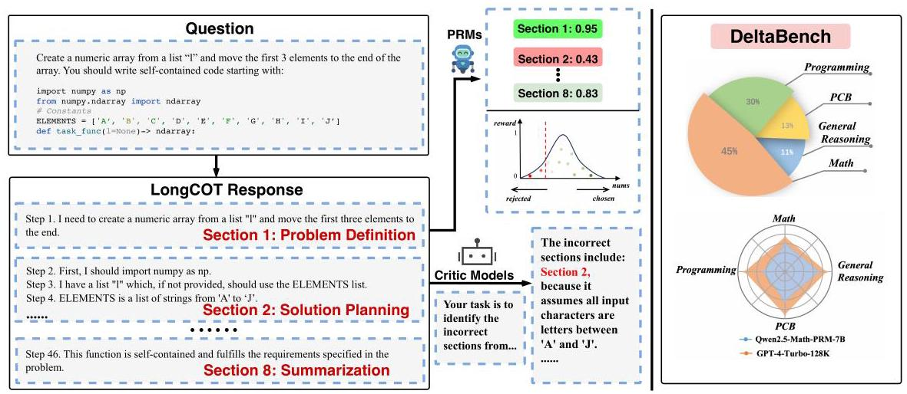

Figure 1: Illustration of the evaluation process for critic models and Process Reward Models (PRMs) for DeltaBench.

(i.e., QwQ, DeepSeek-R1, and Gemini 2.0 Flash Thinking) across different reasoning tasks such as Math, Programming, PCB (physics, chemistry and biology), and General Reasoning. Then, we divide each long CoT into different sections, where each section denotes an independent subtask. After that, each section is annotated with corresponding labels (e.g., reasoning usefulness, reasoning correctness, and reflection).

Based on DeltaBench, we first conduct a fine-grained analysis on the efficiency of the generated long CoTs from different o1-like models, and have the following interesting findings:

- Fundamental errors (e.g., calculation errors, syntax errors and format errors) are usually existed in existing o1-like models. For example, such errors account for approximately 25% and 23% in QwQ-32B-Preview and Gemini 2.0 Flash Thinking, respectively.

- The proportion of effective reflection is still very low. Note that the "effective reflection" denotes this reflection leads to the right answer. For example, on average, approximately 67.8% of the reflections in the collected long CoT responses are useless.

- The long CoT reasoning process is very redundant for existing o1-like models. For example, on average, \( {27}\% \) of the reasoning sections in the collected long CoT response are redundant.

After that, we evaluate the critique abilities of LLMs prompted as critic models and PRMs and draw the following insightful observations:

- For existing LLMs and PRMs, the ability to effectively identify errors in long CoT reasoning is very limited. For example, the top-performing model in DeltaBench, GPT-4-turbo-128k, achieves an F1-score of only 40.8%.

- o1-like models (e.g., o1-mini, o1-preview) do not show any advantage over non-o1-like models on the critique abilities. For example, the results of ol-preview are lower than the results of GPT-4o-mini.

- The self-critique abilities of existing o1-like models are generally weaker than their critique abilities on other o1-like models. For example, DeepSeek-R1 exhibits a 36% reduction in self-critique performance compared to the critique performance of other o1-like models.

## 2 DeltaBench

In this section, we detail the construction of the DeltaBench dataset, developed to assess a model's capacity to identify and locate errors in long CoT reasoning processes. DeltaBench comprises 1,236 samples across diverse domains, including Math, Programming, PCB (physics, chemistry and biology), and General Reasoning. Each sample encompasses a problem, its corresponding long CoT

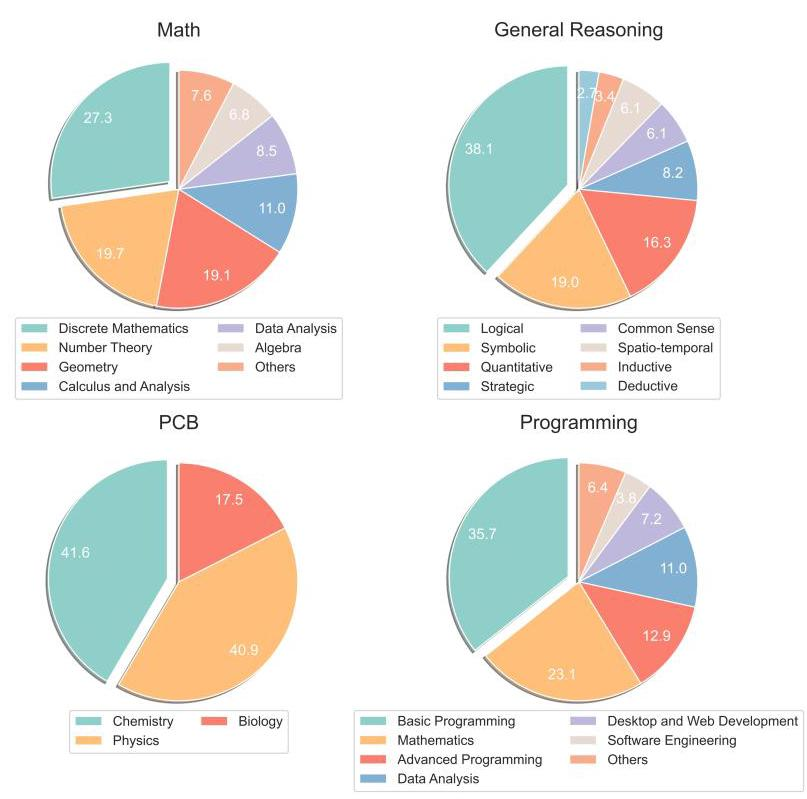

Question Number Number

Total 1236

Math 562

Programming 373

PCB 154

General Reasoning 147

LongCOT Tokens

- maximum Tokens 13246

- minimum Tokens 180

- AVG Tokens 4418

<table><tr><td>Sections Number</td><td/></tr><tr><td>- maximum Number</td><td>53</td></tr><tr><td>- minimum Number</td><td>2</td></tr><tr><td>- AVG Number</td><td>16</td></tr></table>

Figure 2: Left: Overview of DeltaBench. These pie charts show the distribution of questions in Math, General Reasoning, PCB (Physics, Chemistry and Biology), and Programming. Right: Statistics of DeltaBench.

solution, and comprehensive human annotations. Specifically, the long CoT is divided into sections, and each section includes the following tags:

- Strategy Shift: whether this section introduces a new method or strategy attempt. If a new strategy is introduced, the specific step is annotated.

- Reasoning Usefulness: whether the reasoning in this section is useful. If the process of section can help to lead to the right answer, it considered as useful.

- Reasoning Correctness: whether this section contains any errors. If an error is present, additional error-related fields are annotated, including the first step number at which the error occurs, explanation and correction.

- Reflection Efficiency: whether this section contains reflection and whether the reflection is correct. If reflection is present, the step at which the reflection begins is annotated.

### 2.1 Dataset Construction

Query collection. We extract queries from diverse open-source datasets. Detailed data sources are listed in Appendix A.1. The domains include math, programming, physics, chemistry, biology, and general reasoning, which comprise 48 subcategories. To ensure the dataset's diversity and balance, we employ a multi-step process:

- Clustering and Deduplication: Queries are first converted into vector representations using the NV-Embed-v \( {2}^{2} \) embedding model. Then, similarity scores are computed between each pair of queries to identify and eliminate duplicates using a predefined threshold. The non-duplicate queries are clustered using DBSCAN [Ester et al., 1996], resulting in 17,510 unique queries.

---

\( {}^{2} \) https://huggingface.co/nvidia/NV-Embed-v2

---

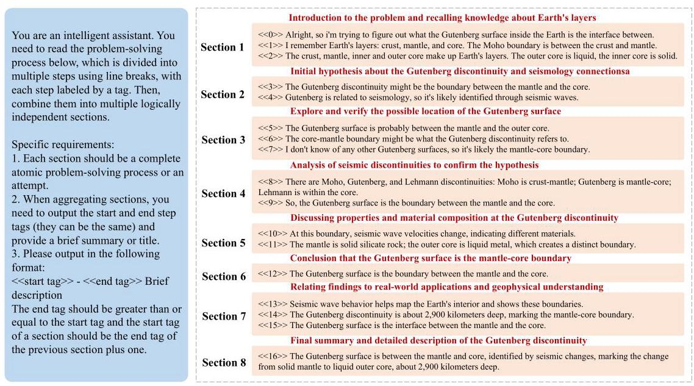

Figure 3: An example of section division for long CoT reasoning process.

- Difficulty Filtering: For each query, multiple models \( {}^{3} \) were employed to generate solutions, and difficulty labels were assigned based on the accuracy of the answers produced by these models. Following this, uniform sampling was carried out according to these difficulty labels to ensure a balanced distribution of difficulties.

- Subcategory Sampling: For each query, GPT-4o is used to classify it into a subcategory. The queries are then uniformly sampled based on these subcategories to ensure diversity.

Data Preprocessing. We observe low-quality queries exist in open-source datasets. To address this issue, we employed GPT-4 and rule-based filtering strategies to identify and remove these low-quality queries. We have recorded encountered issues. Specific details are shown in Appendix A.4.

Long CoT Generation. We generate long CoT solutions using several open-source o1-like models, such as QwQ-32B-Preview, DeepSeek-R1, and Gemini 2.0 Flash Thinking, with random sampling to enhance diversity. This method ensures a wide range of reasoning processes and captures potential errors models may produce in real-world scenarios, enabling a robust evaluation of error detection capabilities in long CoT reasoning.

Section Split. Previous approaches typically divide solutions into steps. However, long CoT responses often contain numerous steps, which significantly increases the difficulty of human annotation, and many of which are either overly granular or lack meaningful contribution to the overall reasoning process. To address this issue, we segment each long CoT response into multiple sections, each representing an independent sub-task, aligning more closely with human cognitive patterns. Specifically, we use the delimiter "\\n\\n" to partition the model's response into steps first. Then, we employ GPT-4 to identify the start and end steps of each section and generate a brief summary of the content within each section. This approach not only facilitates manual annotation but also enhances the accuracy of the model's segmentation process. The details are provided in Appendix A.5.

### 2.2 Correctness Assessment

Before manual annotation, we employ automated methods to assess the correctness of the long CoT results. Domain-specific techniques are used to identify potentially erroneous outputs in Appendix

---

\( {}^{3} \) GPT-4o [OpenAI,2023], Meta-Llama-3-70B-Instruct [Dubey et al.,2024], Meta-Llama-3-8B-Instruct [Dubey et al., 2024], Qwen2.5-72B-Instruct [Team, 2024], Qwen2.5-32B-Instruct [Team, 2024], and DeepSeek-67B-chat [DeepSeek-AI, 2024].

---

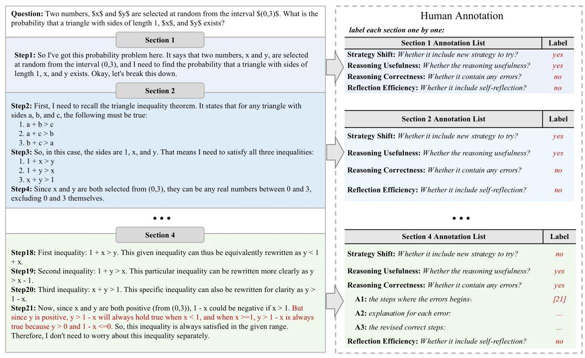

Figure 4: An example of human annotation applied to a mathematical problem-solving process. Annotators are required to annotate each section individually.

A. 3 and the evaluation accuracy of each domain and the details are shown in Appendix A.6. This process ensures that the data provided for manual annotation are likely to contain errors, which enhances the annotation efficiency.

### 2.3 Human Annotation

The data annotation process aims to evaluate the reasoning process of each long CoT response systematically. Each section is assessed for strategy shift, reasoning usefulness, reasoning correctness, and reflection efficiency, as shown in Figure 4. The annotation of whether strategy shift and reflection occurred is to help analyze o1's thinking pattern. The annotation of Reasoning usefulness and error identification is to better analyze and evaluate the performance of system II thinking and further evaluate the critique ability of other models for these problems.

To ensure high-quality annotations, we recruit Master's and Ph.D. graduates from various disciplines and collaborate with specialized suppliers (See Appendix A. 2 for more details on the annotation and quality control processes).

### 2.4 Dataset Statistics

DeltaBench contains 1,236 carefully curated samples. These samples are distributed across five major domains and 48 subcategories. The dataset ensures a balance of question types and difficulty levels, incorporating a rich set of long CoT responses.

Figure 5 shows the distribution of both the length and the number of sections of long CoTs. The distribution is relatively balanced overall, enabling a comprehensive evaluation of the performance of PRMs or critic models across a range of different lengths. Additionally, detailed statistics on the category distribution are provided in Appendix A.7.

### 2.5 Evaluation Metrics

We employ recall, precision, and macro-F1 score for error sections as evaluation metrics. For the PRMs, we utilize an outlier detection technique based on the Z-Score to make predictions. This method was chosen because threshold-based prediction methods determined from other step-level datasets, such as those used in ProcessBench [Zheng et al., 2024a], may not be reliable due to significant differences in dataset distributions, particularly as DeltaBench focuses on long CoT (The details are provided in Appendix A.8). Outlier detection helps to avoid this bias. The threshold \( t \) for determining the correctness of a section is defined as: \( t = \mu  - \sigma \) , where \( \mu \) is the mean of the rewards distribution across the dataset, and \( \sigma \) is the standard deviation. Sections falling below \( t \) are predicted as error sections. For critic models, all erroneous sections within a long CoT are prompted to be identified. Given that error sections constitute a smaller proportion than correct sections across the dataset, we use macro-F1 to mitigate the potential impact of the imbalance between positive and negative sections. Macro-F1 independently calculates the F1 score for each sample and then takes the average, providing a more balanced evaluation metric when dealing with class imbalance.

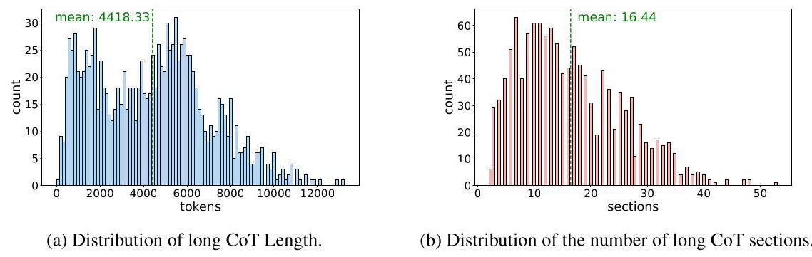

Figure 5: Distribution of long CoT characteristics.

<table><tr><td>Benchmark</td><td>Source</td><td>Long CoT</td><td>Granularity</td></tr><tr><td>JudgeBench</td><td>MMLU-Pro [Wang et al., 2024], LiveBench [White et al., 2024], LiveCodeBench [Jain et al., 2024]</td><td>✘</td><td>Sample-Level</td></tr><tr><td>CriticBench</td><td>GSM8K [Cobbe et al., 2021], CSQA [Talmor et al., 2019], BIGBench [Srivastava et al., 2022], HumanEval [Chen et al., 2021], etc</td><td>✘</td><td>Sample-Level</td></tr><tr><td>CriticEval</td><td>GSM8K [Cobbe et al., 2021], HumanEval [Chen et al., 2021], ChatArena [Chiang et al., 2024], etc.</td><td>✘</td><td>Sample-Level</td></tr><tr><td>ProcessBench</td><td>GSM8K [Cobbe et al., 2021], MATH [Lightman et al., 2023], OlympiadBench [He et al., 2024b], Omni-MATH [Gao et al., 2024]</td><td>✘</td><td>Step-Level</td></tr><tr><td>DeltaBench</td><td>AIME, BigCodeBench [Zhuo et al., 2024], KOR-Bench [Ma et al., 2024], GPQA [Rein et al., 2023], etc</td><td>✓</td><td>Section-Level</td></tr></table>

Table 1: Comparisons between different benchmarks. Sample-level evaluation classifies the entire model response as correct or incorrect. Step-level evaluation assesses the correctness of individual reasoning steps. Section-level evaluation evaluates the correctness of reasoning sections which is a more appropriate granularity for long CoT response.

### 2.6 Comparison to Other Benchmarks

In Table 1, DeltaBench has the following features: (1) We focus on difficult questions, providing a more challenging critical evaluation; (2) We utilize long CoT responses, enabling the assessment of a model's ability to identify errors within complex reasoning processes; (3) We evaluate the model's capability to identify all errors in the reasoning process, rather than just the first error or a binary classification of correctness on sample level, which can provide a fine-grained analysis of long CoTs.

## 3 Analysis

### 3.1 Error Analysis of o1-like Models

Error Type Lists We classify the errors that occur during the system II thinking process into 8 major aspects and 23 specific error types based on the manual annotations, including understanding errors, reasoning errors, reflection errors, summary errors, etc. For detailed information about the error categories, see Appendix B.

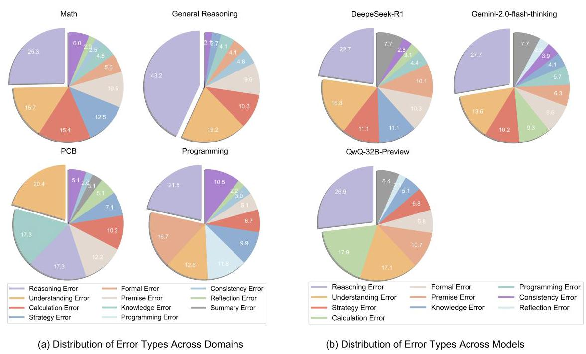

Figure 6: Distribution of error types across different domains and models.

What Are the Most Common Errors Across Domains? To analyze the characteristics of error distribution in different domains, we performed a uniform sampling of the data based on the model, the domain, and the query difficulty. Figure 6 shows the error distribution across different domains, here are some key findings:

- Math: The most frequent error type is Reasoning Error(25.3%), followed by Understanding Error(15.7%) and Calculation Error(15.4%). This indicates that while the models often struggle with logical reasoning and problem understanding, low-level computational mistakes also remain a significant issue.

- Programming: Reasoning Error (21.5%) is the most common, followed by Formal Error (16.7%) and Understanding Error (12.6%). The high frequency of Formal Error and Programming Error (11.8%) underscores the models' struggles with code-specific details and implementation.

- PCB: The dominant error types are Understanding Error (20.4%) and Knowledge Error (17.3%), closely followed by Reasoning Error (17.3%). This suggests that the main challenge for current models in the fields of physics, chemistry and biology is to understand field-specific concepts and accurately apply relevant knowledge.

- General Reasoning: Reasoning Error is the most prevalent, accounting for 43%, followed by comprehension errors, accounting for \( {19}\% \) , showing that logical reasoning is the primary bottleneck.

What Are the Model-Specific Error Patterns? We also analyzed errors specific to individual models, providing further insights into model weaknesses, as illustrated in Figure 7. The error distributions reveal distinct patterns for each model, highlighting their unique strengths and areas for improvement. Here are some key findings:

- DeepSeek-R1 exhibits its most pronounced weakness in Reasoning Errors (22.7%), indicating challenges in constructing coherent and accurate logical reasoning paths. However, it demonstrates relative strength in handling fundamental tasks, with minimal Calculation Errors (3.1%) and Programming Errors (4.4%).

- QwQ-32B-Preview excels at identifying correct problem-solving approaches. However, its effectiveness is significantly hindered by deficiencies in handling finer details, particularly in Calculation Errors (17.9%)

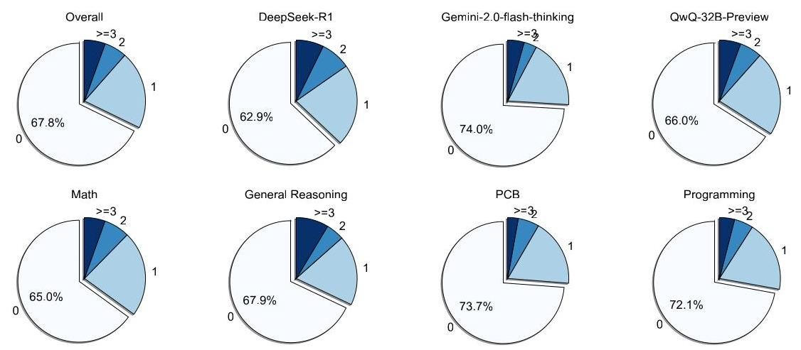

Figure 7: Distribution of effective reflection times by models and domains on a sample level. The segments within each pie chart represent how many times effective reflection occurs in one sample, with segment '0' indicating there is no effective reflection.

## Key Finding for Error Type

The primary bottleneck of current models remains reasoning ability. However, detailed errors like calculation and formal mistakes also contribute significantly.

### 3.2 Reflection Analysis of o1-like Models

Statistics. We also conduct a analysis of the total number of reflections and the proportion of effective reflections in the long CoT output of all questions (including questions answered correctly and incorrectly by the model).

How Effective Are Model Reflections Across Different Models and Domains? We classify samples with reflections based on the number of valid reflections to evaluate the ability to produce valid reflections. Specifically, we label samples as 0 if no valid reflections occur, and 1,2, or >=3 for samples with one, two, or three and more valid reflections, respectively(all statistical analyses were performed under strictly controlled conditions, ensuring uniform sampling and balanced tasks for a fair comparison). In Figure 7, DeepSeek-R1 exhibits the highest proportion of effective reflections, and the models show a notably higher rate of effective reflections in the math domain. However, the overall proportion of valid reflections across all models remains relatively low, ranging between 30% and 40%. This suggests that the reflection capabilities of current models require further improvement.

## Key Finding for Reflection

Despite frequent reflection attempts, the proportion of effective reflections remains low across models, and DeepSeek-R1 achieves the highest rate of valid reflections.

### 3.3 Effective Reasoning of o1-like Models

Statistics. Human annotators evaluate the usefulness of the reasoning in each section, enabling us to calculate the proportion of valid reasoning in each response. As illustrated in Figure 8, each graph shows the distribution of effective reasoning ratios for a particular model. The red dashed line in each graph indicates the average effective reasoning ratio.

What Proportion of Reasoning in Long CoT Responses is Effective? On average, only 73% of the reasoning in the collected long CoT responses is useful, highlighting significant redundancy

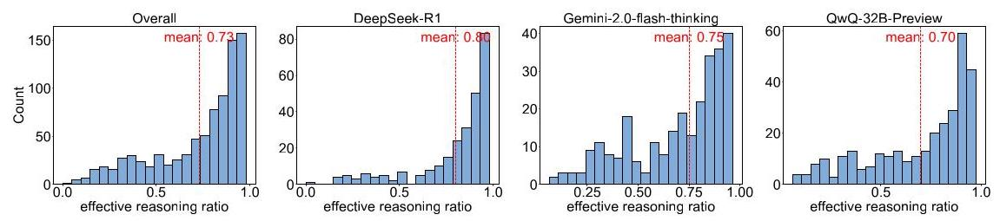

Figure 8: Distribution of effective reasoning ratios.

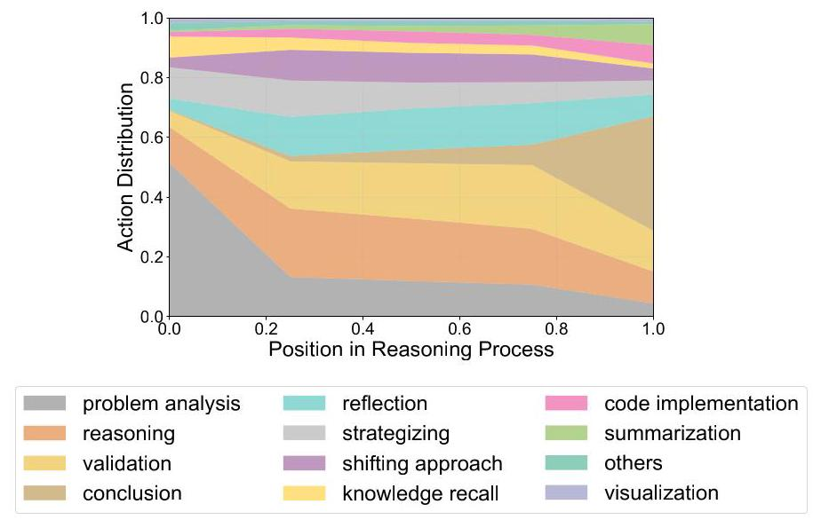

Figure 9: Distribution of different task types throughout the progress of a long CoT response.

issues. Among the models analyzed, \( {QwQ} - {32B} - \) Preview exhibited the lowest proportion of effective reasoning at \( {70}\% \) , while DeepSeek-R1 achieved a notably higher proportion compared to the others, demonstrating superior reasoning efficiency.

## Key Finding for Reasoning Efficiency

On average, 27% of reasoning in long CoT responses we collected is redundant, and DeepSeek-R1 outperforms others in reasoning efficiency.

### 3.4 Reasoning Process Analysis

Figure 9 shows the distribution of each section's action roles in the system II thinking process of the o1-like models. Initially, problem analysis dominates, indicating that the model initially focuses on understanding the requirements and constraints of the problem. As the solution progresses, cognitive activities diversify significantly, with reflection and validation becoming more prominent. In the later part of the reasoning, the distribution of conclusion and summarization gradually increases.

### 3.5 Results on DeltaBench

Baseline Models. For the PRMs, we select the following models: Qwen2.5-Math-PRM-7B \( {}^{4} \) , Qwen2.5-Math-PRM-72B \( {}^{5} \) , Llama3.1-8B-PRM-Deepseek-Data \( {}^{6} \) , Llama3.1 -8B-PRM-Mistral-Data \( {}^{7} \) ,

---

\( {}^{4} \) Qwen/Qwen2.5-Math-PRM-7B

\( {}^{5} \) Qwen/Qwen2.5-Math-PRM-72B

\( {}^{6} \) RLHFlow/Llama3.1-8B-PRM-Deepseek-Data

\( {}^{7} \) RLHFlow/Llama3.1-8B-PRM-Mistral-Data

---

<table><tr><td rowspan="2">Model</td><td colspan="3">Overall</td><td>\( \mathbf{{Math}} \)</td><td>Code</td><td>\( \mathbf{{PCB}} \)</td><td>General</td></tr><tr><td>Recall</td><td>Precision</td><td>F1</td><td>F1</td><td>F1</td><td>F1</td><td>F1</td></tr><tr><td colspan="8">Process Reward Models (PRMs)</td></tr><tr><td>Qwen2.5-Math-PRM-7B</td><td>30.30</td><td>34.96</td><td>29.22</td><td>29.64</td><td>23.76</td><td>31.09</td><td>34.19</td></tr><tr><td>Qwen2.5-Math-PRM-72B</td><td>28.16</td><td>29.37</td><td>26.38</td><td>24.16</td><td>22.02</td><td>31.14</td><td>35.83</td></tr><tr><td>Llama3.1-8B-PRM-Deepseek-Data</td><td>11.7</td><td>15.59</td><td>12.02</td><td>12.28</td><td>10.95</td><td>16.76</td><td>12.59</td></tr><tr><td>Llama3.1-8B-PRM-Mistral-Data</td><td>9.64</td><td>11.21</td><td>9.45</td><td>9.40</td><td>10.72</td><td>13.43</td><td>12.40</td></tr><tr><td>Skywork-o1-Qwen-2.5-1.5B</td><td>3.32</td><td>3.84</td><td>3.07</td><td>1.30</td><td>6.66</td><td>5.43</td><td>7.87</td></tr><tr><td>Skywork-o1-Qwen-2.5-7B</td><td>2.49</td><td>2.22</td><td>2.17</td><td>0.78</td><td>6.28</td><td>6.02</td><td>3.11</td></tr><tr><td colspan="8">LLM as Critic Models</td></tr><tr><td>GPT-4-turbo-128k</td><td>57.19</td><td>37.35</td><td>40.76</td><td>37.56</td><td>43.06</td><td>45.54</td><td>42.17</td></tr><tr><td>GPT-4o-mini</td><td>49.88</td><td>35.37</td><td>37.82</td><td>33.26</td><td>37.95</td><td>45.98</td><td>46.39</td></tr><tr><td>Doubao-1.5-Pro</td><td>39.68</td><td>37.02</td><td>35.25</td><td>32.46</td><td>39.47</td><td>33.53</td><td>37.00</td></tr><tr><td>GPT-40</td><td>36.52</td><td>32.48</td><td>30.85</td><td>28.61</td><td>28.53</td><td>39.25</td><td>36.50</td></tr><tr><td>Owen2.5-Max</td><td>36.11</td><td>30.82</td><td>30.49</td><td>26.73</td><td>32.81</td><td>39.49</td><td>29.54</td></tr><tr><td>Gemini-1.5-pro</td><td>35.51</td><td>30.32</td><td>29.59</td><td>26.56</td><td>28.20</td><td>40.13</td><td>33.66</td></tr><tr><td>DeepSeek-V3</td><td>32.33</td><td>28.13</td><td>27.33</td><td>27.04</td><td>27.73</td><td>27.35</td><td>27.45</td></tr><tr><td>Llama-3.1-70B-Instruct</td><td>32.22</td><td>28.85</td><td>27.67</td><td>21.49</td><td>32.13</td><td>28.45</td><td>39.18</td></tr><tr><td>Owen2.5-32B-Instruct</td><td>30.12</td><td>28.63</td><td>26.73</td><td>22.34</td><td>31.37</td><td>33.78</td><td>24.37</td></tr><tr><td>DeepSeek-R1</td><td>29.20</td><td>32.66</td><td>28.43</td><td>24.17</td><td>29.28</td><td>34.78</td><td>35.87</td></tr><tr><td>ol-preview</td><td>27.92</td><td>30.59</td><td>26.97</td><td>22.19</td><td>28.09</td><td>33.11</td><td>35.94</td></tr><tr><td>Owen2.5-14B-Instruct</td><td>26.64</td><td>27.27</td><td>24.73</td><td>21.51</td><td>29.05</td><td>29.98</td><td>20.59</td></tr><tr><td>Llama-3.1-8B-Instruct</td><td>25.71</td><td>28.01</td><td>24.91</td><td>18.12</td><td>32.17</td><td>27.30</td><td>29.93</td></tr><tr><td>o1-mini</td><td>22.90</td><td>22.90</td><td>19.89</td><td>16.71</td><td>21.70</td><td>20.37</td><td>26.94</td></tr><tr><td>Owen2.5-7B-Instruct</td><td>21.99</td><td>19.61</td><td>18.63</td><td>11.61</td><td>25.92</td><td>29.85</td><td>15.18</td></tr><tr><td>DeepSeek-R1-Distill-Owen-32B</td><td>17.19</td><td>18.65</td><td>16.28</td><td>13.02</td><td>23.55</td><td>15.05</td><td>11.56</td></tr><tr><td>DeepSeek-R1-Distill-Owen-14B</td><td>12.81</td><td>14.54</td><td>12.55</td><td>9.40</td><td>18.36</td><td>10.44</td><td>12.01</td></tr></table>

Table 2: Experimental results of PRMs and critic models on DeltaBench. Bold indicates the best results within the same group of models, while underline indicates the second best.

Skywork-o1-Open-PRM- Qwen-2.5-1.5B \( {}^{8} \) , and Skywork-o1-Open-PRM-Qwen-2.5-7B \( {}^{9} \) . We select a group of the most advanced open-source and closed-source LLMs to serve as critic models for evaluation, which includes various GPT-4 [OpenAI, 2023] variants (such as GPT-4-turbo-128K, GPT-4o-mini, GPT-4o), the Gemini model [Reid et al., 2024](Gemini-1.5-pro), several Qwen models [Team, 2024] (such as Qwen2.5-32B-Instruct and Qwen2.5-14B-Instruct), Doubao-1.5-Pro [Team, 2025] and o1 models [OpenAI, 2024] (o1-preview-0912, o1-mini-0912).

#### 3.5.1 Main Results

In Table 2, we provide the results of different LLMs on DeltaBench. For PRMs, we have the following observations: (1). Existing PRMs usually achieve low performance, which indicates that existing PRMs cannot identify the errors in long CoTs effectively and it is necessary to improve the performance of PRMs. (2). Larger PRMs do not lead to better performance. For example, the Qwen2.5-Math-PRM-72B is inferior to wen2.5-Math-PRM-7B. For critic models, we have the following findings: (1) GPT-4-turbo-128k archives the best critique results, which is better than other models (e.g., GPT-4o) a lot in DeltaBench. (2) For o1-like models (e.g., DeepSeek-R1, o1-mini, o1-preview), we observe that the results of these models are not superior to non-o1-like models, with the performance of ol-preview is even lower than Qwen2.5-32B-Instruct. A detailed analysis of underperforming models is provided in Appendix C.

#### 3.5.2 Further Analysis

Effect of Long CoT Length. In Figure 10, we compare the average F1-Score performance of critic models and PRMs across varying LongCoT token lengths. For critic models, the performance notably declines as token length increases. Initially, models like Deepseek-R1 and GPT-4o exhibit strong performance with shorter sequences(1 - 3ktokens). However, as token length increases to mid-ranges (4-7k tokens), there is a marked decrease in performance across all models. This trend highlights the growing difficulty for critic models to maintain precision and recall as long CoT response become longer and more complex, likely due to the challenge of evaluating lengthy model outputs. In contrast, PRMs demonstrate greater stability across token lengths, as they evaluate sections sequentially rather than processing the entire output at once. Despite this advantage, PRMs achieve lower overall scores compared to critic models on our evaluation set.

---

\( {}^{8} \) Skywork/Skywork-o1-Open-PRM-Qwen-2.5-1.5B

\( {}^{9} \) Skywork/Skywork-o1-Open-PRM-Qwen-2.5-7B

---

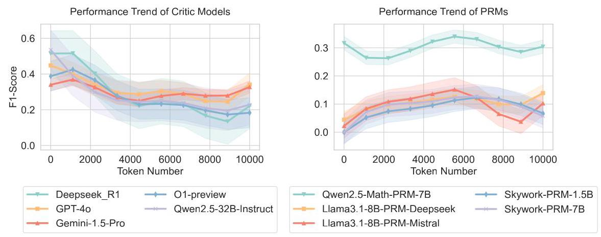

Figure 10: The effect of long CoT length.

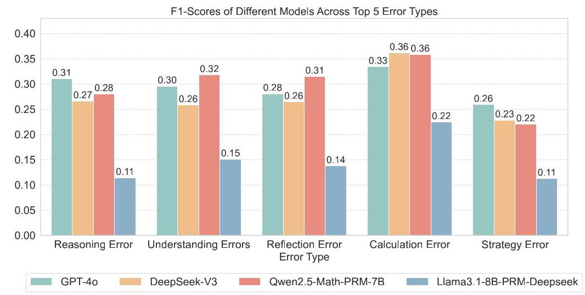

Figure 11: Results of different LLMs on top-5 errors.

## Key Finding

Critic models exhibit significant performance degradation with longer contexts, while PRMs demonstrate consistent evaluation capability across varying lengths.

Performance Analysis Across Different Error Types. Figure 11 shows the performance of different models on the five most common error types. In terms of error types, most models demonstrate the highest accuracy in recognizing calculation errors. Conversely, the recognition of strategy errors is generally the weakest. In terms of models, there is significant variation in the ability of individual models to recognize different error types. For instance, DeepSeek-V3 achieves an F1 of 36% on calculation errors but only 23% on strategy errors. Meanwhile, Llama3.1-8B-PRM-Deepseek performs poorly, with an F1 score of \( {22}\% \) on calculation errors, and shows a significant decline in performance across the other four error types. This highlights the limited generalization capabilities of most models when recognizing various error types.

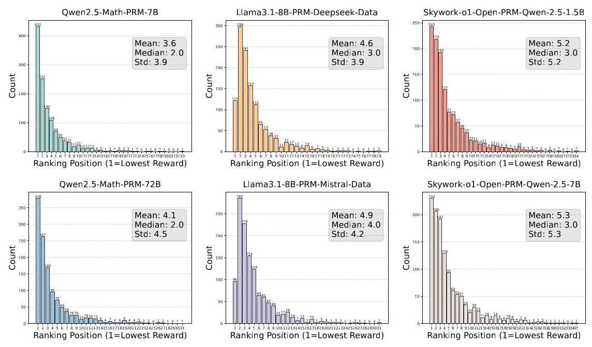

Figure 12: Ranking of rewards for the first incorrect section for different PRMs.

Key Finding

Models exhibit strong performance on calculation errors but struggle with strategy errors, revealing limited generalization across error types.

<table><tr><td rowspan="2">Model</td><td colspan="3">HitRate@k - Avg(%)</td></tr><tr><td>\( k = 1 \)</td><td>\( k = 3 \)</td><td>\( k = 5 \)</td></tr><tr><td>Qwen2.5-Math-PRM-7B</td><td>49.15</td><td>69.14</td><td>83.14</td></tr><tr><td>Qwen2.5-Math-PRM-72B</td><td>41.13</td><td>62.70</td><td>75.73</td></tr><tr><td>Llama3.1-8B-PRM-Deepseek-Data</td><td>12.63</td><td>48.62</td><td>69.78</td></tr><tr><td>Llama3.1-8B-PRM-Mistral-Data</td><td>8.99</td><td>42.97</td><td>65.33</td></tr><tr><td>Skywork-o1-Open-PRM-Qwen-2.5-1.5B</td><td>31.90</td><td>53.82</td><td>69.23</td></tr><tr><td>Skywork-o1-Open-PRM-Qwen-2.5-7B</td><td>31.58</td><td>52.59</td><td>69.16</td></tr></table>

Table 3: Results of HitRate@k.Bold and underlined results indicate the best and the second best.

Analysis on HitRate evaluation for PRMs. To better measure the ability of PRMs to identify erroneous sections in long CoTs, we use HitRate@ \( k \) to evaluate PRMs. Specifically, within a sample, we rank the sections in ascending order based on the rewards given by the PRM, select the smallest \( k \) sections, and calculate the recall rate for the erroneous sections among them. Specifically, we define the sorted sections as \( S = \left\{  {{s}_{1},{s}_{2},\ldots ,{s}_{n}}\right\} \) , with \( E \) being the set of erroneous sections. We select the top \( k \) sections, denoted as \( {S}_{k} = \left\{  {{s}_{1},{s}_{2},\ldots ,{s}_{k}}\right\} \) . The HitRate \( @k \) is calculated as:

\[
\text{ HitRate }@k = \frac{\left| {S}_{k} \cap  E\right| }{\min \left( {k,\left| E\right| }\right) } \tag{1}
\]

In this formula, \( \left| {{S}_{k} \cap  E}\right| \) indicates the number of erroneous sections identified among the top \( k \) sections. This metric reflects the ability of PRMs to effectively identify erroneous sections within the top \( k \) candidate sections. In Table 3, the relative performance rankings among different PRMs

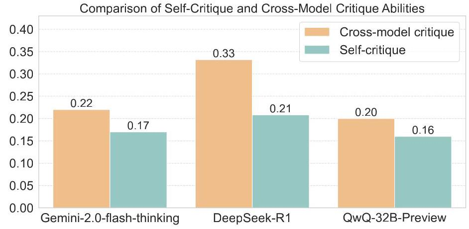

Figure 13: F1-score comparison of self-critique and cross-model critique abilities for different models.

are quite similar to the results in Table 2. Additionally, we observe that for \( k = 3 \) and \( k = 5 \) , the performance differences between various PRMs are not particularly significant. However, when \( k = 1 \) , the Qwen2.5-Math-PRM-7B shows a clear performance advantage. Figure 12 illustrates the ranking ability of different PRMs for the first incorrect section within the sample, which is generally consistent with the performance evaluation results of HitRate@k.

## Key Finding

HitRate@k evaluation aligns with the main results, with Qwen2.5-Math-PRM-7B demonstrating superior performance in identifying the first incorrect section.

Comparative Analysis of Self-Critique Capabilities of LLMs. We randomly sample queries based on domains and models that generate the long CoT output, followed by a statistical analysis of the model's performance in evaluating its own outputs as well as those of other models. In Figure 13, Gemini 2.0 Flash Thinking, DeepSeek-R1, and QwQ-32B-Preview show lower self-critique scores compared to their cross-model critique scores, indicating a prevalent deficiency in self-critic abilities. Notably, DeepSeek-R1 exhibits the largest discrepancy, with a 36% decrease in self-evaluation compared to evaluations of other models. This suggests models' self-critic abilities remain underdeveloped.

## Key Finding

LLMs demonstrate weaker self-critique performance compared to cross-model critique, highlighting a fundamental limitation in self-critic capabilities.

## 4 Related Works

Test-time Scaling. Recently, many works have begun to explore the test-time scaling techniques [Ope- \( \mathrm{{nAI}},{2024} \) , Snell et al.,2024], can greatly enhance performance by increasing the number of generated tokens. Several methods [Guan et al., 2025, Chen et al., 2024b, Hao et al., 2023, Yao et al., 2023] have developed the tree search methods to improve reasoning capabilities. In addition, ol-like models (e.g., o1, R1) [OpenAI, 2024, Guo et al., 2025, Team et al., 2025] have investigated the reinforcement learning methods to generate long CoTs and enhance the model performance. Some methods have also begun exploring the intrinsic mechanisms of generating long CoTs [Yeo et al., 2025, Wu et al., 2024a].

Process Reward Modeling. PRMs demonstrate a significant advantage over traditional outcome-level reward models (ORMs) in enhancing the accuracy of process reasoning [Lightman et al., 2023]. The development of an increasing number of PRMs [Zhang et al., 2025a, Xia et al., 2024, ol Team, 2024] offers valuable contributions to multi-step reasoning. In addition, the introduction of numerous human-annotated process-level datasets [Cobbe et al., 2021, Wu et al., 2023, Li et al., 2024b] provides essential resources for research. These advancements have collectively spurred exploration in the research direction of generating long CoT.

LLM Critic. The critique capabilities of LLMs have drawn great interests [Zhang et al., 2025b, Liu et al., 2025]. For example, CriticBench [Luo et al., 2023, Zheng et al., 2024b] uses LLMs to generate critiques and binary verdicts for input solutions, measuring accuracy by comparing these verdicts to ground truth labels. CriticEval [Lan et al., 2024] evaluates both feedback and correction qualities Additionally, many works have explored the LLMs' self-critique for improving reasoning [Tyen et al., 2023, Stechly et al., 2024]. For example, Huang et al. [2023] have highlighted the challenges in self-correction without external feedback. ProCo [Wu et al., 2024b] facilitates self-correction and iterative verification processes for better critical abilities.

## 5 Conclusion

In this paper, we have provided a comprehensive evaluation benchmark called DeltaBench to investigate the limitations of existing ol-like models based on the generated long CoTs and measure the critique qualities of existing LLMs. Based on DeltaBench, we discuss the specific error analysis of o1-like models and provide a detailed analysis of critic models and PRMs, where many interesting findings are provided. Finally, we hope our DeltaBench can not only find the limitations of o1-like models, but also provide guidance to further improve these reasoning models.

## 6 Limitations

While DeltaBench offers a comprehensive evaluation for long CoT reasoning and critique abilities, it has some limitations. First, the construction and annotation of the dataset involve high costs, making it challenging to scale to a larger volume of data. Second, although we established a rigorous human annotation mechanism, the process may still introduce subjective biases. Third, as a static benchmark, DeltaBench may not fully capture real-time advancements. Addressing these limitations will be a key focus of our future work.

## References

Abhimanyu Dubey, Abhinav Jauhri, Abhinav Pandey, Abhishek Kadian, Ahmad Al-Dahle, Aiesha Letman, Akhil Mathur, Alan Schelten, Amy Yang, Angela Fan, Anirudh Goyal, Anthony Hartshorn, Aobo Yang, Archi Mitra, Archie Sravankumar, Artem Korenev, Arthur Hinsvark, Arun Rao, Aston Zhang, Aurelien Rodriguez, Austen Gregerson, Ava Spataru, Baptiste Roziere, Bethany Biron, Binh Tang, Bobbie Chern, Charlotte Caucheteux, Chaya Nayak, Chloe Bi, Chris Marra, Chris McConnell, Christian Keller, Christophe Touret, Chunyang Wu, Corinne Wong, Cristian Canton Ferrer, Cyrus Nikolaidis, Damien Allonsius, Daniel Song, Danielle Pintz, Danny Livshits, David Esiobu, Dhruv Choudhary, Dhruv Mahajan, Diego Garcia-Olano, Diego Perino, Dieuwke Hupkes, Egor Lakomkin, Ehab AlBadawy, Elina Lobanova, Emily Dinan, Eric Michael Smith, Filip Radenovic, Frank Zhang, Gabriel Synnaeve, Gabrielle Lee, Georgia Lewis Anderson, Graeme Nail, Gregoire Mialon, Guan Pang, Guillem Cucurell, Hailey Nguyen, Hannah Korevaar, Hu Xu, Hugo Touvron, Iliyan Zarov, Imanol Arrieta Ibarra, Isabel Kloumann, Ishan Misra, Ivan Evtimov, Jade Copet, Jaewon Lee, Jan Geffert, Jana Vranes, Jason Park, Jay Mahadeokar, Jeet Shah, Jelmer van der Linde, Jennifer Billock, Jenny Hong, Jenya Lee, Jeremy Fu, Jianfeng Chi, Jianyu Huang, Jiawen Liu, Jie Wang, Jiecao Yu, Joanna Bitton, Joe Spisak, Jongsoo Park, Joseph Rocca, Joshua Johnstun, Joshua Saxe, Junteng Jia, Kalyan Vasuden Alwala, Kartikeya Upasani, Kate Plawiak, Ke Li, Kenneth Heafield, Kevin Stone, Khalid El-Arini, Krithika Iyer, Kshitiz Malik, Kuenley Chiu, Kunal Bhalla, Lauren Rantala-Yeary, Laurens van der Maaten, Lawrence Chen, Liang Tan, Liz Jenkins, Louis Martin, Lovish Madaan, Lubo Malo, Lukas Blecher, Lukas Landzaat, Luke de Oliveira, Madeline Muzzi, Mahesh Pasupuleti, Mannat Singh, Manohar Paluri, Marcin Kardas, Mathew Oldham, Mathieu Rita, Maya Pavlova, Melanie Kambadur, Mike Lewis, Min Si, Mitesh Kumar Singh, Mona Hassan, Naman Goyal, Narjes Torabi, Nikolay Bashlykov, Nikolay Bogoychev, Niladri Chatterji, Olivier Duchenne, Onur Çelebi, Patrick Alrassy, Pengchuan Zhang, Pengwei Li, Petar Vasic, Peter Weng, Prajjwal Bhargava, Pratik Dubal, Praveen Krishnan, Punit Singh Koura, Puxin Xu, Qing He, Qingxiao Dong, Ragavan Srinivasan, Raj Ganapathy, Ramon Calderer, Ricardo Silveira Cabral, Robert Stojnic, Roberta Raileanu, Rohit Girdhar, Rohit Patel, Romain Sauvestre, Ronnie Polidoro, Roshan Sumbaly, Ross Taylor, Ruan Silva, Rui Hou, Rui Wang, Saghar Hosseini, Sahana Chennabasappa, Sanjay Singh, Sean Bell, Seohyun Sonia Kim, Sergey Edunov, Shaoliang Nie, Sharan Narang, Sharath Raparthy, Sheng Shen, Shengye Wan, Shruti Bhosale, Shun Zhang, Simon Vandenhende, Soumya Batra, Spencer Whitman, Sten Sootla, Stephane Collot, Suchin Gururangan, Sydney Borodinsky, Tamar Herman, Tara Fowler, Tarek Sheasha, Thomas Georgiou, Thomas Scialom, Tobias Speckbacher, Todor Mihaylov, Tong Xiao, Ujjwal Karn, Vedanuj Goswami, Vibhor Gupta, Vignesh Ramanathan, Viktor Kerkez, Vincent Gonguet, Virginie Do, Vish Vogeti, Vladan Petrovic, Weiwei Chu, Wenhan Xiong, Wenyin Fu, Whitney Meers, Xavier Martinet, Xiaodong Wang, Xiaoqing Ellen Tan, Xinfeng Xie, Xuchao Jia, Xuewei Wang, Yaelle Goldschlag, Yashesh Gaur, Yasmine Babaei, Yi Wen, Yiwen Song, Yuchen Zhang, Yue Li, Yuning Mao, Zacharie Delpierre Coudert, Zheng Yan, Zhengxing Chen, Zoe Papakipos, Aaditya Singh, Aaron Grattafiori, Abha Jain, Adam Kelsey, Adam Shajnfeld, Adithya Gangidi, Adolfo Victoria, Ahuva Goldstand, Ajay Menon, Ajay Sharma, Alex Boesenberg, Alex Vaughan, Alexei Baevski, Allie Feinstein, Amanda Kallet, Amit Sangani, Anam Yunus, Andrei Lupu, Andres Alvarado, Andrew Caples, Andrew Gu, Andrew Ho, Andrew Poulton, Andrew Ryan, Ankit Ramchandani, Annie Franco, Aparajita Saraf, Arkabandhu Chowdhury, Ashley Gabriel, Ashwin Bharambe, Assaf Eisenman, Azadeh Yazdan, Beau James, Ben Maurer, Benjamin Leonhardi, Bernie Huang, Beth Loyd, Beto De Paola, Bhargavi Paranjape, Bing Liu, Bo Wu, Boyu Ni, Braden Hancock, Bram Wasti, Brandon Spence, Brani Stojkovic, Brian Gamido, Britt Montalvo, Carl Parker, Carly Burton, Catalina Mejia, Changhan Wang, Changkyu Kim, Chao Zhou, Chester Hu, Ching-Hsiang Chu, Chris Cai, Chris Tindal, Christoph Feichtenhofer, Damon Civin, Dana Beaty, Daniel Kreymer, Daniel Li, Danny Wyatt, David Adkins, David Xu, Davide Testuggine, Delia David, Devi Parikh, Diana Liskovich, Didem Foss, Dingkang Wang, Duc Le, Dustin Holland, Edward Dowling, Eissa Jamil, Elaine Montgomery, Eleonora Presani, Emily Hahn, Emily Wood, Erik Brinkman, Esteban Arcaute, Evan Dunbar, Evan Smothers, Fei Sun, Felix Kreuk, Feng Tian, Firat Ozgenel, Francesco Caggioni, Francisco Guzmán, Frank Kanayet, Frank Seide, Gabriela Medina Florez, Gabriella Schwarz, Gada Badeer, Georgia Swee, Gil Halpern, Govind Thattai, Grant Herman, Grigory Sizov, Guangyi, Zhang, Guna Lakshminarayanan, Hamid Shojanazeri, Han Zou, Hannah Wang, Hanwen Zha, Haroun Habeeb, Harrison Rudolph, Helen Suk, Henry Aspegren, Hunter Goldman, Igor Molybog, Igor Tufanov, Irina-Elena Veliche, Itai Gat, Jake Weissman, James Geboski, James Kohli, Japhet Asher, Jean-Baptiste Gaya, Jeff Marcus, Jeff Tang, Jennifer Chan, Jenny Zhen, Jeremy Reizenstein, Jeremy Teboul, Jessica Zhong, Jian Jin, Jingyi Yang, Joe Cummings, Jon Carvill, Jon Shepard, Jonathan McPhie, Jonathan Torres, Josh Ginsburg, Junjie Wang, Kai Wu, Kam Hou U, Karan Saxena, Karthik Prasad, Kartikay Khandelwal, Katayoun Zand, Kathy Matosich, Kaushik Veeraraghavan, Kelly Michelena, Keqian Li, Kun Huang, Kunal Chawla, Kushal Lakhotia, Kyle Huang, Lailin Chen, Lakshya Garg, Lavender A, Leandro Silva, Lee Bell, Lei Zhang, Liangpeng Guo, Licheng Yu, Liron Moshkovich, Luca Wehrstedt, Madian Khabsa, Manav Avalani, Manish Bhatt, Maria Tsimpoukelli, Martynas Mankus, Matan Hasson, Matthew Lennie, Matthias Reso, Maxim Groshev, Maxim Naumov, Maya Lathi, Meghan Keneally, Michael L. Seltzer, Michal Valko, Michelle Restrepo, Mihir Patel, Mik Vyatskov, Mikayel Samvelyan, Mike Clark, Mike Macey, Mike Wang, Miquel Jubert Hermoso, Mo Metanat, Mohammad Rastegari, Munish Bansal, Nandhini Santhanam, Natascha Parks, Natasha White, Navyata Bawa, Nayan Singhal, Nick Egebo, Nicolas Usunier, Nikolay Pavlovich Laptev, Ning Dong, Ning Zhang, Norman Cheng, Oleg Chernoguz, Olivia Hart, Omkar Salpekar, Ozlem Kalinli, Parkin Kent, Parth Parekh, Paul Saab, Pavan Balaji, Pedro Rittner, Philip Bontrager, Pierre Roux, Piotr Dollar, Polina Zvyagina, Prashant Ratanchandani, Pritish Yuvraj, Qian Liang, Rachad Alao, Rachel Rodriguez, Rafi Ayub, Raghotham Murthy, Raghu Nayani, Rahul Mitra, Raymond Li, Rebekkah Hogan, Robin Battey, Rocky Wang, Rohan Maheswari, Russ Howes, Ruty Rinott, Sai Jayesh Bondu, Samyak Datta, Sara Chugh, Sara Hunt, Sargun Dhillon, Sasha Sidorov, Satadru Pan, Saurabh Verma, Seiji Yamamoto, Sharadh Ramaswamy, Shaun Lindsay, Shaun Lindsay, Sheng Feng, Shenghao Lin, Shengxin Cindy Zha, Shiva Shankar, Shuqiang Zhang, Shuqiang Zhang, Sinong Wang, Sneha Agarwal, Soji Sajuyigbe, Soumith Chintala, Stephanie Max, Stephen Chen, Steve Kehoe, Steve Satterfield, Sudarshan Govindaprasad, Sumit Gupta, Sungmin Cho, Sunny Virk, Suraj Subramanian, Sy Choudhury, Sydney Goldman, Tal Remez, Tamar Glaser, Tamara Best, Thilo Kohler, Thomas Robinson, Tianhe Li, Tianjun Zhang, Tim Matthews, Timothy Chou, Tzook Shaked, Varun Vontimitta, Victoria Ajayi, Victoria Montanez, Vijai Mohan, Vinay Satish Kumar, Vishal Mangla, Vlad Ionescu, Vlad Poenaru, Vlad Tiberiu Mihailescu, Vladimir Ivanov,

Wei Li, Wenchen Wang, Wenwen Jiang, Wes Bouaziz, Will Constable, Xiaocheng Tang, Xiaofang Wang, Xiaojian Wu, Xiaolan Wang, Xide Xia, Xilun Wu, Xinbo Gao, Yanjun Chen, Ye Hu, Ye Jia, Ye Qi, Yenda Li, Yilin Zhang, Ying Zhang, Yossi Adi, Youngjin Nam, Yu, Wang, Yuchen Hao, Yundi Qian, Yuzi He, Zach Rait, Zachary DeVito, Zef Rosnbrick, Zhaoduo Wen, Zhenyu Yang, and Zhiwei Zhao. The llama 3 herd of models. arXiv preprint arXiv: 2407.21783, 2024.

Yancheng He, Shilong Li, Jiaheng Liu, Yingshui Tan, Weixun Wang, Hui Huang, Xingyuan Bu, Hangyu Guo, Chengwei Hu, Boren Zheng, et al. Chinese simpleqa: A chinese factuality evaluation for large language models. arXiv preprint arXiv:2411.07140, 2024a.

Shilong Li, Yancheng He, Hangyu Guo, Xingyuan Bu, Ge Bai, Jie Liu, Jiaheng Liu, Xingwei Qu, Yangguang Li, Wanli Ouyang, et al. Graphreader: Building graph-based agent to enhance long-context abilities of large language models. arXiv preprint arXiv:2406.14550, 2024a.

Ge Zhang, Scott Qu, Jiaheng Liu, Chenchen Zhang, Chenghua Lin, Chou Leuang Yu, Danny Pan, Esther Cheng, Jie Liu, Qunshu Lin, Raven Yuan, Tuney Zheng, Wei Pang, Xinrun Du, Yiming Liang, Yinghao Ma, Yizhi Li, Ziyang Ma, Bill Lin, Emmanouil Benetos, Huan Yang, Junting Zhou, Kaijing Ma, Minghao Liu, Morry Niu, Noah Wang, Quehry Que, Ruibo Liu, Sine Liu, Shawn Guo, Soren Gao, Wangchunshu Zhou, Xinyue Zhang, Yizhi Zhou, Yubo Wang, Yuelin Bai, Yuhan Zhang, Yuxiang Zhang, Zenith Wang, Zhenzhu Yang, Zijian Zhao, Jiajun Zhang, Wanli Ouyang, Wenhao Huang, and Wenhu Chen. Map-neo: Highly capable and transparent bilingual large language model series. arXiv preprint arXiv: 2405.19327, 2024a.

OpenAI. Learning to reason with llms, september 2024, 2024. URL https://openai.com/index/ learning-to-reason-with-llms/.

Daya Guo, Dejian Yang, Haowei Zhang, Junxiao Song, Ruoyu Zhang, Runxin Xu, Qihao Zhu, Shirong Ma, Peiyi Wang, Xiao Bi, et al. Deepseek-r1: Incentivizing reasoning capability in llms via reinforcement learning. arXiv preprint arXiv:2501.12948, 2025.

Xingyu Chen, Jiahao Xu, Tian Liang, Zhiwei He, Jianhui Pang, Dian Yu, Linfeng Song, Qiuzhi Liu, Mengfei Zhou, Zhuosheng Zhang, Rui Wang, Zhaopeng Tu, Haitao Mi, and Dong Yu. Do not think that much for \( 2 + 3 = \) ? on the overthinking of o1-like llms. ArXiv, abs/2412.21187,2024a. URL https://api.semanticscholar.org/CorpusID:275133600.

Edward Yeo, Yuxuan Tong, Morry Niu, Graham Neubig, and Xiang Yue. Demystifying long chain-of-thought reasoning in llms. 2025. URL https://api.semanticscholar.org/CorpusID: 276116814.

Tian Lan, Wenwei Zhang, Chen Xu, Heyan Huang, Dahua Lin, Kai Chen, and Xian-Ling Mao. Criticeval: Evaluating large-scale language model as critic. In The Thirty-eighth Annual Conference on Neural Information Processing Systems, 2024.

Zicheng Lin, Zhibin Gou, Tian Liang, Ruilin Luo, Haowei Liu, and Yujiu Yang. Criticbench: Benchmarking llms for critique-correct reasoning. arXiv preprint arXiv:2402.14809, 2024.

Sijun Tan, Siyuan Zhuang, Kyle Montgomery, William Y. Tang, Alejandro Cuadron, Chenguang Wang, Raluca Ada Popa, and Ion Stoica. Judgebench: A benchmark for evaluating Ilm-based judges. ArXiv, abs/2410.12784, 2024.

Mingyang Song, Zhao yu Su, Xiaoye Qu, Jiawei Zhou, and Yu Cheng. Prmbench: A fine-grained and challenging benchmark for process-level reward models. 2025.

Chujie Zheng, Zhenru Zhang, Beichen Zhang, Runji Lin, Keming Lu, Bowen Yu, Dayiheng Liu, Jingren Zhou, and Junyang Lin. Processbench: Identifying process errors in mathematical reasoning. ArXiv, abs/2412.06559, 2024a. URL https://api.semanticscholar.org/CorpusID: 274598010.

Martin Ester, Hans-Peter Kriegel, Jörg Sander, and Xiaowei Xu. A density-based algorithm for discovering clusters in large spatial databases with noise. In Proceedings of the Second International Conference on Knowledge Discovery and Data Mining, KDD'96, page 226-231. AAAI Press, 1996.

OpenAI. Gpt-4 technical report. PREPRINT, 2023.

Qwen Team. Qwen2.5: A party of foundation models, September 2024. URL https://qwenlm.github.io/blog/qwen2.5/.

DeepSeek-AI. Deepseek llm: Scaling open-source language models with longtermism. arXiv preprint arXiv:2401.02954, 2024. URL https://github.com/deepseek-ai/DeepSeek-LLM.

Yubo Wang, Xueguang Ma, Ge Zhang, Yuansheng Ni, Abhranil Chandra, Shiguang Guo, Weiming Ren, Aaran Arulraj, Xuan He, Ziyan Jiang, Tianle Li, Max W.F. Ku, Kai Wang, Alex Zhuang, Rongqi "Richard" Fan, Xiang Yue, and Wenhu Chen. Mmlu-pro: A more robust and challenging multi-task language understanding benchmark. ArXiv, abs/2406.01574, 2024. URL https: //api.semanticscholar.org/CorpusID:270210486.

Colin White, Samuel Dooley, * ManleyRoberts, Arka Pal, Ben Feuer, Siddhartha Jain, Ravid Shwartz-Ziv, Neel Jain, Khalid Saifullah, Siddartha Naidu, Chinmay Hegde, Yann LeCun, Tom Goldstein, Willie Neiswanger, Micah Goldblum, Abacus.AI, Nyu, and Nvidia. Livebench: A challenging, contamination-free llm benchmark. ArXiv, abs/2406.19314, 2024. URL https: //api.semanticscholar.org/CorpusID:270556394.

Naman Jain, King Han, Alex Gu, Wen-Ding Li, Fanjia Yan, Tianjun Zhang, Sida I. Wang, Armando Solar-Lezama, Koushik Sen, and Ion Stoica. Livecodebench: Holistic and contamination free evaluation of large language models for code. ArXiv, abs/2403.07974, 2024. URL https: //api.semanticscholar.org/CorpusID:268379413.

Karl Cobbe, Vineet Kosaraju, Mohammad Bavarian, Mark Chen, Heewoo Jun, Lukasz Kaiser, Matthias Plappert, Jerry Tworek, Jacob Hilton, Reiichiro Nakano, Christopher Hesse, and John Schulman. Training verifiers to solve math word problems. arXiv preprint arXiv:2110.14168, 2021.

Alon Talmor, Jonathan Herzig, Nicholas Lourie, and Jonathan Berant. Commonsenseqa: A question answering challenge targeting commonsense knowledge. ArXiv, abs/1811.00937, 2019. URL https://api.semanticscholar.org/CorpusID:53296520.

Aarohi Srivastava, Abhinav Rastogi, Abhishek Rao, Abu Awal Md Shoeb, Abubakar Abid, Adam Fisch, Adam R. Brown, Adam Santoro, Aditya Gupta, Adrià Garriga-Alonso, Agnieszka Kluska, Aitor Lewkowycz, Akshat Agarwal, Alethea Power, Alex Ray, Alex Warstadt, Alexander W. Kocurek, Ali Safaya, Ali Tazarv, Alice Xiang, Alicia Parrish, Allen Nie, Aman Hussain, Amanda Askell, Amanda Dsouza, Ambrose Slone, Ameet Rahane, Anantharaman S. Iyer, Anders An-dreassen, Andrea Madotto, Andrea Santilli, Andreas Stuhlmuller, Andrew M. Dai, Andrew La, Andrew Kyle Lampinen, Andy Zou, Angela Jiang, Angelica Chen, Anh Vuong, Animesh Gupta, Anna Gottardi, Antonio Norelli, Anu Venkatesh, Arash Gholamidavoodi, Arfa Tabassum, Arul Menezes, Arun Kirubarajan, Asher Mullokandov, Ashish Sabharwal, Austin Herrick, Avia Efrat, Aykut Erdem, Ayla Karakacs, B. Ryan Roberts, Bao Sheng Loe, Barret Zoph, Bartlomiej Bo-janowski, Batuhan Ozyurt, Behnam Hedayatnia, Behnam Neyshabur, Benjamin Inden, Benno Stein, Berk Ekmekci, Bill Yuchen Lin, Blake Stephen Howald, Bryan Orinion, Cameron Diao, Cameron Dour, Catherine Stinson, Cedrick Argueta, C'esar Ferri Ram'irez, Chandan Singh, Charles Rathkopf, Chenlin Meng, Chitta Baral, Chiyu Wu, Chris Callison-Burch, Chris Waites, Christian Voigt, Christopher D. Manning, Christopher Potts, Cindy Ramirez, Clara E. Rivera, Clemencia Siro, Colin Raffel, Courtney Ashcraft, Cristina Garbacea, Damien Sileo, Daniel H Garrette, Dan Hendrycks, Dan Kilman, Dan Roth, Daniel Freeman, Daniel Khashabi, Daniel Levy, Daniel Mosegu'i Gonz'alez, Danielle R. Perszyk, Danny Hernandez, Danqi Chen, Daphne Ippolito, Dar Gilboa, David Dohan, David Drakard, David Jurgens, Debajyoti Datta, Deep Ganguli, Denis Emelin, Denis Kleyko, Deniz Yuret, Derek Chen, Derek Tam, Dieuwke Hupkes, Diganta Misra, Dilyar Buzan, Dimitri Coelho Mollo, Diyi Yang, Dong-Ho Lee, Dylan Schrader, Ekaterina Shutova, Ekin Dogus Cubuk, Elad Segal, Eleanor Hagerman, Elizabeth Barnes, Elizabeth Donoway, Ellie Pavlick, Emanuele Rodolà, Emma Lam, Eric Chu, Eric Tang, Erkut Erdem, Ernie Chang, Ethan A. Chi, Ethan Dyer, Ethan J. Jerzak, Ethan Kim, Eunice Engefu Manyasi, Evgenii Zheltonozhskii, Fanyue Xia, Fatemeh Siar, Fernando Mart'inez-Plumed, Francesca Happ'e, François Chollet, Frieda Rong, Gaurav Mishra, Genta Indra Winata, Gerard de Melo, Germán Kruszewski, Gi-ambattista Parascandolo, Giorgio Mariani, Gloria Xinyue Wang, Gonzalo Jaimovitch-L'opez, Gregor Betz, Guy Gur-Ari, Hana Galijasevic, Hannah Kim, Hannah Rashkin, Hannaneh Hajishirzi, Harsh Mehta, Hayden Bogar, Henry Shevlin, Hinrich Schutze, Hiromu Yakura, Hongming Zhang, Hugh Mee Wong, Ian Ng, Isaac Noble, Jaap Jumelet, Jack Geissinger, John Kernion, Jacob Hilton, Jaehoon Lee, Jaime Fernández Fisac, James B. Simon, James Koppel, James Zheng, James Zou, Jan Koco'n, Jana Thompson, Janelle Wingfield, Jared Kaplan, Jarema Radom, Jascha Narain Sohl-Dickstein, Jason Phang, Jason Wei, Jason Yosinski, Jekaterina Novikova, Jelle Bosscher, Jennifer Marsh, Jeremy Kim, Jeroen Taal, Jesse Engel, Jesujoba Oluwadara Alabi, Jiacheng Xu, Jiaming Song, Jillian Tang, Jane W Waweru, John Burden, John Miller, John U. Balis, Jonathan Batchelder, Jonathan Berant, Jorg Frohberg, Jos Rozen, José Hernández-Orallo, Joseph Boude-man, Joseph Guerr, Joseph Jones, Joshua B. Tenenbaum, Joshua S. Rule, Joyce Chua, Kamil Kanclerz, Karen Livescu, Karl Krauth, Karthik Gopalakrishnan, Katerina Ignatyeva, Katja Markert, Kaustubh D. Dhole, Kevin Gimpel, Kevin Omondi, Kory Wallace Mathewson, Kristen Chiafullo, Ksenia Shkaruta, Kumar Shridhar, Kyle McDonell, Kyle Richardson, Laria Reynolds, Leo Gao, Li Zhang, Liam Dugan, Lianhui Qin, Lidia Contreras-Ochando, Louis-Philippe Morency, Luca Moschella, Luca Lam, Lucy Noble, Ludwig Schmidt, Luheng He, Luis Oliveros Col'on, Luke Metz, Lutfi Kerem cSenel, Maarten Bosma, Maarten Sap, Maartje ter Hoeve, Maheen Farooqi, Manaal Faruqui, Mantas Mazeika, Marco Baturan, Marco Marelli, Marco Maru, Maria Jose Ram'irez Quintana, Marie Tolkiehn, Mario Giulianelli, Martha Lewis, Martin Potthast, Matthew L. Leavitt, Matthias Hagen, Mátyás Schubert, Medina Baitemirova, Melody Arnaud, Melvin McElrath, Michael A. Yee, Michael Cohen, Michael Gu, Michael Ivanitskiy, Michael Starritt, Michael Strube, Michal Swkedrowski, Michele Bevilacqua, Michihiro Yasunaga, Mihir Kale, Mike Cain, Mimee Xu, Mirac Suzgun, Mitch Walker, Monica Tiwari, Mohit Bansal, Moin Aminnaseri, Mor Geva, Mozhdeh Gheini, T. MukundVarma, Nanyun Peng, Nathan A. Chi, Nayeon Lee, Neta Gur-Ari Krakover, Nicholas Cameron, Nicholas Roberts, Nick Doiron, Nicole Martinez, Nikita Nangia, Niklas Deckers, Niklas Muennighoff, Nitish Shirish Keskar, Niveditha Iyer, Noah Constant, Noah Fiedel, Nuan Wen, Oliver Zhang, Omar Agha, Omar Elbaghdadi, Omer Levy, Owain Evans, Pablo Antonio Moreno Casares, Parth Doshi, Pascale Fung, Paul Pu Liang, Paul Vicol, Pegah Alipoormo-labashi, Peiyuan Liao, Percy Liang, Peter Chang, Peter Eckersley, Phu Mon Hut, Pinyu Hwang, P. Milkowski, Piyush S. Patil, Pouya Pezeshkpour, Priti Oli, Qiaozhu Mei, Qing Lyu, Qinlang Chen, Rabin Banjade, Rachel Etta Rudolph, Raefer Gabriel, Rahel Habacker, Ramon Risco, Raphael Milliere, Rhythm Garg, Richard Barnes, Rif A. Saurous, Riku Arakawa, Robbe Raymaekers, Robert Frank, Rohan Sikand, Roman Novak, Roman Sitelew, Ronan Le Bras, Rosanne Liu, Rowan Jacobs, Rui Zhang, Ruslan Salakhutdinov, Ryan Chi, Ryan Lee, Ryan Stovall, Ryan Teehan, Rylan Yang, Sahib Singh, Saif Mohammad, Sajant Anand, Sam Dillavou, Sam Shleifer, Sam Wiseman, Samuel Gruetter, Samuel R. Bowman, Samuel S. Schoenholz, Sanghyun Han, Sanjeev Kwatra, Sarah A. Rous, Sarik Ghazarian, Sayan Ghosh, Sean Casey, Sebastian Bischoff, Sebastian Gehrmann, Sebastian Schuster, Sepideh Sadeghi, Shadi S. Hamdan, Sharon Zhou, Shashank Srivas-tava, Sherry Shi, Shikhar Singh, Shima Asaadi, Shixiang Shane Gu, Shubh Pachchigar, Shubham Toshniwal, Shyam Upadhyay, Shyamolima Debnath, Siamak Shakeri, Simon Thormeyer, Simone Melzi, Siva Reddy, Sneha Priscilla Makini, Soo-Hwan Lee, Spencer Bradley Torene, Sriharsha Hatwar, Stanislas Dehaene, Stefan Divic, Stefano Ermon, Stella Biderman, Stephanie Lin, Stephen Prasad, Steven T Piantadosi, Stuart M. Shieber, Summer Misherghi, Svetlana Kiritchenko, Swaroop Mishra, Tal Linzen, Tal Schuster, Tao Li, Tao Yu, Tariq Ali, Tatsunori Hashimoto, Te-Lin Wu, Théo Desbordes, Theodore Rothschild, Thomas Phan, Tianle Wang, Tiberius Nkinyili, Timo Schick, Timofei Kornev, Titus Tunduny, Tobias Gerstenberg, Trenton Chang, Trishala Neeraj, Tushar Khot, Tyler Shultz, Uri Shaham, Vedant Misra, Vera Demberg, Victoria Nyamai, Vikas Raunak, Vinay Venkatesh Ramasesh, Vinay Uday Prabhu, Vishakh Padmakumar, Vivek Srikumar, William Fedus, William Saunders, William Zhang, Wout Vossen, Xiang Ren, Xiaoyu Tong, Xinran Zhao, Xinyi Wu, Xudong Shen, Yadollah Yaghoobzadeh, Yair Lakretz, Yangqiu Song, Yasaman Bahri, Yejin Choi, Yichi Yang, Yiding Hao, Yifu Chen, Yonatan Belinkov, Yu Hou, Yu Hou, Yuntao Bai, Zachary Seid, Zhuoye Zhao, Zijian Wang, Zijie J. Wang, Zirui Wang, and Ziyi Wu. Beyond the imitation game: Quantifying and extrapolating the capabilities of language models. ArXiv, abs/2206.04615, 2022. URL https://api.semanticscholar.org/CorpusID:263625818.

Mark Chen, Jerry Tworek, Heewoo Jun, Qiming Yuan, Henrique Pondé, Jared Kaplan, Harrison Edwards, Yura Burda, Nicholas Joseph, Greg Brockman, Alex Ray, Raul Puri, Gretchen Krueger, Michael Petrov, Heidy Khlaaf, Girish Sastry, Pamela Mishkin, Brooke Chan, Scott Gray, Nick Ryder, Mikhail Pavlov, Alethea Power, Lukasz Kaiser, Mo Bavarian, Clemens Winter, Philippe Tillet, Felipe Petroski Such, David W. Cummings, Matthias Plappert, Fotios Chantzis, Elizabeth Barnes, Ariel Herbert-Voss, William H. Guss, Alex Nichol, Igor Babuschkin, Suchir Balaji,

Shantanu Jain, Andrew Carr, Jan Leike, Joshua Achiam, Vedant Misra, Evan Morikawa, Alec Radford, Matthew M. Knight, Miles Brundage, Mira Murati, Katie Mayer, Peter Welinder, Bob McGrew, Dario Amodei, Sam McCandlish, Ilya Sutskever, and Wojciech Zaremba. Evaluating large language models trained on code. ArXiv, abs/2107.03374, 2021. URL https://api.semanticscholar.org/CorpusID:235755472.

Wei-Lin Chiang, Lianmin Zheng, Ying Sheng, Anastasios Nikolas Angelopoulos, Tianle Li, Dacheng Li, Hao Zhang, Banghua Zhu, Michael Jordan, Joseph Gonzalez, and Ion Stoica. Chatbot arena: An open platform for evaluating llms by human preference. ArXiv, abs/2403.04132, 2024. URL https://api.semanticscholar.org/CorpusID:268264163.

Hunter Lightman, Vineet Kosaraju, Yura Burda, Harrison Edwards, Bowen Baker, Teddy Lee, Jan Leike, John Schulman, Ilya Sutskever, and Karl Cobbe. Let's verify step by step. ArXiv, abs/2305.20050, 2023. URL https://api.semanticscholar.org/CorpusID:258987659.

Chaoqun He, Renjie Luo, Yuzhuo Bai, Shengding Hu, Zhen Leng Thai, Junhao Shen, Jinyi Hu, Xu Han, Yujie Huang, Yuxiang Zhang, Jie Liu, Lei Qi, Zhiyuan Liu, and Maosong Sun. Olympiad-bench: A challenging benchmark for promoting agi with olympiad-level bilingual multimodal scientific problems. In Annual Meeting of the Association for Computational Linguistics, 2024b. URL https://api.semanticscholar.org/CorpusID:267770504.

Bofei Gao, Feifan Song, Zhe Yang, Zefan Cai, Yibo Miao, Qingxiu Dong, Lei Li, Chenghao Ma, Liang Chen, Runxin Xu, Zhengyang Tang, Benyou Wang, Daoguang Zan, Shanghaoran Quan, Ge Zhang, Lei Sha, Yichang Zhang, Xuancheng Ren, Tianyu Liu, and Baobao Chang. Omni-math: A universal olympiad level mathematic benchmark for large language models. ArXiv, abs/2410.07985, 2024. URL https://api.semanticscholar.org/CorpusID:273233571.

Terry Yue Zhuo, Minh Chien Vu, Jenny Chim, Han Hu, Wenhao Yu, Ratnadira Widyasari, Imam Nur Bani Yusuf, Haolan Zhan, Junda He, Indraneil Paul, et al. Bigcodebench: Benchmarking code generation with diverse function calls and complex instructions. arXiv preprint arXiv:2406.15877, 2024.

Kaijing Ma, Xinrun Du, Yunran Wang, Haoran Zhang, Zhoufutu Wen, Xingwei Qu, Jian Yang, Jiaheng Liu, Minghao Liu, Xiang Yue, Wenhao Huang, and Ge Zhang. Kor-bench: Benchmarking language models on knowledge-orthogonal reasoning tasks. ArXiv, abs/2410.06526, 2024. URL https://api.semanticscholar.org/CorpusID:273228643.

David Rein, Betty Li Hou, Asa Cooper Stickland, Jackson Petty, Richard Yuanzhe Pang, Julien Dirani, Julian Michael, and Samuel R. Bowman. Gpqa: A graduate-level google-proof q&a benchmark. ArXiv, abs/2311.12022, 2023. URL https://api.semanticscholar.org/CorpusID: 265295009.

Machel Reid, Nikolay Savinov, Denis Teplyashin, and etc. Gemini 1.5: Unlocking multimodal understanding across millions of tokens of context. ArXiv, abs/2403.05530, 2024. URL https: //api.semanticscholar.org/CorpusID:268297180.

Doubao Team. Doubao-1.5-pro. https://team.doubao.com/zh/special/doubao_1_5_pro, 2025.

Charlie Snell, Jaehoon Lee, Kelvin Xu, and Aviral Kumar. Scaling Ilm test-time compute optimally can be more effective than scaling model parameters. arXiv preprint arXiv:2408.03314, 2024.

Xinyu Guan, Li Lyna Zhang, Yifei Liu, Ning Shang, Youran Sun, Yi Zhu, Fan Yang, and Mao Yang. rstar-math: Small llms can master math reasoning with self-evolved deep thinking. ArXiv, abs/2501.04519, 2025. URL https://api.semanticscholar.org/CorpusID:275357888.

Guoxin Chen, Minpeng Liao, Chengxi Li, and Kai Fan. Alphamath almost zero: Process supervision without process, 2024b. URL https://arxiv.org/abs/2405.03553.

Shibo Hao, Yi Gu, Haodi Ma, Joshua Jiahua Hong, Zhen Wang, Daisy Zhe Wang, and Zhiting Hu. Reasoning with language model is planning with world model, 2023. URL https://arxiv.org/ abs/2305.14992.

Shunyu Yao, Dian Yu, Jeffrey Zhao, Izhak Shafran, Thomas L. Griffiths, Yuan Cao, and Karthik Narasimhan. Tree of thoughts: Deliberate problem solving with large language models, 2023. URL https://arxiv.org/abs/2305.10601.

Kimi Team, Angang Du, Bofei Gao, Bowei Xing, Changjiu Jiang, Cheng Chen, Cheng Li, Chenjun Xiao, Chenzhuang Du, Chonghua Liao, Chuning Tang, Congcong Wang, Dehao Zhang, Enming Yuan, Enzhe Lu, Feng Tang, Flood Sung, Guangda Wei, Guokun Lai, Haiqing Guo, Han Zhu, Haochen Ding, Hao-Xing Hu, Haoming Yang, Hao Zhang, Haotian Yao, Hao-Dong Zhao, Haoyu Lu, Haoze Li, Haozhen Yu, Hongcheng Gao, Huabin Zheng, Huan Yuan, Jia Chen, Jia-Xing Guo, Jianling Su, Jianzhou Wang, Jie Zhao, Jin Zhang, Jingyuan Liu, Junjie Yan, Junyan Wu, Li-Na Shi, Li-Tao Ye, Long Yu, Meng-Xiao Dong, Neo Y. Zhang, Ningchen Ma, Qi Pan, Qucheng Gong, Shaowei Liu, Shen Ma, Shu-Yan Wei, Sihan Cao, Si-Da Huang, Tao Jiang, Wei-Wei Gao, Weiming Xiong, Weiran He, Weixiao Huang, Wenhao Wu, Wen He, Xian sen Wei, Xian-Xian Jia, Xingzhe Wu, Xinran Xu, Xinxing Zu, Xinyu Zhou, Xue biao Pan, Y. Charles, Yang Li, Yan-Ling Hu, Yangyang Liu, Yanru Chen, Ye-Jia Wang, Yibo Liu, Yidao Qin, Yifeng Liu, Yingbo Yang, Yiping Bao, Yulun Du, Yuxin Wu, Yuzhi Wang, Zaida Zhou, Zhaoji Wang, Zhaowei Li, Zhengxin Zhu, Zheng Zhang, Zhexu Wang, Zhilin Yang, Zhi-Sheng Huang, Zihao Huang, Ziya Xu, and Zonghan Yang. Kimi k1.5: Scaling reinforcement learning with llms. 2025. URL https://api.semanticscholar.org/CorpusID:275789974.

Siwei Wu, Zhongyuan Peng, Xinrun Du, Tuney Zheng, Minghao Liu, Jialong Wu, Jiachen Ma, Yizhi Li, Jian Yang, Wangchunshu Zhou, Qunshu Lin, Junbo Zhao, Zhaoxiang Zhang, Wenhao Huang, Ge Zhang, Chenghua Lin, and J. H. Liu. A comparative study on reasoning patterns of openai's ol model. ArXiv, abs/2410.13639, 2024a. URL https://api.semanticscholar.org/CorpusID: 273403589.

Zhenru Zhang, Chujie Zheng, Yangzhen Wu, Beichen Zhang, Runji Lin, Bowen Yu, Dayiheng Liu, Jingren Zhou, and Junyang Lin. The lessons of developing process reward models in mathematical reasoning. ArXiv, abs/2501.07301, 2025a. URL https://api.semanticscholar.org/CorpusID:275470671.

Shijie Xia, Xuefeng Li, Yixin Liu, Tongshuang Wu, and Pengfei Liu. Evaluating mathematical reasoning beyond accuracy. ArXiv, abs/2404.05692, 2024. URL https://api.semanticscholar.org/CorpusID:269005306.

Skywork o1 Team. Skywork-o1 open series. https://huggingface.co/Skywork, November 2024. URL https://huggingface.co/Skywork.

Zeqiu Wu, Yushi Hu, Weijia Shi, Nouha Dziri, Alane Suhr, Prithviraj Ammanabrolu, Noah A. Smith, Mari Ostendorf, and Hannaneh Hajishirzi. Fine-grained human feedback gives better rewards for language model training. ArXiv, abs/2306.01693, 2023. URL https://api.semanticscholar.org/CorpusID:259064099.

Shilong Li, Yancheng He, Hui Huang, Xingyuan Bu, Jiaheng Liu, Hangyu Guo, Weixun Wang, Jihao Gu, Wenbo Su, and Bo Zheng. 2d-dpo: Scaling direct preference optimization with 2-dimensional supervision. ArXiv, abs/2410.19720, 2024b. URL https://api.semanticscholar.org/ CorpusID:273638294.

Alexander Zhang, Marcus Dong, Jiaheng Liu, Wei Zhang, Yejie Wang, Jian Yang, Ge Zhang, Tianyu Liu, Zhongyuan Peng, Yingshui Tan, Yuanxing Zhang, Zhexu Wang, Weixun Wang, Yancheng He, Ken Deng, Wangchunshu Zhou, Wenhao Huang, and Zhaoxiang Zhang. Codecriticbench: A holistic code critique benchmark for large language models. 2025b. URL https://api.semanticscholar.org/CorpusID:276575208.

Wei Liu, Yancheng He, Hui Huang, Chengwei Hu, Jiaheng Liu, Shilong Li, Wenbo Su, and Bo Zheng. Air: Complex instruction generation via automatic iterative refinement, 2025. URL https: //arxiv.org/abs/2502.17787.

Liangchen Luo, Zi Lin, Yinxiao Liu, Lei Shu, Yun Zhu, Jingbo Shang, and Lei Meng. Critique ability of large language models. arXiv preprint arXiv:2310.04815, 2023.

Xin Zheng, Jie Lou, Boxi Cao, Xueru Wen, Yuqiu Ji, Hongyu Lin, Yaojie Lu, Xianpei Han, Debing Zhang, and Le Sun. Critic-cot: Boosting the reasoning abilities of large language model via chain-of-thoughts critic. arXiv preprint arXiv:2408.16326, 2024b.

Gladys Tyen, Hassan Mansoor, Peter Chen, Tony Mak, and Victor Cărbune. Llms cannot find reasoning errors, but can correct them! arXiv preprint arXiv:2311.08516, 2023.

Kaya Stechly, Karthik Valmeekam, and Subbarao Kambhampati. On the self-verification limitations of large language models on reasoning and planning tasks. arXiv preprint arXiv:2402.08115, 2024.

Jie Huang, Xinyun Chen, Swaroop Mishra, Huaixiu Steven Zheng, Adams Wei Yu, Xinying Song, and Denny Zhou. Large language models cannot self-correct reasoning yet. arXiv preprint arXiv:2310.01798, 2023.

Zhenyu Wu, Qingkai Zeng, Zhihan Zhang, Zhaoxuan Tan, Chao Shen, and Meng Jiang. Large language models can self-correct with minimal effort. arXiv preprint arXiv:2405.14092, 2024b.

Bytedance-Seed-Foundation-Code-Team Yao Cheng, Jianfeng Chen, Jie Chen, Li Chen, Liyu Chen, Wentao Chen, Zhengyu Chen, Shijie Geng, Aoyan Li, Bowen Li, Bowen Li, Linyi Li, Boyi Liu, Jerry Liu, Kaibo Liu, Qi Liu, Shukai Liu, Si-Han Liu, Tianyi Liu, Tingkai Liu, Yongfei Liu, Rui Long, Jing Mai, Guanghan Ning, Zhongyan Peng, Kai Shen, Jiahao Su, Jing Su, Tao Sun, Yifan Sun, Yu Tao, Guoyin Wang, Siwei Wang, Xuwu Wang, Yite Wang, Zihan Wang, Jinxiang Xia, Liang Xiang, Xianzhong Xiao, Yongsheng Xiao, Chenguang Xi, Shulin Xin, Jingjing Xu, Shi-Bo Xu, Hongxia Yang, Jack Yang, Yingxiang Yang, Jian-Ming Yuan, Jun Zhang, Yufeng Zhang, Yuyu Zhang, Shen Zheng, He Zhu, and Ming Zhu. Fullstack bench: Evaluating llms as full stack coders. ArXiv, abs/2412.00535, 2024. URL https://api.semanticscholar.org/CorpusID: 274437428.

Shudan Zhang, Hanlin Zhao, Xiao Liu, Qinkai Zheng, Zehan Qi, Xiaotao Gu, Xiaohan Zhang, Yuxiao Dong, and Jie Tang. Naturalcodebench: Examining coding performance mismatch on humaneval and natural user prompts. ArXiv, abs/2405.04520, 2024b. URL https://api.semanticscholar.org/CorpusID:269613953.

Quan Shi, Michael Tang, Karthik Narasimhan, and Shunyu Yao. Can language models solve olympiad programming? ArXiv, abs/2404.10952, 2024. URL https://api.semanticscholar.org/ CorpusID:269187896.

Wanjun Zhong, Ruixiang Cui, Yiduo Guo, Yaobo Liang, Shuai Lu, Yanlin Wang, Amin Saied Sanosi Saied, Weizhu Chen, and Nan Duan. Agieval: A human-centric benchmark for evaluating foundation models. ArXiv, abs/2304.06364, 2023. URL https://api.semanticscholar.org/ CorpusID:258108259.

Bill Yuchen Lin, Ronan Le Bras, Kyle Richardson, Ashish Sabharwal, Radha Poovendran, Peter Clark, and Yejin Choi. Zebralogic: On the scaling limits of llms for logical reasoning. 2025. URL https://api.semanticscholar.org/CorpusID:276094621.

## A Details of Dataset Construction

### A.1 Data Sources

<table><tr><td>Domain</td><td>Source</td></tr><tr><td>Math</td><td>MATH-500 [Lightman et al., 2023], OlympiadBench [He et al., 2024b], Omni-MATH [Gao et al., 2024], AIME, AMC23, CollegeMath</td></tr><tr><td>Programming</td><td>CodeForce, BigCodeBench [Zhuo et al., 2024], LiveCodeBench [Jain et al., 2024], FullStackBench [Cheng et al., 2024], NaturalCodeBench [Zhang et al., 2024b], USACO [Shi et al., 2024]</td></tr><tr><td>PCB</td><td>GPQA [Rein et al., 2023], OlympiadBench [He et al., 2024b], AGIEval [Zhong et al., 2023]</td></tr><tr><td>General Reason</td><td>ZebraLogicBench [Lin et al., 2025], KOR-Bench [Ma et al., 2024], Geeksforgeeks Puzzles, CS Interview Questions, China Civil Service Exam Questions</td></tr></table>

Table 4: Query-related data source statistics. Parts without citations come from open internet resources.

Table 4 shows the original data sources from which we extracted high-quality queries and their corresponding solutions, along with additional information (for code data, test cases were extracted).

### A.2 Details on Dataset Annotation

The average cost for annotating each data unit was approximately \$15. The annotation process is organized into three phases, each with specific goals and criteria:

Initial Assessment. Annotators initially verify the quality of the question and subsequently evaluate the correctness of the model's final response.

Section-Level Evaluation. The long CoT is divided into sections, each corresponding to a specific sub-task, such as problem analysis, verification of calculation results, and summarization. This phase requires the annotator to check and annotate each section individually. The annotation process and examples are shown in Figure 4

Quality Assurance and Validation. We have established a strict quality control process to ensure the high quality and consistency of annotations. Each data is assigned three initial annotators, two junior reviewers, and an additional five people who are responsible for overall spot checks. Outsourced personnel and external contractors responsible for annotations receive unified training. We regularly check the consistency and quality between annotators and repeatedly discuss and improve annotation protocols during the annotation process to make the standards more perfect. This process ensures the generation of high-quality annotations and minimizes subjective bias.

Profile of Annotation Persons. In this dataset annotation project, we engaged a diverse group of annotators through three distinct sources. We employed a set of external contractors directly recruited by us and collaborated with two additional suppliers to provide annotation services. The dataset was divided into three parts, with certain sections deliberately overlapping to facilitate cross-validation. This overlap allows us to compute the annotation consistency rate, and if the results do not meet the required standards, revisions are necessitated.

Our annotator pool is composed of highly qualified individuals: 23 Master's degree holders and 6 Ph.D. holders in Mathematics, 18 Master's graduates in Computer Science, 7 Master's and 2 Ph.D. graduates in Physics, 7 Master's and 3 Ph.D. graduates in Chemistry, and 6 Master's and 2 Ph.D. degree holders in Biology. We employ a rotational system to randomly assign two individuals from each academic field to serve as reviewers. Additionally, 5 algorithm specialists are tasked with conducting spot checks on the annotations. This meticulous selection and review process ensures superior data quality and reliability for subsequent analyses.

### A.3 Details on Assessment

Math For mathematical queries, we employ a combination of rules and LLMs to evaluate the correctness of the provided solutions. Rule-based systems verify the validity of numerical calculations, while LLMs ensure that reasoning steps adhere to established mathematical principles. This dual approach guarantees high accuracy in error detection within the solutions.

Programming For programming tasks, we utilize sandbox testing environments alongside LLM-based evaluations. Specifically, we utilize SandboxFusion [Cheng et al., 2024] as our testing environment. The solution is initially executed in the sandbox environment. Subsequently, the test case, the sandbox environment's feedback output, and the code are provided to the LLM to determine the correctness of the answer.

PCB Due to the straightforward nature of answers in these domains, we exclusively rely on LLM judgments, which offer high accuracy in assessing correctness.

General Reasoning Similarly, for general reasoning questions, LLM judgments are employed to effectively and accurately assess solution validity.

### A.4 Findings in Data Preprocessing

During the data preprocessing stage, we identified several issues with the data collected from open-source datasets. These issues included incomplete queries, incorrect solutions, and excessively high query similarity. To address these problems, we applied a combination of manual review and LLM (Large Language Model) validation to filter out low-quality data. Additionally, for code data specifically, we observed that different sources and types of data sometimes included test cases, while others did not, and the formats of these test cases were inconsistent. To tackle these inconsistencies, we used GPT-4 to filter the data for quality and to extract test cases, standardizing them into executable code for SandboxFusion. This allowed us to conduct uniform sandbox verification to ensure data accuracy.

### A.5 Sections Division

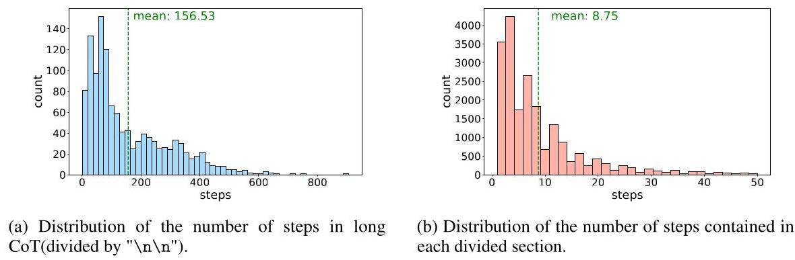

Figure 14: Statistical distribution of steps in long CoT.

Figure 3 illustrates the prompt for dividing sections along with examples of the resulting divisions. Several steps involved in addressing an atomic problem or exploring an idea are grouped into the same section. The specific outcome of the division is influenced by various factors, such as the task domain. However, compared to a purely long CoT, this approach is more user-friendly for human annotation.

Furthermore, to prevent sections from becoming overloaded with too many steps, which would increase the complexity of the annotation process, we iteratively divide sections that exceed 50 steps. Figure 14 displays the distribution of steps in the original long CoT (subfigure 14a) and the distribution of steps in each divided section (subfigure 14b). Before sectioning, annotators are required to review each individual step, which can be exceedingly challenging for long CoTs with numerous steps. By dividing the sections, annotators can proceed on a section-by-section basis, making the process more comprehensible and significantly reducing the difficulty of annotation.

### A.6 Validation of Long CoT Correctness

<table><tr><td>Domain</td><td>Filtered Total Num</td><td>Correct Num</td><td>Accuracy(%)</td></tr><tr><td>Math</td><td>7534</td><td>5413</td><td>71.84</td></tr><tr><td>Programming</td><td>2103</td><td>1276</td><td>60.67</td></tr><tr><td>PCB</td><td>4517</td><td>2626</td><td>58.13</td></tr><tr><td>General Reasoning</td><td>1981</td><td>1160</td><td>58.56</td></tr></table>

Table 5: Accuracy statistics for generated long CoT responses for filtered high-quality queries.

For the filtered high-quality queries, we use a mix of various o1-like models, including QwQ-32B-Preview, DeepSeek-R1, and Gemini 2.0 Flash Thinking, to generate the corresponding long CoT. We then use LLM-as-a-judge and a sandbox testing environment to validate the accuracy of the long CoT generated by these o1-like models, obtaining the native erroneous long CoT for subsequent human annotation.

Table 5 shows the accuracy of the generated long CoT. It can be seen that o1-like models enhanced with reinforcement learning in math and programming perform slightly better in these two areas compared to general reasoning and PCB.

### A.7 Statistics on Category Distribution

<table><tr><td>Domain</td><td>Subcategory</td><td>Number</td></tr><tr><td rowspan="7">Math</td><td>Discrete Mathematics</td><td>144</td></tr><tr><td>Number Theory</td><td>104</td></tr><tr><td>Geometry</td><td>101</td></tr><tr><td>Others</td><td>74</td></tr><tr><td>Calculus and Analysis</td><td>58</td></tr><tr><td>Statistics and Other Decision Science</td><td>45</td></tr><tr><td>Algebra</td><td>36</td></tr><tr><td rowspan="7">Programming</td><td>Basic Programming</td><td>133</td></tr><tr><td>Mathematics</td><td>86</td></tr><tr><td>Advanced Programming</td><td>48</td></tr><tr><td>Data Analysis</td><td>41</td></tr><tr><td>Desktop and Web Development</td><td>27</td></tr><tr><td>Others</td><td>24</td></tr><tr><td>Software Engineering</td><td>14</td></tr><tr><td rowspan="3">PCB</td><td>Chemistry</td><td>64</td></tr><tr><td>Physics</td><td>63</td></tr><tr><td>Biology</td><td>27</td></tr><tr><td rowspan="7">General Reasoning</td><td>Logical Reasoning</td><td>56</td></tr><tr><td>Symbolic Reasoning</td><td>28</td></tr><tr><td>Quantitative Reasoning</td><td>24</td></tr><tr><td>Strategic Reasoning</td><td>12</td></tr><tr><td>Common Sense Reasoning</td><td>9</td></tr><tr><td>Spatio-temporal Reasoning</td><td>9</td></tr><tr><td>Others</td><td>9</td></tr><tr><td/><td>Total</td><td>1236</td></tr></table>

Table 6: Detailed categories of DeltaBench and corresponding data volume statistics.

Table 6 shows the subcategories and corresponding data volumes of DeltaBench across various domains. In obtaining queries and annotations, we strive to ensure balance across categories while also balancing annotation difficulty and accuracy.

### A.8 Analysis of Other Evaluation Metrics

<table><tr><td>Model</td><td>F1-Score</td><td>First Error Acc.</td><td>Any Error Acc.</td></tr><tr><td>GPT-4-turbo-128k</td><td>40.76</td><td>57.04</td><td>69.17</td></tr><tr><td>GPT-40</td><td>30.85</td><td>36.89</td><td>50.89</td></tr><tr><td>DeepSeek-V3</td><td>27.33</td><td>31.72</td><td>42.39</td></tr><tr><td>Qwen2.5-32B-Instruct</td><td>26.73</td><td>30.58</td><td>42.23</td></tr><tr><td>DeepSeek-R1</td><td>28.43</td><td>29.94</td><td>40.78</td></tr><tr><td>Qwen2.5-7B-Instruct</td><td>18.63</td><td>22.25</td><td>30.74</td></tr><tr><td>GPT-3.5</td><td>7.98</td><td>6.15</td><td>11.65</td></tr></table>

Table 7: The table compares different accuracy metrics for each model. 'First Error Acc.' is the accuracy in identifying the first error, and 'Any Error Acc.' is the accuracy in detecting any error.

In Table 7, we present the performance of several models across different accuracy metrics: F1-Score, First Error Accuracy, and Any Error Accuracy. These metrics evaluate the models' ability to identify the first error and detect any error within a given sequence. A key observation is that the relative rankings of the models across the First Error Accuracy and Any Error Accuracy metrics closely align with their F1-Score. This consistency across different evaluation measures highlights the robustness of the F1-Score as a comprehensive indicator of model performance and suggests a strong correlation between the ability to detect the first error and the ability to identify any error in the sequence Additionally, GPT-4-turbo consistently outperforms the other models, regardless of the evaluation metric used. Its Any Error Accuracy reaches 69%, significantly higher than the other models in the comparison. This finding underscores the model's superior performance in error recognition, yet it also points to the limitations that remain in current LLMs.

<table><tr><td>Model</td><td>Quantile</td><td>Threshold</td><td>prec</td><td>recall</td><td>F1</td></tr><tr><td>Qwen/Qwen2.5-Math-PRM-7B</td><td>5%</td><td>0.2168</td><td>39.81</td><td>73.86</td><td>46.48</td></tr><tr><td>Qwen/Qwen2.5-Math-PRM-72B</td><td>5%</td><td>0.2119</td><td>33.51</td><td>65.11</td><td>40.44</td></tr><tr><td>RLHFlow/Llama3.1-8B-PRM-Deepseek-Data</td><td>5%</td><td>0.2021</td><td>24.19</td><td>56.1</td><td>30.88</td></tr><tr><td>RLHFlow/Llama3.1-8B-PRM-Mistral-Data</td><td>5%</td><td>0.2949</td><td>23.18</td><td>51.46</td><td>29.68</td></tr><tr><td>Skywork/Skywork-o1-Open-PRM-Qwen-2.5-1.5B</td><td>5%</td><td>0.0303</td><td>19.48</td><td>46.76</td><td>24.45</td></tr><tr><td>Skywork/Skywork-o1-Open-PRM-Qwen-2.5-7B</td><td>5%</td><td>0.0278</td><td>18.68</td><td>46.14</td><td>23.46</td></tr></table>

Table 8: Performance of PRMs using the overall reward quantile as the threshold.

For PRMs, aside from outlier detection, we also experimented with evaluating using a fixed threshold based on quantiles. Specifically, we used the ascending 5% quantile of all rewards on DeltaBench as the threshold, considering sections below this value as incorrect. The evaluation results are shown in table 8. However, compared to outlier detection, we found that this approach overestimates the performance of PRMs. This is because using a quantile as a threshold effectively forces PRMs to consider a fixed proportion of sections as incorrect.

## B Error Classification

In Figure 15, we conclude a detailed error classification based on human annotations of the errors contained in the model's answers.

## C Analysis of Underperforming Model

<table><tr><td>Primary Category</td><td>Subcategory</td><td>Description</td></tr><tr><td rowspan="2">Understanding Error</td><td>Problem Misunderstanding</td><td>Incorrect interpretation of the problem requirements or context at the initial comprehension stage</td></tr><tr><td>Conceptual Misunderstanding</td><td>Misunderstanding of basic principles or theoretical foundations</td></tr><tr><td rowspan="3">Knowledge Errors</td><td>Factual Error</td><td>Incorrect recall or statement of established facts or constants</td></tr><tr><td>Theorem Error</td><td>Incorrect recall or application of mathematical theorems or scientific laws</td></tr><tr><td>Definition Error</td><td>Incorrect understanding or application of standard definitions or terminology</td></tr><tr><td rowspan="4">Logical Errors</td><td>Strategy Error</td><td>Inappropriate selection of problem-solving approaches or methodologies</td></tr><tr><td>Reasoning Error</td><td>Flaws in the logical flow of problem-solving steps</td></tr><tr><td>Premise Error</td><td>Invalid or incorrect assumptions in the reasoning process</td></tr><tr><td>Consistency Error</td><td>Contradictions or inconsistencies in the logical framework</td></tr><tr><td rowspan="4">Calculation Errors</td><td>Numerical Error</td><td>Inaccuracies in arithmetic operations or numerical computations</td></tr><tr><td>Formula Error</td><td>Incorrect application or manipulation of mathematical formulas</td></tr><tr><td>Parameter Error</td><td>Mistakes in handling variables or parameters</td></tr><tr><td>Unit Error</td><td>Incorrect use or conversion of measurement units</td></tr><tr><td rowspan="3">Programming Errors</td><td>Syntax Error</td><td>Violations of programming language rules and conventions Including incorrect code structure, missing delimiters, or improper statement construction</td></tr><tr><td>Function Error</td><td>Deficiencies in function implementation, usage, or behavior. Including improper function definitions, incorrect function calls, or unexpected function behaviors</td></tr><tr><td>Data Type Error</td><td>Incorrect handling of data types and type conversions. Including type mismatches, improper type conversions, or inappropriate data structure usage</td></tr><tr><td rowspan="2">Formal Errors</td><td>Symbol Error</td><td>Incorrect use of mathematical or scientific symbols</td></tr><tr><td>Formatting Error</td><td>Improper presentation or organization of solution structure</td></tr><tr><td>Completeness Errors</td><td>Boundary Omission</td><td>Failure to consider edge cases or limiting conditions</td></tr><tr><td rowspan="4">Special Cases</td><td>Reflection Error</td><td>Insufficient analysis of solution validity or limitations</td></tr><tr><td>Summary Error</td><td>Inadequate synthesis or conclusion of findings</td></tr><tr><td>Hallucination</td><td>Generation of false or unsupported information</td></tr><tr><td>Redundancy</td><td>Unnecessary repetition or superfluous information in solutions</td></tr></table>

Figure 15: Categories of Errors in o1-like Models.

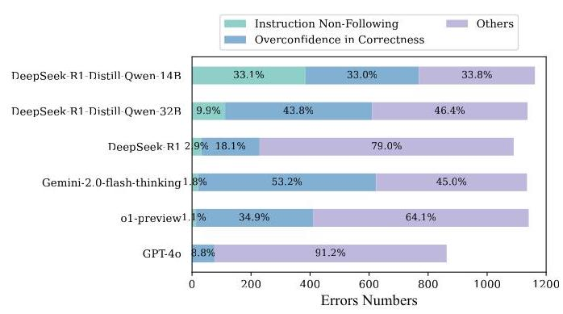

Figure 16: Distribution of error causes for each model.

We classify the errors produced by underperforming models into three categories: (1) Not following instructions, where models fail to follow the critique instructions; (2) Overconfidence in Correctness, where models incorrectly assume the sample contains no errors; (3) Other errors, such as false negatives, where models incorrectly flag accurate reasoning as erroneous, and error misidentification, where models inaccurately determine the type or location of errors.

As illustrated in Figure 16, the following observations can be made: (1) DeepSeek-R1-Distill series exhibit significant instruction-following deficiencies. These models tend to directly answer questions rather than critically evaluate the correctness of responses, indicating a potential overfitting problem. (2) o1-like models like DeepSeek-R1 and o1-preview-0912 also demonstrate notable instruction-following challenges, albeit to a lesser extent than GPT-4o. (3) A notable trend among the o1-preview and Gemini 2.0 Flash Thinking models was their tendency to assume that samples were correct without thorough evaluation. This overconfidence in correctness was a significant contributor to their error rates. In contrast, GPT-4o demonstrates superior performance, with no instances of "Instructions not followed" errors and a relatively low number of "Overconfidence in Correctness" errors.