# ConceptMath: A Bilingual Concept-wise Benchmark for Measuring Mathematical Reasoning of Large Language Models

Yanan Wu*1, Jie Liu*2, Xingyuan Bu*1, Jiaheng Liu \( {}^{\dagger ,1} \) , Zhanhui Zhou \( {}^{1} \) ,

Yuanxing Zhang \( {}^{1} \) , Chenchen Zhang \( {}^{1} \) , Zhiqi Bai \( {}^{1} \) , Haibin Chen \( {}^{1} \) , Tiezheng Ge \( {}^{1} \) ,

Wanli Ouyang \( {}^{3} \) , Wenbo Su \( {}^{1} \) , Bo Zheng \( {}^{1} \)

\( {}^{1} \) Alibaba Group; \( {}^{2} \) The Chinese University of Hong Kong;

\( {}^{3} \) Shanghai Artificial Intelligence Laboratory

\{lixing.wyn, ljh411989\}@taobao.com

## Abstract

This paper introduces ConceptMath, a bilingual (English and Chinese), fine-grained benchmark that evaluates concept-wise mathematical reasoning of Large Language Models (LLMs). Unlike traditional benchmarks that evaluate general mathematical reasoning with an average accuracy, ConceptMath systematically organizes math problems under a hierarchy of math concepts, so that mathematical reasoning can be evaluated at different granularity with concept-wise accuracies. Based on our ConcepthMath, we evaluate a broad range of LLMs, and we observe existing LLMs, though achieving high average accuracies on traditional benchmarks, exhibit significant performance variations across different math concepts and may even fail catastrophically on the most basic ones. Besides, we also introduce an efficient fine-tuning strategy to enhance the weaknesses of existing LLMs. Finally, we hope ConceptMath could guide the developers to understand the fine-grained mathematical abilities of their models and facilitate the growth of foundation models.

## 1 Introduction

Mathematical reasoning is a crucial capability for Large Language Models (LLMs). Recent advancements in LLMs, including Anthropic (Anthropic, 2023), GPT-4 (OpenAI, 2023), and LLaMA (Tou-vron et al., 2023a), have demonstrated impressive mathematical reasoning on existing benchmarks with high average accuracies on datasets like GSM8K (Cobbe et al., 2021). Although these benchmarks are able to measure the overall mathematical reasoning capabilities of LLMs on average, they fail to probe the fine-grained failure modes of mathematical reasoning on specific mathematical concepts. For example, Fig. 1 shows that the performance of LLaMA2-13B varies significantly across different concepts and fails on simple concepts like Rational number and Cylinders. It is crucial to know these specific failure modes of the language model, especially in some practical applications where we need to focus on specific mathematical abilities. For example, for financial analysts, calculation and statistics are the concepts of most interest while others like geometry are not as important.

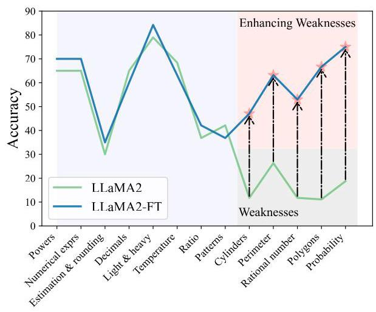

Figure 1: The concept-wise accuracies of LLaMA2-13B and the fine-tuned version based on our efficient fine-tuning method (i.e., LLaMA2-FT).

Moreover, the mathematics system, by its nature, is more fine-grained than holistic. It is typically organized into distinct math concepts, and humans develop comprehensive mathematical capabilities through a concept-by-concept, curriculum-based learning process (Simon, 2011; Fritz et al., 2013). These issues underscore the core motivation of this paper: the need for a fine-grained benchmark that evaluates concept-wise mathematical reasoning capabilities of LLMs.

Therefore, first, we introduce ConceptMath, the first bilingual (English and Chinese), concept-wise benchmark for measuring mathematical reasoning. ConceptMath gathers math concepts from four educational systems, resulting in four distinct mathematical concept systems: English Elementary, English Middle, Chinese Elementary, and Chinese Middle . Each of these concept systems organizes around 50 atomic math concepts under a three-level hierarchy and each concept includes approximately 20 mathematical problems. Overall, ConceptMath comprises a total of 4011 math word problems across 214 math concepts, and Fig. 2 shows the diagram overview of ConceptMath.

---

* First three authors contributed equally.

\( {}^{ \dagger  } \) Corresponding Author: Jiaheng Liu.

The data and code are available at https://github.com/conceptmath/conceptmath.

https://en.wikipedia.org/wiki/Lists_ of_mathematics_topics

---

Second, based on our ConceptMath, we perform extensive experiments to assess the mathematical reasoning of existing LLMs, including 2 close-sourced LLMs and 17 open-sourced LLMs. These evaluations were performed in zero-shot, chain-of-thought (CoT), and few-shot settings. To our surprise, even though most of the evaluated LLMs claim to achieve high average accuracies on traditional mathematical benchmarks (e.g., GSM8K), they fail catastrophically across a wide spectrum of mathematical concepts.

Third, to make targeted improvements on un-derperformed math concepts, we propose an efficient fine-tuning strategy by first training a concept classifier and then crawling a set of samples from a large open-sourced math dataset (Paster et al., 2023; Wang et al., 2023b) for further LLMs fine-tuning. In Fig. 1, for LLaMA2-FT, we observe that the results of these weaknesses improved a lot after using the efficient fine-tuning method.

In summary, our contributions are as follows:

- We introduce ConceptMath, the first bilingual, concept-wise benchmark for measuring mathematical reasoning. ConceptMath encompasses 4 systems, approximately 214 math concepts, and 4011 math word problems, which can guide further improvements on the mathematical reasoning of existing models.

- Based on ConceptMath, we evaluate many LLMs and perform a comprehensive analysis of their results. For example, we observe that most of these LLMs (including open-sourced, closed-sourced, general-purpose, or math-specialized models) show significant variations in their performance results across math concepts.

- We also evaluate the contamination rate of our ConceptMath and introduce a simple and efficient fine-tuning method to improve the weaknesses of existing LLMs.

## 2 ConceptMath

ConceptMath is the first bilingual, concept-wise benchmark for measuring mathematical reasoning. In this section, we describe the design principle, dataset collection process, dataset statistics and an efficient fine-tuning strategy to enhance the weaknesses identified by our ConceptMath.

### 2.1 Design Principle

We created ConceptMath based on the following two high-level design principles:

Concept-wised Hierarchical System. The primary goal of ConceptMath is to evaluate the mathematical reasoning capacities of language models at different granularity. Therefore, ConceptMath organizes math problems within a three-level hierarchy of mathematical concepts in Fig. 2. This approach provides concept-wise evaluation for mathematical reasoning of language models and makes targeted and effective improvements possible.

Bilingualism. Most of the current mathematical benchmark focuses solely on English, leaving multi-lingual mathematical reasoning unexplored. As an early effort to explore multi-lingual mathematical reasoning, we evaluate mathematical reasoning in two languages: English and Chinese. Besides, since cultures and educational systems vary across different languages, common math concepts can differ a lot. Therefore, we carefully collect concepts in both languages, instead of merely translating from one language to another. For example, measurement metrics (e.g., money, size) are different for English and Chinese.

### 2.2 Data Collection

Subsequently, for data collection, we take a two-step approach to operationalize the aforementioned design principles: First, we recruit experts to delineate a hierarchy of math concepts based on different education systems. Secondly, we collect problems for each concept from various sources or design problems manually, which is succeeded by quality assessment and data cleaning.

Math Concept System Construction. Since the education systems provide a natural hierarchy of math concepts, we recruited four teachers from elementary and middle schools, specializing in either English or Chinese, to organize a hierarchy of math concepts for different education systems.

---

The four concept systems are abbreviated as Elementary-EN, Middle-EN, Elementary-ZH, and Middle-ZH.

---

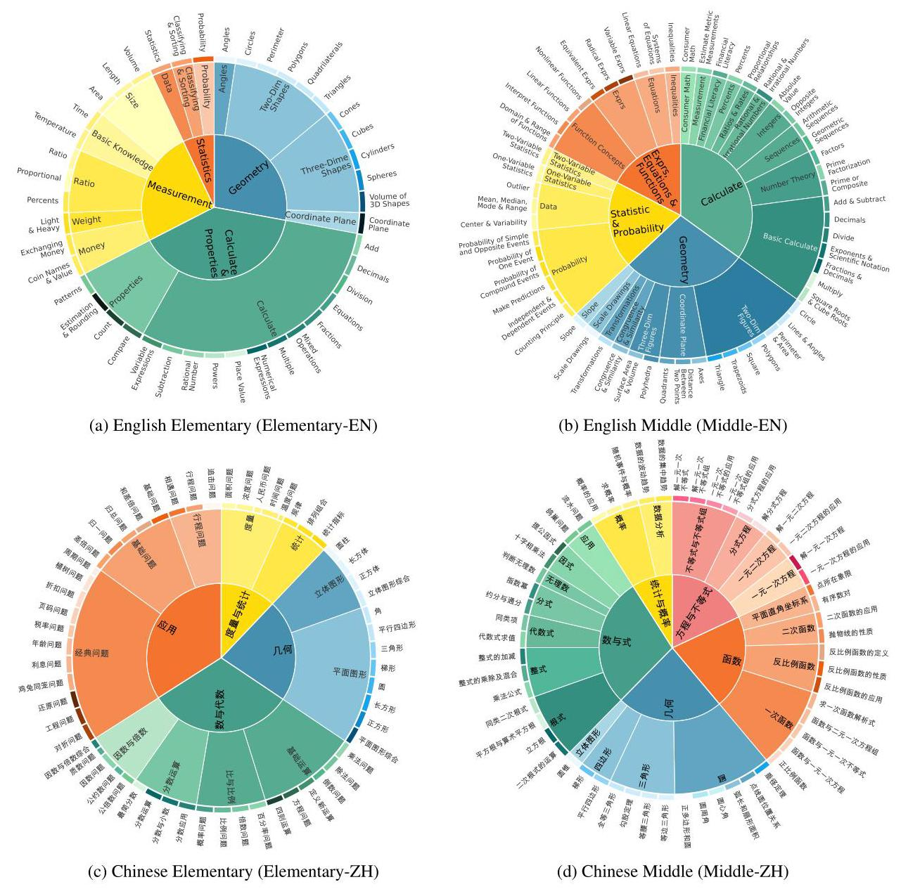

Figure 2: Diagram overview of four concept systems in ConceptMath. We have provided translated Chinese concept names in English (See Appendix A).

This leads to four concept systems: Elementary-EN, Middle-EN, Elementary-ZH, and Middle-ZH, with each system consisting of a three-level hierarchy of around 50 atomic math concepts (Fig. 2).

Math Problem Construction. Then we conducted a thorough data acquisition from various sources (including educational websites, textbooks, and search engines with specific concepts) to collect math word problems (including both questions and answers) for each math concept. To guarantee a balance across all concepts, approximately 20 problems were gathered for each math concept. Following this, both GPT-4 (OpenAI, 2023) and human experts were employed to verify and rectify the categorization and the solution of each problem. However, we observed that for some concepts, the problem count was significantly below 20 . To address this issue, manual efforts were undertaken to augment these categories, ensuring a consistent collection of 20 problems for each concept. Furthermore, to broaden the diversity of the dataset and minimize the risk of data contamination, all gathered problems were paraphrased using GPT-4. It is important to note that the collection and annotation processes were carried out by a team of six members, each possessing a university degree in an engineering discipline, to maintain a high level of technical expertise in executing these tasks.

<table><tr><td>Benchmark</td><td>Language</td><td>Fine-grained</td><td>Size</td></tr><tr><td>GSM8K</td><td>EN</td><td>✘</td><td>1319</td></tr><tr><td>MATH</td><td>EN</td><td>✘</td><td>5000</td></tr><tr><td>TabMWP</td><td>EN</td><td>✘</td><td>7686</td></tr><tr><td>Dolphin18K</td><td>EN</td><td>✘</td><td>1504</td></tr><tr><td>Math23K</td><td>ZH</td><td>✘</td><td>1000</td></tr><tr><td>ASDiv</td><td>EN</td><td>✘</td><td>2305</td></tr><tr><td>SVAMP</td><td>EN</td><td>✘</td><td>300</td></tr><tr><td>SingleOp</td><td>EN</td><td>✘</td><td>159</td></tr><tr><td>MMLU-Math</td><td>EN</td><td>✘</td><td>906</td></tr><tr><td>ConceptMath</td><td>EN&ZH</td><td>✓</td><td>4011</td></tr></table>

Table 1: A comparison of our ConceptMath with some notable mathematical datasets. Note that the size is the number of samples of the test split.

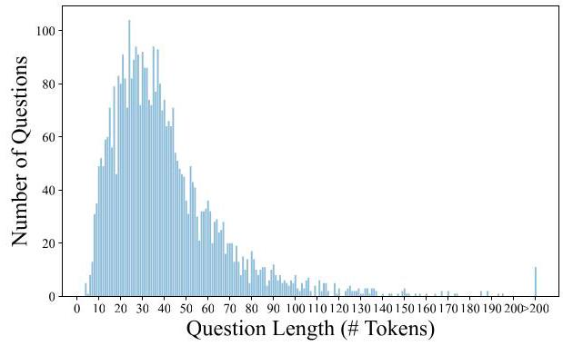

Figure 3: Length distributions of our ConceptMath.

### 2.3 Dataset Statistics

Comparison to existing datasets. As shown in Table 1, our ConceptMath differs from related datasets in various aspects: (1) ConceptMath is the first dataset to study fine-grained mathematical concepts and encompasses 4 systems, 214 math concepts, and 4011 math word problems. (2) Problems in ConcepthMath are carefully annotated based on the mainstream education systems for English (EN) and Chinese (ZH).

Details on the hierarchical system. Apart from Fig. 2, we also provide the details on the hierarchical system more clearly in Appendix A.

Length distribution. Fig. 3 shows the length distribution of our ConcepthMath, where number of tokens is reported. The minimum, average and maximum of the tokens for these questions are 4 , 41 and 309, respectively, which shows that they have lexical richness.

### 2.4 Efficient Fine-Tuning

Based on our ConceptMath, we are able to identify the weaknesses in the mathematical reasoning capability of LLMs through concept-wise evaluation. In this section, we explore a straightforward approach to enhance mathematical abilities towards specific concepts by first training a concept classifier and then curating a set of samples from a large open-sourced math dataset. Specifically, first, by additionally collecting extra 10 problems per concept, we construct a classifier capable of identifying the concept class of a given question. The backbone of this classifier is a pretrained bilingual LLM, where the classification head is operated on its last hidden output feature. Then, we proceed to fine-tune LLMs using this specific dataset combined with the existing general math dataset, which aims to avoid overfitting on a relatively small dataset. More details have been provided in the Appendix B.

## 3 Experiments

In this section, we perform extensive experiments to demonstrate the effect of our ConceptMath.

### 3.1 Experimental Setup

Evaluated Models. We assess the mathematical reasoning of existing advanced LLMs on ConceptMath, including 2 close-sourced LLMs (i.e., GPT-3.5/GPT-4 (OpenAI, 2023)) and 17 open-sourced LLMs (i.e., WizardMath- 13B (Luo et al., 2023), MetaMath-13B (Yu et al., 2023), MAmmoTH-13B (Yue et al., 2023), Qwen-14B/72B (Bai et al., 2023b), Baichuan2- 13B (Baichuan, 2023), ChatGLM3-6B (Du et al., 2022), InternLM2-7B/20B (Team, 2023a), InternLM2-Math-7B/20B (Ying et al., 2024), LLaMA2-7B/13B/70B (Touvron et al., 2023b), Yi-6B/34B (Team, 2023b) and DeepSeekMath- 7B (Shao et al., 2024)). Note that WizardMath- 13B, MetaMath-13B, and MAmmoTH-13B are specialized math language models fine-tuned from LLaMA2. InternLM2-Math and DeepSeekMath- 7B are specialized math language models fine-tuned from corresponding language models. More details of these evaluated models can be seen in Appendix C.

Evaluation Settings. We employ three distinct evaluation settings: zero-shot, zero-shot with chain-of-thought (CoT), and few-shot promptings. The zero-shot prompting assesses the models' intrinsic problem-solving abilities without any prior examples. The zero-shot with CoT prompting evaluates the models' ability to employ a logical chain of thought. In the few-shot prompting setting, the model is provided with fixed 5 -shot prompts for different systems (See Appendix E), which includes five newly created examples with concise ground truth targets. This approach is designed to measure the in-context learning abilities. Besides, following MATH (Hendrycks et al., 2021b), all questions and answers in ConceptMath have been carefully curated, and each problem is evaluated based on exact matches. Moreover, greedy decoding with a temperature of 0 is used.

---

We use the "cl100k_base" tokenizer from https:// github.com/openai/tiktoken

---

<table><tr><td rowspan="2">Model</td><td colspan="3">Elementary-EN</td><td colspan="3">Middle-EN</td><td colspan="3">Elementary-ZH</td><td colspan="3">Middle-ZH</td><td rowspan="2">\( \mathbf{{Avg}.} \)</td></tr><tr><td>ZS</td><td>ZS-COT</td><td>FS</td><td>ZS</td><td>ZS-COT</td><td>FS</td><td>ZS</td><td>ZS-COT</td><td>FS</td><td>ZS</td><td>ZS-COT</td><td>FS</td></tr><tr><td>Yi-6B</td><td>67.94</td><td>67.56</td><td>59.03</td><td>65.55</td><td>64.59</td><td>56.05</td><td>34.33</td><td>31.91</td><td>37.86</td><td>36.46</td><td>36.19</td><td>36.46</td><td>49.49</td></tr><tr><td>ChatGLM3-6B</td><td>60.69</td><td>63.10</td><td>53.18</td><td>51.25</td><td>60.17</td><td>51.34</td><td>46.23</td><td>43.63</td><td>40.74</td><td>44.77</td><td>43.32</td><td>40.43</td><td>49.90</td></tr><tr><td>DeepSeekMath-7B</td><td>66.92</td><td>77.35</td><td>73.92</td><td>56.53</td><td>69.87</td><td>66.31</td><td>60.47</td><td>62.33</td><td>64.19</td><td>56.50</td><td>56.95</td><td>56.86</td><td>64.02</td></tr><tr><td>InternLM2-Math-7B</td><td>71.12</td><td>72.01</td><td>69.59</td><td>63.44</td><td>62.96</td><td>63.05</td><td>57.30</td><td>58.23</td><td>58.60</td><td>53.79</td><td>53.16</td><td>53.88</td><td>61.43</td></tr><tr><td>InternLM2-7B</td><td>68.83</td><td>69.97</td><td>66.67</td><td>37.04</td><td>65.83</td><td>55.47</td><td>47.63</td><td>49.02</td><td>53.02</td><td>45.22</td><td>45.40</td><td>44.86</td><td>54.08</td></tr><tr><td>LLaMA2-7B</td><td>36.51</td><td>42.62</td><td>38.68</td><td>34.26</td><td>39.16</td><td>33.69</td><td>15.72</td><td>17.67</td><td>17.58</td><td>30.87</td><td>32.22</td><td>27.80</td><td>30.57</td></tr><tr><td>MAmmoTH-13B</td><td>61.32</td><td>52.42</td><td>56.49</td><td>53.93</td><td>45.20</td><td>48.08</td><td>22.33</td><td>33.30</td><td>23.81</td><td>27.98</td><td>43.05</td><td>29.15</td><td>41.42</td></tr><tr><td>WizardMath-13B</td><td>41.73</td><td>44.78</td><td>34.99</td><td>36.85</td><td>37.72</td><td>45.11</td><td>10.51</td><td>11.26</td><td>18.70</td><td>12.36</td><td>15.52</td><td>22.92</td><td>27.70</td></tr><tr><td>MetaMath-13B</td><td>54.45</td><td>51.78</td><td>47.96</td><td>44.24</td><td>43.47</td><td>47.50</td><td>11.44</td><td>17.30</td><td>27.53</td><td>21.21</td><td>26.08</td><td>29.60</td><td>35.21</td></tr><tr><td>Baichuan2-13B</td><td>68.83</td><td>68.58</td><td>54.07</td><td>67.66</td><td>69.67</td><td>40.40</td><td>57.02</td><td>58.23</td><td>22.05</td><td>55.05</td><td>55.32</td><td>26.90</td><td>53.65</td></tr><tr><td>LLaMA2-13B</td><td>44.02</td><td>49.75</td><td>47.07</td><td>44.72</td><td>46.45</td><td>43.09</td><td>20.19</td><td>24.19</td><td>22.14</td><td>33.30</td><td>35.38</td><td>26.17</td><td>36.37</td></tr><tr><td>Qwen-14B</td><td>46.95</td><td>65.78</td><td>72.65</td><td>38.48</td><td>59.60</td><td>67.85</td><td>28.09</td><td>65.12</td><td>64.47</td><td>22.92</td><td>58.30</td><td>62.09</td><td>54.36</td></tr><tr><td>InternLM2-Math-20B</td><td>74.05</td><td>75.32</td><td>73.41</td><td>64.11</td><td>71.21</td><td>70.83</td><td>62.98</td><td>61.95</td><td>61.77</td><td>55.14</td><td>55.78</td><td>56.86</td><td>65.28</td></tr><tr><td>InternLM2-20B</td><td>53.31</td><td>72.52</td><td>73.28</td><td>45.11</td><td>67.47</td><td>56.72</td><td>48.19</td><td>55.53</td><td>59.81</td><td>45.13</td><td>50.63</td><td>56.68</td><td>57.03</td></tr><tr><td>Yi-34B</td><td>74.68</td><td>73.66</td><td>56.36</td><td>72.26</td><td>74.66</td><td>65.83</td><td>50.05</td><td>51.16</td><td>38.79</td><td>45.40</td><td>43.95</td><td>40.97</td><td>57.31</td></tr><tr><td>LLaMA2-70B</td><td>56.11</td><td>60.31</td><td>30.53</td><td>58.06</td><td>60.94</td><td>31.67</td><td>28.65</td><td>26.70</td><td>24.37</td><td>37.64</td><td>34.30</td><td>28.43</td><td>39.81</td></tr><tr><td>Qwen-72B</td><td>77.10</td><td>75.06</td><td>77.23</td><td>74.66</td><td>69.87</td><td>73.99</td><td>71.16</td><td>68.65</td><td>61.86</td><td>71.30</td><td>65.43</td><td>62.45</td><td>70.73</td></tr><tr><td>GPT-3.5</td><td>85.75</td><td>92.37</td><td>84.35</td><td>83.88</td><td>90.12</td><td>82.73</td><td>56.47</td><td>53.21</td><td>56.93</td><td>51.90</td><td>53.52</td><td>55.69</td><td>70.58</td></tr><tr><td>GPT-4</td><td>86.77</td><td>90.20</td><td>89.57</td><td>84.26</td><td>89.83</td><td>88.68</td><td>67.91</td><td>72.28</td><td>72.00</td><td>63.81</td><td>64.26</td><td>66.61</td><td>78.02</td></tr><tr><td>\( \mathbf{{Avg}.} \)</td><td>63.00</td><td>66.59</td><td>61.00</td><td>56.65</td><td>62.57</td><td>57.28</td><td>41.93</td><td>45.35</td><td>43.49</td><td>42.67</td><td>45.72</td><td>43.41</td><td>52.47</td></tr></table>

Table 2: Results of different models on our constructed ConceptMath benchmark dataset. Note that "ZS", "ZS-COT", "FS" represents "zero-shot", "zero-shot w/ chain-of-thought" and "few-shot", repsectively. Models are grouped roughly according to their model sizes.

### 3.2 Results

Overall Accuracy We present the overall accuracies of different LLMs on our ConceptMath benchmark under various prompt settings in Table 2. Subsequently, we analyzed the mathematical abilities of these LLMs in both English and Chinese in Fig. 4. Our analysis led to the following key findings: (1) GPT-3.5/4 showcases the most advanced mathematical reasoning abilities among LLMs in both English and Chinese systems, and the leading open-source Qwen-72B model archives comparable performance compared with GPT-3.5. (2) The scores on Chinese systems of most existing LLMs are lower than English systems a lot. For example, accuracies on Middle-ZH and Middle-EN for GPT-4 are 63.81 and 84.26. (3) Several models (e.g., WizardMath-13B or MetaMath-13B) fine-tuned from LLaMA2-13B achieve slight improvements on English systems, but the performance results are lower than LLaMA2-13B on Chinese systems a lot, which indicates that domain-specific fine-tuning may degrade the generalization abilities of LLMs. (4). The mathematical models (i.e., InternLM2-Math-7B/20B and DeepSeekMath-7B) by continuing pretraining on the large-scale math-related dataset ( \( i = {100}\mathrm{\;B} \) tokens) show sufficient improvements when compared to models with similar size, which indicates that large-scale pertaining is effective to improve the mathematical reasoning abilities.

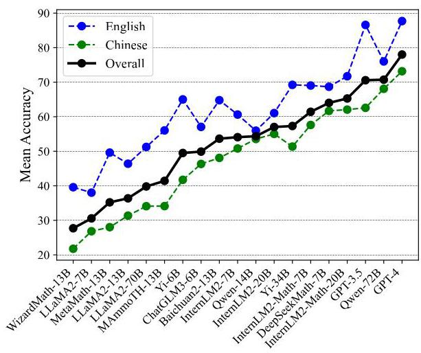

Figure 4: Mean accuracies for English, Chinese, and overall educational systems.

Average Concept-wised Accuracy. In Fig. 5 and Fig. 6, to better analyze the effectiveness of our ConceptMath, we further provide the concept-wised accuracies average on evaluated models for different mathematical concepts by zero-shot prompting on Middle-EN and Middle-ZH. (See Appendix \( \mathrm{D} \) for more results on Elementary-EN and Elementary-ZH). In Fig. 5 and Fig. 6, we observe that the accuracies across concepts vary a lot for existing LLMs. For example, for Middle-ZH in Fig. 6, around 18% of concepts exhibit an accuracy lower than \( {30}\% \) . Thus, to improve the mathematical abilities of LLMs, these concepts with large room for improvement should be given the highest priority, which further shows the advantage of ConceptMath.

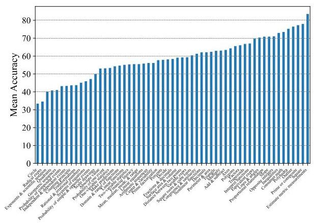

Figure 5: Mean concept accuracies on Middle-EN.

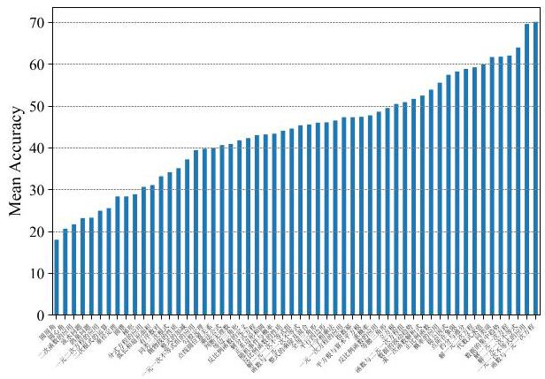

Figure 6: Mean concept accuracies on Middle-ZH.

Concept-wised Accuracy. Fig. 7 and Fig. 8 show that most existing LLMs, whether open-sourced, closed-sourced, general-purpose, or math-specialized, exhibit notable differences in their concept accuracies in the zero-shot prompt setting. These disparities may stem from variations in training datasets, strategies, and model sizes, which suggests that apart from common weaknesses, each model possesses its unique areas of deficiency or shortcomings. For the sake of brevity in the presentation, we only show a subset of models on Middle-EN and Middle-ZH. The concept accuracies of Elementary-EN and Elementary-ZH systems and all results of all models can be found in Appendix D.

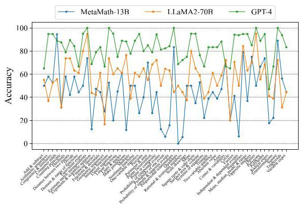

Figure 7: Concept accuracies on Middle-EN.

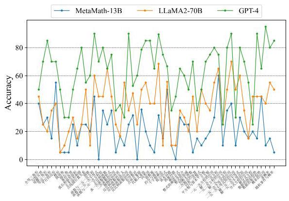

Figure 8: Concept accuracies on Middle-ZH.

### 3.3 Analysis

Contamination. To determine whether a text is in the pretraining data of a LLM, we provide two different contamination detection methods (i.e., Rouge-based and Prob-based methods) to analyze our ConceptMath in Table 3. Specifically, for the Rouge-based method, we just input the first \( {50}\% \) of the question as the input and compute the Rouge-L score between the generation results and the ground-truth label of the last 50% of the text, where a lower Rouge-L score means a lower contamination rate. For the Prob-based method, we follow (Shi et al., 2023) to use the MIN-K% probability metric, which first gets the probability for each token in the test, and selects the \( \mathrm{K}\% \) tokens with minimum probabilities and calculates their average log-likelihood. If the average log-likelihood is high, the text is likely in the pretraining data. Note that we choose \( K \) as 10 in our setting. In Table 3 , we observe that the contaminate rates on our ConceptMath are very low, which means that our

<table><tr><td>Model</td><td>Elementary-EN</td><td>Middle-EN</td><td>Elementary-ZH</td><td>Middle-ZH</td><td>Avg. \( \downarrow \)</td></tr><tr><td>Yi-6B</td><td>5.30 / 1.73</td><td>5.21 / 1.37</td><td>0.04 / 0.20</td><td>0.36 / 0.35</td><td>2.73 / 0.91</td></tr><tr><td>ChatGLM3-6B</td><td>7.42 / 0.22</td><td>7.55 / 0.23</td><td>0.11 / 0.02</td><td>0.35 / 0.05</td><td>3.86 / 0.13</td></tr><tr><td>InternLM2-Math-7B</td><td>7.42 / 0.22</td><td>7.55 / 0.23</td><td>0.11 / 0.02</td><td>0.35 / 0.05</td><td>3.86 / 0.13</td></tr><tr><td>InternLM2-7B</td><td>5.36 / 1.03</td><td>5.27 / 0.84</td><td>0.01 / 0.37</td><td>0.33 / 0.49</td><td>2.74 / 0.68</td></tr><tr><td>MAmmoTH-13B</td><td>7.67 / 0.47</td><td>7.97 / 0.46</td><td>0.00 / 0.03</td><td>0.35 / 0.03</td><td>4.00 / 0.25</td></tr><tr><td>WizardMath-13B</td><td>8.41 / 0.35</td><td>8.23 / 0.34</td><td>0.00 / 0.02</td><td>0.55 / 0.02</td><td>4.30 / 0.18</td></tr><tr><td>MetaMath-13B</td><td>7.67 / 0.47</td><td>7.97 / 0.46</td><td>0.00 / 0.03</td><td>0.35 / 0.03</td><td>4.00 / 0.25</td></tr><tr><td>Baichuan2-13B</td><td>7.20 / 1.43</td><td>6.58 / 1.18</td><td>0.05 / 0.54</td><td>0.41 / 0.65</td><td>3.56 / 0.95</td></tr><tr><td>LLaMA2-13B</td><td>6.80 / 0.73</td><td>6.36 / 0.64</td><td>0.01 / 0.15</td><td>0.56 / 0.16</td><td>3.43 / 0.42</td></tr><tr><td>Qwen-14B</td><td>11.04 / 1.58</td><td>9.73 / 1.08</td><td>1.43 / 1.27</td><td>0.70 / 0.93</td><td>5.73 / 1.22</td></tr><tr><td>InternLM2-Math-20B</td><td>\( {5.58}/{1.30} \)</td><td>5.51 / 0.99</td><td>0.03 / 0.47</td><td>0.34 / 0.47</td><td>2.86 / 0.81</td></tr><tr><td>InternLM2-20B</td><td>7.20 / 1.43</td><td>6.58 / 1.18</td><td>0.05 / 0.54</td><td>0.41 / 0.65</td><td>3.56 / 0.95</td></tr><tr><td>GPT-3.5</td><td>9.48 / -</td><td>9.21 /-</td><td>0.00 / -</td><td>0.31 / -</td><td>4.75 / -</td></tr><tr><td>GPT-4</td><td>8.68 / -</td><td>8.24 / -</td><td>0.15 / -</td><td>0.68 / -</td><td>4.44 / -</td></tr></table>

Table 3: Data contamination rate of LLMs. We provide two different contamination detection methods. The values in the table represent "Rouge / Prob". Note that the second method based on output probability distributions can only be applied to the open-source models.

ConceptMath can provide a reasonable evaluation for existing LLMs.

Unmastered Concepts. We also highlight the several unmastered concepts of the LLaMA2-13B in Table 4, which shows ConceptMath is effective in guiding further refinement of existing LLMs.

Evaluation Prompting. Different from the few-shot or cot prompting evaluation that can boost closed-source models, we find that zero-shot prompting is more effective for certain open-source LLMs in Table 2. This disparity may arise either because the models are not sufficiently powerful to own mathematical CoT capabilities (Yu et al., 2023; Wei et al., 2022) or because these models have already incorporated CoT data during training (Longpre et al., 2023). Consequently, to ensure a comprehensive analysis, we have employed all three prompting methods for evaluation.

Efficient Fine-tuning. To show the effect of efficient fine-tuning, we take the LLaMA2-13B as an example in Table 5. Specifically, for LLaMA2- 13B, we first select 10 concepts with the lowest accuracies in Elementary-EN. Then, we crawl 495 samples (about 50 samples per concept) using the trained classifier as the Concept-Specific (CS) training data (See Appendix B for more details). Meanwhile, to avoid overfitting, we introduce the Meta-MathQA (MMQA (Yu et al., 2023)) data to preserve general mathematical abilities. After that, we can fine-tune LLaMA2-13B by only using MMQA (i.e., LLaMA2 (w/ MMQA)), or using both MMQA and CS data (i.e., LLaMA2 (w/ MMQA & CS)). In Table 5, we observe that LLaMA2 (w/ MMQA & CS) archives significant improvements on the lowest 10 concepts and preserves well on the other 33 concepts, which shows the effect of efficient fine-tuning and the advantages of our ConceptMath.

## 4 Related Work

Large Language Models for Mathematics. Large Language Models (LLMs) such as GPT- 3.5 and GPT-4 have exhibited promising capabilities in complex mathematical tasks. However, the proficiency of open-source alternatives like LLaMA (Touvron et al., 2023a) and LLaMA2 (Touvron et al., 2023b) remains notably inferior on these datasets, particularly in handling non-English problems. In contrast, models like Baichuan2 (Baichuan, 2023) and Qwen (Bai et al., 2023b) pretrained on multilingual datasets (i.e., Chinese and English) have achieved remarkable performance. Recently, many domain-specialized math language models have been proposed. For example, MetaMath (Yu et al., 2023) leverages the LLaMA2 models and finetunes on the constructed MetaMathQA dataset. MAmmoTH (Yue et al., 2023) synergizes Chain-of-Thought (CoT) and Program-of-Thought (PoT) rationales.

Mathmatical Reasoning Benchmarks. Recently, many mathematical datasets (Roy and Roth, 2015; Koncel-Kedziorski et al., 2015; Lu et al., 2023; Huang et al., 2016; Miao et al., 2020; Patel et al., 2021) have been proposed. For example, SingleOp (Roy et al., 2015), expands the scope to include more complex operations like multiplication and division. Math23k (Wang et al., 2017) gathers 23,161 problems labeled with structured equations and corresponding answers. GSM8K (Cobbe et al., 2021) is a widely used dataset, which requires a sequence of elementary calculations with basic arithmetic operations.

<table><tr><td>Concept</td><td>Concept Acc</td><td>Error Type</td><td>Example</td></tr><tr><td rowspan="2">Perimeter</td><td rowspan="2">26.32</td><td>Calculation Error</td><td>Q: Find the perimeter of a 16 by 18 feet rectangle. A: The perimeter is \( {16} + {18} + {16} + {18} = {72} \) feet.</td></tr><tr><td>Knowledge Error</td><td>Q: The perimeter of a rectangular sticker is 14 centimeters. The sticker is 2 centimeters wide. How tall is it? A: The height equals the perimeter subtracts the width. The height of the rectangle is \( {14} - {12} = {12} \) centimeters.</td></tr><tr><td>Polygons</td><td>11.11</td><td>Knowledge Error</td><td>Q: A regular polygon has an interior angle that measures 120 degrees. How many sides does this polygon have? A: Let \( n \) be the number of sides of the polygon. We have that \( n \times  {120} = {360} \) . Hence: \( n = 3 \) .</td></tr><tr><td>Cylinders</td><td>11.76</td><td>Calculation Error</td><td>Q: How much soup can a cylinder-shaped can store, if the radius of the can is 3 inches and the height is 5 inches? A: ... The volume of the can is \( \mathrm{V} = \pi  \times  {3}^{2} \times  5 = {30\pi } \) .</td></tr></table>

Table 4: Error reasons of several unmastered concepts of LLaMA2-13B.

<table><tr><td>Models</td><td>LLaMA2</td><td>LLaMA2 (w/ MMQA)</td><td>LLaMA2 (w/ MMQA &CS)</td></tr><tr><td>Cones</td><td>0.00</td><td>17.65</td><td>23.53</td></tr><tr><td>Spheres</td><td>5.88</td><td>29.41</td><td>35.29</td></tr><tr><td>Polygons</td><td>11.11</td><td>61.11</td><td>66.67</td></tr><tr><td>Rational Number</td><td>11.76</td><td>23.53</td><td>52.94</td></tr><tr><td>Cylinders</td><td>11.76</td><td>35.29</td><td>47.06</td></tr><tr><td>Angles</td><td>11.76</td><td>47.06</td><td>58.82</td></tr><tr><td>Probability</td><td>18.75</td><td>25.00</td><td>75.00</td></tr><tr><td>Perimeter</td><td>26.32</td><td>42.11</td><td>63.16</td></tr><tr><td>Volume</td><td>27.78</td><td>38.89</td><td>66.67</td></tr><tr><td>Proportional</td><td>27.78</td><td>33.33</td><td>44.44</td></tr><tr><td>Avg Acc. (over 10 concepts)</td><td>15.29</td><td>36.88</td><td>53.36</td></tr><tr><td>\( \mathbf{{AvgAcc}.} \) (over 33 concepts)</td><td>51.94</td><td>58.14</td><td>60.67</td></tr><tr><td>Overall Acc.</td><td>44.02</td><td>53.94</td><td>59.29</td></tr></table>

Table 5: Results of fine-tuning models. "MMQA" and "CS" denote MetaMathQA and our constructed Concept-Specific training datasets, respectively. Introducing CS data specifically for the bottom 10 concepts significantly enhances these concepts' performance, while slightly improving the performance across the remaining 33 concepts.

Fine-Grained Benchmarks. Traditional benchmarks focus on assessing certain abilities of models on one task (Guo et al., 2023b; Wang et al., 2023a; Liu et al., 2020; Guo et al., 2022; Chai et al., 2024; Liu et al., 2024; Guo et al., 2024, 2023c; Bai et al., 2023a; Liu et al., 2022; Guo et al., 2023a; Bai et al., 2024; Liu et al., 2021) (e.g., reading comprehension (Rajpurkar et al., 2018), machine translation (Bojar et al., 2014), and summarization (Narayan et al., 2018)). For example, the GLUE benchmark (Wang et al., 2019) combines a collection of tasks, and has witnessed superhuman model performance for pretraining models (Kenton and Toutanova, 2019; Radford et al., 2019) (Hendrycks et al., 2021a) introduced MMLU, a benchmark with multiple-choice questions across 57 subjects including STEM, humanities, and social sciences, for assessing performance and identifying weaknesses. (et al., 2022) proposed BIG-bench with over 200 tasks. To enhance the mathematical capabilities of LLMs, we introduce a comprehensive mathematical reasoning Concept-Math dataset designed to assess model performance across over 200 diverse mathematical concepts in both Chinese and English.

## 5 Conclusion

We introduce a new bilingual concept-wise math reasoning dataset called ConceptMath to assess models across a diverse set of concepts. First, Con-ceptMath covers more than 200 concepts across elementary and middle schools for mainstream English and Chinese systems. Second, we extensively evaluate existing LLMs by three prompting methods, which can guide further improvements for these LLMs on mathematical abilities. Third, we analyze the contamination rates, error cases and provide a simple and efficient fine-tuning strategy to enhance the weaknesses.

Limitations. Human efforts are required to carefully design the hierarchical systems of mathematical concepts. In the future, we have three plans as follows: (1) Extend the input modality to multimodalities. (2) Extend the education systems to high school and college levels. (3) Extend the reasoning abilities to more STEM fields.

## References

Anthropic. 2023. Model card and evaluations for claude models.

Ge Bai, Jie Liu, Xingyuan Bu, Yancheng He, Jia-heng Liu, Zhanhui Zhou, Zhuoran Lin, Wenbo Su, Tiezheng Ge, Bo Zheng, and Wanli Ouyang. 2024. Mt-bench-101: A fine-grained benchmark for evaluating large language models in multi-turn dialogues. arXiv.

Jiaqi Bai, Hongcheng Guo, Jiaheng Liu, Jian Yang, Xinnian Liang, Zhao Yan, and Zhoujun Li. 2023a. Griprank: Bridging the gap between retrieval and generation via the generative knowledge improved passage ranking. CIKM.

Jinze Bai, Shuai Bai, Yunfei Chu, Zeyu Cui, Kai Dang, Xiaodong Deng, Yang Fan, Wenbin Ge, Yu Han, Fei Huang, Binyuan Hui, Luo Ji, Mei Li, Junyang Lin, Runji Lin, Dayiheng Liu, Gao Liu, Chengqiang Lu, Keming Lu, Jianxin Ma, Rui Men, Xingzhang Ren, Xuancheng Ren, Chuanqi Tan, Sinan Tan, Jianhong Tu, Peng Wang, Shijie Wang, Wei Wang, Sheng-guang Wu, Benfeng Xu, Jin Xu, An Yang, Hao Yang, Jian Yang, Shusheng Yang, Yang Yao, Bowen Yu, Hongyi Yuan, Zheng Yuan, Jianwei Zhang, Xingx-uan Zhang, Yichang Zhang, Zhenru Zhang, Chang Zhou, Jingren Zhou, Xiaohuan Zhou, and Tianhang Zhu. 2023b. Qwen technical report. arXiv preprint arXiv:2309.16609.

Baichuan. 2023. Baichuan 2: Open large-scale language models. arXiv preprint arXiv:2309.10305.

Ondřej Bojar, Christian Buck, Christian Federmann, Barry Haddow, Philipp Koehn, Johannes Leveling, Christof Monz, Pavel Pecina, Matt Post, Herve Saint-Amand, Radu Soricut, Lucia Specia, and Aleš Tam-chyna. 2014. Findings of the 2014 workshop on statistical machine translation. In Proceedings of the Ninth Workshop on Statistical Machine Translation, pages 12-58, Baltimore, Maryland, USA. Association for Computational Linguistics.

Linzheng Chai, Jian Yang, Tao Sun, Hongcheng Guo, Jiaheng Liu, Bing Wang, Xiannian Liang, Ji-aqi Bai, Tongliang Li, Qiyao Peng, et al. 2024. xcot: Cross-lingual instruction tuning for cross-lingual chain-of-thought reasoning. arXiv preprint arXiv:2401.07037.

Karl Cobbe, Vineet Kosaraju, Mohammad Bavarian, Mark Chen, Heewoo Jun, Lukasz Kaiser, Matthias Plappert, Jerry Tworek, Jacob Hilton, Reiichiro Nakano, Christopher Hesse, and John Schulman. 2021. Training verifiers to solve math word problems.

Zhengxiao Du, Yujie Qian, Xiao Liu, Ming Ding, Jiezhong Qiu, Zhilin Yang, and Jie Tang. 2022. Glm: General language model pretraining with autoregressive blank infilling. In Proceedings of the 60th Annual Meeting of the Association for Computational Linguistics (Volume 1: Long Papers), pages 320-335.

Aarohi Srivastava et al. 2022. Beyond the imitation game: Quantifying and extrapolating the capabilities of language models. arXiv preprint arXiv: Arxiv-2206.04615.

Annemarie Fritz, Antje Ehlert, and Lars Balzer. 2013. Development of mathematical concepts as basis for an elaborated mathematical understanding. South African Journal of Childhood Education, 3(1):38- 67.

Hongcheng Guo, Jiaheng Liu, Haoyang Huang, Jian Yang, Zhoujun Li, Dongdong Zhang, Zheng Cui, and Furu Wei. 2022. Lvp-m3: language-aware visual prompt for multilingual multimodal machine translation. EMNLP.

Hongcheng Guo, Boyang Wang, Jiaqi Bai, Jiaheng Liu, Jian Yang, and Zhoujun Li. 2023a. M2c: Towards automatic multimodal manga complement. In Findings of the Association for Computational Linguistics: EMNLP 2023, pages 9876-9882.

Hongcheng Guo, Jian Yang, Jiaheng Liu, Jiaqi Bai, Boyang Wang, Zhoujun Li, Tieqiao Zheng, Bo Zhang, Qi Tian, et al. 2024. Logformer: A pretrain and tuning pipeline for log anomaly detection. AAAI.

Hongcheng Guo, Jian Yang, Jiaheng Liu, Liqun Yang, Linzheng Chai, Jiaqi Bai, Junran Peng, Xiaorong Hu, Chao Chen, Dongfeng Zhang, et al. 2023b. Owl: A large language model for it operations. arXiv preprint arXiv:2309.09298.

Jinyang Guo, Jiaheng Liu, Zining Wang, Yuqing Ma, Ruihao Gong, Ke Xu, and Xianglong Liu. 2023c. Adaptive contrastive knowledge distillation for bert compression. In Findings of the Association for Computational Linguistics: ACL 2023, pages 8941- 8953.

Dan Hendrycks, Collin Burns, Steven Basart, Andy Zou, Mantas Mazeika, Dawn Song, and Jacob Stein-hardt. 2021a. Measuring massive multitask language understanding. Proceedings of the International Conference on Learning Representations (ICLR).

Dan Hendrycks, Collin Burns, Saurav Kadavath, Akul Arora, Steven Basart, Eric Tang, Dawn Song, and Jacob Steinhardt. 2021b. Measuring mathematical problem solving with the math dataset. In Thirty-fifth Conference on Neural Information Processing Systems Datasets and Benchmarks Track (Round 2).

Danqing Huang, Shuming Shi, Chin-Yew Lin, Jian Yin, and Wei-Ying Ma. 2016. How well do computers solve math word problems? large-scale dataset construction and evaluation. In Proceedings of the 54th Annual Meeting of the Association for Computational Linguistics (Volume 1: Long Papers), pages 887-896.

Jacob Devlin Ming-Wei Chang Kenton and Lee Kristina Toutanova. 2019. Bert: Pre-training of deep bidirectional transformers for language understanding. In Proceedings of NAACL-HLT, pages 4171-4186.

Rik Koncel-Kedziorski, Hannaneh Hajishirzi, Ashish Sabharwal, Oren Etzioni, and Siena Dumas Ang. 2015. Parsing algebraic word problems into equations. Transactions of the Association for Computational Linguistics, 3:585-597.

Jiaheng Liu, Zhiqi Bai, Yuanxing Zhang, Chenchen Zhang, Yu Zhang, Ge Zhang, Jiakai Wang, Haoran Que, Yukang Chen, Wenbo Su, et al. 2024. E2-llm: Efficient and extreme length extension of large language models. arXiv preprint arXiv:2401.06951.

Jiaheng Liu, Yudong Wu, Yichao Wu, Chuming Li, Xiaolin Hu, Ding Liang, and Mengyu Wang. 2021. Dam: discrepancy alignment metric for face recognition. In Proceedings of the IEEE/CVF International Conference on Computer Vision, pages 3814-3823.

Jiaheng Liu, Tan Yu, Hanyu Peng, Mingming Sun, and Ping Li. 2022. Cross-lingual cross-modal consolidation for effective multilingual video corpus moment retrieval. In Findings of the Association for Computational Linguistics: NAACL 2022, pages 1854-1862.

Jiaheng Liu, Shunfeng Zhou, Yichao Wu, Ken Chen, Wanli Ouyang, and Dong Xu. 2020. Block proposal neural architecture search. IEEE Transactions on Image Processing, 30:15-25.

Shayne Longpre, Le Hou, Tu Vu, Albert Webson, Hyung Won Chung, Yi Tay, Denny Zhou, Quoc V. Le, Barret Zoph, Jason Wei, and Adam Roberts. 2023. The flan collection: designing data and methods for effective instruction tuning. In Proceedings of the 40th International Conference on Machine Learning, ICML'23. JMLR.org.

Pan Lu, Liang Qiu, Kai-Wei Chang, Ying Nian Wu, Song-Chun Zhu, Tanmay Rajpurohit, Peter Clark, and Ashwin Kalyan. 2023. Dynamic prompt learning via policy gradient for semi-structured mathematical reasoning. In The Eleventh International Conference on Learning Representations.

Haipeng Luo, Qingfeng Sun, Can Xu, Pu Zhao, Jian-guang Lou, Chongyang Tao, Xiubo Geng, Qingwei Lin, Shifeng Chen, and Dongmei Zhang. 2023. Wiz-ardmath: Empowering mathematical reasoning for large language models via reinforced evol-instruct. arXiv preprint arXiv:2308.09583.

Norman Megill and David A Wheeler. 2019. Metamath: a computer language for mathematical proofs. Lulu. com.

Shen-Yun Miao, Chao-Chun Liang, and Keh-Yih Su. 2020. A diverse corpus for evaluating and developing english math word problem solvers. In Proceedings of the 58th Annual Meeting of the Association for Computational Linguistics, pages 975-984.

Shashi Narayan, Shay B. Cohen, and Mirella Lapata. 2018. Don't give me the details, just the summary! topic-aware convolutional neural networks for extreme summarization. In Proceedings of the 2018 Conference on Empirical Methods in Natural Language Processing, pages 1797-1807, Brussels, Belgium. Association for Computational Linguistics.

OpenAI. 2023. Gpt-4 technical report. PREPRINT.

Keiran Paster, Marco Dos Santos, Zhangir Azerbayev, and Jimmy Ba. 2023. Openwebmath: An open dataset of high-quality mathematical web text.

Arkil Patel, Satwik Bhattamishra, and Navin Goyal. 2021. Are nlp models really able to solve simple math word problems? In Proceedings of the 2021 Conference of the North American Chapter of the Association for Computational Linguistics: Human Language Technologies, pages 2080-2094.

Alec Radford, Jeff Wu, Rewon Child, David Luan, Dario Amodei, and Ilya Sutskever. 2019. Language models are unsupervised multitask learners.

Pranav Rajpurkar, Robin Jia, and Percy Liang. 2018. Know what you don't know: Unanswerable questions for squad. In Proceedings of the 56th Annual Meeting of the Association for Computational Linguistics (Volume 2: Short Papers), pages 784- 789.

Subhro Roy and Dan Roth. 2015. Solving general arithmetic word problems. In Proceedings of the 2015 Conference on Empirical Methods in Natural Language Processing, pages 1743-1752.

Subhro Roy, Tim Vieira, and Dan Roth. 2015. Reasoning about quantities in natural language. Transactions of the Association for Computational Linguistics, 3:1-13.

Zhihong Shao, Peiyi Wang, Qihao Zhu, Runxin Xu, Junxiao Song, Mingchuan Zhang, Y.K. Li, Y. Wu, and Daya Guo. 2024. Deepseekmath: Pushing the limits of mathematical reasoning in open language models.

Weijia Shi, Anirudh Ajith, Mengzhou Xia, Yangsibo Huang, Daogao Liu, Terra Blevins, Danqi Chen, and Luke Zettlemoyer. 2023. Detecting pretraining data from large language models. arXiv preprint arXiv:2310.16789.

Martin A Simon. 2011. Studying mathematics conceptual learning: Student learning through their mathematical activity. North American Chapter of the International Group for the Psychology of Mathematics Education.

InternLM Team. 2023a. Internlm: A multilingual language model with progressively enhanced capabilities. https://github.com/InternLM/ InternLM-techreport.

Yi Team. 2023b. Yi: Building the next generation of open-source and bilingual llms. https:// github.com/01-ai/Yi.

Hugo Touvron, Thibaut Lavril, Gautier Izacard, Xavier Martinet, Marie-Anne Lachaux, Timothée Lacroix, Baptiste Rozière, Naman Goyal, Eric Hambro, Faisal Azhar, et al. 2023a. Llama: Open and efficient foundation language models. arXiv preprint arXiv:2302.13971.

Hugo Touvron, Louis Martin, Kevin Stone, Peter Albert, Amjad Almahairi, Yasmine Babaei, Nikolay Bashlykov, Soumya Batra, Prajjwal Bhargava, Shruti Bhosale, et al. 2023b. Llama 2: Open foundation and fine-tuned chat models. arXiv preprint arXiv:2307.09288.

Alex Wang, Amanpreet Singh, Julian Michael, Felix Hill, Omer Levy, and Samuel R. Bowman. 2019. GLUE: A multi-task benchmark and analysis platform for natural language understanding. In International Conference on Learning Representations.

Yan Wang, Xiaojiang Liu, and Shuming Shi. 2017. Deep neural solver for math word problems. In Proceedings of the 2017 conference on empirical methods in natural language processing, pages 845- 854.

Zekun Moore Wang, Zhongyuan Peng, Haoran Que, Jiaheng Liu, Wangchunshu Zhou, Yuhan Wu, Hongcheng Guo, Ruitong Gan, Zehao Ni, Man Zhang, Zhaoxiang Zhang, Wanli Ouyang, Ke Xu, Wenhu Chen, Jie Fu, and Junran Peng. 2023a. Rolellm: Benchmarking, eliciting, and enhancing role-playing abilities of large language models. arXiv preprint arXiv: 2310.00746.

Zengzhi Wang, Rui Xia, and Liu Pengfei. 2023b. Generative ai for math: Part i - mathpile: A billion-token-scale pretraining corpus for math. arXiv preprint arXiv:2312.17120.

Jason Wei, Xuezhi Wang, Dale Schuurmans, Maarten Bosma, Fei Xia, Ed Chi, Quoc V Le, Denny Zhou, et al. 2022. Chain-of-thought prompting elicits reasoning in large language models. Advances in Neural Information Processing Systems, 35:24824- 24837.

Huaiyuan Ying, Shuo Zhang, Linyang Li, Zhejian Zhou, Yunfan Shao, Zhaoye Fei, Yichuan Ma, Jiawei Hong, Kuikun Liu, Ziyi Wang, Yudong Wang, Zijian Wu,

Shuaibin Li, Fengzhe Zhou, Hongwei Liu, Songyang Zhang, Wenwei Zhang, Hang Yan, Xipeng Qiu, Jiayu Wang, Kai Chen, and Dahua Lin. 2024. Internlm-math: Open math large language models toward verifiable reasoning.

Longhui Yu, Weisen Jiang, Han Shi, Jincheng Yu, Zhengying Liu, Yu Zhang, James T Kwok, Zhen-guo Li, Adrian Weller, and Weiyang Liu. 2023. Metamath: Bootstrap your own mathematical questions for large language models. arXiv preprint arXiv:2309.12284.

Xiang Yue, Xingwei Qu, Ge Zhang, Yao Fu, Wen-hao Huang, Huan Sun, Yu Su, and Wenhu Chen. 2023. Mammoth: Building math generalist models through hybrid instruction tuning. arXiv preprint arXiv: 2309.05653.

Aohan Zeng, Xiao Liu, Zhengxiao Du, Zihan Wang, Hanyu Lai, Ming Ding, Zhuoyi Yang, Yifan Xu, Wendi Zheng, Xiao Xia, et al. 2022. Glm-130b: An open bilingual pre-trained model. arXiv preprint arXiv:2210.02414.

## A Details on the ConceptMath

As shown in Table 7, Table 8, Table 17 and Table 9, we have provided the details on the three-level hierarchical system of our ConceptMath for better illustration.

## B Details on the Efficient Fine-Tuning

In this section, we provide the details on the efficient fine-tuning to enhance mathematical reasoning abilities towards specific concepts by first training a concept classifier and then curating a set of samples from a large open-sourced math dataset. Specifically, first, by additionally collecting extra 10 problems per concept, we construct a classifier capable of identifying the concept class of a given question. The backbone of this classifier is a pretrained bilingual LLM (i.e., Baichuan2-13B), where the classification head is operated on its last hidden output feature. Note that the concept classification accuracies in English and Chinese are 92.5 and 86.9 , respectively, which indicates that it is reasonable to use an additional classifier for curating an extra concept-related dataset from large-scale math-related data. Note that in our work, we crawl from the OpenWebMath (Paster et al., 2023) to produce the concept-related training dataset.

## C Details on the Evaluated Models

In this section, we offer a detailed overview of the Large Language Models (LLMs) and present the corresponding model links in Table 6.

- GPT-3.5/GPT-4 (OpenAI, 2023): The most powerful closed-model from OpenAI. We utilize its API: gpt-3.5-turbo and gpt-4.

- LLaMa2-7B/13B/70B (Touvron et al., 2023b): A set of open-source models developed by Meta.

- Qwen-14B/72B (Bai et al., 2023b): This model pre-trained on multilingual data, concentrates on Chinese and English languages. We employ both the Qwen-Base-14B, and the Qwen-Base-72B.

- Baichuan2-13B (Baichuan, 2023): This model demonstrates impressive performance in both Chinese and English benchmarks.

- MetaMath-13B (Megill and Wheeler, 2019): A domain-specific language model for mathematical reasoning, fine-tuned from the LLaMA-2 model using the MetaMathQA dataset.

- WizardMath-13B (Luo et al., 2023): Another domain-specific language model for mathematical reasoning, fine-tuned from the LLaMA-2 model using reinforcement learning.

- MAmmoTH-13B (Yue et al., 2023): This model is specifically designed for general math problem-solving and has been fine-tuned from the LLaMA model using the MathInstruct dataset. This dataset features training data that includes both chain-of-thought (CoT) and program-of-thought (PoT) rationales.

- Yi-6B/34B (Team, 2023b): This model released by 01 shows promising performance results in both Chinese and English.

- ChatGLM3-6B (Zeng et al., 2022): a lightweight and high-performance pre-trained dialogue model released by Zhipu AI in both Chinese and English.

- InternLM-7B/20B (Team, 2023a): A Multilingual Language Model with Progressively Enhanced Capabilities released by InternLM team.

- InternLM-Math-7B/20B (Ying et al., 2024): Well-performed math reasoning language models.

- DeepSeekMath-7B (Shao et al., 2024): One powerful mathematical language model released by DeepSeek.

## D More Results

As shown in Fig. 9 and Fig. 10, we provide the mean concept accuracies of Elementary-EN and Elementary-ZH of the evaluated models across different concepts.

As shown in Fig. 11 and Fig. 12, we illustrate the concept accuracies on Elementary-EN and Elementary-ZH for different selected models. For the results of all models, please refer to Fig. 13, Fig. 14, Fig. 15 and Fig. 16.

## E Details on 5-shot Prompts

We provide the 5-shot prompts for our Concept-Math in Pages 17-20.

---

https://huggingface.co/datasets/ meta-math/MetaMathQA

https://huggingface.co/datasets/ TIGER-Lab/MathInstruct

---

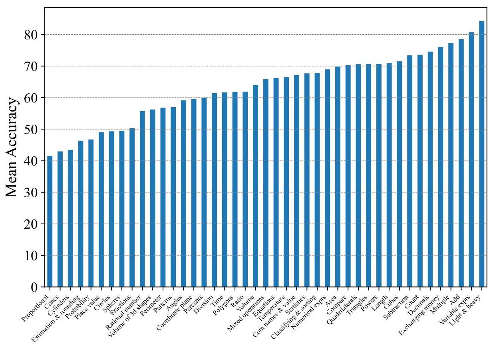

Figure 9: Mean concept accuracies of Elementary-EN.

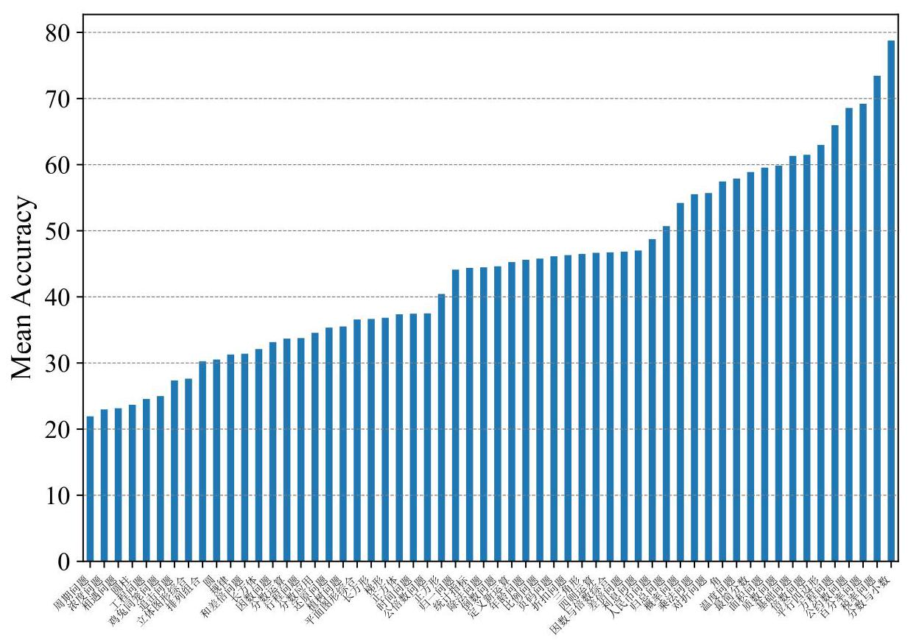

Figure 10: Mean concept accuracies of Elementary-ZH.

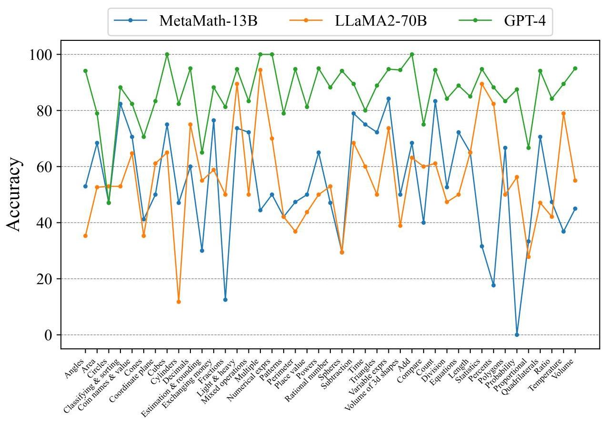

Figure 11: Concept accuracies on Elementary-EN.

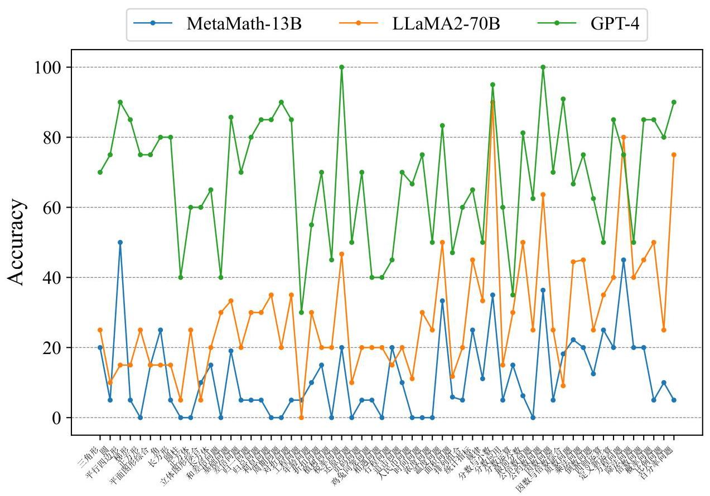

Figure 12: Concept accuracies on Elementary-ZH.

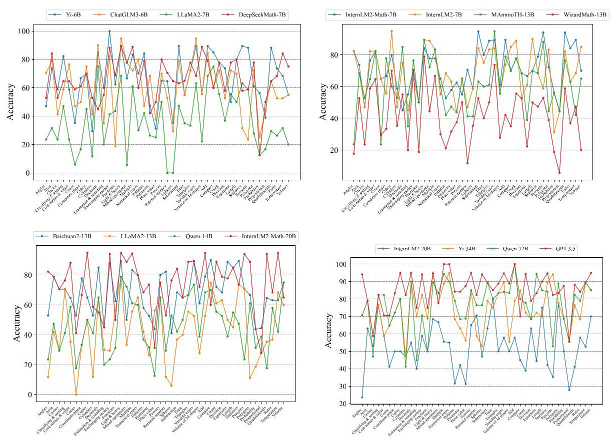

Figure 13: Concept accuracies on Elementary-EN of more models.

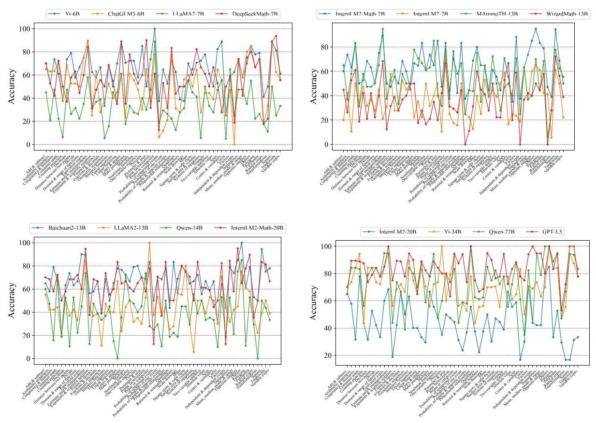

Figure 14: Concept accuracies on Middle-EN of more models.

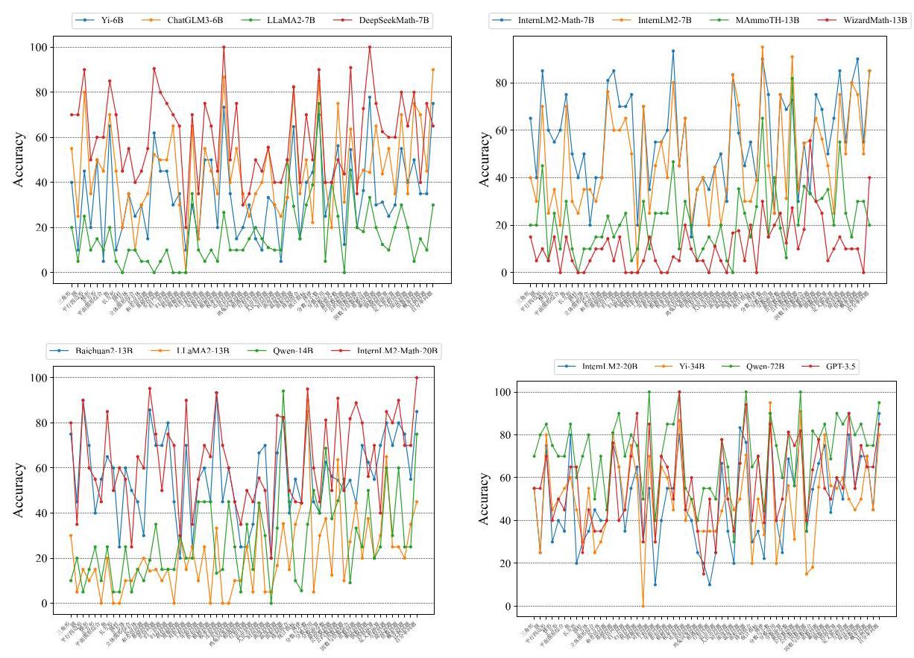

Figure 15: Concept accuracies on Elementary-ZH of more models.

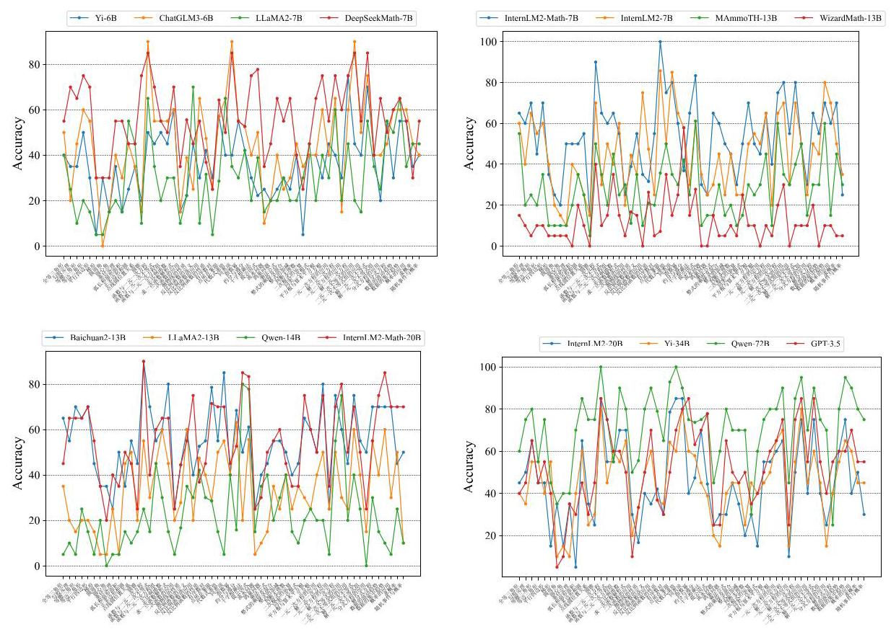

Figure 16: Concept accuracies on Middle-ZH of more models.

<table><tr><td colspan="2">Models</td><td>HuggingFace Link / OpenAI Model</td></tr><tr><td>ChatGLM3</td><td>ChatGLM3-6B</td><td>https://huggingface.co/THUDM/chatglm3-6b</td></tr><tr><td>DeepSeekMath</td><td>DeepSeekMath-7B</td><td>https://huggingface.co/deepseek-ai/deepseek-math-7b-instruct</td></tr><tr><td>Baichuan2</td><td>Baichuan2-13B</td><td>https://huggingface.co/baichuan-inc/Baichuan2-13B-Chat</td></tr><tr><td>MetaMath</td><td>MetaMath-13B</td><td>https://huggingface.co/meta-math/MetaMath-13B-V1.0</td></tr><tr><td>WizardMath</td><td>WizardMath-13B</td><td>https://huggingface.co/WizardLM/WizardMath-13B-V1.0</td></tr><tr><td>MAmmoTH</td><td>MAmmoTH-13B</td><td>https://huggingface.co/TIGER-Lab/MAmmoTH-13B</td></tr><tr><td rowspan="4">InternLM</td><td>InternLM-7B</td><td>https://huggingface.co/internlm/internlm2-chat-7b</td></tr><tr><td>InternLM-20B</td><td>https://huggingface.co/internlm/internlm2-chat-20b</td></tr><tr><td>InternLM-Math-7B</td><td>https://huggingface.co/internlm/internlm2-math-7b</td></tr><tr><td>InternLM-Math-20B</td><td>https://huggingface.co/internlm/internlm2-math-20b</td></tr><tr><td rowspan="2">\( \mathrm{{Yi}} \)</td><td>Yi-6B</td><td>https://huggingface.co/01-ai/Yi-6B-Chat</td></tr><tr><td>Yi-34B</td><td>https://huggingface.co/01-ai/Yi-34B-Chat</td></tr><tr><td rowspan="3">LLaMA2</td><td>LLaMA2-7B</td><td>https://huggingface.co/meta-llama/Llama-2-7b-chat-hf</td></tr><tr><td>LLaMA2-13B</td><td>https://huggingface.co/meta-llama/Llama-2-13b-chat-hf</td></tr><tr><td>LLaMA2-70B</td><td>https://huggingface.co/meta-llama/Llama-2-70b-chat</td></tr><tr><td rowspan="2">Qwen</td><td>Qwen-14B</td><td>https://huggingface.co/Qwen/Qwen-14B-Chat</td></tr><tr><td>Qwen-72B</td><td>https://huggingface.co/Qwen/Qwen-72B-Chat</td></tr><tr><td rowspan="2">GPT</td><td>GPT-3.5</td><td>gpt-3.5-turbo</td></tr><tr><td>GPT-4</td><td>gpt-4</td></tr></table>

Table 6: Model links.

## Elementary-EN (5-shot prompts)

Q: For a party, Oscar gets 4 different kinds of soda. He buys a 6-pack of each kind. At home, he divides the sodas evenly among 3 coolers. How many sodas are in each cooler? A: Oscar buys 4 different kinds of soda, and he gets a 6-pack of each kind. This means that he has \( 4 * 6 = {24} \) . sodas in total. He divides these 24 sodas evenly among 3 coolers. So number of sodas per cooler is \( {24}/3 = 8 \) . Therefore, the answer is 8 . Q: Amazing Animals Zoo is building a new home for its 8 zebras. Each zebra will get 2 acres of grassy land to roam around in. The zebras will have a pond that covers 1 acre. How big will the zebras' new home be? A: The total required grassland area for the zebras is: 8 zebras * 2 acres per zebra = 16 acres. Then, we need to add the extra 1 acre for the pond: 16 acres (for the zebras) +1 acre (for the pond) = 17 acres. Therefore, the answer is 17. Q: The state taxes personal income exceeding 3500 yuan (this portion not to exceed 3500 yuan) at a rate of \( 3\% \) . If Xiaoming’s father’s monthly salary is 4700 yuan, how much personal income tax should Xiaoming's father pay each month? A: To calculate the amount of personal income tax Xiaoming's father should pay, we can follow this simple process:Subtract the tax-free threshold from the monthly salary. Taxable income =Monthly salary - Tax-free threshold \( = {4700} - {3500} = {1200} \) yuan. Apply the tax rate to the amount that exceeds the threshold. Tax owed = Taxable income * Tax rate = 1200 * 3% \( = {36} \) yuan. Therefore, the answer is 36 . Q: Find the 10th term in the arithmetic sequence where the first term is 3 and the common difference is 4. A: To find the nth term in an arithmetic sequence, we can use the formula: \( {a}_{n} = {a}_{1} + \left( {n - 1}\right)  * d \) , where: \( {a}_{n} \) is the \( n \) th term, \( {a}_{1} \) is the first term, \( \mathrm{d} \) is the common difference, \( \mathrm{n} \) is the term number. Given that the first term \( \left( {a}_{1}\right) \) is 3 and the common difference (d) is 4, we can find the 10th term \( \left( {a}_{10}\right) \) by plugging these values into the formula: \( {a}_{10} = {a}_{1} + \left( {{10} - 1}\right)  * d = 3 + 9 * 4 = 3 + {36} = {39} \) . Therefore, the answer is 39 . Q: A regular polygon has an interior angle of 156 degrees. How many sides does the polygon have? A: To find the number of sides of a regular polygon with a given interior angle, we can use the formula: Interior Angle \( = \left\lbrack  {\left( {n - 2}\right)  * {180}}\right\rbrack  /n \) , where \( n \) is the number of sides. Given that interior angle is \( {156} : {156} = \left\lbrack  {\left( {\mathrm{n} - 2}\right)  * {180}}\right\rbrack  /\mathrm{n} \) . Solve for \( \mathrm{n} \) , so we get \( \mathrm{n} = {15} \) . Therefore, the answer is 15 .

Q: \( g\left( x\right)  = {x}^{2}, f\left( x\right)  = 3{\left( x - 2\right) }^{2}, h\left( x\right)  = g\left( x\right)  - f\left( x\right) , y = h\left( {23}\right) \) , give me the value of \( y \) . A: First, calculate \( g\left( {23}\right) \) and \( f\left( {23}\right)  : g\left( {23}\right)  = {23}^{2} = {529} \) . Next, calculate \( f\left( {23}\right) \) : \( f\left( {23}\right)  = 3 * {\left( {23} - 2\right) }^{2} = 3 * {\left( {21}\right) }^{2} = 3 * {441} = {1323} \) . Now, we calculate \( h\left( {23}\right) \) : \( h\left( {23}\right)  = g\left( {23}\right)  - f\left( {23}\right)  = {529} - {1323} =  - {794} \) . Therefore, the answer is -794.

Q: What is the slope of the line segment between the two points: \( \left( {3,1}\right) ,\left( {5,2}\right) \) ?

A: The slope of a line between two points \( \left( {{x}_{1},{y}_{1}}\right) \) and \( \left( {{x}_{2},{y}_{2}}\right) \) can be found using the formula: slope \( \left( m\right)  = \left( {{y}_{2} - {y}_{1}}\right) /\left( {{x}_{2} - {x}_{1}}\right) \) . Given the two points(3,1)and(5,2), we can substitute these values into the formula: \( \operatorname{slope}\left( m\right)  = \left( {2 - 1}\right) /\left( {5 - 3}\right)  = 1/2 = {0.5} \) . Therefore, the answer is 1/2. Q: In a party, there are 5 cupcakes remaining and 10 children. A mother inserts 10 pieces of paper into a hat, 5 with a cupcake image and 5 without. The children who draw the cupcake paper will receive a cupcake. If the first child draws a paper with a cupcake image, what is the probability that the second child will also draw a cupcake paper? A: Initially, there are 5 cupcake papers and 5 non-cupcake papers in the hat, making a total of 10 papers. After the first child draws a cupcake paper, there are 4 cupcake papers and 5 non-cupcake papers left in the hat, with a total of 9 papers. The probability that the second child will draw a cupcake paper is then the number of cupcake papers left divided by the total number of papers left: Probability \( = \) Number of cupcake papers left / Total number of papers left \( = 4/9 \) . Therefore, the answer is 4/9. Q: What is the total area of an irregular polygon that consists of two squares and two rectangles where the sides of the squares are \( {12}\mathrm{\;{cm}} \) and \( {16}\mathrm{\;{cm}} \) respectively, and the dimensions of the rectangles are \( {13}\mathrm{\;{cm}} \) by \( {20}\mathrm{\;{cm}} \) and \( {10}\mathrm{\;{cm}} \) by \( 7\mathrm{\;{cm}} \) respectively? A: To find the total area of an irregular polygon consisting of two squares and two rectangles, you would sum up the individual areas of each shape. The area of a square is given by the formula \( A = {s}^{2} \) , where \( \mathrm{s} \) is the length of a side of the square. For the first square with a side of \( {12}\mathrm{\;{cm}} : {A}_{1} = {12}^{2} = {144}{\mathrm{\;{cm}}}^{2} \) . For the second square with a side of \( {16}\mathrm{\;{cm}} \) : \( {A}_{2} = {16}^{2} = {256}{\mathrm{\;{cm}}}^{2} \) . The area of a rectangle is given by the formula ( \( A = l * w \) ), where \( l \) is the length and \( w \) is the width of the rectangle. For the first rectangle with dimensions \( {13}\mathrm{\;{cm}} \) by \( {20}\mathrm{\;{cm}} : {A}_{3} = {13} * {20} = {260}{\mathrm{\;{cm}}}^{2} \) For the second rectangle with dimensions \( {10}\mathrm{\;{cm}} \) by \( 7\mathrm{\;{cm}} \) : \( {A}_{4} = {10} * 7 = {70c}{m}^{2}\;{TotaArea} = {A}_{1} + {A}_{2} + {A}_{3} + {A}_{4} = {144} + {256} + {260} + {70} = {730c}{m}^{2} \) Therefore, the answer is 730 . Q: Susie is making invitations to her party this coming weekend. It takes her about 5 minutes to make each invitation. It took her 2 hours to finish all the invitations. How many people is Susie inviting? A: First, convert the 2 hours into minutes to match the unit of time used for the invitation-making process. 2 hours \( = {120} \) minutes. Then, divide the total time spent by the time it takes to make one invitation to find out how many invitations she made: 120 minutes total / 5 minutes per invitation \( = {24} \) invitations Therefore, the answer is 24 . Elementary-ZH (5-shot prompts) Q: 小文用量角器测量一个角的度数时, 误把外圈刻度看成了内圈刻度, 量出的角是 65, 这个角实际是多少度? A: 量角器一般有两个圈的刻度,内圈刻度通常是顺时针方向从0度到180度,外圈刻度通常是逆时针方向从0度到180度。如果小文误把外圈刻度看成了内圈刻度,那么测量出的角度其实是从 \( {180}^{ \circ  } \) 减去错误读数。因此,实际的角度应该是: \( {180}^{ \circ  } - {65}^{ \circ  } = {115}^{ \circ  } \) 。因此, 答案是115。 Q: 小明以每小时2千米的速度上山,到了山顶后立即以每小时3千米的速度按原路返回。 求小明上下山的平均速度是多少千米? A: 要计算小明上下山的平均速度,我们需要知道他上山和下山所走的总距离以及总时间。首先,总距离=上山距离+下山距离=d+d=2d千米。然后,计算总时间:上山时间=上山距离/上山速度=d/2小时,下山时间=下山距离/下山速度=d/3小时,因此,总时间=上山时间+下山时间=d/2 + d/3小时。最后,计算平均速度:平均速度=总距离/总时间=2d/(d/2+d/3)=2d/(5d/6) = 12/5 = 2.4千米/小时。因此,答案是2.4千米/小时。 Q: 一个礼盒长20cm、宽15cm、高10cm,用彩带捆扎这样的一个礼盒,至少需要多长的彩带? (接头处12厘米) A: 要捆扎这样一个礼盒,通常情况下我们会沿着礼盒的长和宽方向各绕一圈,即绕过礼盒的长和宽两次,然后再留一些长度作为接头。首先,计算沿着礼盒的长方向绕一圈的长度:绕长方向长度=(礼盒的长+礼盒的高)*2 = (20 + 10)*2 = 30 *2 = 60cm 然后,计算沿着礼盒的宽方向绕一圈的长度:绕宽方向长度= (礼盒的宽+ 礼盒的高)*2 = (15 + 10)*2 = 25 *2 = 50cm最后,计算总需要彩带长度:总长度= 绕长方向长度+ 绕宽方向长度+接头长度= \( {60} + {50} + {12} = {122}\mathrm{\;{cm}} \) 因此,答案是122厘米。 Q: 千岛湖大桥的一侧每隔10米安装1盏灯,共需91盏(两端都装),现在改装61盏(两端都装),平均每相邻两盏灯之间的距离是多少米？ A: 原来每隔10米安装1盏灯,共需91盏,这意味着桥的总长度覆盖了90个10米的间隔,所以桥的总长度 \( = {90} \) 间隔* 10米/间隔=900米。现在改装61盏灯(两端都装),也就是说将这900米分成60个间隔(因为61个灯包含了两端的灯,所以间隔数比灯的数量少一个), 每个间隔的长度= 900米/60间隔= 15米/间隔。因此,答案是115米。 Q: a是b的3/4,则a比b少(   ), b比a多(   ), b与a的比是(   ),如果a、b两数的和是210,则a = ( ), \( \mathrm{b} = \left( \right) \) ,括号处分别为多少? A: 已知a是b的3/4,则a = 3/4 * b。因此, a比b少(1-3/4)/1 = 1/4, b比a多(1-3/4)/(3/4) = \( 1/3 \) , b与a的比为b : \( \left( {3/4 * b}\right)  = 4 : 3 \) 若已知 \( a \) 、b两数的和是 210 ,则 \( a + b = {210} \) ,将 \( a = \left( {3/4}\right)  * b \) 代入方程得到: \( 3/4 * \mathrm{\;b} + \mathrm{b} = {210} \) ,解得 \( \mathrm{b} = {120} \) , \( \mathrm{a} = 3/4 * \mathrm{\;b} = 3/4 * {120} = {90} \) 因此,答案分别是 \( 1/4,1/3,4 : 3,{90},{120} \) 。 Middle-ZH (5-shot prompts) Q: 求不等式 \( - {x}^{2} - {2x} + 8 > 0 \) 的解集? A: \( - {x}^{2} - {2x} + 8 > 0 \) , 通过分解因式方式,得到− \( \left( {x - 2}\right) \left( {x + 4}\right)  > 0 \) 因此,答案是(-4, 2)。 Q: 已知函数 \( y = {2x} + 3 \) 与的图象 \( y =  - 1/{2x} + m \) 交 \( \mathrm{y} \) 轴于点 \( \mathrm{A} \) 、 \( \mathrm{\;B} \) ,两函数图象的交点为 \( \mathrm{P}\left( {\mathrm{n}, - 2}\right) \) ,求 \( \mathrm{m} \) 和 \( \mathrm{n} \) 的值? A: 两函数图像交点为 \( \mathrm{P}\left( {\mathrm{n}, - 2}\right) \) ,意味着这个点同时满足上述两个函数方程: 将 \( \mathrm{P} \) 点的坐标(n,-2)代入函数 \( y = {3x} + 3 \) ,即 \( - 2 = {3n} + 3 \) ,解得 \( n =  - 5/2 \) 。将P点坐标(-5/2,-2)代入函数 \( y =  - 1/{2x} + m \) ,即 \( - 2 =  - 1/2 * \left( {-5/2}\right)  + m \) ,解得m=-13/4。因此,答案是m为- 13/4, n为-5/2。 Q: 已知PA是圆O的切线, A为切点, PC与圆O相交于B、C两点, PB=2cm, BC=8cm, 则PA的长是多少厘米? A: 由于PA是圆O的切线,根据切割线定理,我们知道从圆外一点引圆的两条割线, 这一点到每条割线与圆的交点的两条线段长的积相等,即 \( P{A}^{2} = {PC} * {PB} \) ,已知 \( \mathrm{{PB}} = 2\mathrm{\;{cm}} \) 、 \( \mathrm{{BC}} = 8\mathrm{\;{cm}} \) ,则 \( {PC} = {PB} + {BC} = {2cm} + {8cm} = {10cm} \) 。 \( P{A}^{2} = {PC} * {PB} = \) \( {10} * 2 = {20} \) ,解得PA \( = 2\sqrt{5} \) cm。因此,答案是 \( 2\sqrt{5} \) 厘米。 Q: 南宋著名数学家杨辉精研数学,著有《详解九章算法》,对数的运算进行了深入研究与总结, 类比其中的思想方法, 可以解决很多数与式的计算问题已知a, b为实数, 且 \( a + b = 3,{ab} = 1 \) ,计算可得: \( {a}^{2} + {b}^{2} = 7 \) , \( {a}^{3} + {b}^{3} = {18} \) , \( {a}^{4} + {b}^{4} = {47} \) ,由此求 \( {a}^{5} + {b}^{5} \) 得多少? A: 已知 \( a + b = 3 \) 和 \( {ab} = 1 \) ,可得: \( {a}^{2} + {b}^{2} = {\left( a + b\right) }^{2} - {2ab} = {3}^{2} - 2 * 1 = 9 - 2 = 7{a}^{3} + {b}^{3} = \) \( \left( {a + b}\right) \left( {{a}^{2} - {ab} + {b}^{2}}\right)  = 3\left( {7 - 1}\right)  = 3 * 6 = {18}{a}^{4} + {b}^{4} = {\left( {a}^{2} + {b}^{2}\right) }^{2} - 2{a}^{2}{b}^{2} = {7}^{2} - 2 * {1}^{2} = {49} - 2 = \) \( {47}{a}^{5} + {b}^{5} = \left( {a + b}\right) \left( {{a}^{4} - {a}^{3}b + {a}^{2}{b}^{2} - a{b}^{3} + {b}^{4}}\right)  = 3\left( {{a}^{4} + {b}^{4} - {a}^{2}{b}^{2}}\right)  = 3\left( {{47} - 1}\right)  = 3 * {46} = {138} \) 。 因此,答案是138。 Q: 某单位要招聘1名英语翻译,甲、乙两人报名参加了听、说、读、写等项素质测试,甲的成绩分别为:90分、80分、85分、78分；乙的成绩分别为:78分、82分、85分、88分. 如果把听、说、读、写的成绩按2:2:3:3计算素质测试平均成绩,那么甲和乙的平均成绩分别是多少？ A: 甲的平均成绩为 \( \left( {{90} * 2 + {80} * 2 + {85} * 3 + {78} * 3}\right) /\left( {2 + 2 + 3 + 3}\right)  = \left( {{180} + {160} + {255} + {234}}\right) /{10} = \) \( {829}/{10} = {82.9} \) 分,乙的平均成绩为 \( \left( {{78} * 2 + {82} * 2 + {85} * 3 + {88} * 3}\right) /\left( {2 + 2 + 3 + 3}\right)  = \) \( \left( {{156} + {164} + {255} + {264}}\right) /{10} = {839}/{10} = {83.9} \) 分。因此,答案是甲的平均成绩是82.9分, 乙的平均成绩是83.9分。

<table><tr><td>LEVEL1 Spheres17</td><td>LEVEL2</td><td>LEVEL3</td><td>#Samples</td></tr><tr><td rowspan="16">Calculation & Properties</td><td rowspan="13">Calculation</td><td>Add</td><td>19</td></tr><tr><td>Decimals</td><td>20</td></tr><tr><td>Division</td><td>19</td></tr><tr><td>Equations</td><td>18</td></tr><tr><td>Fractions</td><td>16</td></tr><tr><td>Mixed Operations</td><td>18</td></tr><tr><td>Multiple</td><td>18</td></tr><tr><td>Numerical Expressions</td><td>20</td></tr><tr><td>Place Value</td><td>16</td></tr><tr><td>Powers</td><td>20</td></tr><tr><td>Rational Number</td><td>17</td></tr><tr><td>Subtraction</td><td>19</td></tr><tr><td>Variable Expressions</td><td>19</td></tr><tr><td rowspan="3">Properties</td><td>Compare Count</td><td>20 18</td></tr><tr><td>Estimation & Rounding</td><td>20</td></tr><tr><td>Patterns</td><td>19</td></tr><tr><td rowspan="7">Geometry</td><td>Angles</td><td>17</td><td/></tr><tr><td>Coordinate Plane</td><td>Coordinate Plane Cones</td><td>18 17</td></tr><tr><td rowspan="2">Three-dimensional Shapes</td><td>Cubes Cylinders</td><td>20 17</td></tr><tr><td>Volume of 3D shapes</td><td>18</td></tr><tr><td rowspan="3">Two-dimensional Shapes</td><td>Circles Perimeter</td><td>17 19</td></tr><tr><td>Polygons Quadrilaterals</td><td>18 17</td></tr><tr><td>Triangles Temperature</td><td>18 19</td></tr><tr><td rowspan="9">Measurement</td><td>Basic Knowledge</td><td>Time</td><td>20</td></tr><tr><td rowspan="2">Money</td><td>Coin Names & Value</td><td>17</td></tr><tr><td>Exchanging Money</td><td>17</td></tr><tr><td rowspan="2">Ratio</td><td>Percent Proportion</td><td>17 18</td></tr><tr><td>Ratio</td><td>19</td></tr><tr><td rowspan="3">Size</td><td>Area</td><td>19</td></tr><tr><td>Length</td><td>20</td></tr><tr><td>Volume</td><td>20</td></tr><tr><td>Weight</td><td>Light & Heavy</td><td>20</td></tr><tr><td rowspan="3">Statistics</td><td>Classifying & Sorting</td><td>Classifying & Sorting</td><td>17</td></tr><tr><td>Data</td><td>Mode/Mean/Median/Range</td><td>19</td></tr><tr><td>Probability</td><td>Probability</td><td>16</td></tr></table>

Table 7: Details of the hierarchical concepts in Elementary-EN.

<table><tr><td>LEVEL1</td><td>LEVEL2│</td><td>LEVEL3</td><td>#Samples</td></tr><tr><td rowspan="15">Calculation</td><td rowspan="5">Basic Calculation</td><td>Add & Subtract Decimals</td><td>20 19</td></tr><tr><td>Divide</td><td>19</td></tr><tr><td>Exponents & Scientific Notation</td><td>16</td></tr><tr><td>Fractions & Decimals Multiply</td><td>18 18</td></tr><tr><td>Square Roots & Cube Roots</td><td>20</td></tr><tr><td>Consumer Math</td><td>Consumer Math</td><td>18</td></tr><tr><td>Financial Literacy</td><td>Financial Literacy Absolute Value</td><td>19 18</td></tr><tr><td>Integers</td><td>Opposite Integers</td><td>20</td></tr><tr><td>Measurement</td><td>Measurement Metric</td><td>19</td></tr><tr><td rowspan="2">Number Theory</td><td>Factors Prime Factorization</td><td>20 19</td></tr><tr><td>Prime or Composite</td><td>18</td></tr><tr><td>Percents</td><td>Percents</td><td>20</td></tr><tr><td>Rational & Irrational Numbers</td><td>Rational & Irrational Numbers</td><td>18</td></tr><tr><td>Ratios & Rates</td><td>Proportional Relationships</td><td>18</td></tr><tr><td>Sequences</td><td>Arithmetic Sequences Geometric Sequences</td><td>19 18</td></tr><tr><td rowspan="7">Expressions, equations, and functions</td><td>Equations</td><td>Linear Equations Systems of Equations</td><td>20 18</td></tr><tr><td rowspan="2">Expressions</td><td>Equivalent Expressions Radical</td><td>20 17</td></tr><tr><td>Variable</td><td>18</td></tr><tr><td rowspan="3">Function</td><td>Domain & Range of Functions Interpret Functions</td><td>18 19</td></tr><tr><td>Linear Functions</td><td>20</td></tr><tr><td>Nonlinear Functions</td><td>18</td></tr><tr><td>Inequalities</td><td>Inequalities</td><td>19</td></tr><tr><td rowspan="11">Geometry</td><td>Congruence & Similarity</td><td>Congruence & Similarity</td><td>19</td></tr><tr><td rowspan="2">Coordinate Plane</td><td>Axes Distance Between Two Points</td><td>17 19</td></tr><tr><td>Quadrants</td><td>16</td></tr><tr><td>Scale Drawings</td><td>Scale Drawings</td><td>16</td></tr><tr><td>Slope</td><td>Slope Polyhedra</td><td>20 19</td></tr><tr><td>Three-dimensional Figures</td><td>Surface Area & Volume</td><td>17</td></tr><tr><td>Transformations</td><td>Transformations</td><td>18</td></tr><tr><td rowspan="4">Two-dimensional Figures</td><td>Circle Lines & Angles</td><td>20 18</td></tr><tr><td>Perimeter & Area</td><td>20 18</td></tr><tr><td>Polygons Square</td><td>18</td></tr><tr><td>Trapezoids Triangle</td><td>16 18</td></tr><tr><td rowspan="9">Statistic and Probability</td><td rowspan="3">Data</td><td>Center & Variability</td><td>18</td></tr><tr><td>Mean, Median, Mode & Range</td><td>19</td></tr><tr><td>Outlier</td><td>20</td></tr><tr><td>One-variable Statistics</td><td>One-variable Statistics</td><td>19</td></tr><tr><td rowspan="4">Probability</td><td>Counting Principle</td><td>16</td></tr><tr><td>Independent & Dependent Events Make Predictions</td><td>16 17</td></tr><tr><td>Probability of Compound Events Probability of One Event</td><td>16 17</td></tr><tr><td>Probability of Simple and Opposite Events</td><td>19</td></tr><tr><td>Two-variable Statistics</td><td>Two-variable Statistics</td><td>18</td></tr></table>

Table 8: Details of the hierarchical concepts in Middle-EN.

<table><tr><td>LEVEL1 因数与倍数 Factors & Multiples 因数问题 (Factor) 20 20 比例问题 (Proportion)20</td><td>LEVEL2</td><td>LEVEL3</td><td>#Samples</td></tr><tr><td rowspan="10">几何 (Geometry)</td><td rowspan="6">平面图形 (Two-dimensional shapes)</td><td>三角形 (Triangles) 圆 (Circle)</td><td>20 20</td></tr><tr><td>平行四边形 (Parallelogram)</td><td>20</td></tr><tr><td>梯形 (Trapezium) 正方形 (Square)</td><td>20 20</td></tr><tr><td>平面图形综合 (Synthesis Problem)</td><td>20</td></tr><tr><td>角 (Angle)</td><td>20</td></tr><tr><td>长方形 (Rectangle)</td><td>20</td></tr><tr><td rowspan="4">立体图形 (Three-dimensional Shapes)</td><td>圆柱 (Cylinder)</td><td>20</td></tr><tr><td>正方体 (Cube)</td><td>20</td></tr><tr><td>立体图形综合问题 (Synthesis Problem)</td><td>20</td></tr><tr><td>长方体 (Cuboid)</td><td>20</td></tr><tr><td rowspan="15">应用 (Application)</td><td rowspan="4">基础 (Fundamental Problem)</td><td>和差倍问题 (Add & Differential & Multiple)</td><td>20</td></tr><tr><td>基础 (Basics) 差倍问题 (Differential)</td><td>21 20</td></tr><tr><td>归一问题 (Normalization)</td><td>20</td></tr><tr><td>归总问题 (Induction)</td><td>20</td></tr><tr><td rowspan="8">经典问题 (Classical Problem)</td><td>利息问题 (Interest)</td><td>20</td></tr><tr><td>周期问题 (Period) 对折问题 (Folding)</td><td>10 20</td></tr><tr><td>工程问题 (Engineering) 年龄问题 (Age)</td><td>20 20</td></tr><tr><td>折扣问题 (Discount)</td><td>20</td></tr><tr><td>植树问题 (Planting) 税率问题 (Tax)</td><td>20 15</td></tr><tr><td>还原问题 (Reduction)</td><td>20</td></tr><tr><td>页码问题 (Pagination)</td><td>20</td></tr><tr><td>鸡兔同笼问题可题 (Chickens & Rabbits in the Same Cage)</td><td>20</td></tr><tr><td rowspan="3">路程问题 (Distance Problem)</td><td>相遇问题 (Encounter)</td><td>20</td></tr><tr><td>行程问题 (Travel)</td><td>20</td></tr><tr><td>追击问题 (Pursuit)</td><td>20</td></tr><tr><td rowspan="7">度量与统计 (Measurement and Statistics)</td><td rowspan="4">度量 (Measurement)</td><td>人民币问题 (RMB) 时间问题 (Time)</td><td>9 20</td></tr><tr><td>浓度问题 (Concentration)</td><td>20</td></tr><tr><td>温度问题 (Temperature)</td><td>6</td></tr><tr><td>面积问题 (Area)</td><td>17</td></tr><tr><td rowspan="3">统计(Statistics)</td><td>排列组合 (Permutation)</td><td>20</td></tr><tr><td>统计指标 (Statistical Metrics)</td><td>20</td></tr><tr><td>规律 (Law)</td><td>18</td></tr><tr><td rowspan="8">数与代数 (Number and algebra)</td><td rowspan="2">分数运算 (Fractional Operation)</td><td>分数与小数 (Fraction & Decimal) 分数应用 (Fractional Application)</td><td>20 20</td></tr><tr><td>分数运算 (Fractional Operation) 最简分数 (Simplest Fraction) 公倍数问题 (Common Multiples) 公约数问题 (Common Divisors)</td><td>20 16 16 11</td></tr><tr><td/><td>因数与倍数综合问题 (Synthesis Problem) 质数问题 (Prime Number)</td><td>11 9</td></tr><tr><td rowspan="3">基础运算 (Basic Operation)</td><td>乘法问题 (Multiplication)</td><td>20</td></tr><tr><td>倒数问题 (Reciprocal Problem) 四则运算 (Four-rule Operation) 新运算定义 (New Operation Definition)</td><td>16 20 20</td></tr><tr><td>方程问题 (Equation) 除法问题 (Division)</td><td>20</td></tr><tr><td rowspan="2">比 (Ratio)</td><td>倍数问题 (Multiple) 概率问题 (Probability)</td><td>20 20</td></tr><tr><td>百分率问题 (Percentage)</td><td>20</td></tr></table>

Figure 17: Details of the hierarchical concepts in Elementary-ZH.

<table><tr><td>LEVEL1 等腰三角形(Isosceles Triangle) 20 (Linear Functions & Univariate Linear Inequalities) 一次函数与二元一次方程组 20 (Linear Functions & System of Binary Linear Equations)</td><td>LEVEL2</td><td>LEVEL3</td><td>#Samples</td></tr><tr><td rowspan="6">几何 (Geometry)</td><td rowspan="2">三角形(Triangle)</td><td>全等三角形(Congruent Triangle) 勾股定理(Pythagorean Theorem)</td><td>20 20</td></tr><tr><td>等边三角形(Equilateral Triangle)</td><td>20</td></tr><tr><td>四边形(Quadrilateral)</td><td>平行四边形(Parallelogram) 梯形(Trapezium)</td><td>20 20</td></tr><tr><td rowspan="3">圆(Circle)</td><td>圆周角(Angle of Circumference) 圆心角(Angle of Center)</td><td>20 20</td></tr><tr><td>垂径定理(Vertical Path Theorem) 弧长和扇形面积(Arc length & Sector Area)</td><td>20 20</td></tr><tr><td>正多边形和圆(Regular Polygons & Circles) 点线圆位置关系(Relations of Point, Line & Circle)</td><td>20 20</td></tr><tr><td rowspan="5">函数 (Function)</td><td rowspan="2">立体图形 (Three-dimensional Shapes) 一次函数(Linear Function)</td><td>圆锥(Cone) 函数与一元一次方程 (Univariate Function & Equation) 函数与一元一次不等式</td><td>20 20 20</td></tr><tr><td>正比例函数(Proportional Function) 一次函数解析式 (Analytical Formula of Linear Functions)</td><td>20 20</td></tr><tr><td>二次函数(Quadratic Function)</td><td>二次函数的应用 (Applications of Ouadratic Functions) 抛物线的性质 (Properties of Parabolas)</td><td>20 18</td></tr><tr><td>反比例函数 (Inverse Proportional Function)</td><td>定义(Definition) 应用(Applications) 性质(Properties)</td><td>20 20 19</td></tr><tr><td>平面直角坐标系 (Rectangular Coordinate System)</td><td>有序数对(Ordered Pair) 象限中的点(Points of Ouadrant)</td><td>20 14</td></tr><tr><td rowspan="7">数与式 (Number and Expression)</td><td>代数式(Algebra Expression)</td><td>代数式求值(Algebraic Expression Evaluation) 同类项(Similar Items)</td><td>20 20</td></tr><tr><td>分式(Fraction)</td><td>指数幂(Exponential Power) 约分(Fraction Reduction)</td><td>20 19</td></tr><tr><td>因式(Factor)</td><td>十字相乘法(Cross Multiplication) 公因式提取(Common Factor Extraction)</td><td>20 18</td></tr><tr><td>应用(Application)</td><td>流水问题(Flow Problem) 鸽巢问题(Pigeon Nest Problem)</td><td>20 20</td></tr><tr><td>整式(Integral Expression)</td><td>乘法公式(Multiplication) 整式的乘除及混合(Multiplication, Division & Mixing) 整式的加减(Addition & Subtraction)</td><td>20 20 20</td></tr><tr><td>无理数(Irrational Number)</td><td>无理数识别(Irrational Number Recognition)</td><td>20</td></tr><tr><td>根式(Radical Expression)</td><td>二次根式的运算(Operation of Ouadratic Radicals) 同类二次根式(Similar Ouadratic Radicals) 平方根与算术平方根(Square Root & Arithmetic Square Root) 立方根(Cube Root)</td><td>20 20 20 20</td></tr><tr><td rowspan="4">方程与不等式 (Equations & Inequalities)</td><td>一元一次方程 (Linear Equation in One Variable)</td><td>一元一次方程的应用(Applications) 解一元一次方程(Solutions)</td><td>20 20</td></tr><tr><td>一元二次方程 (Quadratic Equation in One Variable)</td><td>一元二次方程的应用(Applications) 解一元二次方程(Solutions)</td><td>20 20</td></tr><tr><td>不等式与不等式组 (Inequalities & Groups of Inequalities)</td><td>一元一次不等式的应用 (Applications of Unarv First Order Inequality) 一元一次不等式组的应用(Applications of Unary First Order Groups of Inequalities) 解一元一次不等式(Solve the First Inequality of One Variable) 解一元一次不等式组(Solve Unary First Order Groups of Inequalities)</td><td>20 20 20 20</td></tr><tr><td>分式方程(Fractional Equation)</td><td>分式方程的应用(Application of Fractional Equation) 解分式方程(Solve Fractional Equation)</td><td>20 20</td></tr><tr><td rowspan="2">统计与概率 (Statistics and Probability)</td><td>数据分析(Data Analysis)</td><td>数据的波动趋势(Fluctuating Trend of Data) 数据的集中趋势(Central Tendency of Data)</td><td>20 20</td></tr><tr><td>概率(Probability)</td><td>概率的应用(Applications of Probability) 求概率(Find Probability) 随机事件与概率(Random Events & Probabilities)</td><td>20 20 20</td></tr></table>

Table 9: Details of the hierarchical concepts in Middle-ZH.

