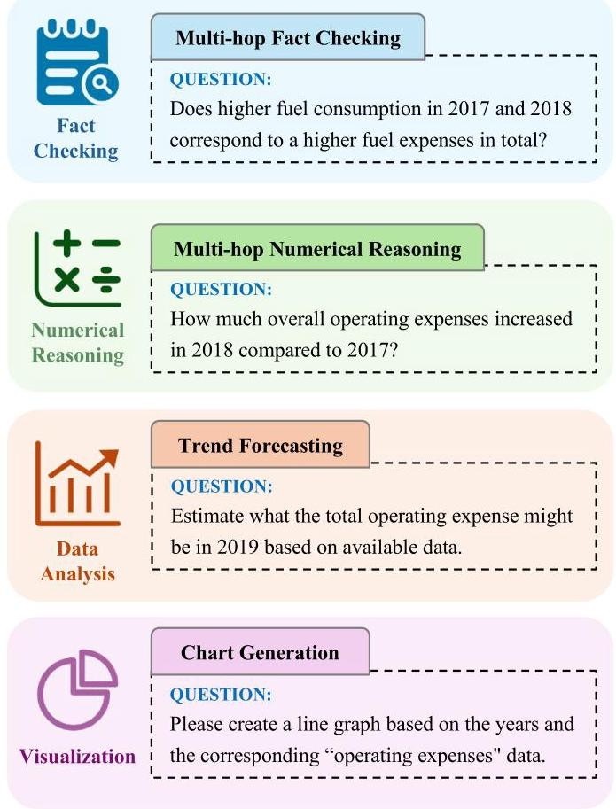
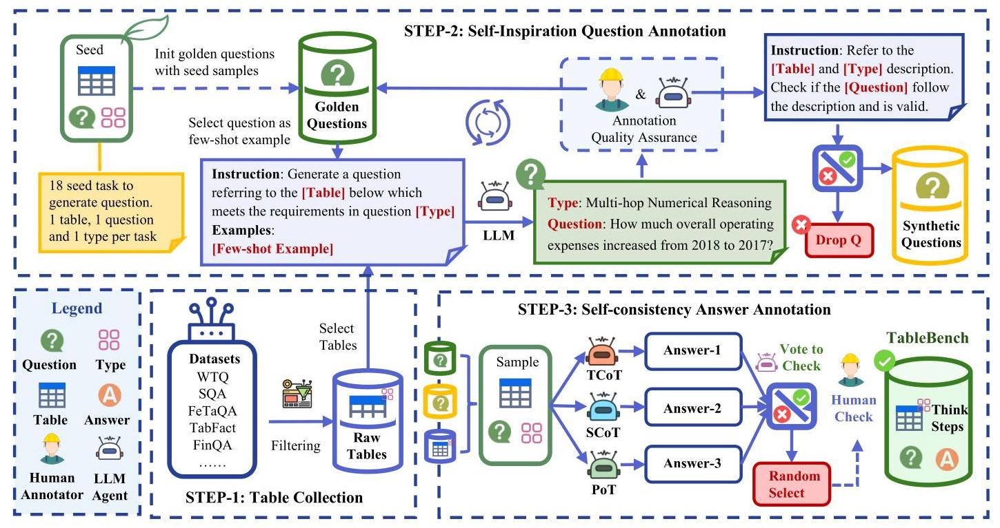
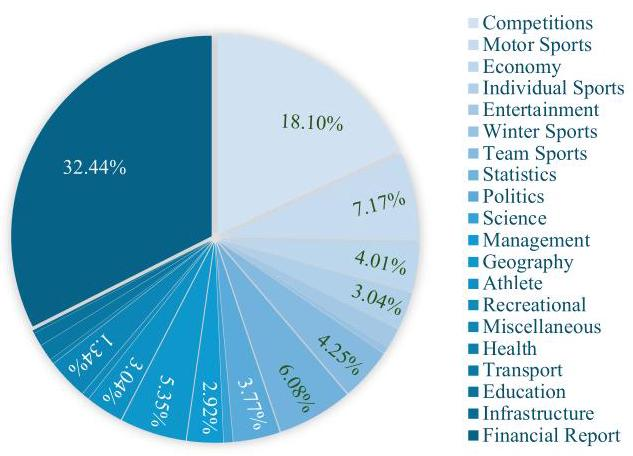
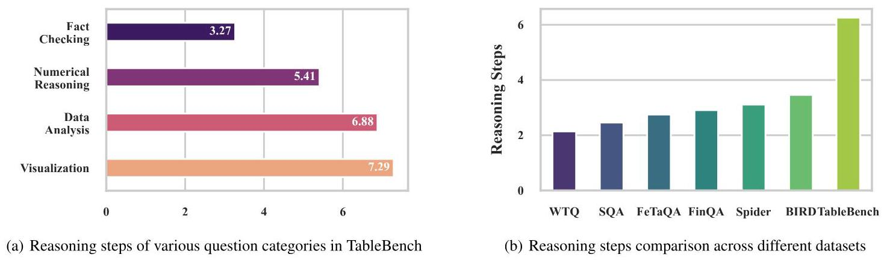
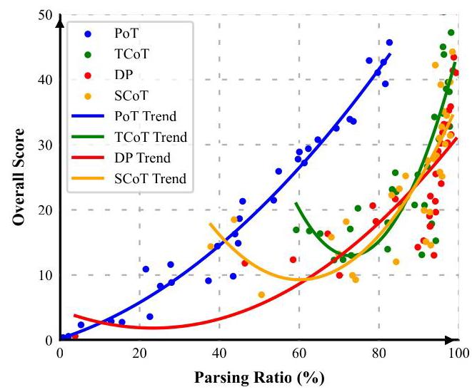
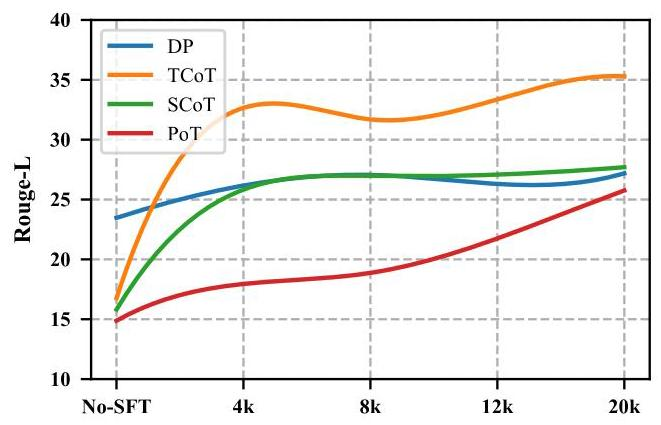

# TableBench: A Comprehensive and Complex Benchmark for Table Question Answering

Xianjie Wu \( {}^{1} \) , Jian Yang \( {}^{1} \) *, Linzheng Chai \( {}^{1} \) , Ge Zhang \( {}^{2} \) , Jiaheng Liu \( {}^{1} \) , Xeron Du \( {}^{2} \) , Di Liang \( {}^{3} \) , Daixin Shu \( {}^{1} \) , Xianfu Cheng \( {}^{1} \) , Tianzhen Sun \( {}^{1} \) , Tongliang Li \( {}^{4} \) , Zhoujun Li \( {}^{1} \) *, Guanglin Niu \( {}^{1} \)

\( {}^{1} \) Beihang University

\( {}^{2} \) M-A-P

\( {}^{3} \) Fudan University

\( {}^{4} \) Beijing Information Science and Technology University

\{wuxianjie, jiaya, lizj\}@buaa.edu.cn

## Abstract

Recent advancements in large language models (LLMs) have markedly enhanced the interpretation and processing of tabular data, introducing previously unimaginable capabilities. Despite these achievements, LLMs still encounter significant challenges when applied in industrial scenarios, particularly due to the increased complexity of reasoning required with real-world tabular data, underscoring a notable disparity between academic benchmarks and practical applications. To address this discrepancy, we conduct a detailed investigation into the application of tabular data in industrial scenarios and propose a comprehensive and complex benchmark TableBench, including 18 fields within four major categories of table question answering (TableQA) capabilities. Furthermore, we introduce TABLELLM, trained on our meticulously constructed training set TableInstruct, achieving comparable performance with GPT-3.5. Massive experiments conducted on TableBench indicate that both open-source and proprietary LLMs still have significant room for improvement to meet real-world demands, where the most advanced model, GPT- 4 , achieves only a modest score compared to humans.

Code - https://github.com/TableBench/TableBench

## Introduction

Recent studies have shown the potential of large language models (LLMs) on tabular tasks such as table question answering (TableQA) (Zhu et al. 2021; Zhao et al. 2023; Hegselmann et al. 2023; Li et al. 2023b; Zhang et al. 2024b; Lu et al. 2024) by adopting in-context learning and structure-aware prompts (Singha et al. 2023), suggesting that a well-organized representation of tables improves the interpretation of tabular. Tai et al. (2023) notes that eliciting a step-by-step reasoning process from LLMs enhances their ability to comprehend and respond to tabular data queries. Furthermore, Zha et al. (2023) investigates the use of external interfaces for improved understanding of tabular data.

Traditionally, adapting language models for tabular data processing entailed modifying their architectures with specialized features such as position embeddings and attention mechanisms to grasp structural nuances of tables. However, the introduction of LLMs like GPT-4, GPT-3.5 (Brown et al. 2020; OpenAI et al. 2024), and PaLM2 (Anil et al. 2023) has heralded a new approach focused on the art of crafting precise, information-rich prompts that seamlessly integrate table data, coupled with leveraging external programming languages like SQL, Python, or other languages (Wang et al. 2024; Chai et al. 2024), which facilitates more sophisticated chain-of-thought (Wei et al. 2022) (CoT) reasoning processes across both proprietary and open-source LLM platforms, including Llama. Such advancements have propelled the fine-tuning of models for tabular data-specific tasks, showcased by initiatives like StructLM (Zhuang et al. 2024), enhancing capabilities in table structure recognition, fact verification, column type annotation, and beyond. However, the existing benchmark might not entirely resonate with the practical challenges, especially complex reasoning requirements encountered by professionals routinely navigating tabular data in real-world settings. Therefore, there is a huge need for creating a benchmark to bridge the gap between the industrial scenarios and the academic benchmark.

<table><tr><td>Year</td><td>Gallons Consumed</td><td>Fuel Expense</td><td>Average Price</td><td>Operating Expense Percentage</td><td>Available Seat Miles</td></tr><tr><td>2018</td><td>4,137</td><td>\$9,307</td><td>\$2.25</td><td>24%</td><td>67</td></tr><tr><td>2017</td><td>3,978</td><td>\$6,913</td><td>\$1.74</td><td>20%</td><td>66</td></tr><tr><td>2016</td><td>3,904</td><td>\$5,813</td><td>\$1.49</td><td>18%</td><td>65</td></tr></table>

Figure 1: Typical challenges from four major categories (fact checking, numerical reasoning, data analysis, visualization) in TableBench.

---

*Corresponding author.

Copyright © 2025, Association for the Advancement of Artificial Intelligence (www.aaai.org). All rights reserved.

---

Figure 2: A comprehensive overview of the annotation framework.

To better evaluate the capability of LLMs in Table QA, we introduce TableBench, a comprehensive and complex benchmark covering 18 subcategories within four major categories of TableQA abilities, as illustrated in Figure 1. First, We systematically analyze real-world challenges related to table applications and define task complexity based on the required number of reasoning steps. Based on the analysis, we introduce a rigorous annotation workflow, integrating manual and automated methods, to construct TableBench. Subsequently, We create a massively TableQA instruction corpora TableInstruct, covering three distinct reasoning methods. Textual chain-of-thought (TCoT) utilizes a textual reasoning approach, employing a series of inferential steps to deduce the final answer. Symbolic chain-of-thought (SCoT) adopts symbolic reasoning steps, leveraging programming commands to iteratively simulate and refine results through a Think then Code process. Conversely, program-of-thought (PoT) generates executable code, using lines of code as reasoning steps within a programming environment to derive the final result. Based on open-source models and TableInstruct, we propose TABLELLM as a strong baseline to explore the reasoning abilities of LLMs among tabular data, yielding comparable performance with GPT-3.5. Furthermore, we evaluate the performance of over 30 LLMs across these reasoning methods on TableBench, highlighting that both open-source and proprietary LLMs require substantial improvements to meet real-world demands. Notably, even the most advanced model, GPT-4, achieves only a modest score when compared to human performance.

The contributions are summarized as follows:

- We propose TableBench, a human-annotated comprehensive and complex TableQA benchmark comprising 886 samples across 18 fields, designed to facilitate fact-checking, numerical reasoning, data analysis, and visualization tasks.

- We introduce TableInstruct, a massive TableQA instruction corpus covering three distinct reasoning methods. TABLELLM, trained on TableInstruct, serves as a robust baseline for TableBench.

- We systematically evaluate the interpretation and processing capabilities of more than 30 models on our crafted TableBench and create a leaderboard to evaluate them on four main tasks. Notably, extensive experiments suggest that comprehensive and complex TableQA evaluation can realistically measure the gap between leading language models and human capabilities in real-world scenarios.

<table><tr><td>Properties</td><td>Value</td></tr><tr><td colspan="2">Basic Insight</td></tr><tr><td>Unique Tables</td><td>3681</td></tr><tr><td>Question Length(Avg)</td><td>20.30</td></tr><tr><td>Answer Length (Avg)</td><td>8.52</td></tr><tr><td>Columns Per Table</td><td>6.68</td></tr><tr><td>Rows Per Table</td><td>16.71</td></tr><tr><td>Ratio of Numerical Cells</td><td>65.74%</td></tr><tr><td>Average Reasoning Steps</td><td>6.26</td></tr><tr><td colspan="2">Question Categories</td></tr><tr><td>Fact Checking</td><td>Match-Based Fact Checking</td></tr><tr><td/><td>Multi-hop Fact Checking</td></tr><tr><td>Numerical Reasoning</td><td>Arithmetic Calculation</td></tr><tr><td/><td>Comparison</td></tr><tr><td/><td>Aggregation</td></tr><tr><td/><td>Ranking</td></tr><tr><td/><td>Counting</td></tr><tr><td/><td>Time-based Calculation</td></tr><tr><td/><td>Multi-hop Numerical Reasoning</td></tr><tr><td/><td>Domain-Specific</td></tr><tr><td>Data Analysis</td><td>Descriptive Analysis</td></tr><tr><td/><td>Anomaly Detection</td></tr><tr><td/><td>Statistical Analysis</td></tr><tr><td/><td>Correlation Analysis</td></tr><tr><td/><td>Causal Analysis</td></tr><tr><td/><td>Trend Forecasting</td></tr><tr><td/><td>Impact Analysis</td></tr><tr><td>Visualization</td><td>Chart Generation</td></tr><tr><td>TableBench Size</td><td>886</td></tr><tr><td>TableInstruct Size</td><td>19,661</td></tr></table>

Table 1: Data statistics of TableBench

## Construction of TableBench

To bridge the gap between academic benchmarks and industrial scenarios, we comprehensively analyze tabular data applications in real-world contexts, categorizing these problems into four major categories and 18 specific subcategories. We define the complexity of these tasks based on the reasoning steps required for problem-solving and provide detailed guidelines for defining and decomposing these steps, which are rigorously followed during the annotation process. Additionally, we introduce an annotation framework that combines manual and automated methods to enhance annotation efficiency, as illustrated in Figure 2. Finally, we propose two high-quality corpora: TableBench, a comprehensive and complex benchmark consisting of 886 samples, and TableInstruct ( \( {20}\mathrm{\;K} \) samples in total), massive instruction corpora designed to instruct LLMs with various reasoning methods.

Figure 3: Topic distribution across tables

## Tabular Data Collection

We collect raw tabular data from existing datasets, including typical datasets such as WTQ (Pasupat and Liang 2015), SQA (Iyyer, Yih, and Chang 2017), TabFact (Nan et al. 2022), FeTaQA (Nan et al. 2022), FinQA (Chen et al. 2021c), AIT-QA (Katsis et al. 2022), etc. To align closely with the "reasoning complexity of questions" dimension in real-world tabular problems, we do not specifically design for the complexity of the tables themselves, such as structural complexity or large-sized tables. Instead, we adopt a moderate complexity in tabular data. We select tables based on topics and size, ensuring each contains at least 8 rows and 5 columns. We focus on tables with significant numerical values to emphasize numerical reasoning, thereby ensuring depth in numerical computation reasoning. Ultimately, we collect 3681 tables covering 20 major topics: finance, competition, sports, science, etc.

## Question Annotation

We opt to manually construct a more complex set of questions to mitigate the data leak risk in LLMs rather than modi-

<table><tr><td>Dataset</td><td>Fact Checking</td><td>Numerical Reasoning</td><td>\( \mathbf{{Data}} \) Analysis</td><td>Visulization</td></tr><tr><td>WTQ</td><td>✓</td><td>✘</td><td>✘</td><td>✘</td></tr><tr><td>SQA</td><td>✓</td><td>✘</td><td>✘</td><td>✘</td></tr><tr><td>TabFact</td><td>✓</td><td>✘</td><td>✘</td><td>✘</td></tr><tr><td>FeTaQA</td><td>✓</td><td>✘</td><td>✘</td><td>✘</td></tr><tr><td>FinQA</td><td>✘</td><td>✓</td><td>✘</td><td>✘</td></tr><tr><td>AIT-QA</td><td>✘</td><td>✓</td><td>✘</td><td>✘</td></tr><tr><td>WikiSQL</td><td>✓</td><td>✓</td><td>✘</td><td>✘</td></tr><tr><td>Spider</td><td>✓</td><td>✓</td><td>✘</td><td>✘</td></tr><tr><td>Bird</td><td>✘</td><td>✓</td><td>✓</td><td>✘</td></tr><tr><td>Text2Analysis</td><td>✘</td><td>✘</td><td>✓</td><td>✓</td></tr><tr><td>TableBench</td><td>✓</td><td>✓</td><td>✓</td><td>✓</td></tr></table>

Table 2: Comparison with existing datasets in categories.

Figure 4: Comparison with existing datasets in reasoning complexity.

fying existing datasets. We introduce a self-inspiration question generation mechanism to construct questions across different categories. Firstly, We meticulously craft one seed question and a detailed definition for each category, forming the initial question seed corpus. Subsequently, we incorporate these initial seed questions as examples into a meticulously designed prompt to guide GPT4-based agents in generating questions that adhere to specific category constraints. We limit the output to five questions in the initial rounds. These questions are manually annotated to identify new patterns and added to the seed corpus. We continuously select representative questions into the question seed corpus to promote benchmark qualities, eventually maintained at 50 questions, serving as the test set questions for TableBench. Upon reaching 50 questions per category, we conduct manual annotations on a sample basis \( \left( {{30}\% }\right) \) , with the remaining questions validated by another GPT-4 agent through a question verification process, eventually serving as the questions for TableInstruct.

## Answer Annotation

We design a self-consistency mechanism for annotating answers based on a given table and question. During the answer generation phase, we utilize three LLM agents, each employing a distinct reasoning method (TCoT, SCoT, and PoT) to generate responses. We introduce a voting mechanism to assess the answers generated by the different agents. We preliminarily reserve the results if the voting system identifies a valid consistency among all agents. These preliminary results are then subjected to manual review and modification to produce the final answer and its associated reasoning details. Additionally, to minimize bias in answers generated by LLMs, we enforce a strict format for all answers, retaining only the essential and accurate content, thereby avoiding any preference for model-specific answer styles. For answers excluded due to inconsistencies, particularly those stemming from questions deemed too complex for LLMs to generate an adequate response, we randomly select \( {30}\% \) of the filtered data for manual annotation and subsequently incorporate them into the dataset. Notably, We manually annotate all answers in the TableBench with no omissions and carefully scrutinize each.

## Dataset Statistic

Topics TableBench primarily consists of numerical tables, with the largest portions derived from financial reports and data from competitive events, as illustrated in Figure 3,

Question Categories Drawing from real-world scenarios and user demands for tabular data, we devise four primary question categories: fact-checking, numerical reasoning, data analysis, and visualization, encompassing 18 subcategories, thoroughly illustrating the various challenges encountered in TableQA scenarios, as shown in Table 1. Compared to existing datasets, TableBench covers a wider range of question types, as shown in Table 2, with a particular focus on data analysis and chart generation capabilities, which are notably lacking in previous datasets.

Reasoning Steps We define the complexity of the dataset by calculating the number of reasoning steps required to solve the problem. Figure 4 illustrates that the overall complexity of the benchmark is significantly greater than that of existing datasets, especially concerning questions related to data analysis and visualization.

## TABLELLM

## Problem Definition

Table question answering (Table QA) can be formulated as follows: Given a semi-structured table \( \mathcal{T} \) , comprised of \( \mathcal{R} \) rows and \( \mathcal{C} \) columns, the objective is to generate an answer \( \mathcal{A} \) to a question \( \mathcal{Q} \) utilizing the information contained within \( \mathcal{T} \) , where \( \mathcal{A} \) is a set of values or entities denoted as \( \left\{  {{a}_{1},{a}_{2},\ldots ,{a}_{k}}\right\} \) , where \( k \in  {\mathbb{N}}^{ + } \) .

## Reasoning Methods

In-context learning (ICL) (Dong et al. 2022) refers to strategies that optimize input for LLMs(M)to generate practical outputs with a task-specific instruction(I)and a few output examples(E). We introduce distinct reasoning methods to fully assess the reasoning capabilities of LLMs

Textual Chain-of-Thought (TCoT) TCoT (Wei et al. 2022) refers to a reasoning process in which LLMs incrementally derive a series of intermediate steps or sub-goals through textual prompts before generating the final answer. These intermediate steps constitute a "thought chain" that ultimately leads the model to the correct outcome. Formally, the method is:

\[
\mathcal{M}\left( {\mathcal{T},\mathcal{Q},\mathcal{E}}\right)  \rightarrow  \left\{  {{r}_{1},{r}_{2},\ldots ,{r}_{k},\mathcal{A}}\right\}   \tag{1}
\]

where \( {r}_{k} \) represents the \( k \) -th reasoning step.

Symbolic Chain-of-Thought (SCoT) SCoT implements a methodology that utilizes Python-based instruction to facilitate logical reasoning, comprising three primary steps repeated until a definitive conclusion is derived: STEP-1: Analyzing the available information to determine the next move. STEP-2: Generating instructions using Python programming language commands. STEP-3: Simulating the outcomes by executing the instructions and analyzing the results. The entire steps can be formally framed as follows:

\[
\mathcal{M}\left( {\mathcal{T},\mathcal{Q},\mathcal{E}}\right)  \rightarrow  \left\{  {\left( {{r}_{{a}_{1}},{r}_{{p}_{1}},{r}_{{s}_{1}}}\right) ,\ldots ,\left( {{r}_{{a}_{k}},{r}_{{p}_{k}},{r}_{{s}_{k}}}\right) ,\mathcal{A}}\right\}   \tag{2}
\]

where \( {r}_{{a}_{k}} \) is the analyzing step, \( {r}_{{p}_{k}} \) is the program commands generating step, and \( {r}_{{s}_{k}} \) is the result simulation step.

Program-of-Thoughts (PoT) PoT (Chen et al. 2022) offers a novel approach to numerical reasoning tasks by distinctly delineating computation from reasoning. PoT decomposes the problem into programming commands \( \mathcal{P} \) and utilizes a language interpreter, like Python, to compile and execute the resultant code. In contrast to SCoT, PoT enhances reasoning capabilities by actually executing generated code(P)within a programming environment to output results, thereby implementing reasoning through structured code steps. The method can be formulated as:

\[
\mathcal{M}\left( {\mathcal{T},\mathcal{Q},\mathcal{E}}\right)  \rightarrow  \mathcal{P} \rightarrow  \mathcal{A} \tag{3}
\]

## Supervised Fine-Tuning

We train TABLELLM by fintuning all parameters of baseline LLMs to learn from the TableInstruct. The training objective \( {\mathcal{L}}_{\text{all }} \) can be described as:

\[
{\mathcal{L}}_{\text{all }} =  - \mathop{\sum }\limits_{{n = 1}}^{N}{\mathbb{E}}_{{q}^{{R}_{n}},{a}^{{R}_{n}} \sim  {\left\{  {D}^{{R}_{n}}\right\}  }_{n = 1}^{N}}\left\lbrack  {\log P\left( {{a}^{{R}_{n}} \mid  {q}^{{R}_{n}};\mathcal{M}}\right) }\right\rbrack
\]

(4)

where \( {q}^{{R}_{n}} \) and \( {a}^{{R}_{n}} \) are the table-related question and answer from the dataset \( {D}^{{R}_{n}} \) of reasoning method \( {R}_{n} \) , respectively. \( N \) is the number of reasoning methods.

## Experiments

## Implementation Details

We meticulously design uniform style prompt templates to implement distinct reasoning methods to ensure the fairness of the evaluation. Furthermore, we impose formatting constraints on the outputs of LLMs and parse the final answers from the outputs to prevent any extraneous information from affecting the evaluation results. For open-source models, we operate within the transformer environment on multiple A100 GPUs. For proprietary models, we employ official APIs to interact with exclusive LLMs. We conduct supervised finetuning of various open-source LLMs on the designated training set (TableInstruct). We utilize a cosine annealing scheduler, setting the initial learning rate at \( 2{e}^{-5} \) , and conduct training over three epochs. Optimization is performed using the Adam optimizer, with a batch size of 512 and a maximum sequence length of 4096 .

## \( \mathbf{{LLMs}} \)

We evaluate 34 models with sizes ranging from 7B to 110B parameters, including general/code LLMs, open-source/proprietary models, and SFT (Ouyang et al. 2022) models. For open-source LLMs, we evaluate on Llama2s (Touvron et al. 2023), Llama3s (Grattafiori et al. 2024), Llama3.1s, CodeLlamas (Rozière et al. 2024), CodeQwen1.5-7B-Chat, Qwen1.5s (Bai et al. 2023), Qwen2s (Yang et al. 2024), Mistral-7B-Instruct-v0.2 (Jiang et al. 2023), Deepseek-Coders (Guo et al. 2024), StructLMs (Zhuang et al. 2024), MAP-Neo-7B-Instruct (Zhang et al. 2024a), WizardLM-13B-V1.2 (Xu et al. 2023). For proprietary LLMs, we perform evaluation on GPTs (Brown et al. 2020; OpenAI et al. 2024) (GPT- 3.5-Turbo, GPT4-Turbo, GPT4-o), Qwen-Max (Yang et al. 2024), GLM-4 (GLM et al. 2024), Yi-Large (AI et al. 2024) and Deepseek models (DeepSeek-AI et al. 2024) (Chat-V2, Coder-V2). Furthermore, we finetune TABLELLM based on CodeQwen-7B, DeepSeekCoder-7B, Llama3-8B, Llama3.1-8B, and Qwen2-7B to further explore the Table QA capabilities of LLMs.

## Automatic Evaluation Metrics

we adopt Rouge-L (Lin 2004) to assess the quality of the generated answers by measuring the n-gram overlap with reference answers. In the PoT method, we enforce a specific format for the executable code outputs and evaluate the final answer with the ROUGE-L metric, ensuring alignment with other reasoning methodologies. Specifically, in the task of chart generation, we parse and execute code derived from LLM responses and establish rigorous test cases to assess the accuracy of the generated charts, with a particular focus on the precision of y-axis fields, employing the pass@1 metric (Chen et al. 2021a) for evaluation.

## Main Results

Table 3 showcases the main results of over 30 advanced advanced LLMs on the TableBench. GPT-4 outperforms other models in numerous tasks, demonstrating superior performance across complex reasoning scenarios. Particularly in numerical computation and analytical tasks, GPT-4 maintains a commendable level of performance. TABLELLM finetuned on the open-source models with TableInstruct achieves a performance level comparable to GPT-3.5, significantly validating the effectiveness of our training data. Despite these advancements, humans still surpass all LLMs in these tasks. Nevertheless, certain advanced LLMs, especially those employing proprietary approaches, demonstrate

<table><tr><td rowspan="2"/><td colspan="3">Fact Checking</td><td colspan="3">Num-Reasoning</td><td colspan="3">Data Analysis</td><td colspan="3">Visualization</td><td colspan="3">Overall</td></tr><tr><td>TCoT</td><td>SCoT</td><td>PoT</td><td>TCoT</td><td>SCoT</td><td>PoT</td><td>TCoT</td><td>SCoT</td><td>PoT</td><td>TCoT</td><td>SCoT</td><td>PoT</td><td>TCoT</td><td>SCoT</td><td>PoT</td></tr><tr><td>Human Performance</td><td/><td>94.3</td><td/><td/><td>87.1</td><td/><td/><td>82.1</td><td/><td/><td>86.3</td><td/><td/><td>85.91</td><td/></tr><tr><td colspan="16">Open-source In Context Learning Methods</td></tr><tr><td>Llama2-7B</td><td>34.99</td><td>27.47</td><td>3.61</td><td>6.70</td><td>4.63</td><td>3.95</td><td>14.31</td><td>12.49</td><td>1.56</td><td>0.00</td><td>0.00</td><td>0.00</td><td>12.36</td><td>9.95</td><td>2.76</td></tr><tr><td>CodeLlama-7B</td><td>33.06</td><td>12.34</td><td>19.44</td><td>5.43</td><td>2.99</td><td>13.31</td><td>16.16</td><td>17.06</td><td>1.79</td><td>0.00</td><td>0.00</td><td>0.00</td><td>12.30</td><td>9.28</td><td>8.85</td></tr><tr><td>Gemma-7B</td><td>27.63</td><td>10.07</td><td>21.62</td><td>6.78</td><td>2.91</td><td>10.45</td><td>20.33</td><td>11.76</td><td>6.74</td><td>0.00</td><td>0.00</td><td>2.00</td><td>13.96</td><td>6.97</td><td>9.81</td></tr><tr><td>Mistral-7B</td><td>50.45</td><td>40.56</td><td>6.25</td><td>8.73</td><td>5.77</td><td>2.60</td><td>21.99</td><td>21.12</td><td>1.19</td><td>0.00</td><td>0.00</td><td>0.00</td><td>17.86</td><td>15.11</td><td>2.35</td></tr><tr><td>Deepseek-Coder-7B</td><td>22.92</td><td>27.48</td><td>48.98</td><td>6.45</td><td>5.61</td><td>34.66</td><td>18.73</td><td>20.72</td><td>18.17</td><td>8.00</td><td>18.00</td><td>18.00</td><td>13.10</td><td>14.58</td><td>28.89</td></tr><tr><td>CodeQwen1.5-7B</td><td>30.56</td><td>32.94</td><td>0.00</td><td>6.24</td><td>5.68</td><td>0.00</td><td>27.04</td><td>22.47</td><td>0.00</td><td>2.00</td><td>0.00</td><td>0.00</td><td>16.80</td><td>14.85</td><td>0.00</td></tr><tr><td>Qwen1.5-7B</td><td>56.08</td><td>53.53</td><td>39.23</td><td>11.30</td><td>10.99</td><td>20.40</td><td>24.77</td><td>22.96</td><td>7.66</td><td>0.00</td><td>0.00</td><td>0.00</td><td>20.70</td><td>19.65</td><td>16.29</td></tr><tr><td>Qwen2-7B</td><td>57.70</td><td>57.52</td><td>0.00</td><td>16.09</td><td>16.65</td><td>0.76</td><td>24.02</td><td>21.50</td><td>0.38</td><td>0.00</td><td>4.00</td><td>2.00</td><td>22.77</td><td>22.26</td><td>0.60</td></tr><tr><td>StructLM-7B</td><td>47.72</td><td>64.06</td><td>13.54</td><td>9.55</td><td>19.97</td><td>11.48</td><td>19.59</td><td>23.83</td><td>4.38</td><td>0.00</td><td>0.00</td><td>0.00</td><td>17.06</td><td>25.21</td><td>8.30</td></tr><tr><td>MAP-Neo-7B</td><td>32.70</td><td>33.22</td><td>0.00</td><td>7.23</td><td>6.46</td><td>0.00</td><td>21.85</td><td>14.38</td><td>0.44</td><td>0.00</td><td>0.00</td><td>4.00</td><td>15.26</td><td>12.03</td><td>0.40</td></tr><tr><td>Llama3-8B</td><td>38.32</td><td>72.53</td><td>13.94</td><td>22.02</td><td>17.33</td><td>19.50</td><td>30.15</td><td>30.75</td><td>9.31</td><td>0.00</td><td>0.00</td><td>10.00</td><td>25.71</td><td>27.59</td><td>14.43</td></tr><tr><td>Llama3.1-8B</td><td>47.89</td><td>36.29</td><td>30.38</td><td>11.26</td><td>13.77</td><td>17.24</td><td>15.78</td><td>14.82</td><td>8.86</td><td>8.00</td><td>0.00</td><td>8.00</td><td>16.76</td><td>15.81</td><td>14.88</td></tr><tr><td>Llama2-13B</td><td>48.47</td><td>32.69</td><td>3.03</td><td>15.83</td><td>6.79</td><td>4.48</td><td>22.04</td><td>17.16</td><td>3.19</td><td>0.00</td><td>0.00</td><td>0.00</td><td>20.86</td><td>13.25</td><td>3.61</td></tr><tr><td>StructLM-13B</td><td>26.28</td><td>64.49</td><td>1.04</td><td>12.30</td><td>17.38</td><td>0.00</td><td>20.70</td><td>18.41</td><td>0.28</td><td>0.00</td><td>0.00</td><td>0.00</td><td>16.35</td><td>21.94</td><td>0.21</td></tr><tr><td>WizardLM-13B</td><td>53.93</td><td>46.01</td><td>8.33</td><td>13.79</td><td>16.52</td><td>14.79</td><td>22.61</td><td>20.16</td><td>3.73</td><td>0.00</td><td>0.00</td><td>4.00</td><td>20.75</td><td>20.23</td><td>9.12</td></tr><tr><td>Qwen1.5-14B</td><td>40.83</td><td>61.92</td><td>44.38</td><td>10.29</td><td>15.01</td><td>28.20</td><td>22.99</td><td>29.24</td><td>10.33</td><td>2.00</td><td>8.00</td><td>2.00</td><td>18.03</td><td>25.14</td><td>21.48</td></tr><tr><td>Qwen1.5-32B</td><td>64.99</td><td>67.86</td><td>49.01</td><td>19.13</td><td>21.15</td><td>34.01</td><td>24.27</td><td>28.29</td><td>17.43</td><td>4.00</td><td>8.00</td><td>8.00</td><td>25.38</td><td>28.30</td><td>27.79</td></tr><tr><td>Deepseek-Coder-33B</td><td>48.27</td><td>54.34</td><td>33.12</td><td>9.41</td><td>12.69</td><td>32.60</td><td>9.09</td><td>21.70</td><td>19.97</td><td>0.00</td><td>0.00</td><td>24.00</td><td>13.01</td><td>19.92</td><td>27.20</td></tr><tr><td>CodeLlama-34B</td><td>64.39</td><td>58.28</td><td>5.90</td><td>13.10</td><td>13.30</td><td>4.20</td><td>19.23</td><td>15.28</td><td>0.53</td><td>0.00</td><td>0.00</td><td>2.00</td><td>20.24</td><td>18.19</td><td>2.88</td></tr><tr><td>StructLM-34B</td><td>19.10</td><td>30.21</td><td>27.74</td><td>15.36</td><td>9.03</td><td>14.45</td><td>20.74</td><td>17.92</td><td>5.38</td><td>0.00</td><td>0.00</td><td>2.00</td><td>16.93</td><td>14.37</td><td>11.61</td></tr><tr><td>Mixtral-8x7B</td><td>54.54</td><td>56.01</td><td>35.86</td><td>16.80</td><td>16.05</td><td>26.23</td><td>24.69</td><td>25.67</td><td>13.96</td><td>2.00</td><td>0.00</td><td>6.00</td><td>23.14</td><td>23.24</td><td>21.32</td></tr><tr><td>Qwen1.5-72B</td><td>71.27</td><td>67.03</td><td>33.16</td><td>19.01</td><td>16.68</td><td>20.85</td><td>26.63</td><td>27.33</td><td>13.03</td><td>2.00</td><td>8.00</td><td>14.00</td><td>26.66</td><td>25.80</td><td>18.65</td></tr><tr><td>Qwen2-72B</td><td>72.50</td><td>71.13</td><td>56.37</td><td>36.97</td><td>31.81</td><td>41.33</td><td>32.20</td><td>31.85</td><td>22.36</td><td>20.00</td><td>14.00</td><td>12.00</td><td>38.13</td><td>35.14</td><td>33.91</td></tr><tr><td>Qwen1.5-110B</td><td>74.87</td><td>69.80</td><td>53.55</td><td>29.81</td><td>23.33</td><td>36.83</td><td>27.34</td><td>29.32</td><td>18.38</td><td>14.29</td><td>12.00</td><td>24.00</td><td>32.81</td><td>30.10</td><td>30.77</td></tr><tr><td>Llama3-70B</td><td>73.88</td><td>75.44</td><td>60.64</td><td>37.64</td><td>28.87</td><td>36.59</td><td>37.47</td><td>34.06</td><td>26.11</td><td>4.00</td><td>6.00</td><td>10.00</td><td>39.59</td><td>34.48</td><td>33.59</td></tr><tr><td>Llama3.1-70B</td><td>76.32</td><td>77.65</td><td>59.05</td><td>44.89</td><td>38.93</td><td>34.04</td><td>35.88</td><td>33.87</td><td>23.15</td><td>26.00</td><td>6.00</td><td>34.00</td><td>43.85</td><td>39.22</td><td>32.52</td></tr><tr><td colspan="16">Close-source In Context Learning Methods</td></tr><tr><td>GPT-3.5-Turbo</td><td>59.95</td><td>75.68</td><td>60.92</td><td>23.45</td><td>23.16</td><td>42.09</td><td>34.40</td><td>32.54</td><td>30.25</td><td>10.00</td><td>4.00</td><td>38.00</td><td>30.85</td><td>31.41</td><td>39.34</td></tr><tr><td>Qwen-Max</td><td>70.48</td><td>68.21</td><td>50.42</td><td>32.83</td><td>25.06</td><td>32.80</td><td>27.87</td><td>30.98</td><td>19.41</td><td>18.00</td><td>8.00</td><td>30.00</td><td>34.26</td><td>31.04</td><td>29.39</td></tr><tr><td>Yi-Large</td><td>71.41</td><td>66.08</td><td>13.19</td><td>40.18</td><td>23.20</td><td>15.25</td><td>29.22</td><td>22.59</td><td>5.97</td><td>26.00</td><td>26.00</td><td>6.00</td><td>38.57</td><td>27.82</td><td>10.90</td></tr><tr><td>GLM-4</td><td>67.93</td><td>73.59</td><td>31.49</td><td>34.01</td><td>26.18</td><td>25.46</td><td>30.47</td><td>31.54</td><td>25.34</td><td>8.00</td><td>14.00</td><td>22.00</td><td>34.80</td><td>32.76</td><td>25.92</td></tr><tr><td>Deepseek-Chat-V2</td><td>72.41</td><td>69.89</td><td>57.48</td><td>50.07</td><td>38.96</td><td>45.96</td><td>38.07</td><td>34.44</td><td>30.37</td><td>40.00</td><td>24.00</td><td>46.00</td><td>47.22</td><td>39.63</td><td>41.07</td></tr><tr><td>Deepseek-Coder-V2</td><td>73.90</td><td>70.17</td><td>63.00</td><td>47.22</td><td>38.24</td><td>47.26</td><td>33.09</td><td>31.82</td><td>31.56</td><td>40.00</td><td>26.00</td><td>44.00</td><td>44.26</td><td>38.57</td><td>42.75</td></tr><tr><td>GPT-4-Turbo</td><td>75.92</td><td>77.62</td><td>70.08</td><td>53.01</td><td>44.31</td><td>49.31</td><td>41.03</td><td>36.52</td><td>34.63</td><td>62.00</td><td>32.00</td><td>48.00</td><td>51.32</td><td>44.26</td><td>45.69</td></tr><tr><td>GPT-40</td><td>72.63</td><td>71.01</td><td>62.31</td><td>54.46</td><td>42.20</td><td>47.83</td><td>38.90</td><td>34.65</td><td>30.03</td><td>56.00</td><td>38.00</td><td>54.00</td><td>50.39</td><td>42.22</td><td>42.92</td></tr><tr><td colspan="16">Open-Source Fine-Tuning Methods</td></tr><tr><td>TableLL \( {\mathrm{M}}_{\text{CodeOwen-7B }} \)</td><td>62.90</td><td>66.94</td><td>4.86</td><td>24.86</td><td>14.90</td><td>12.04</td><td>31.49</td><td>30.52</td><td>16.08</td><td>36.00</td><td>26.00</td><td>36.00</td><td>32.16</td><td>27.13</td><td>14.21</td></tr><tr><td>TableLL \( {\mathrm{M}}_{\text{Dpsk-Coder-7B }} \)</td><td>69.23</td><td>63.15</td><td>7.12</td><td>35.87</td><td>21.20</td><td>14.61</td><td>31.75</td><td>29.62</td><td>21.04</td><td>36.00</td><td>18.00</td><td>30.00</td><td>37.76</td><td>28.80</td><td>17.19</td></tr><tr><td>TableLLM \( {}_{\mathrm{{Llama3}},1 - 8\mathrm{\;B}} \)</td><td>68.15</td><td>65.17</td><td>25.67</td><td>30.51</td><td>17.86</td><td>28.64</td><td>33.47</td><td>30.20</td><td>19.77</td><td>24.00</td><td>18.00</td><td>44.00</td><td>35.29</td><td>27.70</td><td>25.76</td></tr><tr><td>TableLL \( {\mathrm{M}}_{\mathrm{{Llama3}} - 8\mathrm{\;B}} \)</td><td>62.13</td><td>64.46</td><td>15.07</td><td>29.42</td><td>16.73</td><td>12.68</td><td>30.21</td><td>29.45</td><td>17.53</td><td>26.00</td><td>20.00</td><td>28.00</td><td>32.89</td><td>26.97</td><td>15.83</td></tr><tr><td>TableLL \( {\mathrm{M}}_{\mathrm{{Owen}}2 - 7\mathrm{\;B}} \)</td><td>71.05</td><td>62.34</td><td>10.59</td><td>37.25</td><td>19.95</td><td>10.34</td><td>32.60</td><td>31.95</td><td>18.76</td><td>24.00</td><td>20.00</td><td>26.00</td><td>38.32</td><td>29.09</td><td>14.54</td></tr></table>

Table 3: The main results of advanced LLMs on TableBench are presented alongside human performance. All methods involving code generation and computation, particularly in the chart generation task, execute code only once to derive the final answer. The overall results represent a weighted average of performance across different categories. potential in these scenarios. However, complex reasoning environments on tabular data still remain challenges.

Category Analysis Experimental results in Table 3 reveal that most models perform commendably in fact-based reasoning tasks, indicating their proficiency in this area. However, challenges arise in numerical reasoning tasks due to the complexity of mathematical computations, especially complex calculations such as aggregation, which require multiple intermediate steps to reach the final answer. Data analysis tasks necessitate more intricate and comprehensive analytical skills, such as using correlation coefficients to analyze model relationships and employing linear regression functions to predict future trends, thereby imposing higher demands on the overall reasoning abilities of LLMs. The task of chart generation poses the greatest challenge, requiring significant coding skills and strict adherence to instructions. Notably, smaller-sized models exhibit significant deficiencies in chart generation tasks, highlighting their limitations in utilizing code to handle complex tasks.

Reasoning Methods Analysis As illustrated in Table 3, those methods incorporating reasoning steps demonstrate a clear advantage on TableBench compared to methods that derive conclusions directly. The TCoT method exhibits stable and superior performance across various dimensions. The PoT method delivers commendable results in purely numerical computations, particularly in chart generation, but falls short in textual reasoning. We investigate the factors contributing to the suboptimal performance of the PoT method and find that the code execution success rate constrains the performance, as we only conduct a single generation and execute the code without employing any strategy for code correction. Even for the best-performing GPT4- Turbo, the executable code ratio is only 78.67%. This indicates that the PoT method requires LLMs with significant code-generation capabilities and instruction-following ability. However, it also underscores the substantial potential of the PoT method. Conversely, the SCoT method adapts effectively in scenarios requiring a combination of numerical and textual reasoning, such as analytical tasks, achieving a balanced yet modest overall performance. The performance of SCoT falls short of expectations due to its reliance on simulated outcomes rather than executing actual code.

<table><tr><td/><td>Auto Metric</td><td>GPT-4 Eval</td><td>Human Eval</td></tr><tr><td>GPT-3.5-Turbo</td><td>30.87</td><td>32.84</td><td>34.12</td></tr><tr><td>Qwen-Max</td><td>34.29</td><td>36.12</td><td>37.12</td></tr><tr><td>Yi-Large</td><td>38.56</td><td>43.12</td><td>41.23</td></tr><tr><td>GLM-4</td><td>34.82</td><td>38.60</td><td>39.21</td></tr><tr><td>Deepseek-Chat-V2</td><td>47.24</td><td>48.31</td><td>50.12</td></tr><tr><td>Deepseek-Coder-V2</td><td>44.92</td><td>44.92</td><td>46.13</td></tr><tr><td>GPT-4-Turbo</td><td>51.30</td><td>52.82</td><td>54.02</td></tr><tr><td>GPT-40</td><td>50.53</td><td>54.18</td><td>53.19</td></tr><tr><td>PCC with Auto Metric</td><td>1.000</td><td>0.981</td><td>0.995</td></tr></table>

Table 4: We performed a consistency test of evaluation methods for advanced LLMs on TCoT performance

Figure 5: The impact of the parsing ratio on the overall score, where the parsing ratio is defined as the proportion of responses generated by the LLM that can be successfully parsed according to predetermined instructions.

## Consistency of Evaluation Methods

Despite constraints imposed on the output format and the standardization of ground truth annotations, the ROUGE-L metric may not fully capture the real performance due to the inherent flexibility in the outputs of LLMs. Both GPT- 4 and human judgment are conducted, as shown in Table 4, to assess this potential bias. The Pearson Correlation Coefficient (Cohen et al. 2009) (PCC) is adopted to analyze the consistency across different evaluation methods. The results, as presented in the table, indicate a high level of agreement among these evaluating methods, demonstrating that the constraints are effective and our metric accurately reflects the real performance of LLMs on the TableBench.

## Further Analysis

## Instruct Following Analysis

We observe that the performance trends of small-size LLMs across different reasoning methods differ from those observed in large-size models in Table 3. In further analysis, we introduce a comparison with non-reasoning methods, specifically focusing on Direct Prompting (DP), which provides solutions directly without intermediate reasoning steps. We find that the non-reasoning method (DP) performs better on small-size LLMs than reasoning-based methods. As shown in Figure 5, most models exhibit good instruction-following capabilities with the DP method due to the simpler instructions to follow. Conversely, small-size LLMs perform significantly worse with the PoT method, mainly due to their insufficient code generation capabilities, resulting in a lower rate of executable code generation. Additionally, the iterative symbolic reasoning steps required by the SCoT method pose considerable challenges for small-scale models.

Figure 6: TableInstruct data efficient on TableLL \( {\mathrm{M}}_{\text{Llama3.1-8B }} \)

In comparison to the DP, SCoT, and TCoT methods in Figure 5, the data points on the left side of the quadratic curve show that at low parsing ratios, the overall score increases as the parsing ratio decreases, suggesting that certain models (e.g., StructLLM), possess strong table understanding capabilities but exhibit weaker instruction-following abilities. This may be attributed to differences in the instruction format during instruction tuning compared to the format we employ. The right side of the quadratic curve reveals that despite the strong instruction-following performance of the DP method, the non-reasoning DP method faces a clear performance ceiling. In contrast, reasoning-based methods show significant potential for improvement. The curve of the PoT highlights the substantial potential of the PoT to enhance the overall score by increasing the parsing rate.

## Data Efficiency of TableInstruct

In this section, we discuss the data efficiency of TableIn-struct on the SFT process. We construct datasets of varying sizes by sampling from TableInstruct with sampling rates ranging from 0.2 to 0.6 . Figure 6 visually depicts the relative performance at different sampling rates. Surprisingly, with only \( {60}\% \) of the samples, the model retains over \( {90}\% \) of the performance of the complete dataset. We observe that the Llama-3-8B model requires fewer than 4,000 samples to surpass the performance of Qwen1.5-70B on the dataset, demonstrating that the TableInstruct corpus significantly enhances tabular reasoning in smaller models. The full data provides the highest knowledge coverage, enabling the model to achieve optimal overall performance, comparable to GPT-3.5, with inference costs being only a fraction, indicating the high efficiency of TableInstruct.

## Related Work

Table QA (Mueller et al. 2019; Jin et al. 2022) has grown substantially, driven by the development of robust datasets that engage advanced algorithms in the tasks of semantic comprehension (Huang et al. 2024; Li et al. 2023c, 2024b; Bai et al. 2023; Yang et al. 2024; Li et al. 2022a, 2024c, a). These datasets function as significant milestones for enhancing table-centric semantic understanding. WTQ (Pasu-pat and Liang 2015), SQA (Iyyer, Yih, and Chang 2017), and TabFact (Chen et al. 2020) set the cornerstone for Table QA research. They furnish benchmarks founded on question-answer pairs predicated on HTML tables sourced from Wikipedia. However, these datasets rely heavily on specific cell content from the table to formulate answers, which can not fully represent the multi-dimensional queries posed in real-world scenarios.

Acknowledging this incongruity, some datasets have been introduced to bridge the gap. ToTTo (Parikh et al. 2020), OTTQA (Chen et al. 2021b), and FeTaQA (Nan et al. 2022) step into the fore by providing free-form QA datasets. These datasets challenge models to generate answers that go beyond the table's explicit content, thereby enhancing model performance to align with the free-form nature of real-world questions. FinQA (Chen et al. 2021c) and AIT-QA (Katsis et al. 2022) lay emphasis on numeric-focused queries. These datasets predominantly target financial tables, suggesting complex reasoning challenges that necessitate models to not only interpret but also to compute and extract nuanced information precisely. Further diversifying the landscape, datasets such as WikiSQL (Zhong, Xiong, and Socher 2017), Spider (Yu et al. 2018), and Bird (Li et al. 2023a) introduce logical expressions as supervisory signals to train Table QA models, discreting reasoning capabilities through logic-based problem-solving. Despite the significant advancements made by LLMs in TableQA (Li et al. 2022b; Singha et al. 2023; Li et al. 2023b; Lei et al. 2023; He et al. 2023), there is still a critical need for benchmarks that reflect the reasoning complexity encountered in real-world tabular data scenarios. TableBench, a comprehensive and complex benchmark, incorporates real-world complexities into its evaluation scenarios, effectively addressing the limitations of existing benchmarks

## Conclusion

In this work, we introduce TableBench, a comprehensive and complex benchmark designed to evaluate a broad spectrum of tabular skills. It encompasses 886 question-answer pairs across 18 distinct capabilities, significantly contributing to bridging the gap between academic benchmarks and real-world applications. We evaluate 30+ models with various reasoning methods on TableBench and provide a training set TableInstruct that enables TABLELLM to achieve performance comparable to ChatGPT. Despite these advancements, even the most advanced model, GPT- 4, still lags significantly behind human performance on TableBench, underscoring the challenges of tabular tasks in real-world applications.

## Limitations

We acknowledge the following limitations of this study: (1) This paper mainly focuses on the reasoning complexity of table questions, which does not extensively explore the inherent complexities of the tables themselves. (2) Tabular data in image formats, which are also prevalent in real-world applications, are not discussed in this paper. Acknowledgments

This work was supported in part by the National Natural Science Foundation of China (Grant Nos. 62276017, 62406033, U1636211, 61672081), and the State Key Laboratory of Complex & Critical Software Environment (Grant No. SKLCCSE-2024ZX-18). References

AI, .; :; Young, A.; Chen, B.; Li, C.; Huang, C.; Zhang, G.; Zhang, G.; Li, H.; et al. 2024. Yi: Open Foundation Models by 01.AI. arXiv:2403.04652.

Anil, R.; Dai, A. M.; Firat, O.; Johnson, M.; Lepikhin, D.; Passos, A.; Shakeri, S.; Taropa, E.; Bailey, P.; Chen, Z.; et al. 2023. PaLM 2 Technical Report. arXiv:2305.10403.

Bai, J.; Bai, S.; Chu, Y.; Cui, Z.; Dang, K.; Deng, X.; Fan, Y.; Ge, W.; Han, Y.; et al. 2023. Qwen Technical Report. arXiv:2309.16609.

Brown, T.; Mann, B.; Ryder, N.; Subbiah, M.; Kaplan, J. D.; Dhariwal, P.; Neelakantan, A.; Shyam, P.; Sastry, G.; Askell, A.; et al. 2020. Language Models are Few-Shot Learners. Proc. of NeurIPS, 1877-1901.

Chai, L.; Liu, S.; Yang, J.; Yin, Y.; Jin, K.; Liu, J.; Sun, T.; Zhang, G.; Ren, C.; Guo, H.; Wang, Z.; Wang, B.; Wu, X.; Wang, B.; Li, T.; Yang, L.; Duan, S.; and Li, Z. 2024. McEval: Massively Multilingual Code Evaluation. arXiv:2406.07436.

Chen, M.; Tworek, J.; Jun, H.; Yuan, Q.; de Oliveira Pinto, H. P.; Kaplan, J.; et al. 2021a. Evaluating Large Language Models Trained on Code. arXiv:2107.03374.

Chen, W.; Chang, M.; Schlinger, E.; Wang, W. Y.; and Cohen, W. W. 2021b. Open Question Answering over Tables and Text. In Proc. of ICLR.

Chen, W.; Ma, X.; Wang, X.; and Cohen, W. W. 2022. Program of Thoughts Prompting: Disentangling Computation from Reasoning for Numerical Reasoning Tasks. TMLR.

Chen, W.; Wang, H.; Chen, J.; Zhang, Y.; Wang, H.; Li, S.; Zhou, X.; and Wang, W. Y. 2020. TabFact: A Large-scale Dataset for Table-based Fact Verification. In Proc. of ICLR.

Chen, Z.; Chen, W.; Smiley, C.; Shah, S.; Borova, I.; Langdon, D.; Moussa, R.; Beane, M.; Huang, T.-H.; Routledge, B. R.; et al. 2021c. FinQA: A Dataset of Numerical Reasoning over Financial Data. In EMNLP 2021, 3697-3711.

Cohen, I.; Huang, Y.; Chen, J.; Benesty, J.; Benesty, J.; Chen, J.; Huang, Y.; and Cohen, I. 2009. Pearson correlation coefficient. Noise reduction in speech processing, 1-4.

DeepSeek-AI; :; Bi, X.; Chen, D.; Chen, G.; Chen, S.; Dai, D.; Deng, C.; Ding, H.; Dong, K.; Du, Q.; Fu, Z.; Gao, H.; et al. 2024. DeepSeek LLM: Scaling Open-Source Language Models with Longtermism. arXiv:2401.02954.

Dong, Q.; Li, L.; Dai, D.; Zheng, C.; Wu, Z.; Chang, B.; Sun, X.; Xu, J.; and Sui, Z. 2022. A survey for in-context learning. CORR.

GLM, T.; :; Zeng, A.; Xu, B.; Wang, B.; Zhang, C.; Yin, D.; Zhang, D.; Rojas, D.; Feng, G.; Zhao, H.; Lai, H.; et al. 2024. ChatGLM: A Family of Large Language Models from GLM-130B to GLM-4 All Tools. arXiv:2406.12793.

Grattafiori, A.; Dubey, A.; Jauhri, A.; Pandey, A.; Kadian, A.; Al-Dahle, A.; Letman, A.; Mathur, A.; Schelten, A.; Vaughan, A.; et al. 2024. The Llama 3 Herd of Models. arXiv:2407.21783.

Guo, D.; Zhu, Q.; Yang, D.; Xie, Z.; Dong, K.; Zhang, W.; Chen, G.; Bi, X.; Wu, Y.; Li, Y. K.; Luo, F.; Xiong, Y.; and Liang, W. 2024. DeepSeek-Coder: When the Large Language Model Meets Programming - The Rise of Code Intelligence. arXiv:2401.14196.

He, X.; Zhou, M.; Xu, X.; Ma, X.; Ding, R.; Du, L.; et al. 2023. Text2Analysis: A Benchmark of Table Question Answering with Advanced Data Analysis and Unclear Queries. arXiv:2312.13671.

Hegselmann, S.; Buendia, A.; Lang, H.; Agrawal, M.; Jiang, X.; and Sontag, D. 2023. Tabllm: Few-shot classification of tabular data with large language models. In Proc. of AIS-TATS, 5549-5581.

Huang, S.; Ma, S.; Li, Y.; Huang, M.; Zou, W.; Zhang, W.; and Zheng, H. 2024. LatEval: An Interactive LLMs Evaluation Benchmark with Incomplete Information from Lateral Thinking Puzzles. In Proc. of COLING, 10186-10197.

Iyyer, M.; Yih, W.-t.; and Chang, M.-W. 2017. Search-based neural structured learning for sequential question answering. In \( {ACL2017},{1821} - {1831} \) .

Jiang, A. Q.; Sablayrolles, A.; Mensch, A.; Bamford, C.; Chaplot, D. S.; de las Casas, D.; Bressand, F.; Lengyel, G.; Lample, G.; et al. 2023. Mistral 7B. arXiv:2310.06825.

Jin, N.; Siebert, J.; Li, D.; and Chen, Q. 2022. A survey on table question answering: recent advances. In China Conference on Knowledge Graph and Semantic Computing, 174- 186.

Katsis, Y.; Chemmengath, S.; Kumar, V.; Bharadwaj, S.; Canim, M.; Glass, M.; Gliozzo, A.; Pan, F.; Sen, J.; Sankara-narayanan, K.; et al. 2022. AIT-QA: Question Answering Dataset over Complex Tables in the Airline Industry. In Proc. of AACL, 305-314.

Lei, F.; Luo, T.; Yang, P.; Liu, W.; Liu, H.; Lei, J.; Huang, Y.; Wei, Y.; He, S.; Zhao, J.; and Liu, K. 2023. TableQAKit: A Comprehensive and Practical Toolkit for Table-based Question Answering. arXiv:2310.15075.

Li, J.; Hui, B.; Qu, G.; Yang, J.; Li, B.; Li, B.; Wang, B.; Qin, B.; Geng, R.; Huo, N.; Zhou, X.; Ma, C.; Li, G.; Chang, K. C.; Huang, F.; Cheng, R.; and Li, Y. 2023a. Can LLM Already Serve as A Database Interface? A BIg Bench for Large-Scale Database Grounded Text-to-SQLs. In Proc. of NeurIPS.

Li, P.; He, Y.; Yashar, D.; Cui, W.; Ge, S.; Zhang, H.; Fainman, D. R.; Zhang, D.; and Chaudhuri, S. 2023b. Table-GPT: Table-tuned GPT for Diverse Table Tasks. arXiv:2310.09263.

Li, Y.; Xu, Z.; Chen, S.; Huang, H.; Li, Y.; Jiang, Y.; Li, Z.; Zhou, Q.; Zheng, H.; and Shen, Y. 2023c. Towards Real-World Writing Assistance: A Chinese Character Checking Benchmark with Faked and Misspelled Characters. CoRR.

Li, Y.; Xu, Z.; Chen, S.; Huang, H.; Li, Y.; Ma, S.; Jiang, Y.; Li, Z.; Zhou, Q.; Zheng, H.; and Shen, Y. 2024a. Towards Real-World Writing Assistance: A Chinese Character

Checking Benchmark with Faked and Misspelled Characters. In \( {ACL2024},{8656} - {8668} \) .

Li, Y.; Zhou, Q.; Li, Y.; Li, Z.; Liu, R.; Sun, R.; Wang, Z.; Li, C.; Cao, Y.; and Zheng, H. 2022a. The Past Mistake is the Future Wisdom: Error-driven Contrastive Probability Optimization for Chinese Spell Checking. In Findings of ACL 2022, 3202-3213.

Li, Y.; Zhou, Q.; Li, Y.; Li, Z.; Liu, R.; Sun, R.; Wang, Z.; Li, C.; Cao, Y.; and Zheng, H. 2022b. The Past Mistake is the Future Wisdom: Error-driven Contrastive Probability Optimization for Chinese Spell Checking. In Proc. of ACL Findings, 3202-3213.

Li, Y.; Zhou, Q.; Luo, Y.; Ma, S.; Li, Y.; Zheng, H.; Hu, X.; and Yu, P. S. 2024b. When LLMs Meet Cunning Questions: A Fallacy Understanding Benchmark for Large Language Models. CoRR.

Li, Y.; Zhou, Q.; Luo, Y.; Ma, S.; Li, Y.; Zheng, H.; Hu, X.; and Yu, P. S. 2024c. When LLMs Meet Cunning Questions: A Fallacy Understanding Benchmark for Large Language Models. CoRR, abs/2402.11100.

Lin, C.-Y. 2004. ROUGE: A Package for Automatic Evaluation of Summaries. In Text Summarization Branches Out, 74-81.

Lu, W.; Zhang, J.; Zhang, J.; and Chen, Y. 2024. Large Language Model for Table Processing: A Survey. CoRR.

Mueller, T.; Piccinno, F.; Shaw, P.; Nicosia, M.; and Altun, Y. 2019. Answering Conversational Questions on Structured Data without Logical Forms. In EMNLP-IJCNLP 2019, 5902-5910.

Nan, L.; Hsieh, C.; Mao, Z.; Lin, X. V.; Verma, N.; Zhang, R.; Kryściński, W.; Schoelkopf, H.; Kong, R.; Tang, X.; et al. 2022. FeTaQA: Free-form table question answering. TACL 2022, 35-49.

OpenAI; Achiam, J.; Adler, S.; Agarwal, S.; Ahmad, L.; Akkaya, I.; Aleman, F. L.; Almeida, D.; Altenschmidt, J.; Altman, S.; Anadkat, S.; Avila, R.; Babuschkin, I.; Bal-aji, S.; Balcom, V.; et al. 2024. GPT-4 Technical Report. arXiv:2303.08774.

Ouyang, L.; Wu, J.; Jiang, X.; Almeida, D.; Wainwright, C.; Mishkin, P.; Zhang, C.; Agarwal, S.; Slama, K.; Ray, A.; et al. 2022. Training language models to follow instructions with human feedback. Proc. of NeurIPS, 27730-27744.

Parikh, A.; Wang, X.; Gehrmann, S.; Faruqui, M.; Dhingra, B.; Yang, D.; and Das, D. 2020. ToTTo: A Controlled Table-To-Text Generation Dataset. In EMNLP 2020, 1173-1186.

Pasupat, P.; and Liang, P. 2015. Compositional Semantic Parsing on Semi-Structured Tables. In ACL 2015, 1470- 1480.

Rozière, B.; Gehring, J.; Gloeckle, F.; Sootla, S.; Gat, I.; Tan, X. E.; Adi, Y.; Liu, J.; Sauvestre, R.; Remez, T.; Rapin, J.; et al. 2024. Code Llama: Open Foundation Models for Code. arXiv:2308.12950.

Singha, A.; Cambronero, J.; Gulwani, S.; Le, V.; and Parnin, C. 2023. Tabular Representation, Noisy Operators, and Impacts on Table Structure Understanding Tasks in LLMs. CoRR.

Tai, C.-Y.; Chen, Z.; Zhang, T.; Deng, X.; and Sun, H. 2023. Exploring Chain of Thought Style Prompting for Text-to-SQL. In Proc. of EMNLP, 5376-5393.

Touvron, H.; Martin, L.; Stone, K.; Albert, P.; Almahairi, A.; Babaei, Y.; Bashlykov, N.; Batra, S.; Bhargava, P.; Bhosale, S.; et al. 2023. Llama 2: Open Foundation and Fine-Tuned Chat Models. arXiv:2307.09288.

Wang, B.; Ren, C.; Yang, J.; Liang, X.; Bai, J.; Chai, L.; Yan, Z.; Zhang, Q.-W.; Yin, D.; Sun, X.; and Li, Z. 2024. MAC-SQL: A Multi-Agent Collaborative Framework for Text-to-SQL. arXiv:2312.11242.

Wei, J.; Wang, X.; Schuurmans, D.; Bosma, M.; Xia, F.; Chi, E.; Le, Q. V.; Zhou, D.; et al. 2022. Chain-of-thought prompting elicits reasoning in large language models. Proc. of NeurIPS, 24824-24837.

Xu, C.; Sun, Q.; Zheng, K.; Geng, X.; Zhao, P.; Feng, J.; Tao, C.; and Jiang, D. 2023. WizardLM: Empowering Large Language Models to Follow Complex Instructions. arXiv:2304.12244.

Yang, A.; Yang, B.; Hui, B.; Zheng, B.; Yu, B.; Zhou, C.; Li, C.; Li, C.; Liu, D.; Huang, F.; Dong, G.; Wei, H.; et al. 2024. Qwen2 Technical Report. arXiv:2407.10671.

Yu, T.; Zhang, R.; Yang, K.; Yasunaga, M.; Wang, D.; Li, Z.; Ma, J.; Li, I.; Yao, Q.; Roman, S.; et al. 2018. Spider: A Large-Scale Human-Labeled Dataset for Complex and Cross-Domain Semantic Parsing and Text-to-SQL Task. InEMNLP 2018, 3911-3921.

Zha, L.; Zhou, J.; Li, L.; Wang, R.; Huang, Q.; Yang, S.; Yuan, J.; Su, C.; Li, X.; Su, A.; Zhang, T.; Zhou, C.; Shou, K.; Wang, M.; Zhu, W.; Lu, G.; Ye, C.; Ye, Y.; Ye, W.; Zhang, Y.; Deng, X.; Xu, J.; Wang, H.; Chen, G.; and Zhao, J. 2023. TableGPT: Towards Unifying Tables, Nature Language and Commands into One GPT. arXiv:2307.08674.

Zhang, G.; Qu, S.; Liu, J.; Zhang, C.; Lin, C.; Yu, C. L.; Pan, D.; Cheng, E.; Liu, J.; Lin, Q.; et al. 2024a. MAP-Neo: Highly Capable and Transparent Bilingual Large Language Model Series. arXiv:2405.19327.

Zhang, X.; Zhang, J.; Ma, Z.; Li, Y.; Zhang, B.; Li, G.; Yao, Z.; Xu, K.; Zhou, J.; Zhang-Li, D.; Yu, J.; Zhao, S.; Li, J.; and Tang, J. 2024b. TableLLM: Enabling Tabular Data Manipulation by LLMs in Real Office Usage Scenarios. arXiv:2403.19318.

Zhao, B.; Ji, C.; Zhang, Y.; He, W.; Wang, Y.; Wang, Q.; Feng, R.; and Zhang, X. 2023. Large Language Models are Complex Table Parsers. In Proc. of EMNLP, 14786-14802.

Zhong, V.; Xiong, C.; and Socher, R. 2017. Seq2SQL: Generating Structured Queries from Natural Language using Reinforcement Learning. CoRR.

Zhu, F.; Lei, W.; Huang, Y.; Wang, C.; Zhang, S.; Lv, J.; Feng, F.; and Chua, T.-S. 2021. TAT-QA: A Question Answering Benchmark on a Hybrid of Tabular and Textual Content in Finance. In Proc. of ACL, 3277-3287.

Zhuang, A.; Zhang, G.; Zheng, T.; Du, X.; Wang, J.; Ren, W.; Huang, S. W.; Fu, J.; Yue, X.; and Chen, W. 2024. StructLM: Towards Building Generalist Models for Structured Knowledge Grounding. arXiv:2402.16671.