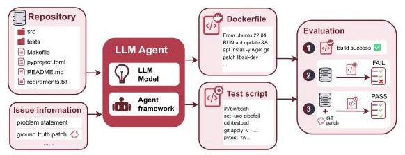
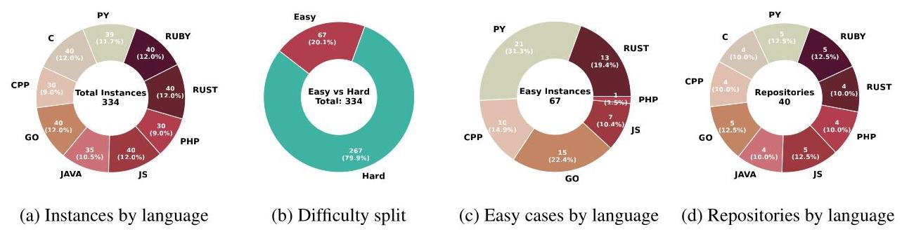
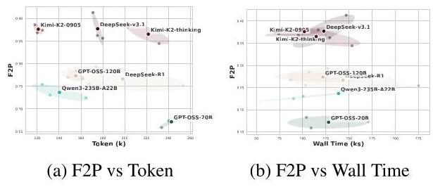
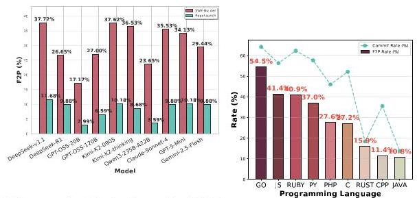
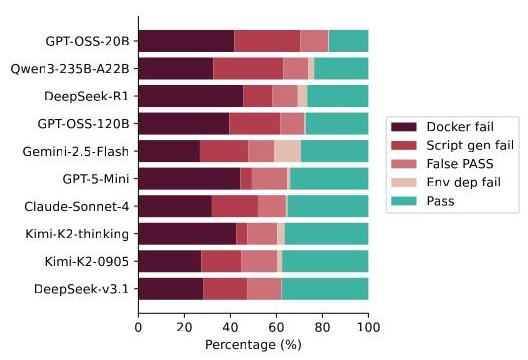
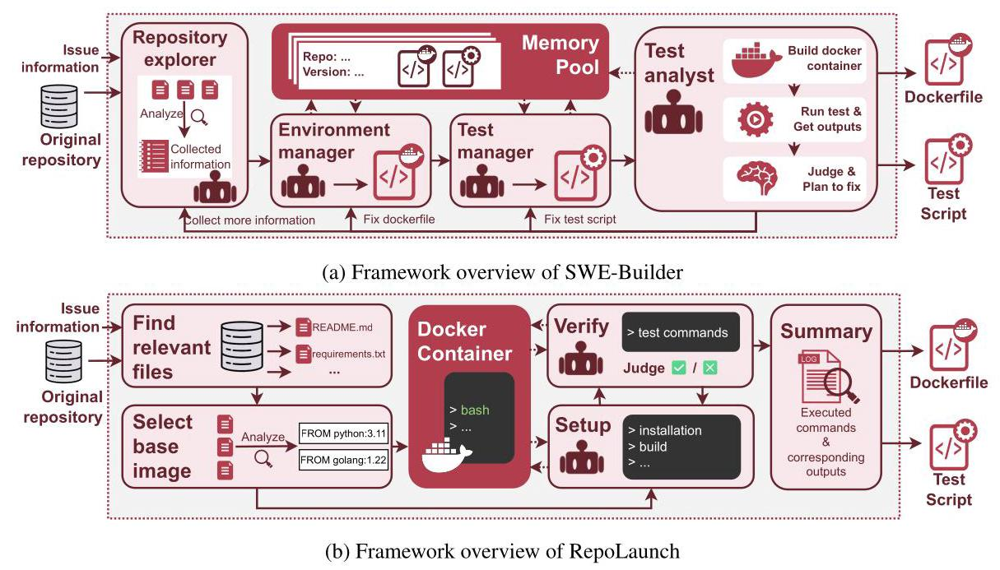
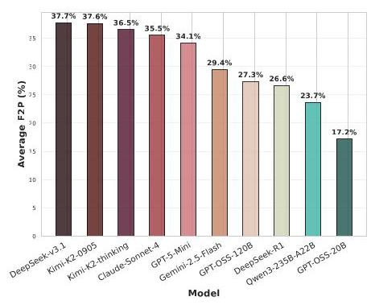
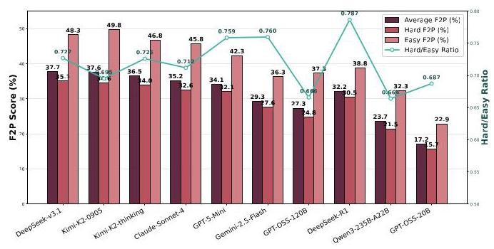

# Multi-Docker-Eval: A 'Shovel of the Gold Rush' Benchmark on Automatic Environment Building for Software Engineering

Kelin Fu \( {}^{1, \dagger  } \) , Tianyu Liu \( {}^{1, * } \) , Zeyu Shang \( {}^{2} \) , Yingwei Ma \( {}^{2} \) , Jian Yang \( {}^{3} \) , Jiaheng Liu \( {}^{3} \) , Kaigui Bian \( {}^{1, \dagger  } \)

\( {}^{1} \) School of Computer Science, Peking University \( {}^{2} \) Moonshot AI \( {}^{3} \) M-A-P

\( {}^{ \dagger  } \) Correspondence: litble@stu.pku.edu.cn, \( \{ \) tianyu0421, bkg \( \} \) @pku.edu.cn \( {}^{ * } \) Project Leader

C GitHub: https://github.com/Z2sJ4t/Multi-Docker-Eval HuggingFace: https://huggingface.co/datasets/litble/Multi-Docker-Eval

## Abstract

Automated environment configuration is a critical bottleneck in scaling software engineering (SWE) automation. To provide a reliable evaluation standard for this task, we present Multi-Docker-Eval benchmark. It includes 40 real-world repositories spanning 9 programming languages and measures both success in achieving executable states and efficiency under realistic constraints. Our extensive evaluation of state-of-the-art LLMs and agent frameworks reveals key insights: (1) the overall success rate of current models is low (F2P at most 37.7%), with environment construction being the primary bottleneck; (2) model size and reasoning length are not decisive factors, and open-source models like DeepSeek-V3.1 and Kimi-K2 are competitive in both efficiency and effectiveness; (3) agent framework and programming language also have significantly influence on success rate. These findings provide actionable guidelines for building scalable, fully automated SWE pipelines.

## 1 Introduction

Software repositories on platforms like GitHub underpin modern software engineering, enabling large-scale collaboration and open-source development (Jimenez et al., 2023; Fan et al., 2023). Among the numerous challenges in this space, repository-level tasks-such as bug-fixing, optimization and adding new features-are of particular importance. Solving these tasks requires a deep understanding of codebases, dependencies, and build environments. Recently, Large Language Models (LLMs) have shown promising capabilities in tackling such problems, advancing the frontier of automated issue resolution and repository-level code generation.

A typical repository-level problem can be formulated as: given a repository \( R \) and a test function \( T\left( \cdot \right) \) , the goal is to generate a patch \( P \) such that \( T\left( R\right) \) fails initially and \( T\left( {R \oplus  P}\right) \) passes after applying \( P \) . Success hinges on constructing executable environments that accurately reflect repository states before and after patching.

However, building such environments remains challenging due to diverse dependencies, language versions, and build configurations. While prior efforts like SWE-Gym (Pan et al., 2024) and swe-rebench (Badertdinov et al., 2025) used manual or rule-based setups, and others like SWE-Smith (Yang et al., 2025) and R2E-Gym (Jain et al., 2025) employed synthetic data, scaling environment configuration is still difficult. Recent agentic systems (e.g., SWE-Factory (Guo et al., 2025), RepoLaunch (Zhang et al., 2025)) address this by automating Docker-based environment setup, enabling scalable and continuous data generation for training and evaluation.

We analogize this process to a modern-day "gold rush": repositories are gold mines, automated fixes are the gold, and environment-configuring agents are the shovels. A reliable "shovel" is essential for efficient extraction. To evaluate these tools, we introduce Multi-Docker-Eval, a benchmark for assessing automated environment configuration across language ecosystems.

Existing benchmarks like En-vBench (Eliseeva et al., 2025) and INSTALLAMATIC-bench (Milliken et al., 2025) are limited: they often measure only setup success, without verifying test validity or task-specific correctness. Most are language-specific (e.g., Python or JVM) and use narrow metrics, ignoring configuration time, resource use, and test robustness-key factors for real-world use.

To address these gaps, we present Multi-Docker-Eval, a multi-language, multidimensional evaluation framework for automatic environment construction. It assesses not only the success of achieving executable states, but also the efficiency and stability of the configuration process under realistic resource constraints. We envision Multi-Docker-Eval as a benchmark "shovel test"-a practical and principled step toward empowering the next generation of data-driven software intelligence.

Our contributions are as follows:

- Multi-Docker-Eval benchmark: The first multilingual benchmark for evaluating LLM agents on configuring executable environments and test scripts for real-world repositories.

- Comprehensive model evaluation: Extensive experiments with open- and closed-source LLMs to assess capability and efficiency, guiding future automated data generation.

- Framework comparison: Analysis of SWE-Builder and RepoLaunch, summarizing strengths and weaknesses to inform framework design.

- Toward full automation: Design insights for scalable, cost-effective, and fully automated pipelines in software engineering benchmark and dataset construction.

## 2 Related Works

Repo-level coding tasks. Recent benchmarks assess LLMs in resolving real-world GitHub issues. SWE-bench (Jimenez et al., 2023), the most widely used benchmark, provides Python issues paired with test suites. Extensions like R2E-Gym (Jain et al., 2025) and SWE-Smith (Yang et al., 2025) expand the task scope using LLM-synthesized data, while swebench-multilingual (Yang et al., 2025) and Multi-SWE-bench (Zan et al., 2025) extend evaluation to multilingual settings. Beyond bug-fixing, recent benchmarks assess broader capabilities: nocode-bench (Deng et al., 2025a) and FEA-Bench (Li et al., 2025) targets feature addition, GSO-bench (Shetty et al., 2025) focuses on code optimization, SWTbench (Mündler et al., 2024) evaluates unit test generation, and long-horizon tasks are explored in Commit0 (Zhao et al., 2024) and SWE-bench Pro (Deng et al., 2025b). These efforts collectively advance automated issue resolution and repository-level code generation using LLMs (Xia et al., 2024; Yang et al., 2024; Ma et al., 2025b, a).

Agent frameworks for automated repository setup. To automate the complex setup process, several agent frameworks have emerged. ExecutionAgent (Bouzenia and Pradel, 2025) generates scripts for building and testing projects. RepoLaunch (Zhang et al., 2025) and SetUpAgent (Vergopoulos et al., 2025) employ bash-interactive agents . Repo2Run (Hu et al., 2025) hits 86% configuration success rate in Python. Advancing further, SWE-Factory (Guo et al., 2025) introduces a multi-agent collaboration framework that achieves fully automated, multi-language environment configuration.

Figure 1: Overview of the workflow with Multi-Docker-Eval.

Benchmarks for environment configuration. Efforts to evaluate automated configuration include EXECUTIONAGENT-bench (Bouzenia and Pradel, 2025), which assesses build and test rates across 10 repositories in 5 languages but requires manual scoring. INSTALLAMATIC-bench (Milliken et al., 2025) focuses on Python, and En-vBench (Eliseeva et al., 2025) extends to JVM languages. However, these benchmarks do not evaluate configuration for specific repository issues nor effectively test the agent's ability to generate corresponding test scripts.

## 3 Multi-Docker-Eval Benchmark

In this chapter, we descirbe Multi-Docker-Eval, our benchmark designed for automated executable environment configuration.

### 3.1 Task Definition

As shown in Figure 1, the Multi-Docker-Eval benchmark assesses a model's capacity to automate environment creation and testing for repository-level code tasks. The process begins with an input triplet \( \langle R, D,{P}^{ * } >  : \) a source repository \( R \) , a natural language problem description \( D \) , and the correct solution patch \( {P}^{ * } \) . The model must then produce two outputs: a test function \( T\left( \cdot \right) \) that fails on the original code \( R \) but passes on the patched version \( R \oplus  {P}^{ * } \) , and a runnable Docker environment to execute this test. The benchmark ultimately evaluates the agent's ability to install dependencies and generate valid tests from problem descriptions.

### 3.2 Data Collection and Filtering

Dataset construction. As detailed in Figure 2a and Figure 2d, We collected 334 issues from 40 open-source repositories across 9 popular programming languages from GitHub (for specific repository information, please refer to Appendix B.1). These languages cover major programming paradigms and are among the top 20 most searched-for on Google (PYPL Index, 2025).

Filtering. To ensure quality and avoid overly popular repositories, we selected those meeting: (i) \( {1000} \leq \) stars \( \leq  {1500} \) (ii) forks \( \geq  {20} \) (iii) contributors \( \geq  {10} \) (iv) repository size \( \leq  {100} \) MB. For each repository, we select at most 8 pull requests created after 31 July 2025 (UTC).

Difficulty verification. For each repository version, we verified if a runnable environment could be easily configured (e.g., via pip install -r requirements.txt). Configurations achievable this way are labeled "Easy"; others are "Hard". In our dataset, 20.06% (67 instances) are "Easy". The specific difficulty distribution of Multi-Docker-Eval can be found in Figure 2b and Figure 2c. The specific commands are provided in Appendix B.2.

### 3.3 Metrics

We introduce two metric categories in Multi-Docker-Eval: outcome and process metrics.

Outcome metrics assess the correctness of the environment and tests:

Figure 2: Overview of the data composition of Multi-Docker-Eval.

- Fail-to-pass rate (F2P): The proportion of tests that fail before and pass after configuration. This is the main metric.

- Commit rate: The proportion of instances where the agent commits its output for evaluation.

Process metrics evaluate efficiency and resource usage:

- Token consumption: Total tokens used by LLMs during configuration.

- Wall time: Total real time from configuration start to completion.

- CPU seconds: Total CPU time used.

- Max Resident Set Size (Max RSS): Peak memory usage.

- Average image size: Average size of final Docker images, indicating storage efficiency.

## 4 Experimental Setup

Agent framework. We evaluated two agent frameworks for automated environment configuration. Detailed introductions are provided in Appendix A:

- SWE-Builder (multi-agent): four specialised agents jointly search the repo, write the Dockerfile, install dependencies and generate tests; a built-in loop reinvokes the agents when a test fails, and a memory pool reuses previously validated environments.

- RepoLaunch (single agent): one agent sequentially picks a base image and issues raw bash commands inside the container; no automatic retry or reuse.

The former trades flexibility for stability; the latter offers an open-ended command space but suffers from higher variance.

LLM models. 7 open-source (DeepSeek-v3.1, DeepSeek-R1, Qwen3-235B-A22B, GPT-OSS-20/120B, Kimi-K2-0905, Kimi-K2- thinking) and 3 closed-source (Claude-Sonnet-4, GPT-5-Mini, Gemini-2.5-Flash).

## 5 Results

### 5.1 RQ1: Effiency of state-of-the-art LLMs on Configuration Tasks

To begin, we assess how effectively current LLMs perform the automated environment configuration task-that is, how well they convert a repository into an executable state with a valid test script (RQ1).

Overall Performance. As shown in Table 1, the primary metric, Fail-to-Pass Rate (F2P), ranges from 17% to \( {38}\% \) across models, indicating that fewer than half of repositories are successfully configured. This low success confirms that Multi-Docker-Eval remains challenging, requiring both dependency reasoning and complex engineering operations. The wide performance gap also suggests this capability is not yet broadly covered by pretraining or instruction-tuning data.

<table><tr><td rowspan="2">Model</td><td colspan="2">Outcome Metrics</td><td colspan="6">Process Metrics</td></tr><tr><td>F2P (%)</td><td>Commit (%)</td><td>Avg input tokens (K)</td><td>Avg output tokens (K)</td><td>Wall time (Ks)</td><td>CPU seconds (Ks)</td><td>Max RSS (GB)</td><td>Avg docker size (GB)</td></tr><tr><td colspan="9">Open-source Models</td></tr><tr><td>DeepSeek-v3.1</td><td>37.72</td><td>52.89</td><td>158.11</td><td>17.15</td><td>122.80</td><td>0.749</td><td>7.45</td><td>1.02</td></tr><tr><td>DeepSeek-R1</td><td>26.65</td><td>41.72</td><td>138.05</td><td>60.10</td><td>143.37</td><td>0.534</td><td>7.47</td><td>1.02</td></tr><tr><td>GPT-0SS-20B</td><td>17.17</td><td>29.44</td><td>184.23</td><td>58.37</td><td>127.91</td><td>0.626</td><td>7.38</td><td>0.87</td></tr><tr><td>GPT-0SS-120B</td><td>27.00</td><td>37.72</td><td>128.31</td><td>30.17</td><td>104.29</td><td>0.478</td><td>8.70</td><td>0.83</td></tr><tr><td>Kimi-K2-0905</td><td>37.62</td><td>55.49</td><td>113.02</td><td>7.92</td><td>101.81</td><td>0.691</td><td>7.60</td><td>1.01</td></tr><tr><td>Kimi-K2-thinking</td><td>36.53</td><td>52.69</td><td>162.12</td><td>59.40</td><td>114.61</td><td>0.425</td><td>7.66</td><td>1.05</td></tr><tr><td>Owen3-235B-A22B</td><td>23.65</td><td>34.53</td><td>101.46</td><td>38.87</td><td>138.64</td><td>0.613</td><td>7.38</td><td>1.00</td></tr><tr><td colspan="9">Closed-source Models</td></tr><tr><td>Claude-Sonnet-4</td><td>35.53</td><td>47.41</td><td>182.85</td><td>15.01</td><td>110.54</td><td>0.680</td><td>7.30</td><td>1.17</td></tr><tr><td>GPT-5-Mini</td><td>34.13</td><td>49.60</td><td>339.94</td><td>103.32</td><td>158.61</td><td>0.746</td><td>7.34</td><td>0.95</td></tr><tr><td>Gemini-2.5-Flash</td><td>29.44</td><td>40.62</td><td>153.43</td><td>32.60</td><td>88.00</td><td>0.698</td><td>7.58</td><td>0.97</td></tr></table>

Table 1: Overall Multi-Docker-Eval performance of different models on SWE-Builder.

Figure 3: Relationship between F2P and resource consumption metrics on different models. The scatter plot shows the results and average of our three repeated experiments.

Model Comparison. The open-source model DeepSeek-v3.1 (37.72%) achieves the highest F2P, outperforming Claude-Sonnet-4 (35.53%) and GPT-5-Mini (34.13%). In terms of efficiency, as revealed in Figures 3, Kimi-K2-0905 attains 37.62% F2P using notably fewer tokens \( \left( { \sim  {120}\mathrm{\;K}}\right) \) and less wall time (114.61s), whereas higher-performing models often demand more resources. For example, GPT-5-Mini consumes \( \sim  {443.26}\mathrm{\;K} \) tokens for an F2P of 34.13%.

Self-Evaluation Reliability. The Commit Rate, reflecting an agent's confidence, often misaligns with actual performance. Claude-Sonnet-4 commits 47.41% of runs but achieves only 35.53% F2P, and Qwen3-235B-A22B shows similar overconfidence. This indicates that LLM agents currently lack reliable self-assessment in complex software tasks.

Resource and Efficiency Patterns. All models require substantial wall time (roughly 24-44 hours per run), underscoring the task's engineering complexity. In contrast, CPU seconds, Max RSS, and Docker size remain stable—typically 600-750 CPU s, 7.4-7.7 GB RAM, and 0.9-1.2 GB image size-indicating that the SWE-Builder framework provides predictable, resource-bounded execution. This stability simplifies capacity planning for large-scale deployment.

In summary, environment configuration performance does not directly correlate with model size or reasoning length. Open-source models like DeepSeek-v3.1 and Kimi-K2-0905 match or exceed larger closed-source models with lower token costs. Moreover, SWE-Builder ensures consistent resource usage across models, allowing capacity planning to focus primarily on token budget and wall time.

### 5.2 RQ2: Impact of Agent Framework Architectures

Improving configuration quality also requires choosing the right agent architecture. Therefore, we next analyze how do different agent framework architectures impact the performance of environment configuration (RQ2). We compare two representative frameworks—SWE-Builder and RepoLaunch, which has been introduced in Section 4. Results across 10 models in Table 2 highlight clear distinctions in success rates, interaction efficiency, and resource usage patterns. More details of RepoLaunch experiment are provided in Appendix D.2.

Success Rate. As shown in Figure 4, Re-poLaunch yields significantly lower F2P than SWE-Builder across all models. This gap stems from architectural differences: SWE-Builder uses four specialized agents that collaborate on exploration, setup, and testing, with reactivation capability for iterative error repair. In contrast, RepoLaunch relies on single-agent sequential reasoning, offering limited feedback or correction. Moreover, RepoLaunch's commit rate (22.35%) is notably higher than its F2P (8.85%). This is due to its weaker internal judging mechanism: the framework often marks instances as complete even when the generated setup or test commands require manual inspection and rewriting to become usable. This highlights the lack of reliable automated validation in its original workflow.

Divergent Runtime and Resource Patterns. Process metrics reveal further contrasts:

- Token Usage: RepoLaunch uses \( {3.5} \times \) more input tokens (504.05K vs. 165.95K) due to accumulated bash history, but generates 4.2× fewer output tokens (10.03K vs. 42.15K), reflecting reactive command execution rather than structured planning.

Figure 4: Variations in F2P across different models on Figure 5: The bar chart SWE-Builder and Repo-shows the F2P rate Launch framework. Most across different pro-models achieve F2P scores gramming languages, on SWE-Builder's Multi-while the line graph Docker-Eval that are 2.5- to indicates the commit 3.5-fold higher than those rate (Framework: SWE-on RepoLaunch. Builder).

- Dependency Efficiency: RepoLaunch produces 41% larger Docker images (1.41 GB vs. 1.01 GB), suggesting less optimized dependency resolution.

- Computational Profile: RepoLaunch runs \( {3.9} \times \) faster in wall time (31.72Ks vs. 122.80Ks) but uses 10.08×more CPU time (6.25Ks vs. 0.62Ks) with high variance (±13.78Ks), indicating intensive yet unstable computation.

Contrast in Resource Variance. Repo-Launch exhibits high variance across token and CPU metrics, reflecting instability when reasoning with low-level bash commands. SWE-Builder, by contrast, uses declarative operations (e.g., repository inspection, configuration generation), leading to more predictable and reproducible resource usage.

In summary, framework architecture critically shapes automation reliability. Multi-agent collaboration with repair loops, as in SWE-Builder, supports higher success rates, while single-agent sequential designs amplify errors without self-correction. A more effective "shovel" should thus adopt feedback-driven, memory-augmented workflows that enable iterative refinement and reuse of validated configurations.

<table><tr><td>Framework</td><td>F2P   (%)</td><td>Commit (%)</td><td>Avg input tokens (K)</td><td>Avg output tokens (K)</td><td>Wall   time   (Ks)</td><td>CPU   seconds   (Ks)</td><td>Max   RSS   (GB)</td><td>Avg   docker   size (GB)</td></tr><tr><td>SWE-Builder</td><td>30.58   (± 6.54)</td><td>45.92   (± 8.18)</td><td>165.95   (± 63.59)</td><td>42.15   (± 27.27)</td><td>122.80   (± 19.63)</td><td>0.62   (± 0.11)</td><td>7.58   (± 0.09)</td><td>1.01   (±0.09)</td></tr><tr><td>RepoLaunch</td><td>8.85   (± 3.11)</td><td>22.35   (± 9.04)</td><td>504.05   (± 465.94)</td><td>10.03   (± 8.07)</td><td>31.72   (± 10.34)</td><td>6.25   (± 13.78)</td><td>5.37   (± 1.60)</td><td>1.42   (± 0.09)</td></tr></table>

Table 2: Comparison of average performance metrics ( \( \pm \) standard deviation) between SWE-Builder and RepoLaunch frameworks among all 8 models.

### 5.3 RQ3: Variability of Configuration Success across Programming Language

The programming language ecosystem is a major factor determining the difficulty of automated environment configuration. We thus examine how programming languages differ in configuration difficulty and model success (RQ3). As summarized in Figure 5 and Appendix D.3, several general trends can be observed as follows:

Languages with standardized, declarative build systems-such as Go, Python, and JavaScript-achieve the strongest results. Go performs best (Commit 64.25%, F2P 54.50%), reflecting its reproducible module system and minimal system-level dependencies. Python and JavaScript also excel, benefiting from mature package managers (pip, npm) and established conventions that guide LLMs toward correct setups. In contrast, C/C++, Java, and Rust exhibit higher failure rates, as their builds often depend on system libraries, compiler toolchains, and version-specific configurations that are difficult to infer.

Testing ecosystems further influence performance. Languages like Python and Go, with unified testing workflows (e.g., pytest, go test), enable reliable test script generation. However, PHP and JavaScript use diverse frameworks (e.g., PHPUnit, Jest, Mocha), complicating test entry point identification. PHP exemplifies this gap: its commit rate reaches 46.00%, but its F2P drops to 27.56%, indicating that models often misinterpret dependency installation as environment readiness, even when tests remain non-executable.

These findings highlight clear directions for improving configuration systems. Languages with uniform dependency management and testing workflows align well with current LLM capabilities. In contrast, ecosystems like C/C++, Java, Rust, and PHP reveal structural weaknesses in handling system dependencies, compiler setup, and fragmented test conventions. These should be prioritized in future agent optimization.

### 5.4 RQ4: Bottleneck Analysis

To understand what fundamentally limits current systems, we investigate whether environment construction or test script generation is the primary bottleneck in configuration tasks (RQ4). Figure 6 reveals a clear hierarchy of failure modes. Docker build errors dominate (avg. 36.09%), indicating that environment construction is the most failure-prone step. Script-related issues—missing/non-executable scripts (18.12%) and silent false passes (12.70%)— form the second major cluster. Once a Docker image is successfully built, downstream evaluation failures are rare (2.63%), underscoring the robustness of SWE-Builder's self-checking mechanism.

Figure 6: Breakdown of failure modes across models (framework: SWE-Builder). Each bar sums to 100 %. From left to right: (i) Docker-build failures, (ii) test-script generation failures, (iii) failure to reproduce the reported issue (i.e., the script incorrectly passes on the un-patched code), and (iv) test scripts that cannot run due to missing dependencies in the Docker environment. The first two types of failed agents will not submit answers, while the latter two types of failures occur after submission.

Model-level analysis reinforces this pattern: stronger models reduce script failures but show little improvement on Docker errors, suggesting LLMs lack systematic dependency reasoning. "Thinking-enhanced" models (e.g., DeepSeek-R1, GPT-5-Mini, Kimi-K2-thinking) exemplify this-they produce better scripts but suffer more Docker failures, indicating chain-of-thought reasoning aids code synthesis but not system-level dependency resolution.

We further examine whether these bottlenecks persist across frameworks using the "Easy" and "Hard" dataset partitions (Section 3.2). As shown in Table 3, both frameworks achieve higher success on "Easy" cases, though still far from perfect-confirming that agents often struggle with script generation even when dependencies are simple. Under "Hard" conditions, RepoLaunch shows a sharper performance drop than SWE-Builder, highlighting differential resilience to dependency complexity.

<table><tr><td>Framework</td><td>Metric</td><td>Easy (%)</td><td>Hard (%)</td><td>Hard/Easy</td></tr><tr><td rowspan="2">SWE-Builder</td><td>Commit</td><td>59.35</td><td>42.55</td><td>0.72</td></tr><tr><td>Resolved</td><td>39.10</td><td>28.40</td><td>0.73</td></tr><tr><td rowspan="2">RepoLaunch</td><td>Commit</td><td>47.63</td><td>16.00</td><td>0.34</td></tr><tr><td>Resolved</td><td>21.71</td><td>5.31</td><td>0.24</td></tr></table>

Table 3: Performance comparison on "Easy" and "Hard" subsets.

These findings collectively demonstrate that environment construction, particularly dependency resolution, remains the least stable component-making it the critical target for future agent-based configuration systems.

## 6 Conclusion

In this work we introduce Multi-Docker-Eval, the first multilingual benchmark that jointly assesses LLM agents' ability to generate runnable Docker environments and valid test scripts for real-world repositories. Through experiments across diverse models and frameworks, we revealed critical insights into the efficiency, robustness, and scalability of current approaches, highlighted that framework architecture and ecosystem standardization play an important role in determining success, underscoring the need for memory-augmented, feedback-driven, and language-aware designs. We hope Multi-Docker-Eval serves as a foundation for advancing fully automated, resource-efficient pipelines in the era of data-driven software engineering.

## References

Ibragim Badertdinov, Alexander Golubev, Mak-sim Nekrashevich, Anton Shevtsov, Simon Karasik, Andrei Andriushchenko, Maria Trofi-mova, Daria Litvintseva, and Boris Yangel. 2025. Swe-rebench: An automated pipeline for task collection and decontaminated evaluation of software engineering agents. arXiv preprint arXiv:2505.20411.

Islem Bouzenia and Michael Pradel. 2025. You name it, i run it: An llm agent to execute tests of arbitrary projects. Proceedings of the ACM on Software Engineering, 2(ISSTA):1054-1076.

Le Deng, Zhonghao Jiang, Jialun Cao, Michael Pradel, and Zhongxin Liu. 2025a. Nocode-bench: A benchmark for evaluating natural language-driven feature addition. arXiv preprint arXiv:2507.18130.

Xiang Deng, Jeff Da, Edwin Pan, Yannis Yiming He, Charles Ide, Kanak Garg, Niklas Lauffer, Andrew Park, Nitin Pasari, Chetan Rane, and 1 others. 2025b. Swe-bench pro: Can ai agents solve long-horizon software engineering tasks? arXiv preprint arXiv:2509.16941.

Aleksandra Eliseeva, Alexander Kovrigin, Ilia Kholkin, Egor Bogomolov, and Yaroslav Zharov. 2025. Envbench: A benchmark for automated environment setup. arXiv preprint arXiv:2503.14443.

Angela Fan, Beliz Gokkaya, Mark Harman, Mitya Lyubarskiy, Shubho Sengupta, Shin Yoo, and Jie M Zhang. 2023. Large language models for software engineering: Survey and open problems. In 2023 IEEE/ACM International Conference on Software Engineering: Future of Software Engineering (ICSE-FoSE), pages 31-53. IEEE.

Lianghong Guo, Yanlin Wang, Caihua Li, Pengyu Yang, Jiachi Chen, Wei Tao, Yingtian Zou, Duyu Tang, and Zibin Zheng. 2025. Swe-factory: Your automated factory for issue resolution training data and evaluation benchmarks. arXiv preprint arXiv:2506.10954.

Ruida Hu, Chao Peng, Junjielong Xu, Cuiyun Gao, and 1 others. 2025. Repo2run: Automated building executable environment for code repository at scale. In The Thirty-ninth Annual Conference on Neural Information Processing Systems.

Naman Jain, Jaskirat Singh, Manish Shetty, Liang Zheng, Koushik Sen, and Ion Stoica. 2025. R2e-gym: Procedural environments and hybrid verifiers for scaling open-weights swe agents. arXiv preprint arXiv:2504.07164.

Carlos E Jimenez, John Yang, Alexander Wettig, Shunyu Yao, Kexin Pei, Ofir Press, and Karthik Narasimhan. 2023. Swe-bench: Can language models resolve real-world github issues? arXiv preprint arXiv:2310.06770.

Wei Li, Xin Zhang, Zhongxin Guo, Shaoguang Mao, Wen Luo, Guangyue Peng, Yangyu Huang, Houfeng Wang, and Scarlett Li. 2025. Fea-bench: A benchmark for evaluating repository-level code generation for feature implementation. arXiv preprint arXiv:2503.06680.

Yingwei Ma, Rongyu Cao, Yongchang Cao, Yue Zhang, Jue Chen, Yibo Liu, Yuchen Liu, Binhua Li, Fei Huang, and Yongbin Li. 2025a. Swe-gpt: A process-centric language model for automated software improvement. Proceedings of the ACM on Software Engineering, 2(ISSTA):2362-2383.

Yingwei Ma, Qingping Yang, Rongyu Cao, Binhua Li, Fei Huang, and Yongbin Li. 2025b. Alibaba lingmaagent: Improving automated issue resolution via comprehensive repository exploration. In Proceedings of the 33rd ACM International Conference on the Foundations of Software Engineering, pages 238-249.

Louis Milliken, Sungmin Kang, and Shin Yoo. 2025. Beyond pip install: Evaluating llm agents for the automated installation of python projects. In 2025 IEEE International Conference on Software Analysis, Evolution and Reengineering (SANER), pages 1-11. IEEE.

Niels Mündler, Mark Müller, Jingxuan He, and Martin Vechev. 2024. Swt-bench: Testing and validating real-world bug-fixes with code agents. Advances in Neural Information Processing Systems, 37:81857-81887.

Jiayi Pan, Xingyao Wang, Graham Neubig, Navdeep Jaitly, Heng Ji, Alane Suhr, and Yizhe Zhang. 2024. Training software engineering agents and verifiers with swe-gym. arXiv preprint arXiv:2412.21139.

PYPL Index. 2025. PYPL PopularitY of Programming Language.

Manish Shetty, Naman Jain, Jinjian Liu, Vijay Kethanaboyina, Koushik Sen, and Ion Stoica. 2025. Gso: Challenging software optimization tasks for evaluating swe-agents. arXiv preprint arXiv:2505.23671.

Konstantinos Vergopoulos, Mark Niklas Müller, and Martin Vechev. 2025. Automated benchmark generation for repository-level coding tasks. arXiv preprint arXiv:2503.07701.

Chunqiu Steven Xia, Yinlin Deng, Soren Dunn, and Lingming Zhang. 2024. Agentless: Demystify-ing llm-based software engineering agents. arXiv preprint arXiv:2407.01489.

John Yang, Carlos E Jimenez, Alexander Wettig, Kilian Lieret, Shunyu Yao, Karthik Narasimhan, and Ofir Press. 2024. Swe-agent: Agent-computer interfaces enable automated software engineering. Advances in Neural Information Processing Systems, 37:50528-50652.

John Yang, Kilian Lieret, Carlos E Jimenez, Alexander Wettig, Kabir Khandpur, Yanzhe Zhang, Binyuan Hui, Ofir Press, Ludwig Schmidt, and Diyi Yang. 2025. Swe-smith: Scaling data for software engineering agents. arXiv preprint arXiv:2504.21798.

Daoguang Zan, Zhirong Huang, Wei Liu, Hanwu Chen, Linhao Zhang, Shulin Xin, Lu Chen, Qi Liu, Xiaojian Zhong, Aoyan Li, and 1 others. 2025. Multi-swe-bench: A multilingual benchmark for issue resolving. arXiv preprint arXiv:2504.02605.

Linghao Zhang, Shilin He, Chaoyun Zhang, Yu Kang, Bowen Li, Chengxing Xie, Junhao Wang, Maoquan Wang, Yufan Huang, Shengyu Fu, and 1 others. 2025. Swe-bench goes live! arXiv preprint arXiv:2505.23419.

Wenting Zhao, Nan Jiang, Celine Lee, Justin T Chiu, Claire Cardie, Matthias Gallé, and Alexander M Rush. 2024. Commit0: Library generation from scratch. arXiv preprint arXiv:2412.01769.

Figure 7: Overview of the data composition of Multi-Docker-Eval.The framework diagrams of SWE-Builder and RepoLaunch are shown below. Both systems take a source code repository and issue information as input, and produce a Dockerfile along with a test script as output. These outputs collectively provide an executable environment for the repository and enable corresponding tests for the given issue.

- SWE-Builder (Guo et al., 2025) (Figure 7a): A multi-agent, iterative framework that partitions the environment setup into four specialized roles: Repository Explorer, Environment Manager, Test Manager, and Test Analyst. These agents collaborate to gather dependencies, generate Dockerfiles and test scripts, analyze failures, and iteratively refine configurations. Notably, if the final Test Analyst phase yields unsatisfactory results, the system reactivates the other three agents for error correction, forming a closed-loop iterative workflow. To further improve efficiency, SWE-Builder incorporates an Evaluation Environment Memory Pool that reuses previously validated configurations from similar repository versions. This multi-agent, memory-augmented design enables robust performance across diverse languages and repositories, making SWE-Builder our primary experimental framework due to its high reliability and scalability.

- RepoLaunch (Zhang et al., 2025) (Figure 7b): A single-agent, sequential workflow. It scans the repository structure, identifies configuration documents, selects a base image, and then launches a Docker container to perform iterative bash commands for dependency installation and test execution. Although local cycles exist between the Setup and Verify phases, the overall process advances sequentially from one stage to the next. In our extended version, we automated two originally manual steps: enabling the agent to review execution history to extract minimal installation and test commands, and performing automated golden-patch validation using language-specific log parsers. RepoLaunch operates in a vast action space of bash commands, requiring dynamic interaction with Docker containers, which introduces higher uncertainty.

## B Benchmark Details

### B.1 Repositories in Multi-Docker-Eval

Python Go

- pallets-eco/flask-wtf - uber-go/atomic

- rigetti/pyquil - warrensbox/terraform-switcher

- marcelotduarte/cx-Freeze - polarsignals/frostdb

- getlogbook/logbook - stephenafamo/bob

- pytest-dev/pytest-django - Altinity/clickhouse-backup

C Java

- HandmadeMath/HandmadeMath - OpenAEV-Platform/openaev

- libssh2/libssh2 - java-diff-utils/java-diff-utils

- nginx/njs - kagkarlsson/db-scheduler

- profanity-im/profanity - dadoonet/fscrawler

C++ JavaScript

- cpputest/cpputest - pinojs/pino-pretty

- GothenburgBitFactory/timewarrior - prettier/plugin-ruby

- nfrechette/acl - vercel/nft

- LiteLDev/LeviLamina - opencomponents/oc

- vimeo/player.js

Figure 8: The repositories evolved in Multi-Docker-Eval.

### B.2 Difficulty Verification

<table><tr><td>Language</td><td>Base image</td><td>Key configuration commands</td></tr><tr><td>Python</td><td>python:3.10- slim</td><td>RUN if [ -f requirements.txt ]; then pip install -r requirements.txt; fi   RUN if [ -f pyproject.toml ]; then pip install poetry && poetry install || pip install -e .; fi   RUN if [ -f setup.py ]; then pip install -e . || true; fi   RUN if [ -f Pipfile ]; then pip install pipenv && pipenv install --system || true; fi</td></tr><tr><td>C</td><td>gcc:11</td><td>RUN if [ -f Makefile ]; then make -j2 || true; else gcc -Wall -02 \$(ls *.c 2>/dev/null) -o main 2>/dev/null || true; fi</td></tr><tr><td>C++</td><td>gcc:11</td><td>RUN if [ -f Makefile ]; then make -j2 || true; else g++ -Wall -02 \$(ls *.cpp 2>/dev/null) -o main 2>/dev/null || true; fi</td></tr><tr><td>Go</td><td>golang:1.20</td><td>RUN go install gotest.tools/gotestsum@latest || true   RUN if [ -f go.mod ]; then go mod tidy; fi   RUN go build -v ./... || true</td></tr><tr><td>JAVA</td><td>maven:3.9.9- eclipse-temurin-17</td><td>RUN if [ -f pom.xml ]; then mvn -DskipTests package -q; fi   RUN if [ -f build.gradle ]; then gradle build -x test || true; fi</td></tr><tr><td>JavaScript</td><td>node:18- bullseye-slim</td><td>RUN if [ -f package.json ]; then npm install --silent; fi</td></tr><tr><td>PHP</td><td>php:8.1-cli</td><td>RUN php -r "copy('https://getcomposer.org/installer', composer-setup.php');" \\   && php composer-setup.php --install-dir=/usr/local/bin -- filename=composer \\   && rm composer-setup.php   RUN composer global require "phpunit/phpunit:^9" --prefer-dist --no-progress --no-suggest || true   ENV PATH="/root/.composer/vendor/bin:\$PATH"   RUN if [ -f composer.json ]; then composer install --no-interaction || true; fi</td></tr><tr><td>Rust</td><td>rust:1.70-slim</td><td>RUN if [ -f Cargo.toml ]; then cargo build --release || true; fi</td></tr><tr><td>Ruby</td><td>ruby:3.1-slim</td><td>RUN gem install bundler rspec rake minitest test-unit || true   RUN if [ -f Gemfile ]; then bundle install || true; fi</td></tr></table>

Table 4: The base image and key configuration commands utilized to try to build environment. An instance is defined as "Easy" if a test-ready environment can be successfully built through these commands. Otherwise, it is assigned the "Hard" label.

## C Experimental Details

### C.1 Experimental Platform Configuration

All experiments were conducted on a virtual machine equipped with 32 CPU cores (Intel® Xeon® Platinum 8457C) and 128 GB of RAM. The system runs Linux version 5.15.0-130-generic with 1000 GB of virtual disk storage. Each experiment was executed in an isolated containerized environment to ensure reproducibility and prevent resource interference across concurrent runs. All evaluations were performed without GPU acceleration.

### C.2 Experimental Parameters

All parameters not explicitly mentioned here use their framework default values.

SWE-Builder Configuration Concurrency: Concurrency of each round: 5, 8, and 12.

RepoLaunch Configuration Concurrency: Fixed at 8 concurrent processes for all experiments.

Max steps for setup agent: 30 steps maximum allowed for environment setup tasks.

Max steps for verify agent: 30 steps maximum allowed for verification tasks.

Evaluation Configuration Max workers: 16 worker processes for parallel evaluation.

Docker build timeout: 1800 seconds (30 minutes) maximum allowed for Docker image building.

Test timeout: 2700 seconds (45 minutes) maximum allowed for test execution.

Test runs (for stable F2P): 3 repeated test executions to measure test stability and account for flaky tests.

## D Detailed Results

### D.1 Additional Result Figures

Figure 9: Average F2P of different models (SWE-Builder framework).

Figure 10: F2P performance across model capabilities: Easy vs. Hard subsets. The line indicates the Hard-to-Easy F2P ratio (Framework: SWE-Builder).

D.2 Detailed Results for RepoLaunch Framework

<table><tr><td rowspan="2">Model</td><td colspan="2">Outcome Metrics</td><td colspan="6">Process Metrics</td></tr><tr><td>F2P (%)</td><td>Commit (%)</td><td>Avg input tokens (K)</td><td>Avg output tokens (K)</td><td>Wall time (Ks)</td><td>CPU seconds (Ks)</td><td>Max RSS (GB)</td><td>Avg docker size (GB)</td></tr><tr><td colspan="9">Open-source Models</td></tr><tr><td>DeepSeek-v3.1</td><td>11.68</td><td>35.63</td><td>197.20</td><td>1.57</td><td>22.39</td><td>1.38</td><td>5.91</td><td>1.55</td></tr><tr><td>DeepSeek-R1</td><td>9.88</td><td>21.56</td><td>174.35</td><td>16.02</td><td>46.33</td><td>2.04</td><td>3.78</td><td>1.39</td></tr><tr><td>GPT-0SS-20B</td><td>2.99</td><td>6.29</td><td>202.73</td><td>1.53</td><td>22.35</td><td>1.23</td><td>6.01</td><td>1.19</td></tr><tr><td>GPT-0SS-120B</td><td>6.59</td><td>18.26</td><td>1690.38</td><td>5.42</td><td>26.87</td><td>1.66</td><td>6.18</td><td>1.36</td></tr><tr><td>Kimi-K2-0905</td><td>10.18</td><td>34.13</td><td>137.27</td><td>1.97</td><td>21.20</td><td>1.02</td><td>3.71</td><td>1.54</td></tr><tr><td>Kimi-K2-thinking</td><td>8.68</td><td>18.26</td><td>434.50</td><td>13.63</td><td>24.14</td><td>1.61</td><td>3.66</td><td>1.44</td></tr><tr><td>Qwen3-235B-A22B</td><td>3.59</td><td>6.59</td><td>111.33</td><td>10.51</td><td>26.22</td><td>0.90</td><td>7.54</td><td>1.42</td></tr><tr><td colspan="9">Closed-source Models</td></tr><tr><td>Claude-Sonnet-4</td><td>9.88</td><td>31.74</td><td>860.02</td><td>30.62</td><td>52.21</td><td>49.56</td><td>7.81</td><td>1.49</td></tr><tr><td>GPT-5-Mini</td><td>10.18</td><td>23.05</td><td>694.93</td><td>7.36</td><td>39.02</td><td>6.61</td><td>4.02</td><td>1.43</td></tr><tr><td>Gemini-2.5-Flash</td><td>9.88</td><td>22.75</td><td>859.84</td><td>12.45</td><td>27.66</td><td>1.40</td><td>6.98</td><td>1.437</td></tr></table>

Table 5: Overall Multi-Docker-Eval performance of different models on RepoLaunch.

D. 3 F2P Rates Across Programming Languages

<table><tr><td rowspan="2">Model</td><td colspan="9">Language</td></tr><tr><td>Python</td><td>JavaScript</td><td>Java</td><td>C++</td><td>C</td><td>Go</td><td>Ruby</td><td>Rust</td><td>PHP</td></tr><tr><td>DeepSeek-v3.1</td><td>47.86</td><td>45.83</td><td>14.29</td><td>18.89</td><td>33.33</td><td>57.50</td><td>51.67</td><td>20.83</td><td>42.22</td></tr><tr><td>DeepSeek-R1</td><td>32.48</td><td>40.83</td><td>9.52</td><td>10.00</td><td>22.50</td><td>46.67</td><td>35.83</td><td>10.00</td><td>25.56</td></tr><tr><td>GPT-OSS-20B</td><td>15.38</td><td>17.50</td><td>8.57</td><td>2.22</td><td>15.00</td><td>46.67</td><td>25.00</td><td>9.17</td><td>7.78</td></tr><tr><td>GPT-OSS-120B</td><td>35.90</td><td>36.67</td><td>10.48</td><td>10.00</td><td>23.33</td><td>53.33</td><td>32.50</td><td>14.17</td><td>22.22</td></tr><tr><td>Kimi-K2-0905</td><td>47.01</td><td>49.17</td><td>12.38</td><td>12.22</td><td>34.17</td><td>61.67</td><td>51.67</td><td>22.50</td><td>36.67</td></tr><tr><td>Kimi-K2-thinking</td><td>49.57</td><td>46.67</td><td>11.43</td><td>11.11</td><td>37.50</td><td>63.33</td><td>48.33</td><td>17.50</td><td>32.22</td></tr><tr><td>Owen3-235B-A22B</td><td>21.37</td><td>37.50</td><td>9.52</td><td>5.56</td><td>17.50</td><td>51.67</td><td>30.00</td><td>15.83</td><td>15.56</td></tr><tr><td>Claude-Sonnet-4</td><td>41.88</td><td>48.33</td><td>8.57</td><td>18.89</td><td>32.50</td><td>66.67</td><td>43.33</td><td>18.33</td><td>30.00</td></tr><tr><td>GPT-5-Mini</td><td>43.59</td><td>49.17</td><td>14.29</td><td>15.56</td><td>29.17</td><td>48.33</td><td>49.17</td><td>16.67</td><td>34.44</td></tr><tr><td>Gemini-2.5-Flash</td><td>35.04</td><td>42.50</td><td>8.57</td><td>10.00</td><td>26.67</td><td>49.17</td><td>41.67</td><td>14.17</td><td>28.89</td></tr></table>

Table 6: F2P Rates Across Programming Languages by Model on SWE-Builder (%)