# DR3-Eval: Towards Realistic and Reproducible Deep Research Evaluation

Qianqian Xie \( {}^{1 * } \) Qingheng Xiong \( {}^{1 * } \) He Zhu \( {}^{2 * } \) Tiantian Xia \( {}^{5} \) , Xueming Han \( {}^{3} \) , Fanyu Meng \( {}^{3} \) , Jiakai Wang \( {}^{2} \) , Zhiqi Bai \( {}^{2} \) , Chengkang Jiang \( {}^{1} \) , Zhaohui Wang \( {}^{1} \) , Yubin \( {\mathrm{{Guo}}}^{1} \) , Yuqing Wen \( {}^{4} \) , Jiayang Mao \( {}^{1} \) , Zijie Zhang \( {}^{1} \) , Shihao Li \( {}^{1} \) , Yanghai Wang \( {}^{1} \) , Yuxiang Ren \( {}^{1} \) , Junlan Feng \( {}^{3 \dagger  } \) Jiaheng Liu \( {}^{1 \ddagger  } \)

\( {}^{1} \) Nanjing University \( {}^{2} \) M-A-P \( {}^{3} \) Jiutian Research

\( {}^{4} \) National University of Singapore \( {}^{5} \) Nanjing University of Science and Technology

xieqianqian@smail.nju.edu.cn liujiaheng@nju.edu.cn

## Abstract

Deep Research Agents (DRAs) aim to solve complex, long-horizon research tasks involving planning, retrieval, multimodal understanding, and report generation, yet their evaluation remains challenging due to dynamic web environments and ambiguous task definitions. We propose DR3- Eval, a realistic and reproducible benchmark for evaluating deep research agents on multimodal, multi-file report generation. \( {\mathrm{{DR}}}^{3} \) -Eval is constructed from authentic user-provided materials and paired with a per-task static research sandbox corpus that simulates open-web complexity while remaining fully verifiable, containing supportive documents, distractors, and noise. Moreover, we introduce a multi-dimensional evaluation framework measuring Information Recall, Factual Accuracy, Citation Coverage, Instruction Following, and Depth Quality, and validate its alignment with human judgments. Experiments with our developed multi-agent system DR3-Agent based on multiple state-of-the-art language models demonstrate that \( {\mathrm{{DR}}}^{3} \) -Eval is highly challenging and reveals critical failure modes in retrieval robustness and hallucination control. Our code and data are publicly available. \( {}^{a} \)

---

\( {}^{a} \) https://github.com/NJU-LINK/DR3-Eval

---

## 1 Introduction

Recent advances in large language models have enabled the development of Deep Research Agents (DRAs), which aim to autonomously perform complex, long-horizon research tasks involving planning, iterative information retrieval, multimodal understanding, and synthesis of structured, citation-grounded reports (Li et al., 2025; Yang et al., 2025; Schmidgall et al., 2025; Xu and Peng, 2025; OpenAI, 2025; Google, 2025; Team, 2025; AI, 2024; xAI Team, 2024; DeepResearch Team, Tongyi Lab, 2025; ByteDance, 2025; CAMEL-AI, 2026). Unlike traditional question-answering systems, DRAs must operate under uncertainty, reason over heterogeneous and noisy information sources, and integrate evidence into coherent analytical outputs. As these capabilities rapidly improve, establishing realistic and reproducible evaluation protocols has become increasingly important.

Evaluating deep research poses challenges that go beyond short-form reasoning or single-answer tasks. In realistic research settings, agents must infer implicit user intent from incomplete context, formulate effective search strategies, filter relevant evidence from large volumes of noise, and avoid hallucination while generating long-form reports (Abaskohi et al., 2025; Wang et al., 2025; Han et al., 2026; Sharma et al., 2025; Du et al., 2025; Huang et al., 2026; Wang et al., 2026; Patel et al., 2025; Coelho et al., 2025; Li et al., 2026; Ruan et al., 2025). As a result, evaluation outcomes are highly sensitive to the construction of tasks and information environments, revealing a fundamental tension between realism, controllability, and evaluability. Recently, as shown in Figure 1, several benchmarks have been proposed to evaluate deep research agents. For example, DeepResearch Bench (Du et al., 2025) emphasizes open-ended report generation and long-horizon reasoning, but typically relies on live web access, making results difficult to reproduce and prone to evaluation ambiguity. DRBench (Abaskohi et al., 2025) improves structure by focusing on enterprise-style report generation from curated documents, yet largely omits explicit modeling of noisy or misleading information that is common in real-world research. More recently, DeepResearchGym (Coelho et al., 2025) introduces a sandbox-based framework that replaces live web access with fixed local corpora, improving reproducibility, but its tasks are purely text queries and lack grounding in authentic user research workflows. As a result, there remains a gap between real-world research complexity-which involves multimodal user-provided materials, noisy and misleading information, and implicit research intent—and the environments used to evaluate DRA performance.

---

*Equal contribution.

tCorresponding author

\( {}^{ \ddagger  } \) Corresponding author.

---

To address these limitations, we introduce \( {\mathrm{{DR}}}^{3} \) -Eval, a benchmark designed to reconcile realism, controllability, and reproducibility for deep research evaluation. \( \;{\mathrm{{DR}}}^{3} \) -Eval targets report-generation tasks grounded in real user needs, constructed from authentic multimodal files that users have encountered in practice. Following the evaluation paradigm of DeepResearch-Gym (Coelho et al., 2025) and BrowseComp-Plus (Chen et al., 2025), we localize the retrieval corpus into a static, controlled sandbox rather than directly evaluating agents on the live web. Each task is paired with a per-case research sandbox corpus that simulates the open web while remaining fully static and verifiable. Within this sandbox, documents are carefully curated to include evidential sources, confounding documents, and ambient noise, enabling systematic analysis of an agent's retrieval strategy, critical judgment, and robustness to distraction. Besides, a key feature of \( {\mathrm{{DR}}}^{3} \) -Eval is its reverse-construction methodology: instead of posing open-ended questions with uncertain answerability, we derive each query from verified evidential documents, ensuring that every task admits a single, well-defined solution path. This design eliminates evaluation ambiguity while preserving the complexity of real research workflows. To support fine-grained assessment, we propose a multi-dimensional evaluation framework that measures Information Recall, Factual Accuracy, Citation Coverage, Instruction Following, and Depth Quality.

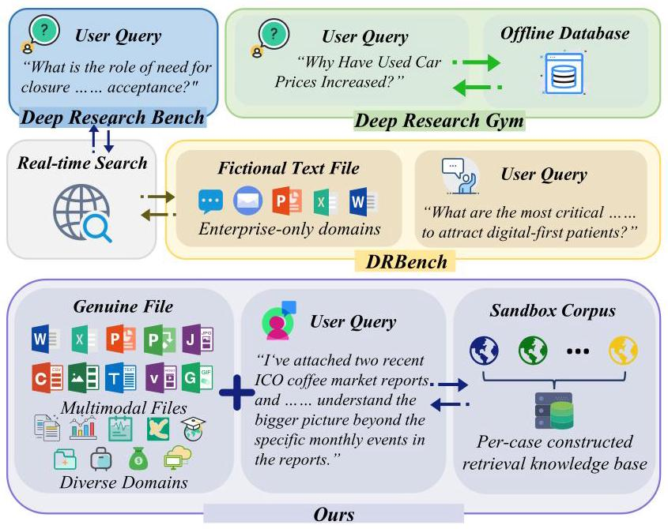

Figure 1: Comparison of deep research benchmarks. Given raw text queries, Deep Research Bench executes text queries via real-time search, and DeepResearchGym retrieves from a global offline database. DRBench incorporates user files (text modality) as input but relies on real-time search and focuses on the enterprise domain. In contrast, our DR3-Eval processes both queries and files within a controlled sandbox corpus on diverse domains.

Moreover, to demonstrate the utility of \( {\mathrm{{DR}}}^{3} \) -Eval, we have developed \( {\mathbf{{DR}}}^{3} \) -Agent, a multi-agent research system adapted to the benchmark's closed-world setting, which can also take text user queries and corresponding user files (including text, image, video, audio, etc.) as input. Extensive experiments across state-of-the-art language models reveal that DR \( {}^{3} \) -Eval is highly challenging and exposes failure modes that are obscured by existing benchmarks.

Overall, the contributions of our work are as follows:

- We propose DR3-Eval, a realistic, reproducible, and multimodal benchmark for evaluating deep research agents for the report generation setting.

- We introduce a controlled sandbox-based task construction pipeline that balances real-world complexity with verifiable evaluation.

- We provide comprehensive experimental analysis and diagnostics that offer new insights into the strengths and limitations of current LLMs as DRAs.

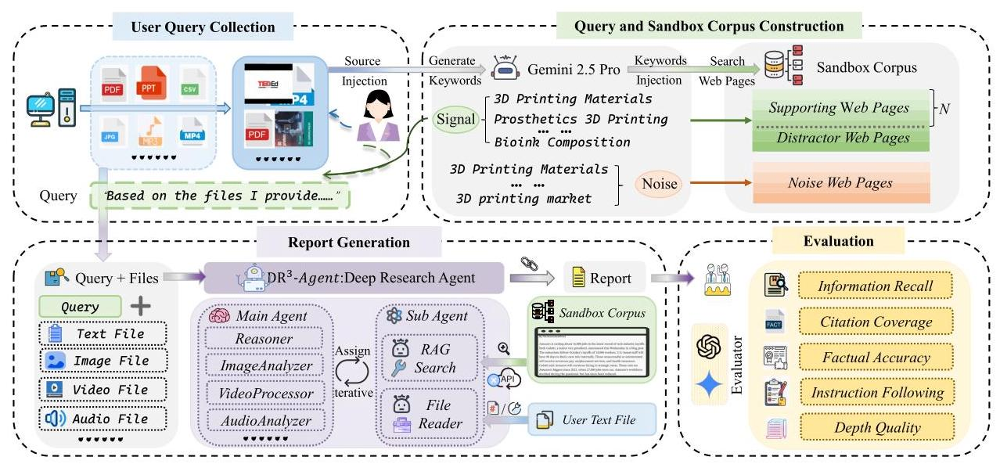

Figure 2: Overview of the DR \( {}^{3} \) -Eval framework. (1) Data construction synthesizes search paths from real-world multimodal files via a divergent-convergent mechanism, establishing a static sandbox with controlled signal-to-noise ratios and backward-derived queries. (2) Our DR3-Agent adopts a hierarchical multi-agent architecture where a perception-enhanced Main Agent coordinates global reasoning while specialized sub-agents execute iterative sandbox retrieval and file parsing. (3) Evaluation protocol utilizes a multidimensional metric suite to comprehensively assess performance in both evidence acquisition and analytical report generation.

Table 1: Comparison of our benchmarks with representative benchmarks. Columns report task type, covered domains, whether user files and sandbox corpus are supported, whether files are multimodal and in real-world scenarios, whether multiple files can be uploaded, and whether reverse construction is supported. Unlike prior work, \( {\mathrm{{DR}}}^{3} \) -Eval combines user files and sandbox corpus, proposes a realistic, reproducible and multimodal benchmark for evaluating deep research agents in report-generation settings.

<table><tr><td>Benchmark</td><td>Task type</td><td>Domain</td><td>User Files</td><td>Sandbox Corpus</td><td>Multi-modal</td><td>Real Scenario</td><td>Multi-File</td><td>Reverse Construction</td></tr><tr><td>GAIA (Mialon et al., 2023)</td><td>QA</td><td>General</td><td>✓</td><td>✘</td><td>✓</td><td>✓</td><td>✘</td><td>✘</td></tr><tr><td>HLE (Phan et al., 2025)</td><td>QA</td><td>General</td><td>✓</td><td>✘</td><td>✓</td><td>✘</td><td>✓</td><td>✘</td></tr><tr><td>BrowseComp-Plus (Chen et al., 2025)</td><td>OA</td><td>General</td><td>✘</td><td>✓</td><td>✘</td><td>✓</td><td>✘</td><td>✓</td></tr><tr><td>DocBench (Zou et al., 2024)</td><td>OA</td><td>General</td><td>✓</td><td>✘</td><td>✓</td><td>✓</td><td>✘</td><td>✘</td></tr><tr><td>MMLongBench-Doc (Ma et al., 2024)</td><td>OA</td><td>General</td><td>✓</td><td>✘</td><td>✓</td><td>✘</td><td>✘</td><td>✘</td></tr><tr><td>DRBench (Abaskohi et al., 2025)</td><td>Report</td><td>Enterprise</td><td>✓</td><td>✓</td><td>✘</td><td>✓</td><td>✓</td><td>✓</td></tr><tr><td>Deep Research Bench (Du et al., 2025)</td><td>Report</td><td>General</td><td>✘</td><td>✘</td><td>✘</td><td>✓</td><td>✘</td><td>✘</td></tr><tr><td>Deep Scholar Bench (Patel et al., 2025)</td><td>Report</td><td>Academic</td><td>✘</td><td>✘</td><td>✘</td><td>✓</td><td>✘</td><td>✘</td></tr><tr><td>DEER (Han et al., 2026)</td><td>Report</td><td>General</td><td>✘</td><td>✘</td><td>✘</td><td>✘</td><td>✘</td><td>✘</td></tr><tr><td>LiveResearch Bench (Wang et al., 2025)</td><td>Report</td><td>General</td><td>✘</td><td>✘</td><td>✘</td><td>✓</td><td>✘</td><td>✘</td></tr><tr><td>DeepResearchGym (Coelho et al., 2025)</td><td>Report</td><td>General</td><td>✘</td><td>✓</td><td>✘</td><td>✓</td><td>✘</td><td>✘</td></tr><tr><td>DR3-Eval (Ours)</td><td>Report</td><td>General</td><td>✓</td><td>✓</td><td>✓</td><td>✓</td><td>✓</td><td>✓</td></tr></table>

## 2 Related Work

### 2.1 Deep Research Agent

Deep Research Agents (DRAs) are specialized systems designed for complex, multi-stage research tasks. Their capabilities have evolved beyond the traditional question-answering paradigm (Chen et al., 2026) to autonomously planning long-horizon workflows, navigating heterogeneous web sources, and ultimately synthesizing information into structured, citation-grounded, expert-level reports (OpenAI, 2025; Google, 2025; Team, 2025; AI, 2024; xAI Team, 2024; ByteDance, 2026). Currently, mainstream deep research systems have demonstrated powerful capabilities in handling complex research tasks, but they are mostly available as closed-source commercial products; open-source efforts, in contrast, emphasize modularity and reproducibility (Li et al., 2025; Yang et al., 2025; Qiao et al., 2025; MiroMindAI, 2025). Nonetheless, a fundamental challenge remains: the reliance on live web environments for evaluation introduces uncontrollable temporal volatility.

### 2.2 Deep Research Benchmark

The rapid development of Deep Research Systems has spurred the creation of numerous benchmarks designed to evaluate their diverse capabilities (Xu and Peng, 2025). Early efforts primarily addressed general reasoning and tool-use in QA scenarios (Mialon et al., 2023; Phan et al., 2025), which have recently evolved into complex information-seeking tasks in open-web environments (Wei et al., 2025). However, a fundamental tension exists between reproducibility and realism in current evaluation environments. Benchmarks relying on live web access (Wang et al., 2026; Han et al., 2025) provide high ecological validity but suffer from temporal volatility, where fluctuating search results make performance comparisons inconsistent over time. Conversely, existing sandbox-based or local-corpus benchmarks (Coelho et al., 2025; Chen et al., 2025) ensure stability but often simplify the research context to "clean" and text-only data. They largely omit the multimodal complexity (Ma et al., 2024; Zou et al., 2024) and the confounding noise (outdated or biased information) inherent in authentic research. Furthermore, as tasks shift from single-answer to report generation (Li et al., 2026; Huang et al., 2026), traditional metrics have proven inadequate. This has necessitated the adoption of LLM-as-a-judge frameworks (Liu et al., 2023; Zheng et al., 2023; Kim et al., 2023; Zhu et al., 2023; Zou et al., 2024) to provide fine-grained, human-aligned assessments. Despite these advancements, there remains a gap for a benchmark that provides multimodal grounding, a noise-intensive yet static sandbox, and a verifiable solution path. In Table 1, DR3-Eval aims to address the above limitations by reconciling real-world research complexity with a rigorous, reproducible evaluation protocol.

### 2.3 Data Construction

Our dataset construction process involves five stages, designed to systematically create a benchmark for deep research that is grounded in real-world needs, features a controllable process, and enables precise evaluation. Detailed prompts are provided in Appendix H.

Stage 1: Grounding in Real-World Needs. Real-world research often requires synthesizing information across diverse data formats. To emulate this process, we recruited a group of paid volunteers, primarily comprising undergraduate and graduate students from various academic disciplines to ensure the breadth of our collected materials. They were tasked with providing intrinsically relevant material sets, whose compositions are inherently multimodal, encompassing text, structured data, static visuals, and dynamic media. This process yielded 100 such document sets, evenly divided into 50 English and 50 Chinese sets. The topics cover three major domains-Technology, Economy, and Humanities-further broken down into 13 representative sub-fields, such as Computer Science, Healthcare, Finance, and Education. All collected materials then underwent a rigorous two-stage sanitization protocol: an automated script first identified and redacted personally identifiable information (PII), followed by a manual cross-validation by a separate group of annotators to ensure the complete anonymization of all personal, commercial, or proprietary data.

Stage 2: Distilling Search Paths. Inspired by the strategy of generating distracting information via query expansion in BrowseComp-Plus (Chen et al., 2025), we designed a two-stage "divergent-convergent" process (Design Council, 2005; Yao et al., 2023a) to generate search keywords. The core of this design is to first broadly explore various aspects of a topic, and then precisely construct a solution path and its accompanying distractors from that exploration. First, in the divergent stage, we leverage Gemini-2.5-Pro to perform an open-ended analysis of the source file, generating an initial set of 10 candidate keywords. The goal of this stage is to produce keywords that are conceptually diverse to cover different facets of the topic, thereby simulating a wide-ranging "brainstorming" session. Subsequently, in the convergent stage, the model evaluates this initial set and divides it into two categories: (1) Signal Keywords: which collectively point toward the core solution path; and (2) Noise Keywords: which are thematically related but designed to lead to irrelevant or misleading information. Through this "divergent-convergent" process, we expand the evaluation challenge from simple information retrieval to the earlier and more advanced cognitive skills of query strategy formulation and path planning.

Stage 3: Building Research Sandbox. To ensure the reproducibility of our evaluation and avoid potential cross-task interference, we construct a fully independent, static sandbox corpus for each task. The process begins by using the keywords from the previous stage to retrieve up to 100 web results for each keyword. After deduplicating all returned URLs, we employ a unified crawling and cleaning pipeline that filters out failed or erroneous pages and removes template elements such as navigation bars and ads. Previously, benchmarks for web pages only distinguished between "relevant" and "irrelevant". However, the challenge of deep research does not come from random noise alone, but from distinguishing genuinely useful evidence from seemingly relevant yet misleading information. Therefore, we categorize all processed documents into three types, expanding upon the classification of retrieval quality proposed in CRAG (Yang et al., 2024; Yoran et al., 2023): (1) Supportive Web Pages: high-relevance results from signal keywords, whose content is manually verified to provide necessary and sufficient evidence to answer the query; (2) Distractor Web Pages: also from signal keywords, but their content is confirmed to be outdated, one-sided, or inaccurate; (3) Noise Web Pages: results from noise keywords, used to systematically create evaluation environments with varying signal-to-noise ratios. The distribution is detailed in AppendixB. To simulate the "long-tail effect" of information quality in real-world deep research, we design a fine-grained difficulty scaling strategy to construct evaluation settings with five different context lengths: 32k, 64k, 128k, 256k, and 512k tokens. To ensure the completeness and accessibility of the core solution path, all settings include the complete set of supportive web pages. Additionally, the number of distractor web pages increases proportionally with the total context length, and the remaining token quota is filled with noise web pages to reach the target length. During construction, these three categories of web pages are shuffled and randomly mixed.

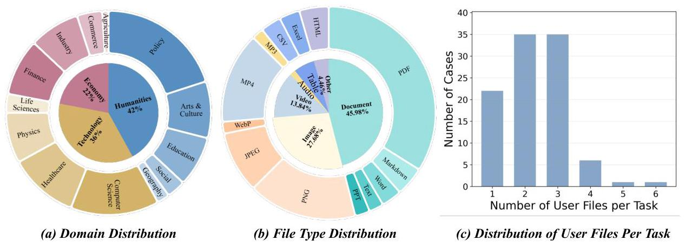

Figure 3: Dataset statistics. (a) Domain coverage spanning Technology, Economy, and Humanities, comprising 13 atomic sub-domains. (b) Distribution of file types. (c) Distribution of user files per task.

Stage 4: Constructing Query. In report generation tasks, the open-ended nature of queries poses a significant challenge to objective, automated evaluation. Therefore, inspired by the backward design approach used in works like BrowseComp (Wei et al., 2025) for building QA benchmarks, we adopt an evidence-based, reverse construction method: we synthesize the final query based on the pre-determined evidential documents, integrated with the signal keywords. This approach ensures that each query not only has a definitive, verifiable answer fully grounded in the sandbox, but also requires joint reasoning over the user files and specific web evidence, rather than being solvable through a single-step public search.

Stage 5: Quality Control. We enforce a four-dimensional validation protocol to guarantee the rigorousness of candidate queries: (1) Implicit Guidance: queries must guide agents toward signal keywords without verbatim disclosure, preventing direct information leakage. (2) Synthesis Necessity: a "leave-one-out" verification is employed to ensure that the final answer is strictly contingent on combining the initial user files with specific web evidence; candidate tasks are discarded if their core conclusion can be directly obtained through single-step public search. (3) Insight Novelty: queries are disqualified if the core factual claims of the golden insight are directly retrievable from public search engines, thereby blocking shortcut solutions and preserving the need for cross-source reasoning. (4) Interpretative Unambiguity: each query undergoes manual inspection to eliminate ambiguity and guarantee a singular, precise interpretation.

We further summarize this filtering process as a QC funnel. Starting from 280 candidate tasks collected from volunteers, 105 were discarded during the leave-one-out validation stage due to multiple plausible interpretations or the inability to derive a unique solution path within the sandbox, and another 75 were filtered out because their factual difficulty was insufficient. The final benchmark therefore contains 100 tasks, corresponding to a pass rate of 35.7%, yielding a high-purity and low-ambiguity task set.

### 2.4 Dataset Statistics

Through rigorous manual curation, \( {\mathrm{{DR}}}^{3} \) -Eval comprises 100 independent tasks with an even split between English and Chinese samples. As shown in Figure 3(a), the tasks cover technology, economy, and humanities, subdivided into 13 atomic domains such as computer science, healthcare, and policy. Regarding input modalities, Figure 3(b) presents a distribution of 45.98% documents, 27.68% images, and 13.84% videos, alongside data sheets, audio, and HTML files, with specific format breakdowns detailed in Appendix A. These inputs involve significant data scale, with 68% of tasks being multi-modal, where PDFs average 11.21 pages, Excel spreadsheets contain 215.14 rows, and videos last 3 minutes and 27 seconds. Figure 3(c) further plots the file density per task, which averages 2.24 user files and reaches a maximum of 6. Complementing these internal user resources to establish a realistic evaluation environment, the sandbox corpus introduces massive external noise, containing an average of 465.5 web pages per task under the 512k token configuration.

## 3 DR3-Agent

### 3.1 Framework Construction

To address the deep research tasks of DR \( {}^{3} \) -Eval involving User Files and a Sandbox Corpus, we develop DR3-Agent, an LLM-driven system based on the MiroFlow framework (Team et al., 2025). It is worth emphasizing that current open-source deep research frameworks (e.g., DeerFlow (ByteDance, 2025), Qwen-DeepResearch (DeepResearch Team, Tongyi Lab, 2025), and Camel-workforce (CAMEL-AI, 2026)) typically cannot directly handle the offline closed sandbox environment and the cross-reading of multimodal files tasks proposed in DR3-Eval. Therefore, as illustrated in Figure 2, we integrate perception tools directly into the main agent to effectively handle multimodal user files such as audio and video. This design enables it to synthesize video and audio content within the global context, rather than treating them as isolated extraction tasks. Supported by these perception capabilities and a built-in Python execution environment, the main agent serves as the system's reasoning hub. It maintains the global task context and runs a dynamic "Plan-Act-Observe" loop to formulate action plans and coordinate sub-agents for specific information acquisition tasks.

At the information acquisition level, to mitigate the main agent's context burden, the system employs two dedicated sub-agents powered by the same underlying LLM. While sharing the model backbone, these sub-agents do not share the global state and return only highly condensed summaries to the main agent. Specifically, the RAG search sub-agent interacts with the static sandbox corpus. We replace the original open web search with an iterative dense retrieval mechanism based on text-embedding-3-small, employing the ReAct (Yao et al., 2023b) paradigm within a controlled environment to refine queries and perform multiple, continuous iterative retrievals within the sandbox corpus. Unlike conventional RAG systems, which typically rely on a separate retriever to fetch top- \( k \) chunks from a static knowledge base, our RAG sub-agent performs autonomous multi-step retrieval with iterative query refinement. This requires the agent to evaluate incomplete or conflicting evidence and revise its search direction across iterations, making the search process functionally analogous to heuristic exploration over hyperlink graphs. Meanwhile, the file reader sub-agent specializes in parsing long-text user files, utilizing tools to execute fine-grained keyword queries and retrieve content by page numbers.

### 3.2 Evaluation Metrics

DR \( {}^{3} \) -Eval comprises five complementary metrics, categorized into two dimensions: Information Seeking, which assesses the quality of gathered evidence, and Report Generation, which evaluates the final output quality. Among these, for the four metrics requiring semantic assessment, we utilize \( \Phi \) (GPT-5.1) as the evaluator, with specific prompts detailed in Appendix J.

#### 3.2.1 Information Seeking

Information Recall (IR) We employ Gemini-2.5-Flash to extract insight sets \( {\mathcal{I}}_{\mathrm{{UF}}} \) and \( {\mathcal{I}}_{\mathrm{{SC}}} \) (Pradeep et al., 2025; Lajewska and Balog, 2025) from user files and the sandbox corpus, respectively, using prompts detailed in Appendix I.1 and I.2. All extracted insights are manually verified to ensure accuracy. Subsequently, we use the evaluator model \( \Phi \) to assess the report \( {R}^{\prime } \) s coverage of each insight \( i \) , assigning a score \( \operatorname{cov}\left( {i, R}\right)  \in  \{ 1,{0.5},0\} \) . IR calculates the ratio of strictly fully covered insights (Patel et al.,2025).

\[
{\operatorname{IR}}_{\mathrm{{UF}}}\left( {R,{\mathcal{I}}_{\mathrm{{UF}}}}\right)  = \frac{1}{\left| {\mathcal{I}}_{\mathrm{{UF}}}\right| }\mathop{\sum }\limits_{{i \in  {\mathcal{I}}_{\mathrm{{UF}}}}}\mathbb{1}\left\lbrack  {\operatorname{cov}\left( {i, R}\right)  = 1}\right\rbrack \tag{1}
\]

\[
{\operatorname{IR}}_{\mathrm{{SC}}}\left( {R,{\mathcal{I}}_{\mathrm{{SC}}}}\right)  = \frac{1}{\left| {\mathcal{I}}_{\mathrm{{SC}}}\right| }\mathop{\sum }\limits_{{i \in  {\mathcal{I}}_{\mathrm{{SC}}}}}\mathbb{1}\left\lbrack  {\operatorname{cov}\left( {i, R}\right)  = 1}\right\rbrack \tag{2}
\]

Citation Coverage (CC) Inspired by the irreplaceable literature metric from DeepScholar-Bench (Patel et al.,2025), we establish the ground truth set \( {\mathcal{D}}_{\text{ req }} \) , comprising user files and supportive web pages strictly necessary for the query. Strongly tied to our overall reverse construction process, this metric evaluates the macroscopic "information gathering recall," thereby reflecting the model's research-oriented retrieval ability. Let \( {\mathcal{D}}_{\text{ cited }} \) denote the documents explicitly cited in \( R \) . The coverage is defined as:

\[
\mathrm{{CC}}\left( {R,{\mathcal{D}}_{\text{ req }}}\right)  = \frac{\left| {\mathcal{D}}_{\text{ req }} \cap  {\mathcal{D}}_{\text{ cited }}\right| }{\left| {\mathcal{D}}_{\text{ req }}\right| } \tag{3}
\]

#### 3.2.2 Report Generation

Factual Accuracy (FA) We extract the set of all claim-source pairs \( \mathcal{C} \) from the generated report \( R \) . To ensure robust verification across modalities, we employ \( \Phi \) to evaluate textual claims, while utilizing Gemini-2.5-Pro to verify claims grounded in video or audio content. The source \( s \) originates from either the user files or the sandbox corpus. For each pair \( \left( {c, s}\right)  \in  \mathcal{C} \) , we define an entailment function \( \mathbb{V}\left( {c, s}\right) \) that equals 1 if \( s \) supports \( c \) , and 0 otherwise:

\[
\mathrm{{FA}}\left( R\right)  = \frac{1}{\left| \mathcal{C}\right| }\mathop{\sum }\limits_{{\left( {c, s}\right)  \in  \mathcal{C}}}\mathbb{V}\left( {c, s}\right) \tag{4}
\]

Instruction Following (IF) We utilize \( \Phi \) to generate a checklist \( \mathcal{L} \) based on the task query (prompt in Appendix I.3), covering aspects such as content, evidence, and analysis (Sharma et al., 2025; Wang et al., 2025). All checklists are manually verified. We then evaluate whether \( R \) satisfies each requirement \( l \in  \mathcal{L} \) , indicated by a binary satisfaction score \( \mathbb{S}\left( {l, R}\right)  \in  \{ 1,0\} \) :

\[
\operatorname{IF}\left( {R,\mathcal{L}}\right)  = \frac{1}{\left| \mathcal{L}\right| }\mathop{\sum }\limits_{{l \in  \mathcal{L}}}\mathfrak{S}\left( {l, R}\right) \tag{5}
\]

Depth Quality (DQ) We employ the model \( \Phi \) as an expert judge to evaluate the analytical substance and logical rigor of \( R \) . The quality score is assigned conditioned on the query \( Q \) and a predefined rubric \( \mathcal{P} \) :

\[
\mathrm{{DQ}}\left( {R, Q}\right)  = \Phi \left( {R, Q \mid  \mathcal{P}}\right) \tag{6}
\]

A sample report generated by \( {\mathrm{{DR}}}^{3} \) -Agent is provided in Appendix E, with its evaluation details in Appendix F.

## 4 Experiments

### 4.1 Experimental Settings

For DR3-Agent, the maximum interaction turns for the main agent is set to 10, while the sub-agents for RAG and file reading are limited to 5 and 3 turns, respectively. We utilize OpenAI's text-embedding-3- small for vectorization. For baselines, we evaluate GPT-4.1 (OpenAI, a), Claude Sonnet 4 (Anthropic), Gemini 2.5 Pro (Google DeepMind), Qwen3-235B-A22B (Tongyi Lab, a), Qwen3-30B-A3B (Tongyi Lab, b), Qwen3-32B (Tongyi Lab, c), GLM-4.6 (Zhipu AI, a) and GLM-4.7 (Zhipu AI, b). In the evaluation phase, for text modality, we introduce GPT-5.1 (OpenAI, b) as the judge model, and for multimodal contents (e.g., audio and video), we use Gemini-2.5-Pro as an assistant judge. To ensure the evaluation is deterministic, the temperature for all judge models is set to 0. Additional runtime and API cost statistics are provided in Appendix G.

### 4.2 Main Results

In Table 2 and Figure 4, we provide the results of different models, and have the following observations: (1) DR3-Eval is very challenging. Claude Sonnet 4 achieves the best results. Besides, within the same model family (i.e., Qwen), the scaling law is still a key factor in complex tasks. (2) Longer contexts lead to lower performance. As the size of the sandbox corpus grows from 64k to 512k, a general drop in performance is seen across all models. We suppose that the longer contexts result in noisier and more irrelevant contexts, which make it more difficult to obtain valuable insights. (3) Better instruction following does not indicate higher factual accuracy. For example, some models (e.g., Qwen3-235B-A22B and GPT-4.1) achieve relatively good results in Instruction Following(IF), but obtain very low factual accuracies. This suggests these models cannot accurately obtain sufficient information from the given materials: they tend to create a report that "looks" complete and satisfies the query, at the high cost of Factual Accuracy (FA).

Table 2: Evaluation results on \( {\mathrm{{DR}}}^{3} \) -Agent. The best and second-best performances are highlighted in bold and underlined, respectively. Key: IR \( {}_{UF}/\mathrm{{IR}}{}_{SC} = \) Information Recall from user files/sandbox corpus; CC = Citation Coverage; FA = Factual Accuracy; IF = Instruction Following; DQ = Depth Quality; Avg. = Average.

<table><tr><td rowspan="3">Models</td><td colspan="9">Information Seeking</td><td colspan="9">Report Generation</td><td colspan="3">Total Score</td></tr><tr><td colspan="3">IR \( {}_{UF} \)</td><td colspan="3">\( {\mathrm{{IR}}}_{SC} \)</td><td colspan="3">CC</td><td colspan="3">FA</td><td colspan="3">IF</td><td colspan="3">DQ</td><td colspan="3">Avg.</td></tr><tr><td>64k</td><td>128k</td><td>512k</td><td>64k</td><td>128k</td><td>512k</td><td>64k</td><td>128k</td><td>512k</td><td>64k</td><td>128k</td><td>512k</td><td>64k</td><td>128k</td><td>512k</td><td>64k</td><td>128k</td><td>512k</td><td>64k</td><td>128k</td><td>512k</td></tr><tr><td>Claude Sonnet 4</td><td>58.8</td><td>60.4</td><td>60.8</td><td>55.3</td><td>46.6</td><td>41.8</td><td>64.7</td><td>54.8</td><td>48.5</td><td>87.0</td><td>82.7</td><td>82.1</td><td>87.4</td><td>89.2</td><td>88.5</td><td>70.7</td><td>71.5</td><td>72.0</td><td>70.7</td><td>67.5</td><td>65.6</td></tr><tr><td>GLM-4.7</td><td>55.7</td><td>55.0</td><td>57.1</td><td>53.1</td><td>47.6</td><td>42.1</td><td>65.4</td><td>55.9</td><td>45.3</td><td>84.5</td><td>82.1</td><td>80.3</td><td>88.8</td><td>89.3</td><td>88.1</td><td>71.1</td><td>71.8</td><td>72.1</td><td>69.8</td><td>66.9</td><td>64.1</td></tr><tr><td>GLM-4.6</td><td>53.4</td><td>52.6</td><td>50.3</td><td>49.5</td><td>43.9</td><td>39.8</td><td>58.2</td><td>52.0</td><td>44.0</td><td>84.0</td><td>82.3</td><td>82.9</td><td>85.6</td><td>87.2</td><td>86.4</td><td>70.1</td><td>69.3</td><td>70.6</td><td>66.8</td><td>64.5</td><td>62.3</td></tr><tr><td>Gemini-2.5-Pro</td><td>43.9</td><td>45.7</td><td>42.9</td><td>37.7</td><td>35.1</td><td>30.8</td><td>54.3</td><td>49.5</td><td>36.6</td><td>81.3</td><td>80.7</td><td>80.0</td><td>84.9</td><td>84.5</td><td>84.5</td><td>67.1</td><td>68.3</td><td>67.4</td><td>61.5</td><td>60.6</td><td>57.0</td></tr><tr><td>GPT-4.1</td><td>40.7</td><td>42.5</td><td>41.3</td><td>30.9</td><td>29.4</td><td>29.2</td><td>37.2</td><td>35.6</td><td>30.0</td><td>56.4</td><td>54.2</td><td>58.8</td><td>83.0</td><td>83.3</td><td>82.7</td><td>63.1</td><td>63.2</td><td>63.4</td><td>51.9</td><td>51.3</td><td>50.9</td></tr><tr><td>Qwen3-235B-A22B</td><td>37.4</td><td>36.0</td><td>39.7</td><td>35.7</td><td>29.8</td><td>28.8</td><td>40.6</td><td>36.6</td><td>31.8</td><td>52.5</td><td>53.6</td><td>49.8</td><td>78.0</td><td>78.6</td><td>80.2</td><td>62.1</td><td>62.8</td><td>61.9</td><td>51.1</td><td>49.6</td><td>48.7</td></tr><tr><td>Owen3-32B</td><td>33.2</td><td>36.6</td><td>35.4</td><td>26.5</td><td>25.3</td><td>24.7</td><td>34.2</td><td>32.3</td><td>26.1</td><td>49.4</td><td>52.2</td><td>51.5</td><td>73.5</td><td>74.2</td><td>74.3</td><td>58.8</td><td>59.9</td><td>59.3</td><td>45.9</td><td>46.7</td><td>45.2</td></tr><tr><td>Owen3-30B-A3B</td><td>30.9</td><td>38.2</td><td>34.1</td><td>23.2</td><td>25.7</td><td>23.5</td><td>26.6</td><td>25.3</td><td>21.5</td><td>41.9</td><td>46.8</td><td>45.2</td><td>73.2</td><td>71.8</td><td>74.7</td><td>57.6</td><td>58.2</td><td>58.0</td><td>42.2</td><td>44.3</td><td>42.8</td></tr></table>

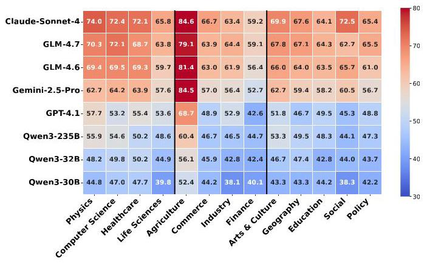

Figure 4: Performance of different LLMs across different domains.

(4) Performance varies a lot across different domains and different models. In Figure 4, we observe that results from several domains (e.g., GLM 4.7 achieves the best on "Industry" domains while Claude Sonnet 4 achieves the best on "Physics").

### 4.3 Further Analysis

Evaluation stability and significance. A 10,000-iteration bootstrap analysis shows no overlap in the 95% confidence intervals between the top two models, with a Wilcoxon test \( \left( {p = {0.0046}}\right) \) confirming a significant difference in their scores. Furthermore, the total score variance across repeated evaluations is only 0.874, and the Kendall’s \( \tau \) and Spearman’s \( \rho \) for model rankings under resampling reach 0.969 and 0.991, respectively. Taking Claude Sonnet 4, GLM-4.7, and GLM-4.6 as examples, the standard deviations across three repeated runs for each model remain exceptionally low at 0.83, 0.85, and 1.33, respectively.

Analysis on the correlation between sandbox corpus and real-world web corpus. To further verify whether the sandbox corpus can approximate information acquisition in real-world web environments, we conduct experiments with real-time web search on an English subset using Qwen3-235B and Gemini-2.5-Pro. As shown in Table 3, the overall performance remains close across the two settings, with particularly high consistency in Citation Coverage. This indicates that the core evidence chains ultimately relied upon by the models in the live web setting highly overlap with the supportive documents predefined in the sandbox. Overall, no obvious systematic bias is observed between the local sandbox and real-time web search, suggesting that the sandbox preserves the main information difficulty that determines task performance and can serve as a reliable substitute for web retrieval.

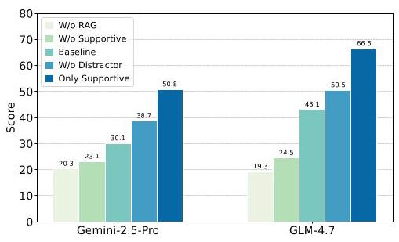

Figure 5: Analysis on the effectiveness of sandbox corpus.

Analysis on the performance of different sizes of sandbox corpus. We conduct evaluations on five sandbox corpora (i.e., 32k, 64k, 128k, 256k, and 512k tokens). As shown in Figure 6, as the size of the sandbox corpus increases, the overall performance (Avg.), \( {\mathrm{{IR}}}_{SC} \) and CC of all models shows a clear downward trend. This shows that the models not only find it hard to locate relevant evidence chunks, but also find

Table 3: Analysis on the correlation between sandbox corpus and real-world web corpus.

<table><tr><td rowspan="2">Metric</td><td colspan="3">Qwen3-235B-A22B</td><td colspan="3">Gemini-2.5-Pro</td></tr><tr><td>Baseline</td><td>w/ Web</td><td>Change \( \left( \Delta \right) \)</td><td>Baseline</td><td>w/ Web</td><td>Change \( \left( \Delta \right) \)</td></tr><tr><td>IRSC</td><td>33.2</td><td>38.5</td><td>(+5.3)</td><td>40.4</td><td>41.9</td><td>(+1.5)</td></tr><tr><td>IRuff</td><td>23.9</td><td>20.2</td><td>(-3.7)</td><td>27.4</td><td>25.4</td><td>(-2.0)</td></tr><tr><td>CC</td><td>36.3</td><td>28.0</td><td>(-8.3)</td><td>50.4</td><td>49.0</td><td>(-1.4)</td></tr><tr><td>FA</td><td>59.0</td><td>60.3</td><td>(+1.3)</td><td>76.3</td><td>75.9</td><td>(-0.4)</td></tr><tr><td>IF</td><td>73.6</td><td>79.2</td><td>(+5.6)</td><td>80.1</td><td>84.1</td><td>(+4.0)</td></tr><tr><td>DQ</td><td>63.8</td><td>62.0</td><td>(-1.8)</td><td>67.8</td><td>70.4</td><td>(+2.6)</td></tr><tr><td>Agg.</td><td>48.3</td><td>48.0</td><td>(-0.3)</td><td>57.1</td><td>57.8</td><td>(+0.7)</td></tr></table>

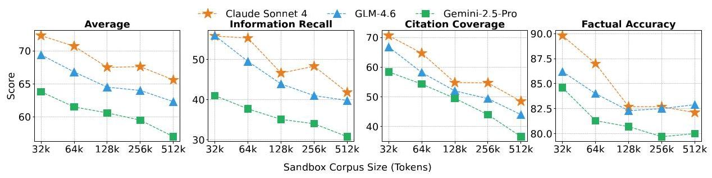

Figure 6: Analysis on the performance of different sizes of sandbox corpus.

it harder to identify effective answers among the increasing noise and distracting information. However, FA metric shows relative stability. We believe this mainly measures the model's ability to reason correctly after obtaining the relevant information, which is closer to its inherent performance. But as the size of sandbox corpora grows, the retrieved text snippets may contain more noise or fail to contain the correct answer due to retrieval failure (i.e., a low \( {\mathrm{{IR}}}_{SC} \) score), which result in lower scores.

Comparison of framework architectures. To further validate the effectiveness of our framework, we conduct a comparative experiment with DeerFlow on a subset. Considering that DeerFlow's native retrieval mechanism cannot directly process DR3-Eval, we transplant the Agentic RAG component from \( {\mathrm{{DR}}}^{3} \) -Agent to ensure a fair evaluation.

As shown in Fig 7, equipped with the same component, both frameworks exhibit converging capabilities in basic information acquisition when processing standard continuous long texts. However, \( {\mathrm{{DR}}}^{3} \) -Agent demonstrates distinct architectural advantages when tackling complex deep research tasks. Information within user files is typically more fragmented than in standard documents, while DR3-Agent can more stably integrate these discrete pieces of evidence. Besides, DR3-Agent consistently adheres to task instructions even under information overload.

Analysis on the effectiveness of sandbox corpus. To verify the reasonableness of our sandbox corpus design, we systematically analyze the impact of different document components on model performance using a sample of 20 tasks. The experiments are mainly based on the 128k-sized corpus (except for the only supportive setting). In Figure 5, after removing the distractor web pages, the performance of all models improved significantly. This shows that our distractor documents effectively increased the task difficulty. Furthermore, we observe that the agent's performance is nearly identical when the sandbox corpus is provided without supportive documents compared to when no corpus is provided at all. This demonstrates that, apart from the designated supportive documents, our sandbox corpus contains no other effective information that the agent can exploit to complete the task. When only supportive web pages are present in the sandbox corpus, it establishes the model's performance upper bound under perfect information retrieval.

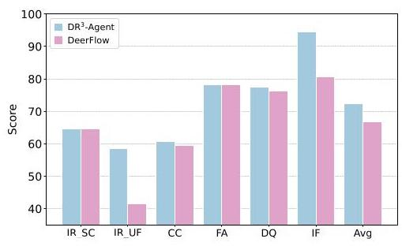

Figure 7: Comparison of framework architectures.

Analysis on the correlation between LLM-as-judge and human evaluation. To validate the alignment between \( {\mathrm{{DR}}}^{3} \) - Eval and human judgment, we conducted a correlation study on 50 reports randomly sampled across all domains, which were independently reviewed by four experts. Consistency was measured using Pearson and Spearman correlation coefficients (Han et al., 2026) alongside pairwise agreement (Du et al., 2025), with calculation details provided in Appendix D. As shown in Table 4, our automated scoring exhibits strong concurrence with expert evaluations. Furthermore, we evaluated the consistency between our automated claim extraction for factual accuracy and human annotations, achieving a Precision of 0.924 and a Recall of 0.960. Table 5: Effectiveness of different retrievers.

Table 4: LLM-as-judge vs. human evaluation.

<table><tr><td>Method</td><td>\( r \)</td><td>\( \rho \)</td><td>Agr.</td></tr><tr><td>DR3-Eval (Ours)</td><td>0.78</td><td>0.73</td><td>0.89</td></tr><tr><td>Inter-Human</td><td>0.83</td><td>0.76</td><td>0.91</td></tr></table>

Analysis on the effectiveness of different judge LLMs. To verify the reliability of different judge models, we select Claude Sonnet 4, Gemini-2.5- Pro, and Qwen-Max as alternatives to GPT-5.1 to re-rank and evaluate six specific models. Compared against the rankings from GPT-5.1, the rankings derived from their scores are almost identical, with a mean Spearman's \( \rho \) of 0.924 . Details are shown in Appendix C. We believe this slight fluctuation in ranking is mainly due to the "model bias" phenomenon, where judge models tend to give higher scores to models from their own series. Regarding the multimodal assistant judge LLM, Gemini-2.5-Pro, we replace it with Qwen3-VL-Plus and Kimi-k2, yielding a mean Spearman’s \( \rho \) of 0.864 . The impact on the final scores is not significant, with an average difference of less than 2 points \( \left( {p > {0.05}}\right) \) , demonstrating that the scoring is highly robust.

<table><tr><td>Model</td><td>OpenAI-Emb</td><td>Qwen-Emb</td><td>BM25</td></tr><tr><td>GLM-4.7</td><td>56.58</td><td>53.61</td><td>50.71</td></tr><tr><td>GPT-4.1</td><td>36.15</td><td>35.64</td><td>22.60</td></tr><tr><td>Gemini-2.5-Pro</td><td>49.51</td><td>37.16</td><td>31.25</td></tr></table>

Effect of maximum iteration turns in Agentic-RAG. We conduct an ablation study on the maximum iteration turns of RAG. Considering that our RAG sub-agent employs a ReAct-based Agentic-RAG rather than a traditional single-shot Top-K retrieval, we set the maximum iteration turns to 1, 3, 5, and 7. Shown in Table 6, as the allowed iteration turns increase, the overall performance of different models exhibits a clear upward trend, particularly in IR and CC. However, we observe that once the iteration turns increase to a certain extent, the model's performance not only peaks but even experiences a slight decline.

Analysis on the effectiveness of different retrievers. We select three representative models and compare three different retrieval strategies on Citation Coverage (CC) using a 128k-sized corpus. By default, we use OpenAI text-embedding-3-small to build the vector database and compare its results with Qwen-text-embedding-v2 and BM25. In Table 5, the text-embedding-3-small achieves the best performance on all models, while Qwen-text-embedding-v2 performs slightly lower than it. In contrast, the traditional lexical-based method, BM25, performs significantly worse.

Table 6: Effect of different maximum RAG turns on IR and CC.

<table><tr><td rowspan="2">Turns</td><td colspan="2">Qwen3-235B-A22B</td><td colspan="2">Gemini-2.5-Pro</td></tr><tr><td>IR</td><td>CC</td><td>IR</td><td>CC</td></tr><tr><td>1</td><td>27.2</td><td>14.8</td><td>32.4</td><td>21.0</td></tr><tr><td>3</td><td>34.7</td><td>27.1</td><td>39.6</td><td>47.6</td></tr><tr><td>5</td><td>33.9</td><td>27.1</td><td>44.6</td><td>51.0</td></tr><tr><td>7</td><td>44.0</td><td>32.9</td><td>38.1</td><td>48.1</td></tr></table>

Case Study. We conduct an error attribution analysis on five selected models, based on 100 reports per model, and classify the root causes into three categories:

(1) Retrieval Error, denoting where the agent fails to locate or omits key information required to answer the question during the retrieval stage; (2) Reasoning Error, denoting where the agent, despite obtaining relevant information, makes mistakes in information integration, logical inference, or detail processing; and (3) Hallucination, denoting where the model's generated response is not based on the provided context but is instead fabricated from its parametric knowledge. In Figure 8, hallucination remains the primary cause of failure for most models. This indicates that in long-horizon research tasks, the key challenge for current models lies not only in whether they can retrieve relevant information, but also in whether they can remain grounded in external evidence when generating the final report. In contrast, the distributions of retrieval and reasoning errors vary across models: some tend to fail earlier at the evidence acquisition stage, while others still deviate from the evidence during subsequent integration and generation even after obtaining relevant information. Overall, these results suggest that the main bottleneck of current models lies in the stability of evidence utilization, rather than in evidence acquisition alone.

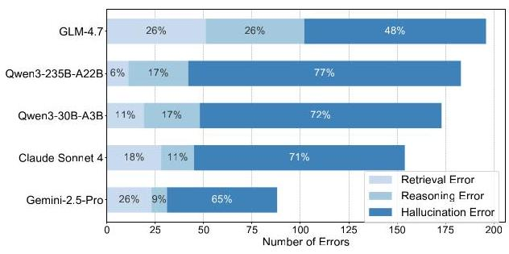

Figure 8: Error type analysis across LLMs.

## 5 Conclusion

This work introduces DR3-Eval, a benchmark designed to address key limitations in the evaluation of deep research agents. By grounding tasks in authentic user research scenarios, constructing controlled yet web-like sandbox environments, and eliminating evaluation ambiguity through reverse task construction, DR \( {}^{3} \) -Eval provides a principled testbed for assessing long-horizon research capabilities. Our experimental results show that \( {\mathrm{{DR}}}^{3} \) -Eval poses substantial challenges for state-of-the-art LLMs and reveals systematic failure modes of these LLMs.

## Impact Statements

This paper presents DR \( {}^{3} \) -Eval, a benchmark designed to advance the evaluation of Deep Research Agents. Our work has several broader impacts and ethical considerations:

Data Privacy and Human Subjects: The dataset construction involved collecting authentic files from human participants. To address ethical concerns regarding privacy, all participants were compensated for their contributions. We implemented a rigorous two-stage sanitization protocol, comprising both automated redaction and manual cross-validation, to ensure that all Personally Identifiable Information (PII) and sensitive proprietary data were completely removed before inclusion in the benchmark.

Societal Implications of Deep Research Agents: The advancement of autonomous research agents holds significant potential to increase productivity in knowledge-intensive fields. However, we acknowledge the risks associated with this technology, such as the potential for generating convincing hallucinations or the misuse of automated information gathering for malicious purposes. By introducing metrics specifically focused on Factual Accuracy and Citation Coverage, and by providing a static, reproducible sandbox environment, our work aims to steer the field towards developing safer, more reliable, and verifiable systems, rather than those that merely optimize for persuasiveness.

Environmental Impact: Furthermore, by utilizing a static sandbox corpus rather than relying on repetitive live-web crawling for every evaluation run, our framework promotes more computationally efficient and environmentally sustainable benchmarking practices.

## References

Xiaoxi Li, Jiajie Jin, Guanting Dong, Hongjin Qian, Yongkang Wu, Ji-Rong Wen, Yutao Zhu, and Zhicheng Dou. Webthinker: Empowering large reasoning models with deep research capability, 2025. URL https://arxiv.org/abs/2504.21776.

Zhaorui Yang, Bo Pan, Han Wang, Yiyao Wang, Xingyu Liu, Luoxuan Weng, Yingchaojie Feng, Haozhe Feng, Minfeng Zhu, Bo Zhang, and Wei Chen. Multimodal deepresearcher: Generating text-chart interleaved reports from scratch with agentic framework, 2025. URL https://arxiv.org/abs/2506.02454.

Samuel Schmidgall, Yusheng Su, Ze Wang, Ximeng Sun, Jialian Wu, Xiaodong Yu, Jiang Liu, Zicheng Liu, and Emad Barsoum. Agent laboratory: Using llm agents as research assistants. arXiv preprint arXiv:2501.04227, 2025.

Renjun Xu and Jingwen Peng. A comprehensive survey of deep research: Systems, methodologies, and applications, 2025. URL https://arxiv.org/abs/2506.12594.

OpenAI. Introducing deep research: A new paradigm for long-horizon reasoning, 2025. URL https: //openai.com/blog/introducing-deep-research/.

Google. Gemini deep research: Advanced information synthesis and planning, 2025. URL https: //blog.google/technology/ai/google-gemini-deep-research/.

Qwen Team. Qwen-deepresearch: Scaling reasoning for complex research tasks, 2025. URL https: //qwenlm.github.io/blog/qwen-deepresearch/.

Perplexity AI. Perplexity pro research: From search to synthesis, 2024. URL https://www.perplexity.ai/hub/blog/perplexity-pro-research.

xAI Team. Grok-1: An open large language model from xai. https://github.com/xai-org/grok-1, 2024.

DeepResearch Team, Tongyi Lab. A new era of open-source ai researchers. https://tongyi-agent.github.io/blog/introducing-tongyi-deep-research/, September 2025. Official blog post, accessed April 15, 2026.

ByteDance. Deerflow: An open-source long-horizon research agent framework. https://github.com/ bytedance/deer-flow, 2025. Official GitHub repository, accessed April 15, 2026.

CAMEL-AI. Workforce. https://docs.camel-ai.org/key_modules/workforce, 2026. Official documentation page, accessed April 15, 2026.

Amirhossein Abaskohi, Tianyi Chen, Miguel Muñoz-Mármol, Curtis Fox, Amrutha Varshini Ramesh, Étienne Marcotte, Xing Han Lù, Nicolas Chapados, Spandana Gella, Christopher Pal, Alexandre Drouin, and Issam H. Laradji. Drbench: A realistic benchmark for enterprise deep research, 2025. URL https://arxiv.org/abs/2510.00172.

Jiayu Wang, Yifei Ming, Riya Dulepet, Qinglin Chen, Austin Xu, Zixuan Ke, Frederic Sala, Aws Albargh-outhi, Caiming Xiong, and Shafiq Joty. Liveresearchbench: A live benchmark for user-centric deep research in the wild, 2025. URL https://arxiv.org/abs/2510.14240.

Janghoon Han, Heegyu Kim, Changho Lee, Dahm Lee, Min Hyung Park, Hosung Song, Stanley Jungkyu Choi, Moontae Lee, and Honglak Lee. Deer: A benchmark for evaluating deep research agents on expert report generation, 2026. URL https://arxiv.org/abs/2512.17776.

Manasi Sharma, Chen Bo Calvin Zhang, Chaithanya Bandi, Clinton Wang, Ankit Aich, Huy Nghiem, Tahseen Rabbani, Ye Htet, Brian Jang, Sumana Basu, Aishwarya Balwani, Denis Peskoff, Marcos Ayestaran, Sean M. Hendryx, Brad Kenstler, and Bing Liu. Researchrubrics: A benchmark of prompts and rubrics for evaluating deep research agents, 2025. URL https://arxiv.org/abs/2511.07685.

Mingxuan Du, Benfeng Xu, Chiwei Zhu, Xiaorui Wang, and Zhendong Mao. Deepresearch bench: A comprehensive benchmark for deep research agents, 2025. URL https://arxiv.org/abs/2506.11763.

Peizhou Huang, Zixuan Zhong, Zhongwei Wan, Donghao Zhou, Samiul Alam, Xin Wang, Zexin Li, Zhihao Dou, Li Zhu, Jing Xiong, Chaofan Tao, Yan Xu, Dimitrios Dimitriadis, Tuo Zhang, and Mi Zhang. Mmdeepresearch-bench: A benchmark for multimodal deep research agents, 2026. URL https: //arxiv.org/abs/2601.12346.

Yibo Wang, Lei Wang, Yue Deng, Keming Wu, Yao Xiao, Huanjin Yao, Liwei Kang, Hai Ye, Yongcheng Jing, and Lidong Bing. Deepresearcheval: An automated framework for deep research task construction and agentic evaluation, 2026. URL https://arxiv.org/abs/2601.09688.

Liana Patel, Negar Arabzadeh, Harshit Gupta, Ankita Sundar, Ion Stoica, Matei Zaharia, and Carlos Guestrin. Deepscholar-bench: A live benchmark and automated evaluation for generative research synthesis, 2025. URL https://arxiv.org/abs/2508.20033.

João Coelho, Jingjie Ning, Jingyuan He, Kangrui Mao, Abhijay Paladugu, Pranav Setlur, Jiahe Jin, Jamie Callan, João Magalhães, Bruno Martins, and Chenyan Xiong. Deepresearchgym: A free, transparent, and reproducible evaluation sandbox for deep research, 2025. URL https://arxiv.org/abs/2505.19253.

Ruizhe Li, Mingxuan Du, Benfeng Xu, Chiwei Zhu, Xiaorui Wang, and Zhendong Mao. Deepresearch bench ii: Diagnosing deep research agents via rubrics from expert report. arXiv preprint arXiv:2601.08536, 2026.

Jie Ruan, Inderjeet Nair, Shuyang Cao, Amy Liu, Sheza Munir, Micah Pollens-Dempsey, Tiffany Chiang, Lucy Kates, Nicholas David, Sihan Chen, et al. Expertlongbench: Benchmarking language models on expert-level long-form generation tasks with structured checklists. arXiv preprint arXiv:2506.01241, 2025.

Zijian Chen, Xueguang Ma, Shengyao Zhuang, Ping Nie, Kai Zou, Andrew Liu, Joshua Green, Kshama Patel, Ruoxi Meng, Mingyi Su, Sahel Sharifутодhaddam, Yanxi Li, Haoran Hong, Xinyu Shi, Xuye Liu, Nandan Thakur, Crystina Zhang, Luyu Gao, Wenhu Chen, and Jimmy Lin. Browseeomp-plus: A more fair and transparent evaluation benchmark of deep-research agent, 2025. URL https://arxiv.org/abs/2508.06600.

Zhuo Chen, Xinyu Geng, Xinyu Wang, Yong Jiang, Zhen Zhang, Pengjun Xie, and Kewei Tu. Efficient multimodal planning agent for visual question-answering, 2026. URL https://arxiv.org/abs/2601.20676.

ByteDance. Doubao: Ai-powered research and assistant platform, 2026. URL https://www.doubao.com/.Accessed: 2026-01-27.

Zile Qiao, Guoxin Chen, Xuanzhong Chen, Donglei Yu, Wenbiao Yin, Xinyu Wang, Zhen Zhang, Baixuan Li, Huifeng Yin, Kuan Li, Rui Min, Minpeng Liao, Yong Jiang, Pengjun Xie, Fei Huang, and Jingren Zhou. Webresearcher: Unleashing unbounded reasoning capability in long-horizon agents, 2025. URL https://arxiv.org/abs/2509.13309.

MiroMindAI. MiroFlow: An open-source multi-agent framework for deep research, 2025. Available at https://github.com/MiroMindAI/MiroFlow.

Grégoire Mialon, Clémentine Fourrier, Craig Swift, Thomas Wolf, Yann LeCun, and Thomas Scialom. Gaia: a benchmark for general ai assistants, 2023. URL https://arxiv.org/abs/2311.12983.

Long Phan, Alice Gatti, and etal. Humanity's last exam, 2025. URL https://arxiv.org/abs/2501.14249.

Anni Zou, Wenhao Yu, Hongming Zhang, Kaixin Ma, Deng Cai, Zhuosheng Zhang, Hai Zhao, and Dong Yu. Docbench: A benchmark for evaluating llm-based document reading systems, 2024. URL https://arxiv.org/abs/2407.10701.

Yubo Ma, Yuhang Zang, Liangyu Chen, Meiqi Chen, Yizhu Jiao, Xinze Li, Xinyuan Lu, Ziyu Liu, Yan Ma, Xiaoyi Dong, Pan Zhang, Liangming Pan, Yu-Gang Jiang, Jiaqi Wang, Yixin Cao, and Aixin Sun. Mmlongbench-doc: Benchmarking long-context document understanding with visualizations, 2024. URL https://arxiv.org/abs/2407.01523.

Jason Wei, Zhiqing Sun, Spencer Papay, Scott McKinney, Jeffrey Han, Isa Fulford, Hyung Won Chung, Alex Tachard Passos, William Fedus, and Amelia Glaese. Browsecomp: A simple yet challenging benchmark for browsing agents. arXiv preprint arXiv:2504.12516, 2025.

Janghoon Han, Heegyu Kim, Changho Lee, Dahm Lee, Min Hyung Park, Hosung Song, Stanley Jungkyu Choi, Moontae Lee, and Honglak Lee. Deer: A comprehensive and reliable benchmark for deep-research expert reports. arXiv preprint arXiv:2512.17776, 2025.

Yang Liu, Dan Iter, Yichong Xu, Shuohang Wang, Ruochen Xu, and Chenguang Zhu. G-eval: Nlg evaluation using gpt-4 with better human alignment. In Proceedings of the 2023 Conference on Empirical Methods in Natural Language Processing, pages 2511-2522, 2023.

Lianmin Zheng, Wei-Lin Chiang, Ying Sheng, Siyuan Zhuang, Zhanghao Wu, Yonghao Zhuang, Zi Lin, Zhuohan Li, Dacheng Li, Eric P Xing, et al. Judging llm-as-a-judge with mt-bench and chatbot arena. In Proceedings of the 37th International Conference on Neural Information Processing Systems, pages 46595-46623, 2023.

Seungone Kim, Jamin Shin, Yejin Cho, Joel Jang, Shayne Longpre, Hwaran Lee, Sangdoo Yun, Seongjin Shin, Sungdong Kim, James Thorne, et al. Prometheus: Inducing fine-grained evaluation capability in language models. In The Twelfth International Conference on Learning Representations, 2023.

Lianghui Zhu, Xinggang Wang, and Xinlong Wang. Judgelm: Fine-tuned large language models are scalable judges. In The Thirteenth International Conference on Learning Representations, 2023.

Design Council. The eleven lessons: Managing design in eleven global brands. Technical report, Design Council, 2005. Introducing the Double Diamond design process model.

Shunyu Yao, Dian Yu, Jeffrey Zhao, Izhak Shafran, Thomas L McManus, Yuan Katsman, Junxian Chen, and Kelvin Guu. Tree of thoughts: Deliberate problem solving with large language models. arXiv preprint arXiv:2305.10601, 2023a.

Xiao Yang, Kai Sun, Hao Xin, Yushi Sun, Nikita Bhalla, Xiangsen Chen, Sajal Choudhary, Rongze D Gui, Ziran W Jiang, Ziyu Jiang, et al. Crag-comprehensive rag benchmark. Advances in Neural Information Processing Systems, 37:10470-10490, 2024.

Ori Yoran, Tomer Wolfson, Ori Ram, and Jonathan Berant. Making retrieval-augmented language models robust to irrelevant context. arXiv preprint arXiv:2310.01558, 2023.

MiroMind Team, Song Bai, Lidong Bing, Carson Chen, Guanzheng Chen, Yuntao Chen, Zhe Chen, Ziyi Chen, Jifeng Dai, Xuan Dong, Wenhan Dou, Yue Deng, Yunjie Fu, Junqi Ge, Chenxia Han, Tammy Huang, Zhenhang Huang, Jerry Jiao, Shilei Jiang, Tianyu Jiao, Xiaoqi Jian, Lei Lei, Ruilin Li, Ryan Luo, Tiantong Li, Xiang Lin, Ziyuan Liu, Zhiqi Li, Jie Ni, Qiang Ren, Pax Sun, Shiqian Su, Chenxin Tao, Bin Wang, Hellen Wang, Haonan Wang, James Wang, Jin Wang, Jojo Wang, Letian Wang, Shizun Wang, Weizhi Wang, Zixuan Wang, Jinfan Xu, Sen Xing, Chenyu Yang, Hai Ye, Jiaheng Yu, Yue Yu, Muyan

Zhong, Tianchen Zhao, Xizhou Zhu, Yanpeng Zhou, Yifan Zhang, and Zhi Zhu. Mirothinker: Pushing the performance boundaries of open-source research agents via model, context, and interactive scaling, 2025. URL https://arxiv.org/abs/2511.11793.

Shunyu Yao, Jeffrey Zhao, Dian Yu, Nan Du, Izhak Shafran, Narasimhan Karthik, and Yuan Cao. React: Synergizing reasoning and acting in language models. In International Conference on Learning Representations (ICLR), 2023b.

Ronak Pradeep, Nandan Thakur, Shivani Upadhyay, Daniel Campos, Nick Craswell, Ian Soboroff, Hoa Trang Dang, and Jimmy Lin. The great nugget recall: Automating fact extraction and rag evaluation with large language models. In Proceedings of the 48th International ACM SIGIR Conference on Research and Development in Information Retrieval, pages 180-190, 2025.

Weronika Lajewska and Krisztian Balog. Ginger: Grounded information nugget-based generation of responses. In Proceedings of the 48th International ACM SIGIR Conference on Research and Development in Information Retrieval, pages 2723-2727, 2025.

OpenAI. GPT-4.1 Model Card. https://openai.com/index/gpt-4-1/, a.

Anthropic. Claude Sonnet 4 Model Card. https://huggingface.co/CometAPI/Claude_Sonnet4.

Google DeepMind. Gemini 2.5 Pro Model Card. https://huggingface.co/CometAPI/gemini2.5_pro_ preview.

Tongyi Lab. Qwen3-235B-A22B Model Card. https://huggingface.co/Qwen/Qwen3-235B-A22B, a.

Tongyi Lab. Qwen3-30B-A3B Model Card. https://huggingface.co/Qwen/Qwen3-30B-A3B, b.

Tongyi Lab. Qwen3-32B Model Card. https://huggingface.co/Qwen/Qwen3-32B, c.

Zhipu AI. GLM-4.6 Model Card. https://huggingface.co/zai-org/GLM-4.6, a.

Zhipu AI. GLM-4.7. Model Card. https://huggingface.co/zai-org/GLM-4.7, b.

OpenAI. GPT-5.1 Model Card. https://openai.com/zh-Hans-CN/gpt-5/, b.

## A Detailed breakdown of file types

Figure 9 illustrates the specific file format breakdown for the document and image categories.

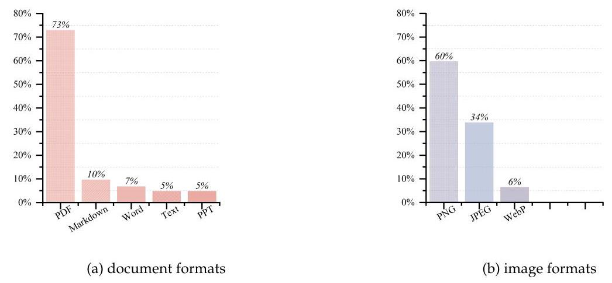

Figure 9: Breakdown of specific file formats for documents and images.

## B Distribution of Web Pages in DR \( {}^{3} \) -Eval’s Sandbox Corpus

To visualize the semantic distribution of the sandbox corpus, we encoded the query of a representative task and the web pages from the 64k dataset using OpenAI's text-embedding-3-large model. These embeddings were projected into a two-dimensional space via t-SNE. As illustrated in Figure 10, we plot the query relative to the documents, displaying a subset of the distractor and noise web pages to ensure visual clarity.

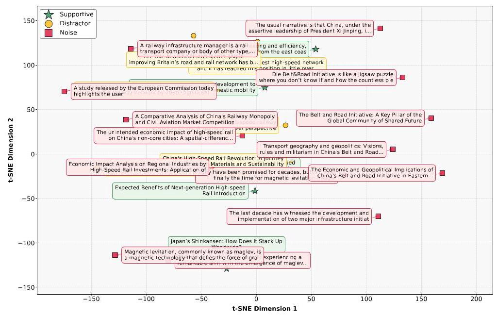

Figure 10: t-SNE visualization of the semantic distribution in the Sandbox Corpus.

## C Model Rankings across Different Judge LLMs

Table 7 compares the leaderboard rankings produced by GPT-5.1 against alternative judges (Gemini-2.5- Pro and Qwen-Max) to quantify the consistency of our evaluator selection.

Table 7: Comparison of rankings assigned by three different judge models. The "Disagreement" row indicates the number of rank swaps relative to GPT-5.1 .

<table><tr><td>Model</td><td>GPT-5</td><td>Gemini-2.5-Pro</td><td>Qwen-Max</td></tr><tr><td>GLM-4.7</td><td>1</td><td>1</td><td>1</td></tr><tr><td>Claude Sonnet 4</td><td>2</td><td>3</td><td>2</td></tr><tr><td>Gemini-2.5-Pro</td><td>3</td><td>2</td><td>3</td></tr><tr><td>GPT-4.1</td><td>4</td><td>5</td><td>5</td></tr><tr><td>Qwen3-235B-A22B</td><td>5</td><td>4</td><td>4</td></tr><tr><td>Qwen3-30B-A3B</td><td>6</td><td>6</td><td>6</td></tr><tr><td>Disagreement (Δ)</td><td>-</td><td>1</td><td>1</td></tr></table>

## D Human Evaluation

We select 30 samples to undergo both automated and human evaluation. The human score for each sample is derived by averaging the ratings of two independent experts. The correlation coefficients between the automated and human scores are calculated as follows:

- Pearson's correlation coefficient.

\[
r = \frac{\mathop{\sum }\limits_{{i = 1}}^{n}\left( {{A}_{i} - A}\right) \left( {{B}_{i} - B}\right) }{\sqrt{\mathop{\sum }\limits_{{i = 1}}^{n}{\left( {A}_{i} - A\right) }^{2}}\sqrt{\mathop{\sum }\limits_{{i = 1}}^{n}{\left( {B}_{i} - B\right) }^{2}}}
\]

- Spearman's correlation coefficient.

\[
s = \frac{\mathop{\sum }\limits_{{i = 1}}^{n}\left( {R\left( {A}_{i}\right)  - {R}_{A}}\right) \left( {R\left( {B}_{i}\right)  - {R}_{B}}\right) }{\sqrt{\mathop{\sum }\limits_{{i = 1}}^{n}{\left( R\left( {A}_{i}\right)  - {R}_{A}\right) }^{2}}\sqrt{\mathop{\sum }\limits_{{i = 1}}^{n}{\left( R\left( {B}_{i}\right)  - {R}_{B}\right) }^{2}}}
\]

- Pairwise agreement.

\[
{PAR} = \frac{1}{\left( \begin{matrix} n \\  2 \end{matrix}\right) }\mathop{\sum }\limits_{{i = 1}}^{{n - 1}}\mathop{\sum }\limits_{{j = i + 1}}^{n}{\mathbb{I}}_{ij}
\]

\[
{\mathbb{I}}_{ij} = \left\{  \begin{array}{ll} 1 & \text{ if }\left( {{A}_{i} - {A}_{j}}\right)  \cdot  \left( {{B}_{i} - {B}_{j}}\right)  > 0 \\  0 & \text{ otherwise } \end{array}\right.
\]

where \( {A}_{i},{B}_{i} \) represent the automated total score and human total score for a single case, respectively. Table 8 presents the fine-grained scores of the first five cases across various dimensions.

Table 8: Comparison of LLM-Judge and Human-Judge Scores in each dimension across the first five Case

<table><tr><td rowspan="2">Case ID</td><td colspan="5">LLM-Judge Score</td><td colspan="5">Human-Judge Score</td></tr><tr><td>IR \( {}_{llm} \)</td><td>FAllm</td><td>\( {\mathrm{{DQ}}}_{llm} \)</td><td>IF \( {}_{llm} \)</td><td>CCIIm</td><td>IRhuman</td><td>FAhuman</td><td>DQhuman</td><td>IFhuman</td><td>CChuman</td></tr><tr><td>001</td><td>30.00</td><td>46.23</td><td>70.00</td><td>93.33</td><td>66.67</td><td>32.50</td><td>42.76</td><td>72.00</td><td>92.42</td><td>66.67</td></tr><tr><td>002</td><td>40.27</td><td>50.38</td><td>70.00</td><td>86.67</td><td>66.67</td><td>38.68</td><td>53.89</td><td>68.00</td><td>83.25</td><td>66.67</td></tr><tr><td>003</td><td>42.85</td><td>52.25</td><td>70.00</td><td>64.00</td><td>16.67</td><td>40.78</td><td>56.65</td><td>66.86</td><td>62.38</td><td>16.67</td></tr><tr><td>004</td><td>30.00</td><td>43.84</td><td>60.00</td><td>77.78</td><td>50.00</td><td>31.50</td><td>46.29</td><td>58.76</td><td>75.94</td><td>50.00</td></tr><tr><td>005</td><td>49.29</td><td>60.33</td><td>70.00</td><td>84.00</td><td>71.43</td><td>46.73</td><td>57.83</td><td>73.56</td><td>82.37</td><td>71.43</td></tr></table>

## E Report Example

We present a representative task and the corresponding report generated by \( {\mathrm{{DR}}}^{3} \) -Agent. User Files:

- China.jpg - China's high-speed rail network map showing extensive coverage and connectivity

- Shinkansen.jpg - Japan's Shinkansen network map displaying route structure and operational lines

- China's high-speed rail.mp4 - Analysis of China's high-speed rail development narrative and technical achievements

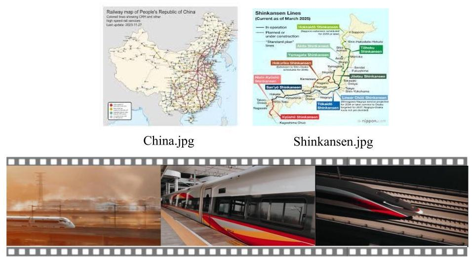

China's high-speed rail.mp4

Figure 11: The view of user files.

Figure 11 displays the visual components of the user files provided in this case study

Query: I've attached a video about China's high-speed rail, along with maps of China's and Japan's networks. It's impressive how fast and extensive China's system has become. Could you summarize the story behind its rapid development? I'm curious about its evolution, how its core system compares to Japan's Shinkansen, the planning behind its vast network, and what the next big steps in high-speed rail technology look like globally.

Claude Sonnet 4's Report

## The Remarkable Story of China's High-Speed Rail Revolution: From Zero to Global Leader Executive Summary

China's high-speed rail development represents one of the most extraordinary infrastructure transformations in modern history. In just over three decades, China evolved from having no high-speed rail capability to operating the world's largest network, fundamentally reshaping both domestic transportation and global rail technology markets. This comprehensive analysis examines the evolution of China's high-speed rail system, compares it with Japan's pioneering Shinkansen network, explores the strategic planning behind China's vast infrastructure, and identifies the next generation of rail technologies that will define the future of high-speed transportation. The Evolution: A Three-Decade Journey from Concept to Global Dominance

- Early Foundations and Strategic Planning (1990-2007) China's high-speed rail journey began with visionary planning in the early 1990s. In December 1990, the Ministry of Railways submitted the first proposal to build a high-speed railway between Beijing and Shanghai to the National People's Congress, marking the first time high-speed rail was proposed as an option for intercity transportation in China ["Transportation Planning Casebook/China High-Speed"]. This initial proposal set in motion a carefully orchestrated development strategy that would unfold over the following decades.

The planning phase was methodical and comprehensive. In 1995, Premier Li Peng announced that preparatory work on the Beijing Shanghai HSR would begin in the 9th Five Year Plan (1996-2000), demonstrating the government's commitment to long-term infrastructure development ["Transportation Planning Casebook/China High-Speed"]. The State Council commissioned a feasibility study for the Beijing-Shanghai line in

December 1994, establishing the technical and economic foundation for what would become the backbone of China's high-speed rail network ["Transportation Planning Casebook/China High-Speed"].

The first operational breakthrough came in 1998 when the Guangzhou-Shenzhen line was electrified and, by introducing Swedish-made X 2000 trains, the service speed increased to \( {200}\mathrm{\;{km}}/\mathrm{h} \) ["Transportation Planning Casebook/China High-Speed"]. This project served as a crucial testing ground for high-speed rail operations in the Chinese context. On October 12, 2003, the Qinshen Railroad started operation as the first passenger-only railroad line in China, featuring the "China Star" electrified locomotive with a designed speed of \( {200}\mathrm{\;{km}}/\mathrm{h} \) and a top speed of \( {300}\mathrm{\;{km}}/\mathrm{h} \) ["Transportation Planning Casebook/China High-Speed"].

- Strategic Technology Acquisition Phase (2004-2008) Rather than attempting to develop high-speed rail technology entirely from scratch, China pursued a sophisticated strategy of technology acquisition and transfer. In June 2004, the Ministry of Railways accepted bids from Alstom of France, Bombardier Transportation of Germany, and Kawasaki of Japan for 200 high-speed train sets with top speed of \( {200}\mathrm{\;{km}}/\mathrm{h} \) , crucially including terms of technology transfer ["Transportation Planning Casebook/China High-Speed"]. This marked the beginning of systematic technology acquisition that would accelerate China's development timeline by decades.

The technology transfer relationships were comprehensive and strategic. CSR obtained Japanese high-speed technology starting in 2004 as part of a deal with Kawasaki, with the CRH2 series being directly derived from the E2 Series 1000 Shinkansen and nicknamed "Hairtail" ["Hexie (train)"]. From June to September 2005, the Ministry of Railways purchased train sets with a top speed of \( {350}\mathrm{\;{km}}/\mathrm{h} \) , demonstrating the rapid escalation in technical capabilities ["Transportation Planning Casebook/China High-Speed"].

A pivotal decision came in 2006 when the State Council, in its Mid-to-Long Term Railway Development Plan, adopted conventional track HSR technology over maglev, enabling rapid construction of standard gauge, passenger dedicated HSR lines throughout China ["Transportation Planning Casebook/China High-Speed"]. By April 2007, the high-speed rail system had upgraded to more than \( {423}\mathrm{\;{km}} \) of tracks capable of supporting \( {250}\mathrm{\;{km}}/\mathrm{h} \) train service and \( 3,{002}\mathrm{\;{km}} \) of tracks capable of supporting \( {200}\mathrm{\;{km}}/\mathrm{h} \) as a result of the Speed Up Campaign ["Transportation Planning Casebook/China High-Speed"].

- The Breakthrough Era (2008-2020) The transformative moment arrived on August 1, 2008, when the Beijing-Tianjin Inter-city Railway was launched at a top speed of 350 kilometers per hour, marking the beginning of China's high-speed railway era [Video: China's high-speed rail.mp4]. This railway served as China's first independently built high-speed railway operating at 350 kilometers per hour ["On Aug. 1, 2008, the Beijing-Tianjin Inter-city Ra"]. The video analysis reveals that this achievement represented rapid development accomplished in just over 10 years, establishing China as a world leader in high-speed rail technology [Video: China's high-speed rail.mp4].

The scale and pace of subsequent expansion was unprecedented in infrastructure history. When China's Premier Wen Jiabao boarded the first bullet train to open the service of the new high-speed line between Beijing and Shanghai on June 30, 2011, he described the step as a 'new chapter' in China's railway history ["When China's Premier Wen Jiabao boarded the fi"]. The 1,318km-long high-speed line connected China's two major metropolitan hubs in only four hours and 48 minutes, compared to about ten hours on the old railway ["When China's Premier Wen Jiabao boarded the fi"].

The passenger adoption was remarkable. By the end of 2017, the total number of passengers who traveled on China's high-speed trains had reached 7 billion ["On Aug. 1, 2008, the Beijing-Tianjin Inter-city Ra"]. By 2020, China's total operation mileage of high-speed railway reached 30,000 kilometers, covering 80 percent of its major cities ["On Aug. 1, 2008, the Beijing-Tianjin Inter-city Ra"]. The World Bank described this as "the biggest rail expansion the world has ever seen" with China being "the only country that has ever attempted such an increase" ["When China's Premier Wen Jiabao boarded the fi"].

## Comparative Analysis: China's System vs. Japan's Shinkansen

The comparison between China's high-speed rail network and Japan's Shinkansen reveals dramatic differences in scale, approach, and strategic objectives. The total operating mileage of China's high-speed railway network exceeds 25,000 kilometers, accounting for two thirds of the world's total ["On Aug.1, 2008, the Beijing-Tianjin Inter-city Ra"]. The China high-speed rail network map demonstrates extensive coverage that stretches from the Bohai Sea in the east to the Gobi Desert in the west, from the central plains to the mountains in the southwest, and from the snowfields in the north to the riverside towns in the south [Image: China.jpg].

The network analysis reveals dense connectivity in eastern and central regions, with key routes connecting major cities such as Beijing, Shanghai, Guangzhou, and Wuhan, forming an integrated system linking provincial capitals and major urban centers [Image: China.jpg]. The map shows a well-developed network with multiple intersecting lines and branch routes, demonstrating extensive coverage and connectivity as of November 27, 2009, with continued expansion since then [Image: China.jpg].

Strategic Planning Behind China's Vast Network

In contrast, Japan's Shinkansen network, while pioneering and highly efficient, covers approximately 2,800 km as of March 2025 [Image: Shinkansen.jpg]. The Japanese network shows a highly focused approach along Japan's main urban corridor, connecting major cities like Tokyo, Osaka, Nagoya, and Fukuoka through nine distinct lines: Tokaido, Sanyo, Kyushu, Tohoku, Joetsu, Hokuriku, Hokkaido, Akita, and Yamagata Shinkansen [Image: Shinkansen.jpg]. The coverage pattern is linear, following Japan's geographic constraints and population distribution, with most lines concentrated along the Pacific coast and major population centers [Image: Shinkansen.jpg].

China's network planning represents a revolution in infrastructure development methodology, incorporating cutting-edge technologies and comprehensive strategic thinking. Modern railway planning involves strategic oversight of all railway systems and related infrastructure, including track alignment, rail capacity, logistics planning, maintenance scheduling, safety checks, signalling and communication networks, track access, landscaping, and vegetation control ["What is railway planning? A brief overview"]. This comprehensive approach requires synchronizing human resources such as engineers, architects, urban planners, rail construction managers, transport officers, railway contractors and crews, as well as coordinating traffic, passengers, and pedestrian flow ["What is railway planning? A brief overview"]. Leaders of the best railway infrastructure worldwide are increasingly turning towards 3D virtual replicas or digital twins as a planning tool ["What is railway planning? A brief overview"]. Digital twin railway planning software generates intelligent, dynamic models of the rail network, creating a virtual representation of complex 3D environments, accurately mimicking the appearance and behaviour of real-world infrastructure ["What is railway planning? A brief overview"]. This technological approach addresses traditional inefficiencies, as an international survey by BearingPoint revealed that 81% of rail infrastructure managers felt traditional decision-making processes were too time-consuming, 89% believed these processes led to unnecessary duplication of effort, and 86% were overwhelmed by paperwork duties ["What is railway planning? A brief overview"].

## Conclusion

China's high-speed rail development represents a remarkable transformation that redefined global transportation infrastructure within a single generation. The journey from initial proposals in 1990 to achieving world leadership status demonstrates the power of strategic planning, systematic technology acquisition, massive investment, and unwavering political commitment. The evolution followed a clear pattern: early planning and feasibility studies (1990-2003), strategic technology acquisition through foreign partnerships (2004-2008), rapid domestic expansion (2008-2020), and emergence as a global technology exporter (2010s-present).

The comparison with Japan's Shinkansen reveals two different but successful approaches to high-speed rail development. Japan pioneered the technology with careful engineering and operational efficiency, creating a reliable and profitable system that serves as a model for precision and safety. China leveraged this foundation to create an unprecedented scale of infrastructure that prioritizes national integration and social benefits alongside transportation efficiency.

The strategic planning behind China's vast network demonstrates sophisticated integration of digital technologies, comprehensive infrastructure coordination, and long-term economic development objectives. The network serves not merely as transportation infrastructure but as a tool for national integration, regional development, and international influence. Looking toward the future, the next generation of high-speed rail technology promises even more dramatic advances. Maglev technology offers the potential for speeds exceeding \( {600}\mathrm{\;{km}}/\mathrm{h} \) , while digital integration through IoT, AI, and cloud computing will revolutionize operational efficiency and passenger experience. China's continued investment in ultra-high speed conventional rail, maglev systems, and emerging technologies like hyperloop positions the country to maintain its leadership in this critical infrastructure sector. The global expansion of high-speed rail technology, driven by Chinese companies competing with established European and Japanese manufacturers, suggests

that the next decade will see accelerated adoption worldwide. As the video demonstrates with China's CR450 prototype achieving \( {450}\mathrm{\;{km}}/\mathrm{h} \) with improved smoothness, the pursuit of "amazing China speed" continues to push the boundaries of what is possible in rail transportation, setting the stage for a new era of global mobility.

## References

Video Sources:

- China's high-speed rail.mp4 - Analysis of China's high-speed rail development narrative and technical achievements

## Image Sources:

- China.jpg - China's high-speed rail network map showing extensive coverage and connectivity

- Shinkansen.jpg - Japan's Shinkansen network map displaying route structure and operational lines

## Database Sources:

- Transportation Planning Casebook/China High-Speed Rail development timeline and milestones

- Historical development of Beijing-Tianjin Inter-city Railway and network expansion

- Technology transfer relationships between China and international partners

- Railway planning methodologies and digital twin technologies

- Maglev technology development and global implementation

- Global high-speed rail market analysis and future projections

- Digital railways and IoT integration in transportation systems

- International expansion projects and technology export initiatives

## F Evaluation Example

This section details the calculation of evaluation metrics, beginning with the assessment of insight coverage derived from user files and the sandbox corpus, followed by the computation of the remaining metrics.

### F.1 Information Recall from User Files and Sandbox Corpus

#### F.1.1 Information Recall from User Files

## Golden insight from user files

1. China's high-speed rail network is dense, especially in the east.

2. The map shows the extensive network as of November 2023.

3. The network includes lines with speeds of \( {300}\mathrm{\;{km}}/\mathrm{h} \) or more.

4. Rail lines are color-coded by speed, from \( < {200} \) to \( \geq  {300}\mathrm{\;{km}}/\mathrm{h} \) .

5. Map of Japan's Shinkansen lines as of March 2025.

6. Shows operational, planned, and under-construction routes.

7. A future Linear Chūō Shinkansen (maglev) line is projected.

8. The network connects major cities like Tokyo, Osaka, and Hakata.

9. Developed from non-existent to world-class in just over 10 years.

10. Current trains travel at world-leading speeds of 300-350 km/h.

11. The new CR450 EMU prototype is the world's fastest.

12. CR450 prototype reaches \( {450}\mathrm{\;{km}}/\mathrm{h} \) in tests.

Table 9: Evaluation of Information Recall from User Files.

<table><tr><td>Number</td><td>Status</td><td>Evidence</td></tr><tr><td>1</td><td>Covered</td><td>The network analysis reveals dense connectivity in eastern and central regions, with key routes connecting major cities...</td></tr><tr><td>2</td><td>Half Covered</td><td>The map shows a well-developed network ... as of November 27, 2009, with continued expansion since then [Image: China.jpg].</td></tr><tr><td>3</td><td>Covered</td><td>The Beijing-Tianjin Inter-city Railway was launched at a top speed of 350 kilometers per hour.” “CRH380A reaching up to 380 km/h...</td></tr><tr><td>4</td><td>Not Covered</td><td>Not Found</td></tr><tr><td>5</td><td>Covered</td><td>Japan's Shinkansen network ... covers approximately 2,800 km as of March 2025 [Image: Shinkansen.jpg].</td></tr><tr><td>6</td><td>Half Covered</td><td>Japan's Shinkansen network ... connecting major cities ... through nine distinct lines...</td></tr><tr><td>7</td><td>Half Covered</td><td>The experimental Japanese L0 Series maglev set a train speed record of 603 km/h (375 mph) in 2015...</td></tr><tr><td>8</td><td>Covered</td><td>connecting major cities like Tokyo, Osaka, Nagoya, and Fukuoka through nine distinct lines...</td></tr><tr><td>9</td><td>Covered</td><td>The video analysis reveals that this achievement represented rapid development accomplished in just over 10 years, establishing China as a world leader in high-speed rail technology.</td></tr><tr><td>10</td><td>Half Covered</td><td>Beijing-Tianjin Inter-city Railway ... top speed of 350 kilometers per hour." "CRH380A reaching up to 380 km/h." "Shinkansen ... up to 320 km/h...</td></tr><tr><td>11</td><td>Half Covered</td><td>the CR450 EMU prototype that reaches \( {450}\mathrm{\;{km}}/\mathrm{h} \) in testing, representing a significant advancement in speed capabilities</td></tr><tr><td>12</td><td>Covered</td><td>the CR450 EMU prototype that reaches \( {450}\mathrm{\;{km}}/\mathrm{h} \) in testing</td></tr></table>

#### F.1.2 Information Recall from Sandbox Corpus

## Extracted insight from sandbox corpus:

1. Reducing aerodynamic resistance is crucial for faster trains.

2. Shinkansen's strengths are efficiency and passenger comfort.

3. China has an ambitious 2035 high-speed rail expansion plan.

4. Digital transformation is key to future rail network evolution.

5. Future rail relies on IoT, 5G, and AI technologies.

6. China plans to extend its HSR network to Southeast Asia.

### F.2 Citation Coverage

Table 11: Evaluation of Citation Coverage.

<table><tr><td>No. Source Title</td><td>Status</td></tr><tr><td colspan="2">Web Page Coverage</td></tr><tr><td>1 Japan's Shinkansen: How Does It Stack Up Worldwide?</td><td>Cited</td></tr><tr><td>2 The global rail transportation market was valued at US\$ 724,180 million in 2022 and, by 2029, is pro</td><td>Cited</td></tr></table>

(Continued on next page)

Table 11 (Continued)

<table><tr><td>No.</td><td>Source Title</td><td>Status</td></tr><tr><td>3</td><td>Expected Benefits of Next-generation High-speed Rail Introduction.</td><td>Missed</td></tr><tr><td>4</td><td>China's railway network: rapid development to support domestic mobility</td><td>Missed</td></tr><tr><td>5</td><td>A remarkable piece of engineering and efficiency, the Shanghai-Kunming line spans from the east coas</td><td>Missed</td></tr><tr><td colspan="3">User File Coverage</td></tr><tr><td>6</td><td>China.jpg</td><td>Cited</td></tr><tr><td>7</td><td>Shinkansen.jpg</td><td>Cited</td></tr><tr><td>8</td><td>China's high-speed rail.mp4</td><td>Cited</td></tr></table>

### F.3 Factual Accuracy

Table 12: The Evaluation of Factual Accuracy.

<table><tr><td>No.</td><td>Claim to be verified</td><td>Status</td></tr><tr><td>1</td><td>In December 1990, the Ministry of Railways submitted the first proposal to build a high-speed railway...</td><td>✓</td></tr><tr><td>2</td><td>In 1995, Premier Li Peng announced that preparatory work on the Beijing Shanghai HSR would begin in...</td><td>✓</td></tr><tr><td>3</td><td>The State Council commissioned a feasibility study for the Beijing-Shanghai line in December 1994, e...</td><td>✓</td></tr><tr><td>4</td><td>The first operational breakthrough came in 1998 when the Guangzhou-Shenzhen line was electrified and...</td><td>✓</td></tr><tr><td>5</td><td>On October 12, 2003, the Qinshen Railroad started operation as the first passenger-only railroad line...</td><td>✓</td></tr><tr><td>6</td><td>In June 2004, the Ministry of Railways accepted bids from Alstom of France, Bombardier Transportation...</td><td>✓</td></tr><tr><td>7</td><td>CSR obtained Japanese high-speed technology starting in 2004 as part of a deal with Kawasaki, with t...</td><td>✓</td></tr><tr><td>8</td><td>From June to September 2005, the Ministry of Railways purchased train sets with a top speed of 350 k...</td><td>✓</td></tr><tr><td colspan="3">\( \vdots \)</td></tr><tr><td>48</td><td>Planned investments in 2025 alone total 590 billion yuan (approximately \$80.8 billion) to develop an...</td><td>✘</td></tr><tr><td>49</td><td>The expansion of China's rail network benefits regions in the interior of the country, with provinces...</td><td>✘</td></tr><tr><td colspan="3">\( \vdots \)</td></tr><tr><td>72</td><td>As the video demonstrates with China's CR450 prototype achieving \( {450}\mathrm{\;{km}}/\mathrm{h} \) with improved smoothness,...</td><td>✓</td></tr></table>

### F.4 Format Compliance

Table 10: The Calculation of Information Recall from Sandbox Corpus.

<table><tr><td>Number</td><td>Status</td><td>Evidence</td></tr><tr><td>1</td><td>Not Covered</td><td>Not Found</td></tr><tr><td>2</td><td>Half Covered</td><td>Japan... has established a reliable and profitable system, serving as a paradigm of precision and safety.</td></tr><tr><td>3</td><td>Not Covered</td><td>The medium and long-term railway development plan from 2004 to 2020... plans to invest..." and so on, only up to the investment planning for 2025.</td></tr><tr><td>4</td><td>Covered</td><td>Digital twins... as planning tools... address the inefficiencies of traditional decision-making... Digital railways encompass real-time data collection, predictive modeling, automated decision-making, and more.</td></tr><tr><td>5</td><td>Covered</td><td>Leading this evolution are various IoT-related technologies, such as 5G, AI, and cloud computing... which play a pivotal role in digital logistics and transportation.</td></tr><tr><td>6</td><td>Half Covered</td><td>China's high-speed rail technology is going global... projects such as the Ankara-Istanbul high-speed rail, the Jakarta-Bandung high-speed rail, and the Moscow-Kazan high-speed rail.</td></tr></table>

Table 13: The Evaluation of Format Compliance.

<table><tr><td>No.</td><td>Requirement</td><td>Satisfied</td></tr><tr><td>1</td><td>Mention China's high-speed rail rapid development</td><td>✓</td></tr><tr><td>2</td><td>Describe early stages of China's high-speed rail</td><td>✓</td></tr><tr><td>3</td><td>Describe key phases in China's network expansion</td><td>✓</td></tr><tr><td>4</td><td>Explain main drivers of China's rapid rail growth</td><td>✓</td></tr><tr><td>5</td><td>Mention role of national planning in China</td><td>✓</td></tr><tr><td>6</td><td>Describe overall layout of China's high-speed network</td><td>✓</td></tr><tr><td>7</td><td>Explain planning logic behind China's network structure</td><td>✓</td></tr><tr><td>8</td><td>Describe core technical system of China's high-speed rail</td><td>✓</td></tr><tr><td>9</td><td>Describe core technical system of Japan's Shinkansen</td><td>✓</td></tr><tr><td>10</td><td>Compare technical features of China rail and Shinkansen</td><td>✓</td></tr><tr><td>11</td><td>Compare operational characteristics of China rail and Shinkansen</td><td>✓</td></tr><tr><td>12</td><td>Explain key differences between China rail and Shinkansen</td><td>✓</td></tr><tr><td>13</td><td>Mention future global high-speed rail technology trends</td><td>✓</td></tr><tr><td>14</td><td>Describe next big technological steps in high-speed rail</td><td>✓</td></tr><tr><td>15</td><td>Explain global implications of upcoming high-speed rail advances</td><td>✓</td></tr></table>

### F.5 Depth Quality

Score: 0.70

Justification: The report gives a solid, well-structured narrative of China's HSR evolution. It clearly explains the technology-transfer strategy, compares China's system to Japan's on scale, speed, and philosophy, and touches on planning tools and future technologies like maglev and digital railways.

However, much of the "planning" section drifts into generic global railway-planning and IoT discussion rather than concrete Chinese institutional planning choices (e.g., corridor selection, financing models, governance reforms, safety scandals). Furthermore, the comparison with Shinkansen lacks deeper critical analysis of safety records, cost overruns, demand risk, and long-term economic performance.

The future-tech section is descriptive and somewhat market-report-like, with limited critical assessment of feasibility, trade-offs, and timelines. Consequently, the analysis is adjudged as good but not yet truly deep or nuanced.

## G Inference and Evaluation Cost

We report the approximate runtime and API cost of the full pipeline.

<table><tr><td>Setting</td><td>Avg. time / task</td><td>Approx. API cost / task</td></tr><tr><td>Inference</td><td>300-400 s</td><td>\$0.3-1.0\$</td></tr><tr><td>Evaluation</td><td>90 s</td><td>\$0.10\$</td></tr></table>

Table 14: Approximate runtime and API cost of the full pipeline.

## H Prompts for Data Construction

This section outlines the prompts used to synthesize our dataset.

### H.1 Search Terms Generation

---

Prompt for Search Terms Generation

You are a professional research assistant. Based on the following user files, generate search terms

for web search.

User Files

files_summary

Task Requirements

## Generate 10 Search Terms

Based on the content of the user files, generate 10 English search terms for web search. These

search terms should:

				- Be able to retrieve supplementary information related to the topic of the user files

					- Cover different angles and aspects (such as background knowledge, case studies, policies

						and regulations, technical details, industry trends, etc.)

				- Each search term should be 3-5 words - combining 2-3 related concepts naturally

				- Use common, widely-searched phrases that are likely to return 100+ search results

				- Search terms should be able to find information not in the user files but helpful for

						understanding the topic

				- All 10 terms must be ORTHOGONAL - they should target completely different aspects

						and NOT overlap in search results

CRITICAL RULES for generating search terms that return many results:

				1. Balance specificity with searchability

							- If the topic is about a specific country/region (e.g., Japan tax policy), include it

								- If the topic is general, prefer broader terms that apply globally

								- BAD: "Japan income tax bracket structure 2024" (too specific + year)

								- GOOD:"Japan income tax reform" or "income tax policy reform"

				2. Use organization names strategically

								- Include organization names when they are central to the topic

								- Avoid obscure acronyms that few people search for

								- BAD: "HUD FMR calculation methodology" (obscure acronym)

								- GOOD: "HUD housing affordability" or "federal housing assistance"

				3. Prefer common terms over academic jargon

								- Use terms that practitioners and general public would search

								- BAD: "arthrofibrosis prophylaxis protocols" (too technical)

								- GOOD: "joint stiffness prevention therapy"

---

---

	4. Use common search patterns:

		- "[Topic] + [Aspect]": "smart agriculture technology"

		- "[Topic] + [Method]": "precision farming data analytics"

		- "[Topic] + [Trend]": "renewable energy market growth"

		- "[Topic] + [Impact]": "climate change economic effects"

		- "[Topic] + [Impact]": "climate change economic effects"

## Good Examples (3-5 words, will return 100+ results):

	- "smart agriculture technology development"

	- "precision farming data analytics"

	- "vaccine efficacy clinical research"

	- "housing affordability policy reform"

	- "pension system sustainability analysis"

	- "renewable energy investment trends"

	- "supply chain risk management"

	- "Japan pension reform challenges" (specific country when relevant)

	- "OECD education policy recommendations" (organization when relevant)

Bad Examples (too specific or obscure):

	- "Japan corporate tax rate competitiveness analysis 2024" (too long, includes year)

	- "Fair Market Rent determination methodology HUD" (obscure + too specific)

	- "California DMV licensing procedures step by step" (too specific)

	- "pension actuarial valuation discount rate assumptions" (too technical)

## Language Requirements

Important: All output content (search_terms, topic_summary) must be in English.

Output Format

Please output in JSON format:

""json

"search_terms": [

"search term 1",

"search term 2",

"search term 3",

"search term 4",

"search term 5",

"search term 6",

"search term 7",

"search term 8",

"search term 9",

"search term 10"

],

"topic_summary": "Brief summary of the user files topic (1-2 sentences)"

"" Only output JSON, no other content.

---

### H.2 Query Construction

Prompt for Query Generation

Task

Generate a natural user query based on user files, search results, and keyword info.

Core Goal: The generated query should naturally guide an AI agent to search for "relevant keywords" without directly exposing them.

User Files

chr(10).join(f'- name' for name in user_file_names)

Relevant Keywords (what agent should search)

relevant_kw_text

---

Noise Keywords (what agent should NOT be guided to search)

noise_kw_text

Keyword Classification Reasoning

reasoning

Search Results (len(useful_search) total)

search_text

Query Design Requirements

Core Principles

		1. Concise: Query must be SHORT (50-100 words), like a real user's brief question, not

			verbose

		2. Natural: Query should be from user's perspective, like a real person would ask

		3. Guiding: Query topic should naturally lead agent to search "relevant keywords", but

			don't over-hint

		4. No Exposure: Don't directly use technical terms from keywords, use simple natural

			expressions

		5. Brief File Reference: Query must briefly mention user files, like "based on my xxx file" or

			"see attachment"

		6. Cover All Results: Query must be designed so ALL len(useful_search) search results are

			needed for a complete answer, even if each result is only used a little

		7. Use All Files: Query must be designed so ALL len(user_file_names) user files are needed

			for a complete answer, even if each file is only used a little

## Design Approach

		1. Analyze the common theme of relevant keywords

		2. Design a SHORT natural query (50-100 words), don't over-describe background

		3. Query should:

				- Be short and direct, like a casual question

				- Not contain technical jargon or hint-like words

				- Briefly mention user files

Examples If relevant keywords are: - "Three-distance method spatial layout modern pocket park

design cases" - "Scattered perspective step-by-step scenery urban micro-renewal"

User file is:

- Suzhou_Garden_Design.pdf

XBAD Query (too long, over-hinting):

"Based on my Suzhou Garden Design.pdf showing spatial layout techniques, help me research

how these traditional garden concepts are applied in contemporary urban small green spaces,

please find some recent practice cases"

XBAD Query (directly exposes keywords):

"Please analyze the application cases of three-distance method in modern pocket parks"

✓GOOD Query (short, natural):

"Based on my Suzhou garden design file, help me find some similar style applications in modern

small parks"

✓GOOD Query (short, natural):

"With the attached garden diagram, research how traditional garden techniques are practiced in

urban small green spaces"

Output Format

Output JSON only:

"query": "Complete user query (50-100 words, short and natural, mentions user files)",

"file_references": ["User files referenced in query and their content description"],

"subtasks": [

"id": 1,

"description": "Subtask description",

"target_keywords": ["Relevant keywords this subtask should guide agent to search"]

],

"design_rationale":"Why this query guides agent to search relevant keywords",

---

"avoided_terms": ["Technical terms deliberately avoided in query"],

"natural_expressions": ["Natural expressions used to replace technical terms"]

Note: Output JSON only, no other content. Query must include clear reference to user files!

## I Prompts for Evaluation Preparation

### I.1 Insights Extraction from User Files

Prompt for Insights Extraction from User Files

---

Please extract Key Insights relevant to the query from the following web search results.

Query Task

query

Important Notes (Web Search Results)

You are processing web search results. These sources contain key information needed to answer

the query. Please extract the core information provided by each source.

Core Principle

Source Specificity: Extract information that is unique and specific to each web page, NOT

common knowledge or generic statements.

Extraction Requirements

			1. Source Specificity (MOST IMPORTANT):

				- ✓Extract specific information unique to this source, such as: specific names, dates,

							data, events, product names, company names, project names, method names, etc.

						- \( \checkmark \) Extract unique viewpoints, conclusions, methods, or findings from this source

						- XDO NOT extract common knowledge, such as: "AI can improve efficiency", "data

							analysis is important", "user experience matters"

						- XDO NOT extract generic descriptions, such as: "this method works well", "perfor-

							mance improved", "solved the problem"

			2. Source Contribution: Extract the main contribution of each source to answering the query,

					such as:

						- Methods/techniques/concepts introduced by the source (e.g., "proposes AfME em-

							bedding", "uses MCMC optimization")

						- Core topics or problems discussed by the source

						- Key conclusions or findings of the source

						- Note: No need to extract precise numbers (e.g., "19.86% improvement"), just extract

							core concepts (e.g., "significant PSNR improvement")

			3. Relevance: Information is relevant to the query task

			4. Verifiability: Can determine whether the report mentions this information (semantic

					similarity is sufficient, exact match not required)

			5. Atomicity: Each insight must be atomic, containing only 1-12 words, expressing a simple

					fact or concept

## Examples of Common Knowledge (DO NOT Extract)

			- "Machine learning requires large amounts of data" \( \rightarrow \) This is common knowledge

			- "User experience is important" \( \rightarrow \) This is common knowledge

			- "This method improved accuracy" \( \rightarrow \) Too vague, no specific value or comparison

			- "Further research is needed" \( \rightarrow \) This is a generic conclusion

Examples of Source-Specific Content (SHOULD Extract)

			- "Uses ResNet-50 as backbone network" \( \rightarrow \) Specific technical choice

			- "Achieves 92.3% accuracy on ImageNet" → Specific data

			- "Proposed by John Smith in January 2024" → Specific name and time

			- "Employs AfME embedding method" \( \rightarrow \) Specific method name

Quantity Control

			- Extract 1-2 core insights per source (web page)

			- Ensure each source has corresponding insights

			- Prioritize conceptual information over precise numbers

			- If a source lacks specific information, extract fewer insights rather than extracting common

				knowledge

## Language Requirement

Important: Output insights must be in English.

Output Format

Please output insights in JSON array format, each insight should include the source title:

"json

"insight": "Brief source-specific information point (1-12 words)", "source": "Source Title"

\( \frac{1}{m} \)

Only output the JSON array, no other content.

content_text

---

### I.2 Insights Extraction from Sandbox Corpus

## Prompt for Insights Extraction from Sandbox Corpus

---

Please extract Key Insights relevant to the query from the following web search results.

Query Task

query

Important Notes (Web Search Results)

You are processing web search results. These sources contain key information needed to answer

the query. Please extract the core information provided by each source.

Core Principle

Source Specificity: Extract information that is unique and specific to each web page, NOT

common knowledge or generic statements.

Extraction Requirements

		1. Source Specificity (MOST IMPORTANT):

				- VExtract specific information unique to this source, such as: specific names, dates,

						data, events, product names, company names, project names, method names, etc.

				- \( \checkmark \) Extract unique viewpoints, conclusions, methods, or findings from this source

					- XDO NOT extract common knowledge, such as: "AI can improve efficiency", "data

						analysis is important", "user experience matters"

				- XDO NOT extract generic descriptions, such as: "this method works well", "perfor-

					mance improved", "solved the problem"

		2. Source Contribution: Extract the main contribution of each source to answering the query,

				such as:

				- Methods/techniques/concepts introduced by the source (e.g., "proposes AfME em-

						bedding", "uses MCMC optimization")

					- Core topics or problems discussed by the source

					- Key conclusions or findings of the source

					- Note: No need to extract precise numbers (e.g., "19.86% improvement"), just extract

					core concepts (e.g., "significant PSNR improvement")

		3. Relevance: Information is relevant to the query task

		4. Verifiability: Can determine whether the report mentions this information (semantic

			similarity is sufficient, exact match not required)

		5. Atomicity: Each insight must be atomic, containing only 1-12 words, expressing a simple

				fact or concept

Examples of Common Knowledge (DO NOT Extract)

		- "Machine learning requires large amounts of data" \( \rightarrow \) This is common knowledge

			- "User experience is important" \( \rightarrow \) This is common knowledge

			- "This method improved accuracy" \( \rightarrow \) Too vague, no specific value or comparison

			- "Further research is needed" \( \rightarrow \) This is a generic conclusion

Examples of Source-Specific Content (SHOULD Extract)

			- "Uses ResNet-50 as backbone network" \( \rightarrow \) Specific technical choice

			- "Achieves 92.3% accuracy on ImageNet" - Specific data

			- "Proposed by John Smith in January 2024" - Specific name and time

			- "Employs AfME embedding method" \( \rightarrow \) Specific method name

Quantity Control

			- Extract 1-2 core insights per source (web page)

			- Ensure each source has corresponding insights

			- Prioritize conceptual information over precise numbers

			- If a source lacks specific information, extract fewer insights rather than extracting common

				knowledge

## Language Requirement

Important: Output insights must be in English.

## Output Format

Please output insights in JSON array format, each insight should include the source title:

""json

[ "insight": "Brief source-specific information point (1-12 words)",

"source": "Source Title"

]

Only output the JSON array, no other content.

content_text

---

### I.3 Checklist Generation

## Prompt for Checklist Generation

Extract atomic evaluation requirements from the following query. Each requirement must be short, specific, and independently verifiable.

Query:

query_text

Rules:

1. Atomic Decomposition: Break down complex requirements into minimal, independent checkpoints

- Each requirement checks only one specific point

- Example: "Analyze aspects A, B, and C" → Split into "Mention A", "Mention B", "Mention C"

- Example: "Compare X and Y" → Split into "Describe X", "Describe Y", "Explain differences"

2. Short and Clear: Each requirement should be one sentence, no more than 10 words

- Bad: "Based on the uploaded innovation theory article and e-commerce comparison chart, analyze Temu's business model"

- Good: "Mention innovation theory", "Cite e-commerce data", "Analyze Temu model"

3. Independently Verifiable: Each requirement can be judged individually (yes/no)

- Bad: "Deeply analyze multiple dimensions of the business model"

- Good: "Mention value proposition", "Mention revenue sources", "Mention cost structure"

4. Cover Implicit Requirements: Extract implicit checkpoints from the query

- If "compare" is mentioned \( \rightarrow \) Need "Describe A","Describe B","Explain differences"

---

		- If "determine whether" is mentioned \( \rightarrow \) Need "Provide evidence","Draw conclusion"

		- If "refer to article" is mentioned \( \rightarrow \) Need "Cite article content"

	5. Quantity Target: A query should typically have 8-15 atomic requirements

		- Simple query: 8-10 items

		- Medium query: 10-12 items

		- Complex query: 12-15 items

		- Keep moderate granularity, not too few or too many

	6. Categories:

		- content: Mention a specific content point

		- evidence: Cite a material/data source

		- analysis: Perform some analysis

		- comparison: Make a comparison

		- conclusion: Draw a conclusion

	7. Format Requirements:

		- Start with verbs: "Mention", "Cite", "Analyze", "Compare", "Explain", "Describe"

		- Avoid compound sentences, one thing per item

		- Each item no more than 10 words

Output JSON:

"checklist": [

"id": 1, "requirement": "Mention X", "category": "content",

"id": 2, "requirement": "Cite Y data", "category": "evidence",

"id": 3, "requirement": "Analyze Z features", "category": "analysis",

...

]

---

## J Prompts for Evaluation

We utilize an LLM-as-a-Judge approach to score the model's responses

#### J.0.1 Information Recall

---

Prompt for Evaluation of Information Recall

You are an intelligent assistant that labels atomic insights based on whether they can be extracted

from a given report.

Search Query/Task

self.query or "No specific query provided"

Insights to Label (Total: len(batch))

insights_list

Report/Passage

result_text

TASK: Label each insight as 1.0 (support), 0.5 (Partial Support), or 0.0 (Not Support) based on

whether the insight can be extracted from the report.

TERNARY SCORING SYSTEM

[SCORE 1.0 - FULLY COVERED]

Definition: The report EXPLICITLY and COMPLETELY covers the insight's core meaning.

Requirements for 1.0 (ALL must be met):

	- \( \checkmark \) The core information point is clearly stated in the report

	- \( \checkmark \) No significant details are missing

	- \( \checkmark \) The meaning is unambiguous and complete

	- \( \checkmark \) A reader would understand the full insight from the report alone

Examples of 1.0:

	- Insight: "In 2023, Shanghai achieved a waste classification coverage rate of 95%"

				Report: "The coverage rate of household waste classification in Shanghai in 2023 has

				reached over 95%" → 1.0 (exact match)

			- Insight: "EPNP algorithm for camera pose estimation"

				Report: "Using EPNP algorithm for camera pose estimation" \( \rightarrow  {1.0} \) (same meaning,

				different wording)

[SCORE 0.5 - PARTIALLY COVERED]

Definition: The report contains RELATED content but is INCOMPLETE or VAGUE.

Conditions for 0.5 (any of these):

		1. Only part of the core meaning is covered (missing key details)

		2. The topic is mentioned but specifics are absent

		3. Related concept exists but not the exact point

		4. Generalization without the specific insight

		5. The connection requires inference (not explicit)

Examples of 0.5:

			- Insight: "Shanghai's garbage classification coverage rate will reach 95% by 2023"

				Report: "Shanghai's garbage classification has achieved significant results" \( \rightarrow  {0.5} \) (topic

				covered, but no specific percentage)

			- Insight: "Germany adopts a dual track recycling system"

				Report: "Developed countries have mature recycling systems" \( \rightarrow  {0.5} \) (generalization, no

				specific country/system)

			- Insight: "AI ethics need to establish accountability mechanisms"

				Report: "The development of AI needs to consider ethical issues" \( \rightarrow  {0.5} \) (related topic, but

				no specific mechanism)

## [SCORE 0.0 - NOT COVERED]

Definition: The report does NOT contain the insight's information.

Conditions for 0.0:

			- \( X \) The topic is completely absent from the report

			- XOnly unrelated keywords appear

			- \( x \) The information contradicts the insight

			- \( x \) No semantic connection exists

Examples of 0.0:

			- Insight: "Singapore's waste incineration power generation technology"

				Report: (never mentions Singapore) \( \rightarrow  {0.0} \)

			- Insight: "The specific content of the 666 training plan"

				Report: (never mentions "666" or this training plan) \( \rightarrow  {0.0} \)

THREE-STEP JUDGMENT PROCESS

For EACH insight, follow these steps:

STEP 1: Extract Core Meaning

			- Identify the KEY information points (usually 1-3)

			- Note any specific details (numbers, names, dates, methods)

			- Example: "Shanghai's garbage classification coverage rate will reach 95% by 2023" \( \rightarrow \)

				Core: [Shanghai, 2023, garbage classification, coverage rate, 95%]

STEP 2: Search Report for Coverage

			- Look for exact matches first

			- Then look for semantic equivalents

			- Note what IS found and what is MISSING

STEP 3: Apply Scoring Rules

			- If ALL core points are explicitly covered \( \rightarrow  {1.0} \)

			- If SOME core points are covered OR topic is mentioned without specifics \( \rightarrow  {0.5} \)

			- If NO core points are found \( \rightarrow  {0.0} \)

SEMANTIC EQUIVALENCE GUIDELINES

✓The following are considered SEMANTICALLY EQUIVALENT (score 1.0):

a) Synonym Substitution:

			- "Law" ≈ "Regulations" ≈ "Regulations" ≈ "Provisions"

			- "Significant results" ≈ "Significant effects" ≈ "Success achieved"

			- "Diversified technology" ≈ "Multiple technologies" ≈ "Rich variety of technologies"

b) Hypernym/Hyponym:

			- "EPNP algorithm" \( \rightarrow \) "PnP algorithm"(EPNP is a type of PnP) \( \rightarrow  {0.5} \) (too general)

			- "Germany, Japan" \( \rightarrow \) "Developed Countries "/" International Experience" \( \rightarrow  {0.5} \) (general-

				ization)

			- "Gaode Map" \( \rightarrow \) "Navigation Application"(if context is clear) \( \rightarrow  {0.5} \) (less specific)

c) Paraphrasing :

			- "Establish AI Ethics Review Committee" ≈ "Establish AI Ethics Committee for Review"

				\( \rightarrow  {1.0} \)

			- "Six ethical design details" \( \approx \) "Six major ethical issues" \( \rightarrow  {1.0} \) (if all 6 are covered)

d) Information Fusion:

			- Insight content is integrated into a larger discussion

			- Core information points are preserved with different expression

XThe following are NOT semantically equivalent (score 0.0 or 0.5):

a) Completely Different Topics:

			- Insight discusses topic A, report discusses topic B

			- No semantic overlap whatsoever

b) Keyword Overlap Only:

			- Same words appear but with completely different meanings

			- Example: Insight says "Apple company", report says "apple fruit"

c) Missing Information:

			- Core information points from insight are completely absent in report

			- Example: Insight mentions specific number "666", report never mentions it

d) Contradictory Information:

			- Report information contradicts the insight

			- Example: Insight says "successful", report says "failed"

BOUNDARY CASE HANDLING

When uncertain, follow this priority:

		1. If >50% of core meaning is covered \( \rightarrow  {1.0} \)

		2. If reasonable semantic connection exists \( \rightarrow  {1.0} \)

		3. If only weak connection or keyword overlap \( \rightarrow  {0.5} \)

		4. If no connection at all \( \rightarrow  {0.0} \)

Principle: Prefer false positives over false negatives (The goal of recall assessment is to check if

information is missing)

RESPONSE FORMAT

Respond ONLY with valid JSON (no markdown, no extra text):

"results": [

"id": 1,

"core_points": ["point1", "point2"],

"found_in_report": "[quote or describe what was found]",

"missing_points": ["what is missing, if any"],

"score": 1.0,

"reasoning": "[brief reason in Chinese, <30 words]"

"id": 2,

"core_points": ["point1", "point2"],

"found_in_report": "Related content but incomplete",

"missing_points": ["specific detail X"],

"score": 0.5,

"reasoning": "[brief reason in Chinese, <30 words]"

"id": 3,

"core_points": ["point1"],

	"found_in_report": "NOT FOUND",

"missing_points": ["all points missing"],

	"score": 0.0,

		"reasoning": "[brief reason in Chinese, <30 words]"

	]

			You MUST provide exactly len(batch) results. Use ONLY scores 1.0, 0.5, or 0.0.

---

#### J.0.2 Factual Accuracy

---

## Prompt for Evaluation of Factual Accuracy

Task

You are a fact-checking expert. Please verify whether the following statement is relevant and not

contradictory to the content of the source document.

Important principle: Maintain the stability of the evaluation, avoid fluctuations, and adopt

a relatively lenient evaluation standard. Only consider a result as false if there are obvious

errors.

Statements to be verified

claims_text

Validation Criteria

Cases where the determination is supported: true

As long as any one of the following conditions is met, it is determined to be true:

		1. Any part of the statement has relevant content in the source document

		2. A statement is a generalization, summary, inference, or extension of the content of the

				source document

			3. The statements use different wording, but have similar semantics

		4. The statement contains implicit information from the source document

		5. For images/videos: The content described may be visually visible or inferable

		6. The statement is a reasonable interpretation of the content of the source document, even

				if it is not the only interpretation

		7. The source document contains partially supporting content for this statement

Situations where it is determined as supported:

false (limited to the following situations)

Only when one of the following conditions is met, it is determined as false:

			1. Statements that are directly contradictory to the source document (such as significant

				errors in numbers or completely opposite facts)

		2. The source document completely lacks any relevant content stated

		3. The statement cannot be reasonably inferred from the source document

Judgment principles

			- Allow substantial generalization and inference

			- Allow wording differences and different ways of expression

			- Allow partially correct statements (as long as they are not completely wrong)

			- For situations that are ambiguous or uncertain, they should all be determined as true

			- For multimodal content, subjective description and reasonable imagination are allowed

Example

			- Source document: "The company's revenue increased by 25% in 2023"

					- "The company's revenue has seen a significant increase" \( \rightarrow \) true (generalization)

---

- "The company's performance is good" \( \rightarrow \) true (inferred)

- "The company's revenue in 2023 increased by approximately 25%." \( \rightarrow \) true (approximately)

- "The company's revenue increased by about 55% in 2023" → false (not true)

- "The company's revenue in 2023 decreased by 25%" \( \rightarrow \) false (direct contradiction)

- Source document: A product image

- "The product's exterior design is exquisite" \( \rightarrow \) true (subjective description)

- "The product adopts a modern design style" \( \rightarrow \) true (reasonable inference)

Output format (strict JSON)

"results": ["id": 1, "supported": true, "explanation": "Brief explanation"]

Please start the verification:

#### J.0.3 Instruction Following

## Prompt for Evaluation of Instruction Following

Check if the report satisfies each requirement. Output ONLY true/false for each item.

Requirements (batch_size items)

checklist_list

Report

result_text

Rules

- true: Report clearly addresses this requirement with specific content

- false: Not mentioned, or only briefly/superficially mentioned

## Response Format (JSON only, no explanation needed)

"results": [", "join([f"id": i+1, "satisfied": true/false' for i in range(batch size)])]

#### J.0.4 Depth Quality

## Prompt for Evaluation of Depth Quality

---

You are an expert Research Report Evaluator.

You are given:

		1. A research report

		2. A research question that the report attempts to answer

<research_question>

Question

</research_question>

<Report>

result_text

</Report>

Instructions:

ANALYZE THOROUGHLY: Examine the report in detail and identify any issues, even small

ones. Look for subtle problems, minor inconsistencies, areas that could be improved, or any

shortcomings that might affect the quality.

Evaluate the report according to the Depth & Quality of Analysis criterion. Provide:

			- A score between 1 and 10 (must be an integer) using the scale defined below.

			- A detailed justification (2-3 sentences) in simple plain English explaining why you gave

				that score, including any specific issues or strengths you identified.

General Scoring Scale (1-10, integers only):

			- 1 = Completely Unusable: No meaningful content, completely off-topic, or gibberish

			- 2 = Severely Deficient: Major fundamental flaws, almost no useful information

			- 3 = Very Poor: Significant problems throughout, barely addresses the topic

---

- 4 = Poor: Multiple major issues, lacks coherence or depth, many gaps

- 5 = Below Average: Notable weaknesses, incomplete coverage, superficial analysis

- 6 = Adequate: Meets minimum requirements but with clear limitations and room for improvement

- 7 = Good: Solid work that addresses the topic well, minor issues present

- 8 = Very Good: High quality with comprehensive coverage, few minor issues

- 9 = Excellent: Outstanding work with deep insights, nearly flawless execution

- 10 = Perfect: Exceptional, publication-ready quality with innovative insights

## CRITICAL EVALUATION REQUIREMENTS:

1. Use the FULL scoring range: Distribute scores across 1-10 based on actual quality differences. Do NOT cluster scores in a narrow range.

2. Differentiate clearly: A mediocre report should score 4-5, a good report 6-7, an excellent report 8-9. Only truly exceptional work deserves 10.

3. Be discriminating: Look for specific quality differences between reports. Better analysis, clearer structure, and deeper insights should result in higher scores.

4. Penalize appropriately: Minor issues = small deductions (0.5-1 point), major issues = significant deductions (2-3 points).

5. Reward excellence: If a report demonstrates exceptional depth, clarity, or insight, give it the high score it deserves.

6. Compare mentally: Consider how this report compares to the best and worst possible reports on this topic.

## Evaluation Criterion: Depth & Quality of Analysis

Evaluate how thoroughly the report analyzes the research question. BE HARSH: Look for superficiality, missing details, lack of evidence, weak reasoning.

- 1-2: Completely superficial, no real analysis, just lists facts

- 3-4: Very basic analysis, misses most key factors, no depth at all

- 5: Basic analysis present but very incomplete, misses many important aspects

- 6: Covers main points but analysis is shallow, lacks nuance and deeper insights

- 7: Adequate analysis with some depth, but still missing sophistication or critical thinking

- 8: Good depth with multiple factors explored, shows some sophisticated reasoning (RARE)

- 9: Exceptional depth with nuanced understanding and insights (VERY RARE)

- 10: Perfect analysis with groundbreaking insights and comprehensive understanding (ALMOST NEVER)

## Output format:

<evaluation>

<depth_quality>

<score>

1-10 (integer only, based on the scoring scale above)

</score>

<justification>

Give a detailed 2-3 sentence justification for your score in simple plain English, including specific issues or strengths.

</justification>

</depth_quality>

</evaluation>