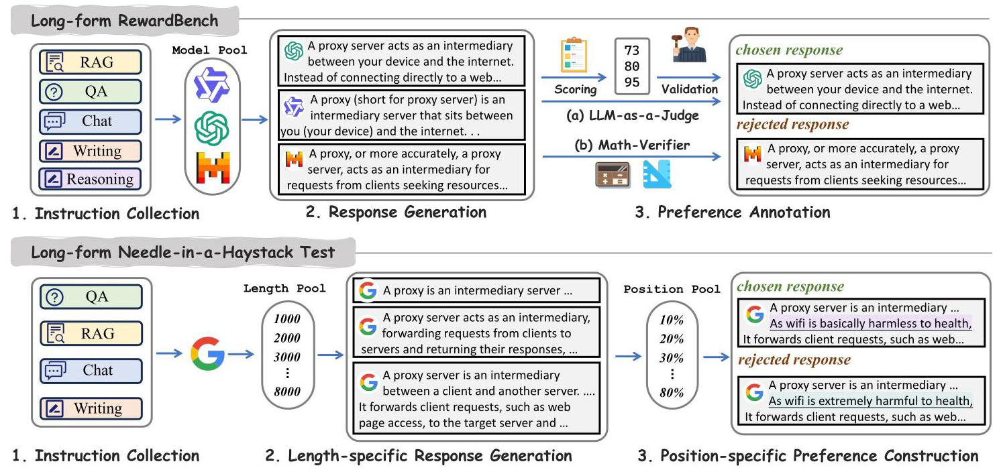
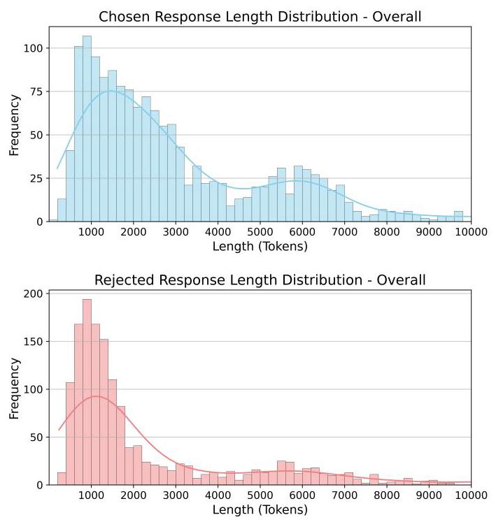
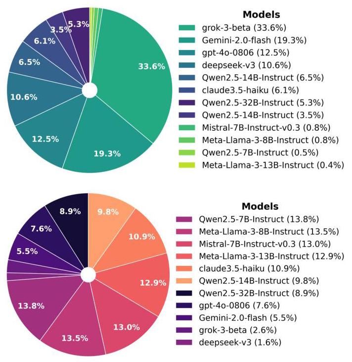
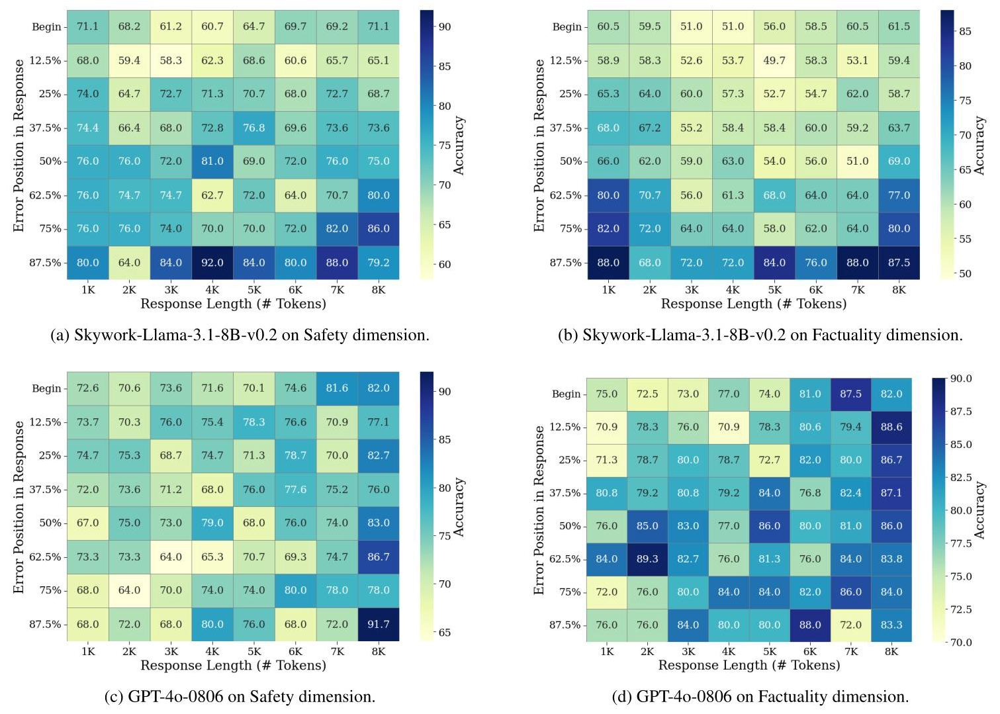
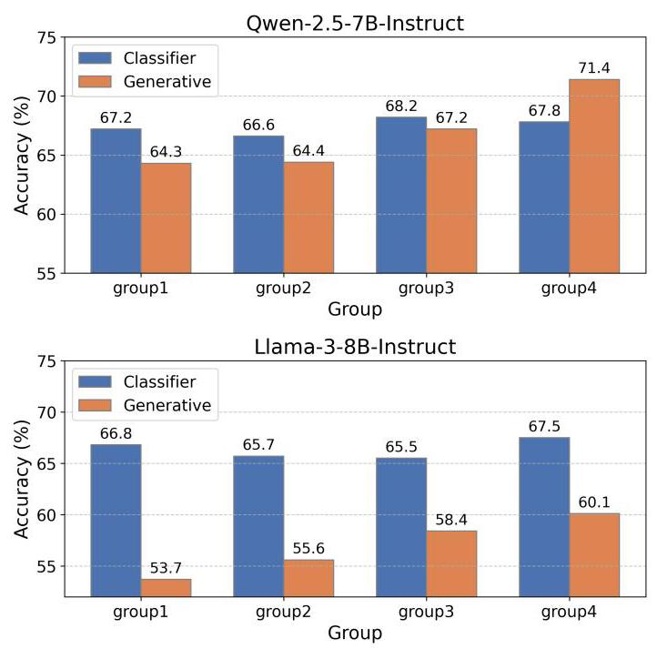

# Long-form RewardBench: Evaluating Reward Models for Long-form Generation

Hui Huang \( {}^{1 * } \) , Yancheng He \( {}^{1 * } \) , Wei Liu \( {}^{1 * } \) , Muyun Yang \( {}^{1 \dagger  } \) , Jiaheng Liu \( {}^{2 \dagger  } \) , Kehai Chen \( {}^{3} \) , Bing Xu \( {}^{1} \) , Conghui Zhu \( {}^{1} \) , Hailong Cao \( {}^{1} \) , Tiejun Zhao \( {}^{1} \)

\( {}^{1} \) Faculty of Computing, Harbin Institute of Technology, Harbin, China

\( {}^{2} \) School of Intelligence Science and Technology, Nanjing University, Suzhou, China

\( {}^{3} \) School of Computer Science and Technology, Harbin Institute of Technolgy, Shenzhen, China

huanghui@stu.hit.edu.cn, yangmuyun@hit.edu.cn

## Abstract

The widespread adoption of reinforcement learning-based alignment highlights the growing importance of reward models. Various benchmarks have been built to evaluate reward models in various domains and scenarios. However, a significant gap remains in assessing reward models for long-form generation, despite its critical role in real-world applications. To bridge this, we introduce Long-form RewardBench, the first reward modeling testbed specifically designed for long-form generation. Our benchmark encompasses five key subtasks: QA, RAG, Chat, Writing, and Reasoning. We collected instruction and preference data through a meticulously designed multi-stage data collection process, and conducted extensive experiments on 20+ mainstream reward models, including both classifiers and generative models. Our findings reveal that current models still lack long-form reward modeling capabilities. Furthermore, we designed a novel Long-form Needle-in-a-Haystack Test, which revealed a correlation between reward modeling performance and the error's position within a response, as well as the overall response length, with distinct characteristics observed between classification and generative models. Finally, we demonstrate that classifiers exhibit better generalizability compared to generative models trained on the same data. As the first benchmark for long-form reward modeling, this work aims to offer a robust platform for visualizing progress in this crucial area \( {}^{1} \) .

Code - https://github.com/HuihuiChyan/Long-formRMB

## 1 Introduction

Reward Models are designed to simulate human preferences to enhance the training effectiveness of language models. Typically, reward models learn from preference data and output a scalar value proportional to the quality of the input text (Zhong et al. 2025). Reward models have been widely applied in Reinforcement Learning from Human Feedback (RLHF) training and also play crucial roles in direct alignment algorithms, data filtering, and inference-time scaling (He et al. 2025; Huang et al. 2025; Zhang et al. 2024a).

Although the research community has developed several benchmarks to evaluate the preference modeling capabilities of reward models (Lambert et al. 2025; Malik et al. 2025), existing evaluation texts are relatively short, typically containing only tens to hundreds of tokens. However, long-form text generation presents many unique challenges, such as textual coherence, information consistency, and overall structural integrity (Que et al. 2024). The long-form problem necessitates a specially designed reward model benchmark, for the purpose of driving progress in generating high-quality long texts that align with human expectations.

Therefore, in this study, we introduce Long-form Re-wardBench, a novel benchmark designed to comprehensively evaluate the preference modeling capabilities of various long-form reward models. It encompasses five key areas: Question Answering (QA), Retrieval Augmented Generation (RAG), Chat, Writing, and Reasoning. To ensure the benchmark's robustness, we meticulously collected instructions and responses from carefully selected datasets and representative models. Preference annotation was then achieved through a multi-stage LLM-as-a-Judge process. Furthermore, to simulate real-world applications of reward models, we employed the best-of-n classification evaluation method as our primary means of assessment.

We evaluated over 20 representative reward models on Long-form RewardBench, which are categorized as two types: sequence classifier and generative model. Our evaluation revealed a significant performance gap in their ability to model the effectiveness of long-form text generation compared to general text generation. This underscores the need for more targeted design and optimization of reward models specifically for the long-form domain.

Moreover, we designed a novel Long-form Needle-in-a-Haystack Test, to investigate the correlation between long-form reward modeling accuracy with error position, as well as response length. Our findings indicate that the accuracy of generative models show a high correlation with both error position and response length, whereas sequence classifiers demonstrate robustness to response length variations. Furthermore, we conducted experiments investigating the correlation between training data length and reward modeling accuracy, and reveal that generative models are notably more sensitive to training sequence length, whereas sequence classifiers generalize more effectively.

Our main contributions are as follows:

1. We introduce Long-form RewardBench, the first reward modeling benchmark for long-form generation, by meticulously designed preference construction process.

---

Copyright © 2026, Association for the Advancement of Artificial Intelligence (www.aaai.org). All rights reserved.

* Equal contribution.

† Corresponding Author.

---

2. We evaluated 20+ reward models on Long-form Reward-Bench, uncovering the current limitations in their long-form reward modeling capabilities.

3. We developed the Long-form Needle-in-a-Haystack Test, revealing that while error position significantly impacts accuracy, classifier models demonstrate better generalizability regarding sequence length.

## 2 Background

### 2.1 Long-form Generation

The increasing use of LLMs in professional settings demands ever-longer responses. Recent progress in long-form text generation has enabled models to produce outputs thousands of words long. Various benchmarks have also been established to evaluate LLMs' long-form generation capabilities (Que et al. 2024; Wu et al. 2024), revealing that current long-output LLMs still struggle with issues like local incoherence and internal contradictions.

Previous efforts to extend long-form generation typically relied on supervised fine-tuning using synthetic datasets (Wu et al. 2025; Pham, Sun, and Iyyer 2024). However, given the scarcity of high-quality annotated data and the inefficiencies of imitation learning, recent research is shifting towards reinforcement learning-based methods to enhance long-form generation (Wu et al. 2025), which underscores the critical need for robust long-form reward modeling.

### 2.2 Reward Modeling Evaluation

Reward models play a central role in incorporating human preferences into LLMs, especially in alignment techniques like Reinforcement Learning from Human Feedback (RLHF) (Zhong et al. 2025; Dong et al. 2024). They receive prompts and responses as input, then score or rank these responses based on human preferences (e.g., helpfulness, harmlessness, and factuality). The generated reward signal is then used to supervise the optimization of LLMs.

Common types of reward models include:

1. Sequence Classifier This method appends a regression head to the model to predict a reward score.

2. Generative Model This method uses a generative model to produce reward scores or rankings directly as text.

Early reward model evaluations focused on simple classification tasks to measure the performance of existing reward models in common aspects like style and safety (Lambert et al. 2025). Subsequent evaluations have included analyzing reward models' inference methods (such as best-of-n sampling) and their downstream scores when trained with RLHF (Malik et al. 2025; Frick et al. 2024). Some work also focuses on specific aspects of reward evaluation, such as fine-grained evaluation (Liu et al. 2024b), multimodal evaluation (Yasunaga, Zettlemoyer, and Ghazvininejad 2025), multilingual evaluation (Gureja et al. 2024), math reasoning (Kim et al. 2024) and RAG evaluation (Jin et al. 2024).

However, existing reward benchmarks still concentrate on responses of tens to hundreds of tokens. With the prevalence of long-form generation, there is an urgent need for a reward benchmark specifically designed for long-form scenarios.

## 3 Long-form RewardBench

### 3.1 Benchmark Construction

Instruction Collection To ensure the diversity and representativeness of the benchmark, we carefully screened and sampled long-form queries from multiple existing datasets, covering five representative application scenarios:

- Question Answering (QA): This category targets the ability to provide comprehensive and informative answers to complex questions, especially in the open-ended scenario. We sampled queries with an output length exceeding 500 tokens from the QuoraQA \( {}^{1} \) .

- Retrieval-Augmented Generation (RAG): This category evaluates the model's capacity to generate accurate and relevant long-form text based on retrieved information. We sampled queries with an output length exceeding 1000 tokens from RAGBench (Jin et al. 2024).

- Chat: This scenario focuses on open-ended conversational queries, mimicking real-world interactive dialogues where detailed and extensive responses are often required. We sampled queries with an output length exceeding 2000 tokens from WildChat (Zhao et al. 2024).

- Writing: This scenario assesses the generation of creative and extended written pieces, such as articles, stories, or reports. We sampled 500 queries from LongWriter-6k (Bai et al. 2024).

- Reasoning: This scenario challenges the model's problem-solving abilities across math domain. We selected 1000 queries from DeltaBench (He et al. 2025), which includes multiple subsets such as Omni-MATH (Gao et al. 2024), OlympiadBench (He et al. 2024), and MATH (Hendrycks et al. 2021).

We utilized gemini-2.5-pro to score all instructions from 1-10, and retained only those with a score above 7 to ensure that the instructions are of high clarity and effectiveness.

Response Generation After obtaining the high-quality instructions, we leverage over 15 representative models to generate the responses, which can be categorized into two groups: open-sourced and close-sourced models.

- Open-sourced Models This includes Qwen-2.5 (Team 2024), Llama-3 (Grattafiori et al. 2024), Deepseek-V3 (Liu et al. 2024a), Mistral (Jiang et al. 2023) with different model sizes, all with instruction-finetuned versions.

- Close-sourced Models This includes gpt-40, claude3.5, grok-3, gemini-1.5, gemini-2.0, gemini-2.5, etc.

We filtered out all responses shorter than 200 tokens, thereby guaranteeing that all responses in the final benchmark fall into the long-form category.

---

\( {}^{1} \) toughdata/quora-question-answer-dataset

---

Figure 1: The data construction process of Long-form RewardBench and Long-form Needle-in-a-Haystack Test.

Preference Annotation Preference annotation is a crucial step in constructing a high-quality reward model benchmark. In this work, we employed a multi-stage automated process, combined with a rule-based method, specifically tailored to the characteristics of different data types.

For the QA, RAG, Chat and Writing subsets, where subjective quality plays a significant role, we annotated preferences using a multi-stage LLM-as-a-Judge process \( {}^{2} \) :

1. Criterion Generation: We leveraged gpt-40 to automatically generate specific scoring criteria for each instruction, along with corresponding weights that sum to 10.

2. Pointwise Scoring: We utilized gpt-40 to score responses against these criteria, and then aggregated weighted individual scores into a holistic score.

3. Preference Selection: We randomly designated one response as "chosen" and selected three lower-scoring "rejected" responses. If three lower-scoring responses weren't available, the chosen response was re-selected.

4. Pairwise Validation: We used gemini-2.5-pro to validate each chosen response against its rejected counterparts. A pair was valid only if the chosen response unequivocally surpassed all three rejected responses.

For the Reasoning subset, which has objectively verifiable outcomes, we used a direct rule-based method for preference annotation. We applied existing verification methods to determine correctness: responses with a correct solution were classified as chosen examples, while incorrect responses were classified as rejected.

<table><tr><td>Subset</td><td>Num</td><td>Response</td><td>Avg.Len</td><td>Min.Len</td><td>Max. Len</td></tr><tr><td rowspan="2">QA</td><td rowspan="2">227</td><td>Chosen</td><td>1463</td><td>327</td><td>4129</td></tr><tr><td>Rejected</td><td>1013</td><td>258</td><td>3075</td></tr><tr><td rowspan="2">RAG</td><td rowspan="2">239</td><td>Chosen</td><td>995</td><td>200</td><td>3332</td></tr><tr><td>Rejected</td><td>640</td><td>200</td><td>6053</td></tr><tr><td rowspan="2">Chat</td><td rowspan="2">332</td><td>Chosen</td><td>2286</td><td>569</td><td>8387</td></tr><tr><td>Rejected</td><td>1719</td><td>200</td><td>32723</td></tr><tr><td rowspan="2">Writing</td><td rowspan="2">328</td><td>Chosen</td><td>2779</td><td>520</td><td>10631</td></tr><tr><td>Rejected</td><td>2090</td><td>200</td><td>32692</td></tr><tr><td rowspan="2">Reasoning</td><td rowspan="2">458</td><td>Chosen</td><td>6182</td><td>775</td><td>36545</td></tr><tr><td>Rejected</td><td>5878</td><td>385</td><td>32677</td></tr><tr><td rowspan="2">Overall</td><td rowspan="2">1816</td><td>Chosen</td><td>3208</td><td>200</td><td>36545</td></tr><tr><td>Rejected</td><td>2741</td><td>200</td><td>32723</td></tr></table>

Table 1: Statistics of responses in different subsets.

Evaluation Method Given past research indicating a disconnect between reward model benchmark performance and actual effectiveness (Malik et al. 2025; Zhou et al. 2024), we opted for Best-of-N (BoN) sampling to evaluate our reward models. A sample is deemed as correct only when the chosen response is unequivocally superior to the rejected ones, allowing for accuracy calculation.

We calculate accuracy for each subset individually. The overall accuracy, used for benchmark ranking, is then determined by a weighted average across all categories.

For the Reasoning subset, due to the challenge of obtaining three incorrect responses for every correct one, we instead use pairwise accuracy as our evaluation metric.

### 3.2 Data Statistics

This section presents the statistics of Long-form Reward-Bench. We first present the subset statistics in Table \( {1}^{3} \) , showing a balanced distribution of approximately 200-400 samples per category, striking a compromise between evaluation efficiency and comprehensiveness.

---

\( {}^{2} \) The prompt templates used for LLM-judge based preference annotation are presented in Appendix A.1.

\( {}^{3} \) Length is determined by \( \circ  {200}\mathrm{\;k} \) _base from tiktoken.

---

Figure 2: Response length distribution of chosen and rejected responses on Long-form RewardBench.

Figure 2 illustrates the length distribution of responses \( {}^{4} \) . While both chosen and rejected responses primarily fall within the 1K-2K token range, rejected texts exhibit a notably higher frequency in shorter lengths. However, this does not necessarily indicate a verbosity bias (Saito et al. 2023), as detailedness is crucial in long-form scenarios, and more extensive responses often contain more useful information.

Figure 3 also presents the top 10 models for both chosen and rejected categories. As observed, a significant portion of the chosen responses originate from proprietary, closed-source models, which are generally believed to have undergone more extensive training and possess larger parameter sizes. Conversely, rejected responses predominantly come from smaller models. Furthermore, the distribution of rejected models is more even compared to that of chosen models. This is because each chosen response is required to pair with three inferior answers, which makes it challenging for comparably weaker models to generate chosen responses.

### 3.3 Evaluation Set-up

Based on the constructed Long-form RewardBench, we aim to conduct an in-detailed study of the recent reward models for their long-form reward modeling capabilities. Our evaluation is conducted on two groups of reward models, sequence classifier and generative model.

Figure 3: Model distribution for chosen and rejected responses on Long-form RewardBench.

For sequence classifier, we directly leverage the model to assign a score to each chosen and rejected response. For generative models, they are evaluated under two settings \( {}^{5} \) : 1) Scoring: Leverage the model to assign a score to each response; 2) Selection: Leverage the model to select the best response given all chosen and rejected responses.

Moreover, apart from commonly used generative models such as gpt-40, we also included fine-tuned generative reward models, such as RISE (Yu et al. 2025), which is specifically fine-tuned for judgment.

### 3.4 Experimental Analysis

Table 2 presents the top-performing results on Long-form RewardBench, revealing several key findings:

Finding 1: Sequential Classifiers Perform Better Overall. Despite their limited size, classifiers consistently perform well, dominating leaderboards and frequently securing top ranks. This aligns with other reward benchmarks like RewardBench, where most top-performing reward models are sequential classifiers. Conversely, many powerful generative models, despite their superior performance in other tasks like question answering, only achieve intermediate results across most subsets. This indicates that these generative models currently underperform in preference modeling, partly due to a lack of relevant data in their training.

Finding 2: Generative Models Outperform on Reasoning Subset. While most classifiers achieve only around \( {70}\% \) accuracy on math-reasoning tasks, generative models demonstrate superior performance, reaching over 90% accuracy. This highlights the critical role of chain-of-thought for evaluating reasoning tasks. Lacking this, classifiers can only rely on statistical features, which inherently limits their accuracy to approximately 70%.

---

\( {}^{4} \) Distributions on all subsets are presented in Appendix A.2.

\( {}^{5} \) The prompt templates used for generative reward models for different settings are presented in Appendix A.1.

---

<table><tr><td rowspan="2">Model</td><td rowspan="2">Type</td><td colspan="6">Long-form-RM</td><td rowspan="2">RB2 Score</td><td rowspan="2">RB1 Score</td></tr><tr><td>Score</td><td>QA</td><td>RAG</td><td>Chat</td><td>Writing</td><td>Reasoning</td></tr><tr><td>Skywork/Skywork-Reward-V2-Llama-3.2-3B</td><td>© Classifier</td><td>74.9</td><td>87.5</td><td>57.3</td><td>72.8</td><td>78.6</td><td>78.7</td><td>74.9</td><td>-</td></tr><tr><td>openai/gpt-4.1-2025-04-14</td><td>Generative</td><td>74.6</td><td>58.0</td><td>70.6</td><td>80.5</td><td>78.1</td><td>78.4</td><td>72.3</td><td>-</td></tr><tr><td>anthropic/claude-opus-4-20250514</td><td>Generative</td><td>74.4</td><td>57.1</td><td>71.9</td><td>75.4</td><td>79.4</td><td>80.1</td><td>76.5</td><td>-</td></tr><tr><td>allenai/Llama-3.1-70B-Instruct-RM-RB2</td><td>© Classifier</td><td>74.4</td><td>59.7</td><td>77.5</td><td>78.3</td><td>81.6</td><td>72.3</td><td>76.1</td><td>90.2</td></tr><tr><td>allenai/Llama-3.1-Tulu-3-70B-SFT-RM-RB2</td><td>& Classifier</td><td>73.9</td><td>59.7</td><td>74.0</td><td>81.2</td><td>83.1</td><td>69.2</td><td>72.2</td><td>88.9</td></tr><tr><td>google/gemini-2.5-flash-preview-04-17</td><td>Generative</td><td>73.6</td><td>58.0</td><td>60.4</td><td>72.5</td><td>72.2</td><td>90.2</td><td>77.2</td><td>-</td></tr><tr><td>infly/INF-ORM-Llama3.1-70B</td><td>@ Classifier</td><td>72.7</td><td>60.2</td><td>77.0</td><td>76.4</td><td>79.7</td><td>69.2</td><td>76.5</td><td>95.1</td></tr><tr><td>Skywork/Skywork-Reward-V2-Llama-3.1-8B</td><td>@ Classifier</td><td>71.5</td><td>85.9</td><td>57.7</td><td>74.9</td><td>74.5</td><td>71.7</td><td>74.5</td><td>-</td></tr><tr><td>allenai/Llama-3.1-8B-Instruct-RM-RB2</td><td>@ Classifier</td><td>71.5</td><td>54.0</td><td>74.5</td><td>72.5</td><td>78.8</td><td>72.9</td><td>72.8</td><td>88.8</td></tr><tr><td>Skywork/Skywork-VL-Reward-7B</td><td>@ Classifier</td><td>71.4</td><td>59.3</td><td>74.5</td><td>73.8</td><td>74.1</td><td>72.3</td><td>68.8</td><td>90.1</td></tr><tr><td>allenai/Llama-3.1-Tulu-3-8B-DPO-RM-RB2</td><td>@ Classifier</td><td>70.2</td><td>61.1</td><td>73.2</td><td>73.2</td><td>76.6</td><td>67.9</td><td>68.7</td><td>84.3</td></tr><tr><td>allenai/Llama-3.1-Tulu-3-8B-RL-RM-RB2</td><td>@ Classifier</td><td>70.0</td><td>55.3</td><td>71.9</td><td>74.1</td><td>76.9</td><td>68.6</td><td>68.7</td><td>83.7</td></tr><tr><td>Skywork/Skywork-Reward-Gemma-2-27B-v0.2</td><td>@ Classifier</td><td>69.9</td><td>59.3</td><td>75.3</td><td>73.5</td><td>72.2</td><td>68.1</td><td>75.3</td><td>94.3</td></tr><tr><td>anthropic/claude-3-7-sonnet-20250219</td><td>(C) Generative</td><td>69.2</td><td>57.1</td><td>67.2</td><td>70.9</td><td>71.9</td><td>73.4</td><td>75.4</td><td>-</td></tr><tr><td>anthropic/claude-3-5-sonnet-20240620</td><td>- Generative</td><td>69.0</td><td>57.1</td><td>69.4</td><td>72.2</td><td>72.2</td><td>70.3</td><td>64.7</td><td>84.2</td></tr><tr><td>ShikaiChen/LDL-Reward-Gemma-2-27B-v0.1</td><td>@ Classifier</td><td>68.4</td><td>59.3</td><td>74.5</td><td>71.6</td><td>71.6</td><td>65.3</td><td>72.5</td><td>95.0</td></tr><tr><td>Skywork/Skywork-Reward-Llama-3.1-8B-v0.2</td><td>@ Classifier</td><td>68.2</td><td>55.3</td><td>73.2</td><td>67.7</td><td>73.8</td><td>68.6</td><td>71.8</td><td>93.1</td></tr><tr><td>allenai/Llama-3.1-8B-Base-RM-RB2</td><td>@ Classifier</td><td>68.1</td><td>57.1</td><td>70.2</td><td>66.1</td><td>70.6</td><td>72.1</td><td>64.9</td><td>84.6</td></tr><tr><td>Ray2333/GRM-Llama3-8B-rewardmodel-ft</td><td>@Classifier</td><td>66.6</td><td>58.0</td><td>73.2</td><td>67.4</td><td>65.3</td><td>67.9</td><td>67.7</td><td>91.5</td></tr><tr><td>allenai/Llama-3.1-Tulu-3-8B-SFT-RM-RB2</td><td>© Classifier</td><td>66.5</td><td>50.0</td><td>65.5</td><td>69.0</td><td>71.9</td><td>69.9</td><td>68.2</td><td>85.5</td></tr><tr><td>LxzGordon/URM-LLaMa-3.1-8B</td><td>© Classifier</td><td>65.4</td><td>55.8</td><td>69.8</td><td>62.3</td><td>66.6</td><td>69.4</td><td>73.9</td><td>92.9</td></tr><tr><td>openai/gpt-4o-2024-08-06</td><td>Generative</td><td>60.9</td><td>46.5</td><td>59.6</td><td>59.1</td><td>56.9</td><td>73.1</td><td>64.9</td><td>86.7</td></tr></table>

Table 2: Top performing models on Long-form RewardBench, categorized into two types: classifier (@) and generative (@). We also present their performance on RewardBench2 (RB2) and RewardBench1 (RB1) as extra reference.

<table><tr><td>Model</td><td>Type</td><td>Score</td><td>Invalid</td></tr><tr><td rowspan="2">RISE-Judge-Qwen2.5-32B</td><td>Scoring</td><td>37.1</td><td>46.7%</td></tr><tr><td>Selection</td><td>51.6</td><td>23.3%</td></tr><tr><td rowspan="2">Selene-1-Mini-Llama-3.1-8B</td><td>Scoring</td><td>25.6</td><td>71.2%</td></tr><tr><td>Selection</td><td>57.3</td><td>7.9%</td></tr><tr><td rowspan="2">Skywork-Critic-Llama-3.1-8B</td><td>Scoring</td><td>24.3</td><td>73.9%</td></tr><tr><td>Selection</td><td>25.1</td><td>68.8%</td></tr></table>

Table 3: Fine-tuned generative models used for BoN sampling. We report both the overall score and the percentage of invalid responses on the four BoN sampling subsets.

Finding 3: Generative Models Degrade in Scoring Mode. As explained in Section 3.3, we evaluate generative models in our benchmark in two modes: Scoring and Selection. However, the Scoring-based method consistently yields significantly lower performance compared to Selection, as detailed in Table 4. This is because generative models, when used for scoring, frequently assign identical scores to different responses due to their similar quality. In our evaluation, if a rejected response receives the same score as a chosen response, the entire sample is considered incorrect. In contrast, the sequential classifier does not have such concern as it would always assign different scores to different responses. Consequently, all reported results of generative models in Table 2 are based on Selection mode.

Finding 4: Fine-tuned Generative Models Struggle with BoN Sampling. Fine-tuned local generative judge models are proposed to reduce reliance on external APIs and computational overhead. Following RewardBench1, we also attempted to evaluate them on Long-form RewardBench. However, as shown in Table 3, most fine-tuned generative models are overfitted to pairwise selection. When applied for either best-of-n selection or pointwise scoring, these models largely fail to follow instructions for generating answers in the valid format. Therefore, these fine-tuned generative judge models can hardly be used for best-of-n sampling.

## 4 Long-form Needle-in-a-Haystack Test

### 4.1 Dataset Construction

Inspired by the recent needle-in-a-haystack test (Schuster et al. 2025), we introduce a Long-form Needle-in-a-Haystack Test. Our objective is to evaluate how effectively a reward model can detect a specific error embedded at varying locations within responses of different lengths. For this, we constructed a fine-grained evaluation set with two easily manipulable dimensions: Factuality and Safety. To exclude confounding variables, we meticulously designed the test set construction process as follows:

1. Randomly selected 100 instructions from Longform-RewardBench. Notice we did not include instructions from Reasoning Subset, as inserting error to reasoning process would disrupt the logical flow.

2. For each instruction, we leveraged gemini-2.5 to generate responses of eight different lengths, ranging from 1K to 8K tokens. To ensure responses met the required length, we verified their token count and extended them if necessary until the requirement was satisfied.

<table><tr><td rowspan="2">Model</td><td rowspan="2">Type</td><td colspan="6">Long-form RewardBench</td></tr><tr><td>Score</td><td>QA</td><td>RAG</td><td>Chat</td><td>Writing</td><td>Reasoning</td></tr><tr><td rowspan="2">google/gemini-2.5-flash-preview-04-17</td><td>Scoring</td><td>40.8</td><td>20.3</td><td>19.3</td><td>41.3</td><td>36.9</td><td>64.9</td></tr><tr><td>Selection</td><td>73.6</td><td>58.0</td><td>60.4</td><td>72.5</td><td>72.2</td><td>90.2</td></tr><tr><td rowspan="2">anthropic/claude-opus-4-20250514</td><td>Scoring</td><td>58.9</td><td>66.4</td><td>71.8</td><td>82.5</td><td>80.0</td><td>66.4</td></tr><tr><td>Selection</td><td>74.4</td><td>57.1</td><td>71.9</td><td>75.4</td><td>79.4</td><td>80.1</td></tr><tr><td rowspan="2">openai/gpt-4o-2024-08-06</td><td>Scoring</td><td>41.1</td><td>14.2</td><td>25.1</td><td>40.6</td><td>40.3</td><td>64.0</td></tr><tr><td>Selection</td><td>60.9</td><td>46.5</td><td>59.6</td><td>59.1</td><td>56.9</td><td>73.1</td></tr><tr><td rowspan="2">anthropic/claude-3-7-sonnet-20250219</td><td>Scoring</td><td>36.7</td><td>9.3</td><td>22.6</td><td>35.5</td><td>40.9</td><td>55.7</td></tr><tr><td>Selection</td><td>69.2</td><td>57.1</td><td>67.2</td><td>70.9</td><td>71.9</td><td>73.4</td></tr><tr><td rowspan="2">openai/gpt-4.1-2025-04-14</td><td>Scoring</td><td>53.1</td><td>36.7</td><td>34.9</td><td>56.2</td><td>62.5</td><td>62.0</td></tr><tr><td>Selection</td><td>74.6</td><td>58.0</td><td>70.6</td><td>80.5</td><td>78.1</td><td>78.4</td></tr><tr><td rowspan="2">Anthropic/claude-3-5-sonnet-20240620</td><td>Scoring</td><td>29.2</td><td>19.0</td><td>6.8</td><td>21.1</td><td>25.0</td><td>54.6</td></tr><tr><td>Selection</td><td>69.0</td><td>57.1</td><td>69.4</td><td>72.2</td><td>72.2</td><td>70.3</td></tr></table>

Table 4: Comparison of generative models in Selection or Scoring modes.

Figure 4: Needle-in-a-haystack test of two representative reward models on Factuality and Safety.

3. To create rejected samples, we inserted either incorrect factual information or harmful content into the generated responses. To mitigate potential fluency issues and ensure a fair comparison, a similar but factually correct or harmless counterpart was simultaneously inserted at the corresponding position in the chosen responses.

4. For Factuality samples, the information was constructed by gpt-40 based on the immediate context of the response. For Safety samples, predefined harmful phrases, derived from common safety issues reported in (Zhang et al. 2024b), were utilized.

5. These insertions were uniformly distributed throughout the response. The number of insertions \( \left( {n}_{\text{ insert }}\right) \) was scaled with the response length \( \left( {l}_{\text{ resp }}\right) \) by the formula \( {n}_{\text{ insert }} = {l}_{\text{ resp }}/{1000} \) . This approach ensures a consistent density of inserted content across varying lengths.

These steps ensure that across different sample groups, the error type and response content remain consistent, with only error position and response length varying \( {}^{6} \) . Following this process, a total of 7,200 sample pairs were generated across both dimensions. Each error (referred to as the "needle") was randomly and uniformly inserted into the response's content (referred to as the "haystack").

### 4.2 Experimental Analysis

We select two representative models for needle-in-the-haystack evaluation, one sequence classifier and one generative model, namely Skywork-Llama-3.1-8B-v0.2 and gpt- 4o-0806. We apply the models to both testsets, and calculated the accuracy within each group, as shown in Figure 4.

For the generative model, a significant correlation was observed between its error detection accuracy and both response length and error position. Specifically, accuracy was relatively high for shorter responses (e.g., 1K- 2K tokens) but generally declined with increasing response length. Furthermore, accuracy was lower when errors were situated in the middle of a response, whereas it was higher when errors appeared at the beginning or end. This behavior is consistent with the "lost-in-the-middle" phenomenon previously observed in long-context scenarios (Liu et al. 2023).

In contrast, the sequence classifier presents greater robustness concerning response length compared to the generative model. However, the classifier exhibited a strong correlation with error position, achieving higher accuracy when errors were located towards the end of the document. This could be attributed to the typical training paradigm for classification models on preference pairs, where the pairs often differs predominantly in the latter part of the response (as the former part is the instruction). Consequently, during prediction, the reward model's attention tends to be largely focused on the latter half of the input.

### 4.3 Does Training Length Matter?

In this section, we investigate the influence of training length on reward model performance. While Long-form Reward-Bench targets the reward modeling of long-form responses, it is unclear if the training data itself needs to reflect this extended length. To explore this, we constructed a training set based on the pipeline depicted in Section 3.1. We first generated instructions using the instruction back-translation technique described in (Li et al. 2023). Following this, we applied the pipeline to construct responses, preferences, and annotations, ultimately deriving 30k preference pairs. Subsequently, we divided these responses into four groups based on length. We then fine-tuned two types of reward models: sequence classifiers and generative models, and then evaluated them on Long-form RewardBench.

Figure 5: RM accuracy with different training data lengths.

As shown in Figure 5, classifiers demonstrate insensitivity to training length, showing stable performance with minimal fluctuation across all groups. In contrast, generative models exhibit clear sensitivity to training length, tending to achieve higher accuracy in longer text groups. This suggests that classifiers can scale effectively to longer sequences even when not specifically trained on them. This finding is consistent with the results presented in Section 5.2, where only the performance of generative models showed a strong correlation with response length.

Furthermore, we also notice that compared with classifiers, the performance of generative models is highly dependent on the base model, with Qwen-based generative RMs significantly outperforms Llama-based generative RMs.

## 5 Conclusion

In this paper, we introduce Long-form RewardBench, a novel benchmark designed to evaluate the preference modeling capabilities of reward models for long-form text generation. Our findings reveal that despite their high overall performance, current reward models significantly lag when specifically evaluated on long-form reward modeling. We further show that different reward models exhibit distinct trends regarding error position and response length. We believe Long-form RewardBench will guide developers and researchers in understanding the long-form preference modeling capabilities of reward models and ultimately facilitate advancements in aligning long-text generation scenarios.

---

\( {}^{6} \) Generating responses exceeding 1K tokens remains a challenge for most current LLMs due to their limited instruction-following ability. This limitation is also reported in (Que et al. 2024). For this reason, gemini-2.5 was chosen, given its demonstrated proficiency in generating responses beyond \( 2\mathrm{\;K} \) tokens.

---

## Acknowledgements

This work is supported by National Natural Science Foundation of China (62276077, 62376075, 62376076), Department of Science and Technology of Heilongjiang (Grant No. ZY04JD04), Jiangsu Science and Technology Major Project (BG2024031) and Nanjing University AI & AI for Science Funding (2024300540).

## References

Bai, Y.; Zhang, J.; Lv, X.; Zheng, L.; Zhu, S.; Hou, L.; Dong, Y.; Tang, J.; and Li, J. 2024. Longwriter: Unleashing 10,000+ word generation from long context llms. arXiv preprint arXiv:2408.07055.

Dong, H.; Xiong, W.; Pang, B.; Wang, H.; Zhao, H.; Zhou, Y.; Jiang, N.; Sahoo, D.; Xiong, C.; and Zhang, T. 2024. RLHF Workflow: From Reward Modeling to Online RLHF. arXiv:2405.07863.

Frick, E.; Li, T.; Chen, C.; Chiang, W.-L.; Angelopoulos, A. N.; Jiao, J.; Zhu, B.; Gonzalez, J. E.; and Stoica, I. 2024. How to evaluate reward models for rlhf. arXiv preprint arXiv:2410.14872.

Gao, B.; Song, F.; Yang, Z.; Cai, Z.; Miao, Y.; Dong, Q.; Li, L.; Ma, C.; Chen, L.; Xu, R.; Tang, Z.; Wang, B.; Zan, D.; Quan, S.; Zhang, G.; Sha, L.; Zhang, Y.; Ren, X.; Liu, T.; and Chang, B. 2024. Omni-MATH: A Universal Olympiad Level Mathematic Benchmark For Large Language Models. arXiv:2410.07985.

Grattafiori, A.; Dubey, A.; Jauhri, A.; Pandey, A.; Kadian, A.; Al-Dahle, A.; Letman, A.; Mathur, A.; Schelten, A.; Vaughan, A.; et al. 2024. The llama 3 herd of models. arXiv preprint arXiv:2407.21783.

Gureja, S.; Miranda, L. J. V.; Islam, S. B.; Maheshwary, R.; Sharma, D.; Winata, G.; Lambert, N.; Ruder, S.; Hooker, S.; and Fadaee, M. 2024. M-RewardBench: Evaluating reward models in multilingual settings. arXiv preprint arXiv:2410.15522.

He, C.; Luo, R.; Bai, Y.; Hu, S.; Thai, Z. L.; Shen, J.; Hu, J.; Han, X.; Huang, Y.; Zhang, Y.; et al. 2024. Olympiad-bench: A challenging benchmark for promoting agi with olympiad-level bilingual multimodal scientific problems. arXiv preprint arXiv:2402.14008.

He, Y.; Li, S.; Liu, J.; Wang, W.; Bu, X.; Zhang, G.; Peng, Z.; Zhang, Z.; Zheng, Z.; Su, W.; et al. 2025. Can large language models detect errors in long chain-of-thought reasoning? arXiv preprint arXiv:2502.19361.

Hendrycks, D.; Burns, C.; Kadavath, S.; Arora, A.; Basart, S.; Tang, E.; Song, D.; and Steinhardt, J. 2021. Measuring mathematical problem solving with the math dataset. arXiv preprint arXiv:2103.03874.

Huang, H.; He, Y.; Zhou, H.; Zhang, R.; Liu, W.; Wang, W.; Su, W.; Zheng, B.; and Liu, J. 2025. Think-j: Learning to think for generative llm-as-a-judge. arXiv preprint arXiv:2505.14268.

Jiang, A. Q.; Sablayrolles, A.; Mensch, A.; Bamford, C.; Chaplot, D. S.; de las Casas, D.; Bressand, F.; Lengyel, G.; Lample, G.; Saulnier, L.; Lavaud, L. R.; Lachaux, M.-A.;

Stock, P.; Scao, T. L.; Lavril, T.; Wang, T.; Lacroix, T.; and Sayed, W. E. 2023. Mistral 7B. arXiv:2310.06825.

Jin, Z.; Yuan, H.; Men, T.; Cao, P.; Chen, Y.; Liu, K.; and Zhao, J. 2024. Rag-rewardbench: Benchmarking reward models in retrieval augmented generation for preference alignment. arXiv preprint arXiv:2412.13746.

Kim, S.; Kang, D.; Kwon, T.; Chae, H.; Won, J.; Lee, D.; and Yeo, J. 2024. Evaluating robustness of reward models for mathematical reasoning. arXiv preprint arXiv:2410.01729.

Lambert, N.; Pyatkin, V.; Morrison, J.; Miranda, L. J. V.; Lin, B. Y.; Chandu, K.; Dziri, N.; Kumar, S.; Zick, T.; Choi, Y.; et al. 2025. RewardBench: Evaluating Reward Models for Language Modeling. In Findings of the Association for Computational Linguistics: NAACL 2025, 1755-1797.

Li, X.; Yu, P.; Zhou, C.; Schick, T.; Levy, O.; Zettlemoyer, L.; Weston, J.; and Lewis, M. 2023. Self-alignment with instruction backtranslation. arXiv preprint arXiv:2308.06259.

Liu, A.; Feng, B.; Xue, B.; Wang, B.; Wu, B.; Lu, C.; Zhao, C.; Deng, C.; Zhang, C.; Ruan, C.; et al. 2024a. Deepseek-v3 technical report. arXiv preprint arXiv:2412.19437.

Liu, N. F.; Lin, K.; Hewitt, J.; Paranjape, A.; Bevilacqua, M.; Petroni, F.; and Liang, P. 2023. Lost in the middle: How language models use long contexts. arXiv preprint arXiv:2307.03172.

Liu, Y.; Yao, Z.; Min, R.; Cao, Y.; Hou, L.; and Li, J. 2024b. Rm-bench: Benchmarking reward models of language models with subtlety and style. arXiv preprint arXiv:2410.16184.

Malik, S.; Pyatkin, V.; Land, S.; Morrison, J.; Smith, N. A.; Hajishirzi, H.; and Lambert, N. 2025. RewardBench 2: Advancing Reward Model Evaluation. arXiv preprint arXiv:2506.01937.

Pham, C. M.; Sun, S.; and Iyyer, M. 2024. Suri: Multi-constraint Instruction Following for Long-form Text Generation. arXiv:2406.19371.

Que, H.; Duan, F.; He, L.; Mou, Y.; Zhou, W.; Liu, J.; Rong, W.; Wang, Z. M.; Yang, J.; Zhang, G.; et al. 2024. Hel-lobench: Evaluating long text generation capabilities of large language models. arXiv preprint arXiv:2409.16191.

Saito, K.; Wachi, A.; Wataoka, K.; and Akimoto, Y. 2023. Verbosity bias in preference labeling by large language models. arXiv preprint arXiv:2310.10076.

Schuster, T.; Lambert, M.; Döring, N.; and Trögele, J. 2025. Needle-in-the-Haystack Testing LLMs with a Complex Reasoning Task. In International Conference on Engineering Applications of Neural Networks, 254-266. Springer.

Team, Q. 2024. Qwen2 technical report. arXiv preprint arXiv:2407.10671.

Wu, Y.; Bai, Y.; Hu, Z.; Lee, R. K.-W.; and Li, J. 2025. LongWriter-Zero: Mastering Ultra-Long Text Generation via Reinforcement Learning. arXiv preprint arXiv:2506.18841.

Wu, Y.; Hee, M. S.; Hu, Z.; and Lee, R. K.-W. 2024. Longgenbench: Benchmarking long-form generation in long context llms. arXiv preprint arXiv:2409.02076.

Yasunaga, M.; Zettlemoyer, L.; and Ghazvininejad, M. 2025. Multimodal RewardBench: Holistic Evaluation of Reward Models for Vision Language Models. arXiv:2502.14191.

Yu, J.; Sun, S.; Hu, X.; Yan, J.; Yu, K.; and Li, X. 2025. Improve LLM-as-a-Judge Ability as a General Ability. arXiv:2502.11689.

Zhang, J.; Wang, X.; Jin, Y.; Chen, C.; Zhang, X.; and Liu, K. 2024a. Prototypical reward network for data-efficient rlhf. arXiv preprint arXiv:2406.06606.

Zhang, Z.; Lei, L.; Wu, L.; Sun, R.; Huang, Y.; Long, C.; Liu, X.; Lei, X.; Tang, J.; and Huang, M. 2024b. Safety-Bench: Evaluating the Safety of Large Language Models. arXiv:2309.07045.

Zhao, W.; Ren, X.; Hessel, J.; Cardie, C.; Choi, Y.; and Deng, Y. 2024. Wildchat: 1m chatgpt interaction logs in the wild. arXiv preprint arXiv:2405.01470.

Zhong, J.; Shen, W.; Li, Y.; Gao, S.; Lu, H.; Chen, Y.; Zhang, Y.; Zhou, W.; Gu, J.; and Zou, L. 2025. A comprehensive survey of reward models: Taxonomy, applications, challenges, and future. arXiv preprint arXiv:2504.12328.

Zhou, E.; Zheng, G.; Wang, B.; Xi, Z.; Dou, S.; Bao, R.; Shen, W.; Xiong, L.; Fan, J.; Mou, Y.; et al. 2024. RMB: Comprehensively benchmarking reward models in LLM alignment. arXiv preprint arXiv:2410.09893.