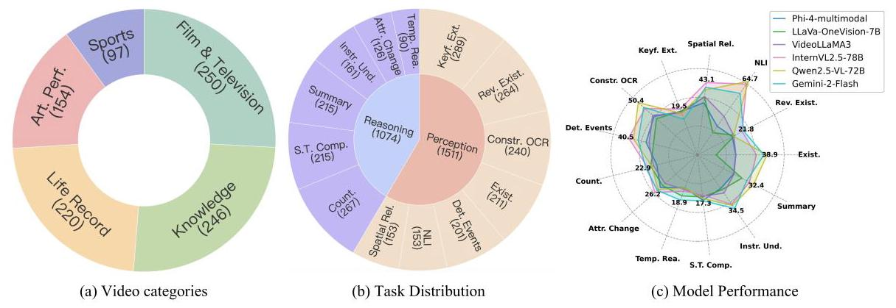
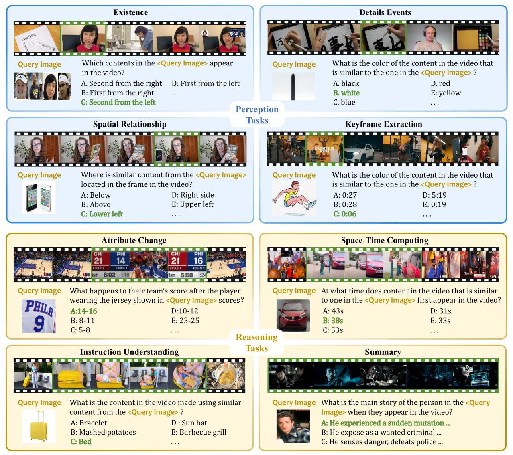
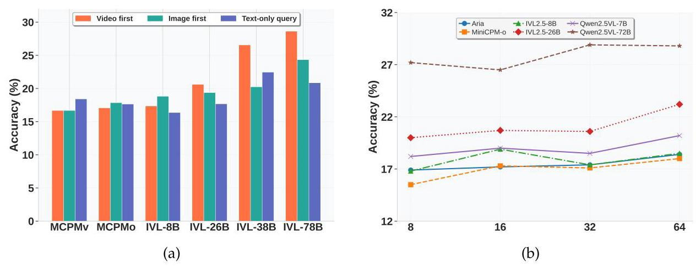
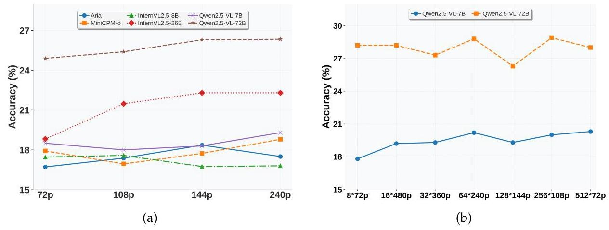
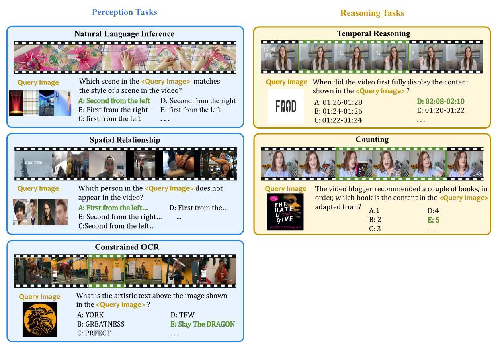
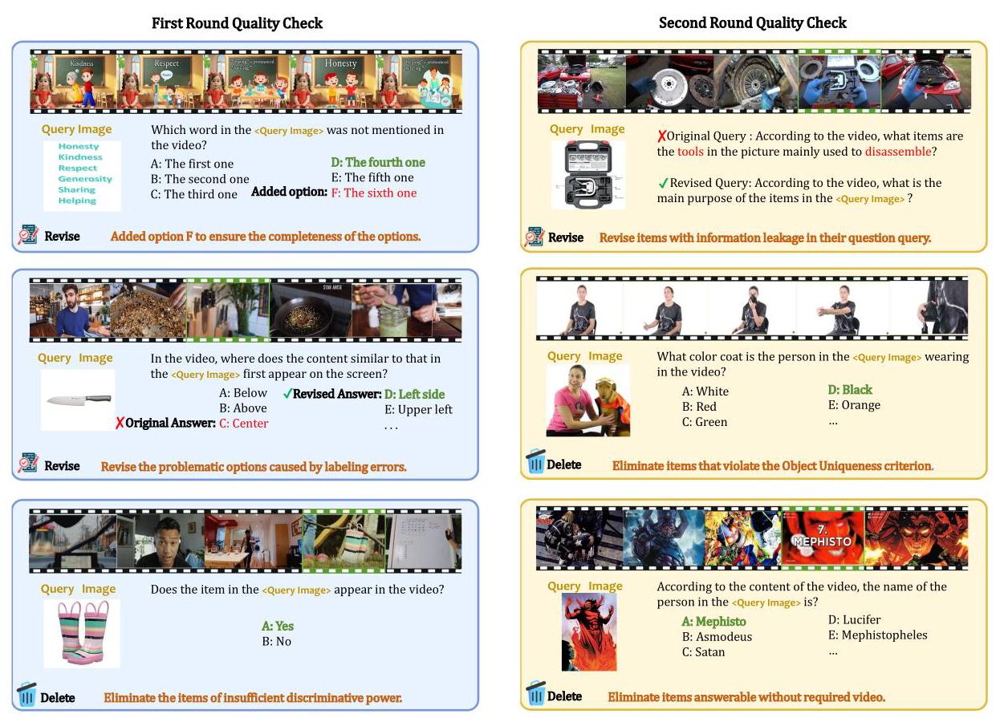
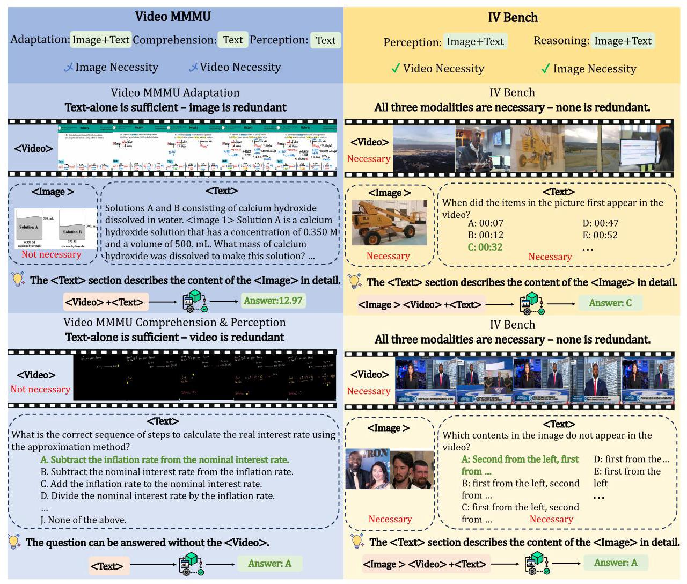

# IV-Bench: A Benchmark for Image-Grounded Video Perception and Reasoning in Multimodal LLMs

M-A-P

ByteDance Inc.

## Abstract

Existing evaluation frameworks for Multimodal Large Language Models (MLLMs) primarily focus on image reasoning or general video understanding tasks, largely overlooking the significant role of image context in video comprehension. To bridge this gap, we propose IV-Bench, the first comprehensive benchmark for evaluating Image-Grounded Video Perception and Reasoning. IV-Bench consists of 967 videos paired with 2,585 meticulously annotated image-text queries across 13 tasks (7 perception and 6 reasoning tasks) and 5 representative categories. Extensive evaluations of state-of-the-art open-source (e.g., InternVL2.5, Qwen2.5-VL) and closed-source (e.g., GPT-40, Gemini2-Flash and Gemini2-Pro) MLLMs demonstrate that current models substantially underperform in image-grounded video Perception and Reasoning, merely achieving at most 28.9% accuracy. Further analysis reveals key factors influencing model performance on IV-Bench, including inference pattern, frame number, and resolution. Additionally, through a simple data synthesis approach, we demonstratethe challenges of IV-Bench extend beyond merely aligning the data format in the training process. These findings collectively provide valuable insights for future research. Our codes and data are released in https://github.com/multimodal-art-projection/IV-Bench.

Figure 1. (a) Video Categories. IV-Bench includes videos spanning five representative categories, ensuring diverse topical coverage. (b) Task distribution in IV-Bench. IV-Bench consists of a total of 13 tasks, which are categorized into two main types: 6 reasoning tasks and 7 perception tasks. (c) Model Performance on IV-Bench. All evaluated MLLMs exhibit limited performance on IV-Bench. Even on the best-performing task (Natural Language Inference), the highest achieved accuracy is merely 64.7%, with other tasks resulting in substantially lower scores.

## Contents

1 Introduction

3

2 IV-Bench

4

2.1 Overview

4

2.2 Task Definitions

5

2.3 Annotation and Quality Control

6

2.3.1 Annotation Process

6

2.3.2 Quality Control

7

3 Comparison with other video benchmarks

7

4 Experiments

8

4.1 Settings

8

4.2 Main Results

9

4.3 Ablation Study

10

4.3.1 The Impact of Inference Pattern

11

4.3.2 Analysis of the Number of Visual Tokens

11

4.4 Simple Data Synthesis Approach

12

5 Related Work

13

5.1 Multimodal Large Language Models

13

5.2 Video Understanding Benchmarks

14

6 Conclusion

14

7 Contributions and Acknowledgments

15

A Annotation Tutorial

20

A.1 Question Type

20

A.2 Data Annotation Steps

21

A.2.1 Methods for Designing Distractors

24

B Quality Control Process Details

25

B.1 Round 1 Quality Control

25

B. 2 Round 2 Quality Control

25

C Infernce prompt

26

D Comparison with Video-MMMU

27

## 1. Introduction

Building upon the remarkable success of Large Language Models (LLMs) across various AI tasks [Young et al., 2024, Zhang et al., 2024b], Multimodal Large Language Models (MLLMs) have shown impressive capabilities in integrating and interpreting information from multiple modalities, such as text, images, and videos [Liu et al., 2023, Chen et al., 2024b, Guo et al., 2024]. Consequently, diverse benchmarks [Yue et al., 2024, Zhang et al., 2024a, Hu et al., 2025, Cheng et al., 2025, Wu et al., 2024a, b, Zhu et al., 2024] have emerged to systematically evaluate their multimodal integration and task-solving capabilities.

Images capture subtle details, such as facial features, that are difficult to accurately describe in text, especially when a person's identity is unknown. For instance, if we lack a name, text descriptions may resort to vague clues like clothing color or hair color, which might not be sufficient to uniquely identify someone. In contrast, images offer complete visual cues that clearly depict these details. However, existing video benchmarks typically focus on general video comprehension with purely text-based queries, neglecting the critical scenario where static images provide essential context for video understanding [Fang et al., 2025, Li et al., 2024c]. Image-grounded video perception and reasoning-the ability to leverage a image as critical contextual information to locate and interpret video content-is fundamental for numerous real-world applications, such as accurate scene interpretation, object recognition, and event retrieval. Despite its importance, there is currently no benchmark specifically designed to evaluate this capability.

To address this critical research gap, we introduce IV-Bench, the first comprehensive benchmark for evaluating MLLMs in image-grounded video perception and reasoning tasks. IV-Bench comprises 967 videos paired with 2,585 meticulously annotated image-text queries, spanning 13 distinct tasks (7 perception and 6 reasoning tasks) across five representative categories (Knowledge, Film & Television, Sports Competition, Artistic Performance, and Life Record), as shown in Figure 1(a). Notably, the images used in IV-Bench are sourced externally, not extracted from the videos, ensuring the generalizability and robustness of the benchmark.

We conduct extensive evaluations on 23 state-of-the-art open-source models (e.g., In-ternVL2.5 [Chen et al., 2024a], Qwen2.5-VL series [Bai et al., 2025]) and 4 closed-source models (e.g., Doubao-1.5-vison-pro[Doubao Team, 2025], GPT-40 [OpenAi, 2024], Gemini-2 Flash [Team et al., 2024], Gemini-2 Pro [Team et al., 2024]). Results demonstrate that existing models substantially struggle with image-grounded video perception and reasoning tasks, with the top-performing MLLMs achieving only 28.9% accuracy. Performance deteriorates further on complex reasoning tasks such as Temporal Reasoning, underscoring significant limitations and highlighting a critical research gap.

Furthermore, ablation studies comparing models with and without image contexts reveal that smaller models show minimal benefit from incorporating images, whereas larger models significantly benefit from image contexts, particularly when images follow the video. Additional analysis identify other key factors influencing model performance, providing valuable insights for future research.

To investigate whether the lack of video image formatted training data contributes to the performance gap on IV-Bench, we employ a simple synthetic data pipeline that automatically generates supervised fine-tuning examples from existing video QA datasets. Although this automated augmentation yields slight improvements, the gains remain minimal-suggesting that the challenges of IV-Bench arise from deeper image-grounded video understanding ability demands rather than mere data format alignment. We hope these results will motivate the development of more advanced methods for tackling image-grounded video perception and reasoning.

In summary, our work has three-fold contributions:

- IV-Bench. We present IV-Bench, the first comprehensive benchmark for image-grounded video perception and reasoning in MLLMs. IV-Bench comprises 967 videos paired with 2,585 meticulously annotated image-text queries, where the images, collected from external sources rather than extracted from the videos themselves, provide the essential context required to accurately answer the queries. The dataset spans 5 major categories and covers 13 distinct tasks (7 perception and 6 reasoning tasks), ensuring substantial diversity across various scenarios and task types. Moreover, two round quality control—one ensuring clarity, accuracy, and category labeling, and another confirming that both image and video are required to answer correctly, ensuring the high quality of IV-Bench.

- Comprehensive Evaluation of MLLMs. We evaluate 27 state-of-the-art MLLMs, including the latest closed-source models (e.g., GPT-40, Gemini-2-Flash and Gemini-2-Pro) and open-source models (e.g., InternVL2.5 and Qwen2.5-VL series). Our experiments reveal that current models perform sub-optimally on image-grounded video perception and reasoning, with the best model achieving only 28.9% overall accuracy and just 24.9% on reasoning tasks-clearly indicating an urgent need for enhanced image-grounded video perception and reasoning capabilities in MLLMs.

- Insights for Future Research. Our analysis provides key insights to guide future research. Ablation studies indicate that increasing frame number and video resolution positively affect performance. Moreover, larger models significantly benefit from image contexts presented after the video, while smaller models show minimal improvements. Through a simple data synthesis approach, we demonstrate that the challenges of IV-Bench do not arise from a lack of video-image format alignment in training data, which underscoring the need for more advanced methods beyond mere format alignment.

## 2. IV-Bench

### 2.1. Overview

IV-Bench is designed to evaluate image-grounded video perception and reasoning, aiming to assess the capabilities of MLLMs in utilizing external visual cues for localization, reasoning, and comprehension of video content. IV-Bench consists of 967 diverse videos paired with 2,585 image-text queries, with each image providing indispensable contextual cues necessary for correctly answering the queries. The dataset spans 13 distinct tasks. Key features of IV-Bench include:

- Image-Text Queries. For each video, we design multiple image-text queries. Each query includes an externally sourced image-not extracted from the video itself-and an associated textual question. These externally sourced images guarantee greater visual diversity and better simulate real-world usage scenarios, providing critical contextual cues necessary to accurately answer the queries.

- Diverse Video Categories. The dataset covers a wide array of categories including Knowledge, Film & Television, Sports Competitions, Artistic Performances, and Life Records, ensuring extensive content diversity for various research purposes. Each video, with a minimum duration of five minutes, provides sufficient depth for comprehensive analysis.

- Diverse Evaluation Tasks. As illustrated in Figure 1(b), IV-Bench offers 13 distinct evaluation tasks grouped into perception and reasoning categories. These tasks comprehensively assess the capability of MLLMs to perform image-grounded video perception and reasoning, spanning a diverse set of perceptual and reasoning skills.

Figure 2. Representative examples from IV-Bench. Each sample consists of a video paired with an image-text query, comprising a query image and corresponding query text. The correct answer is marked in green, with relevant video frames also highlighted in green.

### 2.2. Task Definitions

IV-Bench comprises 7 perception tasks and 6 reasoning tasks, with representative examples of selected tasks shown in Figure 2. Additional examples of the remaining tasks are provided in Figure 5. These tasks address various aspects of image-grounded video comprehension, spanning from basic perception to complex reasoning. Detailed descriptions of each task are presented below.

Perception Tasks: These tasks evaluate the model's capability to directly extract and interpret fundamental visual information from the video. They primarily focus on recognizing objects, people, scenes, and spatial relationships by leveraging contextual cues from the reference image. In essence, perception tasks assess the model's ability to accurately "see" and identify content within the video.

- Existence: Identify which objects or people in the reference image appear in the video.

- Reverse Existence: Identify objects or people present in the image but absent in the video.

- Natural Language Inference (NLI): Determine which scenes in the video are similar to a specific scene in the image.

- Spatial Relationship: Identify absolute or relative spatial relationships among objects or people in the video, grounded by the reference image.

- Keyframe Extraction: Identify precise timestamps or segments within the video where objects or people depicted in the image appear.

- Constrained OCR: Recognize text-based content in the video, constrained by conditions explicitly defined by the reference image, such as spatial alignment, temporal correspondence, and semantic relevance.

- Detailed Events: Identify specific events or actions within the video directly related to content depicted in the reference image.

Reasoning Tasks: These tasks require models to engage in higher-order cognitive functions by integrating visual cues with contextual and temporal information. They assess the model's capacity to analyze, synthesize, and infer meaningful conclusions beyond simple visual recognition.

- Counting: Count occurrences of a person, object, or action depicted in the video, grounded by the reference image.

- Space-Time Computing: Calculate event durations or distances between objects/people in the video, using the image as contextual guidance.

- Summary: Generate a brief description summarizing a person, object, or event depicted in the video, informed by the reference image.

- Instruction Understanding: Understand the functionality or creation process of objects depicted in the video, guided by the reference image.

- Attribute Change: Detect changes in attributes (e.g., clothing, size, color) of objects or people throughout the video, referenced by the image.

- Temporal Reasoning: Infer precise start and end timestamps of target events using temporal cues and world knowledge, as introduced in [Huang et al., 2024].

### 2.3. Annotation and Quality Control

The high quality of IV-Bencg stems from a rigorous annotation protocol and two-stage quality control: annotators review each video, assign one task type, then select or create external images exclusively from non-video sources and formulate questions with up to nine plausible distractors. In the first round quality control, we verify question clarity, answer accuracy, and label consistency; and in the second round, we remove any items solvable by video or common sense, eliminate visual-information leakage, and ensure that each sample includes at least two "effective" distractors that, although incorrect for the current image, would become the correct answer to a different question with the identical text query but a different image, thereby ensuring each sample's image necessity.

#### 2.3.1. Annotation Process

- Video Collection: A total of 976 videos, each exceeding five minutes in length, are carefully selected to ensure broad topical coverage. These videos span five distinct categories: Knowledge, Film & Television, Sports, Artistic Performances, and Life Records, providing diverse content suitable for various research applications.

- Task Assignment: Annotators first watch each video in its entirety before performing image and text annotations. They then assign an appropriate task type from 13 predefined categories (detailed below). This initial task assignment guides subsequent annotations, ensuring alignment with task-specific requirements.

- Image and Question Annotation: After task assignment, annotators manually retrieve a relevant external image from online sources, explicitly ensuring it is not extracted from the video itself. The selected image must be closely related to specific keywords, individuals, or themes present in the video. Annotators then formulate a text question leveraging both the video content and contextual cues provided by the image.

- Answer and Distractor Design: Annotators craft the correct answer by carefully analyzing multimodal information from both the video and the image. Additionally, they generate up to nine plausible yet incorrect distractors to increase the question's difficulty while ensuring contextual relevance. For certain questions, fewer distractors may be provided depending on content constraints.

#### 2.3.2. Quality Control

Ensuring the quality and consistency of the data is crucial for creating a reliable dataset. Our quality control process is conducted in two main rounds (see appendix 6 for more detail of quality control):

- First Round Quality Control: The First round quality check focuses on the structure and content standardization of evaluation questions. It mainly checks whether the query and options are clearly described, whether the answer is correct, and whether the distractors can effectively mislead test-takers. So we verify the clarity, precision, and unambiguity of each question. We also confirm that the correct answers and distractors are both plausible and contextually relevant, ensuring each query can be accurately answered based on the provided video and image. Furthermore, we check task categorization accuracy, correcting any misclassifications to maintain consistency across all 13 predefined tasks.

- Second Round Quality Control: Since some questions can be answered using only common sense or video content-we conduct a second round of quality check. During this phase, any query that can be resolved without the reference image or video is simply removed, and any text query that inadvertently reveals visual content is rewritten to eliminate leakage. We also pinpoint ineffective distractors--those easily dismissed using video alone-and manually introduce at least two effective distractors per question; These distractors are crafted so that, although incorrect for the current image, they would serve as the correct answers to alternative questions sharing the same text query but paired with a different image-thereby ensuring that the image is necessary for each sample in IV-Bench.

Two rounds of rigorous quality control-verifying question clarity, answer correctness, prevention of image-information leakage, and the inclusion of effective distractors-substantially bolster the integrity of IV-Bench. Collectively, these measures establish IV-Bench as a high-quality dataset for advancing image-grounded video perception and reasoning research.

## 3. Comparison with other video benchmarks

As shown in Table 1, existing approaches can be broadly categorized into two groups: benchmarks with text-only queries and those with combined image-text queries.

Benchmarks with text-only queries primarily emphasize evaluating video understanding guided solely by textual instructions. For instance, benchmarks such as MMBench-Video [Fang et al., 2025], Video-Bench [Ning et al., 2023], and four others mainly target short-video analysis tasks (typically under 180 seconds), exhibiting notable limitations in evaluating long-range temporal reasoning. Benchmarks such as LongVideoBench [Wu et al., 2025], MLVU [Zhou et al., 2024], and Video-MME [Hu et al., 2025] broaden evaluation scope by constructing corpora comprising videos of varied lengths, with Video-MME specifically averaging around 500 seconds. Notably, Video-MME innovatively incorporates additional evaluation dimensions, including subtitle recognition and audio understanding. However, none of these benchmarks employ image-text queries, thus limiting their capability to evaluate image-grounded video perception and reasoning.

Table 1. A comparison of representative video benchmarks. Benchmarks are categorized based on query modality into text-only benchmarks and image-text benchmarks. IV-Bench is the first manually annotated benchmark explicitly designed to evaluate image-grounded video perception and reasoning, comprising 7 perception tasks and 6 reasoning tasks. ImgSrc, ImgNec, and VidNec are abbreviations for Image Source, Image Necessity, and Video Necessity, respectively.

<table><tr><td>Query Modality</td><td>Benchmark</td><td>#Videos</td><td>Duration. (s)</td><td>#Tasks</td><td>#QA Pairs</td><td>Anno.</td><td>#Avg. Opt.</td><td>ImgSrc</td><td>ImgNec</td><td>VidNec</td></tr><tr><td rowspan="9">Text</td><td>MMBench-Video</td><td>609</td><td>165</td><td>26</td><td>1,998</td><td>M</td><td>-</td><td>-</td><td>-</td><td>✓</td></tr><tr><td>Video-Bench</td><td>5,917</td><td>56</td><td>10</td><td>17,036</td><td>M & A</td><td>4</td><td>-</td><td>-</td><td>✓</td></tr><tr><td>EgoSchema</td><td>5,063</td><td>180</td><td>-</td><td>5,063</td><td>M & A</td><td>5</td><td>-</td><td>-</td><td>✓</td></tr><tr><td>AutoEval-Video</td><td>327</td><td>14.6</td><td>-</td><td>327</td><td>A</td><td>-</td><td>-</td><td>-</td><td>✓</td></tr><tr><td>TempCompass</td><td>410</td><td>11.4</td><td>-</td><td>7,540</td><td>M & A</td><td>-</td><td>-</td><td>-</td><td>✓</td></tr><tr><td>MVBench</td><td>3,641</td><td>16</td><td>20</td><td>4,000</td><td>M</td><td>4</td><td>-</td><td>-</td><td>✓</td></tr><tr><td>LongVideoBench</td><td>3,763</td><td>473</td><td>17</td><td>6,678</td><td>M</td><td>4</td><td>-</td><td>-</td><td>✓</td></tr><tr><td>MLVU</td><td>1.730</td><td>930</td><td>9</td><td>3,102</td><td>M & A</td><td>4 or 6</td><td>-</td><td>-</td><td>✓</td></tr><tr><td>Video-MME</td><td>900</td><td>1,017.9</td><td>12</td><td>2,700</td><td>M</td><td>4</td><td>-</td><td>-</td><td>✓</td></tr><tr><td rowspan="3">Text+Image   Text-only/Text+Image Text+Image</td><td>V2P-Bench</td><td>980</td><td>1140</td><td>12</td><td>1172</td><td>M</td><td>4</td><td>In-Video</td><td>✓</td><td>✓</td></tr><tr><td>Video-MMMU</td><td>300</td><td>506.2</td><td>6</td><td>900</td><td>M</td><td>10</td><td>Out-of-Video</td><td>✘</td><td>✘</td></tr><tr><td>IV-Bench</td><td>967</td><td>537</td><td>13</td><td>2,585</td><td>M</td><td>9</td><td>Out-of-Video</td><td>✓</td><td>✓</td></tr></table>

Comprising 980 videos and 1,172 visual-prompt QA pairs, V2P-Bench [Zhao et al., 2025] encompasses five principal tasks and twelve specialized dimensions for the assessment of fine-grained video comprehension via visual prompts. Nonetheless, deriving visual prompts solely from video frames limits both the diversity of visual content and the range of real-world usage scenarios. Among video benchmarks employing image-text queries, Video-MMMU [Hu et al., 2025] is the only one to leverage external images—i.e. images sourced from out of video-to assess the ability of MLLMs to acquire knowledge from videos. In contrast, IV-Bench is the first manually annotated benchmark explicitly created for image-grounded video perception and reasoning, with each query meticulously formulated to ensure the image information is essential for deriving the correct answer. IV-Bench differs from Video-MMMU by making the video indispensable for every query, pairing text with an image in every query, and using effective distractors to ensure that the image is always necessary for each query. Refer to the Appendix for illustrative examples that compare IV-Bench and VideoMMMU.

## 4. Experiments

In this section, we evaluate multiple representative MLLMs using IV-Bench. We first introduce the evaluated models and experimental settings, followed by a quantitative comparison of performance between open-source and commercial (closed-source) models. We then analyze the impact of various factors on model performance, including frame number, resolution, and inference patterns. Finally, we propose a simple synthetic data approach to further validate the inherent difficulty and quality of IV-Bench.

### 4.1. Settings

We evaluate 4 commercial models: Doubao-1.5-vision-pro [Doubao Team, 2025], GPT-40 [Ope-nAi, 2024] Gemini 2 Flash [Team et al., 2024], and Gemini 2 Pro [Team et al., 2024]. For open-source models, we select 23 representative MLLMs, including the Qwen2.5-VL series, InternVL2.5-VL series, and VideoLLaMA3 [Zhang et al., 2025a]. We employ a uniform sampling strategy to process video frames. For all models, we uniformly set the frame number to 32. The default evaluation input format is "video frames + image + question" with prompts, indicating that video frames are provided first, followed by the image. Since test samples in IV-Bench are multiple-choice questions with 10 options, we adopt accuracy as the evaluation metric, where random guessing accuracy is 10%. Accuracy is computed by directly matching the model's output to the correct answer.

Table 2. The performance of MLLMs on IV-Bench across 13 tasks, comprising 7 perception tasks and 6 reasoning tasks. For each task, the best performance is indicated in bold, and the second-best performance is indicated with underlining. Note that "P-Avg" and "R-Avg" denote the average results on perception and reasoning tasks, respectively.

<table><tr><td rowspan="2">Models</td><td rowspan="2">Overall</td><td colspan="8">Perception</td><td colspan="7">Reasoning</td></tr><tr><td>Exist.</td><td>\( \mathbf{{RE}} \)</td><td>NLI</td><td>SR</td><td>KE</td><td>CO</td><td>DE</td><td>P-Avg</td><td>Cnt.</td><td>AC</td><td>TR</td><td>STC</td><td>IU</td><td>Sum.</td><td>R-Avg</td></tr><tr><td colspan="17">Open Source MLLMs(< 10B)</td></tr><tr><td>Llama-vid [Li et al., 2024d]</td><td>10.5</td><td>13.3</td><td>10.6</td><td>6.5</td><td>7.2</td><td>9.8</td><td>13.3</td><td>16.0</td><td>11.2</td><td>7.1</td><td>8.7</td><td>2.2</td><td>12.2</td><td>11.2</td><td>12.3</td><td>9.5</td></tr><tr><td>LLaVA-Mini [Zhang et al., 2025b]</td><td>12.5</td><td>7.1</td><td>12.1</td><td>9.8</td><td>15.0</td><td>10.8</td><td>12.9</td><td>18.0</td><td>12.1</td><td>12.7</td><td>13.5</td><td>13.3</td><td>14.0</td><td>14.7</td><td>11.3</td><td>13.1</td></tr><tr><td>MAmmoTH-VL-8B [Guo et al., 2024]</td><td>13.3</td><td>3.3</td><td>8.7</td><td>3.9</td><td>29.4</td><td>10.5</td><td>19.6</td><td>14.5</td><td>12.4</td><td>12.7</td><td>16.7</td><td>7.8</td><td>13.1</td><td>14.0</td><td>20.3</td><td>14.5</td></tr><tr><td>Longva [Zhang et al., 2024d]</td><td>14.4</td><td>5.2</td><td>20.1</td><td>4.6</td><td>20.3</td><td>13.9</td><td>27.5</td><td>19.5</td><td>16.4</td><td>7.5</td><td>11.9</td><td>14.4</td><td>15.0</td><td>10.5</td><td>13.2</td><td>11.7</td></tr><tr><td>NVILA [Liu et al., 2024b]</td><td>14.4</td><td>2.4</td><td>17.4</td><td>2.6</td><td>22.2</td><td>13.2</td><td>24.6</td><td>14.0</td><td>14.2</td><td>12.7</td><td>18.3</td><td>18.9</td><td>17.3</td><td>14.7</td><td>10.8</td><td>14.7</td></tr><tr><td>Longvu [Shen et al., 2024]</td><td>14.8</td><td>3.8</td><td>17.1</td><td>11.1</td><td>20.9</td><td>11.5</td><td>19.6</td><td>19.5</td><td>14.7</td><td>18.0</td><td>16.7</td><td>8.9</td><td>15.9</td><td>16.8</td><td>10.9</td><td>15.0</td></tr><tr><td>Phi-3.5-vision [Microsoft, 2024]</td><td>15.2</td><td>5.2</td><td>12.9</td><td>11.1</td><td>23.5</td><td>10.8</td><td>25.0</td><td>22.5</td><td>15.5</td><td>16.1</td><td>15.9</td><td>11.1</td><td>13.6</td><td>14.7</td><td>15.6</td><td>14.8</td></tr><tr><td>Phi-4-multimodal [Abdin et al., 2024]</td><td>16.6</td><td>11.8</td><td>12.5</td><td>9.8</td><td>22.4</td><td>17.5</td><td>27.2</td><td>22.6</td><td>17.8</td><td>14.1</td><td>19.8</td><td>10.0</td><td>17.0</td><td>13.5</td><td>13.5</td><td>14.8</td></tr><tr><td>LLaVA-OneVision-7B [Li et al., 2024a]</td><td>16.3</td><td>2.8</td><td>14.4</td><td>5.9</td><td>27.5</td><td>17.8</td><td>24.2</td><td>16.5</td><td>15.7</td><td>18.7</td><td>17.5</td><td>15.6</td><td>14.5</td><td>14.7</td><td>20.3</td><td>17.2</td></tr><tr><td>InternVL2-8B [OpenGVLab, n.d.]</td><td>16.8</td><td>7.1</td><td>10.6</td><td>19.0</td><td>25.5</td><td>12.2</td><td>27.9</td><td>22.5</td><td>17.1</td><td>18.7</td><td>20.6</td><td>6.7</td><td>14.5</td><td>14.7</td><td>17.9</td><td>16.3</td></tr><tr><td>VAMBA [Ren et al., 2025]</td><td>16.9</td><td>13.7</td><td>11.7</td><td>13.7</td><td>26.1</td><td>12.9</td><td>27.9</td><td>22.0</td><td>17.8</td><td>15.7</td><td>21.4</td><td>12.2</td><td>13.6</td><td>13.3</td><td>16.5</td><td>15.5</td></tr><tr><td>Minicpm-v [Yao et al., 2024]</td><td>17.2</td><td>7.1</td><td>15.5</td><td>9.2</td><td>30.1</td><td>14.3</td><td>32.5</td><td>22.5</td><td>18.6</td><td>15.7</td><td>15.9</td><td>12.2</td><td>15.0</td><td>13.3</td><td>17.5</td><td>15.3</td></tr><tr><td>Minicpm-o [Yao et al., 2024]</td><td>17.1</td><td>8.1</td><td>14.8</td><td>8.5</td><td>28.8</td><td>14.6</td><td>31.2</td><td>23.5</td><td>18.4</td><td>13.1</td><td>13.5</td><td>12.2</td><td>17.8</td><td>16.8</td><td>16.5</td><td>15.2</td></tr><tr><td>VideoLLaMA3 [Zhang et al., 2025a]</td><td>17.4</td><td>11.9</td><td>13.6</td><td>17.7</td><td>28.1</td><td>16.4</td><td>28.9</td><td>20.0</td><td>19.0</td><td>16.5</td><td>15.1</td><td>11.1</td><td>14.0</td><td>17.5</td><td>13.7</td><td>14.9</td></tr><tr><td>InternVL2.5-8B [Chen et al., 2024a]</td><td>17.4</td><td>5.4</td><td>15.7</td><td>16.4</td><td>28.3</td><td>10.1</td><td>31.4</td><td>25.2</td><td>17.8</td><td>15.7</td><td>22.1</td><td>8.2</td><td>14.1</td><td>16.3</td><td>20.6</td><td>16.5</td></tr><tr><td>Qwen2.5-VL-7B [Bai et al., 2025]</td><td>18.5</td><td>8.1</td><td>13.6</td><td>21.6</td><td>26.8</td><td>15.7</td><td>31.7</td><td>18.5</td><td>18.9</td><td>16.5</td><td>23.0</td><td>6.7</td><td>15.4</td><td>17.5</td><td>24.1</td><td>17.9</td></tr><tr><td colspan="17">Open Source MLLMs(> 10B)</td></tr><tr><td>Aria [Li et al., 2024b]</td><td>17.4</td><td>9.5</td><td>9.5</td><td>11.8</td><td>24.8</td><td>17.4</td><td>36.7</td><td>20.5</td><td>18.6</td><td>16.9</td><td>16.7</td><td>15.6</td><td>14.0</td><td>18.9</td><td>13.7</td><td>15.8</td></tr><tr><td>InternVL2.5-26B</td><td>20.6</td><td>12.8</td><td>14.4</td><td>33.3</td><td>36.6</td><td>13.6</td><td>32.5</td><td>24.5</td><td>22.4</td><td>15.0</td><td>23.0</td><td>14.4</td><td>14.0</td><td>25.2</td><td>19.8</td><td>18.1</td></tr><tr><td>LLaVA-OneVision-72B</td><td>22.3</td><td>15.6</td><td>18.9</td><td>40.5</td><td>28.8</td><td>20.1</td><td>32.9</td><td>27.0</td><td>25.2</td><td>17.6</td><td>17.5</td><td>18.9</td><td>15.3</td><td>21.1</td><td>20.5</td><td>18.3</td></tr><tr><td>Qwen2.5-VL-32B</td><td>23.0</td><td>13.3</td><td>22.8</td><td>28.8</td><td>31.6</td><td>13.8</td><td>41.7</td><td>27.1</td><td>24.9</td><td>20.5</td><td>23.0</td><td>12.2</td><td>14.7</td><td>25.4</td><td>23.6</td><td>20.2</td></tr><tr><td>InternVL2.5-38B</td><td>26.6</td><td>24.6</td><td>19.3</td><td>56.9</td><td>34.0</td><td>19.5</td><td>38.8</td><td>33.5</td><td>30.4</td><td>20.2</td><td>22.2</td><td>6.7</td><td>22.0</td><td>27.3</td><td>22.6</td><td>21.1</td></tr><tr><td>InternVL2.5-78B</td><td>28.6</td><td>28.0</td><td>20.5</td><td>60.1</td><td>43.1</td><td>19.5</td><td>39.6</td><td>40.5</td><td>33.4</td><td>21.4</td><td>26.2</td><td>12.2</td><td>13.1</td><td>29.4</td><td>27.8</td><td>21.9</td></tr><tr><td>Qwen2.5-VL-72B</td><td>28.9</td><td>38.9</td><td>13.3</td><td>64.7</td><td>34.9</td><td>16.0</td><td>50.4</td><td>35.0</td><td>33.7</td><td>17.9</td><td>22.2</td><td>10.1</td><td>15.7</td><td>30.5</td><td>32.4</td><td>21.9</td></tr><tr><td colspan="17">Closed Source MLLMs</td></tr><tr><td>Doubao-1.5-vison-pro[Doubao Team, 2025]</td><td>19.2</td><td>20.9</td><td>12.5</td><td>19.0</td><td>26.1</td><td>14.7</td><td>31.7</td><td>26.5</td><td>21.0</td><td>12.8</td><td>23.0</td><td>17.8</td><td>14.4</td><td>15.1</td><td>20.1</td><td>16.5</td></tr><tr><td>GPT-40 [OpenAi, 2024]</td><td>20.7</td><td>25.0</td><td>13.3</td><td>36.9</td><td>33.3</td><td>11.3</td><td>31.1</td><td>26.0</td><td>23.5</td><td>18.2</td><td>15.2</td><td>12.5</td><td>13.7</td><td>27.0</td><td>12.6</td><td>16.7</td></tr><tr><td>Gemini-2-Flash [Team et al., 2024]</td><td>27.4</td><td>35.6</td><td>21.8</td><td>45.4</td><td>37.7</td><td>11.8</td><td>41.7</td><td>30.1</td><td>30.2</td><td>22.9</td><td>23.2</td><td>18.9</td><td>17.3</td><td>34.5</td><td>25.0</td><td>23.4</td></tr><tr><td>Gemini-2-Pro [Team et al., 2024]</td><td>27.7</td><td>26.4</td><td>23.8</td><td>35.5</td><td>39.1</td><td>16.4</td><td>43.8</td><td>30.1</td><td>29.6</td><td>22.6</td><td>21.6</td><td>15.6</td><td>19.7</td><td>39.6</td><td>29.5</td><td>24.9</td></tr></table>

### 4.2. Main Results

The performance across the 13 IV-Bench tasks-7 perception tasks and 6 reasoning tasks-is presented in Table 2. We report individual task performances along with average results for perception tasks (P-Avg) and reasoning tasks (R-Avg). From the results, we derive two primary conclusions:

- Image-Grounded video perception and reasoning is Challenging: Effectively performing image-grounded video perception and reasoning continues to pose significant challenges for MLLMs. For instance, among models under 10B parameters, the top-performing Qwen2.5-VL-7B achieves merely 18.5% accuracy, whereas random guessing would yield 11.11%. This represents only a 7.39-percentage-point improvement over chance. Even larger models such as InternVL2.5-78B and Qwen2.5-VL-72B achieve just 28.6% and 28.9%, respectively. Moreover, the best-performing commercial model, Gemini-Pro, reaches only 27.7%, highlighting significant untapped potential in leveraging image contexts to improve video comprehension. Overall, perception tasks generally prove easier than reasoning tasks. For example, InternVL2.5-78B achieves a perception task average (P-Avg) of 33.4%, compared to a reasoning task average (R-Avg) of only 21.9%. Even Gemini-Pro, which performs relatively better on reasoning tasks, manages only 24.9%. Temporal reasoning remains especially challenging, with the top-performing model achieving only 16.7% accuracy. Conversely, NLI and existence tasks appear relatively easier, with Qwen2.5-VL- 72B scoring 38.9% and 64.7%, respectively.

- Moderate Gains with Larger Models: Increasing model scale results in modest performance improvements across various tasks. For example, in the InternVL2.5 series, the 8B model achieves 17.4% accuracy, while the larger 26B, 38B, and 78B variants reach 20.6%, 26.6%, and 28.6%, respectively. Similarly, for the Qwen2.5-VL series, scaling from the 7B model (18.5%) to the 72B model (28.9%) results in noticeable performance gains. This improvement is particularly pronounced in few perception-based tasks. For example, Qwen2.5-VL-72B demonstrates a substantial 30.8% improvement over Qwen2.5-VL-7B on existence tasks and a notable 43.1% gain on NLI tasks. However, the benefits of scaling are notably smaller for reasoning-intensive tasks. For example, on counting tasks, Qwen2.5-VL-72B surpasses Qwen2.5-VL-7B by merely 1.4%, while InternVL2.5-78B exhibits just a 5.7% improvement over InternVL2.5-8B. The limited benefits observed on reasoning-intensive tasks may be attributed to the fact that increasing model size tends to enhance memorization and shallow pattern recognition more significantly than improves reasoning ability.

The experimental results confirm that image-grounded video perception and reasoning continue to pose significant challenges for MLLMs, especially for reasoning-intensive tasks. Furthermore, increasing model size yields only moderate improvements, suggesting that merely scaling models is insufficient to fully overcome these challenges. Future research should prioritize developing specialized mechanisms for video reasoning, such as enhanced temporal modeling techniques.

### 4.3. Ablation Study

Figure 3. Comparison of model performance: (a) across different inference patterns and (b) with varying numbers of frames. MCPMv/o represent MiniCPMv/o, IVL is the abbreviation of InternVL.

We conduct in-depth analysis to investigate factors influencing model performance, including inference patterns, frame numbers, and video resolution.

##### 4.3.1.The Impact of Inference Pattern

In this section, we comparatively analyze performance across three inference patterns: image-first, video-first (both under image-text query settings), and text-only queries (without image input). We evaluate both the MiniCPM-v/o and InternVL2.5 model series, with results presented in Figure 3(a).

Our findings indicate that MiniCPM-v/o performs suboptimally under both image-first and video-first settings compared to the text-only query setting. One possible explanation is that insufficient image-grounded video perception and reasoning training data combined with limited generalization capacity means that adding image fails to enhance-and may even hinder-the ability to comprehend videos compared to text-only queries. Similarly, InternVL2.5- 8B demonstrates only minimal performance gains when incorporating images. Taken together, these observations suggest that smaller models are less proficient in image grounded video perception and reasoning.

Further analysis of the InternVL2.5-VL models reveals that larger models attain higher performance. This implies a positive correlation between parameter size and capability for image-grounded video perception and reasoning. Additionally, for models such as InternVL2.5- 26B, 38B, and 78B that effectively utilize image information, placing the image after video frames results in superior performance compared to positioning it beforehand. This phenomenon likely arises because images positioned at the beginning tend to be "forgotten" or overlooked by the model, causing the neglect of critical visual information that affects overall performance. A similar observation is presented in [Ma et al., 2024].

#### 4.3.2. Analysis of the Number of Visual Tokens

This section addresses two key questions regarding the number of visual tokens supplied to multimodal vision-language models:

- Scaling Effect. How does model performance change as we increase the total number of visual tokens-by varying either frame number or resolution?

- Token Allocation. When the total number of visual tokens is held constant, does allocating tokens to more frames or to higher resolution produce greater gains?

To answer these questions, we first conduct ablations isolating frame number and resolution, then evaluate seven frame-resolution pairs that yield approximately the same number of visual tokens to disentangle temporal versus spatial contributions.

Isolated Scaling of Frame number and Resolution In this subsection, we separately examine the effects of increasing frame number and resolution on model performance. We select six top-performing models-Aria, MiniCPM-O, InternVL-8B/26B, and Qwen2.5-VL-7B/72B. For the temporal study, we vary the number of frames (8, 16, 32, 64) while holding resolution fixed; the results are shown in Figure 3(a). We observe that model performance consistently improves as frame number increases, demonstrating that allocating additional visual tokens over time effectively enhances image-grounded video perception and reasoning.

For the spatial study, we fix the frame number at 32 and evaluate four resolutions (72p, 108p, 144p, 240p). As illustrated in Figure 4(a), performance improves consistently as resolution increases—most markedly in low resolutions—underscoring the benefit of allocating additional visual tokens to spatial detail for enhancing image-grounded video perception and reasoning. This rate of improvement diminishes at higher resolutions; for example, upgrading from 144p to 240p yields gains in only two of the six models, indicating that, at 32 frames, further spatial token allocation beyond a mid-range resolution offers only marginal benefit.

Token Allocation: Frames vs. Resolution Finally, to disentangle temporal and spatial contributions under a fixed budget of visual tokens, we evaluate seven frame-resolution pairs-(8, 720p), (16, 480p), (32, 360p), (64, 240p), (128, 144p), (256, 108p), and (512, 72p)—chosen to yield roughly equivalent token number. Figure 4(b) reveals contrasting behaviors between model scales. For Qwen2.5-VL-7B, performance rises primarily with frame number, while resolution plays a secondary role. In contrast, Qwen2.5-VL-72B exhibits near-constant performance across all combinations, indicating its capacity to flexibly trade temporal for spatial information. These findings suggest that smaller models rely more on temporal cues to compensate for limited spatial encoding, whereas larger models can extract complementary signals from both dimensions interchangeably.

Figure 4. Comparison of model performance: (a) across different video resolutions and (b) across various frame-resolution combinations.

### 4.4. Simple Data Synthesis Approach

One reason existing models may underperform is that they have never been trained on video image formatted data. To test this hypothesis, we propose a simple data synthesis approach to automatically generate IV-Bench-aligned examples from existing video QA datasets. Our pipeline involves three primary steps:

- Entity Extraction and Question Rewriting: Relevant noun entities are automatically extracted from original video QA questions and replaced with image references, reformulating questions to align with the IV-Bench format (e.g., transforming "How many goals did the blue player score in the video?" to "How many goals did the entity in the image score in the video?").

- Image Necessity Filtering: To ensure image contexts are essential, we employ a "Model-as-Judge" approach using QwQ-32B to filter out queries answerable without images, thus retaining only those genuinely requiring image-based inference.

- Image Extraction: For the retained queries, corresponding images are automatically extracted from relevant video frames based on entity-frame similarity computed by CLIP-L.

Using this approach, we construct approximately \( {36}\mathrm{\;K} \) synthetic samples aligned with

IV-Bench from a subset of the llava-video178k dataset. We fine-tune two variants of llava-onevision-si: one using IV-Bench-aligned synthetic data combined with small amounts of pure video and image data, and another using the original video QA data (prior to alignment) similarly combined with pure video and image data.

We evaluate four models on IV-Bench: the two fine-tuned variants described above, the base model llava-onevision-si before fine-tuning, and the llava-video model fine-tuned using the entire llava-video178k dataset. The results are summarized in Table 3. Key findings include:

- Incorporating a small amount of IV-Bench-aligned synthetic data modestly improves performance (from 15.54% without fine-tuning and 15.23% with video-only fine-tuning, to 16.13% with IV-aligned fine-tuning), demonstrating the specific benefit of aligning synthetic data with the IV-Bench format.

- Scaling with video data also slightly enhances performance (from 15.23% with limited video data to 16.72% using extensive video data), indicating incremental gains through increased data volume.

- Despite applying our synthetic data approach, the observed performance gains were marginal, indicating that mere exposure to video-image-formatted examples is insufficient to close the gap. This outcome underscores the fundamental challenge of image grounded video perception and reasoning in IV-Bench and suggests that more advanced approaches are required.

Table 3. Performance of different model variants on IV-Bench.

<table><tr><td>Model</td><td>Accuracy</td></tr><tr><td>LLaVA-OneVision-7B-si</td><td>15.54%</td></tr><tr><td>LLaVA-OneVision-7B-si + 36K IV data</td><td>16.13%</td></tr><tr><td>LLaVA-OneVision-7B-si + 36K Video data</td><td>15.23%</td></tr><tr><td>LLaVA-OneVision-7B-si + LLaVA-Video-178K</td><td>16.72%</td></tr></table>

## 5. Related Work

### 5.1. Multimodal Large Language Models

Multimodal Large Language Models (MLLMs) have made remarkable progress in recent years. These models typically combine a Large Language Model (LLM) backbone with visual encoders, leveraging visual instruction tuning to enhance their multimodal understanding capabilities [Liu et al., 2023, 2024a, Zhu et al., 2023, Ma et al., 2024, Zhang et al., 2024c, Bai et al., 2025]. In the video domain, several models utilize video instruction datasets and employ specialized video projectors to encode videos into visual tokens compatible with LLMs [Cheng et al., 2024, Li et al., 2023b]. For instance, Video-LLaMA [Zhang et al., 2023] employs ViT [Dosovitskiy et al., 2020] combined with a Q-Former [Li et al., 2023a] for frame-level and temporal modeling, whereas LLaMA-Vid [Li et al., 2024d] utilizes frame compression techniques to facilitate processing of long videos. Additionally, some MLLMs, such as InternVL2.5 and Qwen2.5-VL, are trained on diverse datasets containing single-image, multi-image, and video data to enhance their adaptability across different modalities. However, our analysis reveals that despite extensive training on diverse datasets, current MLLMs notably lack image-grounded video perception and reasoning data in their training corpora. This makes it particularly valuable to explore the capabilities of MLLMs in this regard. Therefore, we propose IV-Bench, a benchmark explicitly designed to evaluate the capabilities of MLLMs in image-grounded video perception and reasoning.

### 5.2. Video Understanding Benchmarks

Video benchmarks have rapidly evolved, with specialized benchmarks now specifically targeting tasks like temporal perception [Wu et al., 2024], action understanding [Wang et al., 2023, Wu et al., 2024], and video reasoning [Xiao et al., 2021]. Recent efforts also include MVBench [Li et al., 2024c], a comprehensive short-video benchmark focusing on question-answering to assess general multimodal capabilities, and LongVideoBench [Wu et al., 2025], which evaluates the reasoning abilities of MLLMs over hour-long videos through a novel referring reasoning task, highlighting significant challenges even for advanced models. Video-MME [Fu et al., 2024] provides a comprehensive benchmark for video analysis, covering durations from 11 seconds up to 1 hour, enabling the assessment of multimodal capabilities, including audio understanding. V2P-Bench [Zhao et al., 2025] is a comprehensive benchmark comprising 980 videos and 1,172 visual-prompt QA pairs across five tasks and twelve fine-grained dimensions for assessing video understanding with visual prompts. Despite these advances, none of the existing video benchmarks specifically assess image-grounded video perception and reasoning. IV-Bench aims to bridge this research gap.

## 6. Conclusion

In this work, we introduce IV-Bench, the first benchmark explicitly designed to evaluate models on image-grounded video perception and reasoning tasks. Our extensive evaluation of both open-source and closed-source multimodal large language models reveals significant limitations, particularly in effectively leveraging image contexts for accurate video comprehension, notably in temporally sensitive perception and reasoning tasks. We observe that smaller models demonstrate a limited capability of image grounded video perception and reasoning. Furthermore, our analysis indicates that increasing the number of video frames generally has a more pronounced impact on performance compared to enhancing video resolution. To determine whether the performance gap stems from a lack of video-image formatted data in training, we apply a simple pipeline to convert existing video QA examples into IV-Bench style. The minimal improvements confirm that the challenges of IV-Bench extend beyond mere format alignment. We hope IV-Bench will inspire future research to substantially advance the capabilities of multimodal large language models in image-grounded video perception and reasoning.

## 7. Contributions and Acknowledgments

Multimodal Art Projection (M-A-P) is a non-profit open-source AI research community, run by donations. The community members are working on research topics in a wide range of spectrum, including but not limited to the pre-training paradigm of foundation models, large-scale data collection and processing, and the derived applications on coding, reasoning, and music generation.

## Leading Authors

- David Ma, M-A-P - Jincheng Ren, M-A-P

- Yuanxing Zhang - Jarvis Guo, M-A-P

## Contributors

- Yifan Yao, M-A-P - Zhoufutu Wen, M-A-P

- Zhenlin Wei, M-A-P - King Zhu, M-A-P

- Zhenzhu Yang, M-A-P - Yancheng He, M-A-P

- Zhongyuan Peng, M-A-P - Meng Cao, MBZUAI

- Boyu Feng - Shiwen Ni, SIAT-CAS

- Jun Ma - Jiaheng Liu, M-A-P, NJU

- Xiao Gu - Wenhao Huang, M-A-P

## Corresponding Authors

- Ge Zhang, M-A-P - Xiaojie Jin, M-A-P

## References

M. Abdin, J. Aneja, H. Behl, S. Bubeck, R. Eldan, S. Gunasekar, M. Harrison, R. J. Hewett, M. Javaheripi, P. Kauffmann, et al. Phi-4 technical report. arXiv preprint arXiv:2412.08905, 2024.

S. Bai, K. Chen, X. Liu, J. Wang, W. Ge, S. Song, K. Dang, P. Wang, S. Wang, J. Tang, et al. Qwen2. 5-vl technical report. arXiv preprint arXiv:2502.13923, 2025.

Z. Chen, W. Wang, Y. Cao, Y. Liu, Z. Gao, E. Cui, J. Zhu, S. Ye, H. Tian, Z. Liu, et al. Expanding performance boundaries of open-source multimodal models with model, data, and test-time scaling. arXiv preprint arXiv:2412.05271, 2024a.

Z. Chen, J. Wu, W. Wang, W. Su, G. Chen, S. Xing, M. Zhong, Q. Zhang, X. Zhu, L. Lu, et al. Internvl: Scaling up vision foundation models and aligning for generic visual-linguistic tasks. In Proceedings of the IEEE/CVF conference on computer vision and pattern recognition, pages 24185-24198, 2024b.

X. Cheng, W. Zhang, S. Zhang, J. Yang, X. Guan, X. Wu, X. Li, G. Zhang, J. Liu, Y. Mai, et al. Simplevqa: Multimodal factuality evaluation for multimodal large language models. arXiv preprint arXiv:2502.13059, 2025.

Z. Cheng, S. Leng, H. Zhang, Y. Xin, X. Li, G. Chen, Y. Zhu, W. Zhang, Z. Luo, D. Zhao, and L. Bing. Videollama 2: Advancing spatial-temporal modeling and audio understanding in video-llms. arXiv preprint arXiv:2406.07476, 2024.

A. Dosovitskiy, L. Beyer, A. Kolesnikov, D. Weissenborn, X. Zhai, T. Unterthiner, M. Dehghani, M. Minderer, G. Heigold, S. Gelly, J. Uszkoreit, and N. Houlsby. An Image is Worth 16x16 Words: Transformers for Image Recognition at Scale. arXiv e-prints, art. arXiv:2010.11929, Oct. 2020. doi: 10.48550/arXiv.2010.11929.

Doubao Team. Doubao 1.5 pro, 2025.

X. Fang, K. Mao, H. Duan, X. Zhao, Y. Li, D. Lin, and K. Chen. Mmbench-video: A long-form multi-shot benchmark for holistic video understanding. Advances in Neural Information Processing Systems, 37:89098-89124, 2025.

C. Fu, Y. Dai, Y. Luo, L. Li, S. Ren, R. Zhang, Z. Wang, C. Zhou, Y. Shen, M. Zhang, P. Chen, Y. Li, S. Lin, S. Zhao, K. Li, T. Xu, X. Zheng, E. Chen, R. Ji, and X. Sun. Video-mme: The first-ever comprehensive evaluation benchmark of multi-modal llms in video analysis, 2024.

J. Guo, T. Zheng, Y. Bai, B. Li, Y. Wang, K. Zhu, Y. Li, G. Neubig, W. Chen, and X. Yue. Mammoth-vl: Eliciting multimodal reasoning with instruction tuning at scale. arXiv preprint arXiv:2412.05237, 2024.

K. Hu, P. Wu, F. Pu, W. Xiao, Y. Zhang, X. Yue, B. Li, and Z. Liu. Video-mmmu: Evaluating knowledge acquisition from multi-discipline professional videos. arXiv preprint arXiv:2501.13826, 2025.

D.-A. Huang, S. Liao, S. Radhakrishnan, H. Yin, P. Molchanov, Z. Yu, and J. Kautz. Lita: Language instructed temporal-localization assistant. In European Conference on Computer Vision, pages 202-218. Springer, 2024.

B. Li, Y. Zhang, D. Guo, R. Zhang, F. Li, H. Zhang, K. Zhang, Y. Li, Z. Liu, and C. Li. Llava-onevision: Easy visual task transfer, 2024a.

D. Li, Y. Liu, H. Wu, Y. Wang, Z. Shen, B. Qu, X. Niu, G. Wang, B. Chen, and J. Li. Aria: An open multimodal native mixture-of-experts model. arXiv preprint arXiv:2410.05993, 2024b.

J. Li, D. Li, S. Savarese, and S. Hoi. Blip-2: Bootstrapping language-image pre-training with frozen image encoders and large language models. In International conference on machine learning, pages 19730-19742. PMLR, 2023a.

K. Li, Y. He, Y. Wang, Y. Li, W. Wang, P. Luo, Y. Wang, L. Wang, , and Y. Qiao. Videochat: Chat-centric video understanding. arXiv preprint arXiv:2305.06355, 2023b.

K. Li, Y. Wang, Y. He, Y. Li, Y. Wang, Y. Liu, Z. Wang, J. Xu, G. Chen, P. Luo, et al. Mvbench: A comprehensive multi-modal video understanding benchmark. In Proceedings of the IEEE/CVF Conference on Computer Vision and Pattern Recognition, pages 22195-22206, 2024c.

Y. Li, C. Wang, and J. Jia. Llama-vid: An image is worth 2 tokens in large language models. In European Conference on Computer Vision, pages 323-340. Springer, 2024d.

H. Liu, C. Li, Q. Wu, and Y. J. Lee. Visual instruction tuning. Advances in neural information processing systems, 36:34892-34916, 2023.

H. Liu, C. Li, Y. Li, B. Li, Y. Zhang, S. Shen, and Y. J. Lee. Llava-next: Improved reasoning, ocr, and world knowledge, January 2024a.

Z. Liu, L. Zhu, B. Shi, Z. Zhang, Y. Lou, S. Yang, H. Xi, S. Cao, Y. Gu, D. Li, et al. Nvila: Efficient frontier visual language models. arXiv preprint arXiv:2412.04468, 2024b.

F. Ma, X. Jin, H. Wang, Y. Xian, J. Feng, and Y. Yang. Vista-llama: Reducing hallucination in video language models via equal distance to visual tokens. In Proceedings of the IEEE/CVF Conference on Computer Vision and Pattern Recognition, pages 13151-13160, 2024.

Microsoft. Phi-3.5-mini-instruct, 2024.

M. Ning, B. Zhu, Y. Xie, B. Lin, J. Cui, L. Yuan, D. Chen, and L. Yuan. Video-bench: A comprehensive benchmark and toolkit for evaluating video-based large language models. arXiv preprint arXiv:2311.16103, 2023.

OpenAi. Gpt-40, 2024.

OpenGVLab. Internv12-8b, n.d. Hugging Face model.

W. Ren, W. Ma, H. Yang, C. Wei, G. Zhang, and W. Chen. Vamba: Understanding hour-long videos with hybrid mamba-transformers. arXiv preprint arXiv:2503.11579, 2025.

X. Shen, Y. Xiong, C. Zhao, L. Wu, J. Chen, C. Zhu, Z. Liu, F. Xiao, B. Varadarajan, F. Bor-des, Z. Liu, H. Xu, H. J. Kim, B. Soran, R. Krishnamoorthi, M. Elhoseiny, and V. Chandra. Longvu: Spatiotemporal adaptive compression for long video-language understanding. arXiv:2410.17434, 2024.

G. Team, P. Georgiev, V. I. Lei, R. Burnell, L. Bai, A. Gulati, G. Tanzer, D. Vincent, Z. Pan, S. Wang, et al. Gemini 1.5: Unlocking multimodal understanding across millions of tokens of context. arXiv preprint arXiv:2403.05530, 2024.

Z. Wang, A. Blume, S. Li, G. Liu, J. Cho, Z. Tang, M. Bansal, and H. Ji. Paxion: Patching Action Knowledge in Video-Language Foundation Models. arXiv e-prints, art. arXiv:2305.10683, May 2023. doi: 10.48550/arXiv.2305.10683.

B. Wu, S. Yu, Z. Chen, J. B. Tenenbaum, and C. Gan. STAR: A Benchmark for Situated Reasoning in Real-World Videos. arXiv e-prints, art. arXiv:2405.09711, May 2024. doi: 10.48550/arXiv.2 405.09711.

H. Wu, D. Li, B. Chen, and J. Li. Longvideobench: A benchmark for long-context interleaved video-language understanding. Advances in Neural Information Processing Systems, 37:28828- 28857, 2025.

S. Wu, Y. Li, K. Zhu, G. Zhang, Y. Liang, K. Ma, C. Xiao, H. Zhang, B. Yang, W. Chen, et al. Scimmir: Benchmarking scientific multi-modal information retrieval. arXiv preprint arXiv:2401.13478, 2024a.

S. Wu, K. Zhu, Y. Bai, Y. Liang, Y. Li, H. Wu, J. Liu, R. Liu, X. Qu, X. Cheng, et al. Mmra: A benchmark for evaluating multi-granularity and multi-image relational association capabilities in large visual language models. arXiv preprint arXiv:2407.17379, 2024b.

J. Xiao, X. Shang, A. Yao, and T.-S. Chua. NExT-QA:Next Phase of Question-Answering to Explaining Temporal Actions. arXiv e-prints, art. arXiv:2105.08276, May 2021. doi: 10.48550/a rXiv.2105.08276.

Y. Yao, T. Yu, A. Zhang, C. Wang, J. Cui, H. Zhu, T. Cai, H. Li, W. Zhao, Z. He, et al. Minicpm-v: A gpt-4v level mllm on your phone. arXiv preprint arXiv:2408.01800, 2024.

A. Young, B. Chen, C. Li, C. Huang, G. Zhang, G. Zhang, G. Wang, H. Li, J. Zhu, J. Chen, et al. Yi: Open foundation models by 01. ai. arXiv preprint arXiv:2403.04652, 2024.

X. Yue, Y. Ni, K. Zhang, T. Zheng, R. Liu, G. Zhang, S. Stevens, D. Jiang, W. Ren, Y. Sun, et al. Mmmu: A massive multi-discipline multimodal understanding and reasoning benchmark for expert agi. In Proceedings of the IEEE/CVF Conference on Computer Vision and Pattern Recognition, pages 9556-9567, 2024.

B. Zhang, K. Li, Z. Cheng, Z. Hu, Y. Yuan, G. Chen, S. Leng, Y. Jiang, H. Zhang, X. Li, et al. Videollama 3: Frontier multimodal foundation models for image and video understanding. arXiv preprint arXiv:2501.13106, 2025a.

G. Zhang, X. Du, B. Chen, Y. Liang, T. Luo, T. Zheng, K. Zhu, Y. Cheng, C. Xu, S. Guo, et al. Cmmmu: A chinese massive multi-discipline multimodal understanding benchmark. arXiv preprint arXiv:2401.11944, 2024a.

G. Zhang, S. Qu, J. Liu, C. Zhang, C. Lin, C. L. Yu, D. Pan, E. Cheng, J. Liu, Q. Lin, et al. Map-neo: Highly capable and transparent bilingual large language model series. arXiv preprint arXiv:2405.19327, 2024b.

H. Zhang, X. Li, and L. Bing. Video-llama: An instruction-tuned audio-visual language model for video understanding. arXiv preprint arXiv:2306.02858, 2023.

H. Zhang, Y. Wang, Y. Tang, Y. Liu, J. Feng, J. Dai, and X. Jin. Flash-vstream: Memory-based real-time understanding for long video streams. arXiv preprint arXiv:2406.08085, 2024c.

P. Zhang, K. Zhang, B. Li, G. Zeng, J. Yang, Y. Zhang, Z. Wang, H. Tan, C. Li, and Z. Liu. Long context transfer from language to vision. arXiv preprint arXiv:2406.16852, 2024d.

S. Zhang, Q. Fang, Z. Yang, and Y. Feng. Llava-mini: Efficient image and video large multimodal models with one vision token. arXiv preprint arXiv:2501.03895, 2025b.

Y. Zhao, Y. Zeng, Y. Qi, Y. Liu, L. Chen, Z. Chen, X. Bao, J. Zhao, and F. Zhao. V2p-bench: Evaluating video-language understanding with visual prompts for better human-model interaction. arXiv preprint arXiv:2503.17736, 2025.

J. Zhou, Y. Shu, B. Zhao, B. Wu, S. Xiao, X. Yang, Y. Xiong, B. Zhang, T. Huang, and Z. Liu. Mlvu: A comprehensive benchmark for multi-task long video understanding. arXiv preprint arXiv:2406.04264, 2024.

D. Zhu, J. Chen, X. Shen, X. Li, and M. Elhoseiny. Minigpt-4: Enhancing vision-language understanding with advanced large language models. arXiv preprint arXiv:2304.10592, 2023.

K. Zhu, Q. Zang, S. Jia, S. Wu, F. Fang, Y. Li, S. Gavin, T. Zheng, J. Guo, B. Li, H. Wu, X. Qu, J. Yang, Z. Liu, X. Yue, J. H. Liu, C. Lin, M. Yang, S. Ni, W. Huang, and G. Zhang. Lime: Less is more for mllm evaluation, 2024.

## A. Annotation Tutorial

### A.1. Question Type

## & Question Type Details

Representative examples of all 13 task categories in IV-Bench are shown in Figure 2 and Figure 5.

## Summarization Questions

- These questions aim to test the model's ability, using the provided image, to understand the main narrative thread of the video and summarize the main plot or character stories from a global perspective. The model needs to leverage clues or context from the image, go beyond understanding single frames or segments, grasp the core content of the video, and comprehend and extract a plot summary.

## Spatial Relationship Questions

- These questions aim to test the model's ability, using the provided image, to understand the spatial positions of objects and their relationships within the video scene. The model needs to identify specific objects or areas based on the image, locate them in the video scene, and describe the surrounding spatial layout and relationships with other objects.

## Existence Questions

- These questions aim to test the model's ability, using the provided image, to identify a specific object within the image and search within the video content to determine if that object appears or is used in the video.

## Reverse Existence Questions

- These questions aim to test the model's ability, using the provided image (often showing a set), to perform a comparative analysis of the set and identify missing elements within the video content. The model needs to identify all items in the image set, compare them against the video content, and identify those items that do not appear in the video.

## Natural Language Inference Questions (NLI)

- These questions aim to test the model's ability, using the provided image, to perform consistency reasoning between the visual content of the image and the video. The model needs to understand the image's visual information and the video's content to determine if the image is semantically consistent with the video content.

## Detailed Events Questions

- These questions aim to test the model's ability, using the provided image, to identify a specific object or scene in the image, locate related events within the video, and extract specific detail information (e.g., price, time, location) from those events.

## Explanation/Instruction Questions

- These questions aim to test the model's ability, using the provided image, to understand the attributes of the object shown in the image and perform an associative analysis connecting them with explanatory content in the video (such as introductions or descriptions). Based on the video content, the model needs to understand the reason, definition, function, impact, or creation process related to specific attributes of the object shown in the image.

## Keyframe Extraction Questions

- These questions aim to test the model's ability to integrate textual understanding with visual analysis of the provided image to identify a specific object or state. The model must then locate the corresponding keyframe(s) or segment within the video timeline, as depicted in the image, demonstrating comprehension of the 'keyframe' concept and the ability to correlate visual cues with temporal positioning.

## Counting Questions

- These questions aim to test the model's ability, using the provided image, to identify the specific object category designated in the image and count all instances of that object within the video scene(s). The model needs to accurately identify and differentiate between individual instances and report the total count.

## Spatiotemporal Calculation Questions - Spatial Dimension

- These questions aim to test the model's ability, using the provided image (which might include scale information, a map, or specific reference objects), to understand spatial scales and track the movement trajectory of objects/people within the video, ultimately calculating the actual distance traveled. The model needs to utilize the scale or reference points from the image to analyze the motion depicted in the video.

## Spatiotemporal Calculation Questions - Temporal Dimension

- These questions aim to test the model's ability, using the provided image (which might reference specific time points, events, or individuals), to understand and analyze temporal information and sequential events within the video. The model needs to use the clues from the image to perform temporal calculations (like duration), comparisons (such as length), or pinpoint events at specific times within the video.

## Limited OCR Questions

- These questions aim to test the model's text recognition capabilities under specific constraints (like artistic lettering or particular fonts), using a provided image that showcases a specific text style or example. The task involves searching for and extracting text content from the video that matches the specified style.

## Attribute Change Questions

- These questions aim to test the model's ability, using the provided image (which typically designates the object/person to track), to continuously follow that specific target across different segments of the video and analyze/describe how its attributes (e.g., color, state, location) change over time.

## Temporal Reasoning Questions

- These questions aim to test the model's ability, using the provided image (which might reference event types, participants, or scenes), to understand the sequence of recurring events within the video and perform temporal reasoning to locate the specific time point or time interval corresponding to the Nth occurrence of a particular event in that sequence.

### A.2. Data Annotation Steps

- Operations

## Watch Video and Determine Question Type:

- After watching the video content to be annotated in its entirety, select the most suitable and valuable question type from the 14 pre-defined types based on the video content, and then brainstorm the question direction accordingly to prepare for subsequent question stem and answer design.

## Design Question Stem and Answer:

- Question Stem Design Requirements:

- Close Relevance: Ensure the question stem is closely related to the content of the video and paired images.

- Information Confidentiality: The question stem should avoid revealing any direct

Figure 5. Five remaining IV-Bench task categories: Natural Language Inference, Constrained OCR, Spatial Relationship, Reasoning, and Temporal Reasoning. Each example requires using text, image, and video together.

---

						information about the video and images, retaining only necessary hints.

					- Assessment Significance: Question stem design should have assessment significance,

							avoiding simple questions of purely objective facts.

					- Concise and Clear Language: Use concise and clear language to describe the question,

							avoiding ambiguity or redundancy.

				## Answer Design Requirements:

					- Unique Clarity: For the question stem, there must be a unique and clearly correct

							answer.

					- Information Confidentiality: The content of the correct answer itself must not directly

							reveal any information about the paired images.

					- Video Granularity: Specify the smallest video unit required to answer the question,

							such as:

								* Frame: The answer is located at a specific frame in the video.

								* Clip: The answer is located in a continuous clip of the video.

								* Full Video: The answer requires understanding the full video content.

					- Video Range: Clearly indicate the specific segment range in the video where the

							answer is located to quickly verify the accuracy of the answer.

## Collect Paired Images:

		- Diversity of Image Sources: Widely collect images that meet the question requirements

			from the internet or video resources, avoiding single and over-reused image sources to

				ensure image diversity.

		- Non-Video Screenshots: Directly capturing frames from the current test video as paired

				images is prohibited.

---

## Image Quality Assurance:

- Texture Clarity: The texture of the image must be clearly distinguishable, avoiding blurriness to ensure the effectiveness of visual information.

- Subject Consistency: The characters or objects in the image must be completely consistent with or visually highly similar in texture to the characters or objects appearing in the video.

- Subject Prominence: The target object in the image should occupy the main position of the image, highlighting the subject and reducing background interference for easy observation and identification.

- Visual Information Validity: Images must meet pre-defined "visual information validity requirements."

- Annotation Validity Requirement Number: Based on the specific basis for selecting images, annotate the corresponding number (requirement_number) of the "visual information validity requirements" that the image meets. (Please provide a pre-defined list of "visual information validity requirement" numbers for accurate annotation).

## Design Distractor Options (9 Options):

- Number of Distractor Options: Each question needs to design 9 misleading incorrect options, plus 1 correct answer, for a total of 10 options.

- Diversified Confusion Strategies: Avoid patterned option design. Incorrect answers should be set from different angles and dimensions to increase the discrimination and difficulty of the questions. Common confusion strategies include:

- Conceptual Confusion: Use options with concepts similar to the correct answer but with subtle differences in meaning to test the precise understanding of concepts.

- Partial Correctness: The content described in the option partially matches the video content, but does not fully answer the question raised in the question stem.

- Irrelevant Information: The option content has low direct relevance to the video content, but may have some connection with the question in daily cognition or common sense, setting up interference.

- Incorrect Reasoning: Conclusions obtained from logical reasoning that seems reasonable but is actually incorrect based on the video content are used as distractor options.

- Image Misdirection: Use objective facts or visual information presented in paired images to design options that match the images but not the video, forming interference.

- Conclusion Divergence: For the same question stem, change different paired images to make the conclusion of the options change with the images, and use this as a distractor item.

- Real-World Significance Trap: Design options that have certain significance or rationality in real life based on the images, but do not conform to the video content, inducing users to answer based on common sense rather than the video.

- Avoid Fabrication: Avoid designing options with overly obvious traces of fabrication, ensuring that distractors have a certain degree of misleadingness and avoiding easy exclusion by users.

## Option Format Requirements:

- Length Consistency: Ensure that the lengths of the 10 options (including the correct answer and 9 distractors) are approximately equal to avoid answer information leakage due to option length differences.

- Concise Language: The language expression of distractor options should be concise and clear, avoiding unnecessary complex sentence structures and rare vocabulary. At the same time, the descriptive language of distractor options should avoid revealing any information about the paired images.

#### A.2.1. Methods for Designing Distractors

C Distractors Design Methods

- Visual Replacement: Replace a visual element in the video (such as the color, shape, or texture of an item) with visual information that is similar but inaccurate to the actual content.

- Quantitative Replacement: Replace a numerical detail in the video (such as quantity, time, distance, etc.) with an incorrect numerical value.

- Spatial Replacement: Incorrectly describe the location where an event occurs, for example, misdescribing "in the kitchen" as "in the living room" or another space.

- Temporal Replacement: Incorrectly describe the time point when an event occurs, for example, misdescribing "morning" as "evening."

- Addition of Information: Deliberately add non-existent events or information to the video content, such as fabricating a plot or detail.

- Missing Information: Delete important information or events that exist in the video, for example, deliberately omitting key information, leading to incomplete information.

- Detail Replacement: Incorrectly replace key information involving characters, events, or details in the video, for example, replacing the profession or age attributes of a character, or incorrectly describing the details of an event.

- Sequential Replacement: Arrange a series of actions or events that actually occurred in the video in the wrong order, disrupting their chronological relationship.

- Reality Trap: Based on people's common sense or logic in real life, design options that have a certain meaning or rationality in reality, but these options do not match the actual content of the video.

- Conclusion Divergence: For the same video content and question stem, by changing different paired images, the conclusion of the options changes with the paired images.

Video Content Guidelines and Question Screening Process

## Video Content Guidelines:

- Include Similar Distractors:

- The video must include at least two figures or objects of the same type as the image target to create visual confusion.

- Meet any of the following conditions to emphasize the importance of texture:

## Condition 1: Texture-Dominant Definition

* The image target can only be identified in the video through texture characteristics.

* For example: Only present close-up texture details of a human face, weakening features like contours and clothing.

## Condition 2: Key Feature Differentiation

* Distractors of the same type in the video differ from the image target in at least one key visual feature.

* For example: Shoes of the same style but different colors, the same person wearing different styles of clothing.

- Condition 3: Multiple Feature Description Requirement

* The image target requires at least four visual features to be fully described.

* Emphasize the complexity of the target's visual information, requiring multidimensional features for accurate understanding.

## Question Screening Process:

## Generate Detailed Description:

- After annotation, use MLLM to generate a Detailed Description based on the image and question, controlling the granularity of the text description.

- Assess Answerability:

- Use MLLM or human evaluation, combined with the Detailed Description + video, to attempt to answer the question.

- Question Screening:

- Eliminate questions that can be answered correctly based solely on the Detailed Description + video.

- Retain questions to ensure that image texture information is crucial for a correct answer.

## B. Quality Control Process Details

The quality inspection of IV-Benchmark comprises two rounds:

- Round 1: focuses on standardizing problem structures and content validity.

- Round 2: addresses advanced quality requirements to ensure task rigor.

### B.1. Round 1 Quality Control

© Purpose

- Ensure basic structural integrity and content standardization, including unambiguous question formulation, verifiable answers, reasonable distractors, and data quality.

## Q Quality Assessment Dimensions

- Clarity Validation: Verify grammatical correctness and unambiguous expression of questions/options.

- Answer Validity Validation: Confirm answers are deducible from video content (eliminate labeling errors).

- Task Categorization Calibration: Validate proper classification of question types.

- Contextual Validation : Contextual Validation: Ensuring answers and distractors are plausible and contextually relevant.

- Image Quality Assurance: Check query image resolution and visibility of critical information.

- Option Completeness Validation: Verify coverage of plausible alternatives (e.g., critical missing options in multi-choice questions).

### B.2. Round 2 Quality Control

© Purpose

- Ensure task validity by verifying the necessity of multimodal components and the contextual plausibility of distractors, thereby mitigating evaluation bias caused by design flaws.

## 3 Methods

- Multimodal Necessity Check: Retain only questions requiring combined analysis of text/image/video.

- Information Leakage Detection: Identify text queries that inadvertently reveal visual content through textual cues (e.g., explicit object descriptions, positional references) and eliminate leakage by rewriting queries to preserve task intent.

Figure 6. Representative data examples from Two Round Quality Check. Each round includes modifications and deletions to queries and images.

- Commonsense Dependency Screening: Eliminate questions answerable through general knowledge alone (e.g., "the sun rises in the east").

- Distractor Optimization: Redesign meaningless distractors based on video content. Preferred: Distractors should match answer categories or create confusion (e.g., use actual OCR text from videos for text-related questions).

- Object Uniqueness Verification: Ensure non-unique targets in questions (e.g., "What color is the person's clothing shown in both image and video?" requires multiple persons in video).

## C. Infernce prompt

Multiple-choice questions are constructed by pairing each instance with one correct answer and several distractors. During inference, the answer choices are randomly shuffled to ensure that the correct answer appears in different positions. The default placement order is video, image, and text. For some models, we also experiment with placing the image after the video. Therefore, we have two different text prompts: one with the order of video, image, and text, and another with the image placed after the video. In the prompt, we explicitly specify the order of the video and image, the video length, and instruct the model to answer the question based on both the video and the image, providing only the options.

## 3 Prompt

- Video-first prompt: <VIDEO> <IMAGE> We provide you with an image placed at the very beginning, followed by a video that has been divided into evenly spaced frames across its seconds duration. Please answer the question based on the content from both the image and the extracted video frames.

- Image-first prompt: <IMAGE> <VIDEO> We provide you with a video that has been divided into frame_num evenly spaced frames across its duration seconds duration, followed by an image. Please answer the question based on the content from both the video frames and the image.

## D. Comparison with Video-MMMU

Figure 7 shows the main differences between IV-Bench and Video-MMMU. IV-Bench is designed to require all three modalities-text, image, and video-for every question. In contrast, Video-MMMU often allows questions to be answered using only text, making video or image redundant. Specifically:

Image Necessity:In Video-MMMU, image-text prompts often include full descriptions that make the image redundant. For instance, the calcium-hydroxide question's text describes both solutions in detail, so viewing the picture of the bottles does not change the answer. In IV-Bench, each image contains distractor objects that are not mentioned in the text. Only by examining the image can one distinguish these distractors—e.g. in the "Which contents..." question, you must look at the picture to see which item never appears in the video.

Video Necessity: In Video-MMMU (left of Fig.7), the real-interest-rate question includes both text and video, but it can be answered using only the text, making the video unnecessary. In fact, in the very first Video-MMMU example, neither the image nor the video is needed to find the correct answer. By contrast, in IV-Bench (right of Fig.7), the question "When did the items in the picture first appear in the video?" cannot be answered without watching the video, since only the video reveals the exact timestamp.

Query Modality: Video-MMMU uses pure-text for two-thirds of its items: in the Fig.7 "Comprehension" and "Perception" examples (the second row), both queries are text-only, accounting for 2/3 of the dataset. IV-Bench, however, pairs text with an image in every query. For example, in the "Which contents in the image do not appear in the video" item, the model must read the text prompt and inspect the image together to identify the correct distractor.

Figure 7. Side-by-side comparison of Video-MMMU (left) and IV-Bench (right). The left side shows that in Video-MMMU many questions can be answered using only text, so the image or video input is often not needed. The right side shows that IV-Bench always requires using the video, image, and text together to answer each question. IV-Bench enforces true multimodal reasoning by adding visual distractors and making each modality necessary, so no single modality (like text alone) can answer the questions.