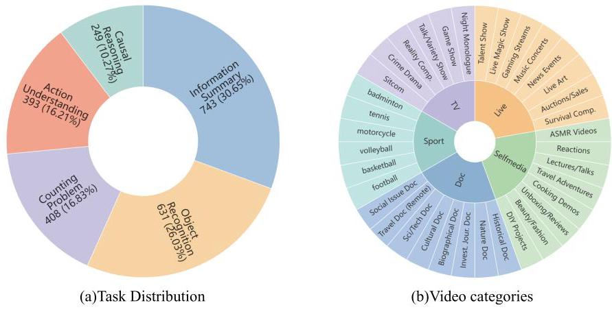
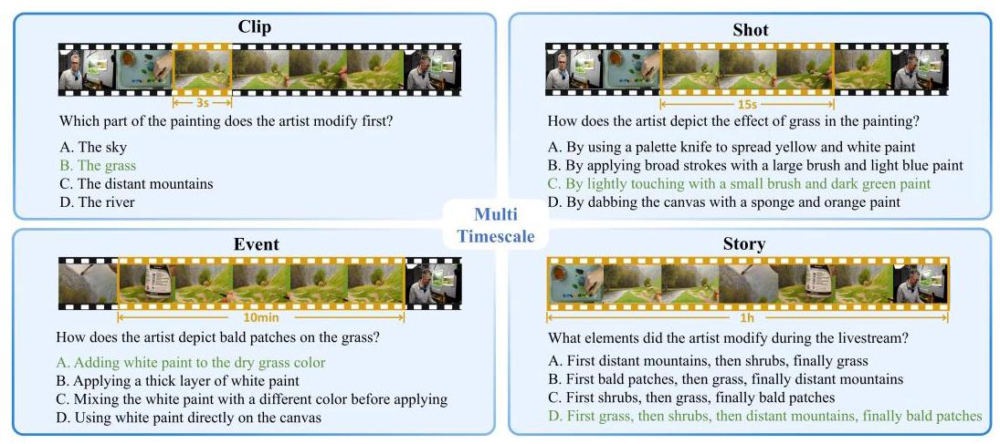
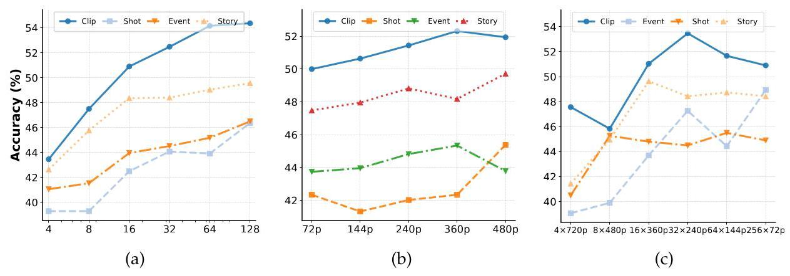
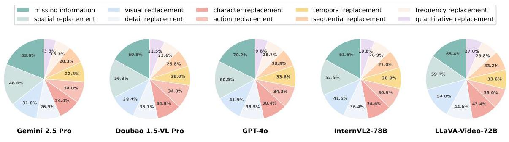

# ScaleLong: A Multi-Timescale Benchmark for Long Video Understanding

M-A-P

ByteDance Inc.

## Abstract

Although long-video understanding demands that models capture hierarchical temporal information-from clip (seconds) and shot (tens of seconds) to event (minutes) and story (hours)-existing benchmarks either neglect this multi-scale design or scatter scale-specific questions across different videos, preventing direct comparison of model performance across timescales on the same content. To address this, we introduce ScaleLong, the first benchmark to disentangle these factors by embedding questions targeting four hierarchical timescales—clip (seconds), shot (tens of seconds), event (minutes), and story (hours)—all within the same video content. This within-content multi-timescale questioning design enables direct comparison of model performance across timescales on identical videos. ScaleLong features 269 long videos (avg. 86 min) from 5 main categories and 36 sub-categories, with 4-8 carefully designed questions, with at least one question targeting each timescale. Evaluating 23 MLLMs reveals a distinct U-shaped performance trend: higher accuracy at the shortest (clip) and longest (story) timescales, with a dip at intermediate levels. Furthermore, ablation studies demonstrate that increased visual token capacity consistently enhances reasoning across all timescales. ScaleLong offers a crucial fine-grained, multi-timescale benchmark for advancing MLLM capabilities in long-video understanding. The code and dataset are available at https://github.com/multimodal-art-projection/ScaleLong

Figure 1. (a) Task distribution in LongVideoBench. LongVideoBench consists of a total of 5 tasks, ensuring comprehensive evaluation of the model's capabilities. (b) Video Categories. LongVideoBench includes videos spanning 5 major categories and 37 subcategories, ensuring diverse topical coverage.

## Contents

1 Introduction

3

2 ScaleLong

4

2.1 Overview

4

2.2 Multi-Timescale Hierarchies

4

2.3 Task Types

5

2.4 Annotation Methodology and Quality Control

5

2.4.1 Annotation Methodology

5

2.4.2 Rigorous Quality Control

6

3 Comparison with other video benchmarks

6

4 Experiments

7

4.1 Settings

7

4.2 Main Results

7

4.3 Ablation Study

9

4.3.1 Isolated Scaling of Frame number and Resolution

9

4.3.2 Token Allocation: Frames vs. Resolution

10

4.4 Error rates across different distractor types

10

5 Related Work

11

6 Conclusion

11

7 Contributions and Acknowledgments

12

A Annotation Tutorial

16

A. 1 Question Type

16

A. 2 Data Annotation Steps

16

A.2.1 Methods for Designing Incorrect Answer Options

17

B Manual Review Process Details

18

B. 1 Round 1 Quality Control

18

B. 2 Round 2 Quality Control

18

## 1. Introduction

Recent advances in Multimodal Large Language Models (MLLMs) have significantly enhanced their ability to integrate and interpret complex inputs such as text, images, and videos [Liu et al., 2023a, Chen et al., 2024b, Guo et al., 2024, Zhang et al., 2024, Zhu et al., 2025, Team et al., 2025]. Consequently, a variety of benchmarks have been developed to gauge their video understanding capabilities across different scopes and tasks [Wu et al., 2024, Wang et al., 2023, Fu et al., 2024a, Li et al., 2024d, Ma et al., 2025].

However, current long-video benchmarks are ill-equipped to assess the multi-timescale capabilities of MLLMs—specifically, their distinct abilities across varying temporal granularities. By typically using isolated short segments [Li et al., 2024c] or evaluating different temporal scales across entirely different videos [Zhou et al., 2024], these benchmarks inherently conflate temporal granularity with content variability. This makes it exceedingly difficult to disentangle a MLLM's true performance at each specific timescale from content-driven adaptations. Thus, a rigorous, fine-grained methodology is critically needed to evaluate how MLLMs apply these distinct temporal capabilities to understand the hierarchical temporal structures within long videos.

To bridge this gap, we introduce ScaleLong, a benchmark tailored for the fine-grained evaluation of MLLMs' multi-timescale capabilities in long videos. Its core feature is embedding questions targeting four hierarchical temporal scales (Clip, Shot, Event, Story) all within the same video content. This 'within-content' design enables direct comparison of an MLLM's performance across these distinct temporal granularities on identical narratives, thereby isolating its abilities at each specific scale. ScaleLong includes 269 videos (averaging 86 minutes), each annotated with 4-8 questions, ensuring at least one question per time scale. As illustrated in Fig. 1, the benchmark spans 5 major categories and 36 subcategories, enabling a comprehensive evaluation of MLLMs' understanding of long videos across diverse timescales.

Leveraging ScaleLong, extensive evaluations of 23 MLLMs—encompassing 19 open-source and 4 proprietary models—consistently reveal a U-shaped performance curve across the defined temporal scales. These models generally perform better on questions at the shortest (Clip) and longest (Story) temporal scales, while performance noticeably drops at intermediate levels (Shot and Event). This pattern suggests that current MLLMs often excel at processing either highly localized visual details or overarching narrative structures, yet face challenges with intermediate temporal contexts. Furthermore, targeted experiments conducted on ScaleLong indicate that an increased allocation of visual tokens systematically enhances MLLMs' performance across all evaluated timescales, providing valuable insights for future advancements in model development.

In summary, our work makes three primary contributions:

- ScaleLong: We introduce ScaleLong, specifically designed to assess the multi-timescale capabilities of MLLMs in long videos. By embedding questions at four hierarchical temporal scales (Clip, Shot, Event, and Story) within the same video content, it enables robust evaluation of MLLMs at each distinct scale. ScaleLong includes 269 diverse long videos (averaging 86 minutes), with 4-8 questions per video (at last one per scale), across 5 major categories and 36 subcategories.

- Comprehensive MLLM Evaluation and Insights: Our extensive evaluation of 23 MLLMs on ScaleLong reveals a consistent U-shaped performance trend. MLLMs generally exhibit stronger comprehension at the shortest (Clip) and longest (Story) temporal scales, while their performance discernibly dips at intermediate scales (Shot and Event). This finding offers critical insights into how MLLMs process information at distinct temporal granularities in long videos.

Figure 2. Representative samples from ScaleLong. Each sample in ScaleLong comprises a video paired with carefully designed questions, structured across four hierarchical temporal scales. The correct answers are indicated in green.

- Insights for MLLM Development: Evaluations on ScaleLong provide key insights for MLLM enhancement. For instance, increasing visual token allocation consistently enhances performance across all evaluated timescales. Furthermore, analysis of model error patterns reveals persistent weaknesses, offering guidance for future model improvements in long-video understanding.

## 2. ScaleLong

### 2.1. Overview

ScaleLong is specifically engineered for the fine-grained assessment of the multi-timescale capabilities of MLLMs in long videos. The benchmark comprises 269 diverse videos, each averaging 86 minutes and annotated with 4-8 questions. As illustrated in Fig. 2, these questions address four hierarchical temporal scales: Clip (seconds), Shot (tens of seconds), Event (minutes), and Story (hours). Key features of ScaleLong include:

Multi Timescale Queries: Unlike existing benchmarks, ScaleLong structures queries at four meticulously defined temporal scales-Clip, Shot, Event, and Story-all within each individual video. This 'within-content' embedding of questions targeting multiple, distinct temporal scales is crucial: it effectively decouples the assessment of temporal understanding of specific video content. Such a design enables precise evaluation of how MLLMs handle different temporal granularities while keeping the narrative context consistent.

Diverse Video Content and Task Design: For comprehensive MLLM evaluation, ScaleLong offers extensive content diversity, featuring 5 main video categories (e.g., Sports, Documentaries) spanning 36 subcategories. It also incorporates 5 distinct task types (e.g., Causal Reasoning, Action Understanding) designed to probe deeper comprehension. This structured variety ensures representative assessment across diverse, real-world long-video scenarios.

### 2.2. Multi-Timescale Hierarchies

The Multi-Timescale Hierarchies within ScaleLong are established by categorizing questions into four distinct temporal levels. This classification is based on the video duration essential for answering each question and how relevant information is distributed across the frames. These levels are detailed as follows:

Clip: Questions solvable by analyzing a few consecutive frames, spanning only a few seconds (e.g., up to 3seconds), typically involving recognizing instantaneous actions, immediate visual details, or straightforward objects.

Shot: Questions requiring the analysis of information from multiple frames within a single continuous shot, typically ranging from 4 to 15 seconds. These questions require interpreting short-term dynamics, simple actions, character interactions, or semantic coherence within this timeframe.

Event: Questions concerning significant events that span multiple consecutive shots, with durations from 16 seconds up to 10 minutes. These questions require integrating information across scenes, interpreting event sequences, identifying contextually relevant frames, and understanding more complex narrative developments or causal links.

Story: Questions addressing content from the entire video or substantial portions thereof, typically exceeding 10 minutes. These require holistic comprehension of the overall narrative, including overall narrative logic, causal relationships, character development, thematic analysis, or long-term dependencies across the video.

### 2.3. Task Types

ScaleLong incorporates five distinct task types, each designed to rigorously evaluate different facets of an MLLM's comprehension abilities:

Causal Reasoning (CR): Questions requiring inference about causal relationships within the video content. These tasks assess the model's ability to deduce cause-and-effect dynamics and logical connections.

Object Recognition (OR): Questions involving the identification and distinction of specific objects, scenes, or their attributes within the video. These tasks evaluate visual perception and fine-grained recognition capabilities.

Action Understanding (AU): Questions focused on interpreting the actions, movements, or behaviors of entities (e.g., characters, objects) in the video. These tasks assess the capacity to comprehend dynamic interactions and temporal movements.

Information Summary (IS): Questions that require summarizing or generalizing main content, key points, or details from the video. These tasks evaluate the ability to synthesize information and extract essential concepts.

Counting Problems (CP): Questions pertaining to quantitative aspects, such as enumerating objects or events, or discerning temporal order. These tasks assess the capacity for accurate numeric and sequential reasoning.

### 2.4. Annotation Methodology and Quality Control

#### 2.4.1. Annotation Methodology

ScaleLong ensures high-quality annotations through a multi-phase process involving curated video selection, structured question design, and multi-round quality control. This process emphasizes content-based understanding, requiring questions to target video-specific information, answers to be thoroughly video-grounded, and dependencies on absolute time cues or external knowledge to be eliminated.

Video Curation and Collection: Our video acquisition process begins by defining 5 principal categories (further detailed into 36 subcategories) to cover diverse real-world scenarios. YouTube videos, typically around one hour in length, are manually sourced for these categories. Each selected video undergoes inspection for high visual clarity, substantial information density, and appropriate duration, resulting in a final corpus of 269 videos.

Question, Answer, and Distractor Generation: For each video, annotators first conduct a full viewing. They then design 8 questions (two for each of the four defined temporal hierarchy levels), ensuring a balance in task types. Correct answers are derived from careful analysis of multimodal information within the video. Each question is accompanied by one correct answer and three plausible distractors, which are constructed based on ten predefined types to offer varied challenges and facilitate error analysis.

#### 2.4.2. Rigorous Quality Control

Our quality control protocol involves two principal rounds with distinct objectives:

First-Round Quality Control: This round focuses on the foundational correctness, clarity, and consistency of all annotations. Question stems are verified for precision. Critically, absolute time localizations are replaced with descriptive cues to compel content-based reasoning rather than timestamp reliance. Answer options are thoroughly checked: correct answers must be unambiguously video-grounded, and distractors plausible yet definitively incorrect. Annotations also undergo checks to prevent an undue concentration of questions within limited segments of the video's timeline, and to validate all categorizations (e.g., temporal levels, task types, distractor types).

Second-Round Quality Control: This round focuses on eliminating confounding factors and ensuring questions exclusively assess understanding derived from the video content. Questions solvable through common world knowledge or reliant on external prior information, rather than video-specific details, are systematically revised or removed to nullify such external dependencies. Finally, to uphold dataset integrity, any questions exhibiting persistent ambiguities (e.g., unclear grounding, indistinct features, or problematic categorization) are rigorously discarded.

## 3. Comparison with other video benchmarks

Existing video understanding benchmarks, as detailed in Table 1, are broadly categorized into short-video and long-video formats. Short-video benchmarks like NExTQA [Xiao et al., 2021] and MVBench [Li et al., 2024b] utilize sub-minute clips, which restrict their capacity for evaluating long-range temporal understanding. Recent long-video benchmarks—including CinePile [Rawal et al., 2024], EgoSchema [Mangalam et al., 2023], MoVQA [Zhang et al., 2023b], MLVU [Zhou et al., 2024], Video-MME [Fu et al., 2024b], LongVideoBench [Wu et al., 2024], and ALLVB [Tan et al., 2025]—feature extended durations. However, they generally do not decouple the targeted temporal scales of questions from specific video content. This inherent coupling hinders a precise assessment of how MLLMs handle varying temporal granularities and, consequently, their distinct multi-timescale capabilities.

Unlike most existing long-video benchmarks which, as noted, typically conflate temporal scale assessment with disparate video content, ScaleLong is distinguished by a key design attribute: its Intra-Video Multi-Timescale nature. This principle dictates that within every long video, questions are specifically designed to target multiple, distinct temporal scales. This inherent characteristic-materialized through questions probing four hierarchical levels (Clip (seconds), Shot (tens of seconds), Event (minutes), and Story (hours)) all within the same video narrative-is fundamental to the engineering of ScaleLong for the precise assessment of multi-timescale capabilities of MLLMs in Long Videos. Such a design feature directly facilitates a disentangled evaluation; the distinct capabilities of an MLLM at various temporal granularities are thereby measured against the same video content, allowing for a clear separation of temporal understanding performance from content-specific reactions.

Table 1. Comparison with other benchmarks, where the abbreviations are defined as follows: Anno. (Annotation Method), A (Automatic Annotation), M (Manual Annotation), #Genres (Number of Video Genres). MTS is the abbreviation for Multi-Timescale, and IV-MTS is the abbreviation for Intra-Video Multi-Timescale.

<table><tr><td>Benchmark</td><td>#Videos</td><td>Duration. (s)</td><td>#Tasks</td><td>#QA Pairs</td><td>Anno.</td><td>#Genres</td><td>MTS</td><td>IV-MTS</td></tr><tr><td>MSVD-QA</td><td>1,970</td><td>10</td><td>-</td><td>13,157</td><td>A</td><td>-</td><td>✘</td><td>✘</td></tr><tr><td>MSRVTT-QA</td><td>2,900</td><td>15</td><td>-</td><td>72,821</td><td>A</td><td>-</td><td>✘</td><td>✘</td></tr><tr><td>ActivityNet-QA</td><td>5,800</td><td>111</td><td>4</td><td>800</td><td>M</td><td>8</td><td>✘</td><td>✘</td></tr><tr><td>NExTQA</td><td>1,000</td><td>44</td><td>4</td><td>8,564</td><td>M</td><td>-</td><td>✘</td><td>✘</td></tr><tr><td>MVBench</td><td>3,641</td><td>16</td><td>20</td><td>4,000</td><td>A</td><td>-</td><td>✘</td><td>✘</td></tr><tr><td>CinePile</td><td>9,396</td><td>160</td><td>5</td><td>303,828</td><td>M & A</td><td>1</td><td>✘</td><td>✘</td></tr><tr><td>EgoSchema</td><td>5,063</td><td>180</td><td>-</td><td>5,063</td><td>M & A</td><td>-</td><td>✘</td><td>✘</td></tr><tr><td>LVBench</td><td>103</td><td>4,101</td><td>6</td><td>1,549</td><td>M</td><td>21</td><td>✘</td><td>✘</td></tr><tr><td>LONGVIDEOBENCH</td><td>3,763</td><td>473</td><td>17</td><td>6,678</td><td>M</td><td>10</td><td>✘</td><td>✘</td></tr><tr><td>HourVideo</td><td>500</td><td>2,742</td><td>4</td><td>12,976</td><td>M & A</td><td>-</td><td>✘</td><td>✘</td></tr><tr><td>ALLVB</td><td>1,376</td><td>7,200</td><td>9</td><td>252,000</td><td>A</td><td>16</td><td>✘</td><td>✘</td></tr><tr><td>Video-MME</td><td>900</td><td>1,024</td><td>12</td><td>2,700</td><td>M</td><td>30</td><td>✓</td><td>✘</td></tr><tr><td>MoVQA</td><td>100</td><td>992</td><td>6</td><td>21,953</td><td>M</td><td>1</td><td>✓</td><td>✘</td></tr><tr><td>MLVU</td><td>1,730</td><td>930</td><td>9</td><td>3,102</td><td>M</td><td>31</td><td>✓</td><td>✘</td></tr><tr><td>ScaleLong</td><td>269</td><td>5,160</td><td>5</td><td>1747</td><td>M</td><td>36</td><td>✓</td><td>✓</td></tr></table>

## 4. Experiments

In this section, we evaluate representative MLLMs on ScaleLong-first outlining the setting of experiments, then analyzing the results of the 23 MLLMs on ScaleLong. We assess how the visual tokens shape long video understanding, and finally examine error rates by distractor type to identify key failure modes.

### 4.1. Settings

We evaluate a total of 23 MLLMs, comprising 4 leading commercial models—Gemini-2.5- pro [DeepMind, 2025], Gemini-2.0-flash [Team et al., 2024], GPT-4o [OpenAi, 2024] and Doubao- 1.5-vision-pro [Doubao Team, 2025]—and 19 open-source models spanning from 7 billion to 78 billion parameters, including representative models such as Qwen2.5-VL [Bai et al., 2025], InternVL2.5 [Chen et al., 2024a] and LLaVA-OneVision [Liu et al., 2023b].

### 4.2. Main Results

Table 2 presents the performance of all evaluated models across four timescale questions as well as five task types defined in ScaleLong. In this subsection, for all experiments, we fix the resolution at \( {240}\mathrm{p} \) and use the highest frame count we have tested. We draw the following key observations:

Model performance varies significantly across timescales: In long-video understanding, we evaluate models across four timescales-Clip (shortest span), Shot and Event (mid-range spans), and Story (longest span). We observe a pronounced U-shaped trend: accuracy peaks at the two extremes (Clip and Story) but dips markedly at the intermediate timescales (Shot and Event). This indicates that, while current MLLMs excel at capturing brief visual cues and overarching narrative structures, they struggle with maintaining temporal coherence over moderate-length segments. For example, Gemini 2.5 Pro achieves 71.5 % accuracy on Clip and 69.0% on Story, yet drops to 62.8 % on Shot and 68.0 % on Event. Crucially, this U-shaped pattern holds consistently across all open-source and closed-source models.

Table 2. The performance of proprietary and open-source MLLMs on ScaleLong across granularities and task types. For each timescale and task, the best performance is indicated in bold, and the second-best performance is indicated with underlining.

<table><tr><td rowspan="2">Models</td><td rowspan="2">Date</td><td rowspan="2">Input</td><td colspan="4">Granularities</td><td colspan="5">Task Types</td><td rowspan="2">Overall</td></tr><tr><td>Clip</td><td>Shot</td><td>Event</td><td>Story</td><td>CR</td><td>OR</td><td>AU</td><td>II</td><td>CP</td></tr><tr><td colspan="13">Proprietary Models</td></tr><tr><td>Gemini 2.0 Flash</td><td>2025-02</td><td>256 frm</td><td>65.7</td><td>52.4</td><td>48.4</td><td>53.4</td><td>53.5</td><td>64.8</td><td>54.6</td><td>55.9</td><td>41.9</td><td>55.0</td></tr><tr><td>GPT-40</td><td>2024-05</td><td>64 frm</td><td>61.8</td><td>50.7</td><td>51.0</td><td>58.0</td><td>58.3</td><td>62.6</td><td>57.4</td><td>60.1</td><td>36.0</td><td>55.4</td></tr><tr><td>Doubao 1.5-VL Pro</td><td>2025-01</td><td>256 frm</td><td>66.4</td><td>52.8</td><td>55.2</td><td>60.2</td><td>57.1</td><td>67.0</td><td>55.1</td><td>64.5</td><td>43.3</td><td>58.7</td></tr><tr><td>Gemini 2.5 Pro</td><td>2025-03</td><td>256 frm</td><td>71.5</td><td>62.8</td><td>68.0</td><td>69.0</td><td>66.0</td><td>72.5</td><td>65.8</td><td>74.6</td><td>51.2</td><td>67.9</td></tr><tr><td colspan="13">Open source Models</td></tr><tr><td>LLaVA-Mini</td><td>2025-01</td><td>256 frm</td><td>29.7</td><td>25.3</td><td>28.8</td><td>25.2</td><td>27.6</td><td>29.8</td><td>29.4</td><td>27.2</td><td>22.1</td><td>27.3</td></tr><tr><td>LongVILA</td><td>2024-08</td><td>32 frm</td><td>29.1</td><td>28.3</td><td>23.8</td><td>28.6</td><td>28.0</td><td>29.2</td><td>30.0</td><td>26.8</td><td>23.9</td><td>27.5</td></tr><tr><td>LongVU</td><td>2024-10</td><td>32 frm</td><td>40.9</td><td>37.2</td><td>33.5</td><td>35.6</td><td>43.9</td><td>44.1</td><td>37.5</td><td>38.1</td><td>21.7</td><td>36.8</td></tr><tr><td>Phi-3.5</td><td>2024-04</td><td>64 frm</td><td>44.8</td><td>35.8</td><td>34.3</td><td>43.0</td><td>43.3</td><td>47.9</td><td>33.9</td><td>40.1</td><td>30.2</td><td>39.5</td></tr><tr><td>LongVA</td><td>2024-06</td><td>256 frm</td><td>50.3</td><td>40.2</td><td>38.8</td><td>43.8</td><td>49.3</td><td>53.1</td><td>38.2</td><td>45.4</td><td>28.8</td><td>43.3</td></tr><tr><td>Flash-VStream</td><td>2024-06</td><td>256 frm</td><td>46.9</td><td>42.7</td><td>39.8</td><td>47.0</td><td>48.7</td><td>48.9</td><td>39.0</td><td>34.1</td><td>48.6</td><td>44.1</td></tr><tr><td>Phi-4</td><td>2025-03</td><td>128 frm</td><td>50.0</td><td>42.9</td><td>42.1</td><td>45.5</td><td>50.3</td><td>53.9</td><td>44.0</td><td>46.2</td><td>30.8</td><td>45.2</td></tr><tr><td>LLaVA-OV-7B(SI)</td><td>2024-08</td><td>128 frm</td><td>50.8</td><td>39.5</td><td>44.4</td><td>47.3</td><td>41.4</td><td>52.2</td><td>44.1</td><td>49.3</td><td>34.3</td><td>45.5</td></tr><tr><td>MiniCPM-V</td><td>2024-08</td><td>64 frm</td><td>51.0</td><td>42.9</td><td>43.1</td><td>47.8</td><td>49.0</td><td>55.2</td><td>42.9</td><td>48.5</td><td>32.5</td><td>46.2</td></tr><tr><td>Qwen2-VL-7B</td><td>2024-09</td><td>8 frm</td><td>51.6</td><td>45.9</td><td>46.5</td><td>48.3</td><td>51.6</td><td>51.9</td><td>53.1</td><td>50.6</td><td>33.9</td><td>48.1</td></tr><tr><td>LLaVA-Video-7B</td><td>2024-10</td><td>32 frm</td><td>57.9</td><td>46.8</td><td>50.2</td><td>48.0</td><td>47.1</td><td>55.4</td><td>52.3</td><td>54.4</td><td>39.9</td><td>50.8</td></tr><tr><td>InternVL2-5-8B</td><td>2024-12</td><td>128 frm</td><td>60.2</td><td>42.5</td><td>48.5</td><td>52.3</td><td>52.0</td><td>61.5</td><td>47.4</td><td>50.8</td><td>39.3</td><td>50.9</td></tr><tr><td>Owen2.5-VL-7B</td><td>2025-01</td><td>256 frm</td><td>52.8</td><td>50.0</td><td>49.5</td><td>52.7</td><td>50.2</td><td>54.5</td><td>53.3</td><td>55.3</td><td>39.9</td><td>51.2</td></tr><tr><td>Aria</td><td>2024-10</td><td>256 frm</td><td>57.2</td><td>46.5</td><td>48.7</td><td>53.4</td><td>49.3</td><td>60.5</td><td>48.5</td><td>52.4</td><td>41.6</td><td>51.5</td></tr><tr><td>LLaVA-OV-72B</td><td>2024-08</td><td>64 frm</td><td>56.1</td><td>49.5</td><td>51.5</td><td>55.2</td><td>53.6</td><td>59.3</td><td>53.5</td><td>52.3</td><td>45.5</td><td>53.1</td></tr><tr><td>InternVL2-5-26B</td><td>2024-12</td><td>128 frm</td><td>60.2</td><td>50.1</td><td>48.5</td><td>56.8</td><td>57.9</td><td>61.7</td><td>53.6</td><td>52.9</td><td>43.6</td><td>53.9</td></tr><tr><td>LLaVA-Video-72B</td><td>2024-10</td><td>128 frm</td><td>60.0</td><td>50.7</td><td>53.2</td><td>51.8</td><td>54.6</td><td>62.7</td><td>55.5</td><td>55.2</td><td>39.0</td><td>53.9</td></tr><tr><td>InternVL2-5-38B</td><td>2024-12</td><td>256 frm</td><td>61.8</td><td>53.5</td><td>54.1</td><td>55.5</td><td>53.9</td><td>65.4</td><td>58.8</td><td>58.1</td><td>40.7</td><td>56.3</td></tr><tr><td>InternVL2-5-78B</td><td>2024-12</td><td>128 frm</td><td>65.2</td><td>54.3</td><td>53.4</td><td>61.5</td><td>57.2</td><td>65.4</td><td>54.4</td><td>63.9</td><td>46.2</td><td>58.6</td></tr></table>

Performance differences across models are notable: Closed-source models consistently outperform open-source ones across all timescales. For example, the leading closed-source model, Gemini 2.5 Pro, surpasses the best open-source counterpart (InternVL2.5-78B) by at least 6.3 percentage points on the Clip timescale and by 14.6 points on the Event timescale. Furthermore, within the InternVL2.5 series, scaling from 8 B to 78 B yields steady accuracy gains: from 60.2% to 65.2 % on Clip, 52.3 % to 61.5 % on Story, 42.5 % to 54.3 % on Shot, and 48.5 % to 53.4 % on Event.

MLLMs exhibit substantial performance disparities across task types: For the vast majority of models, Object Recognition tasks achieve the highest accuracy, whereas Counting Problems tasks incur the lowest. For example, Doubao 1.5-VL Pro shows a 23.7 percentage-point gap between OR and CP, while GPT-40 exhibits a 26.6-point difference. This consistent gap underscores that, in long-video understanding, MLLMs' ability to perform counting remains a critical area for improvement.

Figure 3. Comparison of model performance under: (a) varying frame counts, (b) varying video resolutions, and (c) different frame-resolution combinations.

### 4.3. Ablation Study

To investigate how total visual-token count and its allocation between frame number and resolution affect MLLM performance in multi-timescale long-video understanding, we conduct two ablation studies:

Scaling Effect. How does performance change as we increase the total number of visual tokens-either by sampling more frames or by raising resolution?

Token Allocation. When the total visual-token budget is held constant, does distributing tokens across more frames or into higher resolution yield greater gains?

#### 4.3.1. Isolated Scaling of Frame number and Resolution

In this subsection, we evaluate how allocating extra visual tokens-temporally by sampling more frames or spatially by increasing resolution-affects model performance.

Under a fixed resolution, increasing the number of input frames consistently improves multi-timescale long-video understanding, with the greatest gains on Clip-level tasks. In this section, we evaluate several representative MLLMs using input frame counts of 4, 8, 16, 32, 64, and 128 with 240P resolution. The corresponding results are presented in Fig. 3(a). Overall, the accuracy of all models tends to improve as the number of input frames increases. However, the degree of improvement varies significantly across different levels of temporal granularity. The Clip level exhibits the most substantial gain, with accuracy increasing from approximately 43.5% at 4 frames to 54.5% at 128 frames. This suggests that short-span tasks are highly sensitive to temporal sampling density, likely because they depend on capturing fine-grained visual changes or brief actions. In contrast, the accuracy improvements at the Shot and Event levels are more moderate. Notably, accuracy for the Event level peaks at 64 frames and slightly declines at 128 frames, indicating potential redundancy or oversaturation when too many frames are included. For the Story level, performance gains are relatively limited, increasing from around 42.5% to 49.5%. This implies that for long-range reasoning tasks, a small number of well-chosen frames may already provide sufficient contextual information, and further increasing the frame count yields diminishing returns.

In terms of resolution, we evaluate model performance using 32 frames across five video resolutions (72p, 144p, 240p, 360p, and 480p). As shown in Fig. 3(b), we observe that:

Under a fixed frame count, raising resolution generally improves performance across Clip, Shot, Event, and Story tasks, but sometimes yields diminishing or even negative returns. For most timescales, model accuracy climbs as resolution increases—for example, at the Clip level, moving from \( {72}\mathrm{p} \) to \( {360}\mathrm{p} \) delivers roughly a 2% absolute gain in accuracy, and Story-level tasks show a similar uplift. However, when viewed in an absolute sense, boosting resolution proves less effective than increasing frame count: earlier experiments demonstrate that, at Clip granularity, expanding input frames from 4 to 128 yields about a 9% jump in accuracy-substantially more than 2% gain from resolution alone.

That said, resolution gains are not strictly monotonic. At the Clip level, accuracy actually dips slightly when stepping from \( {360}\mathrm{p} \) to \( {480}\mathrm{p} \) , suggesting that excessive spatial detail can introduce noise or redundant information that marginally hinders short-span reasoning.

#### 4.3.2. Token Allocation: Frames vs. Resolution

To disentangle temporal and spatial contributions under a fixed visual-token budget, we evaluate Qwen2.5-VL-7B/32B/72B on six frame-resolution combinations: \( 4 \times  {720}\mathrm{p},8 \times  {480}\mathrm{p} \) , \( {16} \times  {360}\mathrm{p},{32} \times  {240}\mathrm{p},{64} \times  {144}\mathrm{p} \) , and \( {256} \times  {72}\mathrm{p} \) . We report the average accuracy of three models.

Appropriate allocation of visual tokens between temporal and spatial dimensions is vital for multi-timescale long-video understanding. As shown in Fig. 3(c), Clip-level accuracy peaks at 32×240p (53.6%), highlighting the value of temporal density for short-span tasks. Story-level accuracy gradually improves and reaches its peak (49.8%) at the 16×360p setting. Beyond this point, performance slightly declines and then stabilizes, indicating diminishing returns from further increasing frame count or decreasing resolution. Event-level accuracy also benefits from additional frames, peaking at 48.8%, though low resolution (e.g., 64×144p) can cause instability. Notably, Shot-level accuracy starts low (40.2%) and improves sharply at 8×480p (45.5%), then plateaus, indicating that a moderate balance of temporal and spatial input is most effective.

Figure 4. Distractor-specific error rate distribution across five MLLMs.

### 4.4. Error rates across different distractor types

To analyze error patterns in long-video understanding, we evaluate several MLLMs on the ten distractor types in ScaleLong, as shown in Fig. 4. Although overall error rates are comparable across models, two categories—missing information and spatial replacement—stand out with the highest failure rates. For example, Gemini 2.5 Pro, our best-performing model, erroneously accepts missing-information distractors 53% of the time and spatial-replacement distractors 46.6% of the time. These findings indicate a pervasive insensitivity to the completeness of evidential support, as well as a notable deficiency in reasoning about spatial relationships within complex video sequences.

In contrast, models exhibit markedly stronger performance on frequency misdirection and quantitative misdirection. GPT-40 misclassifies these distractors only 19.8% and 28.7% of the time, respectively, while Gemini 2.5 Pro's error rates are even lower (13.3% and 16.7%). This suggests that, despite their struggles with semantic completeness and spatial inference, current MLLMs are adept at leveraging statistical and numerical cues. Together, these results highlight the need for future work to incorporate mechanisms—either through architectural enhancements or targeted training curricula—that explicitly verify evidential completeness and model multi-view spatial configurations in long-video contexts.

## 5. Related Work

Multimodal Large Language Models Multimodal LLMs (MLLMs) pair visual encoders with large language models to excel at image and short-video tasks (e.g., LLaVA-onevision [Li et al., 2024a], Otter [Li et al., 2023], mPLUG-Owl [Ye et al., 2023]). For long-video understanding, recent MLLMs introduce specialized designs—Video-LLaMA [Zhang et al., 2023a] (ViT + Q-Former), LLaMA-Vid [Li et al., 2024e] (efficient visual compression), mPLUG-owl3 [Ye et al., 2024] (scalable multi-event modeling), LLaVA-Octopus [Zhao et al., 2025] (audio integration)—and leverage expanded multimodal pretraining in InternVL2.5 [Chen et al., 2024a] and Qwen2.5-VL [Bai et al., 2025].

Video Understanding Benchmarks Video benchmarks have evolved from short-clip tests (e.g., MVBench [Li et al., 2024b], NExT-QA [Xiao et al., 2021]) through mid-length tasks (CinePile [Rawal et al., 2024], EgoSchema [Mangalam et al., 2023], MoVQA [Zhang et al., 2023b], MLVU [Zhou et al., 2024], Video-MME [Fu et al., 2024b]) to hour-scale evaluations (LVBench [Wang et al., 2024], LONGVIDEOBENCH [Wu et al., 2024], HourVideo [Chan-drasegaran et al., 2024], ALLVB [Tan et al., 2025], HLV-1K [Zou et al., 2025]). However, current long-video benchmarks are ill-equipped to assess the multi-timescale capabilities of multimodal LLMs—specifically, their distinct abilities across varying temporal granularities. Existing benchmarks rely on isolated clips or distribute scales across different videos, conflating temporal granularity with content variability and obscuring true model performance. To address these limitations, ScaleLong embeds balanced question sets-complete with varied distractors-at clip, shot, event and story levels within the same hour-long videos drawn from diverse genres (documentaries, dramas, tutorials). This within-content, multi-scale design enables precise cross-granularity evaluation, revealing MLLMs' accuracy trends and specific failure modes across the temporal hierarchy.

## 6. Conclusion

We introduce ScaleLong, the first benchmark for fine-grained MLLM evaluation across hierarchical temporal scales (Clip to Story, spanning seconds to hours) using questions embedded within the same video. This 'within-content' design disentangles temporal scale effects from video semantics, enabling a more accurate assessment of intra-video multi-timescale understanding. Evaluations on 23 MLLMs reveal a U-shaped performance curve: models perform better at the shortest (Clip) and longest (Story) scales, with a dip at intermediate (Shot, Event) levels. Furthermore, visual token ablation studies indicate that under fixed budgets, a balanced allocation between frame count and resolution is optimal, as severe deficiency in one aspect significantly impairs performance. We hope ScaleLong will catalyze research to advance MLLM capabilities in nuanced, multi-scale long-video understanding.

## 7. Contributions and Acknowledgments

Multimodal Art Projection (M-A-P) is a non-profit open-source AI research community, run by donations. The community members are working on research topics in a wide range of spectrum, including but not limited to the pre-training paradigm of foundation models, large-scale data collection and processing, and the derived applications on coding, reasoning, and music generation.

## Leading Authors

- David Ma, M-A-P - Xingjian Wang

- Huaqing Yuan - Qianbo Zang, M-A-P

## Contributors

- Tianci Liu - Meng Cao, MBZUAI

- Xinyang He - Shanghaoran Quan, M-A-P

- Zhenzhu Yang - Yizhi LI, M-A-P

- Yanbin Wei - Wangchunshu Zhou, OPPO, M-A-P

- Jiawei Guo, M-A-P - Jiaheng Liu, M-A-P, NJU

- Jiahui Ni - Wenhao Huang, M-A-P

- Zhenzhu Yang, M-A-P

## Corresponding Authors

- Ge Zhang, M-A-P - Xiaojie Jin, M-A-P

- Shiwen Ni, SIAT-CAS

## References

S. Bai, K. Chen, X. Liu, J. Wang, W. Ge, S. Song, K. Dang, P. Wang, S. Wang, J. Tang, et al. Qwen2. 5-vl technical report. arXiv preprint arXiv:2502.13923, 2025.

K. Chandrasegaran, A. Gupta, L. M. Hadzic, T. Kota, J. He, C. Eyzaguirre, Z. Durante, M. Li, J. Wu, and F.-F. Li. Hourvideo: 1-hour video-language understanding. Advances in Neural Information Processing Systems, 37:53168-53197, 2024.

Z. Chen, W. Wang, Y. Cao, Y. Liu, Z. Gao, E. Cui, J. Zhu, S. Ye, H. Tian, Z. Liu, et al. Expanding performance boundaries of open-source multimodal models with model, data, and test-time scaling. arXiv preprint arXiv:2412.05271, 2024a.

Z. Chen, J. Wu, W. Wang, W. Su, G. Chen, S. Xing, M. Zhong, Q. Zhang, X. Zhu, L. Lu, et al. Internvl: Scaling up vision foundation models and aligning for generic visual-linguistic tasks. In Proceedings of the IEEE/CVF conference on computer vision and pattern recognition, pages 24185-24198, 2024b.

G. DeepMind. Gemini 2.5 pro. https://deepmind.google/technologies/gemini, 2025. Accessed May 2025.

Doubao Team. Doubao 1.5 pro, 2025.

C. Fu, Y. Dai, Y. Luo, L. Li, S. Ren, R. Zhang, Z. Wang, C. Zhou, Y. Shen, M. Zhang, P. Chen, Y. Li, S. Lin, S. Zhao, K. Li, T. Xu, X. Zheng, E. Chen, R. Ji, and X. Sun. Video-mme: The first-ever comprehensive evaluation benchmark of multi-modal llms in video analysis, 2024a.

C. Fu, Y. Dai, Y. Luo, L. Li, S. Ren, R. Zhang, Z. Wang, C. Zhou, Y. Shen, M. Zhang, et al. Video-mme: The first-ever comprehensive evaluation benchmark of multi-modal llms in video analysis. arXiv preprint arXiv:2405.21075, 2024b.

J. Guo, T. Zheng, Y. Bai, B. Li, Y. Wang, K. Zhu, Y. Li, G. Neubig, W. Chen, and X. Yue. Mammoth-vl: Eliciting multimodal reasoning with instruction tuning at scale. arXiv preprint arXiv:2412.05237, 2024.

B. Li, Y. Zhang, L. Chen, J. Wang, J. Yang, and Z. Liu. Otter: A multi-modal model with in-context instruction tuning, 2023. URL https://arxiv.org/abs/2305.03726.

B. Li, Y. Zhang, D. Guo, R. Zhang, F. Li, H. Zhang, K. Zhang, Y. Li, Z. Liu, and C. Li. Llava-onevision: Easy visual task transfer, 2024a.

K. Li, Y. Wang, Y. He, Y. Li, Y. Wang, Y. Liu, Z. Wang, J. Xu, G. Chen, P. Luo, et al. Mvbench: A comprehensive multi-modal video understanding benchmark. In Proceedings of the IEEE/CVF Conference on Computer Vision and Pattern Recognition, pages 22195-22206, 2024b.

Y. Li, X. Chen, B. Hu, L. Wang, H. Shi, and M. Zhang. Videovista: A versatile benchmark for video understanding and reasoning. arXiv preprint arXiv:2406.11303, 2024c.

Y. Li, X. Chen, B. Hu, L. Wang, H. Shi, and M. Zhang. Videovista: A versatile benchmark for video understanding and reasoning, 2024d.

Y. Li, C. Wang, and J. Jia. Llama-vid: An image is worth 2 tokens in large language models. In European Conference on Computer Vision, pages 323-340. Springer, 2024e.

H. Liu, C. Li, Q. Wu, and Y. J. Lee. Visual instruction tuning. Advances in neural information processing systems, 36:34892-34916, 2023a.

H. Liu, C. Li, Q. Wu, and Y. J. Lee. Visual instruction tuning, 2023b. URL https://arxiv.or g/abs/2304.08485.

D. Ma, Y. Zhang, J. Ren, J. Guo, Y. Yao, Z. Wei, Z. Yang, Z. Peng, B. Feng, J. Ma, et al. Iv-bench: A benchmark for image-grounded video perception and reasoning in multimodal llms. arXiv preprint arXiv:2504.15415, 2025.

K. Mangalam, R. Akshulakov, and J. Malik. Egoschema: A diagnostic benchmark for very long-form video language understanding. Advances in Neural Information Processing Systems, 36:46212-46244, 2023.

OpenAi. Gpt-40, 2024.

R. Rawal, K. Saifullah, M. Farré, R. Basri, D. Jacobs, G. Somepalli, and T. Goldstein. Cinepile: A long video question answering dataset and benchmark. arXiv preprint arXiv:2405.08813, 2024.

X. Tan, Y. Luo, Y. Ye, F. Liu, and Z. Cai. Allvb: All-in-one long video understanding benchmark. In Proceedings of the AAAI Conference on Artificial Intelligence, volume 39, pages 7211-7219, 2025.

G. Team, P. Georgiev, V. I. Lei, R. Burnell, L. Bai, A. Gulati, G. Tanzer, D. Vincent, Z. Pan, S. Wang, et al. Gemini 1.5: Unlocking multimodal understanding across millions of tokens of context. arXiv preprint arXiv:2403.05530, 2024.

K. Team, A. Du, B. Yin, B. Xing, B. Qu, B. Wang, C. Chen, C. Zhang, C. Du, C. Wei, et al. Kimi-vl technical report. arXiv preprint arXiv:2504.07491, 2025.

W. Wang, Z. He, W. Hong, Y. Cheng, X. Zhang, J. Qi, X. Gu, S. Huang, B. Xu, Y. Dong, et al. Lvbench: An extreme long video understanding benchmark. arXiv preprint arXiv:2406.08035, 2024.

Z. Wang, A. Blume, S. Li, G. Liu, J. Cho, Z. Tang, M. Bansal, and H. Ji. Paxion: Patching Action Knowledge in Video-Language Foundation Models. arXiv e-prints, art. arXiv:2305.10683, May 2023. doi: 10.48550/arXiv.2305.10683.

B. Wu, S. Yu, Z. Chen, J. B. Tenenbaum, and C. Gan. STAR: A Benchmark for Situated Reasoning in Real-World Videos. arXiv e-prints, art. arXiv:2405.09711, May 2024. doi: 10.48550/arXiv.2 405.09711.

H. Wu, D. Li, B. Chen, and J. Li. Longvideobench: A benchmark for long-context interleaved video-language understanding, 2024. URL https://arxiv.org/abs/2407.15754.

J. Xiao, X. Shang, A. Yao, and T.-S. Chua. Next-qa: Next phase of question-answering to explaining temporal actions. In Proceedings of the IEEE/CVF conference on computer vision and pattern recognition, pages 9777-9786, 2021.

J. Ye, H. Xu, H. Liu, A. Hu, M. Yan, Q. Qian, J. Zhang, F. Huang, and J. Zhou. mplug-owl3: Towards long image-sequence understanding in multi-modal large language models. arXiv preprint arXiv:2408.04840, 2024.

Q. Ye, H. Xu, G. Xu, J. Ye, M. Yan, Y. Zhou, J. Wang, A. Hu, P. Shi, Y. Shi, et al. mplug-owl: Modularization empowers large language models with multimodality. arXiv preprint arXiv:2304.14178, 2023.

H. Zhang, X. Li, and L. Bing. Video-llama: An instruction-tuned audio-visual language model for video understanding. arXiv preprint arXiv:2306.02858, 2023a.

H. Zhang, Y. Liu, L. Dong, Y. Huang, Z.-H. Ling, Y. Wang, L. Wang, and Y. Qiao. Movqa: A benchmark of versatile question-answering for long-form movie understanding. arXiv preprint arXiv:2312.04817, 2023b.

H. Zhang, Y. Wang, Y. Tang, Y. Liu, J. Feng, J. Dai, and X. Jin. Flash-vstream: Memory-based real-time understanding for long video streams. arXiv preprint arXiv:2406.08085, 2024.

J. Zhao, B. Sun, X. Chen, X. Wei, and Q. Hou. Llava-octopus: Unlocking instruction-driven adaptive projector fusion for video understanding. arXiv preprint arXiv:2501.05067, 2025.

J. Zhou, Y. Shu, B. Zhao, B. Wu, S. Xiao, X. Yang, Y. Xiong, B. Zhang, T. Huang, and Z. Liu. Mlvu: A comprehensive benchmark for multi-task long video understanding. arXiv preprint arXiv:2406.04264, 2024.

J. Zhu, W. Wang, Z. Chen, Z. Liu, S. Ye, L. Gu, Y. Duan, H. Tian, W. Su, J. Shao, et al. Internvl3: Exploring advanced training and test-time recipes for open-source multimodal models. arXiv preprint arXiv:2504.10479, 2025.

H. Zou, T. Luo, G. Xie, F. Lv, G. Wang, J. Chen, Z. Wang, H. Zhang, H. Zhang, et al. Hlv-1k: A large-scale hour-long video benchmark for time-specific long video understanding. arXiv preprint arXiv:2501.01645, 2025.

## A. Annotation Tutorial

### A.1. Question Type

## L Question Type Details

Representative examples of all 5 task categories in ScaleLong are shown in Figure 2.

## Causal Reasoning

- These questions aim to test the model's ability to infer causal relationships between events, actions, or phenomena in the video. The model needs to understand the content of frames over a certain time segment, and identify the internal logic of the "cause-effect" chain.

## Object Recognition

- These questions aim to assess the model's ability to identify specific objects, scenes, and their features (such as color, shape, and state) in the video. The model needs to locate them within the video scenes, achieve cross-frame tracking and consistent recognition.

## Action Understanding

- These questions aim to test the model's ability to identify character actions or object movements in the video. The model needs to understand the temporal combination of actions and their semantic goals.

## Information Summary

- These questions aim to test the model's ability to summarize or generalize the main content or details of the video. The model needs to use clues or context within the video to go beyond the understanding of individual frames or segments, grasp the core content of the video, and extract the plot summary.

## Counting Problems

- These questions aim to assess the model's ability to conduct quantitative analysis of the number of objects, frequency of events, and temporal relationships in the video. The model needs to accurately identify and distinguish various elements, involving counting across multiple dimensions such as objects, plot elements, or actions.

### A.2. Data Annotation Steps

## Operations:

1. Attributes that need to be annotated:

- Video Key: The video id in Youtube.

- Video Type: Based on the content of the video, select one category from TV, sport, live, self-media, and documentary.

- Question Stems and Options: Use clear and concise language to describe the question, ensuring that the question stem is explicit and specific. Each QA should include 4 options that are logically coherent and relevant to the question.

- Answer: Provide a unique and correct answer.

- Question Type: Select one of the 5 question types that align with the question stem, each question can have only one question type.

- Time Reference: Label the time segment in the video corresponding to the answer (the time segment format should be in string format "XX:XX-XX:XX").

- Hierarchy: Label the level to which the question belongs (clip, shot, event, or story).

## 2. Watch Video and Determine Hierarchy Type:

- After fully viewing the video content to be annotated, select the two most appropriate and valuable question types for each hierarchy. Then, pre-conceive the corresponding question content in preparation for designing the question stems and distractors.

## 3. Design Question Stem and Answer:

## Question Design Requirements:

- Clear Expression: Ensure that the questions are concise and straightforward, avoiding complex or lengthy expression.

- Explicit Description: Describe the core elements in the video clearly and specifically (such as scenes, characters, objects, actions, or weather), ensuring questions are unambiguous and refer to a unique segment in the video.

- Quantity Requirement: For each video, design and annotate 2 questions for each hierarchy (clip, shot, event, story), need a total of 8 questions per video.

- Balanced Question Types: Maintain a similar number of questions for each type (e.g., Causal Reasoning, Object Recognition, etc.).

- Target Visual Information: Ensure that pure text-based LLMs cannot answer the questions correctly.

## Answer Design Requirements:

- Uniqueness: For each question, there must be a unique and clearly correct answer.

- Concise Language: The wording of answer should be concise and clear, avoiding complex sentence structures and uncommon vocabulary.

4. Design Distractor Options: Design three incorrect distractors based on the question and correct answer. The distractors should also be described clearly, be of consistent length, and be meaningful.

5. Option Format Requirements:

- Consistent Length: Ensure that four options' length are similar, avoid making the correct option easily identifiable due to length differences.

- Diverse Design: Design distractors in a varied manner to avoid patterns, avoid consistently employing a singular approach when design.

- Concise Language: The words of distractor options should be concise and clear, avoiding complex sentence structures and uncommon vocabulary.

- Option significance: The distractors should be of the same category as the correct answer and should be meaningful in relation to the question stem.

#### A.2.1. Methods for Designing Incorrect Answer Options

## Incorrect Option Design Methods

- Visual Replacement: Replace a piece of visual information in the video with information that is similar and incorrect. For example, altering the color or shape of an object.

- Quantitative Replacement: Change the quantity of a detail in the video.

- Action Replacement: Describe an action that is similar but different from the actually occurred action.

- Character Replacement: Associate the actual event with the wrong character.

- Spatial Replacement: Incorrectly describe the location where an event occurs.

- Temporal Replacement: Change the time point of an event in the description.

- Missing Information: Create an error by omitting key details in the option. (e.g. leaving out an important action or cause when describing an event)

- Detail Replacement: Manufacture an error by exaggerating or minimizing a detail. (e.g. describing "running slowly" as "sprinting quickly")

- Sequential Replacement: Arrange a series of events that occurred in the video in the wrong order.

- Frequency Replacement: Repeat the frequency of actions incorrectly.

## B. Manual Review Process Details

The quality inspection of LoneVideoBenchmark comprises two rounds.

- Round 1: focuses on standardizing problem structures and correcting elements that do not align with the question.

- Round 2: addresses advanced quality requirements to ensure task rigor.

### B.1. Round 1 Quality Control

© Purpose

- Ensure the comprehensiveness of the basic structure of the question and the alignment among each elements, including a clear question stem, a correct answer, and meaningful distractors.

## Quality Assessment Dimensions

1. Question Stem:

- Expression:Check whether the question stem is coherent and meaningful.

- Duplicate question stem: Check whether the question content for the same video are repetitive, if only change the words of question stem consider as the same question.

- Question Type: Check whether the question type is correct and whether the question stem corresponds to the question type.

- Temporal distribution: Check whether the question stem only focuses on the specific time segments of the video.

2. Options:

- Answer: Check the correctness of the answer based on the original video.

- Distractors Type: Check whether the method of designing incorrect options same to the content of the incorrect options.

- Distractors content: Check whether the distractors are meaningful. Distractors should be as same category as the answer and should be meaningful in relation to the question stem.

3. Absolute Time: Replace question stems that use absolute time references with vague time references.

4. Hierarchy: Check whether the hierarchy is correctly labeled.

### B.2. Round 2 Quality Control

© Purpose

- Enhance task validity by verifying multimodal necessity, question stem accurity, and distractor plausibility, thereby preventing evaluation biases caused by design flaws.

@ Methods

1. Information Leakage Detection: Ensure that the question stem or options do not directly disclose the answer. (e.g. avoid using clothes color to locate a person when asking about the color of his clothes)

2. Commonsense Dependency Screening: Check whether the content of the question is common knowledge that can be answer directly and whether the question requires prior knowledge to answer. (e.g. "where does the sun rises", "What action did [Trump] take?").

3. Duplicate question types: Check whether the question types in a video are overly concentrated, and reannotate videos that are overly concentrated.

4. Distractor Optimization: Redesign meaningless distractors based on video content. Ideally, distractors should correspond to the question categories and create confusion.

5. Video Quality Filtering: Remove low-quality videos (difficult to describe with precise language) that cannot support effective question design.