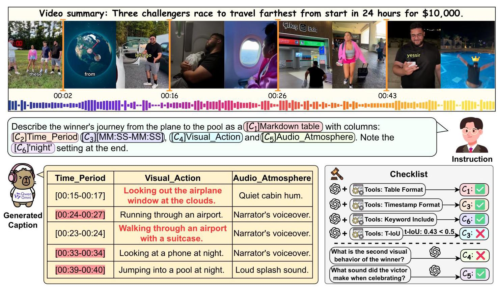
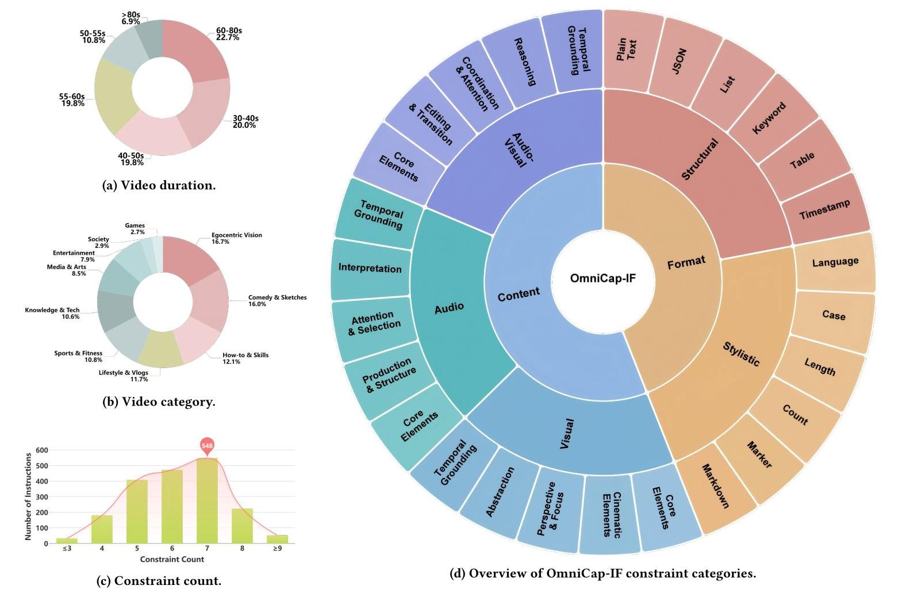
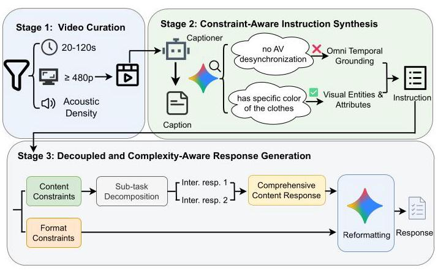
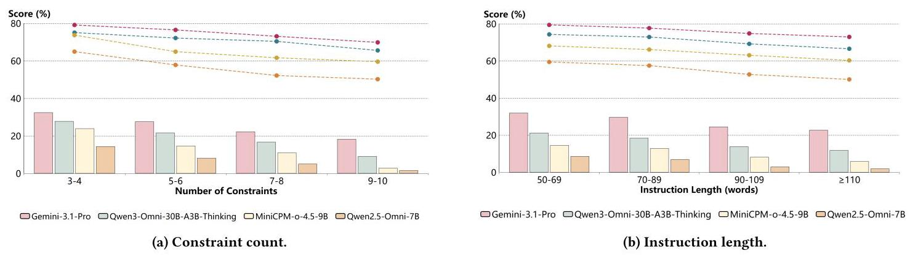
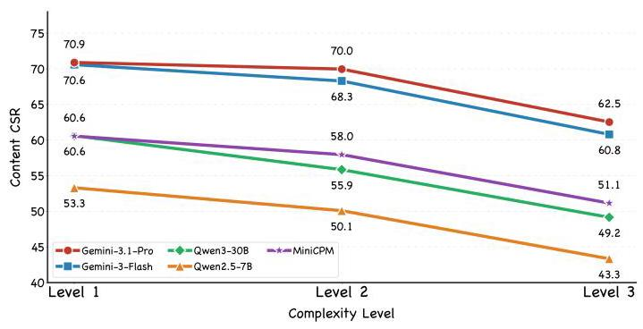
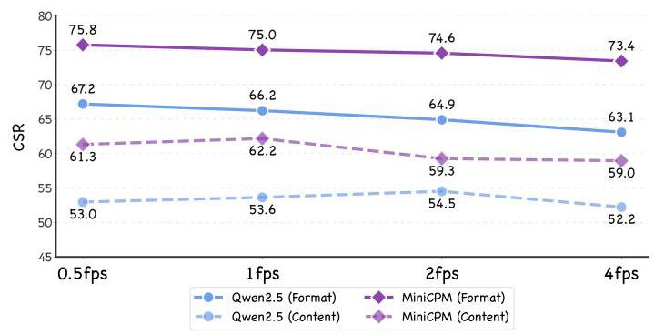
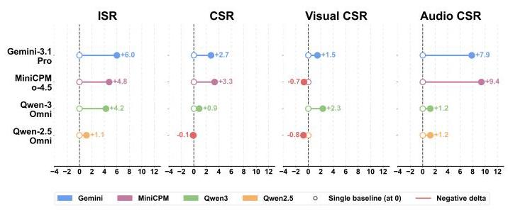
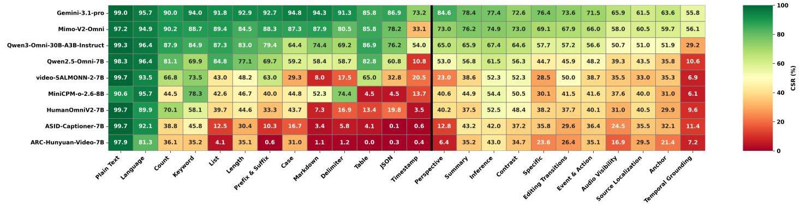

# OmniCap-IF: Benchmarking and Improving Instruction Following Abilities for Omni-Video Captioning

Anonymous Author(s)

Figure 1: Illustrative examples of OmniCap-IF cases. Each case consists of audio-visual input, an instruction, and a checklist. The instruction is composed of multiple constraints, each mapped to a specific item in the checklist. Checklist items are categorized into two types: (1) Temporal and Format constraints, which are evaluated by a judge model using predefined tools to enhance assessment stability; and (2) Content constraints, where the judge model answers preset questions based on the generated captions to verify factual accuracy. Finally, evaluation metrics are computed based on the judgment results of each constraint.

## Abstract

While Omni-modal Large Language Models (OLLMs) have demonstrated impressive capabilities in jointly processing audio and visual streams, their ability to strictly adhere to complex, multi-faceted user instructions remains largely unexplored. Existing benchmarks primarily focus on holistic video understanding or text-only instruction following, failing to capture the intricate interplay between modalities and user constraints. To bridge this gap, we introduce OmniCap-IF, the first comprehensive benchmark specifically designed to evaluate instruction-following capabilities in omni-modal captioning. OmniCap-IF incorporates a systematic framework that assesses captions on two dimensions: format correctness and content correctness. Our benchmark encompasses 50 distinct constraint types across pure visual, pure audio, and audio-visual modalities, while integrating Temporal Grounding to assess spatio-temporal precision. Extensive evaluations of prominent models on 1,920 high-quality samples reveal significant performance disparities. Furthermore, our analysis uncovers a critical "format-content tradeoff," demonstrating that increasing formatting complexity directly degrades models' omni-modal reasoning abilities. Finally, to advance the field, we curate a 54K instruction-tuning dataset, OmniCap-IF-54K and present OmniCaptioner-IF, which achieves notable improvements in both complex instruction adherence and general omni-modal captioning performance.

## Keywords

Omni-Modal Understanding, Instruction Following, Video Captioning, Benchmark

## 1 Introduction

The evolution of Multimodal Large Language Models (MLLMs) has recently transitioned from vision-language integration to omni-modal perception, enabling joint reasoning over text, audio and visual streams natively \( \left\lbrack  {5,8,{23}}\right\rbrack \) . Despite their proficiency in general video description, high-quality, controllable outputs are crucial for a range of downstream tasks, including structured dual-track scripts for text-to-audio-video (T2AV) generation [22], egocentric action descriptions for embodied task planning [3], and precise semantic fingerprints for cross-modal retrieval [27]. Models must not only understand the omni-modal content but also adhere strictly to complex, user-defined instructions. As illustrated in Figure 1, even leading models struggle to balance multi-modal perception with rigorous constraint satisfaction, often sacrificing instruction fidelity for descriptive verbosity [13, 24].

Currently, evaluating an omni-modal model's capacity to fulfill compositional constraints remains an unexplored challenge [35]. Existing benchmarks either prioritize semantic richness and question-answering accuracy over programmatic verifiability [19, 26] or are confined to single-modality instruction following [2, 47]. Consequently, they lack the joint audio-visual complexity and structural rigor required for comprehensive omni-modal evaluation.

To bridge this gap, we propose OmniCap-IF, the first benchmark dedicated to instruction-following in omni-modal captioning. We establish a systematic constraint framework of 50 constraint types spanning format and content dimensions-the latter decomposed into Visual, Audio, and Audio-Visual modalities. Furthermore, we incorporate Temporal Grounding [17] to enable quantitative assessment of precise timestamp localization, better aligning the evaluation with real-world scenarios.

Furthermore, through our decoupled evaluation protocol, we investigate the impact of formatting difficulty. We uncover a significant "format-content tradeoff"-demonstrating that as structural format constraints become more rigorous, models' fundamental ability to accurately reason over audio-visual content drastically degrades. Finally, to advance controllable generation, we construct OmniCap-IF-54K, a large-scale omni-modal instruction-tuning dataset, and present OmniCaptioner-IF, demonstrating a viable path toward highly controllable omni-modal assistants.

In summary, our key contributions are:

- We introduce OmniCap-IF, the first instruction-following benchmark for omni-modal captioning, featuring 1,920 complex, compositional instructions aligned with real-world downstream applications.

- We design a robust evaluation protocol that disentangles format checking from content evaluation. This system comprehensively covers Visual, Audio, and Audio-Visual constraints, uniquely incorporating Temporal Grounding.

- We uncover the "format-content tradeoff" phenomenon, empirically proving that strict syntactic constraints severely bottleneck omni-modal reasoning capabilities.

- We release OmniCap-IF-54K, a high-quality training dataset and the OmniCaptioner-IF model, providing a strong baseline for controllable omni-modal generation.

## 2 Related Work

### 2.1 Instruction-Following Benchmarks

Evaluating instruction adherence has evolved significantly alongside the rapid development of large language models. Early text-based benchmarks primarily focused on assessing models against verifiable programmatic constraints, multi-level structural formatting, and complex logical rules [15, 36, 47]. Recent efforts have extended this evaluation paradigm to vision-language tasks [2, 20]. Furthermore, while recent studies have observed that enforcing strict structural formatting can degrade the intrinsic reasoning capabilities of Large Language Models [9, 32], this phenomenon remains largely unexplored in complex multi-modal scenarios. Despite these advancements, existing evaluations remain confined to partial modalities and fail to meet the intricate requirements of emerging downstream applications. OmniCap-IF advances this paradigm by introducing omni-modal constraints and fine-grained temporal localization, effectively bridging the gap toward comprehensive omni-modal instruction following.

### 2.2 Omni-Modal Captioning Benchmarks

The recent advent of native omni-modal large language models has significantly expanded the boundaries of joint audio-visual understanding. Consequently, recent omni-modal captioning benchmarks primarily focus on assessing the semantic accuracy and descriptive richness of generated text, rather than a model's capacity to follow arbitrary or user-specified instructions. These benchmarks commonly adopt structured evaluation paradigms, including curated question-answer pairs [37], cloze-style assessments [25], detailed holistic audio-visual descriptions [33] and temporally-grounded cinematographic scripts [42]. Moreover, traditional temporal grounding tasks typically frame fine-grained event localization as isolated, pre-defined predictive tasks [18], lacking flexibility for dynamic or customized constraints. While such designs play a vital role in advancing omni-modal descriptive performance, they share a fundamental limitation: evaluation is conducted against a predefined and static set of quality criteria. In contrast, OmniCap-IF represents the first benchmark in omni-modal captioning that explicitly targets a model's ability to understand and execute diverse, compositional instructions spanning visual, auditory, and audio-visual modalities.

## 3 OmniCap-IF

### 3.1 Constraint Framework

To systematically evaluate omni-modal controllability, we construct a taxonomy encompassing 50 constraint types categorized into two primary dimensions (Figure 2d):

1. Format Constraints: Covers objective Structural (e.g., JSON arrays, Markdown tables) and Stylistic (e.g., length limits, specific delimiters) requirements.

2. Content Constraints: Demands fine-grained factual comprehension across three granularities: Visual (perceivable solely from the visual track, e.g., visual entities), Audio (derivable exclusively from the auditory stream, e.g., speaker timbre), and Audio-Visual (requiring the simultaneous integration of both streams, such as audio-visual event alignment). Further granular details regarding the classification and task definitions can be found in the supplementary material.

### 3.2 Data Collection and Annotation

3.2.1 Video Collection.

To construct a high-quality evaluation benchmark, we curate a test set of 480 videos by compiling a large-scale, copyright-free video pool sourced from YouTube, TikTok, and Ego4D [12]. The videos are rigorously filtered to ensure both audio-visual richness and audio-visual alignment. The final collection spans a wide range of domains-from comedy to technology-thereby enhancing the overall reliability and diversity of the benchmark.

3.2.2 Annotation Pipeline.

Our annotation pipeline follows a two-stage framework that integrates automated generation with human expertise, ensuring both scalability and high annotation quality.

Stage 1: Automated Draft Generation. For each video, an Instruction Generator first produces paired instruction-checklist annotations. A set of Response Generators then generates multiple candidate captions, which are subsequently evaluated by an Automated Evaluator to provide initial quality assessments. The prompts for generation can be found in the supplementary material.

Stage 2: Human Refinement and Verification. Professionally trained annotators carefully review and refine the automatically generated drafts, leading to a modification rate of 75.8%. Each sample is finalized only upon unanimous agreement among three annotators, with any disagreements adjudicated by a senior supervisor. Through this rigorous process, we obtain a final dataset comprising 1,920 high-quality samples.

### 3.3 Dataset Statistics

Overall Statistics. Statistical analysis demonstrates that the OmniCap-

IF dataset serves as a comprehensive benchmark, characterized by substantial diversity in duration, content coverage, and instructional complexity (Figure 2). The dataset exhibits a well-balanced distribution of video durations, with its average duration exceeds most existing omni-modal captioning benchmarks (Figure 2a). In addition, its wide-ranging content, covering numerous categories (Figure 2b), supports rigorous evaluation of cross-domain generalization. The instruction set further spans a spectrum from standard prompts to highly complex cases (Figure 2c). Collectively, these properties position OmniCap-IF as a next-generation testbed for evaluating OLLMs.

Comparison with Other Benchmarks. When compared with other benchmarks, we adopt IFEval [47], CELLO [14], InfoBench [28], FollowBench [15], SysBench [29], CFBench [44], ComplexBench [36] and IF-VidCap [20] as the instruction-following baselines. For omni-modal captioning, we compare against UGC-VideoCap [37], Omni-Cloze [25], OmniDCBench [42], and video-SALMONN-2- testset [33]. As shown in Table 1, OmniCap-IF advances the landscape of both instruction-following and omni-modal captioning benchmarks. In contrast to prior datasets that focus solely on text-only or vision-only instruction following, it incorporates omni-modal inputs while achieving a larger scale, increased instructional complexity, and more comprehensive content coverage. From the perspective of omni-modal captioning, OmniCap-IF shifts the focus from conventional descriptive or holistic narratives toward fine-grained instruction adherence, featuring richer informational content and, in general, longer video durations than most existing benchmarks. By bridging these directions and further introducing temporal grounding mechanisms, OmniCap-IF establishes a more rigorous and versatile benchmark for evaluating controllable generation in OLLMs.

Table 1: Comparison of Instruction Following and Omni-modal Captioning Benchmarks. "#Sz.", "#Ty.", and "#Cst." denote the total number of prompts, the number of distinct constraint types, and the average number of constraints per instruction, respectively. "V-Len." refers to the average video duration. "Temp." indicate whether the benchmark supports temporal grounding constraints. "Mod." indicates the input modality (T: Text, V: Video, AV: AudioVisual), while "Eval." specifies the methodology used for scoring (L:LLM, R:Rule). "v-SALMONN2" is abbreviated for the video-SALMONN-2-testset.

<table><tr><td>Benchmark</td><td>#Sz.</td><td>#Ty.</td><td>#Cst.</td><td>V-Len</td><td>Temp.</td><td>Mod.</td><td>Eval.</td></tr><tr><td colspan="8">Instruction Following Benchmarks</td></tr><tr><td>IFEval</td><td>541</td><td>25</td><td>1.54</td><td>-</td><td>-</td><td>T</td><td>R</td></tr><tr><td>CELLO</td><td>523</td><td>4</td><td>2.18</td><td>-</td><td>-</td><td>T</td><td>R</td></tr><tr><td>InfoBench</td><td>500</td><td>5</td><td>5.93</td><td>-</td><td>-</td><td>T</td><td>L</td></tr><tr><td>FollowBench</td><td>944</td><td>5</td><td>3.00</td><td>-</td><td>-</td><td>T</td><td>L/R</td></tr><tr><td>SysBench</td><td>500</td><td>6</td><td>2.38</td><td>-</td><td>-</td><td>T</td><td>L</td></tr><tr><td>CFBench</td><td>1,000</td><td>10-25</td><td>4.24</td><td>-</td><td>-</td><td>T</td><td>L</td></tr><tr><td>ComplexBench</td><td>1,150</td><td>4-19</td><td>4.61</td><td>-</td><td>-</td><td>T</td><td>L+R</td></tr><tr><td>IF-VidCap</td><td>1,400</td><td>27</td><td>6.00</td><td>20.5s</td><td>-</td><td>V</td><td>L+R</td></tr></table>

<table><tr><td colspan="8">Omni-modal Captioning Benchmarks</td></tr><tr><td>v-SALMONN2</td><td>483</td><td>-</td><td>-</td><td>50.8s</td><td>-</td><td>AV</td><td>L</td></tr><tr><td>UGC-VidCap</td><td>1,000</td><td>-</td><td>-</td><td>23.9s</td><td>-</td><td>AV</td><td>L</td></tr><tr><td>Omni-Cloze</td><td>2,340</td><td>-</td><td>-</td><td>34.2s</td><td>-</td><td>AV</td><td>L</td></tr><tr><td>OmniDCBench</td><td>1,122</td><td>-</td><td>-</td><td>59.5s</td><td>✓</td><td>AV</td><td>L</td></tr><tr><td>Ours</td><td>1,920</td><td>50</td><td>6.93</td><td>54.6s</td><td>✓</td><td>AV</td><td>L+R</td></tr></table>

### 3.4 Evaluation Protocol

#### 3.4.1 Evaluation Methodology.

To rigorously assess model performance, OmniCap-IF employs a bifurcated evaluation strategy that disentangles structural adherence from semantic fidelity, as comprehensively illustrated in Figure 1. Inspired by IF-VidCap [20], we incorporate rule-based programmatic tools into our evaluation pipeline to significantly enhance the stability and reliability of the LLM-as-a-judge [46].

Format Evaluation: This component targets objective structural requirements (e.g., length, JSON schema, or ordered list). To ensure stable and robust verification, we employ a two-step hybrid approach: an LLM first extracts the structured information from the generated output, followed by the execution of rule-based programmatic tools to deterministically verify compliance against predefined formatting rules.

Content Evaluation: This component assesses instruction following regarding content constraints, explicitly prioritizing objective factual accuracy over descriptive fluency to mitigate LLM judge biases. We evaluate this through two complementary mechanisms:

Figure 2: Dataset statistics for OmniCap-IF. (a-c) show distributions for video duration, category, and constraint count, respectively. (d) provides an overview of the constraint categories.

- Temporal Grounding Constraints: An LLM extracts timestamps from the response, followed by rule-based tools computing temporal-IoU (t-IoU) or offsets to accurately determine temporal compliance. Comprehensive descriptions of the evaluation procedures and implementation details are provided in the supplementary material.

- Multimodal Content Constraints: For the remaining constraints across visual, audio, and audio-visual dimensions, we leverage an LLM-as-a-judge via a Question-Answering (QA) approach. By providing the generated captions as context for the LLM to answer these QA pairs, we systematically verify the factual alignment between the generated content and complex instructions.

3.4.2 Evaluation Metrics.

We employ two primary metrics to quantify performance: Constraint Satisfaction Rate (CSR) and Instruction Satisfaction Rate (ISR).

\[
\operatorname{CSR} = \frac{1}{m}\mathop{\sum }\limits_{{i = 1}}^{m}\frac{1}{{n}_{i}}\mathop{\sum }\limits_{{j = 1}}^{{n}_{i}}{s}_{i}^{j},\;\operatorname{ISR} = \frac{1}{m}\mathop{\sum }\limits_{{i = 1}}^{m}{\operatorname{ISR}}_{i} \tag{1}
\]

where \( m \) is the total number of instructions, and \( {n}_{i} \) denotes the number of constraints for the \( i \) -th instruction. \( {s}_{i}^{j} \in  \{ 0,1\} \) indicates whether the \( j \) -th constraint is satisfied. \( {\mathrm{{ISR}}}_{i} \) is a binary indicator that equals 1 if and only if all constraints within the \( i \) -th instruction are simultaneously satisfied (i.e., \( \sum {s}_{i}^{j} = {n}_{i} \) ), and 0 otherwise.

To provide a granular diagnostic of model capabilities, we report metrics across a hierarchical structure as categorized in Table 2:

- Primary Evaluation Types: We report Format CSR/ISR for structural control and Content CSR/ISR for semantic fidelity.

- Modality-Specific Content Analysis: The Content CSR is further decomposed into Visual, Audio, and Audio-Visual (AV) dimensions to pinpoint modality-specific instruction following capabilities.

### 3.5 OmniCap-IF-54K

To endow models with generalizable and robust instruction-following capabilities, we introduce a large-scale, high-quality fine-tuning dataset. To prevent data leakage, the generation pipeline is strictly decoupled from our evaluation benchmark. As illustrated in Figure 3, the process consists of three stages, ultimately yielding OmniCap-IF-54K, a dataset consisting of 54K curated video-instruction-response triplets.

Stage 1: High-Quality Omni-Modal Video Curation. We source raw videos from LLaVA-Video-178K [45] and TikTok-10M [7]. To ensure multimodal richness, we apply strict heuristic filters: (1) durations between 20 to 120 seconds, (2) visual resolutions of at least 480p, and (3) high acoustic density, filtered using PANNs [16] to guarantee the presence of diverse ambient sounds and speech. This results in 14K high-quality video samples.

Stage 2: Constraint-Aware Instruction Synthesis. We first generate fine-grained textual captions for all videos using ASID-Captioner- 7B [21] to serve as dense multimodal proxies. Gemini-3-Flash [11] then synthesizes instructions by sampling from our constraint system. Crucially, we implement a negative constraint filter: any constraint whose prerequisite elements are absent from the proxy caption (e.g., blacklisting the "omni temporal grounding" constraint if the caption lacks any description of audio-visual desynchroniza-tion) is excluded to prevent hallucinations. Valid constraints are then combined to form complex, multi-constraint instructions.

Stage 3: Decoupled and Complexity-Aware Response Generation. As demonstrated in Figure 4, a model's ability to satisfy constraints degrades significantly as the number of constraints increases. Consequently, generating a response for a heavily constrained instruction in a single pass often yields flawed ground truth. To circumvent this, we adopt a decomposed generation strategy. First, we separate the instruction into content constraints and format constraints. The content constraints are further partitioned into smaller, manageable sub-tasks containing only 2-3 constraints each. Gemini-3-Flash generates high-fidelity intermediate responses for these sub-tasks based on the video caption, which are then aggregated into a comprehensive, multi-constraint content response. Furthermore, as illustrated in Figure 5, enforcing rigid format constraints simultaneously can severely compromise the factual correctness of the generated content. Thus, we apply format constraints exclusively in the final stage: the model is instructed to reformat the aggregated content response to produce the final ground truth, ensuring both semantic richness and structural compliance. In addition, we conduct a manual audit of 500 randomly sampled triplets, finding that 94.3% of the samples are fully reliable and strictly adhering to all constraints.

The prompts used in the process can be found in the supplementary material.

Figure 3: The training set generation pipeline.

## 4 Experiments

### 4.1 Main Results

We evaluate 14 leading omni-modal models, including Gemini-3.1- Pro [11], Gemini-3-Flash, Gemini-2.5-Pro [6], MiMo-V2-Omni [38], Qwen3-Omni [40], Qwen2.5-Omni [39], ARC-Hunyuan-Video [10], HumanOmniV2 [41], MiniCPM-o [43], video-SALMONN2 [33] and ASID-Captioner [21].

The main results in Table 2 yield several key observations. (1) Within the same model family, performance consistently improves as model size increases. (2) Generally, models perform better on Audio and Visual constraints independently than on Audio-Visual constraints, highlighting the difficulty of joint audio-visual integration. (3) Models demonstrate stronger capability in controlling output format than in adhering to content-related requirements, likely because content understanding demands more complex multi-modal reasoning, whereas format constraints are predominantly text-based. (4) The human baseline exhibits a distinct performance pattern compared to advanced models. Benefiting from deliberate verification and self-reflective reasoning, human annotators achieve better results in format control, significantly outperforming all evaluated models.

Additionally, we developed the OmniCaptioner-IF series by fine-tuning Qwen2.5-Omni on OmniCap-IF-54K. OmniCaptioner-IF demonstrates a substantial performance leap over the base Qwen2.5- Omni across all metrics. Notably, our models exhibit exceptional structural controllability: OmniCaptioner-IF performs on par with the proprietary Gemini-3.1-Pro in format metrics, underscoring the efficacy of our specialized instruction-tuning in enforcing rigid constraint adherence.

### 4.2 Results on Existing Benchmarks

We evaluate OmniCaptioner-IF on several external benchmarks-IF-VidCap (vision-only instruction following), Omni-Cloze (cloze-style fine-grained omni perception), and UGC-VideoCap (QA-based omni video captioning)-to comprehensively assess its generalizable omni-modal perception capabilities. The results of Omni-VideoQA benchmarks can be found in the supplementary material.

Results on IF-VidCap. IF-VidCap strictly focuses on visual-only instruction adherence. We evaluate our model by providing only the video track. As shown in Table 3, OmniCaptioner-IF-3B surpasses the vision-expert model Qwen2.5-VL-Instruct-3B across all metrics. This demonstrates that our omni-modal instruction tuning not only preserves but substantially enhances pure visual grounding capabilities.

Results on Omni-modal Captioning Benchmarks. We further validate our model on comprehensive audio-visual benchmarks. As illustrated in Table 4, OmniCaptioner-IF-7B demonstrates a remarkable performance leap on Omni-Cloze, effectively doubling the total accuracy compared to the original baseline.

On the UGC-VideoCap benchmark (Table 5), OmniCaptioner-IF-7B even achieves performance comparable to the proprietary model, Gemini-2.5-Pro. This highlights the efficacy of fine-grained constraint adherence as a proxy for enhancing general omni-modal understanding.

Table 2: Main Evaluation Results on the OmniCap-IF Benchmark. The content CSR is further decomposed into Visual, Audio, and Audio-Visual modalities.

<table><tr><td rowspan="2">Model</td><td colspan="2">Overall</td><td colspan="2">Format</td><td colspan="5">Content</td></tr><tr><td>CSR</td><td>ISR</td><td>CSR</td><td>ISR</td><td>CSR</td><td>ISR</td><td>Visual CSR</td><td>Audio CSR</td><td>AV CSR</td></tr><tr><td>Human</td><td>83.29</td><td>35.31</td><td>94.83</td><td>84.19</td><td>78.23</td><td>40.19</td><td>78.38</td><td>80.05</td><td>72.43</td></tr><tr><td colspan="10">Closed-Source Large Multimodal Models</td></tr><tr><td>Gemini-3.1-Pro</td><td>79.80</td><td>30.86</td><td>89.78</td><td>80.89</td><td>74.57</td><td>36.82</td><td>74.91</td><td>77.37</td><td>70.57</td></tr><tr><td>Gemini-3-Flash</td><td>78.70</td><td>29.04</td><td>85.75</td><td>74.17</td><td>75.01</td><td>37.26</td><td>75.20</td><td>76.73</td><td>71.67</td></tr><tr><td>MiMo-V2-Omni</td><td>74.59</td><td>22.18</td><td>81.55</td><td>67.28</td><td>70.93</td><td>31.84</td><td>70.92</td><td>73.60</td><td>67.85</td></tr><tr><td>Gemini-2.5-Pro</td><td>74.06</td><td>24.58</td><td>81.70</td><td>68.84</td><td>70.05</td><td>32.08</td><td>71.82</td><td>74.11</td><td>65.30</td></tr><tr><td colspan="10">Open-Source Large Multimodal Models</td></tr><tr><td>Qwen3-Omni-30B-A3B-Thinking</td><td>72.58</td><td>19.42</td><td>84.48</td><td>72.55</td><td>66.33</td><td>25.00</td><td>67.71</td><td>72.30</td><td>59.70</td></tr><tr><td>Qwen3-Omni-30B-A3B-Instruct</td><td>67.44</td><td>14.27</td><td>79.46</td><td>64.14</td><td>61.14</td><td>20.05</td><td>64.09</td><td>64.88</td><td>55.07</td></tr><tr><td>MiniCPM-o-4.5-9B</td><td>66.40</td><td>12.81</td><td>77.00</td><td>60.38</td><td>60.83</td><td>19.32</td><td>62.98</td><td>67.25</td><td>53.38</td></tr><tr><td>Qwen2.5-Omni-7B</td><td>57.44</td><td>7.55</td><td>66.78</td><td>46.52</td><td>52.54</td><td>12.76</td><td>57.13</td><td>57.14</td><td>44.18</td></tr><tr><td>Qwen2.5-Omni-3B</td><td>51.07</td><td>4.74</td><td>60.44</td><td>39.78</td><td>46.16</td><td>9.06</td><td>53.42</td><td>51.09</td><td>36.31</td></tr><tr><td>video-SALMONN-2-7B</td><td>44.58</td><td>1.88</td><td>47.80</td><td>23.99</td><td>42.89</td><td>6.05</td><td>47.28</td><td>48.94</td><td>34.86</td></tr><tr><td>MiniCPM-o-2.6-8B</td><td>43.39</td><td>1.67</td><td>40.85</td><td>18.07</td><td>44.72</td><td>6.58</td><td>51.26</td><td>49.88</td><td>37.14</td></tr><tr><td>HumanOmniV2-7B</td><td>41.85</td><td>2.40</td><td>37.86</td><td>18.18</td><td>43.95</td><td>7.10</td><td>51.04</td><td>48.16</td><td>36.54</td></tr><tr><td>ASID-Captioner-7B</td><td>33.87</td><td>1.04</td><td>22.70</td><td>7.74</td><td>39.72</td><td>6.20</td><td>48.45</td><td>46.48</td><td>30.50</td></tr><tr><td>ARC-Hunyuan-Video-7B</td><td>29.74</td><td>0.31</td><td>20.27</td><td>5.75</td><td>34.71</td><td>4.17</td><td>44.51</td><td>37.24</td><td>26.62</td></tr><tr><td colspan="10">Ours</td></tr><tr><td>OmniCaptioner-IF-7B (ours)</td><td>72.59</td><td>18.28</td><td>89.09</td><td>79.46</td><td>63.94</td><td>22.08</td><td>63.82</td><td>68.81</td><td>59.02</td></tr><tr><td>OmniCaptioner-IF-3B (ours)</td><td>69.09</td><td>13.28</td><td>86.78</td><td>74.96</td><td>59.81</td><td>16.93</td><td>61.57</td><td>64.25</td><td>54.04</td></tr></table>

Figure 4: The impact of constraint count, instruction length on model performance.

### 4.3 Further Analysis

Impact of Instruction Complexity. We examine four representative models to explore the relationship between instruction complexity-jointly determined by prompt length and constraint count-and two metrics: Constraint Satisfaction Rate (CSR) and Instruction Satisfaction Rate (ISR). Evaluations are carried out on an expert-filtered subset comprising 1,000 high-quality instances from the benchmark. Within these samples, constraints are interdependent (e.g., branching, chaining) instead of being strictly isolated. This specific selection guarantees that the total number of constraints reliably reflects the true complexity of the task. Figures 4a and 4b explicitly illustrate that a model's proficiency in satisfying constraints and following directives deteriorates with escalating complexity, substantiating that more nuanced and difficult commands severely strain models' instruction-following abilities.

Table 3: Results on the IF-VidCap Benchmark.

<table><tr><td rowspan="2">Model</td><td rowspan="2">ISR</td><td rowspan="2">CSR</td><td colspan="2">Format</td><td colspan="2">Content</td></tr><tr><td>ISR</td><td>CSR</td><td>ISR</td><td>CSR</td></tr><tr><td>Gemini-2.5-Pro</td><td>27.83</td><td>74.53</td><td>74.35</td><td>87.81</td><td>35.22</td><td>59.00</td></tr><tr><td>Qwen2.5-VL-Instruct-7B [1]</td><td>10.92</td><td>58.12</td><td>52.51</td><td>73.81</td><td>18.75</td><td>39.65</td></tr><tr><td>Qwen2.5-VL-Instruct-3B [1]</td><td>6.54</td><td>51.74</td><td>43.46</td><td>66.50</td><td>13.15</td><td>34.47</td></tr><tr><td>Qwen2.5-Omni-7B (w/o Audio)</td><td>8.17</td><td>56.49</td><td>54.12</td><td>74.41</td><td>14.04</td><td>36.76</td></tr><tr><td>Qwen2.5-Omni-3B (w/o Audio)</td><td>5.73</td><td>49.66</td><td>43.23</td><td>65.77</td><td>11.10</td><td>31.95</td></tr><tr><td>OmniCaptioner-IF-7B (w/o Audio)</td><td>12.21</td><td>61.20</td><td>61.33</td><td>79.92</td><td>16.57</td><td>40.63</td></tr><tr><td>OmniCaptioner-IF-3B (w/o Audio)</td><td>8.70</td><td>57.56</td><td>57.58</td><td>76.30</td><td>13.70</td><td>36.99</td></tr></table>

Table 4: Results on the Omni-Cloze Benchmark.

<table><tr><td>Model</td><td>Visual%↑</td><td>Audio \( \%  \uparrow \)</td><td>AV%↑</td><td>Total%↑</td></tr><tr><td>Gemini-2.5-Flash [6]</td><td>31.50</td><td>18.40</td><td>39.10</td><td>27.90</td></tr><tr><td>video-SALMONN-13B [31]</td><td>2.60</td><td>1.70</td><td>4.00</td><td>2.50</td></tr><tr><td>VideoLLaMA-2-7B [4]</td><td>5.70</td><td>2.60</td><td>7.30</td><td>4.80</td></tr><tr><td>Qwen2.5-Omni-7B</td><td>10.40</td><td>12.90</td><td>18.90</td><td>12.90</td></tr><tr><td>OmniCaptioner-IF-7B (Ours)</td><td>23.86</td><td>24.23</td><td>32.30</td><td>25.17</td></tr><tr><td>OmniCaptioner-IF-3B (Ours)</td><td>21.27</td><td>21.81</td><td>28.94</td><td>22.53</td></tr></table>

Table 5: Results on the UGC-VideoCap Benchmark.

<table><tr><td>Model</td><td>Audio↑</td><td>Visual↑</td><td>Detail↑</td><td>Avg. \( \uparrow \)</td></tr><tr><td>Gemini-2.5-Pro</td><td>69.50</td><td>74.70</td><td>73.70</td><td>72.60</td></tr><tr><td>Qwen3-Omni-30B-A3B-Instruct</td><td>67.50</td><td>74.80</td><td>72.30</td><td>71.50</td></tr><tr><td>HumanOmniV2-7B</td><td>45.60</td><td>66.30</td><td>59.50</td><td>57.10</td></tr><tr><td>video-SALMONN-2-7B</td><td>61.80</td><td>71.40</td><td>68.50</td><td>67.20</td></tr><tr><td>Qwen2.5-Omni-7B</td><td>46.90</td><td>66.10</td><td>60.00</td><td>57.70</td></tr><tr><td>Qwen2.5-Omni-3B</td><td>48.20</td><td>55.60</td><td>52.60</td><td>52.18</td></tr><tr><td>OmniCaptioner-IF-7B (Ours)</td><td>69.79</td><td>75.94</td><td>73.19</td><td>72.97</td></tr><tr><td>OmniCaptioner-IF-3B (Ours)</td><td>67.71</td><td>73.91</td><td>70.43</td><td>70.68</td></tr></table>

Figure 5: The format-content tradeoff.

Format-content Tradeoff. To examine the impact of formatting complexity on a model's ability to retain semantic depth, we designed a controlled experiment evaluated on 1,200 curated samples across five representative models. Specifically, we held the content constraints strictly constant while varying the format constraints across three levels:

Figure 6: Impact of FPS on model performance.

Figure 7: Analysis of Cross-Modal Synergy.

- Level 1 (Loose): Natural language, basic paragraphs/bullets (e.g., plain text, length).

- Level 2 (Styled): Human-readable visual structuring requiring layout awareness (e.g., Markdown table, ordered_list).

- Level 3 (Syntactic): Machine-readable, strict grammatical rules (e.g., JSON arrays, forced keywords).

As illustrated in Figure 5, as the formatting level increases from the lowest level to the highest level, the content CSR drops continuously and noticeably. This indicates that forcing models to allocate attention to rigid syntactic generation (e.g., JSON nesting) directly cannibalizes their capacity for complex cross-modal reasoning.

Impact of Video Parameters. We examine Qwen2.5-Omni-7B and MiniCPM-o-4.5-9B under varying frame sampling rates (FPS). As shown in Figure 6, increasing FPS causes Format CSR to drop steadily, as the influx of visual tokens overwhelms the context window and reduces the models' ability to maintain strict structural adherence.

Content CSR first increases and then decreases. The initial gain arises from richer visual evidence supporting fine-grained event perception, while excessive frame density adds redundant noise and context pressure, deviating from models' optimal training distributions and impairing abilities such as precise temporal grounding. The exact turning point varies across models, reflecting differences in their preferred visual token density.

Analysis of Cross-Modal Synergy. To assess whether current OLLMs achieve true audio-visual synergy, we perform a modality decoupling experiment, comparing omni-modal performance with single-modal baselines (Figure 7). Gemini-3.1-Pro and MiniCPM-o- 4.5 exhibit strong cross-modal gains: adding visual context significantly boosts their Audio CSR, showing effective use of visual cues to ground and disambiguate acoustic events.

Figure 8: CSR performance of different models on different formats and audio-visual constraint types.

In contrast, the Qwen series shows minimal synergy. Qwen3- Omni and Qwen2.5-Omni achieve only slight improvements, with Qwen2.5-Omni even declining in Overall CSR. Degraded Visual CSR in MiniCPM-o-4.5 and Qwen2.5-Omni further highlights cross-modal interference, suggesting that while these models handle unimodal inputs well, they largely process audio and visual streams independently rather than in a deeply fused manner.

Agreement Evaluation. To validate our evaluation framework, we compare automated assessments with human judgment using the professional annotations described in Section 3.2.2. Agreement is measured across three assessor models: GPT-5-mini [30], Gemini-3- Flash [11], and Qwen3.5-27B [34]. As shown in Table 6, GPT-5-mini achieves the highest concordance with human evaluations across all metrics. The strong agreement across these diverse models highlights the robustness and general applicability of our methodology.

Table 6: Agreement between automated evaluation and human evaluation across different models.

<table><tr><td>Model</td><td>Overall Agreement</td><td>Format</td><td>Content</td></tr><tr><td>GPT-5-mini</td><td>94.70</td><td>96.12</td><td>94.29</td></tr><tr><td>Gemini-3-Flash</td><td>93.16</td><td>94.17</td><td>92.86</td></tr><tr><td>Qwen3.5-27B</td><td>92.49</td><td>94.66</td><td>91.86</td></tr></table>

Constraint Type Analysis. Our analysis of the CSR across representative models (Figure 8) reveals a pervasive performance bottleneck: while current OLLMs handle basic textual formats well, they struggle significantly with rigid structural formatting and fine-grained audio-visual constraints. Regarding format control, OLLMs face challenges with complex structures like JSON and strict patterns such as Timestamps, reflecting limitations in token-level output regulation. In content constraints, models show difficulties with directives related to Editing Transition, Temporal Grounding, and Anchor. The lower performance on Editing Transition suggests limited internalization of professional cinematic techniques, while the gaps in Temporal Grounding and Anchor indicate that visual and auditory streams are often processed as isolated channels. Notably, specialized video captioning models do not outperform general-purpose models (e.g., ASID-Captioner versus Qwen2.5-Omni-7B) under our evaluation, because our benchmark emphasizes precise adherence to instruction-specified attributes, actions, or events rather than unconstrained, detailed video descriptions.

The OmniCaptioner-IF series addresses these limitations with comprehensive improvements, outperforming baselines across the entire constraint spectrum. Notably, the models transform previously weak adherence to rigid formats like JSON and Timestamp into robust performance, while also showing stronger handling of fine-grained audio-visual constraints. This demonstrates that OmniCaptioner-IF excels both in strict output regulation and in deep cross-modal understanding. More details can be found in the supplementary material.

Error Analysis. Our analysis of model responses reveals key error categories. For format constraints, common violations are (1) malformed JSON (e.g., missing keys or bracket mismatches) and (2) incorrect timestamp formatting (e.g., not following the "MM:SS" template). For content constraints, frequent issues include (1) misidentifying or omitting Editing Transitions, (2) inaccurate Temporal Grounding of video events, and (3) failing to establish cross-modal Anchors (e.g., mismatching audio cues with visual entities). We also find that smaller-scale models are more prone to uncontrolled generation when handling videos with multiple transitions requiring precise scene ranges or transition timestamps, indicating control difficulty in managing complex multi-scene video data. More concrete examples can be found in the supplementary material.

## 5 Conclusion

In this work, we introduced OmniCap-IF, a pioneering benchmark explicitly designed to evaluate instruction-following capabilities in omni-modal video captioning. By systematically defining 50 distinct constraints across format, visual, audio, and cross-modal dimensions, and deploying a rigorous dual evaluation protocol, OmniCap-IF provides a comprehensive diagnostic testbed. Our extensive evaluations yielded profound insights into the limitations of current OLLMs, and observe a distinct lack of deep cross-modal synergy in open-source models compared to their proprietary counterparts. Moreover, we also curated OmniCap-IF-54K, a 54K instruction-tuning dataset, and developed OmniCaptioner-IF. Our model not only masters complex structural constraints but also demonstrates remarkable ability in omni-modal captioning.

## References

[1] Shuai Bai, Keqin Chen, Xuejing Liu, Jialin Wang, Wenbin Ge, Sibo Song, Kai Dang, Peng Wang, Shijie Wang, Jun Tang, Humen Zhong, Yuanzhi Zhu, Mingkun Yang, Zhaohai Li, Jianqiang Wan, Pengfei Wang, Wei Ding, Zheren Fu, Yiheng Xu, Jiabo Ye, Xi Zhang, Tianbao Xie, Zesen Cheng, Hang Zhang, Zhibo Yang, Haiyang Xu, and Junyang Lin. 2025. Qwen2.5-VL Technical Report. arXiv preprint arXiv:2502.13923 (2025).

[2] Yonatan Bitton, Hritik Bansal, Jack Hessel, Rulin Shao, Wanrong Zhu, Anas Awadalla, Josh Gardner, Rohan Taori, and Ludwig Schmidt. 2023. Visit-bench: A benchmark for vision-language instruction following inspired by real-world use. arXiv preprint arXiv:2308.06595 (2023).

[3] Yi Chen, Yuying Ge, Yixiao Ge, Mingyu Ding, Bohao Li, Rui Wang, Ruifeng Xu, Ying Shan, and Xihui Liu. 2026. Egoplan-bench: Benchmarking multimodal large language models for human-level planning. International Journal of Computer Vision 134, 3 (2026), 118.

[4] Zesen Cheng, Sicong Leng, Hang Zhang, Yifei Xin, Xin Li, Guanzheng Chen, Yongxin Zhu, Wenqi Zhang, Ziyang Luo, Deli Zhao, et al. 2024. Videollama 2: Advancing spatial-temporal modeling and audio understanding in video-llms. arXiv preprint arXiv:2406.07476 (2024).

[5] Yunfei Chu, Jin Xu, Xiaohuan Zhou, Qian Yang, Shiliang Zhang, Zhijie Yan, Chang Zhou, and Jingren Zhou. 2023. Qwen-Audio: Advancing universal audio understanding via unified large-scale audio-language models. arXiv preprint arXiv:2311.07919 (2023).

[6] Gheorghe Comanici, Eric Bieber, Mike Schaekermann, Ice Pasupat, Noveen Sachdeva, Inderjit Dhillon, Marcel Blistein, Ori Ram, Dan Zhang, Evan Rosen, et al. 2025. Gemini 2.5: Pushing the frontier with advanced reasoning, multimodality, long context, and next generation agentic capabilities. arXiv preprint arXiv:2507.06261 (2025).

[7] The Data Company. 2025. TikTok-10M: A Large-Scale Short Video Dataset for Video Understanding. https://huggingface.co/datasets/The-data-company/TikTok- 10M A dataset of 10 million TikTok posts for multimodal learning and social media analysis.

[8] Wenliang Dai, Junnan Li, Dongxu Li, Anthony Tiong, Junqi Zhao, Weisheng Wang, Boyang Li, Pascale N Fung, and Steven Hoi. 2023. InstructBLIP: Towards general-purpose vision-language models with instruction tuning. Advances in neural information processing systems 36 (2023), 49250-49267.

[9] Haikang Deng, Po-Nien Kung, and Nanyun Peng. 2025. Decoupling Task-Solving and Output Formatting in LLM Generation. arXiv preprint arXiv:2510.03595 (2025).

[10] Yuying Ge, Yixiao Ge, Chen Li, Teng Wang, Junfu Pu, Yizhuo Li, Lu Qiu, Jin Ma, Lisheng Duan, Xinyu Zuo, et al. 2025. ARC-Hunyuan-Video-7B: Structured Video Comprehension of Real-World Shorts. arXiv preprint arXiv:2507.20939 (2025).

[11] Google DeepMind. 2026. Gemini 3. https://aistudio.google.com/models/gemini- 3.

[12] Kristen Grauman, Andrew Westbury, Eugene Byrne, Zachary Chavis, Antonino Furnari, Rohit Girdhar, Jackson Hamburger, Hao Jiang, Miao Liu, Xingyu Liu, et al. 2022. Ego4d: Around the world in 3,000 hours of egocentric video. In Proceedings of the IEEE/CVF conference on computer vision and pattern recognition. 18995-19012.

[13] Tianrui Guan, Fuxiao Liu, Xiyang Wu, Ruiqi Xian, Zongxia Li, Xiaoyu Liu, Xijun Wang, Lichang Chen, Furong Huang, Yaser Yacoob, et al. 2024. Hallusionbench: an advanced diagnostic suite for entangled language hallucination and visual illusion in large vision-language models. In Proceedings of the IEEE/CVF conference on computer vision and pattern recognition. 14375-14385.

[14] Qianyu He, Jie Zeng, Wenhao Huang, Lina Chen, Jin Xiao, Qianxi He, Xunzhe Zhou, Jiaqing Liang, and Yanghua Xiao. 2024. Can large language models understand real-world complex instructions?. In Proceedings of the AAAI Conference on Artificial Intelligence, Vol. 38. 18188-18196.

[15] Yuxin Jiang, Yufei Wang, Xingshan Zeng, Wanjun Zhong, Liangyou Li, Fei Mi, Lifeng Shang, Xin Jiang, Qun Liu, and Wei Wang. 2024. Followbench: A multilevel fine-grained constraints following benchmark for large language models. In Proceedings of the 62nd Annual Meeting of the Association for Computational Linguistics (Volume 1: Long Papers). 4667-4688.

[16] Qiuqiang Kong, Yin Cao, Turab Iqbal, Yuxuan Wang, Wenwu Wang, and Mark D Plumbley. 2020. PANNs: Large-scale pretrained audio neural networks for audio pattern recognition. IEEE/ACM Transactions on Audio, Speech, and Language Processing 28 (2020), 2880-2894.

[17] Ranjay Krishna, Kenji Hata, Frederic Ren, Li Fei-Fei, and Juan Carlos Niebles. 2017. Dense-captioning events in videos. In Proceedings of the IEEE international conference on computer vision. 706-715.

[18] Jie Lei, Licheng Yu, Tamara L Berg, and Mohit Bansal. 2020. Tvr: A large-scale dataset for video-subtitle moment retrieval. In European Conference on Computer Vision. Springer, 447-463.

[19] Kunchang Li, Yali Wang, Yinan He, Yizhuo Li, Yi Wang, Yi Liu, Zun Wang, Jilan Xu, Guo Chen, Ping Luo, et al. 2024. Mvbench: A comprehensive multi-modal video understanding benchmark. In Proceedings of the IEEE/CVF Conference on Computer Vision and Pattern Recognition. 22195-22206.

[20] Shihao Li, Yuanxing Zhang, Jiangtao Wu, Zhide Lei, Chenxi Liao, An Ping, Zhaozhou Bian, Yiwen He, Suhan Wang, Runzhe Wen, Chengkang Jiang, Shuo Gao, Jiayi Zhou, Jing Wang, Yifan Yao, Weihao Xie, Yanghai Wang, Zijun Zhou, Jingyi Xie, Yingshui Tan, Qianqian Xie, Zhaoxiang Zhang, and Jiaheng Liu. 2026. IF-VidCap: Can Video Caption Models Follow Instructions?. In The Fourteenth International Conference on Learning Representations.

[21] Yunheng Li, Hengrui Zhang, Meng-Hao Guo, Wenzhao Gao, Shaoyong Jia, Shaohui Jiao, Qibin Hou, and Ming-Ming Cheng. 2026. Towards Universal Video MLLMs with Attribute-Structured and Quality-Verified Instructions. arXiv preprint arXiv:2602.13013 (2026).

[22] Haohe Liu, Gael Le Lan, Xinhao Mei, Zhaoheng Ni, Anurag Kumar, Varun Na-garaja, Wenwu Wang, Mark D Plumbley, Yangyang Shi, and Vikas Chandra. 2024. Syncflow: Toward temporally aligned joint audio-video generation from text. arXiv preprint arXiv:2412.15220 (2024).

[23] Haotian Liu, Chunyuan Li, Qingyang Wu, and Yong Jae Lee. 2023. Visual instruction tuning. Advances in neural information processing systems 36 (2023), 34892-34916.

[24] Nelson F Liu, Kevin Lin, John Hewitt, Ashwin Paranjape, Michele Bevilacqua, Fabio Petroni, and Percy Liang. 2023. Lost in the middle: How language models use long contexts, 2023. URL https://arxiv.org/abs/2307.03172 2 (2023).

[25] Ziyang Ma, Ruiyang Xu, Zhenghao Xing, Yunfei Chu, Yuxuan Wang, Jinzheng He, Jin Xu, Pheng-Ann Heng, Kai Yu, Junyang Lin, Eng Siong Chng, and Xie Chen. 2026. Omni-Captioner: Data Pipeline, Models, and Benchmark for Omni Detailed Perception. In The Fourteenth International Conference on Learning Representations.

[26] Muhammad Maaz, Hanoona Rasheed, Salman Khan, and Fahad Khan. 2024. Video-ChatGPT: Towards detailed video understanding via large vision and language models. In Proceedings of the 62nd Annual Meeting of the Association for Computational Linguistics (Volume 1: Long Papers). 12585-12602.

[27] Yu-Xin Peng, Ming-Hang Zheng, and Yang Liu. 2026. Cross-Modal Retrieval from Coarse-Grained to Fine-Grained Perspectives: A Survey. Journal of Computer Science and Technology 41, Online (2026), 1-35. doi:10.1007/s11390-026-5922-5

[28] Yiwei Qin, Kaiqiang Song, Yebowen Hu, Wenlin Yao, Sangwoo Cho, Xiaoyang Wang, Xuansheng Wu, Fei Liu, Pengfei Liu, and Dong Yu. 2024. Infobench: Evaluating instruction following ability in large language models. In Findings of the Association for Computational Linguistics: ACL 2024. 13025-13048.

[29] Yanzhao Qin, Tao Zhang, Yanjun Shen, Wenjing Luo, Haoze Sun, Yan Zhang, Yu-jing Qiao, Weipeng Chen, Zenan Zhou, Wentao Zhang, et al. 2024. SysBench: Can large language models follow system messages? arXiv preprint arXiv:2408.10943 (2024).

[30] Aaditya Singh, Adam Fry, Adam Perelman, Adam Tart, Adi Ganesh, Ahmed El-Kishky, Aidan McLaughlin, Aiden Low, AJ Ostrow, Akhila Ananthram, et al. 2025. Openai GPT-5 system card. arXiv preprint arXiv:2601.03267 (2025).

[31] Guangzhi Sun, Wenyi Yu, Changli Tang, Xianzhao Chen, Tian Tan, Wei Li, Lu Lu, Zejun Ma, Yuxuan Wang, and Chao Zhang. 2024. video-SALMONN: speech-enhanced audio-visual large language models. In Proceedings of the 41st International Conference on Machine Learning. 47198-47217.

[32] Zhi Rui Tam, Cheng-Kuang Wu, Yi-Lin Tsai, Chieh-Yen Lin, Hung-yi Lee, and Yun-Nung Chen. 2024. Let me speak freely? a study on the impact of format restrictions on performance of large language models. arXiv preprint arXiv:2408.02442 (2024).

[33] Changli Tang, Yixuan Li, Yudong Yang, Jimin Zhuang, Guangzhi Sun, Wei Li, Zejun Ma, and Chao Zhang. 2025. video-SALMONN 2: Caption-Enhanced AudioVisual Large Language Models. arXiv preprint arXiv:2506.15220 (2025).

[34] Qwen Team. 2026. Qwen3.5: Accelerating Productivity with Native Multimodal Agents. https://qwen.ai/blog?id=qwen3.5

[35] Yapeng Tian, Jing Shi, Bochen Li, Zhiyao Duan, and Chenliang Xu. 2018. Audiovisual event localization in unconstrained videos. In Proceedings of the European conference on computer vision (ECCV). 247-263.

[36] Bosi Wen, Pei Ke, Xiaotao Gu, Lindong Wu, Hao Huang, Jinfeng Zhou, Wenchuang Li, Binxin Hu, Wendy Gao, Jiaxin Xu, et al. 2024. Benchmarking complex instruction-following with multiple constraints composition. Advances in Neural Information Processing Systems 37 (2024), 137610-137645.

[37] Peiran Wu, Yunze Liu, Zhengdong Zhu, Enmin Zhou, and Junxiao Shen. 2025. UGC-VideoCaptioner: An Omni UGC Video Detail Caption Model and New Benchmarks. arXiv preprint arXiv:2507.11336 (2025).

[38] Xiaomi. 2026. MiMo-V2-Omni. https://mimo.xiaomi.com/mimo-v2-omni.

[39] Jin Xu, Zhifang Guo, Jinzheng He, Hangrui Hu, Ting He, Shuai Bai, Keqin Chen, Jialin Wang, Yang Fan, Kai Dang, Bin Zhang, Xiong Wang, Yunfei Chu, and Junyang Lin. 2025. Qwen2.5-Omni Technical Report. arXiv:2503.20215 [cs.CL] https://arxiv.org/abs/2503.20215

[40] Jin Xu, Zhifang Guo, Hangrui Hu, Yunfei Chu, Xiong Wang, Jinzheng He, Yuxuan Wang, Xian Shi, Ting He, Xinfa Zhu, Yuanjun Lv, Yongqi Wang, Dake Guo, He Wang, Linhan Ma, Pei Zhang, Xinyu Zhang, Hongkun Hao, Zishan Guo, Baosong Yang, Bin Zhang, Ziyang Ma, Xipin Wei, Shuai Bai, Keqin Chen, Xuejing Liu, Peng Wang, Mingkun Yang, Dayiheng Liu, Xingzhang Ren, Bo Zheng, Rui Men, Fan Zhou, Bowen Yu, Jianxin Yang, Le Yu, Jingren Zhou, and Junyang

1043

1044 Lin. 2025. Qwen3-Omni Technical Report. arXiv:2509.17765 [cs.CL] https: //arxiv.org/abs/2509.17765

[41] Qize Yang, Shimin Yao, Weixuan Chen, Shenghao Fu, Detao Bai, Jiaxing Zhao, Boyuan Sun, Bowen Yin, Xihan Wei, and Jingren Zhou. 2025. HumanOmniV2: From Understanding to Omni-Modal Reasoning with Context. arXiv preprint arXiv:2506.21277 (2025).

[42] Linli Yao, Yuancheng Wei, Yaojie Zhang, Lei Li, Xinlong Chen, Feifan Song, Ziyue Wang, Kun Ouyang, Yuanxin Liu, Lingpeng Kong, et al. 2026. TimeChat-Captioner: Scripting Multi-Scene Videos with Time-Aware and Structural AudioVisual Captions. arXiv preprint arXiv:2602.08711 (2026).

[43] Yuan Yao, Tianyu Yu, Ao Zhang, Chongyi Wang, Junbo Cui, Hongji Zhu, Tianchi Cai, Haoyu Li, Weilin Zhao, Zhihui He, et al. 2024. MiniCPM-V: A GPT-4V Level MLLM on Your Phone. arXiv preprint arXiv:2408.01800 (2024).

[44] Tao Zhang, Chenglin Zhu, Yanjun Shen, Wenjing Luo, Yan Zhang, Hao Liang, Fan Yang, Mingan Lin, Yujing Qiao, Weipeng Chen, et al. 2025. Cfbench: A

1045

1046

1047

1048

1049

1050 comprehensive constraints-following benchmark for llms. In Proceedings of the 63rd Annual Meeting of the Association for Computational Linguistics (Volume 1: Long Papers). 32926-32944. 1103

1104

1107

[45] Yuanhan Zhang, Jinming Wu, Wei Li, Bo Li, Zejun Ma, Ziwei Liu, and Chunyuan Li. 2024. Video Instruction Tuning With Synthetic Data. arXiv:2410.02713 [cs.CV] https://arxiv.org/abs/2410.02713 1105

1106

[46] Lianmin Zheng, Wei-Lin Chiang, Ying Sheng, Siyuan Zhuang, Zhanghao Wu, Yonghao Zhuang, Zi Lin, Zhuohan Li, Dacheng Li, Eric Xing, et al. 2023. Judging llm-as-a-judge with MT-Bench and Chatbot Arena. Advances in neural information processing systems 36 (2023), 46595-46623. 1108

[47] Jeffrey Zhou, Tianjian Lu, Swaroop Mishra, Siddhartha Brahma, Sujoy Basu, Yi Luan, Denny Zhou, and Le Hou. 2023. Instruction-following evaluation for large language models. arXiv preprint arXiv:2311.07911 (2023).