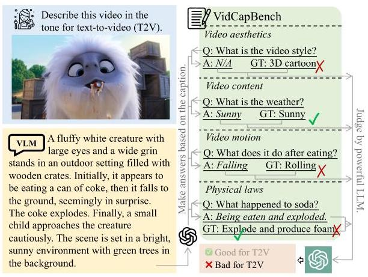
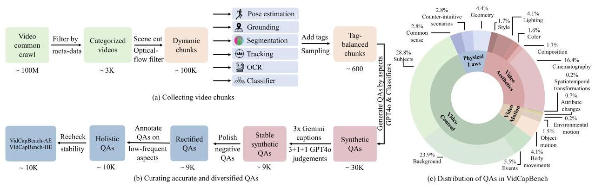
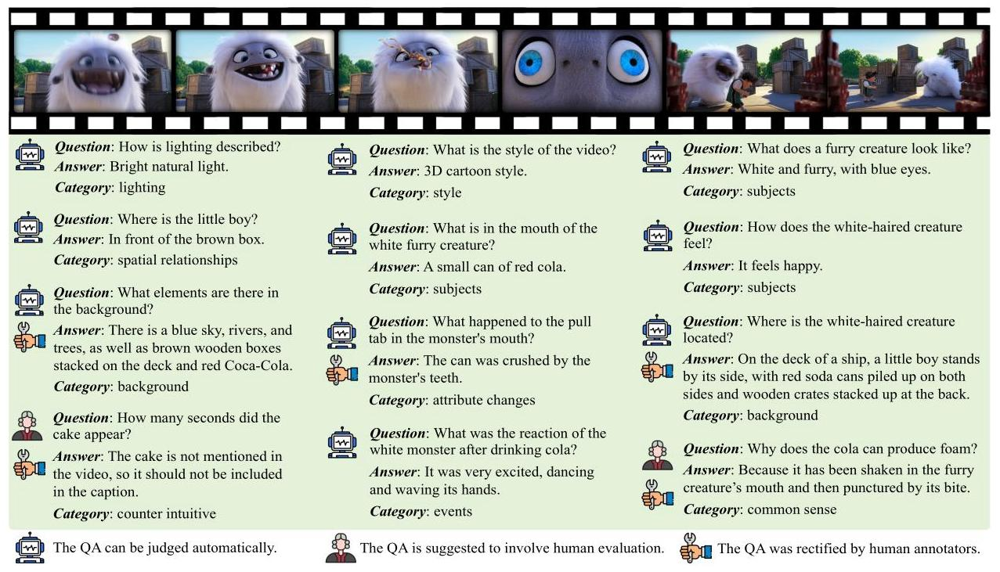
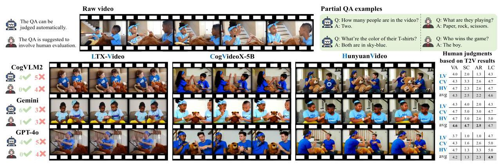
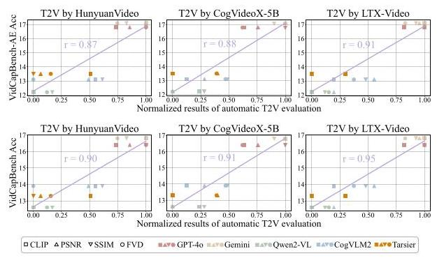
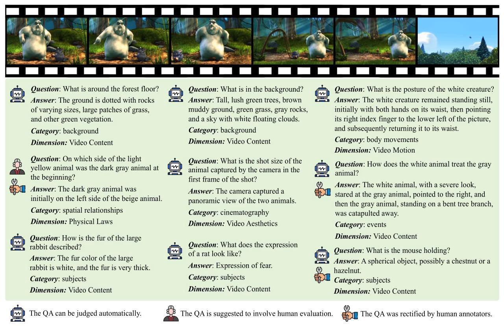
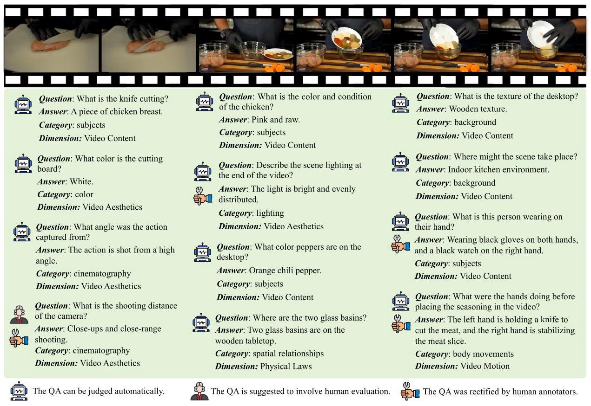
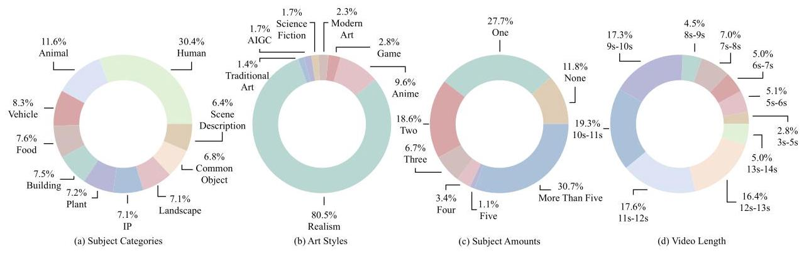
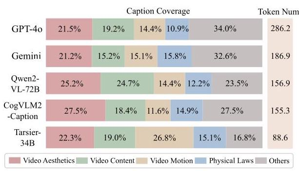
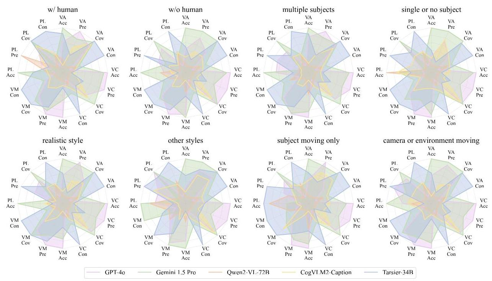

# VidCapBench: A Comprehensive Benchmark of Video Captioning for Controllable Text-to-Video Generation

Xinlong Chen \( {}^{1,2 * } \) , Yuanxing Zhang \( {}^{3} \) , Chongling Rao \( {}^{3} \) , Yushuo Guan \( {}^{3} \) , Jiaheng Liu \( {}^{4} \) , Fuzheng Zhang \( {}^{3} \) , Chengru Song \( {}^{3} \) , Qiang Liu \( {}^{1,2 \dagger  } \) , Di Zhang \( {}^{3} \) , Tieniu Tan \( {}^{1,2,4} \)

\( {}^{1} \) New Laboratory of Pattern Recognition (NLPR),

Institute of Automation, Chinese Academy of Sciences (CASIA)

\( {}^{2} \) School of Artificial Intelligence, University of Chinese Academy of Sciences

\( {}^{3} \) Kuaishou Technology \( {}^{4} \) Nanjing University

## Abstract

The training of controllable text-to-video (T2V) models relies heavily on the alignment between videos and captions, yet little existing research connects video caption evaluation with T2V generation assessment. This paper introduces VidCapBench, a video caption evaluation scheme specifically designed for T2V generation, agnostic to any particular caption format. VidCapBench employs a data annotation pipeline, combining expert model labeling and human refinement, to associate each collected video with key information spanning video aesthetics, content, motion, and physical laws. VidCapBench then partitions these key information attributes into automatically assessable and manually assessable subsets, catering to both the rapid evaluation needs of agile development and the accuracy requirements of thorough validation. By evaluating numerous state-of-the-art captioning models, we demonstrate the superior stability and comprehensiveness of VidCapBench compared to existing video captioning evaluation approaches. Verification with off-the-shelf T2V models reveals a significant positive correlation between scores on VidCapBench and the T2V quality evaluation metrics, indicating that VidCapBench can provide valuable guidance for training T2V models. The project is available at https: //github.com/VidCapBench/VidCapBench.

## 1 Introduction

Controllable text-to-video (T2V) generation leverages text prompts to guide video synthesis (Team, 2024; Zhou et al., 2024b), enabling the instant visualization of designs and facilitating applications in creative content and entertainment. Advances in generative model's backbones (Blattmann et al., 2023; Esser et al., 2024; Peebles and Xie, 2023; Weng et al., 2024) further innovate the video generation process to adhere to textual instructions, exhibit aesthetic appeal, and conform to physical laws. Video captioning, the crucial supporting infrastructure to T2V generation, has also progressed. Coarse-grained or detail-lacking captions significantly hinder both the comprehension and reconstruction of visual information (Jin et al., 2024; Cheng et al., 2024). Hence, prevalent T2V models are devoted to strengthening the alignment between the generated content and the detailed prompts/captions (Kim et al., 2023; Liu et al., 2024b). With the objective to optimize this alignment, T2V models present high fidelity in subjects' motion (Wei et al., 2024b; Wang et al., 2024e; Zhou et al., 2024a), temporal changes (Guo et al., 2024; Yang et al., 2023; Xiong et al., 2024), and event progression (He et al., 2024b; Wang et al., 2024a). Meanwhile, the quality of datasets used for training captioning models (Hong et al., 2024; Zhang et al., 2023) has also improved considerably, such as OpenVid (Nan et al., 2024) and ShareGPT4V (Chen et al., 2025).

Figure 1: VidCapBench evaluates the video captioning model from the aspects of T2V generation.

To direct the optimization of T2V models, video captions should be accurate, comprehensive, diverse, concise, and abundant. While caption formats vary across different models (Ju et al., 2024; Zheng et al., 2024), the core elements in captions emphasized by T2V models seem to be converging. A practical evaluation of video captions for T2V generation must address three main challenges:

---

*Work done during an internship at Kuaishou Technology.

\( {}^{ \dagger  } \) Corresponding author: qiang.liu@nlpr.ia.ac.cn

---

<table><tr><td>Benchmark</td><td>Metrics</td><td>#Videos</td><td>#QA pairs</td><td>Video diversity</td><td>Aesthetics</td><td>Subject</td><td>Motion</td><td>Physical law</td><td>Conciseness</td><td>Caption format</td></tr><tr><td>MSR-VTT (Xu et al., 2016)</td><td>CIDEr</td><td>2,990</td><td>2,990</td><td>✘</td><td>✘</td><td>✘</td><td>✘</td><td>✘</td><td>✓</td><td>Short</td></tr><tr><td>VATEX (Wang et al., 2019)</td><td>CIDEr</td><td>4,478</td><td>4,478</td><td>✘</td><td>✘</td><td>✘</td><td>✘</td><td>✘</td><td>✓</td><td>Short</td></tr><tr><td>DREAM-1K (Wang et al., 2024a)</td><td>Pre/Rec/F1</td><td>1,000</td><td>6,298</td><td>✓</td><td>✘</td><td>✓</td><td>✘</td><td>✘</td><td>✘</td><td>Unstructured</td></tr><tr><td>VDC (Chai et al., 2024)</td><td>Acc/VDCScore</td><td>1,027</td><td>96,902</td><td>✘</td><td>✘</td><td>✓</td><td>✓</td><td>✘</td><td>✘</td><td>Structured</td></tr><tr><td>VidCapBench</td><td>Acc/Pre/Cov/Con</td><td>643</td><td>10,644</td><td>✓</td><td>✓</td><td>✓</td><td>✓</td><td>✓</td><td>✓</td><td>Arbitrary</td></tr></table>

Table 1: Comparison between VidCapBench and mainstream video caption benchmarks.

- Alignment with T2V evaluation: The evaluation should assess whether a video caption adequately covers aesthetics, content, motion, and physical laws, aligning with the key metrics of T2V generation.

- Diversity and stability: The diversity of evaluation data and the stability of the evaluation approach influence the accurate assessment of caption quality.

- Impact on T2V generation: The correlation between caption evaluation and T2V performance remains unexplored, lacking evidence on how captions influence the generated videos.

To address these challenges, we introduce Vid-CapBench, the first evaluation benchmark designed for assessing video captions in controllable T2V generation, as depicted in Figure 1. Comparison between VidCapBench and several publicly available video caption benchmarks is presented in Table 1. Prioritizing the video diversity, VidCapBench comprises 643 richly annotated video clips. These videos are annotated with critical aspects relevant to T2V generation, and we construct a discerning set of question-answer pairs decoupled from specific caption formats. The workflow of VidCap-Bench is transferable to arbitrary in-house datasets for the more targeted evaluation. The main contributions of this paper are summarized as follows:

- We introduce VidCapBench, a novel benchmark designed to facilitate comprehensive and stable evaluation of video captions across multiple dimensions relevant to T2V generation.

- We propose a two-stage evaluation method: rapid automated evaluation on a stable-to-judge subset provides quick feedback for developers, while introducing accurate human evaluation on the remaining subset offers crucial guidance.

- Our experiments demonstrate that most open-source captioning models perform inferior to proprietary models like GPT-40. Applying captions to several production-ready T2V models reveals a strong positive correlation between the performance on VidCapBench and the quality of generated videos, validating the effectiveness of our proposed evaluation approach.

## 2 Related Work

Video captioning. The goal of video captioning is to describe a video across several key aspects, aiding understanding (Doveh et al., 2023), retrieval (Ma et al., 2024), and motion control (Wang et al., 2024d). In T2V generation, accurate and detailed video captions can enhance semantic alignment during model training (Polyak et al., 2024). Naive captioning models adopt free-form descriptions (Chen et al., 2024a; Wang et al., 2024c). To enhance controllability, MiraData (Ju et al., 2024), VDC (Chai et al., 2024), and Vript (Yang et al., 2024) emphasize specific aspects like subjects, background, and shots, significantly benefiting T2V generation. Other methods describe videos from an event perspective (Wang et al., 2024a; He et al., 2024b), capturing temporal information more effectively. Despite advancements in caption controlling (Wang et al., 2023; Hua et al., 2024), evaluations with omissions may lead to a seesaw effect where gains in one dimension come at the cost of others, limiting the utility of the captioning model.

Evaluation methods for video captioning. The advancement of T2V generation has spurred the development of evaluation approaches for video captioning. Traditional approaches (Xu et al., 2017, 2016) for short captions rely on legacy metrics like CIDEr and BLEU. For dense captions, inspired by image captioning evaluation (Liu et al., 2024a; Prabhu et al., 2024; Tu et al., 2024), many approaches employ question answering (QA) followed by natural language inference (NLI) with a critic model. Existing evaluation schemes of video captions are often tied to specific caption formats and suffer from instability in automatic evaluation. In this context, VidCapBench emerges as a more robust solution, offering a comprehensive and stable evaluation framework that aligns with the controllable T2V evaluation (Rawte et al., 2024; Huang et al., 2024; He et al., 2024a), providing better guidance for T2V model training.

## 3 VidCapBench

In this section, we introduce the design and curation of VidCapBench.

### 3.1 Preliminaries

Caption evaluation is typically performed through human or machine evaluation.

Human evaluation. Human evaluation demands annotators to assess captions based on predefined criteria. Experienced annotators deliver accurate and consistent evaluations, along with analysis of erroneous cases, which helps training T2V models. Currently, human annotation primarily employs two methods:

- 5-point Likert scale: Annotators rate captions on a 5-point scale (1: worst, 5: best) based on ground truth. Each evaluation dimension is assessed independently, with predefined examples illustrating different score levels. To ensure reliability, each example is typically evaluated by a minimum of three annotators, with inter-annotator agreement metrics employed to maintain consistency.

- Pairwise comparison: Annotators compare two anonymized model outputs for each example, selecting "Caption A is better", "Caption B is better", or "Equal quality". Pairwise comparisons typically utilize the good-same-bad metric, while ranking multiple models can employ ELO scores.

Machine evaluation. Human evaluation can be inconsistent among inexperienced annotators and is generally slower and more expensive. Conversely, automatic machine evaluation is faster and can provide some guidance for training. Mainstream machine evaluation often utilizes GPT-4 as a judge, which can be divided into two categories:

- Predefined-QA paradigm: Multiple key information points are annotated for each video by QA pairs. Captions are evaluated by posing questions to the judge model, awarding points only for correct answers. Natural Language Inference (NLI) is used to categorize answers as "Entailed", "Neutral", or "Contradictory".

- Retrieval-based paradigm: This approach generates a series of yes/no questions about entities based on a given caption (Cho et al., 2023). A judge model then answers these questions using the original video as context. Descriptions corresponding to questions answered with "no" are considered hallucinatory. Note that this approach may incur high computational costs due to the repeated video question-answering process.

<table><tr><td>Model</td><td>Eval. set</td><td>Overall</td><td>Detailed</td><td>Camera</td><td>Short</td><td>Background</td><td>Object</td></tr><tr><td rowspan="2">GPT-40</td><td>Full</td><td>46.1</td><td>50.1</td><td>52.5</td><td>34.3</td><td>44.6</td><td>48.8</td></tr><tr><td>Selected</td><td>46.4</td><td>53.1 (+3.0)</td><td>55.5</td><td>26.7 (-7.6)</td><td>46.7</td><td>52.8</td></tr><tr><td rowspan="2">Gemini 1.5 Pro</td><td>Full</td><td>40.5</td><td>46.3</td><td>40.9</td><td>30.0</td><td>41.2</td><td>44.3</td></tr><tr><td>Selected</td><td>44.6 (+4.1)</td><td>52.5 (+6.2)</td><td>48.4</td><td>25.3 (-4.7)</td><td>46.2</td><td>52.4 (+8.1)</td></tr><tr><td rowspan="2">Qwen2-VL-72B</td><td>Full</td><td>40.0</td><td>43.6</td><td>46.9</td><td>28.0</td><td>39.9</td><td>40.3</td></tr><tr><td>Selected</td><td>42.5 (+2.5)</td><td>49.0 (+5.4)</td><td>51.5 (+4.6)</td><td>22.9(-5.1)</td><td>43.9 (+4.0)</td><td>47.8</td></tr><tr><td rowspan="2">CogVLM2-Caption</td><td>Full</td><td>42.8</td><td>44.7</td><td>47.7</td><td>30.5</td><td>45.3</td><td>45.8</td></tr><tr><td>Selected</td><td>46.2</td><td>50.9 (+6.2)</td><td>54.7 (+7.0)</td><td>26.2 (-4.3)</td><td>50.1 (+4.8)</td><td>52.0 (+6.2)</td></tr><tr><td rowspan="2">Tarsier-34B</td><td>Full</td><td>37.4</td><td>40.3</td><td>43.1</td><td>25.0</td><td>39.5</td><td>39.3</td></tr><tr><td>Selected</td><td>42.6 (+5.2)</td><td>48.0 (+7.7)</td><td>51.8 (+8.7)</td><td>22.6 (-2.4)</td><td>46.8</td><td>46.6 (+7.3)</td></tr></table>

Table 2: Accuracy comparison between the full set and the selected set which receive consistently stable evaluations on the VDC benchmark.

### 3.2 Benchmarking Video Captions

To establish a comprehensive evaluation framework for video captions, VidCapBench tackles two fundamental inquiries: what criteria should be employed to align the caption evaluation with T2V generation, and how to ensure a stable and reliable evaluation process.

Alignment with T2V evaluation. An effective T2V model is expected to produce videos with high visual fidelity, coherent object representation, precise semantic alignment with the input textual description, and realistic detail enhancement. Correspondingly, VidCapBench evaluates video captions across the following dimensions:

- Video aesthetics (VA) encompasses the artistic and technical aspects of video creation, from filming techniques to post-production.

- Video content (VC) refers to the narrative content presented in the video.

- Video motion (VM) covers movements of foreground subjects and background objects.

- Physical laws (PL) allow for more realistic or dramatic visual expression, even though creativity can somewhat bend them.

Each dimension is further subdivided into specific sub-categories to ensure comprehensive and systematic evaluation coverage. The detailed categorization is provided in Appendix C.1.

Stability of evaluation. Both the judge model's capabilities and the difficulty of evaluating the QA pairs influence the stability of machine evaluation. For details on the former, please refer to Appendix D. Here, we focus on the latter. Taking the VDC benchmark as an example, which contains roughly 100 QA pairs per video, we evaluate five models three times with GPT-40 under different random seeds. To analyze the evaluation stability of the QA pairs, we examine the number of times that the evaluation results are consistent across all three trials in the five models. Experimental results reveal that only 41% of the questions receive consistent evaluations, while 13% exhibit agreement at most twice out of five. Furthermore, we compare the accuracy (Acc) of five captioning models on a subset of all-agreed QA pairs with that on the full VDC benchmark. As shown in Table 2, the performance on the selected subset demonstrates significant discrepancies compared to that on the full benchmark, which highlights the unreliability of evaluating all QA pairs solely through automated methods. Instead, a more refined approach is warranted, wherein QA pairs should be categorized into two groups: (1) those suitable for automated evaluation due to their high machine evaluation consistency, and (2) the remaining, more challenging QA pairs that necessitate human intervention for nuanced differentiation.

Figure 2: Illustration of the data curation pipeline and the distribution of QA pairs in VidCapBench. The QA pairs are carefully rectified to ensure that they primarily assess the quality of video captions rather than the inherent capabilities of the judge model.

Metrics of caption evaluation. Considering efficiency, cost, and stability, VidCapBench employs a predefined-QA paradigm to evaluate video captioning models. Due to the complexity of video content, answers may involve multiple adjectives, nouns, or verbs. Therefore, the judge model is required to categorize responses into four classes:

- Wrong \( \left( {n}_{w}\right) \) : Responses that explicit mention of the relevant content but with factual errors.

- Neutral \( \left( {n}_{n}\right) \) : Responses that omit the relevant content entirely.

- Partially correct \( \left( {n}_{p}\right) \) : Responses that include relevant and correct information, but with incomplete descriptions.

- Correct \( \left( {n}_{c}\right) \) : Responses that fully align with the ground-truth answer.

Based on these classifications, we compute the following four metrics to comprehensively assess the performance of captioning models:

- Accuracy (Acc): The proportion of responses marked as Correct, defined as \( \frac{{n}_{c}}{{n}_{p} + {n}_{c} + {n}_{w} + {n}_{n}} \) , reflecting the model's ability to cover comprehensive details of the video. Notably, models generating longer captions may have advantages.

- Precision (Pre): Calculated as \( \frac{{n}_{p} + {n}_{c}}{{n}_{p} + {n}_{c} + {n}_{w}} \) , representing the proportion of mentioned content that is at least partially correct.

- Coverage (Cov): Calculated as \( \frac{{n}_{p} + {n}_{c} + {n}_{w}}{{n}_{p} + {n}_{c} + {n}_{w} + {n}_{n}} \) , representing the proportion of addressed content relative to the total content covered by the QA pairs of the video.

- Conciseness (Con): Measured by the contribution of each text token to Acc, defined as \( \mathrm{{Acc}}/\tau \) , where \( \tau \) represents the token number of the corresponding captions, as determined by a T5 model (Raffel et al., 2020).

### 3.3 Data Curation

Open-source video datasets are often delicately cu-rated and valuable for detailed analysis. Hence, we sample videos from several prominent open-source datasets. However, recognizing that these videos may have been extensively captioned and incorporated in many training datasets, we augment our data collection with additional copyright-free videos from YouTube and public user-generated content (UGC) platforms, extracting segments to ensure a portion of our data remains unexposed to prior training or processing. Figure 2 illustrates the pipeline of curating VidCapBench.

Figure 3: An example of the QA pairs for a video in VidCapBench.

#### 3.3.1 Videos Collection

We focus on a set of subjects in our analysis: person, animal, plant, food, common object, landscape, vehicle, building, specific intellectual property (IP), and no subject. Uniform involvement is expected across these categories. We perform an initial filtering based on captions provided by the Omega-MultiModal project \( {}^{1} \) , employing Qwen2- VL-72B (Wang et al., 2024b) for classification, retaining approximately 3,000 videos per category. These videos are then segmented into 3-15 second clips using PySceneDetect \( {}^{2} \) . Videos made of static images are removed using an optical flow tool. Subsequently, we sample 16 frames from each video and perform the following operations in parallel: Pose estimation (Khirodkar et al., 2025) to detect human presence and pose variations; Object detection and grounding (Liu et al., 2025) over the initial keywords to identify the amount of the target subject; Object tracking (Zhang et al., 2022) to track object motion, labeling objects as static or consistently trackable; Image segmentation (Ravi et al., 2024) to filter excessively complex scenes; Optical character recognition (OCR) (Wei et al., 2024a) to identify and minimize the presence of text. These generated labels inform the subsequent balanced sampling. Furthermore, we employ optical flow models, a custom-trained artistic style classifier, and a set of custom-trained character attribute classifiers for additional video labeling. Finally, we randomly select videos and manually verify the presence of each label at least three times, ensuring uniform distribution across labels.

#### 3.3.2 Keypoints Generation

Based on the focused aspects mentioned in Section 3.2, we employ GPT-40 \( {}^{3} \) to generate 40 QA pairs for each video, supplemented by 10 additional question-category combinations generated via expert classifiers. Subsequently, we generate three different captions for each video using Gemini with varying random seeds. The first caption is evaluated three times using GPT-40, while the subsequent two captions are evaluated once each. Questions exhibiting inconsistent judgments across the three assessments of the first caption, along with those receiving consistently negative evaluations across all five assessments, are flagged as potentially problematic. These problematic questions, likely due to their ambiguity or lack of clarity, are manually reviewed. Any factual inaccuracies within the QA pairs are corrected, and the revised pairs are subsequently re-evaluated to determine their suitability. Finally, to maintain a balanced distribution of key aspects across the dataset, additional human annotations are performed to address any dimension imbalances introduced by deletions and modifications.

---

\( {}^{3} \) Throughout this paper, we employ GPT-40-20240806 for GPT-40 and Gemini-1.5-Pro-002 for Gemini.

\( {}^{1} \) Huggingface: omegalabsinc/omega-multimodal

\( {}^{2} \) https://github.com/Breakthrough/PySceneDetect

---

<table><tr><td rowspan="2">Model</td><td rowspan="2">Frames</td><td colspan="5">VidCapBench-AE</td><td>VDC</td></tr><tr><td>Overall Acc / Pre / Cov / Con</td><td>Video Aesthetics   Acc / Pre / Cov / Con</td><td>Video Content   Acc / Pre / Cov / Con</td><td>Video Motion   Acc / Pre / Cov / Con</td><td>Physical Laws Acc / Pre / Cov / Con</td><td>Overall   Acc / Score</td></tr><tr><td>GPT-40-20240806</td><td>16</td><td>16.8 (± 0.1) / 57.4 / 86.0 / 5.9</td><td>14.1 / 47.6 / 83.4 / 4.9</td><td>17.5 / 61.7 / 87.2 / 6.1</td><td>10.2 / 41.3 / 84.0 / 3.6</td><td>27.9 / 62.1 / 85.4 / 9.7</td><td>46.1 \( \left( {\pm {1.0}}\right) /{2.2} \)</td></tr><tr><td>Gemini-1.5-Pro-002</td><td>-</td><td>17.1 (± 0.2) / 54.8 / 87.4 / 9.2</td><td>16.4 / 47.6 / 85.4 / 8.8</td><td>16.9 / 57.8 / 88.5 / 9.1</td><td>9.8 / 45.1 / 80.9 / 5.3</td><td>28.4 / 59.3 / 88.2 / 15.3</td><td>40.5 ( \( \pm  {1.6} \) ) \( /{2.0} \)</td></tr><tr><td>Llava-Next-Video-7B (Zhang et al., 2024b)</td><td>16</td><td>10.6 (± 0.1) / 42.3 / 79.4 / 3.9</td><td>11.3 / 39.9 / 82.2 / 4.2</td><td>9.6 / 43.2 / 78.1 / 3.5</td><td>4.4 / 23.7 / 75.1 / 1.7</td><td>24.4 / 54.5 / 82.9 / 9.0</td><td>37.6 ( \( \pm  {2.2} \) ) \( /{1.9} \)</td></tr><tr><td>LongVA-7B (Zhang et al., 2024a)</td><td>128</td><td>10.8 (± 0.1) / 43.0 / 79.3 / 6.1</td><td>12.8 / 42.1 / 83.8 / 7.3</td><td>9.2 / 43.4 / 77.2 / 5.2</td><td>4.9 / 25.1 / 79.6 / 2.8</td><td>24.9 / 52.9 / 83.2 / 14.1</td><td>36.1 \( \left( {\pm {1.9}}\right) /{1.9} \)</td></tr><tr><td>mPLUG-Owl3-7B (Ye et al., 2024)</td><td>16</td><td>14.5 (± 0.3) / 49.6 / 84.4 / 6.9</td><td>12.9 / 40.7 / 83.7 / 6.1</td><td>14.8 / 53.5 / 85.1 / 7.0</td><td>5.3 / 33.3 / 80.0 / 2.5</td><td>26.9 / 55.7 / 81.7 / 12.8</td><td>36.5 (± 2.7) / 1.9</td></tr><tr><td>InternVL2-8B (Chen et al., 2024b)</td><td>32</td><td>10.2 (± 0.2) / 43.0 / 84.9 / 2.5</td><td>9.1 / 36.3 / 84.4 / 2.2</td><td>10.0 / 46.1 / 85.2 / 2.4</td><td>4.4 / 18.0 / 81.3 / 1.1</td><td>23.6 / 52.8 / 85.7 / 5.8</td><td>37.4 (± 2.4) / 1.9</td></tr><tr><td>Qwen2-VL-7B (Wang et al., 2024b)</td><td>2 fps</td><td>11.1 (± 0.2) / 47.1 / 77.0 / 6.4</td><td>12.4 / 44.3 / 78.7 / 7.2</td><td>9.9 / 48.3 / 75.9 / 5.7</td><td>4.0 / 22.7 / 78.2 / 2.3</td><td>26.1 / 59.4 / 81.2 / 15.1</td><td>39.6 (± 1.6) / 2.0</td></tr><tr><td>Pixtral-12B (Agrawal et al., 2024)</td><td>16</td><td>11.0 (± 0.3)/39.5 / 79.6 / 5.2</td><td>14.5 / 42.7 / 82.8 / 6.8</td><td>8.6 / 37.9 / 78.4 / 4.0</td><td>3.6 / 18.6 / 69.3 / 1.7</td><td>28.6 / 52.4 / 82.4 / 13.5</td><td>39.0 (± 2.3) / 2.0</td></tr><tr><td>CogVLM2-Caption (Hong et al., 2024)</td><td>1 fps</td><td>13.1 (± 0.2) / 49.2 / 85.1 / 8.4</td><td>12.5 / 45.2 / 83.1 / 8.0</td><td>12.7 / 50.8 / 86.3 / 8.1</td><td>5.7 / 33.9 / 82.7 / 3.7</td><td>27.9 / 59.9 / 82.7 / 17.8</td><td>42.8 (± 1.4) / 2.1</td></tr><tr><td>Aria (Li et al., 2024)</td><td>128</td><td>14.1 (± 0.3) / 51.5 / 84.4 / 4.5</td><td>13.0 / 44.0 / 82.7 / 4.2</td><td>13.9 / 54.9 / 85.3 / 4.4</td><td>7.1 / 34.2 / 81.8 / 2.3</td><td>27.9 / 56.8 / 83.7 / 8.9</td><td>41.5 (± 2.2) / 2.1</td></tr><tr><td>Tarsier-34B (Wang et al., 2024a)</td><td>16</td><td>13.5 (± 0.2) / 50.8 / 82.1 / 15.1</td><td>14.7 / 43.9 / 85.5 / 16.4</td><td>12.4 / 53.7 / 80.4 / 13.8</td><td>7.1 / 38.1 / 84.0 / 7.9</td><td>28.1 / 61.7 / 83.9 / 31.4</td><td>37.4 \( \left( {\pm {2.0}}\right) /{2.0} \)</td></tr><tr><td>Qwen2-VL-72B (Wang et al., 2024b)</td><td>2 fps</td><td>12.2 (± 0.2) / 46.8 / 79.0 / 7.7</td><td>12.0 / 42.5 / 79.2 / 7.6</td><td>11.5 / 48.4 / 78.8 / 7.3</td><td>5.8 / 28.6 / 77.8 / 3.7</td><td>27.1 / 59.6 / 80.9 / 17.2</td><td>40.0 \( \left( {\pm {1.3}}\right) /{2.0} \)</td></tr><tr><td>InternVL2-76B (Chen et al., 2024b)</td><td>32</td><td>7.4 \( \left( {\pm {0.2}}\right) /{35.6}/{78.9}/{0.7} \)</td><td>5.8 / 27.6 / 76.2 / 0.6</td><td>7.2 / 38.1 / 80.1 / 0.7</td><td>4.4 / 24.4 / 80.0 / 0.4</td><td>23.1 / 55.0 / 78.1 / 2.3</td><td>44.1 (± 2.1) / 2.1</td></tr><tr><td>Pixtral-124B (Agrawal et al., 2024)</td><td>16</td><td>13.0 \( \left( {\pm {0.3}}\right) /{48.3}/{80.5}/{3.0} \)</td><td>13.9 / 44.6 / 80.2 / 3.2</td><td>11.9 / 50.0 / 80.5 / 2.7</td><td>6.2 / 28.3 / 81.8 / 1.4</td><td>27.9 / 55.9 / 83.2 / 6.4</td><td>45.4 \( \left( {\pm {1.9}}\right) /{2.2} \)</td></tr></table>

Table 3: Evaluation results on VidCapBench-AE and VDC. "Acc", "Pre", "Cov", and "Con" stand for accuracy, precision, coverage, and conciseness, respectively. For better presentation, we have multiplied "Con" by 100. "Score" is calculated using GPT-40 based on the method in (Chai et al., 2024)

### 3.4 QA Pairs Split

As discussed in Section 3.2, the difficulty of evaluating the QA pairs has a significant impact on the reliability of machine evaluation. Therefore, we split the total QA pairs based on their evaluation consistency using the same strategy in Section 3.2. In order to achieve a balance between accuracy and efficiency, we identify and segregate QA pairs that fail to receive consistent evaluations within the dimensions of video motion and physical laws, which are more crucial to T2V generation. Consequently, a total of 1,150 QA pairs are classified as VidCapBench-HE, which necessitates human intervention for accurate evaluation. The remaining QA pairs are designated as VidCapBench-AE, which can be evaluated automatically. Figure 3 presents illustrative examples of QA pairs from both categories within VidCapBench. Additional examples and detailed statistics of the QA pairs by dimension are provided in Appendix C.

## 4 Experiments

### 4.1 Experimental setup

Captioning models. A variety of vision language models that demonstrate strong captioning capabilities are evaluated. When available, their official prompts are utilized; otherwise, the generic prompt "Describe the video in detail" is employed. Greedy decoding is applied across all models to minimize the influence of stochasticity.

Environment. All experiments are conducted on A800-80GB GPUs using bfloat16 precision. To ensure a fair evaluation, each result is averaged over three independent runs, utilizing GPT-40 with random seeds set to 0, 1, and 2, respectively. Frame rate, resolution, and video decoding follow official recommendations where provided. Otherwise, the "decord" library is used to extract 16 frames for captioning, ensuring a minimum frame rate of 1 fps on VidCapBench. Fifteen experienced annotators, familiar with VidCapBench, provide reliable annotations for the generated captions.

### 4.2 Performance on VidCapBench

We first analyze model performance on the VidCapBench-AE. As shown in Table 3, GPT- 40 and Gemini achieve outstanding performance across multiple dimensions and metrics. However, our analysis reveals a notable tendency for GPT-40, as well as InternVL2-76B, to produce redundant outputs. In contrast, Tarsier-34B generates relatively concise captions, which contributes to its superior Con score, while also maintaining remarkable results in other metrics. Additionally, models specifically trained on large-scale dense captioning data, such as CogVLM2-Caption and Aria, manifest a distinct performance advantage.

The evaluation results also indicate that some models exhibit specialized proficiency in specific dimensions while showing limitations in others. A typical example is Pixtral-12B, which excels in Video Aesthetics and Physical Laws but underper-forms in Video Motion and Video Content. While open-source models generally lag behind proprietary models in Video Motion, they exhibit comparable capabilities in Physical Laws. Notably, certain open-source models, particularly Pixtral-12B and Tarsier-34B, even surpass GPT-40 in the Acc score within this dimension.

Regarding evaluation stability, VidCapBench demonstrates superior consistency compared to VDC, which exhibits significant variability across its three evaluation runs. The enhanced stability in VidCapBench contributes to more reliable T2V guidance, establishing it as a more robust evaluation framework for video captioning tasks.

Figure 4: Illustration of the training-free T2V verification for video caption evaluation. "VA", "SC", "AR", and "LC" denote the four key dimensions of T2V quality evaluation: "Visual Aesthetics", "Subject Consistency", "Action Relevance", and "Logical Coherence", respectively. In this case, the video is associated with nine QA pairs in VidCapBench-AE and four QA pairs in VidCapBench-HE. The similarity between the generated video and the original video, as well as the overall generation quality, are strongly correlated with the evaluation results in VidCapBench. Among the captioning models compared, Gemini exhibits the best performance.

<table><tr><td rowspan="2">Model</td><td colspan="3">VidCapBench-AE</td><td colspan="3">VidCapBench-HE</td></tr><tr><td>Auto</td><td>Human</td><td>Diff.</td><td>Auto</td><td>Human</td><td>Diff.</td></tr><tr><td>GPT-40</td><td>56.3</td><td>55.2</td><td>1.1</td><td>45.2</td><td>52.4</td><td>7.2</td></tr><tr><td>Gemini 1.5 Pro</td><td>53.4</td><td>52.6</td><td>0.8</td><td>55.3</td><td>49.2</td><td>6.1</td></tr><tr><td>Qwen2-VL-72B</td><td>46.7</td><td>47.4</td><td>0.7</td><td>48.5</td><td>56.8</td><td>8.3</td></tr><tr><td>CogVLM2-Caption</td><td>47.7</td><td>48.9</td><td>1.2</td><td>51.5</td><td>56.2</td><td>4.7</td></tr><tr><td>Tarsier-34B</td><td>52.3</td><td>51.9</td><td>0.4</td><td>57.2</td><td>51.3</td><td>5.9</td></tr></table>

Table 4: Comparison between automated evaluation and human evaluation on VidCapBench-AE and VidCapBench-HE, respectively. "Diff." stands for the absolute value of the difference between the two evaluation methods. We choose Pre as the representative here.

### 4.3 Fine-grained Analysis of VidCapBench

This section focuses on five representative captioning models: GPT-40, Gemini, Qwen2-VL-72B, CogVLM2-Caption, and Tarsier-34B. We conduct a fine-grained analysis of their performance to demonstrate the validity of VidCapBench.

Human evaluation consistency. To validate the reliability of automatic evaluation on VidCapBench-AE and the necessity of human intervention in VidCapBench-HE, we investigate the discrepancies between automatic and human evaluation on both subsets. Specifically, human annotators are engaged to assess model performance on VidCapBench-HE (detailed results are in Appendix D), and their judgments are compared with those derived from automatic evaluations. Additionally, we randomly sample 1,150 QA pairs from VidCapBench-AE for human annotation and subsequent comparative analysis. The results, summarized in Table 4, reveal strong consistency between human and automatic evaluations for all five models on VidCapBench-AE. Conversely, substantial inconsistencies emerge on VidCapBench-HE. These findings highlight the reliability of automatic evaluation on a stable-evaluation QA subset and the critical role of human annotation in accurately evaluating video captions in certain contexts.

<table><tr><td rowspan="2">Model</td><td rowspan="2">Prompt Formats</td><td colspan="4">Overall</td><td rowspan="2">Token Num</td></tr><tr><td>Acc</td><td>Pre</td><td>Cov</td><td>Con</td></tr><tr><td rowspan="4">Gemini 1.5 Pro</td><td>MiraData</td><td>17.3</td><td>57.8</td><td>87.4</td><td>4.6</td><td>377.7</td></tr><tr><td>DREAM-1K</td><td>15.3</td><td>56.7</td><td>83.1</td><td>9.6</td><td>159.2</td></tr><tr><td>Vript</td><td>17.3</td><td>57.4</td><td>88.2</td><td>6.4</td><td>270.0</td></tr><tr><td>Hunyuan</td><td>17.0</td><td>56.9</td><td>86.4</td><td>5.6</td><td>305.4</td></tr><tr><td rowspan="4">Qwen2-VL-72B</td><td>MiraData</td><td>12.6</td><td>51.4</td><td>80.5</td><td>4.7</td><td>267.6</td></tr><tr><td>DREAM-1K</td><td>11.4</td><td>51.4</td><td>76.0</td><td>7.9</td><td>144.2</td></tr><tr><td>Vript</td><td>13.5</td><td>51.5</td><td>82.2</td><td>6.9</td><td>194.7</td></tr><tr><td>Hunyuan</td><td>13.9</td><td>52.0</td><td>81.6</td><td>5.3</td><td>262.7</td></tr></table>

Table 5: Evaluation comparison between different prompt formats in VidCapBench-AE. Detailed prompts are provided in the Appendix A.3.

Impact of caption format. The above experiments do not specify caption formats. In practice, different T2V models demand distinct caption formats. Therefore, we evaluate the impact of different caption formats, including MiraData, Vript, Hunyuan-Video (Kong et al., 2024), and DREAM-1K, on the performance of Gemini and Qwen2-VL-72B. Table 5 presents the results using GPT-40 as the judge. Different formats primarily affect caption length. Shorter captions, such as those in the DREAM-1K format, often lack comprehensive details of videos, resulting in lower Acc and Cov scores. However, the Pre score, which measures the proportion of partially correct answers, remains stable across formats, which underscores the robustness of VidCap-Bench in evaluating captions of varying formats.

<table><tr><td rowspan="2">T2V</td><td rowspan="2">Dimensions</td><td colspan="3">Captioning Models</td></tr><tr><td>GPT-40</td><td>Gemini</td><td>CogVLM2</td></tr><tr><td rowspan="4">HunyuanVideo</td><td>Visual aesthetics</td><td>3.72</td><td>3.84</td><td>3.60</td></tr><tr><td>Subject consistency</td><td>3.66</td><td>3.70</td><td>3.04</td></tr><tr><td>Action relevance</td><td>3.38</td><td>3.32</td><td>2.50</td></tr><tr><td>Logical coherence</td><td>3.58</td><td>3.60</td><td>3.56</td></tr><tr><td rowspan="4">CogVideoX</td><td>Visual aesthetics</td><td>2.86</td><td>2.96</td><td>2.84</td></tr><tr><td>Subject consistency</td><td>3.56</td><td>3.58</td><td>3.50</td></tr><tr><td>Action relevance</td><td>3.26</td><td>3.24</td><td>3.20</td></tr><tr><td>Logical coherence</td><td>2.92</td><td>2.86</td><td>2.88</td></tr><tr><td rowspan="4">LTX-Video</td><td>Visual aesthetics</td><td>2.80</td><td>2.82</td><td>2.34</td></tr><tr><td>Subject consistency</td><td>2.96</td><td>2.94</td><td>2.54</td></tr><tr><td>Action relevance</td><td>2.52</td><td>2.38</td><td>1.94</td></tr><tr><td>Logical coherence</td><td>2.54</td><td>2.53</td><td>2.50</td></tr></table>

Table 6: T2V quality evaluations by human across four dimensions.

### 4.4 Training-free T2V Verification

Ideally, we would train multiple identical T2V models from scratch using extensive datasets generated by corresponding captioning models and then evaluate the video quality produced by each caption variant. However, considering the influence of data distribution and convergence behavior, such a lengthy validation pipeline might not yield clear and focused conclusions. Therefore, leveraging the high semantic alignment capabilities of advanced T2V models, we adopt a training-free verification approach. Specifically, we directly feed captions generated towards videos in VidCapBench into three open-source T2V models: CogVideoX-5B \( {}^{4} \) , LTX-Video \( {}^{5} \) , and HunyuanVideo. The captions are generated using GPT-40, Gemini, Qwen2-VL-72B, CogVLM2-Caption, and Tarsier-34B. Figure 4 provides examples of the generated videos.

We conduct automated evaluations on the generated videos across four dimensions: semantic relevance, quantified using CLIP score derived from CLIP-L (Radford et al., 2021), which assesses both the model's textual alignment and the caption's suitability for the T2V task; aesthetic quality and structural integrity, evaluated using inter-frame PSNR and SSIM; and fidelity to the original video, measured using FVD (Unterthiner et al., 2019). The correlations between the four T2V evaluation metrics and the Acc on VidCapBench are illustrated in Figure 5. The upper panels demonstrate a strong positive correlation between the Acc on VidCapBench-AE and automated T2V quality assessments, with an average Pearson correlation coefficient of 0.89, which substantiates the effectiveness of automated video caption assessments on VidCapBench-AE. Furthermore, the lower panels reveal an enhanced correlation for the Acc on VidCapBench full set, achieving a higher mean Pearson correlation coefficient of 0.92 , highlighting the significant impact of human intervention on VidCapBench-HE.

Figure 5: Correlations between automated T2V quality evaluations and VidCapBench-AE Acc (upper) and Vid-CapBench full set Acc (lower). The Pearson correlation coefficient is denoted by "r".

We further conduct human evaluations on the videos generated from captions produced by GPT- 40, Gemini, and CogVLM2, scoring aspects in visual aesthetics, subject consistency, action relevance, and logical coherence on a scale of 1 to 5. Each annotator is assigned approximately 130 sets of videos (9 videos per set), ensuring that each video receives three independent evaluations. To maintain objectivity and minimize bias, annotators are presented with an original video alongside nine T2V generations in a randomized and anonymized order. The results, summarized in Table 6, reveal a similar pattern to the findings in VidCapBench. Specifically, GPT-40 and Gemini exhibit comparable performance, both significantly outperforming CogVLM2 across the four dimensions, which further validates the alignments between caption evaluations on VidCapBench and the T2V qualities.

The above findings demonstrate that, for a production-ready T2V model, the quality of captions as assessed in VidCapBench is highly correlated with the quality of the generated videos. Consequently, improving caption quality emerges as a crucial strategy for enhancing T2V model performance, regardless of whether training-based or training-free methods are employed.

---

\( {}^{4} \) The token limit of its text encoder is extended to 400 .

\( {}^{5} \) https://huggingface.co/Lightricks/LTX-Video

---

## 5 Conclusion

VidCapBench introduces a comprehensive evaluation framework for video captioning in T2V generation, assessing across four key dimensions: video aesthetics, video subject, video motion, and physical laws. To cater to different evaluation needs, VidCapBench comprises two subsets: one designed for automated evaluation prioritizing speed, and the other for human evaluation prioritizing accuracy. Compared to existing benchmarks, VidCapBench exhibits greater stability and reliability. Furthermore, the strong correlation between scores on Vid-CapBench and T2V quality metrics demonstrates its potential for guiding T2V training processes.

## Limitations

While VidCapBench provides a stable and reliable framework for evaluating captioning models in the aspect of T2V generation, it has certain limitations. Specifically, VidCapBench focuses primarily on captioning tasks, thereby excluding the assessment of other model capabilities, such as mathematical reasoning.

## Ethical Considerations

Regarding the ethical considerations, it is worth noting that some T2V models may generate biased or harmful content, which could perpetuate stereotypes or misinformation. We strongly emphasize the importance of responsible use and encourage developers to implement robust safeguards, including bias detection mechanisms and content moderation systems, to mitigate these risks.

## Acknowledgements

This work is jointly sponsored by National Natural Science Foundation of China (62236010, 62141608, 62206291).

## References

Pravesh Agrawal, Szymon Antoniak, Emma Bou Hanna, Baptiste Bout, Devendra Chaplot, Jessica Chud-novsky, Diogo Costa, Baudouin De Monicault, Saurabh Garg, Theophile Gervet, et al. 2024. Pixtral 12b. arXiv preprint arXiv:2410.07073.

Andreas Blattmann, Tim Dockhorn, Sumith Ku-lal, Daniel Mendelevitch, Maciej Kilian, Dominik Lorenz, Yam Levi, Zion English, Vikram Voleti, Adam Letts, et al. 2023. Stable video diffusion: Scaling latent video diffusion models to large datasets. arXiv preprint arXiv:2311.15127.

Wenhao Chai, Enxin Song, Yilun Du, Chenlin Meng, Vashisht Madhavan, Omer Bar-Tal, Jeng-Neng Hwang, Saining Xie, and Christopher D Manning. 2024. Auroracap: Efficient, performant video detailed captioning and a new benchmark. arXiv preprint arXiv:2410.03051.

Lin Chen, Jinsong Li, Xiaoyi Dong, Pan Zhang, Con-ghui He, Jiaqi Wang, Feng Zhao, and Dahua Lin. 2025. Sharegpt4v: Improving large multi-modal models with better captions. In European Conference on Computer Vision, pages 370-387. Springer.

Tsai-Shien Chen, Aliaksandr Siarohin, Willi Menapace, Ekaterina Deyneka, Hsiang-wei Chao, Byung Eun Jeon, Yuwei Fang, Hsin-Ying Lee, Jian Ren, Ming-Hsuan Yang, et al. 2024a. Panda-70m: Captioning \( {70}\mathrm{\;m} \) videos with multiple cross-modality teachers. In Proceedings of the IEEE/CVF Conference on Computer Vision and Pattern Recognition, pages 13320- 13331.

Zhe Chen, Weiyun Wang, Hao Tian, Shenglong Ye, Zhangwei Gao, Erfei Cui, Wenwen Tong, Kongzhi Hu, Jiapeng Luo, Zheng Ma, et al. 2024b. How far are we to gpt-4v? closing the gap to commercial multimodal models with open-source suites. arXiv preprint arXiv:2404.16821.

Sijie Cheng, Kechen Fang, Yangyang Yu, Sicheng Zhou, Bohao Li, Ye Tian, Tingguang Li, Lei Han, and Yang Liu. 2024. Videgothink: Assessing egocentric video understanding capabilities for embodied ai. arXiv preprint arXiv:2410.11623.

Jaemin Cho, Yushi Hu, Roopal Garg, Peter Anderson, Ranjay Krishna, Jason Baldridge, Mohit Bansal, Jordi Pont-Tuset, and Su Wang. 2023. Davidsonian scene graph: Improving reliability in fine-grained evaluation for text-image generation. arXiv preprint arXiv:2310.18235.

Sivan Doveh, Assaf Arbelle, Sivan Harary, Roei Herzig, Donghyun Kim, Paola Cascante-Bonilla, Amit Al-fassy, Rameswar Panda, Raja Giryes, Rogerio Feris, et al. 2023. Dense and aligned captions (dac) promote compositional reasoning in vl models. Advances in Neural Information Processing Systems, 36:76137-76150.

Patrick Esser, Sumith Kulal, Andreas Blattmann, Rahim Entezari, Jonas Müller, Harry Saini, Yam Levi, Dominik Lorenz, Axel Sauer, Frederic Boesel, et al. 2024. Scaling rectified flow transformers for high-resolution image synthesis. In Forty-first International Conference on Machine Learning.

Yongxin Guo, Jingyu Liu, Mingda Li, Xiaoying Tang, Qingbin Liu, and Xi Chen. 2024. Trace: Temporal grounding video llm via causal event modeling. arXiv preprint arXiv:2410.05643.

Xuan He, Dongfu Jiang, Ge Zhang, Max Ku, Achint Soni, Sherman Siu, Haonan Chen, Abhranil Chandra, Ziyan Jiang, Aaran Arulraj, et al. 2024a. Videoscore: Building automatic metrics to simulate fine-grained human feedback for video generation. arXiv preprint arXiv:2406.15252.

Yichen He, Yuan Lin, Jianchao Wu, Hanchong Zhang, Yuchen Zhang, and Ruicheng Le. 2024b. Storyteller: Improving long video description through global audio-visual character identification. arXiv preprint arXiv:2411.07076.

Wenyi Hong, Weihan Wang, Ming Ding, Wenmeng Yu, Qingsong Lv, Yan Wang, Yean Cheng, Shiyu Huang, Junhui Ji, Zhao Xue, et al. 2024. Cogvlm2: Visual language models for image and video understanding. arXiv preprint arXiv:2408.16500.

Hang Hua, Qing Liu, Lingzhi Zhang, Jing Shi, Zhifei Zhang, Yilin Wang, Jianming Zhang, and Jiebo Luo. 2024. Finecaption: Compositional image captioning focusing on wherever you want at any granularity. arXiv preprint arXiv:2411.15411.

Ziqi Huang, Fan Zhang, Xiaojie Xu, Yinan He, Ji-ashuo Yu, Ziyue Dong, Qianli Ma, Nattapol Chan-paisit, Chenyang Si, Yuming Jiang, et al. 2024. Vbench++: Comprehensive and versatile benchmark suite for video generative models. arXiv preprint arXiv:2411.13503.

Yang Jin, Zhicheng Sun, Ningyuan Li, Kun Xu, Hao Jiang, Nan Zhuang, Quzhe Huang, Yang Song, Yadong Mu, and Zhouchen Lin. 2024. Pyramidal flow matching for efficient video generative modeling. arXiv preprint arXiv:2410.05954.

Xuan Ju, Yiming Gao, Zhaoyang Zhang, Ziyang Yuan, Xintao Wang, Ailing Zeng, Yu Xiong, Qiang Xu, and Ying Shan. 2024. Miradata: A large-scale video dataset with long durations and structured captions. arXiv preprint arXiv:2407.06358.

Rawal Khirodkar, Timur Bagautdinov, Julieta Martinez, Su Zhaoen, Austin James, Peter Selednik, Stuart Anderson, and Shunsuke Saito. 2025. Sapiens: Foundation for human vision models. In European Conference on Computer Vision, pages 206-228. Springer.

Yunji Kim, Jiyoung Lee, Jin-Hwa Kim, Jung-Woo Ha, and Jun-Yan Zhu. 2023. Dense text-to-image generation with attention modulation. In Proceedings of the IEEE/CVF International Conference on Computer Vision, pages 7701-7711.

Weijie Kong, Qi Tian, Zijian Zhang, Rox Min, Zuozhuo Dai, Jin Zhou, Jiangfeng Xiong, Xin Li, Bo Wu, Jian-wei Zhang, et al. 2024. Hunyuanvideo: A systematic framework for large video generative models. arXiv preprint arXiv:2412.03603.

Dongxu Li, Yudong Liu, Haoning Wu, Yue Wang, Zhiqi Shen, Bowen Qu, Xinyao Niu, Guoyin Wang, Bei Chen, and Junnan Li. 2024. Aria: An open multimodal native mixture-of-experts model. arXiv preprint arXiv:2410.05993.

Bingchen Liu, Ehsan Akhgari, Alexander Visheratin, Aleks Kamko, Linmiao Xu, Shivam Shrirao, Chase Lambert, Joao Souza, Suhail Doshi, and Daiqing Li. 2024a. Playground v3: Improving text-to-image alignment with deep-fusion large language models. arXiv preprint arXiv:2409.10695.

Luping Liu, Chao Du, Tianyu Pang, Zehan Wang, Chongxuan Li, and Dong Xu. 2024b. Improving long-text alignment for text-to-image diffusion models. arXiv preprint arXiv:2410.11817.

Shilong Liu, Zhaoyang Zeng, Tianhe Ren, Feng Li, Hao Zhang, Jie Yang, Qing Jiang, Chunyuan Li, Jianwei Yang, Hang Su, et al. 2025. Grounding dino: Marrying dino with grounded pre-training for open-set object detection. In European Conference on Computer Vision, pages 38-55. Springer.

Ziyu Ma, Chenhui Gou, Hengcan Shi, Bin Sun, Shutao Li, Hamid Rezatofighi, and Jianfei Cai. 2024. Drvideo: Document retrieval based long video understanding. arXiv preprint arXiv:2406.12846.

Kepan Nan, Rui Xie, Penghao Zhou, Tiehan Fan, Zhen-heng Yang, Zhijie Chen, Xiang Li, Jian Yang, and Ying Tai. 2024. Openvid-1m: A large-scale high-quality dataset for text-to-video generation. arXiv preprint arXiv:2407.02371.

William Peebles and Saining Xie. 2023. Scalable diffusion models with transformers. In Proceedings of the IEEE/CVF International Conference on Computer Vision, pages 4195-4205.

Adam Polyak, Amit Zohar, Andrew Brown, Andros Tjandra, Animesh Sinha, Ann Lee, Apoorv Vyas, Bowen Shi, Chih-Yao Ma, Ching-Yao Chuang, et al. 2024. Movie gen: A cast of media foundation models. arXiv preprint arXiv:2410.13720.

Viraj Prabhu, Senthil Purushwalkam, An Yan, Caiming Xiong, and Ran Xu. 2024. Trust but verify: Programmatic vlm evaluation in the wild. arXiv preprint arXiv:2410.13121.

Alec Radford, Jong Wook Kim, Chris Hallacy, Aditya Ramesh, Gabriel Goh, Sandhini Agarwal, Girish Sas-try, Amanda Askell, Pamela Mishkin, Jack Clark, et al. 2021. Learning transferable visual models from natural language supervision. In International conference on machine learning, pages 8748-8763. PMLR.

Colin Raffel, Noam Shazeer, Adam Roberts, Katherine Lee, Sharan Narang, Michael Matena, Yanqi Zhou, Wei Li, and Peter J Liu. 2020. Exploring the limits of transfer learning with a unified text-to-text transformer. Journal of machine learning research, 21(140):1-67.

Nikhila Ravi, Valentin Gabeur, Yuan-Ting Hu, Rong-hang Hu, Chaitanya Ryali, Tengyu Ma, Haitham Khedr, Roman Rädle, Chloe Rolland, Laura Gustafson, et al. 2024. Sam 2: Segment anything in images and videos. arXiv preprint arXiv:2408.00714.

Vipula Rawte, Sarthak Jain, Aarush Sinha, Garv Kaushik, Aman Bansal, Prathiksha Rumale Vish-wanath, Samyak Rajesh Jain, Aishwarya Naresh Re-ganti, Vinija Jain, Aman Chadha, et al. 2024. Vibe: A text-to-video benchmark for evaluating hallucination in large multimodal models. arXiv preprint arXiv:2411.10867.

Genmo Team. 2024. Mochi 1. https://github.com/ genmoai/models.

Rong-Cheng Tu, Zi-Ao Ma, Tian Lan, Yuehao Zhao, Heyan Huang, and Xian-Ling Mao. 2024. Automatic evaluation for text-to-image generation: Task-decomposed framework, distilled training, and meta-evaluation benchmark. arXiv preprint arXiv:2411.15488.

Thomas Unterthiner, Sjoerd van Steenkiste, Karol Ku-rach, Raphaël Marinier, Marcin Michalski, and Syl-vain Gelly. 2019. Fvd: A new metric for video generation.

Jiawei Wang, Liping Yuan, Yuchen Zhang, and Hao-miao Sun. 2024a. Tarsier: Recipes for training and evaluating large video description models. arXiv preprint arXiv:2407.00634.

Peng Wang, Shuai Bai, Sinan Tan, Shijie Wang, Zhi-hao Fan, Jinze Bai, Keqin Chen, Xuejing Liu, Jialin Wang, Wenbin Ge, et al. 2024b. Qwen2-vl: Enhancing vision-language model's perception of the world at any resolution. arXiv preprint arXiv:2409.12191.

Qiuheng Wang, Yukai Shi, Jiarong Ou, Rui Chen, Ke Lin, Jiahao Wang, Boyuan Jiang, Haotian Yang, Mingwu Zheng, Xin Tao, et al. 2024c. Koala-36m: A large-scale video dataset improving consistency between fine-grained conditions and video content. arXiv preprint arXiv:2410.08260.

Teng Wang, Jinrui Zhang, Junjie Fei, Hao Zheng, Yun-long Tang, Zhe Li, Mingqi Gao, and Shanshan Zhao. 2023. Caption anything: Interactive image description with diverse multimodal controls. arXiv preprint arXiv:2305.02677.

Xin Wang, Jiawei Wu, Junkun Chen, Lei Li, Yuan-Fang Wang, and William Yang Wang. 2019. Vatex: A large-scale, high-quality multilingual dataset for video-and-language research. In Proceedings of the IEEE/CVF international conference on computer vision, pages 4581-4591.

Zhouxia Wang, Ziyang Yuan, Xintao Wang, Yaowei Li, Tianshui Chen, Menghan Xia, Ping Luo, and Ying Shan. 2024d. Motionctrl: A unified and flexible motion controller for video generation. In ACM SIGGRAPH 2024 Conference Papers, pages 1-11.

Zun Wang, Jialu Li, Han Lin, Jaehong Yoon, and Mo-hit Bansal. 2024e. Dreamrunner: Fine-grained storytelling video generation with retrieval-augmented motion adaptation. arXiv preprint arXiv:2411.16657.

Haoran Wei, Chenglong Liu, Jinyue Chen, Jia Wang, Lingyu Kong, Yanming Xu, Zheng Ge, Liang Zhao, Jianjian Sun, Yuang Peng, et al. 2024a. General ocr theory: Towards ocr-2.0 via a unified end-to-end model. arXiv preprint arXiv:2409.01704.

Yujie Wei, Shiwei Zhang, Hangjie Yuan, Xiang Wang, Haonan Qiu, Rui Zhao, Yutong Feng, Feng Liu, Zhizhong Huang, Jiaxin Ye, et al. 2024b. Dreamvideo-2: Zero-shot subject-driven video customization with precise motion control. arXiv preprint arXiv:2410.13830.

Wenming Weng, Ruoyu Feng, Yanhui Wang, Qi Dai, Chunyu Wang, Dacheng Yin, Zhiyuan Zhao, Kai Qiu, Jianmin Bao, Yuhui Yuan, et al. 2024. Art-v: Auto-regressive text-to-video generation with diffusion models. In Proceedings of the IEEE/CVF Conference on Computer Vision and Pattern Recognition, pages 7395-7405.

Tianwei Xiong, Yuqing Wang, Daquan Zhou, Zhijie Lin, Jiashi Feng, and Xihui Liu. 2024. Lvd-2m: A long-take video dataset with temporally dense captions. arXiv preprint arXiv:2410.10816.

Dejing Xu, Zhou Zhao, Jun Xiao, Fei Wu, Hanwang Zhang, Xiangnan He, and Yueting Zhuang. 2017. Video question answering via gradually refined attention over appearance and motion. In Proceedings of the 25th ACM international conference on Multimedia, pages 1645-1653.

Jun Xu, Tao Mei, Ting Yao, and Yong Rui. 2016. Msr-vtt: A large video description dataset for bridging video and language. In Proceedings of the IEEE conference on computer vision and pattern recognition, pages 5288-5296.

Antoine Yang, Arsha Nagrani, Paul Hongsuck Seo, Antoine Miech, Jordi Pont-Tuset, Ivan Laptev, Josef Sivic, and Cordelia Schmid. 2023. Vid2seq: Large-scale pretraining of a visual language model for dense video captioning. In Proceedings of the IEEE/CVF Conference on Computer Vision and Pattern Recognition, pages 10714-10726.

Dongjie Yang, Suyuan Huang, Chengqiang Lu, Xi-aodong Han, Haoxin Zhang, Yan Gao, Yao Hu, and Hai Zhao. 2024. Vript: A video is worth thousands of words. arXiv preprint arXiv:2406.06040.

Jiabo Ye, Haiyang Xu, Haowei Liu, Anwen Hu, Ming Yan, Qi Qian, Ji Zhang, Fei Huang, and Jingren Zhou. 2024. mplug-owl3: Towards long image-sequence understanding in multi-modal large language models. arXiv preprint arXiv:2408.04840.

Hang Zhang, Xin Li, and Lidong Bing. 2023. Video-llama: An instruction-tuned audio-visual language model for video understanding. arXiv preprint arXiv:2306.02858.

Peiyuan Zhang, Kaichen Zhang, Bo Li, Guangtao Zeng, Jingkang Yang, Yuanhan Zhang, Ziyue Wang, Hao-ran Tan, Chunyuan Li, and Ziwei Liu. 2024a. Long context transfer from language to vision. arXiv preprint arXiv:2406.16852.

Y Zhang, B Li, H Liu, Y Lee, L Gui, D Fu, J Feng, Z Liu, and C Li. 2024b. Llava-next: A strong zero-shot video understanding model.

Yifu Zhang, Peize Sun, Yi Jiang, Dongdong Yu, Fucheng Weng, Zehuan Yuan, Ping Luo, Wenyu Liu, and Xinggang Wang. 2022. Bytetrack: Multi-object tracking by associating every detection box. In European conference on computer vision, pages 1-21. Springer.

Mingzhe Zheng, Yongqi Xu, Haojian Huang, Xuran Ma, Yexin Liu, Wenjie Shu, Yatian Pang, Feilong Tang, Qifeng Chen, Harry Yang, et al. 2024. Videogen-of-thought: A collaborative framework for multi-shot video generation. arXiv preprint arXiv:2412.02259.

Qiang Zhou, Shaofeng Zhang, Nianzu Yang, Ye Qian, and Hao Li. 2024a. Motion control for enhanced complex action video generation. arXiv preprint arXiv:2411.08328.

Yuan Zhou, Qiuyue Wang, Yuxuan Cai, and Huan Yang. 2024b. Allegro: Open the black box of commercial-level video generation model. arXiv preprint arXiv:2410.15458.

## Appendix

## A Detailed Settings of Experiments

In this section, we provide the detailed settings for the experiments.

### A.1 Captioning Models

In this paper, we select the following models as representatives of mainstream caption technologies.

- Llava-Next-Video: This model represents a significant advancement within the native Llava family. Its principal advancements encompass the integration of AnyRes and a more diverse dataset, making it a strong representative of the Llava family. It demonstrates impressive zero-shot performance on video understanding tasks.

- LongVA: This model improves the long context capability via zero-shot transfer from language to vision, which can process 2,000 frames or over 200K visual tokens.

- mPLUG-Owl3: This approach leverages the cross-attention mechanism to fuse the vision modality and language modality, somewhat like the Flamingo and llama3V architecture.

- InternVL2: A family of vision language models that consumes a large amount of instruction data.

- Qwen2-VL: A family of vision language models that employs 3D RoPE and NaViT, getting rid of the resized aspect ratio of the video frames.

- Pixtral: A family of vision language models that employs 2D RoPE, a prominent representative on 12B-scale and 124B-scale.

- CogVLM2-Caption: A captioning model linked to CogVideoX, also a typical caption-related SFT model from existing vision language models.

- Aria: Representative of the MoE-based vision language models.

- Tarsier: A captioning model that is designed to describe the events in a video.

### A.2 Licensing

The benchmarks and captioning models used in this paper are solely for academic purposes, as permitted by their respective licenses below.

Benchmarks license. DREAM-1K and VDC are licensed under the Apache-2.0 License.

Captioning models license. Llava-Next-Video, LongVA, mPLUG-Owl3, Qwen2-VL, Pixtral, Aria, CogVLM2-Caption, and Tarsier adopt the Apache- 2.0 License. InternVL-2 is under the MIT License.

### A.3 Prompts for Caption Generation

The prompts to generate captions for all models are depicted in Figure 6-10. We have verified that all models can follow the instructions and provide the captions with the correct format.

## Free-form caption

Describe the video in detail.

Figure 6: Prompts to generate free-form caption.

## MiraData format

Carefully look at all frames and then generate a faithful description about the video of the following content.

1. Short caption that briefly describes the main subject and actions in the video.

2. Dense caption that covers the main subject, movements, style, backgrounds, and cameras.

3. Main Object that describes the primary object or subject in the video, capturing their attributes, actions, positions, and movements.

4. Background that provides context about the environment or setting, including objects, location, weather, and time.

5. Camera Movements that detail any camera pans, zooms, or other movements.

6. Video Style: covers the artistic style, as well as the visual and photographic features of the video.

No need to provide summary content. Do not describe each frame individually. Do not reply with words like 'first frame'. Please provide the description strictly in the following format: '1. Short Caption: ...

2. Dense Caption: ...

3. Main Object Caption: ...

4. Background Caption: ...

5. Camera Caption: ...

6. Style Caption: ...'. The description should be useful to re-generate the video.

---

Figure 7: Prompts to generate captions in MiraData-required format.

---

## DREAM-1K format

You are to assist me in accomplishing a task about the input video. Reply to me with a precise yet detailed response. For how you would succeed in the recaptioning task, read the following Instructions section and Then, make your response with an elaborate paragraph.

#Instructions

1. Avoid providing over detailed information such as color, and counts of any objects as you are terrible regarding observing these details

2. Instead, you should carefully go over the provided video and reason about key information about the overall video

3. If you are not sure about something, do not include it in your response.

#Task

Describe the background, characters, and actions in the provided video.

Figure 8: Prompts to generate captions in DREAM-1K-required format.

## Vript format

Based on the successive frames from the video, please describe:

1) the shot type (15 words)

2) the camera movement (15 words)

3) what is happening as detailed as possible (e.g. plots, characters' actions, environment, light, all objects, what they look like, colors, style, etc.) (150 words)

4) Summarize the content to title the scene (10 words)

Do not describe the frames individually but the whole clip.

Figure 9: Prompts to generate captions in Vript-required format.

### A.4 Prompts for Judgment

The prompts for the judge model is listed in Figure 11 and Figure 12.

## Hunyuan format

Carefully look at all frames and then generate a faithful description about the video of the following content.

1. Short description capturing the main content of the scene.

2. Dense description detailing the scene's content, which notably includes scene transitions and camera movements that are integrated with the visual content, such as camera following some subject.

3. Background describing the environment in which the subject is situated.

4. Style characterizing the style of the video, such as documentary, cinematic, realistic, or sci-fi.

5. Shot type identifying the type of video shot that highlights or emphasizes specific visual content, such as aerial shot, close-up shot, medium shot, or long shot.

6. Lighting describing the lighting conditions of the video.

7. Atmosphere conveying the atmosphere of the video, such as cozy, tense, or mysterious.

No need to provide summary content. Do not describe each frame individually. Do not reply with words like 'first frame'. Please provide the description strictly in the following format: '1. Short Description: ...

2. Dense Description: ...

3. Background: ...

4. Style: ...

5. Shot Type: ...

6. Lighting: ...

7. Atmosphere: ...'. The description should be useful for AI to re-generate the video.

Figure 10: Prompts to generate captions in Hunyuan-required format.

<table><tr><td></td><td rowspan="2">Frames</td><td>DREAM-1K</td><td></td><td colspan="5">VDC</td></tr><tr><td>Model</td><td>Overall   F1/P/R</td><td>Overall Acc / Score</td><td>Detailed Acc / Score</td><td>Camera Acc / Score</td><td>Short Acc / Score</td><td>Background Acc / Score</td><td>Object Acc / Score</td></tr><tr><td>GPT-4o-20240806</td><td>16</td><td>37.8 \( \left( {\pm {0.6}}\right) /{37.9}/{37.8} \)</td><td>46.1 \( \left( {\pm {1.0}}\right) /{2.2} \)</td><td>50.1 / 2.3</td><td>52.5 / 2.4</td><td>34.3 / 1.9</td><td>44.6 / 2.1</td><td>48.8 / 2.3</td></tr><tr><td>Gemini-1.5-Pro-002</td><td>-</td><td>37.7 \( \left( {\pm {0.3}}\right) /{37.1}/{38.3} \)</td><td>40.5 ( \( \pm  {1.6} \) ) \( /{2.0} \)</td><td>46.3 / 2.2</td><td>40.9 / 2.1</td><td>30.0 / 1.7</td><td>41.2 / 2.0</td><td>44.3 / 2.1</td></tr><tr><td>Llava-Next-Video-7B</td><td>16</td><td>23.4 \( \left( {\pm {1.2}}\right) /{27.7}/{20.3} \)</td><td>37.6 \( \left( {\pm {2.2}}\right) /{1.9} \)</td><td>38.8 / 2.0</td><td>46.2 / 2.2</td><td>29.5 / 1.8</td><td>38.4 / 2.0</td><td>35.4 / 1.9</td></tr><tr><td>LongVA-7B</td><td>128</td><td>24.7 (± 1.5) / 29.8 / 21.1</td><td>36.1 \( \left( {\pm {1.9}}\right) /{1.9} \)</td><td>38.7 / 2.0</td><td>44.0 / 2.1</td><td>22.0 / 1.5</td><td>36.4 / 1.9</td><td>39.7 / 2.0</td></tr><tr><td>mPLUG-Owl3-7B</td><td>16</td><td>27.9 (± 1.0) / 30.2 / 26.0</td><td>36.5 \( \left( {\pm {2.7}}\right) /{1.9} \)</td><td>35.3 / 1.9</td><td>43.9 / 2.1</td><td>25.0 / 1.6</td><td>39.0 / 2.0</td><td>39.4 / 2.0</td></tr><tr><td>InternVL2-8B</td><td>32</td><td>27.9 (± 0.8) / 28.0 / 27.9</td><td>37.4 \( \left( {\pm {2.4}}\right) /{1.9} \)</td><td>41.1 / 2.1</td><td>43.8 / 2.1</td><td>24.4 / 1.6</td><td>37.7 / 1.9</td><td>40.2 / 2.0</td></tr><tr><td>Qwen2-VL-7B</td><td>2 fps</td><td>29.8 (± 0.9) / 34.5 / 26.2</td><td>39.6 \( \left( {\pm {1.6}}\right) /{2.0} \)</td><td>42.6 / 2.1</td><td>46.4 / 2.2</td><td>29.7 / 1.7</td><td>38.1 / 1.9</td><td>40.9 / 2.0</td></tr><tr><td>Pixtral-12B</td><td>16</td><td>20.9 (± 1.7) / 26.3 / 17.3</td><td>39.0 \( \left( {\pm {2.3}}\right) /{2.0} \)</td><td>43.0 / 2.1</td><td>47.2 / 2.2</td><td>29.6 / 1.7</td><td>37.6 / 1.9</td><td>37.6 / 1.9</td></tr><tr><td>CogVLM2-Caption</td><td>1 fps</td><td>28.9 (± 0.3) / 29.2 / 28.6</td><td>42.8 \( \left( {\pm {1.4}}\right) /{2.1} \)</td><td>44.7 / 2.2</td><td>47.7 / 2.2</td><td>30.5 / 1.7</td><td>45.3 / 2.2</td><td>45.8 / 2.2</td></tr><tr><td>Aria</td><td>128</td><td>31.5 (± 0.9) / 31.3 / 31.7</td><td>41.5 \( \left( {\pm {2.2}}\right) /{2.1} \)</td><td>48.0 / 2.3</td><td>44.7 / 2.2</td><td>30.1 / 1.7</td><td>38.8 / 2.0</td><td>45.7 / 2.2</td></tr><tr><td>Tarsier-34B</td><td>16</td><td>38.7 (± 0.4) / 45.0 / 33.9</td><td>37.4 \( \left( {\pm {2.0}}\right) /{2.0} \)</td><td>40.3 / 2.1</td><td>43.1 / 2.1</td><td>25.0 / 1.6</td><td>39.5 / 2.0</td><td>39.3 / 2.0</td></tr><tr><td>Owen2-VL-72B</td><td>2 fps</td><td>30.8 (± 0.8) / 34.7 / 27.7</td><td>40.0 (± 1.3) / 2.0</td><td>43.6 / 2.1</td><td>46.9 / 2.2</td><td>28.0 / 1.7</td><td>39.9 / 2.0</td><td>41.7 / 2.1</td></tr><tr><td>InternVL2-76B</td><td>32</td><td>25.4 (± 1.2) / 27.1 / 23.9</td><td>44.1 (± 2.1) / 2.1</td><td>48.7 / 2.3</td><td>52.7 / 2.3</td><td>23.6 / 1.6</td><td>47.5 / 2.2</td><td>47.8 / 2.2</td></tr><tr><td>Pixtral-124B</td><td>16</td><td>30.0 (± 0.7) / 30.5 / 29.6</td><td>45.4 \( \left( {\pm {1.9}}\right) /{2.2} \)</td><td>48.6 / 2.2</td><td>51.6 / 2.3</td><td>34.1 / 1.9</td><td>47.0 / 2.2</td><td>45.6 / 2.2</td></tr></table>

Table 7: Evaluation results on DREAM-1K and VDC benchmark. Regrading DREAM-1K, "F1", "P", and "R" stand for F1 score, precision, and recall respectively. Regarding VDC, "Acc" stands for accuracy, "Score" is calculated using GPT-40 based on the method in (Chai et al., 2024)

## Prompts to answer.

You are an intelligent chatbot to answer questions given a detailed description of a video or image.

Your answer should be a short sentence or phrase.

Description:

\{caption\}

Question: \{question\}

Figure 11: Prompts to answer the questions by the judge model.

### A.5 Details of Human Annotators

Fifteen experienced human annotators, all fluent in English and based in Asia, are recruited from a crowdsourcing platform to participate in the annotation and validation process for VidCapBench over a two-week period. To ensure the quality and reliability of the annotations, we compensate annotators based on the time they spend rather than the number of samples completed, preventing them from rushing through tasks. Annotators are compensated at a rate of 10 USD per hour for both the annotation and evaluation processes.

## B Analysis on VDC and DREAM-1K

This section provides the analysis on VDC and DREAM-1K, which we found to be comprehensive but not stable.

### B.1 Model Performance

We examine the performance of various models on the VDC and DREAM-1K benchmarks, summarized in Table 7. VDC demonstrates significant instability across its three evaluation runs, decreasing the reliability of T2V guidance. While repeated evaluations could mitigate uncertainty, the large volume of QA pairs in VDC imposes substantial constraints on both time and computational resources. Moreover, the VDCScore is quite close among different models, further complicating the accurate assessment of model performance. DREAM-1K, on the other hand, primarily focuses on event-centric descriptions without analysis of other crucial aspects, categorized solely by video type. Similar to the VDC benchmark, DREAM-1K also exhibits significant instability across its three evaluation runs.

### B.2 Stability of VDC

<table><tr><td>Consistent Times</td><td>#Samples</td><td>Proportion</td></tr><tr><td>5</td><td>39,897</td><td>41%</td></tr><tr><td>4</td><td>27,046</td><td>28%</td></tr><tr><td>3</td><td>17,479</td><td>18%</td></tr><tr><td>2</td><td>8,735</td><td>9%</td></tr><tr><td>1</td><td>3,038</td><td>3%</td></tr><tr><td>0</td><td>630</td><td>1%</td></tr><tr><td>Total</td><td>96,825</td><td>100%</td></tr></table>

Table 8: Evaluation agreements of QA pairs in VDC.

Table 8 presents the stability of caption judgment for five vision language models (GPT-40, Gemini, Qwen2-VL-72B, CogVLM2-Caption, Tarsier-

## Prompts to judge.

Please act as an impartial and objective judge and evaluate the correctness of generative outputs for question-answer pairs provided by a Large Language Model.

Your evaluation should be mainly based on whether the predicted answer mentions the provided correct answer comprehensively and accurately.

You need to first comprehensively understand the content of the origin QA pairs and grasp the content of it. Then, you need to analyze if it is accurately reflected in the predicted answer generated by the Large Language Model. For each predicted answer, provide a brief analysis explaining your reasoning for the score.

You will then select from the following options to score the degree to which the model-predicted answer reflects the correct answer:

- Score: 2, the predicted answer comprehensively and accurately reflects the content of the correct answer.

- Score: 1, the predicted answer mentions the correct answer, but the information is not precise or complete. However, there is no contradiction with the correct answer.

- Score: 0, the predicted answer does not mention the correct answer at all.

- Score: -1, the predicted answer contradicts the correct answer or has a partial misrepresentation. Requirements:

(1) If the predicted answer mentions a subject that is not mentioned in any of the correct answer, and upon reasoning, it is possible that this subject is misidentified from a subject in the correct answer, then prioritize handling it as -1 .

(2) When scoring, if the subject in the correct answers is a specific entity, prioritize scoring based on whether the subject is mentioned or if there is a conflict about the subject. Provided that the description of the subject is accurate, then score based on the accuracy of the attributes, states, or actions.

(3) If the correct answer doesn't mention a specific entity, instead, it uses pronouns like "it" or "the person" to refer to subjects, scoring based solely on the accuracy of the attribute, states, or actions. (4) For color attributes, if the caption describes the color of a subject with a specific word that is different from the word used in the key point, but the two colors are similar, then score it as 1 . (5) Please present the result in a JSON dict format:\{"score": score, "analysis": analysis\}.

Please help me evaluate whether the predicted answer accurately reflects the correct answer.

Question: \{question\}

Correct Answer: \{answer\}

Predicted Answer: \{prediction\}

Your Result:

Figure 12: Prompts to judge the answers by the judge model. 34B), with each caption assessed three times. Only 41% of the QA pairs show complete agreement across all five models. Furthermore, a mere 13% achieved agreement between at most two models. These findings highlight the substantial uncertainty inherent in VDC evaluation, a common challenge in the QA-based assessment paradigm.

## Unstable case in VDC

Video: Z3C2mKVwFAE

Question: What

Answer: A vibrant

Question: Who

Answer: The main character

Question: What

Answer: Twist and turns

Figure 13: Unstable case in VDC: Unclear questions. These are common problems in the VDC benchmark.

## Unstable case in VDC

Question: How long does the baker spend on dough preparation?

Answer: Unspecified

Question: What takes place next in the process?

Answer: Unspecified

Question: Who or what is in the drivers' seat

Answer: in the vehicles being observed?, Unspecified

Question: Where is the sunlight in the video?

Answer: Unspecified, but above the ocean view

Figure 14: Unstable case in VDC: Leading questions. These are common problems in the VDC benchmark.

### B.3 Unstable Cases in VDC

We probe into the unstable QA pairs in the VDC benchmark. We carefully analyzed the cases that were labeled "unstable", and found that the unclear questions and the leading questions are two common problems, as demonstrated by Figure 13 and Figure 14, respectively. Meanwhile, there are also many questions that are difficult to answer, or difficult to locate the direction of answer. We believe that these forms of questions are not appropriate to involve judge models for judgment.

## C In-depth Study of VidCapBench

In this section, we attempt to provide some statistics and visualization of VidCapBench.

### C.1 Detailed Dimensions of Evaluation

The focused dimensions in VidCapBench are defined as follows.

Video aesthetics (VA) encompasses the artistic and technical aspects of video creation, from filming techniques to post-production, which includes: Composition - Arrangement of objects and characters within the frame; Color - Mainly temperature and saturation; Lighting - Either natural or artificial lighting; Cinematography - Regarding lenses and camera movements; Style - Focusing on visual presentation and narrative techniques.

Video content (VC) refers to the narrative content presented in the video. Subjects - The primary person(s) or object(s) of focus within the frame, including characteristics, attributes, relationships, positions, and poses. Background - The non-focal elements of the video, providing visual support and spatial context. Events - Specific activities or plot points that drive the narrative.

Video motion (VM) encompasses all movement and motions, including: Body movements - Dynamic activities performed by subjects, reflecting posture, interactions with the environment, or other subjects. Object motion - Changes in object position over time; Attribute changes - Alterations in physical form, chemical properties, or motion state of objects (e.g., explosions, ripples, shattering); Environmental motion - Movement within the background (e.g., natural phenomena, water movement); Spatiotemporal transformations - Techniques that alter the perception of time and space (e.g., slow motion, time-lapse).

Physical laws (PL) allow for more realistic or dramatic visual expression, even though creativity can somewhat bend them. Specifically, VidCapBench focuses: Counter-intuitive scenarios - Identifying and describing scenarios that defy typical physical expectations; Geometry - Understanding and describing the spatial relationships between objects and the impact of camera perspective. Common Sense - Applying everyday knowledge and intuition to interpret events in a scene.

Figure 15: An example of the QA pairs for a video in VidCapBench.

Figure 16: An example of the QA pairs for a video in VidCapBench.

Figure 17: Distribution of videos in VidCapBench on various taxonomies.

<table><tr><td rowspan="2">Data Source</td><td colspan="2">Orientation</td><td colspan="4">Resolution</td><td colspan="3">Motion Type</td></tr><tr><td>Landscape</td><td>Portrait</td><td>480P</td><td>720P</td><td>1K</td><td>2K</td><td>Subject</td><td>Camera</td><td>Environment</td></tr><tr><td>open-source</td><td>311</td><td>0</td><td>9</td><td>92</td><td>209</td><td>1</td><td>262</td><td>197</td><td>47</td></tr><tr><td>YouTube</td><td>116</td><td>29</td><td>25</td><td>98</td><td>20</td><td>2</td><td>134</td><td>59</td><td>24</td></tr><tr><td>UGC</td><td>42</td><td>148</td><td>6</td><td>34</td><td>128</td><td>22</td><td>137</td><td>102</td><td>38</td></tr></table>

Table 9: Distribution of video contents in VidCapBench. Note that each video may contain multiple motion types.

### C.2 Additional QA Pairs Examples

Based on the four dimensions outlined in Section C.1, we have constructed a comprehensive set of QA pairs to assess the quality of captions in the context of T2V generation. In addition to the examples presented in Figure 3, we provide further examples in Figures 15 and 16 to offer a more complete understanding of VidCapBench.

### C.3 Statistics by Dimension

Figure 2(c) depicts the distribution of QA pairs in VidCapBench across dimensions. We further present statistics of the videos and the annotated keypoints in VidCapBench. Figure 17(a) illustrates the subject distribution. Given the prominence of humans and animals as subjects in T2V generation, we incorporated data with humans as the primary subject in 30% of instances and animals in 11%, with the remaining categories evenly distributed. Figure 17(b) presents the distribution of video styles: 80% real-world footage, 10% animation/anime, and the remaining 10% evenly allocated to other artistic styles. Figure 17(c) depicts the distribution of the number of subjects. We included 10% of videos without explicit subjects, 45% with 1-2 subjects, and 45% with 3 or more. Figure 17(d) shows the video duration distribution, with \( {40}\% \) of videos being under 10 seconds.

### C.4 Tools in Data Pipeline

- Pose Estimation: We use sapiens-pose-1b (Khi-rodkar et al., 2025) to detect human presence and pose variations within the sampled frames.

- Object Detection and Grounding: We apply GroundingDINO-base (Liu et al., 2025) to the sampled frames based on initial classification keywords, ensuring the target subject appeared in at least 10 frames with sufficient relative size, and record the number of detected objects.

- Object Tracking: Using bytetrack_x_mot20 (Zhang et al., 2022) to track object motion, we label objects as static or consistently trackable.

- Image Segmentation: We use sam2.1-hiera-large (Ravi et al., 2024) for image segmentation. Considering practical T2V generation requirements, we record the number of segmented regions to filter excessively complex scenes (retaining 16-48 segments in practical applications).

- Optical Character Recognition: We use a lightweight OCR model, namely GOT-OCR- 2.0 (Wei et al., 2024a), to detect text within the frames. We aim to minimize the presence of text, particularly subtitles, prioritizing naturally occurring characters.

### C.5 Statistics by Video Source

Table 9 presents statistics for videos from three sources within VidCapBench. To ensure diversity, we purposefully select videos with varying screen orientation, resolution, and motion types, thereby encompassing a wide spectrum of video characteristics and content typologies. Specifically, open-source videos (sourced from ActivityNet, DREAM- 1K, NExT-QA, MovieStory101, and Vript-HAL) primarily comprise well-defined and single-event scenarios. Videos from YouTube consist mainly of edited videos, exhibiting greater stylistic diversity. UGC videos, collected from short-video platforms, predominantly reflect everyday life.

<table><tr><td>Model</td><td>Evaluator</td><td>Overall   Acc / Pre / Cov / Con</td><td>Video Aesthetics   Acc / Pre / Cov / Con</td><td>Video Content   Acc / Pre / Cov / Con</td><td>Video Motion   Acc / Pre / Cov / Con</td><td>Physical Laws   Acc / Pre / Cov / Con</td></tr><tr><td rowspan="3">Gemini 1.5 Pro</td><td>GPT-40</td><td>17.1 / 54.8 / 87.4 / 9.2</td><td>16.4 / 47.6 / 85.4 / 8.8</td><td>16.9 / 57.8 / 88.5 / 9.1</td><td>9.8 / 45.1 / 80.9 / 5.3</td><td>28.4 / 59.3 / 88.2 / 15.3</td></tr><tr><td>Llama-3.3-70B</td><td>16.7 / 60.2 / 85.2 / 9.0</td><td>18.3 / 53.2 / 91.7 / 9.8</td><td>15.1 / 71.3 / 82.5 / 8.1</td><td>11.3 / 63.1 / 73.2 / 6.1</td><td>26.8 / 70.3 / 76.2 / 14.4</td></tr><tr><td>Qwen2-72B</td><td>21.9 / 93.4 / 53.2 / 11.7</td><td>11.6 / 87.4 / 29.7 / 6.2</td><td>24.5 / 95.3 / 62.1 / 13.1</td><td>12.4 / 83.6 / 48.9 / 6.6</td><td>35.2 / 91.7 / 54.5 / 18.8</td></tr><tr><td rowspan="3">Owen2-VL-72B</td><td>GPT-40</td><td>12.2 / 46.8 / 79.0 / 7.7</td><td>12.0 / 42.5 / 79.2 / 7.6</td><td>11.5 / 48.4 / 78.8 / 7.3</td><td>5.8 / 28.6 / 77.8 / 3.7</td><td>27.1 / 59.6 / 80.9 / 17.2</td></tr><tr><td>Llama-3.3-70B</td><td>12.7 / 50.9 / 77.1 / 8.0</td><td>14.8 / 49.3 / 84.1 / 9.4</td><td>9.7 / 62.1 / 72.9 / 6.2</td><td>7.2 / 45.3 / 71.7 / 4.6</td><td>25.4 / 70.1 / 67.6 / 16.1</td></tr><tr><td>Qwen2-72B</td><td>15.5 / 89.7 / 40.2 / 9.9</td><td>8.8 / 88.1 / 24.0 / 5.6</td><td>16.1 / 90.5 / 45.4 / 10.3</td><td>8.9 / 76.2 / 37.3 / 5.7</td><td>31.4 / 92.6 / 47.7 / 20.0</td></tr></table>

Table 10: Evaluation comparison between different evaluators on VidCapBench-AE.

<table><tr><td rowspan="2">Model</td><td rowspan="2">Eval. mode</td><td>Video Motion</td><td>Physical Laws</td></tr><tr><td>Acc/Pre/Cov/Con</td><td>Acc / Pre / Cov / Con</td></tr><tr><td rowspan="2">GPT-40</td><td>auto</td><td>11.3 / 47.7 / 88.8 / 3.9</td><td>26.0 / 63.4 / 96.3 / 9.1</td></tr><tr><td>human</td><td>13.4 / 55.1 / 90.3 / 4.6</td><td>28.3 / 70.3 / 95.0 / 9.9</td></tr><tr><td rowspan="2">Gemini 1.5 Pro</td><td>auto</td><td>10.4 / 41.7 / 91.5 / 5.6</td><td>27.9 / 62.8 / 97.2 / 15.0</td></tr><tr><td>human</td><td>12.1 / 48.4 / 92.7 / 6.5</td><td>28.7 / 68.5 / 96.2 / 15.4</td></tr><tr><td rowspan="2">Qwen2-VL-72B</td><td>auto</td><td>7.3 / 31.7 / 84.8 / 4.7</td><td>26.9 / 62.9 / 92.1 / 17.2</td></tr><tr><td>human</td><td>9.7 / 42.1 / 86.2 / 6.2</td><td>28.3 / 68.5 / 94.3 / 18.1</td></tr><tr><td rowspan="2">CogVLM2-Caption</td><td>auto</td><td>6.0 / 34.2 / 85.8 / 3.9</td><td>25.7 / 62.7 / 94.9 / 16.5</td></tr><tr><td>human</td><td>6.8 / 39.7 / 87.2 / 4.4</td><td>26.8 / 65.5 / 96.2 / 17.2</td></tr><tr><td rowspan="2">Tarsier-34B</td><td>auto</td><td>7.7 / 45.8 / 91.9 / 8.6</td><td>25.4 / 65.1 / 95.1 / 28.4</td></tr><tr><td>human</td><td>8.7 / 51.3 / 90.2 / 9.7</td><td>27.8 / 69.9 / 93.7 / 31.1</td></tr></table>

Table 11: Comparison between automated evaluation and human evaluation on VidCapBench-HE.

## D Discussion

Influence of the judge model. While GPT-40 provides stable judgments as a judge model, its cost and evaluation time pose challenges for iterative T2V development. To investigate the impact of the judge model, we substitute GPT-40 with Qwen2- 72B and Llama-3.3-70B as the judge model, using the same evaluation procedure with greedy decoding. The results, summarized in Table 10, reveal significant discrepancies in evaluation outcomes. Notably, when Qwen2-72B is employed, we observe an average increase of 40 points in Pre score accompanied by a 35-point decrease in Cov score. Such substantial discrepancies appear implausible and are inconsistent with human evaluations shown in Table 4. Therefore, we caution against the use of locally deployed offline models for the judging process. In contrast, Llama-3.3-70B demonstrates better alignment with GPT-4o, showing comparable Acc, Cov, and Con scores. However, it exhibits systematically higher Pre score that conflict with human judgments in Table 4. Based on these findings, we recommend Llama-3.3-70B as a cost-effective alternative to GPT-40 when budget constraints are a concern, as it provides relatively reliable and meaningful evaluation results. Nevertheless, for more accurate and robust guidance during the development of new models, we still suggest utilizing stronger judge models like GPT-40 whenever feasible.

Figure 18: Distribution of caption coverage.

Discrepancies between automated and human evaluation on VidCapBench-HE. In Section 4.3, we have revealed the strong consistency between human and automatic evaluations on VidCapBench-AE, and meanwhile highlighting the significant inconsistencies on VidCapBench-HE. Here, we further elaborate on these discrepancies. As illustrated in Table 11, notable discrepancies between automated and human evaluation on VidCapBench-HE are evident, with average differences of 1.6 in Acc, 6.1 in Pre, and 1.4 in Cov. Furthermore, the relative ranking of some models changes, which underscores the unreliability of automated evaluation under certain conditions. These results suggest that while automated evaluation may provide rapid feedback, human intervention is essential in more complex or nuanced scenarios to achieve a comprehensive and accurate assessment.

Caption coverage distribution. We analyze the coverage of four key categories within the generated captions, as depicted in Figure 18. The models exhibit significant variations in caption coverage distribution. GPT-40 produces the longest captions on average but also includes the highest proportion of irrelevant content, which may adversely affect T2V semantic responsiveness. Tarsier-34B tends to output only a few events, resulting in shorter captions. These observed differences in caption category coverage among the models are aligned with their respective performance on the focused dimensions within VidCapBench.

Figure 19: Performance comparison across diverse video categories in VidCapBench. "VA", "VC", "VM", and "PL" represent four evaluation dimensions, which are "Video Aesthetics", "Video Content", "Video Motion", and "Physical Laws", respectively. The absolute values of each dimension are normalized to facilitate clear comparison and visualization of relative performance differences.

Category-based evaluation. To gain deeper insights into the capabilities of different models, we conduct a comprehensive analysis across distinct video categories within the full evaluation set. The categorization is based on four critical dimensions: (1) the presence of human figures, (2) the number of subjects, (3) visual styles, and (4) motion types. As presented in Figure 19, our experimental results reveal several critical observations. Among all video categories, Gemini demonstrates superior performance in the dimension of Video Aesthetics, GPT-40 excels in the dimension of Video Content, and Tarsier outperforms others in the dimension of Video Motion and Physical Laws. Specifically, Tarsier performs exceptionally well when processing videos containing human figures, while its performance slightly declines when handling videos without human figures, where Gemini presents an overall good performance. In terms of the number of subjects, GPT-40, Gemini, and Tarsier maintain robust performance regardless of the number of subjects in the scenes, whereas Qwen2-VL and CogVLM2 exhibit a noticeable decline when processing scenes with multiple subjects. Regarding video styles, Gemini continues to lead across different styles, while Qwen2-VL shows a performance drop when dealing with realistic styles. Notably, all evaluated models, except for GPT-40, experience a decline in performance when handling challenging scenes involving camera or environmental movement. These empirical findings highlight the varying strengths and limitations in current captioning models across different video categories, providing valuable insights for further improvements.